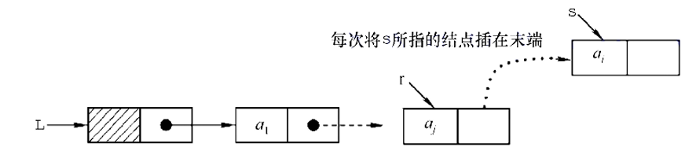

**6.采用头插法建立单链表**

​    该方法从一个空表开始，生成新结点，并将读取到的数据存到新结点的数据域中，然后将新结点插入到当前链表的表头，即头结点之后。


```c++
LinkList List_HeadInsert(LinkList &L)             // 头插法逆向建立单链表
{
    int x;                                        // 插入元素类型为整形
    L = (LNode *)malloc(sizeof(LNode));           // 创建头结点
    L->next = NULL;                               // 初始为空链表
    while (scanf("%d", &x) && x != -1) {          // 输入一个不可能取到的数表示结束
        LNode *s = (LNode*)malloc(sizeof(LNode)); // 创建新结点
        s->data = x;
        s->next = L->next;
        L->next = s;                              // 将新结点插入表中，L 为头指针
    }
    return L;
}
```

​    采用头插法建立单链表时，读入数据顺序与生成链表中元素的顺序是相反的，很容易实现**链表的逆置**。每个结点插入的时间为 O(1)，设单链表表长为 n，则总时间复杂度为 O(n)。

> [!WARNING]
>
> * 初始化链表时`L->next = NULL;`必不可少，防止 L->next 指向一些未知地方，产生未知后果。

```c
/* 不带头结点的头插法建立单链表 */
LinkList List_HeadInsert(LinkList &L)             // 头插法逆向建立单链表
{
    int x;                                        // 插入元素类型为整形
    L= NULL;                                      // 初始为空链表
    while (scanf("%d", &x) && x != -1) {          // 输入一个不可能取到的数表示结束
        LNode *s = (LNode*)malloc(sizeof(LNode)); // 创建新结点
        s->data = x;
        s->next = L;
        L = s;                                    // 将新结点插入表中，L 为头指针
    }
    return L;
}
```

.png)

**7.采用尾插法建立单链表**

​    头插法用于逆序存放链表结点，如果希望二者顺序一致可以使用尾插法。该方法将新结点插入当前链表的表尾，为此必须增加一个尾指针 r，使其始终指向当前链表的尾结点，如图所示。



带头结点的尾插法建立单链表，代码实现如下：

```c++
LinkList List_TailInsert(LinkList &L)        // 顺序建立单链表
{
    int x;                                   // 结点元素类型为整形
    L = (LNode*)malloc(sizeof(LNode));       // 创建头结点
    LNode *s, *r = L;                        // r 为表尾指针
    while (scanf("%d", &x) && x != -1) {     // 输入一个不可能取到的数表示结束
        s = (LNode*)malloc(sizeof(LNode));
        s->data = x;
        r->next = s;
        r = s;                               // r 指向新的表尾结点
    }
    r->next = NULL;                          // 尾结点指针置空
    return L;
}
```

​    因为附设了一个指向表尾结点的指针，所以时间复杂度和头插法相同。

```c++
/* 不带头结点的尾插法建立单链表 */
LinkList List_TailInsert(LinkList &L)     // 顺序建立单链表
{
    int x;                                // 结点元素类型为整形
    L = NULL;                             // 初始化头指针
    LNode *s, *r = NULL;                  // r 为表尾指针
    while (scanf("%d", &x) && x != -1 {   // 输入一个不可能取到的数表示结束
        s = (LNode*)malloc(sizeof(LNode));// 创建新结点
        s->data = x;
        s->next = NULL;
        if (L == NULL) {                  // 链表为空时，新结点作为第一个结点
            L = s;
            r = L;
        } else {                          // 链表非空时，插入尾部
            r->next = s;
            r = s;
        }
    }
    return L;
}
```

.png)

> [!TIP]
>
> * 检查清楚尾指针是否置空，并选择是内部置空还是外部置空。
> * 单链表是整个链表的基础，要熟练掌握单链表的基本操作算法和模板。在设计算法时可以通过画图方式理清算法思路，然后进行算法的编写。
