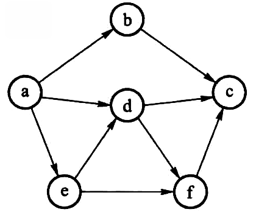

### 1.4 习题

#### 1.4.a 课后习题

**1.1 判断正误**

1. $N(logN)^2$ 是 $O(N^2)$ 的。
2. $N^2(logN)$ 和 $N(logN^2)$ 具有相同的增长速度。

解答： #复杂度的渐进表示

* 正确，其实就是证明 $(log(n))^2$ 是 $O(n)$

  要证 $(log(n))^2$ 是 $O(n)$，只需证存在常数 $C>0,  n_0>0$ 使得当 $n > n_0 $时有 $lg^2n≤C·n$

  令 $f(x) = Cx - lg^2x$，$f'(x) = C - \frac{2lgx}{xln10}$

  $∵\frac{lgx}x<1$，对 $∀x∈R，∃C>0$，使得 $f'(x)>0$，$f(x)$ 单调递增

  而 $f(1) = C > 0$，所以 $∀n > n_0 ≥ 1$ 时，$lg^2n<C·n$

  所以 $(log(n))^2$ 是 $O(n)$

  * 另一个更简单的做法：直接判断

  $$
  \lim_{x \to +\infty} \frac{x(logx)^2}{x^2} = C
  $$

  即当 $x$ 大于某个值之后，$x^2$ 是 $x(logx)^2$ 的上界，此时两者要么是同阶无穷大，要么前者是高阶无穷大。即 C 是正常数或者 C = 0。

* 错误，后者和 $2N(logN)$ 具有相同的增长速度

**1.2 填空题**

1. 给定 N×N 的二维数组 A，则在不改变数组的前提下，查找最大元素的时间复杂度是：\_\_\_。
2. 斐波那契数列 $F_N$ 的定义为：$F_0=0, F_1=1, F_N  =F_{N−1}+F_{N−2}, N=2, 3, …$。用递归函数计算 $F_N$ 的空间复杂度是___。
3. 上述斐波那契数列 $F_N$ 的时间复杂度是___。

解答： #复杂度的渐进表示 #斐波那契数列 #二叉树

* 遍历所有元素一次即可，时间复杂度 $O(N^2)$

* 空间复杂度计算比较简单，递归的**空间复杂度** = **每次递归的空间复杂度** × **递归深度**，每次递归的空间复杂度都是一个常量，所以空间复杂度主要与递归深度有关。每调用一次函数，就会申请一个内存空间保存状态，直到达到递归出口位置返回，递归深度为 n 层，所以空间复杂度为 $O(n)$（注意，函数返回时会把空间释放，所以空间是可以重复利用的）

```c
int fibonacci(int n)
{
    if (n <= 1)
        return n;
    else
        return fibonacci(n - 1) + fibonacci(n - 2);
}
```

* 时间复杂度较为复杂，下面提供两个简单证明方法

【证明一】：

$F(n) = F(n-1) + F(n - 2)$

将其中计算 $F(n)$ 的用时记为 $T(n)$，计算两数和的用时为常数 *C*。

所以 $T(n) = T(n-1) + T(n - 2) + C$

变形得 $T(n) + C = (T(n-1) + C) + (T(n - 2) + C)$

令 $A(n) = T(n) + C$，有

$A(n) = A(n-1) + A(n-2)$，这是个前两项不为 1 的斐波那契数列

假设前两项为 $a, b(a≠b)$，令 $c = max(a, b)$，

由斐波那契数列的定义知，前两项为 c 的斐波那契数列增长速度比前两项为 a、b 的快，该数列为：

​    $c、c、2c、3c、5c、...、F(n)c$

其中每项都与题给的标准斐波那契数列差常数倍，因此无论斐波那契数列的前两项是多少，都不会影响它的渐进增长率。

所以 $A(n)$ 的渐进增长率等于 $F(n)$，而 $T(n) = A(n) - C$，增长率也是一样的

所以有 $T(n)=Θ(F(n))$

事实上，由数学原理可以推导得到斐波那契数列通项公式为：

$$
F_n = \frac{1}{\sqrt{5} }[(\frac{1 + \sqrt{5} }{2})^n - (\frac{1 - \sqrt{5} }{2})^n ]
$$

所以可以得到 $T(n)=Θ((\frac{1 + \sqrt{5} }{2})^n)$，这是 $T(n)$ 的**‌渐进紧确界**。

【证明二】：

这是一个更加直观的证明方法。稍微改写一下递归代码，使之**不输出第 0 项斐波那契数列（保证叶结点不出现 F(0)）**。

```c
int fibonacci(int n)
{
    if (n <= 2)
        return 1;
    else
        return fibonacci(n - 1) + fibonacci(n - 2);
}
```

斐波那契数列的递归计算方法过程中，存在两种递归结点

* ①.第一种，**叶子结点**， F(1)，F(2) 会直接返回结果，记直接返回所需时间为 a

* ②.第二种，**非终端结点**， n>=3 时， F(n) 对 F(n−1) 与 F(n−2) 的结果进行相加，记加法与返回结果所需的所有时间为 b

​    斐波那契数列的递归树是一棵**非平衡二叉树**，递归求解斐波那契数列的叶子结点数量其实就是 F(n) 。因为**所有叶子结点的返回结果都是 1**，而递归求解相当于把所有的 1 按照不同的顺序加起来。因为没有结点被丢弃，所有的叶子结点都被加到结果中了，所以叶子结点的数量其实就是 F(n) 的计算结果。

​    而非终端结点的数量其实就是 F(n)−1 ，因为每个非终端结点都做了一次加法，无论用什么样的顺序将所有的 1 加起来，所需要的加法数量其实都是 F(n)−1 。（或利用二叉树的性质 $n_2=n_0 - 1$）

因此，一共所需要的时间为（a,b 都是常数）：

$$
T(n)=aF(n)+b(F(n)−1)=(a+b)F(n)−b
$$

所以有：$T(n)=Θ(F(n))$

**1.3 时间复杂度分析**

下列代码的时间复杂度是：____。

```c
if (A > B) {
    for (i = 0; i < N; i++)
        for (j = N * N; j > i; j--)
            A += B;
} else {
    for (i = 0; i < N*2; i++)
        for (j = N * 2; j > i; j--)
            A += B;
}
```

解答： #复杂度的渐进表示

​    条件判断 $O(1)$，第一个分支 $O(N^3)$，第二个分支 $O(N^2)$，所以最终时间复杂度是 $O(N^3)$。

**1.4 PrintN 函数算法分析**

分析两个版本的 PrintN 函数的时间、空间复杂度，并测试它们的实际运行效率。对 N = 100，1000，10000，100000 运行程序，将两个版本的 N-时间曲线绘在一张图里进行比较分析。

解答： #复杂度的渐进表示

* 循环实现，时间复杂度：$O(n)$，空间复杂度：$O(1)$
* 递归实现，时间复杂度：$O(n)$，空间复杂度：$O(n)$
* 两个版本的 N-t 图如下，长的曲线是循环实现，短的曲线是递归实现（N = 100000 时出错）。
* 注意到一个有趣的情况，当数据量为 10000 时，如果连续运行两个版本的打印函数，后执行的打印函数用时会异常显著缩短，但是如果清屏之后再执行后一个函数则恢复正常，推测终端 I/O 用时过长。所以采取单独测量用时或者打印完一次清屏或者把结果输出到文件测试结果比较准确。


**1.5 秦九韶算法与直接法的效率差别**

解答： #算法

​    见讨论 1.3

**1.6 空间复杂度分析**

最大子列和算法 MaxSubseqSum3 是用递归实现的，由于递归而产生的空间复杂度是多少？

解答： #递归 

* 这个问题是问一共递归了多少层。由于我们每次递归都把搜索范围缩小一半，也就是 *N*/2/2/2⋯ 直到得到 1，于是有公式 $N/2^k=1$，推出 $k=log_2N$，即递归最多需要 *O*(log *N*) 次，占用的空间跟递归的次数成正比，也就是 *O*(log *N*)。

**1.7 测试最大子列和 4 种算法的实际运行效率**

简单起见，可令 List 中全部整数为 1 。当 N = 2，4，6，8，10，...，28，30 时，将各算法的 N-时间曲线绘制绘制在一张图里，其中时间以毫秒为单位；当 N = 1000，2000，...，10000 时，以秒为单位绘出各算法的时间增长曲线。两幅图有什么不同？为什么？

解答： #复杂度的渐进表示


* 图二的 MaxSubseqSum1()用时差距与其他三个函数比，远远比图一更大，这是因为随着数据量的增大，时间复杂度高的算法耗时增加的速度是惊人的。

**1.8 二分查找**

本题要求实现二分查找算法

**函数接口定义**：

```c
Position BinarySearch(List L, ElementType X);
```

其中 List 结构定义如下：

```c
typedef int Position;
typedef struct LNode *List;
struct LNode {
    ElementType Data[MAXSIZE];
    Position Last; /* 保存线性表中最后一个元素的位置 */
};
```

​    L 是用户传入的一个线性表，其中 ElementType 元素可以通过 >、\==、< 进行比较，并且题目保证传入的数据是递增有序的。函数 BinarySearch 要查找 X 在 Data 中的位置，即数组下标（注意：元素从下标 1 开始存储）。找到则返回下标，否则返回一个特殊的失败标记 NotFound。

**裁判测试程序样例**：

```c
#include <stdio.h>
#include <stdlib.h>

#define MAXSIZE 10
#define NotFound 0
typedef int ElementType;

typedef int Position;
typedef struct LNode *List;
struct LNode {
    ElementType Data[MAXSIZE];
    Position Last; /* 保存线性表中最后一个元素的位置 */
};

List ReadInput(); /* 裁判实现，细节不表。元素从下标 1 开始存储 */
Position BinarySearch(List L, ElementType X);

int main()
{
    List L;
    ElementType X;
    Position P;

    L = ReadInput();
    scanf("%d", &X);
    P = BinarySearch(L, X);
    printf("%d\n", P);

    return 0;
}

/* 你的代码将被嵌在这里 */
```

**输入样例 1**：

```in
5
12 31 55 89 101
31
```

**输出样例 1：**

```out
2
```

**输入样例 2：**

```in
3
26 78 233
31
```

**输出样例 2：**

```in
0
```

---

解答： #二分查找

​    最好、最坏情况下的时间、空间复杂度见讨论 1.5。

```c
Position BinarySearch(List L, ElementType X)
{
    int ret = -1;
    int left, right;
    left = 1;
    right = L->Last;
    while (left <= right) {
        int mid = (left + right) / 2;
        if (L->Data[mid] == X) {
            ret = mid;
            break;
        } else if (L->Data[mid] > X) {
            right = mid - 1;
        } else {
            left = mid + 1;
        }
    }

    if (ret == -1)
        return NotFound;
    else
        return ret;
}
```

**1.9 有序数组的插入**

本题要求将任一给定元素插入从大到小排好序的数组中合适的位置，以保持结果依然有序。

**函数接口定义：**

```c
bool Insert(List L, ElementType X);
```

其中 List 结构定义如下：

```c
typedef int Position;
typedef struct LNode *List;
struct LNode {
    ElementType Data[MAXSIZE];
    Position Last; /* 保存线性表中最后一个元素的位置 */
};
```

​    L 是用户传入的一个线性表，其中 ElementType 元素可以通过>、\==、<进行比较，并且题目保证传入的数据是递减有序的。函数 Insert 要将 X 插入 Data[] 中合适的位置，以保持结果依然有序（注意：元素从下标 0 开始存储）。但如果 X 已经在 Data[] 中了，就不要插入，返回失败的标记 false；如果插入成功，则返回 true。另外，因为 Data[] 中最多只能存 MAXSIZE 个元素，所以如果插入新元素之前已经满了，也不要插入，而是返回失败的标记 false。

**裁判测试程序样例：**

```c
#include <stdio.h>
#include <stdlib.h>

#define MAXSIZE 10
typedef enum {false, true} bool;
typedef int ElementType;

typedef int Position;
typedef struct LNode *List;
struct LNode {
    ElementType Data[MAXSIZE];
    Position Last; /* 保存线性表中最后一个元素的位置 */
};

List ReadInput(); /* 裁判实现，细节不表。元素从下标 0 开始存储 */
void PrintList(List L); /* 裁判实现，细节不表 */
bool Insert(List L, ElementType X);

int main()
{
    List L;
    ElementType X;

    L = ReadInput();
    scanf("%d", &X);
    if (Insert(L, X) == false)
        printf("Insertion failed.\n");
    PrintList(L);

    return 0;
}

/* 你的代码将被嵌在这里 */
```

**输入样例 1：**

```in
5
35 12 8 7 3
10
```

**输出样例 1：**

```out
35 12 10 8 7 3
Last = 5
```

**输入样例 2：**

```in
6
35 12 10 8 7 3
8
```

**输出样例 2：**

```out
Insertion failed.
35 12 10 8 7 3
Last = 5
```

---

解答： #数组

* 由于给出的数组是**降序**的，所以使用折半查找并插入的方法

* 最好情况，第一个查找到的元素就是 x，所以不用插入，时间复杂度 O(1)，空间复杂度 O(1)。

* 最坏情况，遍历了所有元素都没找到 x，插入 x，此时查找用时 O(log n)，插入时数组后移用时 O(n)，时间复杂度 O(nlogn)，空间复杂度仍为 O(1)。
* 返回值：注意到只有插入成功才返回`true`，所以初始默认值就设为`false`。
* 边界条件分析：需要插入的情况即 left 指针在右，right 指针在左，此时循环体内已经判断过`x != L->Data[mid]`，于是只会有下列两种情况：
  * 如果`X < L->Data[mid]`，则插在 Data[mid]的右边，left = mid + 1， right = mid，此时位置正好是 left
  * 如果`X > L->Data[mid]`，则插在 Data[mid]处，left = mid， right = mid - 1，此时位置还是 left

* 所以用指针 left 表示插入位置就很简单（当然，认真思考就会发现，插入位置也可以表示为 right + 1）
* 接下来就是把插入位置**以及往后**全部后移一位（所以要取等号），把插入位置空出来，最后把 X 赋值进去
* 最终别忘了把数组长度增加 1，以及把标志置为`true`

```c
bool Insert(List L, ElementType X)
{
    int left, right, mid;
    int i;
    int ret = false;
    if (L->Last == MAXSIZE - 1)
        return false;
    left = 0;
    right = L->Last;
    while (left <= right) {
        mid = (left + right) / 2;
        if (X == L->Data[mid])
            break;
        else if (X > L->Data[mid])
            right = mid - 1;
        else
            left = mid + 1;
    }

    if (left > right) {
        for (i = L->Last; i >= left; i--)
            L->Data[i + 1] = L->Data[i];
        L->Data[i + 1] = X;
        L->Last++;
        ret = true;
    }

    return ret;
}
```

**1.10 试给出判断 N 是否为质数的 $O(\sqrt{N})$ 算法**

解答： #质数

```c
#include <stdio.h>
#include <math.h>
typedef long long ll;

int isprime(ll x)
{
    int ret = 1;
    for (int i = 2; i <= sqrt(x); i++) {
        if (x % i == 0) {
            ret = 0;
            break;
        }
    }
    return ret;
}
```

**1.11 试给出计算 $x^n$ 的时间复杂度为 O(log N)的算法。**

解答： #快速幂 #递归

* 很自然的想到利用二分循环或者递归来解决，看起来不难，实际马上遇到的第一个问题就是指数如果不能被 2 整除时如何处理？
* 思路是将指数转换成 2 的幂的形式之和，这样每次能被 2 整除，比如计算 ：

$$
5^{10} = 5^{(1010)_2}=5^{2^3+0+2^1+0}=5^{2^3}×5^0×5^{2^1}×5^0
$$

* 这样转换之后每一步恰好和二进制转换思路一致，一边在不断对 n mod 2，从低位取数，一边乘基转换成 result。
* 除基取余，先 mod 2 得到的是低位，如果 mod 2 不为 0，则说明对应的 2 进制位**不为 0**，开始**乘基**取整，化为十进制，如果 mod 2 为 0，则说明对应的 2 进制**为 0**，这时只需要把**底数翻倍**即可（相当于指数乘 2），不必累乘到结果中，而是为下一位的计算做准备。
* 这个问题可以衍生到经典算法——快速幂，这里不再赘述。
* 方法一：循环实现

```c
double pow(double x, int n)
{
    double temp = x;
    double result = 1;
    while (n) {
        if (n % 2)
            result = result * temp;
        n = n / 2;
        temp *= temp;   
    }
    
    return result;
}
```

方法二：递归实现

* 注意，分问题的结果都是一样的，所以要先保存 temp 变量，在 temp 处做递归，而不是在`ret = pow2(x, n / 2) * pow2(x, n / 2) * x`处做递归，如果像后面这样写的话虽然递归深度还是 O(log n) 但是每一层还要递归其它分支，产生额外的时间复杂度，最终的时间复杂度是 = 整棵递归树的结点 × O(1) = O(n)，是很低效的。

```c
double pow2(double x, int n)
{
    double ret;
    if (n == 0)
        ret = 1;
    else if (n == 1)
        ret = x;
    else {
        int temp = pow2(x, n / 2);
        if (n % 2 == 1)
            ret = temp * temp * x;
        else
            ret = temp * temp;
    }
    
    return ret;
}

```

#### 1.4.b 概论课外习题

**b.1 已知两个长度分别为 m 和 n 的升序链表，若将它们合并为长度为 m + n 的一个降序链表，则最坏情况下的时间复杂度是（   ）。**

A. O(n)    B. O(mn)   C. O(min(m, n))    D. O(max(m, n))

解答： #链表归并  

* 合并成升序链表还是降序链表没有影响，只不过合并成升序用尾插法，现在改用头插法生成链表而已。
* 时间复杂度与元素之间的**比较次数**有关
* 最好情况是短链表在前，而且元素都比长链表大，此时比较完短链表之后，剩下的长链表直接用头插法连上去即可，时间复杂度 O(min(m, n))。
* 最坏情况是仅仅只有一个元素是最后直接连上去的，剩下的所有元素都比较一次之后才加入，所以时间复杂度是 O(m+n-1)，而 m + n - 1 < 2 * max(m, n)，所以时间复杂度为 O(max(m, n))。
* 如果 m 和 n 都是无序链表，则最坏情况下比较次数会大大提高，有可能每个元素都要和其他元素比较一次才能确定大小关系，此时，时间复杂度会达到二次级别，B 选项是无序链表合并才可能产生的时间复杂度。


**b.2 【2022 统考真题】下列程序段的时间复杂度是（   ）**

```c
int sum = 0;
for (int i = 1; i < n; i *= 2)
    for (int j = 0; j < i; j++)
        sum++;
```

A. O(logn)    B. O(n)    C. O(nlogn)    D. O(n^2^)

解答： #复杂度的渐进表示

* 这种问题属于第一种类型：**循环主体的变量参与循环条件的判断**，有个通用方法，就是把**基本操作次数记为 k** 。
* 大部分时候是把最内层操作记为 k，但本题可以设外层循环执行了 k 次，这样内层循环就是整数，比较好算。
* 外层循环的 i 的取值为 $i=1,2,4,...,2^k(2^k<n)$，内层循环基本语句执行，对于每个 i ，都要执行 i 次，也就是总循环次数等于外层循环取值求和，这个是个等比数列求和，最后算出来是 $2^{k+1}-1$ 次，小于 2n，所以时间复杂度为 O(n)。

$$
S_n=\frac{a_1(1-q^n)}{1-q}(q≠1,n\text{为项数})
$$

**b.2(变式) 【2014 统考真题】下列程序段的时间复杂度是**

```c
count = 0;
for (k = 1; k <= n; k *= 2)
    for (j = 1; j <= n; j++)
        count ++
```

解析： #复杂度的渐进表示

​    设最外层循环 t 次，所以 $2^t=n→t=log_2n$

​    内层循环次数为 n 次，所以总的循环次数为 $nlog_2n$，时间复杂度：$O(nlog_2n)$

**b.3 一个算法所需时间由下述递归方程表示，试求出该算法的时间复杂度的级别（或阶）**

$$
T(n) =  \begin{cases}    1, & n = 1 \\2T(n/2)+n, & n > 1 \end{cases}
$$

​    其中，n 是问题的规模，为简单起见，设 n 是 2 的整数次幂。

解答： #递归

* 本题属于第二类问题，**循环主体中的变量与循环条件无关**，采用数学归纳法或者直接统计循环次数。

* 递推程序一般用公式递推，这里公式已经给出，直接找规律化简即可。
* $T(n) = 2^2T(n/2^2)+ n + n = ...=2^kT(1) + kn = n + nlogn$(其中，$n / 2^k = 1$)
* $O(n + nlogn) = O(nlogn)$

**b.3(变式) 下列函数代码的时间复杂度是**

```c
int Func(int n){
    if (n == 1) return 1;
    else return 2 * Func(n / 2) + n;
}
```

解析： #复杂度的渐进表示

​    每一层其实只做了一件事，所以看递归层数知道时间复杂度为：$O(log_2n)$

​    注意与上一题的区别，上一题是直接给出渐进表达式的递推公式。

**b.4 求解斐波那契数列**

$$
F(n) =  \begin{cases}    0, & n = 0 \\ 1, & n = 1 \\F(n-1)+F(n-2), & n > 1 \end{cases}
$$

有两种常用的算法：递归算法和非递归算法。试分别分析两种算法的时间复杂度。

解析： #斐波那契数列 #递归 #迭代

```c
/* 斐波那契数列非递归写法 */
int fib_iter(int n)
{
    int t0, t1, t;
    t0 = 0; t1 = 1; t = n;
    while (n > 1){
        t = t0 + t1;
        t0 = t1;
        t1 = t;
        n --;
    }
    return t;
}
/* 斐波那契数列递归写法 */
int fib_rec(int n)
{
    if (n == 0)
        return 0;
    else if (n == 1)
        return 1;
    else
        return fA(n - 1) + fA(n - 2);
}
```

​    非递归写法时间复杂度分析属于之前提到的第一类问题，循环主体参与循环条件判断，循环次数和 n 相同，时间复杂度很容易看出来是：$O(n)$。

​    递归写法时间复杂度分析属于之前提到的第二类问题，要用数学归纳法判断或者直接累计次数。由于本题没有给出关于 T(n) 的表达式，所以采用直接累计次数的方法。习题 1.2 部分已经用两种方法说明过了，时间复杂度为：$O(2^n)$(非紧界)


### 2.2 习题

#### 2.2.a1 数据结构实现基础

**2.1 【PTA 浙大版《数据结构（第 2 版）》题目集 下同】简单计算器**

​    模拟简单运算器的工作。假设计算器只能进行加减乘除运算，运算数和结果都是整数，四种运算符的优先级相同，按从左到右的顺序计算。

​    输入在一行中给出一个四则运算算式，没有空格，且至少有一个操作数。遇等号“=”说明输入结束。在一行中输出算式的运算结果，或者如果除法分母为 0 或有非法运算符，则输出错误信息“ERROR”。

解析： #分支结构 #online_judge 

​    算法思想：读取“操作数、操作符、操作数”，根据操作符的不同选择不同的运算，结果作为新的左操作数，直到遇到等号为止。如果遇到除 0、或者操作符不为四则运算的时候返回 ERROR。

```c
#include <stdio.h>

int main()
{
    int a, b;
    char c;
    scanf("%d", &a);
    scanf("%c", &c);
    
    int res = a;
    int flag = 0;


    while (c != '=') {
        scanf("%d", &b);
        if (c == '+') {
            res = a + b;
        } else if (c == '-') {
            res = a - b;
        } else if (c == '*') {
            res = a * b;
        } else if (c == '/') {
            if (b == 0) {
                flag = 1;
                break;
            } else {
                res = a / b;
            }
        } else {
            flag = 1;
        }
        a = res;
        scanf("%c", &c);
    }

    if (flag == 1)
        printf("ERROR\n");
    else
        printf("%d", res);
    
    return 0;
}
```

> [!NOTE]
> 
> * scanf() 返回值是**成功读取的变量个数**，所以 while 条件判断不可以写成`scanf("%c", &c) != '='`。
> * 时间复杂度：$O(n)$，空间复杂度：$O(1)$。

**2.2 数组循环左移**

​    本题要求实现一个对大小为 n 的整数数组进行循环左移 m 位的简单函数。如：1,2,3,4,5,6,7,8 循环左移三位后结果是：4,5,6,7,8,1,2,3。

解析： #逆置 #online_judge

​    算法思想：不借助额外数组的情况，就采用原地工作的算法，左移 m 位等价于前 m 位逆置，后 n-m 位逆置，最后再整体逆置。

```c
#include <stdio.h>

void ArrayReverse(int A[], int left, int high)
{
    if (left >= high)
        return ;
    int len = high - left;
    int temp;
    for (int i = 0; i <= len / 2; i++) {
        temp = A[left + i];
        A[left + i] = A[high - i];
        A[high - i] = temp;
    }
}

int main()
{
    int n, m;
    scanf("%d %d", &n, &m);
    int a[n];
    
    m = m % n;
    for (int i = 0; i < n; i++) {
        scanf("%d", &a[i]);
    }
    ArrayReverse(a, 0, m - 1);
    ArrayReverse(a, m, n - 1);
    ArrayReverse(a, 0, n - 1);

    for (int i = 0; i < n; i++) {
        printf("%d", a[i]);
        if (i != n - 1)
            printf(" ");
    }

    return 0;
}
```

> [!NOTE]
> 
> * 注意 ArrayReverse() 函数内部 for 循环 i <= len / 2，要取等号保证最中间的两个数也处理。
> * 注意 ArrayReverse() 函数，当边界不符合要求时要及时返回，避免段错误。
> * 时间复杂度：$O(n)$，除了给定数组之外的空间复杂度：$O(1)$。

**2.3 数列求和-加强版**

请编写 C 或者 C++ 程序，在时间复杂度尽可能小的前提下，输入整数 n 和 a，输出下面等式的结果（0≤n≤100000，1≤a≤9）：

$$
S = a + aa + aaa + aaa\dots a(n 个 a)
$$

解析： #online_judge #大整数

​    算法思想：根据数位特点直接从低位开始计算每一位的和并处理进位，然后最高位有进位单独处理，**没有则将刚刚存入数组的数位逆序输出即得答案**。

```c
#include <stdio.h>
#define MAXN 100001                      // 根据题目 n 的范围调整

int main() {
    int a, n;
    int arr[MAXN] = {0};                 // 初始化数组为 0
    int carry = 0;                       // 进位
    scanf("%d %d", &a, &n);
    
    if (n == 0) {
        printf("0");
        return 0;
    }
    
    for (int i = 0; i < n; i++) {        // 计算每一位的和并处理进位
        int total = (n - i) * a + carry;
        arr[i] = total % 10;
        carry = total / 10;
    }
    
    if (carry > 0)                       // 处理最高位的进位
        printf("%d", carry);
    
    for (int i = n - 1; i >= 0; i--)     // 逆序输出数组中的每一位
        printf("%d", arr[i]);
    
    return 0;
}
```

> [!NOTE]
> 
> * 由于最后一个数有可能有 100000 位，所以 C 语言正常数据类型都没法处理，如果你想的比较复杂，用**高精度加法**来做，时间复杂度：$O(n^{2})$，还是太高了，OJ 平台最后一个数据点没法通过。
> * 本题算法的时间复杂度：$O(n)$，空间复杂度：$O(n)$。
> * 处理数据**从低位开始**，这样进位比较好处理，最后将数组逆序输出。

**2.4 递增的整数序列链表的插入**

​    本题要求实现一个函数，在递增的整数序列链表（带头结点）中插入一个新整数，并保持该序列的有序性。

​    **裁判程序如下：**

```c
#include <stdio.h>
#include <stdlib.h>

typedef int ElementType;
typedef struct Node *PtrToNode;
struct Node {
    ElementType Data;
    PtrToNode   Next;
};
typedef PtrToNode List;

List Read(); /* 细节在此不表 */
void Print( List L ); /* 细节在此不表 */

List Insert( List L, ElementType X );

int main()
{
    List L;
    ElementType X;
    L = Read();
    scanf("%d", &X);
    L = Insert(L, X);
    Print(L);
    return 0;
}

/* 你的代码将被嵌在这里 */
```

解析： #单链表  #online_judge

​    算法思想：设置工作指针 p，遍历链表，其后继小于 X 则同步移动指针，直到找到大于 X 的位置或者遍历完整个链表，申请一个结点 s，将 s 插入 p 指针所指结点之后。

```c
List Insert(List L, ElementType X)
{
    List p = L;
    while (p->Next != NULL && p->Next->Data < X)   // 遍历完整个链表或者找到插入位置，结束循环
        p = p->Next;
    List s = (List)malloc(sizeof(struct Node));    // 申请新结点
    s->Data = X;
    s->Next = p->Next;                             // 插入新结点
    p->Next = s;

    return L;
}
```

> [!WARNING]
> 
> * L 不会为 NULL，所以不会有空指针解引用的问题，开头加上`L == NULL`直接返回也不会有问题。
> * 注意边界条件，应该先找位置后插入，而不是在循环内插入然后 break，这样可以处理遍历结束都找不到插入位置的情况，即**插入位置在链尾的情况**。
> * 几个 typedef 之间的关系：`List s = (List)malloc(sizeof(struct Node));`不可以写成`List s = (List)malloc(sizeof(List));`，这是因为`typedef struct Node *PtrToNode;`定义了指向结构体的指针变量 PtrToNode，而`typedef PtrToNode List;`意味着 List 和 PtrToNode 是一样的指针变量，所以 sizeof(List) 是一个指针大小而非结构体大小。
> * OJ 平台上的调试结果：sizeof(List) = 8，sizeof(int) = 4，sizeof(PtrToNode) = 8，sizeof(struct Node) = 16
> * 如果 malloc() 分配的内存空间比实际结点的结构体所占大，则会掩盖存在的问题，代码不会出错，但这不代表代码逻辑正确。

**2.5 【PTA 习题集、AcWing 3639 贵州大学考研机试题】两个有序链表序列的合并**

​    本题要求实现一个函数，将两个链表表示的递增整数序列合并为一个非递减的整数序列。

**裁判测试程序样例：**

```c
#include <stdio.h>
#include <stdlib.h>

typedef int ElementType;
typedef struct Node *PtrToNode;
struct Node {
    ElementType Data;
    PtrToNode   Next;
};
typedef PtrToNode List;

List Read(); /* 细节在此不表 */
void Print( List L ); /* 细节在此不表；空链表将输出 NULL */

List Merge( List L1, List L2 );

int main()
{
    List L1, L2, L;
    L1 = Read();
    L2 = Read();
    L = Merge(L1, L2);
    Print(L);
    Print(L1);
    Print(L2);
    return 0;
}

/* 你的代码将被嵌在这里 */
```

**输入/输出样例：**

```in
3
1 3 5
5
2 4 6 8 10
```

```out
1 2 3 4 5 6 8 10 
NULL
NULL
```

解析： #链表归并  #online_judge

​    算法思想：申请一个新结点 L 作为表头，一个指针 r 指向尾部结点，设置工作指针 p、q 分别遍历两个链表，对比所指两个结点大小，将小的那个结点利用尾插法连接到新表 L 尾部，处理完其中一个链表，将剩哪个长链表连接到 L 尾部，然后让尾指针和两个旧表头指向 NULL，两个旧表头结点置空。

```c
List Merge(List L1, List L2)
{
    List p = L1->Next, q = L2->Next, r;    // 设工作指针分别为 p 和 q

    List L = (List)malloc(sizeof(struct Node));
    r = L;
    
    while (p != NULL && q != NULL) {
        if (p->Data < q->Data) {
            r->Next = p;
            r = p;
            p = p->Next;
        } else {
            r->Next = q;
            r = q;
            q = q->Next;
        }
    }
    while (p) {
        r->Next = p;
        r = p;
        p = p->Next;
    }
    while (q) {
        r->Next = q;
        r = q;
        q = q->Next;
    }
    r->Next = NULL;
    L1->Next = NULL;
    L2->Next = NULL;
    
    return L;
}
```

> [!NOTE]
> 
> * 发现了吗，最后**两个 while 循环 + 尾指针置空语句**可以用一句`r->Next = (p? p: q);`替代，这是链表相比于顺序表的优势。
> * 时间复杂度：$O(n)$，空间复杂度：$O(1)$。
> * 如果是 L1，L2 是不带头结点的单链表，可以在 while 循环前进行 L 首结点的选取，这样就转换为带头结点的单链表。

**2.6 递归求简单交错幂级数的部分和**

​    本题要求实现一个函数，计算下列简单交错幂级数的部分和：

$$
f(x,n)=x-x^2+x^3-x^4+\dots+(-1)^{n-1}x^n,(n>0)
$$

​    其中题目保证传入的`n`是正整数，并且输入输出都在双精度范围内。函数`fn`应返回上述级数的部分和。

**裁判程序样例：**

```c
#include <stdio.h>

double fn( double x, int n );

int main()
{
    double x;
    int n;
    
    scanf("%lf %d", &x, &n);
    printf("%.2f\n", fn(x,n));
    
    return 0;
}

/* 你的代码将被嵌在这里 */
```

解析： #递归 #online_judge

​    算法思想：递归出口`n == 1`时结束递归，递归式子：`f(x, n) = x * (1 - fn(x, n - 1))`，根据递归出口和递归式子写出递归函数。

```c
double fn(double x, int n)
{
    if (n > 1)
        return x * (1 - fn(x, n - 1));
    else 
        return x;
}
```

> [!NOTE]
> 
> * 上面的递归算法时间复杂度：$O(n)$，空间复杂度：$O(n)$。
> * 下面这种写法看似像递归方法，但因为**没有认真想清楚简洁的递归式子**，导致还需要借助幂函数才能实现，不是题目的本意。下面递归函数的递归式子：$f(x,n)=f(x,n-1)+(-1)^{n-1}x^n$，此时时间复杂度为：$O(n^2)$，空间复杂度为：$O(n)$。
>
> ```c
> #include <math.h>
> 
> double fn(double x, int n)
> {
>     double ret;
>     if (n > 1)
>         ret = fn(x, n - 1) + pow(-1, n - 1) * pow(x, n);
>     else 
>         ret = x;
>     return ret;
> }
> ```

**2.7 弹球距离**

​    设有一个球从高度为 h 米的地方落下，碰到地面后又弹到高度为原来 p 倍的位置，然后又落下，再弹起，再落下…。请编写函数求初始高度为 h 的球下落后到基本停下来（高度小于给定阈值 TOL）时在空中所经过的路程总和。

​    其中`h`是球的初始高度，`p`是球弹起高度与弹起前落下高度的比值；函数`dist`要返回球下落后到基本停下来时在空中所经过的路程总和。注意：当弹起的高度小于裁判程序定义的常数`TOL`时，弹起的距离不计算在内。

**裁判程序样例：**

```c
#include <stdio.h>
#define TOL 1E-3

double dist( double h, double p );

int main()
{
    double h, p, d;
    scanf("%lf %lf", &h, &p);
    d = dist(h, p);
    printf("%.6f\n", d);
    return 0;
}

/* 你的代码将被嵌在这里 */
```

**输入/输出样例：**

```in
1.0 0.4

```

```out
2.331149

```

解析： #实际问题 #online_judge

​    算法思想：第一段下落距离为 h，当回弹距离小于 TOL，总路程加上两倍 p×h，直到回弹距离小于 TOL 为止，返回总路程。

```c
double dist(double h, double p)
{
    double s = h;
    while (p * h > TOL) {
        s += 2 * p * h;
        h = p * h;
    }
    return s;
}
```

**2.8 输出全排列**

​    请编写递归函数，按**字典序**输出 1,2,3，...，n 的**全排列**（n 小于 10），并观察 n 逐步增大时程序的运行时间。

解析： #online_judge #medium #回溯 #字典序 #DFS #代码模板 

​    预备知识：**回溯法**是一种通过探索所有可能的候选解来找出所有的解的算法。如果候选解被确认不是一个解（或者至少不是最后一个解），回溯算法会通过在上一步进行一些变化抛弃该解，即回溯并且再次尝试。

​    算法思想：设置 current 数组用来保存当前生成的排序序列，用 used 数组来标记数字是否使用过，从低位开始生成全排列序列，全部位数都填满时从 current 数组输入全排列序列，否则从数字 1 开始遍历，如果该数字没使用过，就存入 current 数组并将该数字的 used 数组置为 1，然后递归填充下一位，填充完毕后回溯当前分支填充的对应数字的 used 数组，直至全部可能可能的数字填充完毕。示意图如下：


```c
#include <stdio.h>

int n;                            // 输入的全排列数字范围（1~n）
int current[10];                  // 保存当前生成的排列序列
int used[10] = {0};               // 标记数字是否已被使用，0 未用 / 1 已用

void print_perm() {               // 打印当前生成的排列
    for (int i = 1; i <= n; i++) {
        printf("%d", current[i]); // 逐个打印排列中的数字
    }
    printf("\n");                 // 换行分隔不同排列
}

void generate(int pos) {          // 递归生成全排列的核心函数
    if (pos == n + 1) {           // pos: 当前正在填充的位置（从 1 开始）
        print_perm();             // 输出当前完整的排列
        return;
    }

    for (int num = 1; num <= n; num++) {  // 按升序遍历所有数字（保证字典序的关键）
        if (!used[num]) {
            used[num] = 1;                // 标记为已使用
            current[pos] = num;           // 将当前数字放入排列的 pos 位置
            generate(pos + 1);            // 递归填充下一位
            used[num] = 0;                // 回溯，完成该分支后取消标记，不需要重置 current[pos]，因为会被后续覆盖
        }
    }
}

int main() {
    scanf("%d", &n);    // 读取输入的 n 值
    generate(1);        // 从第 1 个位置开始生成排列
    return 0;
}
```

> [!IMPORTANT]
> 
> * **字典序实现原理**：
>   * ①每次递归从数字 1 开始**升序**选择可用数字
>   * ②通过`used`数组确保每个数字只使用一次
> * **回溯逻辑**：
>   * ①递归调用`generate(pos + 1)`后立即执行`used[num] = 0`恢复状态
>   * ②不需要重置`current[pos]`，因为该位置会被后续循环覆盖
> * 时间复杂度：$O(n\times n!)$，也是**全排列问题的固有复杂度**，空间复杂度，即递归栈深度：$O(n)$。
> * 由运行程序结果以及以上时间复杂度分析可知，随着位数 n 的增大，所用时间会急剧增加。

**2.9 【浙大版《数据结构（第 2 版）》题目集 练习 7.1】递归排序**

​    请思考一下，是否可以设计一个递归过程，实现对 n 个整数的排序。可以考虑两种不同的递归过程：

* (1)将 n 个整数的排序问题转换为对 n-1 个整数排序问题的递归；
* (2)将 n 个整数的排序问题转换为对两个 n/2 个整数排序问题的递归。

**裁判函数样例：**

```c
#include <stdio.h>

int main()
{
    int n;
    scanf("%d", &n);
    int a[n];
    for (int i = 0; i < n; i++) {
        scanf("%d", &a[i]);
    }

    RecursiveSelectionSort(a, n - 1);     /* 裁判程序会选择一个函数验证 */
    MergeSort(a, 0, n - 1);
    
    for (int i = 0; i < n; i++) {
        printf("%d", a[i]);
        if (i != n - 1)
            printf(" ");
    }
    
    return 0;
}
```

解析： #分治 #递归 #归并 #online_judge #代码模板 #减治

问题(1)：**递归减治法（Reduce and Conquer）**--> **递归选择排序**

​    算法思想：从 n 个数中选一个最大的数和末尾元素交换，然后对 n-1 个数递归执行上述过程，直到问题规模变为 0。

​    时间复杂度：$O(n^2)$，空间复杂度：$O(n)$。

```c
void RecursiveSelectionSort(int a[], int n)
{
    if (n <= 0)                        // 递归出口
        return ;
    int max_index = 0;                 // 最大值下标
    
    for (int i = 1; i <= n; i++) {     // 寻找最大值下标
        if (a[i] > a[max_index])
            max_index = i;
    }
    int tmp = a[n];                    // 将最大值交换到末尾
    a[n] = a[max_index];
    a[max_index] = tmp;
    
    RecursiveSelectionSort(a, n - 1);  // 递归处理前 n-1 个元素
}
```

问题(2)：**分治法（Divide and Conquer）**--> **归并排序**

​    算法思想：将区间分为两半，递归排序左半和右半区间，优先取左半区间小的或者相等的元素存入临时数组，左或右区间剩余元素则直接全部放入临时数组，最后将临时数组写回原数组。

 时间复杂度：$O(nlogn)$，空间复杂度：$O(n)$，具体代码实现如下（**代码模板**）：

```c
void MergeSort(int a[], int l, int r)
{
    if (l >= r) return;
    int tmp[r - l + 1];

    int mid = (l + r) >> 1;
    MergeSort(a, l, mid);                     // 递归处理左半区间
    MergeSort(a, mid + 1, r);                 // 递归处理右半区间
    
    int k = 0, i = l, j = mid + 1;
    while (i <= mid && j <= r)                // 双指针合并有序区间
        if (a[i] <= a[j]) tmp[k++] = a[i++];  // 稳定排序：当元素相等时优先取左半部分
        else tmp[k++] = a[j++];
    
    while (i <= mid) tmp[k++] = a[i++];       // 处理左区间剩余元素
    while (j <= r) tmp[k++] = a[j++];         // 处理右区间剩余元素
    
    for (i = l, j = 0; i <= r; i++, j++) a[i] = tmp[j];  // 将排序结果从临时数组写回原数组
}
```

示意图如下（以 11 个数据为例）：


> [!NOTE]
> 
> * RecursiveSelectionSort(a, n)实际上是对 n+1 个数进行排序，调用函数时注意不要下标越界。
> * 归并排序中，限制`i`不超过`mid`是为了严格区分左右子数组的边界，确保合并过程仅访问合法范围内的元素，从而保证算法的正确性和稳定性。
> * 归并排序的**最坏情况**，是每次合并两个子数组时，它们的元素交替出现，此时比较次数最多。
> * 递归过程难以理解可以用手工模拟、或者 printf 大法调试。
> * **归并排序**在分解数组时，会先递归地将左半部分不断拆分，直到分解为单个元素（触底），然后再回溯处理右半部分，最后逐层合并，这一点有点像**深度优先搜索**算法。不要误以为分解是同时分解左右区间，实际上是先分解左区间到最深处，然后再回头分解右区间。

#### 2.2.a2 基础实验

**基础实验 2-2.1 整数的分类处理**

给定 N 个正整数，要求你从中得到下列三种计算结果：

* A1 = 能被 3 整除的最大整数
* A2 = 存在整数 K 使之可以表示为 3K+1 的整数的个数
* A3 = 存在整数 K 使之可以表示为 3K+2 的所有整数的平均值（精确到小数点后 1 位）

**输入格式：**

输入首先在第一行给出一个正整数 N，随后一行给出 N 个正整数。所有数字都不超过 100，同行数字以空格分隔。

**输出格式：**

在一行中顺序输出 A1、A2、A3 的值，其间以 1 个空格分隔。如果某个数字不存在，则对应输出 NONE。

**输入样例 1：**

```c
8
5 8 7 6 9 1 3 10
```

**输出样例 1：**

```c
9 3 6.5
```

**输入样例 2：**

```c
8
15 18 7 6 9 1 3 10
```

**输出样例 2：**

```c
18 3 NONE
```

解析： #online_judge  #快乐模拟

​    算法思想：A1 是能被 3 整除的最大数，A2 是能被 3 整除余 1 的数的个数，A3 是能被 3 整除余 2 的数的平均值。注意避免除零错误，以及输出 0 的处理。

```c
#include <stdio.h>

int main()
{
    int A1, A2;
    double A3;
    int n, cnt;
    scanf("%d", &n);
    int a[n];
    for (int i = 0; i < n; i++)
        scanf("%d", &a[i]);
    A1 = A2 = A3 = cnt = 0;
    for (int i = 0; i < n; i++) {
        if (a[i] % 3 == 0 && a[i] > A1) {
            A1 = a[i];
        } else if (a[i] % 3 == 1) {
            A2++;
        } else if (a[i] % 3 == 2) {
            A3 += a[i];
            cnt++;
        }
    }
    if (cnt != 0)
        A3 = A3 / cnt;

    if (A1 == 0)
        printf("NONE ");
    else
        printf("%d ", A1);
    if (A2 == 0)
        printf("NONE ");
    else
        printf("%d ", A2);
    if (A3 == 0)
        printf("NONE");
    else
        printf("%.1f\n", A3);
    
    return 0;
}
```

**基础实验 2-2.2 求集合数据的均方差**

设计函数求 N 个给定整数的均方差。（输入数据 A[i] 保证是正整数）

$$
\sqrt{ \frac{1}{n} \sum_{i=1}^{n} (A_i - \mathrm{avg})^2}
$$

解析： #快乐模拟 #online_judge 

```c
#include <stdio.h>
#include <math.h>

int main()
{
    int n;
    scanf("%d", &n);
        
    int a[n];
    double avg = 0, s = 0;
    for (int i = 0; i < n; i++) {
        scanf("%d", &a[i]);
        avg += a[i];
    }
    avg /= n;
    for (int i = 0; i < n; i++) 
        s += (a[i] - avg) * (a[i] - avg);
    
    s = sqrt(s / n);
    printf("%.5f\n", s);
    
    return 0;
}

```

**基础实验 2-2.3 组合数的和**

给定 N 个非 0 的个位数字，用其中任意 2 个数字都可以组合成 1 个 2 位的数字。要求所有可能组合出来的 2 位数字的和。例如给定 2、5、8，则可以组合出：25、28、52、58、82、85，它们的和为 330。

解析： #online_judge 

​    算法思想：两个数不是同一个数的数，一个数做十位，一个数做个位，然后循环求两数和。

```c
#include <stdio.h>

int main()
{
    int n;
    scanf("%d", &n);
    int a[n], sum = 0;
    for (int i = 0; i < n; i++) {
        scanf("%d", &a[i]);
    }

    for (int i = 0; i < n; i++) {
        for (int j = 0; j < n; j++)
            if (i != j)
                sum += a[i] * 10 + a[j];
    }
    printf("%d\n", sum);

    return 0;
}
```

**基础实验 2-2.4 装箱问题**

假设有 N 项物品，大小分别为 $s_1​、s_2​、…、s_i​、…、s_N$，其中 $s_i$ ​为满足 $1≤s_i​≤100$ 的整数。要把这些物品装入到容量为 100 的一批箱子（序号 1-N）中。装箱方法是：对每项物品, 顺序扫描箱子，把该物品放入足以能够容下它的第一个箱子中。请写一个程序模拟这种装箱过程，并输出每个物品所在的箱子序号，以及放置全部物品所需的箱子数目。

**输入格式：**

输入第一行给出物品个数 N（≤1000）；第二行给出 N 个正整数 $s_i$ ​（$1≤s_i​≤100$，表示第 i 项物品的大小）。

**输出格式：**

按照输入顺序输出每个物品的大小及其所在的箱子序号，每个物品占 1 行，最后一行输出所需的箱子数目。

**输入样例：**

```in
8
60 70 80 90 30 40 10 20
```

**输出样例：**

```out
60 1
70 2
80 3
90 4
30 1
40 5
10 1
20 2
5
```

解析： #online_judge 

​    算法思想：为货品新建一个数组 a，为箱子新建一个数组 b，初始化两个数组，之后从数组 a 中第一个货品开始选，然后遍历数组 b 中的箱子装，如果容量足够，则装入、输出结果并更新容量，更新目前所用的箱子，容量不足则继续试下一个箱子，直到所有货品都遍历完毕结束，输出所需箱子数。

​    时间复杂度：$O(n^2)$，空间复杂度：$O(n)$。

```c
#include <stdio.h>

int main()
{
    int N, i, j, cnt = 0;
    scanf("%d", &N);
    int a[N], b[N];
    for (i = 0; i < N; i++) {
        scanf("%d", &a[i]);
        b[i] = 0;
    }
    for (i = 0; i < N; i++) {
        for (j = 0; j < N; j++) {
            if (a[i] <= 100 - b[j]) {
                b[j] += a[i];
                printf("%d %d\n", a[i], j + 1);
                if (j + 1 > cnt)
                    cnt = j + 1;
                break;
            }
        }
    }
    printf("%d", cnt);

    return 0;
}

```

**基础实验 2-2.5 整数分解为若干项之和**

将一个正整数 N 分解成几个正整数相加，可以有多种分解方法，例如 7=6+1，7=5+2，7=5+1+1，…。编程求出正整数 N 的所有整数分解式子。

**输入格式：**

每个输入包含一个测试用例，即正整数 N (0<N≤30)。

**输出格式：**

按递增顺序输出 N 的所有整数分解式子。递增顺序是指：对于两个分解序列 $N_1​={n_1​,n_2​,⋯}$ 和 $N_2​={m_1​,m_2​,⋯}$，若存在 $i$ 使得 $n_1​=m_1​,⋯,n_i​=m_i$，但是 $n_{i+1​}<m_{i+1​}$,则 $N1$ ​序列必定在 $N2$ 序列之前输出。每个式子由小到大相加，式子间用分号隔开，且每输出 4 个式子后换行。

**输入样例：**

```in
7
```

**输出样例：**

```out
7=1+1+1+1+1+1+1;7=1+1+1+1+1+2;7=1+1+1+1+3;7=1+1+1+2+2
7=1+1+1+4;7=1+1+2+3;7=1+1+5;7=1+2+2+2
7=1+2+4;7=1+3+3;7=1+6;7=2+2+3
7=2+5;7=3+4;7=7
```

解析： #online_judge #回溯 #递归 #DFS #减治 #剪枝 #代码模板 

​    算法思想：

* **递归分解逻辑**：
  * `dfs`函数通过`index`记录当前分解项的位置，`start`确保分解项递增，`remain`表示剩余待分解的数值。
  * 每次递归从`start`到`remain`选择当前分解项，并继续分解剩余值。
* **格式控制**：
  * 每输出 4 个分解式后换行，通过全局变量`cnt`计数。
  * 若分解式的最后一项是`n`（即`n = n`的分解式），则直接换行，避免多余分号。

```c
#include <stdio.h>

int n, a[30], cnt = 0;

void dfs(int start, int remain, int index) 
{
    if (remain == 0) {
        printf("%d=%d", n, a[0]);
        for (int i = 1; i < index; i++) {  // 输出分解式
            printf("+%d", a[i]);
        }
        cnt++;
        if (cnt % 4 == 0 || a[0] == n)     // 格式处理
            printf("\n");
        else
            printf(";");
        return;
    }
    
    for (int i = start; i <= remain; i++) {// 寻找可能的组合
        a[index] = i;
        dfs(i, remain - i, index + 1);
    }
}

int main() 
{
    scanf("%d", &n);
    dfs(1, n, 0);
    return 0;
}
```

> [!NOTE]
> 
> * 时间复杂度：$O(P(n))$（其中 $P(n)$ 为**正整数分拆函数**），空间复杂度：$O(n)$。
> * **递增顺序生成**：通过`start`参数确保分解项递增，符合题目要求的字典序。
> * **高效存储**：仅使用固定大小的数组存储分解项，无需动态内存。
> * **简洁输出**：通过条件判断直接控制分号和换行，不用借助字符串处理等库函数。
> * **回溯剪枝**：虽然代码没有显式回溯操作，但通过覆盖数组`a`的当前位置隐式实现了状态回退，参数`start`传递当前允许的最小值，确保分解项按非递减顺序排列，循环条件`i <= remain`直接排除超过剩余值的无效选择，避免无意义递归。
> * 注：直接套用前面全排列问题的回溯模板也可以做出来，dfs()函数同样只需要一个参数即可。

#### 2.2.a3 进阶实验

**进阶实验 2-3.1 海盗分赃**

P 个海盗偷了 D 颗钻石后来到公海分赃（3≤P≤D≤100），一致同意如下分赃策略：

首先，P 个海盗通过抽签决定 1 - P 的序号。然后由第 1 号海盗提出一个分配方案（方案应给出每个海盗分得的具体数量），如果能够得到包括 1 号在内的绝对多数（即大于半数）同意，则按照该分配方案执行，否则 1 号将被投入大海喂鲨鱼；而后依次类似地由第 2 号、第 3 号等等海盗提出方案，直到能够获得绝对多数同意的方案出现为止，或者只剩下最后一位海盗，其独占所有钻石。请编写一个程序，给出第 1 号海盗的钻石分配方案中自己分得的钻石数量。

附带的三个假定：

* “聪明”与“贪婪”假定：每个海盗总能够以本人利益最大化作为行为准则；
* “人性化”假定：在能够取得尽量多钻石的情况下，海盗不会故意致同伙于死地；
* “无偏见”假定：海盗之间没有个人恩怨，分给其他海盗钻石的次序以小序号优先为原则。

输入/输出样例：P=7，D=10 时，1 号海盗分 6 颗。

解析： #online_judge #递推 #博弈论

​    算法思想：由题意可知，计算的过程应该是反向进行的，即从只剩 2 人的分配方案，推算只剩 3 人的分配方案，直至剩 P 个人（即第 1 号海盗）的分配方案。以海盗人数 P=7，钻石数量 D=10 为例，看反向递推思维的过程如下表。

| 剩余人数/分钻石数 |  1  |  2  |  3  |  4  |  5  |  6  |  7  |
| :-------: | :-: | :-: | :-: | :-: | :-: | :-: | :-: |
|     2     |     |     |     |     |     |  0  | 10  |
|     3     |     |     |     |     |  9  |  1  |  0  |
|     4     |     |     |     |  7  |  0  |  2  |  1  |
|     5     |     |     |  7  |  0  |  1  |  0  |  2  |
|     6     |     |  6  |  0  |  1  |  2  |  1  |  0  |
|     7     |  6  |  0  |  1  |  2  |  0  |  0  |  1  |

* 剩 2 人：如果只剩最后两个海盗 6 号和 7 号，7 号海盗将得到全部 10 颗钻石，因为七号不拿到 10 颗钻石肯定会反对 6 号的提议，这时 6 号不仅得不到钻石，还会被丢进海里。
* 剩 3 人：6 号海盗为了不发生上面的情况，5 号海盗只要给 6 号一颗钻石，他就会同意，7 号也就一颗都没有了（因为不需要他同意已经可以获得绝对多数赞成）。
* 剩 4 人：4 号海盗要争取 5~7 号三位中的两位投赞成票，才可能有绝对多数，最小成本是争取 6、7 号，只要保证自己的方案比下一轮方案分配给两人的收益更高即可。
* 剩 5 人：3 号海盗要争取 4~7 号四位中的两位投赞成票，最小成本是争取 5 号和 7 号。
* 剩 6 人：2 号海盗要争取 3~7 五位中的三位投赞成票，才可能有绝对多数，最小成本是争取 4、5、6 号。
* 剩 7 人：1 号海盗要争取 2~7 六位中的三位投赞成票，最小成本是争取 3 号和 7 号，4 号和 6 号只需一位投赞成票就够了，根据“无偏见”假定，争取 4 号同意。

​    可以发现规律，除了 P=3 之外，其他每一行都只有一个 2，若干 1 和 0，换句话说，就是除自己外，剩下海盗的一半给 1 钻石，其中一个额外给 1 钻石，拉拢一半海盗即可。即第一个海盗拿出 P/2+1 钻石分给其他海盗，自己分得 D-P/2-1 颗钻石，而 P=3 时只需要拿出 1 颗钻石分给 2 号海盗即可，不需要额外支付钻石拉拢海盗，对于其他给定的 D 和 P 也有类似规律。具体代码实现如下：

```c
#include <stdio.h>

int main() 
{
    int D, P;
    scanf("%d %d", &D, &P);
    if (P == 3)
        printf("%d\n", D - 1);
    else
        printf("%d\n", D - P / 2 - 1);
    return 0;
}
```

> [!TIP]
> 
> * 时间复杂度：$O(1)$，空间复杂度：$O(1)$。
> * 图难于其易，为大于其细；天下难事，必作于易；天下大事，必作于细。--《道德经》

**进阶实验 2-3.2 用扑克牌计算 24 点**

一副扑克牌的每张牌表示一个数（J、Q、K 分别表示 11、12、13，两个司令都表示 6）。任取 4 张牌，即得到 4 个 1~13 的数，请添加运算符（规定为加+ 减- 乘* 除/ 四种）使之成为一个运算式。每个数只能参与一次运算，4 个数顺序可以任意组合，4 个运算符任意取 3 个且可以重复取。运算遵从一定优先级别，可加括号控制，最终使运算结果为 24。请输出一种解决方案的表达式，用括号表示运算优先。如果没有一种解决方案，则输出 -1 表示无解。

**输入格式：**

输入在一行中给出 4 个整数，每个整数取值在 [1, 13]。

**输出格式：**

输出任一种解决方案的表达式，用括号表示运算优先。如果没有解决方案，请输出 -1。

**输入样例：**

```in
2 3 12 12
```

**输出样例：**

```out
((3-2)*12)+12
```

解析： #回溯 #online_judge #hard #快乐模拟

​    根据添加括号位置的不同，总共有五种操作顺序（本来有六种，但第五种和第二种操作顺序等价）：

* ① op1→op2→op3:((a op1 b) op2 c) op3 d
* ② op1→op3→op2:(a op1 b) op2 (c op3 d)
* ③ op2→op1→op3:(a op1 (b op2 c)) op3 d
* ④ op2→op3→op1:a op1 ((b op2 c) op3 d)
* ⑤ op3→op1→op2:(a op1 b) op2 (c op3 d) 和第二种情况等价，合并处理
* ⑥ op3→op2→op1:a op1 (b op2 (c op3 d))

​    算法思想：对于 a op1 b op2 c op3 d，遍历三个操作符可能得所有取值，然后比对五种操作顺序，如果存在一种操作顺序下算式值和 24 点相等，则打印一种可能的方案并退出程序。利用递归函数对函数 abcd 四个参数全排列，寻找不同参数顺序的下是否存在一种操作顺序，使得算式和 24 点相等，如果都没有，则确定不存在一种方案使得这四张牌可以通过四则运算和括号组合成 24 点，打印 -1。

```c
#include <stdio.h>
#include <stdlib.h> 

#define EPS 1e-6
#define INF 1e10

char op[4] = {'+', '-', '*', '/'};

double cal(double x, double y, char op)
{
    switch (op) {
        case '+': return x + y;
        case '-': return x - y;
        case '*': return x * y;
        case '/': 
            if (y > -EPS && y < EPS)    // 除法分母为零特殊处理
                return INF;
            return x / y;
        default: return 0;
    }
}

double mode(double a, double b, double c, double d, char op1, char op2, char op3, int m)
{
    switch (m) {                                                    // 五种不同的操作顺序
        case 1: return cal(cal(cal(a, b, op1), c, op2), d, op3);
        case 2: return cal(cal(a, b, op1), cal(c, d, op3), op2);
        case 3: return cal(cal(a, cal(b, c, op2), op1), d, op3);
        case 4: return cal(a, cal(cal(b, c, op2), d, op3), op1);
        case 5: return cal(a, cal(b, cal(c, d, op3), op2), op1);
    }
    return 0;
}

int print(int a, int b, int c, int d)
{
    for (int i = 0; i < 4; i++) {                                        // 运算符所有可能的取值
        for (int j = 0; j < 4; j++) {
            for (int k = 0; k < 4; k++) {
                char op1 = op[i], op2 = op[j], op3 = op[k];
                for (int m = 1; m <= 5; m++) {
                    double result = mode(a, b, c, d, op1, op2, op3, m);  // 记录结果
                    if ((result - 24 < EPS && result - 24 > -EPS)) {     // 等于 24 点则输出对应方案
                        switch (m) {
                            case 1: printf("((%d%c%d)%c%d)%c%d\n", a, op1, b, op2, c, op3, d); return 1;
                            case 2: printf("(%d%c%d)%c(%d%c%d)\n", a, op1, b, op2, c, op3, d); return 1;
                            case 3: printf("(%d%c(%d%c%d))%c%d\n", a, op1, b, op2, c, op3, d); return 1;
                            case 4: printf("%d%c((%d%c%d)%c%d)\n", a, op1, b, op2, c, op3, d); return 1;
                            case 5: printf("%d%c(%d%c(%d%c%d))\n", a, op1, b, op2, c, op3, d); return 1;
                        }
                    }
                }
            }
        }
    }
    return 0;
}

void swap(int *a, int *b) // 交换函数
{
    int temp = *a;
    *a = *b;
    *b = temp;
}

void dfs(int start, int len, int a[]) {   // 全排列 print 函数的四个变量
    if (start == len - 1) {               // 完成一个排列
        if(print(a[0], a[1], a[2], a[3]))
            exit(0);                      // 找到任意一种方案直接输出方案并结束程序
        return ;
    }
    
    for (int i = start; i < len; i++) {
        swap(&a[start], &a[i]);           // 交换元素
        dfs(start + 1, len, a);           // 递归下一层
        swap(&a[start], &a[i]);           // 回溯恢复
    }
}

int main() {
    int num[4];                                               // 输入四张牌
    scanf("%d %d %d %d", &num[0], &num[1], &num[2], &num[3]);
    dfs(0, 4, num);                                           // 四张牌顺序任意组合
    printf("-1\n");                                           // 找不到任何一种方案，输出-1
    
    return 0;
}
```

> [!NOTE]
> 
> * 时间复杂度：$O(1)$，空间复杂度：$O(1)$。
> * 穷举法最大数据量已经定死了，4 个数里有序选 2 个，有 4×3=12 种可能性，四则运算后的数取代这 2 个数，剩下 3 个数中有序选 2 个，有 3×2=6 种可能性，四则运算后的数取代这 2 个数，剩下 2 个数中有两种顺序，总共 12×4×6×4×2×4=9216 种可能性；递归所有可能的函数参数组合有 24 种，递归深度也是固定值，所以**时间复杂度和空间复杂度都是常量**。本题代码基本操作执行次数为：4×4×4×5×24=7680 次，是由于优化了一种重复的操作顺序。
> * 除法运算符 `'/'` 表示**实数除法，而非整数除法**（经典样例 3、3、8、8），所以 double 类型与 0 比较要加精度误差值 EPS。
> * INF 不可能为 24 点，所以已经在函数运行过程的 if 判断里处理了返回 INF 的情况。
> * 取到加、乘运算符时，由于**符合交换律，所以可以不考虑操作数顺序**，这是一个优化方向。
> * 如果 switch 的 case 后面跟着 return，就不需要惯例写上 break 了。
> * 有返回值的函数都要在任何情况下给出一个返回值，否则会出现`control reaches end of non-void function`报错，这样可以提高函数健壮性。比如 mode() 函数的输入数据即使保证 m=1~5，仍需要在最后 return 0 用以表示这些情况之外的默认返回值。

**进阶实验 2-3.3 两个有序链表序列的交集**

已知两个非降序链表序列 S1 与 S2，设计函数构造出 S1 与 S2 的交集新链表 S3。

**输入格式:**

输入分两行，分别在每行给出由若干个正整数构成的非降序序列，用 −1 表示序列的结尾（−1 不属于这个序列）。数字用空格间隔。

**输出格式:**

在一行中输出两个输入序列的交集序列，数字间用空格分开，结尾不能有多余空格；若新链表为空，输出`NULL`。

**输入样例:**

```in
1 2 5 -1
2 4 5 8 10 -1
```

**输出样例:**

```out
2 5
```

解析： #online_judge #链表归并 

​    算法思想：初始化并用尾插法建立两个不带头结点的单链表，然后利用两个指针分别遍历两个有序链表，所指结点值小的指针后移，如果相等则申请新结点，用尾插法插入新表 L 中，处理任意一个表结束后返回新表头 L，遍历链表判空并打印结果。

```c
#include <stdio.h>
#include <stdlib.h>

typedef struct ListNode {
    int data;
    struct ListNode *next;
} LNode, *LinkList;

void InitList(LinkList &L)
{
    L = NULL;
}

void BuildList(LinkList &L)
{
    int n;
    LinkList r = L;
    scanf("%d", &n);
    while (n != -1) {
        LNode *s = (LNode *)malloc(sizeof(LNode));
        s->data = n;
        s->next = NULL;
        if (r == NULL) {  // 插入第一个结点特殊处理
            r = s;
            L = s;
        } else {
            r->next = s;
            r = s;
        }
        scanf("%d", &n);
    }
}

LinkList IntersectLinkList(LinkList L1, LinkList L2)
{
    LNode *L = (LNode *)malloc(sizeof(LNode));
    L = NULL;
    LNode *p = L1, *q = L2, *r = L;
    while (p != NULL && q != NULL) {
        if (p->data == q->data) {
            LNode *s = (LNode *)malloc(sizeof(LNode));
            s->data = p->data;
            s->next = NULL;
            if (r == NULL) {
                r = s;
                L = s;
            } else {
                r->next = s;
                r = s;
            }
            p = p->next;     // 结点交集尾插之后两个指针同时后移
            q = q->next;
        } else if (p->data < q->data) {
            p = p->next;     // 结点不等时小的指针后移
        } else {
            q = q->next;
        }
    }
    
    return L; 
}

int main()
{
    LNode *L1;
    LNode *L2;
    InitList(L1);
    InitList(L2);
    BuildList(L1);
    BuildList(L2);
    LNode *L = IntersectLinkList(L1, L2);
    
    LNode *p = L;
    if (p == NULL)
        printf("NULL");
    while (p != NULL) {
        printf("%d", p->data);
        if (p->next != NULL)
            printf(" ");
        p = p->next;
    }
    
    return 0;
}
```

> [!NOTE]
> 
> * 题目所述“−1 不属于这个序列”，意味着 -1 不是链表结点，链表为无头结点的单链表。
> * 使用带头结点的单链表操作更简单，这种整个 main() 程序都是自己写的题目可以统一采用带头结点的单链表。

**进阶实验 2-3.4 素因子分解**

给定某个正整数 N，求其素因子分解结果，即给出其因式分解表达式 $N=p_1​^{k1}​⋅p_2^{​k2}​⋯p_m​^{km}$。

**输入格式：**

输入`long int`范围内的正整数 N。

**输出格式：**

按给定格式输出 N 的素因式分解表达式，即`N=p1^k1*p2^k2*…*pm^km`，其中`pi`为素因子并要求由小到大输出，指数`ki`为`pi`的个数；当`ki`为 1 即因子`pi`只有一个时不输出`ki`。

**输入样例：**

```in
1323
```

**输出样例：**

```out
1323=3^3*7^2
```

解析： #online_judge #素数 

​    算法思想：设置标志位 cnt 和 first，输入待分解数 n，在屏幕上输出`n=`后开始寻找质因子，从 2 开始寻找到 sqrt(n)，观察是否有素数能够整除 n，如有，则输出该数，n 的值变为 n/i，并判断这个数是否是多重质因子，如果是，则先输出一个`^`符号，待循环结束后输出重数，并将 cnt 计数器归零。重复上述操作寻找下一个质因子，若`cnt=0，first=0`，说明之前已经寻找到质因式，输出乘号`*`后再重复上述操作。如果寻找到根号 n 直到出循环都没找到分解的质因式，此时 first=1，直接输出`n`，如果出循环后 n≠1，说明最后一个数是一重质因子，此时 `first=0，n!=1`，输出`*n`。

```c
#include <stdio.h>
#include <math.h>

int prime(int p)
{
    int isprime = 1;                           // 默认是素数
    if (p <= 1) {
        isprime = 0;
    } else {
        for (int i = 2; i <= sqrt(p); i++) {
            if (p % i == 0) {
                isprime = 0;                   // 若发现因子可以断定不是素数
                break;
            }
        }
    }

    return isprime;
}

int main()
{
    long n;                               // n 的类型为 long int，也可以省略 int 写作 long
    scanf("%ld", &n);
    int cnt = 0;                          // 计算质因子重数 
    int first = 1;                        // 第一个因子还没出现，则 first=1。
    printf("%d=", n);
    for (int i = 2; i <= sqrt(n); i++) {  // 寻找剩下的值是否能分解为质因子
        while (n % i == 0 && prime(i)) {  // 能分解为质因子
            if (cnt == 0 && first == 0)   // 如果前面有分解好的质因子，则输出连接的乘号
                printf("*"); 
            first = 0;                    // 已经输出了质因子，后面的质因子都不是第一个了，first=0
            n /= i;                       // n 值变为分解后剩余的值
            cnt++;                        // 重数加一
            if (cnt == 1)                 // 无论如何先输出找到的质因子
                printf("%d", i);
            else if (cnt == 2)            // 如果是多重质因子，则输出一个指数符号
                printf("^");
        }
        if (cnt > 1)                      // 如果是多重质因子，则在循环结束后输出重数
            printf("%d", cnt);
        cnt = 0;                          // 质因子重数计数器归零
    }
    if (first == 1)                       // 如果没找到任何一个质因子，则输出自身
        printf("%d", n);
    else if (n != 1)                      // 如果找到国质因子，但 n≠1，则剩余 n 为最后一个质因子，输出
        printf("*%d", n);

    return 0;
}
```

> [!NOTE]
> 
> * 时间复杂度：$O(n^{3/4})$（实际上接近 $O(\sqrt{n})$），空间复杂度：$O(1)$。
> * 本题优化时间复杂度的关键点：如果寻找到 sqrt(n) 都没找到一个素数能整除，说明 n 的质因子是他自己，对应于本题就是两种特殊情况：①自己本身为质数（或者 1），只能分解为自身一个因子 ②能分解为多个质因子，但最后一个质因子是单重质因子

#### 2.2.b1 顺序表课外习题

##### b1 顺序表-选择与填空

**b.a 设线性表有 n 个元素，严格说来，以下操作中，(  )在顺序表上实现要比在链表上实现的效率高。**

I. 输出第 $i(1\leqslant i\leqslant n)$个元素值
II. 交换第 3 个元素与第 4 个元素的值
III. 顺序输出这 $n$ 个元素的值

解析： #线性表 #链表

​    I、II。顺序表随机存取，所以输出第 i 个元素值时间复杂度 O(1)，交换第 3 个元素与第 4 个元素值也只需要借助一个中间变量 t，交换三次即可，时间复杂度 O(1)。链表 I、II、III 操作的时间复杂度都是 O(n)。

##### b1 顺序表-综合应用题

**b.1 从顺序表中删除具有最小值的元素（假设唯一）并由函数返回被删除元素的值。空出的位置由最后一个元素填补，若顺序表为空，则显示出错信息并退出运行。**

解析： #顺序表

```c
bool DeleteMin(SqList &L, ElementType &e)
{
    if (L.length <= 0)
        return false;
    e = L.data[0];                         // 假设 0 号元素值最小
    int index = 0;                         // 遍历顺序表寻找最小值元素
    for (int i = 1; i < L.length; i++) {
        if (L.data[i] < e) {               // e 记录最小值
            e = L.data[i];
            index = i;
        }
    }
    L.data[index] = L.data[L.length - 1];  // 删除位置由表尾元素填补
    L.length--;
    return true;
}
```

**b.2 设计一个高效算法，将顺序表 L 的所有元素逆置，要求算法的空间复杂度为 O(1)。**

解析： #顺序表 

```c
void ReverseSqList(SqList &L)
{
    ElementType temp;
    for (int i = 0; i < L.length / 2; i++) {
        temp = L.data[i];                      // 对称交换两端
        L.data[i] = L.data[L.length - i - 1];
        L.data[L.length - i - 1] = temp;
    }
}
```

**b.3 对长度为 n 的顺序表 L，编写一个时间复杂度为 O(n)、空间复杂度为 O(1)的算法，该算法删除顺序表中所有值为 x 的数据元素。**

解析： #顺序表 

​    要保证时间复杂度为 O(n)，就不可以像常规方法一样找到一个 x 就将后面的数循环前移一次，必须一趟遍历处理完毕。

方法一：(前移法)

​    用 xcnt 统计顺序表内值为 x 的数据，将不等于 x 的数据前移 xcnt 位，然后处理结束后修改表长。

```c
void DeleteSqListValueX(SqList &L, ElementType x)
{
    int xcnt = 0;                               
    for (int i = 0; i < L.length; i++) {
        if (L.data[i] == x)                       
            xcnt++;
        else
            L.data[i - xcnt] = L.data[i];   // 当前非 x 元素前移 xcnt 位(这样写和之前删除函数的形式对应)
    }
    L.length -= xcnt;
}
```

方法二：(归位法)

​    需要存入顺序表的是不等于 x 的值，所以我们顺序扫描顺序表，遇到符合条件的值就放入顺序表，并让计数器 +1，遇到 x 值就跳过，直到处理完毕，表长修改为计数器的值。（这种取出符合要求的值放入顺序表中的方法似乎更符合人类习惯）

```c
void DeleteSqListValueX(SqList &L, ElementType x)
{
    int cnt = 0;                          // 统计非 x 值的数量
    for (int i = 0; i < L.length; i++) {
        if (L.data[i] != x) {
            L.data[cnt] = L.data[i];
            cnt++;
        }
    }
    L.length = cnt;                       // 顺序表长度为 cnt
}
```

**b.4 【浙大版《数据结构（第 2 版）》题目集-习题 3.3】从顺序表中删除其值在给定值 s 和 t 之间（包含 s 和 t，要求 s < t）的所有元素，若 s 或 t 不合理或顺序表为空，则显示出错信息并退出运行。**

解析： #顺序表 

方法一：(归位法)

​    算法思想：从前往后扫描线性表，找到不属于[s, t]的数就放入顺序表，并将计数器 +1，遇到 x 值就跳过，直到处理完毕，表长修改为计数器的值。

```c
bool DeleteSqListSToT(SqList &L, ElementType s, ElementType t)
{
    if (L.length == 0 || s >= t)
        return false;
    int cnt = 0;                                // 统计不属于[s, t]的数据元素数量
    for (int i = 0; i < L.length; i++) {
        if (L.data[i] < s || L.data[i] > t) {
            L.data[cnt] = L.data[i];
            cnt++;
        }
    }
    L.length = cnt;
    
    return true;
}
```

方法二：(前移法)

​    算法思想：用 stotcnt 统计顺序表内值属于[s, t]的数据，将不属于[s, t]的数据前移 stotcnt 位，处理结束后修改表长。

```c
bool DeleteSqListSToT(SqList &L, ElementType s, ElementType t)
{
    if (L.length == 0 || s >= t)
        return false;
    int stotcnt = 0;
    for (int i = 0; i < L.length; i++) {
        if (L.data[i] >= s && L.data[i] <= t)
            stotcnt++;
        else
            L.data[i - stotcnt] = L.data[i];
    }
    L.length -= stotcnt;
    
    return true;
}
```

**b.5 从有序顺序表中删除所有其值重复的元素，使表中所有元素的值均不同。**

解析： #顺序表 

​    由于顺序表有序，所以重复的元素一定是在连续的位置。

方法一：(归位法)

​    算法思想：从前往后扫描线性表，找到和前数重复的数就放入顺序表，并将计数器 +1，若重复就跳过，直到处理完毕，表长修改为计数器的值。

```c
bool DeleteSqListDup(SqList &L)
{
    if (L.length == 0)
        return false;
    int nodupcnt = 1;
    for (int i = 1; i < L.length; i++) {    // 从 i = 1 开始，保证下标合法，而且 i = 0 不用处理。
        if (L.data[i] != L.data[i - 1]) {
            L.data[nodupcnt] = L.data[i];
            nodupcnt++;
        }
    }
    L.length = nodupcnt;
}
```

> [!WARNING]
>
> * 顺序表第一个数肯定不重复，即只要不是空表至少都有一个不重复数，所以初值`nodupcnt = 1`要注意。

方法二：(前移法)

​    算法思想：用 dupcnt 统计顺序表内与前数重复的数据，将不与前数重复的数前移 dupcnt 位，处理结束后修改表长。

```c
bool DeleteSqListDup(SqList &L)
{
    if (L.length == 0)
        return false;
    int dupcnt = 0;
    for (int i = 1; i < L.length; i++) {    // 从 i = 1 开始，保证下标合法，而且 i = 0 不用处理。
        if (L.data[i] == L.data[i - 1])
            dupcnt++;
        else
            L.data[i - dupcnt] = L.data[i];
    }
    L.length -= dupcnt;
}
```

方法三：(双指针法)

​    算法思想：类似直接插入排序算法思想，初始时将第一个数视为非重复的有序表，依次向后扫描，后面的元素如果和有序表中最后一个元素相同，则向后判断，若不同，则插入非重复有序表的表尾，直到全部顺序表判断完成。

​    为什么本题比较适合双指针法，因为前两种方法出现了 i-1，就要考虑 i=0 时下标是否越界，如果你是先判断当前值是否和后面的值重复，判断条件数组下标就会出现 i+1，需要判断 i=length-1 时下标是否越界，总之你必须讨论一次边界情况，所以比较容易出错，而双指针法的边界条件是十分清晰的。

```c
bool DeleteSqListDup(SqList &L)
{
    if (L.length == 0)
        return false;
    int i, j;                                 // i 存储第一个不相同的元素，j 为工作指针
    for (i = 0, j = 1; j < L.length; j++) 
        if (L.data[i] != L.data[j])           // 后一个元素如果不同于前一个元素
            L.data[++i] = L.data[j];          // 插入该元素
    L.length = i + 1;
    return true;
}
```

**b.6 将两个有序顺序表合并为一个新的有序顺序表，并由函数返回结果顺序表。**

解析： #顺序表 #归并

​    算法思想：由于两个表都是顺序表，两两比较，小的元素放入结果表，剩余没比较完的顺序表直接拼接到结果表后面。

```c
bool MergeSqList(SqList La, SqList Lb, SqList &Lc)
{
    if (La.length + Lb.length > MAXSIZE)    // 合并后的新表长度超过最大范围则报错
        return false;
    int i = 0,  j = 0, k = 0;
    while (i < La.length && j < Lb.length) {// 两两比较，小的元素存入结果表 Lc
        if (La.data[i] <= Lb.data[j])
            Lc.data[k++] = La.data[i++];
        else
            Lc.data[k++] = Lb.data[j++];
    }
    
    while (i < La.length)                   // 没比完的顺序表拼接到 Lc 后面，两个 while 只会生效一个
        Lc.data[k++] = La.data[i++];
    while (j < Lb.length)
        Lc.data[k++] = Lb.data[j++];
    Lc.length = k;                          // 注意边界条件，k 的值为表长，因为处理完后还要自增一次。
    
    return true;
}
```

> [!TIP]
> 经典算法，模板需要会默写。

**b.7 已知在一维数组 A[m + n] 中依次存放有两个线性表(a1, a2, a3, …, am)和(b1, b2, b3, …, bn)。编写一个函数，将数组中两个顺序表的位置互换，即将(b1, b2, b3, …, bn)放在(a1, a2, a3, …, am)的前面。**

解析： #顺序表 #逆置

​    思路来源于离散数学，先部分求逆，再整体求逆，反过来也是一样的道理：

$$
\begin{matrix}
AB→A^{-1}B^{-1}→(A^{-1}B^{-1})^{-1}=BA \\
AB→(AB)^{-1}=B^{-1}A^{-1}→{(B^{-1})}^{-1}{(A^{-1})}^{-1}=BA
\end{matrix}
$$

​    算法思想：将部分顺序表(a1, a2, a3, …, am)(b1, b2, b3, …, bn)分别逆置，然后将(am,...,a1,bn,...,b1)整体逆置。

```c
void ReverseArr(ElementType A[], int left, int right, int ArraySize)
{
    ElementType temp;
    if (left >= right || right >= ArraySize)
        return;
    for (int i = left; i <= (left + right) / 2; i++) {
        temp = A[i];                                  // 对称交换两端
        A[i] = A[right + left - i];                   // 右端第一个交换元素是 A[right + left - i]
        A[right + left - i] = temp;
    }
}

void ExchangeArrLoc(ElementType A[], int m, int n, int ArraySize)
{
    ReverseArr(A, 0, m - 1, ArraySize);
    ReverseArr(A, m, m + n - 1, ArraySize);
    ReverseArr(A, 0, m + n - 1, ArraySize);
}
```

> [!WARNING]
>
> * 是否`i <= (left + right) / 2`要取等号？模拟 left == 0，right == 3 时，不取等号中间两个数就交换不了，所以边界值应该取等号。（课后大题源代码文件夹都有测试文件）
> * 注意右端第一个交换元素是`A[right + left - i]`而不是`A[right - i]`。

**b.8 线性表(a1, a2, a3, …, an)中的元素递增且按顺序存储于计算机内。要求设计一个算法，完成用最少时间在表中查找数值为 x 的元素，若找到，则将其与后继元素位置相交换，若找不到，则将其插入表中并使表中元素仍递增有序。**

解析： #顺序表 #二分查找

​    线性表递增且按顺序存储于计算机内，所以可以借用数组来解决问题。

​    算法思想：二分查找值为 x 的元素，找到后如有后继则与后继交换，没找到则插入表中并保持递增有序。

```c
void SearchExchangeInsert(ElementType A[], int &n, ElementType x)
{
    int low = 0, high = n - 1, mid;       // n 为顺序表长度, low 和 high 为数组 A[] 的下标范围
    while (low <= high) {
        mid = (low + high) / 2;        
        if (x == A[mid])
            break;
        else if (x < A[mid])              // x 小于中间值，则去左半寻找
            high = mid - 1;
        else                              // x 大于中间值，则去右半寻找
            low = mid + 1;
    }
    if (low <= high && mid != n - 1) {    // 查找到目标 x，且不为表尾，则和后继元素交换
        ElementType temp = A[mid];
        A[mid] = A[mid + 1];
        A[mid + 1] = temp;
    }
    int i;
    if (low > high) {                     // 未查找到，则从后边开始后移，腾出位置插入 x
        for (i = n - 1; i > high; i--) 
            A[i + 1] = A[i];
        A[i + 1] = x;
        n++;                              // 表长加一 
    }
}
```

> [!WARNING]
>
> * low 和 high 是会在函数执行中变化的，所以要一个**引用型**变量 n 来记录数组大小及判断循环条件。
> * 为什么未找到时插入位置为 high + 1，首先明确未找到时 low > high 而且相邻，根据 x 是大于还是小于下标为 mid 的元素分类讨论一下就可以知道插入位置，没弄明白可以阅读前面的习题 1.9 部分。

**b.9 给定三个序列 A、B、C，长度均为 n，且均为无重复元素的递增序列，请设计一个时间上尽可能高效的算法，逐行输出同时存在于这三个序列中的所有元素。例如，数组 A 为 {1, 2, 3}，数组 B 为 {2, 3, 4}，数组 C 为 {-1, 0, 2}，则输出 2。要求：**

(1) 给出算法的基本设计思想。

(2) 根据设计思想，采用 C 或 C++ 语言描述算法，关键之处给出注释。

(3) 说明你的算法的时间复杂度和空间复杂度。

解析： #多指针 #顺序表 

​    (1)算法思想：三个工作指针分别指向三个对应数组，如果指向的数都相等，则输出元素并后移，如果指向的数不是最大的数，则指针后移一位，直到三个序列有一个处理完毕。

​    (3)时间复杂度：$O(n)$，空间复杂度：$O(1)$；

​    (2)算法实现如下：

```c
void PrintSameN(ElementType A[], ElementType B[], ElementType C[], int n)
{
    int i = 0, j = 0, k = 0;                         // 初始化三个工作指针
    while (i < n && j < n && k < n) {                // 相同则输出，并集体后移
        if (A[i] == B[j] && B[j] == C[k]) {
            printf("%d\n", A[i]);
            i++; j++; k++;
        } else {
            if (A[i] < B[j] || A[i] < C[k]) { i++ }; // A[i]不是最大就让 i++
            if (B[j] < A[i] || B[j] < C[k]) { j++ }; // B[j]不是最大就让 j++
            if (C[k] < A[i] || C[k] < B[j]) { k++ }; // C[k]不是最大就让 k++
        }
    }
}
```

**b.10【2010 统考真题】设将 n(n > 1) 个整数存放到一维数组 R 中。设计一个在时间和空间两方面都尽可能高效的算法。将 R 中保存的序列循环左移 p(0 < p < n) 个位置，即将 R 中的数据由(X0, X1, ..., Xn-1)变换为(Xp, Xp+1, ..., Xn-1, X0, X1, ..., Xp-1)。要求：**

(1) 给出算法的基本设计思想。

(2) 根据设计思想，采用 C 或 C++ 或 Java 语言描述算法，关键之处给出注释。

(3) 说明你所设计算法的时间复杂度和空间复杂度。

解析： #顺序表 #逆置 

​    (1)算法思想：和 b.7 思路完全一样，循环左移 p 个位置，操作可以等价为将 $0\sim x_{p-1}$ 逆置， 然后将 $x_{p}\sim x_{n-1}$ 逆置，最后再将整体 $0\sim x_{n-1}$ 逆置，分成逆置函数和组合函数两部分实现。

​    (3)时间复杂度：$O(p / 2) + O((n-p) / 2) + O(n / 2)=O(n)$，空间复杂度：$O(1)$，该算法原地工作。

​    (2)算法实现如下：

```c
void ReverseArr(int A[], int left, int right, int n)
{
    int temp;
    if (left >= right || right >= n)
        return;
    for (int i = left; i <= (left + right) / 2; i++) {
        temp = A[i];                                  // 对称交换两端
        A[i] = A[right + left - i];                   // 右端第一个交换元素是 A[right + left - i]
        A[right + left - i] = temp;
    }
}

void ArrRotateLeft(int A[], int p, int n)
{
    ReverseArr(A, 0, p - 1, n);
    ReverseArr(A, p, n - 1, n);
    ReverseArr(A, 0, n - 1, n);
}
```

**b.11【2011 统考真题-PTA 进阶实验 1-3.1】一个长度为 L(L≥1) 的升序序列 S，处在第 ⌈L/2⌉ 个位置的数称为 S 的中位数**。例如，若序列 S1=(11,13,15,17,19)，则 S1 的中位数是 15，两个序列的中位数是含它们所有元素的升序序列的中位数。例如，若 S2=(2,4,6,8,20)，则 S1 和 S2 的中位数是 11。现在有两个**等长升序序列** A 和 B，试设计一个在时间和空间两方面都尽可能高效的算法，找出两个序列 A 和 B 的中位数。要求：

(1)给出算法的基本设计思想。

(2)根据设计思想，采用 C 或 C++或 Java 语言描述算法，关键之处给出注释。

(3)说明你所设计算法的时间复杂度和空间复杂度。

解析： #online_judge #顺序表 #中位数

方法一：(分治法)

​    (1)算法思想：分别求两个升序序列 A、B 的中位数，设为 a 和 b。

​    ①若 a=b，则 a 或 b 即为所求中位数；

​    ②否则，舍弃 a、b 中较小者所在序列之较小的一半，同时舍弃较大者所在序列较大的一半，要求两次舍弃的元素个数相同。

​    在保留的两个升序序列中，重复上述①~②过程，直到两个序列中均只含一个元素时为止，则较小者即为所求中位数。

​    (3)时间复杂度：$O(log_2n)$，空间复杂度：$O(1)$；

$$
\begin{align}
\hline
A[mid1]<B[mid2]
& A█\overset{\overset{\LARGE{s1}}{↓}}{█}█  & B█\overset{\overset{\LARGE{e2}}{↓}}{█}█ &(奇数时)\\
& A██\overset{\overset{\LARGE{s1}}{↓}}{█}█ & B█\overset{\overset{\LARGE{e2}}{↓}}{█}██ &(偶数时)\\
\hline
A[mid1]≥B[mid2]
& B█\overset{\overset{\LARGE{s2}}{↓}}{█}█  & A█\overset{\overset{\LARGE{e1}}{↓}}{█}█ &(奇数时)\\
& B██\overset{\overset{\LARGE{s2}}{↓}}{█}█ & A█\overset{\overset{\LARGE{e1}}{↓}}{█}██ &(偶数时)\\
\hline
\end{align}
$$

​    (2)算法实现如下：

```c
int M_Search(int A[], int B[], int n) { // n 即为序列长度 L
    int s1 = 0, e1 = n - 1, mid1, s2 = 0, e2 = n - 1, mid2;
    while (s1 != e1 || s2 != e2) {
        mid1 = (s1 + e1) / 2;
        mid2 = (s2 + e2) / 2;
        if (A[mid1] == B[mid2]) {
            return A[mid1];
        } else if (A[mid1] < B[mid2]) { // 分别考虑奇数和偶数，保持两个子数组元素个数相等
            if ((s1 + e1) % 2 == 0) {   // 若元素个数为奇数
                s1 = mid1;              // 舍弃 A 中间点以前的部分
                e2 = mid2;              // 舍弃 B 中间点以后的部分
            } else {                    // 若元素个数为偶数
                s1 = mid1 + 1;          // 舍弃 A 中间点及中间点以前的部分
                e2 = mid2;              // 舍弃 B 中间点以后的部分
            }
        } else {                      // 分别考虑奇数和偶数，保持两个子数组元素个数相等
            if ((s1 + e1) % 2 == 0) { // 若元素个数为奇数
                e1 = mid1;            // 舍弃 A 中间点以后的部分
                s2 = mid2;            // 舍弃 B 中间点以前的部分
            } else {                  // 若元素个数为偶数
                e1 = mid1;            // 舍弃 A 中间点以后的部分
                s2 = mid2 + 1;        // 舍弃 B 中间点及中间点以前的部分
            }
        }
    }
    return A[s1] < B[s2] ? A[s1] : B[s2];
}
```

> [!CAUTION]
>
> * 本题标准满分算法，但是很难想出来(╥╯^╰╥)，如果选择时间复杂度 $O(n)$ 的方法，过程正确也只会扣一分。

方法二：(双指针移动法)

​    (1)算法思想：指针 i，j 分别指向序列 A，B，如果所指位置更小的指针后移，直到两个指针总共移动了一半的距离，如果此时 A[i] < B[j]，意味着 i 所指的位置 A[i]是中位数，反之意味着 j 所指的位置 B[j]是中位数。

​    (3)时间复杂度：$O(n)$，空间复杂度：$O(1)$；

​    (2)算法实现如下：

```c
int SearchMedian(int A[], int B[], int n)
{
    int i = 0, j = 0;                // 工作指针 i，j
    while (i < n && j < n) {         // 处理两个序列
        if (A[i] < B[j]) {           
            if (i + j == n - 1) {    // 已达中间位置，且 A[i] 比 B[j] 小
                return A[i];
            }
            i++;
        } else {
            if (i + j == n - 1) {    // 已达中间位置，且 B[j] 比 A[i] 小
                return B[j];
            }
            j++;
        }
    }
}
```

**b.12【2013 统考真题-SWUST OJ 1036】已知一个整数序列 $A=(a_0,a_1,...,a_{n-1})$，其中 $0≤a_i<n(0≤i<n)$。若存在 $a_{p1}=a_{p2}=...=a_{pm}=x$ 且 $m>n/2 (0≤p_k<n,1≤k≤m)$，则称 x 为 A 的主元素**。例如 A=(0,5,5,3,5,7,5,5)，则 5 为主元素；又如 A=(0,5,5,3,5,1,5,7)，则 A 中没有主元素。假设 A 中的 n 个元素保存在一个一维数组中，请设计一个尽可能高效的算法，找出 A 的主元素。若存在主元素，则输出该元素；否则输出 -1。要求：

(1)给出算法的基本设计思想。

(2)根据设计思想，采用 C 或 C++或 Java 语言描述算法，关键之处给出注释。

(3)说明你所设计算法的时间复杂度和空间复杂度。

解析： #online_judge #顺序表 

​    (1)算法思想：遍历数组，标记出一个可能成为主元素的元素 majority，然后重新计数，确认 majority 是否是主元素。

​    算法可分为以下两步：

​    ①选取候选的主元素：遍历数组中的每个整数，将第一个遇到的整数 A[i] 保存到 majority 中，记录 A[i] 的出现次数为 1，若遇到的下一个整数仍等于 majority，则计数加 1，否则计数减 1；当计数减到 0 时，将遇到的下一个整数保存到 majority 中，计数重新记为 1，开始新一轮计数，即从当前位置开始重复上述过程，直到遍历完全部数组元素。

​    ②判断 majority 中元素是否是真正的主元素：再次扫描该数组，统计 majority 中元素出现的次数，若小于等于 n/2，则序列中不存在主元素，记为 -1，最后返回结果。

​    (3)时间复杂度：$O(n)$，空间复杂度：$O(1)$。

​    (2)算法实现如下：

```c
int ArrMainElement(int A[], int n)
{
    int m = 0, majority = A[0], i;    // m 计数器用来筛选可能的主元素，majority 记录可能的主元素
    for (i = 0; i < n; i++) {         // 查找候选主元素
        if (A[i] == majority)
            m++;                      // 下一个元素和候选主元素相同，则计数器 +1
        else {
            m--;                      // 下一个元素和候选主元素不同，则计数器 -1
            if (m == 0) {             // 如果计数器归零，则更换候选主元素，并将计数器 +1
                majority = A[i];
                m++;
            }
        }
    }

    if (m > 0) {                       // 验证候选主元素在序列中出现的次数
        for (i = m = 0; i < n; i++) {
            if(A[i] == majority)
                m++;
        }
    }
    if(m <= n / 2)                     // 出现次数小于等于 n / 2，则说明不存在主元素
        majority = -1;

    return majority;
}
```

> [!TIP]
>
> * 想不出来最优解就用快排排成有序后直接统计出现次数即可，时间复杂度：$O(nlog_2n)$

**b.13【2018 统考真题-leetcode 41】给定一个含 n(n>=1) 个整数的数组，请设计一个在时间上尽可能高效的算法，找出数组中未出现的最小正整数。例如，数组{-5,3,2,3}中未出现的最小正整数是 1；数组{1,2,3}中未出现的最小正整数是 4**。要求：

(1)给出算法的基本设计思想。

(2)根据设计思想，采用 C 或 C++或 Java 语言描述算法，关键之处给出注释。

(3)说明你所设计算法的时间复杂度和空间复杂度。

解析： #online_judge #顺序表 #算法

​    (1)算法思想：由于数组无序，采用空间换时间方法处理，申请 n+2 个内存空间，B[0]不使用，B[1]~B[n] 记录出现的正整数，B[n+1] 记录“未出现的最小正整数”的最大值。初始化后，遍历数组 A[i]，以数组值作为下标将对应的 B[A[i]]置为 1，最后遍历数组 B，找到第一个为 0 的单元，返回其下标即可。

​    负数 A[i]不用记录，而如果存在值超过 n 的 A[i]也可以不用记录，因为必然会导致 1~n 位置缺失一个正整数。

​    (3)时间复杂度：$O(n)$，空间复杂度：$O(n)$。

​    (2)算法实现如下：

```c
int FirstMissingPositive(int A[], int n)
{
    int i, B[n + 2];
    for (i = 1; i <= n + 1; i++)
        B[i] = 0;
    for (i = 0; i < n; i++) {     // 遍历数组 A
        if (A[i] > 0 && A[i] <= n)// 若 A[i]∈[1, n]，则在数组 B 中记录
            B[A[i]] = 1;
    }
    i = 1;                        // 最小正整数从 1 开始
    while (B[i] != 0)             // B[n + 1]为 0，作为哨兵的作用，所以最多到 n + 1 停止
        i++;
    return i;
}
```

> [!IMPORTANT]
>
> * 结论：对于一个长度为 N 的数组，其中没有出现的最小正整数只能在[1, N+1]中。

**b.14【2020 统考真题-AcWing 3874】定义三元组(a,b,c)(a,b,c 均为整数)的距离 D=|a-b|+|b-c|+|c-a|**。给定 3 个非空整数集合 $S_1,S_2,S_3$，按升序分别存储在 3 个数组中。请设计一个尽可能高效的算法，计算并输出所有可能的三元组(a,b,c) ($a∈S_1,b∈S_2,c∈S_3$) 中的最小距离。例如，$S_1=\{-1,0,9\}$，$S_2=\{-25,-10,10,11\}$，$S_3=\{2,9,17,30,41\}$，则最小距离为 2，相应的三元组为(9,10,9)。要求：

(1)给出算法的基本设计思想。

(2)根据设计思想，采用 C 语言或 C++语言描述算法，关键之处给出注释。

(3)说明你所设计算法的时间复杂度和空间复杂度。

解析： #online_judge #数组 #算法 

​    (1)由 D=|a-b|+|b-c|+|c-a|≥0 有如下结论。

​    ①当 a=b=c 时，距离最小，为 0。
​    ②其余情况。不失一般性，假设 a≤b≤c，观察下面的数轴：

$$
————\underset{L3}{\underbrace {
\overset{L1}{\overbrace{\overset{a}—————}}\overset{L2}{\overbrace{\overset{b}——————————}}
                               }} \overset{c}————→
$$
​    L1 = |a - b|, L2 = |b - c|, L3 = |c - a|

​    D = |a - b| + |b - c| + |c - a| ≥ 0 = L1 + L2 + L3 = 2L3

​    由 D 的表达式可知，事实上决定 D 大小的关键是 a 和 c 之间的距离，于是问题就可以简化为每次固定 c 找一个 a，使得 L3 = |c - a| 最小。

​    算法的基本设计思想：
​    ①使用 $D_{min}$ 记录所有已处理的三元组的最小距离，初值为一个足够大的整数。
​    ②集合 $S_1、S_2$ 和 $S_3$ 分别保存数组 A、B、C 中。数组的下标变量 $i=j=k=0$，当 $i<|S_1|$ 且 $j<|S_2|$ 且 $k<|S_3|$ 时([S]表示集合 S 中的元素个数)，循环执行下面的(a)~(c)。
​    (a)计算(A[i], B[j], C[k])三元组的距离 D；(计算 D)
​    (b)若 $D<D_{min}$，则 $D_{min}=D$；(更新 D)
​    (c)将 A[i]、B[j]、C[k] 中最小值的下标加 1；(对照分析：最小值为 a，最大值为 c，这里 c 不变而更新 a，试图寻找更小的距离 D)

​    ③输出 $D_{min}$，结束。

​    (3)设 $n = (|S_1|+|S_2|+|S_3|)$，时间复杂度为：$O(n)$，空间复杂度为：$O(1)$。

​    (2)算法实现如下：

```c
#define INT_MAX 1e19
typedef long long LL;

LL Abs(LL a)        // 计算绝对值
{
    if(a < 0) return -a;
    else return a;
}

bool IsFirstMin(int a, int b, int c)    // 是否是三个数中的最小值
{
    if ((a <= b) && (a <= c)) 
        return true;
    return false;
}

LL FindMinTrip(int A[], int l, int B[], int m, int C[], int n)  // D_min 用于记录三元组的最小距离，初始赋值为 INT_MAX
{
    int i = 0, j = 0, k = 0;
    LL D_min = INT_MAX, D;
    while (i < l && j < m && k < n && D_min > 0 ) {
        D = Abs(A[i] - B[j]) + Abs(B[j] - C[k]) + Abs(C[k] - A[i]);  // 计算 D
        if (D < D_min) D_min = D;                                    // 更新 D
        if (IsFirstMin(A[i], B[j], C[k])) i++;                       // 更新 a
        else if (IsFirstMin(B[j], C[k], A[i])) j++;
        else k++;
    }
    return D_min;
}
```

> [!WARNING]
>
> * 出现几个整数加法运算的时候，有可能超过 int 的范围，要将取值范围设为`long long`类型。

#### 2.2.b2 链表课外习题

##### b2 链表-选择填空题

**b2.a 将长度为 n 的单链表链接在长度为 m 的单链表后面**，其算法的时间复杂度采用大 O 形式表示应该是：(  )

解析： #链表 #复杂度的渐进表示 

* 遍历长度为 m 的单链表，找到单链表的表尾，再将其 next 域指向另一个单链表的首结点，时间复杂度为：$O(m)$

**b2.b 设有两个长度为 n 的循环单链表，若要求两个循环单链表的头尾相接**的时间复杂度为 $O(1)$，则对应两个循环单链表各设置一个指针，分别指向(   )

解析： #循环单链表

* 分别指向**各自的尾结点**，即在 $O(1)$ 时间内要**找到**两个链表的**头结点和尾结点**，因此，两个指针都应该指向各自链表的尾结点，具体代码实现片段如下：

```c
// 假设 r1 和 r2 是指向两个循环单链表尾部的指针
struct LNode *L1 = r1->next; // 保存 L1 的头节点
struct LNode *L2 = r2->next; // 保存 L2 的头节点
// 连接 L1 的尾到 L2 的头，L2 的尾到 L1 的头
r1->next = L2;
r2->next = L1;
// 此时，新的循环链表形成，r1 或 r2 均可作为遍历起点
```


**b2.c 设有一个长度为 n 的循环单链表，若从表中删除首元结点的时间复杂度**达到 $O(n)$，则此时采用的循环单链表的结构可能是（   ）

A.只有表头指针，没有头结点
B.只有表尾指针，没有头结点
C.只有表尾指针，带头结点
D.只有表头指针，带头结点

解析： #循环单链表

* 有表尾指针就可以在 $O(1)$ 时间内找到表头，所以删除表头节点也只需要 $O(1)$ 时间复杂度即可。
* 仅有表头指针，如果有头结点，那么仍然能在 $O(1)$ 时间复杂度内找到第一个数据结点并删除，然而如果不带头结点，由于删除头结点后没法直接修改尾指针形成新的循环链表，所以只能遍历到表尾找到尾结点，时间复杂度 $O(n)$，答案选 A。


**b2.d 某线性表用带头结点的循环单链表存储，头指针为 head**，当`head->next->next==head`成立时，线性表的长度可能是：(   )

A.0    B.1    C.2    D.可能为 0 或 1

解析： #循环单链表 

* 首先要明确，**线性表的长度不包括头结点**，所以这题是问你线性表**可能有几个数据结点**。
* 循环单链表为空时，`head->next==head`，所以`head->next->next==head->next==head`，长度为 0。
* 循环单链表只有一个结点时，`head->next==p`，`p->next==head`，所以`head->next->next==head`，长度为 1。

**b2.e 已知表头元素为 c 的单链表在内存中的存储状态如下表所示。**

| 地址    | 元素  | 链接地址  |
| ----- | --- | ----- |
| 1000H | a   | 1010H |
| 1004H | b   | 100CH |
| 1008H | c   | 1000H |
| 100CH | d   | NULL  |
| 1010H | e   | 1004H |
| 1014H |     |       |

现将 f 存放于 1014H 处并插入单链表，若 f 在逻辑上位于 a 和 e 之间，则 a、e、f 的“链接地址”依次是：(  、  、 )

解析： #静态链表

* 插入 f 前示意图如下（格式为：地址-元素）：


* 插入 f 后示意图如下：


* 由上图可以知道，a、e、f 的“**链接地址**”，即**指向的下一个元素的地址**，分别为 **1014H、1004H、1010H。**

**b2.f【2021 统考真题】已知头指针 h 指向一个带头结点的非空循环单链表**，结点结构为`[data|next]`，其中 next 是指向直接后继结点的指针，p 是尾指针，q 是临时指针。现要删除该链表的第一个元素，正确的语句序列是 ()。

A. h->next=h->next->next;q=h->next;free(q);
B. q=h->next;p->next=h->next->next;free(q);
C. q=h->next;p->next=q->next;if(p!=q)p=h;free(q);
D. q=h->next;p->next=q->next;if(p!=q)p=h;free(q);

解析： #循环单链表 


* 首先注意一点，**链表非空，也就是至少有一个数据结点。**
* 现在有两种情况，有两个或更多结点时，q 指向待删结点，然后将结点从链表中断开并释放，如图一所示。如果仅有一个数据结点，即待删结点是链表尾结点，删除后要将尾指针重新指向头结点，然后释放 q 结点。
* 综上所述，答案选 D。

**b2.g【2023 统考真题】现有非空双链表 L**，其结点结构为`[prev|data|next]`，prev 是指向前驱结点的指针，next 是指向直接后继结点的指针。若要在 L 中指针 p 所指向的结点(非尾结点)之后插入指针 s 指向的新结点，则在执行语句序列“s->next=p->next;p->next=s;”后，下列语句序列中还需要执行的是 (C)。

A. s->next->prev=p;s->prev=p;
B. p->next->prev=s;s->prev=p;
C. s->prev=s->next->prev;s->next->prev=s;
D. p->next->prev=s;s->next->prev=p;

解析： #双链表

* 链表的插入要保证不会造成双链表断链，画出示意图如下，执行①~②后的示意图如下
* 对于选项 A，`s->next->prev=p`相当于没有操作，第二句`s->prev=p`正确，综合来看不正确。
* 对于选项 B，`p->next->prev=s`即`s->prev=s`，指针指向自身，不正确。
* 对于选项 C，`s->prev=s->next->prev、s->next->prev=s`两步如③~④所示，正确。
* 对于选项 D，`p->next->prev=s`,s 指向自身，`s->next->prev=p`相当于没操作，两句都不正确。


##### b2 链表-综合应用题

**b2.1 在带头结点的单链表 L 中，删除所有值为 x 的结点**，并释放其空间，假设值为 x 的结点不唯一，试编写算法实现以上述操作。

解析： #单链表

解法一：双指针后移法

​    用 p 指针遍历链表，pre 指向 \*p 结点的前驱。若 p 所指结点的值为 x，则释放 p 结点，并让 p 移向下一个结点，否则让 pre、p 指针同步后移一个结点。

```c
void DeleteListX(LinkList &L, ElementType x)
{
    if (L == NULL || L->next == NULL)
        return ;
    LNode *p = L->next, *pre = L;     // 初始化 p 和 pre
    while (p != NULL) {
        if (p->data == x) {
            pre->next = p->next;      // 待删结点从链表中断开
            free(p);                  // 释放待删结点空间
            p = pre->next;            // p 指针后移
        } else {                      // 否则，pre 和 p 同步后移
            pre = p;
            p = pre->next;            // p 指针后移
        }
    }
}
```


解法二：尾插法建立链表

​    用 p 指针扫描 L 的所有结点，其值不为 x 的时候，将其链接到 L 之后，否则将其释放。

```c
void FilterListByNoneX(LinkList &L, ElementType x)
{
    if (L == NULL || L->next == NULL)
        return ;
    LNode *r = L, *p = L->next;    // r 指向尾结点(注意和尾指针的区别)，初始化 r、p 指针
    while (p != NULL) {                
        if (p->data != x) {        // 不为 x 的结点尾插法连接到 L 尾部
            r->next = p;
            r = p;
            p = p->next;           // p 指针后移
        } else {                   // 扫描到的结点值为 x 时将其释放
            LNode *q = p;
            p = p->next;           // p 指针后移
            free(q);
        }
    }
    r->next = NULL;                // 插入结束后置尾结点指针为 NULL
}
```

> [!NOTE] 
> 
> * 上述两种方法都是遍历一次链表，时间复杂度：O(n)，空间复杂度：O(1)。
> * 两种方法和之前顺序表删除元素 x 的方法完全对应，第一种是将符合条件的结点删去，第二种方法是用不符合条件的结点尾插法（按顺序）建立链表。
> * 待删结点的条件可以通过 if 条件判断灵活地修改，比如修改成介于 s 和 t 之间的值。

**b2.2 试编写在带头结点的单链表 L 中删除一个最小值结点的高效算法(假设该结点唯一)。**

解析： #单链表

​    算法思想：用工作指针 p 遍历单链表，prep 指向 \*p 结点的前驱，用 min 保存值最小的节点指针，premin 指向 \*min 结点的前驱。一边遍历，一边比较，找到更小的结点则更新 min、premin。工作指针扫描完毕后，min 和 premin 分别指向最小结点和前驱，然后删除 min 所指结点即可。

```c
bool DeleteListMin(LinkList &L)
{
    if (L == NULL || L->next == NULL)
        return false;
    LNode *prep = L, *p = prep->next;  // p 为工作指针，pre 指向其前驱
    LNode  *premin = L, *min = p;      // 保存最小值结点及其前驱
    while (p != NULL) {
        if (p->data < min->data) {
            min = p;                   // 找到更小的结点更新前驱指针及指针
            premin = prep;
        }
        prep = p;                       // 继续扫描下一个结点
        p = p->next;
    }
    premin->next = min->next;           // 删除最小值结点
    free(min);
    return true;
}
```


> [!NOTE]
> 
> * 时间复杂度为 O(n)，空间复杂度为 O(1)
> * 注意本题不能采用删除给定指针 p 所指结点的方法（交换结点数据域法），因为你**没法保证最小值是否在尾结点**，所以一般解法是记录待删结点前驱

**b2.3 【leetcode LCR 024】试编写算法将带头结点的单链表<u>就地逆置</u>，所谓“就地”是指辅助空间复杂度为 O(1)。**

解析： #逆置 #多指针 #online_judge 

解法一：头插法建立单链表实现逆置

​    算法思想：将头结点摘下，然后从第一个结点开始，头插法建立单链表，直到最后一个结点为止，这样就实现了链表逆置，如下图所示：


```c
LinkList ReverseLinkList(LinkList &L)
{
    if (L == NULL || L->next == NULL)  // L 合法性检查
        return L;
    LNode *p = L->next, *q;            // p 为工作指针，r 为 p 的后继，以防断链
    L->next = NULL;                    // 头结点 L 的 next 域置为 NULL
    while (p != NULL) {                // 依次将元素结点摘下
        q = p->next;                   // 暂存 p 的后继
        p->next = L->next;             // 将 p 结点插入到头结点之后
        L->next = p;
        p = q;
    }
    return L;
}
```

> [!NOTE]
> 
> * 不带头结点的情况（返回头指针）：
>
> ```c
> /* LCR 024 类似题*/
> struct ListNode* reverseList(struct ListNode* head){
>     struct ListNode *p = head, *q; // p 指针用于遍历原链表，q 指针用于临时保存后继
>     head = NULL;                   // 新链表的头节点初始化为 NULL（随着遍历会逐步构建）
>     while (p != NULL) {            // 遍历原链表的所有节点
>         q = p->next;
>         p->next = head;
>         head = p;
>         p = q;
>     }
>     return head;                   // 返回反转后的新链表的头节点
> }
> ```

解法二：三指针逐步逆置法

​    算法思想：假设 pre、p 和 r 指向三个相邻的结点，如下图所示。假设经过若干操作后，\*pre 之前的结点的指针都已调整完毕，它们的 next 都指向其原前驱结点。现在令 \*p 结点的 next 域指向 \*pre 结点，注意到一旦调整指针的指向，\*p 的后继结点的链就会断开，为此需要用 r 来指向原 \*p 的后继结点。

​    处理时需要注意两点：一是在处理第一个结点时，应将其 next 域置为 NULL，而不是指向头结点（因为**它将作为新表的尾结点**）；二是在处理完最后一个结点后，需要将头结点的指针指向它。


本题代码如下：

```c
LinkList TriPtrReverse(LinkList &L)
{
    if (L == NULL)      // 空表的时候直接返回，提高健壮性
        return L;
    LNode *pre, *p = L->next, *r = p->next;
    p->next = NULL;     // 处理第一个结点
    while (r != NULL) { // r 为空，则说明 p 为最后一个结点
        pre = p;
        p = r;
        r = r->next;
        p->next = pre;  // 指针反转
    }
    L->next = p;        // 处理最后一个结点
    return L;
}
```

**b2.4 设在一个带表头结点的单链表中，所有结点的元素值无序，试编写一个函数，删除表中所有处于给定的两个值(作为函数参数给出)之间的元素(若存在)。**

解析： #单链表 

解法一：双指针后移法

​    算法思想：用 p 指针遍历链表，pre 指向 \*p 结点的前驱。若 p 所指结点的值位于 s 和 t 之间，则释放 p 结点，并让 p 移向下一个结点，否则让 pre、p 指针同步后移一个结点。

```c
void DeleteListSToT(LinkList &L, ElementType s, ElementType t)
{
    if (L == NULL || L->next == NULL)
        return ;
    LNode *p = L->next, *pre = L;     // 初始化 p 和 pre
    while (p != NULL) {
        if (p->data >= s && p->data <= t) {
            pre->next = p->next;      // 待删结点从链表中断开
            free(p);                  // 释放待删结点空间
            p = pre->next;            // p 指针后移
        } else {                      // 否则，pre 和 p 同步后移
            pre = p;
            p = pre->next;            // p 指针后移
        }
    }
}
```

解法二：尾插法建立链表

​    用 p 指针扫描 L 的所有结点，其值不为 s 到 t 之间的时候，将其链接到 L 之后，否则将其释放。

```c
void FilterListByRange(LinkList &L, ElementType s, ElementType t)
{
    if (L == NULL || L->next == NULL)
        return ;
    LNode *r = L, *p = L->next;           // r 指向尾结点(注意和尾指针的区别)，初始化 r、p 指针
    while (p != NULL) {                
        if (p->data < s || p->data > t) { // 不为 s~t 的结点尾插法连接到 L 尾部
            r->next = p;                  // 将有效节点链接到新链表尾部
            r = p;
            p = p->next;                  // p 指针后移
        } else {                          // 扫描到的结点值为 x 时将其释放
            LNode *q = p;
            p = p->next;                  // p 指针后移，和下一条语句顺序不可改变
            free(q);
        }
    }
    r->next = NULL;                       // 插入结束后置尾结点指针为 NULL
}
```

> [!NOTE]
> 
> * 注意一个问题，解法二 if-else 分支语句都有`p = p->next;`，但不能随意拿到分支外面：
>   * 首先在分支内部可以增加函数的可读性
>   * 其次更重要的一点，**拿到外面会发生严重错误**，`free(q)`释放了`p`和`q`共同指向的内存，但`p`仍保留原地址（成为野指针），后续`p = p->next`试图访问已释放内存中的`next`字段，可能引发 Segmentation Fault 或者数据混淆。

**b2.5 【AcWing 66】给定两个单链表，试分析找出两个链表的公共结点的思想(不用写代码)。**

```c
样例：给出两个链表如下所示：
A：        a1 → a2
                   ↘
                    c1 → c2 → c3
                   ↗            
B:     b1 → b2 → b3
输出第一个公共节点 c1
```

解析： #单链表 #公共结点

​    关键点--两个单链表出现**公共结点**，那必然在公共结点之后两个链表合并为一条。

​    本题暴力解法：在第一个链表上顺序遍历每个结点，每遍历一个结点，在第二个链表上顺序遍力所有结点，若找到两个相同的结点，则找到了它们的公共结点。显然，该算法的时间复杂度为 $O( len1×len2)$。

​    接下来我们试着去寻找一个线性时间复杂度的算法。因为每个结点都只有一个 next 域，所以如果出现公共结点，之后的所有结点都是同一个，拓扑形状看起来像 Y 而非 X 或者 爻 型等等。因此，我们判断两个链表是不是有重合的部分时，只需要分别遍力两个链表到最后一个结点。若两个尾结点是一样的，则说明它们有公共结点，否则两个链表没有公共结点。

​    然而，在上面的思路中，顺序遍历两个链表到尾结点时，并**不能保证在两个链表上同时到达尾结点**。这是因为两个链表长度不一定一样。但假设一个链表比另一个长 k 个结点，我们先在长的链表上遍历 k 个结点，之后再同步遍历，此时我们就能保证同时到达最后一个结点。两个链表从第一个公共结点开始到链表的尾结点，这一部分是重合的，因此它们肯定也是同时到达第一公共结点的。于是在遍历中，第一个相同的结点就是第一个公共的结点。

​    根据这一思路中，我们先要分别遍历两个链表得到它们的长度，并求出两个长度之差。在长的链表上先遍历长度之差个结点之后，再同步遍历两个链表，直到找到相同的结点，或者一直到链表结束。此时，该方法的时间复杂度为 $O(len1+len2)$。

​    具体实现代码如下：

```c
/**
 * AcWing 66 原题 - Accepted
 * Definition for singly-linked list.
 * struct ListNode {
 *     int val;
 *     struct ListNode *next;
 * };
 */

int Length (struct ListNode *L)
{ 
    int len = 0;        // 计数变量，初始为 0
    struct ListNode *p = L;
    while (p != NULL) { 
        p = p->next;    // 不能写成 p++， p++是指向下一个指针类型位置，而 next 是指向下一结构
        len++;          // 每访问一个结点，计数加 1
    } 
    return len;
}

struct ListNode *findFirstCommonNode(struct ListNode *headA, struct ListNode *headB) {
    struct ListNode *p = headA, *q = headB;
    int len1 = Length(headA);
    int len2 = Length(headB);
    int k = (len1 > len2 ? len1 - len2 : len2 - len1);
    if (len1 > len2) {
        for (int i = 0; i < k; i++) p = p->next;       // 长的链表先遍历 k 个结点
    } else {
        for (int i = 0; i < k; i++) q = q->next;
    }
    while (p != NULL && p != q) {        // 同时遍历两个链表，直到遇到公共结点或者遍历完整个链表
        p = p->next;
        q = q->next;
    }
    return p;
}
```

**b2.6** 设 $C=\{a_{1},b_{1},a_{2},b_{2},...,a_{n},b_{n}\}$ 为线性表，采用带头结点的单链表存放，**设计一个就地算法，将其拆分为两个线性表**，使得 $A=\{a_{1},a_{2},...,a_{n}\},B=\{b_{n},...,b_{2},b_{1}\}$。

解析： #单链表 #原地工作 

​    算法思想：利用工作指针 p 遍历链表 LC，陆续将结点从 LC 链表上摘下，利用尾插法建立单链表 LA，头插法建立单链表 LB。

```c
LinkList PartitionList(LinkList &LA)
{
    if (LA == NULL || LA->next == NULL) return LA; // 非法值检查
    LinkList LB = (LinkList)malloc(sizeof(LNode)); // 创建 LB 的头结点
    LB->next = NULL;                               // 初始化  LB 表
    
    LNode *p = LA->next, *q;                       // 工作指针指向第一个数据结点，q 用来之后暂存后继
    LNode *ra = LA;                                // 生成指向尾结点的指针 ra
    while (p != NULL) {
        ra->next = p;                              // 将 *p 链到 A 的表尾
        ra = p;
        p = p->next;
        if (p != NULL) {
            q = p->next;                           // 头插后，*p 将断链，因此用 q 记忆 *p 后继
            p->next = LB->next;                    // 将 *p 插入链表 LB 的表头
            LB->next = p;
            p = q;
        }
    }
    ra->next = NULL;    // A 链表尾部 next 域置空
    return LB;
}
```

> [!NOTE]
> 
> * 复用原本链表 C 的头指针作为 A 链表的头指针，只需要额外再建一个新链表 B 即可，这是一个技巧，而不用像题面所述，新建两个链表 A、B 然后将 C 链表释放，而且这样仅需传入一个 LC 头指针即可。
> * 在循环内要用到 \*p 暂存后继时。再令`p = p->next;`，否则可能产生冗余操作，比如`p->next == NULL`时，后续条件判断有可能直接出循环而导致初始化语句没用上（虽然逻辑上正确）
> * 时间复杂度：$O(n)$，空间复杂度：$O(1)$。

**b2.7 【leetcode 83】在一个递增有序的单链表中，存在重复的元素。设计算法删除重复的元素**，例如(7, 10, 10, 21, 30, 42, 42, 51, 70)将变为(7, 10, 21, 30, 42, 51, 70)。

解析： #单链表 #online_judge 

解法一：双指针后移法

​    算法思想：由于单链表递增有序，所以重复的元素肯定是连续排列，只需要利用 pre、p 两个指针遍历链表，判断后继和当前结点的值相同，就释放后继，然后继续遍历链表重复上述操作直至结束即可。

​    时间复杂度：$O(n)$，空间复杂度：$O(1)$。

```c
LinkList DeleteDuplicates(LinkList &L)
{
    if (L == NULL) return L;
    LNode *p = L, *q;
    while (p -> next != NULL) {
        q = p->next;
        if (p->data == q->data) {
            p->next = q->next;
            free(q);
        } else {
            p = p->next;
        }
    }
    return L;
}
```

解法二：尾插法筛选链表

​    算法思想：采用尾插法将头结点摘下，然后从第一个结点开始，依次与插入结点的链表的最后一个结点比较，如果不相等则直接插入，否则将当前的链表结点删除并处理下一个结点，直到所有结点处理完毕。

​    时间复杂度：$O(n)$，空间复杂度：$O(1)$。

```c
LinkList FilterDuplicates(LinkList &L)
{
    if (L == NULL) return L;
    LNode *r = L;
    LNode *p = r->next;
    while (p != NULL) {
        if (p->data != r->data) {
            r->next = p;
            r = p;
            p = p->next;
        } else {
           LNode *q = p;
           p = p->next;
           free(q);
        }
    }
    r->next = NULL;
    return L;
}
```

**b2.8** 设 A 和 B 是两个单链表(带头结点)，其中元素递增有序。**设计一个算法从 A 和 B 中的公共元素产生单链表 C，要求不破坏 A、B 的结点。**

解析： #单链表

​    本题和 b2.5 有明显区别，两个链表有公共元素只是说有值相同的结点，不代表有公共结点，由于两个单链表元素都递增有序，所以本题只要把两个链表中的公共元素的结点利用尾插法插入到新的链表 C 即可。
​    
​    算法思想：表 A、B 都有序，可从第一个元素起依次比较 A、B 两表的元素，若元素值不等，则值小的指针往后移，若元素值相等，则创建一个值等于两结点的元素值的新结点，使用尾插法插入到新的链表中，并将两个原表指针后移一位，直到其中一个链表遍历到表尾。

​    代码实现如下：

```c
LinkList CreateListByCommonValue(LinkList LA, LinkList LB) {
    LNode *p = LA->next, *q = LB->next;
    LNode *LC = (LNode *)malloc(sizeof(LNode));         // 建立链表 C
    LNode *r = LC;                                      // r 指向链表 C 的尾结点
    while (p != NULL && q != NULL) {                    // 扫描到任一链表结束
        if (p->data > q->data) {
            q = q->next;                                // 所指链表元素小的指针后移
        } else if (p->data < q->data) {
            p = p->next;
        } else {
            LNode * s = (LNode *)malloc(sizeof(LNode)); // 新建结点
            s->data = p->data;
            r->next = s;                                // *s 接到 LC 尾部
            r = s;
            p = p->next;                                // 继续向后扫描
            q = q->next;
        }
    }
    r->next = NULL;                                     // 链表 C 的尾结点指针置空
    return LC;
}
```

> [!NOTE]
> 
> * 时间复杂度: $O(n)$，空间复杂度：$O(n)$。
> * 函数要返回 LinkList 的表头 C，否则这个函数执行后主函数没法获得新建的链表 LC。
> * 不破坏 A、B 结点，所以不要修改 A、B 链表结点的数据域和指针域。

**b2.9 已知两个链表 A 和 B 分别表示两个集合，其元素递增排列。编制函数，求 A 与 B 的交集，并存放于 A 链表中。** 

解析： #链表归并 #链表

​    算法思想：采用**归并的思想**，设置两个工作指针 pa 和 pb，对两个链表进行归并扫描，只有同时出现在两集合中的元素才链接到结果表中且仅保留一个，其他的结点全部释放。当一个链表遍历完毕后，释放另一个表中剩下的全部结点。

```c
LinkList LinkListUnion(LinkList &LA, LinkList &LB)
{
    LNode *pa = LA->next, *pb = LB->next;    // 设工作指针分别为 pa 和 pb
    LNode *pre = LA, *t;                     // 结果表中当前合并结点的前驱指针 pre，临时指针 t
    while (pa != NULL && pb != NULL) {
        if (pa->data == pb->data) {          // 交集并入结果表中
            pre->next = pa;                  // A 中结点链接到结果表
            pre = pa;
            pa = pa->next;
            t = pb;                          // B 中结点释放
            pb = pb->next;
            free(t);
        } else if (pa->data < pb->data) {    // 若 A 中当前结点值小于 B 中当前结点值
            t = pa;
            pa = pa->next;                   // 后移指针
            free(t);                         // 释放 A 中当前结点
        } else {
            t = pb;
            pb = pb->next;                   // 后移指针
            free(t);                         // 释放 B 中当前结点
        }
    }
    while (pa) {                         // B 已遍历完，A 未完
        t = pa;
        pa = pa->next;
        free(t);                         // 释放 A 中剩余结点
    }
    while (pb) {                         // A 已遍历完，B 未完
        t = pb;
        pb = pb->next;
        free(t);                         // 释放 B 中剩余结点
    }
    pre->next = NULL;                    // 置结果链表表尾指针为 NULL
    free(LB);                            // 释放 B 表的头结点
    
    return LA;
}
```

> [!NOTE]
> 
> * 该算法的时间复杂度为：$O(len 1 + len 2)$，空间复杂度为：$O(1)$。
> * **链表归并**类型的试题在各学校历年真题中出现的频率很高，故应扎实掌握解决此类问题的思想。
> * 未归并的结点再断链后需要及时释放，否则存在**内存泄漏**的风险。

**b2.10** 两个整数序列 $A=a_{1},a_2,a_{3},...,a_{m}$ 和 $B=b_{1},b_{2},b_{3},...,b_{n}$ 已经存入两个单链表中，**设计一个算法，判断序列 B 是否是序列 A 的连续子序列。**

解析： #链表 #子序列 #KMP 算法 #朴素模式匹配

​    算法思想：因为两个整数序列已存入两个链表中，操作从两个链表的第一个结点开始，若对应数据相等，则后移指针；若对应数据不等，则 A 链表从上次开始比较结点的后继开始，B 链表仍从第一个结点开始比较，直到 B 链表到尾表示匹配成功。A 链表到尾而 B 链表未到尾表示失败。操作中用 pre 指针暂存 A 链表每次的开始结点的前驱，以便下次匹配时好从其后继开始。

```c
bool IsSubsequence(LinkList LA, LinkList LB)
{
    LNode *pa = LA, *pb = LB;      // pa 为 A 链表的工作指针，pb 为 B 链表的工作指针，都无头结点
    LNode *pre = pa;               // p 指针记录每次比较 A 链表的开始结点的前驱
    while (pa && pb) {             
        if (pa->data == pb->data) {// 结点值相同则继续往后比较
            pa = pa->next;
            pb = pb->next;
        } else {
            pb = LB->next;         // B 链表每次匹配失败都从头开始比较
            pa = pre->next;        // pa 每次从 p 指针所指位置之后开始比较
            pre = pa;              // 记录下一次比较位置的前驱
        }
    }
    if (pb == NULL)                // B 链表完全匹配
        return true;               // B 链表是 A 链表的子序列
    else                           
        return false;              // B 链表不是 A 链表的子序列
}
```

> [!NOTE]
> 
> * 时间复杂度：$O(mn)$，空间复杂度：$O(1)$。
> * 由于不需要修改指针，所以传入的参数**不需要引用类型**。
> * 该题其实是字符串模式匹配的链式表示形式，本题采用朴素模式匹配算法，后面可以采用 KMP 算法优化，避免一些不必要的回溯过程。

**b2.11 设计一个算法用于判断带头结点的循环双链表是否对称。**

解析： #循环双链表 #对称性

​    算法思想：利用工作指针 p、q 一个往后、一个往前遍历，直到它们相遇或相邻，如果数据域都相等，则说明这个循环双链表对称，否则该循环双链表不对称。

```c
bool IsCircularDListSymmetry(DLinkList L)
{
    DNode *p = L->next, *q = L->prior;    // 两个方向的工作指针
    while (p != q && q->next != p) {      // 循环跳出条件，相遇于一点或者擦肩而过
        if (p->data != q->data) {         // 不同立即判断不是对称
            return 0;
        } else {                          // 否则继续比较
            p = p->next;
            q = q->prior;
        }
    }
    return 1;                             // 比较结束后返回 1
}
```

> [!WARNING]
> 
> * 时间复杂度：$O(n)$，空间复杂度：$O(1)$
> * 注意奇数个结点和偶数个结点的情况，分别的条件判断为：`p != q`以及`q->next != p`，不要遗漏第二种偶数个数据结点的情况。
> * 第二个条件判断不可以写成：`p->next != q`，这样写偶数个数据结点情况时，最中间两个结点的值不会比较就会跳出循环，如果这两个结点值不一样就可能导致判断错误。

**b2.12** 有两个循环单链表，链表头指针分别为 h1 和 h2，**编写一个函数将链表 h2 链接到链表 h1 之后，要求链接后的链表仍保持循环链表形式。**

解析： #循环单链表 

​    算法思想：遍历两个链表，找到各自的尾结点，然后将两个链表拼接起来使 h1 成为新的循环单链表。

​    时间复杂度：$O(n)$，空间复杂度：$O(1)$。

```c
LinkList LinkCircularList(LinkList &h1, LinkList &h2)
{
    LNode *p = h1, *q = h2;        // 工作指针 p 和 q，假设链表不带头结点
    while (p->next != h1)          // 找到 h1 的尾结点
        p = p->next;
    while (q->next != h2)          // 找到 h2 的尾结点
        q = q->next;
    p->next = h2;                  // 将 h2 链接到 h1 之后
    q->next = h1;                  // 将 h2 尾结点指向 h1
    
    return h1;
}
```

**b2.13 设有一个带头结点的非循环双链表 L，其每个结点中除有 prior、data 和 next 域外，还有一个访问频度域 freq，其值均初始化为零**。每当在链表中进行一次 Locate(L,x) 运算时，令值为 x 的结点中 freq 域的值增 1，并使此链表中的结点保持按访问频度递减的顺序排列，且最近访问的结点排在频度相同的结点之前，以便使频繁访问的结点总是靠近表头。试编写符合上述要求的 Locate(L,x) 函数，返回找到结点的地址，类型为指针型。

解析： #双链表 #LRU 算法

​    算法思想：首先在双链表中查找数据值为 x 的结点，查到后，将结点从链表上摘下，然后顺着结点的前驱链查找该结点的插入位置（频度递减，且排在同频度的第一个，即向前找到第一个比它的频度大的结点，插入位置为该结点之后），并插入到该位置。

```c
typedef struct DNode {          // 混合定义双链表结点类型
    ElementType data;           // 数据域
    int freq;
    struct DNode *prior, *next;   // 前驱和后继指针
} DNode, *DLinkList;

DLinkList Locate(DLinkList &L, ElementType x)
{
    DNode *p = L->next, *q;            // p 为工作指针，q 为 p 的前驱，用于查找插入位置
    while (p != NULL && p->data != x) 
        p = p->next;                   // 查找值为 x 的结点
    if (p == NULL) {
        return p;                      // 不存在值为 x 的结点
    } else {
        p->freq++;                     // 令元素值为 x 的结点的 freq 域加 1
        if (p->prior == L || p->prior->freq > p->freq) { return p; } // p 是表头或 freq 值小于前驱
        if (p->next != NULL)
            p->next->prior = p->prior;
        p->prior->next = p->next;      // 将 p 结点从链表上摘下
        q = p->prior;                  // 下面记录 p 结点的插入位置
        while (q != L && q->freq <= p->freq) {
            q = q->prior;
        }
        p->next = q->next;
        p->prior = q;
        if (q->next != NULL)           // 将 p 结点排在同频率的第一个
            q->next->prior = p;
        q->next = p;
    }
    
    return p;                          // 返回“值为 x 的结点”的指针
}
```

> [!NOTE]
> 
> * 时间复杂度：$O(n)$，空间复杂度：$O(1)$。
> * 双链表结点寻找前驱很方便，因此不需要额外申请指针变量保存前驱。
> * 全局/静态结构体，**未初始化成员自动为 0**；局部结构体，未初始化成员为垃圾值（Garbage Value）。所以本题不用额外对 freq 成员做初始化。
> * 注意考虑空指针解引用的问题，即要考虑**指向运算符左侧的变量不可以为空**，有时要分类讨论。

**b2.14 设将 n(n>1) 个整数存放到不带头结点的单链表 L 中，设计算法将 L 中保存的序列循环右移 k(0<k<n)个位置**。例如，若 k=1，则将链表{0,1,2,3}变为{3,0,1,2}。要求：

(1)给出算法的基本设计思想。
(2)根据设计思想，采用 C 或 C++语言描述算法，关键之处给出注释。
(3)说明你所设计算法的时间复杂度和空间复杂度。

解析： #循环链表

​    (1)算法思想：首先，遍历链表计算表长 len，并找到链表的尾结点，将其与首结点相连，得到一个循环单链表。然后，找到新链表的尾结点，它为原链表的第 len—k 个结点，令 L 指向新链表尾结点的下一个结点，并将环断开，得到新链表。

​    (2)具体代码实现如下：

```c
LNode *RotateRightList(LinkList &L, int k)
{
    LNode *p = L, *r;   // p 为工作指针，循环结束后 r 指向链表尾结点
    int len = 0;        // len 记录链表长度
    while (p != NULL) { // 计算链表长度
        len++;
        r = p;
        p = p->next;
    }
    r->next = L;        // 链表连成一个环
    p = r;              // 从头结点前驱开始遍历
    for(int i = 0; i < len - k; i++)    // 寻找链表第 n-k 个结点
        p = p->next;
    L = p->next;        // 令 L 指向新链表尾结点的下一个结点
    p->next = NULL;     // 将环断开

    return L;
}
```

​    (3)本算法的时间复杂度：$O(n)$，空间复杂度：$O(1)$。

> [!NOTE]
> 
> * 如果 k 的值是任意整数，可以使用取余的方法使之落在 (0, n) 区间内（效果上等价）。

**b2.15 【LCR 022】单链表有环，是指单链表的最后一个结点的指针指向了链表中的某个结点(通常单链表的最后一个结点的指针域是空的)。试编写算法判断单链表是否存在环，如有则返回环的入口结点。**

(1)给出算法的基本设计思想。
(2)根据设计思想，采用 C 或 C++ 语言描述算法，关键之处给出注释。
(3)说明你所设计算法的时间复杂度和空间复杂度。

解析： #环 #单链表 #online_judge #快慢指针 #medium 

​    (1)算法思想：设置快慢两个指针分别为 fast 和 slow 最初都指向链表头 head。slow 每次走一步,即`slow=slow->next`; fast 每次走两步, 即`fast=fast->next->next`。fast 比 slow 走得快, 若有环, 则 fast 一定先进入环, 而 slow 后进入环。两个指针都进入环后, 经过若干操作后两个指针定能在环上相遇。这样就可以判断一个链表是否有环。

​    如下图所示, 当 slow 刚进入环时, fast 早已进入环。因为 fast 每次比 slow 多走一步且 fast 与 slow 的距离小于环的长度, 所以 fast 与 slow 相遇时, slow 所走的距离不超过环的长度。


​    如下图所示, 设头结点到环的入口点的距离为 a, 环的入口点沿着环的方向到相遇点的距离为 b, 环长为 b+c, 相遇时 fast 绕过了 n 圈。


​    则有 $2(a+b)=a+n\times (b+c)+b$, 即 $a=(n-1)(b+c)+c$。显然从头结点到环的入口点的距离等于 n-1 倍的环长加上相遇点到入口点的距离 c。因此可设置两个指针, 一个指向 head, 一个指向相遇点, 两个指针同步移动 (均为一次走一步), 相遇点即环的入口点。

​    (2)具体代码实现如下：

```c
LNode* FindLoopStart(LNode *head) {
    LNode *fast = head, *slow = head;             // 设置快慢两个指针
    while (fast != NULL && fast->next != NULL) {
        slow = slow->next;                        // 每次走一步
        fast = fast->next->next;                  // 每次走两步
        if (slow == fast) break;                  // 相遇
    }
    if (fast == NULL || fast->next == NULL)
        return NULL;                              // 没有环, 返回 NULL
    LNode *p1=head, *p2=slow;                     // 分别指向开始点、相遇点
    while (p1 != p2) {
        p1 = p1->next;
        p2 = p2->next;
    }
    return p1;                                    // 返回入口点
}
```

​    (3)当 fast 与 slow 相遇时, slow 肯定没有遍历完链表, 故算法的时间复杂度为：$O(n)$, 空间复杂度为：$O(1)$。

> [!NOTE]
> 
> * fast 指针也可以一次三步、四步.....，但是会导致时间复杂度变高。
> * **快慢指针**除了用来找链表环之外，还可以用来找链表的中间结点、中位数等等。

**b2.16 【Leetcode 2130】设有一个长度 n(n 为偶数)的不带头结点的单链表，且结点值都大于 0，设计算法求这个单链表的最大孪生和。孪生和定义为两个结点值之和，对于第 i 个结点(从 0 开始)，其孪生结点为第 n-i-1 个结点。要求：**

(1)给出算法的基本设计思想。
(2)根据设计思想，采用 C 或 C++ 语言描述算法，关键之处给出注释。
(3)说明你的算法的时间复杂度和空间复杂度。

解析： #online_judge #medium #多指针 #快慢指针 

​    (1)算法思想：设计两个快慢指针遍历链表，快指针一次走两步、慢指针一次走一步，当快指针遍历完整个链表时，慢指针恰好指向后半部分第一个节点，即第 $[\displaystyle{\frac{n}{2}+1}]$ 个结点。同时，在慢指针移动过程中，设计一个工作指针 q，利用头插法重新建立前半链表，这样就得到一个前半逆序，后半顺序的链表，利用 p 指针和 slow 指针同时从表头和后半部分第一个结点移动，比对两者之和如果大于之前的孪生和，就更新 pairsum，否则继续向后扫描，直到链表结束。

​    (2)具体代码实现如下：

```c
int pairSum(struct ListNode* head) {
    struct ListNode *fast = head, *slow = head, *p;
    int pairsum;
    while (fast != NULL && fast->next != NULL) {    // 利用快慢指针找到中间点
        fast = fast->next->next;
        p = slow;                                   // 头插法重建链表
        slow = slow->next;
        p->next = head;
        head = p;
    }
    p = head;                                       // 从头遍历链表
    pairsum = p->val + slow->val;
    while (slow != NULL) {
        if (p->val + slow->val > pairsum)           // 如果有更大的孪生和则更新
            pairsum = p->val + slow->val;
        p = p->next;                                // 继续遍历
        slow = slow->next;
    }

    return pairsum;
}
```

​    (3)只扫描了两遍链表，只借助了额外三个指针和 pairsum 变量，所以时间复杂度：$O(n)$，空间复杂度：$O(1)$。

**b2.17【2009 统考真题、AcWing 33】已知一个带有头结点的单链表，结点结构为：`[data|link]`，假设该链表只给出了头指针 list。在不改变链表的前提下，请设计一个尽可能高效的算法，查找链表中倒数第 k 个位置上的结点(k 为正整数)**。若查找成功，算法输出该结点的 data 域的值，并返回 1；否则，只返回 0。要求:

(1)描述算法的基本设计思想。
(2)描述算法的详细实现步骤。
(3)根据设计思想和实现步骤，采用程序设计语言描述算法(使用 C、C++或 Java 语言实现)，关键之处请给出简要注释。

解析： #快慢指针 #多指针 #online_judge 

​    (1)算法思想：设置两个快慢指针 p 和 q，两者都是一次走一步，但是 p 走 k 步后 q 才开始走，如果不到 k 步 p 就走到链表尾部，说明 k 大于链表长度，返回 0，否则说明 k 合法，这时让 p 和 q 同时移动，当 p 走到链尾时，q 指向倒数第 k 个结点，输出结点值并返回 1。

​    (2)算法的详细实现步骤如下：

* ① cnt = 0，p 和 q 指向链表表头节点的下一个结点。
* ② 若 p 为空，转⑤
* ③ 若 cnt 等于 k，则 q 指向下一个结点；否则，cnt++。
* ④ p 指向下一个结点，转②
* ⑤ 若 cnt 等于 k，则查找成功，输出该结点的 data 域的值，返回 1；否则，说明 k 值超过了线性表的长度，查找失败，返回 0。
* ⑥ 算法结束。

​    (3)具体实现步骤：

```c
typedef struct ListNode {                  // 混合定义链表结点的结构体
    int data;
    struct ListNode *link;
} LNode, *LinkList;

bool FindKthToTail(LinkList list, int k) {
    LNode *p = list->link, *q = p;         // 指针 p、q 指向第一个结点
    int cnt = 0;
    while (p != NULL) {                    // 遍历链表至结束
        if (cnt < k)                       // 计数，若 cnt<k 只移动 p
            cnt++;
        else
            q = q->link;                   // k 步之后 p、q 同步移动
        p = p->link;
    }
    if (cnt < k) {                         //查找失败返回 0
        return false;
    } else {                               // 查找成功打印并返回 1
        printf("%d", q->data);
        return true;
    }
}
```

> [!CAUTION] 
> 
> * 题目给了与平常不一样的结点结构类型，所以要重新声明一下。
> * 时间复杂度：$O(n)$，空间复杂度：$O(1)$。
> * 若所给算法采用**一遍扫描**方式就能得到正确结果，则可给满分 15 分；若采用**两遍或多遍扫描**才能得到正确结果，则最高分为 10 分。若采用**递归算法**得到正确结果，则最高给 10 分；若实现算法的**空间复杂度过高（使用了大小与 k 有关的辅助数组）**，但结果正确，则最高给 10 分。
> * 如果要扫描两遍，要尝试是否能优化为只扫描一遍。

**b2.18【2012 统考真题】假定采用带头结点的单链表保存单词，当两个单词有相同的后缀时，可共享相同的后缀存储空间，例如，loading 和 being 的存储映像如下图所示。**


设 str1 和 str2 分别指向两个单词所在在单链表的头结点，链表结点结构为`[data|next]`，请设计一个时间上尽可能高效的算法，找出由 str1 和 str2 所指向两个链表共同后缀的起始位置(如图中字符 i 所在结点的位置 p)。要求：

(1)给出算法的基本设计思想。
(2)根据设计思想，采用 C 或 C++或 Java 语言描述算法，关键之处给出注释。
(3)说明你所设计算法的时间复杂度。

解析： #快慢指针 #公共结点 

​    (1)算法思想：

* ① 分别求出 strl 和 str2 所指的两个链表的长度 len1 和 len2。
* ② 将两个链表以表尾对齐：令指针 p、q 分别指向 strl 和 str2 的第一个数据结点，若 len1>len2，则指针 p 先走，若 len2>len1，则指针 q 先走，即使指针 p 和 q 所指的结点到表尾的长度相等。
* ③反复将指针 p 和 q 同步向后移动，并判断它们是否指向同一结点。当 p、q 指向同一结点，则该点即所求的共同后缀的起始位置。

​    (2)具体代码实现如下：

```c
typedef struct ListNode{
    char data;
    struct ListNode *next;
} LNode, *LinkList;

LNode *FindCommonSuffix(LinkList &L1, LinkList &L2)
{
    LNode *p = L1->next, *q = L2->next;
    int len1 = 0, len2 = 0;
    while (p != NULL) {                      // 求 str1 的长度
        len1++;
        p = p->next;
    }
    while (q != NULL) {                      // 求 str2 的长度
        len2++;
        q = q->next;
    }
    
    for (p = L1->next; len1 > len2; len1--)  // 长的链表先移动
        p = p->next;
    for (q = L2->next; len2 > len1; len2--)  // 长的链表先移动
        q = q->next;
        
    while (p != q && p != NULL) {            // 查找共同后缀的起始点
        p = p->next;                         // 两指针同步移动
        q = q->next;
    }
    
    return p;                                // 返回共同后缀的起始地址
}
```

​    (3)时间复杂度：$O(len 1 + len 2)$ 或者 $O(max(len 1 , len 2))$。

> [!WARNING]
> 
> * 和前面的习题 2.b2.5 一模一样
> * 这里实际问题 data 域的数据类型是 char，要在函数前面说明清楚。
> * 计算字符串长度时，头结点不计入，所以后续代码逻辑，长的字符串指针先移动也是从数据结点开始计算，这样不容易出错，而且保证代码逻辑的一致性。

**b2.19【2015 统考真题、AcWing 3756】用单链表保存 m 个整数，结点的结构为**`[data|link]`，且 |data| ≤ n (n 为正整数)。现要求设计一个时间复杂度尽可能高效的算法，对于链表中 data 的绝对值相等的结点，仅保留第一次出现的结点而删除其余绝对值相等的结点。

​    例如，若给定的单链表 head：`head -> 21 -> -15 -> -15 -> -7 -> 15 -> NULL`，则删除结点后的 head 为：`head -> 21 -> -15 -> -7 -> NULL`。

要求：

(1)给出算法的基本设计思想。
(2)使用 C 或 C++语言，给出单链表结点的数据类型定义。
(3)根据设计思想，采用 C 或 C++语言描述算法，关键之处给出注释。
(4)说明你所设计算法的时间复杂度和空间复杂度。

解析： #哈希表 #easy

​    (1)算法思想：

* 算法的核心思想是用空间换时间。使用辅助数组记录链表中已出现的数值，从而只需对链表进行一趟扫描。
* 因为|data| ≤ n，故辅助数组 q 的大小为 n+1，各元素的初值均为 0。依次扫描链表中的各结点，同时检查 q[|data|]的值，若为 0 则保留该结点，并令 q[|data|]=1;否则将该结点从链表中删除。

​    (2)~(3)具体代码实现：

```c
struct ListNode {
    int data;
    struct ListNode *link;
};

typedef struct ListNode LNode;
 
int Abs(int a)
{
    return (a > 0? a: -a);
}
 
LNode* FilterList(LNode* head, int n)
{
    LNode *p = head, *q;                           // 工作指针，q 指向 p 前驱
    int *s = (int *)malloc(sizeof(int) * (n + 1)); // 申请 n+1 个位置的辅助空间
    for(int i = 0; i < n + 1; i++)                 // 数组元素初值置为零
        *(s + i) = 0;
    while (p != NULL) {
        if (*(s + Abs(p->data)) == 0) {            // 判断该结点的 data 是否出现过
            *(s + Abs(p->data)) = 1;               // 首次出现，则将该位置的数组置为 1
            q = p;                                 // 工作指针后移
            p = p->link;    
        } else {                                   // 重复出现
            q->link = p->link;                     // 删除结点 p
            free(p);
            p = q->link;                           // 恢复指针，处理下一个结点
        }
    }
    free(s);                                       // 释放申请的数组空间
    return head;
}
```

​    (4)时间复杂度：$O(m)$，空间复杂度：$O(n)$。

> [!WARNING]
> 
> * 数组若使用 malloc() 分配内存，需要调用 free() 函数进行释放。

**b2.20【2019 统考真题、AcWing 3757】设线性表 $L = (a_{1}, a_{2}, ..., a_{n-2}, a_{n-1}, a_{n})$ 采用带头结点的单链表保存，链表中的结点定义如下：**

```c
typedef struct ListNode {
    int val;
    struct ListNode* next;
} LNode, *LinkList;
```

请设计一个空间复杂度为 O(1) 且时间上尽可能高效的算法，重新排列 L 中的各结点，得到线性表 $L' = (a_{1}, a_{n}, a_{2}, a_{n-1}, a_{3}, a_{n-2}, ... )$。要求：

(1)给出算法的基本设计思想。
(2)根据设计思想，采用 C 或 C++语言描述算法，关键之处给出注释。
(3)说明你所设计的算法的时间复杂度。

解析： #medium #online_judge #逆置

​    (1)算法思想：先观察 $L=(a_1,a_2,a_3,\cdots,a_{n-2},a_{n-1},a_n)$ 和 $L^\prime=(a_1,a_n,a_2,a_{n-1},a_3,a_{n-2},\cdots)$,发现 $L^\prime$ 是由 $L$ 摘取第一个元素，再摘取倒数第一个元素......依次合并而成的。为了方便链表后半段取元素，需要先将 $L$ 后半段原地逆置(题目要求空间复杂度为 $O(1)$,不能借助栈)，否则每取最后一个结点都需要遍历一次链表。①先找出链表 $L$ 的中间结点，为此设置两个指针 p 和 q,指针 p 每次走一步，指针 q 每次走两步，当指针 q 到达链尾时，指针 p 正好在链表的中间结点；② 然后将 $L$ 的后半段结点原地逆置。③从单链表前后两段中依次各取一个结点，按要求重排。

​    (2)具体代码实现如下：

```c
typedef struct ListNode LNode;
 
void RearrangedList(LNode* head) {
    LNode *p = head, *q = p, *r, *s;
    while (q->next != NULL && q->next->next != NULL) {  // 寻找中间结点
        p = p->next;                                    // 慢指针 p 走一步
        q = q->next->next;                              // 快指针 q 走两步
    }
    q = p->next;                                        // p 指向中间结点，q 指向后半链表表头
    p->next = NULL;
    while (q != NULL) {                                 // 链表后半段逆置
        r = q->next;
        q->next = p->next;
        p->next = q;
        q = r;
    }
    s = head;                                           // s 指向前半段链表头，插入点在 s 所指结点后
    q = p->next;                                        // q 指向后半链表头
    p->next = NULL;
    while (q != NULL) {                                 // 将后半链表结点插入指定位置
        r = q->next;                                    // r 保存后半链表下一个要处理的结点位置
        q->next = s->next;                              // q 所指结点插入 s 所指结点后
        s->next = q;                                    // 连接插入结点
        s = q->next;                                    // s 指向前半链表下一个结点
        q = r;                                          // q 指向下一个要处理结点
    }
}
```


​    (3)找中间结点的时间复杂度：$O(n)$，后半链表逆置的时间复杂度：$O(n/2)$，最后归并链表的时间复杂度：$O(n)$，所以整个算法的时间复杂度：$O(n)$。

> [!IMPORTANT] 
> 
> * 找到**中间结点**而非**后半段链表首结点**是问题的关键，因为中间结点的后继就是后半段链表首结点，而中间结点的指针域要在处理前后半两个链表时暂时指向 NULL。


### 3.5 习题

#### 3.5.a1 线性结构习题

**3.1 判断正误。**

* (1) 若某线性表最常用的操作是存取任一指定序号的元素和在最后进行插入和删除运算，则利用顺序表存储最节省时间。
* (2) 若一个栈的输入序列为 1,2,3,……N,输出序列的第一个元素是 i,则第 j 个输出元素一定是 j-i-1。
* (3) 在用数组表示的循环队列中，front 值一定小于等于 rear 值。

解析：

* (1)顺序表在尾端插入和删除属于最好情况时间复杂度 $O(1)$，随机存取特性，取指定位序元素 $O(1)$。
* (2)输入序列不能唯一确定一个输出序列。
* (3)不一定，循环队列的指针可以指向数组内任意一个合法位置。
* 答案：正确、错误、错误。

**3.2 填空题**

* (1) 数组 A[1..5,1..6]每个元素占 5 个单元，将其按行优先次序存储在起始地址为 1000 的连续的内存单元中，则元素 A[5,5]的地址为\_\_\_\_\_。
* (2) 带头结点的单链表 L 为空的判定条件是\_\_\__\_\_。
* (3) 通过对堆栈 S 操作：Push(S,1), Push(S,2), Pop(S), Push(S,3), Pop(S), Pop(S)。输出的序列为\_\_\_\_\_。
* (4) 如果循环队列用大小为 m 的数组表示，且用队头指针 front 和队列元素个数 size 代替一般循环队列中的 front 和 rear 指针来表示队列的范围，那么这样的循环队列可以容纳的元素个数最多为\_\_\_\_\_。

解析：

* (1) 地址为 1140，因为总共有 29 个元素，地址为：$1000+(29-1)\times5=1140$
* (2) `h->next == NULL;`
* (3) 输出序列：231
* (4) 队空条件：`q.front == q.size = 0`，队满条件：`q.front == q.size = MaxSize - 1`，所以不需要借助额外的存储单元就可以区分队满和队空，因此所有存储单元都可以利用。

**3.3 给定一个顺序存储的线性表 L=(a1,a2,⋯,an)，请设计一个算法删除所有值大于 min 且小于 max 的元素。**

解析： #online_judge 

​    详细解析见 2.2.b1.4，具体代码实现如下：

```c
List Delete(List L, ElementType minD, ElementType maxD)
{
    if (L->Last == 0 || minD >= maxD)           // Last 保留线性表最后一个元素的下标
        return L;
    int cnt = 0;                                // 统计不属于[minD, maxD]的数据元素数量
    for (int i = 0; i <= L->Last; i++) {
        if (L->Data[i] <= minD || L->Data[i] >= maxD) {
            L->Data[cnt] = L->Data[i];
            cnt++;
        }
    }
    L->Last = cnt - 1;
    
    return L;
}
```

**3.4 给定一个顺序存储的线性表 L=(a1,a2,⋯,an)，请设计一个算法查找该线性表中最长递增子序列。例如，(1,9,2,5,7,3,4,6,8,0) 中最长的递增子序列为 (3,4,6,8)。**

解析： #在线处理 #online_judge 

​    算法思想：本算法借鉴了 1.3.3 节最大子列和的**在线处理**算法，**如果元素是递增的，则加入子列，并更新最大长度以及数组左右端**，**否则丢弃元素并重新开始寻找**最长递增子列。

```c
#include <stdio.h>

void LongestIncreSeq(int a[], int &begin, int &end, int n)
{
    int i;
    int s,t;
    begin = end = s = t = 0;
    int MaxLength = 1;
    for (i = 1; i < n; i++) {
        if (a[i] > a[i - 1]) // 序列递增则更新右端点
            t = i;           
        else                 // 如果当前元素不为递增，则不可能是最长递增子列的元素，抛弃之
            s = t = i;
        if ((t - s + 1) > MaxLength) {  // 如果当前递增子列最长，则更新最长长度以及数列端点序号
            MaxLength = t - s + 1;
            begin = s;
            end = t;
        }
    }
}

int main()
{
    int n, begin, end;
    scanf("%d", &n);
    int a[n];
    for (int i = 0; i < n; i++)
        scanf("%d", &a[i]);
    LongestIncreSeq(a, begin, end, n);
    for (int i = begin; i <= end; i++) {
        printf("%d", a[i]);
        if (i != end)
            printf(" ");
    }
    printf("\n");

    return 0;
}

```

> [!NOTE]
> 
> * 本算法时间复杂度：$O(n)$，空间复杂度：$O(1)$，为在线处理算法，任何一个时候停止算法都能得到当前最长递增子列。

**3.5 请设计时间和空间上都尽可能高效的算法，求链式存储的线性表的倒数第 m 个元素。**

解析： #快慢指针 #online_judge 

​    详细解析见 2.2.b2.17。

```c
ElementType Find(List L, int m)
{
    PtrToNode p = L->Next, q = p;    // 指针 p、q 指向第一个结点
    int cnt = 0;
    while (p != NULL) {              // 遍历链表至结束
        if (cnt < m)                 // 计数，若 cnt<m 只移动 p
            cnt++;
        else
            q = q->Next;             // m 步之后 p、q 同步移动
        p = p->Next;
    }
    if (cnt < m)                     // 查找失败返回 ERROR
        return ERROR;
    else                             // 查找成功返回结果
        return (q->Data);
}
```

**3.6 请设计实现两个链式存储的一元多项式乘法运算和加法运算的算法，并分析该算法的时间复杂性。**

解析： #多项式

* 一般而言多项式的运算可以用数组或者链表实现，不过本题要求使用链表：
  * 数组实现**编程简单、调试容易**，缺点是**要事先确定数组大小**。
  * 链表实现**动态性强**，但**编程略为复杂、调试比较困难**。

​    算法思想：利用尾插法建立带头结点的多项式单链表，多项式加法的思想是当两个链表数据都未处理完时，指针所指指数大的项插入链表，然后指针后移，如果相等则合并同类项，最后处理剩下未处理完的链表直接复制到尾部。

​    多项式乘法利用逐项插入的方法，将 P1 当前项乘 P2 当前项，并插入到结果多项式中。每次插入新项时要找到插入位置，同样的，如果插入项和插入位置后一项指数相同则合并同类项，如果为 0 要删除结点。直到所有项都逐项相乘并处理完，即可退出。

```c
#include <stdio.h>  
#include <stdlib.h>  
  
typedef struct LNode {  
    int coef;  
    int exp;  
    struct LNode *next;  
} LNode, *LinkList;  
  
void Attach(int c, int e, LinkList &r)  
{  
    LNode *P = (LNode *)malloc(sizeof(LNode));  
    P->coef = c;  
    P->exp = e;  
    P->next = NULL;  
    r->next = P;  
    r = P;  
}  
  
LinkList ReadPoly()  
{  
    LinkList r;  
    int n, c, e;  
    LNode *p = (LNode *)malloc(sizeof(LNode));  
    p->next = NULL;  
    r = p;  
    scanf("%d", &n);  
    for (int i = 0; i < n; i++) {  
        scanf("%d %d", &c, &e);  
        Attach(c, e, r);  
    }  
  
    return p;  
}  
  
LinkList Add(LinkList P1, LinkList P2)  
{  
    LinkList p1 = P1->next, p2 = P2->next, r;  
    LNode *P = (LNode *)malloc(sizeof(LNode));  
    r = P;  
    while (p1 && p2) {  
        if (p1->exp > p2->exp) {  
            Attach(p1->coef, p1->exp, r);  
            p1 = p1->next;  
        } else if (p1->exp < p2->exp) {  
            Attach(p2->coef, p2->exp, r);  
            p2 = p2->next;  
        } else {  
            if (p1->coef + p2->coef != 0)  
                Attach(p1->coef + p2->coef, p1->exp, r);  
            p1 = p1->next;  
            p2 = p2->next;  
        }  
    }  
    while (p1) {  
        Attach(p1->coef, p1->exp, r);  
        p1 = p1->next;  
    }  
    while (p2) {  
        Attach(p2->coef, p2->exp, r);  
        p2 = p2->next;  
    }  
    return P;  
}  
  
LinkList Mult(LinkList P1, LinkList P2)  
{  
    LinkList P = (LinkList)malloc(sizeof(LNode));  
    P->next = NULL;  
    if (!P1->next || !P2->next) return P;  // 处理空输入  
  
    LinkList p1 = P1->next;                // 从第一个数据节点开始  
    while (p1) {  
        LinkList p2 = P2->next;            // 从第一个数据节点开始  
        LinkList r = P;  
        while (p2) {  
            int c = p1->coef * p2->coef;  
            int e = p1->exp + p2->exp;  
            while (r->next && r->next->exp > e) // 寻找插入位置  
                r = r->next;  
            if (r->next && r->next->exp == e) { // 等于 e 时要特殊处理  
                r->next->coef += c;  
                if (r->next->coef == 0) {  // 合并后系数为零则删除  
                    LinkList t = r->next;  
                    r->next = t->next;  
                    free(t);  
                }  
            } else {  // r->next->exp < e 时，插入新项结点  
                LinkList t = (LinkList)malloc(sizeof(LNode));  
                t->coef = c;  
                t->exp = e;  
                t->next = r->next;  
                r->next = t;  
            }  
            p2 = p2->next;  
        }  
        p1 = p1->next;  
    }  
    return P;  
}  
  
void PrintPoly(LinkList P)  
{  
    if (!P) return;  
    LinkList p = P->next;  
    if (p == NULL) {  
        printf("0 0\n");  
        return;  
    }  
    while (p != NULL) {  
        printf("%d %d", p->coef, p->exp);  
        p = p->next;  
        if (p != NULL)  
            printf(" ");  
    }  
    printf("\n");  
}  
  
void FreePoly(LinkList P) {  
    LinkList p = P;  
    while (p) {  
        LinkList t = p;  
        p = p->next;  
        free(t);  
    }  
}  
  
int main()  
{  
    LinkList P1, P2, PP, PS;  
    P1 = ReadPoly();  
    P2 = ReadPoly();  
    PP = Mult(P1, P2);  
    PrintPoly(PP);  
    PS = Add(P1, P2);  
    PrintPoly(PS);  
  
    FreePoly(PS);  
    FreePoly(PP);  
    FreePoly(P1);  
    FreePoly(P2);  
  
    return 0;  
}
```


> [!WARNING]
> 
> * 由于 Attach() 要修改指向尾结点的指针 r，所以要**引用类型**，或者传入 r 的指针 `LinkList *`。
> * 多项式加法的时间复杂度：$O(m + n)$，空间复杂度：$O(m + n)$，多项式乘法的时间复杂度：$O(m n(m+n))$，空间复杂度：$O(m + n)$，其中 m、n 为两个多项式的项数。

**3.7 如果有 1,2,3,4,5 按顺序入栈，不同的堆栈操作(pop,push)顺序可得到不同的堆栈输出序列。请问共有多少种不同的输出序列？为什么？**

解析： #Catalan 数

​    不同输出序列的个数是著名的 Catalan 数。有公式：

$$
\dfrac{1}{n+1} C_{2n}^{n}=\dfrac{(2n)!}{(n!)(n+1)!}=\dfrac{1}{6}\times\dfrac{(10\times9 \times 8 \times 7 \times 6)}{5 \times 4 \times 3\times 2 \times 1}=42
$$

具体推导可参见：http://www-math.mit.edu/~rstan/transparencies/china.pdf。

**3.8 请编写程序检查 C 语言源程序中下列符号是否配对**：`/*`与`*/`、`(`与`)`、`[`与`]`、`{`与`}`。输入为 C 语言源程序文件。

解析： #括号匹配

​    算法思想：依次扫描所有字符，遇到左符号入栈，遇到右符号则弹出栈顶元素检查是否匹配。如果遇到注释符号，则一次入栈或匹配两个字符，同时指针移动步数也改为 2。

​    匹配失败的情况有三种：

* ① 左符号单身
* ② 右符号单身
* ③ 左右符号不匹配

​    利用全局变量 l1, l2, r1, r2, top 来判断出现的问题，如果扫描到右符号，则有可能存在右符号单身的问题，用 l1,l2,r1，r2，top 记录有关符号以及栈的状态，如果栈不空，说明有可能存在左符号不匹配的问题，用 l1，l2 记录有关左符号，这样如果失配或者最后栈不空，可以返回错误信息。

​    时间复杂度：$O(n)$，空间复杂度：$O(n)$.

```c
#include <stdio.h>  
  
char l1, l2, r1, r2;  
int top = -1;  
  
bool SymbolMatch(const char str[])  
{  
    char s[100]; 
    int i = 0;  
    while (str[i] != '\0') {  
        int binary = 0;
        if (str[i] == '(' || str[i] == '[' || str[i] == '{' || (str[i] == '/' && str[i + 1] == '*')){  
            if (str[i] != '/') {  
                s[++top] = str[i];  
                l1 = str[i];                // 记录可能单身的左括号
            } else {                        // 为左注释符号时，入栈两个字符  
                binary = 1;  
                s[++top] = str[i];  
                s[++top] = str[i + 1];  
                l1 = str[i + 1];            // 记录可能单身的左注释
                l2 = str[i];  
            }  
        } else if (str[i] == ')' || str[i] == ']' || str[i] == '}' || (str[i] == '*' && str[i + 1] == '/')){  
            r1 = str[i];                    // 不知道符号栈是否空，记录可能出现单身的右符号  
            r2 = str[i + 1];                // 不为右注释符，且栈空，则右括号单身  
            if (str[i] != '*'){  
                if (top == -1)  
                    return false;  
            } else {                         // 为右注释符，且栈空或者只有一个元素，则右注释单身  
                binary = 1;  
                if (top == 0 || top == -1)  
                    return false;  
            }  
            l1 = s[top];                     // 栈不空，记录可能单身的左符号
            l2 = s[top - 1];  
            if (binary == 1)                 // 是注释符就一次弹出两个字符，否则弹出栈顶
                top = top - 2;  
            else  
                top--;  
            if (l1 == '(' && r1 != ')')      // 符号不匹配，退出程序
                return false;  
            if (l1 == '[' && r1 != ']')  
                return false;  
            if (l1 == '{' && r1 != '}')  
                return false;  
            if ((l1 == '*' && r1 != '*') || (l2 == '/' && r2 != '/'))  
                return false;  
        }  
        if (binary == 0)  
            i++;  
        else  
            i = i + 2;  
    }  
    return (top == -1);  
}  
  
int main()  
{  
    int i = 0;  
    char str[1000];  
    while ((str[i] = getchar()) != '.' || (str[i + 1] = getchar()) != '\n')  
        i++;  
    str[i + 1] = '\0';  
    if (SymbolMatch(str)) {
        printf("YES\n");  
    } else {  
        printf("NO\n");  
        if (top == -1) {  
            if (r1 == '*') {  
                printf("?-%c%c\n", r1, r2);  
            } else {  
                printf("?-%c\n", r1);  
            }  
        } else {  
            if (l1 == '*')  
                printf("%c%c-?\n", l2, l1);  
            else  
                printf("%c-?\n", l1);  
        }  
    }  
    return 0;  
}
```

> [!WARNING]
> 
> * 测试用例：`/**/*/`，输出结果应该是：`No ?-*/`，简单来说就是如果你将注释符号一个字符一个字符的处理，判断到`*/*`中间的`/`时就有可能分辨不清这个是左注释还是右注释，注释最好视为一个整体符号处理。当成一个符号处理时，整个框架就很清晰，和之前符号匹配类似，额外难点在于两个运算符出入栈时的指针下标处理。
> * 第二个难点在于符号失配时，如何返回并判断错误信息。
> * 可以扫描到右符号时才保存可能出错的右符号，却不能扫描到右符号时才保存可能出错的左符号，因为如果全为左符号就会只入栈不出栈，导致左符号单身的错误信息没法获取。
> * 左符号单身和左符号不匹配的错误信息都是：`左符号-?`，右符号单身的错误信息是：`?-右符号`

**3.9 假设以 S 和 X 分别表示入栈和出栈操作**。如果根据一个仅有 S 和 X 构成的序列，对一个空堆栈进行操作，相应操作均可行（如没有出现删除时栈空）且最后状态也是栈空，则称该序列是合法的堆栈操作序列。请编写程序，输入 S 和 X 序列，判断该序列是否合法。

解析： #出入栈

​    算法思想：依次判断 n 个出入栈序列，出栈时判断 S 的数量是否大于等于 X，S 的数量是否大于最大栈容量 m，整个操作序列 S 的数量是否等于 X，如果都满足条件，则打印 YES，否则打印 NO。

​    时间复杂度：$O(n)$，空间复杂度：$O(n)$。

```c
#include <stdio.h>  
  
void IsLegalStackOperation(const char a[], int m)  
{  
    int num_I = 0, num_O = 0;  
    int i = 0, flag = 1;  
    while (a[i] != '\0') {  
        if (a[i] == 'S')  
            num_I++;  
        else if (a[i] == 'X') {  
            num_O++;  
            if (num_O > num_I || num_O > m) {  
                flag = 0;  
                break;  
            }  
        }  
        i++;  
    }  
    if (num_I != num_O)  
        flag = 0;  
  
    if (flag)  
        printf("YES\n");  
    else  
        printf("NO\n");  
}  
  
int main()  
{  
    int n, m;  
    scanf("%d %d", &n, &m);  
    for (int i = 0; i < n; i++) {  
        char str[100];  
        scanf("%s", str);  
        IsLegalStackOperation(str, m);  
    }  
  
    return 0;  
}
```

**3.10 利用堆栈可以以非递归方式求解汉诺塔问题。请编写非递归方式的汉诺塔问题求解算法。**

解析： #汉诺塔

​    重温汉诺塔的过程，汉诺塔必经三个过程(对应的就是 else 三语句）：

  * ① 将 n-1 个盘子从起始塔 A 搬到辅助塔 B
  * ② 将编号为 n 的盘子从起始塔 A 搬到目标塔 C
  * ③ 将 n-1 个盘子从辅助塔 B 搬到目标塔 C

.png)

**递归过程**具体代码实现如下，时间复杂度：$O(2^n)$，空间复杂度：$O(n)$：

```c
/* 搬动 n 个盘，从 a 到 c，b 为中间过渡 */
void hanio(int n, char a, char c, char b)
{
    if(n == 1)
        printf("%c-->%c\n", a, c);
    else{
        hanio(n - 1, a, b, c);
        printf("%c-->%c\n", a, c);
        hanio(n - 1, b, c, a);
    }
}
```

汉诺塔非递归算法即利用显式栈来模拟递归的过程，这样可以**避免栈溢出的风险**，我们使用一个结构模拟**栈帧(Stack Frame)**，记录每一次的操作的状态，这个结构需要保存操作的起始柱、目标柱、辅助柱以及待处理盘子数量，具体代码实现如下：

```c
#include <stdio.h>  
  
typedef struct {  
    int n;       // 待处理盘子数量  
    char a;      // 起始柱  
    char c;      // 目标柱  
    char b;      // 辅助柱  
} Frame;
  
void hanio(int n, char a, char c, char b) {  
    Frame stack[100];                // 申请 100 层栈空间  
    int top = -1;  
    stack[++top] = {n, a, c, b};     // 初始化栈  
    while (top >= 0) {  
        Frame elem = stack[top--];   // 取出栈元素，模拟函数调用
        if (elem.n == 1) {  
            printf("%c -> %c\n", elem.a, elem.c);  
        } else {  
            // 先模拟递归的后半部分（因为栈是后进先出，最后入栈的最先出栈）  
            stack[++top] = {elem.n - 1, elem.b, elem.c, elem.a};  
            // 中间的单步移动   
            stack[++top] = {1, elem.a, elem.c, elem.b};  
            // 再模拟递归的前半部分  
            stack[++top] = {elem.n - 1, elem.a, elem.b, elem.c};  
        }  
    }  
}

int main() {                 // 示例 main 函数  
    int n;  
    scanf("%d", &n);  
    hanio(n, 'a', 'c', 'b');  
    return 0;  
}
```

> [!NOTE]
> 
> * 非递归算法时空复杂度和递归算法一样，时间复杂度：$O(2^n)$，空间复杂度：$O(n)$。
> * 可以看到，改写成非递归算法和递归算法是一一对应的，注意中间三步要逆序移动，保证模拟函数调用时的 LIFO 特性。
> * 注意递归函数里面 else 分支的 printf 直接打印，转换为非递归函数时也要变成压栈，因为实际上打印函数就是夹在两次递归调用中间执行的。

**3.11 请编写程序将中缀表达式转换为后缀表达式。**

解析： #中缀转后缀 

​    **调度场算法（Shunting Yard Algorithm）思想**：从左到右遍历中缀表达式的每一个标记（操作数、运算符或括号）：

- 若为操作数，直接输出，作为后缀表达式的一部分；
- 若为左括号“(”，直接入栈；
- 若为右括号“)”：
    - 弹出并输出栈顶的所有运算符，直到遇到左括号为止，左括号出栈但不输出；
- 若为运算符：
    - 将栈顶**优先级高于或等于**（对于左结合）的运算符依次弹出并输出，再将当前运算符入栈；
- 表达式遍历完后，将栈中剩余的所有运算符依次弹出并输出。

​    本题需要判断正负号是否为操作数的一部分，遇到操作数要一直输出直至整个操作数输出完毕，确保操作数的完整性。时间复杂度：$O(n)$，空间复杂度：$O(n)$。

```c
#include <stdio.h>  
#define MaxSize 100  
typedef char ElementType;  
typedef struct {  
    ElementType data[MaxSize]; // 静态数组存放栈中元素  
    int top;                   // 栈顶指针  
} SqStack;  
  
void InitStack(SqStack &S) {  
    S.top = -1;            // 初始化栈顶指针  
}  
  
bool StackEmpty(const SqStack &S) {  
    return S.top == -1;  
}  
  
bool Push(SqStack &S, ElementType x) {  
    if (S.top == MaxSize - 1)     // 栈满，报错  
        return false;  
    S.data[++S.top] = x;          // 指针先加 1，再入栈  
    return true;  
}  
  
bool Pop(SqStack &S, ElementType &x) {  
    if (S.top == -1)        // 栈空，报错  
        return false;  
    x = S.data[S.top--];    // 先出栈，指针再减 1    return true;  
}  
  
bool GetTop(const SqStack &S, ElementType &x) {  
    if (S.top == -1)        // 栈空，报错  
        return false;  
    x = S.data[S.top];      // x 记录栈顶元素  
    return true;  
}  
  
int GetPriority(char op) { // 获取运算符优先级  
    switch(op) {  
        case '+':  
        case '-':  
            return 1;  
        case '*':  
        case '/':  
            return 2;  
        default:
            return 0;      // 括号或其他字符  
    }  
}  
  
void InfixToPostfix(char* infix, char* postfix) {  
    SqStack S;  
    InitStack(S);  
    int postIndex = 0;  
    char c;  
    for (int i = 0; (c = infix[i]) != '\0'; i++) {  
        if (c == '(') {  
            Push(S, c);  
        } else if (c == ')') {  
            while (!StackEmpty(S)) {  
                char top;  
                GetTop(S, top);  
                if (top == '(') {  
                    Pop(S, top);  
                    break;  
                }
                Pop(S, top);  
                postfix[postIndex++] = top;
                postfix[postIndex++] = ' ';
            }  
        } else if (c == '+' || c == '-' || c == '*' || c == '/') {  
            bool isUnary = false;       // 检查是否为单目运算符  
            if (i == 0 || infix[i - 1] == '(' || infix[i - 1] == '+' || infix[i - 1] == '-'  
                || infix[i - 1] == '*' || infix[i - 1] == '/') {  
                isUnary = (c == '+' || c == '-');  
            }  
            if (isUnary) {              // 单目负号作为操作数的一部分处理  
                if (c == '-') {  
                    postfix[postIndex++] = c;  
                }                       // 单目正号直接跳过，处理后面的数字  
                continue;               // 既然判断是单目运算符，后面普通运算符就不用处理，跳过一轮。
            }  
            while (!StackEmpty(S)) {  // 处理普通运算符  
                char top;  
                GetTop(S, top);  
                if (top != '(' && GetPriority(top) >= GetPriority(c)) {  
                    Pop(S, top);  
                    postfix[postIndex++] = top;  
                    postfix[postIndex++] = ' ';  
                } else {  
                    break;  
                }  
            }  
            Push(S, c);  
        } else {                                         // 处理操作数  
            while ((c >= '0' && c <= '9') || c == '.') { // 处理数字和小数点  
                postfix[postIndex++] = c;  
                i++;  
                c = infix[i];  
            }  
            postfix[postIndex++] = ' ';  
            i--;  
        }  
    } 
  
    while (!StackEmpty(S)) {  
        char top;  
        Pop(S, top);  
        postfix[postIndex++] = top;  
        postfix[postIndex++] = ' ';  
    }  
    postfix[postIndex - 1] = '\0';        // 字符串结束符，尾部空格删除
}  
  
int main() {  
    char infix[MaxSize], postfix[MaxSize];  
    scanf("%s", infix);  
    InfixToPostfix(infix, postfix);  
    printf("%s", postfix);  
    return 0;  
}
```

> [!TIP]
> 
> * 输出格式采用统一在操作数或者运算符右边输出空格的方式，结尾让指针回调一步删除表达式最后的空格。
> * 拓展：对于右结合，如**幂运算符**，是将栈顶**优先级高于**的运算符依次弹出。（去掉原来条件中的等于）

3.12 如果**用一个循环数组表示队列，并且只设队列头指针 Front，不设尾指针 Rear**，而是另设 Count 记录队列中元素。请编写算法实现队列的入队和出队操作。

解析： #循环队列

​    算法思想：由于队列 Q 设置了 Count 标志，所以判空和判满很简单，就判断 Q->Count 的值等于 0 还是等于 Q->MaxSize 的值即可。关键在于出入队只有单 Q->Front 指针时如何实现。首先，队列初始化时 Q->Front 等于 0，所以可以让 Q->Front 指针意义为**指向队首元素前一个位置**，入队是从队尾入队，而队尾的位置可以由 Q->Front 指针和 Q->Count 标志共同确定，出队从队首出队，由 Q->Front 确定，然后由于是循环队列，二者处理时注意对下标取模 Q->MaxSize。


```c
#include <stdio.h>  
#include <stdlib.h>  
  
#define ERROR -1  
typedef int ElementType;  
typedef enum { addq, delq, end } Operation;  
typedef int Position;  
typedef struct QNode *PtrToQNode;  
struct QNode {  
    ElementType *Data;  /* 存储元素的数组   */    
    Position Front;     /* 队列的头、尾指针 */    
    int Count;          /* 队列中元素个数   */    
    int MaxSize;        /* 队列最大容量     */
};
typedef PtrToQNode Queue;  
  
Queue CreateQueue( int MaxSize )  
{  
    Queue Q = (Queue)malloc(sizeof(struct QNode));  
    Q->Data = (ElementType *)malloc(MaxSize * sizeof(ElementType));  
    Q->Front = 0;  
    Q->Count = 0;  
    Q->MaxSize = MaxSize;  
    return Q;  
}  
  
bool AddQ( Queue Q, ElementType X );  
ElementType DeleteQ( Queue Q );  
  
Operation GetOp();  /* 裁判实现，细节不表 */  
int main()  
{  
    ElementType X;  
    Queue Q;  
    int N, done = 0;  
  
    scanf("%d", &N);  
    Q = CreateQueue(N);  
    while ( !done ) {  
        switch( GetOp() ) {  
            case addq:  
                scanf("%d", &X);  
                AddQ(Q, X);  
                break;  
            case delq:  
                X = DeleteQ(Q);  
                if ( X!=ERROR ) printf("%d is out\n", X);  
                break;  
            case end:  
                while (Q->Count) printf("%d ", DeleteQ(Q));  
                done = 1;  
                break;  
        }  
    }  
    return 0;  
}  
  
/* 你的代码将被嵌在这里 */bool AddQ( Queue Q, ElementType X )  
{  
    if (Q->Count == Q->MaxSize) {  
        printf("Queue Full\n");  
        return false;  
    }  
    (Q->Count)++;  
    Q->Data[(Q->Front + Q->Count) % Q->MaxSize] = X;  
    return true;  
}  
  
ElementType DeleteQ( Queue Q )  
{  
    if (Q->Count == 0) {  
        printf("Queue Empty\n");  
        return ERROR;  
    }  
    Q->Front = (Q->Front + 1) % Q->MaxSize;  
    (Q->Count)--;  
    return Q->Data[Q->Front];  
}
```

> [!NOTE]
> 
> * Q->Front 可以**指向队头前一位**，也可以**指向队头**，但是算法细节会有所不同。

3.13 双端队列（deque，即 double-ended queue 的缩写）是一种具有队列和栈性质的数据结构，即可以（也只能）在线性表的两端进行插入和删除。若以顺序存储方式实现双端队列，请编写例程实现下列操作。

* (1) Push(X,D): 将元素 X 插入到双端队列的头；
* (2) Pop(D): 删除双端队列的头元素，并返回；
* (3) Inject(X,D): 将元素 X 插入到双端队列的尾部；
* (4) Eject(D): 删除双端队列的尾部元素，并返回。

解析： #双端队列

​    算法思想：双端队列肯定要借鉴循环队列的思想来设计，否则起始时不能从头入队，尾指针到末端不能从尾部入队肯定不符合设计逻辑，所以将整个数组逻辑上视为一个环，**front 指针指向队头元素，rear 指针指向队尾元素的下一位**，头入队就是先减后入队，头出队就是先出队后增，尾入队就是先入队后增，尾出队就是先减后出队，相应数组下标和队满条件记得对 D->MaxSize 取模即可。

```c
bool Push( ElementType X, Deque D )  
{  
    if ((D->Rear + 1) % D->MaxSize == D->Front) {  
        return false;  
    }  
    D->Front = (D->Front - 1 + D->MaxSize) % D->MaxSize;  
    D->Data[D->Front] = X;  
    return true;  
}  
  
ElementType Pop( Deque D )  
{  
    if (D->Front == D->Rear) {  
        return ERROR;  
    }  
    ElementType x = D->Data[D->Front];  
    D->Front = (D->Front + 1) % D->MaxSize;  
    return x;  
}  
  
bool Inject( ElementType X, Deque D )  
{  
    if ((D->Rear + 1) % D->MaxSize == D->Front) {  
        return false;  
    }  
    D->Data[D->Rear] = X;  
    D->Rear = (D->Rear + 1) % D->MaxSize;  
    return true;  
}  
  
ElementType Eject( Deque D )  
{  
    if (D->Front == D->Rear) {  
        return ERROR;  
    }  
    D->Rear = (D->Rear - 1 + D->MaxSize) % D->MaxSize;  
    return D->Data[D->Rear];  
}
```

> [!NOTE]
> 
> * 四个操作时间复杂度都是：$O(1)$，空间复杂度：$O(1)$。
> * 指针 front 和 rear 意义不是唯一的，搞清楚 front 和 rear 指针的意义后再设计，代码逻辑就是统一的不容易混乱，设计算法时尽量采用自己熟悉的意义，避免边界条件出错。
> * 循环队列的设计思想，注意对相应下标模运算。

3.14 在栈的顺序存储实现中，另有一种方法是将 Top 定义为栈顶的上一个位置。请编写程序实现这种定义下堆栈的入栈、出栈操作。如何判断堆栈为空或者满？

解析： #栈

​    算法思想：Top 指针指向栈顶上一位，所以入栈时先入栈，指针再加一，出栈时 Top 指针先减一再出栈。栈满时栈中有元素 MaxSize 个，数组下标为 MaxSize-1，Top 指向 MaxSize，栈空时 Top=0。

```c
bool Push( Stack S, ElementType X )
{
    if (S->Top == S->MaxSize) {
        printf("Stack Full\n");
        return false;
    }
    S->Data[(S->Top)++] = X;
    return true;
}

ElementType Pop( Stack S )
{
    if (S->Top == 0) {
        printf("Stack Empty\n");
        return ERROR;
    }
    return S->Data[--(S->Top)];
}
```

#### 3.5.a2 线性结构基础实验

案例-1.9 银行业务队列简单模拟，**设某银行有 A、B 两个业务窗口，且处理业务的速度不一样**，其中 A 窗口处理速度是 B 窗口的 2 倍 —— 即当 A 窗口每处理完 2 个顾客时，B 窗口处理完 1 个顾客。给定到达银行的顾客序列，请按业务完成的顺序输出顾客序列。假定不考虑顾客先后到达的时间间隔，并且当不同窗口同时处理完 2 个顾客时，A 窗口顾客优先输出。

解析： #出入队

​    算法思想：先按奇偶序号入队，然后办理业务时按照 A 队列不空时，A 办两个 B 办一个的顺序出队。条件判断直接对应业务规则，即优先处理 A 窗口顾客，仅在每第三个位置且 B 非空时才处理 B。

```c
#include <stdio.h>  
#define MaxSize 1000            // 定义队列中元素的最大个数  
typedef  int ElementType;  
typedef struct {  
    ElementType data[MaxSize];  // 用静态数组存放队列元素  
    int front, rear;            // 队首指针和队尾指针  
} SqQueue;  
  
bool EnQueue(SqQueue &Q, ElementType x)  
{  
    if ((Q.rear + 1) % MaxSize == Q.front)   // 队满则报错  
        return false;  
    Q.data[Q.rear] = x;                      // 将 x 插入队尾  
    Q.rear = (Q.rear + 1) % MaxSize;         // 队尾指针加 1 取模  
    return true;  
}  
  
ElementType DeQueue(SqQueue &Q)   // 只能让队头元素出队  
{  
    if (Q.rear == Q.front)                 // 队空则报错  
        return false;  
    ElementType x = Q.data[Q.front];  
    Q.front = (Q.front + 1) % MaxSize;     // 队首指针加 1 取模  
    return x;  
}  
  
int main()  
{  
    SqQueue QA, QB;  
    QA.rear = QA.front = 0;  
    QB.rear = QB.front = 0;;  
    int n, x;  
    scanf("%d", &n);  
    for (int i = 0; i < n; i++) {  
        scanf("%d", &x);  
        if (x % 2 == 1)  
            EnQueue(QA, x);  
        else  
            EnQueue(QB, x);  
    }  
    for (int i = 0; i < n; i++) {  
        if (QA.front != QA.rear && (QB.front == QB.rear || (i + 1) % 3 != 0))  
            printf("%d", DeQueue(QA));  
        else if (QB.rear != QB.front)  
            printf("%d", DeQueue(QB));  
        if (i != n - 1)  
            printf(" ");  
    }  
    return 0;  
}
```

> [!NOTE]
> 
> * 一次循环尽量**只处理一次出队**操作，这样逻辑比较清晰，而不要一次循环 printf 三次，或者进行多个 if 判断，出队 1~3 次。
> * 四种典型情况：
>   * ① A 不空时出队两次 A 再出队 B
>   * ② A 空时只出队 B
>   * ③ B 空时只出队 A
>   * ④ A、B 皆空时都不处理，跳出循环

**基础实验 3-2.1 一元多项式求导**，设计函数求一元多项式的导数。以指数递降方式输入多项式非零项系数和指数（绝对值均为不超过 1000 的整数）。数字间以空格分隔。注意：零多项式用`0 0`表示。

解析： #多项式

​    算法思想：采用带头结点的单链表作为多项式，利用求导公式得出新结点，系数为零项丢弃，然后用尾插法建立新的结果链表并返回表头打印结果。

```c
#include <stdio.h>
#include <stdlib.h>

typedef struct LNode {
    int coef;
    int exp;
    struct LNode *next;
} LNode, *LinkList;

void Attach(int c, int e, LinkList &r)
{
    LNode *P = (LNode *)malloc(sizeof(LNode));
    P->coef = c;
    P->exp = e;
    P->next = NULL;
    r->next = P;
    r = P;
}

LinkList ReadPoly()
{
    LinkList r;
    int c, e;
    LNode *p = (LNode *)malloc(sizeof(LNode));
    p->next = NULL;
    r = p;
    while (scanf("%d %d", &c, &e) == 2)
        Attach(c, e, r);
    return p;
}

LinkList Derivation(const LinkList L)
{
    LinkList D = (LinkList)malloc(sizeof(LNode));
    LinkList p = L->next;
    LinkList r = D;
    D->next = NULL;
    while (p != NULL) {
        if (p->coef * p->exp != 0)
            Attach(p->coef * p->exp, p->exp - 1, r);
        p = p->next;
    }

    return D;
}

void PrintPoly(LinkList P)
{
    if (!P) return;
    LinkList p = P->next;
    if (p == NULL) {
        printf("0 0\n");
        return;
    }
    while (p != NULL) {
        printf("%d %d", p->coef, p->exp);
        p = p->next;
        if (p != NULL)
            printf(" ");
    }
    printf("\n");
}

void FreePoly(LinkList P) {
    LinkList p = P;
    while (p) {
        LinkList t = p;
        p = p->next;
        free(t);
    }
}

int main()
{
    LinkList P = ReadPoly();
    LinkList PD = Derivation(P);
    PrintPoly(PD);

    FreePoly(PD);
    FreePoly(P);
    return 0;
}
```

> [!TIP]
> 
> * 可以利用 scanf() 的返回值，正确读入两个值时结束，达到控制输入的目的。

**基础实验 3-2.2 单链表分段逆转**：给定一个带头结点的单链表和一个整数 K，要求你将链表中的每 K 个结点做一次逆转。例如给定单链表 1→2→3→4→5→6 和 K=3，你需要将链表改造成 3→2→1→6→5→4；如果 K=4，则应该得到 4→3→2→1→5→6。

解析： #三指针后移 #头插法

方法一：头插法

​    算法思想：记录待逆置元素的分组端点，判断剩余结点数量是否小于 K，小于则不处理，大于则用头插法重新建立 K 个结点，然后把下一个分组头的前驱 pre 作为下一次头插法的头，直至分组头为空说明处理完毕。

```c
void K_Reverse(List L, int K) {
    if (!L || K <= 1) return;
    List pre = L;
    List start = L->Next;
    while (start != NULL) {
        List end = start;
        int cnt = 1;
        while (cnt < K && end->Next != NULL) {
            end = end->Next;
            cnt++;
        }
        if (cnt < K) break;
        List nextGroup = end->Next;
        end->Next = NULL;
        List p = start;
        while (p != NULL) {
            List tmp = p->Next;
            p->Next = pre->Next;
            pre->Next = p;
            p = tmp;
        }
        pre->Next = end;
        pre = start;
        start->Next = nextGroup;
        start = nextGroup;
    }
}
```

方法二：三指针逆置法

​    算法思想：通过指针操作原地分段逆转，每 K 个节点为一组，如果剩余节点不足 K 个，则不逆转，头结点 L 始终作为辅助，方便处理头部分组；

```c
void K_Reverse(List L, int K) {  
    if (!L || K <= 1) return;  
    List pre = L;                     // pre 指针指向每组头部的前驱节点  
    List s = L->Next;                 // s 为每组第一个结点  
    while (s) {  
        List e = s;  
        int cnt = 1;                  // 从每组第一个结点开始计数  
        while (cnt < K && e->Next) {  // 检测剩余结点是否足够  
            e = e->Next;  
            cnt++;  
        }
        if (cnt < K) break;           // 剩余结点不足 K 个，不处理  
  
        List nextGroup = e->Next;     // 记录下一组的起始结点  
        List cur = s;  
        List prevNode = nextGroup;    // 逆转后，当前组的最后一个结点应是下一组的前驱结点  
        while (cur != nextGroup) {    // 逆置当前组的 K 个结点  
            List tmp = cur->Next;  
            cur->Next = prevNode;     // 将当前结点的 Next 指向前一个结点  
            prevNode = cur;           // 更新前一个结点为当前结点  
            cur = tmp;                // 移动到原下一个结点  
        }  
        pre->Next = e;                // 将头结点指向处理完组的尾部
        pre = s;                      // 更新 pre 为下一组结点的前驱
        s = nextGroup;                // 处理下一组  
    }  
}
```


> [!NOTE]
> 
> * 时间复杂度：$O(n)$，空间复杂度：$O(1)$。
> * 搞清楚需要几个指针记录信息，以及指针的含义是关键。

**基础实验 3-2.3 共享后缀的链表**：有一种存储英文单词的方法，是把单词的所有字母串在一个单链表上。为了节省一点空间，如果有两个单词有同样的后缀，就让它们共享这个后缀。下图给出了单词“loading”和“being”的存储形式。本题要求你找出两个链表的公共后缀。


解析： #快慢指针

​    解析见 2.b2.18。

```c
PtrToNode Suffix( List L1, List L2 )  
{  
    List p = L1->Next, q = L2->Next;  
    int len1 = 0, len2 = 0;  
    while (p != NULL) {                      // 求 str1 的长度  
        len1++;  
        p = p->Next;  
    }  
    while (q != NULL) {                      // 求 str2 的长度  
        len2++;  
        q = q->Next;  
    }  
      
    for (p = L1->Next; len1 > len2; len1--)  // 长的链表先移动  
        p = p->Next;  
    for (q = L2->Next; len2 > len1; len2--)  // 长的链表先移动  
        q = q->Next;  
          
    while (p != q && p != NULL) {            // 查找共同后缀的起始点  
        p = p->Next;                         // 两指针同步移动  
        q = q->Next;  
    }  
      
    return p;                                // 返回共同后缀的起始地址  
}
```

**基础实验 3-2.4 出栈序列的合法性**：给定一个最大容量为 m 的堆栈，将 n 个数字按 1, 2, 3, ..., n 的顺序入栈，允许按任何顺序出栈，则哪些数字序列是不可能得到的？例如给定 m=5、n=7，则我们有可能得到{ 1, 2, 3, 4, 5, 6, 7 }，但不可能得到{ 3, 2, 1, 7, 5, 6, 4 }。

​    输入第一行给出 3 个不超过 1000 的正整数：m（堆栈最大容量）、n（入栈元素个数）、k（待检查的出栈序列个数）。最后 k 行，每行给出 n 个数字的出栈序列。所有同行数字以空格间隔。对每一行出栈序列，如果其的确是有可能得到的合法序列，就在一行中输出`YES`，否则输出`NO`。

解析： #出入栈

​    算法思想：初始化栈，读取出栈序列，要出栈的数字 A 大于等于入栈的数字，就将小于等于 A 的入栈数字全部压入栈中，栈满则非法，然后从栈顶弹出元素比对，如果栈空或者不相等，则说明出栈序列非法。处理完全部数字后，如果栈中非空，则出栈序列非法，每行输出结果，最后一行结果不输出换行符。

```c
#include <stdio.h>  
#define MaxSize 1000  
  
typedef struct sqstack {  
    int data[MaxSize];  
    int top;  
} sqstack;  
  
int main()  
{  
    int m, n, k;  
    scanf("%d %d %d", &m, &n, &k);  
    int a[n];  
    for (int i = 0; i < k; i++) {  
        for (int j = 0; j < n; j++) {  
            scanf("%d", &a[j]);  
        }  
        sqstack s;  
        s.top = -1;  
        int valid = 1;  
        int current = 1;               // 入栈数字  
        for (int j = 0; j < n; j++) {  
            while (a[j] >= current) {  
                if (s.top == m - 1) {  
                    valid = 0;  
                    break;  
                }  
                s.data[++s.top] = current++;  
            }  
            if (s.top == -1 || a[j] != s.data[s.top--]) {  
                valid = 0;  
                break;  
            }  
        }  
        if (s.top != -1)  
            valid = 0;  
        printf(valid ? "YES" : "NO");  
        if (i != k - 1)  
            printf("\n");  
    }  
  
    return 0;  
}
```

> [!WARNING]
> 
> * 注意处理两个序列之间要将栈初始化，以便处理下一个序列。

**基础实验 3-2.5 堆栈模拟队列**：设已知有两个堆栈 S1 和 S2，请用这两个堆栈模拟出一个队列 Q。

所谓用堆栈模拟队列，实际上就是通过调用堆栈的下列操作函数:

- `int IsFull(Stack S)`：判断堆栈`S`是否已满，返回 1 或 0；
- `int IsEmpty (Stack S )`：判断堆栈`S`是否为空，返回 1 或 0；
- `void Push(Stack S, ElementType item )`：将元素`item`压入堆栈`S`；
- `ElementType Pop(Stack S )`：删除并返回`S`的栈顶元素。

实现队列的操作，即入队`void AddQ(ElementType item)`和出队`ElementType DeleteQ()`。

​    输入首先给出两个正整数`N1`和`N2`，表示堆栈`S1`和`S2`的最大容量。随后给出一系列的队列操作：`A item`表示将`item`入列（这里假设`item`为整型数字）；`D`表示出队操作；`T`表示输入结束。

​    对输入中的每个`D`操作，输出相应出队的数字，或者错误信息`ERROR:Empty`。如果入队操作无法执行，也需要输出`ERROR:Full`。每个输出占 1 行。

解析： #动态栈 #队列

​    算法思想：

```mermaid
%%{init: {"flowchart": {"nodeSpacing": 10, "rankSpacing": 15, "curve": "basis"}} }%%
flowchart LR
    Enqueue --> S1 满? -- no --> 将 x 压入 S1
    S1 满? -- yes --> S2 空? -- yes --> a["S1 全部弹出并压入 S2，然后将 x 压入 S1"]
    S2 空? -- no --> 队列满
    DeQueue --> S2 为空? -- no --> 弹出 S2 栈顶赋予 x
    S2 为空? -- yes --> S1 空? -- yes --> 队列空
    S1 空? -- no --> b["S1 全部弹出并压入 S2，然后弹出 S2 栈顶赋予 x"]
```

```c
#include <stdio.h>  
#include <stdlib.h>  
typedef int ElementType;  
typedef struct {  
    int *data;      // 数组指针  
    int top;        // 栈顶指针  
    int MaxSize;    // 栈空间大小  
} *Stack;  
  
Stack InitStack(int n)  
{  
    Stack s = (Stack)malloc(sizeof(Stack));  
    s->data = (int *)malloc(sizeof(int) * n);  
    s->top = -1;  
    s->MaxSize = n;  
    return s;  
}  
  
int IsEmpty (Stack S)  
{  
    if (S == NULL)  
        return -1;  
    return (S->top == -1 ? 1 : 0);  
}  
  
int IsFull(Stack S)  
{  
    if (S == NULL)  
        return -1;  
    return (S->top == S->MaxSize - 1 ? 1 : 0);  
}  
  
void Push(Stack S, ElementType item)  
{  
    if (S == NULL)  
        return ;  
    S->data[++S->top] = item;          // 指针先加 1，再入栈  
}  
  
ElementType Pop(Stack S)  
{  
    if (S == NULL)  
        return -1;  
    return S->data[S->top--];  
}  
  
void AddQ(Stack S1, Stack S2, ElementType item)  
{  
    if (!IsFull(S1)) {  
        Push(S1, item);  
    } else if (IsEmpty(S2)) {  
        while (!IsEmpty(S1))  
            Push(S2, Pop(S1));  
        Push(S1, item);  
    } else {  
        printf("ERROR:Full\n");  
    }  
}  
  
ElementType DeleteQ(Stack &S1, Stack &S2)  
{  
    ElementType temp;  
    if (!IsEmpty(S2)) {  
        temp = Pop(S2);  
        printf("%d\n", temp);  
        return temp;  
    } else if (!IsEmpty(S1)) {  
        while (!IsEmpty(S1))  
            Push(S2, Pop(S1));  
        temp = Pop(S2);  
        printf("%d\n", temp);  
        return temp;  
    } else {  
        printf("ERROR:Empty\n");  
        return -1;  
    }  
}  
  
int main()  
{  
    int N1, N2;  
    int x;  
    scanf("%d %d", &N1, &N2);  
    Stack S1 = InitStack(N1);  
    Stack S2 = InitStack(N2);  
    if (N1 > N2) {  
        Stack tmp = S1;  
        S1 = S2;  
        S2 = tmp;  
    }  
    char ch;  
    while (scanf(" %c", &ch) == 1 && ch != 'T') {  
        switch (ch) {  
            case 'A': {  
                scanf(" %d", &x);  
                AddQ(S1, S2, x);  
                break;  
            }  
            case 'D': {  
                DeleteQ(S1, S2);  
                break;  
            }  
            default: break;  
        }  
    }  
    free(S1);  
    free(S2);  
    return 0;  
}
```

> [!NOTE]
> 
> * 利用动态内存申请栈空间，解决了两者容量不等的情况。
> * 两个栈**不等容**的时候，S1 栈需要比 S2 栈小，所以主函数设置一个交换用于保证 S1 栈容量小。这么做为了保证队列先进先出特性，入队时，S1 满、S2 空时，或者出队时，S2 空、S1 不空时，这两种情况都要把 S1 的元素全部转移到 S2，如果 S1 栈太大只有一部分转移完毕，会导致出队顺序错误。
> * 时间复杂度：$O(N1)$（实际上均摊时间复杂度接近 $O(1)$，因为大部分时间都不需要转移），空间复杂度：$O(N1+N2)$。

#### 3.5.a3 线性结构进阶实验

**进阶实验 3-3.1 求前缀表达式的值**：算术表达式有前缀表示法、中缀表示法和后缀表示法等形式。前缀表达式指二元运算符位于两个运算数之前，例如`2+3*(7-4)+8/4`的前缀表达式是：`+ + 2 * 3 - 7 4 / 8 4`。请设计程序计算前缀表达式的结果值。

​    输入格式：输入在一行内给出不超过 30 个字符的前缀表达式，只包含`+`、`-`、`*`、`/`以及运算数，不同对象（运算数、运算符号）之间以空格分隔。

​    输出格式：输出前缀表达式的运算结果，保留小数点后 1 位，或错误信息`ERROR`。

解析：

​    算法思想：注意对不同的操作数，比如多位整数、小数、正负数进行相应处理。

* ① **从右往左**依次扫描表达式的下一项，直到处理完所有项。
* ② 若该项是操作数， 则将其压入栈中并回到 ①；
* ③ 若该项是运算符`<op>`，则从栈中退出两个操作数 Y 和 X，形成运算指令 `X<op>Y`, 并将**计算结果压入栈中**，回到 ①。
* ④ 当所有项都扫描并处理完后，**栈顶**存放的就是**最后的计算结果**。

```c
#include <stdio.h>  
#include <stdlib.h>  
#include <math.h>  
#define MaxSize 31  
typedef double ElementType;  
typedef struct {  
    ElementType data[MaxSize]; // 静态数组存放栈中元素  
    int top;                   // 栈顶指针  
} SqStack;  
  
bool Push(SqStack &S, ElementType x)  
{  
    if (S.top == MaxSize - 1)     // 栈满，报错  
        return false;  
    S.data[++S.top] = x;          // 指针先加 1，再入栈  
    return true;  
}  
  
bool Pop(SqStack &S, ElementType &x)  
{  
    if (S.top == -1)        // 栈空，报错  
        return false;  
    x = S.data[S.top--];    // 先出栈，指针再减 1    return true;  
}  
  
bool IsNum(char c)  
{  
    if (c >= '0' && c <= '9' || c == '.')  
        return true;  
    return false;  
}  
  
bool IsOperator(char c)  
{  
    if (c == '+' || c == '-' || c == '*' || c == '/')  
        return true;  
    return false;  
}  
  
bool IsSignBit (char c)  
{  
    if (c == '+' || c == '-')  
        return true;  
    return false;  
}  
  
double CalculatePrefix(const char* prefix)    // 前缀表达式求值  
{  
    SqStack S;  
    S.top = -1;  
    double ret = 0;  
    int i = 0;  
    while (prefix[i + 1] != '\0')  
        i++;  
    int cnt = 0;  
    double num = 0;  
    while (i >= 0) {  
        if (IsNum(prefix[i])) {  
            if (prefix[i] != '.') {  
                num += (prefix[i] - '0') * pow(10, cnt);  
                cnt++;  
            } else {  
                num /= pow(10, cnt);  
                cnt = 0;  
            }  
            if (i == 0 || prefix[i - 1] == ' ') {  
                Push(S, num);  
                num = cnt = 0;  
            }  
            if (IsSignBit(prefix[i - 1])) {  
                if (prefix[i - 1] == '-' && num != 0)  
                    num = -num;  
                Push(S, num);  
                num = cnt = 0;  
                i--;  
            }
        } else if (IsOperator(prefix[i])) {  
            double result = 0, X = 0, Y = 0;  
            Pop(S, X);  
            Pop(S,Y);  
            switch (prefix[i]) {  
                case '+': result = X + Y; break;  
                case '-': result = X - Y; break;  
                case '*': result = X * Y; break;  
                case '/': {  
                    if (Y == 0) {  
                        printf("ERROR\n");  
                        exit(0);  
                    }  
                    result = X / Y; break;  
                }  
                default: break;  
            }  
            Push(S, result);  
        }  
        i--;  
    }  
    Pop(S, ret);  
    return ret;  
}  
  
int main()  
{  
    char prefix[MaxSize];  
    int i = 0;  
    while ((prefix[i] = getchar()) != '\n')  
        i++;  
    prefix[i] = '\0';  
    printf("%.1lf\n", CalculatePrefix(prefix));  
    return 0;  
}
```

> [!NOTE]
> 
> * 时间复杂度：$O(n)$，空间复杂度：$O(1)$。
> * 字符串中多位整数的处理：从右往左扫描：`num += (prefix[i] - '0') * pow(10, cnt)`，如果从左往右扫描：`num += 10 * num + (prefix[i] - '0')（循环 cnt 次）`，此处为前缀表达式求值从右往左扫描利用第一种处理方式。注意，尽量不要让 i 往回走（比如 i++、i += j 之类的），以免逻辑混乱！
> * 每次处理完一个完整操作数后，要将位数 cnt 和操作数 num 初始化，小数情况为特殊情况，处理完小数部分后，要将 cnt 初始化，num 不变然后继续处理小数的整数部分。
> * 正负符号位处理完之后要将 i 移动一位跳过符号，否则下一轮又会将符号扫描到。
> * 几个容易错的测试样例：`+1.2、-0、-2.0、* 2.0 2.5`。

#### 3.5.b1 栈课外习题

##### b1 栈-选择与填空

b.a **栈和队列具有相同的**（   ）

A.抽象数据类型  B.逻辑结构   C.存储结构   D.运算

解析： #栈和队列的性质

​    具有相同的逻辑结构，都是**线性结构**。存储结构有可能顺序存储，也有可能链式存储，不一定相同，运算也不会相同，因为两者作为线性表受限情况不同。**抽象数据类型**的**三个组成部分包括数据对象、数据关系和基本操作**，‌‌基本操作就不同所以 ADT 也不可能相同。选 B。

b.b 设链表不带头结点且所有操作均在表头进行，则下列最不适合作为链栈的是：（   ）

A.只有表头结点指针，没有表尾指针的双向循环链表。
B.只有表尾结点指针，没有表头指针的双向循环链表。
C.只有表头结点指针，没有表尾指针的单向循环链表。
D.只有表尾结点指针，没有表头指针的单向循环链表。

解析： #循环链表 #链栈

​    有一定误导性，首先要在 $O(1)$时间复杂度内找到表头，这个带表头结点指针肯定能做到，带表尾结点指针的循环链表也能做到，所以四个选项都可以。但是，删除表头结点要保证还是循环链表，这时候要在 $O(1)$时间复杂度内找到表尾指针，然后接上表头结点，这时候只有表头结点，没有表尾指针的循环单链表就要花费 $O(n)$时间找表尾，不适合做链栈。选 C。

b.c 经过以下栈的操作后，变量 x 的值为：

```c
InitStack(st);
Push(st, a);
Push(st, b);
GetTop(st, x);
```

解析： #出入栈

​    入栈两次后栈为：ab(top)，然后 b 出栈，再取栈顶元素作为 x 的值，此时栈顶为 a，x 为 a。

b.d 若栈的输入序列是：$P_{1},P_{2},\dots,P_{n}$，输出序列是 1,2,3,...,n，若 $P_{3}=3$，则 $P_{1}$ 的值（   ）

A.可能是 2   B.不可能是 1   C.一定是 1   D.一定是 2

解析： #出入栈

​    $P_{1}$ 和 $P_{2}$ 不可以确定哪个是 1，哪个是 2，因为输入 1、2 或者 2、1，输出序列都可能是 1,2，因此 $P_{1}$ 可能是 2，答案选 A。

【变式·2013 统考真题】一个栈的入栈序列为：1,2,3,...,n，出栈序列为：$P_{1},P_{2},\dots,P_{n}$。若 $P_{2}=3$，则 $P_{3}$可能得取值的个数是：（   ）

解析： #出入栈

​    3 之后的数，只需要入栈后马上出栈 $P_{3}$ 就可取到。现在分析 1 和 2 是否可取。当 $P_{1}=1$ 时，出栈序列为：132，push、pop、push、push、pop、pop，$P_{3}$ 可取 2；当 $P_{1}=2$ 时，出栈序列为：231，push、push、pop、pop、push、pop，$P_{3}$ 可取 1。因此，$P_{3}$ 除了 3 外的数都可取，**个数为：n-1**。

b.e 设栈的初始状态为空，当字符序列 “n1_” 作为栈的输入时，输出长度为 3，且可用作 C 语言标识符的序列有（   ）个。

解析： #出入栈

​    由题意可知，目标序列既需要满足 C 标识符的要求，还需要满足出栈的合法顺序。首先排除数字 1 开头的两个序列，因为不可以作为标识符，其次，`_n1`是不合法的出栈序列，也需要排除。全排列总共有 6 种可能，所以剩余可能序列为 3 个。

##### b1 栈-综合应用题

**1.有 5 个元素，其入栈次序为 A, B, C, D, E，在各种可能的出栈次序中**，第一个出栈元素为 C 且第二个出栈元素为 D 的出栈序列有哪几个？

解析： #出入栈

​    由于序列开头 CD 顺序已定，而 B 的相对顺序肯定在 A 的前面先出栈，因此有三种可能，CDEBA、CDBEA、CDBAE。

**2.若元素的入栈序列为 A, B, C, D, E，运用栈操作，能否得到出栈序列** B, C, A, E, D 和 D, B, A, C, E？为什么？

解析： #出入栈

​    假设入栈为 I，出栈为 O，IIOIOOIIOO 可得出栈序列 BCAED，没法得到 DBACE 序列，因为 D 出栈时，ABC 必然之前就入栈了，B 出栈时，C 必然已经出栈了，所以没法得到 DBACE 序列。

**3.【浙大版《DS》习题 3.9 类似】栈的初态和终态均为空，以 I 和 O 分别表示入栈和出栈，则出入栈的操作序列可表示为**由 I 和 O 组成的序列，可以操作的序列称为合法序列，否则称为非法序列。

(1）下面所示的序列中哪些是合法的？

A. IOIIOIOO
B. IOOIOIIO
C. IIIOIOIO
D. IIIOOIOO

(2）通过对 (1）的分析，写出一个算法，判定所给的操作序列是否合法。若合法，返回 true，否则返回 false（假定被判定的操作序列已存入一维数组中）。

解析： #出入栈 #online_judge

​    (1)主要判断**空栈时无法出栈**，整个序列 I 和 O 的数量要匹配，AD 合法，BC 不合法。

​    (2)算法思想：出栈时判断 I 的数量是否大于等于 O，整个操作序列 I 的数量是否等于 O，如果都满足条件，则返回 true，否则返回 false。

​    时间复杂度：$O(n)$，空间复杂度：$O(1)$，具体代码实现如下：

```c
bool IsLegalSequence(char a[])
{
    int num_I = 0, num_O = 0;
    int i = 0, flag = 1;
    while (a[i] != '\0') {
        if (a[i] == 'I')
            num_I++;
        else if (a[i] == 'O') {
            num_O++;
            if (num_O > num_I) {
                flag = 0;
                break;
            }
        }
        i++;
    }
    if (num_I != num_O)
        flag = 0;
    
    return flag;
}
```

> [!NOTE]
> 
> * 另一种方法：入栈后，栈内元素个数加 1;出栈后，栈内元素个数减 1,因此可将判定一组出入栈序列是否合法转化为一组由 +1、-1 组成的序列，它的任意前缀子序列的累加和不小于 0(每次出栈或入栈操作后判断)则合法；否则非法。

**4.设单链表的表头指针为 L，结点结构由 data 和 next 两个域构成，其中 data 域为字符型**。试设计算法判断该链表的全部 n 个字符是否中心对称。例如 xyx、xyyx 都是中心对称。

解析： #栈

​    方法一（整个链表压栈法）：

​    算法思想：将单链表元素压入栈，然后依次弹出栈顶元素和单链表元素对比，相等则继续比对下一个元素，如果 n 个字符都相等，则说明链表是中心对称的。

​    时间复杂度：$O(n)$，空间复杂度：$O(n)$。

```c
bool IsCentralSymmetry(LinkList L)
{
    int flag = 1;            // 判断是否对称的标识符
    LinkList p = L;          // 工作指针从头开始遍历
    SqStack s;               // 申请顺序栈（结构类型已定义，见 CodeExample 文件夹）
    
    while (p != NULL) {      // 压入整个链表
        Push(s, p->data);    // 压入栈
        p = p->next;         // 指针后移
    }
    p = L;                   // 重新从头开始比较元素
    while (p != NULL) {
        ElementType x;      
        Pop(s, x);           // 弹出栈顶
        if (p->data != x) {  // 对比栈顶和链表元素是否相等
            flag = 0;        // 不等则直接判断不是中心对称
            break;
        }
        p = p->next;         // 工作指针后移
    }
    
    return flag;
}
```

​    方法二（半个链表压栈法）：

​    算法思想：使用栈来判断链表中的数据是否中心对称。让链表的前一半元素依次入栈。在处理链表的后一半元素时，当访问到链表的一个元素后，就从栈中弹出一个元素，对两个元素进行比较，若相等，则将链表中的下一个元素与栈中再弹出的元素进行比较，直至链表到尾。这时若栈是空栈，则得出链表中心对称的结论：否则，当链表中的一个元素与栈中弹出元素不等时，结论为链表非中心对称，结束算法的执行。

​    当 n 为偶数时，前一半和后一半的个数相同: 当 n 为奇数时，链表中心结点字符不必比较，移动链表指针到下一字符开始比较。比较过程中遇到不相等时，立即退出 while 循环，不再进行比较。

```c
bool IsCentralSymmetry2(LinkList L, int n)
{
    int i;
    char s[n / 2];                          // s 字符栈
    LNode *p = L;                           // 工作指针 p，指向待处理的当前元素
    for (i = 0; i < n / 2; i++) {           // 链表前一半元素入栈
        s[i] = p->data;
        p = p->next;
    }
    i--;                                    // 恢复最后的 i 值
    if (n % 2 == 1)                         // 若 n 是奇数，后移过中心结点
        p = p->next;
    while (p != NULL && s[i] == p->data) {  // 检测是否中心对称
        i--;                                // i 充当栈顶指针
        p = p->next;
    }
    if (i == -1)                            // 栈为空栈
        return 1;                           // 链表中心对称
    else
        return 0;                           // 链表中心不对称
}
```

> [!NOTE]
> 
> * 实际上我们发现只需要压栈前半段链表，然后直接比对和后半链表的元素是否相等即可，这样只需要**遍历一次**链表，时间复杂度从 $O(2n)$ 变为 $O(n)$。
> * 由于单链表没法找到结点前驱，所以没法使用头尾指针逐步向中间比较的方法，双链表可以使用这种方法，空间复杂度是 $O(1)$。
> * 还有一种方法是逆置链表，然后对比，时空复杂度和方法一相同。

**5.设有两个栈 S1、S2 都采用顺序栈方式，并共享一个存储区**[0,...,maxsize-1]，为了尽量利用空间，减少溢出的可能，可采用栈顶相向、迎面增长的存储方式。试设计 S1、S2 有关入栈和出栈的操作算法。

解析： #共享栈

​    见《3.1.2-3.共享栈》部分。

#### 3.5.b2 队列课外习题

##### b2 队列-选择与填空

a 已知循环队列的存储空间为数组 a[21], front 指向队首元素的前一个位置，rear 指向队尾元素，假设当前 front 和 rear 的值分别为 8 和 3，则该队列的长度为（   ）

解析： #循环队列性质

​    队列的长度为(rear - front + maxsize) % maxsize = (rear - front + 21) % 21 = 16。这种情况和 front 指向当前队首元素，rear 指向队尾元素的下一个元素的计算是相同的。


> [!TIP]
> 
> * 存储空间为数组 a[21] 意味着下标最大为 20，如果写成数组 a[0...n] 则意味着下标最大为 n。

b 假设循环队列 Q[MaxSize] 的队首指针为 front，队尾指针为 rear，队列的最大容量为 MaxSize，此外，该队列再没有其他数据成员，则判断该队列已满足条件是：（   ）

A. Q.front == Q.rear                     B. Q.front + Q.rear >= MaxSize 
C. Q.front == (Q.rear + 1) % MaxSize     D. Q.rear == (Q.front + 1) % MaxSize

解析： #循环队列性质 

​    由于队列没有其他数据成员，只能采用牺牲一个存储单元的方法来区分是队空还是队满，没特殊规定的情况下，默认 **front 指向队头元素，rear 指向队尾元素的下一个位置**，以“**队列头指针在队尾指针的下一位置作为队满的标志**”。

​    直接画出四个元素的特殊队列把问题具体化可以更清晰、快速得出结论，不容易思路混乱。


c【2021 统考真题】初始为空的队列 Q 的一端仅能进行入队操作，另外一端既能进行入队操作又能进行出队操作。若 Q 的入队序列是 1, 2, 3, 4, 5，则不能得到的出队序列是：

A. 5,4,3,1,2   В. 5,3,1,2,4    C.4,2,1,3,5    D.4,1,3,2,5

解析： #出入队 #双端队列

​    根据每一次的出入队**和前后元素的相对位置关系**，确定往左、还是右侧入队，最终确定顺序发现 41325 这个出队顺序没法得到。可以发现这个序列，3 既要在 1 之后出队，又要在 2 之前出队，产生矛盾，是没法实现这个出队序列的。


##### b2 队列-综合应用题

**1.若希望循环队列中的元素都能得到利用，则需设置一个标志域 tag**，并以 tag 的值为 0 或 1 来区分队首指针 front 和队尾指针 rear 相同时的队列状态是 “空” 还是 “满”。试编写与此结构相应的入队和出队算法。

解析： #循环队列

​    在循环队列的类型结构中，增设一个整型变量 tag，入队时置 tag 为 1，出队时置 tag 为 0 (因为只有入队操作可能导致队满，也只有出队操作可能导致队空)。

​    队列初始时，置 tag=0、 front=rear=0。这样队列的 4 要素如下：

* 队空条件: `Q.front == Q.rear` 且 `Q.tag == 0`
* 队满条件: `Q.front == Q.rear` 且 `Q.tag == 1`
* 入队操作: `Q.data[Q.rear] = x; Q.rear = (Q.rear + 1) % Maxsize; Q.tag = 1;`
* 出队操作: `x = Q.data[Q.front]; Q.front = (Q.front + 1) % MaxSize; Q.tag = 0;`

```c
#define MaxSize 50              // 定义队列中元素的最大个数

typedef struct {
    ElementType data[MaxSize];  // 用静态数组存放队列元素
    int front, rear;            // 队首指针和队尾指针
    int tag;                    // 0 表示最近出队，1 表示最近入队。
} SqQueue;

bool EnQueue(SqQueue &Q, ElementType x)
{
    if (Q.front == Q.rear && Q.tag == 1)     // 队满
        return false;
    Q.data[Q.rear] = x;                      // 将 x 插入队尾
    Q.rear = (Q.rear + 1) % MaxSize;         // 队尾指针加 1 取模
    Q.tag = 1;                               // 最近操作为入队，置 tag 为 1
    return true;
}

bool DeQueue(SqQueue &Q, ElementType &x)
{
    if (Q.front == Q.rear && Q.tag == 0)     // 队空
        return false;
    x = Q.data[Q.front];                     // 将队头元素的值赋予 x
    Q.front = (Q.front + 1) % MaxSize;       // 队头指针加 1 取模
    Q.tag = 0;                               // 最近操作为出队，置 tag 为 0
    return true;
}
```

> [!NOTE]
> 
> * front、rear 或者 tag 都是队列结构类型 Q 的成员，不要忘记取**成员运算**！
> * 循环队列为了防止下标超过最大数组长度，修改 front 和 rear 指针时需要**取模运算**。

**2.Q 是一个队列，S 是一个空栈，实现将队列中的元素逆置的算法。**

解析： #栈 #队列 #逆置

​    算法思想：由于队列是先进先出，而栈是后进先出，两者具有截然不同的性质，所以可以将队列的元素依次出队入栈，然后栈中的元素依次出栈入队，这个队列元素即逆置。

​    具体代码实现如下（完整可执行代码在“CodeExample”文件夹内）：

```c
void ReverseQueue(SqQueue &Q, SqStack &S)
{
    ElementType x;
    while (!QueueEmpty(Q)) {  // 出队直到队列空 
        DeQueue(Q, x);        // 出队 
        Push(S, x);           // 入栈 
    }
    while (!StackEmpty(S)) {  // 出栈直到栈空 
        Pop(S, x);            // 出栈 
        EnQueue(Q, x);        // 入队 
    }
}
```

​    时间复杂度：$O(n)$，空间复杂度：$O(n)$。

3.【浙大版《数据结构学习与实验指导（第 2 版）》基础实验 3-2.5】利用两个栈 S1 和 S2 来模拟一个队列，已知栈的 4 个运算定义如下：

```c
Push(S, x);         // 元素 x 入栈 S
Pop(S, x);          // S 出栈并将出栈的值赋给 x
StackEmpty(S);      // 判断栈是否为空
StackOverflow(S);   // 判断栈是否为满
```

如何利用栈的运算来实现该队列的 3 个运算（形参由读者根据要求自己设计）？

```c
Enqueue;    // 将元素 x 入队
Dequeue;    // 出队，并将出队元素存储在 x 中
QueueEmpty; // 判断队列是否为空
```

解析： #栈 #队列 #online_judge

​    利用两个栈 S1 和 S2 来模拟一个队列，当需要向队列中插入一个元素时，用 S1 来存放已输入的元素，即 S1 执行入栈操作。当需要出队时,则对 S2 执行出栈操作。因为从栈中取出元素的顺序是原顺序的逆序，所以必须先将 S1 中的所有元素**全部出栈**并入栈到 S2 中，再在 S2 中执行出栈操作，即可实现出队操作，而在执行此操作前**必须判断 S2 是否为空**，否则会导致**顺序混乱**。当栈 S1 和 S2 **都为空时队列为空**。总结如下: 

* ① 对 S1 的入栈操作用作入队，若 S1 满，必须先保证 S2 为空，才能将 S1 中的元素全部插入 S2 中。
* ② 对 S2 的出栈操作用作出队，若 S2 为空，则先将 S1 中的所有元素送入 S2。

```mermaid
%%{init: {"flowchart": {"nodeSpacing": 10, "rankSpacing": 15, "curve": "basis"}} }%%
flowchart LR
    Enqueue --> S1 满? -- no --> 将 x 压入 S1
    S1 满? -- yes --> S2 空? -- yes --> a["S1 全部弹出并压入 S2，然后将 x 压入 S1"]
    S2 空? -- no --> 队列满
    DeQueue --> S2 为空? -- no --> 弹出 S2 栈顶赋予 x
    S2 为空? -- yes --> S1 空? -- yes --> 队列空
    S1 空? -- no --> b["S1 全部弹出并压入 S2，然后弹出 S2 栈顶赋予 x"]
```

```c
bool Enqueue(SqStack &S1, SqStack &S2, ElementType x)
{
    if (!StackOverflow(S1)) {
        Push(S1, x);
        return true;
    } else {
        if (StackEmpty(S2)) {
            while (!StackEmpty(S1)) {
                ElementType e;
                Pop(S1, e);
                Push(S2, e);
            }
        Push(S1, x);
        return true;
        } else {
            printf("Queue is Full!\n");
            return false;
        }
    }
}

bool Dequeue(SqStack &S1, SqStack &S2, ElementType &x)
{
    if (!StackEmpty(S2)) {
        Pop(S2, x);
    } else {
        if (StackEmpty(S1)) {
            printf("Queue is Empty!\n");
            return false;
        } else {
            while (!StackEmpty(S1)) {
                Pop(S1, x);
                Push(S2, x);
            }
            Pop(S2, x);
        }
    }
    return true;
}

bool QueueEmpty(SqStack &S1, SqStack &S2)
{
    if (StackEmpty(S1) && StackEmpty(S2))
        return true;
    else
        return false;
}
```

> [!NOTE]
> 
> * 实际上，这个两个栈构成的队列**最大长度**为 **S1 和 S2 最大容量之和**。
> * 为了充分利用两个栈，上述判断有点复杂，可以先从简单的开始推理，把握住常规队列是“**入队判满，出队判空**”。
>   * 所以 **S1 不满直接入队**或者 **S2 不空直接出队**是最简单的情况。
>   * 然后分析入队时 S1 满的情况，S1 满 S2 空，那么就将 S1 整个压入 S2，然后转换为 S1 不满的情况，再入队。S1 满 S2 不空这种情况是算队列满，S2 剩余的部分是没法利用的，否则会**顺序错乱**。
>   * 最后分析出队时 S2 空的情况，如果 S1 也空，那自然算队列空，如果 S1 不空，那就和刚才一样将 S1 整个压入 S2，然后转换成 S2 不空的情况，直接出队。
> * 出入队函数的时间复杂度：$O(n)$，空间复杂度：$O(n)$。判队列满函数的时间复杂度：$O(1)$。
> * 入队时，由于有可能有从 S1 弹出栈的可能，这个操作会改变 x 的值，所以要申请一个临时变量 e 暂存弹出元素，用来防止 x 的值被改变。而出队操作则无所谓，因为最终 pop 的值就是 x。

> [!TIP]
> 
> * 两个栈容量不同时的处理见 3.a2.2.5。

4.【2019 统考真题】请设计一个队列，要求满足：① 初始时队列为空；② 入队时，允许增加队列占用空间；③ 出队后，出队元素所占用的空间可重复使用，即整个队列所占用的空间只增不减；④ 入队操作和出队操作的时间复杂度始终保持为 O(1)。请回答：

(1)该队列是应选择链式存储结构，还是应选择顺序存储结构？
(2)画出队列的初始状态，并给出判断队空和队满的条件。
(3)画出第一个元素入队后的队列状态。
(4)给出入队操作和出队操作的基本过程。

解析： #循环队列 #链队 #队列

​    (1)应该选择链式存储结构，因为可以**方便的增加队列空间**，满足②。出队后，出队元素所占空间可以**重复利用**，可以类比循环队列，使用循环单链表作为链队，有空余结点空间也可以直接对结点赋值入队，满足③。**front 指向队头的前一个结点，rear 指向尾结点**的循环链队出入队时间复杂度满足 $O(1)$，所以使用带首尾指针 front 和 rear 的**循环单链表**作为队列可以满足题意。

​    (2)类比循环队列，采用牺牲一个结点方法区分队空与队满，正好可以采用带头结点的循环单链表作为循环链队，这样循环链表就多出一个结点用以区分队空与队满。

* 队空：`rear == front`  队满：`front == rear->next`


​    (3)第一个元素入队后的队列状态如下：


​    (4)基本操作过程：

```c
typedef struct LinkNode {
    ElementType data;
    struct LinkNode *next;
} LNode;

typedef struct {
    LinkNode *front, *rear;
} LinkQueue;

bool Enqueue(LinkQueue &Q, ElementType x)
{
    if (Q.front == Q.rear->next) {
        LNode *s = (LNode *)malloc(sizeof(LNode));  // 队列满则申请新结点
        if (s == NULL)                              // 内存不够，申请失败
            return false;
        s->data = x;                                // 新结点赋值
        s->next = Q.rear->next;                     // 插入队尾
        Q.rear->next = s;                           // 链接新结点
        Q.rear = s;                                 // 尾指针指向新结点
    } else {
        Q.rear->data = x;                           // 有空闲结点，则 x 赋给队尾元素
        Q.rear = Q.rear->next;                      // 尾指针指向新结点
    }
    return true;
}

bool Dequeue(LinkQueue &Q, ElementType &x)
{
    if (Q.front == Q.rear)      // 队空则返回 false
        return false;
    Q.front = Q.front->next;    // front 移动到队头
    x = Q.front->data;          // 取队头元素
    return true;
}
```

时间复杂度：$O(1)$，空间复杂度：$O(1)$，123 入队，然后出队一次后的循环链队示意图如下：


> [!NOTE]
> 
> * 注意，上述代码 front 指针指向队头元素的前一个结点，rear 指针指向队尾元素结点。此时判满条件和 front 指向队头、rear 指向队尾后一个位置是一样的。

#### 3.5.b3 栈和队列的应用课外习题

##### b3 栈和队列的应用-选择与填空

a.设有如下递归函数，则计算 F(8)需要调用该递归函数的次数为：（   ）

```c
int F(int n) {
    if (n <= 3) return 1;
    else return F(n - 2) + F(n - 4) + 1;
}
```

解析： #递归树

​    一个方法是数该函数的递归调用树的总结点数，由下图可知 F()的调用次数为 9 次。


b.【2014 统考真题】假设栈初始为空，将中缀表达式`a/b+(c*d-e*f)/g`转换为等价的后缀表达式的过程中，当扫描到 f 时，栈中的元素依次是（   ）。

```c
A. + ( * -    B. + ( - *    C. / + ( * - *    D. / + - *
```

解析： #中缀转后缀 

​    快速解：扫描到 b 时，`/`次序确定，`+`不确定，入栈，`(`不确定，入栈，扫描到 d 后，`*`次序确定出栈，`-`不确定，入栈，`*`不确定，入栈，所以扫描到 f 时，栈中符号为：`+ ( - *`，答案 B。


c.【2016 统考真题】设有如下图所示的火车车轨，入口和出口之间有 n 条轨道，列车的行进方向均为从左至右，列车可驶入任意一条轨道。现有编号为 1~9 的 9 列列车，驶入的次序依次是 8, 4, 2, 5, 3, 9, 1, 6, 7。若期望驶出的次序依次为 1~9,则 n 至少是(   )。

```c
A. 2      B. 3      C. 4      D. 5
```


解析： #出入队 

​    解题关键，**后入队的数要比先入队的数大**，8 先入队（后面只能跟 9 了），占 A 号轨道，4 只能占 B 号轨道，2 只能占 C 号轨道，5 可以和 4 一个轨道，3 可以和 2 一个轨道，9 可以和 8 一个轨道，1 只能占 D 号轨道，6、7 可以接在 5 号车后面，所以至少要用 ABCD 四条轨道。

> [!NOTE]
> 
> * ① 后入队的元素大 ② 紧凑入队，保证最少轨道数（满足①的条件下，同号尽量挨着）

##### b3 栈和队列的应用-综合应用题

1.假设一个算术表达式中包含圆括号、方括号和花括号 3 种类型的括号，编写一个算法来判断表达式中的括号是否配对，以字符“\0”作为算术表达式的结束符。

解析： #括号匹配

​    算法思想：从左往右扫描整个括号表达式，如果是左括号则入栈，如果扫描到右括号，而且栈空，说明**右括号多余**，如果栈不空，且**括号和栈顶不匹配**，则返回 false。全部扫描结束，如果栈不空，说明**左括号多余**，否则说明成功匹配，返回 true。

```c
#include <stdio.h>  
  
bool BracketsMatch(const char *str)  
{  
    char s[100];  
    int top = -1;  
    int i = 0;  
    while (*(str + i) != '\0') {  
        if (*(str + i) == '(' || *(str + i) == '[' || *(str + i) == '{') {  
            s[++top] = *(str + i);  
        } else {  
            if (top == -1)  
                return false;  
            char x = s[top--];  
            if (x == '(' && *(str + i) != ')')  
                return false;  
            if (x == '[' && *(str + i) != ']')  
                return false;  
            if (x == '{' && *(str + i) != '}')  
                return false;  
        }  
        i++;  
    }  
    return (top == -1);  
}  
  
int main()  
{  
    char str[100];  
    printf("Please enter a string: ");  
    scanf("%[^\0]", str);  
    printf("%d", BracketsMatch(str));  
    return 0;  
}
```

> [!NOTE]
> 
> * 三种匹配失败的情况：①括号不匹配 ②右括号多余 ③左括号多余
> * 时间复杂度：$O(n)$，空间复杂度：$O(n)$。

#### 3.5.b4 特殊矩阵课外习题

##### b4 特殊矩阵-选择与填空

a.二维数组 A 按行优先存储，其中每个元素占 1 个存储单元。若`A[1][1]`的存储地址为 420，`A[3][3]`的存储地址为 446，则`A[5][5]`的存储地址为（）。

A. 472
B. 471
C. 458
D. 457

解析： #二维数组的地址

​    二维数组 A 是否从 0 开始，一维数组是否从 0 开始，这些都是不能从题目里得知的，但是从题目条件中，`A[5][5]`地址是确定的。因为无论是不是从 0 开始，`A[1][1]`和`A[3][3]`一定差了 2 行零 2 个单元（和`A[3][1]`的地址差了 2 行），它们的相对关系是确定的。同理，`A[3][3]`和`A[5][5]`一定差了 2 行零 2 个单元，所以`A[5][5]`地址为`A[3][3]`地址+`A[3][3]`地址和`A[1][1]`地址之差，为 472，选 A。

​    具体每行元素个数也是可以计算的，地址有如下关系：`(2 * 每行单元数 + 2 = 446 - 420)`，可得每行单元数为 12 个。


注意，实际上二维数组完全有可能从`A[0][0]`开始或者`A[1][1]`开始，并不会影响题意。


b.若将 n 阶下三角矩阵 A 按列优先顺序压缩存放在一维数组`B[1...n(n+1)/2+1]`中，则存放到`B[k]`中的非零元素 $a_{ij}$（1≤i,j≤n）的下标 i,j 与 k 的对应关系是（  ）。

A. (j-1)(2n-j+1)/2+i-j
B. (j-1)(2n-j+2)/2+i-j+1
C. (j-1)(2n-j+2)/2+i-j
D. (j-1)(2n-j+1)/2+i-j-1

解析： #矩阵压缩-列优先

​    第 1 列有 n 个元素，第 j 列有 n-j+1 个元素，$a_{ij}$ 所在列之前是第 j-1 列，共有 j-1 列，共有 $(j-1)*[n+(n-1)+\dots+(n-(j-1)+1)]=\dfrac{(j-1)*(2n-j+2)}{2}$个元素，而 $a_{ij}$ 是它所在这列的第$(i-j+1)$个元素，所以数组下标从 1 开始存储时，i,j 与 k 的对应关系是：$(j-1)(2n-j+2)/2+i-j+1$。（搞不清楚的话看一下对角线元素，是本列第一个，带入一个特例，比如第一个元素`A[1][1]`存于`B[1]`，就很容易知道结尾是否要加 1 了），答案选 B。


c.【2016 统考真题】有一个 100 阶的三对角矩阵 M，其元素 $m_{i,j}$（1≤i,j≤100）按行优先依次压缩存入下标从 0 开始的一维数组 N 中。元素 $m_{30,30}$ 在 N 中的下标是（）。

A. 86
B. 87
C. 88
D. 89

解析： #矩阵压缩-行优先

​    $m_{30,30}$ 前面有 29 行，$(29\times3-1)$个元素，$m_{30,30}$ 本行有两个元素，所以共有 88 个元素，从 0 开始存储 N 的下标为 87，选 B。


d.【2018 统考真题】设有一个 12×12 阶对称矩阵 M，将其上三角部分的元素 $m_{i,j}$（1≤i≤j≤12）按行优先存入 C 语言的一维数组 N 中，元素 $m_{6,6}$ 在 N 中的下标是（   ）。

A. 50
B. 51
C. 55
D. 66

解析： #矩阵压缩-行优先 #下标从零开始 

​    $m_{6,6}$ 这一行前面有 5 行，而 $m_{6,6}$ 是本行第一个元素，所以总共有$(12+11+10+9+8)+1=51$ 个元素，元素 $m_{6,6}$ 下标为 50。


### 4.3 习题

#### 4.3.b1 字符串课外习题

##### b1 字符串-选择填空

a.设主串 S='aabaaaba'，模式串 T='aaab'，采用 KMP 算法进行模式匹配，到匹配成功时为止，在匹配过程中进行的单个字符间的比较次数是（ ）。

A. 10            B. 9            C. 8            D. 7

解析： #next 数组

| j    | 1   | 2   | 3   | 4   |
| ---- | --- | --- | --- | --- |
| S    | a   | a   | a   | b   |
| next | 0   | 1   | 2   | 3   |

* 第一次比较，比较三次，模式串第三个字符失配，由于 next[3]=2，回到 j=2
* 第二次比较，比较一次，模式串第二个字符失配，由于 next[2]=1，回到 j=1
* 第三次比较，比较一次，模式串第一个字符失配，由于 next[1]=0，回到 j=0
* 第四次比较，比较四次，模式串匹配成功。
* 总比较次数 = 3 + 1 + 1 + 4 = 9 次，答案选 B。


b.设主串 S='aabaaaba'，模式串 T='aaab'，采用改进后的 KMP 算法进行模式匹配，到匹配成功时为止，在匹配过程中进行的单个字符间的比较次数是（ ）。

A. 9            B. 8            C. 7            D. 6

解析： #nextval 数组

| j       | 1   | 2   | 3   | 4   |
| ------- | --- | --- | --- | --- |
| S       | a   | a   | a   | b   |
| next    | 0   | 1   | 2   | 3   |
| nextval | 0   | 0   | 0   | 3   |

* 第一次比较，比较三次，模式串第三个字符失配，由于 next[3]=0，回到 j=0
* 第二次比较，比较四次，模式串匹配成功。
* 总比较次数 = 3 + 4 = 7 次，答案选 C。


c.【2024 统考真题】KMP 算法使用修正后的 next 数组进行模式匹配，模式串为 S='aabaab'，当主串的某个字符与 S 的某个字符失配时，S 向右滑动的最长距离是（ ）。

A. 5
B. 4
C. 3
D. 2

解析： #nextval 数组 #滑动距离

| j            | 1   | 2   | 3   | 4   | 5   | 6   |
| ------------ | --- | --- | --- | --- | --- | --- |
| S            | a   | a   | b   | a   | a   | b   |
| next         | 0   | 1   | 2   | 1   | 2   | 3   |
| nextval      | 0   | 0   | 2   | 0   | 0   | 2   |
| j-nextval[j] | 1   | 2   | 1   | 4   | 5   | 4   |

​    方法一：可由滑动距离公式：直接得出最大滑动距离。

$$
\text{j-nextval[j]}
$$

​    方法二：可由示意图得出结论：


> [!WARNING]
> 
> * 位序从 0 开始或者从 1 开始会影响 next、nextval 数组的值，但是不会影响滑动距离。

##### b1 字符串-综合应用

1.在字符串模式匹配的 KMP 算法中，求模式的 next 数组值的定义如下：

$$
\text{next[j]}=\begin{cases}0&,j=1\\\max\{k|1<k<j\text{且} '{p_{1}\cdots p_{k-1}}'='{p_{j-k+1}\cdots p_{j-1}}'\}&,\text{当此集合不为空时}\\1&,\text{其他情况}\end{cases}
$$

(1) 当 j=1 时，为什么要取 next[1]=0？
(2) 为什么要取 max{k}，k 最大是多少？
(3) 其他情况是什么情况，为什么取 next[j]=1？

解析：

​    (1) 模式串第一位字符失配时，让**模式串向右滑动一位**，再从**主串当前位置的下一位**开始比较，所以 next[1]=0。
​    (2) 当主串的第 i 个字符与模式串的第 j 个字符失配时，主串不回溯，则假定模式串的第 k 个字符与主串的第 i 个字符比较，k 值应满足条件 1<k<j，且 $'{p_{1}\cdots p_{k-1}}'='{p_{j-k+1}\cdots p_{j-1}}'$，即 k 为模式串的下次比较位置。k 值可能有多个，为了不使向右滑动丢失可能的匹配，右滑距离应该取最小，因为 j-k 表示右滑距离，所以取 max{k}。k 的最大值为 j-1。
​    (3) 其他情况就是模式串前后缀都不相等时，这时候通过已匹配字符的信息没法跳过模式串的任何一部分的比较，此时只能重新让模式串从第一个字符开始和主串失配字符比较。

2.设有字符串 S='aabaabaabaac'，P='aabaac'。

(1) 求出 P 的 next 数组。
(2) 若 S 作主串，P 作模式串，试给出 KMP 算法的匹配过程。

解析：

​    (1) 利用滑动法：$\text{j-next[j]}=滑动距离$，求得 next 数组如下：

| j          | 1   | 2   | 3   | 4   | 5   | 6   |
| ---------- | --- | --- | --- | --- | --- | --- |
| P          | a   | a   | b   | a   | a   | c   |
| next[j]    | 0   | 1   | 2   | 1   | 2   | 3   |

​    (2) KMP 算法的匹配过程如下：

* 第一次比较：比较 6 次，主串指针 i=6 不变，模式串回到 j=3 位置开始比较。
* 第二次比较：比较 4 次，主串指针 i=9 不变，模式串回到 j=3 位置开始比较。
* 第三次比较：比较 4 次，从 i=9、j=3 开始比较，匹配成功。


> [!NOTE]
> 
> * nextval[j] =  0、0、2、0、0、3。


### 5.6 习题

#### 5.6.a1 树与二叉树习题

1.判断正误。

(1) 二叉搜索树的查找和折半查找的时间复杂度相同。
(2) 若一个结点是某二叉树的中序遍历序列的最后一个结点，则它必是该树的前序遍历序列中的最后一个结点。
(3) 哈夫曼树是带权路径长度最短的树，权值较大的结点离根较近。

解析： #二叉搜索树

​    F、F、T。

​    (1)**二叉搜索树（BST）和折半查找（二分查找）的时间复杂度不一定相同**‌。具体来说，当二叉搜索树保持平衡时（如 AVL 树或红黑树），其查找时间复杂度为 O(log n)，与折半查找的时间复杂度相同；但当二叉搜索树不平衡时（退化为链表），其时间复杂度为 O(n)，与折半查找不同‌

2.填空题。

(1) 设 T 是非空二叉树，若 T 的先序遍历和中序遍历序列相同，则 T 的形态是`______`。若 T 的先序遍历和后序遍历序列相同，则 T 的形态是`______`。若 T 的中序遍历和后序遍历序列相同，则 T 的形态是`______`。
(2) 以二叉链表作为二叉树的存储结构，在具有 n 个结点的二叉链表中 (n>0)，空链域的个数为`______`。
(3) 已知二叉树的前序遍历序列为 ABDCEFG，中序遍历序列为 DBCAFEFG，则后序遍历序列为` ______`。
(4) 利用过滤法将关键字序列 (37,66,48,29,31,75) 建成的最大堆为`______`。
(5) 在一棵度为 3 的树中，度为 2 的结点个数是 1，度为 0 的结点个数是 6，则度为 3 的结点个数是 `______`。

解析： #二叉树的遍历 #过滤法建堆 #结点的度

​    (1)所有结点只有右孩子、只有一个根结点、所有结点只有左孩子
​    (2)因为每个树结点有 2 个链表指针，分别指向左右孩子结点，所以 n 个结点一共有 2n 个链域。又因为有 n 个结点的二叉树只有 n−1 条边（因为每个结点都被一条边所指向，除了根结点以外），即这 n−1 个链域非空，所以空的链域有 2n−(n−1)=n+1 个。
​    (3)DCBFGEA
​    (4)大根堆为：75, 66, 48, 29, 31, 37，最大堆构建过程分析：

​    ①.初始完全二叉树结构

​    原始序列对应的完全二叉树结构为（按层序编号）：


​    ②.过滤法构建步骤

* 定位最后一个非叶子结点，根据公式 $⌊n/2⌋ - 1\,(n=6)$，从索引 2（值为 48）开始调整
* 调整索引 2 的子树，由于 48 的子结点 75 更大，交换
* 调整索引 1 的子树‌，66 的子结点 29 和 31 均较小，无需调整
* 调整索引 0 的子树，37 的子结点 66 和 75 中 75 最大，交换 75 和根节点，递归调整索引 2 的子树
* 调整完毕，所有父结点值均大于子结点值满足大根堆的定义，示意图如下：


​    (5)设度为 $i$ 的结点个数为 $n_i$ ​，我们有：结点总数 $n=n_0​+n_1​+n_2​+n_3​$。又因为只有非叶子结点才伸出边，且边的条数就是结点的度数，所以有：边的总数 $B=1×n_1​+2×n_2​+3×n_3​$。边数与结点数的关系满足：$B=n−1$。所以有 $1×n_1​+2×n_2​+3×n_3​=n_0​+n_1​+n_2​+n_3​−1$。给定 $n_0​=6，n_2​=1$，代入解上述方程易得 $n_3​=2$。

3.设二叉树的存储结构如下：

| 数组下标   | 1   | 2   | 3   | 4   | 5   | 6   | 7   | 8   | 9   | 10  |
| ------ | --- | --- | --- | --- | --- | --- | --- | --- | --- | --- |
| Lchild | 0   | 0   | 2   | 3   | 7   | 5   | 8   | 0   | 10  | 1   |
| data   | J   | H   | F   | D   | B   | A   | C   | E   | G   | I   |
| Rchild | 0   | 0   | 0   | 9   | 4   | 0   | 0   | 0   | 0   | 0   |

其中根结点的指针值为 6 (实际为所在数组位置的下标)，Lchild，Rchild 分别为结点的左、右孩子指针域，data 为数据域。

(1) 画出二叉树的逻辑结构。
(2) 写出该树的前序、中序和后序遍历的序列。
(3) 试编写一个算法，判别给定的二叉树是否是二叉搜索树。

解析：

​    ​(1)二叉树逻辑结构如下：


​    (2)前序、中序和后序遍历的序列：

* **前序遍历**（根→左→右）：`A → B → C → E → D → F → H → G → I → J`
* **中序遍历**（左→根→右）：`E → C → B → H → F → D → J → I → G → A`
* **后序遍历**（左→右→根）：`E → C → H → F → J → I → G → D → B → A`

​    (3)见树的应用题目集 5.a2.3

4.对于算术表达式：$(A+B*C/D)*E+F*G$，给出其中序二叉树表示。

解析： #表达式树

​    表达式树的中序遍历即中缀表达式。

​    分解过程如下：

① 左子树为：$(A+B*C/D)*E$、右子树为：$F*G$
② 对于左子树来说，左子树为：$(A+B*C/D)$ 、右子树为：$E$
对于右子树来说，左子树为：$F$ 、右子树为：$G$
③ 对于 $(A+B*C/D)$ 来说，左子树为：A、右子树为：$B*C/D$
④ 对于 $B*C/D$ 来说，左子树为：$B*C$、右子树为：$D$
⑤ 对于 $B*C$ 来说，左子树为：$B$、右子树为：$C$


5.设顺序存储的二叉树中有编号为 i 和 j 的两个结点，请设计算法求出它们最近的公共祖先结点的编号。

答：

​    见树的应用题目集 5.a2.5

6.假设一个文本使用的字符集为 {a,b,c,d,e,f,g}，字符的哈夫曼编码依次为：{0110,10,110,111,00,0111,010}。

(1) 请根据哈夫曼编码画出此哈夫曼树，并在叶结点中标注相应的字符。
(2) 若这些字符在文本中出现的频率分别为 {3,35,13,15,20,5,9}，求该哈夫曼树的带权路径长度。

解析：

​    (1)假设往左编码 1，往右编码 0。


​    (2)带权最短路径 WPL 为 253，权重（频率）乘以编码位数之和，计算过程如下：

$$
\text{WPL}=3 \times 4 + 35 \times 2 + 13 \times 3 + 15 \times 3 + 20 \times 2 + 5 \times 4 + 9 \times 3=253
$$

7.若有 8 个数据元素 {0,1,2,3,4,5,6,7}，初始每个元素构成一个独立的集合，其数组单元的数值和树的表示如下图所示。通过集合并运算序列 Union(S,6,7)、Union(S,5,6)、Union(S,4,5)、Union(S,3,4)、Union(S,2,3)、Union(S,1,2) 和 Union(S,0,1) 后，集合树和对应的数组 S 变化如何？试比较采用按秩合并和简单合并，以及路径压缩与简单合并结合的结果。


解析：

​    按照之前写的 Union 操作，Union(S, root1, root2)为第二个集合并到第一个集合中。

​    按秩合并可以显著降低树高，简单合并策略下题中 Union 操作过后树高会达到最大的单支树。路径压缩策略如果没有调用 Find 操作，那么就会和简单合并策略的结果一样。（因为正好题给了两个集合的根，如果给了大集合的孩子结点（比如最后一步改成 Union(S, 7, 0)），Union 操作一般会隐式调用 Find 操作，这样路径压缩策略就会生效）


#### 5.6.a2 树与二叉树题目集

**1.根据后序和中序遍历输出前序遍历**

本题要求根据给定的一棵二叉树的后序遍历和中序遍历结果，输出该树的前序遍历结果。

**输入格式:**

第一行给出正整数 n (≤30)，是树中结点的个数。随后两行，每行给出 n 个整数，分别对应后序遍历和中序遍历结果，数字间以空格分隔。题目保证输入正确对应一棵二叉树。

**输出格式:**

在一行中输出`Preorder:` 以及该树的前序遍历结果。数字间有 1 个空格，行末不得有多余空格。

**输入样例:**

```in
7
2 3 1 5 7 6 4
1 2 3 4 5 6 7
```

**输出样例:**

```out
Preorder: 4 1 3 2 6 5 7
```

解析： #根据遍历序列构造树 

​    算法思想：和 5.b3.12 思路基本类似，可以参考其示意图，区别在于完全二叉树得到根的位置可以取 1/2 寻找，而本题普通二叉树需要在中序序列中遍历查找根的位置，后序的最后一个位置为先序的第一个位置，然后根据后序——左右根、中序——左根右，先序——根左右，递归处理左右子树，并修改左右子树的区间。

```c
#include <cstdio>

void PostInToPreorder(int postorder[], int l1, int h1, int inorder[], int l2, int h2, int preorder[], int l3, int h3, int n)
{
    if (l1 > h1 || l2 > h2 || l3 > h3)
        return;
    preorder[l3] = postorder[h1];
    int i = l2;
    while (inorder[i] != postorder[h1])
        i++;
    int len = i - l2;
    PostInToPreorder(postorder, l1, l1 + len - 1, inorder, l2, l2 + len - 1, preorder, l3 + 1, l3 + len, n);
    PostInToPreorder(postorder, l1 + len, h1 - 1, inorder, l2 + len + 1, h2, preorder, l3 + len + 1, h3, n);
}

void CovertPostInToPreorder(int postorder[], int inorder[], int preorder[], int n)
{
    PostInToPreorder(postorder, 0, n - 1, inorder, 0, n - 1, preorder, 0, n - 1, n);
}

int main()
{
    int n, i;
    int postorder[31], preorder[31], inorder[31];

    scanf("%d", &n);
    for (i = 0; i < n; i++)
        scanf("%d", &postorder[i]);
    for (i = 0; i < n; i++)
        scanf("%d", &inorder[i]);
    CovertPostInToPreorder(postorder, inorder, preorder, n);
    printf("Preorder:");
    for (i = 0; i < n; i++)
        printf(" %d", preorder[i]);
    printf("\n");

    return 0;
}
```

> [!NOTE]
> 
> * 显式传入序列位数 n 可以处理任何情形，如果在 CovertPostInToPreorder() 函数内部使用 while(postorder[i++])求长度，有可能处理不了序列中含有 0 的情况。
> * 题目保证了输入树的合法性，否则需要额外判断输入的后序、中序序列是否是同一棵树。
> * 修改区间时举个长度为 7 左右的简单例子，划分一遍区间，这样子树区间边界不容易出错。

**2.AVL 树的根**

将给定的一系列数字插入初始为空的 AVL 树，请你输出最后生成的 AVL 树的根结点的值。

**输入格式:**

输入的第一行给出一个正整数 n（≤20），随后一行给出 n 个整形 int 范围内的、不同的整数，其间以空格分隔。

**输出格式:**

在一行中输出顺序插入上述整数到一棵初始为空的 AVL 树后，该树的根结点的值。

**输入样例 1:**

```in
5
88 70 61 96 120
```

**输出样例 1:**

```out
70
```

**输入样例 2:**

```
7
88 70 61 96 120 90 65
```

**输出样例 2:**

```
88
```

解析： #AVL 树 #代码模板 

​    算法思想：AVL 树的四种操作实现+插入函数

```c
#include <cstdio>
#include <cstdlib>
#define NULL nullptr
typedef int ElementType;

typedef struct AVLNode {
    ElementType Data;               /* 结点数据 */
    struct AVLNode *Left, *Right;;  /* 指向左子树、右子树 */
    int Height;                     /* 树高 */
} AVLNode, *position, *AVLTree;

int Max(int a, int b)
{
    return a > b ? a : b;
}

int GetHeight(AVLTree T)
{
    if (T == NULL)
        return 0;
    return GetHeight(T->Left) > GetHeight(T->Right) ? GetHeight(T->Left) + 1 : GetHeight(T->Right) + 1;
}

AVLTree SingleLeftRotation(AVLTree A)
{ /* 注意：A必须有一个左子结点B */
    /* 将A与B做左单旋，更新A与B的高度，返回新的根结点B */

    AVLTree B = A->Left;
    A->Left = B->Right;
    B->Right = A;
    A->Height = Max(GetHeight(A->Left), GetHeight(A->Right)) + 1;
    B->Height = Max(GetHeight(B->Left), A->Height) + 1;

    return B;
}

/* 右单旋：处理右子树过高的不平衡情况 */
AVLTree SingleRightRotation(AVLTree A)
{    /* 注意：A必须有一个右子结点B */
    /* 将A与B做右单旋，更新A与B的高度，返回新的根结点B */
    AVLTree B = A->Right;  // B是A的右子结点
    A->Right = B->Left;    // 将B的左子树挂到A的右子树
    B->Left = A;           // A成为B的左子树
    /* 更新旋转后的高度 */
    A->Height = Max(GetHeight(A->Left), GetHeight(A->Right)) + 1; // 先更新原根节点A的高度
    B->Height = Max(A->Height, GetHeight(B->Right)) + 1;          // 再更新新根节点B的高度
    return B;  // B成为新的根
}

/* 右-左双旋：处理右子树的左子树导致的不平衡 */
AVLTree DoubleRightLeftRotation(AVLTree A)
{    /* 注意：A必须有一个右子结点B，且B必须有一个左子结点C */
    /* 将A、B与C做两次单旋，返回新的根结点C */

    /* 先对B和C做左单旋，C被返回 */
    A->Right = SingleLeftRotation(A->Right);  // 对右子树进行左旋处理

    /* 再对A和C做右单旋，C被返回 */
    return SingleRightRotation(A);            // 对处理后的树进行右旋
}

AVLTree DoubleLeftRightRotation(AVLTree A)
{ /* 注意：A必须有一个左子结点B，且B必须有一个右子结点C */
    /* 将A、B与C做两次单旋，返回新的根结点C */

    /* 将B与C做右单旋，C被返回 */
    A->Left = SingleRightRotation(A->Left);
    /* 将A与C做左单旋，C被返回 */
    return SingleLeftRotation(A);
}

AVLTree Insert(AVLTree T, ElementType X)
{ /* 将X插入AVL树T中，并且返回调整后的AVL树 */
    if (!T) { /* 若插入空树，则新建包含一个结点的树 */
        T = (AVLTree) malloc(sizeof(struct AVLNode));
        T->Data = X;
        T->Height = 0;
        T->Left = T->Right = NULL;
    } /* if (插入空树) 结束 */

    else if (X < T->Data) {
        /* 插入T的左子树 */
        T->Left = Insert(T->Left, X);
        /* 如果需要左旋 */
        if (GetHeight(T->Left) - GetHeight(T->Right) == 2)
            if (X < T->Left->Data)
                T = SingleLeftRotation(T);      /* 左单旋 */
            else
                T = DoubleLeftRightRotation(T); /* 左-右双旋 */
    } /* else if (插入左子树) 结束 */

    else if (X > T->Data) {
        /* 插入T的右子树 */
        T->Right = Insert(T->Right, X);
        /* 如果需要右旋 */
        if (GetHeight(T->Left) - GetHeight(T->Right) == -2)
            if (X > T->Right->Data)
                T = SingleRightRotation(T);     /* 右单旋 */
            else
                T = DoubleRightLeftRotation(T); /* 右-左双旋 */
    } /* else if (插入右子树) 结束 */

    /* else X == T->Data，无须插入 */

    /* 别忘了更新树高 */
    T->Height = Max(GetHeight(T->Left), GetHeight(T->Right)) + 1;

    return T;
}

int main()
{
    int n;
    scanf("%d", &n);
    AVLTree root = NULL;
    for (int i = 0; i < n; i++) {
        int element;
        scanf("%d", &element);

        root = Insert(root, element);
    }
    if (root)
        printf("%d\n", root->Data);
    return 0;
}

```

**3.堆中的路径**

将一系列给定数字插入一个初始为空的最小堆 h。随后对任意给定的下标 i，打印从第 i 个结点到根结点的路径。

**输入格式:**

每组测试第 1 行包含 2 个正整数 n 和 m (≤103)，分别是插入元素的个数、以及需要打印的路径条数。下一行给出区间 [−104,104] 内的 n 个要被插入一个初始为空的小顶堆的整数。最后一行给出 m 个下标。

**输出格式:**

对输入中给出的每个下标 i，在一行中输出从第 i 个结点到根结点的路径上的数据。数字间以 1 个空格分隔，行末不得有多余空格。

**输入样例:**

```in
5 3
46 23 26 24 10
5 4 3
```

**输出样例:**

```out
24 23 10
46 23 10
26 10
```

解析：

​    算法思想：利用给定数据初始化并建立一个下标从 1 开始的堆，输出给定下标到根的路径。


```c
#include <cstdio>  
#define NULL nullptr  
  
#define MAXN 1001  
#define MINH (-10001) 
  
int H[MAXN], size;  
  
void Create()  
{  
    size = 0;  
    H[0] = MINH;    // 设置“岗哨”  
}  
  
void Insert(int x)  
{  
    if (size == MAXN)  
        return;  
    int i;  
    for (i = ++size; H[i / 2] > x; i /= 2)  
        H[i] = H[i / 2];  
    H[i] = x;  
}  
  
int main()  
{  
    int n, m, x, i, j;  
    scanf("%d %d", &n, &m);  
    Create();                       // 堆初始化  
    for (i = 0; i < n; i++) {       // 以逐个插入的方式建堆
        scanf("%d", &x);  
        Insert(x);  
    }  
    for (i = 0; i < m; i++) {  
        scanf("%d", &j);  
        while (j > 0) {             // 沿根方向输出各结点
            printf("%d", H[j]);  
            j /= 2;  
            if (j > 0)  
                printf(" ");  
        }  
        if (i != m - 1)  
            printf("\n");  
    }  
  
    return 0;  
}
```

4.**是否二叉搜索树**

本题要求实现函数，判断给定二叉树是否二叉搜索树。

**函数接口定义：**

```c++
bool IsBST ( BinTree T );
```

其中`BinTree`结构定义如下：

```c++
typedef struct TNode *Position;
typedef Position BinTree;
struct TNode{
    ElementType Data;
    BinTree Left;
    BinTree Right;
};
```

函数`IsBST`须判断给定的`T`是否二叉搜索树，即满足如下定义的二叉树：

定义：一个二叉搜索树是一棵二叉树，它可以为空。如果不为空，它将满足以下性质：

- 非空左子树的所有键值小于其根结点的键值。
- 非空右子树的所有键值大于其根结点的键值。
- 左、右子树都是二叉搜索树。

如果`T`是二叉搜索树，则函数返回 true，否则返回 false。

**裁判测试程序样例：**

```c++
#include <stdio.h>
#include <stdlib.h>

typedef enum { false, true } bool;
typedef int ElementType;
typedef struct TNode *Position;
typedef Position BinTree;
struct TNode{
    ElementType Data;
    BinTree Left;
    BinTree Right;
};

BinTree BuildTree(); /* 由裁判实现，细节不表 */
bool IsBST ( BinTree T );

int main()
{
    BinTree T;

    T = BuildTree();
    if ( IsBST(T) ) printf("Yes\n");
    else printf("No\n");

    return 0;
}
/* 你的代码将被嵌在这里 */
```

**输入样例 1**：如下图

```in
      4
     / \
    3   5
   /     \
  1       7
   \     / \
    2   6   8
```

**输出样例 1：**

```c
Yes
```

**输入样例 2**：如下图

```in
    4
   / \
  5   3
 /   / \
1   6   7
```

**输出样例 2**：

```c
No
```

解析：

​    算法思想：见 5.b3.17

```c
int pre = 0;

bool IsBST(BinTree T)
{
    /* 指针 T 指向二叉树的结构体 */
    if (T == NULL)
        return true;           // 当前结点为空，或者结点遍历结束
    if (!IsBST(T->Left))       // 递归调用左子树
        return false;          // 左子树不符合定义
    if (pre > T->Data)         // 访问当前结点
        return false;          // 前驱大于当前结点，不符合定义
    pre = T->Data;             // 更新 pre
    if (!IsBST(T->Right))      // 递归调用右子树
        return false;          // 右子树不符合定义
    return true;               // 当前子树符合定义
}
```

> [!WARNING]
> 
> * 仅仅满足每个结点都符合左≤根≤右的大小关系是不够的，整体左子树也要≤根≤右子树，所以采用一个全局变量来记录结点间的**中序**大小关系。

**5.顺序存储的二叉树的最近的公共祖先问题**

设顺序存储的二叉树中有编号为 i 和 j 的两个结点，请设计算法求出它们最近的公共祖先结点的编号和值。

**输入格式:**

第 1 行给出正整数 n（≤1000），即顺序存储的最大容量；第 2 行给出 n 个非负整数，其间以空格分隔。其中 0 代表二叉树中的空结点（如果第 1 个结点为 0，则代表一棵空树）；第 3 行给出一对结点编号 i 和 j。

题目保证输入正确对应一棵二叉树，且 1≤i,j≤n。

**输出格式:**

如果 i 或 j 对应的是空结点，则输出 `ERROR: T[x] is NULL`，其中 `x` 是 i 或 j 中先发现错误的那个编号；否则在一行中输出编号为 i 和 j 的两个结点最近的公共祖先结点的编号和值，其间以 1 个空格分隔。

**输入样例 1：**

```in
15
4 3 5 1 10 0 7 0 2 0 9 0 0 6 8
11 4
```

**输出样例 1：**

```out
2 3
```

**输入样例 2：**

```in
15
4 3 5 1 0 0 7 0 2 0 9 0 0 6 8
12 8
```

**输出样例 2：**

```out
ERROR: T[12] is NULL
```

解析：

​    算法思想：见 5.b2.5

```c
#include <cstdio>
#define MaxSize 1001
typedef int ElementType;

typedef struct BiTNode {
    ElementType value; // 结点中的数据元素
} BiTNode;

BiTNode LowestCommonAncestor(const BiTNode *T, int &i, int j)
{
    while (i != j) {
        if (i > j)
            i /= 2;
        else
            j /= 2;
    }
    return T[i];
}

int main()
{
    BiTNode t[MaxSize]; // 定义一个长度为 MaxSize 的数组 t
    int n;
    scanf("%d", &n);
    for (int i = 1; i <= n; i++)
        scanf("%d", &t[i].value);
    int i, j;
    scanf("%d %d", &i, &j);
    if (t[i].value == 0)
        printf("ERROR: T[%d] is NULL", i);
    else if (t[j].value == 0)
        printf("ERROR: T[%d] is empty", j);
    else {
        BiTNode t1 = LowestCommonAncestor(t, i, j);
        printf("%d %d\n", i, t1.value);
    }

    return 0;
}
```

**6.树种统计**

随着卫星成像技术的应用，自然资源研究机构可以识别每一棵树的种类。请编写程序帮助研究人员统计每种树的数量，计算每种树占总数的百分比。

**输入格式:**

输入首先给出正整数 n（≤105），随后 n 行，每行给出卫星观测到的一棵树的种类名称。种类名称由不超过 30 个英文字母和空格组成（大小写有区分）。

**输出格式:**

按字典序递增输出各种树的种类名称及其所占总数的百分比，其间以空格分隔，保留小数点后 4 位。

**输入样例:**

```in
29
Red Alder
Ash
Aspen
Basswood
Ash
Beech
Yellow Birch
Ash
Cherry
Cottonwood
Ash
Cypress
Red Elm
Gum
Hackberry
White Oak
Hickory
Pecan
Hard Maple
White Oak
Soft Maple
Red Oak
Red Oak
White Oak
Poplan
Sassafras
Sycamore
Black Walnut
Willow
```

**输出样例:**

```out
Ash 13.7931%
Aspen 3.4483%
Basswood 3.4483%
Beech 3.4483%
Black Walnut 3.4483%
Cherry 3.4483%
Cottonwood 3.4483%
Cypress 3.4483%
Gum 3.4483%
Hackberry 3.4483%
Hard Maple 3.4483%
Hickory 3.4483%
Pecan 3.4483%
Poplan 3.4483%
Red Alder 3.4483%
Red Elm 3.4483%
Red Oak 6.8966%
Sassafras 3.4483%
Soft Maple 3.4483%
Sycamore 3.4483%
White Oak 10.3448%
Willow 3.4483%
Yellow Birch 3.4483%
```

解析： #二叉排序树 

​    算法思想：将利用输入数据，根据树种名称的字典序建立二叉排序树，再中序遍历输出该二叉排序树的树名和所占百分比。

```c
#include <cstdio>
#include <cstdlib>
#include <cstring>

#define NULL nullptr
typedef char ElementType[31];        // ElementType 定义为字符串

typedef struct BiTNode {
    ElementType name;
    int cnt;
    struct BiTNode *lchild, *rchild;
} BiTNode, *BiTree;

BiTree TreeSpeciesStatics(BiTree T, ElementType name)
{
    if (!T) {
        T = (BiTree) malloc(sizeof(BiTNode));
        strcpy(T->name, name);
        T->cnt = 1;
        T->lchild = NULL;
        T->rchild = NULL;
    } else if (strcmp(name, T->name) < 0) {
        T->lchild = TreeSpeciesStatics(T->lchild, name);
    } else if (strcmp(name, T->name) > 0) {
        T->rchild = TreeSpeciesStatics(T->rchild, name);
    } else {
        T->cnt++;
    }
    return T;
}

int n;

void InOrder(BiTree T)
{
    if (T) {
        InOrder(T->lchild);
        printf("%s %.4lf%%\n", T->name, T->cnt * 1.0 * 100 / n);
        InOrder(T->rchild);
    }
}

int main()
{
    scanf("%d", &n);
    BiTree T = NULL;
    for (int i = 0; i < n; i++) {
        ElementType name;
        scanf(" %31[^\n]", name);
        T = TreeSpeciesStatics(T, name);
    }
    InOrder(T);
    free(T);
    return 0;
}

```

> [!TIP]
> 
> * 不超过 30 位名称，所以含界限符，字符串容量至少应该为 31，如果是 OJ 一般都会将数组设长一点，防止被卡边界。
> * 还可以将名称按字母顺序排序，然后直接统计即可出现次数即可（通用方法）。
> * `scanf(" %c", &ch)`，可以吸收多余的前导空白，这样就可以不用 getchar()了

**7.文件传输**

当两台计算机双向连通的时候，文件是可以在两台机器间传输的。给定一套计算机网络，请你判断任意两台指定的计算机之间能否传输文件？

**输入格式：**

首先在第一行给出网络中计算机的总数 $n (2≤n≤10^4)$，于是我们假设这些计算机从 $1$ 到 $n$ 编号。随后每行输入按以下格式给出：

```
I c1 c2  
```

其中`I`表示在计算机`c1`和`c2`之间加入连线，使它们连通；或者是

```
C c1 c2    
```

其中`C`表示查询计算机`c1`和`c2`之间能否传输文件；又或者是

```
S
```

这里`S`表示输入终止。

**输出格式：**

对每个`C`开头的查询，如果`c1`和`c2`之间可以传输文件，就在一行中输出"yes"，否则输出"no"。当读到终止符时，在一行中输出"The network is connected."如果网络中所有计算机之间都能传输文件；或者输出"There are `k` components."，其中`k`是网络中连通集的个数。

**输入样例 1：**

```in
5
C 3 2
I 3 2
C 1 5
I 4 5
I 2 4
C 3 5
S
```

**输出样例 1：**

```out
no
no
yes
There are 2 components.
```

**输入样例 2：**

```in
5
C 3 2
I 3 2
C 1 5
I 4 5
I 2 4
C 3 5
I 1 3
C 1 5
S
```

**输出样例 2：**

```out
no
no
yes
yes
The network is connected.
```

解析： #并查集

​    算法思想：由于两台计算机的连通关系实际上就是两个元素的等价关系，所以问题实际上是**等价类的划分**。可以将每台计算机看成集合中的元素，计算机逐渐联网的过程可以看成是**子集合逐渐归并**的过程。

​    题目中需要处理以下三种情况:

* I 请求：检查连通，如果没连通则将它们连通
* C 请求：检查连通，输出结果
* S 请求：（并查集采用 Union By Rank 和 Path-Copression 策略）扫描元素，如果是负数，则说明是一个独立集合的根。用计数器统计根的个数，为 1 则说明全网连通，大于 1，则输出连通集个数。

```c
#include <cstdio>

#define MaxSize 10000
typedef int ElementType;
typedef int SetName;

/*-----  集合定义 -----*/
typedef ElementType SetType[MaxSize];
void Initialization(SetType S, int n);
void Union(SetType S, SetName Root1, SetName Root2);
SetName Find(SetType S, ElementType X);
/*-----  集合定义结束 -----*/

void InputConnection(SetType S);
void CheckConnection(SetType S);
void CheckNetwork(const SetType S, int n);

int main()
{
    SetType S;
    int n;
    char in;
    scanf("%d", &n);
    Initialization(S, n);
    do {
        scanf(" %c", &in);
        switch (in) {
            case 'I': InputConnection(S);
                break;
            case 'C': CheckConnection(S);
                break;
            default: CheckNetwork(S, n);
        }
    } while (in != 'S');
    return 0;
}

void Initialization(SetType S, int n)
{
    for (int i = 0; i < n; i++)
        S[i] = -1;
}

void Union(SetType S, ElementType Root1, ElementType Root2)
{
    if (Root1 == Root2) return;
    if (S[Root2] > S[Root1]) {             // Root2结点数更少
        S[Root1] += S[Root2];              // 累加集合树的结点总数
        S[Root2] = Root1;                  // 小树合并到大树
    } else {                               // Root1结点数更少
        S[Root2] += S[Root1];              // 累加结点总数
        S[Root1] = Root2;                  // 小树合并到大树
    }
}

int Find(SetType S, ElementType x)
{
    ElementType root = x;
    while (S[root] >= 0)    // 循环找到根
        root = S[root];
    while (x != root) {     // 压缩路径
        int t = S[x];       // t 指向 x 的父节点
        S[x] = root;        // x 直接挂到根结点下面
        x = t;
    }
    return root;            // 返回根结点编号
}

void InputConnection(SetType S)
{
    ElementType u, v;
    scanf("%d %d\n", &u, &v);
    SetName Root1 = Find(S, u - 1);
    SetName Root2 = Find(S, v - 1);
    if (Root1 != Root2)
        Union(S, Root1, Root2);
}

void CheckConnection(SetType S)
{
    ElementType u, v;

    scanf("%d %d\n", &u, &v);
    SetName Root1 = Find(S, u - 1);
    SetName Root2 = Find(S, v - 1);
    if (Root1 == Root2)
        printf("yes\n");
    else
        printf("no\n");
}

void CheckNetwork(const SetType S, int n)
{
    int cnt = 0;
    for (int i = 0; i < n; i++) {
        if (S[i] < 0)
            cnt++;
    }
    if (cnt == 1)
        printf("The network is connected.");
    else
        printf("There are %d components.", cnt);
}
```

> [!NOTE]
> 
> * `scanf(" %c", &in);`，在输入字符格式控制前面加一个空格避免前一次回车的影响。
> * `typedef int ElementType;` 让 ElementType 代表 int。
> * `typedef ElementType SetType[MaxSize];` 定义了一个新的“数组类型”SetType，它的每个元素是 ElementType（即 int），数组长度固定为 MaxSize（10000）。

#### 5.6.a3 树与二叉树基础实验

**1.树的同构**

给定两棵树 $T_1$ ​和 $T_2​$。如果 $T_1$ ​可以通过若干次左右孩子互换就变成 $T_2$ ​，则我们称两棵树是“同构”的。例如图 1 给出的两棵树就是同构的，因为我们把其中一棵树的结点 A、B、G 的左右孩子互换后，就得到另外一棵树。而图 2 就不是同构的。


现给定两棵树，请你判断它们是否是同构的。

**输入格式:**

输入给出 2 棵二叉树的信息。对于每棵树，首先在一行中给出一个非负整数 $n (≤10)$，即该树的结点数（此时假设结点从 $0$ 到 $n−1$ 编号）；随后 $n$ 行，第 $i$ 行对应编号第 $i$ 个结点，给出该结点中存储的 1 个英文大写字母、其左孩子结点的编号、右孩子结点的编号。如果孩子结点为空，则在相应位置上给出 “-”。给出的数据间用一个空格分隔。注意：题目保证每个结点中存储的字母是不同的。

**输出格式:**

如果两棵树是同构的，输出“Yes”，否则输出“No”。

**输入样例 1（对应图 1）：** 

```in
8
A 1 2
B 3 4
C 5 -
D - -
E 6 -
G 7 -
F - -
H - -
8
G - 4
B 7 6
F - -
A 5 1
H - -
C 0 -
D - -
E 2 -
```

**输出样例 1:**

```out
Yes
```

**输入样例 2（对应图 2）：**

```
8
B 5 7
F - -
A 0 3
C 6 -
H - -
D - -
G 4 -
E 1 -
8
D 6 -
B 5 -
E - -
H - -
C 0 2
G - 3
F - -
A 1 4
```

**输出样例 2:**

```
No
```

解析： #二叉树的遍历 

​    算法思想：两棵树是否同构，可以用二叉树的前序、中序、后序遍历中任何一种遍历来递归地完成检查，但是前序遍历最优，因为如果两棵子树的根节点不一样，对其子树的检查就是无意义的，可以直接返回 false。

​    需要对两棵树同时进行遍历。前序遍历在解决这个问题的过程中，“访问当前根结点”就是检查两棵树当前的子树根结点是否相同，即：

* ① 如果同为空结点，返回 true
* ② 一个空，一个不空，返回 false
* ③ 两个都不空，但是结点值不一样，返回 false
* ④ 左子树均空，递归比较右子树
* ⑤ 左子树均不空，结点值相同，则不用交换，递归比较树 1 的左子树和树 2 的左子树，树 1 的右子树和树 2 的右子树
* ⑥ 结点值不同，则要交换，递归比较树 1 的左子树和树 2 的右子树，树 1 的右子树和树 2 的左子树

​    通过所有验证说明两个根结点是完全一样的。

```c
#include <cstdio>

#define null (-1)
#define MaxTree 10
#define Tree int

typedef char ElementType;

struct BiTNode {
    ElementType data;
    Tree lchild, rchild;
} T1[MaxTree], T2[MaxTree];

Tree BuildTree(BiTNode T[]);
bool IsomorphismOfTrees(Tree R1, Tree R2);

int main()
{
    Tree R1 = BuildTree(T1);
    Tree R2 = BuildTree(T2);
    if (IsomorphismOfTrees(R1, R2))
        printf("Yes\n");
    else
        printf("No\n");

    return 0;
}

Tree BuildTree(BiTNode T[])
{
    int n;
    Tree root = null;
    ElementType cl, cr;
    scanf("%d", &n);
    if (n) {
        int i;
        int check[n];
        for (i = 0; i < n; i++)
            check[i] = 0;
        for (i = 0; i < n; i++) {
            scanf(" %c %c %c", &T[i].data, &cl, &cr);
            if (cl != '-') {
                T[i].lchild = cl - '0';
                check[T[i].lchild] = 1;
            } else {
                T[i].lchild = null;
            }
            if (cr != '-') {
                T[i].rchild = cr - '0';
                check[T[i].rchild] = 1;
            } else {
                T[i].rchild = null;
            }
        }
        for (i = 0; i < n; i++)
            if (!check[i]) break;
        root = i;
    }
    return root;
}

bool IsomorphismOfTrees(Tree R1, Tree R2)
{
    if ((R1 == null) && (R2 == null))
        return true;
    if (R1 == null || R2 == null)
        return false;
    if (T1[R1].data != T2[R2].data)
        return false;
    if (T1[R1].lchild == null && T2[R2].lchild == null)
        return IsomorphismOfTrees(T1[R1].rchild, T2[R2].rchild);
    if ((T1[R1].lchild != null && T2[R2].lchild != null) && 
    (T1[T1[R1].lchild].data == T2[T2[R2].lchild].data))
        return (IsomorphismOfTrees(T1[R1].lchild, T2[R2].lchild) && 
        IsomorphismOfTrees(T1[R1].rchild, T2[R2].rchild));
    return IsomorphismOfTrees(T1[R1].lchild, T2[R2].rchild) && 
    IsomorphismOfTrees(T1[R1].rchild, T2[R2].lchild);
}
```

> [!NOTE]
> 
> * 在同构判别之前，要先建立两棵树，而本题给出的两棵树的信息不适合用常规的链表或者数组存储，而采用特殊的结构数组（静态链表）来表示二叉树，数组下标就是输入中给出的结点编号，也就是结点的存储地址。
> * 左右孩子的“指针”可以定义为整型变量。
> * **如何找根**是个关键问题：就是判断各结点左右孩子指针没出现过的下标，该结点不是任何一个结点的孩子，也就是根（注意，根不一定是第一个输入的）。
> * 思考：如果改用中序、后序遍历，该怎么做？
> * 类似的问题——二叉树所有结点的左右子树反转，见 5.b3.6

**2.列出叶结点**

对于给定的二叉树，本题要求你按从上到下、从左到右的顺序输出其所有叶结点。

**输入格式：**

首先第一行给出一个正整数 n（≤10），为树中结点总数。树中的结点从 0 到 n−1 编号。随后 n 行，每行给出一个对应结点左右孩子的编号。如果某个孩子不存在，则在对应位置给出 "-"。编号间以 1 个空格分隔。

**输出格式：**

在一行中按规定顺序输出叶结点的编号。编号间以 1 个空格分隔，行首尾不得有多余空格。

**输入样例：**

```in
8
1 -
- -
0 -
2 7
- -
- -
5 -
4 6
```

**输出样例：**

```out
4 1 5
```

解析： #层次遍历 

​    算法思想：从上至下，从左至右的顺序，就是对树进行层次遍历的顺序，所以根据输入建立二叉树后，对该树做一次层次遍历即可。“访问”当前结点可以视为打印这个结点的编号。

```c
#include <cstdio>

#define null '-'
#define MaxSize 1024

struct BiTNode {
    int lchild;
    int rchild;
} T[MaxSize];

typedef int TreeId;
typedef char ElementType;
TreeId BuildTree(BiTNode T[], int n);
void PrintLeafNodes(TreeId root, int n);

int main()
{
    int n;
    scanf("%d", &n);
    TreeId R = BuildTree(T, n);
    PrintLeafNodes(R, n);
    return 0;
}

TreeId BuildTree(BiTNode T[], int n)
{
    TreeId root = null;
    ElementType cl, cr;
    if (n) {
        int i;
        int check[n];
        for (i = 0; i < n; i++)
            check[i] = 0;
        for (i = 0; i < n; i++) {
            scanf(" %c %c", &cl, &cr);
            if (cl != null) {
                T[i].lchild = cl - '0';
                check[T[i].lchild] = 1;
            } else {
                T[i].lchild = null;
            }
            if (cr != null) {
                T[i].rchild = cr - '0';
                check[T[i].rchild] = 1;
            } else {
                T[i].rchild = null;
            }
        }
        for (i = 0; i < n; i++)
            if (!check[i]) break;
        root = i;
    }
    return root;
}

void PrintLeafNodes(TreeId root, int n)
{
    int Q[MaxSize];
    int front = 0, rear = 0;
    Q[rear++] = root;
    int first = 1;
    while (front != rear) {
        int current = Q[front++];
        if (T[current].lchild == null && T[current].rchild == null) {
            if (first) {
                printf("%d", current);
                first = 0;
            } else {
                printf(" %d", current);
            }
        }
        if (T[current].lchild != null) {
            Q[rear++] = T[current].lchild;
        }
        if (T[current].rchild != null) {
            Q[rear++] = T[current].rchild;
        }
    }
}
```

> [!NOTE]
> 
> * 本题存储结构是采用顺序存储、链式存储还是静态数组存储比较好呢？根据输入样例，还是像上一题一样采用静态数组表示二叉树的各结点结构比较方便，本题结构体内只需要给出左右孩子“指针”即可。
> * 队列中保存的是树结点的索引而非树结构体，这样就可以从队列中获取当前结点的序号，而且只需要保存两个孩子指针。
> * 如果是从上至下，**从右到左**的顺序输出叶结点，应该如何修改程序？如果是按**之字形**（一层从左往右、一层从右往左）的顺序呢？

**3.二叉树的非递归遍历**

本题要求用非递归的方法实现对给定二叉树的 3 种遍历。

**函数接口定义：**

```c++
void InorderTraversal( BinTree BT );
void PreorderTraversal( BinTree BT );
void PostorderTraversal( BinTree BT );
```

其中`BinTree`结构定义如下：

```c++
typedef struct TNode *Position;
typedef Position BinTree;
struct TNode{
    ElementType Data;
    BinTree Left;
    BinTree Right;
    int flag;
};
```

要求 3 个函数分别按照访问顺序打印出结点的内容，格式为一个空格跟着一个字符。

此外，裁判程序中给出了堆栈的全套操作，可以直接调用。

**裁判测试程序样例：**

```c++
#include <stdio.h>
#include <stdlib.h>
typedef enum { false, true } bool;

typedef char ElementType;
typedef struct TNode *Position;
typedef Position BinTree;
struct TNode{
    ElementType Data;
    BinTree Left;
    BinTree Right;
    int flag;
};

/*------堆栈的定义-------*/
typedef Position SElementType;
typedef struct SNode *PtrToSNode;
struct SNode {
    SElementType Data;
    PtrToSNode Next;
};
typedef PtrToSNode Stack;

/* 裁判实现，细节不表 */
Stack CreateStack();
bool IsEmpty( Stack S );
bool Push( Stack S, SElementType X );
SElementType Pop( Stack S ); /* 删除并仅返回 S 的栈顶元素 */
SElementType Peek( Stack S );/* 仅返回 S 的栈顶元素 */
/*----堆栈的定义结束-----*/

BinTree CreateBinTree(); /* 裁判实现，细节不表 */
void InorderTraversal( BinTree BT );
void PreorderTraversal( BinTree BT );
void PostorderTraversal( BinTree BT );

int main()
{
    BinTree BT = CreateBinTree();
    printf("Inorder:");    InorderTraversal(BT);    printf("\n");
    printf("Preorder:");   PreorderTraversal(BT);   printf("\n");
    printf("Postorder:");  PostorderTraversal(BT);  printf("\n");
    return 0;
}
/* 你的代码将被嵌在这里 */
```

**输入样例：**

```in
       A
     /   \
    B     C
   / \   / \
  D   F G   I
     /   \
    E     H
```

**输出样例：**

```out
Inorder: D B E F A G H C I
Preorder: A B D F E C G H I
Postorder: D E F B H G I C A
```

解析： #代码模板 #树的非递归遍历

​    算法思想：递归实现实际上利用了系统的堆栈，在遍历过程中把不需要马上输出的信息存入系统堆栈中。非递归实现，只需要自己建立一个堆栈，模仿系统堆栈的功能即可。

​    中序遍历从根结点出发一路向最左边的结点，但是还要回到根节点处理，所以沿途必须将经过的子树根结点存起来。又因为输出是从底向上的顺序，与存储的顺序正好相反，堆栈很适合处理。访问到最左边的时候，栈顶为最左边的结点，然后转向右子树重复上述步骤。前序与中序类似，只是输出时机不一样而已。

​    后序遍历略微麻烦，因为要左右子树都输出之后才能输出，意味着当第二次“出栈”的时候才能输出根结点，为了分辨是第几次出栈的，需要用一个额外的 flag 变量标记。

```c
void PreorderTraversal(BinTree T)
{
    BinTree p = T;
    Stack S = CreateStack();
    while (p || !IsEmpty(S)) {
        if (p) {
            printf(" %c", p->Data);
            Push(S, p);
            p = p->Left;
        } else {
            p = Pop(S);
            p = p->Right;
        }
    }
}

void InorderTraversal(BinTree T)
{
    BinTree p = T;
    Stack S = CreateStack();
    while (p || !IsEmpty(S)) {
        if (p) {
            Push(S, p);
            p = p->Left;
        } else {
            p = Pop(S);
            printf(" %c", p->Data);
            p = p->Right;
        }
    }
}

void PostorderTraversal(BinTree T)
{
    Stack S = CreateStack();
    BinTree p = T;
    while (p || !IsEmpty(S)) {
        if (p) {
            Push(S, p);
            p = p->Left;           // 走到最左边
        } else {
            p = Peek(S);
            if (p->flag != 1) {    // 第一次出栈时跳过，并设置 flag 标志
                p->flag = 1;
                p = p->Right;      // 转向右子树
            } else {               // 右孩子为空或者右孩子访问完了可以访问结点
                p = Pop(S);        // 访问节点
                printf(" %c", p->Data);
                p = NULL;          // 处理完结点强制置空，通过栈返回上层避免结点重新入栈死循环
            }
        }
    }
}
```

> [!NOTE]
> 
> * 后序遍历检查当前根结点时，并不需要真的**出栈**两次。裁判程序提供了堆栈的 Peek 函数，只看一眼堆栈顶元素，并不从栈中删除。只有当堆栈顶的元素标记 flag == 1 时，才真正调用 Pop 函数将其弹出。

**4.二叉搜索树判断**

对于二叉查找树，我们规定任一结点的左子树仅包含严格小于该结点的键值，而其右子树包含大于或等于该结点的键值。如果我们交换每个节点的左子树和右子树，得到的树叫做镜像二叉查找树。

现在我们给出一个整数键值序列，请编写程序判断该序列是否为某棵二叉查找树或某镜像二叉查找树的前序遍历序列，如果是，则输出对应二叉树的后序遍历序列。

**输入格式:**

输入的第一行包含一个正整数 $n(≤1000)$，第二行包含 $n$ 个整数，为给出的整数键值序列，数字间以空格分隔。

**输出格式:**

输出的第一行首先给出判断结果，如果输入的序列是某棵二叉查找树或某镜像二叉查找树的前序遍历序列，则输出`YES`，否侧输出`NO`。如果判断结果是`YES`，下一行输出对应二叉树的后序遍历序列。数字间以空格分隔，但行尾不能有多余的空格。

**输入样例 1:**

```in
7
8 6 5 7 10 8 11
```

**输出样例 1:**

```out
YES
5 7 6 8 11 10 8
```

**输入样例 2:**

```
7
8 6 8 5 10 9 11
```

**输出样例 2:**

```
NO
```

解析： #根据遍历序列构造树 

​    算法思想：通常需要给定两种遍历序列才能确定一棵二叉树的结构，但二叉搜索树的**中序遍历必然是个升序序列**，**镜像二叉搜索树**的中序遍历必然是个降序序列，所以结合前序或者后序序列就可以构建唯一确定的一棵树了。

​    由于二叉搜索树的特殊性质，其实并不需要真正构建二叉树才能得到其后序遍历序列。二叉搜索树中，根结点左子树的键值都严格小于根结点，顺序扫描前序序列中根结点后面的元素，凡是小于根结点的一定都属于左子树，大于等于根结点的元素及其后面的元素一定属于右子树。镜像二叉搜索树反之。在找到两个子树的元素后，由于二叉搜索树或者镜像二叉搜索树的定义可以用递归表示，可以继续递归地解决两个子问题，直接生成后序遍历序列。

​    可以用一个整型 tag 标识，1 标识二叉搜索树，2 表示镜像二叉搜索树，3 表示不确定（递归函数刚开始调用时，不知道是哪一种），要检查：① **子序列本身顺序是否矛盾** ② **当前确定的 tag 与上一层传入的 tag 是否有矛盾**。

​    时间复杂度：$O(n^2)$，空间复杂度：$O(n)$。

```c
#include <cstdio>

bool JudgeBSTbyPreOrder(int pre[], int l1, int h1, int post[], int l2, int h2, bool isMirror)
{
    if (l1 > h1) return true;
    int root = pre[l1];
    post[h2] = root;                            // 根节点放在后序最后位置
    if (l1 == h1) return true;                  // 单节点情况
    int i = l1 + 1;
    if (!isMirror) {                            // 根据模式划分左右子树边界
        while (i <= h1 && pre[i] < root) i++;
    } else {
        while (i <= h1 && pre[i] >= root) i++;
    }
    int j = i;                                  // 验证剩余元素是否符合当前模式
    while (j <= h1) {
        if ((!isMirror && pre[j] < root) || (isMirror && pre[j] >= root)) {
            return false;
        }
        j++;
    }

    int leftSize = i - l1 - 1;                   // 计算左右子树区间
    bool left = JudgeBSTbyPreOrder(pre, l1 + 1, i - 1, post, l2, l2 + leftSize - 1, isMirror);
    bool right = JudgeBSTbyPreOrder(pre, i, h1, post, l2 + leftSize, h2 - 1, isMirror);  // 递归处理左右子树
    return left && right;
}

int main()
{
    int n;
    scanf("%d", &n);
    int pre[n], post[n];
    for (int i = 0; i < n; i++)
        scanf("%d", &pre[i]);
    bool valid = JudgeBSTbyPreOrder(pre, 0, n - 1, post, 0, n - 1, false);
    if (!valid) {           // 先尝试标准 BST 模式，如果失败再尝试镜像模式
        valid = JudgeBSTbyPreOrder(pre, 0, n - 1, post, 0, n - 1, true);
    }

    if (valid) {
        printf("YES\n");
        for (int i = 0; i < n; i++)
            printf("%d%c", post[i], (i == n - 1) ? '\n' : ' ');
    } else {
        printf("NO\n");
    }

    return 0;
}
```

> [!CAUTION]
> 
> * 给定前序遍历序列或后序遍历序列，不一定能唯一建立一棵二叉树，但是**能唯一确定一棵二叉搜索树**。
> * 结合 5.a2.1、5.b3.12 两道类似题来看，本题属于前两道题的升级版。

**5.关于堆的判断**

将一系列给定数字顺序插入一个初始为空的最小堆。随后判断一系列相关命题是否为真。命题分下列几种：

- `x is the root`：`x`是根结点；
- `x and y are siblings`：`x`和`y`是兄弟结点；
- `x is the parent of y`：`x`是`y`的父结点；
- `x is a child of y`：`x`是`y`的一个子结点。

**输入格式：**

每组测试第 1 行包含 2 个正整数 $n(≤ 1000)$ 和 $n(≤ 20)$，分别是插入元素的个数、以及需要判断的命题数。下一行给出区间 $[−10000,10000]$ 内的 $n$ 个要被插入一个初始为空的最小堆的整数。之后 $m$ 行，每行给出一个命题。题目保证命题中的结点键值都是存在的。

**输出格式：**

对输入的每个命题，如果其为真，则在一行中输出 `T`，否则输出 `F`。

**输入样例：**

```in
5 4
46 23 26 24 10
24 is the root
26 and 23 are siblings
46 is the parent of 23
23 is a child of 10
```

**输出样例：**

```out
F
T
F
T
```

**题目引用自团体程序设计天梯赛真题（2016 年）。**

解析： #堆的操作

​    算法思想：本题是 5.a2.3-堆中的路径的升级版。考察堆的插入操作，和顺序存储的树结点间的亲戚关系。

​    首先根据输入逐一将读入的数据插入最小堆，然后解析命题。无论是哪一种命题，都需要找到命题中出现的结点的位置，而堆中查找任意一个结点，只能逐一扫描各结点，因为堆不如 BST 有序。

​    对于上述命题有下列判断：

* ① 根节点下标为 1
* ② 兄弟结点的双亲结点是同一个
* ③ 若子结点下标为 2i+1、2i，其父结点的下标为 i

​    为了使程序框架清晰，可将**建堆、解析命题、查找某元素的位置下标**以及**四种命题的判断**分别用函数实现。

```c
#include <cstdio>
#include <cstdlib>
#include <cstring>

#define MINH (-10001)

int *H;
int size, n, m;

void Create()
{
    size = 0;
    H[0] = MINH;    // 设置“岗哨”
}

void Insert(int x, int maxsize)
{
    if (size == maxsize)
        return;
    int i;
    for (i = ++size; H[i / 2] > x; i /= 2)
        H[i] = H[i / 2];
    H[i] = x;
}

int FindNode(const int x)
{
    for (int i = 1; i <= n; i++) {
        if (H[i] == x)
            return i;
    }
    return -1;
}

bool IsRoot(int x)
{
    return (FindNode(x) == 1);
}

bool IsSiblings(int x, int y)
{
    return (FindNode(x) / 2 == FindNode(y) / 2);
}

bool IsParent(int x, int y)
{
    return (FindNode(y) / 2 == FindNode(x));
}

bool IsChild(int x, int y)
{
    return (FindNode(x) / 2 == FindNode(y));
}

int main()
{
    int x, y;
    scanf("%d %d", &n, &m);
    H = (int *) malloc((n + 1) * sizeof(int));
    if (n <= 0 || H == nullptr)
        return -1;
    Create();
    for (int i = 0; i < n; i++) {
        scanf("%d", &x);
        Insert(x, n);
    }

    for (int i = 0; i < m; i++) {
        char line[100];
        scanf(" %99[^\n]", line);

        if (strstr(line, "root")) {
            sscanf(line, "%d is the root", &x);
            IsRoot(x) ? printf("T\n") : printf("F\n");
        } else if (strstr(line, "siblings")) {
            sscanf(line, "%d and %d are siblings", &x, &y);
            IsSiblings(x, y) ? printf("T\n") : printf("F\n");
        } else if (strstr(line, "parent")) {
            sscanf(line, "%d is the parent of %d", &x, &y);
            IsParent(x, y) ? printf("T\n") : printf("F\n");
        } else if (strstr(line, "child")) {
            sscanf(line, "%d is a child of %d", &x, &y);
            IsChild(x, y) ? printf("T\n") : printf("F\n");
        }
    }

    free(H);
    return 0;
}
```

> [!NOTE]
> 
> * sscanf()函数可以方便地从字符串中提取变量。
> * 思考如果是最大堆的话如何修改程序？
> * 如果增加命题“x is a leaf”，该如何修改程序？

**6.目录树**

在 ZIP 归档文件中，保留着所有压缩文件和目录的相对路径和名称。当使用 WinZIP 等 GUI 软件打开 ZIP 归档文件时，可以从这些信息中重建目录的树状结构。请编写程序实现目录的树状结构的重建工作。

**输入格式:**

输入首先给出正整数 $N(≤104)$，表示 ZIP 归档文件中的文件和目录的数量。随后 $N$ 行，每行有如下格式的文件或目录的相对路径和名称（每行不超过 260 个字符）：

- 路径和名称中的字符仅包括英文字母（区分大小写）；
- 符号“\”仅作为路径分隔符出现；
- 目录以符号“\”结束；
- 不存在重复的输入项目；
- 整个输入大小不超过 2MB。

**输出格式:**

假设所有的路径都相对于 root 目录。从 root 目录开始，在输出时每个目录首先输出自己的名字，然后以字典序输出所有子目录，然后以字典序输出所有文件。注意，在输出时，应根据目录的相对关系使用空格进行缩进，每级目录或文件比上一级多缩进 2 个空格。

**输入样例:**

```in
7
b
c\
ab\cd
a\bc
ab\d
a\d\a
a\d\z\
```

**输出样例:**

```out
root
  a
    d
      z
      a
    bc
  ab
    cd
    d
  c
  b
```

解析： #孩子兄弟表示法  #树的性质
 
​    算法思想：本题主要分两个子问题：一是根据输入的信息**建立树**，二是根据树的结构**输出文件目录**。

* ①根据题目描述，文件树是一棵**普通树，不是二叉树**。但是仍然可以用左孩子右兄弟的二叉链表存储。由于默认 root 是根目录，所以首先建立根结点。在扫描每个文件或目录的名时，都从 root 出发，逐层向下将每层结点插入相应的兄弟链表中。
* ②观察输出格式的要求，结点应该是以**前序遍历**的顺序输出的。

​    实现要点：在建立树的过程中，注意到输出有顺序要求，即同层的目录排在文件前面，同类中**按字典序输出**。所以在插入每个结点时，需要先在相应层的兄弟链表中扫描，找到该结点（如果它已经存在）或者适合该结点插入的位置，再进行插入或者其他操作，保证兄弟链表是有序的。又注意到可能存在文件与目录重名的情况（如测试用例中存在文件 a 和目录 a），所以在结点中存储名称字符串时，**必须区分文件名和目录名**。可以多设一个 tag 标识，也可以直接将“\”作为字符串的第 1 个字符来标记目录。

​    在输出的过程中，要注意不同层的结点输出对应**不同的缩进**。在递归实现前序遍历时，需要传递一个层数作为参数，控制正确的缩进。


​    具体代码实现如下：

```c
#include <cstdio>
#include <cstring>
#include <cstdlib>
#define MaxLen 261

typedef struct BiTNode {
    char filename[MaxLen];
    struct BiTNode *child, *sib;
    int isdir;
} BiTNode, *BiTree;

BiTree createNode(const char *name, int isdir)
{
    BiTree node = (BiTree) malloc(sizeof(BiTNode));
    strcpy(node->filename, name);
    node->child = node->sib = nullptr;
    node->isdir = isdir;
    return node;
}

BiTree insert(BiTree root, const char *name, int isdir)
{
    if (root == nullptr) return nullptr;

    BiTree prev = root;
    BiTree curr = root->child;
    while (curr != nullptr &&
           (curr->isdir > isdir ||
            (curr->isdir == isdir && strcmp(curr->filename, name) < 0))) {
        prev = curr;
        curr = curr->sib;
    }
    if (curr != nullptr && strcmp(curr->filename, name) == 0 && curr->isdir == isdir) {
        return curr;
    }
    BiTree newNode = createNode(name, isdir);
    newNode->sib = curr;

    if (prev == root) {
        prev->child = newNode;
    } else {
        prev->sib = newNode;
    }

    return newNode;
}

void Preorder(BiTree node, int depth)
{
    if (node == nullptr) return;
    for (int i = 0; i < depth; ++i) {
        printf("  ");
    }
    printf("%s\n", node->filename);

    Preorder(node->child, depth + 1);
    Preorder(node->sib, depth);
}

int main()
{
    int n;
    scanf("%d", &n);
    BiTree root = createNode("root", 1);

    for (int i = 0; i < n; ++i) {
        char path[MaxLen];
        scanf("%s", path);

        int lastSlash = path[strlen(path) - 1] == '\\';
        char *parts[100];
        int part_count = 0;
        char *token = strtok(path, "\\");
        while (token != nullptr) {
            parts[part_count++] = token;
            token = strtok(nullptr, "\\");
        }

        BiTree current = root;
        for (int j = 0; j < part_count; ++j) {
            int isdir = (j != part_count - 1) || lastSlash;
            current = insert(current, parts[j], isdir);
        }
    }

    Preorder(root, 0);
    free(root);
    return 0;
}
```

输入样例建树参考示意图如下：


> [!NOTE]
> 
> * 查找合适的插入位置：
>   * ① 目录节点始终在文件节点前
>   * ② 同类节点按字典序排列
> * 如果插入位置有左孩子，说明在此之前已经建立过文件或者目录，若插入结点是文件而当前结点是目录，继续向右寻找，保证目录在文件前面，或为同类型但插入结点的文件名字典序更大，则继续往右寻找，保证同类型结点升序排列；如果字典序一样而且为同类型，说明是**同一个文件**，不用处理。**没有更新前驱指针**，只有三种可能：
>   * (1)**root 结点没有左孩子**（如示例中插入`cd`时，`ab\`无左孩子，`cd`直接作为`ab\`左孩子）
>   * (2)**左孩子和插入结点同类型，但是字典序大**（如插入`ab\`时，`ab\`和`c\`同为目录，但是`c\`字典序大
>   * (3)**左孩子为文件，插入结点为目录**（如插入`d`时，`bc`为文件，`d`为目录；插入`z\`也是此情况）。
>   * 这三种情况统一让 root 的左孩子指针指向新结点（新结点的右兄弟指向原来的左孩子），否则在右兄弟子树插入新结点。
> * 判断当前层级是否为目录：
>   * ① 如果是路径中间部分，必然是目录
>   * ② 最后部分根据原始路径是否以反斜杠结尾判断
> * part 是一个指针数组，每个指针指向 strtok() 划分好的文件或者目录字符串。
> * 由于 strtok 函数会修改原字符串，所以对 lastSlash 的判断应该放在分割路径**之前**，此时原字符串未被修改，判断是准确的。分割结束后 strtok 会替换分隔符为`\0`，导致`lastSlash`错误地返回`false`。
> * 思考：如果在每个文件后面还给出一对括号“（）”，内含一个正整数，为该文件的大小；目录的大小定义为该目录内所有文件大小的总和。要在输出目录的树状结构的同时，在每个名称后面给出其大小，该如何修改程序？

**7.修理牧场**

农夫要修理牧场的一段栅栏，他测量了栅栏，发现需要 $n$ 块木头，每块木头长度为整数 $l_i​$ 个长度单位，于是他购买了一条很长的、能锯成 $n$ 块的木头，即该木头的长度是 $l_i$​ 的总和。

但是农夫自己没有锯子，请人锯木的酬金跟这段木头的长度成正比。为简单起见，不妨就设酬金等于所锯木头的长度。例如，要将长度为 20 的木头锯成长度为 8、7 和 5 的三段，第一次锯木头花费 20，将木头锯成 12 和 8；第二次锯木头花费 12，将长度为 12 的木头锯成 7 和 5，总花费为 32。如果第一次将木头锯成 15 和 5，则第二次锯木头花费 15，总花费为 35（大于 32）。

请编写程序帮助农夫计算将木头锯成 $n$ 块的最少花费。

**输入格式:**

输入首先给出正整数 $n(≤10^4)$，表示要将木头锯成 $n$ 块。第二行给出 $n$ 个正整数 $(≤50)$，表示每段木块的长度。

**输出格式:**

输出一个整数，即将木头锯成 $n$ 块的最少花费。

**输入样例:**

```in
8
4 5 1 2 1 3 1 1
```

**输出样例:**

```out
49
```

解析： #哈夫曼树 #最小堆

​    (1)问题分析：

​    由于一次锯木产生花费的同时还产生 2 块木头，因此可以用二叉树表示锯木头的过程，这棵树的根结点是初始的木头，叶结点就是最终需要的木块。这样的树有很多种，每种对应一种锯木的方法。对于树中的任一结点，如果这块木头不是叶结点，则锯开它的花费就是它的长度。可以将结点的权重定义为该结点代表的木头的长度，则非叶结点的权重等于其子结点的权重和。某棵树对应的锯木方法所产生的花费，就是所有叶结点权重与其到根结点路径长度乘积的和，也就是一般教科书中定义的“**带权路径长度**”。于是问题变为求带权路径长度最小的二叉树问题，也就是著名的**哈夫曼树**的问题。

​    解决问题并不需要真的建立一棵树，思考的过程是逆向的，即假设已经有 $N$ 个锯开的木块，粘合两块的花费是合并后的长度，要如何粘合才能使花费最少？这个问题与原问题是等价的。于是可以采用哈夫曼算法，每次选择当前木块中最短的两块进行合并，并将合并后的长度累加，最后就得到需要的答案。

​    (2)实现要点：

​    算法需要从一个集合中反复取出最小值，同时不断将两个最小值相加新产生的数据放进集合，于是**最小堆**自然成为最合适的工具。

```c
#include <cstdio>

#define MAXN 10001
#define MINH (-10001)

int H[MAXN], size;

void Create()
{
    size = 0;
    H[0] = MINH;    // 设置“岗哨”
}

void Insert(int x)
{
    if (size == MAXN)
        return;
    int i;
    for (i = ++size; H[i / 2] > x; i /= 2)
        H[i] = H[i / 2];
    H[i] = x;
}

int Delete(int H[])
{
    if (size == 0)
        return H[0];

    int minItem = H[1];
    int lastItem = H[size--];
    int parent, child;
    for (parent = 1; parent * 2 <= size; parent = child) {
        child = parent * 2;

        if (child != size && H[child + 1] < H[child]) {
            child++;
        }

        if (lastItem <= H[child]) break;
        H[parent] = H[child];
    }
    H[parent] = lastItem;

    return minItem;
}

int main()
{
    int n, x;
    scanf("%d", &n);
    Create();
    for (int i = 0; i < n; i++) {
        scanf("%d", &x);
        Insert(x);
    }
    int cost = 0;
    while (size >= 2) {
        int a = Delete(H), b = Delete(H);
        cost += a + b;
        Insert(a + b);
    }
    printf("%d\n", cost);

    return 0;
}
```

> [!NOTE]
> 
> * 实验思考题：当 N 取上限时，因为有 1 万块木头，而每块的长度只有 50 个不同的值可取，所以必定会有大量长度相等的木块，能否对长度相同的木块做特殊处理，使得整个算法的效率提高？

**8.部落**

在一个社区里，每个人都有自己的小圈子，还可能同时属于很多不同的朋友圈。我们认为朋友的朋友都算在一个部落里，于是要请你统计一下，在一个给定社区中，到底有多少个互不相交的部落？并且检查任意两个人是否属于同一个部落。

**输入格式：**

输入在第一行给出一个正整数 $N(≤10^4)$，是已知小圈子的个数。随后 $N$ 行，每行按下列格式给出一个小圈子里的人：

$K \quad P[1] \quad P[2] ⋯ P[K]$

其中 $K$ 是小圈子里的人数，$P [i](i=1,⋯,K) $ 是小圈子里每个人的编号。这里所有人的编号从 1 开始连续编号，最大编号不会超过 $10^4$。

之后一行给出一个非负整数 $Q(≤10^4)$，是查询次数。随后 $Q$ 行，每行给出一对被查询的人的编号。

**输出格式：**

首先在一行中输出这个社区的总人数、以及互不相交的部落的个数。随后对每一次查询，如果他们属于同一个部落，则在一行中输出`Y`，否则输出`N`。

**输入样例：**

```in
4
3 10 1 2
2 3 4
4 1 5 7 8
3 9 6 4
2
10 5
3 7

```

**输出样例：**

```out
10 2
Y
N
```

解析： #并查集

​    (1)问题分析：

​    此题与案例 5.a2.7 类似，两个人的朋友关系实际上就是两个元素的等价关系，朋友圈对应**等价类**；有共同朋友的不同圈子属于同一个部落，相当于等价类之间因为公共元素的存在而合并成一个更大的等价类，所以问题实际上是等价类的划分。可以将每个人看成集合中的元素，逐渐读入朋友圈的过程就是子集合逐渐归并的过程，查询两个人是否属于同一部落就是在查询他们所属集合的根结点是否相等。

​    另一个问题是统计社区里一共有多少人。注意到题目说明社区里的人是“连续编号”的，所以读入的最大编号就是总人数了。可以专门设置一个记录最大编号的变量`MaxIndex`，与每个读入的编号比较，遇到比它大的编号就更新它。

​    (2)实现要点：

​    按秩归并和路径压缩技巧一定要用，否则无法通过部分测试样例。

```c
#include <cstdio>
#define SIZE 10001
int S[SIZE];

void Union(int S[], int Root1, int Root2)
{
    if (Root1 == Root2) return;
    if (S[Root2] > S[Root1]) {
        S[Root1] += S[Root2];
        S[Root2] = Root1;
    } else {
        S[Root2] += S[Root1];
        S[Root1] = Root2;
    }
}

int Find(int S[], int x)
{
    int root = x;
    while (S[root] >= 0)
        root = S[root];
    while (x != root) {
        int t = S[x];
        S[x] = root;
        x = t;
    }
    return root;
}

void InitSet(int S[])
{
    for (int i = 0; i < SIZE; i++)
        S[i] = -1;
}

int main()
{
    int n, k, maxId = 0;
    int a, b, i, t = -1;
    InitSet(S);
    scanf("%d", &n);
    for (i = 0; i < n; i++) {
        scanf("%d", &k);
        for (int j = 0; j < k; j++) {
            scanf("%d", &a);
            if (maxId < a)
                maxId = a;
            if (j != 0)
                Union(S, Find(S, t), Find(S, a - 1));
            t = a - 1;
        }
    }
    int tribeNum = 0;
    for (i = 0; i < maxId; i++) {
        if (S[i] < 0)
            tribeNum++;
    }
    printf("%d %d\n", maxId, tribeNum);
    int q;
    scanf("%d", &q);
    for (i = 0; i < q; i++) {
        scanf("%d %d", &a, &b);
        if (Find(S, a - 1) == Find(S, b - 1))
            printf("Y\n");
        else
            printf("N\n");
    }

    return 0;
}
```

> [!NOTE]
> 
> * 部落共有 **maxId** 个人，小圈子中**第一个人要特殊处理**，部落数等于**根数**，而根中保存的是“树规模的相反数”，条件判断就是小于零时为根。
> * Union 两个根的参数都要使用路径压缩 Find 查找根，防止卡单边数据。
> * 实验思考题：如果题目还要求找出规模最大、最小的部落，该如何修改程序？

#### 5.6.a4 树与二叉树进阶实验

**1.家谱处理**

人类学研究对于家族很感兴趣，于是研究人员搜集了一些家族的家谱进行研究。实验中，使用计算机处理家谱。为了实现这个目的，研究人员将家谱转换为文本文件。下面为家谱文本文件的实例：

```
LaoLi
  DaLi
    XiaoMing
    XiaoHong
  ErLi
    MeiMei
```

家谱文本文件中，每一行包含一个人的名字。第一行中的名字是这个家族最早的祖先。家谱仅包含最早祖先的后代，而他们的丈夫或妻子不出现在家谱中。每个人的子女比父母多缩进 2 个空格。以上述家谱文本文件为例，`LaoLi` 是这个家族最早的祖先，他有两个孩子 `DaLi` 和 `ErLi`，`DaLi` 有两个孩子 `XiaoMing` 和 `XiaoHong`，`ErLi` 只有一个孩子 `MeiMei`。

在实验中，研究人员还收集了家庭文件，并提取了家谱中有关两个人关系的陈述语句。下面为家谱中关系的陈述语句实例：

```in
LaoLi is the parent of DaLi （老李与大李是父子关系）
DaLi is a sibling of ErLi  （大李与二李是兄弟姊妹关系）
MeiMei is a descendant of DaLi （梅梅是大李的后代）
```

研究人员需要判断每个陈述语句是真还是假，请编写程序帮助研究人员判断。

**输入格式:**

输入第 1 行给出 2 个正整数 $n(2≤n≤100)$ 和 $m(≤100)$，其中 $n$ 为家谱中名字的数量，$m$ 为家谱中陈述语句的数量。

接下来输入的每行不超过 70 个字符。名字的字符串由不超过 10 个英文字母组成。在家谱中的第一行给出的名字前没有缩进空格。家谱中的其他名字至少缩进 2 个空格，即他们是家谱中最早祖先（第一行给出的名字）的后代，且如果家谱中一个名字前缩进 $k$ 个空格，则下一行中名字至多缩进 $k+2$ 个空格。

在一个家谱中同样的名字不会出现两次，且家谱中没有出现的名字不会出现在陈述语句中。每句陈述语句格式如下（括号内为解释文字，不是格式的一部分），其中 `X` 和 `Y` 为家谱中的不同名字：

```in
X is a child of Y （X 是 Y 的孩子）
X is the parent of Y （X 是 Y 的父母）
X is a sibling of Y （X 是 Y 的兄弟姊妹）
X is a descendant of Y （X 是 Y 的后代）
X is an ancestor of Y （X 是 Y 的祖先）
```

**输出格式:**

对于测试用例中的每句陈述语句，如果陈述为真，在一行中输出 `True`；如果陈述为假，在一行中输出 `False`。

**输入样例:**

```in
6 5
LaoLi
  DaLi
    XiaoMing
    XiaoHong
  ErLi
    MeiMei
DaLi is a child of LaoLi
DaLi is an ancestor of XiaoHong
DaLi is a sibling of ErLi
ErLi is the parent of XiaoMing
LaoLi is a descendant of XiaoHong

```

**输出样例:**

```out
True
True
True
False
False
```

解析： #建立树 #二叉树的遍历 

​    (1)问题分析：

​    家谱构成一棵以家族最早祖先为根结点的树。根据每个人名前的空格数确定该人名属于树第几层，例如，根结点前面有 0 个空格，所以根结点属于第 0 层；根结点的孩子前面有 1×2 个空格，属于第 1 层，以此类推。如果使用二叉链表表示法（左孩子右兄弟表示法）实现树结构，则可以方便地表示任两个结点之间的关系。

​    首先遇到的问题是如何根据输入构建树。根据观察，发现结点的输入是按照前序遍历的顺序给出的，于是可以顺序扫描输入，用前序遍历建立树。

​    另一个问题是如何判断两结点间的关系。可以采用任何一种遍历方法，当然前序遍历可以避免不必要的搜索，所以是首选。注意到遍历一般是自顶向下进行的，树结点的指针也是从上向下指的，如果不增设父指针，则在判断辈分关系时，要注意先查找辈分大的名字，再检查辈分小的名字是不是在子树中。而对平辈的兄弟关系处理起来就略麻烦一点，因为兄弟关系的顺序是不一定的，事先也不知道哪个名字会先出现在兄弟链表中。解决方法可以是先找到一人，顺其兄弟链表向后查找另一人；如果找不到，则重新从树中查找另一人，再顺其兄弟链表向后查找前一人。另外一种方法是同时查找两个人，在每个结点都比较两个人的名字，当找到其中一人时，即顺其兄弟链表向后查找另一人。

​    (2)实现要点：

​    注意在构建树的过程中，需要知道相邻读入的两结点之间的层次关系，于是需要传递一个参数来记录它们的缩进空格数，用空格数的相对大小判断两结点的关系。也可以在树结点的结构体中定义一个整型参数记录该结点的缩进。

​    陈述语句的断句是实现中要细心处理的一个问题。

​    可以为 5 种关系分别实现检查函数，根据读入的陈述语句类型选择合适的函数进行判断。但注意到`child`和`parent`关系实际上是等价的，`descendant`和`ancestor`的关系也是等价的，只要把输入的两个名字调换位置就得到另一个等价问题，所以实际上只需要处理 3 种不同的关系即父子、祖孙、兄弟。如果函数再灵活一些，父子关系可以看成是祖孙关系的一种特殊情况，则只要写两种处理方法即可。

```c
#include <cstdio>
#include <cstring>
#define NameLen 11
#define MaxNumber 101

typedef char ElementType[NameLen];

typedef struct {
    ElementType Name;
    int parent;
    int space;
} Genealogy;

Genealogy G[MaxNumber];
int n, m;
void InPut();
int GetName(ElementType line);
int FindPos(ElementType str);
bool JudgeChild(int x, int y);
bool JudgeSibling(int x, int y);
bool JudgeDescendant(int x, int y);
bool IsAlpha(char ch);
void Judge();

int main()
{
    InPut();
    Judge();
    return 0;
}

int GetName(ElementType line)
{
    char c;
    int space = 0;
    scanf("%c", &c);
    while (!IsAlpha(c) && c != ' ')
        scanf("%c", &c);
    while (c == ' ') {
        space++;
        scanf("%c", &c);
    }
    int i = 0;
    while (IsAlpha(c)) {
        line[i++] = c;
        scanf("%c", &c);
    }
    line[i] = '\0';
    return space;
}

int FindPos(ElementType str)
{
    for (int i = 0; i < n; i++) {
        if (strcmp(str, G[i].Name) == 0)
            return i;
    }
    return -1;
}

bool JudgeChild(int x, int y)
{
    return (G[x].parent == y);
}

bool JudgeSibling(int x, int y)
{
    return (G[x].parent == G[y].parent);
}

bool JudgeDescendant(int x, int y)
{
    if (y == 0)  
        return true;
    while (G[x].parent != -1 && G[x].parent != y)
        x = G[x].parent;
    return (G[x].parent == y);
}

void InPut()
{
    ElementType line;
    scanf("%d %d", &n, &m);
    for (int i = 0; i < n; i++) {
        G[i].space = GetName(line);
        strcpy(G[i].Name, line);
        if (G[i].space == 0) {
            G[i].parent = -1;
        } else {
            for (int j = i - 1; j >= 0; j--) {
                if (G[i].space - G[j].space == 2) {
                    G[i].parent = j;
                    break;
                }
            }
        }
    }
}

bool IsAlpha(char ch)
{
    return (ch >= 'a' && ch <= 'z' || ch >= 'A' && ch <= 'Z');
}

void Judge()
{
    for (int i = 0; i < m; i++) {
        int flag = 0;
        ElementType strX, strY, REL, article;
        scanf("%s is %s %s of %s", strX, article, REL, strY);
        int x = FindPos(strX), y = FindPos(strY);
        if (!strcmp(REL, "child"))
            flag = JudgeChild(x, y);
        else if (!strcmp(REL, "parent"))
            flag = JudgeChild(y, x);
        else if (!strcmp(REL, "sibling"))
            flag = JudgeSibling(x, y);
        else if (!strcmp(REL, "descendant"))
            flag = JudgeDescendant(x, y);
        else if (!strcmp(REL, "ancestor"))
            flag = JudgeDescendant(y, x);
        if (flag)
            printf("True");
        else
            printf("False");
        if (i != m - 1)
            printf("\n");
    }
}

```

> [!NOTE]
> 
> * 注意输入数据时要把回车符等无关字符筛选掉，如何读取命令的断句？注意到本题所有语句都是由 6 个字符串构成，可以利用这一点简单地分割字符串。
> * 本题主要涉及的操作是查找某人在家谱树中的位置。由于题目规模比较小，所以在查找时简单地采用了遍历整棵树的办法。当题目规模扩大（例如数千人的家谱，数万条陈述语句时，这种简单处理的效率不佳就会暴露出来。有没有更快的方法加速查找？（提示：考虑为人名建立二叉搜索树)

**2.Windows 消息队列**

消息队列是 Windows 系统的基础。对于每个进程，系统维护一个消息队列。如果在进程中有特定事件发生，如点击鼠标、文字改变等，系统将把这个消息连同表示此消息优先级高低的正整数（称为优先级值）加到队列当中。同时，如果队列不是空的，这一进程循环地从队列中按照优先级获取消息。请注意优先级值低意味着优先级高。请编辑程序模拟消息队列，将消息加到队列中以及从队列中获取消息。

**输入格式:**

输入第 1 行给出正整数 $n(≤10^5)$，随后 $n$ 行，每行给出一个指令——`GET` 或 `PUT`，分别表示从队列中取出消息或将消息添加到队列中。如果指令是 `PUT`，后面就有一个消息名称、以及一个正整数表示消息的优先级，此数越小表示优先级越高。消息名称是长度不超过 10 个字符且不含空格的字符串；题目保证队列中消息的优先级无重复，且输入至少有一个 `GET`。

**输出格式:**

对于每个 `GET` 指令，在一行中输出消息队列中优先级最高的消息的名称和参数。如果消息队列中没有消息，输出 `EMPTY QUEUE!`。对于 `PUT` 指令则没有输出。

**输入样例:**

```in
9
PUT msg1 5
PUT msg2 4
GET
PUT msg3 2
PUT msg4 4
GET
GET
GET
GET
```

**输出样例:**

```out
msg2
msg3
msg4
msg1
EMPTY QUEUE!
```

解析：

​    (1)问题分析：

​    消息队列问题是典型的**优先队列**问题，根据消息优先级的高低进行存储或调用。根据题意，需要建立并维护一个最小堆。**由于消息是逐一放入队列的**，所以不能采用一般教材里提到的将一批元素调整成最小堆的方法建立堆，而只能通过**一系列的插入操作建立**。

​    (2)实现要点：

​    虽然堆的插入和删除操作只与消息的优先级有关，但由于要求输出消息名称，这里还是要在堆元素结构体中保存消息名称字符串。

```c
#include <cstdio>  
#include <cstring>  
  
#define MAXN 100001  
#define MaxPriorNum 10001  
#define MaxLen 11  
  
typedef struct mes {  
    char message[MaxLen];  
    int prior;  
} mes;  
  
mes H[MAXN];  
int size;  
  
void Create()  
{  
    size = 0;  
    H[0] = {"\0", MaxPriorNum};  
}  
  
void Insert(mes x)  
{  
    if (size == MAXN)  
        return;  
    int i;  
    for (i = ++size; H[i / 2].prior > x.prior; i /= 2)  
        H[i] = H[i / 2];  
    H[i] = x;  
}  
  
mes Delete(mes H[])  
{  
    if (size == 0) {  
        printf("EMPTY QUEUE!");  
        return H[0];  
    }  
  
    mes minItem = H[1];  
    mes lastItem = H[size--];  
    int parent, child;  
    for (parent = 1; parent * 2 <= size; parent = child) {  
        child = parent * 2;  
  
        if (child != size && H[child + 1].prior < H[child].prior) {  
            child++;  
        }  
  
        if (lastItem.prior <= H[child].prior) break;  
        H[parent] = H[child];  
    }  
    H[parent] = lastItem;  
  
    return minItem;  
}  
  
int main()  
{  
    int n;  
    scanf("%d", &n);  
    char op[5];  
    mes elem;  
    for (int i = 0; i < n; i++) {  
        scanf("%s", op);  
        if (!strcmp(op, "PUT")) {  
            char name[MaxLen];  
            int prior = MaxPriorNum;  
            scanf("%s %d", name, &prior);  
            elem = {"init", prior};  
            strcpy(elem.message, name);  
            Insert(elem);  
        } else if (!strcmp(op, "GET")) {  
            elem = Delete(H);  
            if (elem.message[0] != '\0')  
                printf("%s\n", elem.message);  
        }  
    }  
  
    return 0;  
}
```

> [!NOTE]
> 
> * 结尾输出格式处理，注意不要把哨兵的 message （空字符串）打印出来（表现为一个回车）。
> * 实验思考题：本题中消息名称很短，所以当在堆中频繁移动元素时，复制字符串的时间可以忽略不计。但是如果一条消息不仅包含名称，还包括大量其他信息，如参数列表等，那么移动一个堆元素结构体就会变得比较慢。有什么办法可以提高效率？（提示：考虑将消息内容存储在一个固定的数组里，只在堆元素结构体里定义**消息的优先级**和**一个指向消息的指针**——这个指针可以是整型的，即该消息在消息数组中的下标）

**3.完全二叉搜索树**

一个无重复的非负整数序列，必定对应唯一的一棵形状为完全二叉树的二叉搜索树。本题就要求你输出这棵树的层序遍历序列。

**输入格式：**

首先第一行给出一个正整数 $N(≤1000)$，随后第二行给出 $N$ 个不重复的非负整数。数字间以空格分隔，所有数字不超过 2000。

**输出格式：**

在一行中输出这棵树的层序遍历序列。数字间以 1 个空格分隔，行首尾不得有多余空格。

**输入样例：**

```in
10
1 2 3 4 5 6 7 8 9 0
```

**输出样例：**

```out
6 3 8 1 5 7 9 0 2 4
```

解析： #根据遍历序列构造树 #二叉树性质

​    本题有两个任务需要完成：一是把数字填进一棵完全二叉树里；二是对树进行层序遍历。其中第二个任务比较简单，因为完全二叉树最适合用数组存储，而存储的顺序就是层序遍历的顺序，所以只要用一个数组表示树，就不需要写常规的层序遍历函数，只要直接顺序输出数组中的元素就可以了。

​    至于填写数字，就需要用到二叉搜索树的特殊有序性——二叉搜索树的中序遍历序列一叉搜定是从小到大有序的。换言之，如果把输入的数列从小到大排好序，就一定对应了这棵树的中序遍历序列。如果能知道根结点在哪里，就可以先把根结点填在完全二叉树的树根位置，即下标为 1 的位置，然后据此把中序序列分为左子树序列和右子树序列，分别递归地填写两边的子树。所以这是一个**前序遍历**的应用。

​    问题是在这个中序序列里，哪个结点是根结点呢？这里就用到完全二叉树的形态特点，当总结点数给定时，其左右子树的规模是可以直接计算得到的。如果能算出左子树包含 L 个结点，那么在中序序列中的第 $(L+1)$ 个结点就一定是树根了。问题可以转换为**已知中序序列和完全形状，求层序序列**。

(2)实现要点

排序仍然可以调用 C 语言库函数`qsort`。例如，把输入序列的 $N$ 个整数存入数组`A[]`,那么调用的接口就是`qsort(A, N, sizeof(int), CompInt)`，这里`CompInt`**是自己定义的比较两个整数的函数**，可以简单地用如下方法实现：

```c
int compInt(const void *a, const void *b)  
{  
    return *(const int *) a - *(const int *) b;  
}
```

​    方法一具体代码实现如下：

```c
#include <cstdio>  
#include <cstdlib>  
#include <cmath>  
#define MaxSize 1001
  
int min(int a, int b)  
{  
    return a < b ? a : b;  
}  
  
void FindLevelOrder(int inorder[], int l, int h, int level[], int root)  
{  
    if (l > h)  
        return;  
    int n = h - l + 1;  
    int H = (int) log2(n) + 1;  
    int leftSize;  
    if (H == 1) {  
        leftSize = 0;  
    } else {  
        int x = n + 1 - (1 << (H - 1));  
        leftSize = (1 << (H - 2)) - 1 + min(x, 1 << (H - 2));  
    }  
  
    level[root] = inorder[l + leftSize];  
    int LeftRoot = root * 2 + 1;  
    int RightRoot = LeftRoot + 1;  
    FindLevelOrder(inorder, l, l + leftSize - 1, level, LeftRoot);  
    FindLevelOrder(inorder, l + leftSize + 1, h, level, RightRoot);  
}  
  
void InOrderToLevelOrder(int inorder[], int level[], int n)  
{  
    return FindLevelOrder(inorder, 0, n - 1, level, 0);  
}  
  
int ComInt(const void *a, const void *b)  
{  
    return *(const int *) a - *(const int *) b;  
}  
  
int main()  
{  
    int inorder[MaxSize], level[MaxSize];  
    int n;  
    scanf("%d", &n);  
    for (int i = 0; i < n; i++) {  
        scanf("%d", &inorder[i]);  
    }  
    qsort(inorder, n, sizeof(int), ComInt);  
    InOrderToLevelOrder(inorder, level, n);  
    for (int i = 0; i < n; i++) {  
        printf("%d%c", level[i], (i == n - 1) ? '\n' : ' ');  
    }  
  
    return 0;  
}
```

> [!WARNING]
> 
> * 之前做过好几道类似问题了，比如已知满二叉树形状 + 一种遍历序列求另一种（5.b3.12），已知中序 + 先/后序序列求另一种遍历序列（5.a2.1），可以发现关键在于**清晰划分好左右区间 leftSize**。本题中结点数为 n 的完全二叉树的左子树有多少个结点呢？
> * 区别：**层序遍历是按层级逐个填充的，而非先左子树后右子树的连续区间**。不可以像前面提到的两道题那样将左子树全部放在连续的区间，右子树紧随其后，这不符合层序的实际结构。要利用结点下标关系获得左子树的根和右子树的根。层序的划分是主根-左子树根-右子树根，不同与其他遍历是按区间划分，**前中后序遍历每次划分确定左右区间，而层序遍历每次划分确定左右根**，这是本质区别！

【关键点】结点数为 $n$ 的完全二叉树的左子树有几个结点？

解析：

​    $x + 2^{H-1} - 1 = n$ 是永远成立的，但是左子树结点数的表达式与 $x$ 是否超过左右子树中线有关。如果没超过，$\text{leftSize} = x + 2^{H-2}-1$，否则，$\text{leftSize} = 2^{H-1}-1=2^{H-2}+2^{H-2}-1$，当 $x$ 超过左子树时，$x>2^{H-2}$，所以可以归纳为一个通用公式： $\text{leftSize} = 2^{H-2}-1 + \text{min}(x, 2^{H-2})$


> [!NOTE]
> 
> * 注意，像上面那样子树高 $H$、底层额外多出来的结点数 $X$ 等等变量表达式都很复杂而且好几个表达式都要用到 $H$ 时，可以用 $H$ 中转，不要直接写原始式子，表达式过于复杂。
> * 直接用`pow()`比较方便，如果使用左移运算代替 pow 的话，不会出现精度从 double 转换到 int 的问题，但注意不可以出现负位移，会导致未定义行为，可以令`H == 1`时直接返回`leftSize == 0`，而且要注意 C 中移位运算的优先级比加减法低，移位位数和整个外侧结果要用圆括号括起来。
> * 另一种解题思路是，对**已经有形状但是还没有内容的树**（例如先令数组中所有元素为 -1）做一次中序遍历，在遍历的过程中将排好序的有序数组中的数字顺次填入遍历的位置。(注意题给序列不一定是中序序列需要自行处理成有序，再按中序赋值)，具体实现如下，与前面的算法进行比较，可以发现多了非常多步骤，但是非常好想到，如果对层序遍历熟悉的话失误率也不高。

​    方法二具体代码实现如下：

```c
#include <cstdio>  
#include <cstdlib>  
  
#define NULL nullptr  
#define MaxSize 1001  
  
typedef int ElementType;  
  
typedef struct BiTNode {  
    ElementType data;  
    struct BiTNode *lchild, *rchild;  
} BiTNode, *BiTree;  
  
typedef struct SqQueue {  
    BiTree data[MaxSize];  
    int front, rear;  
} SqQueue;  
  
void InitQueue(SqQueue &Q)  
{  
    Q.front = Q.rear = 0;  
}  
  
bool EnQueue(SqQueue &Q, BiTree e)  
{  
    if ((Q.rear + 1) % MaxSize == Q.front)  
        return false;  
    Q.data[Q.rear] = e;  
    Q.rear = (Q.rear + 1) % MaxSize;  
    return true;  
}  
  
bool DeQueue(SqQueue &Q, BiTree &e)  
{  
    if (Q.rear == Q.front)  
        return false;  
    e = Q.data[Q.front];  
    Q.front = (Q.front + 1) % MaxSize;  
    return true;  
}  

bool IsQueueEmpty(const SqQueue &Q)  
{  
    return Q.front == Q.rear;  
}  
  
void InOrder(BiTree T, int a[])  
{  
    static int i = 0;  
    if (T) {  
        InOrder(T->lchild, a);  
        T->data = a[i++];  
        InOrder(T->rchild, a);  
    }  
}  
  
int CompInt(const void *a, const void *b)  
{  
    return *(const int *) a - *(const int *) b;  
}  
  
BiTree BuildCompleteTree(int n)  
{  
    SqQueue Q;  
    InitQueue(Q);  
    BiTNode *root = (BiTNode *) malloc(sizeof(BiTNode));  
    BiTree tmp;  
    EnQueue(Q, root);  
    n--;  
    while (n) {  
        DeQueue(Q, tmp);  
        tmp->lchild = (BiTree) malloc(sizeof(BiTNode));  
        *tmp->lchild = {-1, NULL, NULL};  
        EnQueue(Q, tmp->lchild);  
        n--;  
        if (n) {  
            tmp->rchild = (BiTree) malloc(sizeof(BiTNode));  
            *tmp->rchild = {-1, NULL, NULL};  
            EnQueue(Q, tmp->rchild);  
            n--;  
        }  
    }  
    return root;  
}  
  
void LayerTrav(BiTree root, int a[])  
{  
    SqQueue Q;  
    InitQueue(Q);  
    InOrder(root, a);  
    EnQueue(Q, root);  
    BiTree tmp;  
    int first = 1;  
    while (!IsQueueEmpty(Q)) {  
        DeQueue(Q, tmp);  
        if (first == 1) {  
            printf("%d", tmp->data);  
            first = 0;  
        } else {  
            printf(" %d", tmp->data);  
        }  
        if (tmp->lchild)  
            EnQueue(Q, tmp->lchild);  
        if (tmp->rchild)  
            EnQueue(Q, tmp->rchild);  
    }  
    printf("\n");  
}  
  
int main()  
{  
    int n;  
    scanf("%d", &n);  
    if (n <= 0)  
        return -1;  
    int a[n];  
    for (int i = 0; i < n; i++)  
        scanf("%d", &a[i]);  
    qsort(a, n, sizeof(int), CompInt);  
      
    LayerTrav(BuildCompleteTree(n), a);  
  
    return 0;  
}
```

**4.笛卡尔树**

笛卡尔树是一种特殊的二叉树，其结点包含两个关键字 $k_1$​ 和 $k_2​$。首先笛卡尔树是关于 $k_1​$ 的二叉查找树，即结点左子树的所有 $k_1​$ 值都比该结点的 $k_1​$ 值小，右子树则大。其次所有结点的 $k_2​$ 关键字满足优先队列（不妨设为最小堆）的顺序要求，即该结点的 $k_2$​ 值比其子树中所有结点的 $k_2​$ 值小。给定一棵二叉树，请判断该树是否笛卡尔树。

**输入格式:**

输入首先给出正整数 $n(≤1000)$，为树中结点的个数。随后 $n$ 行，每行给出一个结点的信息，包括：结点的 $k_1​$ 值、$k_2$ ​值、左孩子结点编号、右孩子结点编号。设结点从 $0\sim(n−1)$ 顺序编号。若某结点不存在孩子结点，则该位置给出 −1。

**输出格式:**

输出`YES`如果该树是一棵笛卡尔树；否则输出`NO`。

**输入样例 1:**

```in
6
8 27 5 1
9 40 -1 -1
10 20 0 3
12 21 -1 4
15 22 -1 -1
5 35 -1 -1
```

**输出样例 1:**

```out
YES
```

**输入样例 2:**

```
6
8 27 5 1
9 40 -1 -1
10 20 0 3
12 11 -1 4
15 22 -1 -1
50 35 -1 -1
```

**输出样例 2:**

```
NO
```

解析：

​    (1)问题分析：

​    本题主要分两个子问题：一是根据输入的信息构建二叉树，二是根据树的结构判断其是否满足笛卡儿树的性质。

​    构建树的过程比较简单，由于题目给出了每个结点的左右孩子指针，所以可以根据信息直接建立结点与结点间的连接。

​    判断该树是否满足笛卡儿树的性质，需要分别对 K1 和 K2 进行判断。

​    ①对 K1 要检查该树是否满足二叉搜索树的性质——这个算法在 5.a2.4 中已经介绍了，不再赘述。

​    ②对 K2 要检查树是否满足最小堆的顺序要求。这个判断可以用一次简单的**后序遍历**来完成，即先检查**左右子树**是否都满足条件，若是，则将当前结点的 K2 值与左右子树的 K2 最小值比，确定是否满足条件；否则返回 NO。

​    (2)实现要点：

​    注意到题目是用 $0\sim(N-1)$ 整型编号代表树结点的，所以可以把每个结点的信息存储在结构体数组里，将结构体中的左右指针定义为整型。又因为题目没有直接说明哪个结点是根，所以需要在建立树的过程中为每个结点设置一个标记 tag，初始化为 1（即有可能是根结点）。在建立结点的过程中，不断将当前结点左右孩子的 tag 设置为 0（即有父结点的结点不可能是根）。最后扫描一遍所有结点的 tag 值，应该存在唯一的一个 tag 不为 0 的结点，那就是根结点了。

```c
#include <cstdio>

typedef struct CartesianTree {
    int k1, k2;
    int left, right;
    int tag;
} CTNode;

int pre = -1, curr;
int IsBST = 1, IsMinHeap = 1;

void InOrder(int root, CTNode CT[])
{
    if (root == -1) return ;
    InOrder(CT[root].left, CT);
    curr = CT[root].k1;
    if (pre > curr)
        IsBST = 0;
    pre = curr;
    InOrder(CT[root].right, CT);
}

void PostOrder(int root, CTNode CT[])
{
    if (root == -1) return;
    PostOrder(CT[root].left, CT);
    PostOrder(CT[root].right, CT);
    if (CT[root].left != -1 && CT[root].k2 > CT[CT[root].left].k2 ||
        CT[root].right != -1 && CT[root].k2 > CT[CT[root].right].k2)
        IsMinHeap = 0;
}

int main()
{
    int n, i;
    scanf("%d", &n);
    CTNode CT[n];
    for (i = 0; i < n; i++)
        CT[i].tag = 1;
    for (i = 0; i < n; i++) {
        scanf("%d %d %d %d", &CT[i].k1, &CT[i].k2, &CT[i].left, &CT[i].right);
        if (CT[i].left != -1)
            CT[CT[i].left].tag = 0;
        if (CT[i].right != -1)
            CT[CT[i].right].tag = 0;
    }
    for (i = 0; i < n; i++) {
        if (CT[i].tag == 1)
            break;
    }
    InOrder(i, CT);
    PostOrder(i, CT);
    if (IsBST && IsMinHeap)
        printf("YES\n");
    else
        printf("NO\n");

    return 0;
}

```

> [!NOTE]
> 
> * 平衡二叉树要保证每个结点不仅与左右孩子满足有序关系，还要与整个左右子树的**所有**结点满足有序关系。最小堆不需要保证结点有序，最小堆的任何一个结点都小于其子孙结点，但是实际应用中，只需要保证结点小于其左右孩子，通过**递归**就能保证整个堆为最小堆（所以上述后序遍历只需要验证根与左右孩子的关系即可，只需要验证父子关系是堆高效的原因）。
> * 树结点的静态数组写法和二叉链表写法是类似的，可以留意两者写法上的差别。
> * 实验思考题：若给定一系列结点的 K1 和 K2 值，问有无可能把它们组织成一棵笛卡尔树，该如何解决这个问题？

**5.哈夫曼编码**

给定一段文字，如果我们统计出字母出现的频率，是可以根据哈夫曼算法给出一套编码，使得用此编码压缩原文可以得到最短的编码总长。然而哈夫曼编码并不是唯一的。例如对字符串"aaaxuaxz"，容易得到字母 'a'、'x'、'u'、'z' 的出现频率对应为 4、2、1、1。我们可以设计编码 {'a'=0, 'x'=10, 'u'=110, 'z'=111}，也可以用另一套 {'a'=1, 'x'=01, 'u'=001, 'z'=000}，还可以用 {'a'=0, 'x'=11, 'u'=100, 'z'=101}，三套编码都可以把原文压缩到 14 个字节。但是 {'a'=0, 'x'=01, 'u'=011, 'z'=001} 就不是哈夫曼编码，因为用这套编码压缩得到 00001011001001 后，解码的结果不唯一，"aaaxuaxz" 和 "aazuaxax" 都可以对应解码的结果。本题就请你判断任一套编码是否哈夫曼编码。

**输入格式：**

首先第一行给出一个正整数 $N(2≤N≤63)$，随后第二行给出 $N$ 个不重复的字符及其出现频率，格式如下：

```
c[1] f[1] c[2] f[2] ... c[N] f[N]
```

其中`c[i]`是集合`{'0' - '9', 'a' - 'z', 'A' - 'Z', '_'}`中的字符；`f[i]`是`c[i]`的出现频率，为不超过 1000 的整数。再下一行给出一个正整数 $M(≤1000)$，随后是 $M$ 套待检的编码。每套编码占 $N$ 行，格式为：

```
c[i] code[i]
```

其中`c[i]`是第`i`个字符；`code[i]`是不超过 63 个'0'和'1'的非空字符串。

**输出格式：**

对每套待检编码，如果是正确的哈夫曼编码，就在一行中输出"Yes"，否则输出"No"。

注意：最优编码并不一定通过哈夫曼算法得到。任何能压缩到最优长度的前缀编码都应被判为正确。

**输入样例：**

```in
7
A 1 B 1 C 1 D 3 E 3 F 6 G 6
4
A 00000
B 00001
C 0001
D 001
E 01
F 10
G 11
A 01010
B 01011
C 0100
D 011
E 10
F 11
G 00
A 000
B 001
C 010
D 011
E 100
F 101
G 110
A 00000
B 00001
C 0001
D 001
E 00
F 10
G 11
```

**输出样例：**

```out
Yes
Yes
No
No
```

解析： #哈夫曼树 #哈夫曼编码 #前缀码判断

​    (1)问题分析：

​    哈夫曼编码有以下 3 个特点：

* ① 压缩后的编码总长度（即带权路径和）最小，故称“最优编码”。
* ② 可以无歧义解码，即必须是“前缀码”，要求没有任何一个字母的编码是另一个字母编码的前缀，换言之，数据必须仅存于哈夫曼树的**叶子结点**。
* ③ 没有度为 1 的结点。

​    满足条件①和②就一定可以满足③，但是满足②和③可不一定能满足①（反例见 NOTE 部分）。所以无论如何，必须先得到正确的最优编码长度，才能判断待检编码是否哈夫曼码。

​    计算编码长度之前，需要用标准的哈夫曼算法先建立一棵哈夫曼树，然后用后序遍历，递归计算左、右子树的编码总长，最后返回两者的和。

​    在检查每套待检编码时，首先应计算其编码长度。如果编码长度正确，再根据编码建立二叉树，在建树的过程中检查是否满足前缀码的要求。

（2）实现要点：

​    对每一套待检编码，都需要建立一棵新的树。当结束检查时，请记得释放这棵树占用的空间。

​    具体代码实现如下：

```c
#include <cstdio>
#include <cstring>
#include <malloc.h>

#define MINH (-10001)
#define NULL nullptr
#define MaxCodeLen 64

typedef struct HuffmanNode {
    int weight;
    char ch;
    struct HuffmanNode *left, *right;
} HNode, *HuffmanTree;

int size, n;
int weightArr[MaxCodeLen];

int WPL(HuffmanTree T, int Depth)
{
    if (!T->left && !T->right)
        return (Depth * T->weight);
    return WPL(T->left, Depth + 1) + WPL(T->right, Depth + 1);
}

void Insert(HuffmanTree x, HuffmanTree H[])
{
    if (size == n)
        return;
    int i;
    for (i = ++size; H[i / 2]->weight > x->weight; i /= 2)
        H[i] = H[i / 2];
    H[i] = x;
}

HuffmanTree Delete(HuffmanTree H[])
{
    if (size == 0)
        return NULL;

    HuffmanTree minItem = H[1];
    HuffmanTree lastItem = H[size--];
    int parent, child;
    for (parent = 1; parent * 2 <= size; parent = child) {
        child = parent * 2;

        if (child != size && H[child + 1]->weight < H[child]->weight) {
            child++;
        }

        if (lastItem->weight <= H[child]->weight) break;
        H[parent] = H[child];
    }
    H[parent] = lastItem;

    return minItem;
}

HuffmanTree *CreateMinHeap()
{
    scanf("%d", &n);
    size = 0;
    HuffmanTree *H = (HuffmanTree *) malloc(sizeof(HuffmanTree) * (n + 1));
    H[0] = (HuffmanTree) malloc(sizeof(HNode));
    H[0]->weight = MINH;
    H[0]->left = H[0]->right = NULL;
    for (int i = 1; i <= n; i++) {
        HuffmanTree node = (HuffmanTree) malloc(sizeof(HNode));
        node->left = node->right = NULL;
        scanf(" %c %d", &node->ch, &node->weight);
        weightArr[i] = node->weight;
        Insert(node, H);
    }

    return H;
}

HuffmanTree BuildHuffmanTree(HuffmanTree H[])
{
    int TreeNum = size;
    for (int i = 1; i < TreeNum; i++) {
        HuffmanTree T = (HuffmanNode *) malloc(sizeof(HNode));
        T->left = Delete(H);
        T->right = Delete(H);
        T->weight = T->left->weight + T->right->weight;
        Insert(T, H);
    }
    return Delete(H);
}

void DeleteSubtree(HuffmanTree &T)
{
    if (T) {
        DeleteSubtree(T->left);
        DeleteSubtree(T->right);
        free(T);
        T = NULL;
    }
}

void Check(int MinWPL, HuffmanTree H[])
{
    int m;
    scanf("%d", &m);
    for (int i = 0; i < m; i++) {
        int codeLen = 0, IsShortestWPL = 0, IsPreFixCode = 1;
        HuffmanTree p = (HuffmanTree) malloc(sizeof(HNode));
        p->weight = 0;
        p->left = p->right = NULL;
        HuffmanTree root = p;
        for (int j = 1; j <= n; j++) {
            p = root;
            char code[n + 1];
            char ch;
            scanf(" %c%s", &ch, code);
            codeLen += weightArr[j] * (int) strlen(code);
            int k = 0;
            while (code[k] != '\0') {
                int CreateNodeFlag = 0;
                if (p->weight != 0) {
                    IsPreFixCode = 0;
                    break;
                }
                if (code[k] == '0') {
                    if (p->left == NULL) {
                        p->left = (HuffmanTree) malloc(sizeof(HNode));
                        p->left->left = p->left->right = NULL;
                        p->left->weight = 0;
                        CreateNodeFlag = 1;
                    }
                    p = p->left;
                } else {
                    if (p->right == NULL) {
                        p->right = (HuffmanTree) malloc(sizeof(HNode));
                        p->right->left = p->right->right = NULL;
                        p->right->weight = 0;
                        CreateNodeFlag = 1;
                    }
                    p = p->right;
                }
                if (code[k + 1] == '\0') {
                    p->weight = weightArr[j];
                    if (!CreateNodeFlag) {
                        IsPreFixCode = 0;
                        break;
                    }
                }
                k++;
            }
        }
        if (codeLen == MinWPL)
            IsShortestWPL = 1;
        if (IsShortestWPL && IsPreFixCode)
            printf("Yes\n");
        else
            printf("No\n");
        DeleteSubtree(root);
    }
}

int main()
{
    HuffmanTree *H = CreateMinHeap();
    HuffmanTree T = BuildHuffmanTree(H);
    Check(WPL(T, 0), H);
    DeleteSubtree(T);
    return 0;
}
```

> [!WARNING]
> 
> * 堆中存放的是哈夫曼树结点的**指针**，最小堆 H 是一个存放哈夫曼树结点指针的数组。初始化时，也要显式申请哨兵的内存否则会写入错误（因为之前只申请了指向哨兵结点的指针的内存，哨兵数据内存还未申请）。
> * 建树时，要先保存堆中要合并的元素个数，size 棵树要合并 size-1 次，delete 会改变 size 的值，所以要先固定循环次数（建立哈夫曼树需要的合并次数）。
> * 建完堆后，结点的权重信息会找不到，需要一个额外的数组 weightArr 存储。（注意到输入以及检查的结点是按顺序的）
> * 每次解析编码结点时，要将哈夫曼树的指针转向左子树或者右子树，最后一位编码读取完后要将新结点赋权重，然后每解析完一个结点，要将指针重新指回根。每次申请结点时，要将权值置零，相关指针置空。每轮处理将相关变量初始化（以及在程序什么位置初始化）很重要，申请判别树根、初始化判别变量在 j 循环之前做，p 转向树根在 k 循环之前做、创建结点标记要在 k 循环中做。
> * 两种情况判断是非前缀码：①途中遇到已经编码的结点（别的字符是当前字符的前缀） ②已经是最后一位编码但是没有申请新结点（当前字符是别的字符的前缀）具体图解见 5.b5.3

> [!NOTE]
> 
> * 实验思考题：请构造一棵编码树，满足前缀码的要求，且没有度为 1 的结点，但对应的不是最优编码。

```out
/* 满足前缀码且无度为 1 的结点，但不是最优编码 */
/* a、b、c 的权重为 1、1、2 */
    O           O
   / \         / \
  O   c       O   a
 / \         / \
a   b       c   b     
```

#### 5.6.b1 树的基本概念

##### b1 树的基本概念-选择填空

a.

##### b1 树的基本概念-综合应用

1.含有 $n$ 个结点的三叉树的最小高度是多少？

解析：

​    三叉树的所有结点度都达到最大，这样三叉树就往“宽”处长，高度最小，即一定是一棵**完全三叉树**，在前 $h-1$ 层中，每层的结点数都要达到最大，前 $h-1$ 层最多有 $1+3^1+3^2+\dots+3^{h-2}$ 个结点，前 $h$ 层最多有 $1+3^1+3^2+\dots+3^{h-1}$ 个结点。
​    由等比数列求和公式知：$(3^{h-1}-1)/(3-1)<n\leqslant(3^h-1)/(3-1)$，即 $h-1<\log_3(2n+1)\leqslant h$，由于 h 只能为正整数，解得 $h_\min=\lceil\log_3(2n+1)\rceil$。

2.已知一棵度为 4 的树中，度为 0,1,2,3 的结点数分别为 14,4,3,2，求该树的结点总数 $n$ 和度为 4 的结点个数，并给出推导过程。

解析：

$$
\left\{\begin{matrix}
N = N_{0}+N_{1}+N_{2}+N_{3}+N_{4} \\
N = N_{1}+2N_{2}+3N_{3}+4N_{4}+1
\end{matrix}\right.
\Rightarrow
\left\{\begin{matrix}
N = 25 \\
N_{4} = 2
\end{matrix}\right.
$$

​    结点总数 n 为 25，度为 4 的结点个数为 2。

3.已知一棵度为 $m$ 的树中，有 $n_1$ 个度为 1 的结点，有 $n_2$ 个度为 2 的结点 $\dots\dots$ 有 $n_m$ 个度为 $m$ 的结点，问该树有多少个叶结点？

解析：

$$
\left\{\begin{matrix}
n = n_{0}+n_{1}+n_{2}+\dots+n_{m} \\
n = n_{1}+2n_{2}+\dots+mn_{m}+1
\end{matrix}\right.
\Rightarrow
\begin{matrix}
n_{0}=n_{2}+2n_{3}+\dots+(m-1)n_{m}+1=\sum_{i=2}^m(i-1)n_{i}+1
\end{matrix}
$$

​    利用树的总结点数 = 度 0~度 m 结点之和 = 总度数+1，的等量关系可解得 $n_{0}=\displaystyle{\sum_{i=2}^m(i-1)n_{i}+1}$

#### 5.6.b2 二叉树的概念

##### b2 二叉树的概念-选择填空

a.设高度为 h 的二叉树上只有度为 0 和度为 2 的结点，则此类二叉树中所包含的结点数至少为：（   ）

解析： #正则二叉树

​    只有度为 0 和度为 2 的结点，所以不可能为**单支树**，因为单支树有度为 1 的结点。可以判断这棵树为**正则二叉树**，为了使结点数最少，除了根节点外，每层都有 2 个结点，所以最少结点数为 2h-1。


b.具有 n 个结点，且高度为 n 的二叉树的数目为：（   ）

解析：

​    除根节点外，在其余 n-1 个结点中，每个结点要么是其父结点的左孩子，要么是其父节点的右孩子，每个结点都有两种可能，n-1 个结点共有 $2^{n-1}$ 种不同的组合形态。


c.设有 $n(n\geq1)$ 个结点的二叉树采用三叉链表表示，其中每个结点包含三个指针，分别指向其左孩子、右孩子及双亲 (若不存在，则置为空),则下列说法中正确的是：（   ）

I. 树中空指针的数量为 $n+2$
II. 所有度为 2 的结点均被三个指针指向
III. 每个叶结点均被一个指针所指向

A.I        B.I、II       C.I、III​    D.II、III

解析：

​    I 是结论，需要记住，II、III 都需要考虑特例**根节点**！

##### b2 二叉树的概念-综合应用

1.在一棵完全二叉树中，含有 $n_0$ 个叶结点，当度为 1 的结点数为 1 时，该树的高度是多少？当度为 1 的结点数为 0 时，该树的高度是多少？

解析：

​    由于 $n_{0}=n_{2}+1$、$n=n_{0}+n_{1}+n_{2}$。当 $n_{1}=1$ 时 $n=2n_{0}$，$h=\lfloor  \log_{2}2n_{0}\rfloor+1$，当 $n_{1}=0$ 时 $n=2n_{0}-1$，$h=\lfloor  \log_{2}(2n_{0}-1) \rfloor+1$

2.一棵有 $n$ 个结点的满二叉树有多少个分支结点和多少个叶结点？该满二叉树的高度是多少？

解析：

​    满二叉树第 h 层的结点数为 $2^{h-1}$，前 h-1 层的结点总数为 $2^{h-1}-1$，所以叶节点比分支结点多 1 个。有 $\dfrac{n+1}{2}$ 个叶节点，$\dfrac{n+1}{2}-1$ 个分支结点。前 h 层总结点数为：$2^h-1$，所以：$h=\log_{2}(n+1)$。

> [!NOTE]
> 
> * 也可以利用 $n_{0}=n_{2}+1$、$n_{1}=0$ 及 $n=n_{0}+n_{1}+n_{2}$ 得出叶节点和分支节点数。
> * 高度不需要再向上取整，因为已经确定是满二叉树了，n+1 肯定是 2 的某次幂。

3.已知完全二叉树的第 9 层有 240 个结点，则整个完全二叉树有多少个结点？有多少个叶结点？

解析：

​    完全二叉树第九层不是 2 的幂，不满，说明第九层是最后一层，前八层都是满的，所以：前八层总共 $2^{8}-1=255$ 个结点，九层总共 495 个结点。

​    第八层有：$2^7=128$ 个结点，其中 $\dfrac{240}{2}=120$ 个结点有两个叶节点（第九层的 240 个结点），所以第八层有 8 个叶结点，总共有 248 个叶结点。

4.一棵高度为 $h$ 的**满 $\mathbf{m}$ 叉树**有如下性质：根结点所在层次为第 1 层，第 $h$ 层上的结点都是叶结点，其余各层上每个结点都有 $m$ 棵非空子树，若按层次自顶向下，同一层自左向右，顺序从 1 开始对全部结点进行编号，试问：

* (1)各层的结点个数是多少？
* (2)编号为 $i$ 的结点的双亲结点（若存在）的编号是多少？
* (3)编号为 $i$ 的结点的第 $k$ 个孩子结点（若存在）的编号是多少？
* (4)编号为 $i$ 的结点有右兄弟的条件是什么？其右兄弟结点的编号是多少？

解析：


​    (1)第 i 层的结点个数为：$m^{i-1}$

​    第 1 层 1 个，第 2 层 $m^1$ 个，以此类推。

​    (2)编号为 i 的结点的双亲的编号为：$\left\lfloor  \dfrac{i-2}{m}  \right\rfloor+1$

​    因为：$\text{第一个孩子编号}=(\text{双亲编号}-1)m+2$，所以：$\text{双亲编号}=\lfloor \dfrac{\text{第一个孩子编号}-2}{m} \rfloor+1=\lfloor \dfrac{i-2}{m} \rfloor+1$

> [!NOTE]
> 
> * 结论：在满 m 叉树的情形下，结点 i 的第 1 个子女的编号为 $j=(i-1)m+2$
> * 证明：
>   * 假设结点 i 在第 n 层，
>   * 前 n-1 层共有 $\dfrac{m^{n-1}-1}{m-1}$ 个结点
>   * 第 n 层 i 结点前有 $(i-1)-(\dfrac{m^{n-1}-1}{m-1})$ 个结点
>   * 前 n 层共有 $\dfrac{m^{n}-1}{m-1}$ 个结点
>   * 第 n+1 层第一个子女前面有：$m[(i-1)-\dfrac{m^{n-1}-1}{m-1}]+(\dfrac{m^{n}-1}{m-1})=m(i-1)+1$ 个结点
>   * 所以结点 i 的第 1 个子女 j 编号为：$m(i-1)+2$。


​    (3)编号为 $i$ 的结点的第 $k$ 个孩子结点（若存在）的编号是：$(i-1)m+k+1(1\leq k\leq m)$

​    第(2)题推过一次，从 1 开始编号的情况下，第 k 个孩子的编号取决于之前有几个结点，$\left( i-1-\dfrac{m^{n-1}-1}{m-1} \right)m+\dfrac{m^{n}-1}{m-1}+k=(i-1)m+k+1(1\leq k\leq m)$。

> [!NOTE]
> 
> * 结论：第 k 个孩子编号：$(i-1)m+k+1(1\leq k\leq m)$。

​    (4)编号为 $i$ 的结点有右兄弟的条件是：$i\leqslant\lfloor(i+m-2)/m\rfloor m$，其右兄弟结点的编号是：$i+1$

​    结点 $i$ 不是其双亲的第 $m$ 个 子 女 时 才 有 右 兄 弟 （不一定要在本层最右侧）。设 其 双 亲 编 号 为 $j$, 可 得 $j= \lfloor ( i+ m- 2) / m\rfloor$, 结点 $j$ 的第 $m$ 个子女的编号为 $(j-1)m+m+1=jm+1=\lfloor(i+m-2)/m\rfloor m+1$,所以当结点的编号 $i\leqslant\lfloor(i+m-2)/m\rfloor m$ 时才有右兄弟，右兄弟的编号为 $i+1$。

​    更简单的一个思路，对于任意一个双亲结点 $j$，其第 $m$ 个子女结点 i 的编号是 $jm+1$，故若不为第 $m$ 个子女结点，则 i-1 不能被 m 整除，即 $(i-1)\%m\neq0$。

5.已知一棵二叉树按顺序存储结构进行存储，设计一个算法，求编号分别为 $i$ 和 $j$ 的两个结点的最近的公共祖先结点的值。

解析：

​    算法思想：首先，必须明确二叉树中任意两个结点必然存在最近的公共祖先结点，最坏的情况下是**根结点**（两个结点分别在根结点的左右分支中），而且从最近的公共祖先结点到根结点的全部祖先结点都是公共的。由二叉树顺序存储的性质可知，任意一个结点ⅰ的双亲结点的编号为 i/2。求解 i 和 j 最近公共祖先结点的算法步骤如下（设从数组下标 1 开始存储）：

​    1）若 i>j，则结点 i 所在层次大于或等于结点 j 所在层次。结点 i 的双亲结点为结点 i/2，若 i/2=j，则结点 i/2 是原结点 i 和结点 j 的最近公共祖先结点，若 i/2≠j，则令 i=i/2，即以该结点í的双亲结点为起点，采用递归的方法继续查找。

​    2）若 j>i，则结点 j 所在层次大于或等于结点 i 所在层次。结点 j 的双亲结点为结点 j/2，若 j/2=i，则结点 j/2 是原结点 i 和结点 j 的最近公共祖先结点，若 j/2≠i，则令 j=j/2。重复上述过程，直到找到它们最近的公共祖先结点为止。

```c
#include <stdio.h>  
#define MaxSize 100  
typedef int ElementType;  
typedef struct BiTNode {  
    ElementType value;   // 结点中的数据元素  
    bool isEmpty;        // 结点是否为空  
} BiTNode;  
  
BiTNode LowestCommonAncestor(const BiTNode *T, int i, int j)  
{  
    if (!T[i].isEmpty && !T[j].isEmpty) {  // 结点存在才开始寻找
        while (i != j) {                   // 不在同一层则让下层往根寻找祖先
            if (i > j)  
                i /= 2;  
            else  
                j /= 2;  
        }  
    }  
    return T[i];  
}  
  
int main()  
{  
    BiTNode t[MaxSize];               // 定义一个长度为 MaxSize 的数组 t
    for (int i = 0; i < MaxSize; i++)  
        t[i].isEmpty = true;  
    for (int i = 1; i <= 15; i++) {  
        t[i].isEmpty = false;  
        t[i].value = i;  
    }
    int i, j;  
    scanf("%d %d", &i, &j);  
    printf("%d\n", LowestCommonAncestor(t, i, j).value);  
  
    return 0;  
}
```

> [!CAUTION]
> 
> * 结点 i、j 有可能不在同一层。

6.【2016 统考真题】若一棵非空 $k$ ($k \geqslant 2$) 叉树 $T$ 中的每个非叶结点都有 $k$ 个孩子，则称 $T$ 为正则 $k$ 叉树。请回答下列问题并给出推导过程。

* (1)若 $T$ 有 $m$ 个非叶结点，则 $T$ 中的叶结点有多少个？
* (2) 若 $T$ 的高度为 $h$ (单结点的树 $h = 1$)，则 $T$ 的结点数最多为多少个？最少为多少个？

解析：

​    (1)T 有 m 个非叶结点，则 $N_{k} = m$，有：

$$
\left\{\begin{matrix}
N = N_{0}+N_{k} \\ \\
N = kN_{k}+1
\end{matrix}\right.
\Rightarrow
N_{0} = (k-1)m+1 
$$

​    (2)当 T 为满 k 叉树时结点数最多，当 T 除根外每层都只有 k 个结点时，结点数最少。

$$
\begin{align}
& N_{max}=\frac{k^h-1}{k-1} \\  \\
& N_{min}=k(h-1)+1
\end{align}
$$

#### 5.6.b3 二叉树的遍历和线索二叉树

##### b3 二叉树的遍历和线索二叉树-选择填空

**a.在下列关于二叉树遍历的说法中，正确的是：（   ）**

A.若有一个结点是二叉树中某个子树的中序遍历结果序列的最后一个结点，则它一定是该子树的前序遍历结果序列的最后一个结点
B.若有一个结点是二叉树中某个子树的前序遍历结果序列的最后一个结点，则它一定是该子树的中序遍历结果序列的最后一个结点
C.若有一个叶结点是二叉树中某个子树的中序遍历结果序列的最后一个结点，则它一定是该子树的前序遍历结果序列的最后一个结点
D.若有一个叶结点是二叉树中某个子树的前序遍历结果序列的最后一个结点，则它一定是该子树的中序遍历结果序列的最后一个结点

解析： #两种遍历顺序

​    二叉树中序遍历的最后一个结点一定是**从根开始沿右子女指针链走到底的结点**，设用 p 指示。若结点不是叶结点(其左子树非空)，则前序遍历的最后一个结点在它的左子树中，如图(a)、(b)选项 A、B 错误；

​    若结点是叶结点，则前序与中序遍历的最后一个结点就是它，如图(c)，选项 C 正确。若中序遍历的最后一个结点，不是叶结点，它还有一个左子女 q，结点是叶结点，那么结点 q 是前序遍历的最后一个结点，但不是中序遍历的最后一个结点，如图(d)，选项 D 错误。


**b.按某种顺序对二叉树的结点进行编号，编号为 1，2，··，n，规定**：树中任一结点 v，其编号等于 v 的左子树上的最小编号减 1，而 v 的右子树中的最小编号等于 v 的左子树上的最大编号加 1，则说明该二叉树是按（  ）次序编号的。

A.中序遍历        B.先序遍历        C.后序遍历        D.层次遍历

解析： #二叉树的遍历 

​    由于根的编号比左子树最小的还小，而右子树最小编号比左子树最大编号还大，所以根是编号最小的，按先序遍历。

**c.一棵完全二叉树的后序遍历序列为 CDBFGEA，则其先序遍历序列为：（   ）**

A.CBDAFEG      B.ABECDFG      C.ABCDEFG      D.无法确定

解析： #根据遍历序列构造树

​    仅凭后序序列无法确定先序序列，但是树形已经确定为完全二叉树，所以可以确定各结点位置，先序序列为：ABCDEFG。


**d.棵二叉树的先序遍历序列为 1234567，它的中序遍历序列可能是（）。**

A. 3124567        B. 1234567        C. 4135627        D. 1463572

解析： #两种遍历顺序

​    解法一：由题可知，1 为根结点，2 为 1 的孩子。对于选项 A，3 应为 1 的左孩子，前序序列应为 13··，不符题意。类似地，选项 C 也是错误的。对于选项 B，2 为 1 的右孩子，3 为 2 的右孩子，是一棵没有左子树的**右斜树(Right-skewed Tree)**，满足题意。对于选项 D，463572 应为 1 的右子树，2 为 1 的右孩子，46357 为 2 的左子树，3 为 2 的左孩子，46 为 3 的左子树，57 为 3 的右子树，前序序列 4、6 应相连，5、7 应相连，不符题意。

​    或者说因前序序列和中序序列可以确定一棵二叉树，所以可试着用题目中的序列构造出相应的二叉树，即可得知，只有选项 B 的序列可以构造出二叉树。

​    解法二：**前序遍历时需要借助栈**。二叉树的前序序列和中序序列的关系相当于以前序序列作为入栈次序，以中序序列作为出栈次序。题中以 1234567 入栈；对于选项 A，第一个出栈的是 3，所以 1 不可能在 2 之前出栈，错误。对于选项 C，1 不可能在 3 之前出栈，错误。对于选项 D，6 第三个出栈，此时栈顶元素是 5，不是 3，错误。选项 B 正确。

**e.某二叉树采用二叉链表存储结构，若要删除该二叉链表中的所有结点，并释放它们占用的存储空间，则采用（    ）遍历方法最合适。**

A.中序        B.层次        C.后序        D.先序

解析： #二叉树的遍历 

​    删除一个结点时，需要先递归地删除它的左、右孩子，并释放它们所占的存储空间，然后删除该结点，并释放它所占的存储空间，这正好和后序遍历的访问顺序相吻合。

**f.某二叉树 T 采用二叉链表存储结构，T 的中序遍历序列为一个升序序列**，对 T 进行交换操作之后得到一棵新的二叉树 T'，要求 T'的中序遍历序列为一个降序序列，则下列关于该算法的叙述中，正确的是（）

A.采用中序遍历的方法最合适
B.采用后序遍历的方法最合适
C.T'中的根结点不一定是原 T 中的根结点
D.T'中的叶结点不一定是原 T 中的叶结点

解析： #三种遍历

​    **交换 T 中所有分支结点的左右子树**的操作，能得到一棵中序遍历序列为降序序列的树。

​    中序遍历的访问顺序是左根右，先交换左子树的左右子树，再交换根的左右子树，然后再交换右子树的左右子树，结果就是一半子树被交换了两次，另一半没被交换，导致左右子树没有完全被交换，顺序错误。同理，前序、后序遍历的交换操作都是可以正确达成目的的。


​    交换左右子树的算法不会改变根节点，所以 C 错误。同理，交换左右子树，只是叶节点位置改变了，但是原来是叶节点的交换后仍然是叶节点，D 错误。

**g.线索二叉树是一种（    ）结构。**

A.逻辑        B.逻辑和存储        C.物理        D.线性

解析： #线索二叉树的性质

​    线索二叉树首先肯定是树，所以从逻辑上说是一种**二叉树**，而线索二叉树隐含了**链式存储**这一条件（没有顺序存储的线索二叉树），所以线索二叉树是一种**逻辑和存储结构**，答案选 B。

h.（   ）的遍历仍需要栈的支持。

A.前序线索树        B.中序线索树        C.后序线索树        A.三种线索树

解析： #线索化

​    本道题含义其实就是是否能**从某个结点直接遍历完整棵树**，之前的内容说过，**后序线索树**没有有效算法能够通过指针找到结点的**直接后继**的（**前序线索树**没有有效算法能够通过指针找到结点的**直接前驱**），所以要遍历整棵树，无论你采用递归算法还是非递归算法都要借助栈来实现，答案选 C。

拓展--什么是有效查找？

​    中序线索树可以**有效**找到中序后继、前驱(借助指针)，而不需要借助遍历来实现：

```c
ThreadNode *Nextnode(ThreadNode *p)
{  
    if(p->rtag == 0)  
        return Firstnode(p->rchild);        // 右子树最左下结点  
    return p->rchild;                       // 若 rtag == 1 则直接返回后继线索
}

ThreadNode *Prenode(ThreadNode *p)
{  
    if(p->ltag == 0)  
        return Lastnode(p->lchild); 
    return p->lchild;
}
```

​    下图为结点层序遍历为 ABCDEFG 的前序线索二叉树，前序遍历序列为：ABDECFG，你会发现 B 的前驱是找不到的，因为 A 是其父节点，不存在一条指针路径能够访问其父节点。


i.【2011 统考真题】一棵二叉树的前序遍历序列和后序遍历序列分别为 1，2，3，4 和 4，3，2，1，该二叉树的中序遍历序列不会是（  ）。

A. 1,2,3,4        B. 2,3,4,1        C. 3,2,4,1        D. 4,3,2,1

解析：

​    方法一：由于前序序列和后序序列完全相反，而前序序列为根左右、后序序列为左右根，所以每个结点只会有右孩子（根右-右根）或者左孩子（根左-左根）才能满足要求，即树高为 4。1 肯定是根节点，而且只有一个孩子，下面选项中序序列中，1 不是在最前就是在最后，四个选项都没法排除；看 2 结点，（去掉 1 后）它在中序的最前或者最后，发现 C 不符合。

​    方法二：中序+前序/后序，就可以唯一确定一棵二叉树，尝试画出所有二叉树形状，不会出现矛盾即可能出现的情形，发现 C 不对。

j.【2012 统考真题】若一棵二叉树的前序遍历序列为 a，e，b，d，c，后序遍历序列为 b，c，d，e，a，则根结点的孩子结点（   ）。

A. 只有 e        B.有 e、b        C.有 e、c        D.无法确定 

解析： #根据遍历序列构造树 

​    虽然说确实只依靠前序遍历序列和后序遍历序列无法唯一确定一棵二叉树，但是树的有些东西是可以确定的（不是形状完全自由的树），比如本题的根节点的孩子。

​    首先，根据前、后序序列可以断定 a 为根，而且 e 为 a 的孩子（否则不会在 a 的先序序列后）

​    现在假设 a 有两个孩子：若 e 为 a 的左孩子，那么树的形状如下图(a)，但是由后序序列 e 和 a 紧挨着，如果右孩子有内容，则后序序列内必定访问完右孩子才访问 a，矛盾。同理，假设 e 为右孩子，a 必须先访问完左子树再访问 e，与前序序列 a、e 相邻矛盾，故根 a 只有唯一孩子 e。


k.【2015 统考真题】先序序列为 a，b，c，d 的不同二叉树的个数是（   ）。

A. 13        B. 14        C. 15       D. 16 

解析： #二叉树形状 #Catalan 数 

​    方法一：

​    本问题等价于问**四个结点的二叉树有几种形状**（所以题目改成中序、后序序列一样做），为什么呢？因为只要你找到了四个结点二叉树的所有形状，按先序序列 a，b，c，d 顺序将空结点填入编号即可。由于**二叉树形状和四种遍历序列任意一种确定，二叉树各结点编号就唯一确定**，所以不会存在一种形状的二叉树对应不同结点编号而先序序列相同的情况。

​    符合条件的二叉树高为 3 或 4，下面分类讨论：


​    当高为 3 时，如果上面两层固定，有四种形状；如果有两个叶结点，则分支结点可以作为根的左/右孩子，共两种形状。当高为 4 时，单支树每个非根结点都可以选择作为左/右孩子，共八种形状，因此，总共有 8+4+2=14 种可能性。

​    方法二：

​    有一个结论，卡特兰数之前提到可以解决 **n 个元素入栈，出栈序列的个数**问题。其次，也可以解决 **n 个结点组成的二叉树个数**问题。带入卡特兰数公式：$\dfrac{1}{n+1}C_{2n}^n=\dfrac{1}{5}\times70=14$。

##### b3 二叉树的遍历和线索二叉树-综合应用

1.若某非空二叉树的先序序列和后序序列正好相反，则该二叉树的形态是什么？

解析： #二叉树形状 

​    先序遍历顺序：根左右，后序遍历顺序：左右根。要使两个顺序相同，二叉树没有左子树或者右子树，即二叉树每个非叶节点都只有一个孩子结点时满足条件，此时**二叉树高度等于结点个数**。

2.若某非空二叉树的先序序列和后序序列正好相同，则该二叉树的形态是什么？

解析： #二叉树形状 

​    先序遍历顺序：根左右，后序遍历顺序：左右根。要使两个顺序相同，且二叉树非空，所以二叉树只有根节点。

3.假设二叉树采用二叉链表存储结构，设计一个非递归算法求二叉树的高度。

解析： #层次遍历 #判断层次

​    算法思想：采用层次遍历的算法，设置变量 level 记录当前结点所在的层数，设置变量 last 指向当前层的最右结点，每次层次遍历出队时与 last 指针比较，若两者相等，则层数加 1，并让 last 指向下一层的最右结点，直到遍历完成。level 的值即二叉树的高度。

```c
#define MaxSize 100
typedef struct BiTNode {
    ElementType data;                   // 数据域
    struct BiTNode *lchild, *rchild;    // 左、右孩子指针
} BiTNode, *BiTree;

int BTdepth(BiTree T)
{
    if (!T)                       // 树空，高度为 0
        return 0;
    int front = -1, rear = -1;
    int last = 0, level = 0;      // last 指向当前层的最右结点
    BiTree Q[MaxSize];            // 设置队列 Q，元素是二叉树结点指针且容量足够
    Q[++rear] = T;                // 将根节点入队
    while (front < rear) {        // 队不空，则循环
        BiTree p = Q[++front];    // 队列元素出队，即正在访问的结点
        if (p->lchild)
            Q[++rear] = p->lchild;// 左孩子入队
        if (p->rchild)
            Q[++rear] = p->rchild;// 右孩子入队
        if (front == last) {      // 处理该层的最右结点
            level++;              // 层数增 1
            last = rear;          // last 指向下层
        }
    }
    return level;
}
```

> [!TIP]
> 
> * 求某层的结点个数、每层的结点个数、树的最大宽度等，都可采用与此题类似的思想。

非递归算法如下：

```c
int BinaryTreeHeight(BiTree T)  
{  
    if (T == NULL)  
        return 0;  
    return 1 + (BinaryTreeHeight(T->lchild) > BinaryTreeHeight(T->rchild)  
                    ? BinaryTreeHeight(T->lchild)  
                    : BinaryTreeHeight(T->rchild));  
}
```

4.二叉树按二叉链表形式存储，试编写一个判别给定二叉树是否是完全二叉树的算法。

解析： #层次遍历

​    算法思想：根据完全二叉树的定义，具有 n 个结点的完全二叉树与满二叉树中编号从 1～n 的结点一一对应。采用层次遍历算法，将所有结点加入队列（**包括空结点**）。遇到空结点时，查看其后是否有非空结点。若有，则二叉树不是完全二叉树。

```c
#define MaxSize 100
typedef struct BiTNode {
    int data;                        // 数据域
    struct BiTNode *lchild, *rchild; // 左、右孩子指针
} BiTNode, *BiTree;

typedef BiTree ElementType;

typedef struct {
    ElementType data[MaxSize];  // 用静态数组存放队列元素
    int front, rear;            // 队首指针和队尾指针
} SqQueue;

void InitQueue(SqQueue &Q);
bool QueueEmpty(const SqQueue &Q);
bool EnQueue(SqQueue &Q, ElementType x);
bool DeQueue(SqQueue &Q, ElementType &x);

bool IsCompleteBinaryTree(BiTree T)
{
    if (T == NULL)                    // 空树为满二叉树
        return true;
    SqQueue Q;
    InitQueue(Q);
    EnQueue(Q, T);
    while (!QueueEmpty(Q)) {
        BiTree p;
        DeQueue(Q, p);
        if (p) {                      // 结点非空，将其左、右子树入队列
            EnQueue(Q, p->lchild);
            EnQueue(Q, p->rchild);
        } else {                      // 结点非空，检查其后是否有非空结点
            while (!QueueEmpty(Q)) {
                DeQueue(Q, p);
                if (p)                // 结点为空，二叉树为非完全二叉树
                    return false;
            }
        }
    }
    return true;
}
```

5.假设二叉树采用二叉链表存储结构存储，试设计一个算法，计算一棵给定二叉树的所有双分支结点个数。

解析： #二叉树的遍历

​    方法一：递归求和

​    算法思想：计算一棵二叉树 b 中所有**双分支**结点个数的递归模型 f(b) 如下：

```c
f(b) = 0;                                // 若 b=NULL
f(b) = f(b->lchild) + f(b->rchild) + 1;  // 若 *b 为双分支结点
f(b) = f(b->lchild) + f(b->rchild);      // 其他情况(*b 为单分支结点或叶结点)
```

```c
int CountDoubleBranchNode(BiTree T)
{
    if (T == NULL)
        return 0;
    if (T->lchild && T->rchild)
        return 1 + CountDoubleBranchNode(T->lchild) + CountDoubleBranchNode(T->rchild);
    return CountDoubleBranchNode(T->lchild) + CountDoubleBranchNode(T->rchild);
}
```

​    方法二：全局变量计数

​    算法思想：本题也可以设置一个全局变量 Num，每遍历到一个结点时，判断每个结点是否为分支结点(左、右结点都不为空，注意是双分支)，若是，则 Num++，然后递归处理左右子树。

```c
int num;

void CountDBranchNode(BiTree T)
{
    if (T == NULL) return;
    if (T->lchild && T->rchild) num++;  // 当前结点是双分支结点，计数+1
    CountDBranchNode(T->lchild);        // 递归处理左子树
    CountDBranchNode(T->rchild);        // 递归处理右子树
}
```

> [!NOTE]
> 
> * 方法二无论是否是双分支结点都要递归处理左右子树，保证处理完二叉树的全部结点。

6.设树 B 是一棵采用链式结构存储的二叉树，编写一个把树 B 中所有结点的左、右子树进行交换的函数。

解析： #二叉树的遍历 

​    算法思想：采用递归算法实现每个结点的左右子树互换，利用后序遍历思想，递归处理左、右子树，最后交换左右子树，当结点为空时递归终止。

```c
void SwapSubtree(BiTree T)
{
    if (T == NULL)
        return;
    SwapSubtree(T->lchild);
    SwapSubtree(T->rchild);
    BiTree t = T->lchild;
    T->lchild = T->rchild;
    T->rchild = t;
}
```

7.假设二叉树采用二叉链存储结构存储，设计一个算法，求先序遍历序列中第 k（1≤k≤二叉树中结点个数）个结点的值。

解析： #二叉树的遍历 

​    算法思想：设置一个自动赋初值 1 的 pos 变量来表示进行先序遍历时，当前访问的是第几个结点。然后可以借用先序遍历的代码模型，先序遍历二叉树。当二叉树 b 为空时，返回 NULL；当 `k == pos` 时，该结点即要找的结点，返回 T；当 `k != pos` 时，递归地在左子树中查找，若找到则返回该值，否则继续递归地在右子树中查找，并返回其结果。对应的递归模型如下：

```c
f(T, k) = NULL;                                                    // 当 T == NULL 时
f(T, k) = T;                                                       // 当 pos == k 时
f(T, k) = 左子树返回结果非空 ? : 左子树返回结果 : 右子树返回结果;  // 其他情况
```

```c
BiTree PreOrderKthNodeCore(BiTree T, int k, int *pos)
{
    if (T == NULL) return NULL;
    if (*pos == k) return T;                              // 当前节点为第 k 个
    (*pos)++;                                             // 递增位置计数器
    BiTree left = PreOrderKthNodeCore(T->lchild, k, pos);
    if (left) return left;                                // 左子树找到则返回
    return PreOrderKthNodeCore(T->rchild, k, pos);        // 返回右子树结果，可能为 NULL
}

BiTree PreOrderKthNode(BiTree T, int k)  
{  
    int pos = 1;                             // 每次调用自动初始化  
    return PreOrderKthNodeCore(T, k, &pos);  
}
```

​    本题实质上就是一个遍历算法的实现，只不过用函数参数传递的 pos 变量来记录访问的序号，求其他遍历序列的第 k 个结点也采用相似的方法。二叉树的遍历算法可以引申出大量的算法题，因此务必要熟练掌握二叉树的遍历算法。

> [!NOTE]
> 
> * 本题采用**全局变量**记录位置亦可，不过每次使用时要初始化，否则会延续之前的状态。
> * 上面采用了**函数封装**的方法，一是简略函数接口，二是每次调用函数时可以自动初始化，而且不用使用全局变量。
> * 注意：左子树返回结果非空 ? : 左子树返回结果 : 右子树返回结果，不可以写成条件表达式: PreOrderKthNodeCore(T->lchild, k, pos) : PreOrderKthNodeCore(T->lchild, k, pos) : PreOrderKthNodeCore(T->rchild, k, pos)，因为假设左子树非空时，会递归执行两次函数，这是不对的，要用一个变量暂存结果。

8.已知二叉树以二叉链表存储，编写算法完成：对于树中每个元素值为 x 的结点，删除以它为根的子树，并释放相应的空间。

解析： #层次遍历

​    算法思想：删除以元素值 x 为根的子树，只要能删除其左、右子树，就可以释放值为 x 的根结点，因此宜采用后序遍历。删除值为 x 的结点，意味着应将其父结点的左（右）子女指针置空，用层次遍历易于找到某结点的父结点。本题要求删除树中每个元素值为 x 的结点的子树，因此要遍历完整棵二叉树。

```c
void DeleteSubtree(BiTree &T)
{
    if (T == NULL)
        return;
    DeleteSubtree(T->lchild);   // 删除左子树
    DeleteSubtree(T->rchild);   // 删除右子树
    free(T);                    // 删除根结点
    T = NULL;                   // 置空 T 指针
}
/* 删除所有值为 x 的结点及以其为根的子树 */
void DeleteXSubtree(BiTree &T, const int x)
{
    SqQueue Q;
    if (T == NULL)
        return;
    if (T->data == x) {
        DeleteSubtree(T);
        return;
    }
    Q.front = Q.rear = 0;
    EnQueue(Q, T);
    while (Q.front != Q.rear) {
        BiTree p;
        DeQueue(Q, p);
        if (p->lchild) {                       // 若左子女非空
            if (p->lchild->data == x) {        // 左子树符合则删除左子树
                DeleteSubtree(p->lchild);
                p->lchild = NULL;              // 父结点的左子女置空
            } else {
                EnQueue(Q, p->lchild);         // 左子女入队
            }
        }
        if (p->rchild) {                       // 若右子女非空
            if (p->rchild->data == x) {        // 右子女符合则删除右子树
                DeleteSubtree(p->rchild);
                p->rchild = NULL;              // 父结点的右子女置空
            } else {
                EnQueue(Q, p->rchild);         // 右子女入队
            }
        }
    }
}
```

> [!NOTE]
> 
> * 两个函数的根结点 T 都要引用传递，否则删除结点没法同步到其他函数，会导致出错。
> * free()之后仍要将 T 置空，因为 free 只是收回了 T 所指内存，不修改指针本身的值，如果不置空会导致野指针的问题。

9.在二叉树中查找值为 x 的结点，试编写算法（用 C 语言）打印值为 x 的结点的所有祖先，假设值为ⅹ的结点不多于一个。

解析： #后序非递归遍历

​    方法一：递归法

​    算法思想：采用递归的后序遍历，先压栈，再递归访问左右子树，最后弹出，当弹出到值为 x 的结点时，栈中所有元素均为该结点的祖先，依次出栈打印即可，算法实现如下：

```c
typedef struct BiTNode {  
    char data;  
    BiTNode *lchild, *rchild;  
} BiTNode, *BiTree;

typedef struct SqStack {  
    BiTree data[MaxSize];  
    int top;  
} SqStack;

void AncestorsOfXNode(SqStack &S, BiTree root, ElementType x)  
{  
    if (root == NULL)  
        return;  
    Push(S, root);  
    AncestorsOfXNode(S, root->lchild, x);  
    AncestorsOfXNode(S, root->rchild, x);  
    BiTree tmp;  
    Pop(S, tmp);  
    if (tmp->data == x) {  
        while (!IsStackEmpty(S)) {  
            Pop(S, tmp);  
            printf("%c ", tmp->data);  
        }  
    }  
}
```

​    方法二：非递归法

​    算法思想：采用非递归的后序遍历，最后访问根节点，访问到值为 x 的结点时，栈中所有元素均为该结点的祖先，依次出栈打印即可。算法实现如下：

```c
typedef char ElementType;  

typedef struct BiTNode {  
    char data;  
    BiTNode *lchild, *rchild;  
} BiTNode, *BiTree;

typedef struct SqStack {  
    BiTree btlink[MaxSize];  
    int top;  
} SqStack;  
  
void AncestorsOfXNode(BiTree root, ElementType x)  
{  
    SqStack S = {{NULL,}, -1};  
    BiTree p = root, lastVisited = NULL;  
    while (p != NULL || S.top > -1) {  
        if (p != NULL && p->data != x) {  
            S.btlink[++S.top] = p;  
            p = p->lchild;                    // 沿左分支向下遍历  
        } else {  
            BiTree topNode = S.btlink[S.top];  
            if (p != NULL && p->data == x) {  
                printf("Ancestors of node with %c value:", x);  
                for (int i = 0; i <= S.top; i++)  
                    printf(" %c", S.btlink[i]->data);  
                return;  
            }  
            if (topNode->rchild && topNode->rchild != lastVisited) {  
                p = topNode->rchild;         // 转向右子树  
            } else {  
                S.top--;  
                lastVisited = topNode;  
            }  
        }  
    }  
}
```


> [!NOTE]
> 
> * 空间复杂度：$O(h)$，因为查找过程就是后序遍历过程，所以使用栈的深度不会超过树的高度。
> * 结论：**非递归的后序遍历**，栈中的元素是访问元素的祖先，而且从栈底往上**按顺序**排列。

10.设一棵二叉树的结点结构为（LLINK，INFO，RLINK），ROOT 为指向该二叉树根结点的指针，p 和 q 分别为指向该二叉树中任意两个结点的指针，试编写算法 ANCESTOR(ROOT，p，q，r)，找到 p 和 q 的最近公共祖先结点 r。

解析： #online_judge #DFS #后序非递归遍历

​    方法一：递归法

​    算法思想：

* ① left、right 非空时，说明 p、q 分居 root 的两侧，root 就是 LCA
- ② left、right 任一为空，说明 LCA 位于另一子树或其祖先中

​    因为我们是自底向上从叶子节点开始更新的，所以在所有满足条件的公共祖先中一定是深度最大的祖先先被访问到。

```c
void ANCESTOR(BiTree root, BiTree p, BiTree q, BiTree &r)  
{  
    if (!root || root == p || root == q) {  
        r = root;  
        return;  
    }  
  
    BiTree leftResult = NULL, rightResult = NULL;  
    ANCESTOR(root->LLINK, p, q, leftResult);  
    ANCESTOR(root->RLINK, p, q, rightResult);  
  
    r = (leftResult && rightResult) ? root : (leftResult ? leftResult : rightResult);  
}
```

​    方法二：非递归的后序遍历找路径

​    算法思想：后序遍历最后访问根结点，即在递归算法中，根是压在栈底的。本题要找 p 和 q 的最近公共祖先结点 r。采用**后序非递归算法**，栈中存放二叉树结点的指针，当访问到 p 或者 q 时终止，栈中所有元素均为该结点的祖先。然后对另一个结点在另一个栈中进行同样操作。这样两个栈中存放 p、q 的路径，将栈中**元素弹出至高度一致**，两个栈从**栈顶**开始逐个去匹配，第一个匹配的元素就是结点 p 和 q 的最近公共祖先。

```c
void PATH(BiTree ROOT, BiTree end, SqStack &S)
{
    BiTree lastVisited = NULL;
    BiTree tmp = ROOT;
    while (tmp || !IsStackEmpty(S)) {
        if (tmp) {
            Push(S, tmp);
            if (tmp == end)
                break;
            tmp = tmp->LLINK;
        } else {
            BiTree topNode = GetTop(S);
            if (topNode->RLINK && topNode->RLINK != lastVisited) {
                tmp = topNode->RLINK;
            } else {
                Pop(S, topNode);
                lastVisited = topNode;
                tmp = NULL;
            }
        }
    }
}

void ANCESTOR(BiTree ROOT, BiTree p, BiTree q, BiTree &r)
{
    SqStack S1, S2;
    StackInit(S1);
    StackInit(S2);
    PATH(ROOT, p, S1);
    PATH(ROOT, q, S2);
    while (S1.top != S2.top) {
        if (S1.top > S2.top)
            Pop(S1, r);
        else if (S1.top < S2.top)
            Pop(S2, r);
    }
    while (!IsStackEmpty(S1)) {
        BiTree t1, t2;
        Pop(S1, t1);
        Pop(S2, t2);
        if (t1 == t2) {
            r = t1;
            return;
        }
    }
}
```

> [!NOTE]
> 
> * 上述两种方法时间复杂度：$O(n)$，空间复杂度：$O(h)$

11.假设二叉树采用二叉链表存储结构，设计一个算法，求非空二叉树 b 的宽度（具有结点数最多的那一层的结点个数）。

解析： #层次遍历 

​    算法思想：设计两个队列进行层次遍历，循环交替使用，空根直接返回 0 宽度。根非空，则将根结点入 QA 队，队列 QA 非空则出队，然后左右孩子入 QB 队，直到 QA 空说明此时上一层结点的孩子已经全部入队，然后将 QA 和 QB 两队交换，更新 width 值之后，将层结点计数器初始化，重新进行上述操作，直到两个队列全空。算法实现如下：

```c
int BinaryTreeWidth(BiTree T)  
{  
    if (T == NULL)  
        return 0;  
    int width = 1, cnt = 0;  
    SqQueue QA, QB;  
    InitQueue(QA);  
    InitQueue(QB);  
    EnQueue(QA, T);  
    SqQueue *ta = &QA;  
    SqQueue *tb = &QB;  
    while (!IsQueueEmpty(*ta) || !IsQueueEmpty(*tb)) {  
        BiTree tmp;  
        DeQueue(*ta, tmp);  
        cnt++;  
        if (tmp->lchild)  
            EnQueue(*tb, tmp->lchild);  
        if (tmp->rchild)  
            EnQueue(*tb, tmp->rchild);  
        if (IsQueueEmpty(*ta)) {  
            SqQueue *t = ta;  
            ta = tb;  
            tb = t;  
            width = width >= cnt ? width : cnt;  
            cnt = 0;  
        }  
    }  
    return width;  
}
```

> [!NOTE]
> 
> * 关键是统计哪一层的结点最多，所以用**层次遍历**。
> * 层次遍历的重点在于如何“**按层划分**”，下面是三种方案：
>   * ① 为每个结点加一个高度值，下一次入队的结点高度 +1 即可。
>   * ② 双队列交替使用，每次出队到队空至另一队，然后统计最大队员数
>   * ③ 入队时，设置特殊的分界结点，每次两个分界结点间是同一层

12.设有一棵满二叉树（所有结点值均不同），已知其先序序列为 pre，设计一个算法求其后序序列 post。

解析： #根据遍历序列构造树 

​    方法一：序列转换

​    算法思想：对一般二叉树（没确定具体树形），仅根据先序或后序序列，不能确定另一个遍历序列。但对满二叉树，任意一个结点的**左、右子树均含有相等的结点数**，同时，先序序列的第一个结点作为后序序列的最后一个结点，由此得到将先序序列 `pre[l1..h1]` 转换为后序序列 `post[l2..h2]` 的递归模型如下：

```c
f(pre, l1, h1, post, l2, h2) = 不做任何事情  h1 < l1 时;
f(pre, l1, h1, post, l2, h2) = post[h2] = pre[l1] 其他情况;
        取中间位置 half = (h1 - l1) / 2；
        将 pre[l1 + 1,l1 + half] 左子树转换为 post[l2, l2 + half - 1];
        即 f(pre, l1 + 1, l1 + half, post, l2, l2 + half - 1);
        将 pre[l1 + half + 1, h1] 右子树转换为 post[l2 + half, h2 - 1];
        f(pre, l1 + half + 1, h1, post, l2 + half, h2 - 1);
```


​    其中，`post[h2] = pre[l1]`，表示后序序列的最后一个结点（根结点）等于先序序列的第一个结点（根结点）。相应的算法实现如下：

```c
typedef char ElementType;

void PreToPost(ElementType pre[], int l1, int h1, ElementType post[], int l2, int h2)
{
    if (h1 >= l1) {
        post[h2] = pre[l1];
        int half = (h1 - l1) / 2;
        PreToPost(pre, l1 + 1, l1 + half, post, l2, l2 + half - 1); // 转换左子树
        PreToPost(pre, l1 + half + 1, h1, post, l2 + half, h2 - 1); // 转换右子树
    }
}

void ConvertFullPreToPost(ElementType pre[], ElementType post[])
{
    int i = 0;
    while (pre[i] != '\0')
        i++;
    PreToPost(pre, 0, i - 1, post, 0, i - 1);
    post[i] = '\0';
}
```

> [!NOTE]
> 
> * 时间复杂度：$O(n)$，空间复杂度：$O(h)$
> * 相当于每次分治将确定一个结点位置（每棵子树的后序尾元素等于前序首元素），图示可以看到，`l1==h1` 时仍然要递归执行函数。
> * 使用外层函数封装，使得函数接口简洁，而且每次执行时自动给除了前序序列外的 5 个参数赋值，主函数只需要传入前序遍历序列即可（实际上后序遍历序列可以随便赋初值，递归函数会自动填充后序序列数组，但是要保证 pre、post 两个数组长度相等）
> * 如果是 char 类型的字符串作为形参，则处理完毕后要显式地在 post 数组最后添加'\0'作为终止。

​    方法二：暴力建树法

​    算法思想：扫描序列得到结点数，根据结点数，利用层次遍历建立满二叉树，利用前序遍历给满二叉树结点赋值，然后利用后序遍历打印结点值。代码实现如下：

```c
#define MaxSize 100  
typedef struct BiTNode {  
    char data;  
    BiTNode *lchild, *rchild;  
} BiTNode, *BiTree;  
  
typedef struct SqQueue {  
    BiTree btlink[MaxSize];  
    int front, rear;  
} SqQueue;  
void QueueInit(SqQueue &Q);  
bool IsQueueEmpty(const SqQueue &Q);  
bool EnQueue(SqQueue &Q, BiTree x);  
bool DeQueue(SqQueue &Q, BiTree &x);

void PreOrder(BiTree T, const char PreSeq[])  
{  
    static int i = 0;  
    if (T) {  
        T->data = PreSeq[i++];  
        PreOrder(T->lchild, PreSeq);  
        PreOrder(T->rchild, PreSeq);  
    }  
}  
  
void PostOrder(BiTree T)  
{  
    if (T) {  
        PostOrder(T->lchild);  
        PostOrder(T->rchild);  
        printf("%c", T->data);  
    }  
}  
  
void ConvertFullPreToPost(const char PreSeq[])
{
    int i = 0;
    while (PreSeq[i] != '\0') {
        i++;
    }
    if (i == 0)
        return;
    SqQueue Q;
    QueueInit(Q);
    auto root = static_cast<BiTree>(malloc(sizeof(BiTNode)));
    root->lchild = root->rchild = NULL;
    EnQueue(Q, root);
    i--;
    while (i) {
        BiTree tmp;
        DeQueue(Q, tmp);
        tmp->lchild = static_cast<BiTree>(malloc(sizeof(BiTNode)));
        tmp->lchild->lchild = tmp->lchild->rchild = NULL;
        EnQueue(Q, tmp->lchild);
        i--;
        if (i) {
            tmp->rchild = static_cast<BiTree>(malloc(sizeof(BiTNode)));
            tmp->rchild->lchild = tmp->rchild->rchild = NULL;
            EnQueue(Q, tmp->rchild);
            i--;
        }
    }
    PreOrder(root, PreSeq);
    PostOrder(root);
}
```

> [!NOTE]
> 
> * 方法二时间复杂度：$O(n)$，空间复杂度：$O(n)$。
> * 记得申请结点时要将左右孩子**初始化（置空）**

13.设计一个算法将二叉树的叶结点按从左到右的顺序连成一个单链表，表头指针为 head。二叉树按二叉链表方式存储，链接时用叶结点的右指针域来存放单链表指针。

解析： #二叉树的遍历 

​    算法思想：通常使用的先序、中序和后序遍历对于叶结点的访问顺序都是从左到右，这里选择中序递归遍历。设置前驱结点指针 pre，初始为空。第一个叶结点由指针 head 指向，遍历到叶结点时，就将它前驱的 rchild 指针指向它，最后一个叶结点的 rchild 为空。算法代码实现如下：

```c
typedef int ElementType;

typedef struct BiTNode {
    ElementType data;
    BiTNode *lchild, *rchild;
} BiTNode, *BiTree;

BiTree head, pre = NULL;

BiTree InOrder(const BiTree &T)
{
    if (T) {
        InOrder(T->lchild);
        if (T->rchild == NULL && T->lchild == NULL) {
            if (pre == NULL) {
                head = T;
                pre = T;
            } else {
                pre->rchild = T;
                pre = T;
            }
        }
        InOrder(T->rchild);
        pre->rchild = NULL;
    }
    return head;
}
```

14.试设计判断两棵二叉树是否相似的算法。所谓二叉树 T₂ 和 T₁ 相似，指的是 T₁ 和 T₂ 都是空的二叉树或都只有一个根结点；或者 T₁ 的左子树和 T₂ 的左子树是相似的，且 T₁ 的右子树和 T₂ 的右子树是相似的。

解析： #递归 

​    算法思想：本题采用递归的思想求解，若 T₁ 和 T₂ 都是空的二叉树，则相似；如果 T₁ 和 T₂ 一棵为空一棵不为空，则不相似；否则递归地比较它们的左、右子树是否相似。递归模型如下：

```c
f(T1, T2) = 1; → 若 T1 == T2 == NULL;
f(T1, T2) = 0; → 若 (T1 == NULL && T2)  || (T2 == NULL && T1);
f(T1, T2) = f(T1->lchild, T2->lchild) && f(T1->rchild, T2->rchild); → 若 T1 && T2;
```

算法的代码实现如下：

```c
typedef int ElementType;  
  
typedef struct BiTNode {  
    ElementType data;  
    BiTNode *lchild, *rchild;  
} BiTNode, *BiTree;  
  
bool IsBinaryTreeSimilar(BiTree T1, BiTree T2)  
{  
    if (T1 == NULL && T2 == NULL)  
        return true;  
    if (T1 == NULL || T2 == NULL)  // 只有一棵为空
        return false;  
    return IsBinaryTreeSimilar(T1->lchild, T2->lchild) && IsBinaryTreeSimilar(T1->rchild, T2->rchild);  
}
```

15.【2014 统考真题】二叉树的带权路径长度（WPL）是二叉树中所有叶结点的带权路径长度之和。给定一棵二叉树 T，采用二叉链表存储，结点结构为：

| left | weight | right |
| ---- | ------ | ----- |

其中叶结点的 weight 域保存该结点的非负权值。设 root 为指向 T 的根结点的指针，请设计求 T 的 WPL 的算法，要求：

* 1）给出算法的基本设计思想。
* 2）使用 C 或 C++语言，给出二叉树结点的数据类型定义。
* 3）根据设计思想，采用 C 或 C++语言描述算法，关键之处给出注释。

解析： #dfs #后序遍历 #带权路径长度

​    二叉树的带权路径长度有两种常见的计算方法：

* ①根据二叉树的带权路径长度的定义，二叉树的 WPL 值 ＝ 树中全部叶结点的带权路径长度之和。
* ②根据带权二叉树的性质，二叉树的 WPL 值 ＝ 树中所有非叶结点的权值之和（记住该结论即可，不要求证明）。根据两种常见的计算方法，有下列两种解法。

​    (1）方法一：算法的基本设计思想

本问题可采用递归算法实现。根据定义：

二叉树的 WPL 值 ＝ 树中全部叶结点的带权路径长度之和 

​                ＝ 根结点左子树中全部叶结点的带权路径长度之和 ＋

​                   根结点右子树中全部叶结点的带权路径长度之和

叶结点的带权路径长度 ＝ 该结点的 weight 域的值 × 该结点的深度

设根结点的深度为 0，若某结点的深度为 d 时，则其孩子结点的深度为 d + 1。

在递归遍历二叉树结点的过程中，若遍历到叶结点，则返回该结点的带权路径长度，否则返回其左右子树的带权路径长度之和。

(2)二叉树结点的数据类型定义：

```c
typedef struct BiTNode {  
    ElementType data;  
    BiTNode *left, *right;  
    int weight;  
} BiTNode, *BiTree;  
```

(3)算法代码实现如下：

```c
int WeightedPathLength(BiTree T, int depth)  
{  
    if (T == NULL)  
        return 0;  
    if (T->left == NULL && T->right == NULL)  
        return T->weight * depth;  
    return WeightedPathLength(T->left, depth + 1) + WeightedPathLength(T->right, depth + 1);  
}  
  
int WPL(BiTree T)  
{  
    return WeightedPathLength(T, 0);  
}
```

(1)方法二：算法的基本设计思想

​    若借用非叶结点的 weight 域保存其孩子结点中 weight 域值的和，则树的 WPL 等于树中所有非叶结点 weight 域值之和。

​    采用后序遍历策略，在遍历二叉树 T 时递归计算每个非叶结点的 weight 域的值，则树 T 的 WPL 等于根结点左子树的 WPL 加上右子树的 WPL，再加上根结点中 weight 域的值。在递归遍历二叉树结点的过程中，若遍历到叶结点，则 `return 0` 并且退出递归，否则递归计算其左右子树的 WPL 和自身结点的权值。

(2)二叉树结点的数据类型定义：同上

(3)算法的代码如下：

```c
int WPL(BiTree T)
{
    if (T == NULL)                                                  // 处理空结点
        return 0;
    if (T->left == NULL && T->right == NULL)
        return 0;
    int wl = WPL(T->left);
    int wr = WPL(T->right);
    // 安全获取左右子结点的权重，避免解引用 NULL
    int left_weight = (T->left != NULL) ? T->left->weight : 0;
    int right_weight = (T->right != NULL) ? T->right->weight : 0;
    T->weight = left_weight + right_weight;                         // 更新当前结点的权重
    return wl + wr + T->weight;
}
```

> [!CAUTION] 
> 
> * 注意定义，**树的带权路径长度**只要求**叶结点**的带权路径长度之和。

> [!NOTE]
> 
> * 官方标准答案中，当遍历到度为 1 的结点时，会传入空指针，导致空指针异常（上面两种方法已经修正）。但是，作为 408 考试的算法题，不要求考虑特殊的边界条件，只要算法思想正确，代码逻辑正确，即可得满分。因此，在复习过程中，**无须花过多的时间抠代码的各种边界条件**。

16.【2017 统考真题】请设计一个算法，将给定的表达式树（二叉树）转换为等价的中缀表达式（通过括号反映操作符的计算次序）并输出。例如，当下列两棵表达式树作为算法的输入时：


输出的等价中缀表达式分别为 $(a+b)*(c*(-d))$ 和 $(a*b)+(-(c-d))$。

二叉树结点定义如下：

```c
typedef struct node{  
    char data[10];              // 存储操作数或操作符
    struct node *left, *right;   
} BTree;
```

要求：

* 1）给出算法的基本设计思想。
* 2）根据设计思想，采用 C 或 C++语言描述算法，关键之处给出注释。

解析： #递归 #中序遍历

1）算法的基本设计思想：

​    表达式树的中序序列加上必要的括号即等价的中缀表达式。可以基于二叉树的中序遍历策略得到所需的表达式。

​    表达式树中分支结点所对应的子表达式的计算次序，由该分支结点所处的位置决定。为得到正确的中缀表达式，需要在生成遍历序列的同时，**在适当位置增加必要的括号**。表达式的**最外层**（对应**根结点**）和**操作数**（对应**叶结点**）不需要添加括号。

2)算法实现：

​    将二叉树的中序遍历递归算法稍加改造即可得本题的答案。除根结点和叶结点外，遍历到其他结点时在遍历其左子树之前加上左括号，遍历完右子树后加上右括号。

```c
void BtreeToExp(BTree *root, int depth)  
{  
    if (root == NULL)                               // 空结点返回
        return;  
    if (root->left == NULL && root->right == NULL)  // 叶结点操作数不加括号
        printf("%s", root->data);  
    else {  
        if (depth > 1) printf("(");  
        BtreeToExp(root->left, depth + 1);          // 有子表达式则加一层括号
        printf("%s", root->data);                   // 输出操作符
        BtreeToExp(root->right, depth + 1);  
        if (depth > 1) printf(")");                 // 有子表达式则加一层括号
    }  
}  
  
void ExpressionTreeToInfix(BTree *root)  
{  
    BtreeToExp(root, 1);                            // 根的高度为 1
}
```

> [!NOTE]
> 
> * 难点是叶结点和根结点的处理，但是只有这个点没写（包括代码也只是递归前后统一加了左、右括号）一共只扣 1 分。

17.【2022 统考真题】已知非空二叉树 T 的结点值均为正整数，采用顺序存储方式保存，数据结构定义如下：

```c
typedef struct {              // MAX_SIZE 为已定义常量
    int SqBiTNode[MAX_SIZE];  // 保存二叉树结点值的数组
    int ElemNum;              // 实际占用的数组元素个数 SqBiTree;
} SqBiTNode;
```

T 中不存在的结点在数组 SqBiTNode 中用 -1 表示。例如，对于下图所示的两棵非空二叉树 $T_{1}$ 和 $T_2$,


$T_1$ 的存储结果如下：

* T1.SqBiTNode 
* T1.ElemNum=10 

| 40  | 25  | 60  | -1  | 30  | -1  | 80  | -1  | -1  | 27  |     |     |
| --- | --- | --- | --- | --- | --- | --- | --- | --- | --- | --- | --- |

$T_2$ 的存储结果如下：

* T2.SqBiTNode 
* T2.ElemNum=11

| 40  | 50  | 60  | -1  | 30  | -1  | -1  | -1  | -1  | -1  | 35  |     |
| --- | --- | --- | --- | --- | --- | --- | --- | --- | --- | --- | --- |

请设计一个尽可能高效的算法，判定一棵采用这种方式存储的二叉树是否为二叉搜索树，若是，则返回 true，否则，返回 false。要求：

* 1）给出算法的基本设计思想。
* 2）根据设计思想，采用 C 或 C++语言描述算法，关键之处给出注释。

解析： #二叉排序树

> [!WARNING]
> 
> * 递归判断每个结点是否“左 ≤ 根 ≤ 右”这种算法思想来判断是否是二叉排序树是错误的，比如下图根 50，左 30，右 70，右子树的左孩子 40，右孩子 80，这棵五个结点的树每个结点都满足“左 ≤ 根 ≤ 右”，但并不是二叉排序树，因为根的右子树中的结点并没有全部大于根。
> * 算法题一定要注意算法的正确性，正确但是复杂度高的算法得分远高于错误的算法。


发现二叉排序树的中序遍历序列是升序序列，可以归纳得以下判断不是二叉排序树的情况：

* ① 左子树不是二叉排序树
* ② 中间结点的值 < 前驱结点的值
* ③ 右子树不是二叉排序树

​    (1)算法思想：如果当前节点的数组下标为 i 则左孩子下标为`2 * i + 1`，右孩子下标为`2 * i + 2`，对该树进行递归的中序遍历，pre 保存当前访问节点的前驱节点的**权值**，如果 `SqBiTree[i]>pre` 则说明中序遍历得到的不是升序，即当前子树返回 false，如果 `SqBiTree[i]<=pre` 且左子树和右子树都确定是二叉排序树则返回 true。

​    (2)算法实现如下：

```c
#define MAX_SIZE 100

typedef struct {              // MAX_SIZE 为已定义常量
    int SqBiTNode[MAX_SIZE];  // 保存二叉树结点值的数组
    int ElemNum;              // 实际占用的数组元素个数 SqBiTree;
} SqBiTNode;

int pre = 0;                            //全局变量 pre 保存中序前驱的权值 (初值 0)

bool JudgeBST(SqBiTNode *bt, int i, int n)
{
    /* 指针 bt 指向二叉树的结构体，i 是当前访问的下标 */
    if (bt->SqBiTNode[i] == -1 || i >= n)
        return true;                    // 当前结点为空，或者结点遍历结束
    if (!JudgeBST(bt, 2 * i + 1, n))    // 递归调用左子树
        return false;                   // 左子树不符合定义
    if (pre > bt->SqBiTNode[i])         // 访问当前结点
        return false;                   // 前驱大于当前结点，不符合定义
    pre = bt->SqBiTNode[i];             // 更新 pre
    if (!JudgeBST(bt, 2 * i + 2, n))    // 递归调用右子树
        return false;                   // 右子树不符合定义
    return true;                        // 根下标为 i 的子树符合定义
}
```

拓展：下图模拟上述算法对树`SqBiTNode T3 = {{50, 30, 70, -1, -1, 40, 80}, 7}`的执行过程。


> [!NOTE]
> 
> * 序号超限的终止条件是：`i >= n`，而非 `2 * i + 1 >= n`，后者最后一层有可能会直接跳过判断。
> * i 指向值为 -1 的结点（如 i = 3）或者 i 指向下标超过数组范围的结点（如 i = 11）可以看成是 i 指向了一个**虚拟结点**。


#### 5.6.b4 树与森林

##### b4 树与森林-选择填空

a.设 F 是一个森林，B 是由 F 变换来的二叉树。若 F 中有 n 个非终端结点，则 B 中右指针域为空的结点有（    ）个。

A. n-1         B. n         C. n+1         D. n+2

解析： #树的非终端结点数

​    方法一（特殊值法）：

​    既然题目中这么提问，说明是一般性结论，所以任意一个森林 F 都是满足结论的。假设森林有三棵结点数为 1 的树，非终端结点数 n=0，转换后的二叉树为一棵右斜树，右指针域为空的是最右下的叶结点，为 1，只有 n+1 满足题意，答案选 C。

​    方法二（定义法）：

​    根据森林与二叉树的转换规则“左孩子右兄弟”。二叉树 B 中右指针域为空的结点代表不存在右兄弟的结点，而 F 中的 n 个非终端结点，连着 n 组孩子，最右边的孩子转换为二叉树后肯定没有右兄弟。一棵树的森林，根也没有右兄弟，多棵树的森林，最后一棵树的根没有右兄弟。所以有 n 组孩子中 n 个最右边的结点没有右兄弟，外加森林中最后一棵树的根结点转换后没有右兄弟，树 B 总共有 n+1 个**右指针为空的结点**。


a1(变式).【2011 统考真题】已知一棵有 2011 个结点的树，其叶结点个数为 116，该树对应的二叉树中无右孩子的结点个数是（    ）。

A. 115        B. 116        C. 1895        D. 1896

解析： #树的非终端结点数

​    方法一（特例法）：

​    如果在考试等迫切要在规定时间内写出来答案的场合，可以使用特例法破解这种具体问题。构造如下一个特殊而简单的树，将其转换为对应的二叉树，观察二叉树中无右孩子的结点个数。发现没有右孩子的结点为：1895 个分支结点加最后一个叶子结点，总共 1896 个，答案选 D。


​    方法二（定义法）：

​    上一题之前提到的结论，树有 n 个非终端结点，就有 n 组孩子，转换成二叉树后，这 n 组孩子里最右边的孩子没有右兄弟，二叉树的根也没有右兄弟，因此对应二叉树有 n+1 个结点没有右兄弟（右指针为空）。（n = 1895）

b.设某树的孩子兄弟链表示中共有 6 个空的左指针域、7 个空的右指针域，包括 5 个结点的左、右指针域都为空，则该树中叶结点的个数是（    ）。

A. 7         B. 6         C. 5         D.不能确定

解析： #孩子兄弟表示法

​    在树的孩子兄弟表示法中，若一个结点没有孩子（叶结点），该结点的左指针域为空，因此选 B。而 5 个结点左右指针都为空，意味着树中有 5 个结点既没有孩子，又没有右兄弟，是更特殊的叶结点。

c.【2009 统考真题】将森林转换为对应的二叉树，若在二叉树中，结点 u 是结点 v 的父结点的父结点，则在原来的森林中，u 和 v 可能具有的关系是（    ）。

I.父子关系    II.兄弟关系    III.u 的父结点与 v 的父结点是兄弟关系

A.只有 I        B.I 和 II        C.I 和 III        D. I、I 和 II

解析： #树和森林的转换

​    乍一看有点复杂，实际上就下图四种情况（有些情况有一些拓展），将这四种情况画出来，还原成原来的森林观察两个结点可能具有的关系即可。

​    由下图可知第二种情况 u 和 v 可能是父子，第四种情况 u 和 v 可能是兄弟，答案选 B。


##### b4 树与森林-综合应用

1.给定一棵树的先根遍历序列和后根遍历序列，能否唯一确定一棵树？若能，请举例说明；

若不能，请给出反例。

解析：

​    一棵树的先根遍历结果与其对应二叉树的先序遍历结果相同，树的后根遍历结果与其对应二叉树表示的中序遍历结果相同。二叉树的**先序序列和中序序列能够唯一地确定这棵二叉树**，因此, 根据题目给出的条件，利用树的先根遍历序列和后根遍历序列能够唯一地确定这棵树。例如，对于下图所示的树，对应二叉树的先序序列为 1,2,3,4,5,6,8,7，中序序列为 3,4,8,6,7,5,2,1。原树的先根遍历序列为 1,2,3,4,5,6,8,7，后根遍历序列为 3,4,8,6,7,5,2,1。


2.将下面一个由 3 棵树组成的森林转换为二叉树。


解析：

* ① 三棵树的根结点视为兄弟，串起来
* ② 孩子都串起来，然后第一个孩子挂到父节点下

如下图所示：


3.已知某二叉树的先序序列和中序序列分别为 ABDEHCFIMGJKL 和 DBHEAIMFCGKLJ，请画出这棵二叉树，并画出二叉树对应的森林。

解析：


4.编程求以孩子兄弟表示法存储的森林的叶结点数。

解析： #孩子兄弟表示法 

​    算法思想：当森林（树）以孩子兄弟表示法存储时，若在二叉树中结点没有孩子（firstchild = NULL），则在森林中它是叶子，即求二叉树中没有左孩子的结点数。总的叶子结点个数是孩子子树 T->firstchild 上的叶子数和兄弟子树 T->nextsibling 上的叶结点个数之和。

```c
typedef struct CSNode {
    ElementType data;                           // 数据域
    struct CSNode *firstchild, *nextsibling;    // 第一个孩子指针和右兄弟指针
} CSNode, *CSTree;

int CountLeavesChildSiblingForest(CSTree T)
{
    if (T == NULL)
        return 0;
    if (T->firstchild == NULL)  // 结点无孩子，说明是森林中的叶结点
        return 1 + CountLeavesChildSiblingForest(T->nextsibling);
    return CountLeavesChildSiblingForest(T->firstchild) + CountLeavesChildSiblingForest(T->nextsibling);
}
```

（中序遍历）递归写法：

```c
int count = 0;
void CountLeavesChildSiblingForest(CSTree T)  
{  
    if (T) {  
        CountLeavesChildSiblingForest(T->firstchild);  
        if (T->firstchild == NULL)  
            count++;  
        CountLeavesChildSiblingForest(T->nextsibling);  
    }  
}
```

5.以孩子兄弟链表为存储结构，请设计递归算法求树的深度。

解析： #孩子兄弟表示法

​    算法思想：孩子兄弟表示法表示的树为“左孩子右兄弟”，所以树高的比较应该是`T->firstchild+1`和`T->nextsibling`比较，这一点和之前的左右孩子指针的二叉树求深度有关键区别，因为兄弟树的高度和自身高度是平级的，不需要加一。

​    递归情况有三种：根空返回 0，左右子树空返回 1，左右非空返回`ctree + 1 >= stree ? ctree + 1 : stree`，第二种情况可以和第三种情况统一。

```c
int ChildSiblingTreeDepth(CSTree T)  
{  
    if (T == NULL)  
        return 0;  
    int ctree = ChildSiblingTreeDepth(T->firstchild);  
    int stree = ChildSiblingTreeDepth(T->nextsibling);  
    return ctree + 1 >= stree ? ctree + 1 : stree;  
}
```

【拓展】层次遍历求树的深度

算法思想：

1. **队列初始化**：使用队列来保存当前层的节点。
2. **逐层处理**：每次处理当前层的所有节点，记录当前层的节点数目 `levelSize`，处理完这些节点后深度加一。
3. **子节点入队**：对于每个节点，将其**第一个孩子及其所有右兄弟**依次入队，作为下一层的节点。
4. **返回深度**：当队列为空时，循环结束，此时 `depth` 即为树的最大深度。

```c
int ChildSiblingTreeDepth(CSTree T)
{
    if (T == NULL)
        return 0;
    CSTree Q[MaxSize];
    int front = 0, rear = 0;

    Q[rear++] = CSTree(T);
    int depth = 0;
    while (rear != front) {
        int levelSize = rear - front;
        ++depth;
        for (int i = 0; i < levelSize; ++i) {
            CSTree child = Q[front++]->firstchild;
            while (child != NULL) {
                Q[rear++] = child;
                child = child->nextsibling;
            }
        }
    }
    return depth;
}
```

> [!NOTE]
> 
> * 该方法通过层次遍历确保每个节点都被处理一次，时间复杂度为：$O(n)$，空间复杂度为: $O(n)$，其中 n 为树的结点数。

#### 5.6.b5 树与二叉树的应用

##### b5 树与二叉树的应用-选择填空

a.设哈夫曼编码的长度不超过 4，若已对两个字符编码为 1 和 01，则还最多可对（   ）个字符编码。

A. 2        B. 3        C. 4        D. 5

解析： #哈夫曼编码

​    本题的关键是将哈夫曼编码和二叉树联系起来，否则会比较困难。如果采用前缀码定义，哈夫曼编码长度不超过 4，说明可以采用 1、2、3、4 位编码，然后一个个去排除不符合的情况，还要保证编码最多，讨论情况很复杂。

​    方法一：前缀码定义法

​    在哈夫曼编码中，一个编码不能是任何其他编码的前缀。如果 2 位编码采用 00，那么不能为 1、00、01 开头，3、4 位编码全不合法，所以 2 位编码只能有一个 01。3 位编码可能是 001，对应的 4 位编码只能是 0000 和 0001。3 位编码也可能是 000，对应的 4 位编码只能是 0010 和 0011。若全采用 4 位编码，则可以为 0000，0001，0010 和 0011。题中问的是最多，所以选择选项 C。

​    方法二：哈夫曼树法

​    利用哈夫曼树，取叶结点就可以轻松获得前缀码的编码字符（如果一个字符编码是另一个字符编码的前缀，那么前者必然有孩子结点），所以此类问题首先想到用哈夫曼树解答是合理的。若哈夫曼编码的长度只允许小于或等于 4，则哈夫曼树的高度最高是 5，已知一个字符编码为 1，另一个字符编码是 01，这说明第二层和第三层各有一个叶结点，为使得该树从第 3 层起能够对尽可能多的字符编码，**余下的二叉树应该是满二叉树**，如下图(a)所示，底层可以有 4 个叶结点，最多可以再对 4 个字符编码。


b.【2015 统考真题】下列选项给出的是从根分别到达两个叶结点路径上的权值序列，能属于同一棵哈夫曼树的是（   ）。

A. 24，10，5 和 24，10，7            B. 24，10，5 和 24，12，7
C. 24，10，10 和 24，14，11          D. 24，10，5 和 24，14，6

解析： #哈夫曼树

​    根据权值序列从根开始画出路径上各结点(左右对结果没有影响)，然后补全剩余部分，观察两个权值序列是否会属于同一棵哈夫曼树，是否是合法的哈夫曼树。

​    A、B 选项的哈夫曼树由 24、10、5 其实已经定死了，要么往 10 走，要不然就往 14 侧走，第二个结点不会是 B 中第二个序列的 12，而 A 中 10 的叶子不可能一个 5、一个 7。

​    C 选项中，一般哈夫曼树不会有权值 0 的虚结点，即使承认此处虚结点合法，也会发现应该是 3、0 这两个叶结点作为兄弟，这棵树的 WPL 并不是最优，不是哈夫曼树，所以不符合。D 选项是符合题意的，由两个序列可以构造出一棵没矛盾的哈夫曼树。


##### b5 树与二叉树的应用-综合应用

1.设给定权集 w={5，7，2，3，6，8，9），试构造关于 w 的一棵哈夫曼树，并求其加权路径长度 WPL.

解析： #哈夫曼树

​    根据哈夫曼树的构造方法，每次从森林中选取两个根结点值最小的树合并成一棵树，将原先的两棵树作为左、右子树，且新根结点的值为左、右孩子关键字之和。构造过程如下图所示。

​    由构造出的哈夫曼树可得：$\text{WPL} =(2 + 3)\times 4 + (5 + 6 + 7)\times 3 + (8 + 9) \times 2 = 108$。


> [!CAUTION] 
> 
> * 哈夫曼树并不唯一，但带权路径长度一定是相同的。
> * 可以利用之前提到的结论——一棵哈夫曼树的带权路径长度等于其中所有**分支结点的权值之和**（上图中红色数字之和），验证 WPL 有没有算错。

【2012 统考真题】设有 6 个有序表 A， B， C， D， E， F，分别含有 10， 35， 40， 50， 60 和 200 个数据元素，各表中的元素按升序排列。要求通过 5 次两两合并，将 6 个表最终合并为 1 个升序表，并使最坏情况下比较的总次数达到最小。请回答下列问题：

* 1）给出完整的合并过程，并求出最坏情况下比较的总次数。
* 2）根据你的合并过程，描述 n(n>2) 个不等长升序表的合并策略，并说明理由。

解析： #哈夫曼树 #归并

1）最先合并的表中的元素在后续的**每次合并中都会再次参与比较**，因此求最小合并次数类似于求最小带权路径长度，此时可立即想到**哈夫曼树**。根据哈夫曼树的构造过程，每次选择表集合中长度最小的两个表进行合并。6 个表的合并顺序如下图所示。


根据图中的哈夫曼树，6 个序列的合并过程如下：

* ①在表集合{10，35，40，50，60，200}中，选择表 A 与表 B 合并，生成含 45 个元素的表 AB。
* ②在表集合{40，45，50，60，200}中，将表 AB 与表 C 合并，生成含 85 个元素的表 ABC。
* ③在表集合{50，60，85，200}中，表 D 与表 E 合并，生成含 110 个元素的表 DE。
* ④在表集合{85，110，200}中，表 ABC 与表 DE 合并，生成含 195 个元素的表 ABCDE。
* ⑤当前表集合为{195，200}，表 ABCDE 与表 F 合并，生成含 395 个元素的表 ABCDEF。

因为合并两个长度分别为 m 和 n 的有序表，最坏情况下需要比较 m+n-1 次，所以最坏情况下比较的总次数计算如下：

* 第 1 次合并：最多比较次数 = 10+35-1 = 44。
* 第 2 次合并：最多比较次数 = 40+45-1 = 84。
* 第 3 次合并：最多比较次数 = 50+60-1 = 109。
* 第 4 次合并：最多比较次数 = 85+110-1 = 194。
* 第 5 次合并：最多比较次数 = 195+200-1 = 394。

比较的总次数最多为：44+84+109+194+394 = 825。

2）各表的合并策略是：对多个有序表进行两两合并时，若表长不同，则最坏情况下总的比较次数依赖于表的合并次序。可以借助于哈夫曼树的构造思想，依次选择最短的两个表进行合并，此时可以获得最坏情况下的最佳合并效率。

> [!NOTE]
> 
> * 最坏情况是仅仅只有一个元素是最后不用比较直接连上去的，剩下的所有元素都比较一次之后才加入（交替插入），所以时间复杂度是：$O(m+n-1)$
> * 最好情况是短表每次比较都直接插入合并到最终表中（短表中的元素都小于长表），时间复杂度：$O(n)$


3.【2020 统考真题】若任意一个字符的编码都不是其他字符编码的前缀，则称这种编码具有前缀特性。现有某字符集（字符个数≥2）的不等长编码，每个字符的编码均为二进制的 0、1 序列，最长为 L 位，且具有前缀特性。请回答下列问题：

* 1）哪种数据结构适宜保存上述具有前缀特性的不等长编码？
* 2）基于你所设计的数据结构，简述从 0/1 串到字符串的译码过程。
* 3）简述判定某字符集的不等长编码是否具有前缀特性的过程。

解析： #哈夫曼编码 #哈夫曼树

​    1）使用一棵二叉树保存字符集中各字符的编码，每个编码对应于从根开始到达某叶结点的一条路径，路径长度等于编码位数，路径到达的叶结点中保存该编码对应的字符。

​    2）从左至右依次扫描 0/1 串中的各位。从根开始，根据串中当前位沿当前结点的左子指针或右子指针下移，直到移动到叶结点时为止。输出叶结点中保存的字符。然后从根开始重复这个过程，直到扫描到 0/1 串结束，译码完成。

​    3）二叉树既可用于保存各字符的编码，又可用于检测编码是否具有前缀特性。判定编码是否具有前缀特性的过程，也是构建二叉树的过程。初始时，二叉树中仅含有根结点，其左子指针和右子指针均为空。

依次读入每个编码 C，建立/寻找从根开始对应于该编码的一条路径，过程如下：

​    对每个编码，从左至右扫描 C 的各位，根据 C 的当前位（0 或 1）沿结点的指针（左子指针或右子指针）向下移动。当遇到空指针时，创建新结点，让空指针指向该新结点并继续移动。沿指针移动的过程中，可能遇到三种情况：

* ① 若遇到了叶结点（非根），则表明不具有前缀特性，返回。（别的字符是当前字符的前缀）
* ② 若在处理 C 的所有位的过程中，均没有创建新结点，则表明不具有前缀特性，返回。（当前字符作为别的字符的前缀）
* ③ 若在处理 C 的最后一个编码位时创建了新结点，则继续验证下一个编码。
* ④ 若所有编码均通过验证，则编码具有前缀特性。


### 6.5 习题

#### 6.5.a1 图习题

6.1 判断正误

1. 用邻接表法存储图，占用的存储空间数只与图中结点个数有关，而与边数无关。
2. 用邻接矩阵法存储图，占用的存储空间数只与图中结点个数有关，而与边数无关。
3. 无向连通图所有顶点的度之和为偶数。
4. 在任一有向图中，所有顶点的入度之和等于所有顶点的出度之和。
5. 如果无向图 $G$ 必须进行两次广度优先搜索才能访问其所有顶点，则 $G$ 中一定有回路。
6. 如果从有向图 $G$ 的每一点均能通过深度优先搜索遍历到所有其它顶点，那么该图一定不存在拓扑序列。  
7. 如果 $e$ 是有权无向图 $G$ 唯一的一条最短边，那么边 $e$ 一定会在该图的最小生成树上。

解析： #拓扑排序 #最小生成树

* (1~2)邻接表存储图时，占用空间为 $O(|E|+|V|)$，邻接矩阵存储图时，占用空间为 $O(|V|^2)$，所以(1)F，(2)T。
* (3~4)无向图每条边提供两个顶点度各加一，有向图每条边提供一个顶点出度加一，一个顶点入度加一，所以(3、4)T
* (5)图有可能不连通，F
* (6)答案认为正确，是因为它认为题中“其他顶点”暗藏了顶点数大于 1 的条件，如果顶点数大于等于 2，而且 DFS 能搜索到所有其他顶点，说明这个有向图是强连通的，因而图中存在环，没有拓扑序列，如果图的顶点数为 1，则可以同时满足 DFS 搜索到全部顶点，而且也存在拓扑序列。
* (7)正确，因为如果只有唯一一条最短边的话，采用 kruskal 算法生成最小生成树第一次选取就会把这条边选上，所以这条边必然包含在最小生成树内。但是要注意，唯一条件不能删除，比如下面的无向图，没选的边权重有可能小于最小生成树中的边权重（因为选三条权重为 1 的边会形成环）。
​    


6.2 填空题。

* (1)在用邻接表表示有 $N$ 个结点 $E$ 条边的图时，深度优先遍历算法的时间复杂度为`____`。
* (2)如果 $G$ 是一个有 28 条边的非连通无向图，那么该图顶点个数最少为`____`。
* (3)在一个有权无向图中，如果顶点 b 到顶点 a 的最短路径长度是 10 ，顶点 c 与顶点 b 之间存在一条长度为 3 的边。那么 c 与 a 的最短路径长度`____`。

解析： #最短路径

* (1) $O(N+E)$
* (2) 9。8 个顶点组成完全图，1 个顶点组成孤立点。
* (3) c 与 a 的最短路径长度不超过 13，c 与 a 的最短路径不小于 7（否则会与 ba 最短路径 10 矛盾）。

6.3 设无向图为 $G=(V, E)$，其中 $V=\left\{v_{1}, v_{2}, v_{3}, v_{4}\right\}, E=\left\{\left(v_{1}, v_{2}\right),\left(v_{3}, v_{4}\right)，\left(v_{4}, v_{1}\right),\left(v_{2}, v_{3}\right),\left(v_{1}, v_{3}\right)\right\}$ 。请回答下列问题：

（1）画出该图。
（2）分别写出每个顶点的度。
（3）画出相应的邻接矩阵。

解析：

​    (1)无向图 $G$ 示意图如下：


​    (2)每个顶点的度依次为：3、2、3、2

​    (3)邻接矩阵如下：

$$
A = \begin{bmatrix} 0 & 1 & 1 & 1 \\ 1 & 0 & 1 & 0 \\ 1 & 1 & 0 & 1 \\ 1 & 0 & 1 & 0 \end{bmatrix}
$$

6.4 已知有向图如图 6.4 所示，请给出该图的：


（1）每个顶点的入度和出度。
（2）邻接矩阵。
（3）邻接表。
（4）逆邻接表。
（5）各个强连通分量。

解析： #强连通分量

​    （1）入度和出度：

| 顶点  |  1  |  2  |  3  |  4  |  5  |  6  |
| :-: | :-: | :-: | :-: | :-: | :-: | :-: |
| 入度  |  3  |  2  |  1  |  1  |  2  |  2  |
| 出度  |  0  |  2  |  2  |  3  |  1  |  3  |

> [!TIP]
> 
> * 写完简单验算一下，各顶点入度和是否等于出度和。

​    (2) 邻接矩阵：

$$
\begin{bmatrix}
0 & 0 & 0 & 0 & 0 & 0 \\
1 & 0 & 0 & 1 & 0 & 0 \\
0 & 1 & 0 & 0 & 0 & 1 \\
0 & 0 & 1 & 0 & 1 & 1 \\
1 & 0 & 0 & 0 & 0 & 0 \\
1 & 1 & 0 & 0 & 1 & 0
\end{bmatrix}
$$

​    (3) 邻接表：


​​    (4) 逆邻接表：


​    (5) 强连通分量：$\{1\}, \{2, 3, 4, 6\}, \{5\}$

6.5 已知一个无向图的顶点集为 $\left\{V_{0}, V_{1}, \cdots, V_{7}\right\}$，其邻接矩阵如下所示：

$$
\begin{gathered}
\begin{pmatrix}
 & V_0 & V_1 & V_2 & V_3 & V_4 & V_5 & V_6 & V_7 \\
V_0 & 0 & 1 & 0 & 1 & 1 & 0 & 0 & 0 \\
V_1 & 1 & 0 & 1 & 0 & 1 & 0 & 0 & 0 \\
V_2 & 0 & 1 & 0 & 0 & 0 & 1 & 0 & 0 \\
V_3 & 1 & 0 & 0 & 0 & 0 & 0 & 1 & 0 \\
V_4 & 1 & 1 & 0 & 0 & 0 & 0 & 1 & 0 \\
V_5 & 0 & 0 & 1 & 0 & 0 & 0 & 0 & 0 \\
V_6 & 0 & 0 & 0 & 1 & 1 & 0 & 0 & 1 \\
V_7 & 0 & 0 & 0 & 0 & 0 & 0 & 1 & 0
\end{pmatrix}
\end{gathered}
$$

* (1) 画出该图的图形。
* (2) 给出从 $V_{0}$ 出发的深度优先遍历序列和广度优先遍历序列。

解析：

​    （1）图 $G$ 如下：


​    (2) 序列如下如下：

* **DFS 序列**： 
  * $V_0$, $V_1$, $V_2$, $V_5$, $V_4$, $V_6$, $V_3$, $V_7$ 
  * $V_0$, $V_3$, $V_6$, $V_7$, $V_4$, $V_1$, $V_2$, $V_5$ 
  * $V_0$, $V_4$, $V_1$, $V_2$, $V_5$, $V_6$, $V_7$, $V_3$ 
* **BFS 序列**： 
  * $V_0$, $V_1$, $V_3$, $V_4$, $V_2$, $V_6$, $V_5$, $V_7$ 
  * $V_0$, $V_3$, $V_1$, $V_4$, $V_6$, $V_2$, $V_7$, $V_5$ 
  * $V_0$, $V_4$, $V_3$, $V_1$, $V_6$, $V_2$, $V_7$, $V_5$

> [!TIP]
> 
> * 如果选择题出现此类问题，写出一点的深度优先遍历序列或者广度优先遍历序列可以直接按规则写，如果是判断四个序列哪个非法，最好先画图再写。
> * 【思考】 $V_0$, $V_1$, $V_4$, $V_3$, $V_6$, $V_7$, $V_2$, $V_5$ 为什么不可能为 DFS 序列，$V_0$, $V_3$, $V_1$, $V_4$, $V_2$, $V_6$, $V_5$, $V_7$ ​ 为什么不可能为 BFS 序列

6.6 设有图的数据逻辑结构 $\mathrm{B}=(\mathrm{K}, \mathrm{R})$，其中：顶点 $\mathrm{K}=\left\{k_{1}, k_{2}, \cdots, k_{9}\right\}$，**有向边**集 $\mathrm{R}=\{<k_{1}, k_{3}>,<k_{1}, k_{8}>,<k_{2}, k_{3}>,<k_{2}, k_{4}>,<k_{2}, k_{5}>,<k_{3}, k_{9}>,<k_{5}, k_{6}>,<k_{8}, k_{9}>,<k_{9}, k_{7}>,$ $<k_{4}, k_{7}>,<k_{4}, k_{6}>\}$。

（1）请在图 6.6 中完成，画出这个逻辑结构的图示。
（2）对该 DAG 图，分别举出四个拓扑序列的例子（开始结点和结束结点不完全相同）。
（3）假设上述边集为**无向边**，给出从顶点 $k_{5}$ 出发深度优先搜索遍历该图的顶点序列（有多种遍历方式时，顶点标号小者优先）。


解析：

​    (1) 该逻辑结构的图示如下：


​    (2) 拓扑排序序列如下：

- $k_1,k_2,k_3,k_4,k_5,k_6,k_8,k_9,k_7$
- $k_1,k_8,k_2,k_3,k_9,k_4,k_7,k_5,k_6$
- $k_2,k_5,k_1,k_4,k_6,k_8,k_3,k_9,k_7$
- $k_2,k_5,k_1,k_4,k_8,k_3,k_9,k_7,k_6$

​    (3) 无向图从 $k_5$ 开始的 DFS 序列为：$k_5,k_2,k_3,k_1,k_8,k_9,k_7,k_4,k_6$

6.7 根据图 6.7 所示的无向带权图回答下列问题：

（1）写出它的邻接矩阵。
（2）画出图 6.7 的最小生成树。
（3）给出从顶点 a 出发深度优先搜索遍历该图的顶点序列（多个顶点可以选择时按字母序）。


解析：

​    (1) 邻接矩阵如下：

$$
\begin{bmatrix}
\infty & 3 & \infty & \infty & 4 & \infty & \infty & \infty \\
3 & \infty & 5 & 8 & 9 & \infty & \infty & \infty \\
\infty & 5 & \infty & 5 & \infty & \infty & \infty & 5 \\
\infty & 8 & 5 & \infty & 7 & 6 & 5 & 4 \\
4 & 9 & \infty & 7 & \infty & 3 & \infty & \infty \\
\infty & \infty & \infty & 6 & 3 & \infty & 2 & \infty \\
\infty & \infty & \infty & 5 & \infty & 2 & \infty & 6 \\
\infty & \infty & 5 & 4 & \infty & \infty & 6 & \infty
\end{bmatrix}
$$

> [!NOTE]
> 
> * 在有权值的图中，因为 0 可能被误认为是权值，所以有时用 ∞ 表示没有边。∞ 表示一个计算机允许的、大于所有边上权值的数。

​    (2) 最小生成树最小代价为 26，举了三个例子如下：


​    (3)从顶点 a 出发深度优先搜索遍历该图的顶点序列（多个顶点可以选择时按字母序）：abcdefgh

6.8 给定一个图的邻接矩阵如下：

|          | $V_{1}$ | $V_{2}$ | $V_{3}$ | $V_{4}$ | $V_{5}$ | $V_{6}$ | $V_{7}$ | $V_{8}$ | $V_{9}$ | $V_{10}$ |
| :------: | :-----: | :-----: | :-----: | :-----: | :-----: | :-----: | :-----: | :-----: | :-----: | :------: |
| $V_{1}$  |    0    |    1    |    1    |    1    |    0    |    0    |    0    |    0    |    0    |    0     |
| $V_{2}$  |    0    |    0    |    0    |    1    |    1    |    0    |    0    |    0    |    0    |    0     |
| $V_{3}$  |    0    |    0    |    0    |    1    |    0    |    1    |    0    |    0    |    0    |    0     |
| $V_{4}$  |    0    |    0    |    0    |    0    |    0    |    1    |    1    |    0    |    1    |    0     |
| $V_{5}$  |    0    |    0    |    0    |    0    |    0    |    0    |    1    |    0    |    0    |    0     |
| $V_{6}$  |    0    |    0    |    0    |    0    |    0    |    0    |    0    |    1    |    1    |    0     |
| $V_{7}$  |    0    |    0    |    0    |    0    |    0    |    0    |    0    |    0    |    1    |    0     |
| $V_{8}$  |    0    |    0    |    0    |    0    |    0    |    0    |    0    |    0    |    0    |    1     |
| $V_{9}$  |    0    |    0    |    0    |    0    |    0    |    0    |    0    |    0    |    0    |    1     |
| $V_{10}$ |    0    |    0    |    0    |    0    |    0    |    0    |    0    |    0    |    0    |    0     |

* (1) 在图 6.8 中画出该图的边：
* (2) 从 $V_{1}$ 出发的深度优先遍历序列（DFS，有多种选择时小标号优先）。
* (3) 从 $V_{1}$ 出发的广度优先遍历序列（BFS，有多种选择时小标号优先）。


解析： #DFS #BFS

​    (1) 该图如下：


​    (2) 从 $V_{1}$ 出发的深度优先遍历序列（DFS，有多种选择时小标号优先）：$V_1, V_2, V_4, V_6, V_8, V_10, V_9, V_7, V_5, V_3$

​    (3) 从 $V_{1}$ 出发的广度优先遍历序列（BFS，有多种选择时小标号优先）：$V_1, V_2, V_3, V_4, V_5, V_6, V_7, V_9, V_8, V_{10}$

6.9 试利用 Dijkstra 算法求图 6.9 中从顶点 A 到其他顶点的最短距离及对应的路径，写出计算过程中各步状态。


解析： #Dijkstra 

|   顶点   |     第 1 轮     |      第 2 轮      |      第 3 轮       |      第 4 轮      |       第 5 轮       |                     |
| :----: | :-----------: | :-------------: | :--------------: | :-------------: | :---------------: | :-----------------: |
|  $B$   |  $(A,B)$ 15   |   $(A,B)$ 15    |    $(A,B)$ 15    |   $(A,B)$ 15    |  $(A,B)$ **15**   |                     |
|  $C$   | $(A,C)$ **2** |                 |                  |                 |                   |                     |
|  $D$   |  $(A,D)$ 12   |   $(A,D)$ 12    |    $(A,D)$ 12    | $(A,D)$ **12**  |                   |                     |
|  $E$   |       ∞       |  $(A,C,E)$ 10   | $(A,C,E)$ **10** |                 |                   |                     |
|  $F$   |       ∞       | $(A,C,F)$ **6** |                  |                 |                   |                     |
|  $G$   |       ∞       |        ∞        |  $(A,C,F,G)$ 16  | $(A,C,F,G)$ 16  |   $(A,D,G)$ 15    |  $(A,D,G)$ **15**   |
| 集合 $S$ |   $\{A,C\}$   |   $\{A,C,F\}$   |  $\{A,C,F,E\}$   | $\{A,C,F,E,D\}$ | $\{A,C,F,E,D,B\}$ | $\{A,C,F,E,D,B,G\}$ |

> [!NOTE]
> 
> * 最后两个确定的最短路径长度一样，可以互换顺序。

6.10 给出如图 6.10 所示的具有 7 个结点的网 $G$。请：


（1）画出该网的邻接矩阵。
（2）采用 Prim 算法，从 4 号结点开始，给出该网的最小生成树（画出 Prim 算法的执行过程及最小生成树的生成示意图）。

解析：

​    (1) 该网的邻接矩阵如下：

$$
\begin{bmatrix}
\infty & 1 & 3 & \infty & \infty & \infty & 5 \\
1 & \infty & \infty & 4 & \infty & \infty & 6 \\
3 & \infty & \infty & \infty & 4 & \infty & 3 \\
\infty & 4 & \infty & \infty & \infty & 7 & 2 \\
\infty & \infty & 4 & \infty & \infty & 1 & 5 \\
\infty & \infty & \infty & 7 & 1 & \infty & 2 \\
5 & 6 & 3 & 2 & 5 & 2 & \infty
\end{bmatrix}
$$

​    (2) 结点收集顺序：4563201（图略）

6.11 试利用 Floyd 算法，求如图 6.11 所示有向图的各对顶点之间的最短路径，并写出在执行算法过程中，所得的最短路径长度矩阵序列和最短路径矩阵序列。


解析： #Floyd 算法 #十字投影法

​    最短路径长度矩阵序列 $D^{(3)}$ 和最短路径矩阵序列 $P^{(3)}$ 如下：

$$
\begin{bmatrix}
D^{(-1)}&     A&     B&     C&     D\\
       A&     0&     3&     4&     2\\
       B&     8&     0&\infty&\infty\\
       C&     6&     2&     0&\infty\\
       D&\infty&\infty&     3&     0
\end{bmatrix}
\begin{bmatrix}
 P^{(-1)}&      A&      B&      C&      D\\
        A&     -1&     -1&     -1&     -1\\
        B&     -1&     -1&     -1&     -1\\
        C&     -1&     -1&     -1&     -1\\
        D&     -1&     -1&     -1&     -1
\end{bmatrix}
\to
\begin{bmatrix}
 D^{(3)}&      A&      B&      C&      D\\
       A&      0&      3&      4&      2\\
       B&      8&      0&     12&     10\\
       C&      6&      2&      0&      8\\
       D&      9&      5&      3&      0
\end{bmatrix}
\begin{bmatrix}
 P^{(3)}&      A&      B&      C&      D\\
       A&     -1&     -1&     -1&     -1\\
       B&     -1&     -1&      0&      0\\
       C&     -1&     -1&     -1&      0\\
       D&      2&      2&     -1&     -1
\end{bmatrix}
$$

​    如何解呢，其实不用算 $4^4 = 256$ 次，可以根据**十字投影法**快速解出每个阶段需要更新的结点：

​    (1) $v_0$ 演变：0 行 0 列以外的元素，水平和垂直方向往 0 列 0 行投影的两个元素之和是否比原值小？
（红色十字部分可以直接不更新，看剩下的 n-1 阶方阵是否要更新，需要更新的部分标成了绿色，如下）

$$
\begin{bmatrix}
D^{(-1)}&     A&     B&     C&     D\\
       A&     0&     3&     4&     2\\
       B&     8&     0&\infty&\infty\\
       C&     6&     2&     0&\infty\\
       D&\infty&\infty&     3&     0
\end{bmatrix}
\longrightarrow
\begin{bmatrix}
  &     A&     B&     C&     D\\
       A&{\color{Red} 0} &{\color{Red} 3} &{\color{Red} 4} &{\color{Red} 2} \\
       B&{\color{Red} 8}&     0&{\color{Green} \infty} &{\color{Green} \infty} \\
       C&{\color{Red} 6}&     2&     0&{\color{Green} \infty} \\
       D&{\color{Red} \infty}&\infty&     3&     0
\end{bmatrix}
\longrightarrow
\begin{bmatrix}
 D^{(0)}&     A&     B&     C&     D\\
       A&     0&     3&     4&     2\\
       B&     8&     0&    12&    10\\
       C&     6&     2&     0&     8\\
       D&\infty&\infty&     3&     0
\end{bmatrix}
$$

$$
\begin{bmatrix}
 P^{(-1)}&      A&      B&      C&      D\\
        A&     -1&     -1&     -1&     -1\\
        B&     -1&     -1&     -1&     -1\\
        C&     -1&     -1&     -1&     -1\\
        D&     -1&     -1&     -1&     -1
\end{bmatrix}
\longrightarrow
\begin{bmatrix} 
 &      A&      B&      C&      D\\
        A&     -1&     -1&     -1&     -1\\
        B&     -1&     -1& {\color{Green}\phantom{..} 0} &{\color{Green}\phantom{..}0} \\
        C&     -1&     -1&     -1&{\color{Green}\phantom{..}0} \\
        D&     -1&     -1&     -1&     -1
\end{bmatrix}
\longrightarrow
\begin{bmatrix}
 P^{(0)}&      A&      B&      C&      D\\
        A&     -1&     -1&     -1&     -1\\
        B&     -1&     -1& \phantom{..} 0 & \phantom{..}0 \\
        C&     -1&     -1&     -1&\phantom{..}0 \\
        D&     -1&     -1&     -1&     -1
\end{bmatrix}
$$

​    (2) $v_1$ 演变：1 行 1 列以外的元素，水平和垂直方向往 1 列 1 行投影的两个元素之和是否比原值小？（发现本轮没更新最短距离，所以 D、P 矩阵中的值都不需要变动）

$$
\begin{bmatrix}
 D^{(0)}&     A&     B&     C&     D\\
       A&     0&     3&     4&     2\\
       B&     8&     0&    12&    10\\
       C&     6&     2&     0&     8\\
       D&\infty&\infty&     3&     0
\end{bmatrix}
\longrightarrow
\begin{bmatrix}
        &     A&     B&     C&     D\\
       A&     0&     {\color{Red} 3} &     4&     2\\
       B&     {\color{Red} 8} &     {\color{Red} 0} &    {\color{Red} 12} &    {\color{Red} 10} \\
       C&     6&     {\color{Red} 2} &     0&     8\\
       D&\infty&{\color{Red} \infty} &     3&     0
\end{bmatrix}
\longrightarrow
\begin{bmatrix}
 D^{(1)}&     A&     B&     C&     D\\
       A&     0&     3&     4&     2\\
       B&     8&     0&    12&    10\\
       C&     6&     2&     0&     8\\
       D&\infty&\infty&     3&     0
\end{bmatrix}
$$

$$
\begin{bmatrix}
 P^{(0)}&      A&      B&      C&      D\\
        A&     -1&     -1&     -1&     -1\\
        B&     -1&     -1& \phantom{..} 0 & \phantom{..}0 \\
        C&     -1&     -1&     -1&\phantom{..}0 \\
        D&     -1&     -1&     -1&     -1
\end{bmatrix}
\longrightarrow
\begin{bmatrix}
 P^{(1)}&      A&      B&      C&      D\\
        A&     -1&     -1&     -1&     -1\\
        B&     -1&     -1& \phantom{..} 0 & \phantom{..}0 \\
        C&     -1&     -1&     -1&\phantom{..}0 \\
        D&     -1&     -1&     -1&     -1
\end{bmatrix}
$$

​    (3) $v_2$ 演变：2 行 2 列以外的元素，水平和垂直方向往 2 列 2 行投影的两个元素之和是否比原值小？

$$
\begin{bmatrix}
 D^{(1)}&     A&     B&     C&     D\\
       A&     0&     3&     4&     2\\
       B&     8&     0&    12&    10\\
       C&     6&     2&     0&     8\\
       D&\infty&\infty&     3&     0
\end{bmatrix}
\longrightarrow
\begin{bmatrix}
&     A&     B&     C&     D\\
       A&     0&     3&{\color{Red}4} &     2\\
       B&     8&     0&{\color{Red} 12} &    10\\
       C&{\color{Red} 6} &{\color{Red} 2} &{\color{Red} 0} &{\color{Red} 8} \\
       D&{\color{Green} \infty} &{\color{Green} \infty} &{\color{Red} 3} &     0
\end{bmatrix}
\longrightarrow
\begin{bmatrix}
 D^{(2)}&     A&     B&     C&     D\\
       A&     0&     3&     4&     2\\
       B&     8&     0&    12&    10\\
       C&     6&     2&     0&     8\\
       D&     9&     5&     3&     0
\end{bmatrix}
$$

$$
\begin{bmatrix}
 P^{(1)}&      A&      B&      C&      D\\
        A&     -1&     -1&     -1&     -1\\
        B&     -1&     -1& \phantom{..} 0 & \phantom{..}0 \\
        C&     -1&     -1&     -1&\phantom{..}0 \\
        D&     -1&     -1&     -1&     -1
\end{bmatrix}
\longrightarrow
\begin{bmatrix}
 &      A&      B&      C&      D\\
        A&     -1&     -1&     -1&     -1\\
        B&     -1&     -1& \phantom{..} 0 & \phantom{..}0 \\
        C&     -1&     -1&     -1&\phantom{..}0 \\
        D&{\color{Green} -1} &{\color{Green} -1} &     -1&     -1
\end{bmatrix}
\longrightarrow
\begin{bmatrix}
 P^{(2)}&      A&      B&      C&      D\\
        A&     -1&     -1&     -1&     -1\\
        B&     -1&     -1& \phantom{..} 0 & \phantom{..}0 \\
        C&     -1&     -1&     -1&\phantom{..}0 \\
        D&\phantom{..}2&\phantom{..}2&     -1&     -1
\end{bmatrix}
$$

(3) $v_3$ 演变：3 行 3 列以外的元素，水平和垂直方向往 3 列 3 行投影的两个元素之和是否比原值小？（发现本轮没更新最短距离，所以 D、P 矩阵中的值都不需要变动）

$$
\begin{bmatrix}
 D^{(2)}&     A&     B&     C&     D\\
       A&     0&     3&     4&     2\\
       B&     8&     0&    12&    10\\
       C&     6&     2&     0&     8\\
       D&     9&     5&     3&     0
\end{bmatrix}
\longrightarrow
\begin{bmatrix}
 &     A&     B&     C&     D\\
       A&     0&     3&     4&{\color{Red} 2} \\
       B&     8&     0&    12&{\color{Red} 10} \\
       C&     6&     2&     0&{\color{Red} 8} \\
       D&{\color{Red} 9} &{\color{Red} 5} &{\color{Red} 3} &{\color{Red} 0} 
\end{bmatrix}
\longrightarrow
\begin{bmatrix}
 D^{(3)}&     A&     B&     C&     D\\
       A&     0&     3&     4&     2\\
       B&     8&     0&    12&    10\\
       C&     6&     2&     0&     8\\
       D&     9&     5&     3&     0
\end{bmatrix}
$$

$$
\begin{bmatrix}
 P^{(2)}&      A&      B&      C&      D\\
        A&     -1&     -1&     -1&     -1\\
        B&     -1&     -1& \phantom{..} 0 & \phantom{..}0 \\
        C&     -1&     -1&     -1&\phantom{..}0 \\
        D&\phantom{..}2&\phantom{..}2&     -1&     -1
\end{bmatrix}
\longrightarrow
\begin{bmatrix}
 P^{(3)}&      A&      B&      C&      D\\
        A&     -1&     -1&     -1&     -1\\
        B&     -1&     -1& \phantom{..} 0 & \phantom{..}0 \\
        C&     -1&     -1&     -1&\phantom{..}0 \\
        D&\phantom{..}2&\phantom{..}2&     -1&     -1
\end{bmatrix}
$$

> [!NOTE]
> 
> * **距离矩阵 ($D^{(k)}$)**: 表示允许使用顶点 (0) 到 (k) 作为中间顶点的最短路径距离。($\infty$) 表示无直接路径。
> * **前驱矩阵 ($P^{(k)}$)**: (`P[i][j]`) 表示从顶点 (i) 到 (j) 的最短路径上 (j) 的**前驱顶点索引**（A=0, B=1, C=2, D=3），(-1) 表示直接路径（无中间顶点）。

6.12 给定如图 6.12 所示的有向图，请问其不同的拓扑排序序列有几种，请给出按字母序从小到大的拓扑序列。



解析： #拓扑排序 

​    不同的拓扑排序序列有四种——字母序从小到大的拓扑序列：abedfc

6.13 一个工程项目由下列 A～L 共 12 个活动构成，各活动的持续时间和前驱活动如下表所示。

| 活动  | 持续时间 | 前驱活动 | 活动  | 持续时间 | 前驱活动  |
| :-: | :--: | :--: | :-: | :--: | :---: |
|  A  |  15  |  无   |  G  |  10  |   E   |
|  B  |  17  |  无   |  H  |  40  |   G   |
|  C  |  10  |  A   |  I  |  20  |   E   |
|  D  |  8   |  B   |  J  |  25  |   I   |
|  E  |  15  | C，D  |  K  |  30  |   F   |
|  F  |  33  |  B   |  L  |  20  | H，J，K |

（1）画出表示该工程项目的 AOE 网络图。
（2）列出图中各顶点（状态）的最早发生时间和最迟发生时间。
（3）计算完成该项目的所需时间；指出哪些是关键活动。

解析： #关键路径 #关键活动 #AOE 网

​    (1)对应的 AOE 网络图如下：


> [!NOTE]
> 
> * 题给活动的权重和前驱关系，需要自己**判断事件顶点的个数**，根据下面几个原则画图：
>   * 源点发射出无前驱活动的活动
>   * 某活动有一个前驱活动，则前驱活动指向一个事件，该事件发射出某活动
>   * 某活动有多个前驱活动，则前驱活动统一连到一个事件上，然后该事件发射出某活动
>   * 不是任何一个活动的前驱的活动，是汇点前的活动

​    (2）图中各顶点（状态）的最早发生时间和最迟发生时间如下：

|         | $V_1$ | $V_2$ | $V_3$ | $V_4$ | $V_5$ | $V_6$ | $V_7$ | $V_8$ | $V_9$ | $V_10$ |
| :-----: | :---: | :---: | :---: | :---: | :---: | :---: | :---: | :---: | :---: | :----: |
| $V_e()$ |   0   |  15   |  17   |  25   |  50   |  40   |  50   |  60   |  90   |  110   |
| $V_l()$ |   0   |  15   |  27   |  25   |  60   |  40   |  50   |  65   |  90   |  110   |

​    (3) 由上表可知，关键路径长度为：110，完成该项目的所需时间为 110，有 1→2→4→6→7→9→10、1→3→4→6→7→9→10 两条关键路径，路径上的活动都是关键活动，所以关键活动为：$ABCDEGHL$

> [!WARNING]
> 
> * 关键路径上的**全部活动**都是关键活动，有两条关键路径，所以其中的活动都要写。

6.14 参考代码 6.1 和代码 6.2，把它们修改成根据问题的(大小顶点数 $n$)动态分配一维 Data 数组和二维 $G$ 矩阵的大小。

​    代码 6.1-邻接矩阵表示法的结构和类型声明：

```c
#include <cstdio>
#include <cstdlib>

#define MaxVertexNum 100   // 最大顶点数设为 100
#define INFINITY 65535     // ∞ 设为双字节无符号整数的最大值
typedef int Vertex;        // 用顶点下标表示顶点，为整型
typedef int WeightType;    // 边的权值设为整型
typedef char DataType;     // 顶点存储的数据类型设为字符型

/* 图结点的定义 */
typedef struct GNode *PtrToGNode;

struct GNode {
    int Nv;      // 顶点数
    int Ne;      // 边数
    WeightType G[MaxVertexNum][MaxVertexNum];   // 邻接矩阵
    DataType Data[MaxVertexNum];                // 存顶点的数据
    /* 注意：若顶点无数据，此时 Data[] 可以不用出现 */
};

typedef PtrToGNode MGraph;   // 以邻接矩阵存储的图类型
```

​    代码 6.2 -邻接矩阵表示——无向图的初始化程序

```c
/* 边的定义 */
typedef struct ENode *PtrToENode;

struct ENode {
    Vertex V1, V2;        // 有向边 <V1, V2>
    WeightType weight;    // 权重
};

typedef PtrToENode Edge;

MGraph CreateGraph(int VertexNum)
{   /* 初始化一个有 VertexNum 个顶点但没有边的图 */

    MGraph Graph = (MGraph) malloc(sizeof(struct GNode));  // 建立图
    Graph->Nv = VertexNum;
    Graph->Ne = 0;
    /* 初始化邻接矩阵 */
    /* 注意：这里默认顶点编号从 0 开始，到(Graph->Nv - 1) */
    for (Vertex V = 0; V < Graph->Nv; V++)
        for (Vertex W = 0; W < Graph->Nv; W++)
            Graph->G[V][W] = INFINITY;

    return Graph;
}

void InsertEdge(MGraph Graph, Edge E)
{
    /* 插入边<V1,V2> */
    Graph->G[E->V1][E->V2] = E->weight;
    /* 若是无向图，还要插入边 <v2,v1> */
    Graph->G[E->V2][E->V1] = E->weight;
}

MGraph BuildGraph()
{
    int Nv;
    scanf("%d", &Nv);   // 读入顶点个数
    MGraph Graph = CreateGraph(Nv);  // 初始化有 Nv 个顶点但没有边的图

    scanf("%d", &(Graph->Ne));       // 读入边数
    if ((Graph->Ne) != 0) {          // 如果有边
        Edge E = (Edge) malloc(sizeof(struct ENode));  // 建立边结点
        /* 读入边，格式为“起点 终点 权重”，插入邻接矩阵 */
        for (int i = 0; i < Graph->Ne; i++) {
            scanf("%d %d %d", &E->V1, &E->V2, &E->weight);
            /* 注意：如果权重不是整型，Weight 的读入格式要改 */
            InsertEdge(Graph, E);
        }
    }

    /* 如果顶点有数据的话，读入数据 */
    for (Vertex V = 0; V < Graph->Nv; V++)
        scanf(" %c", &(Graph->Data[V]));

    return Graph;
}
```

解析： #邻接矩阵 #代码模板 #动态申请二维数组

​    动态分配内存方法（结构体内改为指针，申请 MGraph 时再同时申请 Graph->G 和 Graph->Data，使用时二维数组当成一维数组使用，注意数组下标偏移量的计算）：

```c
#include <cstdio>
#include <cstdlib>

#define MaxVertexNum 100   // 最大顶点数设为 100
#define INFINITY 65535     // ∞ 设为双字节无符号整数的最大值
typedef int Vertex;        // 用顶点下标表示顶点，为整型
typedef int WeightType;    // 边的权值设为整型
typedef char DataType;     // 顶点存储的数据类型设为字符型

/* 图结点的定义 */
typedef struct GNode *PtrToGNode;

struct GNode {
    int Nv;          // 顶点数
    int Ne;          // 边数
    WeightType *G;   // 邻接矩阵
    DataType *Data;  // 存顶点的数据
    /* 注意：若顶点无数据，此时 Data[] 可以不用出现 */
};

typedef PtrToGNode MGraph;   // 以邻接矩阵存储的图类型

/* 边的定义 */
typedef struct ENode *PtrToENode;

struct ENode {
    Vertex V1, V2;        // 有向边 <V1, V2>
    WeightType weight;    // 权重
};

typedef PtrToENode Edge;

MGraph CreateGraph(int VertexNum)
{   /* 初始化一个有 VertexNum 个顶点但没有边的图 */

    MGraph Graph = (MGraph) malloc(sizeof(struct GNode));  // 建立图
    Graph->G = (WeightType *) malloc(VertexNum * VertexNum * sizeof(WeightType));
    Graph->Data = (DataType *) malloc(VertexNum * sizeof(DataType));
    Graph->Nv = VertexNum;
    Graph->Ne = 0;
    /* 初始化邻接矩阵 */
    /* 注意：这里默认顶点编号从 0 开始，到(Graph->Nv - 1) */
    for (Vertex V = 0; V < Graph->Nv; V++)
        for (Vertex W = 0; W < Graph->Nv; W++)
            Graph->G[V * Graph->Nv - V + W] = INFINITY;

    return Graph;
}

void InsertEdge(MGraph Graph, Edge E)
{
    /* 插入边<V1,V2> */
    Graph->G[E->V1 * (Graph->Nv - 1) + E->V2] = E->weight;
    /* 若是无向图，还要插入边 <v2,v1> */
    Graph->G[E->V2 * (Graph->Nv - 1) + E->V1] = E->weight;
}

MGraph BuildGraph()
{
    int Nv;
    scanf("%d", &Nv);                // 读入顶点个数
    MGraph Graph = CreateGraph(Nv);  // 初始化有 Nv 个顶点但没有边的图

    scanf("%d", &(Graph->Ne));       // 读入边数
    if ((Graph->Ne) != 0) {          // 如果有边
        Edge E = (Edge) malloc(sizeof(struct ENode));     // 建立边结点
        /* 读入边，格式为“起点 终点 权重”，插入邻接矩阵 */
        for (int i = 0; i < Graph->Ne; i++) {
            scanf("%d %d %d", &E->V1, &E->V2, &E->weight);
            /* 注意：如果权重不是整型，Weight 的读入格式要改 */
            InsertEdge(Graph, E);
        }
    }

    /* 如果顶点有数据的话，读入数据 */
    for (Vertex V = 0; V < Graph->Nv; V++)
        scanf(" %c", &(Graph->Data[V]));

    return Graph;
}

void PrintMGraph(MGraph Graph);

int main()
{
    MGraph Graph = BuildGraph();

    PrintMGraph(Graph);
    free(Graph->G);  
    free(Graph->Data);
    free(Graph);
    return 0;
}

void PrintMGraph(MGraph Graph)
{
    for (int i = 0; i < Graph->Nv; i++) {
        for (int j = 0; j < Graph->Nv; j++) {
            if (Graph->G[i * Graph->Nv - i + j] != INFINITY)
                printf("%d ", Graph->G[i * Graph->Nv - i + j]);
            else
                printf("- ");
        }
        printf("\n");
    }
}
```

6.15 进行图的深度优先搜索。

解析：

​    见之前课程内容 6.3.2 或者 6.a2.1

6.16 进行图的广度优先搜索遍历。

解析：

​    见之前课程内容 6.3.1 或者 6.a2.2

6.17 若选择邻接表作为图的数据结构，实现广度优先遍历。

解析：

​    见之前课程内容 6.3.1

#### 6.5.a2 图题目集

**练习 6.1 邻接矩阵存储图的深度优先遍历**

试实现邻接矩阵存储图的深度优先遍历。

**函数接口定义：**

```c++
void DFS( MGraph Graph, Vertex V, void (*Visit)(Vertex) );
```

其中`MGraph`是邻接矩阵存储的图，定义如下：

```c
typedef struct GNode *PtrToGNode;
struct GNode{
    int Nv;  /* 顶点数 */
    int Ne;  /* 边数   */
    WeightType G[MaxVertexNum][MaxVertexNum]; /* 邻接矩阵 */
};
typedef PtrToGNode MGraph; /* 以邻接矩阵存储的图类型 */
```

函数`DFS`应从第`V`个顶点出发递归地深度优先遍历图`Graph`，遍历时用裁判定义的函数`Visit`访问每个顶点。当访问邻接点时，要求按序号递增的顺序。题目保证`V`是图中的合法顶点。

**裁判测试程序样例：**

```c++
#include <stdio.h>

typedef enum {false, true} bool;
#define MaxVertexNum 10  /* 最大顶点数设为 10 */
#define INFINITY 65535   /* ∞设为双字节无符号整数的最大值 65535*/
typedef int Vertex;      /* 用顶点下标表示顶点,为整型 */
typedef int WeightType;  /* 边的权值设为整型 */

typedef struct GNode *PtrToGNode;
struct GNode{
    int Nv;  /* 顶点数 */
    int Ne;  /* 边数   */
    WeightType G[MaxVertexNum][MaxVertexNum]; /* 邻接矩阵 */
};
typedef PtrToGNode MGraph; /* 以邻接矩阵存储的图类型 */
bool Visited[MaxVertexNum]; /* 顶点的访问标记 */

MGraph CreateGraph(); /* 创建图并且将 Visited 初始化为 false；裁判实现，细节不表 */

void Visit( Vertex V )
{
    printf(" %d", V);
}

void DFS( MGraph Graph, Vertex V, void (*Visit)(Vertex) );

int main()
{
    MGraph G;
    Vertex V;

    G = CreateGraph();
    scanf("%d", &V);
    printf("DFS from %d:", V);
    DFS(G, V, Visit);

    return 0;
}

/* 你的代码将被嵌在这里 */
```

**输入样例**：（给定图如下）

```in
5
```


**输出样例**：

```out
DFS from 5: 5 1 3 0 2 4 6
```

解析： #DFS #代码模板

```c
void DFS(MGraph Graph, Vertex V, void (*Visit)(Vertex))
{
    Visit(V);
    Visited[V] = true;
    for (int w = 0; w < Graph->Nv; w++) {
        if (Visited[w] == false && Graph->G[V][w] == 1) {
            DFS(Graph, w, Visit);
        }
    }
}
```

**练习 6.2 邻接表存储图的广度优先遍历**

试实现邻接表存储图的广度优先遍历。

**函数接口定义：**

```c++
void BFS ( LGraph Graph, Vertex S, void (*Visit)(Vertex) );
```

其中`LGraph`是邻接表存储的图，定义如下：

```c
/* 邻接点的定义 */
typedef struct AdjVNode *PtrToAdjVNode; 
struct AdjVNode{
    Vertex AdjV;        /* 邻接点下标 */
    PtrToAdjVNode Next; /* 指向下一个邻接点的指针 */
};

/* 顶点表头结点的定义 */
typedef struct Vnode{
    PtrToAdjVNode FirstEdge; /* 边表头指针 */
} AdjList[MaxVertexNum];     /* AdjList 是邻接表类型 */

/* 图结点的定义 */
typedef struct GNode *PtrToGNode;
struct GNode{  
    int Nv;     /* 顶点数 */
    int Ne;     /* 边数   */
    AdjList G;  /* 邻接表 */
};
typedef PtrToGNode LGraph; /* 以邻接表方式存储的图类型 */
```

函数`BFS`应从第`S`个顶点出发对邻接表存储的图`Graph`进行广度优先搜索，遍历时用裁判定义的函数`Visit`访问每个顶点。当访问邻接点时，要求按邻接表顺序访问。题目保证`S`是图中的合法顶点。

**裁判测试程序样例：**

```c++
#include <stdio.h>

typedef enum {false, true} bool;
#define MaxVertexNum 10   /* 最大顶点数设为 10 */
typedef int Vertex;       /* 用顶点下标表示顶点,为整型 */

/* 邻接点的定义 */
typedef struct AdjVNode *PtrToAdjVNode; 
struct AdjVNode{
    Vertex AdjV;        /* 邻接点下标 */
    PtrToAdjVNode Next; /* 指向下一个邻接点的指针 */
};

/* 顶点表头结点的定义 */
typedef struct Vnode{
    PtrToAdjVNode FirstEdge; /* 边表头指针 */
} AdjList[MaxVertexNum];     /* AdjList 是邻接表类型 */

/* 图结点的定义 */
typedef struct GNode *PtrToGNode;
struct GNode{  
    int Nv;     /* 顶点数 */
    int Ne;     /* 边数   */
    AdjList G;  /* 邻接表 */
};
typedef PtrToGNode LGraph; /* 以邻接表方式存储的图类型 */

bool Visited[MaxVertexNum]; /* 顶点的访问标记 */

LGraph CreateGraph(); /* 创建图并且将 Visited 初始化为 false；裁判实现，细节不表 */

void Visit( Vertex V )
{
    printf(" %d", V);
}

void BFS ( LGraph Graph, Vertex S, void (*Visit)(Vertex) );

int main()
{
    LGraph G;
    Vertex S;

    G = CreateGraph();
    scanf("%d", &S);
    printf("BFS from %d:", S);
    BFS(G, S, Visit);

    return 0;
}

/* 你的代码将被嵌在这里 */
```

**输入样例**：给定图如下


```in
2
```

**输出样例：**

```out
BFS from 2: 2 0 3 5 4 1 6
```

解析： #BFS #代码模板 

```c
typedef int Queue[MaxVertexNum];  
  
void BFS(LGraph Graph, Vertex S, void (*Visit)(Vertex))  
{  
    Queue Q;  
    int front = 0, rear = 0;  
    Visit(S);  
    Visited[S] = true;  
    Q[rear++] = S;  
  
    while (front != rear) {  
        int v = Q[front++];  
        PtrToAdjVNode p = Graph->G[v].FirstEdge;  
        while (p != NULL) {  
            int w = p->AdjV;  
            if (Visited[w] == false) {  
                Visit(w);  
                Visited[w] = true;  
                Q[rear++] = w;  
            }  
            p = p->Next;  
        }  
    }  
}
```

**3.哥尼斯堡的“七桥问题”**

哥尼斯堡是位于普累格河上的一座城市，它包含两个岛屿及连接它们的七座桥，如下图所示。


可否走过这样的七座桥，而且每桥只走过一次？瑞士数学家欧拉(Leonhard Euler，1707—1783)最终解决了这个问题，并由此创立了拓扑学。

这个问题如今可以描述为判断欧拉回路是否存在的问题。欧拉回路是指不令笔离开纸面，可画过图中每条边仅一次，且可以回到起点的一条回路。现给定一个无向图，问是否存在欧拉回路？

**输入格式**:

输入第一行给出两个正整数，分别是节点数 n （1≤n≤1000）和边数 m；随后的 m 行对应 m 条边，每行给出一对正整数，分别是该条边直接连通的两个节点的编号（节点从 1 到 n 编号）。

**输出格式**:

若欧拉回路存在则输出 1，否则输出 0。

**输入样例 1**:

```in
6 10
1 2
2 3
3 1
4 5
5 6
6 4
1 4
1 6
3 4
3 6
```

**输出样例 1**:

```out
1
```

**输入样例 2**:

```in
5 8
1 2
1 3
2 3
2 4
2 5
5 3
5 4
3 4
```

**输出样例 2**:

```out
0
```

解析： #DFS #代码模板 #图的存储结构 #图的连通性

​    (1)问题分析：

​    欧拉回路的判断很简单：如果**无向图连通**并且**所有结点的度数都是偶数**，则回路存在；否则不存在。所以问题的解决方法也很简单：首先将图读入并存储，在读入边时即可统计顶点度数；然后用一个简单的**深度优先遍历**判断其是否连通；最后检查一下每条边的度数是否为偶数即可。

​    (2)实现要点：

​    图的存储有邻接矩阵和邻接表两种。由于本题没给出边数的明确上界，那么就有可能给出一个完全图，所以选择用邻接矩阵来做图的存储。由于每插入一条边，该边的两个端点的度数就会加 1，所以在图的常规定义之外，另加了一个数组 `Degree[]` 记录每个顶点的度数。

​    判断图是否连通，可以用一个简单的深度优先搜索函数 DFS 从任意一个结点开始搜索，将访问过的结点对应的标记 `Visited[]` 设置为 1。最后检查这个标记数组，如果有结点没被访问过，则证明图不连通。这个遍历不需要对顶点做任何操作，只要简单地标记即可，所以常规接口中的访问函数参数被删掉了。最后检查是否存在欧拉回路，只要检查每个顶点的 Degree 是否为偶数即可。

​    邻接矩阵版：

```c
#include <cstdio>
#include <cstdlib>

#define MaxVertexNum 1000
typedef int VertexType;
typedef int EdgeType;

typedef struct MGNode {
    int vexnum, arcnum;
    EdgeType edge[MaxVertexNum][MaxVertexNum];
    int degree[MaxVertexNum];
} MGNode, *MGraph;

bool visited[MaxVertexNum];

MGraph CreateGraph();
MGraph BuildGraph();
void DFS(MGraph G, int v);
bool CheckG(MGraph G);

int main()
{
    MGraph G = BuildGraph();
    DFS(G, 0);
    int v;
    for (v = 0; v < G->vexnum; v++)
        if (!visited[v]) break;
    if (v < G->vexnum)
        printf("0\n");
    else
        printf("%d\n", CheckG(G));

    return 0;
}

MGraph CreateGraph()
{
    MGraph G = (MGraph) malloc(sizeof(struct MGNode));
    scanf("%d %d", &G->vexnum, &G->arcnum);
    for (int v = 0; v < G->vexnum; v++) {
        G->degree[v] = 0;
        visited[v] = false;
    }

    return G;
}

MGraph BuildGraph()
{
    MGraph G = CreateGraph();
    for (int i = 0; i < G->arcnum; i++) {
        int v, w;
        scanf("%d %d", &v, &w);
        G->edge[v - 1][w - 1] = 1;
        G->edge[w - 1][v - 1] = 1;
        G->degree[v - 1]++;
        G->degree[w - 1]++;
    }
    return G;
}

void DFS(MGraph G, int v)
{
    visited[v] = true;
    for (int w = 0; w < G->vexnum; w++) {
        if (!visited[w] && G->edge[v][w]) {
            DFS(G, w);
        }
    }
}

bool CheckG(MGraph G)
{
    for (int v = 0; v < G->vexnum; v++)
        if (G->degree[v] % 2 == 1)
            return false;
    return true;
}

```

​    邻接表版：

```c
#include <cstdio>
#include <cstdlib>

#define MaxVertexNum 1000
typedef int VertexType;
typedef int EdgeType;

typedef struct ArcNode {
    int adjvex;
    struct ArcNode *nextarc;
} ArcNode;

typedef struct VNode {
    VertexType data;
    struct ArcNode *firstarc;
    int degree;
} VNode, AdjList[MaxVertexNum];

typedef struct ALGNode {
    int vexnum, arcnum;
    AdjList vertices;
} ALGNode, *ALGraph;

bool visited[MaxVertexNum];

ALGraph CreateGraph();
ALGraph BuildGraph();
void DFS(ALGraph G, int v);
bool CheckG(ALGraph G);
void AddEdge(ALGraph G, int v, int w);

int main()
{
    ALGraph G = BuildGraph();
    DFS(G, 0);
    int v;
    for (v = 0; v < G->vexnum; v++)
        if (!visited[v]) break;
    if (v < G->vexnum)
        printf("0\n");
    else
        printf("%d\n", CheckG(G));

    return 0;
}

ALGraph CreateGraph()
{
    ALGraph G = (ALGraph) malloc(sizeof(struct ALGNode));
    scanf("%d %d", &G->vexnum, &G->arcnum);
    for (int v = 0; v < G->vexnum; v++) {
        G->vertices[v].degree = 0;
        visited[v] = false;
        G->vertices[v].firstarc = NULL;
    }

    return G;
}

void AddEdge(ALGraph G, int v, int w)
{
    // 添加 v->w 的边
    ArcNode *arc_vw = (ArcNode *) malloc(sizeof(ArcNode));
    arc_vw->adjvex = w;
    arc_vw->nextarc = G->vertices[v].firstarc;
    G->vertices[v].firstarc = arc_vw;
    // 添加 w->v 的边
    ArcNode *arc_wv = (ArcNode *) malloc(sizeof(ArcNode));
    arc_wv->adjvex = v;
    arc_wv->nextarc = G->vertices[w].firstarc;
    G->vertices[w].firstarc = arc_wv;
}

ALGraph BuildGraph()
{
    ALGraph G = CreateGraph();
    for (int i = 0; i < G->arcnum; i++) {
        int v, w;
        scanf("%d %d", &v, &w);
        AddEdge(G, v - 1, w - 1);
        G->vertices[v - 1].degree++;
        G->vertices[w - 1].degree++;
    }
    return G;
}

void DFS(ALGraph G, int v)
{
    visited[v] = true;
    for (ArcNode *p = G->vertices[v].firstarc; p != NULL; p = p->nextarc) {
        int w = p->adjvex;
        if (!visited[w]) {
            DFS(G, w);
        }
    }
}

bool CheckG(ALGraph G)
{
    for (int v = 0; v < G->vexnum; v++)
        if (G->vertices[v].degree % 2 == 1)
            return false;
    return true;
}

```

> [!NOTE]
> 
> * visited 数组只遍历使用，是临时状态，最好用完要及时销毁，应该单独列出来，而 degree 可以作为图的数据结构存储，方便管理，将**结构数据**（邻接矩阵、度）与**算法状态**（visited）分离。
> * 邻接表版本可以为插入边写一个函数，因为邻接表插入边过程更复杂，邻接矩阵只需要将对应矩阵两个数组元素（无向图）置 1 即可，也不需要动态内存分配。
> * 【思考题】
>   * (1) 判断图有多少个连通集，还可以使用并查集。试用并查集解决这个问题，并与上述代码比较运行效率。——并查集版本如下，实际运行过程中运行时间和 DFS 差别不大，因为数据量比较小（测试数据 $N=1000$ 时，用时：邻接矩阵并查集 ≈ 邻接矩阵 DFS ≈ 1/2 × 邻接表 DFS）。
>   * (2) 如果要求输出欧拉回路，该如何解决？——使用 path 数组记录经过的结点。
>   * (3) 如果改为判断欧拉路径，如何修改程序？——需要统计度为奇数的点，如果为 0 或者 2，则存在欧拉路径，参见 6.b2.7

​    并查集判断连通集个数：

```c
#include <cstdio>
#include <cstdlib>
#include <cstring>

#define MaxVertexNum 1000
typedef int VertexType;
typedef int EdgeType;

typedef struct MGNode {
    int vexnum, arcnum;
    EdgeType edge[MaxVertexNum][MaxVertexNum];
    int degree[MaxVertexNum];
} MGNode, *MGraph;

int S[MaxVertexNum];

MGraph CreateGraph();
MGraph BuildGraph();
bool CheckG(MGraph G);
void Union(int S[], int Root1, int Root2);
int Find(int S[], int x);

int main()
{
    memset(S, -1, sizeof(int) * MaxVertexNum);
    MGraph G = BuildGraph();
    int connected = 0;
    for (int i = 0; i < G->vexnum; i++) {
        if (S[i] <= -1)
            connected++;
    }
    if (connected >= 2)
        printf("0\n");
    else
        printf("%d\n", CheckG(G));

    free(G);
    return 0;
}

MGraph CreateGraph()
{
    MGraph G = (MGraph) malloc(sizeof(struct MGNode));
    scanf("%d %d", &G->vexnum, &G->arcnum);
    for (int v = 0; v < G->vexnum; v++) {
        G->degree[v] = 0;
    }

    return G;
}

MGraph BuildGraph()
{
    MGraph G = CreateGraph();
    for (int i = 0; i < G->arcnum; i++) {
        int v, w;
        scanf("%d %d", &v, &w);
        G->edge[v - 1][w - 1] = 1;
        G->edge[w - 1][v - 1] = 1;
        G->degree[v - 1]++;
        G->degree[w - 1]++;
        Union(S, Find(S, v - 1), Find(S, w - 1));
    }
    return G;
}

bool CheckG(MGraph G)
{
    for (int v = 0; v < G->vexnum; v++)
        if (G->degree[v] % 2 == 1)
            return false;
    return true;
}

void Union(int S[], int Root1, int Root2)
{
    if (Root1 == Root2) return;
    if (S[Root2] > S[Root1]) {
        S[Root1] += S[Root2];
        S[Root2] = Root1;
    } else {
        S[Root2] += S[Root1];
        S[Root1] = Root2;
    }
}

int Find(int S[], int x)
{
    int root = x;
    while (S[root] >= 0)
        root = S[root];
    while (x != root) {
        int t = S[x];
        S[x] = root;
        x = t;
    }
    return root;
}

```

> [!WARNING]
> 
> * 读入边的数据是从编号 1 开始的，而图结点编号是从 0 开始的。

**4.地下迷宫探索**

地道战是在抗日战争时期，在华北平原上抗日军民利用地道打击日本侵略者的作战方式。地道网是房连房、街连街、村连村的地下工事，如下图所示。


我们在回顾前辈们艰苦卓绝的战争生活的同时，真心钦佩他们的聪明才智。在现在和平发展的年代，对多数人来说，探索地下通道或许只是一种娱乐或者益智的游戏。本实验案例以探索地下通道迷宫作为内容。

假设有一个地下通道迷宫，它的通道都是直的，而通道所有交叉点（包括通道的端点）上都有一盏灯和一个开关。请问你如何从某个起点开始在迷宫中点亮所有的灯并回到起点？


**输入格式:**

输入第一行给出三个正整数，分别表示地下迷宫的节点数 N（1<N≤1000，表示通道所有交叉点和端点）、边数 M（≤3000，表示通道数）和探索起始节点编号 S（节点从 1 到 N 编号）。随后的 M 行对应 M 条边（通道），每行给出一对正整数，分别是该条边直接连通的两个节点的编号。

**输出格式**:

若可以点亮所有节点的灯，则输出从 S 开始并以 S 结束的包含所有节点的序列，序列中相邻的节点一定有边（通道）；否则虽然不能点亮所有节点的灯，但还是输出点亮部分灯的节点序列，最后输出 0，此时表示迷宫不是连通图。

由于深度优先遍历的节点序列是不唯一的，为了使得输出具有唯一的结果，我们约定以节点小编号优先的次序访问（点灯）。在点亮所有可以点亮的灯后，以原路返回的方式回到起点。

**输入样例 1:**

```in
6 8 1
1 2
2 3
3 4
4 5
5 6
6 4
3 6
1 5
```

**输出样例 1:**

```out
1 2 3 4 5 6 5 4 3 2 1
```

**输入样例 2:**

```
6 6 6
1 2
1 3
2 3
5 4
6 5
6 4
```

**输出样例 2:**

```
6 4 5 4 6 0
```

解析： #图的存储结构 #DFS

​    (1)问题分析

​    多数迷宫探索问题是针对格子迷宫的，而本题面对的迷宫是一个图。另外，多数迷宫问题要求的目标通常是找到一条从入口到出口的路径，未必需要走过每条通道或者每个交叉点和端点，而本题要求必须走过每个交叉点和端点。

​    19 世纪以来就为人们所知的一种迷宫探索策略叫“**$\text{Tremaux}$ 探索**”，该方法实际上是对迷宫图的深度优先搜索，虽然可以设计一个递归的 DFS 来实现，但是为了更加符合现实中地下通道迷宫的人为探索过程，本案例采用非递归的深度优先搜索算法，实现记录迷宫探索过程路径的显示。实际上，本案例完全模拟了 Tremaux 迷宫探索的过程。

​    探索迷宫而不迷路的一个技巧，就是用一根线球的线跟在身后（计算机算法中采用一个堆栈实现线球的功能），这根线除了可以保证总能找到出口，还可以记住最先是从哪个通道来到这个交叉点的，以便在探索了该交叉点的所有通道以后，沿着这根线退回原先过来的通道（用**退栈操作实现**）。始终心怀一个目标，就是探索迷宫的每个交叉点（点亮所有灯，用一个结点是否已经访问的标记数组），但除非万不得已，在点灯的过程中并不想走回头路（这就是**深度优先**的意思，所有邻接点都已经访问了，才用退栈操作）。

​    (2)实现要点

​    图的存储有邻接矩阵和邻接表两种。由于本题给出的边数上界只是结点数上界的 3 倍，远远达不到完全图，所以选择用**邻接表**来做图的存储比较合理。

​    为了使得输出具有唯一的结果，要以结点编号从小到大的 DFS 次序访问。而为了**实现编号小的结点优先的次序**，邻接表中每个结点对应的所有**邻接点编号顺序应该是从小到大**的。但是，输入时并没有对边的次序有任何要求，所以在建立邻接点时**不能简单依次插入到邻接表的头部**，而要采取适当的插入方法以满足要求。函数 AddEdge 中就是采用了**有序插入**的方法。为了方便，CreateGraph 中初始化的是**带头结点的链表**。

​    显示点灯路径的足迹的主要函数是 NonRec_DFS。它采用非递归思想，借助于一个**堆栈**，实现图的深度优先遍历，不过其只能遍历包含起始结点 $V$ 的一个连通分量。其中 for 循环是依次寻找当前结点 $V$ 是否有未经访问（点灯）的邻接点，若有（在 for 循环内）则往前探索并输出和记录路径（压栈），若无（for 循环结束后）则回撤访问路线，即出栈操作，但需注意**输出结点不是出栈结点，而是出栈结点先前结点**（当前栈顶结点）。

​    判断迷宫图是否连通，可以在一个连通分量搜索结束以后，将访问过的结点对应的标记 Visited 设置为 1。最后检查这个标记数组，如果有结点没被访问过，则表明图不连通。主函数在调用 NonRec_DFS 以后，紧接着判定图是否连通。

​    具体代码实现如下：

```c
#include <cstdio>
#include <cstdlib>

#define NULL nullptr
/* -------- 图的邻接表表示法 ---------- */
#define MaxVertexNum 1000

typedef int VertexType;

typedef struct ArcNode {
    VertexType adjvex;
    struct ArcNode *nextarc;
} ArcNode;

typedef struct VNode {
    VertexType data;
    ArcNode *firstarc;
} VNode, AdjList[MaxVertexNum];

typedef struct ALGNode {
    int vexnum, arcnum;
    AdjList vertices;
    VertexType s;           /* 探索起点 */
} ALGNode, *ALGraph;

bool Visited[MaxVertexNum];

ALGraph CreateGraph();
void AddEdge(ALGraph G);
ALGraph BuildGraph();
/* -------- 图的定义结束 ---------- */

/* -------- 堆栈的定义 ---------- */
typedef VertexType ElementType;

typedef struct SNode {
    ElementType data;
    struct SNode *next;
} SNode, *Stack;

Stack InitStack();
bool Push(Stack S, ElementType e);
ElementType Pop(Stack S);
ElementType GetTop(Stack S);
/* -------- 堆栈的定义结束 ---------- */

void NonRec_DFS(ALGraph G, VertexType v);

int main()
{
    ALGraph G = BuildGraph();

    NonRec_DFS(G, G->s);
    VertexType v;
    for (v = 0; v < G->vexnum; v++)
        if (!Visited[v]) break;
    if (v < G->vexnum)
        printf(" 0\n");
    else
        printf("\n");

    free(G);
    return 0;
}

ALGraph CreateGraph()
{
    ALGraph G = (ALGraph) malloc(sizeof(struct ALGNode));
    scanf("%d %d %d", &G->vexnum, &G->arcnum, &G->s);
    for (VertexType v = 0; v < G->vexnum; v++) {
        Visited[v] = false;
        G->vertices[v].firstarc = (ArcNode *) malloc(sizeof(ArcNode));
        G->vertices[v].firstarc->nextarc = NULL;    /* 建链表空头结点 */
    }
    return G;
}

void AddEdge(ALGraph G, int v, int w)
{
    /* 建立弧 <v,w> */
    ArcNode *arc_vw = (ArcNode *) malloc(sizeof(ArcNode));
    arc_vw->adjvex = w;
    arc_vw->nextarc = NULL;
    ArcNode *p = G->vertices[v].firstarc;
    while (p->nextarc != NULL && (p->nextarc->adjvex < arc_vw->adjvex))
        p = p->nextarc;
    arc_vw->nextarc = p->nextarc;
    p->nextarc = arc_vw;
    /* 建立弧 <w,v> */
    ArcNode *arc_wv = (ArcNode *) malloc(sizeof(ArcNode));
    arc_wv->adjvex = v;
    arc_wv->nextarc = NULL;
    p = G->vertices[w].firstarc;
    while (p->nextarc != NULL && (p->nextarc->adjvex < arc_wv->adjvex))
        p = p->nextarc;
    arc_wv->nextarc = p->nextarc;
    p->nextarc = arc_wv;
}

ALGraph BuildGraph()
{
    ALGraph G = CreateGraph();
    G->s--;                    // 输入编号从 1 开始
    for (int i = 0; i < G->arcnum; i++) {
        int v, w;
        scanf("%d %d", &v, &w);
        AddEdge(G, v - 1, w - 1);
    }
    return G;
}

Stack InitStack()
{
    Stack S = (Stack) malloc(sizeof(struct SNode));
    if (!S) return NULL;
    S->next = NULL;
    return S;
}

bool IsStackEmpty(Stack S)
{
    if (S == NULL)
        return false;
    return (S->next == NULL);
}

bool Push(Stack S, ElementType e)
{
    if (S == NULL)
        return false;
    Stack tmp = (Stack) malloc(sizeof(struct SNode));
    tmp->data = e;
    tmp->next = S->next;
    S->next = tmp;
    return true;
}

ElementType Pop(Stack S)
{
    if (S == NULL || IsStackEmpty(S))
        return -1;
    Stack top = S->next;
    ElementType TopTlem = top->data;
    S->next = top->next;
    free(top);
    return TopTlem;
}

ElementType GetTop(Stack S)
{
    if (S == NULL || IsStackEmpty(S))
        return -1;
    return S->next->data;
}

void NonRec_DFS(ALGraph G, VertexType v)
{
    Stack S = InitStack();          // 记录访问足迹，相当于放绳路径

    Visited[v] = true;              // 标记访问到的结点，相当于点灯
    printf("%d", v + 1);      // 点灯序号
    Push(S, v);                     // 记录访问路线，相当于放绳操作
    ArcNode *p;
    while (!IsStackEmpty(S)) {
        v = GetTop(S);
        for (p = G->vertices[v].firstarc->nextarc; p != NULL; p = p->nextarc) {
            if (!Visited[p->adjvex]) {
                Visited[p->adjvex] = true;
                printf(" %d", p->adjvex + 1); // 点灯
                Push(S, p->adjvex);                 // 放绳
                break;
            }
        }
        if (p == NULL) {         // 邻接点都已经点亮了
            Pop(S);
            if (!IsStackEmpty(S))
                printf(" %d", GetTop(S) + 1);
        }
    }
}
```

> [!NOTE]
> 
> * 本题回顾了**链栈**的使用、DFS 的非递归写法以及单链表按序插入等知识点。
> * 【思考】如果把编号小的结点优先规则改成编号大的结点优先规则，即如果某结点有多个邻接点未访问，下一个优先选择编号大的结点访问，该如何修改程序？——很简单，直接将邻接表排序方式改为大的在前即可，只需要稍微修改符号。
> * 邻接矩阵实现见 CodeExample 部分，主要就是不需要 AddEdge 以及结构定义、初始化、相关访问邻接点操作略有不同，代码量会略微减少。

**5.旅游规划**

有了一张自驾旅游路线图，你会知道城市间的高速公路长度、以及该公路要收取的过路费。现在需要你写一个程序，帮助前来咨询的游客找一条出发地和目的地之间的最短路径。如果有若干条路径都是最短的，那么需要输出最便宜的一条路径。

**输入格式:**

输入说明：输入数据的第 1 行给出 4 个正整数 $n、m、s、d$，其中 $n(2≤n≤500)$ 是城市的个数，顺便假设城市的编号为 $0~(n−1)$；$m$ 是高速公路的条数；$s$ 是出发地的城市编号；$d$ 是目的地的城市编号。随后的 $m$ 行中，每行给出一条高速公路的信息，分别是：城市 1、城市 2、高速公路长度、收费额，中间用空格分开，数字均为整数且不超过 500。输入保证解的存在。

**输出格式:**

在一行里输出路径的长度和收费总额，数字间以空格分隔，输出结尾不能有多余空格。

**输入样例:**

```in
4 5 0 3
0 1 1 20
1 3 2 30
0 3 4 10
0 2 2 20
2 3 1 20
```

**输出样例:**

```out
3 40
```

解析： #Dijkstra #代码模板 

​    (1)问题分析

​    可以把公路看成图中的边，城市看成顶点。与常规图不同的是，每条边有 2 种权重，分别为边的距离 Dist 和费用 Cost。题目首先要求找到长度最短的路径，所以应采用解决单源最短路问题的迪杰斯特拉算法，并加以改进。

​    原始算法中的关键步骤是，判断当新加入的某结点使得当前最短距离变得更小时，要更新最短路径，否则路径不变。而本题还要求考虑路径的费用权重，即使**新加入的某结点没有使最短距离变得更短，但如果它能产生相同的最短距离并且费用更小，还是要更新最短路径**。只有当经过新结点的路径比当前最短路径长，或者虽然长度相等但是费用没有减少时，才不更新路径。

​    (2)实现要点

​    由于输入有可能是完全图，所以用邻接矩阵表示比较方便。与一般邻接矩阵只存储边的一种权重不同，这里**需要同时存储边的距离 Dist 和费用 Cost**。代另外在迪杰斯特拉算法的实现中，除了用一个数组`collected[]`标记每个结点是否已经被收录，一般还需要记录当前的最短路径长度`dist[]`。在本题中还需要增加一个数组 `cost[]`，记录当前路径的费用，当最短路径需要更新时，不仅要更新`dist[]`，还需要更新`cost[]`。

​    具体代码实现如下：

```c
#include <cstdio>
#include <cstring>
#include <cstdlib>

#define NULL nullptr

#define MaxVertexNum 500
#define INFINITY 65535
typedef int VertexType;
typedef int WeightType;

typedef struct MGNode {
    int vexnum, arcnum;
    WeightType dist[MaxVertexNum][MaxVertexNum];
    WeightType cost[MaxVertexNum][MaxVertexNum];
    VertexType s, d;
} MGNode, *MGraph;

MGraph CreateGraph();
MGraph BuildGraph();

VertexType FindVertex(MGraph graph, int dist[], int collected[]);
void Dijkstra(MGraph graph, int dist[], int cost[], VertexType s);

int main()
{
    MGraph G = BuildGraph();
    int *dist = (int *) malloc(sizeof(int) * G->vexnum);
    int *cost = (int *) malloc(sizeof(int) * G->vexnum);
    if (dist == NULL || cost == NULL)
        return -1;
    Dijkstra(G, dist, cost, G->s);
    printf("%d %d\n", dist[G->d], cost[G->d]);

    free(dist);
    free(cost);
    free(G);
    return 0;
}

MGraph CreateGraph()
{
    MGraph G = (MGraph) malloc(sizeof(MGNode));
    scanf("%d %d", &G->vexnum, &G->arcnum);
    scanf("%d %d", &G->s, &G->d);
    for (int i = 0; i < G->vexnum; i++) {
        for (int j = 0; j < G->vexnum; j++) {
            G->dist[i][j] = INFINITY;
            G->cost[i][j] = INFINITY;
        }
    }
    return G;
}

MGraph BuildGraph()
{
    MGraph G = CreateGraph();
    for (int i = 0; i < G->arcnum; i++) {
        int v, w, dist, cost;
        scanf("%d %d %d %d", &v, &w, &dist, &cost);
        G->cost[v][w] = G->cost[w][v] = cost;
        G->dist[v][w] = G->dist[w][v] = dist;
    }
    return G;
}

void Dijkstra(MGraph G, int dist[], int cost[], VertexType s)
{
    bool collected[G->vexnum];
    for (VertexType v = 0; v < G->vexnum; v++) {
        dist[v] = G->dist[s][v];
        cost[v] = G->cost[s][v];
        collected[v] = false;
    }
    dist[s] = cost[s] = 0;
    while (true) {
        VertexType v = -1;
        for (VertexType w = 0; w < G->vexnum; w++) {
            if (!collected[w] && (v == -1 || dist[w] < dist[v]))
                v = w;
        }
        if (v == -1 || dist[v] == INFINITY)
            break;
        collected[v] = true;
        for (VertexType w = 0; w < G->vexnum; w++) {
            if (dist[v] + G->dist[v][w] < dist[w]) {
                dist[w] = dist[v] + G->dist[v][w];
                cost[w] = cost[v] + G->cost[v][w];
            } else if (dist[v] + G->dist[v][w] == dist[w] && cost[v] + G->cost[v][w] < cost[w]) {
                cost[w] = cost[v] + G->cost[v][w];
            }
        }
    }
}

```

> [!NOTE]
> 
> * 为什么需要 `dist[v] == INFINITY` 检查？
>   * 当算法处理到某个节点 `v` 时，如果 `dist[v]` 仍然是 `INFINITY`，意味着从起点到这个节点的路径不存在，由于 Dijkstra 算法是贪心算法，如果当前最小距离节点不可达，那么所有剩余节点也都不可达，此时可以安全终止算法，避免不必要的后续计算。
>   * 在初始化时，我们将所有节点的距离设为 `INFINITY`，如果算法结束时某个节点仍保持 `INFINITY`，表示起点无法到达该节点，所以移除检查不会影响正确性。
> * 【思考】如果还要求输出得到这条最短路径，该如何修改程序。——增加 `path[]`数组，记录前驱路径。

**6.哈利·波特的考试**

​    哈利·波特要考试了，他需要你的帮助。这门课学的是用魔咒将一种动物变成另一种动物的本事。例如将猫变成老鼠的魔咒是 haha，将老鼠变成鱼的魔咒是 hehe 等等。反方向变化的魔咒就是简单地将原来的魔咒倒过来念，例如 ahah 可以将老鼠变成猫。另外，如果想把猫变成鱼，可以通过念一个直接魔咒 lalala，也可以将猫变老鼠、老鼠变鱼的魔咒连起来念：hahahehe。

​    现在哈利·波特的手里有一本教材，里面列出了所有的变形魔咒和能变的动物。老师允许他自己带一只动物去考场，要考察他把这只动物变成任意一只指定动物的本事。于是他来问你：带什么动物去可以让最难变的那种动物（即该动物变为哈利·波特自己带去的动物所需要的魔咒最长）需要的魔咒最短？例如：如果只有猫、鼠、鱼，则显然哈利·波特应该带鼠去，因为鼠变成另外两种动物都只需要念 4 个字符；而如果带猫去，则至少需要念 6 个字符才能把猫变成鱼；同理，带鱼去也不是最好的选择。

**输入格式:**

输入说明：输入第 1 行给出两个正整数 $n (≤100)$ 和 $m$，其中 $n$ 是考试涉及的动物总数，$m$ 是用于直接变形的魔咒条数。为简单起见，我们将动物按 $1\sim n$ 编号。随后 $m$ 行，每行给出了 3 个正整数，分别是两种动物的编号、以及它们之间变形需要的魔咒的长度$(\le 100)$，数字之间用空格分隔。

**输出格式:**

输出哈利·波特应该带去考场的动物的编号、以及最长的变形魔咒的长度，中间以空格分隔。如果只带 1 只动物是不可能完成所有变形要求的，则输出 0。如果有若干只动物都可以备选，则输出编号最小的那只。

**输入样例:**

```in
6 11
3 4 70
1 2 1
5 4 50
2 6 50
5 6 60
1 3 70
4 6 60
3 6 80
5 1 100
2 4 60
5 2 80
```

**输出样例:**

```out
4 70
```

解析： #Floyd

​    (1)问题分析

​    该问题的模型是一个图，动物就是图中的结点，结点之间有边表示有魔咒可以直接互变对应的两种动物，边上权值表示魔咒的字符长度。

​    该图如果是连通的，只需带一种动物就可以变成其他任何动物。每种动物 $A_i(1\leqslant i\leqslant N)$ 要变成其他任何一种动物 $A_j(1\leqslant j\leqslant N)$ 都可以找到一种魔咒组合，使其总字符长度最短， 这个长度就是图中这两个结点间的最短路径长度，记为 $L_{ij}$,则从动物 $A_i$ 出发，最难变的动物所需的魔咒长度就是 $MaxL_i=\max_j(L_{ij})$。要选择的动物就是使 $Max L_i$ 最小的那个 $A_i$，即要从 $1\leqslant i\leqslant N$ 中选择 $i_{0}$，使得 $Max L_{i0}=\min_i( Max L_i)=\min_i\left(\max_j(L_{ij})\right)$。因此，问题的本质是求任意两个结点间的最短路径长度 $L_{ij}$,可以通过调用 $N$ 次的迪杰斯特拉算法或者直接使用弗洛伊德(Floyed)算法求得。

​    最后，只有当**图不连通**时，才会出现只带一种动物不可能完成所有变形要求的情况。 

​    (2) 实现要点

​    因为输入可能是完全图，所以用弗洛伊德算法效果更好。在找到所有动物之间变换的最短咒语后，可以用一个 FindAnimal 函数来找出需要带的动物以及对应的魔咒长度。

​    具体代码实现如下：

```c
#include <cstdio>
#include <cstdlib>

#define NULL nullptr

#define MaxVertexNum 100
#define INFINITY 65535
typedef int VertexType;
typedef int WeightType;

typedef struct MGNode {
    int vexnum, arcnum;
    WeightType edge[MaxVertexNum][MaxVertexNum];
} MGNode, *MGraph;

MGraph CreateGraph();
MGraph BuildGraph();
void Floyd(MGraph G, WeightType D[][MaxVertexNum]);

WeightType FindMaxDist(WeightType D[][MaxVertexNum], VertexType i, int N);
void FindAnimal(MGraph G);

int main()
{
    MGraph G = BuildGraph();
    FindAnimal(G);

    free(G);
    return 0;
}

MGraph CreateGraph()
{
    MGraph G = (MGraph) malloc(sizeof(struct MGNode));
    scanf("%d %d", &G->vexnum, &G->arcnum);
    for (VertexType v = 0; v < G->vexnum; v++) {
        for (VertexType w = 0; w < G->vexnum; w++) {
            G->edge[v][w] = INFINITY;
        }
    }
    return G;
}

MGraph BuildGraph()
{
    MGraph G = CreateGraph();
    for (int i = 0; i < G->arcnum; i++) {
        int v, w, weight;
        scanf("%d %d %d", &v, &w, &weight);
        v--, w--;
        G->edge[v][w] = weight;
        G->edge[w][v] = weight;
    }
    return G;
}

void Floyd(MGraph G, WeightType D[][MaxVertexNum])
{
    int i, j;
    for (i = 0; i < G->vexnum; i++) {
        for (j = 0; j < G->vexnum; j++) {
            D[i][j] = G->edge[i][j];
        }
    }
    for (int k = 0; k < G->vexnum; k++) {
        for (i = 0; i < G->vexnum; i++) {
            for (j = 0; j < G->vexnum; j++) {
                if (D[i][k] + D[k][j] < D[i][j])
                    D[i][j] = D[i][k] + D[k][j];
            }
        }
    }
}

WeightType FindMaxDist(WeightType D[][MaxVertexNum], VertexType i, int N)
{
    WeightType MaxDist = 0;
    for (VertexType j = 0; j < N; j++) {
        if (i != j && D[i][j] > MaxDist)  /* i == j 时，距离为无穷大 */
            MaxDist = D[i][j];
    }
    return MaxDist;
}

void FindAnimal(MGraph G)
{
    WeightType D[MaxVertexNum][MaxVertexNum], MaxDist = 0, MiniDist = INFINITY;
    Floyd(G, D);
    VertexType animal;
    for (int i = 0; i < G->vexnum; i++) {
        MaxDist = FindMaxDist(D, i, G->vexnum);
        if (MaxDist == INFINITY) {
            printf("0\n");
            return;
        }
        if (MiniDist > MaxDist) {
            MiniDist = MaxDist;
            animal = i + 1;
        }
    }
    printf("%d %d\n", animal, MiniDist);
}
```

> [!NOTE]
> 
> * 二维数组作参数别忘了，必须指定第二个长度编译器才能正确计算地址。

**7.公路村村通**

现有村落间道路的统计数据表中，列出了有可能建设成标准公路的若干条道路的成本，求使每个村落都有公路连通所需要的最低成本。

**输入格式:**

输入数据包括城镇数目正整数 $n(≤1000)$和候选道路数目 $m(≤3n)$；随后的 $m$ 行对应 $m$ 条道路，每行给出 3 个正整数，分别是该条道路直接连通的两个城镇的编号以及该道路改建的预算成本。为简单起见，城镇从 1 到 $n$ 编号。

**输出格式:**

输出村村通需要的最低成本。如果输入数据不足以保证畅通，则输出 −1，表示需要建设更多公路。

**输入样例:**

```in
6 15
1 2 5
1 3 3
1 4 7
1 5 4
1 6 2
2 3 4
2 4 6
2 5 2
2 6 6
3 4 6
3 5 1
3 6 1
4 5 10
4 6 8
5 6 3
```

**输出样例:**

```out
12
```

解析： #Kruskal #代码模板 #堆

​    (1) 问题分析

​    把公路建设成本看成图中对应边的权重。要保证图中 $N$ 个结点的连通，至少需要构建 $N-1$ 条边，使得结点连接成一棵树；而要求成本最低，就意味着 $N-1$ 条边的总权重最小。这个问题就等价于求给定带权图的最小生成树问题。

​    由于题目中说明边的条数最多不超过 $3N$，所以对于充分大的 $N$，这是一个比较稀疏的图，适合用克鲁斯卡尔算法解决。该算法非常经典，其算法步骤不再赘述，这里只讨论两个关键步骤的实现: **如何快速找出权重最小的边**以及**判断该边的加入是否会构成回路**。

​    ① 快速找出权重最小的边: 简单的解决办法是先按边的权重排序, 再顺序取出。这种方法取出边比较方便, 只要 $O(1)$ 的时间, 但排序一般需要的时间复杂度是 $O(M \log M)$。另一种方法是维护一个关于边权重的最小堆, 用 $O(M)$ 时间复杂度的算法建立最小堆，每次从堆中取出最小元。这样做的好处是不需要对全部 $M$ 条边进行排序。在最好情况下，如果结果需要的 $N-1$ 条边都排在最前面, 只需要 $O(M \log M)$ 的时间就可以得到结果。但是最坏情况下可能比排序算法还要慢，因为问题中的图是比较稀疏的。由于效率比较高的排序算法要在第 7 章才讨论，所以在此使用最小堆解决问题。可以在学习了排序算法后, 再尝试用简单的方法解决这个问题，并与最小堆解决方案的效率进行比较。

​    ② 判断某边的加入是否会构成回路: 一般用**并查集**来解决这个问题。

​    (2) 实现要点

​    算法需要分别处理图的边和顶点, 对边按权重建立最小堆, 将顶点组成并查集。可以直接套用相应的常规函数代码集合。

​    具体实现代码如下：

```c
#include <cstdio>
#include <cstdlib>

#define MaxVertexNum 1000
#define MaxEdgeNum 3000
typedef int VertexType;
typedef int WeightType;

typedef struct ArcNode {
    VertexType adjvex;
    WeightType weight;
    struct ArcNode *nextarc;
} ArcNode;

typedef struct VNode {
    VertexType data;
    ArcNode *firstarc;
} VNode, AdjList[MaxVertexNum];

typedef struct ALGNode {
    AdjList vertices;
    int vexnum, arcnum;
} ALGNode, *ALGraph;

typedef struct ENode {
    VertexType v, w;
    WeightType weight;
} ENode, *Edge;

/* ---------- 最小堆定义 ---------- */
typedef Edge Heap[MaxEdgeNum];
Heap H;
int heap_size;  // 全局堆大小

void InitializeHeap(ALGraph G);
void Swap(Edge *a, Edge *b);
void Down(int u);
Edge GetMin();
/* ---------- 最小堆定义结束 ---------- */

/* ---------- 并查集定义 ---------- */
typedef int SetType[MaxVertexNum];
SetType S;

void InitializeSet(int n);
void Union(int root1, int root2);
int Find(int x);
bool CheckCycle(int v, int w);
/* ---------- 并查集定义结束 ---------- */

ALGraph CreateGraph();
void AddEdge(ALGraph G, int v, int w, int weight);
ALGraph BuildGraph();
int Kruskal(ALGraph G);

int main()
{
    ALGraph G = BuildGraph();
    printf("%d\n", Kruskal(G));
    // 释放图内存
    for (int v = 0; v < G->vexnum; v++) {
        ArcNode *p = G->vertices[v].firstarc;
        while (p) {
            ArcNode *tmp = p;
            p = p->nextarc;
            free(tmp);
        }
    }
    free(G);
    // 释放堆中边内存
    for (int i = 1; i <= heap_size; i++) {
        free(H[i]);
    }
    return 0;
}

ALGraph CreateGraph()
{
    ALGraph G = (ALGraph) malloc(sizeof(ALGNode));
    scanf("%d %d", &G->vexnum, &G->arcnum);
    for (int v = 0; v < G->vexnum; v++) {
        G->vertices[v].firstarc = nullptr;
    }
    return G;
}

void AddEdge(ALGraph G, int v, int w, int weight)
{
    // 添加 v->w 的边
    ArcNode *arc_vw = (ArcNode *) malloc(sizeof(ArcNode));
    arc_vw->adjvex = w;
    arc_vw->weight = weight;
    arc_vw->nextarc = G->vertices[v].firstarc;
    G->vertices[v].firstarc = arc_vw;
    // 添加 w->v 的边 (无向图)
    ArcNode *arc_wv = (ArcNode *) malloc(sizeof(ArcNode));
    arc_wv->adjvex = v;
    arc_wv->weight = weight;
    arc_wv->nextarc = G->vertices[w].firstarc;
    G->vertices[w].firstarc = arc_wv;
}

ALGraph BuildGraph()
{
    ALGraph G = CreateGraph();
    for (int i = 0; i < G->arcnum; i++) {
        int v, w, weight;
        scanf("%d %d %d", &v, &w, &weight);
        AddEdge(G, v - 1, w - 1, weight);        // 顶点编号从 0 开始
    }
    return G;
}

void Swap(Edge *a, Edge *b)
{
    Edge temp = *a;
    *a = *b;
    *b = temp;
}

void Down(int u)
{
    int min = u;
    int left = 2 * u;
    int right = 2 * u + 1;

    if (left <= heap_size && H[left]->weight < H[min]->weight)
        min = left;
    if (right <= heap_size && H[right]->weight < H[min]->weight)
        min = right;

    if (min != u) {
        Swap(&H[u], &H[min]);
        Down(min);
    }
}

void InitializeHeap(ALGraph G)
{
    heap_size = 0;
    // 遍历所有边
    for (int v = 0; v < G->vexnum; v++) {
        for (ArcNode *p = G->vertices[v].firstarc; p; p = p->nextarc) {
            if (v < p->adjvex) {  // 避免重复添加无向图的边 (v < w 时才添加)
                heap_size++;
                H[heap_size] = (Edge) malloc(sizeof(ENode));  // 创建新的堆元素
                H[heap_size]->v = v;
                H[heap_size]->w = p->adjvex;
                H[heap_size]->weight = p->weight;
            }
        }
    }
    // 堆调整
    for (int i = heap_size / 2; i >= 1; i--) {
        Down(i);
    }
}

Edge GetMin()
{
    if (heap_size == 0) return nullptr;
    Edge minEdge = H[1];
    Swap(&H[1], &H[heap_size]);
    heap_size--;
    Down(1);
    return minEdge;
}

void InitializeSet(int n)
{
    for (int i = 0; i < n; i++)
        S[i] = -1;
}

int Find(int x)
{
    if (S[x] < 0) return x;
    return S[x] = Find(S[x]);
}

void Union(int root1, int root2)
{
    if (root1 == root2) return;
    if (S[root2] < S[root1]) {  // root2 的集合更大
        S[root2] += S[root1];
        S[root1] = root2;
    } else {
        S[root1] += S[root2];
        S[root2] = root1;
    }
}

bool CheckCycle(int v, int w)
{
    int root1 = Find(v);
    int root2 = Find(w);
    if (root1 == root2) return false;  // 会形成环
    Union(root1, root2);
    return true;
}

int Kruskal(ALGraph G)
{
    InitializeSet(G->vexnum);
    InitializeHeap(G);
    WeightType total_weight = 0;
    int edgeCnt = 0;
    while (edgeCnt < G->vexnum - 1 && heap_size > 0) {
        Edge e = GetMin();
        if (CheckCycle(e->v, e->w)) {
            total_weight += e->weight;
            edgeCnt++;
        }
        free(e);                    // 释放边内存
    }
    if (edgeCnt < G->vexnum - 1)    // 无法形成最小生成树
        total_weight = -1;

    return total_weight;
}

```

> [!NOTE]
> 
> * **堆中存放的是图的边**，**并查集中存放的是图的顶点**。
> * 由于边作为单位存于堆中，所以可以为边申请一个结构类型，但要注意，堆中也**需要先 malloc 足够的边的空间**，然后再将边的数据(起始点、终点、权重)存入堆中。
> * 【思考】如果还要求输出应修的公路（即最小生成树的边），该如何修改程序？

#### 6.5.a3 图基础实验

**基础实验 6-2.1 列出连通集**

给定一个有 n 个顶点和 m 条边的无向图，请用深度优先遍历（DFS）和广度优先遍历（BFS）分别列出其所有的连通集。假设顶点从 0 到 $n−1$ 编号。进行搜索时，假设我们总是从编号最小的顶点出发，按编号递增的顺序访问邻接点。

**输入格式:**

输入第 1 行给出 2 个整数 $n (0<n≤10)$ 和 $m$，分别是图的顶点数和边数。随后 $m$ 行，每行给出一条边的两个端点。每行中的数字之间用 1 空格分隔。

**输出格式:**

按照"$\{ v_1​ v_2​ ... v_k​ \}$"的格式，每行输出一个连通集。先输出 DFS 的结果，再输出 BFS 的结果。

**输入样例:**

```in
8 6
0 7
0 1
2 0
4 1
2 4
3 5
```

**输出样例:**

```out
{ 0 1 4 2 7 }
{ 3 5 }
{ 6 }
{ 0 1 2 7 4 }
{ 3 5 }
{ 6 }
```

解析： #图的存储结构 #DFS #BFS #代码模板 

​    算法思想：DFS、BFS 从任意一点出发完成遍历后就访问了一个连通集，顶点数较少可以使用邻接矩阵，在标准的 DFS、BFS 外侧加上花括号输出格式即可。

​    邻接矩阵代码实现：

```c
#include <cstdio>
#include <stdlib.h>

#define NULL nullptr
#define MaxVertexNum 100

typedef struct MGNode {
    int vexnum, arcnum;
    int edge[MaxVertexNum][MaxVertexNum];
} MGNode, *MGraph;

MGraph BuildGraph()
{
    MGraph G = (MGraph) malloc(sizeof(MGNode));
    scanf("%d %d", &G->vexnum, &G->arcnum);
    for (int i = 0; i < G->vexnum; i++) {
        for (int j = 0; j < G->vexnum; j++) {
            G->edge[i][j] = 0;
        }
    }
    for (int i = 0; i < G->arcnum; i++) {
        int v, w;
        scanf("%d %d", &v, &w);
        G->edge[v][w] = 1;
        G->edge[w][v] = 1;
    }
    return G;
}

bool Visited[MaxVertexNum];

void DFS(MGraph G, int v)
{
    printf("%d ", v);
    Visited[v] = true;
    for (int w = 0; w < G->vexnum; w++) {
        if (!Visited[w] && G->edge[v][w]) {
            DFS(G, w);
        }
    }
}

void DFSTraverse(MGraph G)
{
    for (int i = 0; i < G->vexnum; i++)
        Visited[i] = false;
    for (int v = 0; v < G->vexnum; v++) {
        if (!Visited[v]) {
            printf("{ ");
            DFS(G, v);
            printf("}\n");
        }
    }
}

typedef int Queue[MaxVertexNum];

void BFS(MGraph G, int v)
{
    Queue Q;
    int front = 0, rear = 0;
    Q[rear++] = v;
    printf("%d ", v);
    Visited[v] = true;
    while (front != rear) {
        v = Q[front++];
        for (int w = 0; w < G->vexnum; w++) {
            if (!Visited[w] && G->edge[v][w] == 1) {
                printf("%d ", w);
                Visited[w] = true;
                Q[rear++] = w;
            }
        }
    }
}

void BFSTraverse(MGraph G)
{
    for (int i = 0; i < G->vexnum; i++)
        Visited[i] = false;
    for (int v = 0; v < G->vexnum; v++) {
        if (!Visited[v]) {
            printf("{ ");
            BFS(G, v);
            printf("}\n");
        }
    }
}

int main()
{
    MGraph G = BuildGraph();
    DFSTraverse(G);
    BFSTraverse(G);

    free(G);
    return 0;
}

```

​    邻接矩阵代码实现：

```c
#include <cstdio>
#include <stdlib.h>

#define NULL nullptr
#define MaxVertexNum 100

typedef int VertexType;

typedef struct ArcNode {
    VertexType adjvex;
    struct ArcNode *nextarc;
} ArcNode;

typedef struct VNode {
    VertexType data;
    ArcNode *firstarc;
} VNode, AdjList[MaxVertexNum];

typedef struct ALGNode {
    int vexnum, arcnum;
    AdjList vertices;
} ALGNode, *ALGraph;

void AddEdge(ALGraph G, int v, int w)
{
    ArcNode *arc_vw = (ArcNode *) malloc(sizeof(ArcNode));
    arc_vw->adjvex = w;
    ArcNode *p = G->vertices[v].firstarc;
    while (p->nextarc != NULL && p->nextarc->adjvex < w)
        p = p->nextarc;
    arc_vw->nextarc = p->nextarc;
    p->nextarc = arc_vw;

    ArcNode *arc_wv = (ArcNode *) malloc(sizeof(ArcNode));
    arc_wv->adjvex = v;
    p = G->vertices[w].firstarc;
    while (p->nextarc != NULL && p->nextarc->adjvex < v)
        p = p->nextarc;
    arc_wv->nextarc = p->nextarc;
    p->nextarc = arc_wv;
}

ALGraph BuildGraph()
{
    ALGraph G = (ALGraph) malloc(sizeof(ALGNode));
    scanf("%d %d", &G->vexnum, &G->arcnum);
    for (int v = 0; v < G->vexnum; v++) {
        ArcNode *head = (ArcNode *) malloc(sizeof(ArcNode));
        G->vertices[v].firstarc = head;
        head->nextarc = NULL;
    }
    for (int i = 0; i < G->arcnum; i++) {
        int v, w;
        scanf("%d %d", &v, &w);
        AddEdge(G, v, w);
    }
    return G;
}

bool Visited[MaxVertexNum];

void DFS(ALGraph G, int v)
{
    printf("%d ", v);
    Visited[v] = true;
    for (ArcNode *p = G->vertices[v].firstarc; p; p = p->nextarc) {
        int w = p->adjvex;
        if (!Visited[w]) {
            DFS(G, w);
        }
    }
}

void DFSTraverse(ALGraph G)
{
    for (int i = 0; i < G->vexnum; i++)
        Visited[i] = false;
    for (int v = 0; v < G->vexnum; v++) {
        if (!Visited[v]) {
            printf("{ ");
            DFS(G, v);
            printf("}\n");
        }
    }
}

typedef int Queue[MaxVertexNum];

void BFS(ALGraph G, int v)
{
    Queue Q;
    int front = 0, rear = 0;
    Q[rear++] = v;
    printf("%d ", v);
    Visited[v] = true;
    while (front != rear) {
        v = Q[front++];
        for (ArcNode *p = G->vertices[v].firstarc->nextarc; p; p = p->nextarc) {
            int w = p->adjvex;
            if (!Visited[w]) {
                printf("%d ", w);
                Visited[w] = true;
                Q[rear++] = w;
            }
        }
    }
}

void BFSTraverse(ALGraph G)
{
    for (int i = 0; i < G->vexnum; i++)
        Visited[i] = false;
    for (int v = 0; v < G->vexnum; v++) {
        if (!Visited[v]) {
            printf("{ ");
            BFS(G, v);
            printf("}\n");
        }
    }
}

int main()
{
    ALGraph G = BuildGraph();
    DFSTraverse(G);
    BFSTraverse(G);

    free(G);
    return 0;
}

```

> [!NOTE]
> 
> * 邻接表实现从小到大排序比邻接矩阵更复杂一点，关键在于不直接头插法，而是利用指针寻找到插入位置再插入（初始化时也要申请一个空头结点）

**基础实验 6-2.2 汉密尔顿回路**

著名的“汉密尔顿（Hamilton）回路问题”是要找一个能遍历图中所有顶点的简单回路（即每个顶点只访问 1 次）。本题就要求你判断任一给定的回路是否汉密尔顿回路。

**输入格式：**

首先第一行给出两个正整数：无向图中顶点数 $n(2<n≤200)$ 和边数 $m$。随后 $m$ 行，每行给出一条边的两个端点，格式为“顶点 1 顶点 2”，其中顶点从 1 到 $n$ 编号。再下一行给出一个正整数 $k$，是待检验的回路的条数。随后 $k$ 行，每行给出一条待检回路，格式为：

$n\,\,v_1​\,v_2​ ⋯ v_n​$

其中 $n_v​$ 是回路中的顶点数，$v_i$​ 是路径上的顶点编号。

**输出格式：**

对每条待检回路，如果是汉密尔顿回路，就在一行中输出 `YES`，否则输出 `NO`。

**输入样例：**

```in
6 10
6 2
3 4
1 5
2 5
3 1
4 1
1 6
6 3
1 2
4 5
6
7 5 1 4 3 6 2 5
6 5 1 4 3 6 2
9 6 2 1 6 3 4 5 2 6
4 1 2 5 1
7 6 1 3 4 5 2 6
7 6 1 2 5 4 3 1
```

**输出样例：**

```out
YES
NO
NO
NO
YES
NO
```

解析：

​    算法思想：要满足以下四个条件才有可能是汉密尔顿回路：

* ① 路径上的顶点数为顶点总数+1
* ② 路径首尾结点是同一个
* ③ 相邻两个顶点间都有边
* ④ 每个顶点只能被访问一次

​    因为是读取几个回路判断是否是汉密尔顿回路，所以前两个条件很好判断，第三个条件可以利用邻接矩阵判断，第四个条件利用访问数组判断。

​    进行判断时，如果发现有其中一条不符合，可以直接得出 NO 结论，将剩余输入数据读取完毕后就可以进行下一条数据读取。

​    具体代码实现如下：

```c
#include <cstdio>
#include <cstdlib>
#include <cstring>

#define NULL nullptr
#define MaxVertexNum 201

typedef struct MGNode {
    int vexnum, arcnum;
    int edge[MaxVertexNum][MaxVertexNum];
} MGNode, *MGraph;

MGraph BuildGraph()
{
    MGraph G = (MGraph) malloc(sizeof(MGNode));
    scanf("%d %d", &G->vexnum, &G->arcnum);
    for (int i = 0; i <= G->vexnum; i++) {
        for (int j = 0; j <= G->vexnum; j++) {
            G->edge[i][j] = 0;
        }
    }
    for (int i = 0; i < G->arcnum; i++) {
        int v, w;
        scanf("%d %d", &v, &w);
        G->edge[v][w] = 1;
        G->edge[w][v] = 1;
    }
    return G;
}

void Check(MGraph G)
{
    int k;
    scanf("%d", &k);
    while (k--) {
        int n;
        scanf("%d", &n);
        bool flag = true;
        int a[n];
        bool visited[n];
        memset(visited, false, sizeof(visited));
        for (int i = 0; i < n; i++) {
            if (n != G->vexnum + 1)
                flag = false;
            scanf("%d", &a[i]);
            if (visited[a[i]] == true && i != n - 1)
                flag = false;
            if (!visited[a[i]])
                visited[a[i]] = true;
            if (i >= 1 && G->edge[a[i - 1]][a[i]] == 0)
                flag = false;
        }
        if (a[0] != a[n - 1])
            flag = false;
        if (flag)
            printf("YES");
        else
            printf("NO");
        if (k != 0)
            printf("\n");
    }
}

int main()
{
    MGraph G = BuildGraph();
    Check(G);
    free(G);
    return 0;
}
```

> [!NOTE]
> 
> * 【思考题】如果顶点很多，边很稀疏时，改用邻接表来实现，解决这个问题效率会有很大提升吗？尝试 $10^4$ 个顶点和 3 倍数量的边，比较这两种方法对效率的影响。——效率不会有很大提升，因为邻接表找出边时间开销很大。

**基础实验 6-2.3 拯救 007**

在老电影“007 之生死关头”（Live and Let Die）中有一个情节，007 被毒贩抓到一个鳄鱼池中心的小岛上，他用了一种极为大胆的方法逃脱 —— 直接踩着池子里一系列鳄鱼的大脑袋跳上岸去！（据说当年替身演员被最后一条鳄鱼咬住了脚，幸好穿的是特别加厚的靴子才逃过一劫。）

设鳄鱼池是长宽为 100 米的方形，中心坐标为 (0, 0)，且东北角坐标为 (50, 50)。池心岛是以 (0, 0) 为圆心、直径 15 米的圆。给定池中分布的鳄鱼的坐标、以及 007 一次能跳跃的最大距离，你需要告诉他是否有可能逃出生天。

**输入格式：**

首先第一行给出两个正整数：鳄鱼数量 $N(≤100)$ 和 007 一次能跳跃的最大距离 $D$。随后 $N$ 行，每行给出一条鳄鱼的 $(x,y)$ 坐标。注意：不会有两条鳄鱼待在同一个点上。

**输出格式：**

如果 007 有可能逃脱，就在一行中输出"Yes"，否则输出"No"。

**输入样例 1：**

```in
14 20
25 -15
-25 28
8 49
29 15
-35 -2
5 28
27 -29
-8 -28
-20 -35
-25 -20
-13 29
-30 15
-35 40
12 12
```

**输出样例 1：**

```out
Yes
```

**输入样例 2：**

```in
4 13
-12 12
12 12
-12 -12
12 -12
```

**输出样例 2：**

```out
No
```

解析：

​    算法思想：能否上岸等价于池心岛和岸边是否有连通的路径，而构成路径的是一连串鳄鱼脑袋，**两点间有边等价于距离不超过跳跃距离 $D$**。所以可以对图做 DFS，每一步检查是否能到对岸，不能就换一条，直到所有可能的路径都遍历过，没路径就返回 NO。

```c
#include <cstdio>
#include <cstdlib>
#include <cmath>

#define NULL nullptr
#define MaxVertexNum 100
bool Visited[MaxVertexNum];

typedef struct point {
    int x;
    int y;
} point;

typedef struct GNode {
    int vexnum;
    double d;
    point pt[MaxVertexNum];
} GNode, *Graph;

bool answer = false;

bool DFS(Graph G, int v)
{
    Visited[v] = true;
    if (abs(G->pt[v].x) + G->d >= 50 || abs(G->pt[v].y) + G->d >= 50)
        answer = true;
    for (int w = 0; w < G->vexnum; w++) {
        if (!Visited[w] && G->d >= sqrt(
                pow((G->pt[w].x - G->pt[v].x), 2) + pow((G->pt[w].y - G->pt[v].y), 2))) {
            answer = DFS(G, w);
            if (answer == true)
                break;
        }
    }
    return answer;
}

void Save007(Graph G)
{
    for (int v = 0; v < G->vexnum; v++)
        Visited[v] = false;
    for (int v = 0; v < G->vexnum; v++) {
        if (!Visited[v] && (G->d + 7.5) >= sqrt(pow(G->pt[v].x, 2) + pow(G->pt[v].y, 2))) {
            answer = DFS(G, v);
            if (answer) break;
        }
    }
    printf("%s\n", answer ? "Yes" : "No");
}


int main()
{
    Graph G = (Graph) malloc(sizeof(struct GNode));
    scanf("%d %lf", &G->vexnum, &G->d);
    for (int i = 0; i < G->vexnum; i++) {
        scanf("%d %d", &G->pt[i].x, &G->pt[i].y);
    }
    Save007(G);

    free(G);
    return 0;
}

```

> [!NOTE]
> 
> * 图是一个抽象的概念，并不是每一张图都要为之构造一个邻接矩阵，或者邻接表呢，只需要方便我们解决问题即可，这一题中，可以直接对两个鳄鱼之间的距离进行判断，就可以得到是否存在边的信息。
> * 【思考题】
>   * BFS 能否解决问题？和 DFS 有什么区别？——BFS 也能解决，区别在于遍历顺序。
>   * 为什么本题可以不用存储图结构，而前边的题目需要？——主要是本题的每条边只需要检查一次，所以没有记录的必有，而且本题的图结构更为抽象，边是一种抽象的边，没明确给出（而且池边也可以作为图的顶点），所以利用邻接表还是邻接矩阵存储都不是很方便。

**基础实验 6-2.4 六度空间**

​    “六度空间”理论又称作“六度分隔（Six Degrees of Separation）”理论。这个理论可以通俗地阐述为：“你和任何一个陌生人之间所间隔的人不会超过六个，也就是说，最多通过五个人你就能够认识任何一个陌生人。”如下图所示。


​    “六度空间”理论虽然得到广泛的认同，并且正在得到越来越多的应用。但是数十年来，试图验证这个理论始终是许多社会学家努力追求的目标。然而由于历史的原因，这样的研究具有太大的局限性和困难。随着当代人的联络主要依赖于电话、短信、微信以及因特网上即时通信等工具，能够体现社交网络关系的一手数据已经逐渐使得“六度空间”理论的验证成为可能。

​    假如给你一个社交网络图，请你对每个节点计算符合“六度空间”理论的结点占结点总数的百分比。

**输入格式:**

输入第 1 行给出两个正整数，分别表示社交网络图的结点数 $N$（$1<N≤10^3$，表示人数）、边数 $M$（$≤33×N$，表示社交关系数）。随后的 $M$ 行对应 $M$ 条边，每行给出一对正整数，分别是该条边直接连通的两个结点的编号（节点从 1 到 $N$ 编号）。

**输出格式:**

对每个结点输出与该结点距离不超过 6 的结点数占结点总数的百分比，精确到小数点后 2 位。每个结节点输出一行，格式为“结点编号:（空格）百分比%”。

**输入样例:**

```in
10 9
1 2
2 3
3 4
4 5
5 6
6 7
7 8
8 9
9 10
```

**输出样例:**

```out
1: 70.00%
2: 80.00%
3: 90.00%
4: 100.00%
5: 100.00%
6: 100.00%
7: 100.00%
8: 90.00%
9: 80.00%
10: 70.00%
```

解析： #BFS #判断层次 #代码模板

​    算法思想：利用 BFS 找到从结点出发从内往外的 6 圈结点，然后返回计数结果并统计。

```c
#include <cstdio>

#define MaxVertex 1001

typedef struct MGraph {
    int vexnum, arcnum;
    int edge[MaxVertex][MaxVertex];
    int vertex[MaxVertex];
} MGraph;

int visited[MaxVertex];

void InitializeVisited(int vexnum)
{
    for (int i = 1; i <= vexnum; i++)
        visited[i] = false;
}

typedef int Queue[MaxVertex];

int BFS(const MGraph &G, int v)
{
    visited[v] = true;
    int cnt = 1;
    int level = 0, last = v, tail = -1;
    Queue Q;
    int front = 0, rear = 0;
    Q[rear++] = v;
    while (front != rear) {
        v = Q[front++];
        for (int w = 1; w <= G.vexnum; w++) {
            if (!visited[w] && G.edge[v][w] == 1) {
                visited[w] = true;
                cnt++;
                tail = w;
                Q[rear++] = w;
            }
        }
        if (v == last) {
            level++;
            last = tail;
        }
        if (level == 6)
            break;
    }
    return cnt;
}

void SDS(const MGraph &G)
{
    for (int v = 1; v <= G.vexnum; v++) {
        InitializeVisited(G.vexnum);
        int count = BFS(G, v);
        printf("%d: %.2f%%\n", v, 100 * (double) count / (double) G.vexnum);
    }
}

int main()
{
    MGraph G;
    scanf("%d %d", &G.vexnum, &G.arcnum);
    for (int i = 1; i <= G.arcnum; i++) {
        int x, y;
        scanf("%d %d", &x, &y);
        G.edge[x][y] = 1;
        G.edge[y][x] = 1;
    }
    SDS(G);

    return 0;
}
```

> [!NOTE]
> 
> * 本题利用了一个很巧妙的方法，花费  $O(1)$ 空间复杂度就统计了“层数（圈数）”（类似思想 5.b3.3 处理二叉树层数时也有用到）

​    **last** 指向**当前层最后一个**，在遍历邻接点过程中将邻接点入队，**tail** 会一直指向当前扫描的邻接点（遍历完之后**指向下一层最后一个元素**），当结点 v 下标为 last，说明已经处理完一层，level 加一，然后把 last 指向 tail，继续检查队列是否有元素，非空则出队访问邻接点，重复上述过程直到全部处理完毕。（**tail 可以不赋初值**，因为如果没邻接点时仅靠 last 和 v 就能正确处理，如果有邻接点，tail 会在遍历邻接点过程中自动初始化）


> [!WARNING]
> 
> * 注意结点是从 1 开始编号的
> * 何时初始化 visited 数组？答案是在计算结点 cnt 前，保证不同结点测试是完全独立的。
> * 如果使用的是全局队列，要记得每次处理完一个结点就把队列恢复到初始状态。
> * 对于无向图，弧<v,w>是双向的，读入数据时就要处理好。

> [!NOTE]
> 
> * 【思考一】如果题目要求改为对任意一个定点，输出其可以通过不超过五个人“间接”认识的陌生人，该如何修改程序？——输出第 2~6 层所有结点。
> * 【思考二】DFS 能否解决该问题？可能遇到什么困难？——当前结点的层数不好判定

**基础实验 6-2.5 城市间紧急救援**

作为一个城市的应急救援队伍的负责人，你有一张特殊的全国地图。在地图上显示有多个分散的城市和一些连接城市的快速道路。每个城市的救援队数量和每一条连接两个城市的快速道路长度都标在地图上。当其他城市有紧急求助电话给你的时候，你的任务是带领你的救援队尽快赶往事发地，同时，一路上召集尽可能多的救援队。

**输入格式:**

输入第一行给出 4 个正整数 $n、m、s、d$，其中 $n(2≤n≤500)$ 是城市的个数，顺便假设城市的编号为 $0 \sim (n−1)$；$m$ 是快速道路的条数；$s$ 是出发地的城市编号；$d$ 是目的地的城市编号。

第二行给出 $n$ 个正整数，其中第 $i$ 个数是第 $i$ 个城市的救援队的数目，数字间以空格分隔。随后的 $m$ 行中，每行给出一条快速道路的信息，分别是：城市 1、城市 2、快速道路的长度，中间用空格分开，数字均为整数且不超过 500。输入保证救援可行且最优解唯一。

**输出格式:**

第一行输出最短路径的条数和能够召集的最多的救援队数量。第二行输出从 $s$ 到 $d$ 的路径中经过的城市编号。数字间以空格分隔，输出结尾不能有多余空格。

**输入样例:**

```in
4 5 0 3
20 30 40 10
0 1 1
1 3 2
0 3 3
0 2 2
2 3 2
```

**输出样例:**

```out
2 60
0 1 3
```

解析： #Dijkstra 

​    算法思想：属于经典 dijkstra 算法的变体——改变某种附加条件，选择最佳路线，本题是**能召集最多救援队的最短路**。更新路径时要最短或者等长但救援队最多，注意更新最短路径时，最短路径条数等于该路径上**前驱结点的最短路径条数**，发现等长最短路径时，其“最短路径条数”应该**加上该路径上前驱结点的“最短路径条数”**。

​    本题可能为完全图，用邻接矩阵表示，要记录 `dist[]`、`team[]`、`count[]`以及`path[]`。

```c
#include <cstdio>
#include <cstdlib>

#define MaxCities 500
#define INF 0x3f3f3f3f

typedef struct MGNode {
    int N, M;
    int S, D;
    int team[MaxCities];              // 各城市救援队数量
    int dist[MaxCities][MaxCities];   // 邻接矩阵存储道路长度
} MGNode, *MGraph;

int dist[MaxCities];              // 起点到各点的最短距离
int teams[MaxCities];             // 起点到各点的最大救援队数量
int pathCount[MaxCities];         // 起点到各点的最短路径数量
int pre[MaxCities];               // 路径前驱节点
bool visited[MaxCities] = {false};// 节点访问标记

MGraph BuildGraph()
{
    MGraph G = (MGraph) malloc(sizeof(MGNode));
    scanf("%d %d %d %d", &G->N, &G->M, &G->S, &G->D);
    // 读取各城市救援队数量
    for (int i = 0; i < G->N; i++) {
        scanf("%d", &G->team[i]);
    }
    // 初始化邻接矩阵
    for (int i = 0; i < G->N; i++) {
        for (int j = 0; j < G->N; j++) {
            G->dist[i][j] = (i == j) ? 0 : INF;
        }
    }
    // 读取道路信息
    for (int i = 0; i < G->M; i++) {
        int u, v, length;
        scanf("%d %d %d", &u, &v, &length);
        G->dist[u][v] = length;     // 无向图，双向赋值
        G->dist[v][u] = length;
    }
    return G;
}

void Dijkstra(MGraph G, int s)
{
    // 初始化数组
    for (int i = 0; i < G->N; i++) {
        dist[i] = INF;
        teams[i] = 0;
        pathCount[i] = 0;
        pre[i] = -1;
    }
    // 起点初始化
    dist[G->S] = 0;
    teams[G->S] = G->team[G->S];
    pathCount[G->S] = 1;

    while (true) {
        // 寻找未访问节点中距离最小的节点
        int v = -1;
        for (int w = 0; w < G->N; w++) {
            if (!visited[w] && (v == -1 || dist[w] < dist[v])) {
                v = w;
            }
        }
        // 所有可达节点已处理完毕
        if (v == -1) break;
        visited[v] = true;
        // 更新邻接节点
        for (int w = 0; w < G->N; w++) {
            if (!visited[w] && G->dist[v][w] != INF) {
                int newDist = dist[v] + G->dist[v][w];
                // 找到更短路径
                if (newDist < dist[w]) {
                    dist[w] = newDist;
                    teams[w] = teams[v] + G->team[w];
                    pathCount[w] = pathCount[v];
                    pre[w] = v;
                }
                // 路径长度相等
                else if (newDist == dist[w]) {
                    pathCount[w] += pathCount[v]; // 累加路径数量
                    // 更新救援队数量更大的路径
                    if (teams[v] + G->team[w] > teams[w]) {
                        teams[w] = teams[v] + G->team[w];
                        pre[w] = v;
                    }
                }
            }
        }
    }
}

int main()
{
    MGraph G = BuildGraph();
    Dijkstra(G, G->S);
    printf("%d %d\n", pathCount[G->D], teams[G->D]);
    
    // 回溯路径
    int path[MaxCities];
    int cur = G->D;
    int count = 0;
    while (cur != G->S) {
        path[count++] = cur;
        cur = pre[cur];
    }
    path[count++] = G->S;

    // 反向输出路径
    for (int i = count - 1; i >= 0; i--) {
        printf("%d", path[i]);
        if (i > 0) printf(" ");
    }

    free(G);
    return 0;
}
```

> [!NOTE]
> 
> * 设置无穷大为 0x3f3f3f3f 为常用技巧，一来可以满足大于绝大多数编程中有实际意义的数，代表无穷大，二来不至于两个无穷大相加发生上溢，而且可以方便的利用 memset 按字节赋值（每个字节都为 0x3f）
> * 本题使用了不借助栈，将前驱数组还原成路径的方法，使用栈逻辑更为简单清晰，但是这种方法也需要掌握。
> * 【思考题】如果快速道路非常少，那么对应的图的边就非常稀疏，尝试在这种情况下使用邻接表来解决问题。

**基础实验 6-2.6 最短工期**

一个项目由若干个任务组成，任务之间有先后依赖顺序。项目经理需要设置一系列里程碑，在每个里程碑节点处检查任务的完成情况，并启动后续的任务。现给定一个项目中各个任务之间的关系，请你计算出这个项目的最早完工时间。

**输入格式：**

首先第一行给出两个正整数：项目里程碑的数量 $N(≤100)$ 和任务总数 $M$。这里的里程碑从 0 到 $N−1$ 编号。随后 $M$ 行，每行给出一项任务的描述，格式为“任务起始里程碑 任务结束里程碑 工作时长”，三个数字均为非负整数，以空格分隔。

**输出格式：**

如果整个项目的安排是合理可行的，在一行中输出最早完工时间；否则输出"Impossible"。

**输入样例 1：**

```in
9 12
0 1 6
0 2 4
0 3 5
1 4 1
2 4 1
3 5 2
5 4 0
4 6 9
4 7 7
5 7 4
6 8 2
7 8 4
```

**输出样例 1：**

```out
18
```

**输入样例 2：**

```in
4 5
0 1 1
0 2 2
2 1 3
1 3 4
3 2 5
```

**输出样例 2：**

```out
Impossible
```

解析： #拓扑排序 

​    算法思想：问题为一个 AOE 网，里程碑表示顶点，有向边表示任务，边权值表示用时，注意有些任务具有前后继关系，所以项目是否可行的充要条件是没有回路，可以采用拓扑排序解决。

​    可以逐步删除入度为 0 的点，并寻找**结束时间最长的路径（关键路径）**，如果全部顶点都能正确处理，则图中无环。拓扑排序时间复杂度：$O(|E|+|V|)$

​    邻接矩阵和邻接表都可行（一般这种有依赖关系的 AOE 网的边都比较稀疏），高效寻找入度为 0 的点（不用每次都全部顶点扫描一遍）关键是用**栈或者队列**存储“入度为 0”的顶点。

​    具体代码实现如下（邻接表版）：

```c
#include <cstdio>
#include <cstdlib>

#define NULL nullptr
#define MaxVertexNum 100

typedef struct ArcNode {
    int adjvex;
    int weight;
    struct ArcNode *nextarc;
} ArcNode;

typedef struct VNode {
    int ve;        // 最早开始时间
    int data;
    struct ArcNode *firstarc;
} VNode, AdjList[MaxVertexNum];

typedef struct ALGNode {
    int vexnum, arcnum;
    AdjList vertices;
} ALGNode, *ALGraph;

int Indegree[MaxVertexNum] = {0, };   // 入度统计
ALGraph BuildGraph();

typedef struct SNode {
    int top;
    int data[MaxVertexNum];
} SNode, *Stack;

Stack CreateStack();
bool IsStackEmpty(Stack S);
bool Push(Stack S, int x);
int Pop(Stack S);
void InitStack(Stack S);
int max(int a, int b);

int CriticalPath(ALGraph G)         // 关键路径计算（支持多起点多终点）
{
    // 初始化所有节点的最早开始时间
    for (int i = 0; i < G->vexnum; i++)
        G->vertices[i].ve = 0;
    // 1. 初始化栈并添加所有入度为 0 的顶点
    Stack S = CreateStack();
    if (S == NULL)
        return -1;
    for (int i = 0; i < G->vexnum; i++) {
        if (Indegree[i] == 0)
            Push(S, i);
    }
    // 2. 拓扑排序主循环
    int cnt = 0;
    int maxDuration = 0;
    while (!IsStackEmpty(S)) {
        int v = Pop(S);
        cnt++;
        ArcNode *p = G->vertices[v].firstarc;
        while (p != NULL) {
            int w = p->adjvex;
            // 最早开始时间为所有前驱时间最早开始时间 + 任务时间的最大值
            G->vertices[w].ve = max(G->vertices[w].ve, G->vertices[v].ve + p->weight);
            if (--Indegree[w] == 0) {
                Push(S, w);
            }
            p = p->nextarc;
            maxDuration = max(maxDuration, G->vertices[w].ve);
        }
    }
    // 3. 检查是否存在环
    if (cnt < G->vexnum) {
        free(S);
        return -1;  // 有环
    }
    free(S);
    return maxDuration;
}

int main()
{
    ALGraph G = BuildGraph();
    int duration = CriticalPath(G);
    if (duration == -1)
        printf("Impossible");
    else
        printf("%d", duration);
    // 释放图内存
    for (int i = 0; i < G->vexnum; i++) {
        ArcNode *p = G->vertices[i].firstarc;
        while (p != NULL) {
            ArcNode *temp = p;
            p = p->nextarc;
            free(temp);
        }
    }
    free(G);

    return 0;
}
// 栈操作实现
Stack CreateStack()
{
    Stack S = (Stack) malloc(sizeof(SNode));
    S->top = -1;
    return S;
}

void InitStack(Stack S)
{
    S->top = -1;
}

bool IsStackEmpty(Stack S)
{
    return S->top == -1;
}

bool Push(Stack S, int x)
{
    if (S == NULL || S->top == MaxVertexNum - 1)
        return false;
    S->data[++(S->top)] = x;
    return true;
}

int Pop(Stack S)
{
    if (S == NULL || IsStackEmpty(S))
        return -1;
    return S->data[(S->top)--];
}

// 建图函数
ALGraph BuildGraph()
{
    ALGraph G = (ALGraph) malloc(sizeof(ALGNode));
    scanf("%d %d", &G->vexnum, &G->arcnum);
    // 初始化邻接表
    for (int v = 0; v < G->vexnum; v++) {
        G->vertices[v].firstarc = NULL;
    }
    // 读入边信息
    for (int i = 0; i < G->arcnum; i++) {
        int v, w, weight;
        scanf("%d %d %d", &v, &w, &weight);
        ArcNode *arc = (ArcNode *) malloc(sizeof(ArcNode));
        arc->adjvex = w;
        arc->weight = weight;
        arc->nextarc = G->vertices[v].firstarc;
        G->vertices[v].firstarc = arc;
        Indegree[w]++;
    }

    return G;
}

int max(int a, int b)
{
    return a > b ? a : b;
}
```

> [!NOTE]
> 
> * 源点和汇点都不一定只有一个，需要扫描所有顶点，确保输出的是关键路径的长度值。
> * 顶点的最早发生时间为其所有前序顶点的“最早发生时间 + 前序任务的工作时长”中的**最大值**。
> * 【思考题】如果有 10 万个里程碑顶点，只有两个终点，采用扫描全部顶点的方法找结束时间较大的点比较低效，可以再加一个堆栈或者队列，将所有终点入栈，则最后只需要检查这个栈里的顶点就可以了，试实现这种思路。——维护一个出度表，遍历时将出度为 0 的顶点放到栈里即可。

#### 6.5.a4 图进阶实验

**进阶实验 6-3.1 红色警报**

战争中保持各个城市间的连通性非常重要。本题要求你编写一个报警程序，当失去一个城市导致国家被分裂为多个无法连通的区域时，就发出红色警报。注意：若该国本来就不完全连通，是分裂的k个区域，而失去一个城市并不改变其他城市之间的连通性，则不要发出警报。

**输入格式：**

输入在第一行给出两个整数`N`(0 < `N` ≤ 500)和`M`(≤ 5000)，分别为城市个数（于是默认城市从0到`N`-1编号）和连接两城市的通路条数。随后`M`行，每行给出一条通路所连接的两个城市的编号，其间以1个空格分隔。在城市信息之后给出被攻占的信息，即一个正整数`K`和随后的`K`个被攻占的城市的编号。

注意：输入保证给出的被攻占的城市编号都是合法的且无重复，但并不保证给出的通路没有重复。

**输出格式：**

对每个被攻占的城市，如果它会改变整个国家的连通性，则输出`Red Alert: City k is lost!`，其中`k`是该城市的编号；否则只输出`City k is lost.`即可。如果该国失去了最后一个城市，则增加一行输出`Game Over.`。

**输入样例：**

```in
5 4
0 1
1 3
3 0
0 4
5
1 2 0 4 3
```

**输出样例：**

```out
City 1 is lost.
City 2 is lost.
Red Alert: City 0 is lost!
City 4 is lost.
City 3 is lost.
Game Over.
```

解析： #DFS #并查集

​    算法思想：国家可以看成一个无向图，城市是顶点，道路是边，被攻占即删除点，然后数连通集数量是否改变。攻占数量等于顶点总数，则输出“Game Over.”

​    邻接矩阵删除点只需要将行列置为零，邻接表删除顶点不仅要删除该顶点的出边邻接表，其他顶点表中含待删顶点的边表结点也需要删除。数连通集的方法有并查集或者 DFS，本题已经建立图，可以直接用 DFS。注意删除一个点后，`Visited[]`数组需要复原。被删除结点也不能当成一个独立连通集参与计数（否则循环计数了），需要添加一个“已删除”标记，遍历时需要跳过。

​    具体算法实现如下：

```c
#include <cstdio>
#include <cstdlib>

#define NULL nullptr
#define MaxCityNum 500

typedef struct MGNode {
    int vexnum, arcnum;
    int edge[MaxCityNum][MaxCityNum];
} MGNode, *MGraph;

bool visited[MaxCityNum];
bool Capture[MaxCityNum] = {false,};

MGraph BuildGraph()
{
    MGraph G = (MGraph) malloc(sizeof(MGNode));
    scanf("%d %d", &G->vexnum, &G->arcnum);
    for (int v = 0; v < G->vexnum; v++) {
        for (int w = 0; w < G->vexnum; w++) {
            G->edge[v][w] = 0;
        }
    }
    for (int i = 0; i < G->arcnum; i++) {
        int v, w;
        scanf("%d %d", &v, &w);
        G->edge[v][w] = 1;
        G->edge[w][v] = 1;
    }

    return G;
}

void DFS(MGraph G, int v)
{
    visited[v] = true;
    for (int w = 0; w < G->vexnum; w++) {
        if (!Capture[w] && !visited[w] && G->edge[v][w]) {
            DFS(G, w);
        }
    }
}

int DFSTraverse(MGraph G)
{
    for (int v = 0; v < G->vexnum; v++)
        visited[v] = false;
    int cnt = 0;
    for (int v = 0; v < G->vexnum; v++) {
        if (!visited[v] && !Capture[v]) {
            cnt++;
            DFS(G, v);
        }
    }
    return cnt;
}

void CaptureCity(MGraph G)
{
    int n;
    scanf("%d", &n);

    for (int i = 0; i < n; i++) {
        int connected = DFSTraverse(G);
        int city;
        scanf("%d", &city);
        Capture[city] = true;
        for (int j = 0; j < G->vexnum; j++) {
            G->edge[city][j] = 0;
            G->edge[j][city] = 0;
        }
        int new_connected = DFSTraverse(G);
        if (new_connected <= connected) {
            printf("City %d is lost.\n", city);
        } else {
            printf("Red Alert: City %d is lost!\n", city);
        }
    }
    if (n == G->vexnum)
        printf("Game Over.\n");
}

int main()
{
    MGraph G = BuildGraph();
    CaptureCity(G);

    free(G);
    return 0;
}
```

> [!WARNING]
> 
> * 红色警报是城市被攻占前后**连通集数量增多**时才发出，减少或者不变时不会发出。

> [!NOTE]
> 
> * 【思考题】如果问题改为判断攻占哪些城市会出发红色警报，该如何设计算法？——简单做法是修改上述程序，记录一下哪些程序会发出红色警报，然后输出城市编号

**进阶实验 6-3.2 社交网络图中结点的“重要性”计算**

在社交网络中，个人或单位（结点）之间通过某些关系（边）联系起来。他们受到这些关系的影响，这种影响可以理解为网络中相互连接的结点之间蔓延的一种相互作用，可以增强也可以减弱。而结点根据其所处的位置不同，其在网络中体现的重要性也不尽相同。

＂紧密度中心性＂是用来衡量一个结点到达其它结点的＂快慢＂的指标，即一个有较高中心性的结点比有较低中心性的结点能够更快地（平均意义下）到达网络中的其它结点，因而在该网络的传播过程中有更重要的价值。在有 $n$ 个结点的网络中，结点 $v_i$ 的＂紧密度中心性＂ $C c\left(v_i\right)$ 数学上定义为 $v_i$ 到其余所有结点 $v_j(j \neq i)$ 的最短距离 $d\left(v_i, v_j\right)$ 的平均值的倒数：

$$
C_C\left(v_i\right)=\left[\frac{1}{N-1} \sum_{i \neq j}^N d\left(v_i, v_j\right)\right]^{-1}=\frac{N-1}{\sum_{i \neq j}^N d\left(v_i, v_j\right)}
$$

对于非连通图，所有结点的紧密度中心性都是 0 。

给定一个无权的无向图以及其中的一组结点，计算这组结点中每个结点的紧密度中心性。

**输入格式：**

输入第一行给出两个正整数 $n$ 和 $m$ ，其中 $n\left(\leq 10^3\right)$ 是图中结点个数，顺便假设结点从 1 到 $n$ 编号；$m\left(\leq 10^4\right)$ 是边的条数。随后的 $m$ 行中，每行给出一条边的信息，即该边连接的两个结点编号，中间用空格分隔。最后一行给出需要计算紧密度中心性的这组结点的个数 $k(\leq 100)$ 以及 $k$ 个结点编号，用空格分隔。

**输出格式:**

按照 `Cc(i)=x.xx` 的格式输出 k 个给定结点的紧密度中心性，每个输出占一行，结果保留到小数点后 2 位。

**输入样例:**

```in
9 14
1 2
1 3
1 4
2 3
3 4
4 5
4 6
5 6
5 7
5 8
6 7
6 8
7 8
7 9
3 3 4 9
```

**输出样例:**

```out
Cc(3)=0.47
Cc(4)=0.62
Cc(9)=0.35
```

解析： #BFS #图的应用

​    算法思想：紧密中心性与该结点到其余结点的最短距离有关，可以用 floyd 算法，但是需要计算的结点数为 100，为了这 10% 的点对 1000 个点做 $O(|V|^3)$
的算法很低效，Dijkstra 算法也需要 $O(|V|^2)$ 或者 $O(|E|\log|V|)$ 的时间复杂度，考虑到图为无权图，可以采用 BFS 计算最短路径，时间复杂度仅为 $O(|E|+|V|)$。

​    输入最多 1000 个顶点，10000 条边，所以是稀疏图，应该用邻接表来做，除了`Visited[]`数组外，还需要一个`D[]`数组来记录 BFS 的层数，两者可以合并为一个 `dist[]` 数组。一次遍历之后，如果图是连通的，可以开始计算紧密度中心性，后序也不用继续判断连通性（可以通过标识变量实现），若非连通可以直接输出全 0。

​    算法实现如下：

```c
#include <cstdio>
#include <cstdlib>
#include <cstring>

#define NULL nullptr
#define MaxVexNum 1001
using namespace std;

typedef struct ArcNode {    // 邻接表节点
    int adjvex;             // 邻接顶点索引
    struct ArcNode *nextarc;// 下一条边指针
} ArcNode;

typedef struct VNode {      // 顶点节点
    int data;               // 顶点数据（未使用）
    ArcNode *firstarc;      // 第一条邻接边
} VNode, AdjList[MaxVexNum];

typedef struct ALGNode {    // 图结构
    int vexnum, arcnum;     // 顶点数和边数
    AdjList vertices;       // 邻接表
} ALGNode, *ALGraph;

void AddEdge(ALGraph G, int v, int w)   // 添加无向边
{
    // 添加 v->w 的边
    ArcNode *arc_vw = (ArcNode *) malloc(sizeof(ArcNode));
    arc_vw->adjvex = w;
    arc_vw->nextarc = G->vertices[v].firstarc;
    G->vertices[v].firstarc = arc_vw;
    // 添加 w->v 的边
    ArcNode *arc_wv = (ArcNode *) malloc(sizeof(ArcNode));
    arc_wv->adjvex = v;
    arc_wv->nextarc = G->vertices[w].firstarc;
    G->vertices[w].firstarc = arc_wv;
}

ALGraph BuildGraph()    // 构建图
{
    ALGraph G = (ALGraph) malloc(sizeof(ALGNode));
    scanf("%d %d", &G->vexnum, &G->arcnum);
    // 初始化邻接表
    for (int v = 0; v < G->vexnum; v++) {
        G->vertices[v].firstarc = NULL;
    }
    // 添加边（输入编号从 1 开始，转换为 0 开始）
    for (int i = 0; i < G->arcnum; i++) {
        int v, w;
        scanf("%d %d", &v, &w);
        v--;
        w--;             // 转换为 0-based 索引
        AddEdge(G, v, w);
    }
    return G;
}

void FreeGraph(ALGraph G)    // 释放图内存
{
    for (int i = 0; i < G->vexnum; i++) {
        ArcNode *p = G->vertices[i].firstarc;
        while (p != NULL) {
            ArcNode *tmp = p;
            p = p->nextarc;
            free(tmp);
        }
    }
    free(G);
}

typedef int Queue[MaxVexNum];

double BFS(ALGraph G, int s)    // 计算单个结点的紧密度中心性
{
    int dist[MaxVexNum];        // 存储最短距离
    memset(dist, -1, sizeof(dist));  // 初始化为 -1（未访问）
    Queue Q;
    int front = 0, rear = 0;
    Q[rear++] = s;
    dist[s] = 0;
    int cnt = 1;            // 访问结点计数
    long sum_dist = 0;      // 距离总和（防溢出）
    while (front != rear) {
        int v = Q[front++];
        for (ArcNode *p = G->vertices[v].firstarc; p != NULL; p = p->nextarc) {
            int w = p->adjvex;
            if (dist[w] == -1) {      // 未访问
                dist[w] = dist[v] + 1;
                sum_dist += dist[w];  // 累加距离
                cnt++;
                Q[rear++] = w;
            }
        }
    }
    // 非连通图返回 0
    if (cnt != G->vexnum) return 0.0;
    // 计算紧密度中心性
    return (G->vexnum - 1) * 1.0 / sum_dist;
}

int main()
{
    ALGraph G = BuildGraph();
    int k;                           // 读取查询结点
    scanf("%d", &k);
    for (int i = 0; i < k; i++) {    // 计算并输出结果
        int nodes;
        scanf("%d", &nodes);
        double closeness = BFS(G, nodes - 1);
        printf("Cc(%d)=%.2f%c", nodes, closeness, i == k - 1 ? '\0' : '\n');  // 输出时转回 1-based
    }

    FreeGraph(G);          // 释放边表结点和图
    return 0;
}

```

社交网络图中结点的＂重要性＂还可以通过其他因素来体现。例如，结点的＂介数＂表示一个网络中经过该结点的最短路径的数量。一个结点的介数越大，其在结点之间的通信中所起的作用也越大。为了更准确地衡量这种作用，一般采用结点的＂介数中心性＂来描述：

$$
C_B\left(v_i\right)=\sum_{v_s \neq v_i \neq v_t \in V, s<t} \frac{\sigma_{s t}\left(v_i\right)}{\sigma_{s t}}
$$

其中，$\sigma_{s t}$ 表示结点 $v_s$ 到 $v_t$ 之间存在的最短路径总数量，$\sigma_{s t}\left(v_i\right)$ 表示这些最短路径中经过结点 $v_i$ 的路径的数量，即 $v_i$ 的介数。

另外，还定义从 $v_s$ 开始的最短路径对结点 $v_i$ 的依赖度为 $\delta_s\left(v_i\right)=\sum_{v_i \in V} \frac{\sigma_{s t}\left(v_i\right)}{\sigma_{s t}} 。$

请考虑如何计算一个结点的＂介数＂？又如何计算一个结点的＂介数中心性＂？

**进阶实验 6-3.3 天梯地图**

本题要求你实现一个天梯赛专属在线地图，队员输入自己学校所在地和赛场地点后，该地图应该推荐两条路线：一条是最快到达路线；一条是最短距离的路线。题目保证对任意的查询请求，地图上都至少存在一条可达路线。

**输入格式：**

输入在第一行给出两个正整数`N`（2 ≤ `N` ≤ 500）和`M`，分别为地图中所有标记地点的个数和连接地点的道路条数。随后`M`行，每行按如下格式给出一条道路的信息：

```
V1 V2 one-way length time
```

其中`V1`和`V2`是道路的两个端点的编号（从 0 到`N`-1）；如果该道路是从`V1`到`V2`的单行线，则`one-way`为 1，否则为 0；`length`是道路的长度；`time`是通过该路所需要的时间。最后给出一对起点和终点的编号。

**输出格式：**

首先按下列格式输出最快到达的时间 `T` 和用节点编号表示的路线：

```
Time = T: 起点 => 节点1 => ... => 终点
```

然后在下一行按下列格式输出最短距离 `D` 和用节点编号表示的路线：

```
Distance = D: 起点 => 节点1 => ... => 终点
```

如果最快到达路线不唯一，则输出几条最快路线中最短的那条，题目保证这条路线是唯一的。而如果最短距离的路线不唯一，则输出途径节点数最少的那条，题目保证这条路线是唯一的。

如果这两条路线是完全一样的，则按下列格式输出：

```
Time = T; Distance = D: 起点 => 节点1 => ... => 终点
```

**输入样例 1：**

```in
10 15
0 1 0 1 1
8 0 0 1 1
4 8 1 1 1
5 4 0 2 3
5 9 1 1 4
0 6 0 1 1
7 3 1 1 2
8 3 1 1 2
2 5 0 2 2
2 1 1 1 1
1 5 0 1 3
1 4 0 1 1
9 7 1 1 3
3 1 0 2 5
6 3 1 2 1
5 3
```

**输出样例 1：**

```out
Time = 6: 5 => 4 => 8 => 3
Distance = 3: 5 => 1 => 3
```

**输入样例 2：**

```
7 9
0 4 1 1 1
1 6 1 3 1
2 6 1 1 1
2 5 1 2 2
3 0 0 1 1
3 1 1 3 1
3 2 1 2 1
4 5 0 2 2
6 5 1 2 1
3 5
```

**输出样例 2：**

```
Time = 3; Distance = 4: 3 => 2 => 5
```

解析： #Dijkstra 

​    算法思想：属于经典 Dijkstra 算法的变体，使某种附加条件最优的最短路径的计算，本题需要输出两种最短路，对应边权值的定义不一样，一种权重是时间，一种权重是距离。

* 关于最短时间路径：时间变短或者时间相同但是距离变短，要更新
* 关于最短距离路径：距离变短或者距离相同但是顶点数变少要更新，当发现更短路径或者等长最短路径时时，其“最小顶点数”等同于该路径上前驱结点的“最小顶点数+1”

​    输出路径前要保存两条路径，做一个对比，如果两条路径完全重合，只输出一次。

​    输入有可能是完全图，采用邻接矩阵实现。需要同时存储距离 Dist 和耗时 Time，可以将附加条件的处理分解出来，用单独的函数去实现，然后作为参数传给 Dijkstra 算法。这样无论以后怎样变化附加条件，都不需要修改 Dijkstra 函数，只需要实现两种不同的附加条件处理函数即可。

​    具体代码实现如下：

```c
#include <stdio.h>
#include <stdlib.h>

#define MaxVertexNum 500
#define INF 0x3f3f3f3f

typedef struct MGNode {
    int vexnum, arcnum;
    int dist[MaxVertexNum][MaxVertexNum];  // 存储距离
    int time[MaxVertexNum][MaxVertexNum];  // 存储时间
} MGNode, *MGraph;

MGraph BuildGraph()
{
    MGraph G = (MGraph) malloc(sizeof(MGNode));
    scanf("%d %d", &G->vexnum, &G->arcnum);
    // 初始化距离和时间矩阵
    for (int i = 0; i < G->vexnum; i++) {
        for (int j = 0; j < G->vexnum; j++) {
            G->dist[i][j] = (i == j ? 0 : INF);
            G->time[i][j] = (i == j ? 0 : INF);
        }
    }
    // 读入道路信息
    for (int i = 0; i < G->arcnum; i++) {
        int v1, v2, one_way, length, time;
        scanf("%d %d %d %d %d", &v1, &v2, &one_way, &length, &time);
        G->dist[v1][v2] = length;
        G->time[v1][v2] = time;
        if (!one_way) {
            G->dist[v2][v1] = length;
            G->time[v2][v1] = time;
        }
    }
    return G;
}

// Dijkstra 算法实现（通用版本）
void Dijkstra(MGraph G, int s, int flag, int prior[], int minor[], int pre[])
{
    bool visited[MaxVertexNum] = {false};  // 访问标记数组
    // 初始化第一权重、第二权重和前驱
    for (int i = 0; i < G->vexnum; i++) {
        prior[i] = INF;
        minor[i] = INF;
        pre[i] = -1;
    }
    prior[s] = 0;
    minor[s] = 0;
    while (true) {
        // 找到未访问的最小代价节点
        int v = -1;
        for (int w = 0; w < G->vexnum; w++) {
            if (!visited[w] && (v == -1 || (prior[w] < prior[v]) || (
                                    prior[w] == prior[v] && minor[w] < minor[v]))) {
                v = w;
            }
        }
        if (v == -1) break;  // 所有节点已访问
        visited[v] = true;
        for (int w = 0; w < G->vexnum; w++) {       // 遍历所有邻接点
            if (visited[w]) continue;
            // 跳过不存在的边
            if (flag == 0 && G->time[v][w] == INF) continue;
            if (flag == 1 && G->dist[v][w] == INF) continue;
            // 根据 flag 确定主要权重和次要权重
            int primary_weight, minor_weight;
            if (flag == 0) {  // 最快路线：时间为主，距离为次
                primary_weight = G->time[v][w];
                minor_weight = G->dist[v][w];
            } else {  // 最短距离：距离为主，边数为次
                primary_weight = G->dist[v][w];
                minor_weight = 1;  // 每条边计数为1
            }

            int new_prior = prior[v] + primary_weight;
            int new_minor = minor[v] + minor_weight;
            if (new_prior < prior[w] || (new_prior == prior[w] && new_minor < minor[w])) {
                prior[w] = new_prior;
                minor[w] = new_minor;
                pre[w] = v;
            }
        }
    }
}

void GetPath(int end, int pre[], int path[], int *path_len)
{
    int len = 0;
    int cur = end;
    while (cur != -1) {
        path[len++] = cur;
        cur = pre[cur];
    }
    *path_len = len;
}

int IsSamePath(int path1[], int len1, int path2[], int len2)
{
    if (len1 != len2) return 0;
    for (int i = 0; i < len1; i++) {
        if (path1[i] != path2[i]) return 0;
    }
    return 1;
}

int main()
{
    MGraph G = BuildGraph();
    int s, d;
    scanf("%d %d", &s, &d);
    // 存储路径结果的数组
    int primary[MaxVertexNum], minor[MaxVertexNum], pre[MaxVertexNum], path_time[MaxVertexNum], path_dist[MaxVertexNum];
    // 计算最快路线(flag = 0)
    Dijkstra(G, s, 0, primary, minor, pre);
    int len_time = 0, time_priority = primary[d];
    GetPath(d, pre, path_time, &len_time);
    // 计算最短距离路线(flag = 1)
    Dijkstra(G, s, 1, primary, minor, pre);
    int len_dist = 0, dist_priority = primary[d];
    GetPath(d, pre, path_dist, &len_dist);
    // 检查路径是否相同并输出结果
    if (IsSamePath(path_time, len_time, path_dist, len_dist)) {
        printf("Time = %d; Distance = %d: ", time_priority, dist_priority);
        for (int i = len_time - 1; i >= 0; i--)
            printf("%d%s", path_time[i], i != 0 ? " => " : "\0");
    } else {
        printf("Time = %d: ", time_priority);
        for (int i = len_time - 1; i >= 0; i--) {
            printf("%d%s", path_time[i], i != 0 ? " => " : "\n");
        }
        printf("Distance = %d: ", dist_priority);
        for (int i = len_dist - 1; i >= 0; i--) {
            printf("%d%s", path_dist[i], i != 0 ? " => " : "\0");
        }
    }

    free(G);

    return 0;
}
```

**进阶实验 6-3.4 拯救007（升级版）**

在老电影“007 之生死关头”（Live and Let Die）中有一个情节，007 被毒贩抓到一个鳄鱼池中心的小岛上，他用了一种极为大胆的方法逃脱 —— 直接踩着池子里一系列鳄鱼的大脑袋跳上岸去！（据说当年替身演员被最后一条鳄鱼咬住了脚，幸好穿的是特别加厚的靴子才逃过一劫。）

设鳄鱼池是长宽为 100 米的方形，中心坐标为 (0, 0)，且东北角坐标为 (50, 50)。池心岛是以 (0, 0) 为圆心、直径 15 米的圆。给定池中分布的鳄鱼的坐标、以及 007 一次能跳跃的最大距离，你需要给他指一条最短的逃生路径 —— 所谓“最短”是指 007 要跳跃的步数最少。

**输入格式：**

首先第一行给出两个正整数：鳄鱼数量 $N(≤100)$ 和 007 一次能跳跃的最大距离 $D$。随后 $N$ 行，每行给出一条鳄鱼的 $(x,y)$ 坐标。注意：不会有两条鳄鱼待在同一个点上。

**输出格式：**

如果 007 有可能逃脱，首先在第一行输出 007 需要跳跃的最少步数，然后从第二行起，每行给出从池心岛到岸边每一步要跳到的鳄鱼的坐标 $(x,y)$。如果没可能逃脱，就在第一行输出 0 作为跳跃步数。如果最短路径不唯一，则输出第一跳最近的那个解，题目保证这样的解是唯一的。

**输入样例 1：**

```in
17 15
10 -21
10 21
-40 10
30 -50
20 40
35 10
0 -10
-25 22
40 -40
-30 30
-10 22
0 11
25 21
25 10
10 10
10 35
-30 10
```

**输出样例 1：**

```out
4
0 11
10 21
10 35
```

**输入样例 2：**

```in
4 13
-12 12
12 12
-12 -12
12 -12
```

**输出样例 2：**

```out
0
```

解析： #DFS #Floyd #BFS

​​    本题其实就是无权图求最短路问题，用 BFS 算法可以解决。可以按鳄鱼头第一跳距离升序排列加入队列中，这样 BFS 之后第一个符合条件的解就是最优解。

​    具体代码如下：

```c
#include <cstdio>
#include <cstdlib>
#include <cmath>
#include <cstring>

#define NULL nullptr
#define MaxVertexNum 101
#define IslandRadius 7.5
#define BOUNDARY 50
#define INF 0x3f3f3f3f

int dist[MaxVertexNum];
int pre[MaxVertexNum];

typedef int Queue[MaxVertexNum];

typedef struct point {
    int x;
    int y;
    double first;
} point;

typedef struct GNode {
    int vexnum;
    double d;
    point pt[MaxVertexNum];
} GNode, *Graph;

bool IsSafe(Graph G, int w)
{
    return (abs(G->pt[w].x) + G->d >= BOUNDARY || abs(G->pt[w].y) + G->d >= BOUNDARY);
}

bool Jump(Graph G, int v, int w)
{
    return (pow(G->pt[v].x - G->pt[w].x, 2) + pow(G->pt[v].y - G->pt[w].y, 2) <= pow(G->d, 2));
}

void BFS(Graph G)
{
    memset(dist, 0x3f, sizeof(dist));
    memset(pre, -1, sizeof(pre));
    Queue Q;
    int front = 0, rear = 0;
    for (int v = 0; v < G->vexnum; v++) {
        if (G->pt[v].first > 0 && G->pt[v].first <= G->d) {
            Q[rear++] = v;
            dist[v] = 1;
            pre[v] = -1;
        }
    }
    while (front != rear) {
        int v = Q[front++];
        if (dist[G->vexnum] == INF && IsSafe(G, v)) {
            dist[G->vexnum] = dist[v] + 1;
            pre[G->vexnum] = v;
            break;
        }
        for (int w = 0; w < G->vexnum; w++) {
            if (dist[w] == INF && Jump(G, v, w)) {
                Q[rear++] = w;
                dist[w] = dist[v] + 1;
                pre[w] = v;
            }
        }
    }
}

int Cmp(const void *a, const void *b)
{
    // 将 void 指针转换为结构体指针
    const point *pa = (const point *) a;
    const point *pb = (const point *) b;

    // 比较 double 值并返回结果（避免直接相减导致的精度问题）
    if (pa->first < pb->first) return -1;
    if (pa->first > pb->first) return 1;
    return 0;
}

void PrintPath(Graph G, int end, const int pre[])
{
    int path[G->vexnum + 1];
    int len = 0;
    int cur = end;
    while (cur != -1) {
        path[len++] = cur;
        cur = pre[cur];
    }
    for (int i = len - 1; i; i--) {   // 四周岸边虚拟终点不需要打印
        printf("%d %d\n", G->pt[path[i]].x, G->pt[path[i]].y);
    }
}

int main()
{
    Graph G = (Graph) malloc(sizeof(struct GNode));
    scanf("%d %lf", &G->vexnum, &G->d);
    if (G->d + IslandRadius >= BOUNDARY) {
        printf("1\n");
        return 0;
    }
    for (int i = 0; i < G->vexnum; i++) {
        scanf("%d %d", &G->pt[i].x, &G->pt[i].y);
        G->pt[i].first = sqrt(pow(G->pt[i].x, 2) + pow(G->pt[i].y, 2)) - IslandRadius;
    }
    qsort(G->pt, G->vexnum, sizeof(G->pt[0]), Cmp);
    BFS(G);
    if (dist[G->vexnum] == INF) {
        printf("0\n");
    } else {
        printf("%d\n", dist[G->vexnum]);
        PrintPath(G, G->vexnum, pre);
    }

    free(G);
    return 0;
}
```

> [!TIP]
> 
> * 将第一跳长度存于结点结构体中排序，可以在排序后不丢失相关结点坐标的信息。
> * 注意特殊情况的处理，比如一步上岸，忽略呆在岛或者岸上的鳄鱼。

​    【思考题】本题有可能存在等长最短路，要判断起跳距离最近的解，所以收集边信息是必须的，考虑用矩阵存两点间最短路，还可以用 floyd 算法。

* ① 建图：可以改写之前的 DFS 函数，如果 V 能跳到 W，就将两者对应的邻接矩阵元素设为 1，表示有边，四周岸边可以看成一个编号最大的顶点 N，V 能跳上岸，就将 V 到 N 的边设为 1。
* ② 收集：收集第一步能跳到的鳄鱼，编号存于临时数组 first 中，不存在可以直接判断无法逃生。
* ③ 最短路：用 Floyd 算法求任意两点间的最短路，然后在 first 里寻找到距离最短的鳄鱼
* ④ 打印路径：根据前驱数组找到路径

**进阶实验 6-3.5 关键活动**

假定一个工程项目由一组子任务构成，子任务之间有的可以并行执行，有的必须在完成了其它一些子任务后才能执行。“任务调度”包括一组子任务、以及每个子任务可以执行所依赖的子任务集。

比如完成一个专业的所有课程学习和毕业设计可以看成一个本科生要完成的一项工程，各门课程可以看成是子任务。有些课程可以同时开设，比如英语和 C 程序设计，它们没有必须先修哪门的约束；有些课程则不可以同时开设，因为它们有先后的依赖关系，比如 C 程序设计和数据结构两门课，必须先学习前者。

但是需要注意的是，对一组子任务，并不是任意的任务调度都是一个可行的方案。比如方案中存在“子任务 A 依赖于子任务 B，子任务 B 依赖于子任务 C，子任务 C 又依赖于子任务 A”，那么这三个任务哪个都不能先执行，这就是一个不可行的方案。

任务调度问题中，如果还给出了完成每个子任务需要的时间，则我们可以算出完成整个工程需要的最短时间。在这些子任务中，有些任务即使推迟几天完成，也不会影响全局的工期；但是有些任务必须准时完成，否则整个项目的工期就要因此延误，这种任务就叫“关键活动”。

请编写程序判定一个给定的工程项目的任务调度是否可行；如果该调度方案可行，则计算完成整个工程项目需要的最短时间，并输出所有的关键活动。

**输入格式:**

输入第 1 行给出两个正整数 $N(≤100)$ 和 $M$，其中 $N$ 是任务交接点（即衔接相互依赖的两个子任务的节点，例如：若任务 2 要在任务 1 完成后才开始，则两任务之间必有一个交接点）的数量。交接点按 $1 \sim N$ 编号，$M$ 是子任务的数量，依次编号为 $1 \sim M$。随后 $M$ 行，每行给出了 3 个正整数，分别是该任务开始和完成涉及的交接点编号以及该任务所需的时间，整数间用空格分隔。

**输出格式:**

如果任务调度不可行，则输出 0；否则第 1 行输出完成整个工程项目需要的时间，第 2 行开始输出所有关键活动，每个关键活动占一行，按格式“V->W”输出，其中 V 和 W 为该任务开始和完成涉及的交接点编号。关键活动输出的顺序规则是：任务开始的交接点编号小者优先，起点编号相同时，与输入时任务的顺序相反。

**输入样例:**

```in
7 8
1 2 4
1 3 3
2 4 5
3 4 3
4 5 1
4 6 6
5 7 5
6 7 2
```

**输出样例:**

```out
17
1->2
2->4
4->6
6->7
```

解析： #关键路径 #关键活动

​    算法思想：本题为 6.a2.6 的威力加强版，需要额外给每个顶点增加一个最迟发生时间 vl，拓扑排序算所有点的 ve，然后逆拓扑排序算所有点的 vl，通过 ve 和 vl 就可以计算出每条边的 ae 和 al （结构体里可以不存，直接输出结果）从而得到时间余量和关键活动。

> [!TIPS]
> 
> * 有多个汇点情况的初始化技巧，逆拓扑排序前，将所有 vl 都初始化为 maxDuration（计算 ve 时已经求出，所以为什么逆推更新 vl 时要选 min，写过这个程序就不会忘记）

​    具体代码如下：

```c
#include <cstdio>
#include <cstdlib>

#define NULL nullptr
#define MaxVertexNum 100

typedef struct ArcNode {
    int adjvex;
    int weight;
    struct ArcNode *nextarc;
} ArcNode;

typedef struct VNode {
    int ve;        // 最早开始时间
    int vl;        // 最迟开始时间
    int data;
    struct ArcNode *firstarc;
} VNode, AdjList[MaxVertexNum];

typedef struct ALGNode {
    int vexnum, arcnum;
    AdjList vertices;
} ALGNode, *ALGraph;

int Indegree[MaxVertexNum] = {0};   // 入度统计
ALGraph BuildGraph();

typedef struct SNode {
    int top;
    int data[MaxVertexNum];
} SNode, *Stack;

Stack CreateStack();
bool IsStackEmpty(Stack S);
bool Push(Stack S, int x);
int Pop(Stack S);
void InitStack(Stack S);
int max(int a, int b);
int min(int a, int b);

int CriticalPath(ALGraph G)
{
    // 初始化所有节点的最早开始时间
    for (int i = 0; i < G->vexnum; i++)
        G->vertices[i].ve = 0;
    // 创建拓扑排序栈和结果栈
    Stack S = CreateStack();
    Stack T = CreateStack();  // 用于保存拓扑序列
    if (S == NULL || T == NULL)
        return -1;
    // 将入度为 0 的顶点入栈
    for (int i = 0; i < G->vexnum; i++) {
        if (Indegree[i] == 0)
            Push(S, i);
    }
    // 拓扑排序主循环
    int cnt = 0;
    int maxDuration = 0;
    while (!IsStackEmpty(S)) {
        int v = Pop(S);
        Push(T, v);  // 将顶点保存到拓扑序列栈
        cnt++;
        // 更新后继顶点的最早开始时间
        ArcNode *p = G->vertices[v].firstarc;
        while (p != NULL) {
            int w = p->adjvex;
            if (--Indegree[w] == 0) {
                Push(S, w);
            }
            // 更新后继的最早开始时间
            G->vertices[w].ve = max(G->vertices[w].ve, G->vertices[v].ve + p->weight);
            if (G->vertices[w].ve > maxDuration)
                maxDuration = G->vertices[w].ve;
            p = p->nextarc;
        }
    }
    // 检查是否存在环
    if (cnt < G->vexnum) {
        free(S);
        free(T);
        printf("0\n");
        return -1;  // 有环
    }
    // 初始化最迟开始时间为最大值
    for (int i = 0; i < G->vexnum; i++) {
        G->vertices[i].vl = maxDuration;
    }
    // 逆拓扑排序计算最迟开始时间
    while (!IsStackEmpty(T)) {
        int v = Pop(T);
        ArcNode *p = G->vertices[v].firstarc;
        while (p != NULL) {
            int w = p->adjvex;
            // 更新当前顶点的最迟开始时间
            G->vertices[v].vl = min(G->vertices[v].vl, G->vertices[w].vl - p->weight);
            p = p->nextarc;
        }
    }
    // 输出总工期
    printf("%d\n", maxDuration);
    // 输出所有关键活动（按顶点编号从小到大）
    for (int u = 0; u < G->vexnum; u++) {
        ArcNode *p = G->vertices[u].firstarc;
        while (p != NULL) {
            int v = p->adjvex;
            int ae = G->vertices[u].ve;             // 活动最早开始时间
            int al = G->vertices[v].vl - p->weight; // 活动最迟开始时间
            if (ae == al) {                         // 判断是否为关键活动
                printf("%d->%d\n", u + 1, v + 1);   // 顶点编号从 1 开始
            }
            p = p->nextarc;
        }
    }
    free(S);
    free(T);
    return maxDuration;
}

int main()
{
    ALGraph G = BuildGraph();
    CriticalPath(G);
    // 释放图内存
    for (int i = 0; i < G->vexnum; i++) {
        ArcNode *p = G->vertices[i].firstarc;
        while (p != NULL) {
            ArcNode *temp = p;
            p = p->nextarc;
            free(temp);
        }
    }
    free(G);

    return 0;
}

// 栈操作实现
Stack CreateStack()
{
    Stack S = (Stack) malloc(sizeof(SNode));
    if (S != NULL) {
        S->top = -1;
    }
    return S;
}

bool IsStackEmpty(Stack S)
{
    return S->top == -1;
}

bool Push(Stack S, int x)
{
    if (S == NULL || S->top == MaxVertexNum - 1)
        return false;
    S->data[++(S->top)] = x;
    return true;
}

int Pop(Stack S)
{
    if (S == NULL || IsStackEmpty(S))
        return -1;
    return S->data[(S->top)--];
}

ALGraph BuildGraph()
{
    ALGraph G = (ALGraph) malloc(sizeof(ALGNode));
    scanf("%d %d", &G->vexnum, &G->arcnum);
    // 初始化邻接表和入度数组
    for (int v = 0; v < G->vexnum; v++) {
        G->vertices[v].firstarc = NULL;
        Indegree[v] = 0;
    }
    // 读入边信息
    for (int i = 0; i < G->arcnum; i++) {
        int v, w, weight;
        scanf("%d %d %d", &v, &w, &weight);
        v--;
        w--;      // 顶点编号从 1 开始，转换为 0-based 索引
        // 创建新边 <v, w>
        ArcNode *arc = (ArcNode *) malloc(sizeof(ArcNode));
        arc->adjvex = w;
        arc->weight = weight;
        arc->nextarc = G->vertices[v].firstarc;
        G->vertices[v].firstarc = arc;
        Indegree[w]++;
    }

    return G;
}

int max(int a, int b)
{
    return a > b ? a : b;
}

int min(int a, int b)
{
    return a < b ? a : b;
}
```

> [!NOTE]
> 
> * 【思考一】如果关键活动的输出顺序规则是：边的起点编号小优先，起点编号相同，与输入时边顺序相同，应该如何修改程序？
> * 【思考二】要求输出全部关键路径，应该如何修改代码？

**进阶实验 6-3.6 最小生成树的唯一性**

给定一个带权无向图，如果是连通图，则至少存在一棵最小生成树，有时最小生成树并不唯一。本题就要求你计算最小生成树的总权重，并且判断其是否唯一。

**输入格式：**

首先第一行给出两个整数：无向图中顶点数 $N(≤500)$ 和边数 $M$。随后 $M$ 行，每行给出一条边的两个端点和权重，格式为“顶点 1 顶点 2 权重”，其中顶点从 1 到 $N$ 编号，权重为正整数。题目保证最小生成树的总权重不会超过 230。

**输出格式：**

如果存在最小生成树，首先在第一行输出其总权重，第二行输出“Yes”，如果此树唯一，否则输出“No”。如果树不存在，则首先在第一行输出“No MST”，第二行输出图的连通集个数。

**输入样例 1：**

```in
5 7
1 2 6
5 1 1
2 3 4
3 4 3
4 1 7
2 4 2
4 5 5
```

**输出样例 1：**

```out
11
Yes
```

**输入样例 2：**

```in
4 5
1 2 1
2 3 1
3 4 2
4 1 2
3 1 3
```

**输出样例 2：**

```out
4
No
```

**输入样例 3：**

```in
5 5
1 2 1
2 3 1
3 4 2
4 1 2
3 1 3
```

**输出样例 3：**

```out
No MST
2
```

解析： #Kruskal 

​    算法思想：有可能为完全图，首选**邻接矩阵**，判断连通集个数可以用 **DFS/BFS 或者并查集**。难点在于判断最小生成树是否唯一，如果**没有权重相同的边**，kruskal 算法必然选择权重和最小而且不会构成环的组合，因此**最小生成树唯一**。如果有权重相同的边，将该边删去**换成另一条权重相同的边仍有解，说明解不唯一**。Kruskal 算法结束的标志是选取了 $N-1$ 条边。

​    具体代码如下：

```c
#include <stdio.h>
#include <stdlib.h>

#define MaxEdgeNum 130000       // 500 个顶点边总数的一个上界
#define MaxVertexNum 501

typedef struct {
    int u, v;       // 边的两个顶点
    int weight;     // 边的权重
} Edge;

typedef int SetType[MaxVertexNum];
SetType S;

void InitializeSet(int n)
{
    for (int i = 0; i < n; i++)
        S[i] = -1;
}

int Find(int x)
{
    if (S[x] < 0) return x;
    return S[x] = Find(S[x]);
}

void Union(int root1, int root2)
{
    if (root1 == root2) return;
    if (S[root2] < S[root1]) {
        S[root2] += S[root1];
        S[root1] = root2;
    } else {
        S[root1] += S[root2];
        S[root2] = root1;
    }
}

int edge_cmp(const void *a, const void *b)
{
    Edge *edgeA = (Edge *) a;
    Edge *edgeB = (Edge *) b;
    return edgeA->weight - edgeB->weight;
}

int main()
{
    int n, m;  // 顶点数和边数
    scanf("%d %d", &n, &m);
    Edge edges[MaxEdgeNum];  // 存储所有边
    for (int i = 0; i < m; i++) {
        scanf("%d %d %d", &edges[i].u, &edges[i].v, &edges[i].weight);
        edges[i].u--;   // 转换为0-based索引
        edges[i].v--;
    }
    // 按权重排序边
    qsort(edges, m, sizeof(Edge), edge_cmp);
    // 第一遍Kruskal：构建最小生成树
    InitializeSet(n);
    int totalWeight = 0;             // 最小生成树总权重
    int connectedComponents = n;     // 初始连通分量数
    int criticalEdges[MaxVertexNum]; // 存储关键边索引
    int criticalCount = 0;           // 关键边数量
    int hasDuplicateWeights = 0;     // 是否有重复权重标志
    for (int i = 0; i < m; i++) {
        int rootU = Find(edges[i].u);
        int rootV = Find(edges[i].v);
        if (rootU != rootV) {
            Union(rootU, rootV);
            totalWeight += edges[i].weight;
            connectedComponents--;
            // 检查相邻边是否有相同权重
            int isDuplicate = 0;
            if (i > 0 && edges[i].weight == edges[i - 1].weight) isDuplicate = 1;
            if (i < m - 1 && edges[i].weight == edges[i + 1].weight) isDuplicate = 1;
            if (isDuplicate) {
                criticalEdges[criticalCount++] = i;
                hasDuplicateWeights = 1;
            }
        }
    }
    // 检查图是否连通
    if (connectedComponents > 1) {
        // 统计连通分量个数
        int components = 0;
        for (int i = 0; i < n; i++) {
            if (S[i] < 0) components++;
        }
        printf("No MST\n%d\n", components);
        return 0;
    }
    // 检查最小生成树是否唯一
    int isUnique = 1;
    if (hasDuplicateWeights) {
        for (int idx = 0; idx < criticalCount; idx++) {
            int skipIndex = criticalEdges[idx];
            InitializeSet(n);
            int tempWeight = 0;
            int edgesUsed = 0;
            // 构建跳过当前关键边的生成树
            for (int i = 0; i < m; i++) {
                if (i == skipIndex) continue; // 跳过关键边
                int rootU = Find(edges[i].u);
                int rootV = Find(edges[i].v);
                if (rootU != rootV) {
                    Union(rootU, rootV);
                    tempWeight += edges[i].weight;
                    edgesUsed++;
                }
            }
            // 如果找到权重相同的生成树，说明不唯一
            if (edgesUsed == n - 1 && tempWeight == totalWeight) {
                isUnique = 0;
                break;
            }
        }
    }
    // 输出结果
    printf("%d\n", totalWeight);
    printf("%s\n", isUnique ? "Yes" : "No");

    return 0;
}
```

> [!NOTE]
> 
> * 【思考一】如果要求存储所有解，如何修改程序？
> * 【思考二】Prim 算法如何解决该问题

#### 6.5.b1 图的基本概念

##### b1 图的基本概念-选择填空

a.在如下图所示的有向图中，共有（   ）个强连通分量。


解析： #强连通分量

​    强连通分量是极大强连通子图，任意两个顶点之间有**方向相反的两条路径**。若一个顶点**只有出边或入边，则该顶点必定单独构成一个连通分量**。图中，顶点 B 只有出边，其他所有顶点都不可能有到顶点 B 的路径，所以顶点 B 单独构成一个强连通分量。在顶点 A、C、D、E 中，任意两个顶点之间都有方向相反的两条路径，所以可构成一个强连通分量。

##### b1 图的基本概念-综合应用

1.图 $G$ 是一个非连通无向图，共有 28 条边，该图至少有多少个顶点？

解析： #非连通无向图最少顶点数

​    图 $G$ 是一个非连通无向图，当边数固定时，顶点数最少的情况是该图由两个连通子图构成，且其中一个为孤立顶点，另一个为完全图。其中只含一个顶点的子图没有边，另一个完全图的边数为 $n(n-1)/2=28$，得 $n=8$。所以该图至少有 $1+8=9$ 个顶点。

#### 6.5.b2 图的存储及基本操作

##### b2 图的存储及基本操作-选择填空

a.假设有 $n$ 个顶点、$e$ 条边的有向图用邻接表表示，则删除与某个顶点 $v$ 相关的所有边的时间复杂度为：（   ）

解析： #邻接表

​    总共分两步：

* ① 删除 $v$ 的所有出边（清空 $v$ 相连的边链表）：$O(n)$
* ② 删除 $v$ 的入边（需要遍历整个邻接表）：$O(n + e)$
* 总时间复杂度 = $O(2 * n + e) = O(n + e)$

b.【2024 统考真题】若无向图 $G=(V, E)$ 的邻接多重表如下图所示，则 $G$ 中顶点 $b$ 与 $d$ 的度分别是：（   ）

A. 0, 2        B. 2, 4        C. 2, 5        D. 3, 4


解析： #邻接多重表

​    方法一：**邻接多重表→无向图**：画出所有顶点，然后将出现过的边结点两端顶点连起来。（无向图，所以草图上画起始和终止顺序无所谓，连起来就行，如下图）

​    方法二：**邻接多重表→邻接表**：将每条无向边拆成邻接表中的两条方向相反的弧（如下图）


​    方法三：直接看邻接多重表，遍历一条边，边中出现的两顶点的度各加一，或者说直接找 $b、d$ 在边表结点中出现的次数即可。答案选 B。

|     | a(0) | b(1) | c(2) | d(3) | e(4) |
| :-: | :--: | :--: | :--: | :--: | :--: |
| 度数  |  3   |  2   |  3   |  4   |  2   |

> [!TIP]
> 
> * 检查技巧：边数 × 2 = 所有顶点的度数总和

##### b2 图的存储及基本操作-综合应用

1.已知带权有向图 $G$ 的邻接矩阵如下图所示，请画出该带权有向图 $G$。


解析： #邻接矩阵 #有向图


> [!NOTE]
> 
> * 权值写在两顶点连线中间不容易混淆

2.设图 $G=(V,E)$ 以邻接表存储，如下图所示。画出其邻接矩阵存储及图 $G$。


解析： #邻接矩阵 #邻接表

​    邻接表转换为邻接矩阵：确定顶点总个数，对于每个顶点 i，邻接表顶点的值赋给邻接矩阵的顶点表顶点；邻接矩阵的边表矩阵 `A[i][i]`置为 0，对于邻接表每个顶点的出边邻接表中结点的邻接点域出现的 j，将 `A[i][j]` 置为 1，（详细代码实现见 6.b2.5）结果如下：

$$
\begin{pmatrix}
  &1  &2  &3  &4  &5 \\
  1&  0&  1&  1&  1& 0\\
  2&  1&  0&  1&  1& 1\\
  3&  1&  1&  0&  1& 0\\
  4&  1&  1&  1&  0& 1\\
  5&  0&  1&  0&  1& 0
\end{pmatrix}
$$

​    注意点上述矩阵为对称矩阵，一般而言在邻接表中每条边存储了 2 次，在没有特殊说明时，通常**默认为无向图**（也可以认为是具有对边的有向图），图 $G$ 如下图所示：


3.对 $n$ 个顶点的无向图和有向图，分别采用邻接矩阵和邻接表表示时，试问：

* (1)如何判别图中有多少条边？
* (2)如何判别任意两个顶点 $i$ 和 $j$ 是否有边相连？
* (3)任意一个顶点的度是多少？

解析： #邻接表 #邻接矩阵 

|        |                邻接矩阵                |              邻接表              |
| -----: | :--------------------------------: | :---------------------------: |
| (1)无向图 |           矩阵中 1 的个数除以 2            |           边表结点数除以 2           |
|    有向图 |             矩阵中 1 的个数              |             边表结点数             |
| (2)无向图 | `(A[i][j] == 1 or A[j][i] == 1)? ` |     检测出边邻接表，再检测入边邻接表是否含 j     |
|    有向图 | `(A[i][j] == 1 or A[j][i] == 1)? ` |     检测出边邻接表，再检测入边邻接表是否含 j     |
| (3)无向图 |            顶点所在行中 1 的总数            |        顶点 i 的出边邻接表结点数         |
|    有向图 |         顶点所在(行 + 列)中 1 的总数         | 出边邻接表结点数(出度) + 其他边表含顶点结点数(入度) |

4.如何对无环有向图中的顶点重新编号，使得该图的邻接矩阵中所有的 1 都集中到对角线以上？

解析： #拓扑排序

​    按各顶点的出度进行排序。$n$ 个顶点的有向图，其顶点的最大出度是 $n-1$,最小出度为 0。这样排序后，出度最大的顶点编号为 1，出度最小的顶点编号为 $n$。之后，进行调整，即只要存在弧 $<i,j>$,就不管顶点 $j$ 的出度是否大于顶点 $i$ 的出度，都把 $i$ 编号在顶点 $j$ 的编号之前，因为只有 $i < j$, 弧 $<i,j>$ 对应的 1 才能出现在邻接矩阵的对角线以上。

> [!TIP]
> 
> * 后面小节的学习，会发现采用**拓扑排序**并依次编号是一种更为简便的方法

5.写出从图的邻接表表示转换成邻接矩阵表示的算法。

解析： #邻接表和邻接矩阵的转换

​    算法思想：设图的顶点分别存储在邻接表顶点表 `vertices[n]` 中。先把邻接表中的顶点数据赋予邻接矩阵的顶点数据，然后遍历邻接表，利用边表结点指针 p 在依次遍历顶点 `vertices[i]` 的边链表时，修改邻接矩阵的第 i 行的元素值。若链表边结点的值为 j，则置邻接矩阵的边表矩阵 `E[i][j] = 1`。遍历完邻接表时，整个转换过程结束。此算法对于无向图、有向图均适用。

​    算法的实现如下（具体可实现代码见 CodeExample-6.b2.5）：

```c
MGraph *AdjacencyListToAdjacencyMatrix(const ALGraph *G)  
{  
    MGraph *M = (MGraph *) malloc(sizeof(MGraph));  
    M->vexnum = G->vexnum;  
    M->arcnum = G->arcnum;  
    for (int i = 0; i < G->vexnum; i++)  
        M->Vex[i] = G->vertices[i].data;  
    for (int i = 0; i < G->vexnum; i++) {  
        M->E[i][i] = 0;  
        ArcNode *p = G->vertices[i].firstarc;  
        while (p != NULL) {  
            M->E[i][p->adjvex] = 1;  
            p = p->nextarc;  
        }  
    }  
    return M;  
}
```

6.【2015 统考真题】已知含有 5 个顶点的图 $G$ 如下图所示。

请回答下列问题：

1) 写出图 $G$ 的邻接矩阵 $A$（行、列下标从 0 开始）。
2) 求 $A^2$，矩阵 $A^2$ 中位于 0 行 3 列元素值的含义是什么？
3) 若已知具有 $n(n\geq{2})$ 个顶点的图的邻接矩阵为 B，则 $B^m(2 \leq m \leq n)$ 中非零元素的含义是什么？


解析： #邻接矩阵 #邻接矩阵乘积的现实意义

​    (1)邻接矩阵 $A$ 如下：

$$
A=\begin{pmatrix}
  &0  &1  &2  &3  &4  \\
  0&  0&  1&  1&  0& 1\\
  1&  1&  0&  0&  1& 1\\
  2&  1&  0&  0&  1& 0\\
  3&  0&  1&  1&  0& 1\\
  4&  1&  1&  0&  1& 0
\end{pmatrix}
$$

​    （2）$A^2$ 矩阵如下，0 行 3 列元素值意为 0 到 3 路径长度为 2 的路径有 3 条。

$$
A^2=\begin{pmatrix}
  &0  &1  &2  &3  &4  \\
  0&  3&  1&  0&  3& 1\\
  1&  1&  3&  2&  1& 2\\
  2&  0&  2&  2&  0& 2\\
  3&  3&  1&  0&  3& 1\\
  4&  1&  2&  2&  1& 3
\end{pmatrix}
$$

​    （3）$B^m(2\leq m\leq n)$ 中位于 $i$ 行 $j$ 列 $(0\leq i,j\leq n-1)$ 的非零元素的含义是，图中从顶点 $i$ 到顶点 $j$ 的长度为 $m$ 的路径条数。

7.【2021 统考真题】已知**无向连通图** $G$ 由顶点集 $V$ 和边集 $E$ 组成，$|E|>0$，当 $G$ 中度为奇数的顶点个数为**不大于 2 的偶数**时，$G$ 存在包含所有边且长度为 $|E|$ 的路径（称为 $EL$ 路径）。设图 $G$ 采用邻接矩阵存储，类型定义如下：

```c
typedef struct {                // 图的定义
    int numVertices, numEdges;  // 图中实际的顶点数和边数
    char VerticesList[MAXV];    // 顶点表。MAXV 为已定义常量
    int Edge[MAXV][MAXV];       // 邻接矩阵
} MGraph;
```

请设计算法 int IsExistEL(MGraph G)，判断 $G$ 是否存在 $EL$ 路径，若存在，则返回 1，否则返回 0。要求：

1) 给出算法的基本设计思想。
2) 根据设计思想，采用 C 或 C++ 语言描述算法，关键之处给出注释。
3) 说明你所设计算法的时间复杂度和空间复杂度。

解析：

​    $G$ 中度为奇数的顶点个数为 0 或 2 就有 $EL$ 路径。

​    (1)算法思想：EL 路径存在 ⇔ 度为奇数的顶点个数为 0 或 2，用两层 for 循环计算每个结点的度，即每行 i 中， `E[i][j]` 中非 0 的个数。扫描完毕后统计度为奇数的结点个数，如果为 0 或者 1 则返回 1，否则返回 0。

​    (2)具体代码实现如下：

```c
int IsExistEL(MGraph G)
{
    int OddDegreeNodes = 0;
    for (int i = 0; i < G.numVertices; ++i) {
        int degree = 0;
        for (int j = 0; j < G.numVertices; ++j) {
            if (G.Edge[i][j] != 0) {
                ++degree;        // 依次计算各顶点的度
            }
        }
        if (degree % 2 == 1)
            OddDegreeNodes++;    // 统计度为奇数的结点
    }
    if (OddDegreeNodes == 0 || OddDegreeNodes == 2)
        return 1;                // 存在 EL 路径返回 1
    return 0;                    // 不存在 EL 路径返回 0
}
```

(3)时间复杂度：$O(n^2)$，空间复杂度：$O(1)$

> [!TIP]
> 
> * 可以先写第二小问，然后回头完善第一小问，因为三问是分开给分的。
> * 空间复杂度太高会扣分（比如不用 degree 变量，而用一个数组统计）

> [!NOTE]
> 
> * **欧拉路径(Euler path, EL 路径)**：图 G 中的一个路径包括每个边恰好一次，通俗理解就是一笔画，而如果首尾不相连，则只有首尾 2 个结点的度为奇数，如果首尾相连，则称为**欧拉回路**，此时没有度为奇数的点。

8.【2023 统考真题】已知有向图 $G$ 采用邻接矩阵存储，类型定义如下：
 
```c
typedef struct {                // 图的类型定义
    int numVertices, numEdges;  // 图的顶点数和有向边数
    char VerticesList[MAXV];    // 顶点表，MAXV 为已定义常量
    int Edge[MAXV][MAXV];       // 邻接矩阵
} MGraph;
```

将图中出度大于入度的顶点称为 $K$ 顶点。例如，在下图中，顶点 $a$ 和 $b$ 为 $K$ 顶点。


请设计算法 int printVertices(MGraph G)，对给定的任意非空有向图 $G$，输出 $G$ 中所有的 $K$ 顶点，并返回 $K$ 顶点的个数。要求：

1) 给出算法的基本设计思想。
2) 根据设计思想，采用 C 或 C++ 语言描述算法，关键之处给出注释。

解析：

​    1）算法的基本设计思想：

​    采用邻接矩阵表示有向图时，一行中 1 的个数为该行对应顶点的出度，一列中 1 的个数为该列对应顶点的入度。使用一个初值为零的计数器记录 $K$ 顶点的个数。对图 $G$ 的每个顶点，根据邻接矩阵计算其出度 outdegree 和入度 indegree。若 outdegree-indegree>0，则输出该顶点且计数器加 1。最后返回计数器的值。

​    2）用 C 语言描述的算法：

```c
int printVertices(MGraph G)
{
    int cntK = 0;
    for (int i = 0; i < G.numVertices; i++) {
        int inDegree = 0, outDegree = 0;          // 统计每个结点的入度和出度
        for (int j = 0; j < G.numVertices; j++) {
            if (G.Edge[i][j] != 0)                // 每行不为 0 的元素使出度加 1
                outDegree++;
            if (G.Edge[j][i] != 0)                // 每列不为 0 的元素使入度加 1
                inDegree++;
        }
        if (outDegree > inDegree) {
            cntK++;                               // 统计 K 顶点
            printf("%c ", G.VerticesList[i]);     // 打印 K 顶点
        }
    }

    return cntK;                                  // 返回 K 顶点数量
}
```

#### 6.5.b3 图的遍历

##### b3 图的遍历-选择填空

a.对一个有 $n$ 个顶点、$e$ 条边的图采用邻接表表示时，进行 DFS 遍历的时间复杂度为（   ），空间复杂度为（   ）；进行 BFS 遍历的时间复杂度为（   ），空间复杂度为（   ）。

A.$O(n)$        B.$O(e)$        C.$O(n+e)$        D. $O(1)$

如果上述图采用邻接矩阵表示时，进行 DFS 遍历的时间复杂度为（   ）进行 BFS 遍历的时间复杂度为（   ）。

A. $O(n^2)$        $B.O(e)$        C. $O(n+e)$        D.$O(e^2)$

解析： #图的遍历

| n 个顶点 e 条边 |   邻接表    |   邻接矩阵   | 空间复杂度  |
| :--------: | :------: | :------: | :----: |
|    DFS     | $O(n+e)$ | $O(n^2)$ | $O(n)$ |
|    BFS     | $O(n+e)$ | $O(n^2)$ | $O(n)$ |

​    深度优先遍历时，每个顶点表结点和每个边表结点均查找一次，每个顶点递归调用一次，需要借助一个递归工作栈；而广度优先遍历时，也是每个顶点表结点和每个边表结点均查找一次，需要借助一个辅助队列。因此，时间复杂度都是 $O(n+e)$，空间复杂度都是 $O(n)$。

​    采用邻接矩阵表示时，查找一个顶点所有出边的时间复杂度为 $O(n)$，共有 $n$ 个顶点，所以时间复杂度均为 $O(n^2)$。

##### b3 图的遍历-综合应用

1.图 $G = (V, E)$ 以邻接表存储，如下图所示，试画出图 G 的深度优先生成树和广度优先生成树（假设从结点 1 开始遍历）。


解析： #深度优先生成树 #广度优先生成树

​    根据题意画出深度优先生成树和广度优先生成树


​    采用深度优先遍历。深度优先搜索总是尽可能“深”地搜索图，根据存储结构可知深度优先搜索的路径次序为（1，2），找顶点 2 的邻接表→（2，3），找顶点 3 的邻接表→（3，4），找顶点 4 的邻接表→（4，5），深度优先生成树如图（b）所示。需要注意的是，当存储结构固定时，生成树的树形也就唯一固定了，比如不能先搜索（1，3）。

​    采用广度优先遍历。广度优先搜索总是尽可能“广”地搜索图，一层一层地向外扩展，根据存储结构可知广度优先搜索的路径次序为（1，2），（1，3）。（1，4），（2，5），广度优先生成树如图(c)所示。

> [!NOTE]
> 
> * 邻接表的边表是邻接点，所以深度搜索找到邻接点后要去**邻接点的边表**找下一个深度搜索的目标点。

2.给定一个连通无向图，采用邻接表存储，将图的所有顶点分别染成红色或蓝色，若存在一种染色方法使图中每条边的两个顶点的颜色都不相同，则称这个图能被二分。


* 1）判断上面两个无向图是否能被二分，若能被二分，则请标出每个顶点的颜色。
* 2）设计一种算法用来判断图是否能被二分。
* 3）给出你设计的算法的时间复杂度和空间复杂度。

解析： #DFS #BFS

​    (1)第一个无向图可以被二分，第二个无向图不能二分


​    (2)从任意一个结点开始，将其随便染成一种颜色，并从该结点开始对整个图进行遍历，在遍历过程中，若当前遍历的结点 a 有一条边指向 b，则可能出现三种情况：

* ① b 未被染色，将它染成与结点 a 不同的颜色，并且继续遍历与 b 相连的结点；
* ② a 与 b 的颜色相同，说明该图不能被二分，直接返回；
* ③ a 与 b 的颜色不同，跳过 b 点继续判断。

​    具体代码实现如下（完整代码见 CodeExample 6.b3.2），下述代码可以解决无向图连通分量大于 1 的情况：

​    DFS 写法：

```c
bool DFS(ALGraph &G, int node, int c, int color[])
{
    color[node] = c;
    int cNei = (c == 1 ? 2 : 1);
    for (ArcNode *p = G.vertices[node].firstarc; p; p = p->nextarc) {
        int neighbor = p->adjvex;
        if (color[neighbor] == 0) {
            if (!DFS(G, neighbor, cNei, color))
                return false;
        } else if (color[neighbor] != cNei) {
            return false;
        }
    }
    return true;
}

bool IsBipartite(ALGraph &G)
{
    int *color = (int *) malloc(sizeof(int) * G.vexnum);
    for (int i = 0; i < G.vexnum; i++)
        color[i] = 0;
    for (int i = 0; i < G.vexnum; ++i) {
        if (color[i] == 0) {
            if (!DFS(G, i, 1, color)) {
                free(color);
                return false;
            }
        }
    }
    free(color);
    return true;
}
```

​    BFS 写法：

```c
bool IsBipartite(const ALGraph &G)
{
    int *color = (int *) malloc(sizeof(int) * G.vexnum);
    for (int i = 0; i < G.vexnum; i++)
        color[i] = 0;

    int *q = (int *) malloc(sizeof(int) * G.vexnum);
    for (int i = 0; i < G.vexnum; ++i) {
        if (color[i] == 0) {
            int front = 0, rear = 0;
            q[rear++] = i;
            color[i] = 1;
            while (front != rear) {
                int node = q[front++];
                int cNei = (color[node] == 1 ? 2 : 1);
                for (ArcNode *p = G.vertices[node].firstarc; p; p = p->nextarc) {
                    int neighbor = p->adjvex;
                    if (color[neighbor] == 0) {
                        q[rear++] = neighbor;
                        color[neighbor] = cNei;
                    } else if (color[neighbor] != cNei) {
                        free(color);
                        free(q);
                        return false;
                    }
                }
            }
        }
    }
    free(color);
    free(q);
    return true;
}
```

​    (3)上述遍历无论是使用深度优先还是使用广度优先，时间复杂度都为 $O(n+m)$，其中的 $n$ 和 $m$ 分别是顶点数和边数。需要一个数组来存储各结点的颜色及是否已访问，空间复杂度为 $O(n)$。

> [!NOTE]
> 
> * 二分图：所有顶点可以被划分为两个互不相交的集合，使得图中每条边的两个顶点都分别属于这两个不同的集合。
> 
> * 更简略描述：顶点集可被二分为两个独立集，且每条边的端点属于不同集合。


3.试设计一个算法，判断一个无向图 $G$ 是否为一棵树。若是一棵树，则算法返回 true，否则返回 false。

解析： #图与树

​    算法思想：一个无向图 $G$ 是一棵树的条件是，$G$ 必须是**无回路的连通图**或**有 $n-1$ 条边的连通图**。这里采用后者作为判断条件。对连通的判定，可以用能否一次遍历全部顶点来实现。可以采用深度优先搜索算法在遍历图的过程中统计可能访问到的顶点个数和边的条数，若一次遍历就能访问到 $n$ 个顶点和 $n-1$ 条边，则可断定此图是一棵树。算法实现如下：

```c
void DFS(const MGraph &G, int i, int &edgeNum, int &vexNum, int visit[])
{
    visit[i] = true;
    vexNum++;
    for (int j = 0; j < G.numVertices; j++) {
        if (G.Edge[i][j] != 0) {
            edgeNum++;
            if (!visit[j]) {
                DFS(G, j, edgeNum, vexNum, visit);
            }
        }
    }
}

bool IsGraphATree(const MGraph &G)
{
    int edgeNum = 0, vexNum = 0;
    int *visit = (int *) malloc(sizeof(int) * G.numVertices);
    for (int i = 0; i < G.numVertices; i++)
        visit[i] = false;
    if (visit == NULL) return false;
    DFS(G, 0, edgeNum, vexNum, visit);

    free(visit);
    return (edgeNum == 2 * (G.numVertices - 1)) && (vexNum == G.numVertices);
}
```

> [!WARNING]
> 
> * 写法假设是图是用邻接矩阵存储的，邻接表写法可参见上一题。
> * 无向图每条边会在 DFS 中被访问**两次**，条件判断时别出错
> * 邻接点之间有边才会访问
> * 递归前 DFS 判断邻接点未访问，所以 DFS 刚进函数内可以直接 visit 而不需要额外判断。

4.分别采用基于深度优先遍历和广度优先遍历算法判别以邻接表方式存储的有向图中是否存在由顶点 $v_i$ 到顶点 $v_j$ 的路径 $(i ≠ j)$。注意，算法中涉及的图的基本操作必须在此存储结构上实现。

解析：

​    算法思想：两个不同的遍历算法都采用从顶点 $v_{i}$ 出发，依次遍历图中每个顶点，直到搜索到顶点 $v_{j}$，若能够搜索到 $v_{j}$，则说明存在由顶点 $v_{i}$ 到顶点 $v_{j}$ 的路径。

​    深度优先遍历方法具体代码实现如下：

```c
bool DFS(const ALGraph &G, int v, int w, int visited[])
{
    if (w == v)
        return true;
    visited[v] = true;
    for (ArcNode *p = G.vertices[v].firstarc; p; p = p->nextarc) {
        int neighbor = p->adjvex;
        if (!visited[neighbor] && DFS(G, neighbor, w, visited)) {
            return true;
        }
    }
    return false;
}

bool PathExist(const ALGraph &G, int v, int w)
{
    if (v < 0 || v >= G.vexnum || w < 0 || w >= G.vexnum) {
        return false;
    }
    int *visited = (int *) malloc(sizeof(int) * G.vexnum);
    if (visited == NULL)
        return false;
    for (int i = 0; i < G.vexnum; i++)
        visited[i] = false;

    int result = DFS(G, v, w, visited);
    free(visited);
    return result;
}
```

​    广度优先搜索方法具体代码实现如下：

```c
bool PathExist(const ALGraph &G, int v, int w)
{
    if (v < 0 || v >= G.vexnum || w < 0 || w >= G.vexnum) {
        return false;
    }
    int *visited = (int *) malloc(sizeof(int) * G.vexnum);
    if (visited == NULL)
        return false;
    for (int i = 0; i < G.vexnum; i++)
        visited[i] = false;

    int *q = (int *) malloc(sizeof(int) * G.vexnum);
    int front = 0, rear = 0;
    q[rear++] = v;
    visited[v] = true;
    while (front != rear) {
        int j = q[front++];
        for (ArcNode *p = G.vertices[j].firstarc; p; p = p->nextarc) {
            int neighbor = p->adjvex;
            if (neighbor == w) {
                free(visited);
                free(q);
                return true;
            }
            if (visited[neighbor] == false) {
                visited[neighbor] = true;
                q[rear++] = neighbor;
            }
        }
    }

    free(visited);
    free(q);
    return false;
}
```

> [!TIP]
> 
> * `visit[w]` 置为 `true` 时就可以立即判断 $v_i$ 和 $v_j$ 之间存在路径，不需要进行剩下的操作。

5.假设图用邻接表表示，设计一个算法，输出从顶点 $V_i$ 到顶点 $V_j$ 的所有简单路径。

解析：

​    算法思想：本题采用基于递归的**深度优先遍历**算法，从结点 u 出发，递归深度优先遍历图中结点，若访问到结点 v，则输出该搜索路径上的结点。为此，设置一个全局数组 path 来存放路径上的结点(初始为空)，scanLen 表示扫描过的路径长度 (初始为 0)。

​    查找从顶点 u 到 v 的简单路径过程说明如下 (假设查找函数名为 FindPath()):

* l) `PrintSimplePath(G, u, v, scanLen): path[scanLen] = u;` 若找到 `u` 的未访问过的相邻结点 `neighbor`，则继续下去，否则置 `visited[u] = 0` 并返回。
* 2) `PrintSimplePath(G, neighbor, v, scanLen + 1): path[scanLen] = neighbor;` 若找到 `neighbor` 的未访问过的相邻结点 `neighbor2`，则继续下去，否则置 `visited[neighbor] = 0`。
* 3)以此类推，继续上述递归过程，直到 `neighbori = v`，从 `i=0` 开始打印路径数组 `path[]`，数组元素个数为 `scanLen + 1`。

​    具体代码实现如下：

```c
int visited[MaxSize], path[MaxSize];

void PrintSimplePath(const ALGraph &G, int u, int v, int scanLen)
{
    path[scanLen] = u;
    visited[u] = true;
    if (u == v) {
        for (int i = 0; i <= scanLen; i++)
            printf(" %d", path[i]);
        printf("\n");
    }

    for (ArcNode *p = G.vertices[u].firstarc; p; p = p->nextarc) {
        int neighbor = p->adjvex;
        if (visited[neighbor] == false)
            PrintSimplePath(G, neighbor, v, scanLen + 1);
    }
    visited[u] = false;
}
```

> [!WARNING]
> 
> * 核心函数外面要将 visited 数组初始化。
> * 利用 scanLen 变量记录已经扫描过的路径（在下一层递归调用时传入 scanLen + 1），利用 visited[u] = false 来回溯至前一个结点。

#### 6.5.b4 图的应用

##### b4 图的应用-选择填空

a.设有 $n$ 个顶点的无向连通图的最小生成树不唯一，则下列说法中正确的是（）。

A.图的边数一定大于 $n-1$
B.图的权值最小的边一定有多条
C.图的最小生成树的代价不一定相等
D.图的各条边的权值不相等

解析： #最小生成树

​    若图的边数小于 $n-1$，则图不存在最小生成树；若无向连通图的边数等于 $n-1$，则最小生成树唯一，即图本身，所以图的边数一定大于 $n -1$，A 正确。若最小生成树不唯一，则**一定存在权值相等的边**，但未必是权值最小的边，如下图所示，B 错误。最小生成树可能不唯一，但**代价一定相同**，C 错误。当图的**各边的权值互不相等时，图的最小生成树是唯一**的，D 错误。

b.下列关于图的最短路径的相关叙述中，正确的是(   )。

A. 最短路径一定是简单路径
B. Dijkstra 算法不适合求有回路的带权图的最短路径
C. Dijkstra 算法不适合求任意两个顶点的最短路径
D. Floyd 算法求两个顶点的最短路径时，$path_{k-1}$ 一定是 $path_k$ 的子集

解析： #Dijkstra  #Floyd

​    选项 A 正确，参见严蔚敏老师的《数据结构》教材。Dijkstra 算法适合求解有回路的带权图的最短路径，也可以求任意两个顶点的最短路径（多次调用 Dijkstra 算法），不适合求带负权值的最短路径问题。在用 Floyd 算法求两个顶点的最短路径时，当最短路径发生更改时，$path_{k-1}$ 就不是 $path_{k}$ 的子集（可以这么说：$path_{k}$ 是 $path_{k-1}$ 更新而来的）。

> [!NOTE]
> 
> * 对于 A 选项，一般而言，考试不会考虑负权环，即使考虑负权环，也会导致最短路径不存在（可以沿着负权环一直绕圈）。

c.下面的( ) 方法可以判断出一个有向图是否有环(回路)。

I. 深度优先遍历     II. 拓扑排序    III. 求最短路径    IV. 求关键路径

A. I、II、IV       B. I、III、IV        C. I、II、III       D. 全部可以

解析： #判断是否有环

* 使用深度优先遍历，若从有向图上的某个顶点 $u$ 出发，在 DFS($u$)结束之前出现一条从顶点 $v$ 到 $u$ 的边，$v$ 在生成树上是 $u$ 的子孙，图中必定存在包含 $u$ 和 $v$ 的环，因此深度优先遍历可以检测一个有向图是否有环。
* 拓扑排序时，当某顶点不为任何边的头时才能加入序列，存在环时环中的顶点一直是某条边的头，不能加入拓扑序列。也就是说，还存在无法找到下一个可以加入拓扑序列的顶点，则说明此图存在回路。（拓扑排序算法适用于有向无环图，有环时就无法正确输出）
* 求最短路径（BFS、Djkstra、Floyd 算法等等没法判断是否有环）是允许图有环的。
* 至于关键路径能否判断一个图有环，则存在一些争议。关键路径本身虽然不允许有环，但求关键路径的算法本身无法判断是否有环，判断是否有环是求关键路径的第一步——拓扑排序。(所以 D 选项主要还是利用拓扑排序判断有环，说求关键路径可以判断有环是不严谨的)最终答案选 A。

> [!NOTE]
> 
> * DFS 可以求**有向图/无向图**是否有环
> * BFS 只能求**无向图**是否有环：比如访问到 3 顶点时，发现其邻接顶点 4 已经位于队列中了，说明之前有其他同层顶点（3）将其加入了队列。(有向图和无向图情况类似，但是可以断定无向图有环，但是有向图不能确定是否有环，如下图)


​    DFS 检测无向图是否有环的具体算法步骤与实现：

* (1) 初始化：为每个顶点设置一个访问标记，初始状态为未访问。 
* (2) 遍历图：对每个未访问的顶点，执行以下步骤：
  * 调用递归函数：从当前顶点开始，递归地访问其邻接顶点。
  * 在递归中： 
  * 标记当前顶点为已访问。 
  * 遍历所有邻接顶点：如果邻接顶点未被访问，递归访问该邻接顶点。 
  * 如果邻接顶点已被访问且不是当前顶点的父节点，则检测到环的存在。

```c
bool dfs(int v, int parent, const int graph[MAX_VERTICES][MAX_VERTICES], int n)
{
    visited[v] = true;
    for (int u = 0; u < n; u++) {
        if (graph[v][u]) {          // 存在边 v → u
            if (!visited[u]) {
                if (dfs(u, v, graph, n)) {
                    return true;
                }
            } else if (u != parent) {
                return true;        // 检测到环
            }
        }
    }
    return false;
}
```

d.下列关于拓扑排序的说法中，错误的是(   )。

I. 若某有向图存在环路，则该有向图一定不存在拓扑排序
II. 在拓扑排序算法中为暂存入度为零的顶点，可以使用栈，也可以使用队列
III. 若有向图的拓扑有序序列唯一，则图中每个顶点的入度和出度最多为 1
IV. 若有向图的拓扑有序序列唯一，则图中入度为 0 和出度为 0 的顶点都仅有 1 个

A. I、III、IV      B. III、IV      C. II、IV      D. III

解析： #拓扑排序

* 对于 I，**有向图存在拓扑排序的充要条件是它必须是一个有向无环图**，若有向图中存在环，运行拓扑排序算法后，肯定会剩下有环的子图，在此环中无法再找到入度为 0 的顶点，拓扑排序也就无法再运行。
* 对于 II，若两个顶点之间不存在祖先或子孙关系，则它们在拓扑序列中的前后关系是任意的，因此使用栈和队列都可以，因为入栈或队列的都是入度为 0 的顶点。
* III 项是难点，若拓扑序列唯一，则很自然联想到一个线性的有向图，下图的拓扑序列也唯一 0→1→2，但却不满足该条件（0 的出度为 2，2 的入度为 2）。
* 对于 IV，若入度为 0 的顶点不唯一，则这些顶点**均可作为拓扑序列的起点**；若出度为 0 的顶点不唯一，则这些顶点**均可作为拓扑序列的终点**。


e.若某带权图为 $G=(V,E)$，其中 $V=\{v_1,v_2,v_3,v_4,v_5,v_6,v_7,v_8,v_9,v_{10}\}$，$E=\{<v_1,v_2>5,<v_1,v_3>6,<v_2,v_5>3,<v_3,v_5>6,<v_3,v_4>3,<v_4,v_5>3,<v_4,v_7>1,$ $<v_4,v_8>4,<v_5,v_6>4,<v_5,v_7>2,<v_6,v_{10}>4,<v_7,v_9>5,<v_8,v_9>2,<v_9,v_{10}>2\}$（注：边括号外的数据表示边上的权值），则 $G$ 的关键路径的长度为___。

解析： #关键路径

​    先根据顶点集和边集将图画出。下图中两条路径都是关键路径，长度为 21。


​    方法一：目测法

​    目测法求关键路径：复杂图要**留意入度大的结点**，比如 5 号结点（以及 7 号和 9 号结点），入度为 3，意味着有三条路径可以到达 5 号，关键路径即路径长度最大的，所以我们可以把一些明显小的路径“删除”，达到简化图的目的，比如 1→2→5、4→7 肯定不是在关键路径内等等。

​    方法二：循规蹈矩法

​    循规蹈矩法求关键路径：以本题为例，按照标准的求关键路径、时间余量方法走一遍，以及相关细节的优化。

​    先根据拓扑排序和活动权重从源点开始逐步写出 $v_{e}$，然后根据逆拓扑排序和活动权重从汇点倒推回去写出 $v_{l}$，如下图：


​    由“该活动弧的**起点**所表示的事件的最早发生时间”，直接根据之前求出的 $v_{e}$ 写出 14 条边的 $a_e$。由“该活动弧的**终点**所表示事件的最迟发生时间与该活动所需时间之差”，根据之前求出的 $v_{l}$ 和边的权值计算得 14 条边的 $a_l$，最后计算时间余量——两者的差。


> [!TIP]
> 
> * 【技巧】只需要知道 $v_{e}$ 和 $v_{l}$ 就可以求出任意一条边的时间余量，而不需要列出 $a_e$、$a_l$；比如要求 $a_{89}$ 的时间余量，可以直接用 $v_{l}(9) - v_{e}(8) - a_{89} = 19 - 13 - 2 = 4$ 快速算出时间余量，即“活动的时间余量 = 结束顶点的最迟开始时间 - 开始顶点的最早开始时间 - 该活动的持续时间”

f.【2012 统考真题】对下图所示的有向带权图，若采用 Dijkstra 算法求从源点 $a$ 到其他各顶点的最短路径，则得到的第一条最短路径的目标顶点是 $b$，第二条最短路径的目标顶点是 $c$，后续得到的其余各最短路径的目标顶点依次是（   ）。


A. $d, e, f$            B. $e, d, f$            C. $f, d, e$            D. $f, e, d$

解析： #Dijkstra 

​    从 a 到各顶点的最短路径的求解过程下：

|   顶点   |   第 1 轮    |     第 2 轮     |      第 3 轮       |        第 4 轮        |         第 5 轮          |
| :----: | :--------: | :-----------: | :--------------: | :-----------------: | :--------------------: |
|  $b$   | $(a, b)$ 2 |               |                  |                     |                        |
|  $c$   | $(a, c)$ 5 | $(a, b, c)$ 3 |                  |                     |                        |
|  $d$   |     ∞      | $(a, b, d)$ 5 |  $(a, b, d)$ 5   |    $(a, b, d)$ 5    |                        |
|  $e$   |     ∞      |       ∞       | $(a, b, c, e)$ 7 |  $(a, b, c, e)$ 7   |    $(a, b, d, e)$ 6    |
|  $f$   |     ∞      |       ∞       | $(a, b, c, f)$ 4 |                     |                        |
| 集合 $S$ | $\{a, b\}$ | $\{a, b, c\}$ | $\{a, b, c, f\}$ | $\{a, b, c, f, d\}$ | $\{a, b, c, f, d, e\}$ |

​    后续目标顶点依次为 $f, d, e$。

​    本题也可用排除法：对于 A，若下一个顶点为 $d$，路径 $a, b, d$ 的长度为 5，而 $a, b, c, f$ 的长度仅为 4，显然错误。同理可排除 B。将 f 加入集合 $S$ 后，采用上述方法也可排除 D。

> [!TIPS]
> 
> * 别遗漏，重点关注每个顶点的所有入边，比如 $f$ 那一条斜边 1 别漏看。

g.【2013 统考真题】下列 AOE 网表示一项包含 8 个活动的工程。通过同时加快若干活动的进度可缩短整个工程的工期。在下列选项中，加快其进度就可缩短工程工期的是()。


A. $c$ 和 $e$          B. $d$ 和 $c$          C. $f$ 和 $d$          D. $f$ 和 $h$

解析： #多条关键路径

​    对于这种简单图，完全可以找出所有可能的路径然后再比较长度，比如本题图**总共就 4 条路径**。

​    找出 AOE 网的全部关键路径为 $bdcg、bdeh$ 和 $bfh$，路径长度为 27。根据性质，只有当**所有关键路径的活动时间同时减少**时，才能缩短工期。即正确选项中的路径**必须能涵盖所有的关键路径**。选项 A 和 B 不能涵盖 $bfh$ 这条路径，选项 D 不能涵盖 $bdcg$ 这条路径，只有选项 C 能涵盖所有关键路径，因此只有加快 $f$ 和 $d$ 的进度才能缩短工期(建议在下图中检验)。


##### b4 图的应用-综合应用

1.下面是一种称为“破圈法”的求解最小生成树的方法：所谓“破圈法”，是指“任取一圈，去掉圈上权最大的边”，反复执行这一步骤，直到没有圈为止。试判断这种方法是否正确。若正确，说明理由；若不正确，举出反例（注：圈就是回路）。

解析：

​    这种方法是正确的。

​    经过“破圈法”之后，最终没有回路，而且破圈不会影响连通性，因此一定可以构造出一棵生成树。下面证明这棵生成树是最小生成树。记“破圈法”生成的树为 $T$，假设 $T$ 不是最小生成树，则必然存在最小生成树 $T_0$，使得它与 $T$ 的公共边尽可能多，则将 $T_0$ 与 $T$ 取并集，得到一个图，此图中必然存在回路，“破圈法”的定义就是从回路中去除权最大的边，因此此时生成的 $T$ 的权必然是最小的，这与原假设矛盾，从而 $T$ 是最小生成树。下图说明了“破圈法”的过程：


> [!NOTE]
> 
> * Kruskal 算法也称为“**避圈法**”

2.已知有向图如下图所示。


1) 写出该图的邻接矩阵表示并据此给出从顶点 1 出发的深度优先遍历序列。
2) 求该有向图的强连通分量的数目。
3) 给出该图的任意两个拓扑序列。
4) 若将该图视为无向图，分别用 Prim 算法和 Kruskal 算法求最小生成树。

解析：

​    (1) 邻接矩阵如下：

$$
A =\begin{bmatrix}
 0& 3& 3& 6& ∞& ∞& ∞\\
 ∞& 0& 4& ∞& 5& ∞& ∞\\
 ∞& ∞& 0& ∞& 4&  ∞& ∞\\
 ∞& ∞& ∞& 0& ∞& 5& ∞\\
 ∞& ∞& ∞& ∞& 0& ∞&3\\
 ∞& ∞& 3& ∞& ∞& 0& 7\\
 ∞& ∞& ∞& ∞& ∞& ∞&0
\end{bmatrix}
$$

​    从顶点 1 开始的深度优先序列：1→2→3→5→7→4→6

​    (2) 强连通分量个数：7 个

​    解题思路：当某个顶点只有出弧而没有入弧时，其他顶点无法到达这个顶点，不可能与其他顶点和边构成强连通分量（这个单独的顶点构成一个强连通分量）。

* ① 顶点 1 无入弧构成第一个强连通分量。删除顶点 1 及所有以之为尾的弧。
* ② 顶点 2 无入弧构成一个强连通分量。删除顶点 2 及所有以之为尾的弧。
* ③ ... ...

​    以此类推，最后得到每个顶点都是一个强连通分量，所以强连通分量数目为 7。

​    (3) 两个拓扑序列：1→2→4→6→3→5→7、1→4→2→6→3→5→7。

​    (4) Prim 算法和 Kruskal 算法求最小生成树过程如下：


3.对下图所示的无向图，按照 Dijkstra 算法，写出从顶点 1 到其他各个顶点的最短路径和最短路径长度（顺序不能颠倒）。


解析： #Dijkstra 

​    根据 Dijkstra 算法，求从顶点 1 到其余各顶点的最短路径如下表所示：

|   顶点   |     第 1 轮     |     第 2 轮      |      第 3 轮       |      第 4 轮       |                   |
| :----: | :-----------: | :------------: | :--------------: | :--------------: | :---------------: |
|   2    | **$(1,2)$ 7** |                |                  |                  |                   |
|   3    |  $(1,3)$ 11   | **$(1,3)$ 11** |                  |                  |                   |
|   4    |       ∞       |  $(1,2,4)$ 16  | **$(1,2,4)$ 16** |                  |                   |
|   5    |       ∞       |       ∞        |   $(1,3,5)$ 18   | **$(1,3,5)$ 18** |                   |
|   6    |       ∞       |       ∞        |   $(1,3,6)$ 19   |   $(1,3,6)$ 19   | **$(1,3,6)$ 19**  |
| 集合 $S$ |   $\{1,2\}$   |  $\{1,2,3\}$   |  $\{1,2,3,4\}$   | $\{1,2,3,4,5\}$  | $\{1,2,3,4,5,6\}$ |

4.下图所示为一个用 AOE 网表示的工程。


1) 画出此图的邻接表表示。
2) 完成此工程至少需要多少时间？
3) 指出关键路径。
4) 哪些活动加速可以缩短完成工程所需的时间？

解析： #关键路径

​    （1）此图邻接表表示如下：


​    (2) 完成此工程至少需要 16 单位时间（只要求出各点 Ve 就可以得出结论）

​    (3) 关键路径：$V_1→V_3→V_5→V_7→V_9$，求关键路径的算法如下：

1. 输入 $e$ 条弧 $< j, k>$，建立 AOE 网的存储结构。
2. 从源点 $v_1$ 出发，令 $v_e(1)=0$,求 $v_e(j)$，$2\leqslant j\leqslant n$。
3. 从汇点 $v_n$ 出发，令 $v_l(n)=v_e(n)$，求 $v_l( i)$, $1\leqslant i\leqslant n- 1$。
4. 根据各顶点的 $v_\mathrm{e}$ 和 $v_{l}$ 值，求每条弧 $s$(活动)的最早开始时间 $e(s)$ 和最晚开始时间 $l(s)$，其中 $e(s)=l(s)$ 为关键活动。

​    (4) 加速关键路径上的活动：$a_2、a_6、a_9、a_{12}$ 可以加速整个工程的工期

5.下表给出了某工程各工序之间的优先关系和各工序所需的时间（其中“-”表示无先驱工序），请完成以下各题：

| 工序代号 |  A  |  B  |  C  |  D  |  E  |  F  |  G  |  H  |
| :--: | :-: | :-: | :-: | :-: | :-: | :-: | :-: | :-: |
| 所需时间 |  3  |  2  |  2  |  3  |  4  |  3  |  2  |  1  |
| 先驱工序 |  -  |  -  |  A  |  A  |  B  |  A  | C,E |  D  |

1) 画出相应的 AOE 网。
2) 列出各事件的最早发生时间和最迟发生时间。
3) 求出关键路径并指明完成该工程所需的最短时间。

解析： #关键路径

​    (1) 首先搞清楚一个问题，AOE 网是用边来代表活动，有权值，所以 A~H 都是边。源点是所有工序还未开始的 0 时刻，汇点是工序结束时刻，中间有多少个顶点需要根据题给活动信息逐步分析并画出，最终的 AOE 网如下。


> [!NOTE]
> 
> * 如何确定工序问题的顶点数和各顶点见图习题-6.a1.13

​    (2)各事件的最早发生时间和最迟发生时间如下表：

|       | V1  | V2  | V3  | V4  | V5  | V6  |
| ----- | --- | --- | --- | --- | --- | --- |
| $v_e$ | 0   | 3   | 2   | 6   | 6   | 8   |
| $v_l$ | 0   | 4   | 2   | 6   | 7   | 8   |

​    (3)完成该工程的最短时间为 8，活动的最早发生时间和最晚发生时间如下表：

|         |  A  |  B  |  C  |  D  |  E  |  F  |  G  |  H  |
| :-----: | :-: | :-: | :-: | :-: | :-: | :-: | :-: | :-: |
| $a_e()$ |  0  |  0  |  3  |  3  |  2  |  3  |  6  |  6  |
| $a_l()$ |  1  |  0  |  4  |  4  |  2  |  5  |  6  |  7  |
|  $d()$  |  1  |  0  |  1  |  1  |  0  |  2  |  0  |  1  |

​    关键路径为：B→E→G

6.一连通无向图，边非负权值，问用 Dijkstra 最短路径算法能否给出一棵生成树，该树是否一定是最小生成树？说明理由。

解析：

​    Dijkstra 算法每一步都会贪婪地选择与源点 $v_{0}$ 最近的下一条边，直到 $v_{0}$ 连接到图中所有顶点。Prim 算法（已知是最小生成树算法）与 Dijkstra 算法高度相似，但是在每个阶段，它贪婪地选择与该阶段已加入 MST 中任意一个顶点最近的下一条边。显然，Dijkstra 算法**可以产生一棵生成树，但该树不一定是最小生成树**，只需举出一个反例即可，以下图 $G$ 为例（将 a 作为源点）。

​    Dijkstra 算法得到的路径集合为{(a, b), (a, c), (a, d)}，该生成树的总权值为 $5+5+5=15$。

​    Prim 算法得到的边集合为{(a, d), (b, d), (c, d)}，该最小生成树的总权值为 $5+1+1=7$。显然，Dijkstra 算法得到的生成树不一定是最小生成树。


7.试编写利用 DFS 实现有向无环图拓扑排序的算法。

解析：

​    方法一（三色标记法）：将 6.4.4 的 DFS 实现逆拓扑排序程序里面得到的 print 数组逆序输出（或者用出入栈表示）即得拓扑排序序列。

​    方法二（DFS + 时间戳）：（下述算法适用于无环图，如果有环要额外判断）利用 DFS 求各顶点结束时间，将结束时间从大到小排序（或者按时间大小顺序输出顶点），即得拓扑序列。

```c
void DFS(const ALGraph &G, int v)
{
    visited[v] = true;
    for (ArcNode *p = G.vertices[v].firstarc; p != NULL; p = p->nextarc) {
        int neighbor = p->adjvex;
        if (visited[neighbor] == false) {
            DFS(G, neighbor);
        }
    }
    time++;
    finishTime[time] = v;
}

void DFSTraverse(const ALGraph &G)
{
    for (int i = 0; i < G.vexnum; ++i)
        visited[i] = false;
    time = 0;
    for (int i = 0; i < G.vexnum; ++i) {
        if (visited[i] == false) {
            DFS(G, i);
        }
    }
}
```

8.【2009 年统考真题】带权图（权值非负，表示边连接的两顶点间的距离）的最短路径问题是找出从初始顶点到目标顶点之间的一条最短路径。假设从初始顶点到目标顶点之间存在路径，现有一种解决该问题的方法：

* ① 设最短路径初始时仅包含初始顶点，令当前顶点 u 为初始顶点。
* ② 选择离 u 最近且尚未在最短路径中的一个顶点 v，加入最短路径，修改当前顶点 u = v。
* ③ 重复步骤②，直到 u 是目标顶点时为止。

​    请问上述方法能否求得最短路径？若该方法可行，请证明；否则，请举例说明。

解析： #最短路径

​    该方法不一定能（或不能）求得最短路径。

​    算法只能保证局部路径是最短的，不能保证整体最短。例如，对于下图所示的带权图，若按照题中的原则，从 A 到 C 的最短路径是 A→B→C，事实上其最短路径是 A→D→C。


9.【2011 年统考真题】已知有 6 个顶点（顶点编号为 0～5）的有向带权图 $G$，其邻接矩阵 $A$ 为上三角矩阵，按行为主序（行优先）保存在如下的一维数组中：

|  4  |  6  |  ∞  |  ∞  |  ∞  |  5  |  ∞  |  ∞  |  ∞  |  4  |  3  |  ∞  |  ∞  |  3  |  3  |
| :-: | :-: | :-: | :-: | :-: | :-: | :-: | :-: | :-: | :-: | :-: | :-: | :-: | :-: | :-: |

要求：

1) 写出图 $G$ 的邻接矩阵 $A$。
2) 画出有向带权图 $G$。
3) 求图 $G$ 的关键路径，并计算该关键路径的长度。

解析： #关键路径

​    (1) 图 $G$ 的邻接矩阵 $A$ 如下：

$$
A = \begin{bmatrix}
 0 & 4&  6& ∞& ∞& ∞\\
  ∞&  0&  5&  ∞&  ∞& ∞\\
  ∞&  ∞&  0&  4&  3& ∞\\
  ∞&  ∞&  ∞&  0&  ∞& 3\\
  ∞&  ∞&  ∞&  ∞&  0& 3\\
  ∞&  ∞&  ∞&  ∞&  ∞&0
\end{bmatrix}
$$

​    (2) 带权有向图 $G$ 如下：


​    (3)先计算各个事件的最早发生时间, 得到 $v_e()$ 和 $v_l()$ 数组如下表所示。

| $i$      | 0   | 1   | 2   | 3   | 4   | 5   |
| -------- | --- | --- | --- | --- | --- | --- |
| $v_e(i)$ | 0   | 4   | 9   | 13  | 12  | 16  |
| $v_l(i)$ | 0   | 4   | 9   | 13  | 13  | 16  |

​    接下来计算所有活动的最早和最迟发生时间 $e()$ 和 $l()$, 如下表所示。

|           | $a_{0\to1}$ | $a_{0\to2}$ | $a_{1\to2}$ | $a_{2\to3}$ | $a_{2\to4}$ | $a_{3\to5}$ | $a_{4\to5}$ |
| :-------: | :---------: | :---------: | :---------: | :---------: | :---------: | :---------: | :---------: |
|   $e()$   |      0      |      0      |      4      |      9      |      9      |     13      |     12      |
|   $l()$   |      0      |      3      |      4      |      9      |     10      |     13      |     13      |
| $l()-e()$ |      0      |      3      |      0      |      0      |      1      |      0      |      1      |

​    满足 $l()-e()=0$ 的路径就是关键路径, 所以关键路径为 $a_{0\to1}$, $a_{1\to2}$, $a_{2\to3}$, $a_{3\to5}$, 长度为 $4+5+4+3=16$。

10.【2014 年统考真题】某网络中的路由器运行 OSPF 路由协议，下表是路由器 R1 维护的主要链路状态信息（LSI），R1 构造的网络拓扑图（见下图）是根据题下表及 R1 的接口名构造出来的网络拓扑。


请回答下列问题：

1) 本题中的网络可抽象为数据结构中的哪种逻辑结构？
2) 针对表中的内容，设计合理的链式存储结构，以保存表中的链路状态信息（LSI）。要求给出链式存储结构的数据类型定义，并画出对应表的链式存储结构示意图（示意图中仅以 ID 标识结点）。
3) 按照 Dijkstra 算法的策略，依次给出 R1 到达子网 192.1.x.x 的最短路径及费用。

解析： #邻接表的存储结构 #Dijkstra 

本题初看起来感觉难度较大，但一定要大胆尝试做，仔细分析就可发现考查的其实是邻接表的数据结构。 

​    (1)本题中的网络可抽象为数据结构中的**无向图（或者网状结构/非线性结构）**。

​    (2）图的常用存储结构有邻接矩阵法和邻接表法，其中邻接表法属于链式存储结构，因此本题的基本思路就是写出邻接表的数据类型定义，并根据题意调整相应的边表结点和顶点表结点的成员变量。具体分析如下：邻接表由**表头顶点**和**弧顶点**组成。根据题目给出的图和表，可将顶点分为三类：路由器、网络和链路。路由器是连接网络和链路的载体，因此可将它作为表头顶点。网络和链路则是连接路由器的边，因此可将它们作为弧顶点。为了简化代码，可将网络和链路的结构合并为一个，用一个标志位来区分它们，这样就可用邻接表来实现图的存储。链式存储结构如下图所示。

<table><thead>
  <tr>
    <td colspan="2">弧结点-链路</td>
    <td rowspan="5"></td>
    <td colspan="2">弧结点-网络</td>
    <td rowspan="5"></td>
    <td rowspan="2">表头结点-路由器</td>
  </tr>
  <tr>
    <td>Flag=1</td>
    <td>Next</td>
    <td>Flag=2</td>
    <td>Next</td>
  </tr>
  <tr>
    <td colspan="2">ID</td>
    <td colspan="2">Prefix</td>
    <td>RouterID</td>
  </tr>
  <tr>
    <td colspan="2">IP</td>
    <td colspan="2">Mask</td>
    <td>LN_link</td>
  </tr>
  <tr>
    <td colspan="2">Metric</td>
    <td colspan="2">Metric</td>
    <td>Next</td>
  </tr></thead>
</table>

```c
typedef struct {
    unsigned int ID, IP;
} LinkNode;                     // Link 的结构
typedef struct {
    unsigned int Prefix, Mask;
} NetNode;                      // Net 的结构
typedef struct Node {
    int Flag;                   // Flag=1 为 Link;Flag=2 为 Net
    union {
        LinkNode LNode;
        NetNode NNode;
    } LinkORNet;

    unsigned int Metric;
    struct Node *next;
} ArcNode;                 //弧结点
typedef struct hNode {
    unsigned int RouterID;
    ArcNode *LN_link;
    struct hNode *next;
} HNODE;                   // 表头结点
```

​    对应表的链式存储结构示意图如下所示：


> [!NOTE]
> 
> * 用 Flag 区分链路以及网络弧结点，用的是同一个数据结构，因而指针类型是指向同一结构类型的指针，所以可以连在一个边表上。
>   * 如果这两个定义为不同的结构类型也可以，不过要顶点表要额外多一个指针，分别指向两个不同类型的表。
>   * 或者说路由器顶点表的第一个指向结点都定为网络弧结点（因为只有一个），再通过网络弧结点，指向不同的链路弧结点。

​    (3) 计算结果如下表所示。

|      |   目 的 网 络    |             路 径             | 代价（费用） |
| :--: | :----------: | :-------------------------: | :----: |
| 步骤 1 | 192.1.1.0/24 |            直接到达             |   1    |
| 步骤 2 | 192.1.5.0/24 |   R1 → R3 → 192.1.5.0/24    |   3    |
| 步骤 3 | 192.1.6.0/24 |   R1 → R2 → 192.1.6.0/24    |   4    |
| 步骤 4 | 192.1.7.0/24 | R1 → R2 → R4 → 192.1.7.0/24 |   8    |

> [!NOTE]
> 
> * 必须按标准 Dijkstra 手算流程做，也就是结果上代价是单调不减的。

11.【2017 年统考真题】使用 Prim 算法求带权连通图的最小（代价）生成树（MST）。请回答下列问题：

1) 对下列图 $G$，从顶点 $A$ 开始求 $G$ 的 MST，依次给出按算法选出的边。
2) 图 $G$ 的 MST 是唯一的吗？
3) 对任意的带权连通图，满足什么条件时，其 MST 是唯一的？


解析： #最小生成树 

​    (1)Prim 算法属于贪心策略。算法从一个任意的顶点开始，一直长大到覆盖图中的所有顶点为止。算法的每一步在连接树集合 S 的顶点和其他顶点的边中，选择一条使得树的总权重增加最小的边加入集合 $S$。当算法终止时，S 就是最小生成树。

* ① $S$ 中顶点为 $A$，候选边为 $(A, D), (A, B), (A, E)$，选择 $(A, D)$ 加入 $S$。
* ② $S$ 中顶点为 $A, D$，候选边为 $(A, B), (A, E), (D, E), (C, D)$，选择 $(D, E)$，加入 $S$。
* ③ $S$ 中顶点为 $A, D, E$，候选边为 $(A, B), (C, D), (C, E)$，选择 $(C, E)$ 加入 $S$。
* ④ $S$ 中顶点为 $A, D, E, C$，候选边为 $(A, B), (B, C)$，选择 $(B, C)$ 加入 $S$。
* ⑤ $S$ 就是最小生成树。

依次选出的边为：$(A, D), (D, E), (C, E), (B, C)$

​    (2)图 $G$ 的 MST 是唯一的。第一小题的最小生成树包括了图中权值最小的 4 条边，其他边除 $(A, E)$ 外都比这 4 条边大，但若用 $(A, E)$ 替换同权值的 $(C, E)$，$A, D, E$ 三个顶点构成了回路，因此不能替换，所以此图的 MST 唯一。

​    (3)当带权连通图的**任意一个环中所包含的边的权值均不相同时**，其 MST 是唯一的。不要求回答充分必要条件，所以回答一个**限制边权值**的充分条件即可。

12.【2018 年统考真题】拟建设一个光通信骨干网络连通 BJ、CS、XA、QD、JN、NJ、TL 和 WH 等 8 个城市，下图中无向边上的权值表示两个城市之间备选光缆的铺设费用。

请回答下列问题：

1) 仅从铺设费用角度出发，给出所有可能的最经济的光缆铺设方案（用带权图表示），并计算相应方案的总费用。
2) 该图可采用图的哪种存储结构？给出求解问题 1) 所用的算法名称。
3) 假设每个城市采用一个路由器按 1) 中得到的最经济方案组网，主机 H1 直接连接 TL 的路由器，主机 H2 直接连接 BJ 的路由器。若 H1 向 H2 发送一个 TTL=5 的 IP 分组，则 H2 是否可以收到该 IP 分组？


解析： #最小生成树

​    (1)为了求解最经济的方案，可把问题抽象为求无向带权图的最小生成树。可以采用手动 Prim 算法或 Kruskal 算法作图。注意本题的最小生成树有两种构造，如下图所示，方案的总费用为 16。


​    (2) 存储题中的图可采用邻接矩阵(或邻接表)。构造最小生成树采用 Prim 算法(或 Kruskal 算法)。

​    (3) TTL=5，即 IP 分组的生存时间(最大传递距离)为 5，方案 1 中 TL 和 BJ 的距离过远，TTL=5 不足以让 IP 分组从 H1 传送到 H2，因此 H2 不能收到 IP 分组。而方案 2 中 TL 和 BJ 邻近，H2 可以收到 IP 分组。

13.【2024 年统考真题】2023 年 10 月 26 日，神舟十七号载人飞船发射取得圆满成功，再次彰显了中国航天事业的辉煌成就。载人航天工程是包含众多子工程的复杂系统工程，为了保证工程的有序开展，需要明确各子工程的前导子工程，以协调各子工程的实施。该问题可以简化、抽象为有向图的拓扑序列问题。已知有向图 $G$ 采用邻接矩阵存储，类型定义如下。

```c
typedef struct {
    int numVertices, numEdges; // 图的顶点数和有向边数
    char VerticesList[MAXV];   // 顶点表，MAXV 为已定义常量
    int Edge[MAXV][MAXV];      // 邻接矩阵
} MGraph;
```

请设算法：int uniquely(MGraph G)，判定 $G$ 是否存在唯一的拓扑序列，若是，则返回 1，否则返回 0。要求如下：

1) 给出算法的基本设计思想。
2) 根据设计思想，采用 C 或 C++ 语言描述算法，关键之处给出注释。

解析：

​    (1)算法的基本设计思想：建立图 $G$ 各顶点的入度表 `degree[]`。选择入度为 0 的顶点 v，将 v 的所有邻接点的入度减 1，重复执行这个过程。若每次选中的入度为 0 的顶点有且仅有一个，且共进行了G.numVertices 次，则意味着存在唯一的拓扑序列，返回 1，否则不存在拓扑序列，或者存在多个拓扑序列，返回 0。

​    (2)具体代码如下：

```c
int uniquely(MGraph G)
{
    int unique = 1, i, j;  
    int indegree[G.numVertices] = {0,};       // 初始化入度表
  
    for (i = 0; i < G.numVertices; i++)       // 统计各结点的入度
        for (j = 0; j < G.numVertices; j++)  
            if (G.Edge[i][j] != 0)  
                indegree[j]++;  
  
    for (i = 0; i < G.numVertices; i++) {  
        int cnt = 0;  
        int source = -1;  
        for (j = 0; j < G.numVertices; j++) {  // 统计本轮拓扑排序的起点和个数
            if (indegree[j] == 0) {  
                cnt++;  
                source = j;  
            }  
        }  
        if (source == -1 || cnt > 1) {         // 没法找到入度为 0 的点(有环)，或者找到多个(拓扑序列不唯一)
            unique = 0;  
            break;  
        }  
        indegree[source] = -1;                 // 本轮入度为 0 的点已处理
        for (j = 0; j < G.numVertices; j++) {  // 邻接点的入度减 1
            if (G.Edge[source][j] != 0)  
                indegree[j]--;  
        }  
    }  
  
    return unique;
}
```

​    写代码前可以拟定流程图如下：


> [!NOTE]
> 
> * 图论相关的算法题离不开 DFS、BFS 的遍历（存储结构——邻接表 or 邻接矩阵），想办法把题目转换为熟悉的遍历操作，不容易出错。
> * 不使用可以借助**队列**或者**模拟队列**的行为，来区分处理过的点和未处理的点。（上述算法使用 `indegree[] = -1` 表示处理过的点）
> * 如果改为邻接表存储，上述代码也很容易改写。

> [!TIP]
> 
> * 简单问题可以采用：读题→构思→写代码，复杂问题可以采用：读题→构思→**流程图**→写代码。

### 7.6 习题

#### 7.6.b1 顺序查找和折半查找

##### b1 顺序查找和折半查找-选择填空

a.由 n 个数据元素组成的两个表：一个递增有序，一个无序。采用顺序查找算法，对有序表从头开始查找，发现当前元素已不小于待查元素时，停止查找，确定查找不成功，已知查找任意一个元素的概率是相同的，则在两种表中成功查找（    ）。

A.平均时间后者小   B.平均时间两者相同    C.平均时间前者小    D.无法确定

解析： #ASL

​    注意，题目给的题干很多都是迷惑项，问的是查找成功的效率，题干说的有序只影响查找失败时的效率，查找成功时，第 1 个位置查找长度为 1，第 n 个位置的查找长度为 n，可以发现成功查找的效率和是否有序没有关系，只和位置有关系，所以平均时间两者相同，选 B。

b.为提高查找效率，对有 65025 个元素的有序顺序表建立索引顺序结构，在最好情况下查找到表中已有元素最多需要执行（  ）次关键字比较。

A. 10         B. 14         C. 16         D. 21

解析： #分块查找

​    最好情况和最多执行乍一看好像有矛盾，最好情况不就是索引表查一次，分块查一次吗？其实最好情况是指 65025 分成了 $\sqrt{ 65025 }=255$ 个索引，每个索引对应 255 块。然后整个表都是有序的，所以最好情况还有一层含义是指索引表和分块都使用折半查找来查，255 个元素刚刚好构成一个 8 层的满二叉树，最多指的就是查找到判定树的最后一层，索引查 8 次，分块查 8 次，总共查 16 次，所以答案选 C。

##### b1 顺序查找和折半查找-综合应用

01．若对有 $n$ 个元素的有序顺序表和无序顺序表进行顺序查找，试就下列三种情况分别讨论两者在相等查找概率时的平均查找长度是否相同。

* 1）查找失败。
* 2）查找成功，且表中只有一个关键字等于给定值 $k$ 的元素。
* 3）查找成功，且表中有若干关键字等于给定值 $k$ 的元素，要求一次查找能找出所有元素。

解析：

* (1) 无序表 $ASL_{失败}=n+1$，有序表由于可以提前终止，所以 $ASL_{失败}$ 有可能小于无序表
* (2) 无序表 $ASL_{成功}=\dfrac{1+2+\dots+n}{n} = \dfrac{n+1}{2}$，有序表一样。
* (3) 无序表需要查找到表尾才能确定所有 $k$，而有序表 $k$ 都是连在一起的，所以平均查找长度更短。

02．有序顺序表中的元素依次为 $017,094,154,170,275,503,509,512,553,612,677,765,897,908$。

* 1）试画出对其进行折半查找的判定树。
* 2）若查找 275 或 684 的元素，将依次与表中的哪些元素比较？
* 3）计算查找成功的平均查找长度和查找不成功的平均查找长度。

解析：

​    (1)判定树如下所示：


​    (2) 查找 275 依次与 509、154、275 比较，共比较三次，查找 684 依次与 509、677、897、765 比较，共比较四次。

​    (3) $ASL_{成功} = \dfrac{1\times 1 + 2 \times 2 + 3 \times 4 + 4 \times 7}{14} = \dfrac{45}{14}$，$ASL_{失败} = \dfrac{3 \times 1 + 4 \times 14}{15} = \dfrac{59}{15}$

03．已知一个有序顺序表 $A[0 \ldots 8 n-1]$ 的表长为 $8 n$ ，并且表中没有关键字相同的数据元素。假设按下述方法查找一个关键字值等于给定值 $X$ 的数据元素：首先在 $A[7], A[15], A[23], \cdots, A[8 k-1], \cdots, A[8 n-1]$ 中进行顺序查找，若查找成功，则算法报告成功位置并返回；若不成功，则当 $A[8 k-1]<X<A[8 \times(k+1)-1]$ 时，可确定一个缩小的查找范围 $A[8 k] \sim A[8 \times(k+1)-2]$ ，然后可在这个范围内执行折半查找。特殊情况：若 $X>A[8 n-1]$ 的关键字，则查找失败。

* 1）画出描述上述查找过程的判定树。
* 2）计算相等查找概率下查找成功的平均查找长度。

解析： #查找判定树 #ASL

​    (1) 先在 A[7], A[15], ..., A[8n - 1]内顺序查找，总共有 $n$ 组，再在区间内折半查找。相应的判定树如下图所示。其中，每个关键字下面的数字为其查找成功时的关键字比较次数。


​    (2) 每一组构成了公差为 8 的等差数列，$ASL_{成功} = \dfrac{\dfrac{n\times(25 + 17 + 8n)}{2}}{8n}=\dfrac{21}{8}+\dfrac{n}{2}$

04．写出折半查找的递归算法。初始调用时，low 为 1，high 为 ST.length。

解析： #折半查找

```c
typedef struct SqNode {
    int a[MaxLength];
    int length;
} SqNode, *SqList;

int RecursiveBinarySearch(SqList L, int low, int high, int x)
{
    if (low > high)
        return -1;
    int mid = (low + high) / 2;
    if (L->a[mid] == x)
        return mid;
    if (L->a[mid] > x)
        return RecursiveBinarySearch(L, low, mid - 1, x);
    return RecursiveBinarySearch(L, mid + 1, high, x);
}
```

​    时间复杂度和空间复杂度都为：$O(\log n)$

05．线性表中各结点的检索概率不等时，可用如下策略提高顺序检索的效率：若找到指定的结点，则将该结点和其前驱结点（若存在）交换，使得经常被检索的结点尽量位于表的前端。试设计在顺序结构和链式结构的线性表上实现上述策略的顺序检索算法。

解析：

​    算法思想：从表头开始向后顺序扫描，若找到指定的结点，则将该结点和其前驱结点（若存在）交换。顺序存储结构的算法实现如下：

```c
typedef struct SqNode {
    int a[MaxLength];
    int length;
} SqNode, *SqList;

int SearchAndSwap(SqList L, int x)
{
    int i = 0;
    while (i < L->length && L->a[i] != x)
        i++;
    if (i < L->length && i >= 1) {
        int t = L->a[i - 1];
        L->a[i - 1] = L->a[i];
        L->a[i] = t;
        i--;
    }
    return i == L->length ? -1 : i;
}
```

> [!WARNING]
> 
> * 交换完后要返回**交换后的位置**

​    链表版具体实现代码如下：

```c
#define MaxLength 100

typedef struct LinkNode {
    int data;
    struct LinkNode *next;
} LinkNode, *LinkList;

int SearchAndSwap(LinkList L, int x)
{
    int i = 0;
    LinkList p = L->next, pre = L;
    while (p != NULL && p->data != x) {
        i++;
        pre = p;
        p = p->next;
    }
    if (p != NULL && i >= 1) {
        int temp = p->data;
        p->data = pre->data;
        pre->data = temp;
        i--;
    }

    return p == NULL ? -1 : i;
}
```

06．已知一个 $n$ 阶矩阵 $\boldsymbol{A}$ 和一个目标值 $k$。该矩阵无重复元素，每行从左到右升序排列，每列从上到下升序排列。请设计一个在时间上尽可能高效的算法，判断矩阵中是否存在目标值 $k$。例如，矩阵为 $\left[\begin{array}{lll}1 & 4 & 7 \\ 2 & 5 & 8 \\ 3 & 6 & 9\end{array}\right]$，目标值为 8，判断存在。要求：

* 1）给出算法的基本设计思想。
* 2）根据设计思想，采用 C 或 C++ 语言描述算法，关键之处给出注释。
* 3）说明你的算法的时间复杂度和空间复杂度。

解析： #顺序查找

​    (1) 从右上角开始比，右上角元素是同行最大的，又是同列最小的，如果大于目标元素，则向左比，小于目标元素，则向下比。向左一直走到头可以找到最小元素，向下一直走到头可以找到最大元素，保证能搜索到所有可能的解，而且不会走回头路。

​    (2) 具体代码如下：

```c
#define OrderOfMatrix 3

void OrderedMatrixSearch(int a[][OrderOfMatrix], int &m, int &n, int key)  
{  
    m = 0;  
    n = OrderOfMatrix - 1;  
    while (m < OrderOfMatrix && n >= 0) {  
        if (a[m][n] == key)  
            return;  
        if (key < a[m][n])  
            n--;  
        else  
            m++;  
    }  
    m = n = -1;  
}
```

​    (3) 时间复杂度：$O(2n)$，空间复杂度：$O(1)$

07．【2013 统考真题】设包含 4 个数据元素的集合 $S=\{\text{do，for，repeat，while}\}$，各元素的查找概率依次为 $p_1=0.35, p_2=0.15, p_3=0.15, p_4=0.35$。将 $S$ 保存在一个长度为 4 的顺序表中，采用折半查找法，查找成功时的平均查找长度为 2.2。

* 1）若采用顺序存储结构保存 $S$，且要求平均查找长度更短，则元素应如何排列？应使用何种查找方法？查找成功时的平均查找长度是多少？
* 2）若采用链式存储结构保存 $S$，且要求平均查找长度更短，则元素应如何排列？应使用何种查找方法？查找成功时的平均查找长度是多少？

解析： #折半查找 #二叉排序树 

​    1）折半查找要求元素有序顺序存储，字符串默认按字典序排序（字典序是一种比较两个字符串大小的方法，它按字母顺序从左到右逐个比较对应的字符，若某一位可比较出大小，则不再继续比较后面的字符，如 abd<acd、abc<abcd 等），对本题来说 do<for<repeat<while。若各个元素的查找概率不同，折半查找的性能不一定优于顺序查找。采用顺序查找时，元素按其查找概率的降序排列时查找长度最小。

​    采用顺序存储结构，数据元素按其查找概率降序排列。采用顺序查找方法。查找成功时的平均查找长度=0.35×1+0.35×2+0.15×3+0.15×4=2.1。此时，显然查找长度比折半查找的更短。

​    2）答案 1：采用链式存储结构时，只能采用顺序查找，其性能和顺序表一样，类似于上题。数据元素按其查找概率降序排列，构成单链表。采用顺序查找方法。查找成功时的平均查找长度=0.35×1+0.35×2+0.15×3+0.15×4=2.1。

​    答案 2：还可以构造成二叉排序树的形式。采用二叉链表的存储结构，构造二叉排序树，元素的存储方式见下图。采用二叉排序树的查找方法。查找成功时的平均查找长度=0.15×1+0.35×2+0.35×2+0.15×3=2.0。

