# 数据结构

## 第 1 章 概论

### 1.1 什么是数据结构

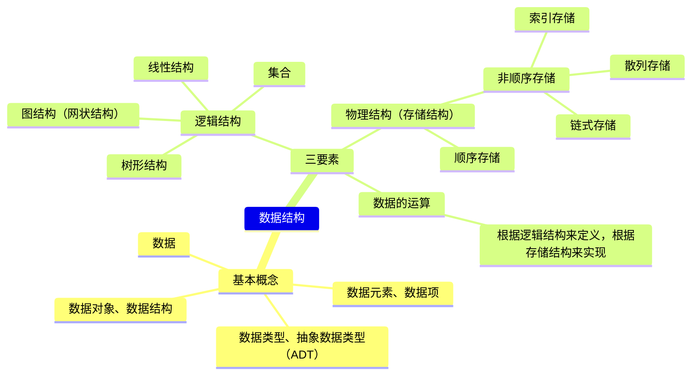

#### 1.1.1 关于数据的组织

* 数据结构至今没有统一定义，不过**数据结构**往往和**算法**同时出现，“程序 = 数据结构 + 算法”——Niklaus Wirth

* 当谈起数据的**组织方式**的时候，其实与**数据的规模**息息相关，不一样规模的问题处理起来难度就不一样。

* 难度主要不是与你如何存放有关，而是与你要对数据进行什么操作有关。以存放图书为例：

> 方法一：随便放         ①存放很简单    ②查找很复杂
>
> 方法二：按字母顺序放   ①存放较复杂    ②查找简单（二分查找）
>
> 方法三：类别+字母顺序  ①存放较简单    ②查找简单（类别+二分查找）

* [x] 讨论 1.1 对中等规模、大规模的图书摆放，你有什么更好的建议？

> 提出这个问题，实际上是想让大家思考，在考虑大规模数据存储的时候会遇到什么问题，以及如何根据功能（也就是关联的算法，最常见的就是插入、查找、删除）需要设计存储方式。

讨论：

* 用**哈希表**，一个书架的一排定义为一个位置，哈希运算之后，就摆在算出的那一排上。

* 首先按**内容分类**并针对每个分类设定一个**冗余度**，例如 5%，则每 100 本书后预留 5 个空位。每个大类结束后预留更多的空位，如 200 个。这样，在新增书目的时候，只需挪动该插入位置之后，空位置之前的这不超过 100 本书。当该区间空位满了之后，不得不挪动下个 100 本书。并及时告知管理人员当前空位剩余数量。此外应动态管理冗余度，对于频繁新增书目的分类，应提高冗余度，预留更多的空位。并且对于经常满位的分类，应当放置在全部分类队列最后，这样可以减少空位满了之后挪动其他分类的数量。

* 用**树、数组和字典的方式**摆放书籍：按类别分不同区域和不同书架摆放。

* 查找：大厅设置屏幕提醒大类书籍所在位置，区域内书架上展示小类标签，书架上按照书籍编号有序放置。设置查询表，根据书名查找书籍编号、所在位置、余量等消息。

* 中大型图书馆，首先需要对图书进行分大类，建立基本框架，树性结构。细化管理，现代化管理，书名，条码分类，轨道式移动书本，通过**二维码识别**，精准定位，在小类里可采用循环链表分类登记汇总，实现自动化

#### 1.1.2 关于空间使用 - 例：PrintN 函数实现

写程序实现一个函数 PrintN，使得传入一个正整数为 N 的参数后，能顺序打印从 1 到 N 的全部正整数

```c
/* 循环实现 */
void PrintN(int N)
{ 
    int i;
    for (i = 1; i <= N; i++)
        printf("%d\n", i);
    return;
} 
/* 递归实现 */
void PrintN(int N)
{ 
    if (N) {
        PrintN(N - 1); 
        printf("%d\n", N);
    }
    return;
} 
```

​    上面两种实现，看起来好像都挺简单的，下面这个好像还更简单一点。分别令输入数据 N = 10、100、1000、... ...，观察运行结果，发现数据量较小时，两者结果基本一样，但第二个递归实现的函数在数据量到达 10w+ 以上时，递归函数有可能直接拒绝工作！

​    如果你对递归比较熟悉，递归代码往往是简洁明了的，但是计算机不是很适合运行递归代码，因为递归代码往往会占用很多空间。如果占用所有空间也没能得出结果，递归程序就会异常终止，所以结果上可能是程序根本没有任何输出就结束了。

* 所以，**解决问题的效率，跟空间的利用效率也有关**。

* [x] 讨论 1.2 晒一下 PrintN 在你的机器上运行的结果？

> 这是我们大家发现壕的时候哈！\^\_\^

讨论：

* 数据规模为 10w 时，函数的循环实现总用时（可见代码示例 1.1.2 两种 PrintN）

  ticks1 = 13284.000000
  duration1 = 1.33e+001

  而递归实现没有输出结果（递归栈爆了）

* 循环代码更加繁琐，但节省内存；

  递归代码简洁易懂，却容易溢出。

#### 1.1.3 写程序计算给定多项式在给定点 x 处的值

计算多项式在给定点 x 处的值：
$$
\large{f(x) = a_0 + a_1x + ... + a_{n-1}x^{n-1} + a_{n}x^{n}}
$$

```c
/* 方法一 */
double f(int n, double a[], double x)
{
    int i;
    double p = a[0];
    for (i = 1; i <= n; i++)
        p += (a[i] * pow(x, i)); 
    return p;
}
```

​    第一种方法清晰明了，但是实际过程中如果这么写程序算法效率是很低的。

​    下面的方法通过**海伦-秦九韶算法**，巧妙利用结合律，不断提取公因式 x 来减少乘法的运算次数，把多项式改写成下面这种从里往外计算的形式：
$$
\large{f(x) = a_0 + x(a_1 + x(...(a_{n-1} + x(a_n))...))}
$$

```c
double f(int n, double a[], double x)
{ 
    int i;
    double p = a[n];
    for (i = n; i > 0; i--)
        p = a[i - 1] + x * p;
    return p;
} 
```

​    为了测试上面两种方法到底哪个更快，利用 C 语言提供的 clock() 函数：捕捉从程序开始运行到 clock() 被调用时所耗费的时间。这个时间单位是 clock tick，即“**时钟打点**”。 该函数位于头文件 time.h 中。

​    常数 CLK_TCK(或 CLOCKS_PER_SEC)：机器时钟每秒所走的时钟打点数（不同机器不一样）。

​    下面是使用这个函数测量待测函数的模板：

```c
#include <stdio.h>
#include <time.h>
clock_t start, stop;
/* clock_t 是 clock()函数返回的变量类型 */
double duration;
/* 记录被测函数运行时间，以秒为单位 */
int main ()
{ 
    /* 不在测试范围内的准备工作写在 clock()调用之前*/
    start = clock();    /* 开始计时 */
    MyFunction();       /* 把被测函数加在这里 */
    stop = clock();     /* 停止计时 */
    duration = ((double)(stop - start)) / CLK_TCK;
    /* 计算运行时间 */
    /* 其他不在测试范围的处理写在后面，例如输出 duration 的值 */
    return 0;
}
```

​    如果被测函数单次运行太快了（比如不到 1 个 tick），可以让被测函数**重复运行充分多次**（for 循环），使得测出的总的时钟打点间隔充分长，最后计算被测函数**平均每次**运行的时间即可!

```c
#include <stdio.h>
#include <time.h>
#include <math.h>
clock_t start, stop; 
double duration;
#define MAXN 10 /* 多项式最大项数，即多项式阶数 +1 */
double f1(int n, double a[], double x);
double f2(int n, double a[], double x);
int main ()
{ 
    int i;
    double a[MAXN]; /* 存储多项式的系数 */
    for (i = 0; i < MAXN; i++) 
        a[i] = (double)i;
    
    start = clock();
    f1(MAXN - 1, a, 1.1); 
    stop = clock();
    duration = ((double)(stop - start)) / CLK_TCK; 
    printf("ticks1 = %f\n", (double)(stop - start));
    printf("duration1 = %6.2e\n", duration);
    start = clock();
    f2(MAXN - 1, a, 1.1); 
    stop = clock();
    duration = ((double)(stop - start)) / CLK_TCK; 
    
    printf("ticks2 = %f\n", (double)(stop - start));
    printf("duration2 = %6.2e\n", duration);
    return 0;
}
```

* 经过测量，第二个函数用时比第一个函数少 1 个数量级左右，可见**解决问题方法的效率， 跟算法的巧妙程度有关**。

* [x] 讨论 1.3 再试一个多项式

> 给定另一个 100 阶多项式
> $$
> f(x) = 1 + x + x^2/2 + ... + x^i/i + ... + x^{100}/100
> $$
> 用不同方法计算$f(1.1)$并且比较一下运行时间？

讨论：

* 初始化时，把上面程序的常数项 a 改一下即可（见代码示例 1.1.3 讨论）。
* ticks1 = 1995.000000
  duration1 = 2.00e+000
  ticks2 = 335.000000
  duration2 = 3.35e-001

#### 1.1.4 抽象数据结构

到底什么是数据结构？

* **数据对象**在计算机中的**组织方式**（逻辑结构 + 物理存储结构）
  * 逻辑结构：线性结构（线性表、栈和队列、数组、串）非线性结构（集合、树、图）
  * 物理存储结构：顺序存储、链式存储、散列存储、索引存储
  * 数据的逻辑结构采用抽象表达方式，**独立于存储结构**；数据存储结构是逻辑结构在计算机上的映射，不能独立于逻辑结构存在。
* 数据对象必定与一系列加在其上的**操作**相关联（也称为**数据的运算**，如：插入、删除、修改、查找、排序）
* 完成这些操作所用的方法就是**算法**
* 数据结构的**基本概念**：相互之间存在一种或多种特定关系的数据元素的集合。
  * 存储数据元素时，不仅应该存储数据元素的**值**，还应该存储数据元素之间的**关系**。(数据元素类型可以隐含)
* 数据结构的三要素：**数据的逻辑结构**，**数据的存储结构**，**数据的运算**。（和下面的 ADT 三要素要区分开）
  * 数据的运算具体实现可能和数据的存储结构有关，比如链表和顺序表的插入。
* **数据类型**是一个值的集合和定义在此集合上的一组操作的总称
  * ①原子类型：其值不可再分的数据类型
  * ②结构类型：其值可以再分解为若干成分（分量）的数据类型
  * ③抽象数据类型：一个数学模型及定义在该数学模型上的一组操作

**抽象数据类型（Abstract Data Type）**

* ADT 常用这样一个三元组表示：**数据对象**，**数据关系**，数据集合相关联的**基本操作集**（注意：数据 ≠ 数据结构）

* 抽象：描述数据类型的方法不依赖于具体实现
  * 与存放数据的机器无关
  * 与数据存储的物理结构无关
  * 与实现操作的算法和编程语言均无关

* 只描述数据对象集和相关操作集 “是什么 ”，并不涉及 “如何做到 ”的问题

【例】“矩阵”的抽象数据类型定义

* 类型名称：矩阵（Matrix）

* 数据对象集：一个 M×N 的矩阵$A_{M×N} = (a_{ij})$(i=1, ……, M; j=1, ……, N)由 M×N 个三元组<a, i, j>构成，其中 <u>a 是矩阵元素的值</u>，i 是元素所在的行号，j 是元素所在的列号。

* 操作集：对于任意矩阵 A、B、C ∈ Matrix，以及整数 i、j、M、N
  * Matrix Create(int M, int N)：返回一个 M×N 的空矩阵；
  * int GetMaxRow(Matrix A)：返回矩阵 A 的总行数；
  * int GetMaxCol(Matrix A)：返回矩阵 A 的总列数；
  * ElementType GetEntry(Matrix A, int i, int j)：返回矩阵 A 的第 i 行、第 j 列的元素；
  * Matrix Add(Matrix A, Matrix B)：如果 A 和 B 的行、列数一致，则返回矩阵 C=A+B，否则返回错误标志；
  * Matrix Multiply(Matrix A, Matrix B)：如果 A 的列数等于 B 的行数，则返回矩阵 C=AB，否则返回错误标志；
  * ……

抽象在哪里？

* 上面提到 a 是矩阵元素的值，这个值是**整形、浮点型还是字符型**等等，抽象类型描述时是不关心的，后面操作集返回时，也使用了通用类型 ElementType ，可以在文件头使用 typedef 来定义成自己需要类型，抽象的好处就是适用于任何一种类型的矩阵，提高了程序的灵活性。
* 矩阵在程序里如何存取的？是用二维数组、链表还是十字链表等等，这个在抽象数据类型定义时也都是不涉及的，重点在于如何实现矩阵本身。
* 矩阵操作函数，例如 Matrix Add() 到底是按行先加、还是列先加，是用什么样语言实现的，都是不涉及的，这就是所谓的抽象。

* [x] 讨论 1.4 抽象有什么好处？

> 任何事物存在都要有个理由，为什么大家这么稀饭“抽象”？

讨论：

* 抽象是计算机求解问题的基本方式和重要手段，它使得一种设计可以应用于多种场景。而且通过抽象可以屏蔽底层细节，使设计更加简单、理解更加方便。
* 抽象数据类型的描述方法与面向对象的思想是一致的，它把数据对象和相关操作封装在一起，对于需要调用这个数据类型的用户而言，无论内部的具体实现如何改变，只要对外描述的接口不变，就不影响使用。

### 1.2 什么是算法

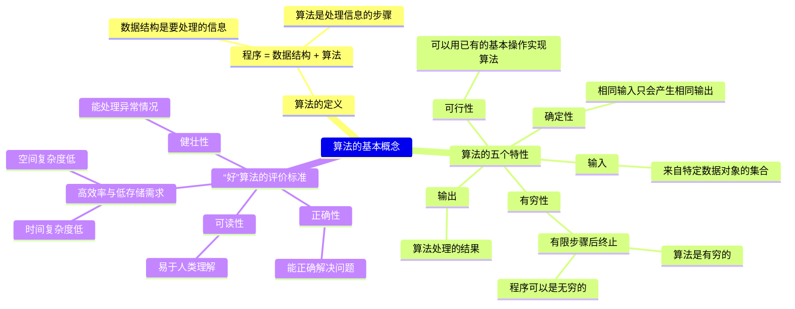

#### 1.2.1 算法的定义

**算法(Algorithm)**

基本概念：算法是**对特定问题求解步骤的一种描述**，它是指令的有限序列，其中每一条指令表示一个或多个操作

1. **可行性**：可以用已有的基本操作实现算法
2. **有穷性**：一定在有限步骤之后终止（算法不是程序，程序可以无限运行，比如 OS）
3. **确定性**：每一条指令必须
   * 有充分明确的目标，不可以有歧义，相同的输入得到相同的输出
   * 计算机能处理的范围之内
   * 抽象的实现手段
4. **输入**：接受一些输入（有些情况下不需要输入）（算法输入来自特定数据对象的集合）
5. **输出**：产生一个或多个输出

【例】选择排序算法的伪码描述

```c
void SelectionSort(int List[], int N)
{   /* 将 N 个整数 List[0]...List[N-1]进行非递减排序 */
    for (i = 0; i < N; i++) {
        MinPosition = ScanForMin(List, i, N – 1); 
        /* 从 List[i]到 List[N – 1]中找最小元，并将其位置赋给 MinPosition */
        Swap(List[i], List[MinPosition]);
        /* 将未排序部分的最小元换到有序部分的最后位置 */
    }
}
```

抽象在于：

* List 到底是数组还是链表（虽然看上去很像数组）？

* Swap 用函数还是用宏去实现？

#### 1.2.2 什么是好的算法？

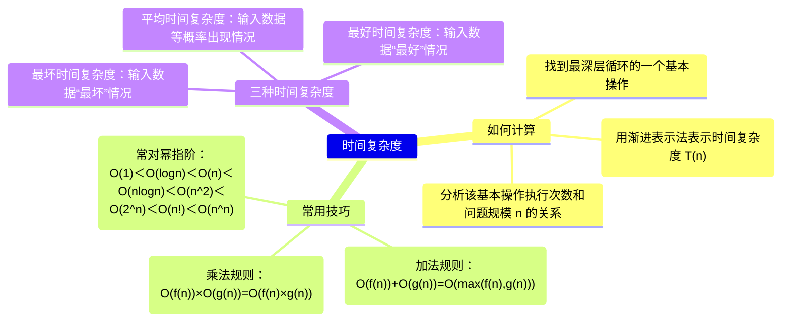

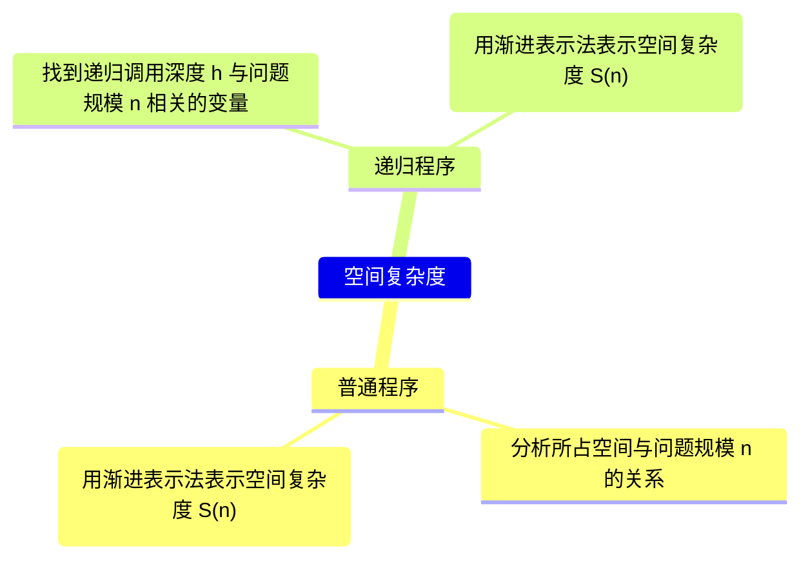

**“好”算法的评价标准**

1. 正确性：能正确解决问题。
2. 可读性：易于人类理解。
3. 健壮性：输入非法数据时，算法能适当反应或处理，而非输出意外结果。
4. 高效率与低存储量需求：指算法的执行时间和执行过程中需要的存储空间。

**评价算法效率的指标**

​    为什么不采用**事后统计**运行时间的方法评判算法效率？因为程序运行时间和机器性能、编程语言、编译程序产生的机器指令质量都有关，而且有时候无法采用事后统计的方法，如：火箭发射。因此我们采用**事先统计**方法排除这些因素影响。

> **命题追踪 > （算法题）分析时空复杂度（2010-2013、2015、2016、2018-2021）**

1. **空间复杂度 S(n)** —— 根据算法写成的程序在执行时**占用存储单元的长度(占用内存空间大小)**。这个长度往往与输入数据的规模有关。空间复杂度过高的算法可能导致使用的内存超限，造成程序非正常中断。

2. **时间复杂度 T(n)** —— 根据算法写成的程序在执行时**耗费时间的长度**。这个长度往往也与输入数据的规模有关。时间复杂度过高的低效算法可能导致我们在有生之年都等不到运行结果。

> **命题追踪 > 分析算法的时间复杂度（2011-2014、2017、2019、2022）**

* 由于这两个指标与数据的规模直接相关，所以将其写成一个关于 n 的函数。

在分析一般算法的效率时，我们经常关注下面两种复杂度

1. 最坏情况复杂度 $T_{worst}(n)$：考虑输入数据“最坏”的情况

2. 平均复杂度 $T_{avg}(n)$：考虑所有输入数据都等概率出现的情况

* 平均复杂度肯定比最坏情况复杂度小，但算法分析**一般分析最坏情况复杂度**，因为“什么叫平均”，经常不是一个很容易搞定的问题，很多时候平均复杂度分析难度很大...

**递归实现 PrintN 函数的空间复杂度分析**

<center style="color:#7c7877">PrintN() Recursive Call Process</center>

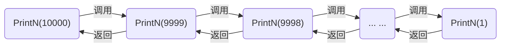

<center style="color:#7c7877">图 1.2.2 函数递归调用过程中内存占用情况</center>

* 函数递归调用需要**保存当前函数的状态**（如返回地址和一些变量的值等），因此需要占用一块内存空间（如上图调用 PrintN(10000)时需要占用一块内存空间），直到执行到 PrintN(0) 时，函数才直接返回，系统开始逐级释放内存。
* 假设存储每个函数状态占 1 个单位内存空间。由上可知，空间复杂度是和数据量 N 成正比的，S(N) = C · N。

* 有限空间都用完了也不足以执行完程序，所以程序异常退出了。
* PrintN()循环实现只需要临时变量和 for 循环，它没有涉及到程序调用的问题，它占用的空间量是**常量**。

**计算多项式在给定点处的值函数的时间复杂度分析**

* 机器运算加减法的速度比乘除法快很多

* 分析简单函数运行效率，只需要看它的乘除法执行次数，加减法可以忽略不计

* 不用海伦-秦九韶公式简化算法，循环每执行一次，除了 a[i] 和 pow() 乘一次之外，pow()还要乘 i - 1 次，总共乘 i 次。而使用海伦-秦九韶公式简化算法，循环每执行一次，只需要乘一次。

  所以在整个循环体，前者总共进行了 $\large{\frac{(n^2 + n)}2}$ 次乘法，后者总共进行了 n 次乘法。

```c
p += (a[i] * pow(x, i));   /* 不用海伦-秦九韶公式化简 */
p = a[i - 1] + x * p;      /* 使用海伦-秦九韶公式化简 */
```

* 第一个函数的时间复杂度：$T(n) = C_1n^2+C_2n(C_1$ 和 $C_2$ 为常数$)$

  第二个函数的时间复杂度：$T(n) = C·n(C$ 为常数$)$

  虽然三个常数每台计算机都不一样，但可以确定的是 n 很大时，平方项增长最快，第一个函数会比第二个函数大很多（即速度慢很多）。

* [x] 讨论 1.5 分析“二分法”

> 查找算法中的“二分法”是这样定义的：
>
> 给定 N 个从小到大排好序的整数序列 List[]，以及某待查找整数 X，我们的目标是找到 X 在 List 中的下标。即若有 `List[i] = X`，则返回 i；否则返回 -1 表示没有找到。
>
> 二分法是先找到序列的中点 List[M]，与 X 进行比较，若相等则返回中点下标；否则，若`List[M] > X`，则在左边的子系列中查找 X；若 `List[M] < X`，则在右边的子系列中查找 X。
>
> 试写出算法的伪码描述，并分析最坏、最好情况下的时间、空间复杂度。

讨论：

```c
int search(int x, int List[], int len)
{
    int ret = -1;
    int left = 0;
    int right = len - 1;
    while (left <= right) {
        int mid = (left + right) / 2;
        if (List[mid] == x) {
            ret = mid;
            break;
        } else if (List[mid] > x) {
            right = mid - 1;
        } else {
            left = mid + 1;
        }
    }
    return ret;
}
```

* 最好情况第一次二分就找到，最坏情况是没找到被迫跳出循环，空间复杂度都是 O(1)(辅助空间为常量称算法**原地工作(In Place)**)。

  $T_{worst}(n) = O(logn)\qquad  S_{worst}(n) = O(1)$

  $T_{best}(n) = O(1)\qquad\qquad S_{best}(n) = O(1)$

#### 1.2.3 渐进表示法

​    实际算法分析过程中，没有必要去数每个函数具体每一步执行了几次，其实我们更关心的是随着要处理的数据规模 n 的增大，复杂度增长的趋势是怎样的。

**(时间)复杂度的渐进表示法**

* $T(n) = O(f(n))$ 表示存在常数 $C>0,  n_0>0$ 使得当 $n > n_0$ 时有 $T(n)≤C·f(n)$，简单来说，上面这个等式表示，对于充分大的 n 而言，f(n)是 T(n)的某个上界

* $T(n) = Ω(g(n))$ 表示存在常数 $C>0,  n_0>0$ 使得当 $n > n_0$ 时有 $T(n)≥C·g(n)$，简单来说，上面这个等式表示，对于充分大的 n 而言，g(n)是 T(n)的某个下界

* $T(n)= Θ(h(n))$ 表示同时有 $T(n) = O(h(n))$ 和 $T(n)= Ω(h(n))$，简单来说，上面这个等式表示，对于充分大的 n 而言，h(n) 既是 T(n) 的上界也是下界

​    注意，函数的上下界都不是唯一的，但是太大的上界和太小的下界对分析算法效率没有什么帮助，我们在找上界和下界时，都期望和真实情况贴得越近越好，一般是寻找最小上界作为 $O$ 函数和最大的下界作为 $Ω$ 函数。

<center style="color:#7c7877">表 1.2.3 f(n) 随着输入规模 n 的变化表</center>

| 函数 f(n) | 1   | 2   | 4   | 8        | 16            | 32             |
| ------- | --- | --- | --- | -------- | ------------- | -------------- |
| 1       | 1   | 1   | 1   | 1        | 1             | 1              |
| log n   | 0   | 1   | 2   | 3        | 4             | 5              |
| n       | 1   | 2   | 4   | 8        | 16            | 32             |
| n log n | 0   | 2   | 8   | 24       | 64            | 160            |
| $n^2$   | 1   | 4   | 16  | 64       | 256           | 1024           |
| $n^3$   | 1   | 8   | 64  | 512      | 4096          | 32768          |
| $2^n$   | 2   | 4   | 16  | 256      | 65536         | 4294967296     |
| n!      | 1   | 2   | 24  | 40326    | 2092278988000 | 26313 × 10^33^ |
| $n^n$   | 2   | 4   | 256 | 16777216 | 18447×10^19^  | 14615×10^46^   |

* 时间复杂度阶数由小到大判断口诀：常对幂指阶(随着问题规模变得很大，算法性能问题可能才会明显暴露出来)
* 如果一个算法的复杂度是 $n^2$ ，可以考虑是否能将其优化为 $nlog(n)$。
* 真数相同底数不同的对数函数只相差常数倍，但渐进表示法**忽略常数因子和低阶项**，所以 log 的底数可以省略不写。（但是要注意，不同底的指数函数之间相差不是常数倍，比如 $O(2^n)$ 和 $O(3^n)$ 复杂度是完全不一样的）

**复杂度分析的技巧**

* 若两段算法分别有复杂度 $T_1(n) = O(f_1(n))$ 和 $T_2(n) = O(f_2(n))$，则

  * 加法规则：$T_1 (n) +  T_2 (n) = max(O(f_1(n)), O(f_2(n)))$
  * 乘法规则：$T_1(n)×T_2(n) = O(f_1(n)×f_2(n))$

* 若 T(n)是关于 n 的 k 阶多项式，那么 $T(n)= Θ(n^k)$

* 忽略常数因子和低阶项

* 着重分析**最深层循环某个基本操作**与问题规模 n 的关系

* 一个 **for 循环**的时间复杂度等于循环次数乘以循环体代码的复杂度

* **若干层嵌套循环**的时间复杂度等于各层循环次数的乘积再乘以循环体代码的复杂度

* **if-else 结构**的复杂度取决于 **if** 的条件判断复杂度和两个分枝部分的复杂度，总体复杂度取三者中**最大**

```c
/* 下列函数的总复杂度为 max(O(f1), O(f2), O(f3)) */
if (P1)     /* P1 的复杂度为 O(f1) */
    P2;     /* P1 的复杂度为 O(f2) */
else
    P3;     /* P1 的复杂度为 O(f3) */
```

* 一般情况下，**递归函数空间复杂度 = 递归深度 × 单次递归的空间复杂度**，但如果递归每一层需要分配不同大小的内存时，不能简单相乘，需要累加各层的空间开销。

### 1.3 应用实例：最大子列和(maximum-subarray)问题

给定 N 个整数的序列$\{A_1, A_2, …, A_N\}$， 求下列函数的最大值（0 代表子列和为负数时）
$$
f(i, j)=max\{0,\sum_{k=i}^{j}A_k\}
$$

#### 1.3.1 两种简单求和算法

以给定序列：{-2，11，-4，13，-5，-2}为例。

算法一：暴力求出所有子列和，然后取最大的和

```c
int MaxSubseqSum1(int A[], int N)
{   
    int ThisSum, MaxSum = 0;
    int i, j, k;
    for (i = 0; i < N; i++) {       /* i 是子列左端位置 */       
        for (j = i; j < N; j++) {   /* j 是子列右端位置 */
            ThisSum = 0;            /* ThisSum 是从 A[i]到 A[j]的子列和 */
            for (k = i; k <= j; k++)
                ThisSum += A[k];
            if (ThisSum > MaxSum)  /* 如果刚得到的这个子列和更大 */
                MaxSum = ThisSum;  /* 则更新结果 */
        }                          /* j 循环结束 */
    }                              /* i 循环结束 */
    return MaxSum;
}
```

* 时间复杂度：$T(n) = O(n^3)$

* 本算法“傻”在大量无效操作浪费在`ThisSum += A[k];`，其实不必每次都从头往后加，只要把 i 到 j 的部分和加一个元素 A[k]即可，最里层循环完全就是多余的，于是就有了算法二。

| -2     | 11     | -4     | 13     | -5  | -2  | sum    |
| ------ | ------ | ------ | ------ | --- | --- | ------ |
| -2     |        |        |        |     |     | -2     |
| -2     | 11     |        |        |     |     | 9      |
| -2     | 11     | -4     |        |     |     | 5      |
| ==-2== | ==11== | ==-4== | ==13== |     |     | ==18== |
| -2     | 11     | -4     | 13     | -5  |     | 13     |
| -2     | 11     | -4     | 13     | -5  | -2  | 11     |

算法二：对算法一重复计算部分优化

```c
int MaxSubseqSum2(int A[], int N)
{   
    int ThisSum, MaxSum = 0;
    int i, j;
    for (i = 0; i < N; i++) {      /* i 是子列左端位置 */
        ThisSum = 0;               /* ThisSum 是从 A[i]到 A[j]的子列和 */
        for (j = i; j < N; j++) {  /* j 是子列右端位置 */
            ThisSum += A[j];       /*对于相同的 i，不同的 j，只要在 j-1 次循环的基础上累加 1 项即可*/
            if (ThisSum > MaxSum)  /* 如果刚得到的这个子列和更大 */
                MaxSum = ThisSum;  /* 则更新结果 */
        }                          /* j 循环结束 */
    }                              /* i 循环结束 */
    return MaxSum;
}
```

* 时间复杂度：$T(n) = O(n^2)$
* $T(n) = O(n^2)$ 往往可以优化为 $T(n) = O(nlogn)$

| -2  | 11  | -4  | 13     | -5  | -2  | sum    |
| --- | --- | --- | ------ | --- | --- | ------ |
| -2  |     |     |        |     |     | -2     |
|     | 11  |     |        |     |     | 9      |
|     |     | -4  |        |     |     | ==5==  |
|     |     |     | ==13== |     |     | ==18== |
|     |     |     |        | -5  |     | 13     |
|     |     |     |        |     | -2  | 11     |

#### 1.3.2 分治算法(Divide and Conquer)

**算法三：分而治之**

把数组一分为二，递归解决左右两边的问题，分别得到两边的最大子列和，再找出**跨越边界的最大子列和**，最后的结果一定是三个结果中间最大的那一个。

```c
int Max3(int A, int B, int C)
{ /* 返回 3 个整数中的最大值 */
    return A > B ? A > C ? A : C : B > C ? B : C;
}

int DivideAndConquer(int List[], int left, int right)
{ /* 分治法求 List[left]到 List[right]的最大子列和 */
    int MaxLeftSum, MaxRightSum; /* 存放左右子问题的解 */
    int MaxLeftBorderSum, MaxRightBorderSum; /* 存放跨分界线的结果 */

    int LeftBorderSum, RightBorderSum;
    int center, i;

    if (left == right) {      /* 递归的终止条件，子列只有 1 个数字 */
        if (List[left] > 0)  return List[left];
        else return 0;
    }

    /* 下面是"分"的过程 */
    center = (left + right) / 2; /* 找到中分点 */
    /* 递归求得两边子列的最大和 */
    MaxLeftSum = DivideAndConquer(List, left, center);
    MaxRightSum = DivideAndConquer(List, center+1, right);

    /* 下面求跨分界线的最大子列和 */
    MaxLeftBorderSum = 0; LeftBorderSum = 0;
    for (i = center; i >= left; i--) { /* 从中线向左扫描 */
        LeftBorderSum += List[i];
        if (LeftBorderSum > MaxLeftBorderSum)
            MaxLeftBorderSum = LeftBorderSum;
    } /* 左边扫描结束 */

    MaxRightBorderSum = 0; RightBorderSum = 0;
    for (i = center+1; i <= right; i++) { /* 从中线向右扫描 */
        RightBorderSum += List[i];
        if (RightBorderSum > MaxRightBorderSum)
            MaxRightBorderSum = RightBorderSum;
    } /* 右边扫描结束 */
    /* 下面返回"治"的结果 */
    return Max3(MaxLeftSum, MaxRightSum, MaxLeftBorderSum + MaxRightBorderSum);
}

int MaxSubseqSum3(int List[], int N) {
/* 保持与前 2 种算法相同的函数接口，这样用户调用不同算法时输入的参数是不变的 */
    return DivideAndConquer(List, 0, N - 1);
}
```

<table style="undefined;table-layout: fixed; width: 100%"><colgroup>
</colgroup>
<thead>
  <tr>
    <th>-2</th>
    <th>11</th>
    <th>-4</th>
    <th>13</th>
    <th>-5</th>
    <th>-2</th>
  </tr></thead>
<tbody>
  <tr>
    <td>-2</td>
    <td>11</td>
    <td></td>
    <td>13</td>
    <td></td>
    <td>-2</td>
  </tr>
  <tr>
    <td></td>
    <td>11</td>
    <td></td>
    <td>13</td>
    <td></td>
    <td></td>
  </tr>
  <tr>
    <td></td>
    <td colspan="3">20</td>
    <td></td>
    <td></td>
  </tr>
</tbody>
</table>

* 时间复杂度：$T(n) = O(nlogn)$

* 递归函数的时间复杂度计算比较复杂，一般思路是根据分问题（左子列、右子列、跨越边界子列）的复杂度，得出一个关于复杂度的递推公式

  $T (N) = 2 T(N/2) + c N$， $T(1) = O(1)$

  $= 2 [2 T(N/2^2) + c N/2] + c N$

  $= 2^k O(1) + ckN$ 其中 $N/2^k = 1$

  $= O(N log N)$

* [x] 讨论 1.6 算法 3 的空间复杂度是多少？

> 具体来说，这个问题分两部分：
>
> 1. 由于递归而产生的空间复杂度是多少？
> 2. 算法的整体空间复杂度一共是多少？
>
> 不要只写结论，要写清楚推导过程哦~~

讨论：

* 递归的深度为 logN，每次递归需要的空间是一个与 N 无关常量，每次递归的空间复杂度为 O(1)。**递归的空间复杂度** = **每次递归的空间复杂度** × **递归深度**，即 O(logN)

#### 1.3.3 在线算法(Online Algorithm)

**算法四：在线处理**

```c
int MaxSubseqSum4(int A[], int N)
{
    int ThisSum, MaxSum;
    int i;
    ThisSum = MaxSum = 0;
    for (i = 0; i < N; i++) {
        ThisSum += A[i];      /* 向右累加 */
        if (ThisSum > MaxSum)
            MaxSum = ThisSum; /* 发现更大和则更新当前结果 */
        else if (ThisSum < 0) /* 如果当前子列和为负 */
            ThisSum = 0;      /* 则不可能使后面的部分和增大，抛弃之 */
    }
    return MaxSum;
} 
```

* 时间复杂度：$T(n) = O(n)$

* 这个算法的时间复杂度已经是最快的了，因为你将元素遍历一遍都需要 O(N)，这个算法的时间复杂度竟然也是 O(N)

* 算法效率这么高，副作用就是“正确性”不是很明显，有点难理解。

* “**在线**”的意思是指每输入一个数据就进行即时处理，在任何一个地方中止输入，算法都能正确给出当前的解。

* 为什么这么快，就是因为这个算法发现了如果当前子列和为负，它其实对于后面的子列和增大没有作用，应该丢弃。

  

<center style="color:#7c7877">图 1.3.3 在线处理算法执行过程可视化</center>

* [x] 讨论 1.7 晒运行结果

> 在 PTA 上发布的编程题“最大子列和问题”给了非常宽松的时间上限，让大家可以至少把算法 2、3、4 分别尝试一下。另外“Maximum Subsequence Sum”需要你把算法略做修改，不仅输出最大和，而且输出相应的那个子列的首尾。
>
> 于是大家在这里晒一下自己的程序在 PTA 系统中的时间和空间耗费的结果吧~

讨论：

* 运行程序见代码示例，运行结果如下

| 算法       | 1         | 2         | 3          | 4         |
| ---------- | --------- | --------- | ---------- | --------- |
| 时间复杂度 | $O(N^3)$  | $O(N^2)$  | $O(NlogN)$ | $O(N)$    |
| N=10       | 6.30e-007 | 1.80e-007 | 2.30e-007  | 4.00e-008 |
| N=100      | 4.67e-004 | 1.43e-005 | 2.80e-006  | 3.00e-007 |
| N=1000     | 4.47e-001 | 1.29e-003 | 4.70e-005  | 2.00e-006 |
| N=10000    | 4.46e+002 | 1.30e-001 | 8.10e-004  | 2.00e-005 |
| N=100000   | NA        | 1.42e+001 | 1.10e-002  | 1.00e-003 |

* NA 的意思是 Not Available，意思就是耗时太长，不算了。

### 1.4 习题

#### 1.4.a 课后习题

**1.1 判断正误**

1. $N(logN)^2$ 是 $O(N^2)$ 的。
2. $N^2(logN)$ 和 $N(logN^2)$ 具有相同的增长速度。

解答： #复杂度的渐进表示

* 正确，其实就是证明 $(log(n))^2$ 是 $O(n)$

  要证 $(log(n))^2$ 是 $O(n)$，只需证存在常数 $C>0,  n_0>0$ 使得当 $n > n_0 $时有 $lg^2n≤C·n$

  令 $f(x) = Cx - lg^2x$，$f'(x) = C - \frac{2lgx}{xln10}$

  $∵\frac{lgx}x<1$，对 $∀x∈R，∃C>0$，使得 $f'(x)>0$，$f(x)$ 单调递增

  而 $f(1) = C > 0$，所以 $∀n > n_0 ≥ 1$时，$lg^2n<C·n$

  所以 $(log(n))^2$ 是 $O(n)$

  * 另一个更简单的做法：直接判断

  $$
  \lim_{x \to +\infty} \frac{x(logx)^2}{x^2} = C
  $$

  即当 $x$ 大于某个值之后，$x^2$ 是 $x(logx)^2$ 的上界，此时两者要么是同阶无穷大，要么前者是高阶无穷大。即 C 是正常数或者 C = 0。

* 错误，后者和 $2N(logN)$ 具有相同的增长速度

**1.2 填空题**

1. 给定 N×N 的二维数组 A，则在不改变数组的前提下，查找最大元素的时间复杂度是：\_\_\_。
2. 斐波那契数列 $F_N$ 的定义为：$F_0=0, F_1=1, F_N  =F_{N−1}+F_{N−2}, N=2, 3, …$。用递归函数计算 $F_N$ 的空间复杂度是___。
3. 上述斐波那契数列 $F_N$ 的时间复杂度是___。

解答： #复杂度的渐进表示 #斐波那契数列 #二叉树

* 遍历所有元素一次即可，时间复杂度 $O(N^2)$

* 空间复杂度计算比较简单，递归的**空间复杂度** = **每次递归的空间复杂度** × **递归深度**，每次递归的空间复杂度都是一个常量，所以空间复杂度主要与递归深度有关。每调用一次函数，就会申请一个内存空间保存状态，直到达到递归出口位置返回，递归深度为 n 层，所以空间复杂度为 $O(n)$（注意，函数返回时会把空间释放，所以空间是可以重复利用的）

```c
int fibonacci(int n)
{
    if (n <= 1)
        return n;
    else
        return fibonacci(n - 1) + fibonacci(n - 2);
}
```

* 时间复杂度较为复杂，下面提供两个简单证明方法

【证明一】：

$F(n) = F(n-1) + F(n - 2)$

将其中计算 $F(n)$ 的用时记为 $T(n)$，计算两数和的用时为常数 *C*。

所以 $T(n) = T(n-1) + T(n - 2) + C$

变形得 $T(n) + C = (T(n-1) + C) + (T(n - 2) + C)$

令 $A(n) = T(n) + C$，有

$A(n) = A(n-1) + A(n-2)$，这是个前两项不为 1 的斐波那契数列

假设前两项为 $a, b(a≠b)$，令 $c = max(a, b)$，

由斐波那契数列的定义知，前两项为 c 的斐波那契数列增长速度比前两项为 a、b 的快，该数列为：

​    $c、c、2c、3c、5c、...、F(n)c$

其中每项都与题给的标准斐波那契数列差常数倍，因此无论斐波那契数列的前两项是多少，都不会影响它的渐进增长率。

所以 $A(n)$ 的渐进增长率等于 $F(n)$，而 $T(n) = A(n) - C$，增长率也是一样的

所以有 $T(n)=Θ(F(n))$

事实上，由数学原理可以推导得到斐波那契数列通项公式为：
$$
F_n = \frac{1}{\sqrt{5} }[(\frac{1 + \sqrt{5} }{2})^n - (\frac{1 - \sqrt{5} }{2})^n ]
$$
所以可以得到 $T(n)=Θ((\frac{1 + \sqrt{5} }{2})^n)$，这是 $T(n)$ 的**‌渐进紧确界**。

【证明二】：

这是一个更加直观的证明方法。稍微改写一下递归代码，使之**不输出第 0 项斐波那契数列（保证叶结点不出现 F(0)）**。

```c
int fibonacci(int n)
{
    if (n <= 2)
        return 1;
    else
        return fibonacci(n - 1) + fibonacci(n - 2);
}
```

斐波那契数列的递归计算方法过程中，存在两种递归结点

* ①.第一种，**叶子结点**， F(1)，F(2) 会直接返回结果，记直接返回所需时间为 a

* ②.第二种，**非终端结点**， n>=3 时， F(n) 对 F(n−1) 与 F(n−2) 的结果进行相加，记加法与返回结果所需的所有时间为 b

​    斐波那契数列的递归树是一棵**非平衡二叉树**，递归求解斐波那契数列的叶子结点数量其实就是 F(n) 。因为**所有叶子结点的返回结果都是 1**，而递归求解相当于把所有的 1 按照不同的顺序加起来。因为没有结点被丢弃，所有的叶子结点都被加到结果中了，所以叶子结点的数量其实就是 F(n) 的计算结果。

​    而非终端结点的数量其实就是 F(n)−1 ，因为每个非终端结点都做了一次加法，无论用什么样的顺序将所有的 1 加起来，所需要的加法数量其实都是 F(n)−1 。（或利用二叉树的性质 $n_2=n_0 - 1$）

因此，一共所需要的时间为（a,b 都是常数）：
$$
T(n)=aF(n)+b(F(n)−1)=(a+b)F(n)−b
$$
所以有：$T(n)=Θ(F(n))$

**1.3 时间复杂度分析**

下列代码的时间复杂度是：____。

```c
if (A > B) {
    for (i = 0; i < N; i++)
        for (j = N * N; j > i; j--)
            A += B;
} else {
    for (i = 0; i < N*2; i++)
        for (j = N * 2; j > i; j--)
            A += B;
}
```

解答： #复杂度的渐进表示

​    条件判断 $O(1)$，第一个分支 $O(N^3)$，第二个分支 $O(N^2)$，所以最终时间复杂度是 $O(N^3)$。

**1.4 PrintN 函数算法分析**

分析两个版本的 PrintN 函数的时间、空间复杂度，并测试它们的实际运行效率。对 N = 100，1000，10000，100000 运行程序，将两个版本的 N-时间曲线绘在一张图里进行比较分析。

解答： #复杂度的渐进表示

* 循环实现，时间复杂度：$O(n)$，空间复杂度：$O(1)$
* 递归实现，时间复杂度：$O(n)$，空间复杂度：$O(n)$
* 两个版本的 N-t 图如下，长的曲线是循环实现，短的曲线是递归实现（N = 100000 时出错）。
* 注意到一个有趣的情况，当数据量为 10000 时，如果连续运行两个版本的打印函数，后执行的打印函数用时会异常显著缩短，但是如果清屏之后再执行后一个函数则恢复正常，推测终端 I/O 用时过长。所以采取单独测量用时或者打印完一次清屏或者把结果输出到文件测试结果比较准确。

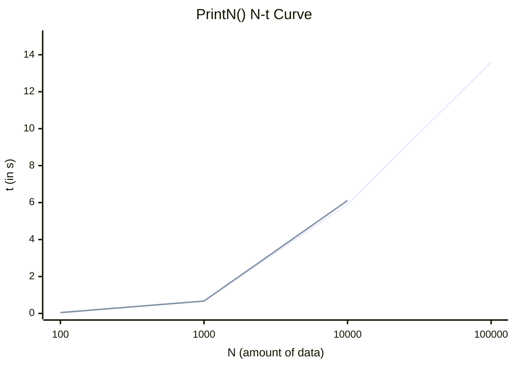

**1.5 秦九韶算法与直接法的效率差别**

解答： #算法

​    见讨论 1.3

**1.6 空间复杂度分析**

最大子列和算法 MaxSubseqSum3 是用递归实现的，由于递归而产生的空间复杂度是多少？

解答： #递归 

* 这个问题是问一共递归了多少层。由于我们每次递归都把搜索范围缩小一半，也就是 *N*/2/2/2⋯ 直到得到 1，于是有公式 $N/2^k=1$，推出 $k=log_2N$，即递归最多需要 *O*(log *N*) 次，占用的空间跟递归的次数成正比，也就是 *O*(log *N*)。

**1.7 测试最大子列和 4 种算法的实际运行效率**

简单起见，可令 List 中全部整数为 1 。当 N = 2，4，6，8，10，...，28，30 时，将各算法的 N-时间曲线绘制绘制在一张图里，其中时间以毫秒为单位；当 N = 1000，2000，...，10000 时，以秒为单位绘出各算法的时间增长曲线。两幅图有什么不同？为什么？

解答： #复杂度的渐进表示

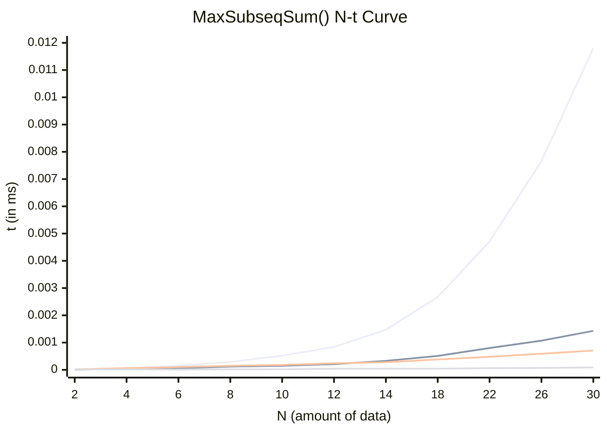

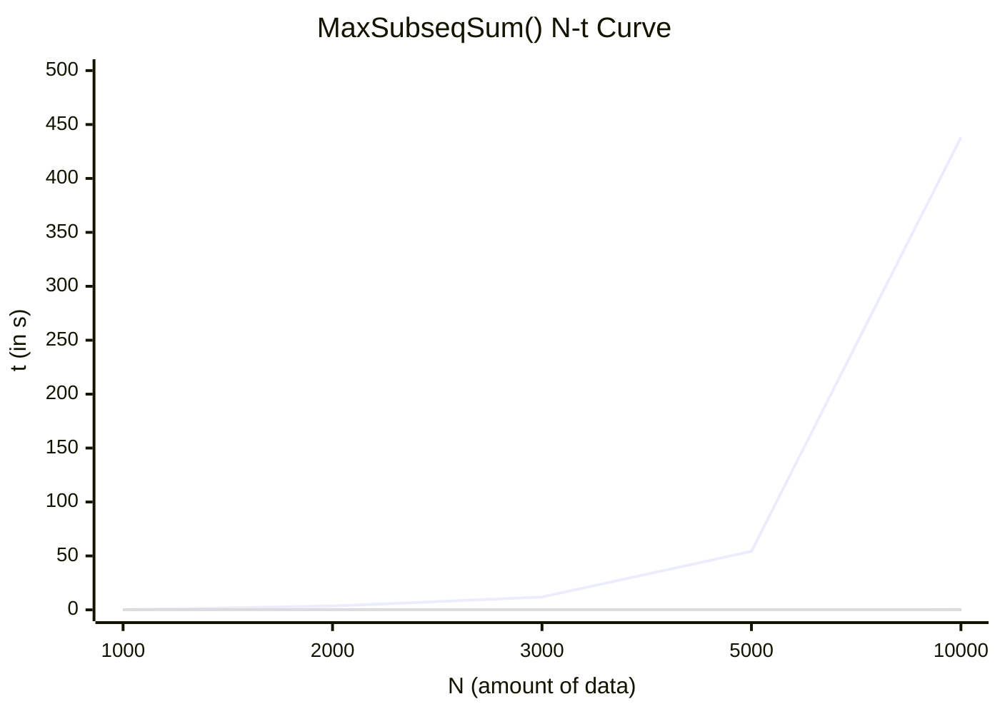

* 图二的 MaxSubseqSum1()用时差距与其他三个函数比，远远比图一更大，这是因为随着数据量的增大，时间复杂度高的算法耗时增加的速度是惊人的。

**1.8 二分查找**

本题要求实现二分查找算法

**函数接口定义**：

```c
Position BinarySearch(List L, ElementType X);
```

其中 List 结构定义如下：

```c
typedef int Position;
typedef struct LNode *List;
struct LNode {
    ElementType Data[MAXSIZE];
    Position Last; /* 保存线性表中最后一个元素的位置 */
};
```

​    L 是用户传入的一个线性表，其中 ElementType 元素可以通过 >、\==、< 进行比较，并且题目保证传入的数据是递增有序的。函数 BinarySearch 要查找 X 在 Data 中的位置，即数组下标（注意：元素从下标 1 开始存储）。找到则返回下标，否则返回一个特殊的失败标记 NotFound。

**裁判测试程序样例**：

```c
#include <stdio.h>
#include <stdlib.h>

#define MAXSIZE 10
#define NotFound 0
typedef int ElementType;

typedef int Position;
typedef struct LNode *List;
struct LNode {
    ElementType Data[MAXSIZE];
    Position Last; /* 保存线性表中最后一个元素的位置 */
};

List ReadInput(); /* 裁判实现，细节不表。元素从下标 1 开始存储 */
Position BinarySearch(List L, ElementType X);

int main()
{
    List L;
    ElementType X;
    Position P;

    L = ReadInput();
    scanf("%d", &X);
    P = BinarySearch(L, X);
    printf("%d\n", P);

    return 0;
}

/* 你的代码将被嵌在这里 */
```

**输入样例 1**：

```in
5
12 31 55 89 101
31
```

**输出样例 1：**

```out
2
```

**输入样例 2：**

```in
3
26 78 233
31
```

**输出样例 2：**

```in
0
```

---

解答： #二分查找

​    最好、最坏情况下的时间、空间复杂度见讨论 1.5。

```c
Position BinarySearch(List L, ElementType X)
{
    int ret = -1;
    int left, right;
    left = 1;
    right = L->Last;
    while (left <= right) {
        int mid = (left + right) / 2;
        if (L->Data[mid] == X) {
            ret = mid;
            break;
        } else if (L->Data[mid] > X) {
            right = mid - 1;
        } else {
            left = mid + 1;
        }
    }

    if (ret == -1)
        return NotFound;
    else
        return ret;
}
```

**1.9 有序数组的插入**

本题要求将任一给定元素插入从大到小排好序的数组中合适的位置，以保持结果依然有序。

**函数接口定义：**

```c
bool Insert(List L, ElementType X);
```

其中 List 结构定义如下：

```c
typedef int Position;
typedef struct LNode *List;
struct LNode {
    ElementType Data[MAXSIZE];
    Position Last; /* 保存线性表中最后一个元素的位置 */
};
```

​    L 是用户传入的一个线性表，其中 ElementType 元素可以通过>、\==、<进行比较，并且题目保证传入的数据是递减有序的。函数 Insert 要将 X 插入 Data[] 中合适的位置，以保持结果依然有序（注意：元素从下标 0 开始存储）。但如果 X 已经在 Data[] 中了，就不要插入，返回失败的标记 false；如果插入成功，则返回 true。另外，因为 Data[] 中最多只能存 MAXSIZE 个元素，所以如果插入新元素之前已经满了，也不要插入，而是返回失败的标记 false。

**裁判测试程序样例：**

```c
#include <stdio.h>
#include <stdlib.h>

#define MAXSIZE 10
typedef enum {false, true} bool;
typedef int ElementType;

typedef int Position;
typedef struct LNode *List;
struct LNode {
    ElementType Data[MAXSIZE];
    Position Last; /* 保存线性表中最后一个元素的位置 */
};

List ReadInput(); /* 裁判实现，细节不表。元素从下标 0 开始存储 */
void PrintList(List L); /* 裁判实现，细节不表 */
bool Insert(List L, ElementType X);

int main()
{
    List L;
    ElementType X;

    L = ReadInput();
    scanf("%d", &X);
    if (Insert(L, X) == false)
        printf("Insertion failed.\n");
    PrintList(L);

    return 0;
}

/* 你的代码将被嵌在这里 */
```

**输入样例 1：**

```in
5
35 12 8 7 3
10
```

**输出样例 1：**

```out
35 12 10 8 7 3
Last = 5
```

**输入样例 2：**

```in
6
35 12 10 8 7 3
8
```

**输出样例 2：**

```out
Insertion failed.
35 12 10 8 7 3
Last = 5
```

---

解答： #数组

* 由于给出的数组是**降序**的，所以使用折半查找并插入的方法

* 最好情况，第一个查找到的元素就是 x，所以不用插入，时间复杂度 O(1)，空间复杂度 O(1)。

* 最坏情况，遍历了所有元素都没找到 x，插入 x，此时查找用时 O(log n)，插入时数组后移用时 O(n)，时间复杂度 O(nlogn)，空间复杂度仍为 O(1)。
* 返回值：注意到只有插入成功才返回`true`，所以初始默认值就设为`false`。
* 边界条件分析：需要插入的情况即 left 指针在右，right 指针在左，此时循环体内已经判断过`x != L->Data[mid]`，于是只会有下列两种情况：
  * 如果`X < L->Data[mid]`，则插在 Data[mid]的右边，left = mid + 1， right = mid，此时位置正好是 left
  * 如果`X > L->Data[mid]`，则插在 Data[mid]处，left = mid， right = mid - 1，此时位置还是 left

* 所以用指针 left 表示插入位置就很简单（当然，认真思考就会发现，插入位置也可以表示为 right + 1）
* 接下来就是把插入位置**以及往后**全部后移一位（所以要取等号），把插入位置空出来，最后把 X 赋值进去
* 最终别忘了把数组长度增加 1，以及把标志置为`true`

```c
bool Insert(List L, ElementType X)
{
    int left, right, mid;
    int i;
    int ret = false;
    if (L->Last == MAXSIZE - 1)
        return false;
    left = 0;
    right = L->Last;
    while (left <= right) {
        mid = (left + right) / 2;
        if (X == L->Data[mid])
            break;
        else if (X > L->Data[mid])
            right = mid - 1;
        else
            left = mid + 1;
    }

    if (left > right) {
        for (i = L->Last; i >= left; i--)
            L->Data[i + 1] = L->Data[i];
        L->Data[i + 1] = X;
        L->Last++;
        ret = true;
    }

    return ret;
}
```

**1.10 试给出判断 N 是否为质数的$O(\sqrt{N})$算法**

解答： #质数

```c
#include <stdio.h>
#include <math.h>
typedef long long ll;

int isprime(ll x)
{
    int ret = 1;
    for (int i = 2; i <= sqrt(x); i++) {
        if (x % i == 0) {
            ret = 0;
            break;
        }
    }
    return ret;
}
```

**1.11 试给出计算 $x^n$ 的时间复杂度为 O(log N)的算法。**

解答： #快速幂 #递归

* 很自然的想到利用二分循环或者递归来解决，看起来不难，实际马上遇到的第一个问题就是指数如果不能被 2 整除时如何处理？
* 思路是将指数转换成 2 的幂的形式之和，这样每次能被 2 整除，比如计算 ：

$$
5^{10} = 5^{(1010)_2}=5^{2^3+0+2^1+0}=5^{2^3}×5^0×5^{2^1}×5^0
$$

* 这样转换之后每一步恰好和二进制转换思路一致，一边在不断对 n mod 2，从低位取数，一边乘基转换成 result。
* 除基取余，先 mod 2 得到的是低位，如果 mod 2 不为 0，则说明对应的 2 进制位**不为 0**，开始**乘基**取整，化为十进制，如果 mod 2 为 0，则说明对应的 2 进制**为 0**，这时只需要把**底数翻倍**即可（相当于指数乘 2），不必累乘到结果中，而是为下一位的计算做准备。
* 这个问题可以衍生到经典算法——快速幂，这里不再赘述。
* 方法一：循环实现

```c
double pow(double x, int n)
{
    double temp = x;
    double result = 1;
    while (n) {
        if (n % 2)
            result = result * temp;
        n = n / 2;
        temp *= temp;   
    }
    
    return result;
}
```

方法二：递归实现

* 注意，分问题的结果都是一样的，所以要先保存 temp 变量，在 temp 处做递归，而不是在`ret = pow2(x, n / 2) * pow2(x, n / 2) * x`处做递归，如果像后面这样写的话虽然递归深度还是 O(log n) 但是每一层还要递归其它分支，产生额外的时间复杂度，最终的时间复杂度是 = 整棵递归树的结点 × O(1) = O(n)，是很低效的。

```c
double pow2(double x, int n)
{
    double ret;
    if (n == 0)
        ret = 1;
    else if (n == 1)
        ret = x;
    else {
        int temp = pow2(x, n / 2);
        if (n % 2 == 1)
            ret = temp * temp * x;
        else
            ret = temp * temp;
    }
    
    return ret;
}

```

#### 1.4.b 课外习题

**b.1 已知两个长度分别为 m 和 n 的升序链表，若将它们合并为长度为 m + n 的一个降序链表，则最坏情况下的时间复杂度是（   ）。**

A. O(n)    B. O(mn)   C. O(min(m, n))    D. O(max(m, n))

解答： #链表归并  

* 合并成升序链表还是降序链表没有影响，只不过合并成升序用尾插法，现在改用头插法生成链表而已。
* 时间复杂度与元素之间的**比较次数**有关
* 最好情况是短链表在前，而且元素都比长链表大，此时比较完短链表之后，剩下的长链表直接用头插法连上去即可，时间复杂度 O(min(m, n))。
* 最坏情况是仅仅只有一个元素是最后直接连上去的，剩下的所有元素都比较一次之后才加入，所以时间复杂度是 O(m+n-1)，而 m + n - 1 < 2 * max(m, n)，所以时间复杂度为 O(max(m, n))。
* 如果 m 和 n 都是无序链表，则最坏情况下比较次数会大大提高，有可能每个元素都要和其他元素比较一次才能确定大小关系，此时，时间复杂度会达到二次级别，B 选项是无序链表合并才可能产生的时间复杂度。

**b.2 【2022 统考真题】下列程序段的时间复杂度是（   ）**

```c
int sum = 0;
for (int i = 1; i < n; i *= 2)
    for (int j = 0; j < i; j++)
        sum++;
```

A. O(logn)    B. O(n)    C. O(nlogn)    D. O(n^2^)

解答： #复杂度的渐进表示

* 这种问题属于第一种类型：**循环主体的变量参与循环条件的判断**，有个通用方法，就是把**基本操作次数记为 k** 。
* 大部分时候是把最内层操作记为 k，但本题可以设外层循环执行了 k 次，这样内层循环就是整数，比较好算。
* 外层循环的 i 的取值为 $i=1,2,4,...,2^k(2^k<n)$，内层循环基本语句执行，对于每个 i ，都要执行 i 次，也就是总循环次数等于外层循环取值求和，这个是个等比数列求和，最后算出来是 $2^{k+1}-1$ 次，小于 2n，所以时间复杂度为 O(n)。

$$
S_n=\frac{a_1(1-q^n)}{1-q}(q≠1,n\text{为项数})
$$

**b.2(变式) 【2014 统考真题】下列程序段的时间复杂度是**

```c
count = 0;
for (k = 1; k <= n; k *= 2)
    for (j = 1; j <= n; j++)
        count ++
```

解析： #复杂度的渐进表示

​    设最外层循环 t 次，所以 $2^t=n→t=log_2n$

​    内层循环次数为 n 次，所以总的循环次数为 $nlog_2n$，时间复杂度：$O(nlog_2n)$

**b.3 一个算法所需时间由下述递归方程表示，试求出该算法的时间复杂度的级别（或阶）**
$$
T(n) =  \begin{cases}    1, & n = 1 \\2T(n/2)+n, & n > 1 \end{cases}
$$

​    其中，n 是问题的规模，为简单起见，设 n 是 2 的整数次幂。

解答： #递归

* 本题属于第二类问题，**循环主体中的变量与循环条件无关**，采用数学归纳法或者直接统计循环次数。

* 递推程序一般用公式递推，这里公式已经给出，直接找规律化简即可。
* $T(n) = 2^2T(n/2^2)+ n + n = ...=2^kT(1) + kn = n + nlogn$(其中，$n / 2^k = 1$)
* $O(n + nlogn) = O(nlogn)$

**b.3(变式) 下列函数代码的时间复杂度是**

```c
int Func(int n){
    if (n == 1) return 1;
    else return 2 * Func(n / 2) + n;
}
```

解析： #复杂度的渐进表示

​    每一层其实只做了一件事，所以看递归层数知道时间复杂度为：$O(log_2n)$

​    注意与上一题的区别，上一题是直接给出渐进表达式的递推公式。

**b.4 求解斐波那契数列**
$$
F(n) =  \begin{cases}    0, & n = 0 \\ 1, & n = 1 \\F(n-1)+F(n-2), & n > 1 \end{cases}
$$

有两种常用的算法：递归算法和非递归算法。试分别分析两种算法的时间复杂度。

解析： #斐波那契数列 #递归 #迭代

```c
/* 斐波那契数列非递归写法 */
int fib_iter(int n)
{
    int t0, t1, t;
    t0 = 0; t1 = 1; t = n;
    while (n > 1){
        t = t0 + t1;
        t0 = t1;
        t1 = t;
        n --;
    }
    return t;
}
/* 斐波那契数列递归写法 */
int fib_rec(int n)
{
    if (n == 0)
        return 0;
    else if (n == 1)
        return 1;
    else
        return fA(n - 1) + fA(n - 2);
}
```

​    非递归写法时间复杂度分析属于之前提到的第一类问题，循环主体参与循环条件判断，循环次数和 n 相同，时间复杂度很容易看出来是：$O(n)$。

​    递归写法时间复杂度分析属于之前提到的第二类问题，要用数学归纳法判断或者直接累计次数。由于本题没有给出关于 T(n) 的表达式，所以采用直接累计次数的方法。习题 1.2 部分已经用两种方法说明过了，时间复杂度为：$O(2^n)$(非紧界)

## 第 2 章 线性表

### 2.1 线性表及其实现

​    线性表是算法命题的重点，容易实现且代码量较少，要求有最优时间/空间复杂度才能获得满分，因此应该牢固掌握线性表的基本操作（基于两种存储结构），纸面考试重要的是思想，不一定要求代码具有实际可执行性，不必拘泥于边界细节。

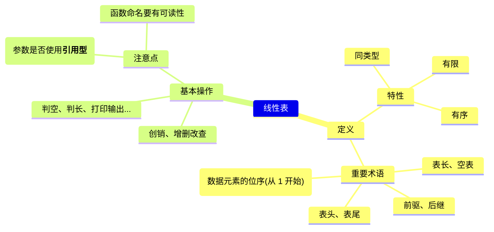

#### 2.1.1 引言-多项式表示

【典例】一元多项式及其运算
$$
f(x) = a_0 + a_1x + ... + a_{n-1}x^{n-1} + a_{n}x^{n}
$$

* 主要运算：多项式相加、相减、相乘等
* 分析——如何表示多项式？多项式的关键数据：
  * 多项式的系数 n
  * 各项系数 $a_i$ 及指数 i

方法一：顺序存储结构直接表示

* 数组各分量对应多项式各项
  * a[i]：项 $x^i$ 的系数 $a_i$

例如：$f(x) = 4x^5-3x^2+1$

| 下标   | 0   | 1   | 2   | 3   | 4   | 5   |
| ---- | --- | --- | --- | --- | --- | --- |
| a[i] | 1   | 0   | -3  | 0   | 0   | 4   |

* 两个多项式相加：两个数组对应分量相加
* 问题：如何表示多项式 $x+3x^{2000}$ 呢？
  * 很显然，如果按照上面的数组表示，会导致非 0 项空间的巨大浪费

方法二：顺序存储结构表示非零项

* 每个非零项 $a_ix^i$ 涉及两个信息：系数 $a_i$ 和指数$i$
* 可以将一个多项式看成是 (a, i)二元组的集合
* 用**结构数组**表示：数组分量是由系数 $a^i$ 、指数 i 组成的结构，对应一个非零项。
* 例如：$P_1(x) = 9x^{12}+15x^8+3x^2$ 和 $P_2(x) = 26x^{19}-4x^8-13x^6+82$

| 下标 i           | 0   | 1   | 2   | 3   | ... |
| -------------- | --- | --- | --- | --- | --- |
| $P_1$ 系数 $a^i$ | 9   | 15  | 3   | -   | -   |
| $P_1$ 指数 $i$   | 12  | 8   | 2   | -   | -   |
| $P_2$ 系数 $a^i$ | 26  | -4  | -13 | 82  | -   |
| $P_2$ 指数 $i$   | 19  | 8   | 6   | 0   | -   |

* 按照指数大小降序存储时，运算依然是方便的。
  * 比如加法运算：从头开始比较，$P_2$ 指数大，那和的结果就是指数大的那一项，然后接下来比较 $P_1$ 第一项和$P_2$ 第二项，以此类推

方法三：链表结构存储非零项

* 链表中每个**结点**存储多项式中的一个**非零项**，包括**系数和指数**两个数据域以及一个**指针域**

  | coef | expon | link |
  | ---- | ----- | ---- |

```c
typedef struct PolyNode *Polynomial;
struct PolyNode {
    int coef;
    int expon;
    Polynomial link;
}
```

* 指数也可以按照（递增、递减）顺序存放，相加过程也和方法二类似。

* 例如：$P_1(x) = 9x^{12}+15x^8+3x^2$ 和 $P_2(x) = 26x^{19}-4x^8-13x^6+82$ 链表存储形式如下


#### 2.1.2 线性表的顺序存储及其操作

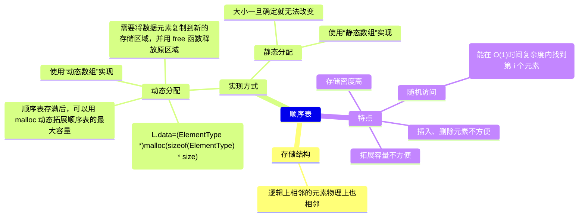

**什么是线性表？**

> 多项式表示问题的启示：
>
> 1. 同一个问题可以有不同的表示（存储）方法
> 2. 有一类共性问题：有序线性序列的组织和管理

“**线性表(Linear List)**”：由<u>同类型</u>的 n(n≥0)个**数据元素**构成**有序序列**的线性结构

* 线性表 L 可以表示为：$L = (a_1,a_2,...,a_i,a_{i-1},...,a_n)$
* 线性表中元素个数是**有限**的
* 表中元素个数称为线性表的长度
* 表中元素的数据类型都相同，每个元素占有相同大小的存储空间
* 线性表没有元素时，称为空表
* 表起始位置称**表头**，表结束位置称**表尾**
* 除第一个元素外，每个元素有且只有一个**直接前驱**；除最后一个元素外，每个元素有且只有一个**直接后继**；

**线性表的抽象数据类型描述**

> [!NOTE]
> 
> * **类型名称**：线性表(List)
> * **数据对象集**：线性表是 n(≥0) 个元素构成的有序序列 ($a_1 , a_2~, ...,a_n$)
> * **操作集**：线性表 L ∈ List，整数 i 表示位置，元素 X ∈ ElementType
>   * ① InitList(&L)：**构造**一个空线性表 L。
>   * ② DestroyList(&L)：**销毁**线性表 L。
>   * ③ ElementType GetElem(L, i)：**按位查找**表 L 中位序 i 元素并返回值（**位序从 1 开始**，数组下标从 0 开始）
>   * ④ ElementType LocateElem(L, ElementType e)：**按值查找**表 L 中 e 的第一次出现位置并返回位置。
>   * ⑤ bool ListInsert(&L, i, ElementType e)：在位序 i 前插入一个新元素 e。
>   * ⑥ bool ListDelete(&L, i, ElementType &e)：删除指定位序 i 的元素，并用 e 记录删除的元素。
>   * ⑦ int ListLength(L)：返回线性表 L 的长度 n。
>   * ⑧ int ListEmpty(L)：若 L 为空表，则返回 TRUE，否则返回 FALSE。
>   * ⑨ PrintList(L)：顺序打印线性表 L 中的所有元素值。

* 函数、变量命名要符合规范，具有可读性。
* 注意函数参数表是否使用**引用类型`&`**。

**线性表的顺序存储实现**

> **命题追踪 > （算法题）顺序表的应用（2010、2011、2018、2020）**

* 顺序表：利用数组的**连续存储空间顺序存放**线性表的各元素
  * 每个数据元素存储位置都和顺序表起始地址相差“**数据元素位序 × sizeof(ElementType)**”，因此可以**随机存取**。
  * **随机存取**访问时间不依赖数据在存储中的位置，**顺序存取**只能按顺序访问数据。
  * 一维数组和顺序表逻辑结构不一定一样，顺序表逻辑结构是线性表，而一维数组逻辑结构可以是线性表、树等。

| 下标 i | 0     | 1     | ... ... | i - 1 | i         | ... ... | n - 1        | ... ... | MAXSIZE - 1 |
| ---- | ----- | ----- | ------- | ----- | --------- | ------- | ------------ | ------- | ----------- |
| Data | $a_1$ | $a_2$ | ... ... | $a_i$ | $a_{i-1}$ | ... ... | $a_n$ (Last) | ... ... | -           |

假定线性表的元素类型为 ElementType，则**静态分配**的顺序表存储结构描述为：

```c
#define MAXSIZE 50               // 定义线性表的最大长度
typedef struct { 
    ElementType data[MAXSIZE];   // 顺序表的元素
    int length;                  // 顺序表的当前长度
} SqList;                        // 顺序表的结构类型定义
SqList *Ptrl;                    // 定义指向链表的指针变量            
```

访问下标为 i 的元素：SqList.data[i] 或 PtrL->data[i]

线性表的长度：SqList.length 或 Ptrl->length（下标从 0 开始）

顺序表的主要优点：

* ①可进行**随机访问**，O(1)时间内可以找到指定元素
* ②**存储密度高**，每个结点只存储数据元素

顺序表的主要缺点：

* ①插入和删除需要移动大量的元素
* ②顺序存储需要分配一段连续的内存空间不够灵活
* ③对于树、图等逻辑结构不如链表存储表示方便

**主要操作的实现**

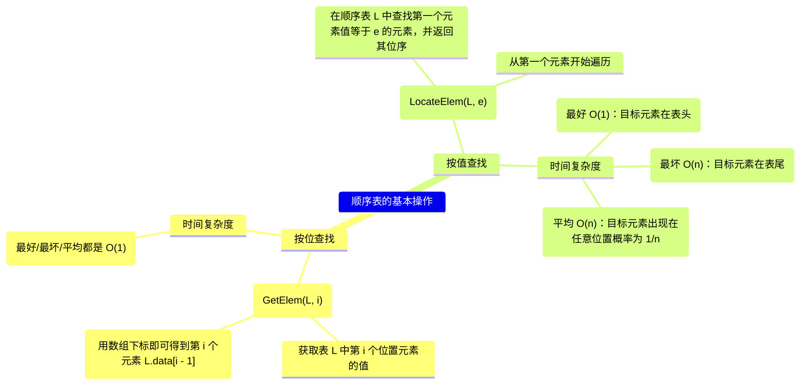

**1.初始化（建立空的顺序表）**

```c
/* 默认之前已经声明过一个顺序表 SqList L */
void InitList(SqList &L)
{ 
    L.length = 0;      // 顺序表初始长度为 0
}
```

​    **静态分配**的数组大小已经事先确定，所以空间一旦占满就无法继续加入数据元素；如果采用**动态分配**，存储数组空间是通过程序执行过程在动态存储分配语句分配的，一旦空间占满，就开辟更大一块存储空间，将原表中的元素全部拷贝到新空间，从而达到数组存储空间动态扩充的目的。

​    动态分配的顺序表存储结构描述为：

```c
#define INITSIZE 100             // 表长度的初始定义
typedef struct { 
    ElementType *data;           // 指示动态分配数组的指针
    int MaxSize;                 // 顺序表的最大长度
    int length;                  // 顺序表的当前长度
} SeqList;                       // 顺序表的结构类型定义
```

顺序表初始化的实现--动态分配

```c
void InitList(SeqList &L)    
{
    L.data = (int *)malloc(InitSize * sizeof(int));
    L.length = 0;
    L.MaxSize = InitSize;
}
```

​    C++可以动态分配存储空间可用：`L.data = new ElementType[InitSize];`

可运行代码实践：

```c
#include <stdio.h>
#include <stdlib.h>
#define INITSIZE 10   // 表初始长度的定义

typedef struct {
    int *data;        // 指示动态分配数组的指针
    int MaxSize;      // 顺序表的最大长度
    int length;       // 顺序表的当前长度
} SeqList;            // 顺序表的结构类型定义

void IncreaseSize(SeqList &L, int len);
void InitList(SeqList &L);

int main()
{
    SeqList L;          // 声明一个顺序表
    InitList(L);        // 初始化顺序表
    //... ...链表插入满
    IncreaseSize(L, 5); // 扩容链表
    return 0;
}

void IncreaseSize(SeqList &L, int len)
{
    int *p = L.data;
    L.data = (int *)malloc((L.MaxSize + len)*sizeof(int)); // 建议用 malloc 而非其他几种动态内存分配方式
    for (int i = 0; i < L.length; i++)
        L.data[i] = p[i];             // 数据复制到新的内存空间
    L.MaxSize = L.MaxSize + len;      // 顺序表最大长度增加 len
    free(p);                          // 释放原来的内存空间
}

void InitList(SeqList &L)    
{
    L.data = (int *)malloc(INITSIZE * sizeof(int));
    L.length = 0;
    L.MaxSize = INITSIZE;
}
```

**2.查找**

**按值查找（顺序查找）**

```c
ElementType LocateElem(SqList L, ElementType e)
{ 
    for (int i = 0; i < L.length; i++)
        if (L.data[i] == e)
            return i + 1;        // 下标为 i 的元素等于 e，找到返回位序 i + 1
    return 0;                    // 查找失败，返回 0
}
```

最好情况：查找元素在**表头**，仅需比较一次，时间复杂度 $O(1)$。

最坏情况：查找元素在**表尾或不存在**时，比较 n 次，时间复杂度 $O(n)$。

平均情况：查找成功的平均比较次数为：$\displaystyle\sum_{i=1}^{n}p_i·i=\sum_{i=1}^{n}\frac{1}n·i=\frac{n +1}2$，平均时间性能为：$O(n)$（无序情况）。

> [!CAUTION]
>
> * 基本数据类型都可以直接使用 == 或 != 比较，而如果 e 为**结构**类型，则不可以直接使用`L.data[i] == e`判断两个结构类型是否相等（C 编译不通过--invalid operands to binary expression）。
> * 分别对比结构各分量是否相等来判断两个结构类型是否相等。

**按位查找**

```c
ElementType GetElem(SqList L, int i)
{
    return L.data[i - 1];  // 可以判断一下 i 的值是否合法
}
```

​    顺序表按序号查找直接根据数组下标访问数组元素，其时间复杂度为 $O(1)$，即**随机存取**特性。

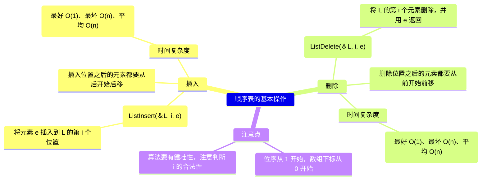

**3.插入**

第 i(1≤i≤L.length+1)个位置上插入一个值为 e 的新元素（即插入下标为 i - 1 的地方）

插入成功返回 true，否则返回 false。

| 下标 i | 0     | 1     | ... ... | i - 1 | i         | ... ... | n - 1        | ... ... | MAXSIZE - 1 |
| ---- | ----- | ----- | ------- | ----- | --------- | ------- | ------------ | ------- | ----------- |
| Data | $a_1$ | $a_2$ | ... ... | $a_i$ | $a_{i+1}$ | ... ... | $a_n$ (Last) | ... ... | -           |

先移动，再插入（为了防止覆盖数据，要从后面的数据开始后移）

| 下标 i | 0     | 1     | ... ... | i - 1 | i     | ... ... | n            | ... ... | MAXSIZE - 1 |
| ---- | ----- | ----- | ------- | ----- | ----- | ------- | ------------ | ------- | ----------- |
| Data | $a_1$ | $a_2$ | ... ... | e     | $a_i$ | ... ... | $a_n$ (Last) | ... ... | -           |

**顺序表插入（基于静态分配）**

```c
bool ListInsert(SqList &L, int i, int e)
{ 
    if (L.length == MAXSIZE) {          // 表空间已满，不能插入
        printf("Sequence list full!\n"); 
        return false; 
    } 
    if (i < 1 || i > L.length + 1) {      // 检查插入位置的合法性，注意可以插入 length 位置(末尾)
        printf("Illegal location!\n＂);
        return false; 
    } 
    for (int j = L.length; j >= i; j--)
        L.data[j] = L.data[j - 1];     // 将 ai～ an 倒序向后移动
    L.data[i - 1] = e;                 // 新元素插入
    L.length++;                        // 表长加一
    return true; 
}
```

最好情况：新元素插入到表尾，不需要移动元素，i = n + 1，循环不执行，最好时间复杂度：$O(1)$

最坏情况：新元素插入到表头，需要将原有的 n 个元素全部向后移动，i = 1，循环 n 次，最坏时间复杂度：$O(n)$

平均情况：平均移动次数：$\displaystyle\sum_{i=1}^{n+1}p_i(n-i+1)=\sum_{i=1}^{n+1}\frac{1}{n+1}(n-i+1)=\frac{n}2$，平均时间复杂度：$O(n)$

**4.删除（基于静态分配）**

删除表的第 i (1≤i≤L.length)个位置上的元素。

删除成功返回 true，并用(引用)变量 e 返回被删除的值，否则返回 false。

| 下标 i | 0     | 1     | ... ... | i - 1 | i         | ... ... | n - 1        | ... ... | MAXSIZE - 1 |
| ---- | ----- | ----- | ------- | ----- | --------- | ------- | ------------ | ------- | ----------- |
| Data | $a_1$ | $a_2$ | ... ... | $a_i$ | $a_{i+1}$ | ... ... | $a_n$ (Last) | ... ... | -           |

先删除，再移动（为了防止覆盖数据，要从前面的数据开始前移）

| 下标 i | 0     | 1     | ... ... | i - 1     | i         | ... ... | n - 2        | ... ... | MAXSIZE - 1 |
| ---- | ----- | ----- | ------- | --------- | --------- | ------- | ------------ | ------- | ----------- |
| Data | $a_1$ | $a_2$ | ... ... | $a_{i+1}$ | $a_{i+2}$ | ... ... | $a_n$ (Last) | ... ... | -           |

```c
bool ListDelete(SqList &L, int i, ElementType &e)
{ 
    if (i < 1 || i > L.length) {     // 检查空表及删除位置的合法性
        printf ("The %d-th element does not exist.\n", i); 
        return false; 
    }
    e = L.data[i - 1];               // 被删除元素赋值给引用变量 e
    for (int j = i; j < L.length; j++)
        L.data[j - 1] = L.data[j];   // 将 ai+1~an 顺序向前移动
    L.length--;                      // 线性表长度减 1
    return true; 
}
```

最好情况：删除表尾元素，i = n，循环 0 次，不需要移动元素，最好时间复杂度：$O(1)$

最坏情况：删除表头元素，i = 1，需要将原有的 n-1 个元素全部向前移动，最坏时间复杂度：$O(n)$

平均情况：平均移动次数：$\displaystyle\sum_{i=1}^{n}p_i(n-i)=\sum_{i=1}^{n}\frac{1}{n}(n-i)=\frac{n-1}2$，平均时间复杂度：$O(n)$

**顺序表基本操作总结**：(已上机验证-静态分配内存方法实现，动态分配内存方法类似)

```c
#include <stdio.h>
#include <stdlib.h>
#define MAXSIZE 50               // 表最大长度的定义

typedef int ElementType;

typedef struct { 
    ElementType data[MAXSIZE];   // 顺序表的元素
    int length;                  // 顺序表的当前长度
} SqList;                        // 顺序表的结构类型定义

void InitList(SqList &L);
ElementType LocateElem(SqList L, ElementType e);
ElementType GetElem(SqList L, int i);
bool ListInsert(SqList &L, int i, int e);
bool ListDelete(SqList &L, int i, ElementType &e);

int main()
{
    SqList L;          // 声明一个顺序表
    int e = 0;         // 初始化引用型变量 e
    printf("%d\n", e);
    
    InitList(L);       // 初始化顺序表
    ListInsert(L, 1, 1);
    ListInsert(L, 2, 2);
    if (LocateElem(L,2))
        printf("Success, location is %d.\n", LocateElem(L,2));
    else
        printf("Error, no exist.\n");
    ListInsert(L, 3, 3);
    ListDelete(L, 2, e);
    printf("%d\n", e);
    if (LocateElem(L,2))
        printf("Success, location is %d.\n", LocateElem(L,2));
    else
        printf("Error, no exist.\n");
    GetElem(L,0);
    printf("1th = %d.\n", GetElem(L,1));

    return 0;
}

void InitList(SqList &L)    
{ 
     L.length = 0;      // 顺序表初始长度为 0
}

ElementType LocateElem(SqList L, ElementType e)
{ 
    int i;
    for (i = 0; i < L.length; i++)
        if (L.data[i] == e)
            return i + 1;        // 下标为 i 的元素等于 e，找到返回位序 i + 1
    return 0;                    // 查找失败，返回 0
}

ElementType GetElem(SqList L, int i)
{
    return L.data[i - 1];
}

bool ListInsert(SqList &L, int i, int e)
{ 
    if (L.length == MAXSIZE) {          // 表空间已满，不能插入
        printf("Sequence list full!\n"); 
        return false; 
    } 
    if (i < 1 || i > L.length + 1) {    // 检查插入位置的合法性，注意可以插入 length 位置(末尾)
        printf("Illegal location!\n");
        return false; 
    } 
    for (int j = L.length; j >= i; j--)
        L.data[j] = L.data[j - 1];     // 将 ai～ an 倒序向后移动
    L.data[i - 1] = e;                 // 新元素插入
    L.length++;                        // 表长加一
    return true; 
}

bool ListDelete(SqList &L, int i, ElementType &e)
{ 
    if (i < 1 || i > L.length) {     // 检查空表及删除位置的合法性
        printf ("The %d-th element does not exist.\n", i); 
        return false; 
    }
    e = L.data[i - 1];               // 被删除元素赋值给引用变量 e
    for (int j = i; j < L.length; j++)
        L.data[j - 1] = L.data[j];   // 将 ai+1~an 顺序向前移动
    L.length--;                      // 线性表长度减 1
    return true; 
}
```

#### 2.1.3 线性表的链式存储及其操作

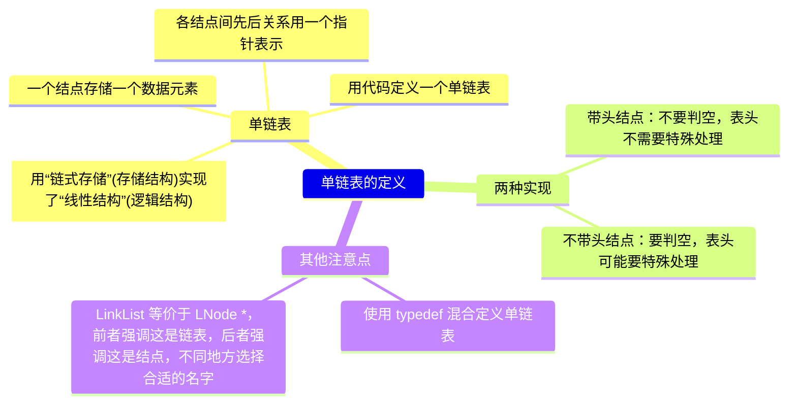

> **命题追踪 > 单链表的应用（2009、2012、2013、2015、2016、2019）**

线性表的链式存储也称**单链表**，**不要求逻辑上相邻的两个元素物理上也相邻**，通过“链”建立起数据元素之间的逻辑关系。

插入、删除**不需要移动数据元素**，只需要修改“链”，但也会**失去顺序表可随机存取的优点**。


```c
typedef struct LNode {  // 混合定义单链表的结点类型
    ElementType data;   // 数据域
    struct LNode *next; // 指针域
} LNode, *LinkList; 
```

* `LinkList`是指向链表结点的结构体指针，则 `*LinkList` 表示结点本身，`(LinkList)->data` 等价于 `(*LinkList).data`；`(*LinkList).next`可得指向下一个结点的指针，所以 `(*(*LinkList).next).data`等价于 `LinkList->next->data`。
* 可以发现，链式存储的插入和删除操作由于不需要大量移动元素而变得简单，但是查找和求表长操作变得复杂了。
* 除了存放元素自身信息外，还需要存放一个指向其后继的指针，所以会浪费一部分存储空间。
* 通常用**头指针 L(或 head)** 来表示一个单链表，指出链表的起始地址，头指针为 NULL 时表示一个空表。为了操作上的方便，在单链表第一个数据结点之前附加一个结点，称为**头结点**。
* 头结点数据域不存放信息，或者记录表长等信息。
* 头指针永远指向链表第一个结点，单链表带头结点时，头指针 L 指向头结点，不带头结点时，头指针 L 指向第一个数据结点，表尾结点的指针域为 NULL（用“^”表示）


* 引入头结点的两个优点：
  * 链表第一个结点和其他位置结点的操作一致，无需特殊处理。
  * 空表和非空表，头指针都是指向头结点的非空指针，处理也是统一的。

**主要操作的实现**

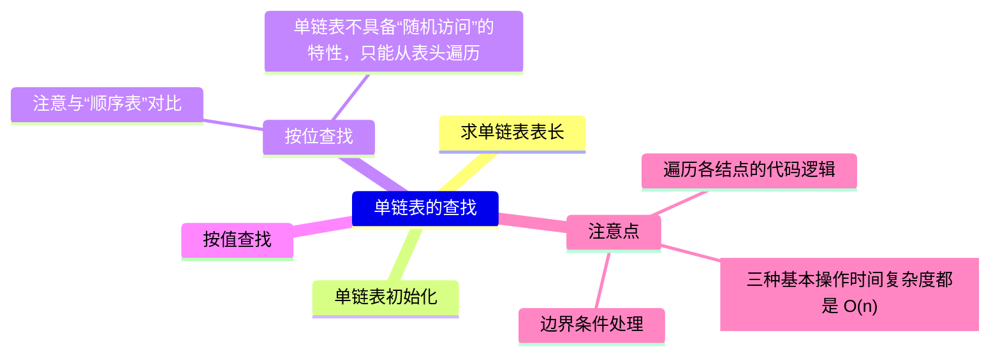

​    **带头结点的单链表操作比较方便**，无特殊说明，都采用带头结点的链表。

**1.单链表的初始化**

​    带头结点单链表初始化时，需要创建一个头结点，并让头指针指向头结点，头结点的 next 域初始化为 NULL。

```c
/* 带头结点单链表初始化 */
bool InitList(LinkList &L)              // 带头结点的单链表的初始化
{
    L = (LNode *)malloc(sizeof(LNode)); // 创建头结点
    if (L == NULL)                      // 内存不足，分配失败
        return false;
    L->next = NULL;                     // 头结点的指针域为空
    return true;
}
```

​    带头结点的单链表判空代码：

```c
/* 带头结点的单链表判空 */
bool IsEmpty(LinkList L)
{
    if (L->next == NULL)
        return true;
    else
        return false;
}
```

​    不带头结点的单链表的初始化时，只需要将头指针 L 初始化为 NULL。

```c
/* 不带头结点的单链表的初始化 */
bool InitList(LinkList &L)       // 不带头结点的单链表的初始化
{
    L = NULL;                    // 头指针为空，空表，暂时还没有任何结点
    return true;
}
```

​    不带头结点的单链表判空代码：

```c
/* 不带头结点的单链表的判空 */
bool IsEmpty(LinkList L)
{
    return (L == NULL);
}
```

**2.求表长**

​    求表长操作是计算单链表中数据结点的个数，需要从第一个结点开始遍历表，统计结点个数，直到访问到空结点为止。

```c
/* 带头结点的单链表求表长 */
int Length(LinkList L)
{ 
    int len = 0;        // 计数变量，初始为 0
    LNode *p = L;
    while (p->next != NULL) { 
        p = p->next;   // 不能写成 p++， p++是指向下一个指针类型位置，而 next 是指向下一结构
        len++;         // 每访问一个结点，计数加 1
    } 
    return len;
}
```

​    时间复杂度为 $O(n)$。不带头结点的单链表求表长如下，在 while 条件判断里面会略有不同。

```c
/* 不带头结点的单链表求表长 */
int Length(LinkList L)
{ 
    int len = 0;        // 计数变量，初始为 0
    LNode *p = L;
    while (p != NULL) { 
        p = p->next;   // 不能写成 p++， p++是指向下一个指针类型位置，而 next 是指向下一结构
        len++;         // 每访问一个结点，计数加 1
    } 
    return len;
}
```

**3.查找**

* **(1) 按位查找结点(GetElem)：**

​    沿着 next 指针域遍历链表，找到序号为 i 的结点，返回该结点的指针，若 i 大于单链表的表长，则返回 NULL。

​    时间复杂度：O(n)

```c
/* 带头结点的按位查找 */
LNode *GetElem(LinkList L, int i)
{
    if (i < 1)
        return NULL;              // 非法位置返回 NULL, i = 0 作为头结点也可以
    LNode *p = L;                 // 指针 p 指向当前扫描到的结点
    int j = 0;                    // 记录当前结点的位序，头结点是第 0 个结点
    while (p != NULL && j < i) {  // 循环找到第 i 个结点
        p = p->next;
        j++; 
    }
    return p;                     // 找到第 i 个，返回指针，越界则返回 NULL
}
```

> [!NOTE]  
>
> * 这里采用`int j = 0`是为了后续逻辑统一，代码更简洁，详细可见单链表插入 ListInsert() 函数部分的说明。

​    单链表不带头结点时，要对空表额外判断：

```c
/* 不带头结点的按位查找 */
LNode *GetElem(LinkList L, int i)
{
    if (i < 1 || L == NULL)          // 非法位置或空表时返回 NULL
        return NULL;       
    LNode *p = L;                    // 指针 p 从数据结点开始（无头结点）
    int j = 0;
    while (p != NULL && j < i - 1) { // 循环找到第 i 个结点
        p = p->next;
        j++; 
    }
    return p;                        // 找到第 i 个，返回指针，越界则返回 NULL
}
```

> [!IMPORTANT]  
>
> * 有可能会有疑问，假设`L == NULL`，后续`LNode *p = L`不是自动将 p 置为空了吗？为什么没有头结点时，要`if (i < 1 || L == NULL)`额外显式判空表？明确显式判空有下面几个好处：
>   * **区分空表与 i 越界**：若不显式判空，则`L == NULL; i == 5`时，返回`NULL`，就无法分清是空表还是下标越界。(当然，此处在返回值上都是 NULL，用户此处仅凭返回值无法判断错误类型，但是不妨碍显式判空能保障代码逻辑安全以及方便调试和拓展)
>   * **明确语义**：链表为空时直接返回，避免后续无效操作。
>   * **防御性编程**：防止因未处理`L == NULL`的情况，比如后续(拓展代码时)出现了`L->next`，导致代码崩溃。
> * 为了和之前带头结点的按位查找函数形式一致，本函数也采用`int j = 0;`的写法，循环条件判断会和带头结点的查找函数略有不同。
> * LinkList 等价于 LNode *，但 LNode 强调**结点**，LinkList 强调**链表**。

* **(2) 按值查找结点(LocateElem)：**

​    从单链表头结点开始，从前往后比较各结点的数据域，如果等于给定值，则返回该结点的指针，没找到则返回 NULL。

​    时间复杂度：$O(n)$

```c
/* 带头结点的按值查找 */
LNode *LocateElem(LinkList L, ElementType e)
{
    Lnode *p = L->next;                // 跳过头结点，从第一个数据结点开始
    while (p != NULL && p->data != e)  // 从第一个结点开始查找数据域为 e 的结点
        p = p->next; 
    return p;                          // 查找成功返回该结点的指针，否则返回 NULL
}
```

​    不带头结点的按值查找，和之前按位查找一样，要一开始就显式判空：

```c
/* 不带头结点的按值查找 */
LNode *LocateElem(LinkList L, ElementType e)
{
    if (head ==NULL)
        return NULL;                   // 显式判空，否则若 L == NULL，下一步 L->next 崩溃
    Lnode *p = L;                      // 直接从头指针所指第一个数据结点开始
    while (p != NULL && p->data != e)  // 从第一个结点开始查找数据域为 e 的结点
        p = p->next; 
    return p;                          // 查找成功返回该结点的指针，否则返回 NULL
}
```

* [x] 讨论 2.1 链式存储中 GetElem 函数的另一种实现？

> 如果将链式存储中 GetElem 的函数另一种实现 FindIth（不带头结点）如下：
>
> ```c
> LNode *FindIth(int i, LinkList L)
> {   
>     LinkList p = L;    
>     int j = 1;    
>     while (p != NULL && j < i) {
>         p = p->next;        
>         i++;     
>     }    
>     if (j == i) 
>         return p;     // 找到第 i 个，返回指针
>     else
>         return NULL;  // 否则返回空
> }
> ```
>
> 做个修改，把函数最后的 if 语句判断条件改为判断 p 是否为 NULL，即：
>
> ```c
> if (p == NULL)
>     return NULL; 
> else
>     return p;
> ```
>
> 或者说直接简化为：`return p;`
>
> 对于这样的修改，程序还正确吗？为什么？

讨论：

* 不正确，当 i 的值不合法的时候，`i <= 0`的时候此时应该返回空，但修改后返回的是第一个结点的指针

**4.插入**

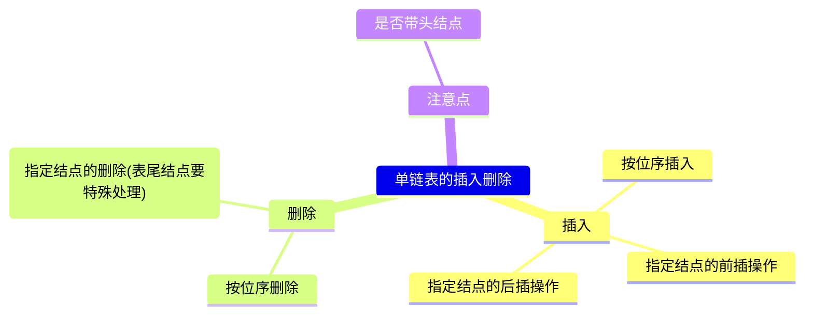

> **命题追踪 > 单链表插入操作的过程（2016、2024）**

在第 i 个位置，即第 i-1(1 ≤ i ≤ n+1) 个结点后插入一个值为 X 的新结点

* (1)先检查插入位置的合法性
* (2)构造一个新结点，用 s 指向；
* (3)再找到链表的第 i-1 个结点，用 p 指向；
* (4)然后修改指针，插入结点 (p 之后插入新结点是 s)


**带头结点的链表插入**，具体实现如下：

```c
/* 带头结点的链表插入 */
bool ListInsert(LinkList &L, int i, ElementType e)
{
    if (i < 1)                       // i 值合法性检查
        return false;
    LNode *p = L;                    // 指针 p 指向当前扫描到的结点
    int j = 0;                       // 记录当前结点的位序，头结点是第 0 个结点
    while (p != NULL && j < i - 1) { // 循环找到第 i-1 个结点
        p = p->next;
        j++;
    }
    if (p == NULL)                   // i 值不合法
        return false;
    LNode *s = (LNode *)malloc(sizeof(LNode));
    s->data = e; 
    s->next = p->next;               // 新结点先接上后继结点
    p->next = s;                     // 前驱结点接上新结点（同时断开原后继结点连接）
    return true;
}
```

最好情况：插入表头，最好时间复杂度：$O(1)$

平均情况：平均查找次数为$\displaystyle\sum_{i = 1}^{n+1}p_i·(i-1)=\frac{1}{n+1}·\frac{(n+1)n}{2}=\frac{n}{2}$，平均时间复杂度：$O(n)$

最坏情况：插入表尾或下标过范围，最坏时间复杂度：$O(n)$

> [!NOTE]
>
> * 修改指针时，新结点要先接到后继结点，再把前驱结点断开，否则会导致链表断裂而找不到后面的结点，即` p->next = s; `和`s->next = p->next;`顺序不能颠倒。
> * 为什么之前带头结点的 GetElem() 函数要令初值`int j = 0;`，在此处得以解答。如果这里令`int j = 1;`，相应的前一句要改成`LNode *p = L->next;`，然后你就会发现，当`i = 1`时需要特殊处理，此时 while 循环不执行，而 p 仍然指向第一个数据结点而非首部，就会导致错误的插入第一个数据元素后面。所以`j = 0`是更优的写法，逻辑统一、无需特殊处理首部插入，代码更简洁，建议始终使用 **j = 0 初始化方式的带头结点链表**。
> * 算法主要时间开销在于查找第 i-1 个元素，时间复杂度：O(n)，若在指定结点后插入新结点，则时间复杂度仅：O(1)

**不带头结点的链表插入**，具体实现如下：

```c
/* 不带头结点的链表插入 */
bool ListInsert(LinkList &L, int i, ElementType e)
{
    if (i < 1)                         // i 值合法性检查
        return false;
    if (i == 1) {                      // 处理插入到首部(i = 1)的情况
        LNode *s = (LNode *)malloc(sizeof(LNode));
        s->data = e;
        s->next = L;
        L = s;                        // 头指针指向新的结点
        return true;
    }
    
    LNode *p = L;                    // 指针 p 指向当前扫描到的结点
    int j = 1;                       // 计数器从 1 开始
    while (p != NULL && j < i - 1) { // 循环找到第 i-1 个结点
        p = p->next;
        j++;
    }
    if (p == NULL)                     // i 值不合法
        return false;
    LNode *s = (LNode *)malloc(sizeof(LNode));
    s->data = e; 
    s->next = p->next;                 // 新结点先接上后继结点
    p->next = s;                       // 前驱结点接上新结点（同时断开原后继结点连接）
    return true;
}
```


> [!WARNING]
>
> * 不带头结点时，需要判断插入位置 i 是否为 1，若是，则要做特殊处理，将头指针指向新的首结点。所以带头结点的单链表操作会更加简单，清晰。
> * 没特殊说明的时候，默认内存空间足够大，所以不会出现 malloc() 返回 NULL 的情况，简而言之就是不用附加条件判断：`if(s == NULL) return false;`。

**指定结点的后插操作**

```c
/* 后插操作：在 p 结点后插入元素 e */
bool InsertNextLNode(LNode *p, ElementType e)
{
    if (p == NULL)
        return false;
    LNode *s = (LNode *)malloc(sizeof(LNode));
    if (s == NULL)
        return false;  // 内存分配失败
    s->date = e;       // 用结点 s 保存数据元素 e
    s->next = p->next;
    p->next = s;       // 将结点 s 连接到 p 之后
    return true;
}
```


时间复杂度：$O(1)$

> [!NOTE]
>
> * **封装**后插操作后，`ListInsert(&L, i, e)`函数可以得以简化，直接 ` return InsertNextLNode(p, e) ` 即可（封装的好处）。
> * 封装可以避免重复代码，简洁易维护。
> * 内存分配失败的情况不写出来也可以。

**【扩展】对某一结点进行前插操作**

* **前插操作**是在某结点的前面插入一个新结点，**后插操作**的定义与之相反。上面提到的插入操作都是后插操作，即先找到第 i-1 个结点，即插入结点的前驱，再对其执行后插操作。
* **对结点的前插操作均可以转化为后插操作**，而前插操作一般方法要寻找前驱（而且必须要传入头指针才能实现），而单链表无法往前寻找，所以时间复杂度为：$O(n)$，但我们可以用一些技巧规避找前驱的过程，而使时间复杂度降为：$O(1)$

​    另一种方式将其转化为后插操作来实现，设待插入结点为 \*s，将 \*s 插入到 \*p 的前面。该方法的主要代码如下：

```c
/* 前插操作：在 p 结点之前插入元素 e */
bool InsertPriorLNode(LNode *p, ElementType e)
{
    if (p == NULL)
        return false;
    LNode *s = (LNode *)malloc(sizeof(LNode));
    if (s == NULL)        // 内存分配失败
        return false;
    s->next = p->next;    // 新结点 s 连到 p 之后
    p->next = s;          // 将 p 中元素复制到 s 中
    s->data = p->data;    // p 中元素覆盖为 e
    p->data = e;
    return true;
}
```

> [!NOTE]
>
> * 简单来说就是在前面 ListInsert() 后插操作之后，将前驱结点和插入结点的数据域交换。
> * 函数接口如果改成`bool InsertPriorLNode(LNode *p, LNode *s)`是一样的道理，不过函数内部就不需要 malloc 新内存空间了。

**5.删除**

删除链表的第 i (1≤i≤n)个位置上的结点

* (1)先检查删除位置的合法性
* (2)先找到链表的第 i-1 个结点，用 p 指向；
* (3)再用指针 q 指向要被删除的结点（p 的下一个结点）;
* (4)然后修改指针，删除 q 所指结点;
* (5)最后释放 q 所指结点的空间。

​    假设结点 \*p 为找到的被删结点的前驱，删除操作的逻辑即修改 \*p 使其指向被删结点的下一结点，然后释放被删结点的存储空间。


```c
/* 带头结点的单链表结点删除 */
bool ListDelete(LinkList &L, int i, ElementType &e)
{
    if (i < 1)                        // 检查 i 的合法性
        return false;
    LNode *p = L;                     // 指针 p 指向当前扫描到的结点
    int j = 0;                        // 记录当前结点的位序，头结点是第 0 个结点
    while (p != NULL && j < i - 1) {  // 循环找到第 i-1 个结点（待删结点前驱）
        p = p->next;
        j++;
    }
    if (p == NULL || p->next == NULL)  // 前驱或者待删结点不存在，则删除失败
        return false;
    LNode *q = p->next;                // 令 q 指向待删除结点（第 i 个结点）
    e = q->data;                       // 引用型变量 e 返回元素的值
    p->next = q->next;                 // 修改链表指针，跳过 *q 结点
    free(q);                           // 释放结点 malloc() 的存储空间
    return true;
}
```

* 算法的主要时间消耗也是在查找操作上
* 平均查找次数为：$\displaystyle\sum_{i = 1}^{n}p_i·(i-1)=\frac{1}{n}·\frac{(n-1)n}{2}=\frac{n-1}{2}$，时间复杂度：$O(n)$
* 最好情况：$O(1)$，最坏情况：$O(n)$

> [!NOTE]
>
> * 修改指针时，s 要先指向待删除结点，再把前驱结点接到后继结点，否则会导致链表断裂而找不到待删除结点。
> * malloc() 的存储空间不及时 free()，系统是不会自动帮你释放的，这一点在 C 语言部分强调过。

不带头结点的单链表结点删除：

```c
/* 不带头结点的单链表结点删除 */
bool ListDelete(LinkList &L, int i, ElementType &e)
{
    if (i < 1 || L == NULL)             // 检查 i 的合法性以及空表
        return false;
    if (i == 1) {                       // 删除第一个结点时要特殊处理
        LNode *q = L;                   // 保存当前头结点
        e = q->data;                    // 带回头结点的值
        L = L->next;                    // 修改头指针为下一个结点
        free(q);                        // 释放原头结点
        return true;
    }
        
    LNode *p = L;                      // 指针 p 指向当前扫描到的结点
    int j = 1;                         // 当前 p 指向第一个结点
    while (p != NULL && j < i - 1) {   // 循环找到第 i-1 个结点（待删结点前驱）
        p = p->next;
        j++;
    }
    if (p == NULL || p->next == NULL)  // 前驱或者待删结点不存在，则删除失败
        return false;
    LNode *q = p->next;                // 令 q 指向待删除结点
    e = q->data;                       // 引用型变量 e 返回待删除元素的值
    p->next = q->next;                 // 修改链表指针，跳过 *q 结点
    free(q);                           // 释放结点 malloc() 的存储空间
    return true;
}
```

> [!NOTE]
>
> * 当链表不带头结点时，需要判断待删结点是否为第一个结点，如果是，要特殊处理，将头指针指向新的首结点。

**【扩展】删除指定结点 *p**

* 要删除某个给定结点 \*p，通常是遍历链表找到其**前驱**，然后执行删除操作。
* 其实，删除结点 \*p 的操作可以用删除 \*p 的后继来实现，实质就是将其后继的值赋予自身，然后再删除后继，也能使时间复杂度为：$O(1)$。
* 实现核心代码如下：

```c
bool DeleteNode (LNode *p) {
    if (p == NULL)
        return false;
    LNode *q = p->next;   // 令 q 指向 *p 的后继结点
    p->data = q->data;    // 自身和后继结点的数据域交换
    p->next = q->next;    // 将 *q 结点从链中“断开”
    free(q);              // 释放后继结点的存储空间
    return true
}
```

> [!CAUTION]
>
> * 假设 *p 是**尾结点**，则必须遍历找到前驱节点再删除。
> * 上面的例子展示了单链表无法找前驱的局限性。

**单链表的建立**


**6.采用头插法建立单链表**

​    该方法从一个空表开始，生成新结点，并将读取到的数据存到新结点的数据域中，然后将新结点插入到当前链表的表头，即头结点之后。


```c
/* 带头结点的头插法建立单链表 */
LinkList ListHeadInsert(LinkList &L)              // 头插法逆向建立单链表
{
    int x;                                         // 插入元素类型为整形
    L = (LinkList)malloc(sizeof(LNode));           // 创建头结点
    L->next = NULL;                                // 初始为空链表（动态申请的内存空间里有可能有脏数据！！！）
    while (scanf("%d", &x) && x != -1) {           // 输入一个不可能取到的数表示结束
        LNode *s = (LNode *)malloc(sizeof(LNode)); // 创建新结点
        s->data = x;
        s->next = L->next;
        L->next = s;                               // 将新结点插入表中，L 为头指针
    }
    return L;
}
```

​    采用头插法建立单链表时，读入数据顺序与生成链表中元素的顺序是相反的，很容易实现**链表的逆置**。每个结点插入的时间为 O(1)，设单链表表长为 n，则总时间复杂度为 O(n)。

> [!WARNING]
>
> * 初始化链表时`L->next = NULL;`必不可少，防止 L->next 指向一些未知地方，产生未知后果。
> * 养成好习惯，只要是初始化单链表都先把头指针指向 NULL。

```c
/* 不带头结点的头插法建立单链表 */
LinkList ListHeadInsert(LinkList &L)              // 头插法逆向建立单链表
{
    int x;                                         // 插入元素类型为整形
    L= NULL;                                       // 初始为空链表
    while (scanf("%d", &x) && x != -1) {           // 输入一个不可能取到的数表示结束
        LNode *s = (LinkList)malloc(sizeof(LNode));// 创建新结点
        s->data = x;
        s->next = L;
        L = s;                                     // 将新结点插入表中，L 为头指针
    }
    return L;
}
```


**7.采用尾插法建立单链表**

​    头插法用于逆序存放链表结点，如果希望二者顺序一致可以使用尾插法。该方法将新结点插入当前链表的表尾，为此必须增加一个尾指针 r，使其始终指向当前链表的尾结点，如图所示。


带头结点的尾插法建立单链表，代码实现如下：

```c
/* 带头结点的尾插法建立单链表 */
LinkList ListTailInsert(LinkList &L)         // 顺序建立单链表
{
    int x;                                   // 结点元素类型为整形
    L = (LinkList)malloc(sizeof(LNode));     // 创建头结点
    LNode *s, *r = L;                        // r 为表尾指针
    while (scanf("%d", &x) && x != -1) {     // 输入一个不可能取到的数表示结束
        s = (LNode *)malloc(sizeof(LNode));
        s->data = x;
        r->next = s;
        r = s;                               // r 指向新的表尾结点
    }
    r->next = NULL;                          // 尾结点指针置空
    return L;
}
```

​    因为附设了一个指向表尾结点的指针，所以时间复杂度和头插法相同。

```c
/* 不带头结点的尾插法建立单链表 */
LinkList ListTailInsert(LinkList &L)        // 顺序建立单链表
{
    int x;                                  // 结点元素类型为整形
    L = NULL;                               // 初始化头指针
    LNode *s, *r = NULL;                    // r 为表尾指针
    while (scanf("%d", &x) && x != -1) {     // 输入一个不可能取到的数表示结束
        s = (LinkList)malloc(sizeof(LNode));// 创建新结点
        s->data = x;
        s->next = NULL;
        if (L == NULL) {                    // 链表为空时，新结点作为第一个结点
            L = s;
            r = L;
        } else {                            // 链表非空时，插入尾部
            r->next = s;
            r = s;
        }
    }
    return L;
}
```


> [!TIP]
>
> * 检查清楚尾指针是否置空，并选择是内部置空还是外部置空。
> * 单链表是整个链表的基础，要熟练掌握单链表的基本操作算法和模板。再设计算法时开业通过画图方式理清算法思路，然后进行算法的编写。

#### 2.1.4 双链表

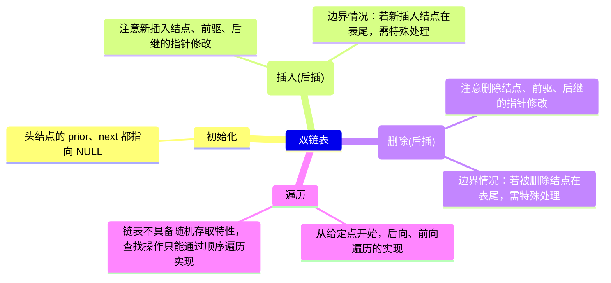

​    单链表只有指向其后继的指针，所以单链表只能从前往后依次遍历，找某个结点前驱的时间复杂度为：O(n)。为了克服这个缺点，引入**双链表**。双链表结点有两个指针 prior 和 next，分别指向其直接前驱和直接后继。下图表头结点的 prior 域和尾结点的 next 域都是 NULL。


双链表的结点类型描述：

```c
typedef struct DNode {            // 定义双链表结点类型
    ElementType data;             // 数据域
    struct DNode *prior, *next;   // 前驱和后继指针
} DNode, *DLinkList;
```

​    双链表在单链表结点中增加了一个指向其前驱的指针 prior，因此双链表的按值查找和按位查找的操作与单链表的相同。但双链表在插入和删除操作的实现上，与单链表有着较大的不同。这是因为“链”变化时也需要对指针 prior 做出修改，其关键是保证在修改的过程中不断链。此外，双链表可以很方便地找到当前结点的前驱，因此，插入、删除操作的时间复杂度仅为 O(1)。

**1.双链表的初始化**

```c
bool InitDLinkList(DLinkList &L)
{
    L = (DNode *)malloc(sizeof(DNode));  // 分配一个头结点
    if (L == NULL)                       // 内存不足，分配失败
        return false;
    L->prior = NULL;                     // 头结点的 prior 永远指向 NULL
    L->next = NULL;                      // 头结点之后暂时还没有节点
    return true;
}
```

**双链表的打印函数（带头结点）：**

```c
void PrintList(DLinkList L)
{
    DLinkList p = L->next;
    while(p != NULL) {
        printf("%d ", p->data);
        p = p->next;
    }
}
```

**2.双链表中插入操作的实现**

> **命题追踪 > 双链表中插入操作的实现（2023）**

​    在双链表中 p 所指的结点之后插入结点 \*s，其指针的变化过程如图所示。

​    插入操作的代码如下：

```c
bool InsertNextDNode(DNode *p, DNode *s)
{
    if (p == NULL || s == NULL)
        return false;
    s->next = p->next;        // ① 将结点*s 插入到结点*p 之后  
    if (p->next != NULL)
        p->next->prior = s;   // ②
    s->prior = p;             // ③
    p->next = s;              // ④
    return true;
}
```


​    上述代码的语句**顺序不是唯一**的，但也不是任意的，①步必须在④步之前，否则 \*p 的后继结点的指针就会丢掉，导致插入失败。为了加深理解，读者可以在纸上画出示意图。

​    若问题改成要求在结点 \*p 之前插入结点 \*s，具体的操作步骤片段如下：(②要在④之前，示意图如下)

```c
s->next = p;           // ① 将结点*s 插入到结点*p 之前
s->prior = p->prior;   // ②
p->prior->next = s;    // ③
p->prior = s;          // ④
```


完整的代码如下：

```c
void InsertBefore(DNode *p, DNode *s) {
    if (p == NULL || s == NULL) {
        return;
    }
    s->next = p;             // 1. 将结点 *s 的 next 指针指向结点 *p
    s->prior = p->prior;     // 2. 将结点 *s 的 prior 指针指向结点 *p 的前驱结点
    if (p->prior != NULL) {
        p->prior->next = s;  // 3. 如果结点 *p 的前驱结点不为空，则将结点 *p 的前驱结点的 next 指针指向结点 *s
    }
    p->prior = s;            // 4. 将结点 *p 的 prior 指针指向结点 *s
}
```

> [!CAUTION]
>
> * 在插入操作前需要确保结点 \*p 和 \*s 都是有效的。
> * 双链表的前插操作都可以转化为找到前驱结点进行后插操作。
> * 这个插入操作假设结点 \*p 不是链表的头结点。如果 \*p 是头结点，还需要额外处理链表头指针，使其指向新的头结点 \*s。

**双链表按位序插入函数：**

```c
bool DListInsert(DLinkList &L, int i, ElementType e) 
{
    if (i < 1)                        // 检查位置合法性
        return false;
    
    DNode *p = L;                     // p 指向头结点
    int j = 0;                        // 当前 p 指向的是第 0 个结点（头结点）
    
    while (p != NULL && j < i - 1) {  // 寻找第 i-1 个结点
        p = p->next;
        j++;
    }
    if (p == NULL)                    // i 超过链表长度+1 或无效位置
        return false;
    
    DNode *s = (DNode *)malloc(sizeof(DNode));
    if (s == NULL)                   // 内存分配失败处理
        return false;
    
    s->data = e;
    s->next = p->next;               // 新结点后继指向原第 i 个结点
    s->prior = p;                    // 新结点前驱指向第 i-1 个结点
    
    if (p->next != NULL) {           // 如果原第 i 个结点存在
        p->next->prior = s;          // 原第 i 个结点的前驱改为新结点
    }
    
    p->next = s; // 第 i-1 个结点的后继改为新结点
    return true;
}
```

```c
/* 不带头结点的双链表按位序插入函数 */
bool DListInsert(DLinkList &L, int i, ElementType e) {
    if (i < 1) // 插入位序必须 ≥1
        return false;

    // 处理插入到第 1 个位置的场景
    if (i == 1) {
        DNode *s = (DNode*)malloc(sizeof(DNode));
        s->data = e;
        s->prior = NULL;    // 新结点前驱置空（作为首结点）
        s->next = L;        // 新结点后继指向原首结点
        if (L != NULL) {    // 原链表非空时，更新原首结点的前驱
            L->prior = s;
        }
        L = s;              // 更新链表头指针
        return true;
    }

    DNode *p = L;          // p 初始指向首结点（位序 1）
    int j = 1;             // 计数器从 1 开始
    // 寻找第 i-1 个结点（需移动 i-2 次）
    while (p != NULL && j < i-1) {
        p = p->next;
        j++;
    }

    if (p == NULL)         // i 超过链表长度+1
        return false;

    DNode *s = (DNode*)malloc(sizeof(DNode));
    s->data = e;
    s->next = p->next;     // 新结点后继指向原第 i 个结点
    s->prior = p;          // 新结点前驱指向第 i-1 个结点

    if (p->next != NULL) { // 若原第 i 个结点存在，更新其前驱
        p->next->prior = s;
    }
    p->next = s;           // 第 i-1 个结点的后继指向新结点

    return true;
}
```

**3.双链表的删除操作的实现**

> **命题追踪 > 双链表中删除操作的实现（2016）**

​    删除双链表中结点 \*p 的后继结点 \*q,其指针的变化过程如图所示：


​    删除操作的代码如下：

```c
bool DeleteNextDNode(DNode *p)
{
    if (p == NULL) return false;
    DNode *q = p->next;           // 找到 p 的后继节点 q 
    if (q == NULL) return false;  // p 没有后继
    p->next = q->next;            // q 结点不是最后一个结点
    if (q->next != NULL)
        q->next->prior = p;
    free(q);                      // 释放结点空间
    return true;
}
```

​    根据上面的代码可以写出**销毁双链表**代码：

```c
void DestroyList(DLinkList &L)  // 循环释放各个数据结点
{
    while (L->next != NULL)
        DeleteNextDNode(L);
    free(L);                    // 释放头结点
    L = NULL;                   // 头指针指向 NULL
}
```

​    若问题改成要求删除结点 \*q 的前驱结点 \*p，具体的操作步骤片段如下：

```c
q->prior->next = q;  // ①
q->prior = p->prior; // ②
free(q);             // 释放结点空间
```


​    在建立双链表的操作中，也可采用如同单链表的头插法和尾插法，但在操作上需要注意指针的变化和单链表有所不同。

**4.双链表的遍历**

```c
while(p != NULL)        // 后向遍历
{
    //对结点 p 做相应的处理，如打印
    p = p->next;
}

while(p != NULL)        // 前向遍历
{
    //对结点 p 做相应的处理，如打印
    p = p->prior;
}

while(p->prior != NULL) // 前向遍历（跳过头结点）
{
    //对结点 p 做相应的处理，如打印
    p = p->prior;
}
```

总结：双链表不可以随机存取，按位查找、按值查找操作都只能用遍历的方式实现，时间复杂度：$O(n)$

#### 2.1.5 循环链表

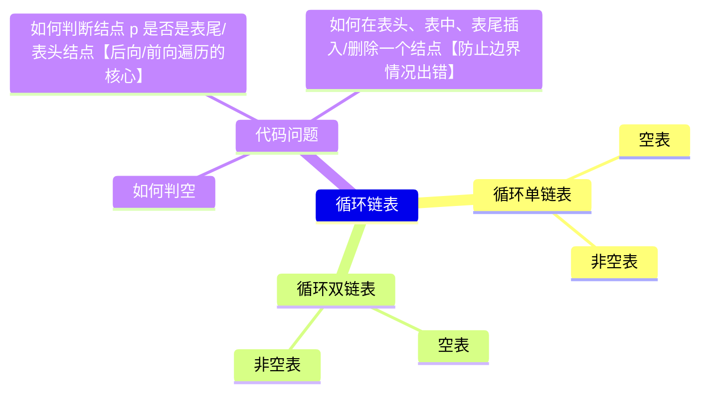


**1.循环单链表**

​    循环单链表和单链表的区别在于，表中最后一个结点的指针不是 NULL, 而改为指向头结点，从而整个链表形成一个环，如下图所示。


​    在循环单链表中，表尾结点 \*r 的 next 域指向 L, 故表中没有指针域为 NULL 的结点，因此，循环单链表的判空条件不是头结点的指针是否为空，而是它是否等于头指针 L。

**Ⅰ.循环单链表的初始化**：

```c
bool InitList(LinkList &L)
{
    L = (LNode *)malloc(sizeof(LNode));  // 分配一个头结点
    if (L == NULL)                       // 内存不足，分配失败
        return false;
    L->next = L;                         // 头结点 next 指向头结点                
    return true;
}
```

 **Ⅱ.循环单链表的判空**：

```c
bool Empty(LinkList L)
{
    if (L->next == L)
        return true;
    else
        return false;
}
```

 **Ⅲ.循环单链表判断是否是表尾**：

```c
bool IsTail(LinkList L, LNode *p)
{
    if (p->next == L)
        return true;
    else
        return false;
}
```

> **命题追踪 > 循环单链表中删除首元素的操作（2021）**

​    **循环单链表的插入、删除算法与单链表的几乎一样**，所不同的是，若操作是在表尾进行，则执行的操作不同，以让单链表继续保持循环的性质。当然，正是因为循环单链表是一个“环”, 所以在任何位置上的插入和删除操作都是等价的，而无须判断是否是表尾。

​    在单链表中只能从表头结点开始往后顺序遍历整个链表，而循环单链表**可以从表中的任意一个结点开始遍历整个链表**。有时对循环单链表不设头指针而仅设尾指针，以使得操作效率更高。其原因是，若设的是头指针，对在表尾插入元素需要 $O(n)$ 的时间复杂度，而若设的是尾指针 r, r->next 即头指针，对在表头或表尾插入元素都只需要 $O(1)$ 的时间复杂度。

> [!TIP]
>
> * 经常要对表头或者表尾操作可以设置一个尾指针 r

 **Ⅳ.循环单链表插入元素**

```c
/* 带头结点的循环链表插入 */
bool ListInsert(LinkList &L, int i, ElementType e) 
{
    if (i < 1)                             // 位序合法性检查 (i ≥ 1)
        return false;
    LNode *p = L;                          // p 指向头结点 (始终存在)
    int j = 0;                             // 计数器从 0 开始 (头结点不计位序)
    while (p->next != L && j < i-1) {      // 寻找第 i-1 个结点 (允许 i=1 时 p 停留在头结点)，关键循环条件
        p = p->next;
        j++;
    }

    if (j != i - 1)                          // i 超过链表长度 +1
        return false;

    LNode *s = (LNode *)malloc(sizeof(LNode));
    s->data = e;
    s->next = p->next;                     // 新结点接后继
    p->next = s;                           // 前驱接新结点
    
    // 若插入到尾部，需维护循环 (新尾结点指向头结点)
    if (s->next == L) {                    // 新结点成为尾结点
        s->next = L;                       // 确保循环闭合
    }
    
    return true;
}
```

 ```c
/* 不带头结点的循环链表插入 */
 bool ListInsert(LinkList &L, int i, ElementType e)
 {
     if (i < 1)                            // i 值合法性检查
         return false;
     if (L == NULL) {                      // 处理空链表插入
         if (i != 1) return false;         // 空链表只能插入到位置 1
         
         LNode *s = (LNode *)malloc(sizeof(LNode));
         s->data = e;
         s->next = s;                      // 自环形成循环链表
         L = s;                            // 头指针指向新结点
         return true;
     }
     
     if (i == 1) {                         // 处理插入到首部的情况
         LNode *s = (LNode *)malloc(sizeof(LNode));
         s->data = e;
         
         LNode *tail = L;                  // 找到尾结点
         while (tail->next != L)           // 循环终止条件
             tail = tail->next;
             
         s->next = L;                      // 新结点指向原首结点
         tail->next = s;                   // 尾结点指向新首结点
         L = s;                            // 更新头指针
         return true;
     }
     
     LNode *p = L;                        // 指针 p 指向当前扫描的结点
     int j = 1;                           // 计数器从 1 开始
     while (p->next != L && j < i - 1) {  // 循环找到第 i-1 个结点
         p = p->next;
         j++;
     }
     
     if (j != i - 1)                      // i 超过链表长度+1（通过循环终止条件判断）
         return false;
         
     LNode *s = (LNode *)malloc(sizeof(LNode));
     s->data = e;
     s->next = p->next;                   // 新结点先接后继结点
     p->next = s;                         // 前驱结点接新结点
     return true;
 }
 ```

 **Ⅴ.循环单链表中删除首元素的操作**

```c
void DeleteFirstNode(LNode &L) {
    if (L == NULL || L->next == L) // 链表为空或只有头结点
        return;
    LinkList p = L;
    L = L->next;　　　　　　　　   // 删除第一个节点
    r->next = L;
    free(p);
}
```

> [!NOTE]
>
> * 没有头结点的情况就是在第一个条件判断内，再加一个 if 条件判断，在只有头结点时直接 free 头结点即可

**Ⅵ.循环单链表的打印**

```c
void PrintList(LinkList L) {   
    if (L == NULL || L->next == NULL) {
        return;
    }
    LinkList p = L->next;
    while (p != L) {
        printf("%d ", p->data); // 假设数据域为 int 型，按实际情况调整格式
        p = p->next;
    }
}
```

```c
/* 不带头结点的循环单链表的打印 */
void PrintList(LinkList L) {   
    if (L == NULL) {
        return;
    }
    LinkList p = L;
    do {
        printf("%d ", p->data); // 假设数据域为 int 型，按实际情况调整格式
        p = p->next;
    } while (p != L);
}
```

**2. 循环双链表**

​    由循环单链表的定义不难推出循环双链表。不同的是，在循环双链表中，头结点的 prior 指针还要指向表尾结点，如图所示。当某结点 \*p 为尾结点时，`p->next == L；`当循环双链表为空表时，其头结点的 prior 域和 next 域都等于 L。

**Ⅰ.循环双链表的初始化**：

```c
bool InitDLinkList(DLinkList &L)
{
    L = (DNode *)malloc(sizeof(DNode));  // 分配一个头结点
    if (L == NULL)                       // 内存不足，分配失败
        return false;
    L->prior = L;                        // 头结点的 prior 指向头结点
    L->next = L;                         // 头结点的 next 指向头结点
    return true;
}
```

 **Ⅱ.循环双链表的判空**：

```c
bool Empty(DLinkList L)
{
    if (L->next == L)
        return true;
    else
        return false;
}
```

 **Ⅲ.循环双链表判断表尾**：

```c
bool IsTail(DLinkList L, DNode *p)
{
    if (p->next == L)
        return true;
    else
        return false;
}
```


**Ⅳ.循环双链表的插入**：(对比之前，此处不需要考虑 p **指向表尾**的情况，因为 p->next 仍然指向表头而不为空，下面的删除操作同理)

```c
bool InsertNextDNode(DNode *p, DNode *s)
{
    s->next = p->next;
    p->next->prior = s;
    s->prior = p;
    p->next = s;
    return true;
}
```

**Ⅴ.循环双链表的删除**(表尾情况不用考虑)：

```c
bool DeleteNextDNode(DNode *p)
{
    DNode *q = p->next;
    p->next = q->next;
    q->next->prior = p;
    free(q);
    return true;
}
```

> [!NOTE]
>
> * 所有 next 指针构成一个闭环，所有 prior 指针同理。

#### 2.1.6 静态链表

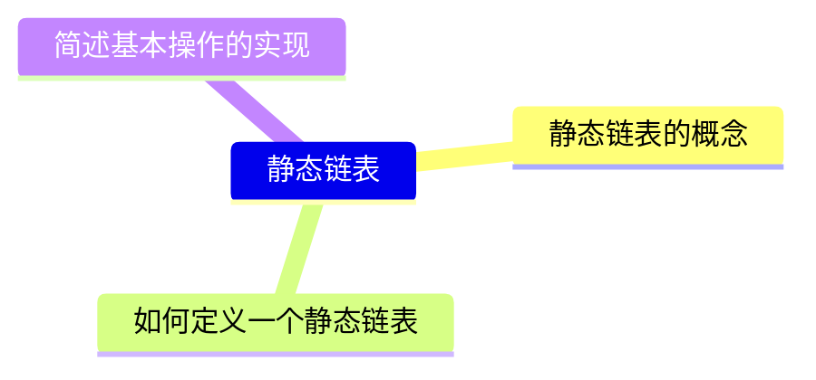

​    静态链表分配**一整片连续的内存空间**，各个结点集中安置。

​    **静态链表**是用**数组**来描述线性表的链式存储结构，结点也有数据域 data 和指针域 next，与前面所讲的链表中的指针不同的是，这里的指针是结点在数组中的相对地址（数组下标），也称**游标**（0 号结点作“头结点”，-1 表示到达表尾）。和顺序表一样，静态链表也要预先分配一块连续的内存空间。

​    静态链表和单链表的对应关系如图所示：


静态链表结构类型的描述如下：

```c
#define MAXSIZE 50   // 静态链表的最大长度
typedef struct {     // 静态链表结构类型的定义
    ElementType data;// 存储数据元素
    int next;        // 下一个元素的数组下标
} SLinkList[MAXSIZE];

// 等价于
struct Node{     
    ElementType data;
    int next;
}
typedef struct Node SLinkList(MAXSIZE);
```

> [!NOTE]
>
> * 第一种定义方式虽然少见，但是好处就是在函数里面使用`SLinkList a;`可以很明确知道是**定义了一个 MAXSIZE 长度的静态链表**
> * 第二种定义方式，在函数中使用`struct Node a[MAXSIZE]`，直觉上像**定义了一个 Node 型数组 a 一样**。

​    静态链表以`next == -1`作为其结束的标志。静态链表的**插入、删除操作与动态链表的相同，只需要修改指针，而不需要移动元素**。总体来说，静态链表没有单链表使用起来方便，但在一些**不支持指针的高级语言**（如 Basic）中，这是一种非常巧妙的设计方法。

**Ⅰ.静态链表的初始化**

​    把 a[0] 的 next 设为-1，相当于链表中让第一个结点指向 NULL。

​    遍历链表，把值（脏数据）初始化为某一特殊值。

**Ⅱ.静态链表的查找**

​    从头结点开始往后遍历，时间复杂度 $O(n)$

**Ⅲ.静态链表的插入**

​    插入位序为 i 的结点：

* ①找到一个空的结点，存入数据元素
* ②从头结点除法找到位序为 i-1 的结点
* **③修改新结点的** next
* ④修改 i-1 号结点的 next

> [!NOTE]
>
> * 注意，这里的**空的结点**，人类视角看示意图为空，但是计算机角度看，其实这些地方是**脏数据**，所以可以在之前初始化时遍历链表，把这些地方的数据统一改写成一个不会用到的特殊值，这样后面插入元素遍历到这个特殊值时，就知道这个结点是空结点了。
> * 静态链表中，逻辑上相邻的元素物理上可能不相邻。
> * 不能随机存取，只能从头开始遍历。
> * 静态链表的**容量固定不可变**。
> * 适用场景
>   * 不支持指针的语言
>   * 数据元素固定不变的场景，如 OS 的**文件分配表 FAT**

#### 2.1.7 广义表与多重链表

之前介绍了一元多项式的表示，那么二元多项式又该如何表示？ 比如，给定二元多项式：
$$
P(x, y) = 9x^{12}y^2 + 4x^{12} + 15x^8y^3 - x^8y + 3x^2
$$
可以将上述二元多项式看成关于 x 的一元多项式：
$$
P(x,y) = (9y^2+4)x^{12} + (15y^3-y)x^8 + 3x^2
$$
又可以将其看作 $ax^{12} + bx^8 + cx^2$，所以，上述二元多项式可以用**“复杂”链表**表示为：


**广义表(Generalized List)**

* 广义表是**线性表的推广**
* 对于线性表而言，n 个元素都是基本的**单元素**
* 广义表中，这些元素不仅可以是单元素也可以是**另一个广义表**

```c
typedef struct GNode *GList;
struct GNode {
    int Tag;    /* 标志域：0 表示结点是单元素，1 表示结点是广义表 */
    union {     /* 子表指针域 Sublist 与单元素数据域 Data 复用，即共用存储空间 */
        ElementType Data;
        GList SubList; 
    } URegion;
    GList Next; /* 指向后继结点 */
};
```

<table><thead>
  <tr>
    <td rowspan="2">Tag</td>
    <td>Data</td>
    <td rowspan="2">Next</td>
  </tr>
  <tr>
    <td>SubList</td>
  </tr></thead>
</table>

**多重链表(multilinked list)**

链表中的结点可能同时隶属于多个链

* 多重链表中结点的**指针域会有多个**，如前面例子包含了 Next 和 SubList 两个指针域；
* 但包含两个指针域的链表并不一定是多重链表，比如**双向链表不是多重链表**。

多重链表有广泛的用途： 基本上如**树**、**图**这样相对复杂的数据结构都**可以采用多重链表**方式实现存储。

【例】矩阵可以用二维数组表示，但二维数组表示有两个缺陷：

* 数组的**大小需要事先确定**
* 对于**稀疏矩阵**，将造成大量的**存储空间浪费**

$$
A=\left[\begin{array}{ccccc}
18 & 0 & 0 & 2 & 0 \\
0 & 27 & 0 & 0 & 0 \\
0 & 0 & 0 & -4 & 0 \\
23 & -1 & 0 & 0 & 12
\end{array}\right] \quad B=\left[\begin{array}{cccccc}
0 & 2 & 11 & 0 & 0 & 0 \\
3 & -4 & -1 & 0 & 0 & 0 \\
0 & 0 & 0 & 9 & 13 & 0 \\
0 & -2 & 0 & 0 & 10 & 7 \\
6 & 0 & 0 & 5 & 0 & 0
\end{array}\right]
$$

【分析】 采用一种典型的多重链表——**十字链表**来存储稀疏矩阵

* 只存储矩阵非 0 元素项
  * 结点的**数据域**：行坐标 Row、列坐标 Col、数值 Value
* 每个结点通过**两个指针域**，把同行、同列串起来;
  * 行指针（或称为向右指针）**Right**
  * 列指针（或称为向下指针）**Down**


* 用一个标识域 Tag 来区分头结点和非 0 元素结点：
* 头结点的标识值为“Head”，矩阵非 0 元素结点的标识值为“Term”


#### 2.1.8 顺序表和链表的比较

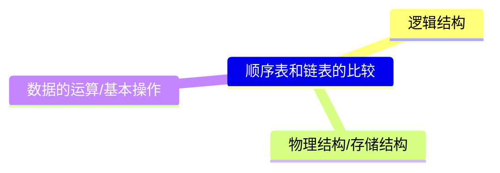

**1.存取 (读/写) 方式**

​    顺序表可以顺序存取，也可以**随机存取**，链表只能从头开始依次顺序存取。例如在第 i 个位置上执行存取的操作，顺序表仅需一次访问，而链表则需从头开始依次访问 i 次。

**2.逻辑结构与物理结构**

​    采用顺序存储时，逻辑上相邻的元素，对应的物理存储位置也相邻。而采用链式存储时，逻辑上相邻的元素，物理存储位置不一定相邻，对应的逻辑关系是通过**指针链接**来表示的。

​    顺序表和链表**都属于线性表，都是线性结构。**

**3.查找、插入和删除操作**

​    对于按值查找，顺序表无序时，两者的时间复杂度均为 O(n)；顺序表有序时，可采用**折半查找**，此时的时间复杂度为 O(log n)。对于按序号查找，顺序表支持**随机访问**，时间复杂仅为 O(1)，而链表的平均时间复杂度为 O(m)。顺序表的插入、删除操作，平均需要移动半个表长的元素。链表的插入、删除操作，只需修改相关结点的指针即可。

**4.空间分配**

​    顺序存储在静态存储分配情形下，一旦存储空间装满就不能扩充，若再加入新元素，则会出内存溢出，因此需要预先分配足够大的存储空间。预先分配过大，可能会导致顺序表后部大量闲置；预先分配过小，又会造成溢出。动态存储分配虽然存储空间可以扩充，但需要移动大量元素，导致操作效率降低，而且若内存中没有更大块的连续空闲空间，则会导致分配失败。链式存储的结点空间只在需要时申请分配，只要内存有空间就可以分配，**操作灵活、高效**。此外，链表的每个结点都带有指针域，因此其存储密度不够大。

​    静态数组是静态分配，系统自动回收空间，链表、动态数组是动态分配，位于**堆区**，malloc 和 free 要成对出现，否则会导致内存泄漏。

​    在实际中应该怎样选取数据存储结构呢？

**1.基于存储的考虑**

​    难以估计线性表的长度的长度或存储规模时，不宜采用顺序表；链表不用事先估计存储规模，但链表的存储密度较低，显然链式存储结构的存储密度是小于 1 的。

**2.基于运算的考虑**

​    在线性表中按访问 $a_{i}$ 的时间复杂度为 O(1)，而链表中按序号访问的时间复杂度为 O(n)，因此经常做的运算是按序号访问数据元素，则显然顺序表优于链表。

​    在顺序表中进行插入、删除操作时，平均要移动表中一半的元素，当数据元素的信息量较大且较长时，这一点是不应忽视的；在链表中进行插入、删除操作时，虽然也要寻找插入位罝，但操作主要是比较操作，从这个角度考虑显然后者优于前者。

**3.基于环境的考虑**

​    顺序表容易实现，任何高级语言中都有数组类型；链表的操作是基于指针的，相对来讲，前者实现较为简单，这也是用户考虑的一个因素。

​    总之，两种存储结构各有长短，选择哪一种由实际问题的主要因素决定。通常较稳定的线性表选择顺序存储，而频繁进行插入、删除操作的线性表 (动态性较强) 宜选择链式存储。

|     | 顺序表 | 链表  |
| --- | --- | --- |
| 弹性  | 😭  | 😀  |
| 增、删 | 😭  | 😀  |
| 查、改 | 😀  | 😭  |

> [!TIP]
>
> * 只有熟练掌握顺序存储和链式存储，才能深刻理解它们的优缺点。
> * 分析线性表和链表的异同时，注意从**逻辑结构、存储结构、基本操作**等等方面入手，有条理的回答问题。

#### 2.1.9 归纳总结

​    本章是算法设计题的重点考查章节，因为线性表的算法题的代码量一般都比较少，又具有一定的算法设计技巧，因此适合笔试考查。代码题常以三段式的结构命题。

在给出题目背景和要求的情况下：

① 给出算法的基本设计思想。
② 采用 C 或 C++ 语言描述算法，并给出注释。
③ 分析所设计算法的时间复杂度和空间复杂度。

​    算法具体的设计思想千变万化，难以从一而定。因此一定要勤加练习，反复咀嚼本章的练习题，采用多种方法进行设计并比较它们的复杂度，逐渐熟悉各类题型的思考角度和最佳思路。这里，列出几种常用的算法设计技巧，仅供参考：对于链表，经常采用的方法有**头插法、尾插法、逆置法、归并法、双指针法**等，对具体问题需要灵活变通；对于顺序表，因为可以直接存取，所以经常结合排序和查找的几种算法设计思路进行设计，如**归并排序、二分查找**等。

> [!WARNING]
> 
> * 对于算法设计题，若能写出数据结构类型的定义、正确的算法思想，则至少会给一半的分数；若能用伪代码写出，则自然更好；比较复杂的地方可以直接用文字表达。

**思维拓展**

​    一个长度为 n 的整型数组 A[1…n]，给定整数 x，设计一个时间复杂度不超过 $O(nlog_{2}n)$ 的算法，查找出这个数组中所有两两之和等于 x 的整数对（每个元素只输出一次）。

​    提示：本题若想到排序，则问题便迎刃而解。先用一种时间复杂度为 $O(nlog_{2}n)$ 的排序算法将 A[1…n] 从小到大排序，然后分别从数组的小端 (i=1) 和大端 (j=n) 开始查找：若 A[i] + A[j] < x，i++；若 A[i] + A[j] > x，j--；否则输出 A[i]、A[j]，然后 i++，j--；直到 i >= j 时停止。

​    请思考本题是否有其他求解算法。

### 2.2 习题

#### 2.2.a1 数据结构实现基础

**2.1 【PTA 浙大版《数据结构（第 2 版）》题目集 下同】简单计算器**

​    模拟简单运算器的工作。假设计算器只能进行加减乘除运算，运算数和结果都是整数，四种运算符的优先级相同，按从左到右的顺序计算。

​    输入在一行中给出一个四则运算算式，没有空格，且至少有一个操作数。遇等号“=”说明输入结束。在一行中输出算式的运算结果，或者如果除法分母为 0 或有非法运算符，则输出错误信息“ERROR”。

解析： #分支结构 #online_judge 

​    算法思想：读取“操作数、操作符、操作数”，根据操作符的不同选择不同的运算，结果作为新的左操作数，直到遇到等号为止。如果遇到除 0、或者操作符不为四则运算的时候返回 ERROR。

```c
#include <stdio.h>

int main()
{
    int a, b;
    char c;
    scanf("%d", &a);
    scanf("%c", &c);
    
    int res = a;
    int flag = 0;


    while (c != '=') {
        scanf("%d", &b);
        if (c == '+') {
            res = a + b;
        } else if (c == '-') {
            res = a - b;
        } else if (c == '*') {
            res = a * b;
        } else if (c == '/') {
            if (b == 0) {
                flag = 1;
                break;
            } else {
                res = a / b;
            }
        } else {
            flag = 1;
        }
        a = res;
        scanf("%c", &c);
    }

    if (flag == 1)
        printf("ERROR\n");
    else
        printf("%d", res);
    
    return 0;
}
```

> [!NOTE]
> 
> * scanf() 返回值是**成功读取的变量个数**，所以 while 条件判断不可以写成`scanf("%c", &c) != '='`。
> * 时间复杂度：$O(n)$，空间复杂度：$O(1)$。

**2.2 数组循环左移**

​    本题要求实现一个对大小为 n 的整数数组进行循环左移 m 位的简单函数。如：1,2,3,4,5,6,7,8 循环左移三位后结果是：4,5,6,7,8,1,2,3。

解析： #逆置 #online_judge

​    算法思想：不借助额外数组的情况，就采用原地工作的算法，左移 m 位等价于前 m 位逆置，后 n-m 位逆置，最后再整体逆置。

```c
#include <stdio.h>

void ArrayReverse(int A[], int left, int high)
{
    if (left >= high)
        return ;
    int len = high - left;
    int temp;
    for (int i = 0; i <= len / 2; i++) {
        temp = A[left + i];
        A[left + i] = A[high - i];
        A[high - i] = temp;
    }
}

int main()
{
    int n, m;
    scanf("%d %d", &n, &m);
    int a[n];
    
    m = m % n;
    for (int i = 0; i < n; i++) {
        scanf("%d", &a[i]);
    }
    ArrayReverse(a, 0, m - 1);
    ArrayReverse(a, m, n - 1);
    ArrayReverse(a, 0, n - 1);

    for (int i = 0; i < n; i++) {
        printf("%d", a[i]);
        if (i != n - 1)
            printf(" ");
    }

    return 0;
}
```

> [!NOTE]
> 
> * 注意 ArrayReverse() 函数内部 for 循环 i <= len / 2，要取等号保证最中间的两个数也处理。
> * 注意 ArrayReverse() 函数，当边界不符合要求时要及时返回，避免段错误。
> * 时间复杂度：$O(n)$，除了给定数组之外的空间复杂度：$O(1)$。

**2.3 数列求和-加强版**

请编写 C 或者 C++ 程序，在时间复杂度尽可能小的前提下，输入整数 n 和 a，输出下面等式的结果（0≤n≤100000，1≤a≤9）：

$$
S = a + aa + aaa + aaa\dots a(n 个 a)
$$

解析： #online_judge #大整数

​    算法思想：根据数位特点直接从低位开始计算每一位的和并处理进位，然后最高位有进位单独处理，**没有则将刚刚存入数组的数位逆序输出即得答案**。

```c
#include <stdio.h>
#define MAXN 100001                      // 根据题目 n 的范围调整

int main() {
    int a, n;
    int arr[MAXN] = {0};                 // 初始化数组为 0
    int carry = 0;                       // 进位
    scanf("%d %d", &a, &n);
    
    if (n == 0) {
        printf("0");
        return 0;
    }
    
    for (int i = 0; i < n; i++) {        // 计算每一位的和并处理进位
        int total = (n - i) * a + carry;
        arr[i] = total % 10;
        carry = total / 10;
    }
    
    if (carry > 0)                       // 处理最高位的进位
        printf("%d", carry);
    
    for (int i = n - 1; i >= 0; i--)     // 逆序输出数组中的每一位
        printf("%d", arr[i]);
    
    return 0;
}
```

> [!NOTE]
> 
> * 由于最后一个数有可能有 100000 位，所以 C 语言正常数据类型都没法处理，如果你想的比较复杂，用**高精度加法**来做，时间复杂度：$O(n^{2})$，还是太高了，OJ 平台最后一个数据点没法通过。
> * 本题算法的时间复杂度：$O(n)$，空间复杂度：$O(n)$。
> * 处理数据**从低位开始**，这样进位比较好处理，最后将数组逆序输出。

**2.4 递增的整数序列链表的插入**

​    本题要求实现一个函数，在递增的整数序列链表（带头结点）中插入一个新整数，并保持该序列的有序性。

​    **裁判程序如下：**

```c
#include <stdio.h>
#include <stdlib.h>

typedef int ElementType;
typedef struct Node *PtrToNode;
struct Node {
    ElementType Data;
    PtrToNode   Next;
};
typedef PtrToNode List;

List Read(); /* 细节在此不表 */
void Print( List L ); /* 细节在此不表 */

List Insert( List L, ElementType X );

int main()
{
    List L;
    ElementType X;
    L = Read();
    scanf("%d", &X);
    L = Insert(L, X);
    Print(L);
    return 0;
}

/* 你的代码将被嵌在这里 */
```

解析： #单链表  #online_judge

​    算法思想：设置工作指针 p，遍历链表，其后继小于 X 则同步移动指针，直到找到大于 X 的位置或者遍历完整个链表，申请一个结点 s，将 s 插入 p 指针所指结点之后。

```c
List Insert(List L, ElementType X)
{
    List p = L;
    while (p->Next != NULL && p->Next->Data < X)   // 遍历完整个链表或者找到插入位置，结束循环
        p = p->Next;
    List s = (List)malloc(sizeof(struct Node));    // 申请新结点
    s->Data = X;
    s->Next = p->Next;                             // 插入新结点
    p->Next = s;

    return L;
}
```

> [!WARNING]
> 
> * L 不会为 NULL，所以不会有空指针解引用的问题，开头加上`L == NULL`直接返回也不会有问题。
> * 注意边界条件，应该先找位置后插入，而不是在循环内插入然后 break，这样可以处理遍历结束都找不到插入位置的情况，即**插入位置在链尾的情况**。
> * 几个 typedef 之间的关系：`List s = (List)malloc(sizeof(struct Node));`不可以写成`List s = (List)malloc(sizeof(List));`，这是因为`typedef struct Node *PtrToNode;`定义了指向结构体的指针变量 PtrToNode，而`typedef PtrToNode List;`意味着 List 和 PtrToNode 是一样的指针变量，所以 sizeof(List) 是一个指针大小而非结构体大小。
> * OJ 平台上的调试结果：sizeof(List) = 8，sizeof(int) = 4，sizeof(PtrToNode) = 8，sizeof(struct Node) = 16
> * 如果 malloc() 分配的内存空间比实际结点的结构体所占大，则会掩盖存在的问题，代码不会出错，但这不代表代码逻辑正确。

**2.5 【PTA 习题集、AcWing 3639 贵州大学考研机试题】两个有序链表序列的合并**

​    本题要求实现一个函数，将两个链表表示的递增整数序列合并为一个非递减的整数序列。

**裁判测试程序样例：**

```c
#include <stdio.h>
#include <stdlib.h>

typedef int ElementType;
typedef struct Node *PtrToNode;
struct Node {
    ElementType Data;
    PtrToNode   Next;
};
typedef PtrToNode List;

List Read(); /* 细节在此不表 */
void Print( List L ); /* 细节在此不表；空链表将输出 NULL */

List Merge( List L1, List L2 );

int main()
{
    List L1, L2, L;
    L1 = Read();
    L2 = Read();
    L = Merge(L1, L2);
    Print(L);
    Print(L1);
    Print(L2);
    return 0;
}

/* 你的代码将被嵌在这里 */
```

**输入/输出样例：**

```in
3
1 3 5
5
2 4 6 8 10
```

```out
1 2 3 4 5 6 8 10 
NULL
NULL
```

解析： #链表归并  #online_judge

​    算法思想：申请一个新结点 L 作为表头，一个指针 r 指向尾部结点，设置工作指针 p、q 分别遍历两个链表，对比所指两个结点大小，将小的那个结点利用尾插法连接到新表 L 尾部，处理完其中一个链表，将剩哪个长链表连接到 L 尾部，然后让尾指针和两个旧表头指向 NULL，两个旧表头结点置空。

```c
List Merge(List L1, List L2)
{
    List p = L1->Next, q = L2->Next, r;    // 设工作指针分别为 p 和 q

    List L = (List)malloc(sizeof(struct Node));
    r = L;
    
    while (p != NULL && q != NULL) {
        if (p->Data < q->Data) {
            r->Next = p;
            r = p;
            p = p->Next;
        } else {
            r->Next = q;
            r = q;
            q = q->Next;
        }
    }
    while (p) {
        r->Next = p;
        r = p;
        p = p->Next;
    }
    while (q) {
        r->Next = q;
        r = q;
        q = q->Next;
    }
    r->Next = NULL;
    L1->Next = NULL;
    L2->Next = NULL;
    
    return L;
}
```

> [!NOTE]
> 
> * 发现了吗，最后**两个 while 循环 + 尾指针置空语句**可以用一句`r->Next = (p? p: q);`替代，这是链表相比于顺序表的优势。
> * 时间复杂度：$O(n)$，空间复杂度：$O(1)$。
> * 如果是 L1，L2 是不带头结点的单链表，可以在 while 循环前进行 L 首结点的选取，这样就转换为带头结点的单链表。

**2.6 递归求简单交错幂级数的部分和**

​    本题要求实现一个函数，计算下列简单交错幂级数的部分和：

$$
f(x,n)=x-x^2+x^3-x^4+\dots+(-1)^{n-1}x^n,(n>0)
$$

​    其中题目保证传入的`n`是正整数，并且输入输出都在双精度范围内。函数`fn`应返回上述级数的部分和。

**裁判程序样例：**

```c
#include <stdio.h>

double fn( double x, int n );

int main()
{
    double x;
    int n;
    
    scanf("%lf %d", &x, &n);
    printf("%.2f\n", fn(x,n));
    
    return 0;
}

/* 你的代码将被嵌在这里 */
```

解析： #递归 #online_judge

​    算法思想：递归出口`n == 1`时结束递归，递归式子：`f(x, n) = x * (1 - fn(x, n - 1))`，根据递归出口和递归式子写出递归函数。

```c
double fn(double x, int n)
{
    if (n > 1)
        return x * (1 - fn(x, n - 1));
    else 
        return x;
}
```

> [!NOTE]
> 
> * 上面的递归算法时间复杂度：$O(n)$，空间复杂度：$O(n)$。
> * 下面这种写法看似像递归方法，但因为**没有认真想清楚简洁的递归式子**，导致还需要借助幂函数才能实现，不是题目的本意。下面递归函数的递归式子：$f(x,n)=f(x,n-1)+(-1)^{n-1}x^n$，此时时间复杂度为：$O(n^2)$，空间复杂度为：$O(n)$。
>
> ```c
> #include <math.h>
> 
> double fn(double x, int n)
> {
>     double ret;
>     if (n > 1)
>         ret = fn(x, n - 1) + pow(-1, n - 1) * pow(x, n);
>     else 
>         ret = x;
>     return ret;
> }
> ```

**2.7 弹球距离**

​    设有一个球从高度为 h 米的地方落下，碰到地面后又弹到高度为原来 p 倍的位置，然后又落下，再弹起，再落下…。请编写函数求初始高度为 h 的球下落后到基本停下来（高度小于给定阈值 TOL）时在空中所经过的路程总和。

​    其中`h`是球的初始高度，`p`是球弹起高度与弹起前落下高度的比值；函数`dist`要返回球下落后到基本停下来时在空中所经过的路程总和。注意：当弹起的高度小于裁判程序定义的常数`TOL`时，弹起的距离不计算在内。

**裁判程序样例：**

```c
#include <stdio.h>
#define TOL 1E-3

double dist( double h, double p );

int main()
{
    double h, p, d;
    scanf("%lf %lf", &h, &p);
    d = dist(h, p);
    printf("%.6f\n", d);
    return 0;
}

/* 你的代码将被嵌在这里 */
```

**输入/输出样例：**

```in
1.0 0.4

```

```out
2.331149

```

解析： #实际问题 #online_judge

​    算法思想：第一段下落距离为 h，当回弹距离小于 TOL，总路程加上两倍 p×h，直到回弹距离小于 TOL 为止，返回总路程。

```c
double dist(double h, double p)
{
    double s = h;
    while (p * h > TOL) {
        s += 2 * p * h;
        h = p * h;
    }
    return s;
}
```

**2.8 输出全排列**

​    请编写递归函数，按**字典序**输出 1,2,3，...，n 的**全排列**（n 小于 10），并观察 n 逐步增大时程序的运行时间。

解析： #online_judge #medium #回溯 #字典序 #DFS #代码模板 

​    预备知识：**回溯法**是一种通过探索所有可能的候选解来找出所有的解的算法。如果候选解被确认不是一个解（或者至少不是最后一个解），回溯算法会通过在上一步进行一些变化抛弃该解，即回溯并且再次尝试。

​    算法思想：设置 current 数组用来保存当前生成的排序序列，用 used 数组来标记数字是否使用过，从低位开始生成全排列序列，全部位数都填满时从 current 数组输入全排列序列，否则从数字 1 开始遍历，如果该数字没使用过，就存入 current 数组并将该数字的 used 数组置为 1，然后递归填充下一位，填充完毕后回溯当前分支填充的对应数字的 used 数组，直至全部可能可能的数字填充完毕。示意图如下：


```c
#include <stdio.h>

int n;                            // 输入的全排列数字范围（1~n）
int current[10];                  // 保存当前生成的排列序列
int used[10] = {0};               // 标记数字是否已被使用，0 未用 / 1 已用

void print_perm() {               // 打印当前生成的排列
    for (int i = 1; i <= n; i++) {
        printf("%d", current[i]); // 逐个打印排列中的数字
    }
    printf("\n");                 // 换行分隔不同排列
}

void generate(int pos) {          // 递归生成全排列的核心函数
    if (pos == n + 1) {           // pos: 当前正在填充的位置（从 1 开始）
        print_perm();             // 输出当前完整的排列
        return;
    }

    for (int num = 1; num <= n; num++) {  // 按升序遍历所有数字（保证字典序的关键）
        if (!used[num]) {
            used[num] = 1;                // 标记为已使用
            current[pos] = num;           // 将当前数字放入排列的 pos 位置
            generate(pos + 1);            // 递归填充下一位
            used[num] = 0;                // 回溯，完成该分支后取消标记，不需要重置 current[pos]，因为会被后续覆盖
        }
    }
}

int main() {
    scanf("%d", &n);    // 读取输入的 n 值
    generate(1);        // 从第 1 个位置开始生成排列
    return 0;
}
```

> [!IMPORTANT]
> 
> * **字典序实现原理**：
>   * ①每次递归从数字 1 开始**升序**选择可用数字
>   * ②通过`used`数组确保每个数字只使用一次
> * **回溯逻辑**：
>   * ①递归调用`generate(pos + 1)`后立即执行`used[num] = 0`恢复状态
>   * ②不需要重置`current[pos]`，因为该位置会被后续循环覆盖
> * 时间复杂度：$O(n\times n!)$，也是**全排列问题的固有复杂度**，空间复杂度，即递归栈深度：$O(n)$。
> * 由运行程序结果以及以上时间复杂度分析可知，随着位数 n 的增大，所用时间会急剧增加。

**2.9 【浙大版《数据结构（第 2 版）》题目集 练习 7.1】递归排序**

​    请思考一下，是否可以设计一个递归过程，实现对 n 个整数的排序。可以考虑两种不同的递归过程：

* (1)将 n 个整数的排序问题转换为对 n-1 个整数排序问题的递归；
* (2)将 n 个整数的排序问题转换为对两个 n/2 个整数排序问题的递归。

**裁判函数样例：**

```c
#include <stdio.h>

int main()
{
    int n;
    scanf("%d", &n);
    int a[n];
    for (int i = 0; i < n; i++) {
        scanf("%d", &a[i]);
    }

    RecursiveSelectionSort(a, n - 1);     /* 裁判程序会选择一个函数验证 */
    MergeSort(a, 0, n - 1);
    
    for (int i = 0; i < n; i++) {
        printf("%d", a[i]);
        if (i != n - 1)
            printf(" ");
    }
    
    return 0;
}
```

解析： #分治 #递归 #归并 #online_judge #代码模板 #减治

问题(1)：**递归减治法（Reduce and Conquer）**--> **递归选择排序**

​    算法思想：从 n 个数中选一个最大的数和末尾元素交换，然后对 n-1 个数递归执行上述过程，直到问题规模变为 0。

​    时间复杂度：$O(n^2)$，空间复杂度：$O(n)$。

```c
void RecursiveSelectionSort(int a[], int n)
{
    if (n <= 0)                        // 递归出口
        return ;
    int max_index = 0;                 // 最大值下标
    
    for (int i = 1; i <= n; i++) {     // 寻找最大值下标
        if (a[i] > a[max_index])
            max_index = i;
    }
    int tmp = a[n];                    // 将最大值交换到末尾
    a[n] = a[max_index];
    a[max_index] = tmp;
    
    RecursiveSelectionSort(a, n - 1);  // 递归处理前 n-1 个元素
}
```

问题(2)：**分治法（Divide and Conquer）**--> **归并排序**

​    算法思想：将区间分为两半，递归排序左半和右半区间，优先取左半区间小的或者相等的元素存入临时数组，左或右区间剩余元素则直接全部放入临时数组，最后将临时数组写回原数组。

 时间复杂度：$O(nlogn)$，空间复杂度：$O(n)$，具体代码实现如下（**代码模板**）：

```c
void MergeSort(int a[], int l, int r)
{
    if (l >= r) return;
    int tmp[r - l + 1];

    int mid = (l + r) >> 1;
    MergeSort(a, l, mid);                     // 递归处理左半区间
    MergeSort(a, mid + 1, r);                 // 递归处理右半区间
    
    int k = 0, i = l, j = mid + 1;
    while (i <= mid && j <= r)                // 双指针合并有序区间
        if (a[i] <= a[j]) tmp[k++] = a[i++];  // 稳定排序：当元素相等时优先取左半部分
        else tmp[k++] = a[j++];
    
    while (i <= mid) tmp[k++] = a[i++];       // 处理左区间剩余元素
    while (j <= r) tmp[k++] = a[j++];         // 处理右区间剩余元素
    
    for (i = l, j = 0; i <= r; i++, j++) a[i] = tmp[j];  // 将排序结果从临时数组写回原数组
}
```

示意图如下（以 11 个数据为例）：


> [!NOTE]
> 
> * RecursiveSelectionSort(a, n)实际上是对 n+1 个数进行排序，调用函数时注意不要下标越界。
> * 归并排序中，限制`i`不超过`mid`是为了严格区分左右子数组的边界，确保合并过程仅访问合法范围内的元素，从而保证算法的正确性和稳定性。
> * 归并排序的**最坏情况**，是每次合并两个子数组时，它们的元素交替出现，此时比较次数最多。
> * 递归过程难以理解可以用手工模拟、或者 printf 大法调试。
> * **归并排序**在分解数组时，会先递归地将左半部分不断拆分，直到分解为单个元素（触底），然后再回溯处理右半部分，最后逐层合并，这一点有点像**深度优先搜索**算法。不要误以为分解是同时分解左右区间，实际上是先分解左区间到最深处，然后再回头分解右区间。

#### 2.2.a2 基础实验

**基础实验 2-2.1 整数的分类处理**

给定 N 个正整数，要求你从中得到下列三种计算结果：

* A1 = 能被 3 整除的最大整数
* A2 = 存在整数 K 使之可以表示为 3K+1 的整数的个数
* A3 = 存在整数 K 使之可以表示为 3K+2 的所有整数的平均值（精确到小数点后 1 位）

**输入格式：**

输入首先在第一行给出一个正整数 N，随后一行给出 N 个正整数。所有数字都不超过 100，同行数字以空格分隔。

**输出格式：**

在一行中顺序输出 A1、A2、A3 的值，其间以 1 个空格分隔。如果某个数字不存在，则对应输出 NONE。

**输入样例 1：**

```c
8
5 8 7 6 9 1 3 10
```

**输出样例 1：**

```c
9 3 6.5
```

**输入样例 2：**

```c
8
15 18 7 6 9 1 3 10
```

**输出样例 2：**

```c
18 3 NONE
```

解析： #online_judge  #快乐模拟

​    算法思想：A1 是能被 3 整除的最大数，A2 是能被 3 整除余 1 的数的个数，A3 是能被 3 整除余 2 的数的平均值。注意避免除零错误，以及输出 0 的处理。

```c
#include <stdio.h>

int main()
{
    int A1, A2;
    double A3;
    int n, cnt;
    scanf("%d", &n);
    int a[n];
    for (int i = 0; i < n; i++)
        scanf("%d", &a[i]);
    A1 = A2 = A3 = cnt = 0;
    for (int i = 0; i < n; i++) {
        if (a[i] % 3 == 0 && a[i] > A1) {
            A1 = a[i];
        } else if (a[i] % 3 == 1) {
            A2++;
        } else if (a[i] % 3 == 2) {
            A3 += a[i];
            cnt++;
        }
    }
    if (cnt != 0)
        A3 = A3 / cnt;

    if (A1 == 0)
        printf("NONE ");
    else
        printf("%d ", A1);
    if (A2 == 0)
        printf("NONE ");
    else
        printf("%d ", A2);
    if (A3 == 0)
        printf("NONE");
    else
        printf("%.1f\n", A3);
    
    return 0;
}
```

**基础实验 2-2.2 求集合数据的均方差**

设计函数求 N 个给定整数的均方差。（输入数据 A[i] 保证是正整数）

$$
\sqrt{ \frac{1}{n} \sum_{i=1}^{n} (A_i - \mathrm{avg})^2}
$$

解析： #快乐模拟 #online_judge 

```c
#include <stdio.h>
#include <math.h>

int main()
{
    int n;
    scanf("%d", &n);
        
    int a[n];
    double avg = 0, s = 0;
    for (int i = 0; i < n; i++) {
        scanf("%d", &a[i]);
        avg += a[i];
    }
    avg /= n;
    for (int i = 0; i < n; i++) 
        s += (a[i] - avg) * (a[i] - avg);
    
    s = sqrt(s / n);
    printf("%.5f\n", s);
    
    return 0;
}

```

**基础实验 2-2.3 组合数的和**

给定 N 个非 0 的个位数字，用其中任意 2 个数字都可以组合成 1 个 2 位的数字。要求所有可能组合出来的 2 位数字的和。例如给定 2、5、8，则可以组合出：25、28、52、58、82、85，它们的和为 330。

解析： #online_judge 

​    算法思想：两个数不是同一个数的数，一个数做十位，一个数做个位，然后循环求两数和。

```c
#include <stdio.h>

int main()
{
    int n;
    scanf("%d", &n);
    int a[n], sum = 0;
    for (int i = 0; i < n; i++) {
        scanf("%d", &a[i]);
    }

    for (int i = 0; i < n; i++) {
        for (int j = 0; j < n; j++)
            if (i != j)
                sum += a[i] * 10 + a[j];
    }
    printf("%d\n", sum);

    return 0;
}
```

**基础实验 2-2.4 装箱问题**

假设有 N 项物品，大小分别为 $s_1​、s_2​、…、s_i​、…、s_N$，其中 $s_i$ ​为满足 $1≤s_i​≤100$ 的整数。要把这些物品装入到容量为 100 的一批箱子（序号 1-N）中。装箱方法是：对每项物品, 顺序扫描箱子，把该物品放入足以能够容下它的第一个箱子中。请写一个程序模拟这种装箱过程，并输出每个物品所在的箱子序号，以及放置全部物品所需的箱子数目。

**输入格式：**

输入第一行给出物品个数 N（≤1000）；第二行给出 N 个正整数 $s_i$ ​（$1≤s_i​≤100$，表示第 i 项物品的大小）。

**输出格式：**

按照输入顺序输出每个物品的大小及其所在的箱子序号，每个物品占 1 行，最后一行输出所需的箱子数目。

**输入样例：**

```in
8
60 70 80 90 30 40 10 20
```

**输出样例：**

```out
60 1
70 2
80 3
90 4
30 1
40 5
10 1
20 2
5
```

解析： #online_judge 

​    算法思想：为货品新建一个数组 a，为箱子新建一个数组 b，初始化两个数组，之后从数组 a 中第一个货品开始选，然后遍历数组 b 中的箱子装，如果容量足够，则装入、输出结果并更新容量，更新目前所用的箱子，容量不足则继续试下一个箱子，直到所有货品都遍历完毕结束，输出所需箱子数。

​    时间复杂度：$O(n^2)$，空间复杂度：$O(n)$。

```c
#include <stdio.h>

int main()
{
    int N, i, j, cnt = 0;
    scanf("%d", &N);
    int a[N], b[N];
    for (i = 0; i < N; i++) {
        scanf("%d", &a[i]);
        b[i] = 0;
    }
    for (i = 0; i < N; i++) {
        for (j = 0; j < N; j++) {
            if (a[i] <= 100 - b[j]) {
                b[j] += a[i];
                printf("%d %d\n", a[i], j + 1);
                if (j + 1 > cnt)
                    cnt = j + 1;
                break;
            }
        }
    }
    printf("%d", cnt);

    return 0;
}

```

**基础实验 2-2.5 整数分解为若干项之和**

将一个正整数 N 分解成几个正整数相加，可以有多种分解方法，例如 7=6+1，7=5+2，7=5+1+1，…。编程求出正整数 N 的所有整数分解式子。

**输入格式：**

每个输入包含一个测试用例，即正整数 N (0<N≤30)。

**输出格式：**

按递增顺序输出 N 的所有整数分解式子。递增顺序是指：对于两个分解序列 $N_1​={n_1​,n_2​,⋯}$ 和 $N_2​={m_1​,m_2​,⋯}$，若存在 $i$ 使得 $n_1​=m_1​,⋯,n_i​=m_i$，但是 $n_{i+1​}<m_{i+1​}$,则 $N1$ ​序列必定在 $N2$ 序列之前输出。每个式子由小到大相加，式子间用分号隔开，且每输出 4 个式子后换行。

**输入样例：**

```in
7
```

**输出样例：**

```out
7=1+1+1+1+1+1+1;7=1+1+1+1+1+2;7=1+1+1+1+3;7=1+1+1+2+2
7=1+1+1+4;7=1+1+2+3;7=1+1+5;7=1+2+2+2
7=1+2+4;7=1+3+3;7=1+6;7=2+2+3
7=2+5;7=3+4;7=7
```

解析： #online_judge #回溯 #递归 #DFS #减治 #剪枝 #代码模板 

​    算法思想：

* **递归分解逻辑**：
  * `dfs`函数通过`index`记录当前分解项的位置，`start`确保分解项递增，`remain`表示剩余待分解的数值。
  * 每次递归从`start`到`remain`选择当前分解项，并继续分解剩余值。
* **格式控制**：
  * 每输出 4 个分解式后换行，通过全局变量`cnt`计数。
  * 若分解式的最后一项是`n`（即`n = n`的分解式），则直接换行，避免多余分号。

```c
#include <stdio.h>

int n, a[30], cnt = 0;

void dfs(int start, int remain, int index) 
{
    if (remain == 0) {
        printf("%d=%d", n, a[0]);
        for (int i = 1; i < index; i++) {  // 输出分解式
            printf("+%d", a[i]);
        }
        cnt++;
        if (cnt % 4 == 0 || a[0] == n)     // 格式处理
            printf("\n");
        else
            printf(";");
        return;
    }
    
    for (int i = start; i <= remain; i++) {// 寻找可能的组合
        a[index] = i;
        dfs(i, remain - i, index + 1);
    }
}

int main() 
{
    scanf("%d", &n);
    dfs(1, n, 0);
    return 0;
}
```

> [!NOTE]
> 
> * 时间复杂度：$O(P(n))$（其中 $P(n)$ 为**正整数分拆函数**），空间复杂度：$O(n)$。
> * **递增顺序生成**：通过`start`参数确保分解项递增，符合题目要求的字典序。
> * **高效存储**：仅使用固定大小的数组存储分解项，无需动态内存。
> * **简洁输出**：通过条件判断直接控制分号和换行，不用借助字符串处理等库函数。
> * **回溯剪枝**：虽然代码没有显式回溯操作，但通过覆盖数组`a`的当前位置隐式实现了状态回退，参数`start`传递当前允许的最小值，确保分解项按非递减顺序排列，循环条件`i <= remain`直接排除超过剩余值的无效选择，避免无意义递归。
> * 注：直接套用前面全排列问题的回溯模板也可以做出来，dfs()函数同样只需要一个参数即可。

#### 2.2.a3 进阶实验

**进阶实验 2-3.1 海盗分赃**

P 个海盗偷了 D 颗钻石后来到公海分赃（3≤P≤D≤100），一致同意如下分赃策略：

首先，P 个海盗通过抽签决定 1 - P 的序号。然后由第 1 号海盗提出一个分配方案（方案应给出每个海盗分得的具体数量），如果能够得到包括 1 号在内的绝对多数（即大于半数）同意，则按照该分配方案执行，否则 1 号将被投入大海喂鲨鱼；而后依次类似地由第 2 号、第 3 号等等海盗提出方案，直到能够获得绝对多数同意的方案出现为止，或者只剩下最后一位海盗，其独占所有钻石。请编写一个程序，给出第 1 号海盗的钻石分配方案中自己分得的钻石数量。

附带的三个假定：

* “聪明”与“贪婪”假定：每个海盗总能够以本人利益最大化作为行为准则；
* “人性化”假定：在能够取得尽量多钻石的情况下，海盗不会故意致同伙于死地；
* “无偏见”假定：海盗之间没有个人恩怨，分给其他海盗钻石的次序以小序号优先为原则。

输入/输出样例：P=7，D=10 时，1 号海盗分 6 颗。

解析： #online_judge #递推 #博弈论

​    算法思想：由题意可知，计算的过程应该是反向进行的，即从只剩 2 人的分配方案，推算只剩 3 人的分配方案，直至剩 P 个人（即第 1 号海盗）的分配方案。以海盗人数 P=7，钻石数量 D=10 为例，看反向递推思维的过程如下表。

| 剩余人数/分钻石数 |  1  |  2  |  3  |  4  |  5  |  6  |  7  |
| :-------: | :-: | :-: | :-: | :-: | :-: | :-: | :-: |
|     2     |     |     |     |     |     |  0  | 10  |
|     3     |     |     |     |     |  9  |  1  |  0  |
|     4     |     |     |     |  7  |  0  |  2  |  1  |
|     5     |     |     |  7  |  0  |  1  |  0  |  2  |
|     6     |     |  6  |  0  |  1  |  2  |  1  |  0  |
|     7     |  6  |  0  |  1  |  2  |  0  |  0  |  1  |

* 剩 2 人：如果只剩最后两个海盗 6 号和 7 号，7 号海盗将得到全部 10 颗钻石，因为七号不拿到 10 颗钻石肯定会反对 6 号的提议，这时 6 号不仅得不到钻石，还会被丢进海里。
* 剩 3 人：6 号海盗为了不发生上面的情况，5 号海盗只要给 6 号一颗钻石，他就会同意，7 号也就一颗都没有了（因为不需要他同意已经可以获得绝对多数赞成）。
* 剩 4 人：4 号海盗要争取 5~7 号三位中的两位投赞成票，才可能有绝对多数，最小成本是争取 6、7 号，只要保证自己的方案比下一轮方案分配给两人的收益更高即可。
* 剩 5 人：3 号海盗要争取 4~7 号四位中的两位投赞成票，最小成本是争取 5 号和 7 号。
* 剩 6 人：2 号海盗要争取 3~7 五位中的三位投赞成票，才可能有绝对多数，最小成本是争取 4、5、6 号。
* 剩 7 人：1 号海盗要争取 2~7 六位中的三位投赞成票，最小成本是争取 3 号和 7 号，4 号和 6 号只需一位投赞成票就够了，根据“无偏见”假定，争取 4 号同意。

​    可以发现规律，除了 P=3 之外，其他每一行都只有一个 2，若干 1 和 0，换句话说，就是除自己外，剩下海盗的一半给 1 钻石，其中一个额外给 1 钻石，拉拢一半海盗即可。即第一个海盗拿出 P/2+1 钻石分给其他海盗，自己分得 D-P/2-1 颗钻石，而 P=3 时只需要拿出 1 颗钻石分给 2 号海盗即可，不需要额外支付钻石拉拢海盗，对于其他给定的 D 和 P 也有类似规律。具体代码实现如下：

```c
#include <stdio.h>

int main() 
{
    int D, P;
    scanf("%d %d", &D, &P);
    if (P == 3)
        printf("%d\n", D - 1);
    else
        printf("%d\n", D - P / 2 - 1);
    return 0;
}
```

> [!TIP]
> 
> * 时间复杂度：$O(1)$，空间复杂度：$O(1)$。
> * 图难于其易，为大于其细；天下难事，必作于易；天下大事，必作于细。--《道德经》

**进阶实验 2-3.2 用扑克牌计算 24 点**

一副扑克牌的每张牌表示一个数（J、Q、K 分别表示 11、12、13，两个司令都表示 6）。任取 4 张牌，即得到 4 个 1~13 的数，请添加运算符（规定为加+ 减- 乘* 除/ 四种）使之成为一个运算式。每个数只能参与一次运算，4 个数顺序可以任意组合，4 个运算符任意取 3 个且可以重复取。运算遵从一定优先级别，可加括号控制，最终使运算结果为 24。请输出一种解决方案的表达式，用括号表示运算优先。如果没有一种解决方案，则输出 -1 表示无解。

**输入格式：**

输入在一行中给出 4 个整数，每个整数取值在 [1, 13]。

**输出格式：**

输出任一种解决方案的表达式，用括号表示运算优先。如果没有解决方案，请输出 -1。

**输入样例：**

```in
2 3 12 12
```

**输出样例：**

```out
((3-2)*12)+12
```

解析： #回溯 #online_judge #hard #快乐模拟

​    根据添加括号位置的不同，总共有五种操作顺序（本来有六种，但第五种和第二种操作顺序等价）：

* ① op1→op2→op3:((a op1 b) op2 c) op3 d
* ② op1→op3→op2:(a op1 b) op2 (c op3 d)
* ③ op2→op1→op3:(a op1 (b op2 c)) op3 d
* ④ op2→op3→op1:a op1 ((b op2 c) op3 d)
* ⑤ op3→op1→op2:(a op1 b) op2 (c op3 d) 和第二种情况等价，合并处理
* ⑥ op3→op2→op1:a op1 (b op2 (c op3 d))

​    算法思想：对于 a op1 b op2 c op3 d，遍历三个操作符可能得所有取值，然后比对五种操作顺序，如果存在一种操作顺序下算式值和 24 点相等，则打印一种可能的方案并退出程序。利用递归函数对函数 abcd 四个参数全排列，寻找不同参数顺序的下是否存在一种操作顺序，使得算式和 24 点相等，如果都没有，则确定不存在一种方案使得这四张牌可以通过四则运算和括号组合成 24 点，打印 -1。

```c
#include <stdio.h>
#include <stdlib.h> 

#define EPS 1e-6
#define INF 1e10

char op[4] = {'+', '-', '*', '/'};

double cal(double x, double y, char op)
{
    switch (op) {
        case '+': return x + y;
        case '-': return x - y;
        case '*': return x * y;
        case '/': 
            if (y > -EPS && y < EPS)    // 除法分母为零特殊处理
                return INF;
            return x / y;
        default: return 0;
    }
}

double mode(double a, double b, double c, double d, char op1, char op2, char op3, int m)
{
    switch (m) {                                                    // 五种不同的操作顺序
        case 1: return cal(cal(cal(a, b, op1), c, op2), d, op3);
        case 2: return cal(cal(a, b, op1), cal(c, d, op3), op2);
        case 3: return cal(cal(a, cal(b, c, op2), op1), d, op3);
        case 4: return cal(a, cal(cal(b, c, op2), d, op3), op1);
        case 5: return cal(a, cal(b, cal(c, d, op3), op2), op1);
    }
    return 0;
}

int print(int a, int b, int c, int d)
{
    for (int i = 0; i < 4; i++) {                                        // 运算符所有可能的取值
        for (int j = 0; j < 4; j++) {
            for (int k = 0; k < 4; k++) {
                char op1 = op[i], op2 = op[j], op3 = op[k];
                for (int m = 1; m <= 5; m++) {
                    double result = mode(a, b, c, d, op1, op2, op3, m);  // 记录结果
                    if ((result - 24 < EPS && result - 24 > -EPS)) {     // 等于 24 点则输出对应方案
                        switch (m) {
                            case 1: printf("((%d%c%d)%c%d)%c%d\n", a, op1, b, op2, c, op3, d); return 1;
                            case 2: printf("(%d%c%d)%c(%d%c%d)\n", a, op1, b, op2, c, op3, d); return 1;
                            case 3: printf("(%d%c(%d%c%d))%c%d\n", a, op1, b, op2, c, op3, d); return 1;
                            case 4: printf("%d%c((%d%c%d)%c%d)\n", a, op1, b, op2, c, op3, d); return 1;
                            case 5: printf("%d%c(%d%c(%d%c%d))\n", a, op1, b, op2, c, op3, d); return 1;
                        }
                    }
                }
            }
        }
    }
    return 0;
}

void swap(int *a, int *b) // 交换函数
{
    int temp = *a;
    *a = *b;
    *b = temp;
}

void dfs(int start, int len, int a[]) {   // 全排列 print 函数的四个变量
    if (start == len - 1) {               // 完成一个排列
        if(print(a[0], a[1], a[2], a[3]))
            exit(0);                      // 找到任意一种方案直接输出方案并结束程序
        return ;
    }
    
    for (int i = start; i < len; i++) {
        swap(&a[start], &a[i]);           // 交换元素
        dfs(start + 1, len, a);           // 递归下一层
        swap(&a[start], &a[i]);           // 回溯恢复
    }
}

int main() {
    int num[4];                                               // 输入四张牌
    scanf("%d %d %d %d", &num[0], &num[1], &num[2], &num[3]);
    dfs(0, 4, num);                                           // 四张牌顺序任意组合
    printf("-1\n");                                           // 找不到任何一种方案，输出-1
    
    return 0;
}
```

> [!NOTE]
> 
> * 时间复杂度：$O(1)$，空间复杂度：$O(1)$。
> * 穷举法最大数据量已经定死了，4 个数里有序选 2 个，有 4×3=12 种可能性，四则运算后的数取代这 2 个数，剩下 3 个数中有序选 2 个，有 3×2=6 种可能性，四则运算后的数取代这 2 个数，剩下 2 个数中有两种顺序，总共 12×4×6×4×2×4=9216 种可能性；递归所有可能的函数参数组合有 24 种，递归深度也是固定值，所以**时间复杂度和空间复杂度都是常量**。本题代码基本操作执行次数为：4×4×4×5×24=7680 次，是由于优化了一种重复的操作顺序。
> * 除法运算符 `'/'` 表示**实数除法，而非整数除法**（经典样例 3、3、8、8），所以 double 类型与 0 比较要加精度误差值 EPS。
> * INF 不可能为 24 点，所以已经在函数运行过程的 if 判断里处理了返回 INF 的情况。
> * 取到加、乘运算符时，由于**符合交换律，所以可以不考虑操作数顺序**，这是一个优化方向。
> * 如果 switch 的 case 后面跟着 return，就不需要惯例写上 break 了。
> * 有返回值的函数都要在任何情况下给出一个返回值，否则会出现`control reaches end of non-void function`报错，这样可以提高函数健壮性。比如 mode() 函数的输入数据即使保证 m=1~5，仍需要在最后 return 0 用以表示这些情况之外的默认返回值。

**进阶实验 2-3.3 两个有序链表序列的交集**

已知两个非降序链表序列 S1 与 S2，设计函数构造出 S1 与 S2 的交集新链表 S3。

**输入格式:**

输入分两行，分别在每行给出由若干个正整数构成的非降序序列，用 −1 表示序列的结尾（−1 不属于这个序列）。数字用空格间隔。

**输出格式:**

在一行中输出两个输入序列的交集序列，数字间用空格分开，结尾不能有多余空格；若新链表为空，输出`NULL`。

**输入样例:**

```in
1 2 5 -1
2 4 5 8 10 -1
```

**输出样例:**

```out
2 5
```

解析： #online_judge #链表归并 

​    算法思想：初始化并用尾插法建立两个不带头结点的单链表，然后利用两个指针分别遍历两个有序链表，所指结点值小的指针后移，如果相等则申请新结点，用尾插法插入新表 L 中，处理任意一个表结束后返回新表头 L，遍历链表判空并打印结果。

```c
#include <stdio.h>
#include <stdlib.h>

typedef struct ListNode {
    int data;
    struct ListNode *next;
} LNode, *LinkList;

void InitList(LinkList &L)
{
    L = NULL;
}

void BuildList(LinkList &L)
{
    int n;
    LinkList r = L;
    scanf("%d", &n);
    while (n != -1) {
        LNode *s = (LNode *)malloc(sizeof(LNode));
        s->data = n;
        s->next = NULL;
        if (r == NULL) {  // 插入第一个结点特殊处理
            r = s;
            L = s;
        } else {
            r->next = s;
            r = s;
        }
        scanf("%d", &n);
    }
}

LinkList IntersectLinkList(LinkList L1, LinkList L2)
{
    LNode *L = (LNode *)malloc(sizeof(LNode));
    L = NULL;
    LNode *p = L1, *q = L2, *r = L;
    while (p != NULL && q != NULL) {
        if (p->data == q->data) {
            LNode *s = (LNode *)malloc(sizeof(LNode));
            s->data = p->data;
            s->next = NULL;
            if (r == NULL) {
                r = s;
                L = s;
            } else {
                r->next = s;
                r = s;
            }
            p = p->next;     // 结点交集尾插之后两个指针同时后移
            q = q->next;
        } else if (p->data < q->data) {
            p = p->next;     // 结点不等时小的指针后移
        } else {
            q = q->next;
        }
    }
    
    return L; 
}

int main()
{
    LNode *L1;
    LNode *L2;
    InitList(L1);
    InitList(L2);
    BuildList(L1);
    BuildList(L2);
    LNode *L = IntersectLinkList(L1, L2);
    
    LNode *p = L;
    if (p == NULL)
        printf("NULL");
    while (p != NULL) {
        printf("%d", p->data);
        if (p->next != NULL)
            printf(" ");
        p = p->next;
    }
    
    return 0;
}
```

> [!NOTE]
> 
> * 题目所述“−1 不属于这个序列”，意味着 -1 不是链表结点，链表为无头结点的单链表。
> * 使用带头结点的单链表操作更简单，这种整个 main() 程序都是自己写的题目可以统一采用带头结点的单链表。

**进阶实验 2-3.4 素因子分解**

给定某个正整数 N，求其素因子分解结果，即给出其因式分解表达式 $N=p_1​^{k1}​⋅p_2^{​k2}​⋯p_m​^{km}$。

**输入格式：**

输入`long int`范围内的正整数 N。

**输出格式：**

按给定格式输出 N 的素因式分解表达式，即`N=p1^k1*p2^k2*…*pm^km`，其中`pi`为素因子并要求由小到大输出，指数`ki`为`pi`的个数；当`ki`为 1 即因子`pi`只有一个时不输出`ki`。

**输入样例：**

```in
1323
```

**输出样例：**

```out
1323=3^3*7^2
```

解析： #online_judge #素数 

​    算法思想：设置标志位 cnt 和 first，输入待分解数 n，在屏幕上输出`n=`后开始寻找质因子，从 2 开始寻找到 sqrt(n)，观察是否有素数能够整除 n，如有，则输出该数，n 的值变为 n/i，并判断这个数是否是多重质因子，如果是，则先输出一个`^`符号，待循环结束后输出重数，并将 cnt 计数器归零。重复上述操作寻找下一个质因子，若`cnt=0，first=0`，说明之前已经寻找到质因式，输出乘号`*`后再重复上述操作。如果寻找到根号 n 直到出循环都没找到分解的质因式，此时 first=1，直接输出`n`，如果出循环后 n≠1，说明最后一个数是一重质因子，此时 `first=0，n!=1`，输出`*n`。

```c
#include <stdio.h>
#include <math.h>

int prime(int p)
{
    int isprime = 1;                           // 默认是素数
    if (p <= 1) {
        isprime = 0;
    } else {
        for (int i = 2; i <= sqrt(p); i++) {
            if (p % i == 0) {
                isprime = 0;                   // 若发现因子可以断定不是素数
                break;
            }
        }
    }

    return isprime;
}

int main()
{
    long n;                               // n 的类型为 long int，也可以省略 int 写作 long
    scanf("%ld", &n);
    int cnt = 0;                          // 计算质因子重数 
    int first = 1;                        // 第一个因子还没出现，则 first=1。
    printf("%d=", n);
    for (int i = 2; i <= sqrt(n); i++) {  // 寻找剩下的值是否能分解为质因子
        while (n % i == 0 && prime(i)) {  // 能分解为质因子
            if (cnt == 0 && first == 0)   // 如果前面有分解好的质因子，则输出连接的乘号
                printf("*"); 
            first = 0;                    // 已经输出了质因子，后面的质因子都不是第一个了，first=0
            n /= i;                       // n 值变为分解后剩余的值
            cnt++;                        // 重数加一
            if (cnt == 1)                 // 无论如何先输出找到的质因子
                printf("%d", i);
            else if (cnt == 2)            // 如果是多重质因子，则输出一个指数符号
                printf("^");
        }
        if (cnt > 1)                      // 如果是多重质因子，则在循环结束后输出重数
            printf("%d", cnt);
        cnt = 0;                          // 质因子重数计数器归零
    }
    if (first == 1)                       // 如果没找到任何一个质因子，则输出自身
        printf("%d", n);
    else if (n != 1)                      // 如果找到国质因子，但 n≠1，则剩余 n 为最后一个质因子，输出
        printf("*%d", n);

    return 0;
}
```

> [!NOTE]
> 
> * 时间复杂度：$O(n^{3/4})$（实际上接近 $O(\sqrt{n})$），空间复杂度：$O(1)$。
> * 本题优化时间复杂度的关键点：如果寻找到 sqrt(n) 都没找到一个素数能整除，说明 n 的质因子是他自己，对应于本题就是两种特殊情况：①自己本身为质数（或者 1），只能分解为自身一个因子 ②能分解为多个质因子，但最后一个质因子是单重质因子

#### 2.2.b1 顺序表课外习题

##### b1 顺序表-选择与填空

**b.a 设线性表有 n 个元素，严格说来，以下操作中，(  )在顺序表上实现要比在链表上实现的效率高。**

I. 输出第 $i(1\leqslant i\leqslant n)$个元素值
II. 交换第 3 个元素与第 4 个元素的值
III. 顺序输出这 $n$ 个元素的值

解析： #线性表 #链表

​    I、II。顺序表随机存取，所以输出第 i 个元素值时间复杂度 O(1)，交换第 3 个元素与第 4 个元素值也只需要借助一个中间变量 t，交换三次即可，时间复杂度 O(1)。链表 I、II、III 操作的时间复杂度都是 O(n)。

##### b1 顺序表-综合应用题

**b.1 从顺序表中删除具有最小值的元素（假设唯一）并由函数返回被删除元素的值。空出的位置由最后一个元素填补，若顺序表为空，则显示出错信息并退出运行。**

解析： #顺序表

```c
bool DeleteMin(SqList &L, ElementType &e)
{
    if (L.length <= 0)
        return false;
    e = L.data[0];                         // 假设 0 号元素值最小
    int index = 0;                         // 遍历顺序表寻找最小值元素
    for (int i = 1; i < L.length; i++) {
        if (L.data[i] < e) {               // e 记录最小值
            e = L.data[i];
            index = i;
        }
    }
    L.data[index] = L.data[L.length - 1];  // 删除位置由表尾元素填补
    L.length--;
    return true;
}
```

**b.2 设计一个高效算法，将顺序表 L 的所有元素逆置，要求算法的空间复杂度为 O(1)。**

解析： #顺序表 

```c
void ReverseSqList(SqList &L)
{
    ElementType temp;
    for (int i = 0; i < L.length / 2; i++) {
        temp = L.data[i];                      // 对称交换两端
        L.data[i] = L.data[L.length - i - 1];
        L.data[L.length - i - 1] = temp;
    }
}
```

**b.3 对长度为 n 的顺序表 L，编写一个时间复杂度为 O(n)、空间复杂度为 O(1)的算法，该算法删除顺序表中所有值为 x 的数据元素。**

解析： #顺序表 

​    要保证时间复杂度为 O(n)，就不可以像常规方法一样找到一个 x 就将后面的数循环前移一次，必须一趟遍历处理完毕。

方法一：(前移法)

​    用 xcnt 统计顺序表内值为 x 的数据，将不等于 x 的数据前移 xcnt 位，然后处理结束后修改表长。

```c
void DeleteSqListValueX(SqList &L, ElementType x)
{
    int xcnt = 0;                               
    for (int i = 0; i < L.length; i++) {
        if (L.data[i] == x)                       
            xcnt++;
        else
            L.data[i - xcnt] = L.data[i];   // 当前非 x 元素前移 xcnt 位(这样写和之前删除函数的形式对应)
    }
    L.length -= xcnt;
}
```

方法二：(归位法)

​    需要存入顺序表的是不等于 x 的值，所以我们顺序扫描顺序表，遇到符合条件的值就放入顺序表，并让计数器 +1，遇到 x 值就跳过，直到处理完毕，表长修改为计数器的值。（这种取出符合要求的值放入顺序表中的方法似乎更符合人类习惯）

```c
void DeleteSqListValueX(SqList &L, ElementType x)
{
    int cnt = 0;                          // 统计非 x 值的数量
    for (int i = 0; i < L.length; i++) {
        if (L.data[i] != x) {
            L.data[cnt] = L.data[i];
            cnt++;
        }
    }
    L.length = cnt;                       // 顺序表长度为 cnt
}
```

**b.4 【浙大版《数据结构（第 2 版）》题目集-习题 3.3】从顺序表中删除其值在给定值 s 和 t 之间（包含 s 和 t，要求 s < t）的所有元素，若 s 或 t 不合理或顺序表为空，则显示出错信息并退出运行。**

解析： #顺序表 

方法一：(归位法)

​    算法思想：从前往后扫描线性表，找到不属于[s, t]的数就放入顺序表，并将计数器 +1，遇到 x 值就跳过，直到处理完毕，表长修改为计数器的值。

```c
bool DeleteSqListSToT(SqList &L, ElementType s, ElementType t)
{
    if (L.length == 0 || s >= t)
        return false;
    int cnt = 0;                                // 统计不属于[s, t]的数据元素数量
    for (int i = 0; i < L.length; i++) {
        if (L.data[i] < s || L.data[i] > t) {
            L.data[cnt] = L.data[i];
            cnt++;
        }
    }
    L.length = cnt;
    
    return true;
}
```

方法二：(前移法)

​    算法思想：用 stotcnt 统计顺序表内值属于[s, t]的数据，将不属于[s, t]的数据前移 stotcnt 位，处理结束后修改表长。

```c
bool DeleteSqListSToT(SqList &L, ElementType s, ElementType t)
{
    if (L.length == 0 || s >= t)
        return false;
    int stotcnt = 0;
    for (int i = 0; i < L.length; i++) {
        if (L.data[i] >= s && L.data[i] <= t)
            stotcnt++;
        else
            L.data[i - stotcnt] = L.data[i];
    }
    L.length -= stotcnt;
    
    return true;
}
```

**b.5 从有序顺序表中删除所有其值重复的元素，使表中所有元素的值均不同。**

解析： #顺序表 

​    由于顺序表有序，所以重复的元素一定是在连续的位置。

方法一：(归位法)

​    算法思想：从前往后扫描线性表，找到和前数重复的数就放入顺序表，并将计数器 +1，若重复就跳过，直到处理完毕，表长修改为计数器的值。

```c
bool DeleteSqListDup(SqList &L)
{
    if (L.length == 0)
        return false;
    int nodupcnt = 1;
    for (int i = 1; i < L.length; i++) {    // 从 i = 1 开始，保证下标合法，而且 i = 0 不用处理。
        if (L.data[i] != L.data[i - 1]) {
            L.data[nodupcnt] = L.data[i];
            nodupcnt++;
        }
    }
    L.length = nodupcnt;
}
```

> [!WARNING]
>
> * 顺序表第一个数肯定不重复，即只要不是空表至少都有一个不重复数，所以初值`nodupcnt = 1`要注意。

方法二：(前移法)

​    算法思想：用 dupcnt 统计顺序表内与前数重复的数据，将不与前数重复的数前移 dupcnt 位，处理结束后修改表长。

```c
bool DeleteSqListDup(SqList &L)
{
    if (L.length == 0)
        return false;
    int dupcnt = 0;
    for (int i = 1; i < L.length; i++) {    // 从 i = 1 开始，保证下标合法，而且 i = 0 不用处理。
        if (L.data[i] == L.data[i - 1])
            dupcnt++;
        else
            L.data[i - dupcnt] = L.data[i];
    }
    L.length -= dupcnt;
}
```

方法三：(双指针法)

​    算法思想：类似直接插入排序算法思想，初始时将第一个数视为非重复的有序表，依次向后扫描，后面的元素如果和有序表中最后一个元素相同，则向后判断，若不同，则插入非重复有序表的表尾，直到全部顺序表判断完成。

​    为什么本题比较适合双指针法，因为前两种方法出现了 i-1，就要考虑 i=0 时下标是否越界，如果你是先判断当前值是否和后面的值重复，判断条件数组下标就会出现 i+1，需要判断 i=length-1 时下标是否越界，总之你必须讨论一次边界情况，所以比较容易出错，而双指针法的边界条件是十分清晰的。

```c
bool DeleteSqListDup(SqList &L)
{
    if (L.length == 0)
        return false;
    int i, j;                                 // i 存储第一个不相同的元素，j 为工作指针
    for (i = 0, j = 1; j < L.length; j++) 
        if (L.data[i] != L.data[j])           // 后一个元素如果不同于前一个元素
            L.data[++i] = L.data[j];          // 插入该元素
    L.length = i + 1;
    return true;
}
```

**b.6 将两个有序顺序表合并为一个新的有序顺序表，并由函数返回结果顺序表。**

解析： #顺序表 #归并

​    算法思想：由于两个表都是顺序表，两两比较，小的元素放入结果表，剩余没比较完的顺序表直接拼接到结果表后面。

```c
bool MergeSqList(SqList La, SqList Lb, SqList &Lc)
{
    if (La.length + Lb.length > MAXSIZE)    // 合并后的新表长度超过最大范围则报错
        return false;
    int i = 0,  j = 0, k = 0;
    while (i < La.length && j < Lb.length) {// 两两比较，小的元素存入结果表 Lc
        if (La.data[i] <= Lb.data[j])
            Lc.data[k++] = La.data[i++];
        else
            Lc.data[k++] = Lb.data[j++];
    }
    
    while (i < La.length)                   // 没比完的顺序表拼接到 Lc 后面，两个 while 只会生效一个
        Lc.data[k++] = La.data[i++];
    while (j < Lb.length)
        Lc.data[k++] = Lb.data[j++];
    Lc.length = k;                          // 注意边界条件，k 的值为表长，因为处理完后还要自增一次。
    
    return true;
}
```

> [!TIP]
> 经典算法，模板需要会默写。

**b.7 已知在一维数组 A[m + n] 中依次存放有两个线性表(a1, a2, a3, …, am)和(b1, b2, b3, …, bn)。编写一个函数，将数组中两个顺序表的位置互换，即将(b1, b2, b3, …, bn)放在(a1, a2, a3, …, am)的前面。**

解析： #顺序表 #逆置

​    思路来源于离散数学，先部分求逆，再整体求逆，反过来也是一样的道理：
$$
\begin{matrix}
AB→A^{-1}B^{-1}→(A^{-1}B^{-1})^{-1}=BA \\
AB→(AB)^{-1}=B^{-1}A^{-1}→{(B^{-1})}^{-1}{(A^{-1})}^{-1}=BA
\end{matrix}
$$
​    算法思想：将部分顺序表(a1, a2, a3, …, am)(b1, b2, b3, …, bn)分别逆置，然后将(am,...,a1,bn,...,b1)整体逆置。

```c
void ReverseArr(ElementType A[], int left, int right, int ArraySize)
{
    ElementType temp;
    if (left >= right || right >= ArraySize)
        return;
    for (int i = left; i <= (left + right) / 2; i++) {
        temp = A[i];                                  // 对称交换两端
        A[i] = A[right + left - i];                   // 右端第一个交换元素是 A[right + left - i]
        A[right + left - i] = temp;
    }
}

void ExchangeArrLoc(ElementType A[], int m, int n, int ArraySize)
{
    ReverseArr(A, 0, m - 1, ArraySize);
    ReverseArr(A, m, m + n - 1, ArraySize);
    ReverseArr(A, 0, m + n - 1, ArraySize);
}
```

> [!WARNING]
>
> * 是否`i <= (left + right) / 2`要取等号？模拟 left == 0，right == 3 时，不取等号中间两个数就交换不了，所以边界值应该取等号。（课后大题源代码文件夹都有测试文件）
> * 注意右端第一个交换元素是`A[right + left - i]`而不是`A[right - i]`。

**b.8 线性表(a1, a2, a3, …, an)中的元素递增且按顺序存储于计算机内。要求设计一个算法，完成用最少时间在表中查找数值为 x 的元素，若找到，则将其与后继元素位置相交换，若找不到，则将其插入表中并使表中元素仍递增有序。**

解析： #顺序表 #二分查找

​    线性表递增且按顺序存储于计算机内，所以可以借用数组来解决问题。

​    算法思想：二分查找值为 x 的元素，找到后如有后继则与后继交换，没找到则插入表中并保持递增有序。

```c
void SearchExchangeInsert(ElementType A[], int &n, ElementType x)
{
    int low = 0, high = n - 1, mid;       // n 为顺序表长度, low 和 high 为数组 A[] 的下标范围
    while (low <= high) {
        mid = (low + high) / 2;        
        if (x == A[mid])
            break;
        else if (x < A[mid])              // x 小于中间值，则去左半寻找
            high = mid - 1;
        else                              // x 大于中间值，则去右半寻找
            low = mid + 1;
    }
    if (low <= high && mid != n - 1) {    // 查找到目标 x，且不为表尾，则和后继元素交换
        ElementType temp = A[mid];
        A[mid] = A[mid + 1];
        A[mid + 1] = temp;
    }
    int i;
    if (low > high) {                     // 未查找到，则从后边开始后移，腾出位置插入 x
        for (i = n - 1; i > high; i--) 
            A[i + 1] = A[i];
        A[i + 1] = x;
        n++;                              // 表长加一 
    }
}
```

> [!WARNING]
>
> * low 和 high 是会在函数执行中变化的，所以要一个**引用型**变量 n 来记录数组大小及判断循环条件。
> * 为什么未找到时插入位置为 high + 1，首先明确未找到时 low > high 而且相邻，根据 x 是大于还是小于下标为 mid 的元素分类讨论一下就可以知道插入位置，没弄明白可以阅读前面的习题 1.9 部分。

**b.9 给定三个序列 A、B、C，长度均为 n，且均为无重复元素的递增序列，请设计一个时间上尽可能高效的算法，逐行输出同时存在于这三个序列中的所有元素。例如，数组 A 为 {1, 2, 3}，数组 B 为 {2, 3, 4}，数组 C 为 {-1, 0, 2}，则输出 2。要求：**

(1) 给出算法的基本设计思想。

(2) 根据设计思想，采用 C 或 C++ 语言描述算法，关键之处给出注释。

(3) 说明你的算法的时间复杂度和空间复杂度。

解析： #多指针 #顺序表 

​    (1)算法思想：三个工作指针分别指向三个对应数组，如果指向的数都相等，则输出元素并后移，如果指向的数不是最大的数，则指针后移一位，直到三个序列有一个处理完毕。

​    (3)时间复杂度：$O(n)$，空间复杂度：$O(1)$；

​    (2)算法实现如下：

```c
void PrintSameN(ElementType A[], ElementType B[], ElementType C[], int n)
{
    int i = 0, j = 0, k = 0;                         // 初始化三个工作指针
    while (i < n && j < n && k < n) {                // 相同则输出，并集体后移
        if (A[i] == B[j] && B[j] == C[k]) {
            printf("%d\n", A[i]);
            i++; j++; k++;
        } else {
            if (A[i] < B[j] || A[i] < C[k]) { i++ }; // A[i]不是最大就让 i++
            if (B[j] < A[i] || B[j] < C[k]) { j++ }; // B[j]不是最大就让 j++
            if (C[k] < A[i] || C[k] < B[j]) { k++ }; // C[k]不是最大就让 k++
        }
    }
}
```

**b.10【2010 统考真题】设将 n(n > 1) 个整数存放到一维数组 R 中。设计一个在时间和空间两方面都尽可能高效的算法。将 R 中保存的序列循环左移 p(0 < p < n) 个位置，即将 R 中的数据由(X0, X1, ..., Xn-1)变换为(Xp, Xp+1, ..., Xn-1, X0, X1, ..., Xp-1)。要求：**

(1) 给出算法的基本设计思想。

(2) 根据设计思想，采用 C 或 C++ 或 Java 语言描述算法，关键之处给出注释。

(3) 说明你所设计算法的时间复杂度和空间复杂度。

解析： #顺序表 #逆置 

​    (1)算法思想：和 b.7 思路完全一样，循环左移 p 个位置，操作可以等价为将 $0\sim x_{p-1}$ 逆置， 然后将 $x_{p}\sim x_{n-1}$ 逆置，最后再将整体 $0\sim x_{n-1}$ 逆置，分成逆置函数和组合函数两部分实现。

​    (3)时间复杂度：$O(p / 2) + O((n-p) / 2) + O(n / 2)=O(n)$，空间复杂度：$O(1)$，该算法原地工作。

​    (2)算法实现如下：

```c
void ReverseArr(int A[], int left, int right, int n)
{
    int temp;
    if (left >= right || right >= n)
        return;
    for (int i = left; i <= (left + right) / 2; i++) {
        temp = A[i];                                  // 对称交换两端
        A[i] = A[right + left - i];                   // 右端第一个交换元素是 A[right + left - i]
        A[right + left - i] = temp;
    }
}

void ArrRotateLeft(int A[], int p, int n)
{
    ReverseArr(A, 0, p - 1, n);
    ReverseArr(A, p, n - 1, n);
    ReverseArr(A, 0, n - 1, n);
}
```

**b.11【2011 统考真题-PTA 进阶实验 1-3.1】一个长度为 L(L≥1) 的升序序列 S，处在第 ⌈L/2⌉ 个位置的数称为 S 的中位数**。例如，若序列 S1=(11,13,15,17,19)，则 S1 的中位数是 15，两个序列的中位数是含它们所有元素的升序序列的中位数。例如，若 S2=(2,4,6,8,20)，则 S1 和 S2 的中位数是 11。现在有两个**等长升序序列** A 和 B，试设计一个在时间和空间两方面都尽可能高效的算法，找出两个序列 A 和 B 的中位数。要求：

(1)给出算法的基本设计思想。

(2)根据设计思想，采用 C 或 C++或 Java 语言描述算法，关键之处给出注释。

(3)说明你所设计算法的时间复杂度和空间复杂度。

解析： #online_judge #顺序表 #中位数

方法一：(分治法)

​    (1)算法思想：分别求两个升序序列 A、B 的中位数，设为 a 和 b。

​    ①若 a=b，则 a 或 b 即为所求中位数；

​    ②否则，舍弃 a、b 中较小者所在序列之较小的一半，同时舍弃较大者所在序列较大的一半，要求两次舍弃的元素个数相同。

​    在保留的两个升序序列中，重复上述①~②过程，直到两个序列中均只含一个元素时为止，则较小者即为所求中位数。

​    (3)时间复杂度：$O(log_2n)$，空间复杂度：$O(1)$；

$$
\begin{align}
\hline
A[mid1]<B[mid2]
& A█\overset{\overset{\LARGE{s1}}{↓}}{█}█  & B█\overset{\overset{\LARGE{e2}}{↓}}{█}█ &(奇数时)\\
& A██\overset{\overset{\LARGE{s1}}{↓}}{█}█ & B█\overset{\overset{\LARGE{e2}}{↓}}{█}██ &(偶数时)\\
\hline
A[mid1]≥B[mid2]
& B█\overset{\overset{\LARGE{s2}}{↓}}{█}█  & A█\overset{\overset{\LARGE{e1}}{↓}}{█}█ &(奇数时)\\
& B██\overset{\overset{\LARGE{s2}}{↓}}{█}█ & A█\overset{\overset{\LARGE{e1}}{↓}}{█}██ &(偶数时)\\
\hline
\end{align}
$$
​    (2)算法实现如下：

```c
int M_Search(int A[], int B[], int n) { // n 即为序列长度 L
    int s1 = 0, e1 = n - 1, mid1, s2 = 0, e2 = n - 1, mid2;
    while (s1 != e1 || s2 != e2) {
        mid1 = (s1 + e1) / 2;
        mid2 = (s2 + e2) / 2;
        if (A[mid1] == B[mid2]) {
            return A[mid1];
        } else if (A[mid1] < B[mid2]) { // 分别考虑奇数和偶数，保持两个子数组元素个数相等
            if ((s1 + e1) % 2 == 0) {   // 若元素个数为奇数
                s1 = mid1;              // 舍弃 A 中间点以前的部分
                e2 = mid2;              // 舍弃 B 中间点以后的部分
            } else {                    // 若元素个数为偶数
                s1 = mid1 + 1;          // 舍弃 A 中间点及中间点以前的部分
                e2 = mid2;              // 舍弃 B 中间点以后的部分
            }
        } else {                      // 分别考虑奇数和偶数，保持两个子数组元素个数相等
            if ((s1 + e1) % 2 == 0) { // 若元素个数为奇数
                e1 = mid1;            // 舍弃 A 中间点以后的部分
                s2 = mid2;            // 舍弃 B 中间点以前的部分
            } else {                  // 若元素个数为偶数
                e1 = mid1;            // 舍弃 A 中间点以后的部分
                s2 = mid2 + 1;        // 舍弃 B 中间点及中间点以前的部分
            }
        }
    }
    return A[s1] < B[s2] ? A[s1] : B[s2];
}
```

> [!CAUTION]
>
> * 本题标准满分算法，但是很难想出来(╥╯^╰╥)，如果选择时间复杂度 $O(n)$ 的方法，过程正确也只会扣一分。

方法二：(双指针移动法)

​    (1)算法思想：指针 i，j 分别指向序列 A，B，如果所指位置更小的指针后移，直到两个指针总共移动了一半的距离，如果此时 A[i] < B[j]，意味着 i 所指的位置 A[i]是中位数，反之意味着 j 所指的位置 B[j]是中位数。

​    (3)时间复杂度：$O(n)$，空间复杂度：$O(1)$；

​    (2)算法实现如下：

```c
int SearchMedian(int A[], int B[], int n)
{
    int i = 0, j = 0;                // 工作指针 i，j
    while (i < n && j < n) {         // 处理两个序列
        if (A[i] < B[j]) {           
            if (i + j == n - 1) {    // 已达中间位置，且 A[i] 比 B[j] 小
                return A[i];
            }
            i++;
        } else {
            if (i + j == n - 1) {    // 已达中间位置，且 B[j] 比 A[i] 小
                return B[j];
            }
            j++;
        }
    }
}
```

**b.12【2013 统考真题-SWUST OJ 1036】已知一个整数序列 $A=(a_0,a_1,...,a_{n-1})$，其中 $0≤a_i<n(0≤i<n)$。若存在 $a_{p1}=a_{p2}=...=a_{pm}=x$ 且 $m>n/2 (0≤p_k<n,1≤k≤m)$，则称 x 为 A 的主元素**。例如 A=(0,5,5,3,5,7,5,5)，则 5 为主元素；又如 A=(0,5,5,3,5,1,5,7)，则 A 中没有主元素。假设 A 中的 n 个元素保存在一个一维数组中，请设计一个尽可能高效的算法，找出 A 的主元素。若存在主元素，则输出该元素；否则输出 -1。要求：

(1)给出算法的基本设计思想。

(2)根据设计思想，采用 C 或 C++或 Java 语言描述算法，关键之处给出注释。

(3)说明你所设计算法的时间复杂度和空间复杂度。

解析： #online_judge #顺序表 

​    (1)算法思想：遍历数组，标记出一个可能成为主元素的元素 majority，然后重新计数，确认 majority 是否是主元素。

​    算法可分为以下两步：

​    ①选取候选的主元素：遍历数组中的每个整数，将第一个遇到的整数 A[i] 保存到 majority 中，记录 A[i] 的出现次数为 1，若遇到的下一个整数仍等于 majority，则计数加 1，否则计数减 1；当计数减到 0 时，将遇到的下一个整数保存到 majority 中，计数重新记为 1，开始新一轮计数，即从当前位置开始重复上述过程，直到遍历完全部数组元素。

​    ②判断 majority 中元素是否是真正的主元素：再次扫描该数组，统计 majority 中元素出现的次数，若小于等于 n/2，则序列中不存在主元素，记为 -1，最后返回结果。

​    (3)时间复杂度：$O(n)$，空间复杂度：$O(1)$。

​    (2)算法实现如下：

```c
int ArrMainElement(int A[], int n)
{
    int m = 0, majority = A[0], i;    // m 计数器用来筛选可能的主元素，majority 记录可能的主元素
    for (i = 0; i < n; i++) {         // 查找候选主元素
        if (A[i] == majority)
            m++;                      // 下一个元素和候选主元素相同，则计数器 +1
        else {
            m--;                      // 下一个元素和候选主元素不同，则计数器 -1
            if (m == 0) {             // 如果计数器归零，则更换候选主元素，并将计数器 +1
                majority = A[i];
                m++;
            }
        }
    }

    if (m > 0) {                       // 验证候选主元素在序列中出现的次数
        for (i = m = 0; i < n; i++) {
            if(A[i] == majority)
                m++;
        }
    }
    if(m <= n / 2)                     // 出现次数小于等于 n / 2，则说明不存在主元素
        majority = -1;

    return majority;
}
```

> [!TIP]
>
> * 想不出来最优解就用快排排成有序后直接统计出现次数即可，时间复杂度：$O(nlog_2n)$

**b.13【2018 统考真题-leetcode 41】给定一个含 n(n>=1) 个整数的数组，请设计一个在时间上尽可能高效的算法，找出数组中未出现的最小正整数。例如，数组{-5,3,2,3}中未出现的最小正整数是 1；数组{1,2,3}中未出现的最小正整数是 4**。要求：

(1)给出算法的基本设计思想。

(2)根据设计思想，采用 C 或 C++或 Java 语言描述算法，关键之处给出注释。

(3)说明你所设计算法的时间复杂度和空间复杂度。

解析： #online_judge #顺序表 #算法

​    (1)算法思想：由于数组无序，采用空间换时间方法处理，申请 n+2 个内存空间，B[0]不使用，B[1]~B[n] 记录出现的正整数，B[n+1] 记录“未出现的最小正整数”的最大值。初始化后，遍历数组 A[i]，以数组值作为下标将对应的 B[A[i]]置为 1，最后遍历数组 B，找到第一个为 0 的单元，返回其下标即可。

​    负数 A[i]不用记录，而如果存在值超过 n 的 A[i]也可以不用记录，因为必然会导致 1~n 位置缺失一个正整数。

​    (3)时间复杂度：$O(n)$，空间复杂度：$O(n)$。

​    (2)算法实现如下：

```c
int FirstMissingPositive(int A[], int n)
{
    int i, B[n + 2];
    for (i = 1; i <= n + 1; i++)
        B[i] = 0;
    for (i = 0; i < n; i++) {     // 遍历数组 A
        if (A[i] > 0 && A[i] <= n)// 若 A[i]∈[1, n]，则在数组 B 中记录
            B[A[i]] = 1;
    }
    i = 1;                        // 最小正整数从 1 开始
    while (B[i] != 0)             // B[n + 1]为 0，作为哨兵的作用，所以最多到 n + 1 停止
        i++;
    return i;
}
```

> [!IMPORTANT]
>
> * 结论：对于一个长度为 N 的数组，其中没有出现的最小正整数只能在[1, N+1]中。

**b.14【2020 统考真题-AcWing 3874】定义三元组(a,b,c)(a,b,c 均为整数)的距离 D=|a-b|+|b-c|+|c-a|**。给定 3 个非空整数集合 $S_1,S_2,S_3$，按升序分别存储在 3 个数组中。请设计一个尽可能高效的算法，计算并输出所有可能的三元组(a,b,c) ($a∈S_1,b∈S_2,c∈S_3$) 中的最小距离。例如，$S_1=\{-1,0,9\}$，$S_2=\{-25,-10,10,11\}$，$S_3=\{2,9,17,30,41\}$，则最小距离为 2，相应的三元组为(9,10,9)。要求：

(1)给出算法的基本设计思想。

(2)根据设计思想，采用 C 语言或 C++语言描述算法，关键之处给出注释。

(3)说明你所设计算法的时间复杂度和空间复杂度。

解析： #online_judge #数组 #算法 

​    (1)由 D=|a-b|+|b-c|+|c-a|≥0 有如下结论。

​    ①当 a=b=c 时，距离最小，为 0。
​    ②其余情况。不失一般性，假设 a≤b≤c，观察下面的数轴：

$$
————\underset{L3}{\underbrace {
\overset{L1}{\overbrace{\overset{a}—————}}\overset{L2}{\overbrace{\overset{b}——————————}}
                               }} \overset{c}————→
$$
​    L1 = |a - b|, L2 = |b - c|, L3 = |c - a|

​    D = |a - b| + |b - c| + |c - a| ≥ 0 = L1 + L2 + L3 = 2L3

​    由 D 的表达式可知，事实上决定 D 大小的关键是 a 和 c 之间的距离，于是问题就可以简化为每次固定 c 找一个 a，使得 L3 = |c - a| 最小。

​    算法的基本设计思想：
​    ①使用 $D_{min}$ 记录所有已处理的三元组的最小距离，初值为一个足够大的整数。
​    ②集合 $S_1、S_2$ 和 $S_3$ 分别保存数组 A、B、C 中。数组的下标变量 $i=j=k=0$，当 $i<|S_1|$ 且 $j<|S_2|$ 且 $k<|S_3|$ 时([S]表示集合 S 中的元素个数)，循环执行下面的(a)~(c)。
​    (a)计算(A[i], B[j], C[k])三元组的距离 D；(计算 D)
​    (b)若 $D<D_{min}$，则 $D_{min}=D$；(更新 D)
​    (c)将 A[i]、B[j]、C[k] 中最小值的下标加 1；(对照分析：最小值为 a，最大值为 c，这里 c 不变而更新 a，试图寻找更小的距离 D)

​    ③输出 $D_{min}$，结束。

​    (3)设 $n = (|S_1|+|S_2|+|S_3|)$，时间复杂度为：$O(n)$，空间复杂度为：$O(1)$。

​    (2)算法实现如下：

```c
#define INT_MAX 1e19
typedef long long LL;

LL Abs(LL a)        // 计算绝对值
{
    if(a < 0) return -a;
    else return a;
}

bool IsFirstMin(int a, int b, int c)    // 是否是三个数中的最小值
{
    if ((a <= b) && (a <= c)) 
        return true;
    return false;
}

LL FindMinTrip(int A[], int l, int B[], int m, int C[], int n)  // D_min 用于记录三元组的最小距离，初始赋值为 INT_MAX
{
    int i = 0, j = 0, k = 0;
    LL D_min = INT_MAX, D;
    while (i < l && j < m && k < n && D_min > 0 ) {
        D = Abs(A[i] - B[j]) + Abs(B[j] - C[k]) + Abs(C[k] - A[i]);  // 计算 D
        if (D < D_min) D_min = D;                                    // 更新 D
        if (IsFirstMin(A[i], B[j], C[k])) i++;                       // 更新 a
        else if (IsFirstMin(B[j], C[k], A[i])) j++;
        else k++;
    }
    return D_min;
}
```

> [!WARNING]
>
> * 出现几个整数加法运算的时候，有可能超过 int 的范围，要将取值范围设为`long long`类型。

#### 2.2.b2 链表课外习题

##### b2 链表-选择填空题

**b2.a 将长度为 n 的单链表链接在长度为 m 的单链表后面**，其算法的时间复杂度采用大 O 形式表示应该是：(  )

解析： #链表 #复杂度的渐进表示 

* 遍历长度为 m 的单链表，找到单链表的表尾，再将其 next 域指向另一个单链表的首结点，时间复杂度为：$O(m)$

**b2.b 设有两个长度为 n 的循环单链表，若要求两个循环单链表的头尾相接**的时间复杂度为 $O(1)$，则对应两个循环单链表各设置一个指针，分别指向(   )

解析： #循环单链表

* 分别指向**各自的尾结点**，即在 $O(1)$ 时间内要**找到**两个链表的**头结点和尾结点**，因此，两个指针都应该指向各自链表的尾结点，具体代码实现片段如下：

```c
// 假设 r1 和 r2 是指向两个循环单链表尾部的指针
struct LNode *L1 = r1->next; // 保存 L1 的头节点
struct LNode *L2 = r2->next; // 保存 L2 的头节点
// 连接 L1 的尾到 L2 的头，L2 的尾到 L1 的头
r1->next = L2;
r2->next = L1;
// 此时，新的循环链表形成，r1 或 r2 均可作为遍历起点
```


**b2.c 设有一个长度为 n 的循环单链表，若从表中删除首元结点的时间复杂度**达到 $O(n)$，则此时采用的循环单链表的结构可能是（   ）

A.只有表头指针，没有头结点
B.只有表尾指针，没有头结点
C.只有表尾指针，带头结点
D.只有表头指针，带头结点

解析： #循环单链表

* 有表尾指针就可以在 $O(1)$ 时间内找到表头，所以删除表头节点也只需要 $O(1)$ 时间复杂度即可。
* 仅有表头指针，如果有头结点，那么仍然能在 $O(1)$ 时间复杂度内找到第一个数据结点并删除，然而如果不带头结点，由于删除头结点后没法直接修改尾指针形成新的循环链表，所以只能遍历到表尾找到尾结点，时间复杂度 $O(n)$，答案选 A。


**b2.d 某线性表用带头结点的循环单链表存储，头指针为 head**，当`head->next->next==head`成立时，线性表的长度可能是：(   )

A.0    B.1    C.2    D.可能为 0 或 1

解析： #循环单链表 

* 首先要明确，**线性表的长度不包括头结点**，所以这题是问你线性表**可能有几个数据结点**。
* 循环单链表为空时，`head->next==head`，所以`head->next->next==head->next==head`，长度为 0。
* 循环单链表只有一个结点时，`head->next==p`，`p->next==head`，所以`head->next->next==head`，长度为 1。

**b2.e 已知表头元素为 c 的单链表在内存中的存储状态如下表所示。**

| 地址    | 元素  | 链接地址  |
| ----- | --- | ----- |
| 1000H | a   | 1010H |
| 1004H | b   | 100CH |
| 1008H | c   | 1000H |
| 100CH | d   | NULL  |
| 1010H | e   | 1004H |
| 1014H |     |       |

现将 f 存放于 1014H 处并插入单链表，若 f 在逻辑上位于 a 和 e 之间，则 a、e、f 的“链接地址”依次是：(  、  、 )

解析： #静态链表

* 插入 f 前示意图如下（格式为：地址-元素）：

```mermaid
flowchart LR
    1008H-c --> 1000H-a --> 1010H-e --> 1004H-b --> 100CH-d --> NULL
```

* 插入 f 后示意图如下：

```mermaid
flowchart LR
    1008H-c --> 1000H-a --> 1014H-f --> 1010H-e --> 1004H-b --> 100CH-d --> NULL
```

* 由上图可以知道，a、e、f 的“**链接地址**”，即**指向的下一个元素的地址**，分别为 **1014H、1004H、1010H。**

**b2.f【2021 统考真题】已知头指针 h 指向一个带头结点的非空循环单链表**，结点结构为`[data|next]`，其中 next 是指向直接后继结点的指针，p 是尾指针，q 是临时指针。现要删除该链表的第一个元素，正确的语句序列是 ()。

A. h->next=h->next->next;q=h->next;free(q);
B. q=h->next;p->next=h->next->next;free(q);
C. q=h->next;p->next=q->next;if(p!=q)p=h;free(q);
D. q=h->next;p->next=q->next;if(p!=q)p=h;free(q);

解析： #循环单链表 


* 首先注意一点，**链表非空，也就是至少有一个数据结点。**
* 现在有两种情况，有两个或更多结点时，q 指向待删结点，然后将结点从链表中断开并释放，如图一所示。如果仅有一个数据结点，即待删结点是链表尾结点，删除后要将尾指针重新指向头结点，然后释放 q 结点。
* 综上所述，答案选 D。

**b2.g【2023 统考真题】现有非空双链表 L**，其结点结构为`[prev|data|next]`，prev 是指向前驱结点的指针，next 是指向直接后继结点的指针。若要在 L 中指针 p 所指向的结点(非尾结点)之后插入指针 s 指向的新结点，则在执行语句序列“s->next=p->next;p->next=s;”后，下列语句序列中还需要执行的是 (C)。

A. s->next->prev=p;s->prev=p;
B. p->next->prev=s;s->prev=p;
C. s->prev=s->next->prev;s->next->prev=s;
D. p->next->prev=s;s->next->prev=p;

解析： #双链表

* 链表的插入要保证不会造成双链表断链，画出示意图如下，执行①~②后的示意图如下
* 对于选项 A，`s->next->prev=p`相当于没有操作，第二句`s->prev=p`正确，综合来看不正确。
* 对于选项 B，`p->next->prev=s`即`s->prev=s`，指针指向自身，不正确。
* 对于选项 C，`s->prev=s->next->prev、s->next->prev=s`两步如③~④所示，正确。
* 对于选项 D，`p->next->prev=s`,s 指向自身，`s->next->prev=p`相当于没操作，两句都不正确。


##### b2 链表-综合应用题

**b2.1 在带头结点的单链表 L 中，删除所有值为 x 的结点**，并释放其空间，假设值为 x 的结点不唯一，试编写算法实现以上述操作。

解析： #单链表

解法一：双指针后移法

​    用 p 指针遍历链表，pre 指向 \*p 结点的前驱。若 p 所指结点的值为 x，则释放 p 结点，并让 p 移向下一个结点，否则让 pre、p 指针同步后移一个结点。

```c
void DeleteListX(LinkList &L, ElementType x)
{
    if (L == NULL || L->next == NULL)
        return ;
    LNode *p = L->next, *pre = L;     // 初始化 p 和 pre
    while (p != NULL) {
        if (p->data == x) {
            pre->next = p->next;      // 待删结点从链表中断开
            free(p);                  // 释放待删结点空间
            p = pre->next;            // p 指针后移
        } else {                      // 否则，pre 和 p 同步后移
            pre = p;
            p = pre->next;            // p 指针后移
        }
    }
}
```


解法二：尾插法建立链表

​    用 p 指针扫描 L 的所有结点，其值不为 x 的时候，将其链接到 L 之后，否则将其释放。

```c
void FilterListByNoneX(LinkList &L, ElementType x)
{
    if (L == NULL || L->next == NULL)
        return ;
    LNode *r = L, *p = L->next;    // r 指向尾结点(注意和尾指针的区别)，初始化 r、p 指针
    while (p != NULL) {                
        if (p->data != x) {        // 不为 x 的结点尾插法连接到 L 尾部
            r->next = p;
            r = p;
            p = p->next;           // p 指针后移
        } else {                   // 扫描到的结点值为 x 时将其释放
            LNode *q = p;
            p = p->next;           // p 指针后移
            free(q);
        }
    }
    r->next = NULL;                // 插入结束后置尾结点指针为 NULL
}
```

> [!NOTE] 
> 
> * 上述两种方法都是遍历一次链表，时间复杂度：O(n)，空间复杂度：O(1)。
> * 两种方法和之前顺序表删除元素 x 的方法完全对应，第一种是将符合条件的结点删去，第二种方法是用不符合条件的结点尾插法（按顺序）建立链表。
> * 待删结点的条件可以通过 if 条件判断灵活地修改，比如修改成介于 s 和 t 之间的值。

**b2.2 试编写在带头结点的单链表 L 中删除一个最小值结点的高效算法(假设该结点唯一)。**

解析： #单链表

​    算法思想：用工作指针 p 遍历单链表，prep 指向 \*p 结点的前驱，用 min 保存值最小的节点指针，premin 指向 \*min 结点的前驱。一边遍历，一边比较，找到更小的结点则更新 min、premin。工作指针扫描完毕后，min 和 premin 分别指向最小结点和前驱，然后删除 min 所指结点即可。

```c
bool DeleteListMin(LinkList &L)
{
    if (L == NULL || L->next == NULL)
        return false;
    LNode *prep = L, *p = prep->next;  // p 为工作指针，pre 指向其前驱
    LNode  *premin = L, *min = p;      // 保存最小值结点及其前驱
    while (p != NULL) {
        if (p->data < min->data) {
            min = p;                   // 找到更小的结点更新前驱指针及指针
            premin = prep;
        }
        prep = p;                       // 继续扫描下一个结点
        p = p->next;
    }
    premin->next = min->next;           // 删除最小值结点
    free(min);
    return true;
}
```


> [!NOTE]
> 
> * 时间复杂度为 O(n)，空间复杂度为 O(1)
> * 注意本题不能采用删除给定指针 p 所指结点的方法（交换结点数据域法），因为你**没法保证最小值是否在尾结点**，所以一般解法是记录待删结点前驱

**b2.3 【leetcode LCR 024】试编写算法将带头结点的单链表<u>就地逆置</u>，所谓“就地”是指辅助空间复杂度为 O(1)。**

解析： #逆置 #多指针 #online_judge 

解法一：头插法建立单链表实现逆置

​    算法思想：将头结点摘下，然后从第一个结点开始，头插法建立单链表，直到最后一个结点为止，这样就实现了链表逆置，如下图所示：


```c
LinkList ReverseLinkList(LinkList &L)
{
    if (L == NULL || L->next == NULL)  // L 合法性检查
        return L;
    LNode *p = L->next, *q;            // p 为工作指针，r 为 p 的后继，以防断链
    L->next = NULL;                    // 头结点 L 的 next 域置为 NULL
    while (p != NULL) {                // 依次将元素结点摘下
        q = p->next;                   // 暂存 p 的后继
        p->next = L->next;             // 将 p 结点插入到头结点之后
        L->next = p;
        p = q;
    }
    return L;
}
```

> [!NOTE]
> 
> * 不带头结点的情况（返回头指针）：
>
> ```c
> /* LCR 024 类似题*/
> struct ListNode* reverseList(struct ListNode* head){
>     struct ListNode *p = head, *q; // p 指针用于遍历原链表，q 指针用于临时保存后继
>     head = NULL;                   // 新链表的头节点初始化为 NULL（随着遍历会逐步构建）
>     while (p != NULL) {            // 遍历原链表的所有节点
>         q = p->next;
>         p->next = head;
>         head = p;
>         p = q;
>     }
>     return head;                   // 返回反转后的新链表的头节点
> }
> ```

解法二：三指针逐步逆置法

​    算法思想：假设 pre、p 和 r 指向三个相邻的结点，如下图所示。假设经过若干操作后，\*pre 之前的结点的指针都已调整完毕，它们的 next 都指向其原前驱结点。现在令 \*p 结点的 next 域指向 \*pre 结点，注意到一旦调整指针的指向，\*p 的后继结点的链就会断开，为此需要用 r 来指向原 \*p 的后继结点。

​    处理时需要注意两点：一是在处理第一个结点时，应将其 next 域置为 NULL，而不是指向头结点（因为**它将作为新表的尾结点**）；二是在处理完最后一个结点后，需要将头结点的指针指向它。


本题代码如下：

```c
LinkList TriPtrReverse(LinkList &L)
{
    if (L == NULL)      // 空表的时候直接返回，提高健壮性
        return L;
    LNode *pre, *p = L->next, *r = p->next;
    p->next = NULL;     // 处理第一个结点
    while (r != NULL) { // r 为空，则说明 p 为最后一个结点
        pre = p;
        p = r;
        r = r->next;
        p->next = pre;  // 指针反转
    }
    L->next = p;        // 处理最后一个结点
    return L;
}
```

**b2.4 设在一个带表头结点的单链表中，所有结点的元素值无序，试编写一个函数，删除表中所有处于给定的两个值(作为函数参数给出)之间的元素(若存在)。**

解析： #单链表 

解法一：双指针后移法

​    算法思想：用 p 指针遍历链表，pre 指向 \*p 结点的前驱。若 p 所指结点的值位于 s 和 t 之间，则释放 p 结点，并让 p 移向下一个结点，否则让 pre、p 指针同步后移一个结点。

```c
void DeleteListSToT(LinkList &L, ElementType s, ElementType t)
{
    if (L == NULL || L->next == NULL)
        return ;
    LNode *p = L->next, *pre = L;     // 初始化 p 和 pre
    while (p != NULL) {
        if (p->data >= s && p->data <= t) {
            pre->next = p->next;      // 待删结点从链表中断开
            free(p);                  // 释放待删结点空间
            p = pre->next;            // p 指针后移
        } else {                      // 否则，pre 和 p 同步后移
            pre = p;
            p = pre->next;            // p 指针后移
        }
    }
}
```

解法二：尾插法建立链表

​    用 p 指针扫描 L 的所有结点，其值不为 s 到 t 之间的时候，将其链接到 L 之后，否则将其释放。

```c
void FilterListByRange(LinkList &L, ElementType s, ElementType t)
{
    if (L == NULL || L->next == NULL)
        return ;
    LNode *r = L, *p = L->next;           // r 指向尾结点(注意和尾指针的区别)，初始化 r、p 指针
    while (p != NULL) {                
        if (p->data < s || p->data > t) { // 不为 s~t 的结点尾插法连接到 L 尾部
            r->next = p;                  // 将有效节点链接到新链表尾部
            r = p;
            p = p->next;                  // p 指针后移
        } else {                          // 扫描到的结点值为 x 时将其释放
            LNode *q = p;
            p = p->next;                  // p 指针后移，和下一条语句顺序不可改变
            free(q);
        }
    }
    r->next = NULL;                       // 插入结束后置尾结点指针为 NULL
}
```

> [!NOTE]
> 
> * 注意一个问题，解法二 if-else 分支语句都有`p = p->next;`，但不能随意拿到分支外面：
>   * 首先在分支内部可以增加函数的可读性
>   * 其次更重要的一点，**拿到外面会发生严重错误**，`free(q)`释放了`p`和`q`共同指向的内存，但`p`仍保留原地址（成为野指针），后续`p = p->next`试图访问已释放内存中的`next`字段，可能引发 Segmentation Fault 或者数据混淆。

**b2.5 【AcWing 66】给定两个单链表，试分析找出两个链表的公共结点的思想(不用写代码)。**

```c
样例：给出两个链表如下所示：
A：        a1 → a2
                   ↘
                    c1 → c2 → c3
                   ↗            
B:     b1 → b2 → b3
输出第一个公共节点 c1
```

解析： #单链表 #公共结点

​    关键点--两个单链表出现**公共结点**，那必然在公共结点之后两个链表合并为一条。

​    本题暴力解法：在第一个链表上顺序遍历每个结点，每遍历一个结点，在第二个链表上顺序遍力所有结点，若找到两个相同的结点，则找到了它们的公共结点。显然，该算法的时间复杂度为 $O( len1×len2)$。

​    接下来我们试着去寻找一个线性时间复杂度的算法。因为每个结点都只有一个 next 域，所以如果出现公共结点，之后的所有结点都是同一个，拓扑形状看起来像 Y 而非 X 或者 爻 型等等。因此，我们判断两个链表是不是有重合的部分时，只需要分别遍力两个链表到最后一个结点。若两个尾结点是一样的，则说明它们有公共结点，否则两个链表没有公共结点。

​    然而，在上面的思路中，顺序遍历两个链表到尾结点时，并**不能保证在两个链表上同时到达尾结点**。这是因为两个链表长度不一定一样。但假设一个链表比另一个长 k 个结点，我们先在长的链表上遍历 k 个结点，之后再同步遍历，此时我们就能保证同时到达最后一个结点。两个链表从第一个公共结点开始到链表的尾结点，这一部分是重合的，因此它们肯定也是同时到达第一公共结点的。于是在遍历中，第一个相同的结点就是第一个公共的结点。

​    根据这一思路中，我们先要分别遍历两个链表得到它们的长度，并求出两个长度之差。在长的链表上先遍历长度之差个结点之后，再同步遍历两个链表，直到找到相同的结点，或者一直到链表结束。此时，该方法的时间复杂度为 $O(len1+len2)$。

​    具体实现代码如下：

```c
/**
 * AcWing 66 原题 - Accepted
 * Definition for singly-linked list.
 * struct ListNode {
 *     int val;
 *     struct ListNode *next;
 * };
 */

int Length (struct ListNode *L)
{ 
    int len = 0;        // 计数变量，初始为 0
    struct ListNode *p = L;
    while (p != NULL) { 
        p = p->next;    // 不能写成 p++， p++是指向下一个指针类型位置，而 next 是指向下一结构
        len++;          // 每访问一个结点，计数加 1
    } 
    return len;
}

struct ListNode *findFirstCommonNode(struct ListNode *headA, struct ListNode *headB) {
    struct ListNode *p = headA, *q = headB;
    int len1 = Length(headA);
    int len2 = Length(headB);
    int k = (len1 > len2 ? len1 - len2 : len2 - len1);
    if (len1 > len2) {
        for (int i = 0; i < k; i++) p = p->next;       // 长的链表先遍历 k 个结点
    } else {
        for (int i = 0; i < k; i++) q = q->next;
    }
    while (p != NULL && p != q) {        // 同时遍历两个链表，直到遇到公共结点或者遍历完整个链表
        p = p->next;
        q = q->next;
    }
    return p;
}
```

**b2.6** 设 $C=\{a_{1},b_{1},a_{2},b_{2},...,a_{n},b_{n}\}$ 为线性表，采用带头结点的单链表存放，**设计一个就地算法，将其拆分为两个线性表**，使得 $A=\{a_{1},a_{2},...,a_{n}\},B=\{b_{n},...,b_{2},b_{1}\}$。

解析： #单链表 #原地工作 

​    算法思想：利用工作指针 p 遍历链表 LC，陆续将结点从 LC 链表上摘下，利用尾插法建立单链表 LA，头插法建立单链表 LB。

```c
LinkList PartitionList(LinkList &LA)
{
    if (LA == NULL || LA->next == NULL) return LA; // 非法值检查
    LinkList LB = (LinkList)malloc(sizeof(LNode)); // 创建 LB 的头结点
    LB->next = NULL;                               // 初始化  LB 表
    
    LNode *p = LA->next, *q;                       // 工作指针指向第一个数据结点，q 用来之后暂存后继
    LNode *ra = LA;                                // 生成指向尾结点的指针 ra
    while (p != NULL) {
        ra->next = p;                              // 将 *p 链到 A 的表尾
        ra = p;
        p = p->next;
        if (p != NULL) {
            q = p->next;                           // 头插后，*p 将断链，因此用 q 记忆 *p 后继
            p->next = LB->next;                    // 将 *p 插入链表 LB 的表头
            LB->next = p;
            p = q;
        }
    }
    ra->next = NULL;    // A 链表尾部 next 域置空
    return LB;
}
```

> [!NOTE]
> 
> * 复用原本链表 C 的头指针作为 A 链表的头指针，只需要额外再建一个新链表 B 即可，这是一个技巧，而不用像题面所述，新建两个链表 A、B 然后将 C 链表释放，而且这样仅需传入一个 LC 头指针即可。
> * 在循环内要用到 \*p 暂存后继时。再令`p = p->next;`，否则可能产生冗余操作，比如`p->next == NULL`时，后续条件判断有可能直接出循环而导致初始化语句没用上（虽然逻辑上正确）
> * 时间复杂度：$O(n)$，空间复杂度：$O(1)$。

**b2.7 【leetcode 83】在一个递增有序的单链表中，存在重复的元素。设计算法删除重复的元素**，例如(7, 10, 10, 21, 30, 42, 42, 51, 70)将变为(7, 10, 21, 30, 42, 51, 70)。

解析： #单链表 #online_judge 

解法一：双指针后移法

​    算法思想：由于单链表递增有序，所以重复的元素肯定是连续排列，只需要利用 pre、p 两个指针遍历链表，判断后继和当前结点的值相同，就释放后继，然后继续遍历链表重复上述操作直至结束即可。

​    时间复杂度：$O(n)$，空间复杂度：$O(1)$。

```c
LinkList DeleteDuplicates(LinkList &L)
{
    if (L == NULL) return L;
    LNode *p = L, *q;
    while (p -> next != NULL) {
        q = p->next;
        if (p->data == q->data) {
            p->next = q->next;
            free(q);
        } else {
            p = p->next;
        }
    }
    return L;
}
```

解法二：尾插法筛选链表

​    算法思想：采用尾插法将头结点摘下，然后从第一个结点开始，依次与插入结点的链表的最后一个结点比较，如果不相等则直接插入，否则将当前的链表结点删除并处理下一个结点，直到所有结点处理完毕。

​    时间复杂度：$O(n)$，空间复杂度：$O(1)$。

```c
LinkList FilterDuplicates(LinkList &L)
{
    if (L == NULL) return L;
    LNode *r = L;
    LNode *p = r->next;
    while (p != NULL) {
        if (p->data != r->data) {
            r->next = p;
            r = p;
            p = p->next;
        } else {
           LNode *q = p;
           p = p->next;
           free(q);
        }
    }
    r->next = NULL;
    return L;
}
```

**b2.8** 设 A 和 B 是两个单链表(带头结点)，其中元素递增有序。**设计一个算法从 A 和 B 中的公共元素产生单链表 C，要求不破坏 A、B 的结点。**

解析： #单链表

​    本题和 b2.5 有明显区别，两个链表有公共元素只是说有值相同的结点，不代表有公共结点，由于两个单链表元素都递增有序，所以本题只要把两个链表中的公共元素的结点利用尾插法插入到新的链表 C 即可。
​    
​    算法思想：表 A、B 都有序，可从第一个元素起依次比较 A、B 两表的元素，若元素值不等，则值小的指针往后移，若元素值相等，则创建一个值等于两结点的元素值的新结点，使用尾插法插入到新的链表中，并将两个原表指针后移一位，直到其中一个链表遍历到表尾。

​    代码实现如下：

```c
LinkList CreateListByCommonValue(LinkList LA, LinkList LB) {
    LNode *p = LA->next, *q = LB->next;
    LNode *LC = (LNode *)malloc(sizeof(LNode));         // 建立链表 C
    LNode *r = LC;                                      // r 指向链表 C 的尾结点
    while (p != NULL && q != NULL) {                    // 扫描到任一链表结束
        if (p->data > q->data) {
            q = q->next;                                // 所指链表元素小的指针后移
        } else if (p->data < q->data) {
            p = p->next;
        } else {
            LNode * s = (LNode *)malloc(sizeof(LNode)); // 新建结点
            s->data = p->data;
            r->next = s;                                // *s 接到 LC 尾部
            r = s;
            p = p->next;                                // 继续向后扫描
            q = q->next;
        }
    }
    r->next = NULL;                                     // 链表 C 的尾结点指针置空
    return LC;
}
```

> [!NOTE]
> 
> * 时间复杂度: $O(n)$，空间复杂度：$O(n)$。
> * 函数要返回 LinkList 的表头 C，否则这个函数执行后主函数没法获得新建的链表 LC。
> * 不破坏 A、B 结点，所以不要修改 A、B 链表结点的数据域和指针域。

**b2.9 已知两个链表 A 和 B 分别表示两个集合，其元素递增排列。编制函数，求 A 与 B 的交集，并存放于 A 链表中。** 

解析： #链表归并 #链表

​    算法思想：采用**归并的思想**，设置两个工作指针 pa 和 pb，对两个链表进行归并扫描，只有同时出现在两集合中的元素才链接到结果表中且仅保留一个，其他的结点全部释放。当一个链表遍历完毕后，释放另一个表中剩下的全部结点。

```c
LinkList LinkListUnion(LinkList &LA, LinkList &LB)
{
    LNode *pa = LA->next, *pb = LB->next;    // 设工作指针分别为 pa 和 pb
    LNode *pre = LA, *t;                     // 结果表中当前合并结点的前驱指针 pre，临时指针 t
    while (pa != NULL && pb != NULL) {
        if (pa->data == pb->data) {          // 交集并入结果表中
            pre->next = pa;                  // A 中结点链接到结果表
            pre = pa;
            pa = pa->next;
            t = pb;                          // B 中结点释放
            pb = pb->next;
            free(t);
        } else if (pa->data < pb->data) {    // 若 A 中当前结点值小于 B 中当前结点值
            t = pa;
            pa = pa->next;                   // 后移指针
            free(t);                         // 释放 A 中当前结点
        } else {
            t = pb;
            pb = pb->next;                   // 后移指针
            free(t);                         // 释放 B 中当前结点
        }
    }
    while (pa) {                         // B 已遍历完，A 未完
        t = pa;
        pa = pa->next;
        free(t);                         // 释放 A 中剩余结点
    }
    while (pb) {                         // A 已遍历完，B 未完
        t = pb;
        pb = pb->next;
        free(t);                         // 释放 B 中剩余结点
    }
    pre->next = NULL;                    // 置结果链表表尾指针为 NULL
    free(LB);                            // 释放 B 表的头结点
    
    return LA;
}
```

> [!NOTE]
> 
> * 该算法的时间复杂度为：$O(len 1 + len 2)$，空间复杂度为：$O(1)$。
> * **链表归并**类型的试题在各学校历年真题中出现的频率很高，故应扎实掌握解决此类问题的思想。
> * 未归并的结点再断链后需要及时释放，否则存在**内存泄漏**的风险。

**b2.10** 两个整数序列 $A=a_{1},a_2,a_{3},...,a_{m}$ 和 $B=b_{1},b_{2},b_{3},...,b_{n}$ 已经存入两个单链表中，**设计一个算法，判断序列 B 是否是序列 A 的连续子序列。**

解析： #链表 #子序列 #KMP算法 #朴素模式匹配

​    算法思想：因为两个整数序列已存入两个链表中，操作从两个链表的第一个结点开始，若对应数据相等，则后移指针；若对应数据不等，则 A 链表从上次开始比较结点的后继开始，B 链表仍从第一个结点开始比较，直到 B 链表到尾表示匹配成功。A 链表到尾而 B 链表未到尾表示失败。操作中用 pre 指针暂存 A 链表每次的开始结点的前驱，以便下次匹配时好从其后继开始。

```c
bool IsSubsequence(LinkList LA, LinkList LB)
{
    LNode *pa = LA, *pb = LB;      // pa 为 A 链表的工作指针，pb 为 B 链表的工作指针，都无头结点
    LNode *pre = pa;               // p 指针记录每次比较 A 链表的开始结点的前驱
    while (pa && pb) {             
        if (pa->data == pb->data) {// 结点值相同则继续往后比较
            pa = pa->next;
            pb = pb->next;
        } else {
            pb = LB->next;         // B 链表每次匹配失败都从头开始比较
            pa = pre->next;        // pa 每次从 p 指针所指位置之后开始比较
            pre = pa;              // 记录下一次比较位置的前驱
        }
    }
    if (pb == NULL)                // B 链表完全匹配
        return true;               // B 链表是 A 链表的子序列
    else                           
        return false;              // B 链表不是 A 链表的子序列
}
```

> [!NOTE]
> 
> * 时间复杂度：$O(mn)$，空间复杂度：$O(1)$。
> * 由于不需要修改指针，所以传入的参数**不需要引用类型**。
> * 该题其实是字符串模式匹配的链式表示形式，本题采用朴素模式匹配算法，后面可以采用 KMP 算法优化，避免一些不必要的回溯过程。

**b2.11 设计一个算法用于判断带头结点的循环双链表是否对称。**

解析： #循环双链表 #对称性

​    算法思想：利用工作指针 p、q 一个往后、一个往前遍历，直到它们相遇或相邻，如果数据域都相等，则说明这个循环双链表对称，否则该循环双链表不对称。

```c
bool IsCircularDListSymmetry(DLinkList L)
{
    DNode *p = L->next, *q = L->prior;    // 两个方向的工作指针
    while (p != q && q->next != p) {      // 循环跳出条件，相遇于一点或者擦肩而过
        if (p->data != q->data) {         // 不同立即判断不是对称
            return 0;
        } else {                          // 否则继续比较
            p = p->next;
            q = q->prior;
        }
    }
    return 1;                             // 比较结束后返回 1
}
```

> [!WARNING]
> 
> * 时间复杂度：$O(n)$，空间复杂度：$O(1)$
> * 注意奇数个结点和偶数个结点的情况，分别的条件判断为：`p != q`以及`q->next != p`，不要遗漏第二种偶数个数据结点的情况。
> * 第二个条件判断不可以写成：`p->next != q`，这样写偶数个数据结点情况时，最中间两个结点的值不会比较就会跳出循环，如果这两个结点值不一样就可能导致判断错误。

**b2.12** 有两个循环单链表，链表头指针分别为 h1 和 h2，**编写一个函数将链表 h2 链接到链表 h1 之后，要求链接后的链表仍保持循环链表形式。**

解析： #循环单链表 

​    算法思想：遍历两个链表，找到各自的尾结点，然后将两个链表拼接起来使 h1 成为新的循环单链表。

​    时间复杂度：$O(n)$，空间复杂度：$O(1)$。

```c
LinkList LinkCircularList(LinkList &h1, LinkList &h2)
{
    LNode *p = h1, *q = h2;        // 工作指针 p 和 q，假设链表不带头结点
    while (p->next != h1)          // 找到 h1 的尾结点
        p = p->next;
    while (q->next != h2)          // 找到 h2 的尾结点
        q = q->next;
    p->next = h2;                  // 将 h2 链接到 h1 之后
    q->next = h1;                  // 将 h2 尾结点指向 h1
    
    return h1;
}
```

**b2.13 设有一个带头结点的非循环双链表 L，其每个结点中除有 prior、data 和 next 域外，还有一个访问频度域 freq，其值均初始化为零**。每当在链表中进行一次 Locate(L,x) 运算时，令值为 x 的结点中 freq 域的值增 1，并使此链表中的结点保持按访问频度递减的顺序排列，且最近访问的结点排在频度相同的结点之前，以便使频繁访问的结点总是靠近表头。试编写符合上述要求的 Locate(L,x) 函数，返回找到结点的地址，类型为指针型。

解析： #双链表 #LRU算法

​    算法思想：首先在双链表中查找数据值为 x 的结点，查到后，将结点从链表上摘下，然后顺着结点的前驱链查找该结点的插入位置（频度递减，且排在同频度的第一个，即向前找到第一个比它的频度大的结点，插入位置为该结点之后），并插入到该位置。

```c
typedef struct DNode {          // 混合定义双链表结点类型
    ElementType data;           // 数据域
    int freq;
    struct DNode *prior, *next;   // 前驱和后继指针
} DNode, *DLinkList;

DLinkList Locate(DLinkList &L, ElementType x)
{
    DNode *p = L->next, *q;            // p 为工作指针，q 为 p 的前驱，用于查找插入位置
    while (p != NULL && p->data != x) 
        p = p->next;                   // 查找值为 x 的结点
    if (p == NULL) {
        return p;                      // 不存在值为 x 的结点
    } else {
        p->freq++;                     // 令元素值为 x 的结点的 freq 域加 1
        if (p->prior == L || p->prior->freq > p->freq) { return p; } // p 是表头或 freq 值小于前驱
        if (p->next != NULL)
            p->next->prior = p->prior;
        p->prior->next = p->next;      // 将 p 结点从链表上摘下
        q = p->prior;                  // 下面记录 p 结点的插入位置
        while (q != L && q->freq <= p->freq) {
            q = q->prior;
        }
        p->next = q->next;
        p->prior = q;
        if (q->next != NULL)           // 将 p 结点排在同频率的第一个
            q->next->prior = p;
        q->next = p;
    }
    
    return p;                          // 返回“值为 x 的结点”的指针
}
```

> [!NOTE]
> 
> * 时间复杂度：$O(n)$，空间复杂度：$O(1)$。
> * 双链表结点寻找前驱很方便，因此不需要额外申请指针变量保存前驱。
> * 全局/静态结构体，**未初始化成员自动为 0**；局部结构体，未初始化成员为垃圾值（Garbage Value）。所以本题不用额外对 freq 成员做初始化。
> * 注意考虑空指针解引用的问题，即要考虑**指向运算符左侧的变量不可以为空**，有时要分类讨论。

**b2.14 设将 n(n>1) 个整数存放到不带头结点的单链表 L 中，设计算法将 L 中保存的序列循环右移 k(0<k<n)个位置**。例如，若 k=1，则将链表{0,1,2,3}变为{3,0,1,2}。要求：

(1)给出算法的基本设计思想。
(2)根据设计思想，采用 C 或 C++语言描述算法，关键之处给出注释。
(3)说明你所设计算法的时间复杂度和空间复杂度。

解析： #循环链表

​    (1)算法思想：首先，遍历链表计算表长 len，并找到链表的尾结点，将其与首结点相连，得到一个循环单链表。然后，找到新链表的尾结点，它为原链表的第 len—k 个结点，令 L 指向新链表尾结点的下一个结点，并将环断开，得到新链表。

​    (2)具体代码实现如下：

```c
LNode *RotateRightList(LinkList &L, int k)
{
    LNode *p = L, *r;   // p 为工作指针，循环结束后 r 指向链表尾结点
    int len = 0;        // len 记录链表长度
    while (p != NULL) { // 计算链表长度
        len++;
        r = p;
        p = p->next;
    }
    r->next = L;        // 链表连成一个环
    p = r;              // 从头结点前驱开始遍历
    for(int i = 0; i < len - k; i++)    // 寻找链表第 n-k 个结点
        p = p->next;
    L = p->next;        // 令 L 指向新链表尾结点的下一个结点
    p->next = NULL;     // 将环断开

    return L;
}
```

​    (3)本算法的时间复杂度：$O(n)$，空间复杂度：$O(1)$。

> [!NOTE]
> 
> * 如果 k 的值是任意整数，可以使用取余的方法使之落在 (0, n) 区间内（效果上等价）。

**b2.15 【LCR 022】单链表有环，是指单链表的最后一个结点的指针指向了链表中的某个结点(通常单链表的最后一个结点的指针域是空的)。试编写算法判断单链表是否存在环，如有则返回环的入口结点。**

(1)给出算法的基本设计思想。
(2)根据设计思想，采用 C 或 C++ 语言描述算法，关键之处给出注释。
(3)说明你所设计算法的时间复杂度和空间复杂度。

解析： #环 #单链表 #online_judge #快慢指针 #medium 

​    (1)算法思想：设置快慢两个指针分别为 fast 和 slow 最初都指向链表头 head。slow 每次走一步,即`slow=slow->next`; fast 每次走两步, 即`fast=fast->next->next`。fast 比 slow 走得快, 若有环, 则 fast 一定先进入环, 而 slow 后进入环。两个指针都进入环后, 经过若干操作后两个指针定能在环上相遇。这样就可以判断一个链表是否有环。

​    如下图所示, 当 slow 刚进入环时, fast 早已进入环。因为 fast 每次比 slow 多走一步且 fast 与 slow 的距离小于环的长度, 所以 fast 与 slow 相遇时, slow 所走的距离不超过环的长度。


​    如下图所示, 设头结点到环的入口点的距离为 a, 环的入口点沿着环的方向到相遇点的距离为 b, 环长为 b+c, 相遇时 fast 绕过了 n 圈。


​    则有 $2(a+b)=a+n\times (b+c)+b$, 即 $a=(n-1)(b+c)+c$。显然从头结点到环的入口点的距离等于 n-1 倍的环长加上相遇点到入口点的距离 c。因此可设置两个指针, 一个指向 head, 一个指向相遇点, 两个指针同步移动 (均为一次走一步), 相遇点即环的入口点。

​    (2)具体代码实现如下：

```c
LNode* FindLoopStart(LNode *head) {
    LNode *fast = head, *slow = head;             // 设置快慢两个指针
    while (fast != NULL && fast->next != NULL) {
        slow = slow->next;                        // 每次走一步
        fast = fast->next->next;                  // 每次走两步
        if (slow == fast) break;                  // 相遇
    }
    if (fast == NULL || fast->next == NULL)
        return NULL;                              // 没有环, 返回 NULL
    LNode *p1=head, *p2=slow;                     // 分别指向开始点、相遇点
    while (p1 != p2) {
        p1 = p1->next;
        p2 = p2->next;
    }
    return p1;                                    // 返回入口点
}
```

​    (3)当 fast 与 slow 相遇时, slow 肯定没有遍历完链表, 故算法的时间复杂度为：$O(n)$, 空间复杂度为：$O(1)$。

> [!NOTE]
> 
> * fast 指针也可以一次三步、四步.....，但是会导致时间复杂度变高。
> * **快慢指针**除了用来找链表环之外，还可以用来找链表的中间结点、中位数等等。

**b2.16 【Leetcode 2130】设有一个长度 n(n 为偶数)的不带头结点的单链表，且结点值都大于 0，设计算法求这个单链表的最大孪生和。孪生和定义为两个结点值之和，对于第 i 个结点(从 0 开始)，其孪生结点为第 n-i-1 个结点。要求：**

(1)给出算法的基本设计思想。
(2)根据设计思想，采用 C 或 C++ 语言描述算法，关键之处给出注释。
(3)说明你的算法的时间复杂度和空间复杂度。

解析： #online_judge #medium #多指针 #快慢指针 

​    (1)算法思想：设计两个快慢指针遍历链表，快指针一次走两步、慢指针一次走一步，当快指针遍历完整个链表时，慢指针恰好指向后半部分第一个节点，即第 $[\displaystyle{\frac{n}{2}+1}]$ 个结点。同时，在慢指针移动过程中，设计一个工作指针 q，利用头插法重新建立前半链表，这样就得到一个前半逆序，后半顺序的链表，利用 p 指针和 slow 指针同时从表头和后半部分第一个结点移动，比对两者之和如果大于之前的孪生和，就更新 pairsum，否则继续向后扫描，直到链表结束。

​    (2)具体代码实现如下：

```c
int pairSum(struct ListNode* head) {
    struct ListNode *fast = head, *slow = head, *p;
    int pairsum;
    while (fast != NULL && fast->next != NULL) {    // 利用快慢指针找到中间点
        fast = fast->next->next;
        p = slow;                                   // 头插法重建链表
        slow = slow->next;
        p->next = head;
        head = p;
    }
    p = head;                                       // 从头遍历链表
    pairsum = p->val + slow->val;
    while (slow != NULL) {
        if (p->val + slow->val > pairsum)           // 如果有更大的孪生和则更新
            pairsum = p->val + slow->val;
        p = p->next;                                // 继续遍历
        slow = slow->next;
    }

    return pairsum;
}
```

​    (3)只扫描了两遍链表，只借助了额外三个指针和 pairsum 变量，所以时间复杂度：$O(n)$，空间复杂度：$O(1)$。

**b2.17【2009 统考真题、AcWing 33】已知一个带有头结点的单链表，结点结构为：`[data|link]`，假设该链表只给出了头指针 list。在不改变链表的前提下，请设计一个尽可能高效的算法，查找链表中倒数第 k 个位置上的结点(k 为正整数)**。若查找成功，算法输出该结点的 data 域的值，并返回 1；否则，只返回 0。要求:

(1)描述算法的基本设计思想。
(2)描述算法的详细实现步骤。
(3)根据设计思想和实现步骤，采用程序设计语言描述算法(使用 C、C++或 Java 语言实现)，关键之处请给出简要注释。

解析： #快慢指针 #多指针 #online_judge 

​    (1)算法思想：设置两个快慢指针 p 和 q，两者都是一次走一步，但是 p 走 k 步后 q 才开始走，如果不到 k 步 p 就走到链表尾部，说明 k 大于链表长度，返回 0，否则说明 k 合法，这时让 p 和 q 同时移动，当 p 走到链尾时，q 指向倒数第 k 个结点，输出结点值并返回 1。

​    (2)算法的详细实现步骤如下：

* ① cnt = 0，p 和 q 指向链表表头节点的下一个结点。
* ② 若 p 为空，转⑤
* ③ 若 cnt 等于 k，则 q 指向下一个结点；否则，cnt++。
* ④ p 指向下一个结点，转②
* ⑤ 若 cnt 等于 k，则查找成功，输出该结点的 data 域的值，返回 1；否则，说明 k 值超过了线性表的长度，查找失败，返回 0。
* ⑥ 算法结束。

​    (3)具体实现步骤：

```c
typedef struct ListNode {                  // 混合定义链表结点的结构体
    int data;
    struct ListNode *link;
} LNode, *LinkList;

bool FindKthToTail(LinkList list, int k) {
    LNode *p = list->link, *q = p;         // 指针 p、q 指向第一个结点
    int cnt = 0;
    while (p != NULL) {                    // 遍历链表至结束
        if (cnt < k)                       // 计数，若 cnt<k 只移动 p
            cnt++;
        else
            q = q->link;                   // k 步之后 p、q 同步移动
        p = p->link;
    }
    if (cnt < k) {                         //查找失败返回 0
        return false;
    } else {                               // 查找成功打印并返回 1
        printf("%d", q->data);
        return true;
    }
}
```

> [!CAUTION] 
> 
> * 题目给了与平常不一样的结点结构类型，所以要重新声明一下。
> * 时间复杂度：$O(n)$，空间复杂度：$O(1)$。
> * 若所给算法采用**一遍扫描**方式就能得到正确结果，则可给满分 15 分；若采用**两遍或多遍扫描**才能得到正确结果，则最高分为 10 分。若采用**递归算法**得到正确结果，则最高给 10 分；若实现算法的**空间复杂度过高（使用了大小与 k 有关的辅助数组）**，但结果正确，则最高给 10 分。
> * 如果要扫描两遍，要尝试是否能优化为只扫描一遍。

**b2.18【2012 统考真题】假定采用带头结点的单链表保存单词，当两个单词有相同的后缀时，可共享相同的后缀存储空间，例如，loading 和 being 的存储映像如下图所示。**


设 str1 和 str2 分别指向两个单词所在在单链表的头结点，链表结点结构为`[data|next]`，请设计一个时间上尽可能高效的算法，找出由 str1 和 str2 所指向两个链表共同后缀的起始位置(如图中字符 i 所在结点的位置 p)。要求：

(1)给出算法的基本设计思想。
(2)根据设计思想，采用 C 或 C++或 Java 语言描述算法，关键之处给出注释。
(3)说明你所设计算法的时间复杂度。

解析： #快慢指针 #公共结点 

​    (1)算法思想：

* ① 分别求出 strl 和 str2 所指的两个链表的长度 len1 和 len2。
* ② 将两个链表以表尾对齐：令指针 p、q 分别指向 strl 和 str2 的第一个数据结点，若 len1>len2，则指针 p 先走，若 len2>len1，则指针 q 先走，即使指针 p 和 q 所指的结点到表尾的长度相等。
* ③反复将指针 p 和 q 同步向后移动，并判断它们是否指向同一结点。当 p、q 指向同一结点，则该点即所求的共同后缀的起始位置。

​    (2)具体代码实现如下：

```c
typedef struct ListNode{
    char data;
    struct ListNode *next;
} LNode, *LinkList;

LNode *FindCommonSuffix(LinkList &L1, LinkList &L2)
{
    LNode *p = L1->next, *q = L2->next;
    int len1 = 0, len2 = 0;
    while (p != NULL) {                      // 求 str1 的长度
        len1++;
        p = p->next;
    }
    while (q != NULL) {                      // 求 str2 的长度
        len2++;
        q = q->next;
    }
    
    for (p = L1->next; len1 > len2; len1--)  // 长的链表先移动
        p = p->next;
    for (q = L2->next; len2 > len1; len2--)  // 长的链表先移动
        q = q->next;
        
    while (p != q && p != NULL) {            // 查找共同后缀的起始点
        p = p->next;                         // 两指针同步移动
        q = q->next;
    }
    
    return p;                                // 返回共同后缀的起始地址
}
```

​    (3)时间复杂度：$O(len 1 + len 2)$ 或者 $O(max(len 1 , len 2))$。

> [!WARNING]
> 
> * 和前面的习题 2.b2.5 一模一样
> * 这里实际问题 data 域的数据类型是 char，要在函数前面说明清楚。
> * 计算字符串长度时，头结点不计入，所以后续代码逻辑，长的字符串指针先移动也是从数据结点开始计算，这样不容易出错，而且保证代码逻辑的一致性。

**b2.19【2015 统考真题、AcWing 3756】用单链表保存 m 个整数，结点的结构为**`[data|link]`，且 |data| ≤ n (n 为正整数)。现要求设计一个时间复杂度尽可能高效的算法，对于链表中 data 的绝对值相等的结点，仅保留第一次出现的结点而删除其余绝对值相等的结点。

​    例如，若给定的单链表 head：`head -> 21 -> -15 -> -15 -> -7 -> 15 -> NULL`，则删除结点后的 head 为：`head -> 21 -> -15 -> -7 -> NULL`。

要求：

(1)给出算法的基本设计思想。
(2)使用 C 或 C++语言，给出单链表结点的数据类型定义。
(3)根据设计思想，采用 C 或 C++语言描述算法，关键之处给出注释。
(4)说明你所设计算法的时间复杂度和空间复杂度。

解析： #哈希表 #easy

​    (1)算法思想：

* 算法的核心思想是用空间换时间。使用辅助数组记录链表中已出现的数值，从而只需对链表进行一趟扫描。
* 因为|data| ≤ n，故辅助数组 q 的大小为 n+1，各元素的初值均为 0。依次扫描链表中的各结点，同时检查 q[|data|]的值，若为 0 则保留该结点，并令 q[|data|]=1;否则将该结点从链表中删除。

​    (2)~(3)具体代码实现：

```c
struct ListNode {
    int data;
    struct ListNode *link;
};

typedef struct ListNode LNode;
 
int Abs(int a)
{
    return (a > 0? a: -a);
}
 
LNode* FilterList(LNode* head, int n)
{
    LNode *p = head, *q;                           // 工作指针，q 指向 p 前驱
    int *s = (int *)malloc(sizeof(int) * (n + 1)); // 申请 n+1 个位置的辅助空间
    for(int i = 0; i < n + 1; i++)                 // 数组元素初值置为零
        *(s + i) = 0;
    while (p != NULL) {
        if (*(s + Abs(p->data)) == 0) {            // 判断该结点的 data 是否出现过
            *(s + Abs(p->data)) = 1;               // 首次出现，则将该位置的数组置为 1
            q = p;                                 // 工作指针后移
            p = p->link;    
        } else {                                   // 重复出现
            q->link = p->link;                     // 删除结点 p
            free(p);
            p = q->link;                           // 恢复指针，处理下一个结点
        }
    }
    free(s);                                       // 释放申请的数组空间
    return head;
}
```

​    (4)时间复杂度：$O(m)$，空间复杂度：$O(n)$。

> [!WARNING]
> 
> * 数组若使用 malloc() 分配内存，需要调用 free() 函数进行释放。

**b2.20【2019 统考真题、AcWing 3757】设线性表 $L = (a_{1}, a_{2}, ..., a_{n-2}, a_{n-1}, a_{n})$ 采用带头结点的单链表保存，链表中的结点定义如下：**

```c
typedef struct ListNode {
    int val;
    struct ListNode* next;
} LNode, *LinkList;
```

请设计一个空间复杂度为 O(1) 且时间上尽可能高效的算法，重新排列 L 中的各结点，得到线性表 $L' = (a_{1}, a_{n}, a_{2}, a_{n-1}, a_{3}, a_{n-2}, ... )$。要求：

(1)给出算法的基本设计思想。
(2)根据设计思想，采用 C 或 C++语言描述算法，关键之处给出注释。
(3)说明你所设计的算法的时间复杂度。

解析： #medium #online_judge #逆置

​    (1)算法思想：先观察 $L=(a_1,a_2,a_3,\cdots,a_{n-2},a_{n-1},a_n)$ 和 $L^\prime=(a_1,a_n,a_2,a_{n-1},a_3,a_{n-2},\cdots)$,发现 $L^\prime$ 是由 $L$ 摘取第一个元素，再摘取倒数第一个元素......依次合并而成的。为了方便链表后半段取元素，需要先将 $L$ 后半段原地逆置(题目要求空间复杂度为 $O(1)$,不能借助栈)，否则每取最后一个结点都需要遍历一次链表。①先找出链表 $L$ 的中间结点，为此设置两个指针 p 和 q,指针 p 每次走一步，指针 q 每次走两步，当指针 q 到达链尾时，指针 p 正好在链表的中间结点；② 然后将 $L$ 的后半段结点原地逆置。③从单链表前后两段中依次各取一个结点，按要求重排。

​    (2)具体代码实现如下：

```c
typedef struct ListNode LNode;
 
void RearrangedList(LNode* head) {
    LNode *p = head, *q = p, *r, *s;
    while (q->next != NULL && q->next->next != NULL) {  // 寻找中间结点
        p = p->next;                                    // 慢指针 p 走一步
        q = q->next->next;                              // 快指针 q 走两步
    }
    q = p->next;                                        // p 指向中间结点，q 指向后半链表表头
    p->next = NULL;
    while (q != NULL) {                                 // 链表后半段逆置
        r = q->next;
        q->next = p->next;
        p->next = q;
        q = r;
    }
    s = head;                                           // s 指向前半段链表头，插入点在 s 所指结点后
    q = p->next;                                        // q 指向后半链表头
    p->next = NULL;
    while (q != NULL) {                                 // 将后半链表结点插入指定位置
        r = q->next;                                    // r 保存后半链表下一个要处理的结点位置
        q->next = s->next;                              // q 所指结点插入 s 所指结点后
        s->next = q;                                    // 连接插入结点
        s = q->next;                                    // s 指向前半链表下一个结点
        q = r;                                          // q 指向下一个要处理结点
    }
}
```


​    (3)找中间结点的时间复杂度：$O(n)$，后半链表逆置的时间复杂度：$O(n/2)$，最后归并链表的时间复杂度：$O(n)$，所以整个算法的时间复杂度：$O(n)$。

> [!IMPORTANT] 
> 
> * 找到**中间结点**而非**后半段链表首结点**是问题的关键，因为中间结点的后继就是后半段链表首结点，而中间结点的指针域要在处理前后半两个链表时暂时指向 NULL。

## 第 3 章 栈与队列

```mermaid
mindmap
    线性表
        操作不受限
            顺序表
            链表
        操作受限
            栈
                顺序栈
                链栈
                共享栈
            队列
                循环队列
                链队
                双端队列
        推广
            数组
                一维数组
                多维数组
                    压缩存储
                    稀疏矩阵
```

​    本章通常以选择题的形式考查，题目不算难，但命题的形式比较灵活，其中**栈（出入栈的过程、出栈序列的合法性）和队列的操作及其特征**是重点。因为它们均是线性表的应用和推广，所以也容易出现在算法设计题中。此外，栈和队列的顺序存储、链式存储及其特点，双端队列的特点，栈和队列的常见应用，以及数组和特殊矩阵的压缩存储都是必须掌握的内容。

### 3.1 栈

#### 3.1.1 栈的基本概念

```mermaid
mindmap
    栈
        定义
            一种操作受限的线性表，只能在栈顶插入、删除
            特性：后进先出（LIFO）
            术语：栈顶、栈底、空栈
        基本操作
            创、销
            增、删（元素进出栈，只能在栈顶操作）
            查
            判空
```

**1.栈的定义**

> **命题追踪 > 栈的特点（2017）**

* 栈是一种线性结构，也是特殊的**线性表**（只允许在**一端**进行**插入或删除**操作），示意图如下。
* 堆栈常常应用于函数调用、递归、表达式求值等方面。


* **栈顶 (Top)**: 线性表允许进行插入和删除操作的那一端。
* **栈底 (Bottom)**: 固定的，不允许进行插入和删除操作的另一端。
* **空栈**: 不含任何元素的空表。

> **命题追踪 > 入栈序列和出栈序列之间的关系（2022）**
> **命题追踪 > 特定条件下的出栈序列分析（2010、2011、2013、2018、2020）**

​    假设某个栈 S=(a₁, a₂, a₃, a₄, a₅)，如上图所示，则 a₁ 为栈底元素，a₅ 为栈顶元素。栈只能在栈顶进行插入和删除操作，入栈次序依次为 a₁, a₂, a₃, a₄, a₅，而出栈次序为 a₅, a₄, a₃, a₂, a₁。由此可见，栈的操作特性可以明显地概括为**后进先出 (Last In First Out, LIFO)**。

> [!WARNING]
> 
> * 每接触一种新的数据结构，都应从其**逻辑结构、存储结构和运算**三个方面着手。

**2.栈的基本操作**

以严蔚敏编写的教材为准给出栈的基本操作，给出下面的基本操作（需要熟记）。

* InitStack(&S): **初始化**一个空栈 S。
* StackEmpty(S): 判断一个栈是否为空，若栈 S 为空则返回 true，否则返回 false。
* Push(&S, x): **入栈**，若栈 S 未满，则将 x 加入使之成为新栈顶。
* Pop(&S, &x): **出栈**，若栈 S 非空，则弹出栈顶元素，并用 x 返回。
* GetTop(S, &x): **读栈顶元素**，但不出栈，若栈 S 非空，则用 x 返回栈顶元素。
* DestroyStack(&S): **销毁栈**，并**释放**栈 S 占用的存储**空间**。

​    在解答算法题时，若题干未做出限制，则也可直接使用这些基本的操作函数。

​    事实上，Push 和 Pop 可以**穿插交替进行**，这样就会得到不同的出入栈顺序。

* Push(S,A), Push(S,B),Push((S,C),Pop(S),Pop(S),Pop(S) 堆栈输出是？——CBA
* 而 Push(S,A), Pop(S),Push(S,B),Push((S,C),Pop(S),Pop(S) 堆栈输出是?——ACB

【例题】如果三个字符按 ABC 顺序压入堆栈

* ABC 的所有排列都可能是出栈的序列吗？——有些排列无法出现
* 可以产生 CAB 这样的序列吗？——不可以，因为 Pop C 的时候，AB 已经压入栈，而按 ABC 顺序压栈只能输出 CBA。

​    栈的数学性质: 当 n 个不同元素入栈时，出栈元素不同排列的个数为：$\dfrac{1}{n+1} C_{2n}^{n}$，这个公式称为**卡特兰数 (Catalan) 公式**，可采用数学归纳法证明，参见组合数学教材。

**3.栈的基本应用**

【典例一】计算机表达式求值

算术表达式 $5+6/2-3*4$，正确理解：

$5+6/2-3*4 = 5+3-3*4 = 8-3*4 = 8-12 = -4$

* 由两类对象构成的：
  * 操作数，如：5、6、2
  * 操作符，如：+、/、-
* 不同操作符优先级不一样

**后缀表达式**

* 中缀表达式：操作符位于两个操作数之间。如：$a + b * c - d / e$
* 后缀表达式：操作符位于两个操作数之后。如：$a b c * + d e / -$
* 前缀表达式：操作符位于两个操作数之前。如：$-+a*bc/de$

**后缀表达式求值策略**：从左向右“扫描”，逐个处理**操作数**和**操作符**

* 遇到操作数怎么办？如何“记住”目前还不未参与运算的数？
* 遇到操作符怎么办？对应的操作数是什么？

启示：需要有种存储方法，能顺序存储操作数， 并在需要时“倒序”输出！

【例】后缀表达式：6 2 / 3 - 4 2 * +


时间复杂度：$T(n) = O(n)$

#### 3.1.2 栈的顺序存储结构

```mermaid
mindmap
    顺序栈
        用顺序存储方式实现的栈
            静态数组实现，并需要记录栈顶指针
        基本操作
            ("创、增、删、查-时间复杂度 O(1)")
            判空、判满
        两种实现
            初始化指向栈顶：top=-1
                ("入栈：S.data[++S.top]=x")
                ("出栈：x=S.data[S.top--]")
                ("获得栈顶元素：x=S.data[S.top]")
                栈空/栈满条件是？
            初始化指向栈顶下一个位置：top=0
                ("入栈：S.data[S.top++]=x")
                ("出栈：x=S.data[--S.top]")
                ("获得栈顶元素：x=S.data[S.top-1]")
                栈空/栈满条件是？
        共享栈
            两个栈共享同一片内存空间，两个栈从两边往中间增长
            初始化
                0 号栈顶指针初始化时 top0=-1
                1 号栈顶指针初始化时 top1=MaxSize
            栈满条件
                top1 - top0 = 1
```

​    栈（Stack）是一种**操作受限**的**线性表**，类似于线性表，它也有对应的两种存储方式。

**1.顺序栈的实现**

​    采用**顺序存储**的栈称为**顺序栈**，它利用一组地址连续的存储单元存放自栈底到栈顶的数据元素，同时附设一个指针 (top) 指示当前栈顶元素的位置。

* 只在一端（栈顶，Top）做**插入、删除**
* 插入数据：**入栈(Push)**
* 删除数据：**出栈(Pop)**
* **后进先出**：Last In First Out(LIFO)

​    栈的顺序存储结构通常由一个**一维数组**和一个记录**栈顶**元素位置的变量组成，栈的顺序存储类型可描述为：

```c
#define MaxSize 50             // 定义栈中元素的最大个数
typedef struct {
    ElementType data[MaxSize]; // 静态数组存放栈中元素
    int top;                   // 栈顶指针
} SqStack;
```

* 栈顶指针：`S.top`，初始时设置 `S.top=-1`；栈顶元素：`S.data[S.top]`。
* 入栈操作：栈不满时，栈顶指针先加 1，再送值到栈顶。→先入栈，再加一。
* 出栈操作：栈非空时，先取栈顶元素，再将栈顶指针减 1。→先出栈，再减一。
* 栈空条件：`S.top == -1`；栈满条件：`S.top == MaxSize-1`；栈长：`S.top+1`。

​    另一种常见的方式是：初始设置栈顶指针`S.top=0`；入栈时先将值送到栈顶，栈顶指针再加 1；出栈时，栈顶指针先减 1，再取栈顶元素；栈空条件是 `S.top==0`；栈满条件是 `S.top==MaxSize`。

​    顺序栈的入栈操作受数组上界的约束，当对栈的最大使用空间估计不足时，有可能发生**栈上溢**，此时应及时向用户报告消息，以便及时处理，避免出错。

> [!WARNING]
> 
> * 栈和队列的**判空、判满条件，会因实际给出的条件不同而变化**，下面的代码实现是在栈顶指针初始化为 -1 的条件下的相应方法，而其他情况则需具体问题具体分析。

**2.顺序栈的基本操作**

> **命题追踪 > 出/入栈操作的模拟（2009）**

​    栈操作的示意图如下图所示，图(a)是空栈，图(c)是 A、B、C、D、E 共 5 个元素依次入栈后的结果，图(d)是在图(c)之后 E、D、C 的相继出栈，此时栈中还有 2 个元素，或许最近出栈的元素 C、D、E 仍在原先的单元存储着，但 top 指针已经指向了新的栈顶，元素 C、D、E 已不在栈中，应通过该示意图深刻理解栈顶指针的作用。


**堆栈的抽象数据类型描述**

> [!NOTE]
> 
> * **类型名称**：栈
> * **数据对象集**：一个有 0 个或多个元素的有穷线性表。
> * **操作集**：长度为 MaxSize 的堆栈 S ∈ Stack，堆栈元素 item ∈ ElementType
>   * ① void InitStack(SqStack &S)：生成空堆栈，其最大长度为 MaxSize；
>   * ② bool StackEmpty(SqStack S)：判断栈是否为空，为空返回 1。
>   * ③ bool Push(SqStack &S, ElementType x)：把 x 元素压入栈
>   * ④ bool Pop(SqStack &S, ElementType &x)：弹出栈顶元素
>   * ⑤ bool GetTop(SqStack S, ElementType &x)：读取栈顶元素的值


下面是顺序栈上常用的基本操作的实现。

(1) 初始化

```c
void InitStack(SqStack &S)
{
    S.top = -1;            // 初始化栈顶指针
}
```

Top 的初值为 -1，一开始不指向任何栈中元素。逻辑上清空一个栈只需要将 top 指针初始化即可。

(2) 判栈空

```c
bool StackEmpty(SqStack S)
{
    if (S.top == -1)       // 栈空
        return true;
    else                   // 不空
        return false;
}
```

(3) 入栈

```c
bool Push(SqStack &S, ElementType x)
{
    if (S.top == MaxSize - 1)     // 栈满，报错
        return false;
    S.data[++S.top] = x;          // 指针先加 1，再入栈
    return true;
}
```

栈空时，Top == -1（栈空时 TOP 也可以设置为 0，但是相应的出入栈操作会有轻微变化）。当栈不满时，top 先加 1，再入栈。若初始时将 top 定义为 0，函数 3 和 4 应如何改写？


(4) 出栈

```c
bool Pop(SqStack &S, ElementType &x)
{
    if (S.top == -1)        // 栈空，报错
        return false;
    x = S.data[S.top--];    // 先出栈，指针再减 1
    return true;
}
```

出栈时，弹出 Top 位置的元素(Top 先出栈再自减)


> [!TIP]
> 
> * 栈中弹出的数据还残留在内存中，指数逻辑上被删除了。

(5) 读栈顶元素

```c
bool GetTop(SqStack S, ElementType &x)
{
    if (S.top == -1)        // 栈空，报错
        return false;
    x = S.data[S.top];      // x 记录栈顶元素
    return true;
}
```

​    和出栈操作几乎一样，但是不会变动 top 指针。**仅为读取栈顶元素**，并没有出栈操作，因此**原栈顶元素依然保留在栈中**。

> [!WARNING]
> 
> * 这里的 top 指的是**栈顶元素**。于是，入栈操作为 S.data[++S.top]=x，出栈操作为 x=S.data[S.top--]。若栈顶指针初始化为 S.top=0，即 top 指向**栈顶元素的下一位置**，则入栈操作变为 S.data[S.top++]=x；出栈操作变为 x=S.data[--S.top]。相应的栈空、栈满条件也会发生变化。

​    顺序栈的内存空间不可以随意扩大，这是一个缺点。

**3.共享栈**

​    用一个数组实现两个堆栈，要求最大地利用数组空间，使数组只要有空间，入栈操作就可以成功。一种比较巧妙的方法是利用栈底位置相对不变的特性，可让两个顺序栈共享一个一维数组空间，将两个栈的**栈底分别设置在共享空间的两端**，两个栈顶向共享空间的中间延伸，如下图所示。


​    两个栈的栈顶指针都指向栈顶元素，top0=-1 时 0 号栈为空，top1=MaxSize 时 1 号栈为空；仅当**两个栈顶指针相邻**(top1-top0=1)时，判断为**栈满**。当 0 号栈入栈时 top0 先加 1 再赋值，1 号栈入栈时 top1 先减 1 再赋值；出栈时则刚好相反。两个**栈顶相向、迎面增长**，栈顶指针指向栈顶元素。

共享栈的结构类型：

```c
#define MaxSize 100            // 存储数据元素的最大个数

typedef struct ShareStack {
    ElementType data[MaxSize]; 
    int Top0;                  // 堆栈 0 的栈顶指针
    int Top1;                  // 堆栈 1 的栈顶指针
} ShStack;  
```

注意，对于共享栈的所有操作，都要注意“**入栈判满，出栈判空**”的检查。

初始化共享栈：

```c
void InitStack(ShStack &S)  // 初始化栈顶指针
{
    S.Top0 = -1;            // 堆栈 0 为空
    S.Top1 = MaxSize;       // 堆栈 1 为空
}
```

共享栈入栈：

```c
bool Push(ShStack *PtrS, ElementType x, int Tag)// Tag 作为区分两个堆栈的标志，取值为 0 和 1
{          
    if (Tag != 0 && Tag != 1)
        return false;                             
    if (PtrS->Top1 - PtrS->Top0 == 1) {         // 两个栈顶指针相邻，堆栈满
        return false;
    }
    if (Tag == 0)                               // 对第 0 个堆栈操作
        PtrS->data[++(PtrS->Top0)] = x;
    else                                        // 对第 1 个堆栈操作
        PtrS->data[--(PtrS->Top1)] = x;
    return true;
}
```

共享栈出栈：

```c
bool Pop(ShStack *PtrS, ElementType &x, int Tag) // Tag 作为区分两个堆栈的标志，取值为 0 和 1
{
    if (Tag != 0 && Tag != 1)
        return false;                         
    if (Tag == 0) {                   // 对第 0 个堆栈操作
        if (PtrS->Top0 == -1) {       // 栈 0 空
            return false;
        } else {
            x = PtrS->data[(PtrS->Top0)--];
            return true;
        }
    } else {                          // 对第 1 个堆栈操作
        if (PtrS->Top1 == MaxSize) {  // 栈 1 空
            return false;
        } else {
            x = PtrS->data[(PtrS->Top1)++];
            return true;
        }
    }
}
```

​    共享栈是为了更有效地利用存储空间，两个栈的空间相互调节，只有在整个存储空间被占满时才发生上溢。其存取数据的时间复杂度均为 $O(1)$，所以对存取效率没有什么影响。

* [x] 讨论 3.1.2 栈顺序存储的另一种实现？

> ​    有人给出了堆栈用数组实现的另一种方式，即直接在函数参数中传递数组和 top 变量（而不是两者组成的结构指针），其中 Push 操作函数设计如下。这个 Push 函数正确吗？为什么？

```c
#define MaxSize 100
ElementType S[MaxSize];
int top;
void Push(ElementType *S, int top, ElementType item)
{   
       if (top == MaxSize - 1) {
           printf(“堆栈满”);
           return;
       } else {
           S[++top] = item;
           return;
       }
   }
```

讨论：

* 不正确。函数传递 int 类型的 top 变量时，函数内部实际上是复制 top 为一个新变量，即函数内部的 top 变化不会影响到函数外部 top 的变化，导致外部 top 变量不能正确记录栈顶位置。

* 如果函数参数引用 int* top，即把指向 top 的指针作为函数参数，应该能避免上述问题。

#### 3.1.3 栈的链式存储结构

```mermaid
mindmap
    链栈
        用链式存储方式实现的栈
        两种实现方式
            带头结点
            不带头结点（推荐）
        重要基本操作（动手写！）
            创（初始化）
            增（进栈）
            删（出栈）
            查（获取栈顶元素）
            如何判空、判满？
```

​    栈的链式存储结构实际上就是一个**单链表**，叫做**链栈**，插入和删除操作只能在链栈的栈顶进行。链栈的优点是便于多个栈共享存储空间和提高其效率，且**不存在栈满上溢**的情况。通常采用**单链表**实现链栈，并规定所有操作都是在单链表的**表头**进行的。这里规定链栈没有头结点，Lhead 指向栈顶元素，如下图所示。


栈顶指针 Top 应该在链表的头，方便进行插入和删除操作。

> [!WARNING]
> 
> * 链尾不能做 Top，因为找不到前驱无法进行**删除**操作

栈的链式存储类型可描述为：

```c
typedef struct LinkNode{
    ElenmentType data;     // 数据域
    struct LinkNode *next; // 指针域
} LNode, *LinkStack;       // 栈类型定义
```

​    采用链式存储，便于结点的插入与删除。链栈的操作与链表类似，入栈和出栈的操作都在链表的表头进行。和单链表类似，对于带头结点和不带头结点的链栈，具体的实现会有所不同。

(1) 链栈初始化（建立空栈）

```c
/* 不带头结点的链栈初始化 */
void InitStack(LinkStack &S) // 将链栈初始化
{ 
    S = NULL;
}
```

```c
/* 带头结点的链栈初始化 */
void InitStack(LinkStack &S) // 将链栈初始化
{ 
    S->next = NULL;
}
```

(2) 判断链栈 S 是否为空

```c
/* 不带头结点的链栈初始化 */
bool IsEmpty(LinkStack S)     // 判断链栈 S 是否为空，若为空函数返回整数 1，否则返回 0
{ 
    return (S == NULL);
}
```

```c
/* 带头结点的链栈初始化 */
bool IsEmpty(LinkStack S)     // 判断链栈 S 是否为空，若为空函数返回整数 1，否则返回 0
{ 
    return (S->next == NULL);
}
```

.png)

(3)入栈

```c
/* 不带头结点的链栈入栈 */
bool Push(ElementType x, LinkStack &S)   // S 直接指向栈顶元素
{ 
    LNode *tmp = (LNode*)malloc(sizeof(LNode));
    if (tmp == NULL) 
        return false;
    tmp->data = x;
    tmp->next = S;                       // 新节点指向原栈顶
    S = tmp;                             // 更新栈顶指针
    return true;
}
```

```c
/* 带头结点的链栈入栈*/
bool Push(ElementType x, LinkStack &S)  // 将元素 x 压入堆栈 S
{
    LNode *tmp = (LNode *)malloc(sizeof(LNode));
    if (tmp == NULL)
        return false;
    tmp->data = x;
    tmp->next = S->next;               // 步骤 ①
    S->next = tmp;                     // 步骤 ②
    return true;
}
```

.png)

(4)出栈

​    注意，由于是链栈，所以前面**入栈时不用判断是否满(数组实现要判断)**，但是出栈时要判断是否空。

```c
/* 不带头结点的链栈出栈 */
bool Pop(LinkStack &S, ElementType &x) 
{
    if (S == NULL)       // 直接判断栈顶指针是否为空
        return false;    // 栈空则返回失败
    LNode *tmp = S;      // 保存当前栈顶节点
    x = tmp->data;       // 获取栈顶数据
    S = S->next;         // 更新栈顶指针到下一个节点
    free(tmp);           // 释放原栈顶节点
    return true;
}
```

```c
/* 带头结点的链栈出栈 */
bool Pop(LinkStack &S, ElementType &x) // 删除并返回堆栈 S 的栈顶元素
{ 
    if (S->next == NULL)
        return false;
    LNode *tmp;
    tmp = S->next;                     // 步骤 ①
    S->next = tmp->next;               // 步骤 ②
    x = tmp->data;
    free(tmp);
    return true;
}
```

.png)

> [!NOTE]
> 
> * **链栈不需要头结点**是因为其操作**仅在栈顶（链表头部）进行**，设置头结点会增加不必要的**指针跳转**和**空间开销**，反而使逻辑复杂化。

#### 3.1.4 栈的应用：表达式求值

应用堆栈实现后缀表达式求值的基本过程：从左到右**读入后缀表达式的各项**（操作符或操作数）；

> 1. 操作数：入栈；
> 2. 操作符：从堆栈中弹出适当数量的操作数，计算并结果入栈；
> 3. 最后，堆栈顶上的元素就是表达式的结果值。

| Step1          | →          | Step2          | →      | Step3 |
| -------------- | ---------- | -------------- | ------ | ----- |
| **字符**序列的后缀表达式 | 对象分割 GetOp | **对象**序列的后缀表达式 | 利用堆栈求值 | 结果值   |
| 2 3 + 2 4 * -  | →          | 2 3 + 2 4 * -  | →      | -3    |

**中缀表达式求值**

* **基本策略**：将中缀表达式转换为后缀表达式，然后求值

如何将中缀表达式转换为后缀表达式？

【例】2+9/3-5 → 2 9 3 / + 5 -

* 操作数相对顺序不变(中缀和后缀表达式相比)
  * 碰到操作数就输出
* 操作符顺序发生改变
  * 需要用堆栈存储“等待中”的操作符
  * 要将当前操作符与“等待中”的最后一个操作符比较

思考，如果有括号怎么办？

【例】 `a * ( b + c ) / d  →  a b c + * d /`


时间复杂度：$T(n) = O(n)$，空间复杂度：$O(n)$。

**中缀表达式如何转换为后缀表达式**

从头到尾读取**中缀表达式的每个对象**，对不同对象按不同的情况处理。

1. **运算数**：直接输出；
2. **左括号**：压入堆栈；
3. **右括号**：将**栈顶的运算符弹出**并**输出**，**直到遇到左括号**（出栈，不输出）；
4. **运算符**：
   * 若**优先级大于栈顶运算符**时，则把它**压栈**；
   * 若**优先级小于等于栈顶运算符**时，将**栈顶运算符弹出并输出**；再比较新的栈顶运算符，直到该运算符大于栈顶运算符优先级为止，然后将该**运算符压栈**；
5. 若各对象**处理完毕**，则把堆栈中存留的**运算符一并输出**。

中缀转换为后缀示例： 2 * (9 + 6 / 3 - 5) + 4

| 步骤  | 待处理表达式                    | 堆栈状态 （底←→顶） | 输出状态                  |
| --- | :------------------------ | :---------- | :-------------------- |
| 1   | 2 * ( 9 + 6 / 3 - 5 ) + 4 |             |                       |
| 2   | * ( 9 + 6 / 3 - 5 ) + 4   |             | 2                     |
| 3   | ( 9 + 6 / 3 - 5 ) + 4     | *           | 2                     |
| 4   | 9 + 6 / 3 - 5 ) + 4       | * (         | 2                     |
| 5   | + 6 / 3 - 5 ) + 4         | * (         | 2 9                   |
| 6   | 6 / 3 - 5 ) + 4           | * ( +       | 2 9                   |
| 7   | / 3 - 5 ) + 4             | * ( +       | 2 9 6                 |
| 8   | 3 - 5 ) + 4               | * ( + /     | 2 9 6                 |
| 9   | - 5 ) + 4                 | * ( + /     | 2 9 6 3               |
| 10  | 5 ) + 4                   | * ( -       | 2 9 6 3 / +           |
| 11  | ) + 4                     | * ( -       | 2 9 6 3 / + 5         |
| 12  | + 4                       | *           | 2 9 6 3 / + 5 -       |
| 13  | 4                         | +           | 2 9 6 3 / + 5 - *     |
| 14  |                           | +           | 2 9 6 3 / + 5 - * 4   |
| 15  |                           |             | 2 9 6 3 / + 5 - * 4 + |

**栈的其他应用**

* 函数调用及递归实现
* 深度优先搜索
* 回溯算法（比如迷宫问题）
* ... ...

### 3.2 队列

#### 3.2.1 队列的基本概念

```mermaid
mindmap
    队列
        定义
            一种操作受限的线性表，只能在队尾插入、在队头删除
            特性：先进先出（FIFO）
            术语：队头、队尾、空队列、队头元素、队尾元素
        基本操作
            创、销
            增、删（入队、出队，只能在规定的一端进行）
            查（获得队头元素，但不删除）
            判空
```

**1.队列的定义**

​    **队列（Queue）**，简称**队**，也是一种操作受限的线性表，**只允许在表的一端进行插入，而在表的另一端进行删除**。向队列中插入元素称为入队或进队；删除元素称为**出队**或**离队**。这和我们日常生活中的排队是一致的，最早排队的也是最早离队的，其操作的特性是**先进先出（First In First Out，FIFO）**，如下图所示。


* **队头（Front）**：允许删除的一端，也称队首。
* **队尾（Rear）**：允许插入的一端。
* **空队列**：不含任何元素的空表。

**2.队列常见的基本操作**

* InitQueue(&Q)：**初始化**队列，构造一个空队列 Q。
* DestroyQueue(&Q)：**销毁**队列。销毁并**释放**队列 Q 所占用的**内存空间**。
* QueueEmpty(Q)：**判队列空**，若队列 Q 为空返回 true，否则返回 false。
* EnQueue(&Q, x)：**入队**，若队列 Q 未满，将 x 加入，使之成为新的**队尾**。
* DeQueue(&Q, &x)：**出队**，若队列 Q 非空，删除**队首**元素，并用 x 返回。
* GetHead(Q, &x)：**读队首元素**，若队列 Q 非空，则将队首元素赋值给 x。（不会删除队头元素）

​    需要注意的是，栈和队列是操作受限的线性表，因此不是任何对线性表的操作都可以作为栈和队列的操作。比如，不可以随便读取栈或队列中间的某个数据。

#### 3.2.2 队列的顺序存储结构

```mermaid
mindmap
    队列的顺序实现
        实现思想
            用静态数组存放数据元素，设置队头 front/队尾rear 指针
            循环队列：用模运算（取余）将存储空间在逻辑上变为“环状”
            Q.rear =（Q.rear+1）% MaxSize
        重要考点
            如何初始化、入队、出队
            如何判空、判满
            如何计算队列的长度
        分析思路
            确定 front、rear 指针的指向
                rear 指向队尾元素后一个位置（常规）
                rear 指向队尾元素（特殊）
            确定判空、判满的方法
                a.牺牲一个存储单元
                b.增加 size 变量记录队列长度
                c.增加 tag=0/1 用于标记最近的一次操作是出队/入队
```

**1.队列的顺序存储**

​    队列的顺序实现是指分配一块连续的存储单元存放队列中的元素，并附设两个指针：队首指针 front 指向队首元素，**队尾指针 rear** 指向队尾元素的下一个位置(不同教材对 front 和 rear 的定义可能不同，例如，可以让 rear 指向队尾元素、front 指向队首元素。对于不同的定义，出入队的操作是不同的，本节后面有一些相关的习题，读者可以结合习题思考)。

​    队列的顺序存储类型可描述为

```c
#define MaxSize 50              // 定义队列中元素的最大个数

typedef struct {
    ElementType data[MaxSize];  // 用静态数组存放队列元素
    int front, rear;            // 队首指针和队尾指针
} SqQueue;
```

* 初始化时：`Q.front = Q.rear = 0`
* 入队操作：队不满时，先送值到队尾元素，再将队尾指针加 1。
* 出队操作：队不空时，先取队首元素值，再将队首指针加 1。


​    下图所示为队列的初始状态，有`Q.front == Q.rear == 0`成立，该条件可以作为**队列判空**的条件。


​    但能否用`Q.rear == MaxSize`作为队列满的条件呢？显然不能，上图(d)中，队列中仅有一个元素，但仍满足该条件。这时入队出现“上溢出”,但这种溢出并不是真正的溢出，在 data 数组中依然在在可以存放元素的空位置，所以是一种“**假溢出**”。

**2.循环队列**

​    上面指出了顺序队列“假溢出”的问题，这里引出**循环队列**的概念。将顺序队列想象为一个环状的空间，即把存储队列元素的表从**逻辑上视为一个环**，称为**循环队列**。当队首指针`Q.front = MaxSize - 1`后，再前进一个位置就自动到 0，这可以利用除法**取模运算**(%)来实现（模运算将无限的整数域映射到有限的整数集合上）。

> **命题追踪 > 特定条件下循环队列队头/队尾指针的初值（2011）**

* 初始时：`Q.front = Q.rear = 0`
* 队首指针进 l: `Q.front = (Q.front + 1) % MaxSize`
* 队尾指针进 l: `Q.rear = (Q.rear + 1) % MaxSize`
* 队列长度：`(Q.rear + MaxSize - Q.front) % MaxSize`
* 出入队时：指针都按顺时针方向进 1(如下图 a~d2 所示)。

> **命题追踪 > 特定条件下循环队列队空/队满的判断条件（2014）**

​    那么，循环队列队空和队满的判断条件是什么呢？显然，队空的条件是`Q.front == Q.rear`。若入队元素的速度快于出队元素的速度，则队尾指针很快就会赶上队首指针，如图(d1)所示， 此时可以看出队满时也有`Q.front == Q.rear`。循环队列出入队示意图如下图所示。


为了区分是队空还是队满的情况，有**三种处理方式**：

(1)**牺牲一个单元来区分队空和队满**，入队时少用一个队列单元，这是一种较为普遍的做法，约定以“队首指针在队尾指针的下一位置作为队满的标志”，如上图(d2)所示。

* 队满条件：`(Q.rear + 1) % MaxSize = Q.front`
* 队空条件：`Q.front == Q.rear`
* 队列中**元素的个数**：`(Q.rear - Q.front + MaxSize) % MaxSize`

```c
#define MaxSize 50              
typedef struct {
    ElementType data[MaxSize];
    int front, rear;
} SqQueue;
```

初始化时：`rear = front = 0`


(2)类型中**增设 size 数据成员**，表示元素个数。若删除成功，则 size 减 1，若插入成功，则 size 加 1，队空时`Q.size == 0`；队满时`Q.size == MaxSize`，两种情况都有`Q.front == Q.rear`。

```c
#define MaxSize 50              
typedef struct {
    ElementType data[MaxSize];
    int front, rear;
    int size;                   // 队列当前长度
} SqQueue;
```

初始化时：①：`rear = front = 0` ②：`size = 0`


(3)类型中**增设 tag 数据成员**，以区分是队满还是队空。删除成功置`tag = 0`，若导致`Q.front == Q.rear`，则为**队空**；插入成功置`tag = 1`，若导致`Q.front == Q.rear`，则为**队满**。

```c
#define MaxSize 50              
typedef struct {
    ElementType data[MaxSize];
    int front, rear;
    int tag;                   // 最近进行的是删除/插入
} SqQueue;
```

初始化时：①：`rear = front = 0` ②：`tag = 0`


**3.循环队列的操作**

(1) 初始化

```c
void InitQueue(SqQueue &Q)
{
    Q.rear = Q.front = 0;    // 初始化队首、队尾指针
}
```

(2) 判队空

```c
bool QueueEmpty(SqQueue Q) 
{
    if (Q.rear == Q.front)    // 队空条件
        return true;
    else
        return false;
}
```

(3) 入队

```c
bool EnQueue(SqQueue &Q, ElementType x) 
{
    if ((Q.rear + 1) % MaxSize == Q.front)   // 队满则报错
        return false;
    Q.data[Q.rear] = x;                      // 将 x 插入队尾
    Q.rear = (Q.rear + 1) % MaxSize;         // 队尾指针加 1 取模
    return true;
}
```

(4) 出队

```c
bool DeQueue(SqQueue &Q, ElementType &x)   // 只能让队头元素出队
{
    if (Q.rear == Q.front)                 // 队空则报错
        return false;
    x = Q.data[Q.front];
    Q.front = (Q.front + 1) % MaxSize;     // 队首指针加 1 取模
    return true;
}
```

> [!TIP]
> 
> * 出队时 x 为**引用类型**，需要变量 x 带出队头元素，这点和入队有所不同。

(5) 打印循环队列

```c
void PrintQueue(SqQueue Q) {
    int i = Q.front;
    while (i != Q.rear) {
        printf("%d ", Q.data[i]);
        i = (i + 1) % MaxSize;
    }
}
```

> [!WARNING]
> 
> * 注意，循环队列的打印不同于之前的栈或者链表，**不能直接从 i=0 开始打印**，这一点切记，因为**循环队列有可能从数组任何一个位置开始**。

**4.不同的出题角度**

​    之前的讨论都是基于 rear 指向**队尾元素的后一个位置**，但 rear 也可以**指向队尾元素**，两种不同意义的 rear 不仅会导致**入队操作顺序**略微不同，而且也会导致**初始化** rear 的值不同，**判空、判满条件**也会有所不同。


| rear         | 指向队尾元素后一个                                              | 指向队尾元素                                               |
| ------------ | ------------------------------------------------------ | ---------------------------------------------------- |
| 初始化          | Q.rear = 0，Q.front = 0                                 | Q.rear = n - 1，Q.front = 0                           |
| 判空           | Q.front == Q.rear                                      | (Q.rear + 1) % MaxSize == Q.front                    |
| 判满(预留空结点)    | (Q.rear + 1) % MaxSize == Q.front                      | (Q.rear + 2) % MaxSize == Q.front （☆）                |
| 判满(size 计数器) | Q.front == Q.rear && size == MaxSize                   | (Q.rear + 1) % MaxSize == Q.front && size == MaxSize |
| 判满(tag)      | Q.front == Q.rear && tag == 1                          | (Q.rear + 1) % MaxSize == Q.front && tag == 1        |
| 入队           | Q.data[Q.rear] = x; Q.rear = (Q.rear + 1) % MaxSize;   | Q.rear = (Q.rear + 1) % MaxSize; Q.data[Q.rear] = x; |
| 出队           | x = Q.data[Q.front];Q.front = (Q.front + 1) % MaxSize; | front 都是指向队头元素，意义没变，所以出队操作不变                         |
| 队列长度（留空法）    | (Q.rear - Q.front + MaxSize) % MaxSize                 | (Q.rear - Q.front + MaxSize + 1) % MaxSize           |

> [!TIP]
> 
> * 如果 front 指向**队首元素的前一个元素**时，而 rear 指向**队尾元素**时，这时和 front 指向队首元素，rear 指向队尾元素的下一个元素的**情况计算是类似**。

#### 3.2.3 队列的链式存储结构

```mermaid
mindmap
    链队
        链式存储实现
            带头结点
            不带头结点
        基本操作
            创（初始化）
            增（入队）
                注意第一个元素入队
            删（出队）
                注意最后一个元素出队
            查（获取队头元素）
            判空
            判满？不存在的
```

**1.队列的链式存储

> **命题追踪 > 根据需求分析队列适合的存储结构（2019）**

​    队列的链式表示称为**链式队列**，它实际上是一个**同时有队首指针和队尾指针的单链表**，如下图所示。**队首指针**指向队头结点，**队尾指针**指向队尾结点，即单链表的最后一个结点。


队列的链式存储类型可描述为：

```c
typedef struct LinkNode {     // 链式队列结点
    ElementType data;
    struct LinkNode *next;
} LinkNode;

typedef struct{               // 链式队列
    LinkNode *front, *rear;   // 队列的队头和队尾指针
} LinkQueue;
```

不带头结点时，当`Q.front == NULL`且`Q.rear == NULL`时，链式队列为空。

> **命题追踪 > 链式队列队空的判断（2019）**

> [!NOTE]
> 
> * 链式队列需要定义两种结构类型的原因是**职责分离原则**：
>    * LinkNode（结点）：负责存储单个元素的数据和指针域，是构成队列的**基本单元**
>    * LinkQueue（队列）：负责管理整个队列的入口（front）和出口（rear），是队列的**操作控制器**
> * 类比单链表，其实我们插入/删除单链表结点，也只需要知道**头指针和尾结点指针**就可以。
> * 链队列长度只能通过链头 front 指针**遍历到链尾统计结点数**，需要 $O(n)$ 时间，但是如果经常用到长度，可以在 LinkQueue 这个 struct 里面**添加一个 length 变量记录并维护**，以快速获取链队长度。

​    入队时，建立一个新结点，将新结点插入到链表的尾部，并让 Q.rear 指向这个新插入的结点（若原队列为空队，则令 Q.front 也指向该结点）。出队时，首先判断队是否为空，若不空，则取出队首元素，将其从链表中删除，并让 Q.front 指向下一个结点（若该结点为最后一个结点，则置 Q.front 和 Q.rear 都为 NULL）。

​    不难看出，**不带头结点的链式队列在操作上往往比较麻烦**，因此通常将链式队列设计成一个**带头结点的单链表**，这样插入和删除操作就统一了，如下图所示。


​    用单链表表示的链式队列特别适合于数据元素变动比较大的情形，而且不存在队列满且产生溢出的问题。另外，假如程序中要使用多个队列，与多个栈的情形一样，最好使用**链式队列**，这样就不会出现存储**分配不合理**和“**溢出**”的问题。

**2.链式队列的基本操作**

> **命题追踪 > 链式队列出队/入队操作的基本过程（2019）**

(1) 初始化

```c
/* 初始化带头结点的链式队列 */
void InitQueue(LinkQueue &Q)                              
{                               
    Q.front = Q.rear = (LinkNode *)malloc(sizeof(LinkNode)); // 建立头结点
    Q.front->next = NULL;                                    // 初始为空
}
```

```c
/* 初始化不带头结点的链式队列 */
void InitQueue(LinkQueue &Q)                              
{                               
    Q.front = Q.rear = NULL;   // 初始时 front 和 rear 都指向 NULL
}
```

(2) 判队空

```c
/* 带头结点的链队判空 */
bool IsEmpty(LinkQueue Q) 
{
    if (Q.front == Q.rear)    // 判空条件
        return true;
    else
        return false;
}
```

```c
/* 不带头结点的链队判空 */
bool IsEmpty(LinkQueue Q) 
{
    if (Q.front == NULL)    // 判空条件
        return true;
    else
        return false;
}
```

(3) 入队

```c
/* 带头结点的链队列新元素入队*/
void EnQueue(LinkQueue &Q, ElementType x)
{
    LinkNode *s = (LinkNode*)malloc(sizeof(LinkNode)); // 创建新结点
    s->data = x;
    s->next = NULL;
    Q.rear->next = s;                                  // 新结点插入链尾
    Q.rear = s;                                        // 修改尾指针
}
```


不带头结点的链队，在第一个新元素入队要特殊处理！

```c
/* 不带头结点的链队列新元素入队*/
void EnQueue(LinkQueue &Q, ElementType x)
{
    LinkNode *s = (LinkNode*)malloc(sizeof(LinkNode)); // 创建新结点
    s->data = x;
    s->next = NULL;
    if (Q.front == NULL) {
        Q.front = s;      // 在空队列中插入一个元素
        Q.rear = s;       // 修改队头队尾指针 
    } else {
        Q.rear->next = s; // 新结点插入到 rear 结点之后
        Q.rear = s;       // 修改 rear 指针
    }
}
```


(4) 出队

```c
/* 带头结点的链队列新元素出队*/
bool DeQueue(LinkQueue &Q, ElemType &x) 
{
    if (Q.front == Q.rear)       // 空队
        return false; 
    LinkNode *p = Q.front->next;
    x = p->data;                 // 用变量 x 返回队头元素
    Q.front->next = p->next;     //  修改头结点的 next 指针
    if (Q.rear == p)             // 若原队列中只有一个结点，删除后变空
        Q.rear = Q.front;        // 修改 rear 指针
    free(p);                     // 释放结点空间
    return true;
}
```


```c
/* 不带头结点的链队列新元素出队*/
bool DeQueue(LinkQueue &Q, ElemType &x) 
{
    if (Q.front == Q.rear)        // 空队
        return false; 
    LinkNode *p = Q.front->next;  // p 指向此次出队的结点
    x = p->data;                  // 用变量 x 返回队头元素
    Q.front->next = p->next;      // 修改 front 指针
    if (Q.rear == p) {            // 若原队列中只有一个结点，删除后变空
        Q.rear = Q.front = NULL;  // 都指向 NULL
    }   
    free(p);
    return true;
}
```


> [!TIP]
> 
> * 链式队列满一般情况不会满，所以不用像之前顺序存储结构一样花大量篇幅讨论判满情况。
> * 链队这一节可以和单链表合并复习

#### 3.2.4 双端队列

```mermaid
mindmap
    队列的变种
        双端队列
            允许从两端插入、两端删除的队列
        输入受限的双端队列
            允许从两端删除、从一端插入的队列
        输出受限的双端队列
            允许从两端插入、从一端删除的队列
        考点：对输出序列合法性的判断
            在栈中合法的输出序列，在双端队列中必定合法
        
```

​    **双端队列**是指**允许两端都可以进行插入和删除操作的线性表**，如下图所示。双端队列两端的地位是平等的，为了方便理解，将左端也视为**前端**，右端也视为**后端**。


​    在双端队列入队时，前端进的元素排列在队列中后端进的元素的前面，后端进的元素排列在队列中前端进的元素的后面。在双端队列出队时，无论是前端还是后端出队，先出的元素排列在后出的元素的前面。

> [!TIP]
> 
> * 如何由入队序列 $a, b, c, d$ 得到出队序列 $d, c, a, b$?
>     * 右端入队、右端入队、左端入队、左端入队，左端出队×4。

> **命题追踪 > 双端队列出队/入队操作模拟（2010、2021）**

​    **输出受限的双端队列**：允许在一端进行插入和删除，但在**另一端只允许插入**的双端队列称为**输出受限的双端队列**，如下图所示。


​    **输入受限的双端队列**：允许在一端进行插入和删除，但在**另一端只允许删除**的双端队列称为**输入受限的双端队列**，如下图所示。若限定双端队列从某个端点插入的元素只能从该端点删除，则该双端队列就蜕变为**两个栈底相邻接的栈**。


【典例】设有一个双端队列，输入序列为 1, 2, 3, 4，试分别求出以下条件的输出序列。

(1) 能由输入受限的双端队列得到，但不能由输出受限的双端队列得到的输出序列。
(2) 能由输出受限的双端队列得到，但不能由输入受限的双端队列得到的输出序列。
(3) 既不能由输入受限的双端队列得到，又不能由输出受限的双端队列得到的输出序列。

解析：先看输入受限的双端队列，如下图 A 所示。


​    假设 end1 端输入 1, 2, 3, 4，则 end2 端的输出相当于队列的输出，即 1, 2, 3, 4；而 end1 端的输出**相当于栈的输出**，$n=4$ 时仅通过 end1 端有 14 种输出序列（由 Catalan 公式得出），仅通过 end1 端不能得到的输出序列有 $4!-14=10$ 种（下图中绿色+红色序列）：

$$\begin{aligned}
&1,2,3,4&&2,1,3,4&&\textcolor[RGB]{0,255,0}{3,1,2,4}&&\textcolor[RGB]{0,255,0}{4,1,2,3}\\
&1,2,4,3&&2,1,4,3&&\textcolor[RGB]{0,255,0}{3,1,4,2}&&\textcolor[RGB]{0,255,0}{4,1,3,2}\\
&1,3,2,4&&2,3,1,4&&3,2,1,4&&\textcolor[RGB]{255,0,0}{4,2,1,3}\\
&1,3,4,2&&2,3,4,1&&3,2,4,1&&\textcolor[RGB]{255,0,0}{4,2,3,1}\\
&\textcolor[RGB]{0,255,0}{1,4,2,3}&&\textcolor[RGB]{0,255,0}{2,4,1,3}&&\textcolor[RGB]{0,255,0}{3,4,1,2}&&\textcolor[RGB]{0,255,0}{4,3,1,2}\\
&1,4,3,2&&2,4,3,1&&3,4,2,1&&4,3,2,1
\end{aligned}$$

​    通过 end1 和 end2 端混合输出，可以输出这 10 种中的 8 种，参看下表。其中，$S_L$、$X_L$ 分别代表 end1 端的入队和出队，$X_R$ 代表 end2 端的出队。


​    剩下两种是不能通过输入受限的双端队列输出的，即 4, 2, 3, 1 和 4, 2, 1, 3。

​    再看输出受限的双端队列，如下图 B 所示。


​    假设 end1 端和 end2 端都能输入，仅 end2 端可以输出。若都从 end2 端输入，就是一个栈了。当输入序列为 1, 2, 3, 4 时，输出序列有 14 种。对于其他 10 种不能得到的输出序列，交替从 end1 和 end2 端输入，还可以输出其中 8 种。设 $S_L$ 代表 end1 端的输入，$S_R$、$X_R$ 分别代表 end2 端的输入和输出，则可能的输出序列见下表。


通过输出受限的双端队列不能得到的两种输出序列是 **4, 1, 3, 2** 和 **4, 2, 3, 1**。

$$\begin{aligned}
&1,2,3,4&&2,1,3,4&&\textcolor[RGB]{0,255,0}{3,1,2,4}&&\textcolor[RGB]{0,255,0}{4,1,2,3}\\
&1,2,4,3&&2,1,4,3&&\textcolor[RGB]{0,255,0}{3,1,4,2}&&\textcolor[RGB]{255,0,0}{4,1,3,2}\\
&1,3,2,4&&2,3,1,4&&3,2,1,4&&\textcolor[RGB]{0,255,0}{4,2,1,3}\\
&1,3,4,2&&2,3,4,1&&3,2,4,1&&\textcolor[RGB]{255,0,0}{4,2,3,1}\\
&\textcolor[RGB]{0,255,0}{1,4,2,3}&&\textcolor[RGB]{0,255,0}{2,4,1,3}&&\textcolor[RGB]{0,255,0}{3,4,1,2}&&\textcolor[RGB]{0,255,0}{4,3,1,2}\\
&1,4,3,2&&2,4,3,1&&3,4,2,1&&4,3,2,1
\end{aligned}$$

综上所述：

* ① 能由输入受限的双端队列得到，但不能由输出受限的双端队列得到的是 4, 1, 3, 2
* ② 能由输出受限的双端队列得到，但不能由输入受限的双端队列得到的是 4, 2, 1, 3
* ③ 既不能由输入受限的双端队列得到，又不能由输出受限的双端队列得到的是 4, 2, 3, 1

> [!TIP]
> 
> * 实际双端队列的考题不会这么复杂，通常仅判断序列是否满足题设条件，代入验证即可。

### 3.3 栈和队列的应用

​    要熟练掌握栈和队列，必须学习栈和队列的应用，把握其中的规律，然后举一反三。接下来将简单介绍栈和队列的一些常见应用。

#### 3.3.1 栈在括号匹配中的应用

​    假设表达式中允许包含两种括号：圆括号和方括号，其嵌套的顺序任意即`( [] () )`或`[ ( [ ] ) ]`等均为正确的格式，`[ ( ] )`或`[ ( ( ) ) 或 ( ) ]`均为不正确的格式。**最后出现的左括号最先被匹配，和栈的 LIFO 特性相似**。

考虑下列括号序列：

| [   | (   | [   | ]   | [   | ]   | )   | ]   |
| --- | --- | --- | --- | --- | --- | --- | --- |
| 1   | 2   | 3   | 4   | 5   | 6   | 7   | 8   |

分析如下：

* 1）计算机接收第 1 个括号 “\[” 后，期待与之匹配的第 8 个括号 “\]” 出现。
* 2）获得了第 2 个括号 “(”，此时第 1 个括号 “\[” 暂时放在一边，而急迫期待与之匹配的第 7 个括号 “)” 出现。
* 3）获得了第 3 个括号 “\[”，此时第 2 个括号 “(” 暂时放在一边，而急迫期待与之匹配的第 4 个括号 “\]” 出现。第 3 个括号的期待得到满足，消解之后，第 2 个括号的期待匹配又成为当前最急迫的任务。
* 4）以此类推，可见该处理过程与栈的思想吻合。

算法的思想如下：

* 1）初始设置一个空栈，顺序读入括号。
* 2）若是左括号，则作为一个新的更急迫的期待压入栈中，自然使原有的栈中所有未消解的期待的急迫性降了一级。
* 3）若是右括号，则或使置于栈顶的最急迫期待得以消解，或是不合法的情况（括号序列不匹配，退出程序）。算法结束时，栈为空，否则括号序列不匹配。


简单来说用栈实现**括号匹配**流程：

​    依次扫描所有字符，遇到左括号入栈，遇到右括号则弹出栈顶元素检查是否匹配。

匹配失败的情况有三种：

* ① 左括号单身
* ② 右括号单身
* ③ 左右括号不匹配

括号匹配具体代码实现如下：

```c
#define MaxSize 10
typedef struct {
    char data[MaxSize];
    int top;
} SqStack;

void InitStack(SqStack &S);    // 初始化栈
bool StackEmpty(SqStack S);    // 判断栈是否为空
bool Push(SqStack &S, char x); // 新元素入栈
bool Pop(SqStack &S, char &x); // 栈顶元素出栈，用 x 返回

bool BracketCheck(char str[], int length)
{
    SqStack S;
    InitStack(S);
    for (int i = 0; i < length; i++) {
        if (str[i] == '(' || str[i] == '[' || str[i] == '{') {
            Push(S, str[i]);    // 扫描到左括号，入栈
        } else {
            if (StackEmpty(S))  // 扫描到右括号，且当前栈空
                return false;   // 匹配失败
            char topElem;
            Pop(S, topElem);    // 栈顶元素出栈
            if (str[i] == ')' && topElem != '(')
                return false;
            if (str[i] == ']' && topElem != '[')
                return false;
            if (str[i] == '}' && topElem != '{')
                return false;
        }
    }
    return StackEmpty(S);       // 检索完全部括号后，栈空说明匹配成功
}
```

> [!TIP]
> 
> * 考试中可以直接使用基本操作，但建议简要说明函数接口，并用中文加以解释。
> * 对于很长的括号匹配，顺序栈有存满的可能，实际运用可使用链栈。
> * 直接对 top 和静态数组操作这种不用基本操作的代码也要会写！【两种具体实现见代码示例文件夹】

#### 3.3.2 栈在表达式求值中的应用

```mermaid
mindmap
    表达式求值问题
        概念
            运算符、操作数、界限符（自创概念：左操作数/右操作数）
        三种表达式
            中缀表达式
                运算符在操作数中间
            ☆后缀表达式（逆波兰式）
                运算符在操作数后面
            前缀表达式（波兰式）
                运算符在操作数前面
        ☆后缀表达式考点
            中缀转后缀
                ①按“左优先”原则确定运算符的运算次序（保证算法的“确定性”）
                ②根据①中确定的次序，依次将各个运算符和与之相邻的两个操作数按「左操作数 右操作数 运算符」的规则组合
            后缀转中缀
                从左往右扫描，每遇到一个运算符，就将「左操作数 右操作数 运算符」变为（左操作数 运算符 右操作数）的形式
            计算
                从左往右扫描，遇到操作数入栈，遇到运算符则弹出两个栈顶元素运算后入栈（注意：先出栈的是“右操作数”）
        前缀表达式
            中缀转前缀
                ①按“右优先”原则确定运算符的运算次序
                ②根据①中确定的次序，依次将各个运算符和与之相邻的两个操作数按「运算符 左操作数 右操作数」的规则组合
            计算
                从右往左扫描，遇到操作数入栈，遇到运算符则弹出两个栈顶元素运算后入栈（注意：先出栈的是“左操作数”）
```

​    表达式求值是程序设计语言编译中一个最基本的问题，它是栈应用的一个典型范例。

**1.算术表达式**

​    中缀表达式(如`3+4`)是人们常用的算术表达式，操作符以中缀形式处于操作数的中间。与前缀表达式(如`+34`)或后缀表达式(如`34+`)相比，中缀表达式不容易被计算机解析，但仍被许多程序语言使用，因为它更符合人们的思维习惯。

​    与前缀表达式或后缀表达式不同的是，中缀表达式中的括号是必需的。计算过程中必须用括号将操作符和对应的操作数括起来，用于指示运算的次序。后缀表达式的运算符在操作数后面， 后缀表达式中考虑了运算符的优先级，没有括号，只有操作数和运算符。

> [!NOTE]
> 
> * **中缀表达式**中为了无歧义表示运算顺序，**界限符**是必不可少的。
> * 波兰数学家的灵感：逆波兰表达式(后缀表达式，Reverse Polish notation)或波兰表达式(前缀表达式，Polish notation)，这两个可以不用界限符也能无歧义的表示运算顺序。


​    中缀表达式`A+B*(C-D)-E/F`对应的后缀表达式为`ABCD-*+EF/-`，将后缀表达式与原表达式对应的**表达式树**（如下图）的后序遍历序列进行比较，可发现它们有异曲同工之妙。

```mermaid
%%{init: {"flowchart": {"nodeSpacing": 40, "rankSpacing": 20}}}%%
graph TD
    %% 标题节点（透明样式）
    classDef title fill:#ffffff, stroke:#ffffff, color:#000000
    Title["图 A+B*(C-D)-E/F 对应的表达式树"]:::title
    Title ~~~ Root
    
    %% 符号树结构（结点尺寸缩小）
    Root((－)) --- A1((＋)) & A2((/))
    A1 --- B1((A)) & B2((✱))
    B2 --- C1((B)) & C2((－))
    C2 --- D1((C)) & D2((D))
    A2 --- B3((E)) & B4((F))
```

**2.中缀表达式转后缀表达式**

> **命题追踪 > 中缀表达式转后缀表达式的方法（2024）**

下面先给出一种由**中缀表达式转后缀表达式**的**手算方法**：

* ① 确定中缀表达式在**各个运算符的运算顺序**
* ② 选择下一个运算符，按照“**「左操作数 右操作数 运算符」**”的方式组合成一个新的操作数。
* ③ 如果还有运算符没被处理，就继续 ②

例如，中缀表达式 A+B*(C-D)-E/F 转后缀表达的过程如下（下标表示运算符的运算顺序）：

​    (1) 确定运算顺序：$((A\underset{③}+(B\underset{②}*(C\underset{①}-D))) \underset{⑤}-(E\underset{④}/F))$。
​    (2) 组合成新的操作数：$((A(B(CD)\underset{①}-)\underset{②}*)\underset{③}+(EF)\underset{④}/)\underset{⑤}-$。
​    (3) 去除括号后，得到后缀表达式（熟练后可不借助括号）：$ABCD\underset{①}-\underset{②}*\underset{③}+EF\underset{④}/\underset{⑤}-$。

> [!NOTE]
> 
> * 可以发现，例子里**中缀表达式**中运算符的**生效顺序**等于**后缀表达式**中运算符**出现的顺序**。
> * 如果采用：$A\underset{⑤}+B\underset{③}*(C\underset{②}-D) \underset{④}-E\underset{①}/F$ 的中缀表达式运算顺序，会发现得到的后缀表达式为：$ABCD\underset{②}-\underset{③}*EF\underset{①}/\underset{④}-\underset{⑤}+$，不符合“中缀表达式运算符生效顺序等于后缀表达式中运算符出现的顺序”。客观来说两种表达式都正确，但标准的中缀转后缀算法“机算”结果只能是前面那种，符合算法的**确定性**特点。
> * 让手算和机算结果相同的方法：**“左优先”原则**，只要左边的运算符能先计算，就优先算左边的，不要 FreeStyle。
>   * 由上述两个例子也可以看出，不采用“左优先”原则时，**运算顺序不唯一，对应的后缀表达式也不唯一**。
>   * 中缀表达式：$A+B-C*D/E+F$，采用左优先原则的唯一后缀表达式：$AB+CD*E/-F+$

**中缀表达式转后缀表达式(机算)**：

​    在计算机中，中缀表达式转后缀表达式时需要借助一个**栈**，用于保存**暂时还不能确定运算顺序的运算符**。从左到右依次扫描中缀表达式中的每一项，具体转化过程如下：

* (1) 遇到**操作数**。直接加入后缀表达式。
* (2) 遇到**界限符**。若为“（”，则直接入栈；若为“）”，则不入栈，且依次弹出栈中的运算符并加入后缀表达式，直到遇到“（”为止，并直接删除“（”。注意：“(”不加入后缀表达式。
* (3) 遇到**运算符**。依次弹出栈中的**优先级高于或等于**当前运算符的所有运算符，并加入后缀表达式，直到遇到“（”或栈空为止，之后将当前运算符入栈。

按上述方法扫描所有字符后，将栈中**剩余运算符依次弹出**，并加入后缀表达式。

.png)

【典例】**中缀表达式 A+B*(C-D)-E/F 转后缀表达式的过程**如下表所示。

<center style="color:#C0C0C0">表 中缀表达式 A+B*(C-D)-E/F 转后缀表达式的过程</center>

| 步   | 待处理序列         | 栈内   | 后缀表达式       | 扫描项 | 说明                      |
| --- | ------------- | ---- | ----------- | --- | ----------------------- |
| 1   | A+B*(C-D)-E/F |      |             | A   | A 加入后缀表达式               |
| 2   | +B*(C-D)-E/F  |      | A           | +   | +入栈                     |
| 3   | B*(C-D)-E/F   | +    | A           | B   | B 加入后缀表达式               |
| 4   | *(C-D)-E/F    | +    | AB          | *   | \* 优先级高于栈顶， \* 入栈       |
| 5   | (C-D)-E/F     | +*   | AB          | (   | ( 直接入栈                  |
| 6   | C-D)-E/F      | +*(  | AB          | C   | C 加入后缀表达式               |
| 7   | -D)-E/F       | +*(  | ABC         | -   | 栈顶为 (，- 直接入栈            |
| 8   | D)-E/F        | +*(- | ABC         | D   | D 加入后缀表达式               |
| 9   | )-E/F         | +*(- | ABCD        | )   | 遇到 )，弹出 -，删除 (          |
| 10  | -E/F          | +\*  | ABCD-       | -   | - 优先级低于栈顶，依次弹出 *、+，- 入栈 |
| 11  | E/F           | -    | ABCD-*+     | E   | E 加入后缀表达式               |
| 12  | /F            | -    | ABCD-*+E    | /   | / 优先级高于栈顶， / 入栈         |
| 13  | F             | -/   | ABCD-*+E    | F   | F 加入后缀表达式               |
| 14  |               | -/   | ABCD-*+EF   |     | 字符扫描完毕，弹出剩余运算符          |
| 15  |               |      | ABCD-*+EF/- |     | 结束                      |

.png)

具体代码实现如下【详见 CodeExample 3.3.2 InfixToPostfix.cpp】：

```c
void InfixToPostfix(char* infix, char* postfix)    // 中缀转后缀函数  
{  
    SqStack S;  
    InitStack(S);  
    int postIndex = 0;  
    char c;  
    for (int i = 0; (c = infix[i]) != '\0'; i++) {  
        if (c == '(') {  
            Push(S, c);  
        } else if (c == ')') {  // 弹出直到 '('，括号不入栈  
            while (!StackEmpty(S)) {  
                char top;  
                GetTop(S, top);  
                if (top == '(') {  
                    Pop(S, top);  
                    break;  
                }
                Pop(S, top);  
                postfix[postIndex++] = top;  
                postfix[postIndex++] = ' ';  
            }  
        } else if (c == '+' || c == '-' || c == '*' || c == '/') { // 处理运算符优先级  
            while (!StackEmpty(S)) {  
                char top;  
                GetTop(S, top);  
                if (top != '(' && GetPriority(top) >= GetPriority(c)) {  
                    Pop(S, top);  
                    postfix[postIndex++] = top;  
                    postfix[postIndex++] = ' ';  
                } else {  
                    break;  
                }  
            }  
            Push(S, c);  
        } else {     // 操作数直接加入后缀表达式  
            while (infix[i] >= '0' && infix[i] <= '9' || infix[i] == '.'){  
                postfix[postIndex++] = infix[i];  
                i++;  
            }  
            postfix[postIndex++] = ' ';  
            i--;  
        }  
    }  
  
    while (!StackEmpty(S)) { // 弹出栈中剩余运算符  
        char top;  
        Pop(S, top);  
        postfix[postIndex++] = top;  
        postfix[postIndex++] = ' ';  
    }  
    postfix[postIndex - 1] = '\0'; // 字符串结束符  
}
```

> [!NOTE]
> 
> * `*/`的优先级相等并高于`+-`
> * 要理解整个转换过程，有可能问某一步栈中的情况如何。
> * 中缀转后缀**手算和机算最大区别**在于，手算可以直接从确定的第一个运算顺序开始写表达式，计算只能从左往右逐项扫描。

> [!WARNING]
> 
> * 注意多位数字的情况，15 需要**作为一个整体处理**，上面的程序可以处理多位整数、小数等情况，但是没法处理带符号的正负数。
> * 处理带正负号的操作数需要判断是否为单目运算符，完整代码可见 3.a1.11。

> **命题追踪 > 栈的深度分析（2009、2012）

​    所谓**栈的深度**，是指栈中的元素个数，通常是给出入栈和出栈序列，求最大深度(栈的容量应大于或等于最大深度)。有时会间接给出入栈和出栈序列，例如以中缀表达式和后缀表达式的形式给出入栈和出栈序列。掌握栈的先进后出的特点进行手工模拟是解决这类问题的有效方法。

**3.后缀表达式求值**

> **命题追踪 > 用栈实现表达式求值的分析（2018）

通过后缀表示计算表达式值的**手算过程**：

* ① **从左往右**依次扫描表达式的下一项，直到处理完所有项。
* ② 若该项是操作数， 则将其压入栈中并回到 ①；
* ③ 若该项是运算符`<op>`，则从栈中退出两个操作数 Y 和 X，形成运算指令 `X<op>Y`, 并将**计算结果压入栈中**，回到 ①。
* ④ 当所有项都扫描并处理完后，**栈顶**存放的就是**最后的计算结果**。

> [!NOTE]
> 
> * 后缀表达式求值的**机算**过程类似，栈用来存放当前暂时还不能确定运算次序的操作数。

​    例如，后缀表达式`ABCD-*+EF/-`求值的过程需要 12 步，见下表。

<center style="color:#C0C0C0">表 后缀表达式 ABCD-*+EF/- 求值的过程</center>

| 步   | 扫描项 | 项类型 | 动作                         | 栈中内容    |
| --- | --- | --- | -------------------------- | ------- |
| 1   |     |     | 置空栈                        | 空       |
| 2   | A   | 操作数 | 入栈                         | A       |
| 3   | B   | 操作数 | 入栈                         | A B     |
| 4   | C   | 操作数 | 入栈                         | A B C   |
| 5   | D   | 操作数 | 入栈                         | A B C D |
| 6   | -   | 操作符 | D、C 出栈，计算 C-D，结果 R₁ 入栈     | A B R₁  |
| 7   | *   | 操作符 | R₁、B 出栈，计算 B×R₁，结果 R₂ 入栈   | A R₂    |
| 8   | +   | 操作符 | R₂、A 出栈，计算 A+R₂，结果 R₃ 入栈   | R₃      |
| 9   | E   | 操作数 | 入栈                         | R₃ E    |
| 10  | F   | 操作数 | 入栈                         | R₃ E F  |
| 11  | /   | 操作符 | F、E 出栈，计算 E/F，结果 R₄ 入栈     | R₃ R₄   |
| 12  | -   | 操作符 | R₄、R₃ 出栈，计算 R₃-R₄，结果 R₅ 入栈 | R₅      |

.png)

> [!WARNING]
> 
> * 操作数**顺序不可颠倒**
> * 最后出现的操作数最先被运算，这一点和**栈**又很契合
> * 注意：**先出栈**的是“**右操作数**”
> * 中缀表达式((15 ÷ (7 - (1 + 1))) × 3) - (2 + (1 + 1))转后缀表达式的**机算**过程，栈的深度为 5 是不够的，至少需要 7，此时栈空间从底至顶元素为：`((/(-(+`。

> [!NOTE]
> 
> * 后缀表达式适用于**基于栈的编程语言**（Stack-oriented programming language），如：Forth、PostScript。
> * 后缀表达式转中缀表达式，就是类似后缀表达式求值一样，不过不是求值，而是**弹出栈时给两个操作数两边加括号**。依次把所有操作数和操作符处理完毕即可。

**4.中缀表达式转前缀表达式**

**中缀转前缀**的**手算方法**：

* ① 确定中缀表达式在**各个运算符的运算顺序**
* ② 选择下一个运算符，按照“**「运算符 左操作数 右操作数」**”的方式组合成一个新的操作数。
* ③ 如果还有运算符没被处理，就继续 ②

> [!NOTE]
> 
> * 和之前类似，为了确保运算符在中缀表达式中生效顺序和在前缀表达式中出现顺序相同，或者说手算和机算结果相同，采用**“右优先”原则**：只要右边的运算符能先计算，就优先算右边的。
>   * 中缀表达式：$A+B*(C-D)-E/F$ 的前缀表达式为：$+A-*B-CD/EF$，而不是：$-+A*B-CD/EF$。

**5.前缀表达式的计算**

* ① **从右往左**依次扫描表达式的下一项，直到处理完所有项。
* ② 若该项是操作数， 则将其压入栈中并回到 ①；
* ③ 若该项是运算符`<op>`，则从栈中退出两个操作数 Y 和 X，形成运算指令 `X<op>Y`, 并将**计算结果压入栈中**，回到 ①。
* ④ 当所有项都扫描并处理完后，**栈顶**存放的就是**最后的计算结果**。

.png)

> [!WARNING]
> 
>  * 注意：**先出栈**的是“**左操作数**”，和中缀转后缀恰好相反。
>  * 后缀表达式应用面广，比前缀表达式更应该重视。
>  * **左操作数、右操作数、左优先原则、右优先原则**属于便于理解的**自创词**，正规简答题不建议使用。

**6.中缀表达式的计算（用栈实现）**

​    其实就是将“**中缀转后缀**”、“**后缀表达式求值**”两个算法结合起来。

**用栈实现**中缀表达式的计算：

* ① 初始化两个栈，**操作数栈**和**运算符栈**：
* ② 若扫描到操作数，压入操作数栈。
* ③ 若扫描到**运算符**或**界限符**，则按照“中缀转后缀”相同的逻辑压入运算符栈（期间也会**弹出**运算符，**每当弹出一个运算符时，就需要再弹出两个操作数栈的栈顶元素并执行相应运算，运算结果再压回操作数栈**）


> [!NOTE]
> 
> * **操作数栈**对应**后缀表达式求值**过程，**运算符栈**对应**中缀转后缀**过程。
> * 虽然从人的视角看，中缀表达式的计算似乎将简单问题复杂化了，但是并非是故意没事找事干。计算机世界的底层逻辑就是将复杂运算拆解为最基本的 CPU 加减乘除运算指令的组合，这种思想和方法很重要。Why 偏科学，How 偏工程，理解 Why 才能更好的知道 How。

#### 3.3.3 栈在递归中的应用

​    **递归**是一种重要的程序设计方法。简单地说，若在一个函数、过程或数据结构的定义中又应用了它自身，则这个函数、过程或数据结构称为是**递归定义**的，简称**递归**。

​    函数调用的特点：最后被调用的函数最先执行结束（LIFO），函数调用时，需要用一个**函数调用栈 (递归工作栈)** 来存储：

* ① 调用返回地址
* ② 实参
* ③ 局部变量


​    递归通常把一个大型的复杂问题层层转化为一个与原问题**相似**的**规模较小**的问题来求解，递归策略只需少量的代码就可以描述出解题过程所需要的多次重复计算，大大减少了程序的代码量。但在通常情况下，它的效率并不是太高。

​    以斐波那契数列为例，其定义为：

$$
F(n) = \begin{cases} F(n-1) + F(n-2), & n > 1 \\ 1, & n = 1 \\ 0, & n = 0 \end{cases}
$$

这就是递归的一个典型例子，用程序实现时如下：

```c
int F(int n)                        // 斐波那契数列的实现
{        
    if (n == 0)
        return 0;                   // 边界条件
    else if (n == 1)
        return 1;                   // 边界条件
    else
        return F(n - 1) + F(n - 2); // 递归表达式
}
```

必须注意递归模型不能是循环定义的，其必须满足下面的两个条件：

- **递归式子**（递归体）。
- **递归出口**（边界条件）。

**递归的精髓**在于能否将原始问题转换为**属性相同但规模较小**的问题。

> **命题追踪** > **栈在函数调用中的作用和工作原理（2015、2017）**

​    在递归调用的过程中，系统为每一层的返回点、局部变量、传入实参等开辟了递归工作栈来进行数据存储，递归次数过多容易造成栈溢出等。而其效率不高的原因是递归调用过程中包含很多重复的计算。下面以 n=5 为例，列出递归调用执行过程，如下图所示。

```mermaid
%%{init: {"flowchart": {"nodeSpacing": 40, "rankSpacing": 5}}}%%

graph TD
    %% 标题节点（透明样式）
    classDef title fill:#ffffff, stroke:#ffffff, color:#000000
    Title["图 F(5)的递归执行过程"]:::title
    Title ~~~ Root("F(5)")
    
    %% 符号树结构（结点尺寸缩小）
    Root("F(5)") --- A1("F(4)") & A2("F(3)")
    A1 --- B1("F(3)") & B2("F(2)")
    B1 --- C1("F(2)") & C2("F(1)")
    B2 --- C3("F(1)") & C4("F(0)")
    B3 --- C5("F(1)") & C6("F(0)")
    C1 --- D1("F(1)") & D2("F(0)")
    A2 --- B3("F(2)") & B4("F(1)")
```

​    显然，在递归调用的过程中，F(3)被计算 2 次，F(2)被计算 3 次。F(1)被调用 5 次，F(0) 被调用 3 次。所以，递归的效率低下，太多层递归有可能导致栈溢出，有可能包含很多重复计算，但优点是代码简单，容易理解。在第 5 章的树中利用了递归的思想，代码变得十分简单。通常情况下，初学者很难理解递归的调用过程，若读者想具体了解递归是如何实现的，可以参阅**编译原理**教材中的相关内容。

​    可以将**递归算法**转换为**非递归算法**，通常需要借助**栈**来实现这种转换。

#### 3.3.4 队列在层次遍历中的应用

​    在信息处理中有一大类问题需要逐层或逐行处理。这类问题的解决方法往往是在处理当前层或当前行时就对下一层或下一行做预处理，把处理顺序安排好，等到当前层或当前行处理完毕， 就可以处理下一层或下一行。使用队列是为了保存下一步的处理顺序。下面用二叉树(见下图) 层次遍历的例子，说明队列的应用。

```mermaid
%%{init: {"flowchart": {"nodeSpacing": 30, "rankSpacing": 20}}}%%
graph TD
    classDef circle fill:#E5F6FF,stroke:#73A6FF,stroke-width:2px,shape:circle
    classDef transparent fill:#ffffff00,stroke:#ffffff00,stroke-width:0px,shape:circle
    title(图 二叉树):::transparent ~~~ A
    A([A]):::circle --> B([B]):::circle
    A --> C([C]):::circle
    B --> D([D]):::circle
    B ~~~ T1([ ]):::transparent
    D --> G([G]):::circle
    D ~~~ T2([ ]):::transparent
    C --> E([E]):::circle
    C --> F([F]):::circle
    E --> H([H]):::circle
    E --> I([I]):::circle
```

下表显示了层次遍历二叉树的过程：

<center style="color:#C0C0C0">表 层次遍历二叉树的过程 </center>

| 序   | 说明        | 队内   | 队外       |
| --- | --------- | ---- | -------- |
| 1   | A 入       | A    |          |
| 2   | A 出, BC 入 | BC   | A        |
| 3   | B 出, D 入  | CD   | AB       |
| 4   | C 出, EF 入 | DEF  | ABC      |
| 5   | D 出, G 入  | EFG  | ABCD     |
| 6   | E 出, HI 入 | FGHI | ABCDE    |
| 7   | F 出       | GHI  | ABCDEF   |
| 8   | GHI 出     |      | ABCDEFGH |

该过程的简单描述如下：

* ① 根结点入队。
* ② 若队空(所有结点都已处理完毕),则结束遍历；否则重复 3 操作。
* ③ 队列中第一个结点出队，并访问之。若其有左孩子，则将左孩子入队；若其有右孩子，则将右
孩子入队，返回②。


> [!NOTE]
> 
> * 此外，队列还可以实现**图的广度优先遍历**。

#### 3.3.5 队列在计算机系统中的应用

​    多个进程争抢使用**有限**的**系统资源**时，**FCFS**(First Come First Service，**先来先服务**)是一种常用策略，可以使用队列来辅助实现。


​    队列在计算机系统中的应用非常广泛，以下仅从两个方面来阐述：第一个方面是解决主机与外部设备之间速度不匹配的问题，第二个方面是解决由多用户引起的资源竞争问题。

​    对于第一个方面，仅以主机和打印机之间速度不匹配的问题为例做简要说明。主机输出数据给打印机打印，输出数据的速度比打印数据的速度要快得多，因为**速度不匹配**，若直接把输出的数据送给打印机打印，则显然是不行的。解决的方法是设置一个打印数据缓冲区，主机把要打印输出的数据依次写入这个缓冲区，写满后就暂停输出，转去做其他的事情。打印机就从缓冲区中按照先进先出的原则依次取出数据并打印，打印完后再向主机发出请求。主机接到请求后再向缓冲区写入打印数据。这样做既保证了打印数据的正确，又使主机提高了效率。由此可见，打印数据缓冲区中所存储的数据就是一个队列。


> [!NOTE]
> 
> * **打印缓冲区**可以**缓解主机与打印机速度不匹配的问题**。

> **命题追踪 > 缓冲区的逻辑结构(2009)**

​    对于第二个方面，CPU(中央处理器，它包括运算器和控制器)资源的竞争就是一个典型的例子。在一个带有多终端的计算机系统上，有多个用户需要 CPU 各自运行自己的程序，它们分别通过各自的终端向操作系统提出占用 CPU 的请求。操作系统通常按照每个请求在时间上的先后顺序，把它们排成一个队列，每次把 CPU 分配给队首请求的用户便用。当相应的程序运行结束或用完规定的时间间隔后，令其出队，再把 CPU 分配给新的队首请求的用户使用。这样既能满足每个用户的请求，又使 CPU 能够正常运行。

> **命题追踪 > 多队列出队/入队操作的应用 (2016)**

### 3.4 数组和特殊矩阵

```mermaid
mindmap
    数组与特殊矩阵常见考题
        矩阵的压缩存储需要多长的数组
        由矩阵行列号〔i,j〕推出对应的数组下标号 k
        由 k 推出〔i,j〕
            如何处理不等式中的“刚好大于等于/小于等于”
            向上取整/向下取整
        易错点
            存储上三角 or 下三角？
            行优先 or 列优先？
            矩阵元素的下标从 0 or 1 开始？
            数组下标从 0 or 1 开始？
```

​    矩阵在计算机图形学、工程计算中占有举足轻重的地位。在数据结构中考虑的是如何用最小的内存空间来存储同样的一组数据。所以，我们不研究矩阵及其运算等，而把精力放在如何将矩阵更有效地存储在内存中，并能方便地提取矩阵中的元素。

#### 3.4.1 数组的定义

​    数组是由 $n (n \geqslant 1)$ 个相同类型的数据元素构成的有限序列，每个数据元素称为一个**数组元素**，每个元素在 $n$ 个线性关系中的序号称为该元素的**下标**，下标的取值范围称为数组的**维界**。

​    **数组与线性表的关系**：数组是线性表的推广。一维数组可视为一个线性表；二维数组可视为其元素是定长数组的线性表，以此类推。数组一旦被定义，其维数和维界就不再改变。因此，除结构的初始化和销毁外，数组只会有存取元素和修改元素的操作。

#### 3.4.2 数组的存储结构

​    大多数计算机语言都提供了数组数据类型，逻辑意义上的数组可采用计算机语言中的数组数据类型进行存储，一个数组的所有元素在内存中占用一段连续的存储空间。

```c
ElementType a[10] // ElementType 型一维数组
```

| a[0] | a[1] | a[2] | a[3] | a[4] | a[5] | a[6] | a[7] | a[8] | a[9] |
| ---- | ---- | ---- | ---- | ---- | ---- | ---- | ---- | ---- | ---- |

​    以一维数组 $A[0 \ldots n-1]$ 为例，其存储结构关系式为

$$
\text{LOC}(a_i) = \text{LOC}(a_0) + i \times L \quad (0 \leqslant i < n)
$$

其中，$L$ 是每个数组元素所占的存储单元。

> **命题追踪：二维数组按行优先存储的下标对应关系（2021）**

​    二维数组逻辑上好像分成了两行，但实际在内存中也是像一维数组那样连续线性存放的，所以对于多维数组，有**两种映射方法**：按**行优先**和按**列优先**。以二维数组为例，按行优先存储的基本思想是：先行后列，先存储行号较小的元素，行号相等先存储列号较小的元素。设二维数组的行下标与列下标的范围分别为 [0, h₁] 与 [0, h₂]，则存储结构关系式为

$$
\text{LOC}(a_{i, j}) = \text{LOC}(a_{0, 0}) + [i \times (h_{2} + 1) + j] \times L
$$

​    例如，对于二维数组 $A_{[2][3]}$，它按**行优先方式**在内存中的存储形式如下图所示。

$$
A_{[2][3]} = \left[\begin{array}{ccc}
a_{[0][0]} & a_{[0][1]} & a_{[0][2]} \\
a_{[1][0]} & a_{[1][1]} & a_{[1][2]}\\
\end{array}\right
]\quad
\underbrace{\begin{array}{|l|l|}
\hline a_{[0][0]} & a_{[0][1]} & a_{[0][2]}  \\
\hline
\end{array}}_{\text {第 1 行 }}
\underbrace{\begin{array}{|l|l|}
\hline a_{[1][0]} & a_{[1][1]} 
& a_{[1][2]}  \\
\hline
\end{array}}_{\text {第 2 行 }}
$$

> [!NOTE]
> 
> * 知道映射关系后，计算机能立即算出二维数组的地址，所以二维数组也有**随机存取**的特性。

当以列优先方式存储时，得出存储结构关系式为：

$$
\text{LOC}(a_{i, j}) = \text{LOC}(a_{0, 0}) + [j \times (h_{1} + 1) + i] \times L
$$

例如，对于二维数组 $A_{[2][3]}$，它按**列优先方式**在内存中的存储形式如下图所示。

$$
A_{[2][3]} = \left[\begin{array}{ccc}
a_{[0][0]} & a_{[0][1]} & a_{[0][2]} \\
a_{[1][0]} & a_{[1][1]} & a_{[1][2]}
\end{array}\right]\quad
\underbrace{\begin{array}{|l|l|}
\hline a_{[0][0]} & a_{[1][0]}\\
\hline
\end{array}}_{\text {第 1 列 }}
\underbrace{\begin{array}{|l|l|}
\hline a_{[0][1]} & a_{[1][1]}  \\
\hline
\end{array}}_{\text {第 2 列 }}
\underbrace{\begin{array}{|l|l|}
\hline a_{[0][2]} & a_{[1][2]}  \\
\hline
\end{array}}_{\text {第 3 列 }}
$$

#### 3.4.3 特殊矩阵的压缩存储

​    压缩存储：指为多个值相同的元素只分配一个存储空间，对零元素不分配空间。

​    特殊矩阵：指具有许多相同矩阵元素或零元素，并且这些相同矩阵元素或零元素的分布有一
定规律性的矩阵。常见的特殊矩阵有对称矩阵、上(下)三角矩阵、对角矩阵等。

​    特殊矩阵的压缩存储方法：找出特殊矩阵中值相同的矩阵元素的分布规律，把那些呈现规律
性分布的、值相同的多个矩阵元素压缩存储到一个存储空间中。

> [!WARNING]
> 
> * 描述矩阵元素时，行、列号通常从 1 开始，而描述数组时，下标通常从 0 开始。所以具体要仔细审题，看题目要求！

**1.对称矩阵**

> **命题追踪 > 对称矩阵压缩存储的下标对应关系(2018、2020)**

​    若对一个 n 阶矩阵 A 中的任意一个元素 $a_{i,j}$ 都有 $a_{i,j}=a_{j,i}$ ($1\leqslant i,j\leqslant n$),则称其为**对称矩阵**。其中的元素可以划分为 3 个部分，即上三角区、主对角线和下三角区，如下图所示。


​    对于 n 阶对称矩阵，上三角区的所有元素和下三角区的对应元素相同，若仍采用二维数组存放，则会浪费几乎一半的空间，为此将 n 阶对称矩阵 A 存放在一维数组 B[n(n+1)/2]中，即元素 $a_{i,j}$ 存放在 $b_k$ 中。比如**只存放下三角部分（含主对角线）的元素**。

​    在数组 B 中，位于元素 $a_{i,j}$（i≥j）前面的元素个数为：

* 第 1 行：1 个元素（$a_{1,1}$）。
* 第 2 行：2 个元素（$a_{2,1}, a_{2,2}$）。
* ……
* 第 i - 1 行：i-1 个元素（$a_{i-1,1}, a_{i-1,2}, …, a_{i-1,i-1}$）。
* 第 i 行：j-1 个元素（$a_{i,1}, a_{i,2}, …, a_{i,j-1}$）。

​    因此，元素 $a_{i,j}$ 在数组 B 中的下标 k=1+2+…+(i-1)+j-1=i(i-1)/2+j-1（数组**下标从 0 开始**）。因此，元素下标之间的对应关系如下：

$$
k=\begin{cases}\dfrac{i(i-1)}{2}+j-1,&\quad i\geqslant j\text{ (下三角区和主对角线元素)}\\ \\
\dfrac{j(j-1)}{2}+i-1,&\quad i<j\text{ (上三角区元素},由于a_{i,j}=a_{j,i}直接复用公式)\end{cases}
$$

当数组**下标从 1 开始**时，可以采用同样的推导方法，得到如下对应关系：

$$
k = \begin{cases} 
\dfrac{(i-1)i}{2} + j, & i \geqslant j \text{（下三角区和主对角线元素）} \\ \\
\dfrac{(j-1)j}{2} + i, & i < j \text{（上三角区元素）}  
\end{cases}  
$$

> [!WARNING]
> 
> * 对称矩阵压缩存储的关键点：①一维数组大小应该是多少？ ②二维数组行列号如何快速映射到一维数组下标（方便我们使用）。
> * 上三角区是 `i<j`，但是由于对称矩阵性质，访问上三角区某个行列号的元素，就等于访问下三角区对应行列号交换的元素。所以我们得出了下三角区的映射关系后，交换行列号 i、j 即得上三角区的映射关系。
> * 二维数组`A[n][n]`和`A[0...n-1][0...n-1]`的写法是等价的。若数组写成`A[1...n][1...n]`，则表示指定了下标是从 1 开始的。二维数组元素写为`a[i][j]`，注意数组元素下标 i 和 j 通常是从 0 开始的。矩阵元素通常写为 $a_{i,j}$，行号 i 和列号 j 通常是从 1 开始的。
> * 不可死记硬背，要灵活处理一些细微改动：
>   * ① 上三角 or 下三角？
>   * ② 行优先 or 列优先？
>   * ③ 矩阵下标从 0 or 1 开始？
>   * ④ 数组下标从 0 or 1 开始？

**2.三角矩阵**

​    下三角矩阵（见下图(a)）中，上三角区的所有元素均为同一常量。其存储思想与对称矩阵类似，不同之处在于存储完下三角区和主对角线上的元素之后，**紧接着存储对角线上方的常量一次**，所以可以将 n 阶下三角矩阵 A 压缩存储在 B[n(n+1)/2+1]中。

$$
\begin{array}{cc}
% 下三角矩阵
\begin{bmatrix}  
  a_{1,1}  & c       & c       & c   & c     \\  
  a_{2,1}  & a_{2,2} & c       & c         & c     \\  
  \vdots   & \vdots  & \ddots  & c         & c     \\  
  \vdots   & \vdots  & \ddots  & \ddots    & c     \\  
  a_{n,1}  & a_{n,2} & \cdots  & a_{n,n-1} & a_{n,n}  
\end{bmatrix} &
% 上三角矩阵
\begin{bmatrix}  
  a_{1,1} & a_{1,2} & \cdots  & \cdots & a_{1,n}  \\  
  c      & a_{2,2} & \cdots  & \cdots  & a_{2,n}  \\  
  c      & c      & \ddots  & \ddots   & \vdots   \\  
  c      & c      & c       & \ddots   & a_{n-1,n}\\  
  c      & c      & c       &  c       & a_{n,n}  
\end{bmatrix} \\
\text{\textbf{(a) 下三角矩阵}} & \text{\textbf{(b) 上三角矩阵}} \\  % 标题
\end{array}
$$

元素下标之间的对应关系为：

$$
k= \begin{cases} \dfrac{i(i-1)}{2}+j-1, & i\geqslant j \text{(下三角区和主对角线元素)} \\ \\
\dfrac{n(n+1)}{2}, & i < j \text{(上三角区元素)} \end{cases}
$$

**下三角矩阵**在内存中的**压缩存储**形式如下图所示：

$$
\overunderset{0}{\overline{\text {第 1 行}} }
{\begin{array}{|l|l|} 
\hline a_{1,1} \\
\hline
\end{array}}
\overunderset{1\qquad2}{\overline{\text {\:\quad 第 2 行 \quad\:}}}
{\begin{array}{|l|l|} 
\hline a_{2,1} &  a_{2,1}\\
\hline
\end{array}}
\overunderset{3\qquad4\qquad5}{\overline{\:\:\qquad \text {第 3 行} \qquad\:\:}}
{\begin{array}{|l|l|} 
\hline a_{3,1} &  a_{3,2} & a_{3,2}\\
\hline
\end{array}}
\overunderset{\dots}{}
{\begin{array}{|l|l|} 
\hline \,\dots\, \\
\hline
\end{array}}
\overunderset{ \phantom{1} \quad \phantom{2} \quad \dots}{\overline{\text {\:\:\:\quad\qquad 第 n 行 \qquad\quad\:\:\:}}}
{\begin{array}{|l|l|} 
\hline a_{n,1} &  a_{n,2} & \dots & a_{n,n}\\
\hline
\end{array}}
\overunderset{\frac{n(n+1)}{2}}{\overline{\text {常数项}}}
{\begin{array}{|l|l|} 
\hline  \,\,\,c\,\, \\
\hline
\end{array}}
$$

> [!NOTE]
> 
> * 同阶三角矩阵的压缩存储比对称矩阵的压缩存储的一维数组多一个单元。

> **命题追踪 > 上三角矩阵采用行优先存储的应用(2011)**

​    上三角矩阵（见上图(b)）中，下三角区的所有元素均为同一常量。只需存储主对角线、上三角区上的元素和下三角区的常量一次，可将其压缩存储在 B[n(n+1)/2+1] 中。

在数组 B 中, 位于元素 $a_{i,j}$ ($i \leqslant j$) 前面的元素个数为：

* 第 1 行: n 个元素
* 第 2 行: n-1 个元素
* ......
* 第 i-1 行: n-i+2 个元素
* 第 i 行: j-i 个元素

因此, 元素 $a_{i,j}$ 在数组 B 中的下标：

$$
k = n + (n-1) + \cdots + (n-i+2) + (j-i+1) - 1 = (i-1)(2n-i+2)/2 + (j-i)
$$

因此, 元素下标之间的对应关系如下:

$$
k = \begin{cases}
\dfrac{(i-1)(2n-i+2)}{2} + (j-i), & i \leqslant j \text{ (上三角区和主对角线元素)} \\ \\
\dfrac{n(n+1)}{2}, & i > j \text{ (下三角区元素)}
\end{cases}
$$

上三角矩阵在内存中的压缩存储形式如下图所示：

$$
\overunderset{\: 0 \qquad 1 \qquad 2 \qquad \dots \quad n-1}{\overline{\quad\qquad\qquad \text {第 1 行} \qquad\qquad\quad} }
{\begin{array}{|l|l|} 
\hline a_{1,1} & a_{1,2} & a_{1,3} & \dots & a_{1,n}\\
\hline
\end{array}}
%
\overunderset{\: n \qquad n+1 \quad \dots \quad 2n-2}{\overline{\,\:\:\quad\qquad \text {第 2 行} \qquad\quad\:\:\,} }
{\begin{array}{|l|l|} 
\hline a_{2,2} & a_{2,3}  & \dots & a_{2,n}\\
\hline
\end{array}}
%
\overunderset{\dots}{}
{\begin{array}{|l|l|} 
\hline \,\dots\, \\
\hline
\end{array}}
%
\overunderset{}{\overline{\text {第 n 行}}}
{\begin{array}{|l|l|} 
\hline  a_{n,n} \\
\hline
\end{array}}
%
\overunderset{\frac{n(n+1)}{2}}{\overline{\text {常数项}}}
{\begin{array}{|l|l|} 
\hline  \,\,\,c\,\, \\
\hline
\end{array}}
$$

​    以上推导均假设数组的下标从 0 开始，实际过程中要根据题设的具体要求灵活应对。

**3.三对角矩阵**

​    对角矩阵、三对角矩阵都是**带状矩阵**（带宽为 1、3）。对 $n$ 阶矩阵 $A$ 中的任意一个元素 $a_{i,j}$，当 $|i-j|>1$ 时，若有 $a_{ij}=0$ $(1\leqslant i,j\leqslant n)$，则称为**三对角矩阵**，如下图所示。在三对角矩阵中，所有非零元素都集中在以主对角线为中心的 3 条对角线的区域，其他区域的元素都为零。

$$
\begin{array}{cc}
\begin{bmatrix}
a_{1,1} & a_{1,2} & 0 & 0 & 0 & 0 \\  
a_{2,1} & a_{2,2} & a_{2,3} & 0 & 0 & 0 \\  
0 & a_{3,2} & a_{3,3} & a_{3,4} & 0 & 0 \\  
0 & 0 & \cdots & \cdots & \cdots & 0 \\ 
0 & 0 & 0 & a_{n-1,n-2} & a_{n-1,n-1} & a_{n-1,n} \\ 
0 & 0 & 0 & 0 & a_{n,n-1} & a_{n,n} \\ 
\end{bmatrix}\\
\text{\textbf{图 三对角矩阵A(带状矩阵)}}   % 标题
\end{array}
$$

​    三对角矩阵 $A$ 也可以采用压缩存储，将 3 条对角线上的元素按行优先方式存放在一维数组 $B$ 中，且 $a_{1,1}$ 存放于 $B[0]$ 中，其存储形式如下图（**三对角矩阵的压缩存储**）所示。（除了第一行和最后一行，每一行都有三个元素）

| $a_{1,1}$ | $a_{1,2}$ | $a_{2,1}$ | $a_{2,2}$ | $a_{2,3}$ | ... | $a_{n-1,n}$ | $a_{n,n-1}$ | $a_{n,n}$ |
| --------- | --------- | --------- | --------- | --------- | --- | ----------- | ----------- | --------- |

> **命题追踪 > 三对角矩阵压缩存储的下标对应关系 (2016)**

​    元素 $a_{i,j}$ 的前 i-1 行有 3(i-1)-1 个元素，第 i 行前面有 j-i+1 个元素，两者相加可以计算矩阵 $A$ 中 3 条对角线上的元素 $a_{i,j}$ $(1\leqslant i,j\leqslant n, |i-j|\leqslant 1)$ 在一维数组 $B$ 中存放的下标为（k 从 0 开始）：

$$
k=2i+j-3  \tag{1}
$$

​    反之，若已知三对角矩阵中的某个元素 $a_{i,j}$ 存放在一维数组 $B$ 的第 $k$ 个位置，如何知道 i 和 j 的值？由于 $a_{i,j}$ 位于 B[k]，前面有 k 个元素，k 大于等于前 i-1 行的元素个数 3(i-1)-1，小于本行元素个数最大值 3i-1，所以有：$3(i-1)-1\leq k<3i-1$，整理得 i，由上面(1)式可得 j，结论如下：

$$
\left\{
  \begin{array}{l}
    i = \lfloor (k+1)/3 + 1 \rfloor \\ 
    j = k - 2i + 3 
  \end{array}
\right.
$$

例如，当 $k=0$ 时，$i=\lfloor(0+1)/3+1\rfloor=1$，$j=0-2\times1+3=1$，存放的是 $a_{1,1}$；当 $k=2$ 时，$i=\lfloor(2+1)/3+1\rfloor=2$，$j=2-2\times2+3=1$，存放的是 $a_{2,1}$；当 $k=4$ 时，$i=\lfloor(4+1)/3+1\rfloor=2$，$j=4-2\times2+3=3$，存放的是 $a_{2,3}$。

> [!NOTE]
> 
> * 对于 i、j 值的推论过程中，假如 $a_{i,j}$ 为本行第一个元素时，前面 k 个元素恰好是前 i-1 行元素个数 3(i-1)-1；假如 $a_{i,j}$ 为本行最后一个元素时，不含自身的前 k 个元素一定要小于含自身的所有元素个数 3i-1，这就是上述不等式 $3(i-1)-1\leq k<3i-1$ 的由来。【注意：上面讨论中提到的“元素”都是指带状范围内的元素】
> * 类似的，如果你的推导逻辑不是基于 $a_{i,j}$ 前面的元素有几个，而是基于含 $a_{i,j}$ 在内的共 k+1 个元素满足什么条件，你会发现有如下关系：前 i-1 行元素个数小于 k+1 小于等于前 i 行元素个数，即：$3(i-1)-1<k+1\leq 3i-1$，一样可以得到类似结论：$i=\lceil(k+2)/3\rceil,j=k-2i+3$
> * 三对角矩阵无论 $a_{i,j}$ 位于 1~n 行中哪一行都满足上述结论，是通项公式。

#### 3.4.4 稀疏矩阵

​    矩阵中非零元素的个数 $t$，相对矩阵元素的个数 $s$ 来说非常少，即 $s \gg t$ 的矩阵称为**稀疏矩阵**。例如，一个矩阵的阶为 100 × 100，该矩阵中只有少于 100 个非零元素。

> **命题追踪 > 存储稀疏矩阵需要保存的信息 (2023)**

​    若采用常规的方法存储稀疏矩阵，则相当浪费存储空间，因此**仅存储非零元素**。但通常非零元素的分布没有规律，所以仅存储非零元素的值是不够的，还要存储它所在的行和列。因此，将非零元素及其相应的行和列构成一个三元组（行标 $i$，列标 $j$，值 $a_{i,j}$），如下图所示。然后按照某种规律存储这些三元组线性表。稀疏矩阵压缩存储后便**失去了随机存取特性**。

$$
\begin{array}{ccc}
M=\begin{bmatrix}
4 & 0 & 0 & 0 \\  
0 & 0 & 6 & 0 \\
0 & 9 & 0 & 0 \\
0 & 23 & 0 & 0 \\  
\end{bmatrix}
\text{\quad 对应的三元组→ \quad} 
\begin{pmatrix}
\mathbf{i} & \mathbf{j} & \mathbf{a_{i,j}}\\
0          &  0         & 4      \\
1          &   2        & 6      \\
2          &   1        & 9      \\
3          &   1        & 23
\end{pmatrix}\\
\text{\textbf{图 稀疏矩阵及其对应的三元组}}   % 标题
\end{array}
$$

> **命题追踪 > 适合稀疏矩阵压缩存储的存储结构 (2017)**

​    稀疏矩阵的三元组表既可以采用数组存储，又可以采用**十字链表(Orthogonal List)存储**（见 6.2 节）。当存储稀疏矩阵时，不仅要保存三元组表，而且要保存**稀疏矩阵的行数、列数和非零元素的个数**。


#### 3.4.5 归纳总结

​    本章所讲的几种数据结构类型是线性表的应用和推广，在考试中主要以选择题形式进行考查，但栈和队列也仍然有可能出现在算法设计题中。很多读者看到课本上有好多个函数时很恐惧，若考到了栈或队列的大题，难道要把每个操作的函数都写出来吗?

​    其实，在考试中，栈或队列都是作为一个工具来解决其他问题的，我们可以把栈或队列的声明和操作写得很简单，而不必分函数写出。以顺序栈的操作为例：

(1) 声明一个栈并初始化：

```cpp
ElementType stack[maxSize]; 
int top = -1;               // 两句话连声明带初始化都有了
```

(2) 元素入栈：

```cpp
stack[++top] = x;  // 仅一句话即实现入栈操作
```

(3) 元素 x 出栈：
```cpp
x = stack[top--]; // 单目运算符在变量之前表示“先运算后使用”，之后则相反
```

​    对于链式栈，同样只需定义一个结构体，然后从讲解中摘取必要的语句组合在自己的函数代码中即可。另外，在考研真题中，链式栈出现的概率要比顺序栈低得多，训练的重点应是与顺序栈相关的题目。

**思维拓展**

​    【Leetcode 155.最小栈】设计一个栈，使它可以在 O(1) 的时间复杂度内实现 Push、Pop 和 min 操作。所谓 min 操作，是指得到栈中最小的元素。


> [!NOTE]
> 
> * 使用双栈，两个栈是同步关系。主栈（Data 栈）是普通栈，用来实现栈的基本操作 Push 和 Pop；辅助栈（Min 栈）用来记录同步的最小值 min。所有的 push 在主栈中直接执行，而辅助栈需要分类讨论：
>   * ① Min 栈空或者当前元素小于 Min 栈顶，则直接入栈。
>   * ② 当前元素大于 Min 栈时，将 Min 栈顶复制一份入栈。
> * 出栈时，主栈和辅助栈可以同时进行而不需要额外处理，因为如果在主栈中 Pop 最小元素 y 时，Min 栈中相同位置的最小元素 y 也会随着 top-- 而出栈。因此 Min 的栈顶元素必然是 y 之前入栈的最小元素。本题是典型的以空间换时间的算法。

具体代码实现如下：

```c
#define MaxSize 30001  
typedef struct {  
    int data[MaxSize];  
    int top;  
} MinStack;  
  
MinStack Smin, Sdata;  
  
MinStack* minStackCreate() {  
    Smin.top = -1;  
    Sdata.top = -1;  
    return &Smin;  
}  
  
void minStackPush(MinStack* obj, int val) {  
    Sdata.data[++Sdata.top] = val;  
    obj->top++;  
    if (obj->top == 0) {  
        obj->data[obj->top] = val;  
    } else {  
        obj->data[obj->top] = (obj->data[obj->top - 1] > val )? val: obj->data[obj->top - 1];  
    }  
}  
  
void minStackPop(MinStack* obj) {  
    obj->top--;  
    Sdata.top--;  
}  
  
int minStackTop(MinStack* obj) {  
    return Sdata.data[obj->top];  
}  
  
int minStackGetMin(MinStack* obj) {  
    return obj->data[obj->top];  
}  

void minStackFree(MinStack* obj) {  
    obj->top = -1;  
    Sdata.top = -1;  
}
```

### 3.5 习题

#### 3.5.a1 线性结构习题

**3.1 判断正误。**

* (1) 若某线性表最常用的操作是存取任一指定序号的元素和在最后进行插入和删除运算，则利用顺序表存储最节省时间。
* (2) 若一个栈的输入序列为 1,2,3,……N,输出序列的第一个元素是 i,则第 j 个输出元素一定是 j-i-1。
* (3) 在用数组表示的循环队列中，front 值一定小于等于 rear 值。

解析：

* (1)顺序表在尾端插入和删除属于最好情况时间复杂度 $O(1)$，随机存取特性，取指定位序元素 $O(1)$。
* (2)输入序列不能唯一确定一个输出序列。
* (3)不一定，循环队列的指针可以指向数组内任意一个合法位置。
* 答案：正确、错误、错误。

**3.2 填空题**

* (1) 数组 A[1..5,1..6]每个元素占 5 个单元，将其按行优先次序存储在起始地址为 1000 的连续的内存单元中，则元素 A[5,5]的地址为\_\_\_\_\_。
* (2) 带头结点的单链表 L 为空的判定条件是\_\_\__\_\_。
* (3) 通过对堆栈 S 操作：Push(S,1), Push(S,2), Pop(S), Push(S,3), Pop(S), Pop(S)。输出的序列为\_\_\_\_\_。
* (4) 如果循环队列用大小为 m 的数组表示，且用队头指针 front 和队列元素个数 size 代替一般循环队列中的 front 和 rear 指针来表示队列的范围，那么这样的循环队列可以容纳的元素个数最多为\_\_\_\_\_。

解析：

* (1) 地址为 1140，因为总共有 29 个元素，地址为：$1000+(29-1)\times5=1140$
* (2) `h->next == NULL;`
* (3) 输出序列：231
* (4) 队空条件：`q.front == q.size = 0`，队满条件：`q.front == q.size = MaxSize - 1`，所以不需要借助额外的存储单元就可以区分队满和队空，因此所有存储单元都可以利用。

**3.3 给定一个顺序存储的线性表 L=(a1,a2,⋯,an)，请设计一个算法删除所有值大于 min 且小于 max 的元素。**

解析： #online_judge 

​    详细解析见 2.2.b1.4，具体代码实现如下：

```c
List Delete(List L, ElementType minD, ElementType maxD)
{
    if (L->Last == 0 || minD >= maxD)           // Last 保留线性表最后一个元素的下标
        return L;
    int cnt = 0;                                // 统计不属于[minD, maxD]的数据元素数量
    for (int i = 0; i <= L->Last; i++) {
        if (L->Data[i] <= minD || L->Data[i] >= maxD) {
            L->Data[cnt] = L->Data[i];
            cnt++;
        }
    }
    L->Last = cnt - 1;
    
    return L;
}
```

**3.4 给定一个顺序存储的线性表 L=(a1,a2,⋯,an)，请设计一个算法查找该线性表中最长递增子序列。例如，(1,9,2,5,7,3,4,6,8,0) 中最长的递增子序列为 (3,4,6,8)。**

解析： #在线处理 #online_judge 

​    算法思想：本算法借鉴了 1.3.3 节最大子列和的**在线处理**算法，**如果元素是递增的，则加入子列，并更新最大长度以及数组左右端**，**否则丢弃元素并重新开始寻找**最长递增子列。

```c
#include <stdio.h>

void LongestIncreSeq(int a[], int &begin, int &end, int n)
{
    int i;
    int s,t;
    begin = end = s = t = 0;
    int MaxLength = 1;
    for (i = 1; i < n; i++) {
        if (a[i] > a[i - 1]) // 序列递增则更新右端点
            t = i;           
        else                 // 如果当前元素不为递增，则不可能是最长递增子列的元素，抛弃之
            s = t = i;
        if ((t - s + 1) > MaxLength) {  // 如果当前递增子列最长，则更新最长长度以及数列端点序号
            MaxLength = t - s + 1;
            begin = s;
            end = t;
        }
    }
}

int main()
{
    int n, begin, end;
    scanf("%d", &n);
    int a[n];
    for (int i = 0; i < n; i++)
        scanf("%d", &a[i]);
    LongestIncreSeq(a, begin, end, n);
    for (int i = begin; i <= end; i++) {
        printf("%d", a[i]);
        if (i != end)
            printf(" ");
    }
    printf("\n");

    return 0;
}

```

> [!NOTE]
> 
> * 本算法时间复杂度：$O(n)$，空间复杂度：$O(1)$，为在线处理算法，任何一个时候停止算法都能得到当前最长递增子列。

**3.5 请设计时间和空间上都尽可能高效的算法，求链式存储的线性表的倒数第 m 个元素。**

解析： #快慢指针 #online_judge 

​    详细解析见 2.2.b2.17。

```c
ElementType Find(List L, int m)
{
    PtrToNode p = L->Next, q = p;    // 指针 p、q 指向第一个结点
    int cnt = 0;
    while (p != NULL) {              // 遍历链表至结束
        if (cnt < m)                 // 计数，若 cnt<m 只移动 p
            cnt++;
        else
            q = q->Next;             // m 步之后 p、q 同步移动
        p = p->Next;
    }
    if (cnt < m)                     // 查找失败返回 ERROR
        return ERROR;
    else                             // 查找成功返回结果
        return (q->Data);
}
```

**3.6 请设计实现两个链式存储的一元多项式乘法运算和加法运算的算法，并分析该算法的时间复杂性。**

解析： #多项式

* 一般而言多项式的运算可以用数组或者链表实现，不过本题要求使用链表：
  * 数组实现**编程简单、调试容易**，缺点是**要事先确定数组大小**。
  * 链表实现**动态性强**，但**编程略为复杂、调试比较困难**。

​    算法思想：利用尾插法建立带头结点的多项式单链表，多项式加法的思想是当两个链表数据都未处理完时，指针所指指数大的项插入链表，然后指针后移，如果相等则合并同类项，最后处理剩下未处理完的链表直接复制到尾部。

​    多项式乘法利用逐项插入的方法，将 P1 当前项乘 P2 当前项，并插入到结果多项式中。每次插入新项时要找到插入位置，同样的，如果插入项和插入位置后一项指数相同则合并同类项，如果为 0 要删除结点。直到所有项都逐项相乘并处理完，即可退出。

```c
#include <stdio.h>  
#include <stdlib.h>  
  
typedef struct LNode {  
    int coef;  
    int exp;  
    struct LNode *next;  
} LNode, *LinkList;  
  
void Attach(int c, int e, LinkList &r)  
{  
    LNode *P = (LNode *)malloc(sizeof(LNode));  
    P->coef = c;  
    P->exp = e;  
    P->next = NULL;  
    r->next = P;  
    r = P;  
}  
  
LinkList ReadPoly()  
{  
    LinkList r;  
    int n, c, e;  
    LNode *p = (LNode *)malloc(sizeof(LNode));  
    p->next = NULL;  
    r = p;  
    scanf("%d", &n);  
    for (int i = 0; i < n; i++) {  
        scanf("%d %d", &c, &e);  
        Attach(c, e, r);  
    }  
  
    return p;  
}  
  
LinkList Add(LinkList P1, LinkList P2)  
{  
    LinkList p1 = P1->next, p2 = P2->next, r;  
    LNode *P = (LNode *)malloc(sizeof(LNode));  
    r = P;  
    while (p1 && p2) {  
        if (p1->exp > p2->exp) {  
            Attach(p1->coef, p1->exp, r);  
            p1 = p1->next;  
        } else if (p1->exp < p2->exp) {  
            Attach(p2->coef, p2->exp, r);  
            p2 = p2->next;  
        } else {  
            if (p1->coef + p2->coef != 0)  
                Attach(p1->coef + p2->coef, p1->exp, r);  
            p1 = p1->next;  
            p2 = p2->next;  
        }  
    }  
    while (p1) {  
        Attach(p1->coef, p1->exp, r);  
        p1 = p1->next;  
    }  
    while (p2) {  
        Attach(p2->coef, p2->exp, r);  
        p2 = p2->next;  
    }  
    return P;  
}  
  
LinkList Mult(LinkList P1, LinkList P2)  
{  
    LinkList P = (LinkList)malloc(sizeof(LNode));  
    P->next = NULL;  
    if (!P1->next || !P2->next) return P;  // 处理空输入  
  
    LinkList p1 = P1->next;                // 从第一个数据节点开始  
    while (p1) {  
        LinkList p2 = P2->next;            // 从第一个数据节点开始  
        LinkList r = P;  
        while (p2) {  
            int c = p1->coef * p2->coef;  
            int e = p1->exp + p2->exp;  
            while (r->next && r->next->exp > e) // 寻找插入位置  
                r = r->next;  
            if (r->next && r->next->exp == e) { // 等于 e 时要特殊处理  
                r->next->coef += c;  
                if (r->next->coef == 0) {  // 合并后系数为零则删除  
                    LinkList t = r->next;  
                    r->next = t->next;  
                    free(t);  
                }  
            } else {  // r->next->exp < e 时，插入新项结点  
                LinkList t = (LinkList)malloc(sizeof(LNode));  
                t->coef = c;  
                t->exp = e;  
                t->next = r->next;  
                r->next = t;  
            }  
            p2 = p2->next;  
        }  
        p1 = p1->next;  
    }  
    return P;  
}  
  
void PrintPoly(LinkList P)  
{  
    if (!P) return;  
    LinkList p = P->next;  
    if (p == NULL) {  
        printf("0 0\n");  
        return;  
    }  
    while (p != NULL) {  
        printf("%d %d", p->coef, p->exp);  
        p = p->next;  
        if (p != NULL)  
            printf(" ");  
    }  
    printf("\n");  
}  
  
void FreePoly(LinkList P) {  
    LinkList p = P;  
    while (p) {  
        LinkList t = p;  
        p = p->next;  
        free(t);  
    }  
}  
  
int main()  
{  
    LinkList P1, P2, PP, PS;  
    P1 = ReadPoly();  
    P2 = ReadPoly();  
    PP = Mult(P1, P2);  
    PrintPoly(PP);  
    PS = Add(P1, P2);  
    PrintPoly(PS);  
  
    FreePoly(PS);  
    FreePoly(PP);  
    FreePoly(P1);  
    FreePoly(P2);  
  
    return 0;  
}
```


> [!WARNING]
> 
> * 由于 Attach() 要修改指向尾结点的指针 r，所以要**引用类型**，或者传入 r 的指针 `LinkList *`。
> * 多项式加法的时间复杂度：$O(m + n)$，空间复杂度：$O(m + n)$，多项式乘法的时间复杂度：$O(m n(m+n))$，空间复杂度：$O(m + n)$，其中 m、n 为两个多项式的项数。

**3.7 如果有 1,2,3,4,5 按顺序入栈，不同的堆栈操作(pop,push)顺序可得到不同的堆栈输出序列。请问共有多少种不同的输出序列？为什么？**

解析： #Catalan数

​    不同输出序列的个数是著名的 Catalan 数。有公式：

$$
\dfrac{1}{n+1} C_{2n}^{n}=\dfrac{(2n)!}{(n!)(n+1)!}=\dfrac{1}{6}\times\dfrac{(10\times9 \times 8 \times 7 \times 6)}{5 \times 4 \times 3\times 2 \times 1}=42
$$

具体推导可参见：http://www-math.mit.edu/~rstan/transparencies/china.pdf。

**3.8 请编写程序检查 C 语言源程序中下列符号是否配对**：`/*`与`*/`、`(`与`)`、`[`与`]`、`{`与`}`。输入为 C 语言源程序文件。

解析： #括号匹配

​    算法思想：依次扫描所有字符，遇到左符号入栈，遇到右符号则弹出栈顶元素检查是否匹配。如果遇到注释符号，则一次入栈或匹配两个字符，同时指针移动步数也改为 2。

​    匹配失败的情况有三种：

* ① 左符号单身
* ② 右符号单身
* ③ 左右符号不匹配

​    利用全局变量 l1, l2, r1, r2, top 来判断出现的问题，如果扫描到右符号，则有可能存在右符号单身的问题，用 l1,l2,r1，r2，top 记录有关符号以及栈的状态，如果栈不空，说明有可能存在左符号不匹配的问题，用 l1，l2 记录有关左符号，这样如果失配或者最后栈不空，可以返回错误信息。

​    时间复杂度：$O(n)$，空间复杂度：$O(n)$.

```c
#include <stdio.h>  
  
char l1, l2, r1, r2;  
int top = -1;  
  
bool SymbolMatch(const char str[])  
{  
    char s[100]; 
    int i = 0;  
    while (str[i] != '\0') {  
        int binary = 0;
        if (str[i] == '(' || str[i] == '[' || str[i] == '{' || (str[i] == '/' && str[i + 1] == '*')){  
            if (str[i] != '/') {  
                s[++top] = str[i];  
                l1 = str[i];                // 记录可能单身的左括号
            } else {                        // 为左注释符号时，入栈两个字符  
                binary = 1;  
                s[++top] = str[i];  
                s[++top] = str[i + 1];  
                l1 = str[i + 1];            // 记录可能单身的左注释
                l2 = str[i];  
            }  
        } else if (str[i] == ')' || str[i] == ']' || str[i] == '}' || (str[i] == '*' && str[i + 1] == '/')){  
            r1 = str[i];                    // 不知道符号栈是否空，记录可能出现单身的右符号  
            r2 = str[i + 1];                // 不为右注释符，且栈空，则右括号单身  
            if (str[i] != '*'){  
                if (top == -1)  
                    return false;  
            } else {                         // 为右注释符，且栈空或者只有一个元素，则右注释单身  
                binary = 1;  
                if (top == 0 || top == -1)  
                    return false;  
            }  
            l1 = s[top];                     // 栈不空，记录可能单身的左符号
            l2 = s[top - 1];  
            if (binary == 1)                 // 是注释符就一次弹出两个字符，否则弹出栈顶
                top = top - 2;  
            else  
                top--;  
            if (l1 == '(' && r1 != ')')      // 符号不匹配，退出程序
                return false;  
            if (l1 == '[' && r1 != ']')  
                return false;  
            if (l1 == '{' && r1 != '}')  
                return false;  
            if ((l1 == '*' && r1 != '*') || (l2 == '/' && r2 != '/'))  
                return false;  
        }  
        if (binary == 0)  
            i++;  
        else  
            i = i + 2;  
    }  
    return (top == -1);  
}  
  
int main()  
{  
    int i = 0;  
    char str[1000];  
    while ((str[i] = getchar()) != '.' || (str[i + 1] = getchar()) != '\n')  
        i++;  
    str[i + 1] = '\0';  
    if (SymbolMatch(str)) {
        printf("YES\n");  
    } else {  
        printf("NO\n");  
        if (top == -1) {  
            if (r1 == '*') {  
                printf("?-%c%c\n", r1, r2);  
            } else {  
                printf("?-%c\n", r1);  
            }  
        } else {  
            if (l1 == '*')  
                printf("%c%c-?\n", l2, l1);  
            else  
                printf("%c-?\n", l1);  
        }  
    }  
    return 0;  
}
```

> [!WARNING]
> 
> * 测试用例：`/**/*/`，输出结果应该是：`No ?-*/`，简单来说就是如果你将注释符号一个字符一个字符的处理，判断到`*/*`中间的`/`时就有可能分辨不清这个是左注释还是右注释，注释最好视为一个整体符号处理。当成一个符号处理时，整个框架就很清晰，和之前符号匹配类似，额外难点在于两个运算符出入栈时的指针下标处理。
> * 第二个难点在于符号失配时，如何返回并判断错误信息。
> * 可以扫描到右符号时才保存可能出错的右符号，却不能扫描到右符号时才保存可能出错的左符号，因为如果全为左符号就会只入栈不出栈，导致左符号单身的错误信息没法获取。
> * 左符号单身和左符号不匹配的错误信息都是：`左符号-?`，右符号单身的错误信息是：`?-右符号`

**3.9 假设以 S 和 X 分别表示入栈和出栈操作**。如果根据一个仅有 S 和 X 构成的序列，对一个空堆栈进行操作，相应操作均可行（如没有出现删除时栈空）且最后状态也是栈空，则称该序列是合法的堆栈操作序列。请编写程序，输入 S 和 X 序列，判断该序列是否合法。

解析： #出入栈

​    算法思想：依次判断 n 个出入栈序列，出栈时判断 S 的数量是否大于等于 X，S 的数量是否大于最大栈容量 m，整个操作序列 S 的数量是否等于 X，如果都满足条件，则打印 YES，否则打印 NO。

​    时间复杂度：$O(n)$，空间复杂度：$O(n)$。

```c
#include <stdio.h>  
  
void IsLegalStackOperation(const char a[], int m)  
{  
    int num_I = 0, num_O = 0;  
    int i = 0, flag = 1;  
    while (a[i] != '\0') {  
        if (a[i] == 'S')  
            num_I++;  
        else if (a[i] == 'X') {  
            num_O++;  
            if (num_O > num_I || num_O > m) {  
                flag = 0;  
                break;  
            }  
        }  
        i++;  
    }  
    if (num_I != num_O)  
        flag = 0;  
  
    if (flag)  
        printf("YES\n");  
    else  
        printf("NO\n");  
}  
  
int main()  
{  
    int n, m;  
    scanf("%d %d", &n, &m);  
    for (int i = 0; i < n; i++) {  
        char str[100];  
        scanf("%s", str);  
        IsLegalStackOperation(str, m);  
    }  
  
    return 0;  
}
```

**3.10 利用堆栈可以以非递归方式求解汉诺塔问题。请编写非递归方式的汉诺塔问题求解算法。**

解析： #汉诺塔

​    重温汉诺塔的过程，汉诺塔必经三个过程(对应的就是 else 三语句）：

  * ① 将 n-1 个盘子从起始塔 A 搬到辅助塔 B
  * ② 将编号为 n 的盘子从起始塔 A 搬到目标塔 C
  * ③ 将 n-1 个盘子从辅助塔 B 搬到目标塔 C

.png)

**递归过程**具体代码实现如下，时间复杂度：$O(2^n)$，空间复杂度：$O(n)$：

```c
/* 搬动 n 个盘，从 a 到 c，b 为中间过渡 */
void hanio(int n, char a, char c, char b)
{
    if(n == 1)
        printf("%c-->%c\n", a, c);
    else{
        hanio(n - 1, a, b, c);
        printf("%c-->%c\n", a, c);
        hanio(n - 1, b, c, a);
    }
}
```

汉诺塔非递归算法即利用显式栈来模拟递归的过程，这样可以**避免栈溢出的风险**，我们使用一个结构模拟**栈帧(Stack Frame)**，记录每一次的操作的状态，这个结构需要保存操作的起始柱、目标柱、辅助柱以及待处理盘子数量，具体代码实现如下：

```c
#include <stdio.h>  
  
typedef struct {  
    int n;       // 待处理盘子数量  
    char a;      // 起始柱  
    char c;      // 目标柱  
    char b;      // 辅助柱  
} Frame;
  
void hanio(int n, char a, char c, char b) {  
    Frame stack[100];                // 申请 100 层栈空间  
    int top = -1;  
    stack[++top] = {n, a, c, b};     // 初始化栈  
    while (top >= 0) {  
        Frame elem = stack[top--];   // 取出栈元素，模拟函数调用
        if (elem.n == 1) {  
            printf("%c -> %c\n", elem.a, elem.c);  
        } else {  
            // 先模拟递归的后半部分（因为栈是后进先出，最后入栈的最先出栈）  
            stack[++top] = {elem.n - 1, elem.b, elem.c, elem.a};  
            // 中间的单步移动   
            stack[++top] = {1, elem.a, elem.c, elem.b};  
            // 再模拟递归的前半部分  
            stack[++top] = {elem.n - 1, elem.a, elem.b, elem.c};  
        }  
    }  
}

int main() {                 // 示例 main 函数  
    int n;  
    scanf("%d", &n);  
    hanio(n, 'a', 'c', 'b');  
    return 0;  
}
```

> [!NOTE]
> 
> * 非递归算法时空复杂度和递归算法一样，时间复杂度：$O(2^n)$，空间复杂度：$O(n)$。
> * 可以看到，改写成非递归算法和递归算法是一一对应的，注意中间三步要逆序移动，保证模拟函数调用时的 LIFO 特性。
> * 注意递归函数里面 else 分支的 printf 直接打印，转换为非递归函数时也要变成压栈，因为实际上打印函数就是夹在两次递归调用中间执行的。

**3.11 请编写程序将中缀表达式转换为后缀表达式。**

解析： #中缀转后缀 

​    **调度场算法（Shunting Yard Algorithm）思想**：从左到右遍历中缀表达式的每一个标记（操作数、运算符或括号）：

- 若为操作数，直接输出，作为后缀表达式的一部分；
- 若为左括号“(”，直接入栈；
- 若为右括号“)”：
    - 弹出并输出栈顶的所有运算符，直到遇到左括号为止，左括号出栈但不输出；
- 若为运算符：
    - 将栈顶**优先级高于或等于**（对于左结合）的运算符依次弹出并输出，再将当前运算符入栈；
- 表达式遍历完后，将栈中剩余的所有运算符依次弹出并输出。

​    本题需要判断正负号是否为操作数的一部分，遇到操作数要一直输出直至整个操作数输出完毕，确保操作数的完整性。时间复杂度：$O(n)$，空间复杂度：$O(n)$。

```c
#include <stdio.h>  
#define MaxSize 100  
typedef char ElementType;  
typedef struct {  
    ElementType data[MaxSize]; // 静态数组存放栈中元素  
    int top;                   // 栈顶指针  
} SqStack;  
  
void InitStack(SqStack &S) {  
    S.top = -1;            // 初始化栈顶指针  
}  
  
bool StackEmpty(const SqStack &S) {  
    return S.top == -1;  
}  
  
bool Push(SqStack &S, ElementType x) {  
    if (S.top == MaxSize - 1)     // 栈满，报错  
        return false;  
    S.data[++S.top] = x;          // 指针先加 1，再入栈  
    return true;  
}  
  
bool Pop(SqStack &S, ElementType &x) {  
    if (S.top == -1)        // 栈空，报错  
        return false;  
    x = S.data[S.top--];    // 先出栈，指针再减 1    return true;  
}  
  
bool GetTop(const SqStack &S, ElementType &x) {  
    if (S.top == -1)        // 栈空，报错  
        return false;  
    x = S.data[S.top];      // x 记录栈顶元素  
    return true;  
}  
  
int GetPriority(char op) { // 获取运算符优先级  
    switch(op) {  
        case '+':  
        case '-':  
            return 1;  
        case '*':  
        case '/':  
            return 2;  
        default:
            return 0;      // 括号或其他字符  
    }  
}  
  
void InfixToPostfix(char* infix, char* postfix) {  
    SqStack S;  
    InitStack(S);  
    int postIndex = 0;  
    char c;  
    for (int i = 0; (c = infix[i]) != '\0'; i++) {  
        if (c == '(') {  
            Push(S, c);  
        } else if (c == ')') {  
            while (!StackEmpty(S)) {  
                char top;  
                GetTop(S, top);  
                if (top == '(') {  
                    Pop(S, top);  
                    break;  
                }
                Pop(S, top);  
                postfix[postIndex++] = top;
                postfix[postIndex++] = ' ';
            }  
        } else if (c == '+' || c == '-' || c == '*' || c == '/') {  
            bool isUnary = false;       // 检查是否为单目运算符  
            if (i == 0 || infix[i - 1] == '(' || infix[i - 1] == '+' || infix[i - 1] == '-'  
                || infix[i - 1] == '*' || infix[i - 1] == '/') {  
                isUnary = (c == '+' || c == '-');  
            }  
            if (isUnary) {              // 单目负号作为操作数的一部分处理  
                if (c == '-') {  
                    postfix[postIndex++] = c;  
                }                       // 单目正号直接跳过，处理后面的数字  
                continue;               // 既然判断是单目运算符，后面普通运算符就不用处理，跳过一轮。
            }  
            while (!StackEmpty(S)) {  // 处理普通运算符  
                char top;  
                GetTop(S, top);  
                if (top != '(' && GetPriority(top) >= GetPriority(c)) {  
                    Pop(S, top);  
                    postfix[postIndex++] = top;  
                    postfix[postIndex++] = ' ';  
                } else {  
                    break;  
                }  
            }  
            Push(S, c);  
        } else {                                         // 处理操作数  
            while ((c >= '0' && c <= '9') || c == '.') { // 处理数字和小数点  
                postfix[postIndex++] = c;  
                i++;  
                c = infix[i];  
            }  
            postfix[postIndex++] = ' ';  
            i--;  
        }  
    } 
  
    while (!StackEmpty(S)) {  
        char top;  
        Pop(S, top);  
        postfix[postIndex++] = top;  
        postfix[postIndex++] = ' ';  
    }  
    postfix[postIndex - 1] = '\0';        // 字符串结束符，尾部空格删除
}  
  
int main() {  
    char infix[MaxSize], postfix[MaxSize];  
    scanf("%s", infix);  
    InfixToPostfix(infix, postfix);  
    printf("%s", postfix);  
    return 0;  
}
```

> [!TIP]
> 
> * 输出格式采用统一在操作数或者运算符右边输出空格的方式，结尾让指针回调一步删除表达式最后的空格。
> * 拓展：对于右结合，如**幂运算符**，是将栈顶**优先级高于**的运算符依次弹出。（去掉原来条件中的等于）

3.12 如果**用一个循环数组表示队列，并且只设队列头指针 Front，不设尾指针 Rear**，而是另设 Count 记录队列中元素。请编写算法实现队列的入队和出队操作。

解析： #循环队列

​    算法思想：由于队列 Q 设置了 Count 标志，所以判空和判满很简单，就判断 Q->Count 的值等于 0 还是等于 Q->MaxSize 的值即可。关键在于出入队只有单 Q->Front 指针时如何实现。首先，队列初始化时 Q->Front 等于 0，所以可以让 Q->Front 指针意义为**指向队首元素前一个位置**，入队是从队尾入队，而队尾的位置可以由 Q->Front 指针和 Q->Count 标志共同确定，出队从队首出队，由 Q->Front 确定，然后由于是循环队列，二者处理时注意对下标取模 Q->MaxSize。


```c
#include <stdio.h>  
#include <stdlib.h>  
  
#define ERROR -1  
typedef int ElementType;  
typedef enum { addq, delq, end } Operation;  
typedef int Position;  
typedef struct QNode *PtrToQNode;  
struct QNode {  
    ElementType *Data;  /* 存储元素的数组   */    
    Position Front;     /* 队列的头、尾指针 */    
    int Count;          /* 队列中元素个数   */    
    int MaxSize;        /* 队列最大容量     */
};
typedef PtrToQNode Queue;  
  
Queue CreateQueue( int MaxSize )  
{  
    Queue Q = (Queue)malloc(sizeof(struct QNode));  
    Q->Data = (ElementType *)malloc(MaxSize * sizeof(ElementType));  
    Q->Front = 0;  
    Q->Count = 0;  
    Q->MaxSize = MaxSize;  
    return Q;  
}  
  
bool AddQ( Queue Q, ElementType X );  
ElementType DeleteQ( Queue Q );  
  
Operation GetOp();  /* 裁判实现，细节不表 */  
int main()  
{  
    ElementType X;  
    Queue Q;  
    int N, done = 0;  
  
    scanf("%d", &N);  
    Q = CreateQueue(N);  
    while ( !done ) {  
        switch( GetOp() ) {  
            case addq:  
                scanf("%d", &X);  
                AddQ(Q, X);  
                break;  
            case delq:  
                X = DeleteQ(Q);  
                if ( X!=ERROR ) printf("%d is out\n", X);  
                break;  
            case end:  
                while (Q->Count) printf("%d ", DeleteQ(Q));  
                done = 1;  
                break;  
        }  
    }  
    return 0;  
}  
  
/* 你的代码将被嵌在这里 */bool AddQ( Queue Q, ElementType X )  
{  
    if (Q->Count == Q->MaxSize) {  
        printf("Queue Full\n");  
        return false;  
    }  
    (Q->Count)++;  
    Q->Data[(Q->Front + Q->Count) % Q->MaxSize] = X;  
    return true;  
}  
  
ElementType DeleteQ( Queue Q )  
{  
    if (Q->Count == 0) {  
        printf("Queue Empty\n");  
        return ERROR;  
    }  
    Q->Front = (Q->Front + 1) % Q->MaxSize;  
    (Q->Count)--;  
    return Q->Data[Q->Front];  
}
```

> [!NOTE]
> 
> * Q->Front 可以**指向队头前一位**，也可以**指向队头**，但是算法细节会有所不同。

3.13 双端队列（deque，即 double-ended queue 的缩写）是一种具有队列和栈性质的数据结构，即可以（也只能）在线性表的两端进行插入和删除。若以顺序存储方式实现双端队列，请编写例程实现下列操作。

* (1) Push(X,D): 将元素 X 插入到双端队列的头；
* (2) Pop(D): 删除双端队列的头元素，并返回；
* (3) Inject(X,D): 将元素 X 插入到双端队列的尾部；
* (4) Eject(D): 删除双端队列的尾部元素，并返回。

解析： #双端队列

​    算法思想：双端队列肯定要借鉴循环队列的思想来设计，否则起始时不能从头入队，尾指针到末端不能从尾部入队肯定不符合设计逻辑，所以将整个数组逻辑上视为一个环，**front 指针指向队头元素，rear 指针指向队尾元素的下一位**，头入队就是先减后入队，头出队就是先出队后增，尾入队就是先入队后增，尾出队就是先减后出队，相应数组下标和队满条件记得对 D->MaxSize 取模即可。

```c
bool Push( ElementType X, Deque D )  
{  
    if ((D->Rear + 1) % D->MaxSize == D->Front) {  
        return false;  
    }  
    D->Front = (D->Front - 1 + D->MaxSize) % D->MaxSize;  
    D->Data[D->Front] = X;  
    return true;  
}  
  
ElementType Pop( Deque D )  
{  
    if (D->Front == D->Rear) {  
        return ERROR;  
    }  
    ElementType x = D->Data[D->Front];  
    D->Front = (D->Front + 1) % D->MaxSize;  
    return x;  
}  
  
bool Inject( ElementType X, Deque D )  
{  
    if ((D->Rear + 1) % D->MaxSize == D->Front) {  
        return false;  
    }  
    D->Data[D->Rear] = X;  
    D->Rear = (D->Rear + 1) % D->MaxSize;  
    return true;  
}  
  
ElementType Eject( Deque D )  
{  
    if (D->Front == D->Rear) {  
        return ERROR;  
    }  
    D->Rear = (D->Rear - 1 + D->MaxSize) % D->MaxSize;  
    return D->Data[D->Rear];  
}
```

> [!NOTE]
> 
> * 四个操作时间复杂度都是：$O(1)$，空间复杂度：$O(1)$。
> * 指针 front 和 rear 意义不是唯一的，搞清楚 front 和 rear 指针的意义后再设计，代码逻辑就是统一的不容易混乱，设计算法时尽量采用自己熟悉的意义，避免边界条件出错。
> * 循环队列的设计思想，注意对相应下标模运算。

3.14 在栈的顺序存储实现中，另有一种方法是将 Top 定义为栈顶的上一个位置。请编写程序实现这种定义下堆栈的入栈、出栈操作。如何判断堆栈为空或者满？

解析： #栈

​    算法思想：Top 指针指向栈顶上一位，所以入栈时先入栈，指针再加一，出栈时 Top 指针先减一再出栈。栈满时栈中有元素 MaxSize 个，数组下标为 MaxSize-1，Top 指向 MaxSize，栈空时 Top=0。

```c
bool Push( Stack S, ElementType X )
{
    if (S->Top == S->MaxSize) {
        printf("Stack Full\n");
        return false;
    }
    S->Data[(S->Top)++] = X;
    return true;
}

ElementType Pop( Stack S )
{
    if (S->Top == 0) {
        printf("Stack Empty\n");
        return ERROR;
    }
    return S->Data[--(S->Top)];
}
```

#### 3.5.a2 线性结构基础实验

案例-1.9 银行业务队列简单模拟，**设某银行有 A、B 两个业务窗口，且处理业务的速度不一样**，其中 A 窗口处理速度是 B 窗口的 2 倍 —— 即当 A 窗口每处理完 2 个顾客时，B 窗口处理完 1 个顾客。给定到达银行的顾客序列，请按业务完成的顺序输出顾客序列。假定不考虑顾客先后到达的时间间隔，并且当不同窗口同时处理完 2 个顾客时，A 窗口顾客优先输出。

解析： #出入队

​    算法思想：先按奇偶序号入队，然后办理业务时按照 A 队列不空时，A 办两个 B 办一个的顺序出队。条件判断直接对应业务规则，即优先处理 A 窗口顾客，仅在每第三个位置且 B 非空时才处理 B。

```c
#include <stdio.h>  
#define MaxSize 1000            // 定义队列中元素的最大个数  
typedef  int ElementType;  
typedef struct {  
    ElementType data[MaxSize];  // 用静态数组存放队列元素  
    int front, rear;            // 队首指针和队尾指针  
} SqQueue;  
  
bool EnQueue(SqQueue &Q, ElementType x)  
{  
    if ((Q.rear + 1) % MaxSize == Q.front)   // 队满则报错  
        return false;  
    Q.data[Q.rear] = x;                      // 将 x 插入队尾  
    Q.rear = (Q.rear + 1) % MaxSize;         // 队尾指针加 1 取模  
    return true;  
}  
  
ElementType DeQueue(SqQueue &Q)   // 只能让队头元素出队  
{  
    if (Q.rear == Q.front)                 // 队空则报错  
        return false;  
    ElementType x = Q.data[Q.front];  
    Q.front = (Q.front + 1) % MaxSize;     // 队首指针加 1 取模  
    return x;  
}  
  
int main()  
{  
    SqQueue QA, QB;  
    QA.rear = QA.front = 0;  
    QB.rear = QB.front = 0;;  
    int n, x;  
    scanf("%d", &n);  
    for (int i = 0; i < n; i++) {  
        scanf("%d", &x);  
        if (x % 2 == 1)  
            EnQueue(QA, x);  
        else  
            EnQueue(QB, x);  
    }  
    for (int i = 0; i < n; i++) {  
        if (QA.front != QA.rear && (QB.front == QB.rear || (i + 1) % 3 != 0))  
            printf("%d", DeQueue(QA));  
        else if (QB.rear != QB.front)  
            printf("%d", DeQueue(QB));  
        if (i != n - 1)  
            printf(" ");  
    }  
    return 0;  
}
```

> [!NOTE]
> 
> * 一次循环尽量**只处理一次出队**操作，这样逻辑比较清晰，而不要一次循环 printf 三次，或者进行多个 if 判断，出队 1~3 次。
> * 四种典型情况：
>   * ① A 不空时出队两次 A 再出队 B
>   * ② A 空时只出队 B
>   * ③ B 空时只出队 A
>   * ④ A、B 皆空时都不处理，跳出循环

**基础实验 3-2.1 一元多项式求导**，设计函数求一元多项式的导数。以指数递降方式输入多项式非零项系数和指数（绝对值均为不超过 1000 的整数）。数字间以空格分隔。注意：零多项式用`0 0`表示。

解析： #多项式

​    算法思想：采用带头结点的单链表作为多项式，利用求导公式得出新结点，系数为零项丢弃，然后用尾插法建立新的结果链表并返回表头打印结果。

```c
#include <stdio.h>
#include <stdlib.h>

typedef struct LNode {
    int coef;
    int exp;
    struct LNode *next;
} LNode, *LinkList;

void Attach(int c, int e, LinkList &r)
{
    LNode *P = (LNode *)malloc(sizeof(LNode));
    P->coef = c;
    P->exp = e;
    P->next = NULL;
    r->next = P;
    r = P;
}

LinkList ReadPoly()
{
    LinkList r;
    int c, e;
    LNode *p = (LNode *)malloc(sizeof(LNode));
    p->next = NULL;
    r = p;
    while (scanf("%d %d", &c, &e) == 2)
        Attach(c, e, r);
    return p;
}

LinkList Derivation(const LinkList L)
{
    LinkList D = (LinkList)malloc(sizeof(LNode));
    LinkList p = L->next;
    LinkList r = D;
    D->next = NULL;
    while (p != NULL) {
        if (p->coef * p->exp != 0)
            Attach(p->coef * p->exp, p->exp - 1, r);
        p = p->next;
    }

    return D;
}

void PrintPoly(LinkList P)
{
    if (!P) return;
    LinkList p = P->next;
    if (p == NULL) {
        printf("0 0\n");
        return;
    }
    while (p != NULL) {
        printf("%d %d", p->coef, p->exp);
        p = p->next;
        if (p != NULL)
            printf(" ");
    }
    printf("\n");
}

void FreePoly(LinkList P) {
    LinkList p = P;
    while (p) {
        LinkList t = p;
        p = p->next;
        free(t);
    }
}

int main()
{
    LinkList P = ReadPoly();
    LinkList PD = Derivation(P);
    PrintPoly(PD);

    FreePoly(PD);
    FreePoly(P);
    return 0;
}
```

> [!TIP]
> 
> * 可以利用 scanf() 的返回值，正确读入两个值时结束，达到控制输入的目的。

**基础实验 3-2.2 单链表分段逆转**：给定一个带头结点的单链表和一个整数 K，要求你将链表中的每 K 个结点做一次逆转。例如给定单链表 1→2→3→4→5→6 和 K=3，你需要将链表改造成 3→2→1→6→5→4；如果 K=4，则应该得到 4→3→2→1→5→6。

解析： #三指针后移 #头插法

方法一：头插法

​    算法思想：记录待逆置元素的分组端点，判断剩余结点数量是否小于 K，小于则不处理，大于则用头插法重新建立 K 个结点，然后把下一个分组头的前驱 pre 作为下一次头插法的头，直至分组头为空说明处理完毕。

```c
void K_Reverse(List L, int K) {
    if (!L || K <= 1) return;
    List pre = L;
    List start = L->Next;
    while (start != NULL) {
        List end = start;
        int cnt = 1;
        while (cnt < K && end->Next != NULL) {
            end = end->Next;
            cnt++;
        }
        if (cnt < K) break;
        List nextGroup = end->Next;
        end->Next = NULL;
        List p = start;
        while (p != NULL) {
            List tmp = p->Next;
            p->Next = pre->Next;
            pre->Next = p;
            p = tmp;
        }
        pre->Next = end;
        pre = start;
        start->Next = nextGroup;
        start = nextGroup;
    }
}
```

方法二：三指针逆置法

​    算法思想：通过指针操作原地分段逆转，每 K 个节点为一组，如果剩余节点不足 K 个，则不逆转，头结点 L 始终作为辅助，方便处理头部分组；

```c
void K_Reverse(List L, int K) {  
    if (!L || K <= 1) return;  
    List pre = L;                     // pre 指针指向每组头部的前驱节点  
    List s = L->Next;                 // s 为每组第一个结点  
    while (s) {  
        List e = s;  
        int cnt = 1;                  // 从每组第一个结点开始计数  
        while (cnt < K && e->Next) {  // 检测剩余结点是否足够  
            e = e->Next;  
            cnt++;  
        }
        if (cnt < K) break;           // 剩余结点不足 K 个，不处理  
  
        List nextGroup = e->Next;     // 记录下一组的起始结点  
        List cur = s;  
        List prevNode = nextGroup;    // 逆转后，当前组的最后一个结点应是下一组的前驱结点  
        while (cur != nextGroup) {    // 逆置当前组的 K 个结点  
            List tmp = cur->Next;  
            cur->Next = prevNode;     // 将当前结点的 Next 指向前一个结点  
            prevNode = cur;           // 更新前一个结点为当前结点  
            cur = tmp;                // 移动到原下一个结点  
        }  
        pre->Next = e;                // 将头结点指向处理完组的尾部
        pre = s;                      // 更新 pre 为下一组结点的前驱
        s = nextGroup;                // 处理下一组  
    }  
}
```


> [!NOTE]
> 
> * 时间复杂度：$O(n)$，空间复杂度：$O(1)$。
> * 本题还可以用头插法来进行，先确定要处理几组，然后陆续头插即可。
> * 搞清楚需要几个指针记录信息，以及指针的含义是关键。

**基础实验 3-2.3 共享后缀的链表**：有一种存储英文单词的方法，是把单词的所有字母串在一个单链表上。为了节省一点空间，如果有两个单词有同样的后缀，就让它们共享这个后缀。下图给出了单词“loading”和“being”的存储形式。本题要求你找出两个链表的公共后缀。


解析： #快慢指针

​    解析见 2.b2.18。

```c
PtrToNode Suffix( List L1, List L2 )  
{  
    List p = L1->Next, q = L2->Next;  
    int len1 = 0, len2 = 0;  
    while (p != NULL) {                      // 求 str1 的长度  
        len1++;  
        p = p->Next;  
    }  
    while (q != NULL) {                      // 求 str2 的长度  
        len2++;  
        q = q->Next;  
    }  
      
    for (p = L1->Next; len1 > len2; len1--)  // 长的链表先移动  
        p = p->Next;  
    for (q = L2->Next; len2 > len1; len2--)  // 长的链表先移动  
        q = q->Next;  
          
    while (p != q && p != NULL) {            // 查找共同后缀的起始点  
        p = p->Next;                         // 两指针同步移动  
        q = q->Next;  
    }  
      
    return p;                                // 返回共同后缀的起始地址  
}
```

#### 3.5.b1 栈课外习题

##### b1 栈-选择与填空

b.a **栈和队列具有相同的**（   ）

A.抽象数据类型  B.逻辑结构   C.存储结构   D.运算

解析： #栈和队列的性质

​    具有相同的逻辑结构，都是**线性结构**。存储结构有可能顺序存储，也有可能链式存储，不一定相同，运算也不会相同，因为两者作为线性表受限情况不同。**抽象数据类型**的**三个组成部分包括数据对象、数据关系和基本操作**，‌‌基本操作就不同所以 ADT 也不可能相同。选 B。

b.b 设链表不带头结点且所有操作均在表头进行，则下列最不适合作为链栈的是：（   ）

A.只有表头结点指针，没有表尾指针的双向循环链表。
B.只有表尾结点指针，没有表头指针的双向循环链表。
C.只有表头结点指针，没有表尾指针的单向循环链表。
D.只有表尾结点指针，没有表头指针的单向循环链表。

解析： #循环链表 #链栈

​    有一定误导性，首先要在 $O(1)$时间复杂度内找到表头，这个带表头结点指针肯定能做到，带表尾结点指针的循环链表也能做到，所以四个选项都可以。但是，删除表头结点要保证还是循环链表，这时候要在 $O(1)$时间复杂度内找到表尾指针，然后接上表头结点，这时候只有表头结点，没有表尾指针的循环单链表就要花费 $O(n)$时间找表尾，不适合做链栈。选 C。

b.c 经过以下栈的操作后，变量 x 的值为：

```c
InitStack(st);
Push(st, a);
Push(st, b);
GetTop(st, x);
```

解析： #出入栈

​    入栈两次后栈为：ab(top)，然后 b 出栈，再取栈顶元素作为 x 的值，此时栈顶为 a，x 为 a。

b.d 若栈的输入序列是：$P_{1},P_{2},\dots,P_{n}$，输出序列是 1,2,3,...,n，若 $P_{3}=3$，则 $P_{1}$ 的值（   ）

A.可能是 2   B.不可能是 1   C.一定是 1   D.一定是 2

解析： #出入栈

​    $P_{1}$ 和 $P_{2}$ 不可以确定哪个是 1，哪个是 2，因为输入 1、2 或者 2、1，输出序列都可能是 1,2，因此 $P_{1}$ 可能是 2，答案选 A。

【变式·2013 统考真题】一个栈的入栈序列为：1,2,3,...,n，出栈序列为：$P_{1},P_{2},\dots,P_{n}$。若 $P_{2}=3$，则 $P_{3}$可能得取值的个数是：（   ）

解析： #出入栈

​    3 之后的数，只需要入栈后马上出栈 $P_{3}$ 就可取到。现在分析 1 和 2 是否可取。当 $P_{1}=1$ 时，出栈序列为：132，push、pop、push、push、pop、pop，$P_{3}$ 可取 2；当 $P_{1}=2$ 时，出栈序列为：231，push、push、pop、pop、push、pop，$P_{3}$ 可取 1。因此，$P_{3}$ 除了 3 外的数都可取，**个数为：n-1**。

b.e 设栈的初始状态为空，当字符序列 “n1_” 作为栈的输入时，输出长度为 3，且可用作 C 语言标识符的序列有（   ）个。

解析： #出入栈

​    由题意可知，目标序列既需要满足 C 标识符的要求，还需要满足出栈的合法顺序。首先排除数字 1 开头的两个序列，因为不可以作为标识符，其次，`_n1`是不合法的出栈序列，也需要排除。全排列总共有 6 种可能，所以剩余可能序列为 3 个。

##### b1 栈-综合应用题

**1.有 5 个元素，其入栈次序为 A, B, C, D, E，在各种可能的出栈次序中**，第一个出栈元素为 C 且第二个出栈元素为 D 的出栈序列有哪几个？

解析： #出入栈

​    由于序列开头 CD 顺序已定，而 B 的相对顺序肯定在 A 的前面先出栈，因此有三种可能，CDEBA、CDBEA、CDBAE。

**2.若元素的入栈序列为 A, B, C, D, E，运用栈操作，能否得到出栈序列** B, C, A, E, D 和 D, B, A, C, E？为什么？

解析： #出入栈

​    假设入栈为 I，出栈为 O，IIOIOOIIOO 可得出栈序列 BCAED，没法得到 DBACE 序列，因为 D 出栈时，ABC 必然之前就入栈了，B 出栈时，C 必然已经出栈了，所以没法得到 DBACE 序列。

**3.【浙大版《DS》习题 3.9 类似】栈的初态和终态均为空，以 I 和 O 分别表示入栈和出栈，则出入栈的操作序列可表示为**由 I 和 O 组成的序列，可以操作的序列称为合法序列，否则称为非法序列。

(1）下面所示的序列中哪些是合法的？

A. IOIIOIOO
B. IOOIOIIO
C. IIIOIOIO
D. IIIOOIOO

(2）通过对 (1）的分析，写出一个算法，判定所给的操作序列是否合法。若合法，返回 true，否则返回 false（假定被判定的操作序列已存入一维数组中）。

解析： #出入栈 #online_judge

​    (1)主要判断**空栈时无法出栈**，整个序列 I 和 O 的数量要匹配，AD 合法，BC 不合法。

​    (2)算法思想：出栈时判断 I 的数量是否大于等于 O，整个操作序列 I 的数量是否等于 O，如果都满足条件，则返回 true，否则返回 false。

​    时间复杂度：$O(n)$，空间复杂度：$O(1)$，具体代码实现如下：

```c
bool IsLegalSequence(char a[])
{
    int num_I = 0, num_O = 0;
    int i = 0, flag = 1;
    while (a[i] != '\0') {
        if (a[i] == 'I')
            num_I++;
        else if (a[i] == 'O') {
            num_O++;
            if (num_O > num_I) {
                flag = 0;
                break;
            }
        }
        i++;
    }
    if (num_I != num_O)
        flag = 0;
    
    return flag;
}
```

> [!NOTE]
> 
> * 另一种方法：入栈后，栈内元素个数加 1;出栈后，栈内元素个数减 1,因此可将判定一组出入栈序列是否合法转化为一组由 +1、-1 组成的序列，它的任意前缀子序列的累加和不小于 0(每次出栈或入栈操作后判断)则合法；否则非法。

**4.设单链表的表头指针为 L，结点结构由 data 和 next 两个域构成，其中 data 域为字符型**。试设计算法判断该链表的全部 n 个字符是否中心对称。例如 xyx、xyyx 都是中心对称。

解析： #栈

​    方法一（整个链表压栈法）：

​    算法思想：将单链表元素压入栈，然后依次弹出栈顶元素和单链表元素对比，相等则继续比对下一个元素，如果 n 个字符都相等，则说明链表是中心对称的。

​    时间复杂度：$O(n)$，空间复杂度：$O(n)$。

```c
bool IsCentralSymmetry(LinkList L)
{
    int flag = 1;            // 判断是否对称的标识符
    LinkList p = L;          // 工作指针从头开始遍历
    SqStack s;               // 申请顺序栈（结构类型已定义，见代码示例文件夹）
    
    while (p != NULL) {      // 压入整个链表
        Push(s, p->data);    // 压入栈
        p = p->next;         // 指针后移
    }
    p = L;                   // 重新从头开始比较元素
    while (p != NULL) {
        ElementType x;      
        Pop(s, x);           // 弹出栈顶
        if (p->data != x) {  // 对比栈顶和链表元素是否相等
            flag = 0;        // 不等则直接判断不是中心对称
            break;
        }
        p = p->next;         // 工作指针后移
    }
    
    return flag;
}
```

​    方法二（半个链表压栈法）：

​    算法思想：使用栈来判断链表中的数据是否中心对称。让链表的前一半元素依次入栈。在处理链表的后一半元素时，当访问到链表的一个元素后，就从栈中弹出一个元素，对两个元素进行比较，若相等，则将链表中的下一个元素与栈中再弹出的元素进行比较，直至链表到尾。这时若栈是空栈，则得出链表中心对称的结论：否则，当链表中的一个元素与栈中弹出元素不等时，结论为链表非中心对称，结束算法的执行。

​    当 n 为偶数时，前一半和后一半的个数相同: 当 n为奇数时，链表中心结点字符不必比较，移动链表指针到下一字符开始比较。比较过程中遇到不相等时，立即退出 while 循环，不再进行比较。

```c
bool IsCentralSymmetry2(LinkList L, int n)
{
    int i;
    char s[n / 2];                          // s 字符栈
    LNode *p = L;                           // 工作指针 p，指向待处理的当前元素
    for (i = 0; i < n / 2; i++) {           // 链表前一半元素入栈
        s[i] = p->data;
        p = p->next;
    }
    i--;                                    // 恢复最后的 i 值
    if (n % 2 == 1)                         // 若 n 是奇数，后移过中心结点
        p = p->next;
    while (p != NULL && s[i] == p->data) {  // 检测是否中心对称
        i--;                                // i 充当栈顶指针
        p = p->next;
    }
    if (i == -1)                            // 栈为空栈
        return 1;                           // 链表中心对称
    else
        return 0;                           // 链表中心不对称
}
```

> [!NOTE]
> 
> * 实际上我们发现只需要压栈前半段链表，然后直接比对和后半链表的元素是否相等即可，这样只需要**遍历一次**链表，时间复杂度从 $O(2n)$ 变为 $O(n)$。
> * 由于单链表没法找到结点前驱，所以没法使用头尾指针逐步向中间比较的方法，双链表可以使用这种方法，空间复杂度是 $O(1)$。
> * 还有一种方法是逆置链表，然后对比，时空复杂度和方法一相同。

**5.设有两个栈 S1、S2 都采用顺序栈方式，并共享一个存储区**[0,...,maxsize-1]，为了尽量利用空间，减少溢出的可能，可采用栈顶相向、迎面增长的存储方式。试设计 S1、S2 有关入栈和出栈的操作算法。

解析： #共享栈

​    见《3.1.2-3.共享栈》部分。

#### 3.5.b2 队列课外习题

##### b2 队列-选择与填空

a 已知循环队列的存储空间为数组 a[21], front 指向队首元素的前一个位置，rear 指向队尾元素，假设当前 front 和 rear 的值分别为 8 和 3，则该队列的长度为（   ）

解析： #循环队列性质

​    队列的长度为(rear - front + maxsize) % maxsize = (rear - front + 21) % 21 = 16。这种情况和 front 指向当前队首元素，rear 指向队尾元素的下一个元素的计算是相同的。


> [!TIP]
> 
> * 存储空间为数组 a[21] 意味着下标最大为 20，如果写成数组 a[0...n] 则意味着下标最大为 n。

b 假设循环队列 Q[MaxSize] 的队首指针为 front，队尾指针为 rear，队列的最大容量为 MaxSize，此外，该队列再没有其他数据成员，则判断该队列已满足条件是：（   ）

A. Q.front == Q.rear                     B. Q.front + Q.rear >= MaxSize 
C. Q.front == (Q.rear + 1) % MaxSize     D. Q.rear == (Q.front + 1) % MaxSize

解析： #循环队列性质 

​    由于队列没有其他数据成员，只能采用牺牲一个存储单元的方法来区分是队空还是队满，没特殊规定的情况下，默认 **front 指向队头元素，rear 指向队尾元素的下一个位置**，以“**队列头指针在队尾指针的下一位置作为队满的标志**”。

​    直接画出四个元素的特殊队列把问题具体化可以更清晰、快速得出结论，不容易思路混乱。


c【2021 统考真题】初始为空的队列 Q 的一端仅能进行入队操作，另外一端既能进行入队操作又能进行出队操作。若 Q 的入队序列是 1, 2, 3, 4, 5，则不能得到的出队序列是：

A. 5,4,3,1,2   В. 5,3,1,2,4    C.4,2,1,3,5    D.4,1,3,2,5

解析： #出入队 #双端队列

​    根据每一次的出入队**和前后元素的相对位置关系**，确定往左、还是右侧入队，最终确定顺序发现 41325 这个出队顺序没法得到。可以发现这个序列，3 既要在 1 之后出队，又要在 2 之前出队，产生矛盾，是没法实现这个出队序列的。


##### b2 队列-综合应用题

**1.若希望循环队列中的元素都能得到利用，则需设置一个标志域 tag**，并以 tag 的值为 0 或 1 来区分队首指针 front 和队尾指针 rear 相同时的队列状态是 “空” 还是 “满”。试编写与此结构相应的入队和出队算法。

解析： #循环队列

​    在循环队列的类型结构中，增设一个整型变量 tag，入队时置 tag 为 1，出队时置 tag 为 0 (因为只有入队操作可能导致队满，也只有出队操作可能导致队空)。

​    队列初始时，置 tag=0、 front=rear=0。这样队列的 4 要素如下：

* 队空条件: `Q.front == Q.rear` 且 `Q.tag == 0`
* 队满条件: `Q.front == Q.rear` 且 `Q.tag == 1`
* 入队操作: `Q.data[Q.rear] = x; Q.rear = (Q.rear + 1) % Maxsize; Q.tag = 1;`
* 出队操作: `x = Q.data[Q.front]; Q.front = (Q.front + 1) % MaxSize; Q.tag = 0;`

```c
#define MaxSize 50              // 定义队列中元素的最大个数

typedef struct {
    ElementType data[MaxSize];  // 用静态数组存放队列元素
    int front, rear;            // 队首指针和队尾指针
    int tag;                    // 0 表示最近出队，1 表示最近入队。
} SqQueue;

bool EnQueue(SqQueue &Q, ElementType x)
{
    if (Q.front == Q.rear && Q.tag == 1)     // 队满
        return false;
    Q.data[Q.rear] = x;                      // 将 x 插入队尾
    Q.rear = (Q.rear + 1) % MaxSize;         // 队尾指针加 1 取模
    Q.tag = 1;                               // 最近操作为入队，置 tag 为 1
    return true;
}

bool DeQueue(SqQueue &Q, ElementType &x)
{
    if (Q.front == Q.rear && Q.tag == 0)     // 队空
        return false;
    x = Q.data[Q.front];                     // 将队头元素的值赋予 x
    Q.front = (Q.front + 1) % MaxSize;       // 队头指针加 1 取模
    Q.tag = 0;                               // 最近操作为出队，置 tag 为 0
    return true;
}
```

> [!NOTE]
> 
> * front、rear 或者 tag 都是队列结构类型 Q 的成员，不要忘记取**成员运算**！
> * 循环队列为了防止下标超过最大数组长度，修改 front 和 rear 指针时需要**取模运算**。

**2.Q 是一个队列，S 是一个空栈，实现将队列中的元素逆置的算法。**

解析： #栈 #队列 #逆置

​    算法思想：由于队列是先进先出，而栈是后进先出，两者具有截然不同的性质，所以可以将队列的元素依次出队入栈，然后栈中的元素依次出栈入队，这个队列元素即逆置。

​    具体代码实现如下（完整可执行代码在“代码示例”文件夹内）：

```c
void ReverseQueue(SqQueue &Q, SqStack &S)
{
    ElementType x;
    while (!QueueEmpty(Q)) {  // 出队直到队列空 
        DeQueue(Q, x);        // 出队 
        Push(S, x);           // 入栈 
    }
    while (!StackEmpty(S)) {  // 出栈直到栈空 
        Pop(S, x);            // 出栈 
        EnQueue(Q, x);        // 入队 
    }
}
```

​    时间复杂度：$O(n)$，空间复杂度：$O(n)$。

3.利用两个栈 S1 和 S2 来模拟一个队列，已知栈的 4 个运算定义如下：

```c
Push(S, x);         // 元素 x 入栈 S
Pop(S, x);          // S 出栈并将出栈的值赋给 x
StackEmpty(S);      // 判断栈是否为空
StackOverflow(S);   // 判断栈是否为满
```

如何利用栈的运算来实现该队列的 3 个运算（形参由读者根据要求自己设计）？

```c
Enqueue;    // 将元素 x 入队
Dequeue;    // 出队，并将出队元素存储在 x 中
QueueEmpty; // 判断队列是否为空
```

解析： #栈 #队列

​    利用两个栈 S1 和 S2 来模拟一个队列，当需要向队列中插入一个元素时，用 S1 来存放已输入的元素，即 S1 执行入栈操作。当需要出队时,则对 S2 执行出栈操作。因为从栈中取出元素的顺序是原顺序的逆序，所以必须先将 S1 中的所有元素**全部出栈**并入栈到 S2 中，再在 S2 中执行出栈操作，即可实现出队操作，而在执行此操作前**必须判断 S2 是否为空**，否则会导致**顺序混乱**。当栈 S1 和 S2 **都为空时队列为空**。总结如下: 

* ① 对 S1 的入栈操作用作入队，若 S1 满，必须先保证 S2 为空，才能将 S1 中的元素全部插入 S2 中。
* ② 对 S2 的出栈操作用作出队，若 S2 为空，则先将 S1 中的所有元素送入 S2。

```mermaid
flowchart LR
    Enqueue --> S1满? -- no --> 将x压入S1
    S1满? -- yes --> S2空? -- yes --> a["S1全部弹出并压入S2，然后将x压入S1"]
    S2空? -- no --> 队列满
    DeQueue --> S2为空? -- no --> 弹出S2栈顶赋予x
    S2为空? -- yes --> S1空? -- yes --> 队列空
    S1空? -- no --> b["S1全部弹出并压入S2，然后弹出S2栈顶赋予x"]
```

```c
bool Enqueue(SqStack &S1, SqStack &S2, ElementType x)
{
    if (!StackOverflow(S1)) {
        Push(S1, x);
        return true;
    } else {
        if (StackEmpty(S2)) {
            while (!StackEmpty(S1)) {
                Pop(S1, x);
                Push(S2, x);
            }
        Push(S1, x);
        return true;
        } else {
            printf("Queue is Full!\n");
            return false;
        }
    }
}

bool Dequeue(SqStack &S1, SqStack &S2, ElementType &x)
{
    if (!StackEmpty(S2)) {
        Pop(S2, x);
    } else {
        if (StackEmpty(S1)) {
            printf("Queue is Empty!\n");
            return false;
        } else {
            while (!StackEmpty(S1)) {
                Pop(S1, x);
                Push(S2, x);
            }
            Pop(S2, x);
        }
    }
}

bool QueueEmpty(SqStack &S1, SqStack &S2)
{
    if (StackEmpty(S1) && StackEmpty(S2))
        return true;
    else
        return false;
}
```

> [!NOTE]
> 
> * 实际上，这个两个栈构成的队列**最大长度**为 **S1 和 S2 最大容量之和**。
> * 为了充分利用两个栈，上述判断有点复杂，可以先从简单的开始推理，把握住常规队列是“**入队判满，出队判空**”。
>   * 所以 **S1 不满直接入队**或者 **S2 不空直接出队**是最简单的情况。
>   * 然后分析入队时 S1 满的情况，S1 满 S2 空，那么就将 S1 整个压入 S2，然后转换为 S1 不满的情况，再入队。S1 满 S2 不空这种情况是算队列满，S2 剩余的部分是没法利用的，否则会**顺序错乱**。
>   * 最后分析出队时 S2 空的情况，如果 S1 也空，那自然算队列空，如果 S1 不空，那就和刚才一样将 S1 整个压入 S2，然后转换成 S2 不空的情况，直接出队。
> * 出入队函数的时间复杂度：$O(n)$，空间复杂度：$O(n)$。判队列满函数的时间复杂度：$O(1)$。

4.【2019 统考真题】请设计一个队列，要求满足：① 初始时队列为空；② 入队时，允许增加队列占用空间；③ 出队后，出队元素所占用的空间可重复使用，即整个队列所占用的空间只增不减；④ 入队操作和出队操作的时间复杂度始终保持为 O(1)。请回答：

(1)该队列是应选择链式存储结构，还是应选择顺序存储结构？
(2)画出队列的初始状态，并给出判断队空和队满的条件。
(3)画出第一个元素入队后的队列状态。
(4)给出入队操作和出队操作的基本过程。

解析： #循环队列 #链队 #队列

​    (1)应该选择链式存储结构，因为可以**方便的增加队列空间**，满足②。出队后，出队元素所占空间可以**重复利用**，可以类比循环队列，使用循环单链表作为链队，有空余结点空间也可以直接对结点赋值入队，满足③。**front 指向队头的前一个结点，rear 指向尾结点**的循环链队出入队时间复杂度满足 $O(1)$，所以使用带首尾指针 front 和 rear 的**循环单链表**作为队列可以满足题意。

​    (2)类比循环队列，采用牺牲一个结点方法区分队空与队满，正好可以采用带头结点的循环单链表作为循环链队，这样循环链表就多出一个结点用以区分队空与队满。

* 队空：`rear == front`  队满：`front == rear->next`


​    (3)第一个元素入队后的队列状态如下：


​    (4)基本操作过程：

```c
typedef struct LinkNode {
    ElementType data;
    struct LinkNode *next;
} LNode;

typedef struct {
    LinkNode *front, *rear;
} LinkQueue;

bool Enqueue(LinkQueue &Q, ElementType x)
{
    if (Q.front == Q.rear->next) {
        LNode *s = (LNode *)malloc(sizeof(LNode));  // 队列满则申请新结点
        if (s == NULL)                              // 内存不够，申请失败
            return false;
        s->data = x;                                // 新结点赋值
        s->next = Q.rear->next;                     // 插入队尾
        Q.rear->next = s;                           // 链接新结点
        Q.rear = s;                                 // 尾指针指向新结点
    } else {
        Q.rear->data = x;                           // 有空闲结点，则 x 赋给队尾元素
        Q.rear = Q.rear->next;                      // 尾指针指向新结点
    }
    return true;
}

bool Dequeue(LinkQueue &Q, ElementType &x)
{
    if (Q.front == Q.rear)      // 队空则返回 false
        return false;
    Q.front = Q.front->next;    // front 移动到队头
    x = Q.front->data;          // 取队头元素
    return true;
}
```

时间复杂度：$O(1)$，空间复杂度：$O(1)$，123 入队，然后出队一次后的循环链队示意图如下：


> [!NOTE]
> 
> * 注意，上述代码 front 指针指向队头元素的前一个结点，rear 指针指向队尾元素结点。此时判满条件和 front 指向队头、rear 指向队尾后一个位置是一样的。

#### 3.5.b3 栈和队列的应用课外习题

##### b3 栈和队列的应用-选择与填空

a.设有如下递归函数，则计算 F(8)需要调用该递归函数的次数为：（   ）

```c
int F(int n) {
    if (n <= 3) return 1;
    else return F(n - 2) + F(n - 4) + 1;
}
```

解析： #递归树

​    一个方法是数该函数的递归调用树的总结点数，由下图可知 F()的调用次数为 9 次。


b.【2014 统考真题】假设栈初始为空，将中缀表达式`a/b+(c*d-e*f)/g`转换为等价的后缀表达式的过程中，当扫描到 f 时，栈中的元素依次是（   ）。

```c
A. + ( * -    B. + ( - *    C. / + ( * - *    D. / + - *
```

解析： #中缀转后缀 

​    快速解：扫描到 b 时，`/`次序确定，`+`不确定，入栈，`(`不确定，入栈，扫描到 d 后，`*`次序确定出栈，`-`不确定，入栈，`*`不确定，入栈，所以扫描到 f 时，栈中符号为：`+ ( - *`，答案 B。


c.【2016 统考真题】设有如下图所示的火车车轨，入口和出口之间有 n 条轨道，列车的行进方向均为从左至右，列车可驶入任意一条轨道。现有编号为 1~9 的 9 列列车，驶入的次序依次是8, 4, 2, 5, 3, 9, 1, 6, 7。若期望驶出的次序依次为 1~9,则 n 至少是(   )。

```c
A. 2      B. 3      C. 4      D. 5
```


解析： #出入队 

​    解题关键，**后入队的数要比先入队的数大**，8 先入队（后面只能跟 9 了），占 A 号轨道，4 只能占 B 号轨道，2 只能占 C 号轨道，5 可以和 4 一个轨道，3 可以和 2 一个轨道，9 可以和 8 一个轨道，1 只能占 D 号轨道，6、7 可以接在 5 号车后面，所以至少要用 ABCD 四条轨道。

> [!NOTE]
> 
> * ① 后入队的元素大 ② 紧凑入队，保证最少轨道数（满足①的条件下，同号尽量挨着）

##### b3 栈和队列的应用-综合应用题

1.假设一个算术表达式中包含圆括号、方括号和花括号 3 种类型的括号，编写一个算法来判断表达式中的括号是否配对，以字符“\0”作为算术表达式的结束符。

解析： #括号匹配

​    算法思想：从左往右扫描整个括号表达式，如果是左括号则入栈，如果扫描到右括号，而且栈空，说明**右括号多余**，如果栈不空，且**括号和栈顶不匹配**，则返回 false。全部扫描结束，如果栈不空，说明**左括号多余**，否则说明成功匹配，返回 true。

```c
#include <stdio.h>  
  
bool BracketsMatch(const char *str)  
{  
    char s[100];  
    int top = -1;  
    int i = 0;  
    while (*(str + i) != '\0') {  
        if (*(str + i) == '(' || *(str + i) == '[' || *(str + i) == '{') {  
            s[++top] = *(str + i);  
        } else {  
            if (top == -1)  
                return false;  
            char x = s[top--];  
            if (x == '(' && *(str + i) != ')')  
                return false;  
            if (x == '[' && *(str + i) != ']')  
                return false;  
            if (x == '{' && *(str + i) != '}')  
                return false;  
        }  
        i++;  
    }  
    return (top == -1);  
}  
  
int main()  
{  
    char str[100];  
    printf("Please enter a string: ");  
    scanf("%[^\0]", str);  
    printf("%d", BracketsMatch(str));  
    return 0;  
}
```

> [!NOTE]
> 
> * 三种匹配失败的情况：①括号不匹配 ②右括号多余 ③左括号多余
> * 时间复杂度：$O(n)$，空间复杂度：$O(n)$。

#### 3.5.b4 特殊矩阵课外习题

##### b4 特殊矩阵-选择与填空

a.二维数组 A 按行优先存储，其中每个元素占 1 个存储单元。若`A[1][1]`的存储地址为 420，`A[3][3]`的存储地址为 446，则`A[5][5]`的存储地址为（）。

A. 472
B. 471
C. 458
D. 457

解析： #二维数组的地址

​    二维数组 A 是否从 0 开始，一维数组是否从 0 开始，这些都是不能从题目里得知的，但是从题目条件中，`A[5][5]`地址是确定的。因为无论是不是从 0 开始，`A[1][1]`和`A[3][3]`一定差了 2 行零 2 个单元（和`A[3][1]`的地址差了 2 行），它们的相对关系是确定的。同理，`A[3][3]`和`A[5][5]`一定差了 2 行零 2 个单元，所以`A[5][5]`地址为`A[3][3]`地址+`A[3][3]`地址和`A[1][1]`地址之差，为 472，选 A。

​    具体每行元素个数也是可以计算的，地址有如下关系：`(2 * 每行单元数 + 2 = 446 - 420)`，可得每行单元数为 12 个。


注意，实际上二维数组完全有可能从`A[0][0]`开始或者`A[1][1]`开始，并不会影响题意。


b.若将 n 阶下三角矩阵 A 按列优先顺序压缩存放在一维数组`B[1...n(n+1)/2+1]`中，则存放到`B[k]`中的非零元素 $a_{ij}$（1≤i,j≤n）的下标 i,j 与 k 的对应关系是（  ）。

A. (j-1)(2n-j+1)/2+i-j
B. (j-1)(2n-j+2)/2+i-j+1
C. (j-1)(2n-j+2)/2+i-j
D. (j-1)(2n-j+1)/2+i-j-1

解析： #矩阵压缩-列优先

​    第 1 列有 n 个元素，第 j 列有 n-j+1 个元素，$a_{ij}$ 所在列之前是第 j-1 列，共有 j-1 列，共有 $(j-1)*[n+(n-1)+\dots+(n-(j-1)+1)]=\dfrac{(j-1)*(2n-j+2)}{2}$个元素，而 $a_{ij}$ 是它所在这列的第$(i-j+1)$个元素，所以数组下标从 1 开始存储时，i,j 与 k 的对应关系是：$(j-1)(2n-j+2)/2+i-j+1$。（搞不清楚的话看一下对角线元素，是本列第一个，带入一个特例，比如第一个元素`A[1][1]`存于`B[1]`，就很容易知道结尾是否要加 1 了），答案选 B。


c.【2016 统考真题】有一个 100 阶的三对角矩阵 M，其元素 $m_{i,j}$（1≤i,j≤100）按行优先依次压缩存入下标从 0 开始的一维数组 N 中。元素 $m_{30,30}$ 在 N 中的下标是（）。

A. 86
B. 87
C. 88
D. 89

解析： #矩阵压缩-行优先

​    $m_{30,30}$ 前面有 29 行，$(29\times3-1)$个元素，$m_{30,30}$ 本行有两个元素，所以共有 88 个元素，从 0 开始存储 N 的下标为 87，选 B。


d.【2018 统考真题】设有一个 12×12 阶对称矩阵 M，将其上三角部分的元素 $m_{i,j}$（1≤i≤j≤12）按行优先存入 C 语言的一维数组 N 中，元素 $m_{6,6}$ 在 N 中的下标是（   ）。

A. 50
B. 51
C. 55
D. 66

解析： #矩阵压缩-行优先 #下标从零开始 

​    $m_{6,6}$ 这一行前面有 5 行，而 $m_{6,6}$ 是本行第一个元素，所以总共有$(12+11+10+9+8)+1=51$ 个元素，元素 $m_{6,6}$ 下标为 50。

