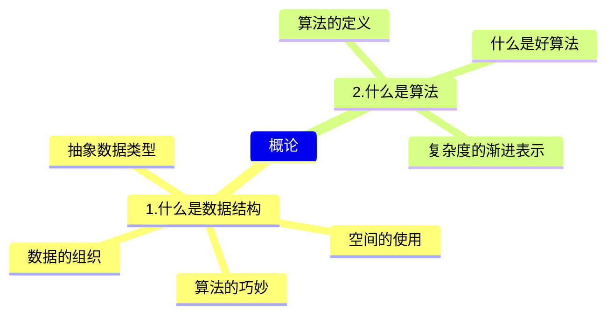
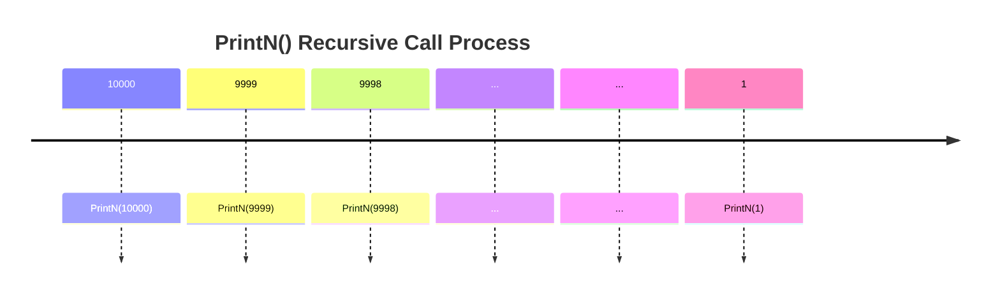

# 数据结构

## 第1章 概论



### 1.1什么是数据结构

#### 1.1.1关于数据的组织

​	数据结构至今没有统一定义，不过**数据结构**往往和**算法**同时出现。

​	当谈起数据的**组织方式**的时候，其实与**数据的规模**息息相关，不一样规模的问题处理起来难度就不一样。而且难度主要不是与你如何存放有关，而是与你要对数据进行什么操作有关。以存放图书为例：

> 方法一：随便放		    ①存放很简单	②查找很复杂
>
> 方法二：按字母顺序放	①存放较复杂	②查找简单（二分查找）
>
> 方法三：类别+字母顺序      ①存放较简单	②查找较简单（类别+二分查找）

- [x] 讨论1.1 对中等规模、大规模的图书摆放，你有什么更好的建议？

> 提出这个问题，实际上是想让大家思考，在考虑大规模数据存储的时候会遇到什么问题，以及如何根据功能（也就是关联的算法，最常见的就是插入、查找、删除）需要设计存储方式。

讨论：

* 用**哈希表**，一个书架的一排定义为一个位置，哈希运算之后，就摆在算出的那一排上。

* 首先按**内容分类**并针对每个分类设定一个**冗余度**，例如5%，则每100本书后预留5个空位。每个大类结束后预留更多的空位，如200个。这样，在新增书目的时候，只需挪动该插入位置之后，空位置之前的这不超过100本书。当该区间空位满了之后，不得不挪动下个100本书。并及时告知管理人员当前空位剩余数量。此外应动态管理冗余度，对于频繁新增书目的分类，应提高冗余度，预留更多的空位。并且对于经常满位的分类，应当放置在全部分类队列最后，这样可以减少空位满了之后挪动其他分类的数量。

* 用**树、数组和字典的方式**摆放书籍：按类别分不同区域和不同书架摆放。

  查找：大厅设置屏幕提醒大类书籍所在位置，区域内书架上展示小类标签，书架上按照书籍编号有序放置。设置查询表，根据书名查找书籍编号、所在位置、余量等消息。

* 中大型图书馆，首先需要对图书进行分大类，建立基本框架，树性结构。细化管理，现代化管理，书名，条码分类，轨道式移动书本，通过**二维码识别**，精准定位，在小类里可采用循环链表分类登记汇总，实现自动化

#### 1.1.2 关于空间使用 - 例：PrintN函数实现

写程序实现一个函数PrintN，使得传入一个正整数为N的参数后，能顺序打印从1到N的全部正整数

```c
/*循环实现*/
void PrintN ( int N )
{ 
    int i;
	for ( i = 1; i <= N; i ++ ){
		printf("%d\n", i );
	}
	return;
} 
/*递归实现*/
void PrintN ( int N )
{ 
    if ( N ){
		PrintN( N - 1 ); 
		printf("%d\n", N );
	}
	return;
} 
```

​	上面两种实现，看起来好像都挺简单的，下面这个好像还更简单一点。分别令输入数据N = 10、100、1000、... ...，观察运行结果，发现数据量较小时，两者结果基本一样，但第二个递归实现的函数在数据量到达10w+以上时，有可能发生直接跳出程序等异常情况。

​	如果你对递归比较熟悉，递归代码往往是简洁明了的，但是计算机不是很适合运行递归代码，因为递归代码往往会占用很多空间。如果占用所有空间也没能得出结果，递归程序就会异常终止，所以结果上可能是程序根本没有任何输出就结束了。

​	所以，**解决问题的效率，跟空间的利用效率也有关**。

- [x] 讨论1.2 晒一下PrintN在你的机器上运行的结果？

> 这是我们大家发现壕的时候哈！^_^

讨论：

* 数据规模为10w时，循环实现（可见代码示例1.1.2 两种PrintN）

  ticks1 = 13284.000000
  duration1 = 1.33e+001

  而递归实现没有输出结果（递归栈爆了）

* 循环代码更加繁琐，但节省内存；

  递归代码简洁易懂，却容易溢出。

#### 1.1.3 写程序计算给定多项式在给定点x处的值

计算多项式在给定点x处的值：
$$
\large{f(x) = a_0 + a_1x + ... + a_{n-1}x^{n-1} + a_{n}x^{n}}
$$

```c
/*方法一*/
double f( int n, double a[], double x )
{ 	
    int i;
	double p = a[0];
	for (i = 1; i <= n; i++)
	p += (a[i] * pow(x, i)); 
	return p;
}
```

​	第一种方法清晰明了，但是实际过程中如果这么写程序算法效率是很低的。

​	下面的方法利用了**海伦-秦九韶公式**，奇妙利用结合律，把多项式改写成下面这种从里往外计算的形式。
$$
\large{f(x) = a_0 + x(a_1 + x(...(a_{n-1} + x(a_n))...))}
$$

```c
double f( int n, double a[], double x )
{ 
    int i;
	double p = a[n];
	for (i = n; i > 0; i --)
	p = a[i-1] + x * p;
	return p;
} 
```

​	为了测试上面两种方法到底哪个更快，C语言提供了`clock()`函数：捕捉从程序开始运行到`clock()`被调用时所耗费的时间。这个时间单位是clock tick，即“**时钟打点**”。 该函数位于<time.h>库内

​	常数`CLK_TCK`(或`CLOCKS_PER_SEC`)：机器时钟每秒所走的时钟打点数（不同机器不一样）。

​	下面是使用这个函数测量待测函数的模板：

```c
#include <stdio.h>
#include <time.h>
clock_t start, stop;
/* clock_t是clock()函数返回的变量类型 */
double duration;
/* 记录被测函数运行时间，以秒为单位 */
int main ()
{ 
	/* 不在测试范围内的准备工作写在clock()调用之前*/
	start = clock(); 	/* 开始计时 */
	MyFunction(); 		/* 把被测函数加在这里 */
	stop = clock(); 	/* 停止计时 */
	duration = ((double)(stop - start))/CLK_TCK;
	/* 计算运行时间 */
	/* 其他不在测试范围的处理写在后面，例如输出duration的值 */
	return 0;
}
```

​	如果被测函数单次运行太快了（比如不到1个tick），可以让被测函数**重复运行**充分多次（for循环），使得测出的总的时钟打点间隔充分长，最后计算被测函数**平均每次**运行的时间即可! 

```c
#include <stdio.h>
#include <time.h>
#include <math.h>
clock_t start, stop; 
double duration;
#define MAXN 10 /* 多项式最大项数，即多项式阶数+1 */
double f1( int n, double a[], double x );
double f2( int n, double a[], double x );
int main ()
{ 
    int i;
	double a[MAXN]; /* 存储多项式的系数 */
	for ( i=0; i<MAXN; i++ ) a[i] = (double)i; 
	start = clock();
	f1(MAXN-1, a, 1.1); 
	stop = clock();
	duration = ((double)(stop - start))/CLK_TCK; 
	printf("ticks1 = %f\n", (double)(stop - start));
	printf("duration1 = %6.2e\n", duration);
	start = clock();
	f2(MAXN-1, a, 1.1); 
	stop = clock();
	duration = ((double)(stop - start))/CLK_TCK; 
	printf("ticks2 = %f\n", (double)(stop - start));
	printf("duration2 = %6.2e\n", duration);
	return 0;
}
```

​	经过测量，第二个函数用时比第一个函数少1个数量级左右，可见**解决问题方法的效率， 跟算法的巧妙程度有关**。

- [x] 讨论1.3 再试一个多项式

> 给定另一个100阶多项式
> $$
> f(x) = 1 + x + x^2/2 + ... + x^i/i + ... + x^{100}/100
> $$
> 用不同方法计算$f(1.1)$并且比较一下运行时间？

讨论：

* 初始化时，把上面程序的常数项a改一下即可（见代码示例1.1.3 讨论）。
* ticks1 = 1995.000000
  duration1 = 2.00e+000
  ticks2 = 335.000000
  duration2 = 3.35e-001

#### 1.1.4 抽象数据结构

到底什么是数据结构？

+ **数据对象**在计算机中的**组织方式**（逻辑结构 + 物理存储结构）
+ 数据对象必定与一系列加在其上的**操作**相关联
+ 完成这些操作所用的方法就是**算法**

**抽象数据类型**（Abstract Data Type ）

* 数据类型
  * 数据对象集
  * 数据集合相关联的操作集

*  抽象：描述数据类型的方法不依赖于具体实现
  * 与存放数据的机器无关
  * 与数据存储的物理结构无关
  * 与实现操作的算法和编程语言均无关

* 只描述数据对象集和相关操作集 “是什么 ”，并不涉及 “如何做到 ”的问题

例4 “矩阵”的抽象数据类型定义

* 类型名称：矩阵（Matrix）

* 数据对象集：一个M×N的矩阵$A_{M×N} = (a_{ij})$ (i=1, …, M; j=1, …, N )由M×N个三元组< a, i, j >构成，其中 <u>a 是矩阵元素的值</u>，i 是元素所在的行号，j 是元素所在的列号。

* 操作集：对于任意矩阵A、B、C ∈ Matrix，以及整数i、j、M、N 
  * Matrix Create( int M, int N )：返回一个M×N的空矩阵； 
  * int GetMaxRow( Matrix A )：返回矩阵A的总行数；
  * int GetMaxCol( Matrix A )：返回矩阵A的总列数； 
  * ElementType GetEntry( Matrix A, int i, int j )：返回矩阵A的第i行、第j列的元素； 
  * Matrix Add( Matrix A, Matrix B )：如果A和B的行、列数一致，则返回矩阵C=A+B，否则返回错误标志； 
  * Matrix Multiply( Matrix A, Matrix B )：如果A的列数等于B 的行数，则返回矩阵C=AB，否则返回错误标志； 
  *  ……

抽象在哪里？

* 上面提到 a 是矩阵元素的值，这个值是**整形、浮点型还是字符型**等等，抽象类型描述时是不关心的，后面操作集返回时，也使用了通用类型 ElementType ，可以在文件头使用 typedef 来定义成自己需要类型，抽象的好处就是提高了程序的灵活性。
* 矩阵在程序里如何存取的？是用二维数组、链表还是十字链表等等，这个在抽象数据类型定义时也都是不关心的，重点在于如何实现矩阵本身。
* 矩阵操作函数，例如 Matrix Add( ) 到底是按行先加、还是列先加，是用什么样语言实现的，都是不关心的，这就是所谓的抽象。

- [x] 讨论1.4 抽象有什么好处？

> 任何事物存在都要有个理由，为什么大家这么稀饭“抽象”？

讨论：

* 优先关注类型中需要的数据与行为，可以快速的建立类的框架，为类的实现做好基础工作。

  如果优先去关注细节，容易忽略类中数据与行为之间的相互作用关系，降低开发效率，并且缺少对类的宏观把控。

### 1.2 什么是算法

#### 1.2.1 算法的定义

**算法（Algorithm）**

1. 一个有限指令集 

2. 接受一些输入（有些情况下不需要输入）

3. 产生输出 

4. 一定在有限步骤之后终止
5. 每一条指令必须
   * 有充分明确的目标，不可以有歧义
   * 计算机能处理的范围之内
   * 描述应不依赖于任何一种计算机语言以及具体的实现手段

例1：选择排序算法的伪码描述

```c
void SelectionSort ( int List[], int N )
{ 	/* 将N个整数List[0]...List[N-1]进行非递减排序 */
	for ( i = 0; i < N; i ++ ) {
	MinPosition = ScanForMin( List, i, N–1 ); 
	/* 从List[i]到List[N–1]中找最小元，并将其位置赋给MinPosition */
	Swap( List[i], List[MinPosition] );
	/* 将未排序部分的最小元换到有序部分的最后位置 */
	}
}
```

抽象在于：

* List 到底是数组还是链表（虽然看上去很像数组）？ 

* Swap 用函数还是用宏去实现？

#### 1.2.2 什么是好的算法？

**评价算法的指标**

1. **空间复杂度 S(n)** —— 根据算法写成的程序在执行时**占用存储单元的长度**。这个长度往往与输入数据的规模有关。空间复杂度过高的算法可能导致使用的内存超限，造成程序非正常中断。

2. **时间复杂度 T(n)** —— 根据算法写成的程序在执行时**耗费时间的长度**。这个长度往往也与输入数据的规模有关。时间复杂度过高的低效算法可能导致我们在有生之年都等不到运行结果。

- 由于这两个指标与数据的规模直接相关，所以将其写成一个关于 n 的函数。

在分析一般算法的效率时，我们经常关注下面两种复杂度

1. 最坏情况复杂度 $T_{worst}(n)$

2. 平均复杂度 $T_{avg}(n)$

- 平均复杂度肯定比最坏情况复杂度小，但算法分析**一般分析最坏情况复杂度**，因为“什么叫平均”，经常不是一个很容易搞定的问题，很多时候平均复杂度分析难度很大。。

**递归实现PrintN 函数的空间复杂度分析**



<center style="color:#7c7877">图1.2.2 函数递归调用过程中内存占用情况</center>

* 函数递归调用需要保存当前函数地址、返回地址和一些变量的值，因此需要占用一块内存空间（如上图调用PrintN(10000)时需要占用上图10000号内存空间）
* 由上可知，空间复杂度是和数据量 N 成正比的，S(N) = C · N。

* 有限空间都用完了也不足以执行完程序，所以程序异常退出了。
* PrintN( )循环实现只需要临时变量和 for 循环，它没有涉及到程序调用的问题，它占用的空间量是**常量**。

**计算多项式在给定点处的值函数的时间复杂度分析**

* 机器运算加减法的速度比乘除法快很多

* 分析简单函数运行效率，只需要看它的乘除法执行次数，加减法可以忽略不计

* 不用海伦-秦九韶公式简化算法，循环每执行一次，除了 a[i] 和 pow() 乘一次之外，pow()还要乘 i - 1 次，总共乘 i 次。而使用海伦-秦九韶公式简化算法，循环每执行一次，只需要乘一次。

  所以在整个循环体，前者总共进行了 $\frac{(n^2 + n)}2$ 次乘法，后者总共进行了 n 次乘法。

```c
p += (a[i] * pow(x, i));   /*不用海伦-秦九韶公式化简*/
p = a[i-1] + x * p;		   /*使用海伦-秦九韶公式化简*/
```

* 第一个函数的时间复杂度 $T(n) = C_1n^2+C_2n(C_1和C_2为常数)$

  第二个函数的时间复杂度 $T(n) = Cn(C为常数)$

  虽然三个常数每台计算机都不一样，但可以确定的是 n 很大时，平方项增长最快，第一个函数会比第二个函数大很多（即速度慢很多）。

- [x] 讨论1.5 分析“二分法”

> 查找算法中的“二分法”是这样定义的：
>
> 给定N个从小到大排好序的整数序列List[]，以及某待查找整数X，我们的目标是找到X在List中的下标。即若有List[i]=X，则返回i；否则返回-1表示没有找到。
>
> 二分法是先找到序列的中点List[M]，与X进行比较，若相等则返回中点下标；否则，若List[M]>X，则在左边的子系列中查找X；若List[M]<X，则在右边的子系列中查找X。
>
> 试写出算法的伪码描述，并分析最坏、最好情况下的时间、空间复杂度。

讨论：

```c
int search(int x, int List[], int len)
{
	int ret = -1;
	int left = 0;
	int right = len - 1;
	while(left <= right)
	{
		int mid = (left + right) / 2;
		if(List[mid] == x)
		{
			ret = mid;
			break;
		}else if(List[mid] > x)
		{
			right = mid - 1;
		}else{
			left = mid + 1;
		}
	}
	return ret;
}
```

* 最好情况第一次二分就找到，最坏情况是没找到被迫跳出循环，空间复杂度都是O(1)。

  $T_{worst}(n) = O(logn)\qquad  S_{worst}(n) = O(1)$

  $T_{best}(n) = O(1)\qquad\qquad S_{best}(n) = O(1)$

#### 1.2.3 复杂度的渐进表示

​	实际算法分析过程中，没有必要去数每个函数具体每一步执行了几次，其实我们更关心的是随着要处理的数据规模 n 的增大，复杂度增长的趋势是怎样的。

**(时间)复杂度的渐进表示法**

* $T( n) = O(f(n))$ 表示存在常数$C>0,  n_0>0$ 使得当 $n > n_0 $时有 $T(n)≤C·f(n)$ 

  简单来说，上面这个等式表示，对于充分大的n而言，f(n)是T(n)的某个上界

*  $T( n) = Ω(g(n))$ 表示存在常数$C>0,  n_0>0$ 使得当 $n > n_0 $时有 $T(n)≥C·g(n)$ 

  简单来说，上面这个等式表示，对于充分大的n而言，g(n)是T(n)的某个下界

*  $T(n)= Θ(h(n))$ 表示同时有 $T( n) = O(h(n)) $和 $T(n)= Ω(h(n))$

  简单来说，上面这个等式表示，对于充分大的n而言，h(n)既是T(n)的上界也是下界

注意，函数的上下界都不是唯一的，但是太大的上界和太小的下界对分析算法效率没有什么帮助，我们在找上界和下界时，都期望和真实情况贴得越近越好，一般是寻找最小上界和最大的下界。

<center style="color:#7c7877">表1.2.3 f(n) 随着输入规模 n 的变化表</center>

| 函数f(n) | 1    | 2    | 4    | 8     | 16            | 32             |
| -------- | ---- | ---- | ---- | ----- | ------------- | -------------- |
| 1        | 1    | 1    | 1    | 1     | 1             | 1              |
| log n    | 0    | 1    | 2    | 3     | 4             | 5              |
| n        | 1    | 2    | 4    | 8     | 16            | 32             |
| n log n  | 0    | 2    | 8    | 24    | 64            | 160            |
| n^2^     | 1    | 4    | 16   | 64    | 256           | 1024           |
| n^3^     | 1    | 8    | 64   | 512   | 4096          | 32768          |
| 2^n^     | 2    | 4    | 16   | 256   | 65536         | 4294967296     |
| n!       | 1    | 2    | 24   | 40326 | 2092278988000 | 26313 × 10^33^ |

* 如果一个算法的复杂度是 $n^2$ ，可以考虑是否能将其优化为 $nlogn$。

**复杂度分析的技巧**

* 若两段算法分别有复杂度 $T_1(n) = O(f_1(n))$ 和 $T_2(n) = O(f_2(n))$，则

  * $T_1 (n) +  T_2 ( n) = max(O(f_1(n)), O(f_2(n)))$
  * $T_1(n)×T_2(n) = O(f_1(n)×f_2(n))$

* 若 T(n)是关于 n 的 k阶多项式，那么 $T(n)= Θ(n^k )$

* 一个**for循环**的时间复杂度等于循环次数乘以循环体代码的复杂度

* **if-else 结构**的复杂度取决于 **if** 的条件判断复杂度和两个分枝部分的复杂度，总体复杂度取三者中**最大**

### 1.3 应用实例：最大子列和(maximum-subarray)问题

给定N个整数的序列$\{A_1, A_2, …, A_N\}$， 求下列函数的最大值（0代表子列和为负数时）
$$
f(i, j)=max\{0,\sum_{k=i}^{j}A_k\}
$$

#### 1.3.1 两种简单求和算法

以给定序列：{-2，11，-4，13，-5，-2}为例。

算法一：暴力求出所有子列和，然后取最大的和

```c
int MaxSubseqSum1( int A[], int N )
{ 	int ThisSum, MaxSum = 0;
	int i, j, k;
	for( i = 0; i < N; i++ ) { /* i是子列左端位置 */
		for( j = i; j < N; j++ ) { /* j是子列右端位置 */
			ThisSum = 0; /* ThisSum是从A[i]到A[j]的子列和 */
			for( k = i; k <= j; k++ )
				ThisSum += A[k];
			if( ThisSum > MaxSum ) /* 如果刚得到的这个子列和更大 */
			MaxSum = ThisSum; /* 则更新结果 */
		} /* j循环结束 */
	} /* i循环结束 */
	return MaxSum;
}
```

* 时间复杂度：$T(n) = O(n^3)$

* 本算法“傻”在大量无效操作浪费在`ThisSum += A[k];`，其实不必每次都从头往后加，只要把 i 到 j 的部分和加一个元素A[k]即可，最里层循环完全就是多余的，于是就有了算法二。

| -2     | 11     | -4     | 13     | -5   | -2   | sum    |
| ------ | ------ | ------ | ------ | ---- | ---- | ------ |
| -2     |        |        |        |      |      | -2     |
| -2     | 11     |        |        |      |      | 9      |
| -2     | 11     | -4     |        |      |      | 5      |
| ==-2== | ==11== | ==-4== | ==13== |      |      | ==18== |
| -2     | 11     | -4     | 13     | -5   |      | 13     |
| -2     | 11     | -4     | 13     | -5   | -2   | 11     |

算法二：对算法一重复计算部分优化

```c
int MaxSubseqSum2( int A[], int N )
{ 	int ThisSum, MaxSum = 0;
	int i, j;
	for( i = 0; i < N; i++ ) { /* i是子列左端位置 */
		ThisSum = 0; /* ThisSum是从A[i]到A[j]的子列和 */
		for( j = i; j < N; j++ ) { /* j是子列右端位置 */
			ThisSum += A[j];
		/*对于相同的i，不同的j，只要在j-1次循环的基础上累加1项即可*/
		if( ThisSum > MaxSum ) /* 如果刚得到的这个子列和更大 */
			MaxSum = ThisSum; /* 则更新结果 */
		} /* j循环结束 */
	} /* i循环结束 */
	return MaxSum;
}
```

* 时间复杂度：$T(n) = O(n^2)$
* $T(n) = O(n^2)$往往可以优化为$T(n) = O(nlogn)$

| -2   | 11   | -4   | 13     | -5   | -2   | sum    |
| ---- | ---- | ---- | ------ | ---- | ---- | ------ |
| -2   |      |      |        |      |      | -2     |
|      | 11   |      |        |      |      | 9      |
|      |      | -4   |        |      |      | ==5==  |
|      |      |      | ==13== |      |      | ==18== |
|      |      |      |        | -5   |      | 13     |
|      |      |      |        |      | -2   | 11     |

#### 1.3.2 分治算法(Divide and Conquer)

**算法三：分而治之**

把数组一分为二，递归解决左右两边的问题，分别得到两边的最大子列和，再找出**跨越边界的最大子列和**，最后的结果一定是三个结果中间最大的那一个。

```c
int Max3( int A, int B, int C )
{ /* 返回3个整数中的最大值 */
    return A > B ? A > C ? A : C : B > C ? B : C;
}

int DivideAndConquer( int List[], int left, int right )
{ /* 分治法求List[left]到List[right]的最大子列和 */
    int MaxLeftSum, MaxRightSum; /* 存放左右子问题的解 */
    int MaxLeftBorderSum, MaxRightBorderSum; /*存放跨分界线的结果*/

    int LeftBorderSum, RightBorderSum;
    int center, i;

    if( left == right )  { /* 递归的终止条件，子列只有1个数字 */
        if( List[left] > 0 )  return List[left];
        else return 0;
    }

    /* 下面是"分"的过程 */
    center = ( left + right ) / 2; /* 找到中分点 */
    /* 递归求得两边子列的最大和 */
    MaxLeftSum = DivideAndConquer( List, left, center );
    MaxRightSum = DivideAndConquer( List, center+1, right );

    /* 下面求跨分界线的最大子列和 */
    MaxLeftBorderSum = 0; LeftBorderSum = 0;
    for( i=center; i>=left; i-- ) { /* 从中线向左扫描 */
        LeftBorderSum += List[i];
        if( LeftBorderSum > MaxLeftBorderSum )
            MaxLeftBorderSum = LeftBorderSum;
    } /* 左边扫描结束 */

    MaxRightBorderSum = 0; RightBorderSum = 0;
    for( i=center+1; i<=right; i++ ) { /* 从中线向右扫描 */
        RightBorderSum += List[i];
        if( RightBorderSum > MaxRightBorderSum )
            MaxRightBorderSum = RightBorderSum;
    } /* 右边扫描结束 */

    /* 下面返回"治"的结果 */
    return Max3( MaxLeftSum, MaxRightSum, MaxLeftBorderSum + MaxRightBorderSum );
}

int MaxSubseqSum3( int List[], int N )
{ /* 保持与前2种算法相同的函数接口 */
    return DivideAndConquer( List, 0, N-1 );
}
```

<table style="undefined;table-layout: fixed; width: 100%"><colgroup>
</colgroup>
<thead>
  <tr>
    <th>-2</th>
    <th>11</th>
    <th>-4</th>
    <th>13</th>
    <th>-5</th>
    <th>-2</th>
  </tr></thead>
<tbody>
  <tr>
    <td>-2</td>
    <td>11</td>
    <td></td>
    <td>13</td>
    <td></td>
    <td>-2</td>
  </tr>
  <tr>
    <td></td>
    <td>11</td>
    <td></td>
    <td>13</td>
    <td></td>
    <td></td>
  </tr>
  <tr>
    <td></td>
    <td colspan="3">20</td>
    <td></td>
    <td></td>
  </tr>
</tbody>
</table>

* 时间复杂度：$T(n) = O(nlogn)$

* 递归函数的时间复杂度计算比较复杂，一般思路是根据分问题（左子列、右子列、跨越边界子列）的复杂度，得出一个关于复杂度的递推公式

  $T ( N ) = 2 T( N/2 ) + c N$， $T(1) = O(1)$ 

  $= 2 [2 T( N/2^2 ) + c N/2] + c N$ 

  $= 2^k O(1) + ckN $ 其中 $N/2^k = 1$

  $= O( N log N )$

- [x] 讨论1.6 算法3的空间复杂度是多少？

> 具体来说，这个问题分两部分：
>
> 1. 由于递归而产生的空间复杂度是多少？
> 2. 算法的整体空间复杂度一共是多少？
>
> 不要只写结论，要写清楚推导过程哦~~

讨论：

* 递归的深度为logN，每次递归需要的空间是一个与N无关常量，每次递归的空间复杂度为O(1)。递归的空间复杂度 = 每次递归的空间复杂度 × 递归深度，即O(logN)

#### 1.3.3 在线算法(Online Algorithm)

**算法四：在线处理**

```c
int MaxSubseqSum4( int A[], int N )
{ 	int ThisSum, MaxSum;
	int i;
	ThisSum = MaxSum = 0;
	for( i = 0; i < N; i++ ) {
		ThisSum += A[i]; /* 向右累加 */
		if( ThisSum > MaxSum )
			MaxSum = ThisSum; /* 发现更大和则更新当前结果 */
		else if( ThisSum < 0 ) /* 如果当前子列和为负 */
			ThisSum = 0; /* 则不可能使后面的部分和增大，抛弃之 */
	}
	return MaxSum;
} 
```

* 时间复杂度：$T(n) = O(n)$

* 这个算法的时间复杂度已经是最快的了，因为你将元素遍历一遍都需要O(N)，这个算法的时间复杂度竟然也是O(N)

* 算法效率这么高，副作用就是“正确性”不是很明显，有点难理解。

* “**在线**”的意思是指每输入一个数据就进行即时处理，在任何一个地方中止输入，算法都能正确给出当前的解。

* 为什么这么快，就是因为这个算法发现了如果当前子列和为负，它其实就对于后面的子列和增大就没用了，应该丢弃。

  

<center style="color:#7c7877">图1.3.3 在线处理算法执行过程可视化</center>

- [ ] 讨论1.7 晒运行结果

> 在PTA上发布的编程题“最大子列和问题”给了非常宽松的时间上限，让大家可以至少把算法2、3、4分别尝试一下。另外“Maximum Subsequence Sum”需要你把算法略做修改，不仅输出最大和，而且输出相应的那个子列的首尾。
>
> 于是大家在这里晒一下自己的程序在PTA系统中的时间和空间耗费的结果吧~

讨论：
