# 数据结构

## 第 1 章 概论

### 1.1 什么是数据结构

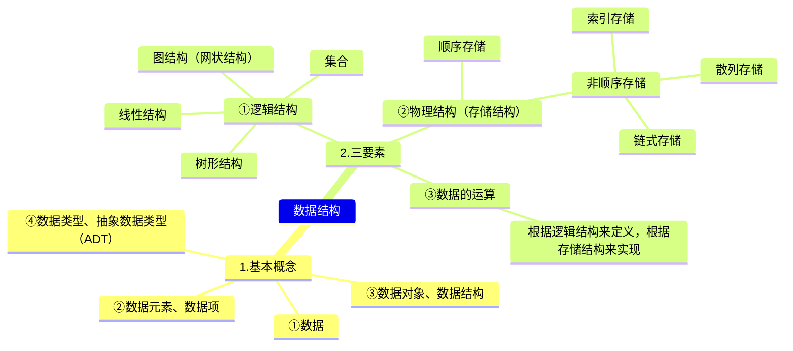
```mermaid
mindmap
    数据结构
        1.基本概念
            ①数据
            ②数据元素、数据项
            ③数据对象、数据结构
            ④数据类型、抽象数据类型（ADT）
        2.三要素
            ①逻辑结构
                集合
                线性结构
                树形结构
                图结构（网状结构）
            ②物理结构（存储结构）
                顺序存储
                非顺序存储
                    链式存储
                    索引存储
                    散列存储
            ③数据的运算
                根据逻辑结构来定义，根据存储结构来实现
```

#### 1.1.1 关于数据的组织

* 数据结构至今没有统一定义，不过**数据结构**往往和**算法**同时出现，“程序 = 数据结构 + 算法”——Niklaus Wirth

* 当谈起数据的**组织方式**的时候，其实与**数据的规模**息息相关，不一样规模的问题处理起来难度就不一样。
* 难度主要不是与你如何存放有关，而是与你要对数据进行什么操作有关。以存放图书为例：

> 方法一：随便放         ①存放很简单    ②查找很复杂
>
> 方法二：按字母顺序放   ①存放较复杂    ②查找简单（二分查找）
>
> 方法三：类别+字母顺序  ①存放较简单    ②查找简单（类别+二分查找）

- [x] 讨论 1.1 对中等规模、大规模的图书摆放，你有什么更好的建议？

> 提出这个问题，实际上是想让大家思考，在考虑大规模数据存储的时候会遇到什么问题，以及如何根据功能（也就是关联的算法，最常见的就是插入、查找、删除）需要设计存储方式。

讨论：

* 用**哈希表**，一个书架的一排定义为一个位置，哈希运算之后，就摆在算出的那一排上。

* 首先按**内容分类**并针对每个分类设定一个**冗余度**，例如 5%，则每 100 本书后预留 5 个空位。每个大类结束后预留更多的空位，如 200 个。这样，在新增书目的时候，只需挪动该插入位置之后，空位置之前的这不超过 100 本书。当该区间空位满了之后，不得不挪动下个 100 本书。并及时告知管理人员当前空位剩余数量。此外应动态管理冗余度，对于频繁新增书目的分类，应提高冗余度，预留更多的空位。并且对于经常满位的分类，应当放置在全部分类队列最后，这样可以减少空位满了之后挪动其他分类的数量。

* 用**树、数组和字典的方式**摆放书籍：按类别分不同区域和不同书架摆放。

* 查找：大厅设置屏幕提醒大类书籍所在位置，区域内书架上展示小类标签，书架上按照书籍编号有序放置。设置查询表，根据书名查找书籍编号、所在位置、余量等消息。

* 中大型图书馆，首先需要对图书进行分大类，建立基本框架，树性结构。细化管理，现代化管理，书名，条码分类，轨道式移动书本，通过**二维码识别**，精准定位，在小类里可采用循环链表分类登记汇总，实现自动化

#### 1.1.2 关于空间使用 - 例：PrintN 函数实现

写程序实现一个函数 PrintN，使得传入一个正整数为 N 的参数后，能顺序打印从 1 到 N 的全部正整数

```c
/*循环实现*/
void PrintN(int N)
{ 
    int i;
    for (i = 1; i <= N; i++)
        printf("%d\n", i);
    return;
} 
/*递归实现*/
void PrintN(int N)
{ 
    if (N) {
        PrintN(N - 1); 
        printf("%d\n", N);
    }
    return;
} 
```

​    上面两种实现，看起来好像都挺简单的，下面这个好像还更简单一点。分别令输入数据 N = 10、100、1000、... ...，观察运行结果，发现数据量较小时，两者结果基本一样，但第二个递归实现的函数在数据量到达 10w+ 以上时，递归函数有可能直接拒绝工作！

​    如果你对递归比较熟悉，递归代码往往是简洁明了的，但是计算机不是很适合运行递归代码，因为递归代码往往会占用很多空间。如果占用所有空间也没能得出结果，递归程序就会异常终止，所以结果上可能是程序根本没有任何输出就结束了。

* 所以，**解决问题的效率，跟空间的利用效率也有关**。

- [x] 讨论 1.2 晒一下 PrintN 在你的机器上运行的结果？

> 这是我们大家发现壕的时候哈！\^_\^

讨论：

* 数据规模为 10w 时，函数的循环实现总用时（可见代码示例 1.1.2 两种 PrintN）

  ticks1 = 13284.000000
  duration1 = 1.33e+001

  而递归实现没有输出结果（递归栈爆了）

* 循环代码更加繁琐，但节省内存；

  递归代码简洁易懂，却容易溢出。

#### 1.1.3 写程序计算给定多项式在给定点 x 处的值

计算多项式在给定点 x 处的值：
$$
\large{f(x) = a_0 + a_1x + ... + a_{n-1}x^{n-1} + a_{n}x^{n}}
$$

```c
/*方法一*/
double f(int n, double a[], double x)
{
    int i;
    double p = a[0];
    for (i = 1; i <= n; i++)
        p += (a[i] * pow(x, i)); 
    return p;
}
```

​    第一种方法清晰明了，但是实际过程中如果这么写程序算法效率是很低的。

​    下面的方法通过**海伦-秦九韶算法**，巧妙利用结合律，不断提取公因式 x 来减少乘法的运算次数，把多项式改写成下面这种从里往外计算的形式：
$$
\large{f(x) = a_0 + x(a_1 + x(...(a_{n-1} + x(a_n))...))}
$$

```c
double f(int n, double a[], double x)
{ 
    int i;
    double p = a[n];
    for (i = n; i > 0; i--)
        p = a[i - 1] + x * p;
    return p;
} 
```

​    为了测试上面两种方法到底哪个更快，利用 C 语言提供的 clock() 函数：捕捉从程序开始运行到 clock() 被调用时所耗费的时间。这个时间单位是 clock tick，即“**时钟打点**”。 该函数位于头文件 time.h 中。

​    常数 CLK_TCK(或 CLOCKS_PER_SEC)：机器时钟每秒所走的时钟打点数（不同机器不一样）。

​    下面是使用这个函数测量待测函数的模板：

```c
#include <stdio.h>
#include <time.h>
clock_t start, stop;
/* clock_t 是 clock()函数返回的变量类型 */
double duration;
/* 记录被测函数运行时间，以秒为单位 */
int main ()
{ 
    /* 不在测试范围内的准备工作写在 clock()调用之前*/
    start = clock();    /* 开始计时 */
    MyFunction();       /* 把被测函数加在这里 */
    stop = clock();     /* 停止计时 */
    duration = ((double)(stop - start)) / CLK_TCK;
    /* 计算运行时间 */
    /* 其他不在测试范围的处理写在后面，例如输出 duration 的值 */
    return 0;
}
```

​    如果被测函数单次运行太快了（比如不到 1 个 tick），可以让被测函数**重复运行充分多次**（for 循环），使得测出的总的时钟打点间隔充分长，最后计算被测函数**平均每次**运行的时间即可! 

```c
#include <stdio.h>
#include <time.h>
#include <math.h>
clock_t start, stop; 
double duration;
#define MAXN 10 /* 多项式最大项数，即多项式阶数 +1 */
double f1(int n, double a[], double x);
double f2(int n, double a[], double x);
int main ()
{ 
    int i;
    double a[MAXN]; /* 存储多项式的系数 */
    for (i = 0; i < MAXN; i++) 
        a[i] = (double)i;
    
    start = clock();
    f1(MAXN - 1, a, 1.1); 
    stop = clock();
    duration = ((double)(stop - start)) / CLK_TCK; 
    printf("ticks1 = %f\n", (double)(stop - start));
    printf("duration1 = %6.2e\n", duration);
    start = clock();
    f2(MAXN - 1, a, 1.1); 
    stop = clock();
    duration = ((double)(stop - start)) / CLK_TCK; 
    
    printf("ticks2 = %f\n", (double)(stop - start));
    printf("duration2 = %6.2e\n", duration);
    return 0;
}
```

* 经过测量，第二个函数用时比第一个函数少 1 个数量级左右，可见**解决问题方法的效率， 跟算法的巧妙程度有关**。

- [x] 讨论 1.3 再试一个多项式

> 给定另一个 100 阶多项式
> $$
> f(x) = 1 + x + x^2/2 + ... + x^i/i + ... + x^{100}/100
> $$
> 用不同方法计算$f(1.1)$并且比较一下运行时间？

讨论：

* 初始化时，把上面程序的常数项 a 改一下即可（见代码示例 1.1.3 讨论）。
* ticks1 = 1995.000000
  duration1 = 2.00e+000
  ticks2 = 335.000000
  duration2 = 3.35e-001

#### 1.1.4 抽象数据结构

到底什么是数据结构？

+ **数据对象**在计算机中的**组织方式**（逻辑结构 + 物理存储结构）
  * 逻辑结构：线性结构（线性表、栈和队列、数组、串）非线性结构（集合、树、图）
  * 物理存储结构：顺序存储、链式存储、散列存储、索引存储
  * 数据的逻辑结构采用抽象表达方式，**独立于存储结构**；数据存储结构是逻辑结构在计算机上的映射，不能独立于逻辑结构存在。
+ 数据对象必定与一系列加在其上的**操作**相关联（也称为**数据的运算**，如：插入 、 删除、修改、 查找 、排序）
+ 完成这些操作所用的方法就是**算法**
+ 数据结构的**基本概念**：相互之间存在一种或多种特定关系的数据元素的集合。
  * 存储数据元素时，不仅应该存储数据元素的**值**，还应该存储数据元素之间的**关系**。(数据元素类型可以隐含)
+ 数据结构的三要素：**数据的逻辑结构**，**数据的存储结构**，**数据的运算**。（和下面的 ADT 三要素要区分开）
  * 数据的运算具体实现可能和数据的存储结构有关，比如链表和顺序表的插入。
+ **数据类型**是一个值的集合和定义在此集合上的一组操作的总称
  * ①原子类型：其值不可再分的数据类型
  * ②结构类型：其值可以再分解为若干成分（分量）的数据类型
  * ③抽象数据类型：一个数学模型及定义在该数学模型上的一组操作

**抽象数据类型（Abstract Data Type）**

* ADT 常用这样一个三元组表示：**数据对象**，**数据关系**，数据集合相关联的**基本操作集**（注意：数据 ≠ 数据结构）

* 抽象：描述数据类型的方法不依赖于具体实现
  * 与存放数据的机器无关
  * 与数据存储的物理结构无关
  * 与实现操作的算法和编程语言均无关

* 只描述数据对象集和相关操作集 “是什么 ”，并不涉及 “如何做到 ”的问题

【例】“矩阵”的抽象数据类型定义

* 类型名称：矩阵（Matrix）

* 数据对象集：一个 M×N 的矩阵$A_{M×N} = (a_{ij})$(i=1, ……, M; j=1, ……, N)由 M×N 个三元组<a, i, j>构成，其中 <u>a 是矩阵元素的值</u>，i 是元素所在的行号，j 是元素所在的列号。

* 操作集：对于任意矩阵 A、B、C ∈ Matrix，以及整数 i、j、M、N 
  * Matrix Create(int M, int N)：返回一个 M×N 的空矩阵； 
  * int GetMaxRow(Matrix A)：返回矩阵 A 的总行数；
  * int GetMaxCol(Matrix A)：返回矩阵 A 的总列数； 
  * ElementType GetEntry(Matrix A, int i, int j)：返回矩阵 A 的第 i 行、第 j 列的元素； 
  * Matrix Add(Matrix A, Matrix B)：如果 A 和 B 的行、列数一致，则返回矩阵 C=A+B，否则返回错误标志； 
  * Matrix Multiply(Matrix A, Matrix B)：如果 A 的列数等于 B 的行数，则返回矩阵 C=AB，否则返回错误标志； 
  * ……

抽象在哪里？

* 上面提到 a 是矩阵元素的值，这个值是**整形、浮点型还是字符型**等等，抽象类型描述时是不关心的，后面操作集返回时，也使用了通用类型 ElementType ，可以在文件头使用 typedef 来定义成自己需要类型，抽象的好处就是适用于任何一种类型的矩阵，提高了程序的灵活性。
* 矩阵在程序里如何存取的？是用二维数组、链表还是十字链表等等，这个在抽象数据类型定义时也都是不涉及的，重点在于如何实现矩阵本身。
* 矩阵操作函数，例如 Matrix Add() 到底是按行先加、还是列先加，是用什么样语言实现的，都是不涉及的，这就是所谓的抽象。

- [x] 讨论 1.4 抽象有什么好处？

> 任何事物存在都要有个理由，为什么大家这么稀饭“抽象”？

讨论：

* 抽象是计算机求解问题的基本方式和重要手段，它使得一种设计可以应用于多种场景。而且通过抽象可以屏蔽底层细节，使设计更加简单、理解更加方便。
* 抽象数据类型的描述方法与面向对象的思想是一致的，它把数据对象和相关操作封装在一起，对于需要调用这个数据类型的用户而言，无论内部的具体实现如何改变，只要对外描述的接口不变，就不影响使用。

### 1.2 什么是算法

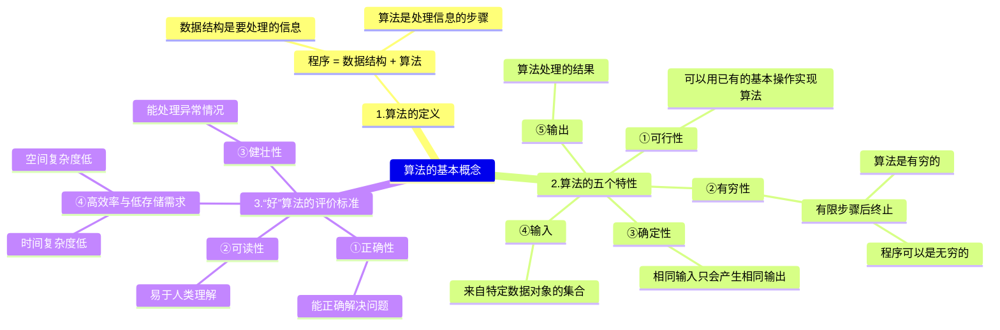
```mermaid
mindmap
    算法的基本概念
        1.算法的定义
            程序 = 数据结构 + 算法
                数据结构是要处理的信息
                算法是处理信息的步骤
        2.算法的五个特性
            ①可行性
                可以用已有的基本操作实现算法
            ②有穷性
                有限步骤后终止
                    算法是有穷的
                    程序可以是无穷的
            ③确定性
                相同输入只会产生相同输出
            ④输入
                来自特定数据对象的集合
            ⑤输出
                算法处理的结果
        3.“好”算法的评价标准
            ①正确性
                能正确解决问题
            ②可读性
                易于人类理解
            ③健壮性
                能处理异常情况
            ④高效率与低存储需求
                时间复杂度低
                空间复杂度低
```


#### 1.2.1 算法的定义

**算法(Algorithm)**

基本概念：算法是**对特定问题求解步骤的一种描述**，它是指令的有限序列，其中每一条指令表示一个或多个操作

1. **可行性**：可以用已有的基本操作实现算法
2. **有穷性**：一定在有限步骤之后终止（算法不是程序，程序可以无限运行，比如 OS）
3. **确定性**：每一条指令必须
   * 有充分明确的目标，不可以有歧义，相同的输入得到相同的输出
   * 计算机能处理的范围之内
   * 抽象的实现手段
4. **输入**：接受一些输入（有些情况下不需要输入）（算法输入来自特定数据对象的集合）
5. **输出**：产生一个或多个输出

【例】选择排序算法的伪码描述

```c
void SelectionSort(int List[], int N)
{   /* 将 N 个整数 List[0]...List[N-1]进行非递减排序 */
    for (i = 0; i < N; i++) {
        MinPosition = ScanForMin(List, i, N – 1); 
        /* 从 List[i]到 List[N – 1]中找最小元，并将其位置赋给 MinPosition */
        Swap(List[i], List[MinPosition]);
        /* 将未排序部分的最小元换到有序部分的最后位置 */
    }
}
```

抽象在于：

* List 到底是数组还是链表（虽然看上去很像数组）？ 

* Swap 用函数还是用宏去实现？

#### 1.2.2 什么是好的算法？

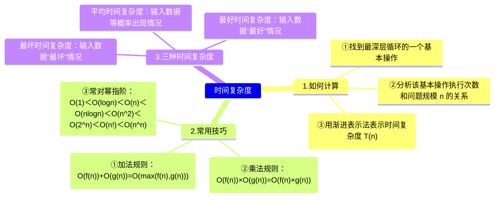
```mermaid
mindmap
    时间复杂度
        1.如何计算
            ①找到最深层循环的一个基本操作
            ②分析该基本操作执行次数和问题规模 n 的关系
            1id3("③用渐进表示法表示时间复杂度 T(n)")
        2.常用技巧
            2id1("①加法规则：O(f(n))+O(g(n))=O(max(f(n),g(n)))")
            2id2("②乘法规则：O(f(n))×O(g(n))=O(f(n)×g(n))")
            2id3["③常对幂指阶：
            O(1)＜O(logn)＜O(n)＜
            O(nlogn)＜O(n^2)＜
            O(2^n)＜O(n!)＜O(n^n)"]
        3.三种时间复杂度
            最坏时间复杂度：输入数据“最坏”情况
            平均时间复杂度：输入数据等概率出现情况
            最好时间复杂度：输入数据“最好”情况
```

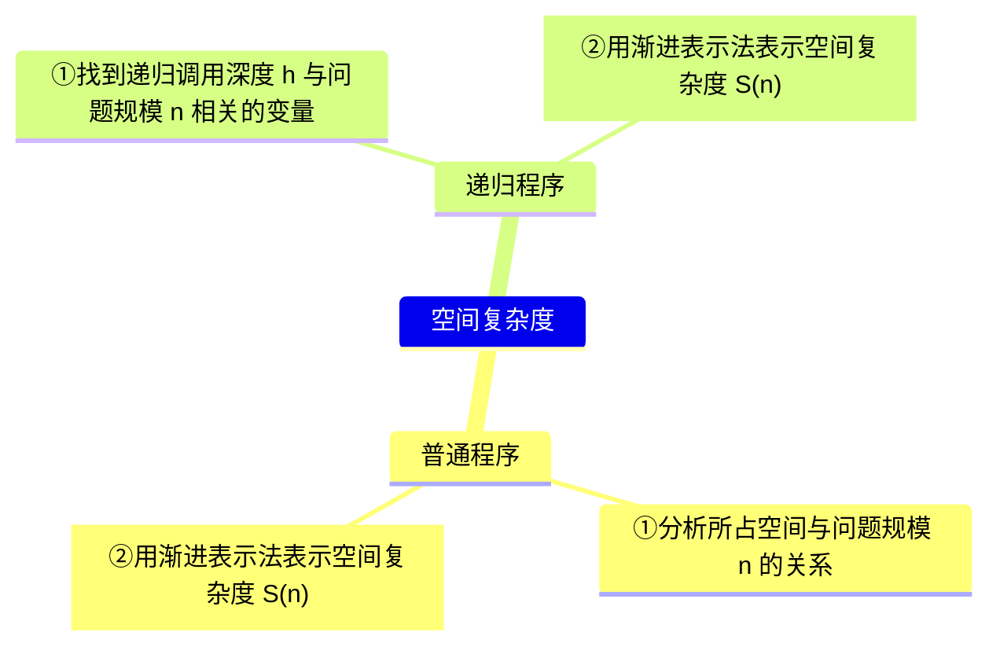
```mermaid
mindmap
    空间复杂度
        普通程序
            ①分析所占空间与问题规模 n 的关系
            id3["②用渐进表示法表示空间复杂度 S(n)"]
        递归程序
            ①找到递归调用深度 h 与问题规模 n 相关的变量
            id2["②用渐进表示法表示空间复杂度 S(n)"]
```


**“好”算法的评价标准**

1. 正确性：能正确解决问题。
2. 可读性：易于人类理解。
3. 健壮性：输入非法数据时，算法能适当反应或处理，而非输出意外结果。
4. 高效率与低存储量需求：指算法的执行时间和执行过程中需要的存储空间。

**评价算法效率的指标**

​    为什么不采用**事后统计**运行时间的方法评判算法效率？因为程序运行时间和机器性能、编程语言、编译程序产生的机器指令质量都有关，而且有时候无法采用事后统计的方法，如：火箭发射。因此我们采用**事先统计**方法排除这些因素影响。

1. **空间复杂度 S(n)** —— 根据算法写成的程序在执行时**占用存储单元的长度(占用内存空间大小)**。这个长度往往与输入数据的规模有关。空间复杂度过高的算法可能导致使用的内存超限，造成程序非正常中断。

2. **时间复杂度 T(n)** —— 根据算法写成的程序在执行时**耗费时间的长度**。这个长度往往也与输入数据的规模有关。时间复杂度过高的低效算法可能导致我们在有生之年都等不到运行结果。

- 由于这两个指标与数据的规模直接相关，所以将其写成一个关于 n 的函数。

在分析一般算法的效率时，我们经常关注下面两种复杂度

1. 最坏情况复杂度 $T_{worst}(n)$：考虑输入数据“最坏”的情况

2. 平均复杂度 $T_{avg}(n)$：考虑所有输入数据都等概率出现的情况

- 平均复杂度肯定比最坏情况复杂度小，但算法分析**一般分析最坏情况复杂度**，因为“什么叫平均”，经常不是一个很容易搞定的问题，很多时候平均复杂度分析难度很大。。

**递归实现 PrintN 函数的空间复杂度分析**

<center style="color:#7c7877">PrintN() Recursive Call Process</center>

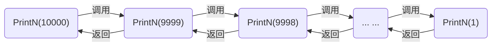
```mermaid
flowchart LR
    a("PrintN(10000)") --调用--> b("PrintN(9999)") --调用--> c("PrintN(9998)")--调用--> d("... ...")--调用--> e("PrintN(1)")--返回-->d--返回-->c--返回-->b--返回-->a
    
```

<center style="color:#7c7877">图 1.2.2 函数递归调用过程中内存占用情况</center>

* 函数递归调用需要**保存当前函数的状态**（如返回地址和一些变量的值等），因此需要占用一块内存空间（如上图调用 PrintN(10000)时需要占用一块内存空间），直到执行到 PrintN(0) 时，函数才直接返回，系统开始逐级释放内存。
* 假设存储每个函数状态占 1 个单位内存空间。由上可知，空间复杂度是和数据量 N 成正比的，S(N) = C · N。

* 有限空间都用完了也不足以执行完程序，所以程序异常退出了。
* PrintN()循环实现只需要临时变量和 for 循环，它没有涉及到程序调用的问题，它占用的空间量是**常量**。

**计算多项式在给定点处的值函数的时间复杂度分析**

* 机器运算加减法的速度比乘除法快很多

* 分析简单函数运行效率，只需要看它的乘除法执行次数，加减法可以忽略不计

* 不用海伦-秦九韶公式简化算法，循环每执行一次，除了 a[i] 和 pow() 乘一次之外，pow()还要乘 i - 1 次，总共乘 i 次。而使用海伦-秦九韶公式简化算法，循环每执行一次，只需要乘一次。

  所以在整个循环体，前者总共进行了 $\large{\frac{(n^2 + n)}2}$ 次乘法，后者总共进行了 n 次乘法。

```c
p += (a[i] * pow(x, i));   /*不用海伦-秦九韶公式化简*/
p = a[i - 1] + x * p;      /*使用海伦-秦九韶公式化简*/
```

* 第一个函数的时间复杂度：$T(n) = C_1n^2+C_2n(C_1 和 C_2 为常数)$

  第二个函数的时间复杂度：$T(n) = C·n(C 为常数)$

  虽然三个常数每台计算机都不一样，但可以确定的是 n 很大时，平方项增长最快，第一个函数会比第二个函数大很多（即速度慢很多）。

- [x] 讨论 1.5 分析“二分法”

> 查找算法中的“二分法”是这样定义的：
>
> 给定 N 个从小到大排好序的整数序列 List[]，以及某待查找整数 X，我们的目标是找到 X 在 List 中的下标。即若有 `List[i] = X`，则返回 i；否则返回 -1 表示没有找到。
>
> 二分法是先找到序列的中点 List[M]，与 X 进行比较，若相等则返回中点下标；否则，若`List[M] > X`，则在左边的子系列中查找 X；若 `List[M] < X`，则在右边的子系列中查找 X。
>
> 试写出算法的伪码描述，并分析最坏、最好情况下的时间、空间复杂度。

讨论：

```c
int search(int x, int List[], int len)
{
    int ret = -1;
    int left = 0;
    int right = len - 1;
    while (left <= right) {
        int mid = (left + right) / 2;
        if (List[mid] == x) {
            ret = mid;
            break;
        } else if (List[mid] > x) {
            right = mid - 1;
        } else {
            left = mid + 1;
        }
    }
    return ret;
}
```

* 最好情况第一次二分就找到，最坏情况是没找到被迫跳出循环，空间复杂度都是 O(1)(辅助空间为常量称算法**原地工作(In Place)**)。

  $T_{worst}(n) = O(logn)\qquad  S_{worst}(n) = O(1)$

  $T_{best}(n) = O(1)\qquad\qquad S_{best}(n) = O(1)$

#### 1.2.3 渐进表示法

​    实际算法分析过程中，没有必要去数每个函数具体每一步执行了几次，其实我们更关心的是随着要处理的数据规模 n 的增大，复杂度增长的趋势是怎样的。

**(时间)复杂度的渐进表示法**

* $T(n) = O(f(n))$ 表示存在常数 $C>0,  n_0>0$ 使得当 $n > n_0 $时有 $T(n)≤C·f(n)$ 

  简单来说，上面这个等式表示，对于充分大的 n 而言，f(n)是 T(n)的某个上界

* $T(n) = Ω(g(n))$ 表示存在常数 $C>0,  n_0>0$ 使得当 $n > n_0 $时有 $T(n)≥C·g(n)$ 

  简单来说，上面这个等式表示，对于充分大的 n 而言，g(n)是 T(n)的某个下界

* $T(n)= Θ(h(n))$ 表示同时有 $T(n) = O(h(n)) $和 $T(n)= Ω(h(n))$

  简单来说，上面这个等式表示，对于充分大的 n 而言，h(n) 既是 T(n) 的上界也是下界

​    注意，函数的上下界都不是唯一的，但是太大的上界和太小的下界对分析算法效率没有什么帮助，我们在找上界和下界时，都期望和真实情况贴得越近越好，一般是寻找最小上界作为 O 函数和最大的下界作为 Ω 函数。

<center style="color:#7c7877">表 1.2.3 f(n) 随着输入规模 n 的变化表</center>

| 函数 f(n) | 1    | 2    | 4    | 8        | 16            | 32             |
| -------- | ---- | ---- | ---- | -------- | ------------- | -------------- |
| 1        | 1    | 1    | 1    | 1        | 1             | 1              |
| log n    | 0    | 1    | 2    | 3        | 4             | 5              |
| n        | 1    | 2    | 4    | 8        | 16            | 32             |
| n log n  | 0    | 2    | 8    | 24       | 64            | 160            |
| $n^2$    | 1    | 4    | 16   | 64       | 256           | 1024           |
| $n^3$    | 1    | 8    | 64   | 512      | 4096          | 32768          |
| $2^n$    | 2    | 4    | 16   | 256      | 65536         | 4294967296     |
| n!       | 1    | 2    | 24   | 40326    | 2092278988000 | 26313 × 10^33^ |
| $n^n$    | 2    | 4    | 256  | 16777216 | 18447×10^19^  | 14615×10^46^   |

* 时间复杂度阶数由小到大判断口诀：常对幂指阶(随着问题规模变得很大，算法性能问题可能才会明显暴露出来)
* 如果一个算法的复杂度是 $n^2$ ，可以考虑是否能将其优化为 $nlog(n)$。
* 真数相同底数不同的对数函数只相差常数倍，但渐进表示法**忽略常数因子和低阶项**，所以 log 的底数可以省略不写。（但是要注意，不同底的指数函数之间相差不是常数倍，比如 $O(2^n)$ 和 $O(3^n)$ 复杂度是完全不一样的）

**复杂度分析的技巧**

* 若两段算法分别有复杂度 $T_1(n) = O(f_1(n))$ 和 $T_2(n) = O(f_2(n))$，则

  * 加法规则：$T_1 (n) +  T_2 (n) = max(O(f_1(n)), O(f_2(n)))$
  * 乘法规则：$T_1(n)×T_2(n) = O(f_1(n)×f_2(n))$

* 若 T(n)是关于 n 的 k 阶多项式，那么 $T(n)= Θ(n^k)$

* 忽略常数因子和低阶项

* 着重分析**最深层循环某个基本操作**与问题规模 n 的关系

* 一个 **for 循环**的时间复杂度等于循环次数乘以循环体代码的复杂度

* **若干层嵌套循环**的时间复杂度等于各层循环次数的乘积再乘以循环体代码的复杂度

* **if-else 结构**的复杂度取决于 **if** 的条件判断复杂度和两个分枝部分的复杂度，总体复杂度取三者中**最大**

```c
/* 下列函数的总复杂度为 max(O(f1), O(f2), O(f3))*/
if (P1)     /* P1 的复杂度为 O(f1)*/
    P2;     /* P1 的复杂度为 O(f2)*/
else
    P3;     /* P1 的复杂度为 O(f3)*/
```

* 一般情况下，**递归函数空间复杂度 = 递归深度 × 单次递归的空间复杂度**，但如果递归每一层需要分配不同大小的内存时，不能简单相乘，需要累加各层的空间开销。

### 1.3 应用实例：最大子列和(maximum-subarray)问题

给定 N 个整数的序列$\{A_1, A_2, …, A_N\}$， 求下列函数的最大值（0 代表子列和为负数时）
$$
f(i, j)=max\{0,\sum_{k=i}^{j}A_k\}
$$

#### 1.3.1 两种简单求和算法

以给定序列：{-2，11，-4，13，-5，-2}为例。

算法一：暴力求出所有子列和，然后取最大的和

```c
int MaxSubseqSum1(int A[], int N)
{   
    int ThisSum, MaxSum = 0;
    int i, j, k;
    for (i = 0; i < N; i++) {       /* i 是子列左端位置 */       
        for (j = i; j < N; j++) {   /* j 是子列右端位置 */
            ThisSum = 0;            /* ThisSum 是从 A[i]到 A[j]的子列和 */
            for (k = i; k <= j; k++)
                ThisSum += A[k];
            if (ThisSum > MaxSum)  /* 如果刚得到的这个子列和更大 */
                MaxSum = ThisSum;  /* 则更新结果 */
        }                          /* j 循环结束 */
    }                              /* i 循环结束 */
    return MaxSum;
}
```

* 时间复杂度：$T(n) = O(n^3)$

* 本算法“傻”在大量无效操作浪费在`ThisSum += A[k];`，其实不必每次都从头往后加，只要把 i 到 j 的部分和加一个元素 A[k]即可，最里层循环完全就是多余的，于是就有了算法二。

| -2     | 11     | -4     | 13     | -5   | -2   | sum    |
| ------ | ------ | ------ | ------ | ---- | ---- | ------ |
| -2     |        |        |        |      |      | -2     |
| -2     | 11     |        |        |      |      | 9      |
| -2     | 11     | -4     |        |      |      | 5      |
| ==-2== | ==11== | ==-4== | ==13== |      |      | ==18== |
| -2     | 11     | -4     | 13     | -5   |      | 13     |
| -2     | 11     | -4     | 13     | -5   | -2   | 11     |

算法二：对算法一重复计算部分优化

```c
int MaxSubseqSum2(int A[], int N)
{   
    int ThisSum, MaxSum = 0;
    int i, j;
    for (i = 0; i < N; i++) {      /* i 是子列左端位置 */
        ThisSum = 0;               /* ThisSum 是从 A[i]到 A[j]的子列和 */
        for (j = i; j < N; j++) {  /* j 是子列右端位置 */
            ThisSum += A[j];       /*对于相同的 i，不同的 j，只要在 j-1 次循环的基础上累加 1 项即可*/
            if (ThisSum > MaxSum)  /* 如果刚得到的这个子列和更大 */
                MaxSum = ThisSum;  /* 则更新结果 */
        }                          /* j 循环结束 */
    }                              /* i 循环结束 */
    return MaxSum;
}
```

* 时间复杂度：$T(n) = O(n^2)$
* $T(n) = O(n^2)$ 往往可以优化为 $T(n) = O(nlogn)$

| -2   | 11   | -4   | 13     | -5   | -2   | sum    |
| ---- | ---- | ---- | ------ | ---- | ---- | ------ |
| -2   |      |      |        |      |      | -2     |
|      | 11   |      |        |      |      | 9      |
|      |      | -4   |        |      |      | ==5==  |
|      |      |      | ==13== |      |      | ==18== |
|      |      |      |        | -5   |      | 13     |
|      |      |      |        |      | -2   | 11     |

#### 1.3.2 分治算法(Divide and Conquer)

**算法三：分而治之**

把数组一分为二，递归解决左右两边的问题，分别得到两边的最大子列和，再找出**跨越边界的最大子列和**，最后的结果一定是三个结果中间最大的那一个。

```c
int Max3(int A, int B, int C)
{ /* 返回 3 个整数中的最大值 */
    return A > B ? A > C ? A : C : B > C ? B : C;
}

int DivideAndConquer(int List[], int left, int right)
{ /* 分治法求 List[left]到 List[right]的最大子列和 */
    int MaxLeftSum, MaxRightSum; /* 存放左右子问题的解 */
    int MaxLeftBorderSum, MaxRightBorderSum; /*存放跨分界线的结果*/

    int LeftBorderSum, RightBorderSum;
    int center, i;

    if (left == right) {      /* 递归的终止条件，子列只有 1 个数字 */
        if (List[left] > 0)  return List[left];
        else return 0;
    }

    /* 下面是"分"的过程 */
    center = (left + right) / 2; /* 找到中分点 */
    /* 递归求得两边子列的最大和 */
    MaxLeftSum = DivideAndConquer(List, left, center);
    MaxRightSum = DivideAndConquer(List, center+1, right);

    /* 下面求跨分界线的最大子列和 */
    MaxLeftBorderSum = 0; LeftBorderSum = 0;
    for (i = center; i >= left; i--) { /* 从中线向左扫描 */
        LeftBorderSum += List[i];
        if (LeftBorderSum > MaxLeftBorderSum)
            MaxLeftBorderSum = LeftBorderSum;
    } /* 左边扫描结束 */

    MaxRightBorderSum = 0; RightBorderSum = 0;
    for (i = center+1; i <= right; i++) { /* 从中线向右扫描 */
        RightBorderSum += List[i];
        if (RightBorderSum > MaxRightBorderSum)
            MaxRightBorderSum = RightBorderSum;
    } /* 右边扫描结束 */
    /* 下面返回"治"的结果 */
    return Max3(MaxLeftSum, MaxRightSum, MaxLeftBorderSum + MaxRightBorderSum);
}

int MaxSubseqSum3(int List[], int N) {
/* 保持与前 2 种算法相同的函数接口，这样用户调用不同算法时输入的参数是不变的 */
    return DivideAndConquer(List, 0, N - 1);
}
```

<table style="undefined;table-layout: fixed; width: 100%"><colgroup>
</colgroup>
<thead>
  <tr>
    <th>-2</th>
    <th>11</th>
    <th>-4</th>
    <th>13</th>
    <th>-5</th>
    <th>-2</th>
  </tr></thead>
<tbody>
  <tr>
    <td>-2</td>
    <td>11</td>
    <td></td>
    <td>13</td>
    <td></td>
    <td>-2</td>
  </tr>
  <tr>
    <td></td>
    <td>11</td>
    <td></td>
    <td>13</td>
    <td></td>
    <td></td>
  </tr>
  <tr>
    <td></td>
    <td colspan="3">20</td>
    <td></td>
    <td></td>
  </tr>
</tbody>
</table>

* 时间复杂度：$T(n) = O(nlogn)$

* 递归函数的时间复杂度计算比较复杂，一般思路是根据分问题（左子列、右子列、跨越边界子列）的复杂度，得出一个关于复杂度的递推公式

  $T (N) = 2 T(N/2) + c N$， $T(1) = O(1)$ 

  $= 2 [2 T(N/2^2) + c N/2] + c N$ 

  $= 2^k O(1) + ckN $ 其中 $N/2^k = 1$

  $= O(N log N)$

- [x] 讨论 1.6 算法 3 的空间复杂度是多少？

> 具体来说，这个问题分两部分：
>
> 1. 由于递归而产生的空间复杂度是多少？
> 2. 算法的整体空间复杂度一共是多少？
>
> 不要只写结论，要写清楚推导过程哦~~

讨论：

* 递归的深度为 logN，每次递归需要的空间是一个与 N 无关常量，每次递归的空间复杂度为 O(1)。**递归的空间复杂度** = **每次递归的空间复杂度** × **递归深度**，即 O(logN)

#### 1.3.3 在线算法(Online Algorithm)

**算法四：在线处理**

```c
int MaxSubseqSum4(int A[], int N)
{
    int ThisSum, MaxSum;
    int i;
    ThisSum = MaxSum = 0;
    for (i = 0; i < N; i++) {
        ThisSum += A[i]; /* 向右累加 */
        if (ThisSum > MaxSum)
            MaxSum = ThisSum; /* 发现更大和则更新当前结果 */
        else if (ThisSum < 0) /* 如果当前子列和为负 */
            ThisSum = 0; /* 则不可能使后面的部分和增大，抛弃之 */
    }
    return MaxSum;
} 
```

* 时间复杂度：$T(n) = O(n)$

* 这个算法的时间复杂度已经是最快的了，因为你将元素遍历一遍都需要 O(N)，这个算法的时间复杂度竟然也是 O(N)

* 算法效率这么高，副作用就是“正确性”不是很明显，有点难理解。

* “**在线**”的意思是指每输入一个数据就进行即时处理，在任何一个地方中止输入，算法都能正确给出当前的解。

* 为什么这么快，就是因为这个算法发现了如果当前子列和为负，它其实对于后面的子列和增大没有作用，应该丢弃。

  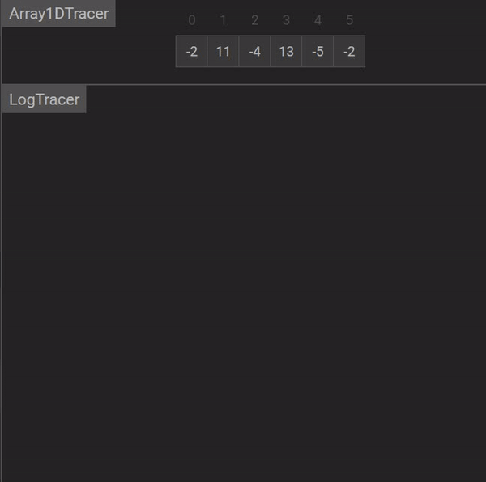

<center style="color:#7c7877">图 1.3.3 在线处理算法执行过程可视化</center>

- [x] 讨论 1.7 晒运行结果

> 在 PTA 上发布的编程题“最大子列和问题”给了非常宽松的时间上限，让大家可以至少把算法 2、3、4 分别尝试一下。另外“Maximum Subsequence Sum”需要你把算法略做修改，不仅输出最大和，而且输出相应的那个子列的首尾。
>
> 于是大家在这里晒一下自己的程序在 PTA 系统中的时间和空间耗费的结果吧~

讨论：

* 运行程序见代码示例，运行结果如下

| 算法       | 1         | 2         | 3          | 4         |
| ---------- | --------- | --------- | ---------- | --------- |
| 时间复杂度 | $O(N^3)$  | $O(N^2)$  | $O(NlogN)$ | $O(N)$    |
| N=10       | 6.30e-007 | 1.80e-007 | 2.30e-007  | 4.00e-008 |
| N=100      | 4.67e-004 | 1.43e-005 | 2.80e-006  | 3.00e-007 |
| N=1000     | 4.47e-001 | 1.29e-003 | 4.70e-005  | 2.00e-006 |
| N=10000    | 4.46e+002 | 1.30e-001 | 8.10e-004  | 2.00e-005 |
| N=100000   | NA        | 1.42e+001 | 1.10e-002  | 1.00e-003 |

* NA 的意思是 Not Available，意思就是耗时太长，不算了。

### 1.4 习题

#### 1.课后习题

**1.1 判断正误**

1. $N(logN)^2$ 是 $O(N^2)$ 的。
2. $N^2(logN)$ 和 $N(logN^2)$ 具有相同的增长速度。

解答：

* 正确，其实就是证明 $(log(n))^2$ 是 $O(n)$

  要证 $(log(n))^2$ 是 $O(n)$，只需证存在常数 $C>0,  n_0>0$ 使得当 $n > n_0 $时有 $lg^2n≤C·n$

  令 $f(x) = Cx - lg^2x$，$f'(x) = C - \frac{2lgx}{xln10}$

  $∵\frac{lgx}x<1$，对 $∀x∈R，∃C>0$，使得 $f'(x)>0$，$f(x)$ 单调递增

  而 $f(1) = C > 0$，所以 $∀n > n_0 ≥ 1$时，$lg^2n<C·n$

  所以 $(log(n))^2$ 是 $O(n)$

  * 另一个更简单的做法：直接判断

  $$
  \lim_{x \to +\infty} \frac{x(logx)^2}{x^2} = C
  $$

  即当 $x$ 大于某个值之后，$x^2$ 是 $x(logx)^2$ 的上界，此时两者要么是同阶无穷大，要么前者是高阶无穷大。即 C 是正常数或者 C = 0。

* 错误，后者和 $2N(logN)$ 具有相同的增长速度

**1.2 填空题**

1. 给定 N×N 的二维数组 A，则在不改变数组的前提下，查找最大元素的时间复杂度是：___。
2. 斐波那契数列 $F_N$ 的定义为：$F_0=0, F_1=1, F_N  =F_{N−1}+F_{N−2}, N=2, 3, …$。用递归函数计算 $F_N$ 的空间复杂度是___。
3. 上述斐波那契数列 $F_N$ 的时间复杂度是___。

解答：

* 遍历所有元素一次即可，时间复杂度 $O(N^2)$

* 空间复杂度计算比较简单，递归的**空间复杂度** = **每次递归的空间复杂度** × **递归深度**，每次递归的空间复杂度都是一个常量，所以空间复杂度主要与递归深度有关。每调用一次函数，就会申请一个内存空间保存状态，直到达到递归出口位置返回，递归深度为 n 层，所以空间复杂度为 $O(n)$（注意，函数返回时会把空间释放，所以空间是可以重复利用的）

```c
int fibonacci(int n)
{
    if (n <= 1)
        return n;
    else
        return fibonacci(n - 1) + fibonacci(n - 2);
}
```

* 时间复杂度较为复杂，下面提供两个简单证明方法

【证明一】：

$F(n) = F(n-1) + F(n - 2)$

将其中计算 $F(n)$ 的用时记为 $T(n)$，计算两数和的用时为常数 *C*。

所以 $T(n) = T(n-1) + T(n - 2) + C$

变形得 $T(n) + C = (T(n-1) + C) + (T(n - 2) + C)$

令 $A(n) = T(n) + C$，有

$A(n) = A(n-1) + A(n-2)$，这是个前两项不为 1 的斐波那契数列

假设前两项为 $a, b(a≠b)$，令 $c = max(a, b)$，

由斐波那契数列的定义知，前两项为 c 的斐波那契数列增长速度比前两项为 a、b 的快，该数列为：

​    $c、c、2c、3c、5c、...、F(n)c$

其中每项都与题给的标准斐波那契数列差常数倍，因此无论斐波那契数列的前两项是多少，都不会影响它的渐进增长率。

所以 $A(n)$ 的渐进增长率等于 $F(n)$，而 $T(n) = A(n) - C$，增长率也是一样的

所以有 $T(n)=Θ(F(n))$

事实上，由数学原理可以推导得到斐波那契数列通项公式为：
$$
F_n = \frac{1}{\sqrt{5} }[(\frac{1 + \sqrt{5} }{2})^n - (\frac{1 - \sqrt{5} }{2})^n ]
$$
所以可以得到 $T(n)=Θ((\frac{1 + \sqrt{5} }{2})^n)$，这是 $T(n)$ 的**‌渐进紧确界**。

【证明二】：

这是一个更加直观的证明方法。稍微改写一下递归代码，使之**不输出第 0 项斐波那契数列（保证叶结点不出现 F(0)）**。

```c
int fibonacci(int n)
{
    if (n <= 2)
        return 1;
    else
        return fibonacci(n - 1) + fibonacci(n - 2);
}
```

斐波那契数列的递归计算方法过程中，存在两种递归结点

①.第一种，**叶子结点**， F(1)，F(2) 会直接返回结果，记直接返回所需时间为 a

②.第二种，**非终端结点**， n>=3 时， F(n) 对 F(n−1) 与 F(n−2) 的结果进行相加，记加法与返回结果所需的所有时间为 b

​    斐波那契数列的递归树是一棵**非平衡二叉树**，递归求解斐波那契数列的叶子结点数量其实就是 F(n) 。因为**所有叶子结点的返回结果都是 1**，而递归求解相当于把所有的 1 按照不同的顺序加起来。因为没有结点被丢弃，所有的叶子结点都被加到结果中了，所以叶子结点的数量其实就是 F(n) 的计算结果。

​    而非终端结点的数量其实就是 F(n)−1 ，因为每个非终端结点都做了一次加法，无论用什么样的顺序将所有的 1 加起来，所需要的加法数量其实都是 F(n)−1 。（或利用二叉树的性质 $n_2=n_0 - 1$）

因此，一共所需要的时间为（a,b 都是常数）：
$$
T(n)=aF(n)+b(F(n)−1)=(a+b)F(n)−b
$$
所以有：$T(n)=Θ(F(n))$

**1.3 时间复杂度分析**

下列代码的时间复杂度是：____。

```c
if (A > B) {
    for (i = 0; i < N; i++)
        for (j = N * N; j > i; j--)
            A += B;
} else {
    for (i = 0; i < N*2; i++)
        for (j = N * 2; j > i; j--)
            A += B;
}
```

解答：条件判断 $O(1)$，第一个分支 $O(N^3)$，第二个分支 $O(N^2)$，所以最终时间复杂度是 $O(N^3)$。

**1.4 PrintN 函数算法分析**

分析两个版本的 PrintN 函数的时间、空间复杂度，并测试它们的实际运行效率。对 N = 100，1000，10000，100000 运行程序，将两个版本的 N-时间曲线绘在一张图里进行比较分析。

解答：

* 循环实现，时间复杂度：$O(n)$，空间复杂度：$O(1)$
* 递归实现，时间复杂度：$O(n)$，空间复杂度：$O(n)$
* 两个版本的 N-t 图如下，长的曲线是循环实现，短的曲线是递归实现（N = 100000 时出错）。
* 注意到一个有趣的情况，当数据量为 10000 时，如果连续运行两个版本的打印函数，后执行的打印函数用时会异常显著缩短，但是如果清屏之后再执行后一个函数则恢复正常，推测终端 I/O 用时过长。所以采取单独测量用时或者打印完一次清屏或者把结果输出到文件测试结果比较准确。

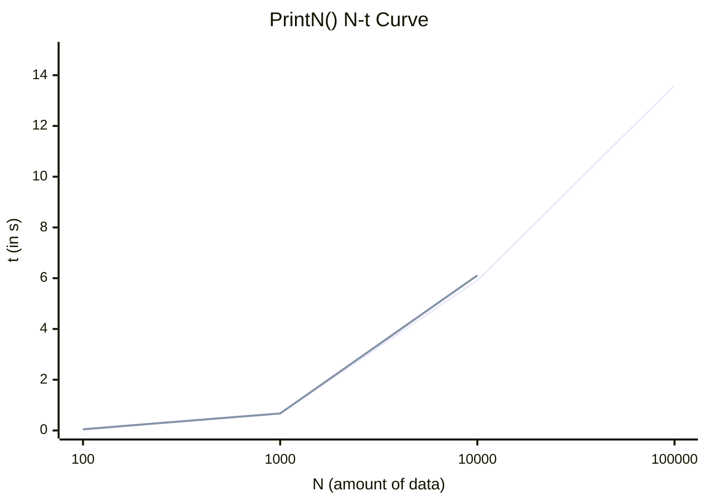
```mermaid
xychart-beta
    title "PrintN() N-t Curve"
    x-axis "N (amount of data)" [100, 1000, 10000, 100000]
    y-axis "t (in s)" 0 --> 15
    line "循环" [0.038, 0.678, 5.91, 13.6]
    line "递归" [0.048, 0.670, 6.11]
```

**1.5 秦九韶算法与直接法的效率差别**

解答：见讨论 1.3

**1.6 空间复杂度分析**

最大子列和算法 MaxSubseqSum3 是用递归实现的，由于递归而产生的空间复杂度是多少？

解答：

* 这个问题是问一共递归了多少层。由于我们每次递归都把搜索范围缩小一半，也就是 *N*/2/2/2⋯ 直到得到 1，于是有公式 $N/2^k=1$，推出 $k=log_2N$，即递归最多需要 *O*(log *N*) 次，占用的空间跟递归的次数成正比，也就是 *O*(log *N*)。

**1.7 测试最大子列和 4 种算法的实际运行效率**

简单起见，可令 List 中全部整数为 1 。当 N = 2，4，6，8，10，...，28，30 时，将各算法的 N-时间曲线绘制绘制在一张图里，其中时间以毫秒为单位；当 N = 1000，2000，...，10000 时，以秒为单位绘出各算法的时间增长曲线。两幅图有什么不同？为什么？

解答：

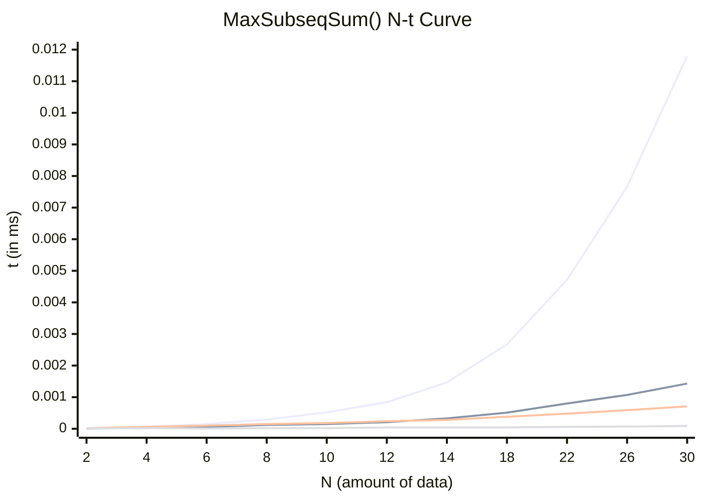
```mermaid
xychart-beta
    title "MaxSubseqSum() N-t Curve"
    x-axis "N (amount of data)" [2, 4, 6, 8, 10, 12, 14, 18, 22, 26, 30]
    y-axis "t (in ms)" 0 --> 0.012
    line "MaxSubseqSum1" [0.00001,0.00006,0.00015,0.00029,0.00052,0.00084,0.00147,0.00267,0.00471,0.00766,0.01180]
    line "MaxSubseqSum2" [0.00001,0.00003,0.00006,0.00012,0.00015,0.00021,0.00033,0.00051,0.00080,0.00107,0.00143]
    line "MaxSubseqSum3" [0.00002,0.00006,0.00010,0.00015,0.00018,0.00024,0.00028,0.00038,0.00048,0.00059,0.00071]
    line "MaxSubseqSum4" [0.00001,0.00002,0.00001,0.00002,0.00002,0.00004,0.00004,0.00004,0.00006,0.00007,0.00009]
```

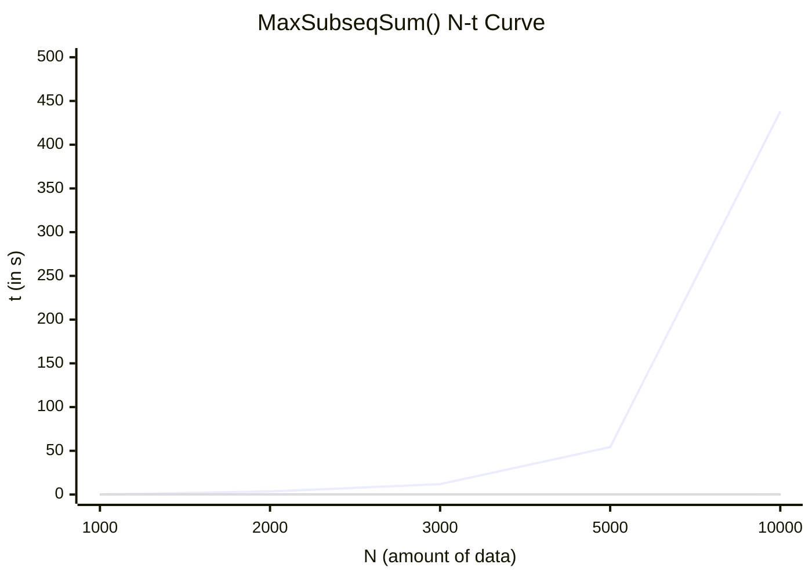
```mermaid
xychart-beta
    title "MaxSubseqSum() N-t Curve"
    x-axis "N (amount of data)" [1000, 2000, 3000, 5000, 10000]
    y-axis "t (in s)" 0 --> 500
    line "MaxSubseqSum1" [0.044000,3.49000,11.90000,54.2,438]
    line "MaxSubseqSum2" [0.001360,0.00520,0.01100,0.0032,0.0136]
    line "MaxSubseqSum3" [0.000040,0.00010,0.00012,0.00022,0.00047]
    line "MaxSubseqSum4" [0.000002,0.000004,0.000006,0.000012,0.000025]
```

* 图二的 MaxSubseqSum1()用时差距与其他三个函数比，远远比图一更大，这是因为随着数据量的增大，时间复杂度高的算法耗时增加的速度是惊人的。

**1.8 二分查找**

本题要求实现二分查找算法

**函数接口定义**：

```c++
Position BinarySearch(List L, ElementType X);
```

其中 List 结构定义如下：

```c
typedef int Position;
typedef struct LNode *List;
struct LNode {
    ElementType Data[MAXSIZE];
    Position Last; /* 保存线性表中最后一个元素的位置 */
};
```

​    L 是用户传入的一个线性表，其中 ElementType 元素可以通过 >、==、< 进行比较，并且题目保证传入的数据是递增有序的。函数 BinarySearch 要查找 X 在 Data 中的位置，即数组下标（注意：元素从下标 1 开始存储）。找到则返回下标，否则返回一个特殊的失败标记 NotFound。

**裁判测试程序样例**：

```c
#include <stdio.h>
#include <stdlib.h>

#define MAXSIZE 10
#define NotFound 0
typedef int ElementType;

typedef int Position;
typedef struct LNode *List;
struct LNode {
    ElementType Data[MAXSIZE];
    Position Last; /* 保存线性表中最后一个元素的位置 */
};

List ReadInput(); /* 裁判实现，细节不表。元素从下标 1 开始存储 */
Position BinarySearch(List L, ElementType X);

int main()
{
    List L;
    ElementType X;
    Position P;

    L = ReadInput();
    scanf("%d", &X);
    P = BinarySearch(L, X);
    printf("%d\n", P);

    return 0;
}

/* 你的代码将被嵌在这里 */
```

**输入样例 1**：

```in
5
12 31 55 89 101
31
```

**输出样例 1：**

```out
2
```

**输入样例 2：**

```
3
26 78 233
31
```

**输出样例 2：**

```
0
```

---

解答：

​    最好、最坏情况下的时间、空间复杂度见讨论 1.5。

```c
Position BinarySearch(List L, ElementType X)
{
    int ret = -1;
    int left, right;
    left = 1;
    right = L->Last;
    while (left <= right) {
        int mid = (left + right) / 2;
        if (L->Data[mid] == X) {
            ret = mid;
            break;
        } else if (L->Data[mid] > X) {
            right = mid - 1;
        } else {
            left = mid + 1;
        }
    }

    if (ret == -1)
        return NotFound;
    else
        return ret;
}
```

**1.9 有序数组的插入**

本题要求将任一给定元素插入从大到小排好序的数组中合适的位置，以保持结果依然有序。

**函数接口定义：**

```c++
bool Insert(List L, ElementType X);
```

其中 List 结构定义如下：

```c++
typedef int Position;
typedef struct LNode *List;
struct LNode {
    ElementType Data[MAXSIZE];
    Position Last; /* 保存线性表中最后一个元素的位置 */
};
```

​    L 是用户传入的一个线性表，其中 ElementType 元素可以通过>、==、<进行比较，并且题目保证传入的数据是递减有序的。函数 Insert 要将 X 插入 Data[] 中合适的位置，以保持结果依然有序（注意：元素从下标 0 开始存储）。但如果 X 已经在 Data[] 中了，就不要插入，返回失败的标记 false；如果插入成功，则返回 true。另外，因为 Data[] 中最多只能存 MAXSIZE 个元素，所以如果插入新元素之前已经满了，也不要插入，而是返回失败的标记 false。

**裁判测试程序样例：**

```c++
#include <stdio.h>
#include <stdlib.h>

#define MAXSIZE 10
typedef enum {false, true} bool;
typedef int ElementType;

typedef int Position;
typedef struct LNode *List;
struct LNode {
    ElementType Data[MAXSIZE];
    Position Last; /* 保存线性表中最后一个元素的位置 */
};

List ReadInput(); /* 裁判实现，细节不表。元素从下标 0 开始存储 */
void PrintList(List L); /* 裁判实现，细节不表 */
bool Insert(List L, ElementType X);

int main()
{
    List L;
    ElementType X;

    L = ReadInput();
    scanf("%d", &X);
    if (Insert(L, X) == false)
        printf("Insertion failed.\n");
    PrintList(L);

    return 0;
}

/* 你的代码将被嵌在这里 */
```

**输入样例 1：**

```in
5
35 12 8 7 3
10
```

**输出样例 1：**

```out
35 12 10 8 7 3
Last = 5
```

**输入样例 2：**

```in
6
35 12 10 8 7 3
8
```

**输出样例 2：**

```out
Insertion failed.
35 12 10 8 7 3
Last = 5
```

---

解答：

* 由于给出的数组是**降序**的，所以使用折半查找并插入的方法

* 最好情况，第一个查找到的元素就是 x，所以不用插入，时间复杂度 O(1)，空间复杂度 O(1)。

* 最坏情况，遍历了所有元素都没找到 x，插入 x，此时查找用时 O(log n)，插入时数组后移用时 O(n)，时间复杂度 O(nlogn)，空间复杂度仍为 O(1)。
* 返回值：注意到只有插入成功才返回`true`，所以初始默认值就设为`false`。
* 边界条件分析：需要插入的情况即 left 指针在右，right 指针在左，此时循环体内已经判断过`x != L->Data[mid]`，于是只会有下列两种情况：
  * 如果`X < L->Data[mid]`，则插在 Data[mid]的右边，left = mid + 1， right = mid，此时位置正好是 left
  * 如果`X > L->Data[mid]`，则插在 Data[mid]处，left = mid， right = mid - 1，此时位置还是 left

* 所以用指针 left 表示插入位置就很简单（当然，认真思考就会发现，插入位置也可以表示为 right + 1）
* 接下来就是把插入位置**以及往后**全部后移一位（所以要取等号），把插入位置空出来，最后把 X 赋值进去
* 最终别忘了把数组长度增加 1，以及把标志置为`true`

```c
bool Insert(List L, ElementType X)
{
    int left, right, mid;
    int i;
    int ret = false;
    if (L->Last == MAXSIZE - 1)
        return false;
    left = 0;
    right = L->Last;
    while (left <= right) {
        mid = (left + right) / 2;
        if (X == L->Data[mid])
            break;
        else if (X > L->Data[mid])
            right = mid - 1;
        else
            left = mid + 1;
    }

    if (left > right) {
        for (i = L->Last; i >= left; i--)
            L->Data[i + 1] = L->Data[i];
        L->Data[i + 1] = X;
        L->Last++;
        ret = true;
    }

    return ret;
}
```

**1.10 试给出判断 N 是否为质数的$O(\sqrt{N})$算法**

解答：

```c
#include <stdio.h>
#include <math.h>
typedef long long ll;

int isprime(ll x)
{
    int ret = 1;
    for (int i = 2; i <= sqrt(x); i++) {
        if (x % i == 0) {
            ret = 0;
            break;
        }
    }
    return ret;
}
```

**1.11 试给出计算 x^N^ 的时间复杂度为 O(log N)的算法。**

解答：

* 很自然的想到利用二分循环或者递归来解决，看起来不难，实际马上遇到的第一个问题就是指数如果不能被 2 整除时如何处理？
* 思路是将指数转换成 2 的幂的形式之和，这样每次能被 2 整除，比如计算 ：

$$
5^{10} = 5^{(1010)_2}=5^{2^3+0+2^1+0}=5^{2^3}×5^0×5^{2^1}×5^0
$$

* 这样转换之后每一步恰好和二进制转换思路一致，一边在不断对 n mod 2，从低位取数，一边乘基转换成 result。
* 除基取余，先 mod 2 得到的是低位，如果 mod 2 不为 0，则说明对应的 2 进制位**不为 0**，开始**乘基**取整，化为十进制，如果 mod 2 为 0，则说明对应的 2 进制**为 0**，这时只需要把**底数翻倍**即可（相当于指数乘 2），不必累乘到结果中，而是为下一位的计算做准备。
* 这个问题可以衍生到经典算法——快速幂，这里不再赘述。
* 方法一：循环实现

```c
double pow(double x, int n)
{
    double temp = x;
    double result = 1;
    while (n) {
        if (n % 2)
            result = result * temp;
        n = n / 2;
        temp *= temp;   
    }
    
    return result;
}
```

方法二：递归实现

* 注意，分问题的结果都是一样的，所以要先保存 temp 变量，在 temp 处做递归，而不是在`ret = pow2(x, n / 2) * pow2(x, n / 2) * x`处做递归，如果像后面这样写的话虽然递归深度还是 O(log n) 但是每一层还要递归其它分支，产生额外的时间复杂度，最终的时间复杂度是 = 整棵递归树的结点 × O(1) = O(n)，是很低效的。

```c
double pow2(double x, int n)
{
    double ret;
    if (n == 0)
        ret = 1;
    else if (n == 1)
        ret = x;
    else {
        int temp = pow2(x, n / 2);
        if (n % 2 == 1)
            ret = temp * temp * x;
        else
            ret = temp * temp;
    }
    
    return ret;
}

```

#### a.课外习题

**a.1 已知两个长度分别为 m 和 n 的升序链表，若将它们合并为长度为 m + n 的一个降序链表，则最坏情况下的时间复杂度是（   ）。**

A. O(n)    B. O(mn)   C. O(min(m, n))    D. O(max(m, n))

解答：

* 合并成升序链表还是降序链表没有影响，只不过合并成升序用尾插法，现在改用头插法生成链表而已。
* 时间复杂度与元素之间的**比较次数**有关
* 最好情况是短链表在前，而且元素都比长链表大，此时比较完短链表之后，剩下的长链表直接用头插法连上去即可，时间复杂度 O(min(m, n))。
* 最坏情况是仅仅只有一个元素是最后直接连上去的，剩下的所有元素都比较一次之后才加入，所以时间复杂度是 O(m+n-1)，而 m + n - 1 < 2 * max(m, n)，所以时间复杂度为 O(max(m, n))。
* 如果 m 和 n 都是无序链表，则最坏情况下比较次数会大大提高，有可能每个元素都要和其他元素比较一次才能确定大小关系，此时，时间复杂度会达到二次级别，B 选项是无序链表合并才可能产生的时间复杂度。

**a.2 【2022 统考真题】下列程序段的时间复杂度是（   ）**

```c
int sum = 0;
for (int i = 1; i < n; i *= 2)
    for (int j = 0; j < i; j++)
        sum++;
```

A. O(logn)    B. O(n)    C. O(nlogn)    D. O(n^2^)

解答：

* 这种问题属于第一种类型：**循环主体的变量参与循环条件的判断**，有个通用方法，就是把**基本操作次数记为 k** 。
* 大部分时候是把最内层操作记为 k，但本题可以设外层循环执行了 k 次，这样内层循环就是整数，比较好算。
* 外层循环的 i 的取值为 $i=1,2,4,...,2^k(2^k<n)$，内层循环基本语句执行，对于每个 i ，都要执行 i 次，也就是总循环次数等于外层循环取值求和，这个是个等比数列求和，最后算出来是 $2^{k+1}-1$ 次，小于 2n，所以时间复杂度为 O(n)。

$$
S_n=\frac{a_1(1-q^n)}{1-q}(q≠1,n 为项数)
$$

**a.2(变式) 【2014 统考真题】下列程序段的时间复杂度是**

```c
count = 0;
for (k = 1; k <= n; k *= 2)
    for (j = 1; j <= n; j++)
        count ++
```

解析：

​    设最外层循环 t 次，所以 $2^t=n→t=log_2n$

​    内层循环次数为 n 次，所以总的循环次数为 $nlog_2n$，时间复杂度：$O(nlog_2n)$

**a.3 一个算法所需时间由下述递归方程表示，试求出该算法的时间复杂度的级别（或阶）**
$$
T(n) =  \begin{cases}    1, & n = 1 \\2T(n/2)+n, & n > 1 \end{cases}
$$

​    其中，n 是问题的规模，为简单起见，设 n 是 2 的整数次幂。

解答：

* 本题属于第二类问题，**循环主体中的变量与循环条件无关**，采用数学归纳法或者直接统计循环次数。

* 递推程序一般用公式递推，这里公式已经给出，直接找规律化简即可。
* $T(n) = 2^2T(n/2^2)+ n + n = ...=2^kT(1) + kn = n + nlogn$(其中，$n / 2^k = 1$)
* $O(n + nlogn) = O(nlogn)$

**a.3(变式) 下列函数代码的时间复杂度是**

```c
int Func(int n){
    if (n == 1) return 1;
    else return 2 * Func(n / 2) + n;
}
```

解析：

​    每一层其实只做了一件事，所以看递归层数知道时间复杂度为：$O(log_2n)$

​    注意与上一题的区别，上一题是直接给出渐进表达式的递推公式。

**a.4 求解斐波那契数列**
$$
F(n) =  \begin{cases}    0, & n = 0 \\ 1, & n = 1 \\F(n-1)+F(n-2), & n > 1 \end{cases}
$$

有两种常用的算法：递归算法和非递归算法。试分别分析两种算法的时间复杂度。

解析：

```c
/* 斐波那契数列非递归写法 */
int fib_iter(int n)
{
    int t0, t1, t;
    t0 = 0; t1 = 1; t = n;
    while (n > 1){
        t = t0 + t1;
        t0 = t1;
        t1 = t;
        n --;
    }
    return t;
}
/* 斐波那契数列递归写法 */
int fib_rec(int n)
{
    if (n == 0)
        return 0;
    else if (n == 1)
        return 1;
    else
        return fA(n - 1) + fA(n - 2);
}
```

​    非递归写法时间复杂度分析属于之前提到的第一类问题，循环主体参与循环条件判断，循环次数和 n 相同，时间复杂度很容易看出来是：$O(n)$。

​    递归写法时间复杂度分析属于之前提到的第二类问题，要用数学归纳法判断或者直接累计次数。由于本题没有给出关于 T(n) 的表达式，所以采用直接累计次数的方法。习题 1.2 部分已经用两种方法说明过了，时间复杂度为：$O(2^n)$(非紧界)


## 第 2 章 线性结构

### 2.1 线性表及其实现

​    线性表是算法命题的重点，容易实现且代码量较少，要求有最优时间/空间复杂度才能获得满分，因此应该牢固掌握线性表的基本操作（基于两种存储结构），纸面考试重要的是思想，不一定要求代码具有实际可执行性，不必拘泥于边界细节。

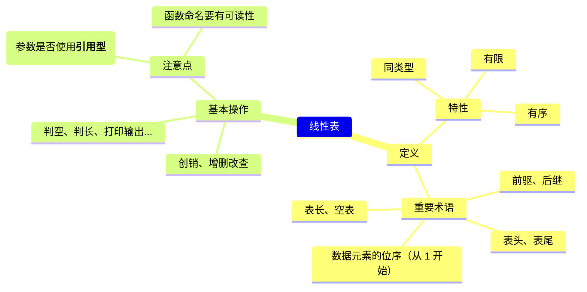
```mermaid
mindmap
    线性表
        定义
            特性
                同类型
                有限
                有序
            重要术语
                表长、空表
                表头、表尾
                前驱、后继
                数据元素的位序（从 1 开始）
        基本操作
            创销、增删改查
            判空、判长、打印输出...
            注意点
                id("参数是否使用**引用型**")
                函数命名要有可读性
```


#### 2.1.1 引言-多项式表示

【典例】一元多项式及其运算
$$
f(x) = a_0 + a_1x + ... + a_{n-1}x^{n-1} + a_{n}x^{n}
$$

* 主要运算：多项式相加、相减、相乘等
* 分析——如何表示多项式？多项式的关键数据：
  * 多项式的系数 n
  * 各项系数 $a_i$ 及指数 i

方法一：顺序存储结构直接表示

* 数组各分量对应多项式各项
  * a[i]：项 $x^i$ 的系数 $a_i$

例如：$f(x) = 4x^5-3x^2+1$

| 下标 | 0    | 1    | 2    | 3    | 4    | 5    |
| ---- | ---- | ---- | ---- | ---- | ---- | ---- |
| a[i] | 1    | 0    | -3   | 0    | 0    | 4    |

* 两个多项式相加：两个数组对应分量相加
* 问题：如何表示多项式 $x+3x^{2000}$ 呢？
  * 很显然，如果按照上面的数组表示，会导致非 0 项空间的巨大浪费

方法二：顺序存储结构表示非零项

* 每个非零项 $a_ix^i$ 涉及两个信息：系数 $a_i$ 和指数$i$ 
* 可以将一个多项式看成是 (a, i)二元组的集合
* 用**结构数组**表示：数组分量是由系数 $a^i$ 、指数 i 组成的结构，对应一个非零项。
* 例如：$P_1(x) = 9x^{12}+15x^8+3x^2$和$P_2(x) = 26x^{19}-4x^8-13x^6+82$

| 下标 i         | 0    | 1    | 2    | 3    | ...  |
| -------------- | ---- | ---- | ---- | ---- | ---- |
| P~1~ 系数 a^i^ | 9    | 15   | 3    | -    | -    |
| P~1~ 指数 i    | 12   | 8    | 2    | -    | -    |
| P~2~ 系数 a^i^ | 26   | -4   | -13  | 82   | -    |
| P~2~ 指数 i    | 19   | 8    | 6    | 0    | -    |

* 按照指数大小降序存储时，运算依然是方便的。
  * 比如加法运算：从头开始比较，$P_2$ 指数大，那和的结果就是指数大的那一项，然后接下来比较 $P_1$ 第一项和$P_2$ 第二项，以此类推

方法三：链表结构存储非零项

* 链表中每个**结点**存储多项式中的一个**非零项**，包括**系数和指数**两个数据域以及一个**指针域**

  | coef | expon | link |
  | ---- | ----- | ---- |

```c
typedef struct PolyNode *Polynomial;
struct PolyNode {
    int coef;
    int expon;
    Polynomial link;
}
```

* 指数也可以按照（递增、递减）顺序存放，相加过程也和方法二类似。

* 例如：$P_1(x) = 9x^{12}+15x^8+3x^2$ 和 $P_2(x) = 26x^{19}-4x^8-13x^6+82$ 链表存储形式如下

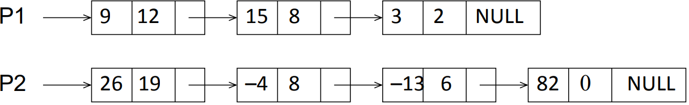

#### 2.1.2 线性表的顺序存储及其操作

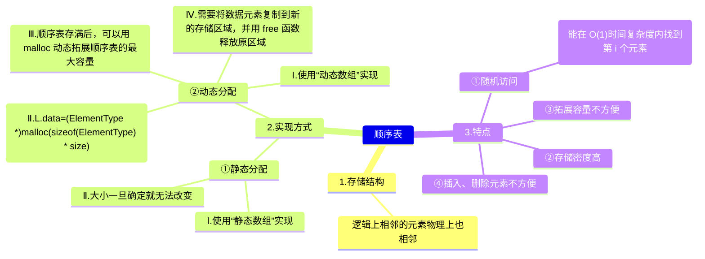
```mermaid
mindmap
    顺序表
        1.存储结构
            逻辑上相邻的元素物理上也相邻
        2.实现方式
            ①静态分配
                Ⅰ.使用“静态数组”实现
                Ⅱ.大小一旦确定就无法改变
            ②动态分配
                Ⅰ.使用“动态数组”实现
                id2("Ⅱ.L.data=(ElementType *)malloc(sizeof(ElementType) * size)")
                Ⅲ.顺序表存满后，可以用 malloc 动态拓展顺序表的最大容量
                Ⅳ.需要将数据元素复制到新的存储区域，并用 free 函数释放原区域
        3.特点
            ①随机访问
                id("能在 O(1)时间复杂度内找到第 i 个元素")
            ②存储密度高
            ③拓展容量不方便
            ④插入、删除元素不方便
```


**什么是线性表？**

> 多项式表示问题的启示：
>
> 1. 同一个问题可以有不同的表示（存储）方法 
> 2. 有一类共性问题：有序线性序列的组织和管理

“**线性表(Linear List)**”：由<u>同类型</u>的 n(n≥0)个**数据元素**构成**有序序列**的线性结构

* 线性表 L 可以表示为：$L = (a_1,a_2,...,a_i,a_{i-1},...,a_n)$
* 线性表中元素个数是**有限**的
* 表中元素个数称为线性表的长度
* 表中元素的数据类型都相同，每个元素占有相同大小的存储空间
* 线性表没有元素时，称为空表
* 表起始位置称**表头**，表结束位置称**表尾**
* 除第一个元素外，每个元素有且只有一个**直接前驱**；除最后一个元素外，每个元素有且只有一个**直接后继**；

**线性表的抽象数据类型描述**

**类型名称**：线性表(List)

**数据对象集**：线性表是 n(≥0) 个元素构成的有序序列 ($a_1 , a_2~, ...,a_n$) 

**操作集**：线性表 L ∈ List，整数 i 表示位置，元素 X ∈ ElementType， 线性表基本操作主要有： 

① InitList(&L)：**构造**一个空线性表 L。

  DestroyList(&L)：**销毁**线性表 L。

② ElementType GetElem(L, i)：**按位查找**表 L 中位序 i 元素并返回值（**位序从 1 开始**，数组下标从 0 开始）

③ ElementType LocateElem(L, ElementType e)：**按值查找**表 L 中 e 的第一次出现位置并返回位置。

④ bool ListInsert(&L, i, ElementType e)：在位序 i 前插入一个新元素 e。

⑤ bool ListDelete(&L, i, ElementType &e)：删除指定位序 i 的元素，并用 e 记录删除的元素。

⑥ int ListLength(L)：返回线性表 L 的长度 n。

  int ListEmpty(L):若 L 为空表，则返回 TRUE，否则返回 FALSE。

⑦ PrintList(L)：顺序打印线性表 L 中的所有元素值。

* 函数、变量命名要符合规范，具有可读性。
* 注意函数参数表是否使用**引用类型`&`**。

**线性表的顺序存储实现**

* 顺序表：利用数组的**连续存储空间顺序存放**线性表的各元素
  * 每个数据元素存储位置都和顺序表起始地址相差“**数据元素位序 × sizeof(ElementType)**”，因此可以**随机存取**。
  * **随机存取**访问时间不依赖数据在存储中的位置，**顺序存取**只能按顺序访问数据。
  * 一维数组和顺序表逻辑结构不一定一样，顺序表逻辑结构是线性表，而一维数组逻辑结构可以是线性表、树等。

| 下标 i | 0    | 1    | ... ... | i - 1 | i      | ... ... | n - 1      | ... ... | MAXSIZE - 1 |
| ----- | ---- | ---- | ------- | ----- | ------ | ------- | ---------- | ------- | ----------- |
| Data  | a~1~ | a~2~ | ... ... | a~i~  | a~i-1~ | ... ... | a~n~(Last) | ... ... | -           |

假定线性表的元素类型为 ElementType，则**静态分配**的顺序表存储结构描述为：

```c
#define MAXSIZE 50               //定义线性表的最大长度
typedef struct { 
    ElementType data[MAXSIZE];   //顺序表的元素
    int length;                  //顺序表的当前长度
} SqList;                        //顺序表的结构类型定义
SqList *Ptrl;                    //定义指向链表的指针变量            
```

访问下标为 i 的元素：SqList.data[i] 或 PtrL->data[i]

线性表的长度：SqList.length 或 Ptrl->length（下标从 0 开始）

顺序表的主要优点：

* ①可进行**随机访问**，O(1)时间内可以找到指定元素
* ②**存储密度高**，每个结点只存储数据元素

顺序表的主要缺点：

* ①插入和删除需要移动大量的元素
* ②顺序存储需要分配一段连续的内存空间不够灵活
* ③对于树、图等逻辑结构不如链表存储表示方便

**主要操作的实现**

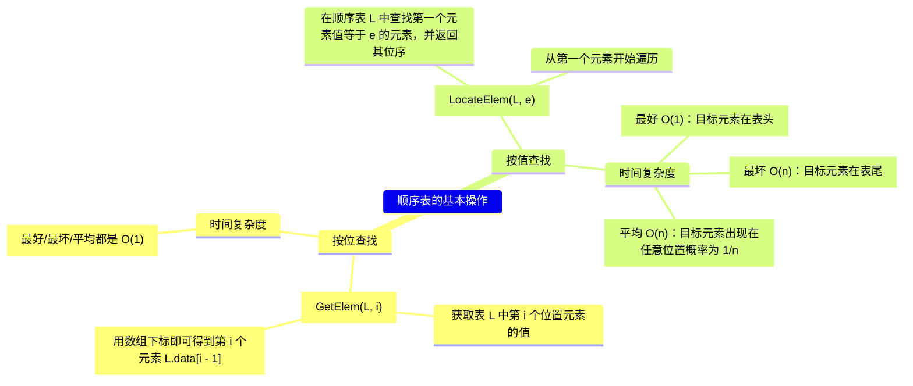
```mermaid
mindmap
    顺序表的基本操作
        按位查找
            ["GetElem(L, i)"]
                获取表 L 中第 i 个位置元素的值
                ["用数组下标即可得到第 i 个元素 L.data[i - 1]"]
            时间复杂度
                ["最好/最坏/平均都是 O(1)"]
        按值查找
            ["LocateElem(L, e)"]
                在顺序表 L 中查找第一个元素值等于 e 的元素，并返回其位序
                从第一个元素开始遍历
            时间复杂度
                ["最好 O(1)：目标元素在表头"]
                ["最坏 O(n)：目标元素在表尾"]
                ["平均 O(n)：目标元素出现在任意位置概率为 1/n"]
```


1. **初始化（建立空的顺序表）**

```c
/* 默认之前已经声明过一个顺序表 SqList L */
void InitList(SqList &L)
{ 
    L.length = 0;      //顺序表初始长度为 0
}
```

​    **静态分配**的数组大小已经事先确定，所以空间一旦占满就无法继续加入数据元素；如果采用**动态分配**，存储数组空间是通过程序执行过程在动态存储分配语句分配的，一旦空间占满，就开辟更大一块存储空间，将原表中的元素全部拷贝到新空间，从而达到数组存储空间动态扩充的目的。

​    动态分配的顺序表存储结构描述为：

```c
#define INITSIZE 100             //表长度的初始定义
typedef struct { 
    ElementType *data;           //指示动态分配数组的指针
    int MaxSize;                 //顺序表的最大长度
    int length;                  //顺序表的当前长度
} SeqList;                       //顺序表的结构类型定义
```

顺序表初始化的实现--动态分配

```c
void InitList(SeqList &L)    
{
    L.data = (int *)malloc(InitSize * sizeof(int));
    L.length = 0;
    L.MaxSize = InitSize;
}
```

​    C++可以动态分配存储空间可用：`L.data = new ElementType[InitSize];`

可运行代码实践：

```c
#include <stdio.h>
#include <stdlib.h>
#define INITSIZE 10   //表初始长度的定义

typedef struct {
    int *data;        //指示动态分配数组的指针
    int MaxSize;      //顺序表的最大长度
    int length;       //顺序表的当前长度
} SeqList;            //顺序表的结构类型定义

void IncreaseSize(SeqList &L, int len);
void InitList(SeqList &L);

int main()
{
    SeqList L;          //声明一个顺序表
    InitList(L);        //初始化顺序表
    //... ...链表插入满
    IncreaseSize(L, 5); //扩容链表
    return 0;
}

void IncreaseSize(SeqList &L, int len)
{
    int *p = L.data;
    L.data = (int *)malloc((L.MaxSize + len)*sizeof(int)); //建议用 malloc 而非其他几种动态内存分配方式
    for (int i = 0; i < L.length; i++)
        L.data[i] = p[i];             //数据复制到新的内存空间
    L.MaxSize = L.MaxSize + len;      //顺序表最大长度增加 len
    free(p);                          //释放原来的内存空间
}

void InitList(SeqList &L)    
{
    L.data = (int *)malloc(INITSIZE * sizeof(int));
    L.length = 0;
    L.MaxSize = INITSIZE;
}
```

2. **查找**

**按值查找（顺序查找）**

```c
ElementType LocateElem(SqList L, ElementType e)
{ 
    int i;
    for (i = 0; i < L.length; i++)
        if (L.data[i] == e)
            return i + 1;        //下标为 i 的元素等于 e，找到返回位序 i + 1
    return 0;                    //查找失败，返回 0
}
```

最好情况：查找元素在表头，仅需比较一次，时间复杂度 $O(1)$。

最坏情况：查找元素在表尾或不存在时，比较 n 次，时间复杂度 $O(n)$。

平均情况：查找成功的平均比较次数为：$\displaystyle\sum_{i=1}^{n}p_i·i=\sum_{i=1}^{n}\frac{1}n·i=\frac{n +1}2$，平均时间性能为：$O(n)$。

**按位查找**

```c
ElementType GetElem(SqList L, int i)
{
    return L.data[i - 1];
}
```

​    顺序表按序号查找直接根据数组下标访问数组元素，其时间复杂度为 $O(1)$。

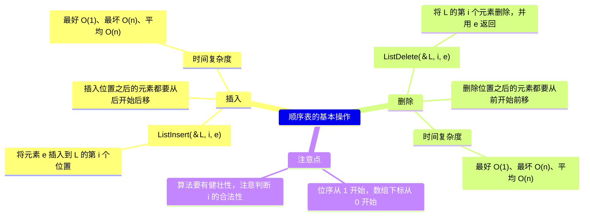
```mermaid
mindmap
    顺序表的基本操作
        插入
            ["ListInsert(＆L, i, e)"]
                将元素 e 插入到 L 的第 i 个位置
            插入位置之后的元素都要从后开始后移
            时间复杂度
                ["最好 O(1)、最坏 O(n)、平均 O(n)"]
        删除
            ["ListDelete(＆L, i, e)"]
                将 L 的第 i 个元素删除，并用 e 返回
            删除位置之后的元素都要从前开始前移
            时间复杂度
                ["最好 O(1)、最坏 O(n)、平均 O(n)"]
        注意点
            位序从 1 开始，数组下标从 0 开始
            算法要有健壮性，注意判断 i 的合法性
```


3. **插入**

第 i(1≤i≤L.length+1)个位置上插入一个值为 e 的新元素（即插入下标为 i - 1 的地方）

插入成功返回 true，否则返回 false。

| 下标 i | 0    | 1    | ... ... | i - 1 | i      | ... ... | n - 1      | ... ... | MAXSIZE - 1 |
| ----- | ---- | ---- | ------- | ----- | ------ | ------- | ---------- | ------- | ----------- |
| Data  | a~1~ | a~2~ | ... ... | a~i~  | a~i+1~ | ... ... | a~n~(Last) | ... ... | -           |

先移动，再插入（为了防止覆盖数据，要从后面的数据开始后移）

| 下标 i | 0    | 1    | ... ... | i - 1 | i    | ... ... | n          | ... ... | MAXSIZE - 1 |
| ----- | ---- | ---- | ------- | ----- | ---- | ------- | ---------- | ------- | ----------- |
| Data  | a~1~ | a~2~ | ... ... | e     | a~i~ | ... ... | a~n~(Last) | ... ... | -           |

**顺序表插入（基于静态分配）**

```c
bool ListInsert(SqList &L, int i, int e)
{ 
    if (L.length == MAXSIZE) {          // 表空间已满，不能插入
        printf("Sequence list full!\n"); 
        return false; 
    } 
    if (i < 1 || i > L.length + 1) {      // 检查插入位置的合法性，注意可以插入 length 位置(末尾)
        printf("Illegal location!\n＂);
        return false; 
    } 
    for (int j = L.length; j >= i; j--)
        L.data[j] = L.data[j - 1];     // 将 ai～ an 倒序向后移动
    L.data[i - 1] = e;                 // 新元素插入
    L.length++;                        // 表长加一
    return true; 
}
```

最好情况：新元素插入到表尾，不需要移动元素，i = n + 1，循环不执行，最好时间复杂度：$O(1)$

最坏情况：新元素插入到表头，需要将原有的 n 个元素全部向后移动，i = 1，循环 n 次，最坏时间复杂度：$O(n)$

平均情况：平均移动次数：$\displaystyle\sum_{i=1}^{n+1}p_i(n-i+1)=\sum_{i=1}^{n+1}\frac{1}{n+1}(n-i+1)=\frac{n}2$，平均时间复杂度：$O(n)$

4. **删除（基于静态分配）**

删除表的第 i (1≤i≤L.length)个位置上的元素。

删除成功返回 true，并用(引用)变量 e 返回被删除的值，否则返回 false。

| 下标 i | 0    | 1    | ... ... | i - 1 | i      | ... ... | n - 1      | ... ... | MAXSIZE - 1 |
| ----- | ---- | ---- | ------- | ----- | ------ | ------- | ---------- | ------- | ----------- |
| Data  | a~1~ | a~2~ | ... ... | a~i~  | a~i+1~ | ... ... | a~n~(Last) | ... ... | -           |

先删除，再移动（为了防止覆盖数据，要从前面的数据开始前移）

| 下标 i | 0    | 1    | ... ... | i - 1  | i      | ... ... | n - 2      | ... ... | MAXSIZE - 1 |
| ----- | ---- | ---- | ------- | ------ | ------ | ------- | ---------- | ------- | ----------- |
| Data  | a~1~ | a~2~ | ... ... | a~i+1~ | a~i+2~ | ... ... | a~n~(Last) | ... ... | -           |

```c
bool ListDelete(SqList &L, int i, ElementType &e)
{ 
    if (i < 1 || i > L.length) {     // 检查空表及删除位置的合法性
        printf ("The %d-th element does not exist.\n", i); 
        return false; 
    }
    e = L.data[i - 1];               // 被删除元素赋值给引用变量 e
    for (int j = i; j < L.length; j++)
        L.data[j - 1] = L.data[j];   // 将 ai+1~an 顺序向前移动
    L.length--;                      // 线性表长度减 1
    return true; 
}
```

最好情况：删除表尾元素，i = n，不需要移动元素，最好时间复杂度：$O(1)$

最坏情况：删除表头元素，i = 1，需要将原有的 n-1 个元素全部向前移动，最坏时间复杂度：$O(n)$

平均情况：平均移动次数：$\displaystyle\sum_{i=1}^{n}p_i(n-i)=\sum_{i=1}^{n}\frac{1}{n}(n-i)=\frac{n-1}2$，平均时间复杂度：$O(n)$

**顺序表基本操作总结**：(已上机验证-静态分配内存方法实现，动态分配内存方法类似)

```c
#include <stdio.h>
#include <stdlib.h>
#define MAXSIZE 50    //表最大长度的定义

typedef int ElementType;

typedef struct { 
    ElementType data[MAXSIZE];   //顺序表的元素
    int length;                  //顺序表的当前长度
} SqList;                        //顺序表的结构类型定义

void InitList(SqList &L);
ElementType LocateElem(SqList L, ElementType e);
ElementType GetElem(SqList L, int i);
bool ListInsert(SqList &L, int i, int e);
bool ListDelete(SqList &L, int i, ElementType &e);

int main()
{
    SqList L;          //声明一个顺序表
    int e = 0;
    printf("%d\n", e);
    
    InitList(L);       //初始化顺序表
    ListInsert(L, 1, 1);
    ListInsert(L, 2, 2);
    if (LocateElem(L,2))
        printf("Success, location is %d.\n", LocateElem(L,2));
    else
        printf("Error, no exist.\n");
    ListInsert(L, 3, 3);
    ListDelete(L, 2, e);
    printf("%d\n", e);
    if (LocateElem(L,2))
        printf("Success, location is %d.\n", LocateElem(L,2));
    else
        printf("Error, no exist.\n");
    GetElem(L,0);
    printf("1th = %d.\n", GetElem(L,1));

    return 0;
}

void InitList(SqList &L)    
{ 
     L.length = 0;      //顺序表初始长度为 0
}

ElementType LocateElem(SqList L, ElementType e)
{ 
    int i;
    for (i = 0; i < L.length; i++)
        if (L.data[i] == e)
            return i + 1;        //下标为 i 的元素等于 e，找到返回位序 i + 1
    return 0;                    //查找失败，返回 0
}

ElementType GetElem(SqList L, int i)
{
    return L.data[i - 1];
}

bool ListInsert(SqList &L, int i, int e)
{ 
    if (L.length == MAXSIZE) {          // 表空间已满，不能插入
        printf("Sequence list full!\n"); 
        return false; 
    } 
    if (i < 1 || i > L.length + 1) {    // 检查插入位置的合法性，注意可以插入 length 位置(末尾)
        printf("Illegal location!\n");
        return false; 
    } 
    for (int j = L.length; j >= i; j--)
        L.data[j] = L.data[j - 1];     // 将 ai～ an 倒序向后移动
    L.data[i - 1] = e;                 // 新元素插入
    L.length++;                        // 表长加一
    return true; 
}

bool ListDelete(SqList &L, int i, ElementType &e)
{ 
    if (i < 1 || i > L.length) {     // 检查空表及删除位置的合法性
        printf ("The %d-th element does not exist.\n", i); 
        return false; 
    }
    e = L.data[i - 1];               // 被删除元素赋值给引用变量 e
    for (int j = i; j < L.length; j++)
        L.data[j - 1] = L.data[j];   // 将 ai+1~an 顺序向前移动
    L.length--;                      // 线性表长度减 1
    return true; 
}
```

#### 2.1.3 线性表的链式存储及其操作


```mermaid
mindmap
    单链表的定义
        单链表
            ["用“链式存储”(存储结构)实现了“线性结构”(逻辑结构)"]
            一个结点存储一个数据元素
            各结点间先后关系用一个指针表示
            用代码定义一个单链表
        两种实现
            带头结点：不要判空，表头不需要特殊处理
            不带头结点：要判空，表头可能要特殊处理
        其他注意点
            使用 typedef 混合定义单链表
            LinkList 等价于 LNode*，前者强调这是链表，后者强调这是结点，不同地方选择合适的名字
```


线性表的链式存储也称**单链表**，**不要求逻辑上相邻的两个元素物理上也相邻**，通过“链”建立起数据元素之间的逻辑关系。 

插入、删除**不需要移动数据元素**，只需要修改“链”，但也会失去顺序表可随机存取的优点。

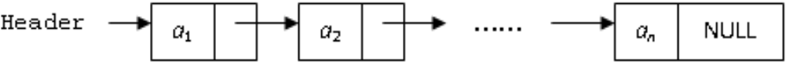

```c
typedef struct LNode {  // 混合定义单链表的结点类型
    ElementType data;   // 数据域
    struct LNode *next; // 指针域
} LNode, *LinkList; 
```

* `LinkList`是指向链表结点的结构体指针，则 `*LinkList` 表示结点本身，`(LinkList)->data` 等价于 `(*LinkList).data`；`(*LinkList).next`可得指向下一个结点的指针，所以 `(*(*LinkList).next).data`等价于 `LinkList->next->data`。
* 可以发现，链式存储的插入和删除操作由于不需要大量移动元素而变得简单，但是查找和求表长操作变得复杂了。
* 除了存放元素自身信息外，还需要存放一个指向其后继的指针，所以会浪费一部分存储空间。
* 通常用**头指针 L(或 head)**来表示一个单链表，指出链表的起始地址，头指针为 NULL 时表示一个空表。为了操作上的方便，在单链表第一个数据结点之前附加一个结点，称为**头结点**。
* 头结点数据域不存放信息，或者记录表长等信息。
* 头指针永远指向链表第一个结点，单链表带头结点时，头指针 L 指向头结点，不带头结点时，头指针 L 指向第一个数据结点，表尾结点的指针域为 NULL（用“^”表示）

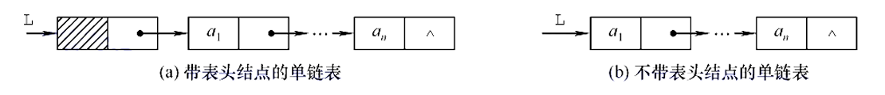

*   引入头结点的两个优点：
    *   链表第一个结点和其他位置结点的操作一致，无需特殊处理。
    *   空表和非空表，头指针都是指向头结点的非空指针，处理也是统一的。

**主要操作的实现**

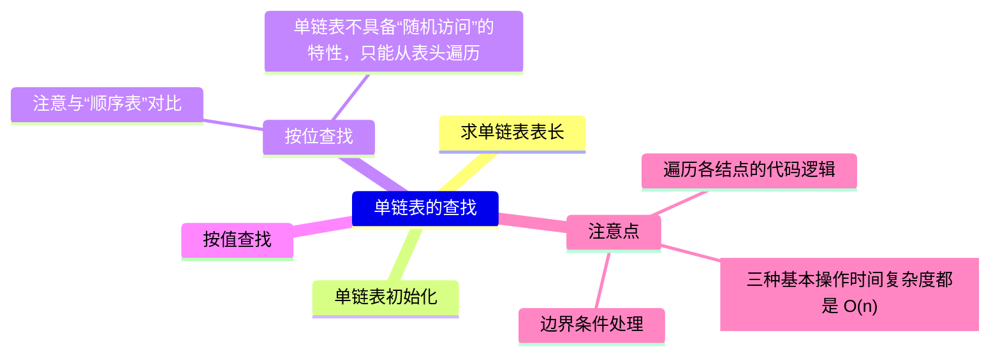
```mermaid
mindmap
    单链表的查找
        求单链表表长
        单链表初始化
        按位查找
            注意与“顺序表”对比
            单链表不具备“随机访问”的特性，只能从表头遍历
        按值查找
        注意点
            ["三种基本操作时间复杂度都是 O(n)"]
            遍历各结点的代码逻辑
            边界条件处理
        
```

​    带头结点的单链表操作比较方便，无特殊说明，都采用带头结点的链表。

1. **单链表的初始化**

​    带头结点单链表初始化时，需要创建一个头结点，并让头指针指向头结点，头结点的 next 域初始化为 NULL。

```c++
bool InitList(LinkList &L)             // 带头结点的单链表的初始化
{
    L=（LNode *)malloc(sizeof(LNode)); // 创建头结点
    L->next = NULL;                    // 头结点的指针域为空
    return true;
}
```

​    不带头结点的单链表的初始化时，只需要将头指针 L 初始化为 NULL。

```c
/* 不带头结点的单链表的初始化 */
bool InitList(LinkList &L)       // 不带头结点的单链表的初始化
{
    L = NULL;                    // 头指针为空
    return true;
}
```

2. **求表长**

​    求表长操作是计算单链表中数据结点的个数，需要从第一个结点开始遍历表，统计结点个数，直到访问到空结点为止。

```c
int Length (LinkList L)
{ 
    int len = 0;        // 计数变量，初始为 0
    LNode *p = L;
    while (p->next != NULL) { 
        p = p->next;   // 不能写成 p++， p++是指向下一个指针类型位置，而 next 是指向下一结构
        len++;         // 每访问一个结点，计数加 1
    } 
    return len;
}
```

​    时间复杂度为 O(n)。不带头结点的单链表求表长如下，在 while 条件判断里面会略有不同。

```c
/* 不带头结点的单链表求表长 */
int Length (LinkList L)
{ 
    int len = 0;        // 计数变量，初始为 0
    LNode *p = L;
    while (p != NULL) { 
        p = p->next;   // 不能写成 p++， p++是指向下一个指针类型位置，而 next 是指向下一结构
        len++;         // 每访问一个结点，计数加 1
    } 
    return len;
}
```

3. **查找**

* **(1) 按位查找结点(GetElem)：**

​    沿着 next 指针域遍历链表，找到序号为 i 的结点，返回该结点的指针，若 i 大于单链表的表长，则返回 NULL。

​    时间复杂度：O(n)

```c
LNode *GetElem(LinkList L, int i)
{
    if (i < 1)
        return NULL;              // 非法位置返回 NULL
    LNode *p = L;                 // 指针 p 指向当前扫描到的结点
    int j = 0;                    // 记录当前结点的位序，头结点是第 0 个结点
    while (p != NULL && j < i) {  // 循环找到第 i 个结点
        p = p->next;
        j++; 
    }
    return p;                       // 找到第 i 个，返回指针，越界则返回 NULL
}
```

> [!NOTE]  
>
> * 这里采用`int j = 0`是为了后续逻辑统一，代码更简洁，详细可见单链表插入 ListInsert() 函数部分的说明。

​    单链表不带头结点时，要对空表额外判断：

```c
/* 不带头结点的按位查找 */
LNode *GetElem(LinkList L, int i)
{
    if (i < 1 || L == NULL)          // 非法位置或空表时返回 NULL
        return NULL;       
    LNode *p = L;                    // 指针 p 从数据结点开始（无头结点）
    int j = 0;
    while (p != NULL && j < i - 1) { // 循环找到第 i 个结点
        p = p->next;
        j++; 
    }
    return p;                        // 找到第 i 个，返回指针，越界则返回 NULL
}
```

> [!IMPORTANT]  
>
> * 有可能会有疑问，假设`L == NULL`，后续`LNode *p = L`不是自动将 p 置为空了吗？为什么没有头结点时，要`if (i < 1 || L == NULL)`额外显式判空表？明确显式判空有下面几个好处：
>   * **区分空表与 i 越界**：若不显式判空，则`L == NULL; i == 5`时，返回`NULL`，就无法分清是空表还是下标越界。(当然，此处在返回值上都是 NULL，用户此处仅凭返回值无法判断错误类型，但是不妨碍显式判空能保障代码逻辑安全以及方便调试和拓展)
>   * **明确语义**：链表为空时直接返回，避免后续无效操作。
>   * **防御性编程**：防止因未处理`L == NULL`的情况，比如后续(拓展代码时)出现了`L->next`，导致代码崩溃。
> * 为了和之前带头结点的按位查找函数形式一致，本函数也采用`int j = 0;`的写法，循环条件判断会和带头结点的查找函数略有不同。

* **(2) 按值查找结点(LocateElem)：**

​    从单链表头结点开始，从前往后比较各结点的数据域，如果等于给定值，则返回该结点的指针，没找到则返回 NULL。

​    时间复杂度：O(n)

```c
LNode *LocateElem(LinkList L, ElementType e)
{
    Lnode *p = L->next;                // 跳过头结点，从第一个数据结点开始
    while (p != NULL && p->data != e)  // 从第一个结点开始查找数据域为 e 的结点
        p = p->next; 
    return p;                          // 查找成功返回该结点的指针，否则返回 NULL
}
```

​    不带头结点的按值查找，和之前按位查找一样，要一开始就显式判空：

```c
/* 不带头结点的按值查找 */
LNode *LocateElem(LinkList L, ElementType e)
{
    if (head ==NULL)
        return NULL;                   // 显式判空，否则若 L == NULL，下一步 L->next 崩溃
    Lnode *p = L;                      // 直接从头指针所指第一个数据结点开始
    while (p != NULL && p->data != e)  // 从第一个结点开始查找数据域为 e 的结点
        p = p->next; 
    return p;                          // 查找成功返回该结点的指针，否则返回 NULL
}
```

- [x] 讨论 2.1 链式存储中 GetElem 函数的另一种实现？

> 如果将链式存储中 GetElem 的函数另一种实现 FindIth（不带头结点）如下：
>
> ```c
> LNode *FindIth(int i, LinkList L)
> {   
>     LinkList p = L;    
>     int j = 1;    
>     while (p != NULL && j < i) {
>         p = p->next;        
>         i++;     
>     }    
>     if (j == i) 
>         return p;     // 找到第 i 个，返回指针
>     else
>         return NULL;  // 否则返回空
> }
> ```
>
> 做个修改，把函数最后的 if 语句判断条件改为判断 p 是否为 NULL，即：
>
> ```c
> if (p == NULL)
>     return NULL; 
> else
>     return p;
> ```
>
> 或者说直接简化为：`return p;`
>
> 对于这样的修改，程序还正确吗？为什么？

讨论：

* 不正确，当 i 的值不合法的时候，`i <= 0`的时候此时应该返回空，但修改后返回的是第一个结点的指针

4. **插入**

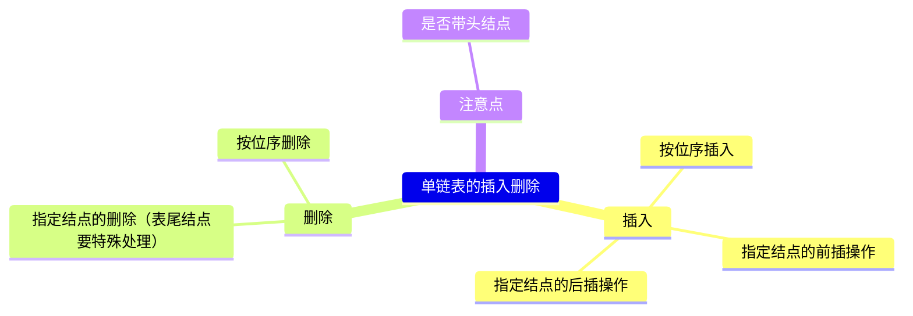
```mermaid
mindmap
    单链表的插入删除
        插入
            按位序插入
            指定结点的前插操作
            指定结点的后插操作
        删除
            按位序删除
            指定结点的删除（表尾结点要特殊处理）
        注意点
            是否带头结点
```

在第 i 个位置，即第 i-1(1 ≤ i ≤ n+1) 个结点后插入一个值为 X 的新结点

* (1)先检查插入位置的合法性
* (2)构造一个新结点，用 s 指向； 
* (3)再找到链表的第 i-1 个结点，用 p 指向；
* (4)然后修改指针，插入结点 (p 之后插入新结点是 s)

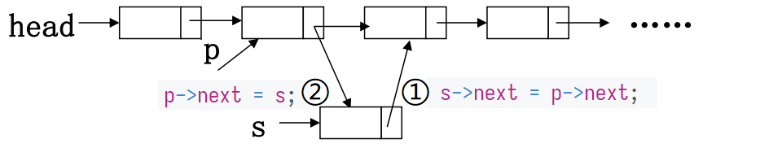

**带头结点的链表插入**，具体实现如下：平均查找次数为：$\displaystyle\sum_{i = 1}^{n+1}p_i·(i-1)=\frac{1}{n+1}·\frac{(n+1)n}{2}=\frac{n}{2}$，平均时间复杂度：$O(n)$

```c
bool ListInsert(LinkList &L, int i, ElementType e)
{
    if (i < 1)                       // i 值合法性检查
        return false;
    LNode *p = L;                    // 指针 p 指向当前扫描到的结点
    int j = 0;                       // 记录当前结点的位序，头结点是第 0 个结点
    while (p != NULL && j < i - 1) { // 循环找到第 i-1 个结点
        p = p->next;
        j++;
    }
    if (p == NULL)                   // i 值不合法
        return false;
    LNode *s = (LNode *)malloc(sizeof(LNode));
    s->data = e; 
    s->next = p->next;               // 新结点先接上后继结点
    p->next = s;                     // 前驱结点接上新结点（同时断开原后继结点连接）
    return true;
}
```

> [!NOTE]
>
> * 修改指针时，新结点要先接到后继结点，再把前驱结点断开，否则会导致链表断裂而找不到后面的结点。
> * 为什么之前带头结点的 GetElem() 函数要令初值`int j = 0;`，在此处得以解答。如果这里令`int j = 1;`，相应的前一句要改成`LNode *p = L->next;`，然后你就会发现，当`i = 1`时需要特殊处理，此时 while 循环不执行，而 p 仍然指向第一个数据结点而非首部，就会导致错误的插入第一个数据元素后面。所以`j = 0`是更优的写法，逻辑统一、无需特殊处理首部插入，代码更简洁，建议始终使用 **j = 0 初始化方式的带头结点链表**。
> * 算法主要时间开销在于查找第 i-1 个元素，时间复杂度：O(n)，若在指定结点后插入新结点，则时间复杂度仅：O(1)

**不带头结点的链表插入**，具体实现如下：

```c
/* 不带头结点的链表插入 */
bool ListInsert(LinkList &L, int i, ElementType e)
{
    if (i < 1)                         // i 值合法性检查
        return false;
    if (i == 1) {                      // 处理插入到首部(i = 1)的情况
        LNode *s = (LNode *)malloc(sizeof(LNode));
        s->data = e;
        s->next = L;
        L = s;
        return true;
    }
    
    LNode *p = L;                    // 指针 p 指向当前扫描到的结点
    int j = 1;                       // 计数器从 1 开始
    while (p != NULL && j < i - 1) { // 循环找到第 i-1 个结点
        p = p->next;
        j++;
    }
    if (p == NULL)                     // i 值不合法
        return false;
    LNode *s = (LNode *)malloc(sizeof(LNode));
    s->data = e; 
    s->next = p->next;                 // 新结点先接上后继结点
    p->next = s;                       // 前驱结点接上新结点（同时断开原后继结点连接）
    return true;
}
```

> [!WARNING]
>
> * 不带头结点时，需要判断插入位置 i 是否为 1，若是，则要做特殊处理，将头指针指向新的首结点。所以带头结点的单链表操作会更加简单，清晰。
> * 没特殊说明的时候，默认内存空间足够大，所以不会出现 malloc() 返回 NULL 的情况，简而言之就是不用附加条件判断：`if(s == NULL) return false;`。

**【扩展】对某一结点进行前插操作**

* **前插操作**是在某结点的前面插入一个新结点，**后插操作**的定义与之相反。上面提到的插入操作都是后插操作，即先找到第 i-1 个结点，即插入结点的前驱，再对其执行后插操作。
* **对结点的前插操作均可以转化为后插操作**，而前插操作一般方法要寻找前驱，而单链表无法往前寻找，所以时间复杂度为：$O(n)$，但我们可以用一些技巧规避找前驱的过程，而使时间复杂度降为：$O(1)$

​    另一种方式将其转化为后插操作来实现，设待插入结点为 \*s,将 \*s 插入到 \*p 的前面。该方法的主要代码如下：

```c
bool InsertPriorLNode(LNode *p, LNode *s)
{
    if (p == NULL || s == NULL)
        return false;
    s->next = p->next;          // 修改指针域，不能颠倒
    p->next = s;                // s 连到 p 之后
    ElementType temp = p->data; // 交换数据域部分
    p->data = s->data;
    s->data = temp;
}
```

> [!NOTE]
>
> * 简单来说就是在前面 ListInsert() 后插操作之后，将前驱结点和插入结点的数据域交换。

5. **删除**

删除链表的第 i (1≤i≤n)个位置上的结点

* (1)先检查删除位置的合法性
* (2)先找到链表的第 i-1 个结点，用 p 指向；
* (3)再用指针 q 指向要被删除的结点（p 的下一个结点）;
* (4)然后修改指针，删除 q 所指结点;
* (5)最后释放 q 所指结点的空间。

​    假设结点 *p 为找到的被删结点的前驱，删除操作的逻辑即修改 *p 使其指向被删结点的下一结点，然后释放被删结点的存储空间。

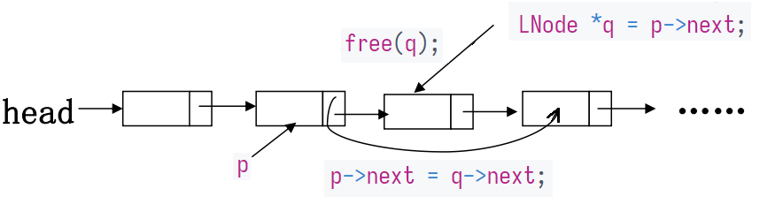

```c
bool ListDelete(LinkList &L, int i, ElementType &e)
{
    if (i < 1)                        // 检查 i 的合法性
        return false;
    LNode *p = L;                     // 指针 p 指向当前扫描到的结点
    int j = 0;                        // 记录当前结点的位序，头结点是第 0 个结点
    while (p != NULL && j < i - 1) {  // 循环找到第 i-1 个结点（待删结点前驱）
        p = p->next;
        j++;
    }
    if (p == NULL || p->next == NULL)  // 前驱或者待删结点不存在，则删除失败
        return false;
    LNode *q = p->next;                // 令 q 指向待删除结点
    e = q->data;                       // 引用型变量 e 返回元素的值
    p->next = q->next;                 // 修改链表指针，跳过 *q 结点
    free(q);                           // 释放结点 malloc() 的存储空间
    return true;
}
```

* 算法的主要时间消耗也是在查找操作上
* 平均查找次数为：$\displaystyle\sum_{i = 1}^{n}p_i·(i-1)=\frac{1}{n}·\frac{(n-1)n}{2}=\frac{n-1}{2}$， 时间复杂度：$O(n)$

> [!NOTE]
>
> * 修改指针时，s 要先指向待删除结点，再把前驱结点接到后继结点，否则会导致链表断裂而找不到待删除结点。
> * malloc() 的存储空间不及时 free()，系统是不会自动帮你释放的，这一点在 C 语言部分强调过。

不带头结点的单链表结点删除：

```c
/* 不带头结点的单链表结点删除 */
bool ListDelete(LinkList &L, int i, ElementType &e)
{
    if (i < 1 || L == NULL)             // 检查 i 的合法性以及空表
        return false;
    if (i == 1) {                       // 删除第一个结点时要特殊处理
        LNode *q = L;                   // 保存当前头结点
        e = q->data;                    // 带回头结点的值
        L = L->next;                    // 修改头指针为下一个结点
        free(q);                        // 释放原头结点
        return true;
    }
        
    LNode *p = L;                      // 指针 p 指向当前扫描到的结点
    int j = 1;                         // 当前 p 指向第一个结点
    while (p != NULL && j < i - 1) {   // 循环找到第 i-1 个结点（待删结点前驱）
        p = p->next;
        j++;
    }
    if (p == NULL || p->next == NULL)  // 前驱或者待删结点不存在，则删除失败
        return false;
    LNode *q = p->next;                // 令 q 指向待删除结点
    e = q->data;                       // 引用型变量 e 返回待删除元素的值
    p->next = q->next;                 // 修改链表指针，跳过 *q 结点
    free(q);                           // 释放结点 malloc() 的存储空间
    return true;
}
```

> [!NOTE]
>
> * 当链表不带头结点时，需要判断待删结点是否为第一个结点，如果是，要特殊处理，将头指针指向新的首结点。

**【扩展】删除指定结点 *p**

* 要删除某个给定结点 *p，通常是遍历链表找到其前驱，然后执行删除操作。
* 其实，删除结点 *p 的操作可以用删除 *p 的后继来实现，实质就是将其后继的值赋予自身，然后再删除后继，也能使时间复杂度为：$O(1)$。
* 实现核心代码如下：

```c
bool DeleteNode (LNode *p) {
    if (p == NULL)
        return false;
    q = p->next;          // 令 q 指向 *p 的后继结点
    p->data = q->data;    // 自身和后继结点的数据域交换
    p->next = q->next;    // 将 *q 结点从链中“断开”
    free(q);              // 释放后继结点的存储空间
    return true
}
```

> [!CAUTION]
>
> * 假设 *p 是**尾结点**，则必须遍历找到前驱节点再删除。

#### 2.1.4 广义表与多重链表

之前介绍了一元多项式的表示，那么二元多项式又该如何表示？ 比如，给定二元多项式：
$$
P(x, y) = 9x^{12}y^2 + 4x^{12} + 15x^8y^3 - x^8y + 3x^2
$$
可以将上述二元多项式看成关于 x 的一元多项式：
$$
P(x,y) = (9y^2+4)x^{12} + (15y^3-y)x^8 + 3x^2 
$$
又可以将其看作 $ax^{12} + bx^8 + cx^2$，所以，上述二元多项式可以用**“复杂”链表**表示为：

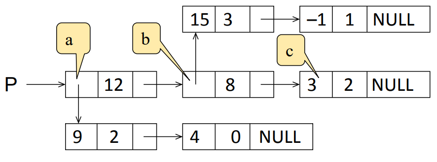

**广义表(Generalized List)**

* 广义表是**线性表的推广**
* 对于线性表而言， n 个元素都是基本的**单元素**
* 广义表中，这些元素不仅可以是单元素也可以是**另一个广义表**

```c
typedef struct GNode *GList;
struct GNode {
    int Tag;    /*标志域：0 表示结点是单元素，1 表示结点是广义表 */
    union {     /*子表指针域 Sublist 与单元素数据域 Data 复用，即共用存储空间*/
        ElementType Data;
        GList SubList; 
    } URegion;
    GList Next; /* 指向后继结点 */
};
```

<table><thead>
  <tr>
    <td rowspan="2">Tag</td>
    <td>Data</td>
    <td rowspan="2">Next</td>
  </tr>
  <tr>
    <td>SubList</td>
  </tr></thead>
</table>

**多重链表(multilinked list)**

链表中的结点可能同时隶属于多个链

* 多重链表中结点的**指针域会有多个**，如前面例子包含了 Next 和 SubList 两个指针域；
* 但包含两个指针域的链表并不一定是多重链表，比如**双向链表不是多重链表**。

多重链表有广泛的用途： 基本上如**树**、**图**这样相对复杂的数据结构都**可以采用多重链表**方式实现存储。

【例】矩阵可以用二维数组表示，但二维数组表示有两个缺陷：

* 数组的**大小需要事先确定**
* 对于**“稀疏矩阵 ”**，将造成大量的**存储空间浪费**

$$
A=\left[\begin{array}{ccccc}
18 & 0 & 0 & 2 & 0 \\
0 & 27 & 0 & 0 & 0 \\
0 & 0 & 0 & -4 & 0 \\
23 & -1 & 0 & 0 & 12
\end{array}\right] \quad B=\left[\begin{array}{cccccc}
0 & 2 & 11 & 0 & 0 & 0 \\
3 & -4 & -1 & 0 & 0 & 0 \\
0 & 0 & 0 & 9 & 13 & 0 \\
0 & -2 & 0 & 0 & 10 & 7 \\
6 & 0 & 0 & 5 & 0 & 0
\end{array}\right]
$$

【分析】 采用一种典型的多重链表——**十字链表**来存储稀疏矩阵

* 只存储矩阵非 0 元素项
  * 结点的**数据域**：行坐标 Row、列坐标 Col、数值 Value
* 每个结点通过**两个指针域**，把同行、同列串起来;
  * 行指针（或称为向右指针）**Right**
  * 列指针（或称为向下指针）**Down**


* 用一个标识域 Tag 来区分头结点和非 0 元素结点：
* 头结点的标识值为“Head”，矩阵非 0 元素结点的标识值为“Term”

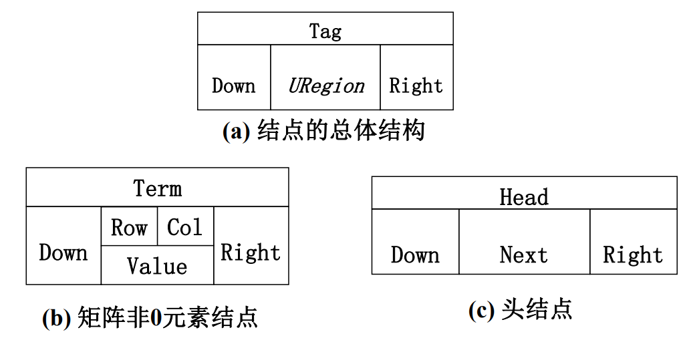


### 2.2 习题

#### b.课外习题

**b.a 设线性表有 $n$ 个元素，严格说来，以下操作中，(  )在顺序表上实现要比在链表上实现的效率高。**
I. 输出第 $i(1\leqslant i\leqslant n)$个元素值
II. 交换第 3 个元素与第 4 个元素的值
III. 顺序输出这 $n$ 个元素的值

解析：

​    I、II。顺序表随机存取，所以输出第 i 个元素值时间复杂度 O(1)，交换第 3 个元素与第 4 个元素值也只需要借助一个中间变量 t，交换三次即可，时间复杂度 O(1)。链表 I、II、III 操作的时间复杂度都是 O(n)。

**b.1 从顺序表中删除具有最小值的元素（假设唯一）并由函数返回被删除元素的值。空出的位置由最后一个元素填补，若顺序表为空，则显示出错信息并退出运行。**

解析：

```c
bool DeleteMin(SqList &L, ElementType &e)
{
    if (L.length <= 0)
        return false;
    e = L.data[0];                        //假设 0 号元素值最小
    int index = 0;                        //遍历顺序表寻找最小值元素
    for (int i = 1; i < L.length; i++) {
        if (L.data[i] < e) {               //e 记录最小值
            e = L.data[i];
            index = i;
        }
    }
    L.data[index] = L.data[L.length - 1]; //删除位置由表尾元素填补
    L.length--;
    return true;
}
```

**b.2 设计一个高效算法，将顺序表 L 的所有元素逆置，要求算法的空间复杂度为 O(1)。**

解析：

```c
void ReverseSqList(SqList &L)
{
    ElementType temp;
    for (int i = 0; i < L.length / 2; i++) {
        temp = L.data[i];                      //对称交换两端
        L.data[i] = L.data[L.length - i - 1];
        L.data[L.length - i - 1] = temp;
    }
}
```

**b.3 对长度为 n 的顺序表 L，编写一个时间复杂度为 O(n)、空间复杂度为 O(1)的算法，该算法删除顺序表中所有值为 x 的数据元素。**

解析：

​    要保证时间复杂度为 O(n)，就不可以像常规方法一样找到一个 x 就将后面的数循环前移一次，必须一趟遍历处理完毕。

方法一：(前移法)

​    用 xcnt 统计顺序表内值为 x 的数据，将不等于 x 的数据前移 xcnt 位，然后处理结束后修改表长。

```c
void DeleteSqListValueX(SqList &L, ElementType x)
{
    int xcnt = 0;                               
    for (int i = 0; i < L.length; i++) {
        if (L.data[i] == x)                       
            xcnt++;
        else
            L.data[i - xcnt] = L.data[i];   // 当前非 x 元素前移 xcnt 位(这样写和之前删除函数的形式对应)
    }
    L.length -= xcnt;
}
```

方法二：(归位法)

​    需要存入顺序表的是不等于 x 的值，所以我们顺序扫描顺序表，遇到符合条件的值就放入顺序表，并让计数器 +1，遇到 x 值就跳过，直到处理完毕，表长修改为计数器的值。（这种取出符合要求的值放入顺序表中的方法似乎更符合人类习惯）

```c
void DeleteSqListValueX(SqList &L, ElementType x)
{
    int cnt = 0;                          // 统计非 x 值的数量
    for (int i = 0; i < L.length; i++) {
        if (L.data[i] != x) {
            L.data[cnt] = L.data[i];
            cnt++;
        }
    }
    L.length = cnt;                       // 顺序表长度为 cnt
}
```

**b.4 从顺序表中删除其值在给定值 s 和 t 之间（包含 s 和 t，要求 s < t）的所有元素，若 s 或 t 不合理或顺序表为空，则显示出错信息并退出运行。**

解析：

方法一：(归位法)

​    算法思想：从前往后扫描线性表，找到不属于[s, t]的数就放入顺序表，并将计数器 +1，遇到 x 值就跳过，直到处理完毕，表长修改为计数器的值。

```c
bool DeleteSqListSToT(SqList &L, ElementType s, ElementType t)
{
    if (L.length == 0 || s >= t)
        return false;
    int cnt = 0;                                // 统计不属于[s, t]的数据元素数量
    for (int i = 0; i < L.length; i++) {
        if (L.data[i] < s || L.data[i] > t) {
            L.data[cnt] = L.data[i];
            cnt++;
        }
    }
    L.length = cnt;
    
    return true;
}
```

方法二：(前移法)

​    算法思想：用 stotcnt 统计顺序表内值属于[s, t]的数据，将不属于[s, t]的数据前移 stotcnt 位，处理结束后修改表长。

```c
bool DeleteSqListSToT(SqList &L, ElementType s, ElementType t)
{
    if (L.length == 0 || s >= t)
        return false;
    int stotcnt = 0;
    for (int i = 0; i < L.length; i++) {
        if (L.data[i] >= s && L.data[i] <= t)
            stotcnt++;
        else
            L.data[i - stotcnt] = L.data[i];
    }
    L.length -= stotcnt;
    
    return true;
}
```

**b.5 从有序顺序表中删除所有其值重复的元素，使表中所有元素的值均不同。**

解析：

​    由于顺序表有序，所以重复的元素一定是在连续的位置。

方法一：(归位法)

​    算法思想：从前往后扫描线性表，找到和前数重复的数就放入顺序表，并将计数器 +1，若重复就跳过，直到处理完毕，表长修改为计数器的值。

```c
bool DeleteSqListDup(SqList &L)
{
    if (L.length == 0)
        return false;
    int nodupcnt = 1;
    for (int i = 1; i < L.length; i++) {    // 从 i = 1 开始，保证下标合法，而且 i = 0 不用处理。
        if (L.data[i] != L.data[i - 1]) {
            L.data[nodupcnt] = L.data[i];
            nodupcnt++;
        }
    }
    L.length = nodupcnt;
}
```

> [!WARNING]
>
> * 顺序表第一个数肯定不重复，即只要不是空表至少都有一个不重复数，所以初值`nodupcnt = 1`要注意。

方法二：(前移法)

​     算法思想：用 dupcnt 统计顺序表内与前数重复的数据，将不与前数重复的数前移 dupcnt 位，处理结束后修改表长。

```c
bool DeleteSqListDup(SqList &L)
{
    if (L.length == 0)
        return false;
    int dupcnt = 0;
    for (int i = 1; i < L.length; i++) {    // 从 i = 1 开始，保证下标合法，而且 i = 0 不用处理。
        if (L.data[i] == L.data[i - 1])
            dupcnt++;
        else
            L.data[i - dupcnt] = L.data[i];
    }
    L.length -= dupcnt;
}
```

方法三：(双指针法)

​    算法思想：类似直接插入排序算法思想，初始时将第一个数视为非重复的有序表，依次向后扫描，后面的元素如果和有序表中最后一个元素相同，则向后判断，若不同，则插入非重复有序表的表尾，直到全部顺序表判断完成。

​    为什么本题比较适合双指针法，因为前两种方法出现了 i-1，就要考虑 i=0 时下标是否越界，如果你是先判断当前值是否和后面的值重复，判断条件数组下标就会出现 i+1，需要判断 i=length-1 时下标是否越界，总之你必须讨论一次边界情况，所以比较容易出错，而双指针法的边界条件是十分清晰的。

```c
bool DeleteSqListDup(SqList &L)
{
    if (L.length == 0)
        return false;
    int i, j;                                 // i 存储第一个不相同的元素，j 为工作指针
    for (i = 0, j = 1; j < L.length; j++) 
        if (L.data[i] != L.data[j])           // 后一个元素如果不同于前一个元素
            L.data[++i] = L.data[j];          // 插入该元素
    L.length = i + 1;
    return true;
}
```

**b.6 将两个有序顺序表合并为一个新的有序顺序表，并由函数返回结果顺序表。**

解析：

​    算法思想：由于两个表都是顺序表，两两比较，小的元素放入结果表，剩余没比较完的顺序表直接拼接到结果表后面。

```c
bool MergeSqList(SqList La, SqList Lb, SqList &Lc)
{
    if (La.length + Lb.length > MAXSIZE)    // 合并后的新表长度超过最大范围则报错
        return false;
    int i = 0,  j = 0, k = 0;
    while (i < La.length && j < Lb.length) {// 两两比较，小的元素存入结果表 Lc
        if (La.data[i] <= Lb.data[j])
            Lc.data[k++] = La.data[i++];
        else
            Lc.data[k++] = Lb.data[j++];
    }
    
    while (i < La.length)                   // 没比完的顺序表拼接到 Lc 后面，两个 while 只会生效一个
        Lc.data[k++] = La.data[i++];
    while (j < Lb.length)
        Lc.data[k++] = Lb.data[j++];
    Lc.length = k;                          // 注意边界条件，k 的值为表长，因为处理完后还要自增一次。
    
    return true;
}
```

> [!TIP]
> 经典算法，模板需要会默写。

**b.7 已知在一维数组 A[m + n] 中依次存放有两个线性表(a1, a2, a3, …, am)和(b1, b2, b3, …, bn)。编写一个函数，将数组中两个顺序表的位置互换，即将(b1, b2, b3, …, bn)放在(a1, a2, a3, …, am)的前面。**

解析：

​    思路来源于离散数学，先部分求逆，再整体求逆，反过来也是一样的道理：
$$
AB→A^{-1}B^{-1}→(A^{-1}B^{-1})^{-1}=BA \\
AB→(AB)^{-1}=B^{-1}A^{-1}→{(B^{-1})}^{-1}{(A^{-1})}^{-1}=BA
$$
​    算法思想：将部分顺序表(a1, a2, a3, …, am)(b1, b2, b3, …, bn)分别逆置，然后将(am,...,a1,bn,...,b1)整体逆置。

```c
void ReverseArr(ElementType A[], int left, int right, int ArraySize)
{
    ElementType temp;
    if (left >= right || right >= ArraySize)
        return;
    for (int i = left; i <= (left + right) / 2; i++) {
        temp = A[i];                                  // 对称交换两端
        A[i] = A[right + left - i];                   // 右端第一个交换元素是 A[right + left - i]
        A[right + left - i] = temp;
    }
}

void ExchangeArrLoc(ElementType A[], int m, int n, int ArraySize)
{
    ReverseArr(A, 0, m - 1, ArraySize);
    ReverseArr(A, m, m + n - 1, ArraySize);
    ReverseArr(A, 0, m + n - 1, ArraySize);
}
```

> [!WARNING]
>
> * 是否`i <= (left + right) / 2`要取等号？模拟 left == 0，right == 3 时，不取等号中间两个数就交换不了，所以边界值应该取等号。（课后大题源代码文件夹都有测试文件）
> * 注意右端第一个交换元素是`A[right + left - i]`而不是`A[right - i]`。

**b.8 线性表(a1, a2, a3, …, an)中的元素递增且按顺序存储于计算机内。要求设计一个算法，完成用最少时间在表中查找数值为 x 的元素，若找到，则将其与后继元素位置相交换，若找不到，则将其插入表中并使表中元素仍递增有序。**

解析：

​    线性表递增且按顺序存储于计算机内，所以可以借用数组来解决问题。

​    算法思想：二分查找值为 x 的元素，找到后如有后继则与后继交换，没找到则插入表中并保持递增有序。

```c
void SearchExchangeInsert(ElementType A[], int &n, ElementType x)
{
    int low = 0, high = n - 1, mid;       // n 为顺序表长度, low 和 high 为数组 A[] 的下标范围
    while (low <= high) {
        mid = (low + high) / 2;        
        if (x == A[mid])
            break;
        else if (x < A[mid])              // x 小于中间值，则去左半寻找
            high = mid - 1;
        else                              // x 大于中间值，则去右半寻找
            low = mid + 1;
    }
    if (low <= high && mid != n - 1) {    // 查找到目标 x，且不为表尾，则和后继元素交换
        ElementType temp = A[mid];
        A[mid] = A[mid + 1];
        A[mid + 1] = temp;
    }
    int i;
    if (low > high) {                     // 未查找到，则从后边开始后移，腾出位置插入 x
        for (i = n - 1; i > high; i--) 
            A[i + 1] = A[i];
        A[i + 1] = x;
        n++;                              // 表长加一 
    }
}
```

> [!WARNING]
>
> * low 和 high 是会在函数执行中变化的，所以要一个**引用型**变量 n 来记录数组大小及判断循环条件。
> * 为什么未找到时插入位置为 high + 1，首先明确未找到时 low > high 而且相邻，根据 x 是大于还是小于下标为 mid 的元素分类讨论一下就可以知道插入位置，没弄明白可以阅读前面的习题 1.9 部分。

**b.9 给定三个序列 A、B、C，长度均为 n，且均为无重复元素的递增序列，请设计一个时间上尽可能高效的算法，逐行输出同时存在于这三个序列中的所有元素。例如，数组 A 为 {1, 2, 3}，数组 B 为 {2, 3, 4}，数组 C 为 {-1, 0, 2}，则输出 2。要求：**

(1) 给出算法的基本设计思想。

(2) 根据设计思想，采用 C 或 C++ 语言描述算法，关键之处给出注释。

(3) 说明你的算法的时间复杂度和空间复杂度。

解析：

​    (1)算法思想：三个工作指针分别指向三个对应数组，如果指向的数都相等，则输出元素并后移，如果指向的数不是最大的数，则指针后移一位，直到三个序列有一个处理完毕。

​    (3)时间复杂度：$O(n)$，空间复杂度：$O(1)$；

​    (2)算法实现如下：

```c
void PrintSameN(ElementType A[], ElementType B[], ElementType C[], int n)
{
    int i = 0, j = 0, k = 0;                         // 初始化三个工作指针
    while (i < n && j < n && k < n) {                // 相同则输出，并集体后移
        if (A[i] == B[j] && B[j] == C[k]) {
            printf("%d\n", A[i]);
            i++; j++; k++;
        } else {
            if (A[i] < B[j] || A[i] < C[k]) { i++ }; // A[i]不是最大就让 i++
            if (B[j] < A[i] || B[j] < C[k]) { j++ }; // B[j]不是最大就让 j++
            if (C[k] < A[i] || C[k] < B[j]) { k++ }; // C[k]不是最大就让 k++
        }
    }
}
```

**b.10【2010 统考真题】设将 n(n > 1) 个整数存放到一维数组 R 中。设计一个在时间和空间两方面都尽可能高效的算法。将 R 中保存的序列循环左移 p(0 < p < n) 个位置，即将 R 中的数据由(X0, X1, ..., Xn-1)变换为(Xp, Xp+1, ..., Xn-1, X0, X1, ..., Xp-1)。要求：**

(1) 给出算法的基本设计思想。

(2) 根据设计思想，采用 C 或 C++ 或 Java 语言描述算法，关键之处给出注释。

(3) 说明你所设计算法的时间复杂度和空间复杂度。

解析：

​    (1)算法思想：和 b.7 思路完全一样，循环左移 p 个位置，操作可以等价为将 $0\sim x_{p-1}$ 逆置， 然后将 $x_{p}\sim x_{n-1}$ 逆置，最后再将整体 $0\sim x_{n-1}$ 逆置，分成逆置函数和组合函数两部分实现。

​    (3)时间复杂度：$O(p / 2) + O((n-p) / 2) + O(n / 2)=O(n)$，空间复杂度：$O(1)$，该算法原地工作。

​    (2)算法实现如下：

```c
void ReverseArr(int A[], int left, int right, int n)
{
    int temp;
    if (left >= right || right >= n)
        return;
    for (int i = left; i <= (left + right) / 2; i++) {
        temp = A[i];                                  // 对称交换两端
        A[i] = A[right + left - i];                   // 右端第一个交换元素是 A[right + left - i]
        A[right + left - i] = temp;
    }
}

void ArrRotateLeft(int A[], int p, int n)
{
    ReverseArr(A, 0, p - 1, n);
    ReverseArr(A, p, n - 1, n);
    ReverseArr(A, 0, n - 1, n);
}
```

**b.11【2011 统考真题】一个长度为 L(L≥1) 的升序序列 S，处在第 ⌈L/2⌉ 个位置的数称为 S 的中位数。**例如，若序列 S1=(11,13,15,17,19)，则 S1 的中位数是 15，两个序列的中位数是含它们所有元素的升序序列的中位数。例如，若 S2=(2,4,6,8,20)，则 S1 和 S2 的中位数是 11。现在有两个**等长升序序列** A 和 B，试设计一个在时间和空间两方面都尽可能高效的算法，找出两个序列 A 和 B 的中位数。要求：

(1)给出算法的基本设计思想。

(2)根据设计思想，采用 C 或 C++或 Java 语言描述算法，关键之处给出注释。

(3)说明你所设计算法的时间复杂度和空间复杂度。

解析：

方法一：(分治法)

​    (1)算法思想：分别求两个升序序列 A、B 的中位数，设为 a 和 b。

​    ①若 a=b，则 a 或 b 即为所求中位数；

​    ②否则，舍弃 a、b 中较小者所在序列之较小的一半，同时舍弃较大者所在序列较大的一半，要求两次舍弃的元素个数相同。

​    在保留的两个升序序列中，重复上述①~②过程，直到两个序列中均只含一个元素时为止，则较小者即为所求中位数。

​    (3)时间复杂度：$O(log_2n)$，空间复杂度：$O(1)$；

$$
\hline
A[mid1]<B[mid2]
& A█\overset{\overset{\LARGE{s1}}{↓}}{█}█  & B█\overset{\overset{\LARGE{e2}}{↓}}{█}█ &(奇数时)\\
& A██\overset{\overset{\LARGE{s1}}{↓}}{█}█ & B█\overset{\overset{\LARGE{e2}}{↓}}{█}██ &(偶数时)\\
\hline
A[mid1]≥B[mid2]
& B█\overset{\overset{\LARGE{s2}}{↓}}{█}█  & A█\overset{\overset{\LARGE{e1}}{↓}}{█}█ &(奇数时)\\
& B██\overset{\overset{\LARGE{s2}}{↓}}{█}█ & A█\overset{\overset{\LARGE{e1}}{↓}}{█}██ &(偶数时)\\
\hline
$$
​    (2)算法实现如下：

```c
int M_Search(int A[], int B[], int n) { // n 即为序列长度 L
    int s1 = 0, e1 = n - 1, mid1, s2 = 0, e2 = n - 1, mid2;
    while (s1 != e1 || s2 != e2) {
        mid1 = (s1 + e1) / 2;
        mid2 = (s2 + e2) / 2;
        if (A[mid1] == B[mid2]) {
            return A[mid1];
        } else if (A[mid1] < B[mid2]) { // 分别考虑奇数和偶数，保持两个子数组元素个数相等
            if ((s1 + e1) % 2 == 0) {   // 若元素个数为奇数
                s1 = mid1;              // 舍弃 A 中间点以前的部分
                e2 = mid2;              // 舍弃 B 中间点以后的部分
            } else {                    // 若元素个数为偶数
                s1 = mid1 + 1;          // 舍弃 A 中间点及中间点以前的部分
                e2 = mid2;              // 舍弃 B 中间点以后的部分
            }
        } else {                      // 分别考虑奇数和偶数，保持两个子数组元素个数相等
            if ((s1 + e1) % 2 == 0) { // 若元素个数为奇数
                e1 = mid1;            // 舍弃 A 中间点以后的部分
                s2 = mid2;            // 舍弃 B 中间点以前的部分
            } else {                  // 若元素个数为偶数
                e1 = mid1;            // 舍弃 A 中间点以后的部分
                s2 = mid2 + 1;        // 舍弃 B 中间点及中间点以前的部分
            }
        }
    }
    return A[s1] < B[s2] ? A[s1] : B[s2];
}
```

> [!CAUTION]
>
> * 本题标准满分算法，但是很难想出来，如果选择时间复杂度 $O(n)$ 的方法，过程正确也只会扣一分。

方法二：(双指针移动法)

​    (1)算法思想：指针 i，j 分别指向序列 A，B，如果所指位置更小的指针后移，直到两个指针总共移动了一半的距离，如果此时 A[i] < B[j]，意味着 i 所指的位置 A[i]是中位数，反之意味着 j 所指的位置 B[j]是中位数。

​    (3)时间复杂度：$O(n)$，空间复杂度：$O(1)$；

​    (2)算法实现如下：

```c
int SearchMedian(int A[], int B[], int n)
{
    int i = 0, j = 0;                // 工作指针 i，j
    while (i < n && j < n) {         // 处理两个序列
        if (A[i] < B[j]) {           
            if (i + j == n - 1) {    // 已达中间位置，且 A[i] 比 B[j] 小
                return A[i];
            }
            i++;
        } else {
            if (i + j == n - 1) {    // 已达中间位置，且 B[j] 比 A[i] 小
                return B[j];
            }
            j++;
        }
    }
}
```

**b.12【2013 统考真题】已知一个整数序列 A=(a~0~,a~1~,...,a~n-1~)，其中 0≤a~i~<n(0≤i<n)。若存在 a~p1~=a~p2~=...=a~pm~=x 且 m>n/2 (0≤p~k~<n,1≤k≤m)，则称 x 为 A 的主元素。**例如 A=(0,5,5,3,5,7,5,5)，则 5 为主元素；又如 A=(0,5,5,3,5,1,5,7)，则 A 中没有主元素。假设 A 中的 n 个元素保存在一个一维数组中，请设计一个尽可能高效的算法，找出 A 的主元素。若存在主元素，则输出该元素；否则输出 -1。要求：

(1)给出算法的基本设计思想。

(2)根据设计思想，采用 C 或 C++或 Java 语言描述算法，关键之处给出注释。

(3)说明你所设计算法的时间复杂度和空间复杂度。

解析：

​    (1)算法思想：遍历数组，标记出一个可能成为主元素的元素 majority，然后重新计数，确认 majority 是否是主元素。

​    算法可分为以下两步：

​    ①选取候选的主元素：遍历数组中的每个整数，将第一个遇到的整数 A[i] 保存到 majority 中，记录 A[i] 的出现次数为 1，若遇到的下一个整数仍等于 majority，则计数加 1，否则计数减 1；当计数减到 0 时，将遇到的下一个整数保存到 majority 中，计数重新记为 1，开始新一轮计数，即从当前位置开始重复上述过程，直到遍历完全部数组元素。

​    ②判断 majority 中元素是否是真正的主元素：再次扫描该数组，统计 majority 中元素出现的次数，若小于等于 n/2，则序列中不存在主元素，记为 -1，最后返回结果。

​    (3)时间复杂度：$O(n)$，空间复杂度：$O(1)$。

​    (2)算法实现如下：

```c
int ArrMainElement(int A[], int n)
{
    int m = 0, majority = A[0], i;    // m 计数器用来筛选可能的主元素，majority 记录可能的主元素
    for (i = 0; i < n; i++) {         // 查找候选主元素
        if (A[i] == majority)
            m++;                      // 下一个元素和候选主元素相同，则计数器 +1
        else {
            m--;                      // 下一个元素和候选主元素不同，则计数器 -1
            if (m == 0) {             // 如果计数器归零，则更换候选主元素，并将计数器 +1
                majority = A[i];
                m++;
            }
        }
    }

    if (m > 0) {                       // 验证候选主元素在序列中出现的次数
        for (i = m = 0; i < n; i++) {
            if(A[i] == majority)
                m++;
        }
    }
    if(m <= n / 2)                     // 出现次数小于等于 n / 2，则说明不存在主元素
        majority = -1;

    return majority;
}
```

> [!TIP]
>
> * 想不出来最优解就用快排排成有序后直接统计出现次数即可，时间复杂度：$O(nlog_2n)$

**b.13【2018 统考真题】给定一个含 n(n>=1) 个整数的数组，请设计一个在时间上尽可能高效的算法，找出数组中未出现的最小正整数。例如，数组{-5,3,2,3}中未出现的最小正整数是 1；数组{1,2,3}中未出现的最小正整数是 4。**要求：

(1)给出算法的基本设计思想。

(2)根据设计思想，采用 C 或 C++或 Java 语言描述算法，关键之处给出注释。

(3)说明你所设计算法的时间复杂度和空间复杂度。

解析：

​    (1)算法思想：由于数组无序，采用空间换时间方法处理，申请 n+2 个内存空间，B[0]不使用，B[1]~B[n] 记录出现的正整数，B[n+1] 防止数组越界。初始化后，遍历数组 A[i]，以数组值作为下标将对应的 B[A[i]]置为 1，最后遍历数组 B，找到第一个为 0 的单元，返回其下标即可。

​    负数 A[i]不用记录，而如果存在值超过 n 的 A[i]也可以不用记录，因为必然会导致 1~n 位置缺失一个正整数。

​    (3)时间复杂度：$O(n)$，空间复杂度：$O(n)$。

​    (2)算法实现如下：

```c
int FirstMissingPositive(int A[], int n)
{
    int i, B[n + 2];
    for (i = 1; i <= n + 1; i++)
        B[i] = 0;
    for (i = 0; i < n; i++) {     // 遍历数组 A
        if (A[i] > 0 && A[i] <= n)// 若 A[i]∈[1, n]，则在数组 B 中记录
            B[A[i]] = 1;
    }
    i = 1;                        // 最小正整数从 1 开始
    while (B[i] != 0)             // B[n + 1]为 0，作为哨兵的作用，所以最多到 n + 1 停止
        i++;
    return i;
}
```

> [!IMPORTANT]
>
> * 结论：对于一个长度为 N 的数组，其中没有出现的最小正整数只能在[1, N+1]中。

**b.14【2020 统考真题】定义三元组(a,b,c)(a,b,c 均为整数)的距离 D=|a-b|+|b-c|+|c-a|**。给定 3 个非空整数集合 $S_1,S_2,S_3$，按升序分别存储在 3 个数组中。请设计一个尽可能高效的算法，计算并输出所有可能的三元组(a,b,c) ($a∈S_1,b∈S_2,c∈S_3$) 中的最小距离。例如，$S_1=\{-1,0,9\}$，$S_2=\{-25,-10,10,11\}$，$S_3=\{2,9,17,30,41\}$，则最小距离为 2，相应的三元组为(9,10,9)。要求：

(1)给出算法的基本设计思想。

(2)根据设计思想，采用 C 语言或 C++语言描述算法，关键之处给出注释。

(3)说明你所设计算法的时间复杂度和空间复杂度。

解析：

​    (1)由 D=|a-b|+|b-c|+|c-a|≥0 有如下结论。

​    ①当 a=b=c 时，距离最小，为 0。
​    ②其余情况。不失一般性，假设 a≤b≤c，观察下面的数轴：

$$
————\underset{L3}{\underbrace {
\overset{L1}{\overbrace{\overset{a}—————}}\overset{L2}{\overbrace{\overset{b}——————————}}
                               }} \overset{c}————→
$$
​    L1 = |a - b|, L2 = |b - c|, L3 = |c - a|

​    D = |a - b| + |b - c| + |c - a| ≥ 0 = L1 + L2 + L3 = 2L3

​    由 D 的表达式可知，事实上决定 D 大小的关键是 a 和 c 之间的距离，于是问题就可以简化为每次固定 c 找一个 a，使得 L3 = |c - a| 最小。

​    算法的基本设计思想：
​    ①使用 D~min~ 记录所有已处理的三元组的最小距离，初值为一个足够大的整数。
​    ②集合 S~1~、S~2~ 和 S~3~ 分别保存数组 A、B、C 中。数组的下标变量 i=j=k=0，当 i<|S~1~| 且 j<|S~2~| 且 k<|S~3~| 时([S]表示集合 S 中的元素个数)，循环执行下面的(a)~(c)。
​    (a)计算(A[i], B[j], C[k])三元组的距离 D；(计算 D)
​    (b)若 D<D~min~，则 D~min~=D；(更新 D)
​    (c)将 A[i]、B[j]、C[k] 中最小值的下标加 1；(对照分析：最小值为 a，最大值为 c，这里 c 不变而更新 a，试图寻找更小的距离 D)

​    ③输出 D~min~，结束。

​    (3)设 n = (|S~1~|+|S~2~|+|S~3~|)，时间复杂度为：$O(n)$，空间复杂度为：$O(1)$。

​    (2)算法实现如下：

```c
#define INT_MAX 1e19
typedef long long LL;

LL Abs(LL a)        // 计算绝对值
{
    if(a < 0) return -a;
    else return a;
}

bool IsFirstMin(int a, int b, int c)    // 是否是三个数中的最小值
{
    if ((a <= b) && (a <= c)) 
        return true;
    return false;
}

LL FindMinTrip(int A[], int l, int B[], int m, int C[], int n)  // D_min 用于记录三元组的最小距离，初始赋值为 INT_MAX
{
    int i = 0, j = 0, k = 0;
    LL D_min = INT_MAX, D;
    while (i < l && j < m && k < n && D_min > 0 ) {
        D = Abs(A[i] - B[j]) + Abs(B[j] - C[k]) + Abs(C[k] - A[i]);  // 计算 D
        if (D < D_min) D_min = D;                                    // 更新 D
        if (IsFirstMin(A[i], B[j], C[k])) i++;                         // 更新 a
        else if (IsFirstMin(B[j], C[k], A[i])) j++;
        else k++;
    }
    return D_min;
}
```

> [!WARNING]
>
> * 出现几个整数加法运算的时候，有可能超过 int 的范围，要将取值范围设为`long long`类型。

### 3.1 堆栈

#### 2.2.1 什么是堆栈？

* 堆栈是一种线性结构，也是特殊的线性表。
* 堆栈常常应用于函数调用、递归、表达式求值等方面。

【典例一】计算机表达式求值

算术表达式$5+6/2-3*4$。正确理解：

$5+6/2-3*4 = 5+3-3*4 = 8-3*4 = 8-12 = -4$

* 由两类对象构成的：
  * 操作数，如：5、6、2
  * 操作符，如：+、/、-
* 不同操作符优先级不一样

**后缀表达式**

* 中缀表达式：操作符位于两个操作数之间。如 ，$a + b * c - d / e $

* 后缀表达式：操作符位于两个操作数之后。如，$a b c * + d e / -$
* 前缀表达式：操作符位于两个操作数之前。如，$-+a*bc/de$

**后缀表达式求值策略**：从左向右“扫描”，逐个处理**操作数**和**操作符**

* 遇到操作数怎么办？如何“记住”目前还不未参与运算的数？ 
* 遇到操作符怎么办？对应的操作数是什么？

启示：需要有种存储方法，能顺序存储操作数， 并在需要时“倒序”输出！

【例】6 2 / 3 - 4 2 * +

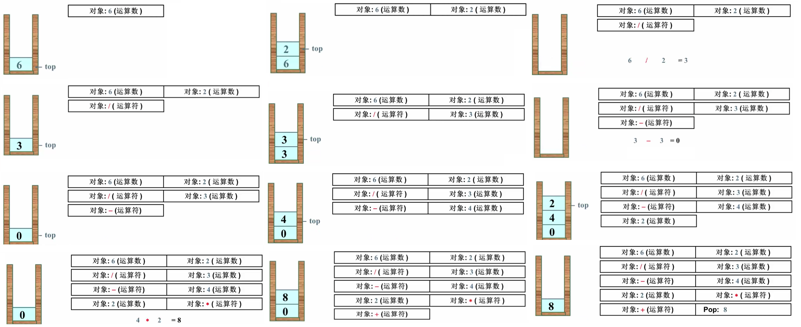

时间复杂度：$T(n) = O(n)$

**堆栈的抽象数据类型描述**

**堆栈(Stack)**：具有一定操作约束的线性表 

* 只在一端（栈顶，Top）做**插入、删除**
* 插入数据：**入栈(Push)**
* 删除数据：**出栈(Pop)**
* **后进先出**：Last In First Out(LIFO)

> **类型名称**：堆栈(Stack)
>
> **数据对象集**：一个有 0 个或多个元素的有穷线性表。 
>
> **操作集**：长度为 MaxSize 的堆栈 S ∈ Stack，堆栈元素 item ∈ ElementType 
>
> 1、Stack CreateStack(int MaxSize)： 生成空堆栈，其最大长度为 MaxSize； 
>
> 2、int IsFull(Stack S, int MaxSize)：判断堆栈 S 是否已满； 
>
> **<u>3</u>**、void Push(Stack S, ElementType item)：将元素 item 压入堆栈； 
>
> 4、int IsEmpty (Stack S)：判断堆栈 S 是否为空； 
>
> **<u>5</u>**、ElementType Pop(Stack S)：删除并返回栈顶元素；

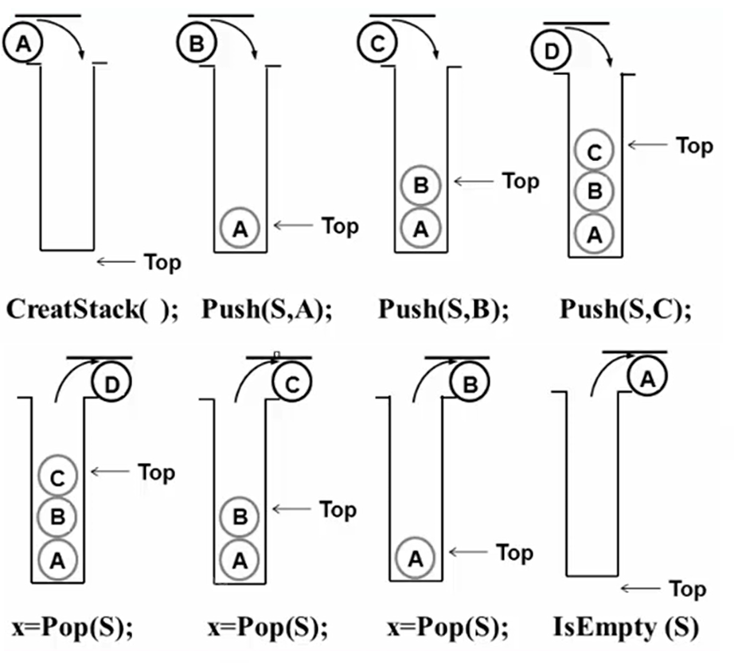

<center style="color:#7c7877">图 出入栈示意图</center>

事实上，Push 和 Pop 可以**穿插交替进行**，这样就会得到不同的出入栈顺序。

* Push(S,A), Push(S,B),Push((S,C),Pop(S),Pop(S),Pop(S) 堆栈输出是？——CBA
* 而 Push(S,A), Pop(S),Push(S,B),Push((S,C),Pop(S),Pop(S) 堆栈输出是?——ACB

【例题】如果三个字符按 ABC 顺序压入堆栈

* ABC 的所有排列都可能是出栈的序列吗？——有些排列无法出现
* 可以产生 CAB 这样的序列吗？——不可以，因为 Pop C 的时候，AB 已经压入栈，而按 ABC 顺序压栈只能输出 CBA。

#### 2.2.2 栈的顺序存储实现

栈的顺序存储结构通常由一个**一维数组**和一个记录**栈顶**元素位置的变量组成。

```c
#define MaxSize /* 储存数据元素的最大个数 */
typedef struct SNode *Stack;
struct SNode {
    ElementType Data[MaxSize];
    int Top;
};
```

(1)入栈

```c
void Push(Stack PtrS, ElementType item)
{
    if (PtrS->Top == MaxSize - 1) {
        printf(“堆栈满”); 
        return;
    } else {
        PtrS->Data[++(PtrS->Top)] = item;
        return;
    }
}
```

栈空时，Top == -1（栈空时 TOP 也可以设置为 0，但是相应的出入栈操作会有轻微变化）

入栈时，新放入的元素放在 Top + 1 位置(Top 先自增再入栈)

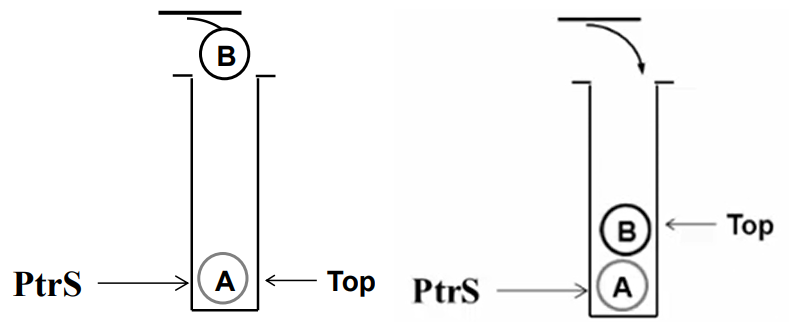

(2)出栈

```c
ElementType Pop(Stack PtrS)
{
    if (PtrS->Top == -1) {
        printf(“堆栈空”);
        return ERROR; /* ERROR 是 ElementType 的特殊值，标志错误 */
    } else {
        return (PtrS->Data[(PtrS->Top)--]);
    }
}
```

出栈时，弹出 Top 位置的元素(Top 先出栈再自减)

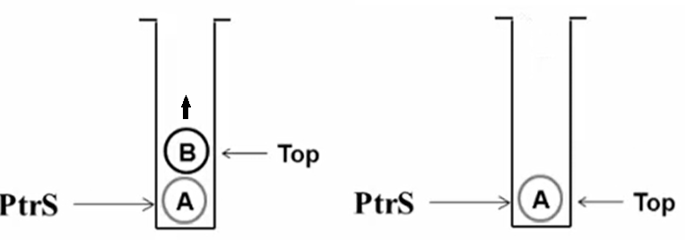

【典例】共享栈

用一个数组实现两个堆栈，要求最大地利用数组空间，使数组只要有空间入栈操作就可以成功。一种比较聪明的方法是使这两个栈分别从数组的**两头开始向中间生长**；当两个栈的**栈顶指针相遇时**，表示两个栈都满了。

```c
#define MaxSize <存储数据元素的最大个数>
struct DStack {
    ElementType Data[MaxSize]; 
    int Top1; /* 堆栈１的栈顶指针 */ 
    int Top2; /* 堆栈２的栈顶指针 */
} S;
S.Top1 = -1;        /* 堆栈 1 为空 */ 
S.Top2 = MaxSize;   /* 堆栈 2 为空  */ 
```

入栈：

```c
void Push(struct DStack *PtrS, ElementType item, int Tag)
{ /* Tag 作为区分两个堆栈的标志，取值为 1 和 2 */
    if (PtrS->Top2 – PtrS->Top1 == 1) {  /*堆栈满*/
        printf(“堆栈满”); 
        return ;
    }
    if (Tag == 1) /* 对第一个堆栈操作 */
        PtrS->Data[++(PtrS->Top1)] = item;
    else            /* 对第二个堆栈操作 */
        PtrS->Data[--(PtrS->Top2)] = item;
}
```

出栈：

```c
ElementType Pop(struct DStack *PtrS, int Tag 
{ /* Tag 作为区分两个堆栈的标志，取值为 1 和 2 */
    if (Tag == 1) {   /* 对第一个堆栈操作 */
        if (PtrS->Top1 == -1) {  /*堆栈 1 空 */
            printf(“堆栈 1 空”); 
            return NULL;
        } else {
            return PtrS->Data[(PtrS->Top1)--];
        }
    } else {  /* 对第二个堆栈操作 */
        if (PtrS->Top2 == MaxSize) {  /*堆栈 2 空 */
            printf(“堆栈 2 空”);
            return NULL;
        } else {
            return PtrS->Data[(PtrS->Top2)++];
        }       
    }
}
```

- [x] 讨论 2.2 堆栈顺序存储的另一种实现？

> 有人给出了堆栈用数组实现的另一种方式，即直接在函数参数中传递数组和 top 变量（而不是两者组成的结构指针），其中 Push 操作函数设计如下。这个 Push 函数正确吗？为什么？
>
> ```c
> #define MaxSize 100
> ElementType S[MaxSize];
> int top;
> void Push(ElementType *S, int top, ElementType item)
> {   
>        if (top == MaxSize - 1) {
>            printf(“堆栈满”);
>            return;
>        } else {
>            S[++top] = item;
>            return;
>        }
>    }
>    ```

讨论：

* 不正确。函数传递 int 类型的 top 变量时，函数内部实际上是复制 top 为一个新变量，即函数内部的 top 变化不会影响到函数外部 top 的变化，导致外部 top 变量不能正确记录栈顶位置。

* 如果函数参数引用 int* top，即把指向 top 的指针作为函数参数，应该能避免上述问题。

#### 2.2.3 堆栈的链式存储实现

栈的链式存储结构实际上就是一个**单链表**，叫做**链栈**。插入和删除操作只能在链栈的栈顶进行。

栈顶指针 Top 应该在链表的头，方便进行插入和删除操作。（注意★：链尾不能做 Top，因为找不到前驱无法进行**删除**操作）

```c
typedef struct SNode *Stack;
struct SNode {
    ElementType Data;
    struct SNode *Next;
}; 
```

(1) 堆栈初始化（建立空栈）

```c
Stack CreateStack() /* 构建一个堆栈的头结点，返回指针 */
{ 
    Stack S;
    S =(Stack)malloc(sizeof(struct SNode));
    S->Next = NULL;
    return S;
}
```

(2) 判断堆栈 S 是否为空

```c
int IsEmpty(Stack S) /*判断堆栈 S 是否为空，若为空函数返回整数 1，否则返回 0 */
{ 
    return (S->Next == NULL);
}
```


(3)入栈

```c
void Push(ElementType item, Stack S) /* 将元素 item 压入堆栈 S */
{ 
    struct SNode *TmpCell;
    TmpCell = (struct SNode *)malloc(sizeof(struct SNode));
    TmpCell->Element = item;
    TmpCell->Next = S->Next;          /*步骤 ① */
    S->Next = TmpCell;                /*步骤 ② */
}
```


(4)出栈

注意，由于是链栈，所以前面入栈时不用判断是否满(数组实现要判断)，但是出栈时要判断是否空。

```c
ElementType Pop(Stack S)     /* 删除并返回堆栈 S 的栈顶元素 */
{ 
    struct SNode *FirstCell;
    ElementType TopElem;
    if (IsEmpty(S)) {
        printf(“堆栈空”); 
        return NULL;
    } else {
        FirstCell = S->Next;         /*步骤 ① */
        S->Next = FirstCell->Next;   /*步骤 ② */
        TopElem = FirstCell->Element;
        free(FirstCell);
        return TopElem;
    }
}
```

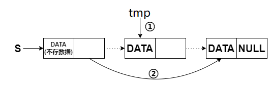

#### 2.2.4 栈的应用：表达式求值

应用堆栈实现后缀表达式求值的基本过程：从左到右**读入后缀表达式的各项**（操作符或操作数）；

> 1. 操作数：入栈；
> 2. 操作符：从堆栈中弹出适当数量的操作数，计算并结果入栈；
> 3. 最后，堆栈顶上的元素就是表达式的结果值。

| Step1                    | →              | Step2                    | →            | Step3  |
| ------------------------ | -------------- | ------------------------ | ------------ | ------ |
| **字符**序列的后缀表达式 | 对象分割 GetOp | **对象**序列的后缀表达式 | 利用堆栈求值 | 结果值 |
| 2 3 + 2 4 * -            | →              | 2 3 + 2 4 * -            | →            | -3     |

**中缀表达式求值**

* **基本策略**：将中缀表达式转换为后缀表达式，然后求值

如何将中缀表达式转换为后缀表达式？

【例】2+9/3-5 → 2 9 3 / + 5 -

* 操作数相对顺序不变(中缀和后缀表达式相比)
  * 碰到操作数就输出
* 操作符顺序发生改变
  * 需要用堆栈存储“等待中”的操作符
  * 要将当前操作符与“等待中”的最后一个操作符比较

思考，如果有括号怎么办？

【例】 a * (b + c) / d  →  a b c + * d /

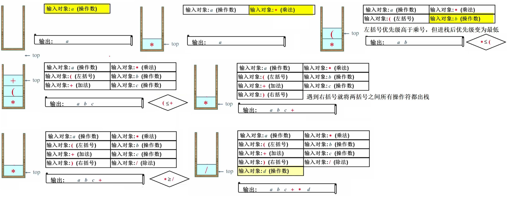

时间复杂度：$T(n) = O(n)$

**中缀表达式如何转换为后缀表达式**

从头到尾读取**中缀表达式的每个对象**，对不同对象按不同的情况处理。

1. **运算数**：直接输出；
2. **左括号**：压入堆栈； 
3. **右括号**：将**栈顶的运算符弹出**并**输出**，**直到遇到左括号**（出栈，不输出）；
4. **运算符**： 
   * 若**优先级大于栈顶运算符**时，则把它**压栈**；
   * 若**优先级小于等于栈顶运算符**时，将**栈顶运算符弹出并输出**；再比较新的栈顶运算符，直到该运算符大于栈顶运算符优先级为止，然后将该**运算符压栈**；
5. 若各对象**处理完毕**，则把堆栈中存留的**运算符一并输出**。

中缀转换为后缀示例： 2 * (9 + 6 / 3 - 5) + 4

| 步骤 | 待处理表达式    | 堆栈状态 （底←→顶） | 输出状态              |
| ---- | :-------------- | :------------------ | :-------------------- |
| 1    | 2*（9+6/3-5）+4 |                     |                       |
| 2    | *（9+6/3-5）+4  |                     | 2                     |
| 3    | （9+6/3-5）+4   | *                   | 2                     |
| 4    | 9+6/3-5）+4     | *（                 | 2                     |
| 5    | +6/3-5）+4      | *（                 | 2 9                   |
| 6    | 6/3-5）+4       | *（ +               | 2 9                   |
| 7    | /3-5）+4        | *（ +               | 2 9 6                 |
| 8    | 3-5）+4         | *（ + /             | 2 9 6                 |
| 9    | -5）+4          | *（ + /             | 2 9 6 3               |
| 10   | 5）+4           | *（ -               | 2 9 6 3 / +           |
| 11   | ）+4            | *（ -               | 2 9 6 3 / + 5         |
| 12   | +4              | *                   | 2 9 6 3 / + 5 -       |
| 13   | 4               | +                   | 2 9 6 3 / + 5 - *     |
| 14   |                 | +                   | 2 9 6 3 / + 5 - * 4   |
| 15   |                 |                     | 2 9 6 3 / + 5 - * 4 + |

**堆栈的其他应用**

* 函数调用及递归实现
* 深度优先搜索
* 回溯算法（比如迷宫问题）
* ... ...

### 3.2 队列

#### 2.3.1 队列及顺序存储实现

#### 2.3.2 队列的链式存储实现
