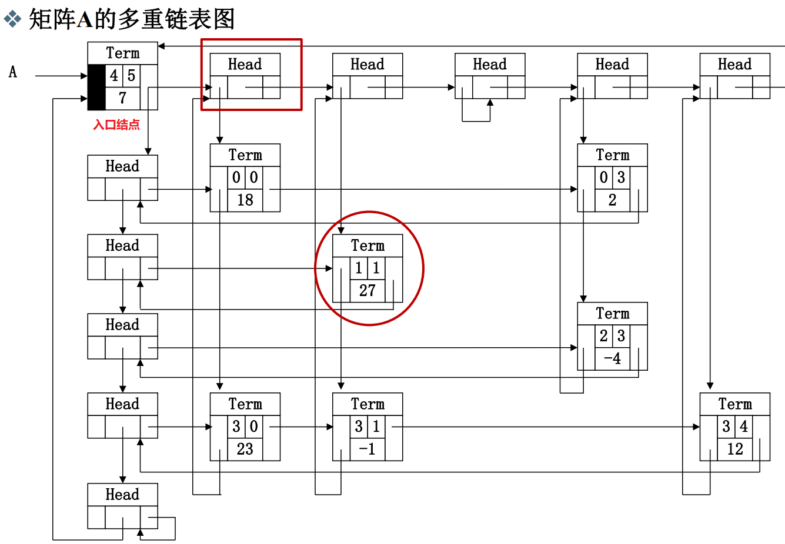

# 数据结构

## 第1章 概论


### 1.1什么是数据结构

#### 1.1.1关于数据的组织

* 数据结构至今没有统一定义，不过**数据结构**往往和**算法**同时出现。

* 当谈起数据的**组织方式**的时候，其实与**数据的规模**息息相关，不一样规模的问题处理起来难度就不一样。
* 难度主要不是与你如何存放有关，而是与你要对数据进行什么操作有关。以存放图书为例：

> 方法一：随便放		    ①存放很简单	②查找很复杂
>
> 方法二：按字母顺序放	①存放较复杂	②查找简单（二分查找）
>
> 方法三：类别+字母顺序      ①存放较简单	②查找简单（类别+二分查找）

- [x] 讨论1.1 对中等规模、大规模的图书摆放，你有什么更好的建议？

> 提出这个问题，实际上是想让大家思考，在考虑大规模数据存储的时候会遇到什么问题，以及如何根据功能（也就是关联的算法，最常见的就是插入、查找、删除）需要设计存储方式。

讨论：

* 用**哈希表**，一个书架的一排定义为一个位置，哈希运算之后，就摆在算出的那一排上。

* 首先按**内容分类**并针对每个分类设定一个**冗余度**，例如5%，则每100本书后预留5个空位。每个大类结束后预留更多的空位，如200个。这样，在新增书目的时候，只需挪动该插入位置之后，空位置之前的这不超过100本书。当该区间空位满了之后，不得不挪动下个100本书。并及时告知管理人员当前空位剩余数量。此外应动态管理冗余度，对于频繁新增书目的分类，应提高冗余度，预留更多的空位。并且对于经常满位的分类，应当放置在全部分类队列最后，这样可以减少空位满了之后挪动其他分类的数量。

* 用**树、数组和字典的方式**摆放书籍：按类别分不同区域和不同书架摆放。

  查找：大厅设置屏幕提醒大类书籍所在位置，区域内书架上展示小类标签，书架上按照书籍编号有序放置。设置查询表，根据书名查找书籍编号、所在位置、余量等消息。

* 中大型图书馆，首先需要对图书进行分大类，建立基本框架，树性结构。细化管理，现代化管理，书名，条码分类，轨道式移动书本，通过**二维码识别**，精准定位，在小类里可采用循环链表分类登记汇总，实现自动化

#### 1.1.2 关于空间使用 - 例：PrintN函数实现

写程序实现一个函数PrintN，使得传入一个正整数为N的参数后，能顺序打印从1到N的全部正整数

```c
/*循环实现*/
void PrintN ( int N )
{ 
    int i;
	for ( i = 1; i <= N; i ++ ){
		printf("%d\n", i );
	}
	return;
} 
/*递归实现*/
void PrintN ( int N )
{ 
    if ( N ){
		PrintN( N - 1 ); 
		printf("%d\n", N );
	}
	return;
} 
```

​	上面两种实现，看起来好像都挺简单的，下面这个好像还更简单一点。分别令输入数据N = 10、100、1000、... ...，观察运行结果，发现数据量较小时，两者结果基本一样，但第二个递归实现的函数在数据量到达10w+以上时，递归函数有可能直接拒绝工作！

​	如果你对递归比较熟悉，递归代码往往是简洁明了的，但是计算机不是很适合运行递归代码，因为递归代码往往会占用很多空间。如果占用所有空间也没能得出结果，递归程序就会异常终止，所以结果上可能是程序根本没有任何输出就结束了。

* 所以，**解决问题的效率，跟空间的利用效率也有关**。

- [x] 讨论1.2 晒一下PrintN在你的机器上运行的结果？

> 这是我们大家发现壕的时候哈！^_^

讨论：

* 数据规模为10w时，函数的循环实现总用时（可见代码示例1.1.2 两种PrintN）

  ticks1 = 13284.000000
  duration1 = 1.33e+001

  而递归实现没有输出结果（递归栈爆了）

* 循环代码更加繁琐，但节省内存；

  递归代码简洁易懂，却容易溢出。

#### 1.1.3 写程序计算给定多项式在给定点x处的值

计算多项式在给定点x处的值：
$$
\large{f(x) = a_0 + a_1x + ... + a_{n-1}x^{n-1} + a_{n}x^{n}}
$$

```c
/*方法一*/
double f( int n, double a[], double x )
{ 	
    int i;
	double p = a[0];
	for (i = 1; i <= n; i++)
	p += (a[i] * pow(x, i)); 
	return p;
}
```

​	第一种方法清晰明了，但是实际过程中如果这么写程序算法效率是很低的。

​	下面的方法通过**海伦-秦九韶算法**，巧妙利用结合律，不断提取公因式 x 来减少乘法的运算次数，把多项式改写成下面这种从里往外计算的形式：
$$
\large{f(x) = a_0 + x(a_1 + x(...(a_{n-1} + x(a_n))...))}
$$

```c
double f( int n, double a[], double x )
{ 
    int i;
	double p = a[n];
	for (i = n; i > 0; i --)
	p = a[i-1] + x * p;
	return p;
} 
```

​	为了测试上面两种方法到底哪个更快，利用C语言提供的`clock()`函数：捕捉从程序开始运行到`clock()`被调用时所耗费的时间。这个时间单位是clock tick，即“**时钟打点**”。 该函数位于头文件 time.h 中。

​	常数`CLK_TCK`(或`CLOCKS_PER_SEC`)：机器时钟每秒所走的时钟打点数（不同机器不一样）。

​	下面是使用这个函数测量待测函数的模板：

```c
#include <stdio.h>
#include <time.h>
clock_t start, stop;
/* clock_t是clock()函数返回的变量类型 */
double duration;
/* 记录被测函数运行时间，以秒为单位 */
int main ()
{ 
	/* 不在测试范围内的准备工作写在clock()调用之前*/
	start = clock(); 	/* 开始计时 */
	MyFunction(); 		/* 把被测函数加在这里 */
	stop = clock(); 	/* 停止计时 */
	duration = ((double)(stop - start))/CLK_TCK;
	/* 计算运行时间 */
	/* 其他不在测试范围的处理写在后面，例如输出duration的值 */
	return 0;
}
```

​	如果被测函数单次运行太快了（比如不到1个tick），可以让被测函数**重复运行充分多次**（for循环），使得测出的总的时钟打点间隔充分长，最后计算被测函数**平均每次**运行的时间即可! 

```c
#include <stdio.h>
#include <time.h>
#include <math.h>
clock_t start, stop; 
double duration;
#define MAXN 10 /* 多项式最大项数，即多项式阶数+1 */
double f1( int n, double a[], double x );
double f2( int n, double a[], double x );
int main ()
{ 
    int i;
	double a[MAXN]; /* 存储多项式的系数 */
	for ( i=0; i<MAXN; i++ ) a[i] = (double)i; 
	start = clock();
	f1(MAXN-1, a, 1.1); 
	stop = clock();
	duration = ((double)(stop - start))/CLK_TCK; 
	printf("ticks1 = %f\n", (double)(stop - start));
	printf("duration1 = %6.2e\n", duration);
	start = clock();
	f2(MAXN-1, a, 1.1); 
	stop = clock();
	duration = ((double)(stop - start))/CLK_TCK; 
	printf("ticks2 = %f\n", (double)(stop - start));
	printf("duration2 = %6.2e\n", duration);
	return 0;
}
```

* 经过测量，第二个函数用时比第一个函数少1个数量级左右，可见**解决问题方法的效率， 跟算法的巧妙程度有关**。

- [x] 讨论1.3 再试一个多项式

> 给定另一个100阶多项式
> $$
> f(x) = 1 + x + x^2/2 + ... + x^i/i + ... + x^{100}/100
> $$
> 用不同方法计算$f(1.1)$并且比较一下运行时间？

讨论：

* 初始化时，把上面程序的常数项a改一下即可（见代码示例1.1.3 讨论）。
* ticks1 = 1995.000000
  duration1 = 2.00e+000
  ticks2 = 335.000000
  duration2 = 3.35e-001

#### 1.1.4 抽象数据结构

到底什么是数据结构？

+ **数据对象**在计算机中的**组织方式**（逻辑结构 + 物理存储结构）
  * 逻辑结构：线性结构（线性表、栈和队列、数组、串）非线性结构（集合、树、图）
  * 物理存储结构：顺序存储、链式存储、散列存储、索引存储
+ 数据对象必定与一系列加在其上的**操作**相关联（也称为**数据的运算**，如：插入 、 删除、修改、 查找 、排序）
+ 完成这些操作所用的方法就是**算法**
+ 数据结构的**基本概念**：相互之间存在一种或多种特定关系的数据元素的集合。
+ 数据结构的三要素：数据的逻辑结构，数据的存储结构，数据的运算。（和下面的 ADT 三要素要区分开）

**抽象数据类型**（Abstract Data Type ）

* ADT 常用这样一个三元组表示：（数据对象，数据关系，数据集合相关联的基本操作集）（注意：数据≠数据结构）

* 抽象：描述数据类型的方法不依赖于具体实现
  * 与存放数据的机器无关
  * 与数据存储的物理结构无关
  * 与实现操作的算法和编程语言均无关

* 只描述数据对象集和相关操作集 “是什么 ”，并不涉及 “如何做到 ”的问题

例4 “矩阵”的抽象数据类型定义

* 类型名称：矩阵（Matrix）

* 数据对象集：一个M×N的矩阵$A_{M×N} = (a_{ij})$ (i=1, …, M; j=1, …, N )由M×N个三元组< a, i, j >构成，其中 <u>a 是矩阵元素的值</u>，i 是元素所在的行号，j 是元素所在的列号。

* 操作集：对于任意矩阵A、B、C ∈ Matrix，以及整数i、j、M、N 
  * Matrix Create( int M, int N )：返回一个M×N的空矩阵； 
  * int GetMaxRow( Matrix A )：返回矩阵A的总行数；
  * int GetMaxCol( Matrix A )：返回矩阵A的总列数； 
  * ElementType GetEntry( Matrix A, int i, int j )：返回矩阵A的第i行、第j列的元素； 
  * Matrix Add( Matrix A, Matrix B )：如果A和B的行、列数一致，则返回矩阵C=A+B，否则返回错误标志； 
  * Matrix Multiply( Matrix A, Matrix B )：如果A的列数等于B 的行数，则返回矩阵C=AB，否则返回错误标志； 
  *  ……

抽象在哪里？

* 上面提到 a 是矩阵元素的值，这个值是**整形、浮点型还是字符型**等等，抽象类型描述时是不关心的，后面操作集返回时，也使用了通用类型 ElementType ，可以在文件头使用 typedef 来定义成自己需要类型，抽象的好处就是适用于任何一种类型的矩阵，提高了程序的灵活性。
* 矩阵在程序里如何存取的？是用二维数组、链表还是十字链表等等，这个在抽象数据类型定义时也都是不涉及的，重点在于如何实现矩阵本身。
* 矩阵操作函数，例如 Matrix Add( ) 到底是按行先加、还是列先加，是用什么样语言实现的，都是不涉及的，这就是所谓的抽象。

- [x] 讨论1.4 抽象有什么好处？

> 任何事物存在都要有个理由，为什么大家这么稀饭“抽象”？

讨论：

* 抽象是计算机求解问题的基本方式和重要手段，它使得一种设计可以应用于多种场景。而且通过抽象可以屏蔽底层细节，使设计更加简单、理解更加方便。
* 抽象数据类型的描述方法与面向对象的思想是一致的，它把数据对象和相关操作封装在一起，对于需要调用这个数据类型的用户而言，无论内部的具体实现如何改变，只要对外描述的接口不变，就不影响使用。

### 1.2 什么是算法

#### 1.2.1 算法的定义

**算法（Algorithm）**

基本概念：算法是对特定问题求解步骤的一种描述，它是指令的有限序列，其中每一条指令表示一个或多个操作

1. **可行性**：一个有限指令集
2. **有穷性**：一定在有限步骤之后终止（算法不是程序，程序可以无限运行，比如OS）
3. **确定性**：每一条指令必须
   * 有充分明确的目标，不可以有歧义
   * 计算机能处理的范围之内
   * 抽象的实现手段
4. **输入**：接受一些输入（有些情况下不需要输入）
5. **输出**：产生一个或多个输出

例1：选择排序算法的伪码描述

```c
void SelectionSort ( int List[], int N )
{ 	/* 将N个整数List[0]...List[N-1]进行非递减排序 */
	for ( i = 0; i < N; i ++ ) {
	MinPosition = ScanForMin( List, i, N–1 ); 
	/* 从List[i]到List[N–1]中找最小元，并将其位置赋给MinPosition */
	Swap( List[i], List[MinPosition] );
	/* 将未排序部分的最小元换到有序部分的最后位置 */
	}
}
```

抽象在于：

* List 到底是数组还是链表（虽然看上去很像数组）？ 

* Swap 用函数还是用宏去实现？

#### 1.2.2 什么是好的算法？

**“好”算法的评价标准**

1. 正确性：能正确解决问题。
2. 可读性：易于人类理解。
3. 健壮性：输入非法数据时，算法能适当反应或处理，而非输出意外结果。
4. 高效率与低存储量需求。指算法的执行时间和执行过程中需要的存储空间。

**评价算法效率的指标**

1. **空间复杂度 S(n)** —— 根据算法写成的程序在执行时**占用存储单元的长度**。这个长度往往与输入数据的规模有关。空间复杂度过高的算法可能导致使用的内存超限，造成程序非正常中断。

2. **时间复杂度 T(n)** —— 根据算法写成的程序在执行时**耗费时间的长度**。这个长度往往也与输入数据的规模有关。时间复杂度过高的低效算法可能导致我们在有生之年都等不到运行结果。

- 由于这两个指标与数据的规模直接相关，所以将其写成一个关于 n 的函数。

在分析一般算法的效率时，我们经常关注下面两种复杂度

1. 最坏情况复杂度 $T_{worst}(n)$

2. 平均复杂度 $T_{avg}(n)$

- 平均复杂度肯定比最坏情况复杂度小，但算法分析**一般分析最坏情况复杂度**，因为“什么叫平均”，经常不是一个很容易搞定的问题，很多时候平均复杂度分析难度很大。。

**递归实现PrintN 函数的空间复杂度分析**


<center style="color:#7c7877">图1.2.2 函数递归调用过程中内存占用情况</center>

* 函数递归调用需要**保存当前函数的状态**（如返回地址和一些变量的值等），因此需要占用一块内存空间（如上图调用PrintN(10000)时需要占用上图10000号内存空间），直到执行到PrintN(0)时，函数才直接返回，系统开始逐级释放内存。
* 假设存储每个函数状态占 1 个单位内存空间。由上可知，空间复杂度是和数据量 N 成正比的，S(N) = C · N。

* 有限空间都用完了也不足以执行完程序，所以程序异常退出了。
* PrintN( )循环实现只需要临时变量和 for 循环，它没有涉及到程序调用的问题，它占用的空间量是**常量**。

**计算多项式在给定点处的值函数的时间复杂度分析**

* 机器运算加减法的速度比乘除法快很多

* 分析简单函数运行效率，只需要看它的乘除法执行次数，加减法可以忽略不计

* 不用海伦-秦九韶公式简化算法，循环每执行一次，除了 a[i] 和 pow() 乘一次之外，pow()还要乘 i - 1 次，总共乘 i 次。而使用海伦-秦九韶公式简化算法，循环每执行一次，只需要乘一次。

  所以在整个循环体，前者总共进行了 $\large{\frac{(n^2 + n)}2}$ 次乘法，后者总共进行了 n 次乘法。

```c
p += (a[i] * pow(x, i));   /*不用海伦-秦九韶公式化简*/
p = a[i-1] + x * p;		   /*使用海伦-秦九韶公式化简*/
```

* 第一个函数的时间复杂度 $T(n) = C_1n^2+C_2n(C_1和C_2为常数)$

  第二个函数的时间复杂度 $T(n) = C·n(C为常数)$

  虽然三个常数每台计算机都不一样，但可以确定的是 n 很大时，平方项增长最快，第一个函数会比第二个函数大很多（即速度慢很多）。

- [x] 讨论1.5 分析“二分法”

> 查找算法中的“二分法”是这样定义的：
>
> 给定N个从小到大排好序的整数序列List[]，以及某待查找整数X，我们的目标是找到X在List中的下标。即若有List[i]=X，则返回i；否则返回-1表示没有找到。
>
> 二分法是先找到序列的中点List[M]，与X进行比较，若相等则返回中点下标；否则，若List[M]>X，则在左边的子系列中查找X；若List[M]<X，则在右边的子系列中查找X。
>
> 试写出算法的伪码描述，并分析最坏、最好情况下的时间、空间复杂度。

讨论：

```c
int search(int x, int List[], int len)
{
	int ret = -1;
	int left = 0;
	int right = len - 1;
	while(left <= right)
	{
		int mid = (left + right) / 2;
		if(List[mid] == x)
		{
			ret = mid;
			break;
		}else if(List[mid] > x)
		{
			right = mid - 1;
		}else{
			left = mid + 1;
		}
	}
	return ret;
}
```

* 最好情况第一次二分就找到，最坏情况是没找到被迫跳出循环，空间复杂度都是O(1)。

  $T_{worst}(n) = O(logn)\qquad  S_{worst}(n) = O(1)$

  $T_{best}(n) = O(1)\qquad\qquad S_{best}(n) = O(1)$

#### 1.2.3 渐进表示法

​	实际算法分析过程中，没有必要去数每个函数具体每一步执行了几次，其实我们更关心的是随着要处理的数据规模 n 的增大，复杂度增长的趋势是怎样的。

**(时间)复杂度的渐进表示法**

* $T( n) = O(f(n))$ 表示存在常数$C>0,  n_0>0$ 使得当 $n > n_0 $时有 $T(n)≤C·f(n)$ 

  简单来说，上面这个等式表示，对于充分大的n而言，f(n)是T(n)的某个上界

*  $T( n) = Ω(g(n))$ 表示存在常数$C>0,  n_0>0$ 使得当 $n > n_0 $时有 $T(n)≥C·g(n)$ 

  简单来说，上面这个等式表示，对于充分大的n而言，g(n)是T(n)的某个下界

*  $T(n)= Θ(h(n))$ 表示同时有 $T( n) = O(h(n)) $和 $T(n)= Ω(h(n))$

  简单来说，上面这个等式表示，对于充分大的n而言，h(n)既是T(n)的上界也是下界

注意，函数的上下界都不是唯一的，但是太大的上界和太小的下界对分析算法效率没有什么帮助，我们在找上界和下界时，都期望和真实情况贴得越近越好，一般是寻找最小上界作为O函数和最大的下界作为Ω函数。

<center style="color:#7c7877">表1.2.3 f(n) 随着输入规模 n 的变化表</center>

| 函数f(n) | 1    | 2    | 4    | 8        | 16            | 32             |
| -------- | ---- | ---- | ---- | -------- | ------------- | -------------- |
| 1        | 1    | 1    | 1    | 1        | 1             | 1              |
| log n    | 0    | 1    | 2    | 3        | 4             | 5              |
| n        | 1    | 2    | 4    | 8        | 16            | 32             |
| n log n  | 0    | 2    | 8    | 24       | 64            | 160            |
| n^2^     | 1    | 4    | 16   | 64       | 256           | 1024           |
| n^3^     | 1    | 8    | 64   | 512      | 4096          | 32768          |
| 2^n^     | 2    | 4    | 16   | 256      | 65536         | 4294967296     |
| n!       | 1    | 2    | 24   | 40326    | 2092278988000 | 26313 × 10^33^ |
| n^n^     | 2    | 4    | 256  | 16777216 | 18447×10^19^  | 14615×10^46^   |

* 如果一个算法的复杂度是 $n^2$ ，可以考虑是否能将其优化为 $nlogn$。
* 真数相同底数不同的对数函数只相差常数倍，但渐进表示法忽略常数因子和低阶项，所以log的底数可以省略不写。（但是要注意，不同底的指数函数之间相差不是常数倍，比如$O(2^n)$和$O(3^n)$复杂度是完全不一样的）

**复杂度分析的技巧**

* 若两段算法分别有复杂度 $T_1(n) = O(f_1(n))$ 和 $T_2(n) = O(f_2(n))$，则

  * $T_1 (n) +  T_2 ( n) = max(O(f_1(n)), O(f_2(n)))$
  * $T_1(n)×T_2(n) = O(f_1(n)×f_2(n))$

* 若 T(n)是关于 n 的 k阶多项式，那么 $T(n)= Θ(n^k )$

* 一个**for循环**的时间复杂度等于循环次数乘以循环体代码的复杂度

* **若干层嵌套循环**的时间复杂度等于各层循环次数的乘积再乘以循环体代码的复杂度

* **if-else 结构**的复杂度取决于 **if** 的条件判断复杂度和两个分枝部分的复杂度，总体复杂度取三者中**最大**

```c
/* 下列函数的总复杂度为max(O(f1), O(f2), O(f3))*/
if(P1)		/* P1的复杂度为O(f1)*/
    P2;		/* P1的复杂度为O(f2)*/
else
    P3;		/* P1的复杂度为O(f3)*/
```

### 1.3 应用实例：最大子列和(maximum-subarray)问题

给定N个整数的序列$\{A_1, A_2, …, A_N\}$， 求下列函数的最大值（0代表子列和为负数时）
$$
f(i, j)=max\{0,\sum_{k=i}^{j}A_k\}
$$

#### 1.3.1 两种简单求和算法

以给定序列：{-2，11，-4，13，-5，-2}为例。

算法一：暴力求出所有子列和，然后取最大的和

```c
int MaxSubseqSum1( int A[], int N )
{ 	int ThisSum, MaxSum = 0;
	int i, j, k;
	for( i = 0; i < N; i++ ) { /* i是子列左端位置 */
		for( j = i; j < N; j++ ) { /* j是子列右端位置 */
			ThisSum = 0; /* ThisSum是从A[i]到A[j]的子列和 */
			for( k = i; k <= j; k++ )
				ThisSum += A[k];
			if( ThisSum > MaxSum ) /* 如果刚得到的这个子列和更大 */
				MaxSum = ThisSum; /* 则更新结果 */
		} /* j循环结束 */
	} /* i循环结束 */
	return MaxSum;
}
```

* 时间复杂度：$T(n) = O(n^3)$

* 本算法“傻”在大量无效操作浪费在`ThisSum += A[k];`，其实不必每次都从头往后加，只要把 i 到 j 的部分和加一个元素A[k]即可，最里层循环完全就是多余的，于是就有了算法二。

| -2     | 11     | -4     | 13     | -5   | -2   | sum    |
| ------ | ------ | ------ | ------ | ---- | ---- | ------ |
| -2     |        |        |        |      |      | -2     |
| -2     | 11     |        |        |      |      | 9      |
| -2     | 11     | -4     |        |      |      | 5      |
| ==-2== | ==11== | ==-4== | ==13== |      |      | ==18== |
| -2     | 11     | -4     | 13     | -5   |      | 13     |
| -2     | 11     | -4     | 13     | -5   | -2   | 11     |

算法二：对算法一重复计算部分优化

```c
int MaxSubseqSum2( int A[], int N )
{ 	int ThisSum, MaxSum = 0;
	int i, j;
	for( i = 0; i < N; i++ ) { /* i是子列左端位置 */
		ThisSum = 0; /* ThisSum是从A[i]到A[j]的子列和 */
		for( j = i; j < N; j++ ) { /* j是子列右端位置 */
			ThisSum += A[j];
		/*对于相同的i，不同的j，只要在j-1次循环的基础上累加1项即可*/
		if( ThisSum > MaxSum ) /* 如果刚得到的这个子列和更大 */
			MaxSum = ThisSum; /* 则更新结果 */
		} /* j循环结束 */
	} /* i循环结束 */
	return MaxSum;
}
```

* 时间复杂度：$T(n) = O(n^2)$
* $T(n) = O(n^2)$往往可以优化为$T(n) = O(nlogn)$

| -2   | 11   | -4   | 13     | -5   | -2   | sum    |
| ---- | ---- | ---- | ------ | ---- | ---- | ------ |
| -2   |      |      |        |      |      | -2     |
|      | 11   |      |        |      |      | 9      |
|      |      | -4   |        |      |      | ==5==  |
|      |      |      | ==13== |      |      | ==18== |
|      |      |      |        | -5   |      | 13     |
|      |      |      |        |      | -2   | 11     |

#### 1.3.2 分治算法(Divide and Conquer)

**算法三：分而治之**

把数组一分为二，递归解决左右两边的问题，分别得到两边的最大子列和，再找出**跨越边界的最大子列和**，最后的结果一定是三个结果中间最大的那一个。

```c
int Max3( int A, int B, int C )
{ /* 返回3个整数中的最大值 */
    return A > B ? A > C ? A : C : B > C ? B : C;
}

int DivideAndConquer( int List[], int left, int right )
{ /* 分治法求List[left]到List[right]的最大子列和 */
    int MaxLeftSum, MaxRightSum; /* 存放左右子问题的解 */
    int MaxLeftBorderSum, MaxRightBorderSum; /*存放跨分界线的结果*/

    int LeftBorderSum, RightBorderSum;
    int center, i;

    if( left == right )  { /* 递归的终止条件，子列只有1个数字 */
        if( List[left] > 0 )  return List[left];
        else return 0;
    }

    /* 下面是"分"的过程 */
    center = ( left + right ) / 2; /* 找到中分点 */
    /* 递归求得两边子列的最大和 */
    MaxLeftSum = DivideAndConquer( List, left, center );
    MaxRightSum = DivideAndConquer( List, center+1, right );

    /* 下面求跨分界线的最大子列和 */
    MaxLeftBorderSum = 0; LeftBorderSum = 0;
    for( i=center; i>=left; i-- ) { /* 从中线向左扫描 */
        LeftBorderSum += List[i];
        if( LeftBorderSum > MaxLeftBorderSum )
            MaxLeftBorderSum = LeftBorderSum;
    } /* 左边扫描结束 */

    MaxRightBorderSum = 0; RightBorderSum = 0;
    for( i=center+1; i<=right; i++ ) { /* 从中线向右扫描 */
        RightBorderSum += List[i];
        if( RightBorderSum > MaxRightBorderSum )
            MaxRightBorderSum = RightBorderSum;
    } /* 右边扫描结束 */

    /* 下面返回"治"的结果 */
    return Max3( MaxLeftSum, MaxRightSum, MaxLeftBorderSum + MaxRightBorderSum );
}

int MaxSubseqSum3( int List[], int N )
{ /* 保持与前2种算法相同的函数接口，这样用户调用不同算法时输入的参数是不变的 */
    return DivideAndConquer( List, 0, N-1 );
}
```

<table style="undefined;table-layout: fixed; width: 100%"><colgroup>
</colgroup>
<thead>
  <tr>
    <th>-2</th>
    <th>11</th>
    <th>-4</th>
    <th>13</th>
    <th>-5</th>
    <th>-2</th>
  </tr></thead>
<tbody>
  <tr>
    <td>-2</td>
    <td>11</td>
    <td></td>
    <td>13</td>
    <td></td>
    <td>-2</td>
  </tr>
  <tr>
    <td></td>
    <td>11</td>
    <td></td>
    <td>13</td>
    <td></td>
    <td></td>
  </tr>
  <tr>
    <td></td>
    <td colspan="3">20</td>
    <td></td>
    <td></td>
  </tr>
</tbody>
</table>

* 时间复杂度：$T(n) = O(nlogn)$

* 递归函数的时间复杂度计算比较复杂，一般思路是根据分问题（左子列、右子列、跨越边界子列）的复杂度，得出一个关于复杂度的递推公式

  $T ( N ) = 2 T( N/2 ) + c N$， $T(1) = O(1)$ 

  $= 2 [2 T( N/2^2 ) + c N/2] + c N$ 

  $= 2^k O(1) + ckN $ 其中 $N/2^k = 1$

  $= O( N log N )$

- [x] 讨论1.6 算法3的空间复杂度是多少？

> 具体来说，这个问题分两部分：
>
> 1. 由于递归而产生的空间复杂度是多少？
> 2. 算法的整体空间复杂度一共是多少？
>
> 不要只写结论，要写清楚推导过程哦~~

讨论：

* 递归的深度为logN，每次递归需要的空间是一个与N无关常量，每次递归的空间复杂度为O(1)。**递归的空间复杂度** = **每次递归的空间复杂度** × **递归深度**，即O(logN)

#### 1.3.3 在线算法(Online Algorithm)

**算法四：在线处理**

```c
int MaxSubseqSum4( int A[], int N )
{ 	int ThisSum, MaxSum;
	int i;
	ThisSum = MaxSum = 0;
	for( i = 0; i < N; i++ ) {
		ThisSum += A[i]; /* 向右累加 */
		if( ThisSum > MaxSum )
			MaxSum = ThisSum; /* 发现更大和则更新当前结果 */
		else if( ThisSum < 0 ) /* 如果当前子列和为负 */
			ThisSum = 0; /* 则不可能使后面的部分和增大，抛弃之 */
	}
	return MaxSum;
} 
```

* 时间复杂度：$T(n) = O(n)$

* 这个算法的时间复杂度已经是最快的了，因为你将元素遍历一遍都需要O(N)，这个算法的时间复杂度竟然也是O(N)

* 算法效率这么高，副作用就是“正确性”不是很明显，有点难理解。

* “**在线**”的意思是指每输入一个数据就进行即时处理，在任何一个地方中止输入，算法都能正确给出当前的解。

* 为什么这么快，就是因为这个算法发现了如果当前子列和为负，它其实对于后面的子列和增大没有作用，应该丢弃。

  

<center style="color:#7c7877">图1.3.3 在线处理算法执行过程可视化</center>

- [x] 讨论1.7 晒运行结果

> 在PTA上发布的编程题“最大子列和问题”给了非常宽松的时间上限，让大家可以至少把算法2、3、4分别尝试一下。另外“Maximum Subsequence Sum”需要你把算法略做修改，不仅输出最大和，而且输出相应的那个子列的首尾。
>
> 于是大家在这里晒一下自己的程序在PTA系统中的时间和空间耗费的结果吧~

讨论：

* 运行程序见代码示例，运行结果如下

| 算法       | 1         | 2         | 3         | 4         |
| ---------- | --------- | --------- | --------- | --------- |
| 时间复杂度 | O(N^3^)   | O(N^2^)   | O(NlogN)  | O(N)      |
| N=10       | 6.30e-007 | 1.80e-007 | 2.30e-007 | 4.00e-008 |
| N=100      | 4.67e-004 | 1.43e-005 | 2.80e-006 | 3.00e-007 |
| N=1000     | 4.47e-001 | 1.29e-003 | 4.70e-005 | 2.00e-006 |
| N=10000    | 4.46e+002 | 1.30e-001 | 8.10e-004 | 2.00e-005 |
| N=100000   | NA        | 1.42e+001 | 1.10e-002 | 1.00e-003 |

* NA的意思是Not Available，意思就是耗时太长，不算了。

### 1.4 习题

#### 课后习题

##### 1.1 判断正误

1. $N(logN)^2$是$O(N^2)$的。
2. $N^2(logN)$和$N(logN^2)$具有相同的增长速度。

解答：

* 正确，其实就是证明$(log(n))^2$是$O(n)$

  要证$(log(n))^2$是$O(n)$，只需证存在常数$C>0,  n_0>0$ 使得当 $n > n_0 $时有 $lg^2n≤C·n$

  令$f(x) = Cx - lg^2x$，$f'(x) = C - \frac{2lgx}{xln10}$

  ∵$lgx/x<1$，对∀x∈R，∃C>0，使得$f'(x)>0$，$f(x)$单调递增

  而$f(1) = C > 0$，所以 $∀n > n_0 ≥ 1$时，$lg^2n<C·n$

  所以$(log(n))^2$是$O(n)$

  * 另一个更简单的做法：直接判断

  $$
  \lim_{x \to +\infty} \frac{x(logx)^2}{x^2} = C
  $$

  即当$x$大于某个值之后，$x^2$是$x(logx)^2$的上界，此时两者要么是同阶无穷大，要么前者是高阶无穷大。即C是正常数或者 C = 0。

* 错误，后者和 $2N(logN)$ 具有相同的增长速度

##### 1.2 填空题

1. 给定*N*×*N*的二维数组A，则在不改变数组的前提下，查找最大元素的时间复杂度是：___。
2. 斐波那契数列 $F_N$ 的定义为：$F_0=0, F_1=1, F_N  =F_{N−1}+F_{N−2}, N=2, 3, …$。用递归函数计算 $F_N$ 的空间复杂度是___。
3. 上述斐波那契数列$F_N$ 的时间复杂度是___。

解答：

* 遍历所有元素一次即可，O(N^2^)

* 空间复杂度计算比较简单，递归的**空间复杂度** = **每次递归的空间复杂度** × **递归深度**，每次递归的空间复杂度都是一个常量，所以空间复杂度主要与递归深度有关。每调用一次函数，就会申请一个内存空间保存状态，直到达到递归出口位置返回，递归深度为 n 层，所以空间复杂度为$O(n)$。（注意，函数返回时会把空间释放，所以空间是可以重复利用的）

```c
int fibonacci(int n) {
    if (n <= 1)
        return n;
    else
        return fibonacci(n-1) + fibonacci(n-2);	}
```

* 时间复杂度较为复杂，下面提供两个简单证明方法

证明一：

$F(n) = F(n-1) + F(n - 2)$

将其中计算$F(n)$的用时记为$T(n)$，计算两数和的用时为常数*C*。

所以$T(n) = T(n-1) + T(n - 2) + C$

变形得$T(n) + C = (T(n-1) + C) + (T(n - 2) + C)$

令$A(n) = T(n) + C$，有

$A(n) = A(n-1) + A(n-2)$，这是个前两项不为1的斐波那契数列

假设前两项为$a, b(a≠b)$，令$c = max(a, b)$，

由斐波那契数列的定义知，前两项为c的斐波那契数列增长速度比前两项为a、b的快，该数列为：

$c、c、2c、3c、5c、...、F(n)c$

其中每项都与题给的标准斐波那契数列差常数倍，因此无论斐波那契数列的前两项是多少，都不会影响它的渐进增长率。

所以$A(n)$的渐进增长率等于$F(n)$，而$T(n) = A(n) - C$，增长率也是一样的

所以有$T(n)=Θ(F(n))$

事实上，由数学原理可以推导得到斐波那契数列通项公式为：
$$
F_n = \frac{1}{\sqrt{5} }[(\frac{1 + \sqrt{5} }{2} )^n - (\frac{1 - \sqrt{5} }{2} )^n ]
$$
所以可以得到$T(n)=Θ((\frac{1 + \sqrt{5} }{2} )^n)$，这是$T(n)$的**‌渐进紧确界**。

证明二：

这是一个更加直观的证明方法。稍微改写一下递归代码，使之**不输出第0项斐波那契数列**。

```c
int fibonacci(int n) {
    if (n <= 2)
        return 1;
    else
        return fibonacci(n-1) + fibonacci(n-2);	}
```

斐波那契数列的递归计算方法过程中，存在两种递归结点

①.第一种，**叶子结点**， F(1)，F(2) 会直接返回结果，记直接返回所需时间为 a

②.第二种，**非终端结点**， n>=3 时， F(n) 对 F(n−1) 与 F(n−2) 的结果进行相加，记加法与返回结果所需的所有时间为 b

斐波那契数列的递归树是一棵**非平衡二叉树**，递归求解斐波那契数列的叶子结点数量其实就是 F(n) 。因为**所有叶子结点的返回结果都是 1**，而递归求解相当于把所有的 1 按照不同的顺序加起来。因为没有结点被丢弃，所有的叶子结点都被加到结果中了，所以叶子结点的数量其实就是 F(n) 的计算结果。

而非终端结点的数量其实就是 F(n)−1 ，因为每个非终端结点都做了一次加法，无论用什么样的顺序将所有的 1 加起来，所需要的加法数量其实都是 F(n)−1 。（或利用二叉树的性质 $n_0=n_2 -1$）

因此，一共所需要的时间为（a,b 都是常数）：
$$
T(n)=aF(n)+b(F(n)−1)=(a+b)F(n)−b
$$
所以有：$T(n)=Θ(F(n))$

##### 1.3 时间复杂度分析

下列代码的时间复杂度是：___。

```c
if ( A > B ) {
    for ( i=0; i<N; i++ )
        for ( j=N*N; j>i; j-- )
            A += B;
}
else {
    for ( i=0; i<N*2; i++ )
        for ( j=N*2; j>i; j-- )
            A += B;
}
```

解答：条件判断O(1)，第一个分支O(N^3^)，第二个分支O(N^2^)，所以最终时间复杂度是O(N^3^)。

##### 1.4 PrintN 函数算法分析

分析两个版本的 PrintN 函数的时间、空间复杂度，并测试它们的实际运行效率。对 N = 100，1000，10000，100000运行程序，将两个版本的 N-时间曲线绘在一张图里进行比较分析。

解答：

* 循环实现，时间复杂度：O(n)，空间复杂度：O(1)
* 递归实现，时间复杂度：O(n)，空间复杂度：O(n)
* 两个版本的N-t图如下，长的曲线是循环实现，短的曲线是递归实现（N = 100000 时出错）。
* 注意到一个有趣的情况，当数据量为10000时，如果连续运行两个版本的打印函数，后执行的打印函数用时会异常显著缩短，但是如果清屏之后再执行后一个函数则恢复正常，推测终端 I/O 用时过长。所以采取单独测量用时或者打印完一次清屏或者把结果输出到文件测试结果比较准确。


##### 1.5 秦九韶算法与直接法的效率差别

解答：见讨论1.3

##### 1.6 空间复杂度分析

最大子列和算法 MaxSubseqSum3 是用递归实现的，由于递归而产生的空间复杂度是多少？

解答：

* 这个问题是问一共递归了多少层。由于我们每次递归都把搜索范围缩小一半，也就是 *N*/2/2/2⋯ 直到得到1，于是有公式 $N/2^k=1$，推出 $k=log_2N$，即递归最多需要 *O*(log *N*) 次，占用的空间跟递归的次数成正比，也就是 *O*(log *N*)。

##### 1.7 测试最大子列和4种算法的实际运行效率

简单起见，可令List中全部整数为 1 。当 N = 2，4，6，8，10，...，28，30时，将各算法的N-时间曲线绘制绘制在一张图里，其中时间以毫秒为单位；当 N = 1000，2000，...，10000 时，以秒为单位绘出各算法的时间增长曲线。两幅图有什么不同？为什么？

解答：


* 图二的MaxSubseqSum1( )用时差距与其他三个函数比，远远比图一更大，这是因为随着数据量的增大，时间复杂度高的算法耗时增加的速度是惊人的。

##### 1.8 二分查找

本题要求实现二分查找算法

**函数接口定义**：

```c++
Position BinarySearch( List L, ElementType X );
```

其中`List`结构定义如下：

```c
typedef int Position;
typedef struct LNode *List;
struct LNode {
    ElementType Data[MAXSIZE];
    Position Last; /* 保存线性表中最后一个元素的位置 */
};
```

`L`是用户传入的一个线性表，其中`ElementType`元素可以通过>、==、<进行比较，并且题目保证传入的数据是递增有序的。函数`BinarySearch`要查找`X`在`Data`中的位置，即数组下标（注意：元素从下标1开始存储）。找到则返回下标，否则返回一个特殊的失败标记`NotFound`。

**裁判测试程序样例**：

```c
#include <stdio.h>
#include <stdlib.h>

#define MAXSIZE 10
#define NotFound 0
typedef int ElementType;

typedef int Position;
typedef struct LNode *List;
struct LNode {
    ElementType Data[MAXSIZE];
    Position Last; /* 保存线性表中最后一个元素的位置 */
};

List ReadInput(); /* 裁判实现，细节不表。元素从下标1开始存储 */
Position BinarySearch( List L, ElementType X );

int main()
{
    List L;
    ElementType X;
    Position P;

    L = ReadInput();
    scanf("%d", &X);
    P = BinarySearch( L, X );
    printf("%d\n", P);

    return 0;
}

/* 你的代码将被嵌在这里 */
```

**输入样例**1：

```in
5
12 31 55 89 101
31
```

**输出样例1：**

```out
2
```

**输入样例2：**

```
3
26 78 233
31
```

**输出样例2：**

```
0
```

---

解答：

​	最好、最坏情况下的时间、空间复杂度见讨论1.5。

```c
Position BinarySearch( List L, ElementType X )
{
    int ret = -1;
    int left, right;
    left = 1;
    right = L->Last;
    while(left <= right)
    {
        int mid = (left + right) / 2;
        if(L->Data[mid] == X)
        {
            ret = mid;
            break;
        }else if(L->Data[mid] > X)
            right = mid - 1;
        else
            left = mid + 1;
    }
    
    if(ret == -1)
        return NotFound;
    else
        return ret;
}
```

##### 1.9 有序数组的插入

本题要求将任一给定元素插入从大到小排好序的数组中合适的位置，以保持结果依然有序。

**函数接口定义：**

```c++
bool Insert( List L, ElementType X );
```

其中`List`结构定义如下：

```c++
typedef int Position;
typedef struct LNode *List;
struct LNode {
    ElementType Data[MAXSIZE];
    Position Last; /* 保存线性表中最后一个元素的位置 */
};
```

`L`是用户传入的一个线性表，其中`ElementType`元素可以通过>、==、<进行比较，并且题目保证传入的数据是递减有序的。函数`Insert`要将`X`插入`Data[]`中合适的位置，以保持结果依然有序（注意：元素从下标0开始存储）。但如果`X`已经在`Data[]`中了，就不要插入，返回失败的标记`false`；如果插入成功，则返回`true`。另外，因为`Data[]`中最多只能存`MAXSIZE`个元素，所以如果插入新元素之前已经满了，也不要插入，而是返回失败的标记`false`。

**裁判测试程序样例：**

```c++
#include <stdio.h>
#include <stdlib.h>

#define MAXSIZE 10
typedef enum {false, true} bool;
typedef int ElementType;

typedef int Position;
typedef struct LNode *List;
struct LNode {
    ElementType Data[MAXSIZE];
    Position Last; /* 保存线性表中最后一个元素的位置 */
};

List ReadInput(); /* 裁判实现，细节不表。元素从下标0开始存储 */
void PrintList( List L ); /* 裁判实现，细节不表 */
bool Insert( List L, ElementType X );

int main()
{
    List L;
    ElementType X;

    L = ReadInput();
    scanf("%d", &X);
    if ( Insert( L, X ) == false )
        printf("Insertion failed.\n");
    PrintList( L );

    return 0;
}

/* 你的代码将被嵌在这里 */
```

**输入样例1：**

```in
5
35 12 8 7 3
10
```

**输出样例1：**

```out
35 12 10 8 7 3
Last = 5
```

**输入样例2：**

```in
6
35 12 10 8 7 3
8
```

**输出样例2：**

```out
Insertion failed.
35 12 10 8 7 3
Last = 5
```

---

解答：

* 由于给出的数组是**降序**的，所以使用折半查找并插入的方法

* 最好情况，第一个查找到的元素就是x，所以不用插入，时间复杂度O(1)，空间复杂度O(1)。

* 最坏情况，遍历了所有元素都没找到x，插入x，此时查找用时O(log n)，插入时数组后移用时O(n)，时间复杂度O(nlogn)，空间复杂度仍为O(1)。
* 返回值：注意到只有插入成功才返回`true`，所以初始默认值就设为`false`。
* 边界条件分析：需要插入的情况即left指针在右，right指针在左，此时循环体内已经判断过`x != L->Data[mid]`，于是只会有下列两种情况：
  * 如果`X < L->Data[mid]`，则插在Data[mid]的右边，left =  mid + 1， right = mid，此时位置正好是left
  * 如果`X > L->Data[mid]`，则插在Data[mid]处，left = mid， right = mid - 1，此时位置还是left

* 所以用指针left表示插入位置就很简单（当然，认真思考就会发现，插入位置也可以表示为right + 1）
* 接下来就是把插入位置**以及往后**全部后移一位（所以要取等号），把插入位置空出来，最后把X赋值进去
* 最终别忘了把数组长度增加1，以及把标志置为`true`

```c
bool Insert( List L, ElementType X )
{
    int left, right, mid;
    int i;
    int ret = false;
    if(L->Last == MAXSIZE - 1)
        return false;
    left = 0;
    right = L->Last;
    while(left <= right)
    {
        mid = (left +  right) / 2;
        if(X == L->Data[mid])
            break;
        else if(X > L->Data[mid])
            right = mid - 1;
        else
            left = mid + 1;
    }

    if(left > right)
    {
        for(i = L->Last; i >= left; i --)
            L->Data[i + 1] = L->Data[i];
        L->Data[i + 1] = X;
        L->Last ++;
        ret = true;
    }

    return ret;
}
```

##### 1.10 试给出判断 N 是否为质数的$O(\sqrt{N})$算法

解答：

```c
#include<stdio.h>
#include<math.h>
typedef long long ll;

int isprime(ll x)
{
    int ret = 1;
    for(int i = 2; i <= sqrt(x); i ++)
    {
        if(x % i == 0)
        {
            ret = 0;
            break;
        }
    }
    return ret;
}
```

##### 1.11 试给出计算 x^N^ 的时间复杂度为O(log N)的算法。

解答：

* 很自然的想到利用二分循环或者递归来解决，看起来不难，实际马上遇到的第一个问题就是指数如果不能被 2 整除时如何处理？
* 思路是将指数转换成 2 的幂的形式之和，这样每次能被2整除，比如计算 ：

$$
5^{10} = 5^{(1010)_2}=5^{2^3+0+2^1+0}=5^{2^3}×5^0×5^{2^1}×5^0
$$

* 这样转换之后每一步恰好和二进制转换思路一致，一边在不断对 n mod 2，从低位取数，一边乘基转换成result。
* 除基取余，先 mod 2 得到的是低位，如果 mod 2 不为 0，则说明对应的 2 进制位**不为 0**，开始**乘基**取整，化为十进制，如果 mod 2 为 0，则说明对应的 2 进制**为 0**，这时只需要把**底数翻倍**即可（相当于指数乘2），不必累乘到结果中，而是为下一位的计算做准备。
* 这个问题可以衍生到经典算法——快速幂，这里不再赘述。
* 方法一：循环实现

```c
double pow(double x, int n)
{
    double temp = x;
    double result = 1;
    while (n){
        if (n % 2){
            result = result * temp;
        }
        n = n / 2;
        temp *= temp;   
    }
    
    return result;
}
```

方法二：递归实现

* 注意，分问题的结果都是一样的，所以要先保存temp变量，在temp处做递归，而不是在`ret = pow2(x, n / 2) * pow2(x, n / 2) * x`处做递归，如果像后面这样写的话虽然递归深度还是 O(log n) 但是每一层还要递归其它分支，产生额外的时间复杂度，最终的时间复杂度是 = 整棵递归树的节点 × O(1) = O(n)，是很低效的。

```c
double pow2(double x, int n)
{
	double ret;
	if(n == 0)
        ret = 1;
    else if(n == 1)
        ret = x;
    else
	{
		int temp = pow2(x, n / 2);
	    if(n % 2 == 1)
	    	ret = temp * temp * x;
	    else
	    	ret = temp * temp;
	}
    
    return ret;
}

```

#### 课外习题

##### a.1 已知两个长度分别为 m 和 n 的升序链表，若将它们合并为长度为 m + n 的一个降序链表，则最坏情况下的时间复杂度是（   ）。

A. O(n)		B. O(mn)		C. O(min(m, n))		D. O(max(m, n))

解答：

* 合并成升序链表还是降序链表没有影响，只不过合并成升序用尾插法，现在改用头插法生成链表而已。
* 时间复杂度与元素之间的**比较次数**有关
* 最好情况是短链表在前，而且元素都比长链表大，此时比较完短链表之后，剩下的长链表直接用头插法连上去即可，时间复杂度O(min(m, n))。
* 最坏情况是仅仅只有一个元素是最后直接连上去的，剩下的所有元素都比较一次之后才加入，所以时间复杂度是O(m+n-1)，而 m + n - 1 < 2 * max(m, n)，所以时间复杂度为 O(max(m, n))。
* 如果 m 和 n 都是无序链表，则最坏情况下比较次数会大大提高，有可能每个元素都要和其他元素比较一次才能确定大小关系，此时时间复杂度会达到二次级别，B选项是无序链表合并才可能产生的时间复杂度。

##### a.2 下列程序段的时间复杂度是（   ）

```c
int sum=0;
for(int i=1; i<n; i*=2)
    for(int j=0; j<i; j++)
        sum++;
```

A. O(logn)		B. O(n)		C. O(nlogn)		D. O(n^2^)

解答：

* 这种问题有个通用方法，就是把**基本操作次数记为 k** 。
* 大部分时候是把最内层操作记为 k，但本题可以设外层循环执行了 k 次，这样内层循环就是整数，比较好算。
* 外层循环的 i 的取值为 $i=1,2,4,...,2^k(2^k<n)$，内层循环基本语句执行，对于每个 i ，都要执行 i 次，也就是总循环次数等于外层循环取值求和，这个是个等比数列，最后算出来是$2^{k+1}$次，小于2n，所以时间复杂度为 O(n)。

##### a.3 一个算法所需时间由下述递归方程表示，试求出该算法的时间复杂度的级别（或阶）

$$
T(n) =  \begin{cases}    1, & n = 1 \\2T(n/2)+n, & n > 1 \end{cases}
$$

​	其中，n 是问题的规模，为简单起见，设 n 是 2 的整数次幂。

解答：

* 递推程序一般用公式递推，这里公式已经给出，直接找规律化简即可。
* $T(n) = 2^2T(n/2^2)+ n + n = ...=2^kT(1) + kn = n + nlogn$(其中，$n / 2^k = 1$)
* $O(n + nlogn) = O(n)$


## 第2章 线性结构


### 2.1 线性表及其实现

#### 2.1.1 引言-多项式表示

【典例】一元多项式及其运算
$$
f(x) = a_0 + a_1x + ... + a_{n-1}x^{n-1} + a_{n}x^{n}
$$

* 主要运算：多项式相加、相减、相乘等
* 分析——如何表示多项式？多项式的关键数据：
  * 多项式的系数 n
  * 各项系数 a~i~ 及指数 i

方法一：顺序存储结构直接表示

* 数组各分量对应多项式各项
  * a[i]：项 x^i^ 的系数 a~i~

例如：$f(x) = 4x^5-3x^2+1$

| 下标 | 0    | 1    | 2    | 3    | 4    | 5    |
| ---- | ---- | ---- | ---- | ---- | ---- | ---- |
| a[i] | 1    | 0    | -3   | 0    | 0    | 4    |

* 两个多项式相加：两个数组对应分量相加
* 问题：如何表示多项式 $x+3x^{2000}$ 呢？
  * 很显然，如果按照上面的数组表示，会导致非 0 项空间的巨大浪费

方法二：顺序存储结构表示非零项

* 每个非零项 $a_ix^i$ 涉及两个信息：系数 $a_i$ 和指数$i$ 
* 可以将一个多项式看成是 (a, i)二元组的集合
* 用**结构数组**表示：数组分量是由系数 a^i^ 、指数 i 组成的结构，对应一个非零项。
* 例如：$P_1(x) = 9x^{12}+15x^8+3x^2$和$P_2(x) = 26x^{19}-4x^8-13x^6+82$

| 下标 i       | 0    | 1    | 2    | 3    | ...  |
| ------------ | ---- | ---- | ---- | ---- | ---- |
| P~1~系数a^i^ | 9    | 15   | 3    | -    | -    |
| P~1~指数 i   | 12   | 8    | 2    | -    | -    |
| P~2~系数a^i^ | 26   | -4   | -13  | 82   | -    |
| P~2~指数 i   | 19   | 8    | 6    | 0    | -    |

* 按照指数大小降序存储时，运算依然是方便的。
  * 比如加法运算：从头开始比较，$P_2$ 指数大，那和的结果就是指数大的那一项，然后接下来比较 $P_1$ 第一项和$P_2$ 第二项，以此类推

方法三：链表结构存储非零项

* 链表中每个**结点**存储多项式中的一个**非零项**，包括**系数和指数**两个数据域以及一个**指针域**

  | coef | expon | link |
  | ---- | ----- | ---- |

```c
typedef struct PolyNode *Polynomial;
struct PolyNode {
    int coef;
    int expon;
    Polynomial link;
}
```

* 指数也可以按照（递增、递减）顺序存放，相加过程也和方法二类似。

* 例如：$P_1(x) = 9x^{12}+15x^8+3x^2$ 和 $P_2(x) = 26x^{19}-4x^8-13x^6+82$ 链表存储形式如下


#### 2.1.2 线性表的顺序存储及其操作

**什么是线性表？**

> 多项式表示问题的启示：
>
> 1. 同一个问题可以有不同的表示（存储）方法 
> 2. 有一类共性问题：有序线性序列的组织和管理

“**线性表(Linear List)**”：由同类型**数据元素**构成**有序序列**的线性结构

* 表中元素个数称为线性表的长度
* 线性表没有元素时，称为空表
* 表起始位置称**表头**，表结束位置称**表尾**

**线性表的抽象数据类型描述**

**类型名称**：线性表(List)

**数据对象集**：线性表是 n (≥0)个元素构成的有序序列( a~1~ , a~2~, ...,a~n~ ) 

**操作集**：线性表L ∈ List，整数i表示位置，元素X ∈ ElementType， 线性表基本操作主要有： 

①、`List MakeEmpty()`：初始化一个空线性表L；

②、`ElementType FindKth( int K, List L )`：根据位序K，返回相应元素 ； 

③、`int Find( ElementType X, List L )`：在线性表L中查找X的第一次出现位置； 

④、`void Insert( ElementType X, int i, List L)`：在位序i前插入一个新元素X； 

⑤、`void Delete( int i, List L )`：删除指定位序i的元素； 

⑥、`int Length( List L )`：返回线性表L的长度n。

**线性表的顺序存储实现**

利用数组的**连续存储空间顺序存放**线性表的各元素

| 下标i | 0    | 1    | ... ... | i - 1 | i      | ... ... | n - 1      | ... ... | MAXSIZE - 1 |
| ----- | ---- | ---- | ------- | ----- | ------ | ------- | ---------- | ------- | ----------- |
| Data  | a~1~ | a~2~ | ... ... | a~i~  | a~i-1~ | ... ... | a~n~(Last) | ... ... | -           |

```c
typedef struct LNode *List;
struct LNode{ 
    ElementType Data[MAXSIZE]; 
    int Last;
}; 
struct LNode L;
List PtrL;
```

访问下标为 i 的元素：L.Data[i] 或 PtrL->Data[i]

线性表的长度：L.Last+1 或 PtrL->Last+1（下标从 0 开始）

**主要操作的实现**

1. 初始化（建立空的顺序表）

```c
List MakeEmpty()
{ 
     List PtrL;
     PtrL = (List )malloc( sizeof(struct LNode) );
     PtrL->Last = -1; 
     return PtrL;
}
```

2. 查找

```c
int Find( ElementType X, List PtrL )
{ 
     int i = 0;
     while( i <= PtrL->Last && PtrL->Data[i]!= X )
     	i++;
     if (i > PtrL->Last) return -1; /* 如果没找到，返回-1 */
     else return i; 				/* 找到后返回的是存储位置 */ 
}
```

查找成功的平均比较次数为 (n +1)/2，平均时间性能为 O(n)。

3. 插入

第 i (1≤i≤n+1)个位置上插入一个值为X的新元素（即插入下标为i - 1的地方）

| 下标i | 0    | 1    | ... ... | i - 1 | i      | ... ... | n - 1      | ... ... | MAXSIZE - 1 |
| ----- | ---- | ---- | ------- | ----- | ------ | ------- | ---------- | ------- | ----------- |
| Data  | a~1~ | a~2~ | ... ... | a~i~  | a~i+1~ | ... ... | a~n~(Last) | ... ... | -           |

先移动，再插入（为了防止覆盖数据，要从后面的数据开始往后移动）

| 下标i | 0    | 1    | ... ... | i - 1 | i    | ... ... | n          | ... ... | MAXSIZE - 1 |
| ----- | ---- | ---- | ------- | ----- | ---- | ------- | ---------- | ------- | ----------- |
| Data  | a~1~ | a~2~ | ... ... | X     | a~i~ | ... ... | a~n~(Last) | ... ... | -           |

```c
void Insert( ElementType X, int i, List PtrL )
{ 
     int j;
     if ( PtrL->Last == MAXSIZE-1 ){  /* 表空间已满，不能插入*/
     printf(＂表满＂); 
     return; 
     } 
     if ( i < 1 || i > PtrL->Last+2) {/*检查插入位置的合法性*/
     printf(＂位置不合法＂);
     return; 
     } 
     for ( j = PtrL->Last; j >= i-1; j-- )
     PtrL->Data[j+1] = PtrL->Data[j]; /*将 ai～ an倒序向后移动*/
     PtrL->Data[i-1] = X; 			  /*新元素插入*/
     PtrL->Last++; 					  /*Last仍指向最后元素*/
     return; 
}
```

平均移动次数为 n / 2， 平均时间性能为 O(n)

4. 删除

删除表的第 i (1≤i≤n)个位置上的元素

| 下标i | 0    | 1    | ... ... | i - 1 | i      | ... ... | n - 1      | ... ... | MAXSIZE - 1 |
| ----- | ---- | ---- | ------- | ----- | ------ | ------- | ---------- | ------- | ----------- |
| Data  | a~1~ | a~2~ | ... ... | a~i~  | a~i+1~ | ... ... | a~n~(Last) | ... ... | -           |

先删除，再移动（为了防止覆盖数据，要从前面的数据开始往前移动）

| 下标i | 0    | 1    | ... ... | i - 1  | i      | ... ... | n - 2      | ... ... | MAXSIZE - 1 |
| ----- | ---- | ---- | ------- | ------ | ------ | ------- | ---------- | ------- | ----------- |
| Data  | a~1~ | a~2~ | ... ... | a~i+1~ | a~i+2~ | ... ... | a~n~(Last) | ... ... | -           |

```c
void Delete( int i, List PtrL )
{ 
    int j;
    if( i < 1 || i > PtrL->Last+1 ) { /*检查空表及删除位置的合法性*/
    printf (“不存在第%d个元素”, i ); 
    return ; 
    }
    for ( j = i; j <= PtrL->Last; j++ )
    PtrL->Data[j-1] = PtrL->Data[j]; /*将 ai+1～ an顺序向前移动*/
    PtrL->Last--; 					 /*Last仍指向最后元素*/
    return; 
}
```

平均移动次数为 (n - 1) / 2， 平均时间性能为 O(n)

#### 2.1.3 线性表的链式存储及其操作

**不要求逻辑上相邻的两个元素物理上也相邻**，通过“链”建立起数据元素之间的逻辑关系。 

插入、删除**不需要移动数据元素**，只需要修改“链”。


```c
typedef struct LNode *List;
struct LNode{ 
    ElementType Data; 
    List Next;
}; 
struct Lnode L;
List PtrL;
```

* 可以发现，链式存储的插入和删除操作由于不需要大量移动元素而变得简单，但是查找和求表长操作变得复杂了。

**主要操作的实现**

1. **求表长**

```c
int Length ( List PtrL )
{ 
    List p = PtrL; 	 /* p指向表的第一个结点*/
    int j = 0;
    while ( p ) { 
        p = p->Next; /*不能写成p++， p++是指向下一个指针类型位置，而next是指向下一结构*/
        j++; 		 /* 当前p指向的是第 j 个结点*/
    } 
    return j;
}
```

时间性能为 O(n)。

2. **查找**

* (1) 按序号查找：FindKth；

```c
List FindKth( int K, List PtrL )
{ 
    List p = PtrL;
    int i = 1;
    while (p !=NULL && i < K ){
    p = p->Next;
    i++; 
    }
    if ( i == K ) return p; /* 找到第K个，返回指针 */
    else return NULL; 		/* 否则返回空 */
}
```

* (2) 按值查找: Find

```c
List Find( ElementType X, List PtrL )
{ 
    List p = PtrL;
    while ( p != NULL && p->Data != X )
    	p = p->Next; 
    return p;
}
```

平均时间性能为 O(n)

- [x] 讨论2.1 链式存储中FindKth函数的另一种实现？

> 如果将链式存储中FindKth的函数实现（如下）做个修改：把函数最后的if语句判断条件改为判断p是否为NULL，即：
>
> ```c
> if (p==NULL) return NULL; 
> else return p;
> ```
>
> 或者说直接简化为：return p;
>
> 对于这样的修改，程序还正确吗？为什么？
>
> ```c
> List FindKth( int K, List PtrL ) {   
>     List p = PtrL;    
>     int i = 1;    
>     while (p !=NULL && i < K ){
>         p = p->Next;        
>         i++;     
>     }    
>     if(i == K) return p;  	/*找到第K个，返回指针*/    
>     else return NULL;  	/* 否则返回空 */ 
> }
> ```

讨论：

* 不正确，当k的值不合法的时候(k<=0)的时候此时应该返回空，但修改后返回的是第一个节点的指针

3. **插入**

在第 i-1(1≤i≤n+1)个结点后插入一个值为X的新结点

* (1)先构造一个新结点，用s指向； 
* (2)再找到链表的第 i-1个结点，用p指向；
* (3)然后修改指针，插入结点 ( p之后插入新结点是 s)


* 修改指针时，新结点要先接到后继结点，再把前驱结点断开，否则会导致链表断裂而找不到后面的结点。

```c
List Insert( ElementType X, int i, List PtrL )
{ 
    List p, s;
    if ( i == 1 ) { 							/* 新结点插入在表头 */
        s = (List)malloc(sizeof(struct LNode)); /*申请、填装结点*/
        s->Data = X; 
        s->Next = PtrL;
        return s; 								/*返回新表头指针*/
 	}
     p = FindKth( i-1, PtrL ); 	/* 查找第i-1个结点 */
     if ( p == NULL ) { 		/* 第i-1个不存在，不能插入 */
         printf(＂参数i错＂);
         return NULL; 
     }else{
         s = (List)malloc(sizeof(struct LNode));/*申请、填装结点*/
         s->Data = X; 
         s->Next = p->Next; 					/*新结点插入在第i-1个结点的后面*/
         p->Next = s; 
         return PtrL;
 }
```

* 平均查找次数为 n /2，平均时间性能为 O(n)

4. **删除**

删除链表的第 i (1≤i≤n)个位置上的结点

* (1)先找到链表的第 i-1个结点，用p指向；
* (2)再用指针s指向要被删除的结点（p的下一个结点）;
* (3)然后修改指针，删除s所指结点;
* (4)最后释放s所指结点的空间。


* 修改指针时，s要先指向待删除结点，再把前驱结点接到后继结点，否则会导致链表断裂而找不到待删除节点。

```c
List Delete( int i, List PtrL )
{ 
    List p, s;
     if ( i == 1 ) { 	/* 若要删除的是表的第一个结点 */
         s = PtrL; 		/*s指向第1个结点*/
         if (PtrL!=NULL) PtrL = PtrL->Next; /*从链表中删除*/
         else return NULL;
         free(s); 		/*释放被删除结点 */
         return PtrL;
     }
     p = FindKth( i-1, PtrL ); /*查找第i-1个结点*/
     if ( p == NULL ) { 
     	printf(“第%d个结点不存在”, i-1); return NULL; 
     } else if ( p->Next == NULL ){ 
     	printf(“第%d个结点不存在”, i); return NULL; 
     } else {
         s = p->Next; 		/*s指向第i个结点*/
         p->Next = s->Next; /*从链表中删除*/
         free(s); 			/*释放被删除结点 */
         return PtrL;
 }
```

* 平均查找次数为 n / 2， 平均时间性能为 O(n)

#### 2.1.4 广义表与多重链表

之前介绍了一元多项式的表示，那么二元多项式又该如何表示？ 比如，给定二元多项式：
$$
P(x, y) = 9x^{12}y^2 + 4x^{12} + 15x^8y^3 - x^8y + 3x^2
$$
可以将上述二元多项式看成关于x 的一元多项式：
$$
P(x,y) = (9y^2+4)x^{12} + (15y^3-y)x^8 + 3x^2 
$$
又可以将其看作 $ax^{12} + bx^8 + cx^2$，所以，上述二元多项式可以用**“复杂”链表**表示为：


**广义表(Generalized List)**

* 广义表是**线性表的推广**
* 对于线性表而言， n个元素都是基本的**单元素**
*  广义表中，这些元素不仅可以是单元素也可以是**另一个广义表**

```c
typedef struct GNode *GList;
struct GNode{
    int Tag; 	/*标志域：0表示结点是单元素，1表示结点是广义表 */
    union { 	/*子表指针域Sublist与单元素数据域Data复用，即共用存储空间*/
        ElementType Data;
        GList SubList; 
    } URegion;
    GList Next; /* 指向后继结点 */
};
```

<table><thead>
  <tr>
    <td rowspan="2">Tag</td>
    <td>Data</td>
    <td rowspan="2">Next</td>
  </tr>
  <tr>
    <td>SubList</td>
  </tr></thead>
</table>

**多重链表(multilinked list)**

链表中的结点可能同时隶属于多个链

* 多重链表中结点的**指针域会有多个**，如前面例子包含了Next和 SubList两个指针域；
* 但包含两个指针域的链表并不一定是多重链表，比如**双向链表不是多重链表**。

多重链表有广泛的用途： 基本上如**树**、**图**这样相对复杂的数据结构都**可以采用多重链表**方式实现存储。

【例】矩阵可以用二维数组表示，但二维数组表示有两个缺陷：

* 数组的**大小需要事先确定**
* 对于**“稀疏矩阵 ”**，将造成大量的**存储空间浪费**

$$
A=\left[\begin{array}{ccccc}
18 & 0 & 0 & 2 & 0 \\
0 & 27 & 0 & 0 & 0 \\
0 & 0 & 0 & -4 & 0 \\
23 & -1 & 0 & 0 & 12
\end{array}\right] \quad B=\left[\begin{array}{cccccc}
0 & 2 & 11 & 0 & 0 & 0 \\
3 & -4 & -1 & 0 & 0 & 0 \\
0 & 0 & 0 & 9 & 13 & 0 \\
0 & -2 & 0 & 0 & 10 & 7 \\
6 & 0 & 0 & 5 & 0 & 0
\end{array}\right]
$$

【分析】 采用一种典型的多重链表——**十字链表**来存储稀疏矩阵

* 只存储矩阵非0元素项
  * 结点的**数据域**：行坐标Row、列坐标Col、数值Value
* 每个结点通过**两个指针域**，把同行、同列串起来;
  * 行指针（或称为向右指针）**Right**
  * 列指针（或称为向下指针）**Down**



* 用一个标识域Tag来区分头结点和非0元素结点：
* 头节点的标识值为“Head”，矩阵非0元素结点的标识值为“Term”


### 2.2 堆栈

#### 2.2.1 什么是堆栈？

* 堆栈是一种线性结构，也是特殊的线性表。
* 堆栈常常应用于函数调用、递归、表达式求值等方面。

【典例一】计算机表达式求值

算术表达式$5+6/2-3*4$。正确理解：

$5+6/2-3*4 = 5+3-3*4 = 8-3*4 = 8-12 = -4$

* 由两类对象构成的：
  * 操作数，如：5、6、2
  * 操作符，如：+、/、-
* 不同操作符优先级不一样

**后缀表达式**

* 中缀表达式：操作符位于两个操作数之间。如 ，$a + b * c - d / e $

* 后缀表达式：操作符位于两个操作数之后。如，$a b c * + d e / -$
* 前缀表达式：操作符位于两个操作数之前。如，$-+a*bc/de$

**后缀表达式求值策略**：从左向右“扫描”，逐个处理**操作数**和**操作符**

* 遇到操作数怎么办？如何“记住”目前还不未参与运算的数？ 
* 遇到操作符怎么办？对应的操作数是什么？

启示：需要有种存储方法，能顺序存储操作数， 并在需要时“倒序”输出！

【例】6 2 / 3 - 4 2 * +


时间复杂度：$T(n) = O(n)$

**堆栈的抽象数据类型描述**

**堆栈(Stack)**：具有一定操作约束的线性表 

* 只在一端（栈顶，Top）做**插入、删除**
* 插入数据：**入栈(Push)**
* 删除数据：**出栈(Pop)**
* **后进先出**：Last In First Out(LIFO)

> **类型名称**：堆栈(Stack)
>
> **数据对象集**：一个有0个或多个元素的有穷线性表。 
>
> **操作集**：长度为MaxSize的堆栈S ∈ Stack，堆栈元素item ∈ ElementType 
>
> 1、Stack CreateStack( int MaxSize )： 生成空堆栈，其最大长度为MaxSize； 
>
> 2、int IsFull( Stack S, int MaxSize )：判断堆栈S是否已满； 
>
> 3★、void Push( Stack S, ElementType item )：将元素item压入堆栈； 
>
> 4、int IsEmpty ( Stack S )：判断堆栈S是否为空； 
>
> 5★、ElementType Pop( Stack S )：删除并返回栈顶元素；


<center style="color:#7c7877">图 出入栈示意图</center>

事实上，Push 和 Pop 可以**穿插交替进行**，这样就会得到不同的出入栈顺序。

* Push(S,A), Push(S,B),Push((S,C),Pop(S),Pop(S),Pop(S) 堆栈输出是？——CBA
*  而Push(S,A), Pop(S),Push(S,B),Push((S,C),Pop(S),Pop(S) 堆栈输出是?——ACB

【例题】如果三个字符按ABC顺序压入堆栈

* ABC的所有排列都可能是出栈的序列吗？——有些排列无法出现
* 可以产生CAB这样的序列吗？——不可以，因为Pop C的时候，AB已经压入栈，而按ABC顺序压栈只能输出CBA。

#### 2.2.2 栈的顺序存储实现

栈的顺序存储结构通常由一个**一维数组**和一个记录**栈顶**元素位置的变量组成。

```c
#define MaxSize /* 储存数据元素的最大个数 */
typedef struct SNode *Stack;
struct SNode{
ElementType Data[MaxSize];
int Top;
};
```

(1)入栈

```c
void Push( Stack PtrS, ElementType item )
{
    if ( PtrS->Top == MaxSize-1 ) {
    	printf(“堆栈满”); 
        return;
    }else {
    	PtrS->Data[++(PtrS->Top)] = item;
    	return;
    }
}
```

栈空时，Top == -1

入栈时，新放入的元素放在Top + 1位置(Top先自增再入栈)


(2)出栈

```c
ElementType Pop( Stack PtrS )
{
    if ( PtrS->Top == -1 ) {
        printf(“堆栈空”);
        return ERROR; /* ERROR是ElementType的特殊值，标志错误 */
    } else 
    	return ( PtrS->Data[(PtrS->Top)--] );
}
```

出栈时，弹出Top位置的元素(Top先出栈再自减)


【★典例】共享栈

用一个数组实现两个堆栈，要求最大地利用数组空间，使数组只要有空间入栈操作就可以成功。一种比较聪明的方法是使这两个栈分别从数组的**两头开始向中间生长**；当两个栈的**栈顶指针相遇时**，表示两个栈都满了。

```c
#define MaxSize <存储数据元素的最大个数>
struct DStack {
 ElementType Data[MaxSize]; 
 int Top1; /* 堆栈１的栈顶指针 */ 
 int Top2; /* 堆栈２的栈顶指针 */
} S;
S.Top1 = -1; 		/* 堆栈 1 为空 */ 
S.Top2 = MaxSize;	/* 堆栈 2 为空  */ 
```

入栈：

```c
void Push( struct DStack *PtrS, ElementType item, int Tag )
{ /* Tag作为区分两个堆栈的标志，取值为1和2 */
    if ( PtrS->Top2 – PtrS->Top1 == 1) { /*堆栈满*/
    	printf(“堆栈满”); 
        return ;
    }
    if ( Tag == 1 ) /* 对第一个堆栈操作 */
    	PtrS->Data[++(PtrS->Top1)] = item;
    else 			/* 对第二个堆栈操作 */
    	PtrS->Data[--(PtrS->Top2)] = item;
}
```

出栈：

```c
ElementType Pop( struct DStack *PtrS, int Tag )
{ /* Tag作为区分两个堆栈的标志，取值为1和2 */
    if ( Tag == 1 ) { /* 对第一个堆栈操作 */
    	if ( PtrS->Top1 == -1 ) { /*堆栈1空 */
    		printf(“堆栈1空”); 
            return NULL;
    	} else return PtrS->Data[(PtrS->Top1)--];
    } else { /* 对第二个堆栈操作 */
        if ( PtrS->Top2 == MaxSize ) { /*堆栈2空 */
        	printf(“堆栈2空”);
            return NULL;
        } else 
            return PtrS->Data[(PtrS->Top2)++];
    }
}
```

- [x] 讨论2.2 堆栈顺序存储的另一种实现？

> 有人给出了堆栈用数组实现的另一种方式，即直接在函数参数中传递数组和top变量（而不是两者组成的结构指针），其中Push操作函数设计如下。这个Push函数正确吗？为什么？
>
> ```c
> #define MaxSize 100
> ElementType S[MaxSize];
> int top;
> void Push(ElementType *S, int top, ElementType item)
> {   
>     if (top==MaxSize-1) {
>        printf(“堆栈满”);  return;
>  }else{
>         S[++top] = item;
>         return;
>  	  }
> }
> ```

讨论：

* 不正确。函数传递int类型的top变量时，函数内部实际上是复制top为一个新变量，即函数内部的top变化不会影响到函数外部top的变化，导致外部top变量不能正确记录栈顶位置。

* 如果函数参数引用int* top，即把指向top的指针作为函数参数，应该能避免上述问题。

#### 2.2.3 堆栈的链式存储实现

栈的链式存储结构实际上就是一个**单链表**，叫做**链栈**。插入和删除操作只能在链栈的栈顶进行。

栈顶指针Top应该在链表的头，方便进行插入和删除操作。（注意★：链尾做Top由于找不到前驱而无法进行删除操作）

```c
typedef struct SNode *Stack;
struct SNode{
ElementType Data;
struct SNode *Next;
}; 
```

(1) 堆栈初始化（建立空栈）

```c
Stack CreateStack() /* 构建一个堆栈的头结点，返回指针 */
{ 
    Stack S;
    S =(Stack)malloc(sizeof(struct SNode));
    S->Next = NULL;
    return S;
}
```

(2) 判断堆栈S是否为空

```c
int IsEmpty(Stack S) /*判断堆栈S是否为空，若为空函数返回整数1，否则返回0 */
{ 
	return ( S->Next == NULL );
}
```


(3)入栈

```c
void Push( ElementType item, Stack S) /* 将元素item压入堆栈S */
{ 
    struct SNode *TmpCell;
    TmpCell=(struct SNode *)malloc(sizeof(struct SNode));
    TmpCell->Element = item;
    TmpCell->Next = S->Next;		  /*步骤 ① */
    S->Next = TmpCell;				  /*步骤 ② */
}
```


(4)出栈

注意，由于是链栈，所以前面入栈时不用判断是否满(数组实现要判断)，但是出栈时要判断是否空。

```c
ElementType Pop(Stack S)	/* 删除并返回堆栈S的栈顶元素 */
{ 
    struct SNode *FirstCell;
    ElementType TopElem;
    if( IsEmpty( S ) ) {
    	printf(“堆栈空”); 
        return NULL;
    } else {
        FirstCell = S->Next; 		 /*步骤 ① */
        S->Next = FirstCell->Next;	 /*步骤 ② */
        TopElem = FirstCell ->Element;
        free(FirstCell);
        return TopElem;
    }
}
```


#### 2.2.4 栈的应用：表达式求值

应用堆栈实现后缀表达式求值的基本过程：从左到右**读入后缀表达式的各项**（操作符或操作数）；

> 1. 操作数：入栈；
> 2. 操作符：从堆栈中弹出适当数量的操作数，计算并结果入栈；
> 3. 最后，堆栈顶上的元素就是表达式的结果值。

| Step1                    | →              | Step2                    | →            | Step3  |
| ------------------------ | -------------- | ------------------------ | ------------ | ------ |
| **字符**序列的后缀表达式 | 对象分割 GetOp | **对象**序列的后缀表达式 | 利用堆栈求值 | 结果值 |
| 2 3 + 2 4 * -            | →              | 2 3 + 2 4 * -            | →            | -3     |

**中缀表达式求值**

* **基本策略**：将中缀表达式转换为后缀表达式，然后求值

如何将中缀表达式转换为后缀表达式？

【例】2+9/3-5 → 2 9 3 / + 5 -

* 操作数相对顺序不变(中缀和后缀表达式相比)
  * 碰到操作数就输出
* 操作符顺序发生改变
  * 需要用堆栈存储“等待中”的操作符
  * 要将当前操作符与“等待中”的最后一个操作符比较

思考，如果有括号怎么办？

【例】 a * ( b + c ) / d  →  a b c + * d /


时间复杂度$T(n) = O(n)$

**中缀表达式如何转换为后缀表达式**

从头到尾读取**中缀表达式的每个对象**，对不同对象按不同的情况处理。

1. **运算数**：直接输出；
2. **左括号**：压入堆栈； 
3. **右括号**：将**栈顶的运算符弹出**并**输出**，**直到遇到左括号**（出栈，不输出）；
4. **运算符**： 
   * 若**优先级大于栈顶运算符**时，则把它**压栈**；
   * 若**优先级小于等于栈顶运算符**时，将**栈顶运算符弹出并输出**；再比较新的栈顶运算符，直到该运算符大于栈顶运算符优先级为止，然后将该**运算符压栈**；
5. 若各对象**处理完毕**，则把堆栈中存留的**运算符一并输出**。

中缀转换为后缀示例： 2 * ( 9 + 6 / 3 - 5 ) + 4

| 步骤 | 待处理表达式    | 堆栈状态 （底←→顶） | 输出状态              |
| ---- | :-------------- | :------------------ | :-------------------- |
| 1    | 2*（9+6/3-5）+4 |                     |                       |
| 2    | *（9+6/3-5）+4  |                     | 2                     |
| 3    | （9+6/3-5）+4   | *                   | 2                     |
| 4    | 9+6/3-5）+4     | *（                 | 2                     |
| 5    | +6/3-5）+4      | *（                 | 2 9                   |
| 6    | 6/3-5）+4       | *（ +               | 2 9                   |
| 7    | /3-5）+4        | *（ +               | 2 9 6                 |
| 8    | 3-5）+4         | *（ + /             | 2 9 6                 |
| 9    | -5）+4          | *（ + /             | 2 9 6 3               |
| 10   | 5）+4           | *（ -               | 2 9 6 3 / +           |
| 11   | ）+4            | *（ -               | 2 9 6 3 / + 5         |
| 12   | +4              | *                   | 2 9 6 3 / + 5 -       |
| 13   | 4               | +                   | 2 9 6 3 / + 5 - *     |
| 14   |                 | +                   | 2 9 6 3 / + 5 - * 4   |
| 15   |                 |                     | 2 9 6 3 / + 5 - * 4 + |

**堆栈的其他应用**

* 函数调用及递归实现
* 深度优先搜索
* 回溯算法（比如迷宫问题）
* ... ...
