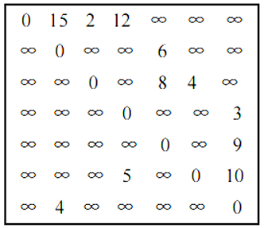
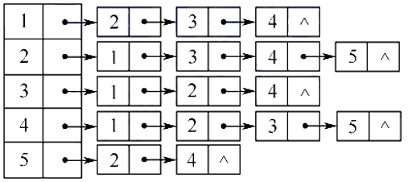
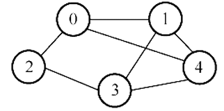
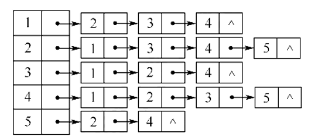

# 数据结构

## 第 1 章 概论

### 1.1 什么是数据结构


#### 1.1.1 关于数据的组织

* 数据结构至今没有统一定义，不过**数据结构**往往和**算法**同时出现，“程序 = 数据结构 + 算法”——Niklaus Wirth

* 当谈起数据的**组织方式**的时候，其实与**数据的规模**息息相关，不一样规模的问题处理起来难度就不一样。

* 难度主要不是与你如何存放有关，而是与你要对数据进行什么操作有关。以存放图书为例：

> 方法一：随便放         ①存放很简单    ②查找很复杂
>
> 方法二：按字母顺序放   ①存放较复杂    ②查找简单（二分查找）
>
> 方法三：类别+字母顺序  ①存放较简单    ②查找简单（类别+二分查找）

* [x] 讨论 1.1 对中等规模、大规模的图书摆放，你有什么更好的建议？

> 提出这个问题，实际上是想让大家思考，在考虑大规模数据存储的时候会遇到什么问题，以及如何根据功能（也就是关联的算法，最常见的就是插入、查找、删除）需要设计存储方式。

讨论：

* 用**哈希表**，一个书架的一排定义为一个位置，哈希运算之后，就摆在算出的那一排上。

* 首先按**内容分类**并针对每个分类设定一个**冗余度**，例如 5%，则每 100 本书后预留 5 个空位。每个大类结束后预留更多的空位，如 200 个。这样，在新增书目的时候，只需挪动该插入位置之后，空位置之前的这不超过 100 本书。当该区间空位满了之后，不得不挪动下个 100 本书。并及时告知管理人员当前空位剩余数量。此外应动态管理冗余度，对于频繁新增书目的分类，应提高冗余度，预留更多的空位。并且对于经常满位的分类，应当放置在全部分类队列最后，这样可以减少空位满了之后挪动其他分类的数量。

* 用**树、数组和字典的方式**摆放书籍：按类别分不同区域和不同书架摆放。

* 查找：大厅设置屏幕提醒大类书籍所在位置，区域内书架上展示小类标签，书架上按照书籍编号有序放置。设置查询表，根据书名查找书籍编号、所在位置、余量等消息。

* 中大型图书馆，首先需要对图书进行分大类，建立基本框架，树性结构。细化管理，现代化管理，书名，条码分类，轨道式移动书本，通过**二维码识别**，精准定位，在小类里可采用循环链表分类登记汇总，实现自动化

#### 1.1.2 关于空间使用 - 例：PrintN 函数实现

写程序实现一个函数 PrintN，使得传入一个正整数为 N 的参数后，能顺序打印从 1 到 N 的全部正整数

```c
/* 循环实现 */
void PrintN(int N)
{ 
    int i;
    for (i = 1; i <= N; i++)
        printf("%d\n", i);
    return;
} 
/* 递归实现 */
void PrintN(int N)
{ 
    if (N) {
        PrintN(N - 1); 
        printf("%d\n", N);
    }
    return;
} 
```

​    上面两种实现，看起来好像都挺简单的，下面这个好像还更简单一点。分别令输入数据 N = 10、100、1000、... ...，观察运行结果，发现数据量较小时，两者结果基本一样，但第二个递归实现的函数在数据量到达 10w+ 以上时，递归函数有可能直接拒绝工作！

​    如果你对递归比较熟悉，递归代码往往是简洁明了的，但是计算机不是很适合运行递归代码，因为递归代码往往会占用很多空间。如果占用所有空间也没能得出结果，递归程序就会异常终止，所以结果上可能是程序根本没有任何输出就结束了。

* 所以，**解决问题的效率，跟空间的利用效率也有关**。

* [x] 讨论 1.2 晒一下 PrintN 在你的机器上运行的结果？

> 这是我们大家发现壕的时候哈！\^\_\^

讨论：

* 数据规模为 10w 时，函数的循环实现总用时（可见 CodeExample 1.1.2 两种 PrintN）

  ticks1 = 13284.000000
  duration1 = 1.33e+001

  而递归实现没有输出结果（递归栈爆了）

* 循环代码更加繁琐，但节省内存；

  递归代码简洁易懂，却容易溢出。

#### 1.1.3 写程序计算给定多项式在给定点 x 处的值

计算多项式在给定点 x 处的值：

$$
\large{f(x) = a_0 + a_1x + ... + a_{n-1}x^{n-1} + a_{n}x^{n}}
$$

```c
/* 方法一 */
double f(int n, double a[], double x)
{
    int i;
    double p = a[0];
    for (i = 1; i <= n; i++)
        p += (a[i] * pow(x, i)); 
    return p;
}
```

​    第一种方法清晰明了，但是实际过程中如果这么写程序算法效率是很低的。

​    下面的方法通过**海伦-秦九韶算法**，巧妙利用结合律，不断提取公因式 x 来减少乘法的运算次数，把多项式改写成下面这种从里往外计算的形式：

$$
\large{f(x) = a_0 + x(a_1 + x(...(a_{n-1} + x(a_n))...))}
$$

```c
double f(int n, double a[], double x)
{ 
    int i;
    double p = a[n];
    for (i = n; i > 0; i--)
        p = a[i - 1] + x * p;
    return p;
} 
```

​    为了测试上面两种方法到底哪个更快，利用 C 语言提供的 clock() 函数：捕捉从程序开始运行到 clock() 被调用时所耗费的时间。这个时间单位是 clock tick，即“**时钟打点**”。 该函数位于头文件 time.h 中。

​    常数 CLK_TCK(或 CLOCKS_PER_SEC)：机器时钟每秒所走的时钟打点数（不同机器不一样）。

​    下面是使用这个函数测量待测函数的模板：

```c
#include <stdio.h>
#include <time.h>
clock_t start, stop;
/* clock_t 是 clock()函数返回的变量类型 */
double duration;
/* 记录被测函数运行时间，以秒为单位 */
int main ()
{ 
    /* 不在测试范围内的准备工作写在 clock()调用之前*/
    start = clock();    /* 开始计时 */
    MyFunction();       /* 把被测函数加在这里 */
    stop = clock();     /* 停止计时 */
    duration = ((double)(stop - start)) / CLK_TCK;
    /* 计算运行时间 */
    /* 其他不在测试范围的处理写在后面，例如输出 duration 的值 */
    return 0;
}
```

​    如果被测函数单次运行太快了（比如不到 1 个 tick），可以让被测函数**重复运行充分多次**（for 循环），使得测出的总的时钟打点间隔充分长，最后计算被测函数**平均每次**运行的时间即可!

```c
#include <stdio.h>
#include <time.h>
#include <math.h>
clock_t start, stop; 
double duration;
#define MAXN 10 /* 多项式最大项数，即多项式阶数 +1 */
double f1(int n, double a[], double x);
double f2(int n, double a[], double x);
int main ()
{ 
    int i;
    double a[MAXN]; /* 存储多项式的系数 */
    for (i = 0; i < MAXN; i++) 
        a[i] = (double)i;
    
    start = clock();
    f1(MAXN - 1, a, 1.1); 
    stop = clock();
    duration = ((double)(stop - start)) / CLK_TCK; 
    printf("ticks1 = %f\n", (double)(stop - start));
    printf("duration1 = %6.2e\n", duration);
    start = clock();
    f2(MAXN - 1, a, 1.1); 
    stop = clock();
    duration = ((double)(stop - start)) / CLK_TCK; 
    
    printf("ticks2 = %f\n", (double)(stop - start));
    printf("duration2 = %6.2e\n", duration);
    return 0;
}
```

* 经过测量，第二个函数用时比第一个函数少 1 个数量级左右，可见**解决问题方法的效率， 跟算法的巧妙程度有关**。

* [x] 讨论 1.3 再试一个多项式

> 给定另一个 100 阶多项式
> 
> $$
> f(x) = 1 + x + x^2/2 + ... + x^i/i + ... + x^{100}/100
> $$
> 用不同方法计算$f(1.1)$并且比较一下运行时间？

讨论：

* 初始化时，把上面程序的常数项 a 改一下即可（见 CodeExample 1.1.3 讨论）。
* ticks1 = 1995.000000
  duration1 = 2.00e+000
  ticks2 = 335.000000
  duration2 = 3.35e-001

#### 1.1.4 抽象数据结构

到底什么是数据结构？

* **数据对象**在计算机中的**组织方式**（逻辑结构 + 物理存储结构）
  * 逻辑结构：线性结构（线性表、栈和队列、数组、串）非线性结构（集合、树、图）
  * 物理存储结构：顺序存储、链式存储、散列存储、索引存储
  * 数据的逻辑结构采用抽象表达方式，**独立于存储结构**；数据存储结构是逻辑结构在计算机上的映射，不能独立于逻辑结构存在。
* 数据对象必定与一系列加在其上的**操作**相关联（也称为**数据的运算**，如：插入、删除、修改、查找、排序）
* 完成这些操作所用的方法就是**算法**
* 数据结构的**基本概念**：相互之间存在一种或多种特定关系的数据元素的集合。
  * 存储数据元素时，不仅应该存储数据元素的**值**，还应该存储数据元素之间的**关系**。(数据元素类型可以隐含)
* 数据结构的三要素：**数据的逻辑结构**，**数据的存储结构**，**数据的运算**。（和下面的 ADT 三要素要区分开）
  * 数据的运算具体实现可能和数据的存储结构有关，比如链表和顺序表的插入。
* **数据类型**是一个值的集合和定义在此集合上的一组操作的总称
  * ①原子类型：其值不可再分的数据类型
  * ②结构类型：其值可以再分解为若干成分（分量）的数据类型
  * ③抽象数据类型：一个数学模型及定义在该数学模型上的一组操作

**抽象数据类型（Abstract Data Type）**

* ADT 常用这样一个三元组表示：**数据对象**，**数据关系**，数据集合相关联的**基本操作集**（注意：数据 ≠ 数据结构）

* 抽象：描述数据类型的方法不依赖于具体实现
  * 与存放数据的机器无关
  * 与数据存储的物理结构无关
  * 与实现操作的算法和编程语言均无关

* 只描述数据对象集和相关操作集 “是什么 ”，并不涉及 “如何做到 ”的问题

【例】“矩阵”的抽象数据类型定义

* 类型名称：矩阵（Matrix）

* 数据对象集：一个 M×N 的矩阵$A_{M×N} = (a_{ij})$(i=1, ……, M; j=1, ……, N)由 M×N 个三元组<a, i, j>构成，其中 <u>a 是矩阵元素的值</u>，i 是元素所在的行号，j 是元素所在的列号。

* 操作集：对于任意矩阵 A、B、C ∈ Matrix，以及整数 i、j、M、N
  * Matrix Create(int M, int N)：返回一个 M×N 的空矩阵；
  * int GetMaxRow(Matrix A)：返回矩阵 A 的总行数；
  * int GetMaxCol(Matrix A)：返回矩阵 A 的总列数；
  * ElementType GetEntry(Matrix A, int i, int j)：返回矩阵 A 的第 i 行、第 j 列的元素；
  * Matrix Add(Matrix A, Matrix B)：如果 A 和 B 的行、列数一致，则返回矩阵 C=A+B，否则返回错误标志；
  * Matrix Multiply(Matrix A, Matrix B)：如果 A 的列数等于 B 的行数，则返回矩阵 C=AB，否则返回错误标志；
  * ……

抽象在哪里？

* 上面提到 a 是矩阵元素的值，这个值是**整形、浮点型还是字符型**等等，抽象类型描述时是不关心的，后面操作集返回时，也使用了通用类型 ElementType ，可以在文件头使用 typedef 来定义成自己需要类型，抽象的好处就是适用于任何一种类型的矩阵，提高了程序的灵活性。
* 矩阵在程序里如何存取的？是用二维数组、链表还是十字链表等等，这个在抽象数据类型定义时也都是不涉及的，重点在于如何实现矩阵本身。
* 矩阵操作函数，例如 Matrix Add() 到底是按行先加、还是列先加，是用什么样语言实现的，都是不涉及的，这就是所谓的抽象。

* [x] 讨论 1.4 抽象有什么好处？

> 任何事物存在都要有个理由，为什么大家这么稀饭“抽象”？

讨论：

* 抽象是计算机求解问题的基本方式和重要手段，它使得一种设计可以应用于多种场景。而且通过抽象可以屏蔽底层细节，使设计更加简单、理解更加方便。
* 抽象数据类型的描述方法与面向对象的思想是一致的，它把数据对象和相关操作封装在一起，对于需要调用这个数据类型的用户而言，无论内部的具体实现如何改变，只要对外描述的接口不变，就不影响使用。

### 1.2 什么是算法


#### 1.2.1 算法的定义

**算法(Algorithm)**

基本概念：算法是**对特定问题求解步骤的一种描述**，它是指令的有限序列，其中每一条指令表示一个或多个操作

1. **可行性**：可以用已有的基本操作实现算法
2. **有穷性**：一定在有限步骤之后终止（算法不是程序，程序可以无限运行，比如 OS）
3. **确定性**：每一条指令必须
   * 有充分明确的目标，不可以有歧义，相同的输入得到相同的输出
   * 计算机能处理的范围之内
   * 抽象的实现手段
4. **输入**：接受一些输入（有些情况下不需要输入）（算法输入来自特定数据对象的集合）
5. **输出**：产生一个或多个输出

【例】选择排序算法的伪码描述

```c
void SelectionSort(int List[], int N)
{   /* 将 N 个整数 List[0]...List[N-1]进行非递减排序 */
    for (i = 0; i < N; i++) {
        MinPosition = ScanForMin(List, i, N – 1); 
        /* 从 List[i]到 List[N – 1]中找最小元，并将其位置赋给 MinPosition */
        Swap(List[i], List[MinPosition]);
        /* 将未排序部分的最小元换到有序部分的最后位置 */
    }
}
```

抽象在于：

* List 到底是数组还是链表（虽然看上去很像数组）？

* Swap 用函数还是用宏去实现？

#### 1.2.2 什么是好的算法？


**“好”算法的评价标准**

1. 正确性：能正确解决问题。
2. 可读性：易于人类理解。
3. 健壮性：输入非法数据时，算法能适当反应或处理，而非输出意外结果。
4. 高效率与低存储量需求：指算法的执行时间和执行过程中需要的存储空间。

**评价算法效率的指标**

​    为什么不采用**事后统计**运行时间的方法评判算法效率？因为程序运行时间和机器性能、编程语言、编译程序产生的机器指令质量都有关，而且有时候无法采用事后统计的方法，如：火箭发射。因此我们采用**事先统计**方法排除这些因素影响。

> **命题追踪 > （算法题）分析时空复杂度（2010-2013、2015、2016、2018-2021）**

1. **空间复杂度 S(n)** —— 根据算法写成的程序在执行时**占用存储单元的长度(占用内存空间大小)**。这个长度往往与输入数据的规模有关。空间复杂度过高的算法可能导致使用的内存超限，造成程序非正常中断。

2. **时间复杂度 T(n)** —— 根据算法写成的程序在执行时**耗费时间的长度**。这个长度往往也与输入数据的规模有关。时间复杂度过高的低效算法可能导致我们在有生之年都等不到运行结果。

> **命题追踪 > 分析算法的时间复杂度（2011-2014、2017、2019、2022）**

* 由于这两个指标与数据的规模直接相关，所以将其写成一个关于 n 的函数。

在分析一般算法的效率时，我们经常关注下面两种复杂度

1. 最坏情况复杂度 $T_{worst}(n)$：考虑输入数据“最坏”的情况

2. 平均复杂度 $T_{avg}(n)$：考虑所有输入数据都等概率出现的情况

* 平均复杂度肯定比最坏情况复杂度小，但算法分析**一般分析最坏情况复杂度**，因为“什么叫平均”，经常不是一个很容易搞定的问题，很多时候平均复杂度分析难度很大...

**递归实现 PrintN 函数的空间复杂度分析**

<center style="color:#7c7877">PrintN() Recursive Call Process</center>


<center style="color:#7c7877">图 1.2.2 函数递归调用过程中内存占用情况</center>

* 函数递归调用需要**保存当前函数的状态**（如返回地址和一些变量的值等），因此需要占用一块内存空间（如上图调用 PrintN(10000)时需要占用一块内存空间），直到执行到 PrintN(0) 时，函数才直接返回，系统开始逐级释放内存。
* 假设存储每个函数状态占 1 个单位内存空间。由上可知，空间复杂度是和数据量 N 成正比的，S(N) = C · N。

* 有限空间都用完了也不足以执行完程序，所以程序异常退出了。
* PrintN()循环实现只需要临时变量和 for 循环，它没有涉及到程序调用的问题，它占用的空间量是**常量**。

**计算多项式在给定点处的值函数的时间复杂度分析**

* 机器运算加减法的速度比乘除法快很多

* 分析简单函数运行效率，只需要看它的乘除法执行次数，加减法可以忽略不计

* 不用海伦-秦九韶公式简化算法，循环每执行一次，除了 a[i] 和 pow() 乘一次之外，pow()还要乘 i - 1 次，总共乘 i 次。而使用海伦-秦九韶公式简化算法，循环每执行一次，只需要乘一次。

  所以在整个循环体，前者总共进行了 $\large{\frac{(n^2 + n)}2}$ 次乘法，后者总共进行了 n 次乘法。

```c
p += (a[i] * pow(x, i));   /* 不用海伦-秦九韶公式化简 */
p = a[i - 1] + x * p;      /* 使用海伦-秦九韶公式化简 */
```

* 第一个函数的时间复杂度：$T(n) = C_1n^2+C_2n(C_1$ 和 $C_2$ 为常数$)$

  第二个函数的时间复杂度：$T(n) = C·n(C$ 为常数$)$

  虽然三个常数每台计算机都不一样，但可以确定的是 n 很大时，平方项增长最快，第一个函数会比第二个函数大很多（即速度慢很多）。

* [x] 讨论 1.5 分析“二分法”

> 查找算法中的“二分法”是这样定义的：
>
> 给定 N 个从小到大排好序的整数序列 List[]，以及某待查找整数 X，我们的目标是找到 X 在 List 中的下标。即若有 `List[i] = X`，则返回 i；否则返回 -1 表示没有找到。
>
> 二分法是先找到序列的中点 List[M]，与 X 进行比较，若相等则返回中点下标；否则，若`List[M] > X`，则在左边的子系列中查找 X；若 `List[M] < X`，则在右边的子系列中查找 X。
>
> 试写出算法的伪码描述，并分析最坏、最好情况下的时间、空间复杂度。

讨论：

```c
int search(int x, int List[], int len)
{
    int ret = -1;
    int left = 0;
    int right = len - 1;
    while (left <= right) {
        int mid = (left + right) / 2;
        if (List[mid] == x) {
            ret = mid;
            break;
        } else if (List[mid] > x) {
            right = mid - 1;
        } else {
            left = mid + 1;
        }
    }
    return ret;
}
```

* 最好情况第一次二分就找到，最坏情况是没找到被迫跳出循环，空间复杂度都是 O(1)(辅助空间为常量称算法**原地工作(In Place)**)。

  $T_{worst}(n) = O(logn)\qquad  S_{worst}(n) = O(1)$

  $T_{best}(n) = O(1)\qquad\qquad S_{best}(n) = O(1)$

#### 1.2.3 渐进表示法

​    实际算法分析过程中，没有必要去数每个函数具体每一步执行了几次，其实我们更关心的是随着要处理的数据规模 n 的增大，复杂度增长的趋势是怎样的。

**(时间)复杂度的渐进表示法**

* $T(n) = O(f(n))$ 表示存在常数 $C>0,  n_0>0$ 使得当 $n > n_0$ 时有 $T(n)≤C·f(n)$，简单来说，上面这个等式表示，对于充分大的 n 而言，f(n)是 T(n)的某个上界

* $T(n) = Ω(g(n))$ 表示存在常数 $C>0,  n_0>0$ 使得当 $n > n_0$ 时有 $T(n)≥C·g(n)$，简单来说，上面这个等式表示，对于充分大的 n 而言，g(n)是 T(n)的某个下界

* $T(n)= Θ(h(n))$ 表示同时有 $T(n) = O(h(n))$ 和 $T(n)= Ω(h(n))$，简单来说，上面这个等式表示，对于充分大的 n 而言，h(n) 既是 T(n) 的上界也是下界

​    注意，函数的上下界都不是唯一的，但是太大的上界和太小的下界对分析算法效率没有什么帮助，我们在找上界和下界时，都期望和真实情况贴得越近越好，一般是寻找最小上界作为 $O$ 函数和最大的下界作为 $Ω$ 函数。

<center style="color:#7c7877">表 1.2.3 f(n) 随着输入规模 n 的变化表</center>

| 函数 f(n) | 1   | 2   | 4   | 8        | 16            | 32             |
| ------- | --- | --- | --- | -------- | ------------- | -------------- |
| 1       | 1   | 1   | 1   | 1        | 1             | 1              |
| log n   | 0   | 1   | 2   | 3        | 4             | 5              |
| n       | 1   | 2   | 4   | 8        | 16            | 32             |
| n log n | 0   | 2   | 8   | 24       | 64            | 160            |
| $n^2$   | 1   | 4   | 16  | 64       | 256           | 1024           |
| $n^3$   | 1   | 8   | 64  | 512      | 4096          | 32768          |
| $2^n$   | 2   | 4   | 16  | 256      | 65536         | 4294967296     |
| n!      | 1   | 2   | 24  | 40326    | 2092278988000 | 26313 × 10^33^ |
| $n^n$   | 2   | 4   | 256 | 16777216 | 18447×10^19^  | 14615×10^46^   |

* 时间复杂度阶数由小到大判断口诀：常对幂指阶(随着问题规模变得很大，算法性能问题可能才会明显暴露出来)
* 如果一个算法的复杂度是 $n^2$ ，可以考虑是否能将其优化为 $nlog(n)$。
* 真数相同底数不同的对数函数只相差常数倍，但渐进表示法**忽略常数因子和低阶项**，所以 log 的底数可以省略不写。（但是要注意，不同底的指数函数之间相差不是常数倍，比如 $O(2^n)$ 和 $O(3^n)$ 复杂度是完全不一样的）

**复杂度分析的技巧**

* 若两段算法分别有复杂度 $T_1(n) = O(f_1(n))$ 和 $T_2(n) = O(f_2(n))$，则

  * 加法规则：$T_1 (n) +  T_2 (n) = max(O(f_1(n)), O(f_2(n)))$
  * 乘法规则：$T_1(n)×T_2(n) = O(f_1(n)×f_2(n))$

* 若 T(n)是关于 n 的 k 阶多项式，那么 $T(n)= Θ(n^k)$

* 忽略常数因子和低阶项

* 着重分析**最深层循环某个基本操作**与问题规模 n 的关系

* 一个 **for 循环**的时间复杂度等于循环次数乘以循环体代码的复杂度

* **若干层嵌套循环**的时间复杂度等于各层循环次数的乘积再乘以循环体代码的复杂度

* **if-else 结构**的复杂度取决于 **if** 的条件判断复杂度和两个分枝部分的复杂度，总体复杂度取三者中**最大**

```c
/* 下列函数的总复杂度为 max(O(f1), O(f2), O(f3)) */
if (P1)     /* P1 的复杂度为 O(f1) */
    P2;     /* P1 的复杂度为 O(f2) */
else
    P3;     /* P1 的复杂度为 O(f3) */
```

* 一般情况下，**递归函数空间复杂度 = 递归深度 × 单次递归的空间复杂度**，但如果递归每一层需要分配不同大小的内存时，不能简单相乘，需要累加各层的空间开销。

### 1.3 应用实例：最大子列和(maximum-subarray)问题

给定 N 个整数的序列 $\{A_1, A_2, …, A_N\}$， 求下列函数的最大值（0 代表子列和为负数时）

$$
f(i, j)=max\{0,\sum_{k=i}^{j}A_k\}
$$

#### 1.3.1 两种简单求和算法

以给定序列：{-2，11，-4，13，-5，-2}为例。

算法一：暴力求出所有子列和，然后取最大的和

```c
int MaxSubseqSum1(int A[], int N)
{   
    int ThisSum, MaxSum = 0;
    int i, j, k;
    for (i = 0; i < N; i++) {       /* i 是子列左端位置 */       
        for (j = i; j < N; j++) {   /* j 是子列右端位置 */
            ThisSum = 0;            /* ThisSum 是从 A[i]到 A[j]的子列和 */
            for (k = i; k <= j; k++)
                ThisSum += A[k];
            if (ThisSum > MaxSum)  /* 如果刚得到的这个子列和更大 */
                MaxSum = ThisSum;  /* 则更新结果 */
        }                          /* j 循环结束 */
    }                              /* i 循环结束 */
    return MaxSum;
}
```

* 时间复杂度：$T(n) = O(n^3)$

* 本算法“傻”在大量无效操作浪费在`ThisSum += A[k];`，其实不必每次都从头往后加，只要把 i 到 j 的部分和加一个元素 A[k]即可，最里层循环完全就是多余的，于是就有了算法二。

| -2     | 11     | -4     | 13     | -5  | -2  | sum    |
| ------ | ------ | ------ | ------ | --- | --- | ------ |
| -2     |        |        |        |     |     | -2     |
| -2     | 11     |        |        |     |     | 9      |
| -2     | 11     | -4     |        |     |     | 5      |
| ==-2== | ==11== | ==-4== | ==13== |     |     | ==18== |
| -2     | 11     | -4     | 13     | -5  |     | 13     |
| -2     | 11     | -4     | 13     | -5  | -2  | 11     |

算法二：对算法一重复计算部分优化

```c
int MaxSubseqSum2(int A[], int N)
{   
    int ThisSum, MaxSum = 0;
    int i, j;
    for (i = 0; i < N; i++) {      /* i 是子列左端位置 */
        ThisSum = 0;               /* ThisSum 是从 A[i]到 A[j]的子列和 */
        for (j = i; j < N; j++) {  /* j 是子列右端位置 */
            ThisSum += A[j];       /*对于相同的 i，不同的 j，只要在 j-1 次循环的基础上累加 1 项即可*/
            if (ThisSum > MaxSum)  /* 如果刚得到的这个子列和更大 */
                MaxSum = ThisSum;  /* 则更新结果 */
        }                          /* j 循环结束 */
    }                              /* i 循环结束 */
    return MaxSum;
}
```

* 时间复杂度：$T(n) = O(n^2)$
* $T(n) = O(n^2)$ 往往可以优化为 $T(n) = O(nlogn)$

| -2  | 11  | -4  | 13     | -5  | -2  | sum    |
| --- | --- | --- | ------ | --- | --- | ------ |
| -2  |     |     |        |     |     | -2     |
|     | 11  |     |        |     |     | 9      |
|     |     | -4  |        |     |     | ==5==  |
|     |     |     | ==13== |     |     | ==18== |
|     |     |     |        | -5  |     | 13     |
|     |     |     |        |     | -2  | 11     |

#### 1.3.2 分治算法(Divide and Conquer)

**算法三：分而治之**

把数组一分为二，递归解决左右两边的问题，分别得到两边的最大子列和，再找出**跨越边界的最大子列和**，最后的结果一定是三个结果中间最大的那一个。

```c
int Max3(int A, int B, int C)
{ /* 返回 3 个整数中的最大值 */
    return A > B ? A > C ? A : C : B > C ? B : C;
}

int DivideAndConquer(int List[], int left, int right)
{ /* 分治法求 List[left]到 List[right]的最大子列和 */
    int MaxLeftSum, MaxRightSum; /* 存放左右子问题的解 */
    int MaxLeftBorderSum, MaxRightBorderSum; /* 存放跨分界线的结果 */

    int LeftBorderSum, RightBorderSum;
    int center, i;

    if (left == right) {      /* 递归的终止条件，子列只有 1 个数字 */
        if (List[left] > 0)  return List[left];
        else return 0;
    }

    /* 下面是"分"的过程 */
    center = (left + right) / 2; /* 找到中分点 */
    /* 递归求得两边子列的最大和 */
    MaxLeftSum = DivideAndConquer(List, left, center);
    MaxRightSum = DivideAndConquer(List, center+1, right);

    /* 下面求跨分界线的最大子列和 */
    MaxLeftBorderSum = 0; LeftBorderSum = 0;
    for (i = center; i >= left; i--) { /* 从中线向左扫描 */
        LeftBorderSum += List[i];
        if (LeftBorderSum > MaxLeftBorderSum)
            MaxLeftBorderSum = LeftBorderSum;
    } /* 左边扫描结束 */

    MaxRightBorderSum = 0; RightBorderSum = 0;
    for (i = center+1; i <= right; i++) { /* 从中线向右扫描 */
        RightBorderSum += List[i];
        if (RightBorderSum > MaxRightBorderSum)
            MaxRightBorderSum = RightBorderSum;
    } /* 右边扫描结束 */
    /* 下面返回"治"的结果 */
    return Max3(MaxLeftSum, MaxRightSum, MaxLeftBorderSum + MaxRightBorderSum);
}

int MaxSubseqSum3(int List[], int N) {
/* 保持与前 2 种算法相同的函数接口，这样用户调用不同算法时输入的参数是不变的 */
    return DivideAndConquer(List, 0, N - 1);
}
```

<table style="undefined;table-layout: fixed; width: 100%"><colgroup>
</colgroup>
<thead>
  <tr>
    <th>-2</th>
    <th>11</th>
    <th>-4</th>
    <th>13</th>
    <th>-5</th>
    <th>-2</th>
  </tr></thead>
<tbody>
  <tr>
    <td>-2</td>
    <td>11</td>
    <td></td>
    <td>13</td>
    <td></td>
    <td>-2</td>
  </tr>
  <tr>
    <td></td>
    <td>11</td>
    <td></td>
    <td>13</td>
    <td></td>
    <td></td>
  </tr>
  <tr>
    <td></td>
    <td colspan="3">20</td>
    <td></td>
    <td></td>
  </tr>
</tbody>
</table>

* 时间复杂度：$T(n) = O(nlogn)$

* 递归函数的时间复杂度计算比较复杂，一般思路是根据分问题（左子列、右子列、跨越边界子列）的复杂度，得出一个关于复杂度的递推公式

  $T (N) = 2 T(N/2) + c N$， $T(1) = O(1)$

  $= 2 [2 T(N/2^2) + c N/2] + c N$

  $= 2^k O(1) + ckN$ 其中 $N/2^k = 1$

  $= O(N log N)$

* [x] 讨论 1.6 算法 3 的空间复杂度是多少？

> 具体来说，这个问题分两部分：
>
> 1. 由于递归而产生的空间复杂度是多少？
> 2. 算法的整体空间复杂度一共是多少？
>
> 不要只写结论，要写清楚推导过程哦~~

讨论：

* 递归的深度为 logN，每次递归需要的空间是一个与 N 无关常量，每次递归的空间复杂度为 O(1)。**递归的空间复杂度** = **每次递归的空间复杂度** × **递归深度**，即 O(logN)

#### 1.3.3 在线算法(Online Algorithm)

**算法四：在线处理**

```c
int MaxSubseqSum4(int A[], int N)
{
    int ThisSum, MaxSum;
    int i;
    ThisSum = MaxSum = 0;
    for (i = 0; i < N; i++) {
        ThisSum += A[i];      /* 向右累加 */
        if (ThisSum > MaxSum)
            MaxSum = ThisSum; /* 发现更大和则更新当前结果 */
        else if (ThisSum < 0) /* 如果当前子列和为负 */
            ThisSum = 0;      /* 则不可能使后面的部分和增大，抛弃之 */
    }
    return MaxSum;
} 
```

* 时间复杂度：$T(n) = O(n)$

* 这个算法的时间复杂度已经是最快的了，因为你将元素遍历一遍都需要 O(N)，这个算法的时间复杂度竟然也是 O(N)

* 算法效率这么高，副作用就是“正确性”不是很明显，有点难理解。

* “**在线**”的意思是指每输入一个数据就进行即时处理，在任何一个地方中止输入，算法都能正确给出当前的解。

* 为什么这么快，就是因为这个算法发现了如果当前子列和为负，它其实对于后面的子列和增大没有作用，应该丢弃。

  

<center style="color:#7c7877">图 1.3.3 在线处理算法执行过程可视化</center>

* [x] 讨论 1.7 晒运行结果

> 在 PTA 上发布的编程题“最大子列和问题”给了非常宽松的时间上限，让大家可以至少把算法 2、3、4 分别尝试一下。另外“Maximum Subsequence Sum”需要你把算法略做修改，不仅输出最大和，而且输出相应的那个子列的首尾。
>
> 于是大家在这里晒一下自己的程序在 PTA 系统中的时间和空间耗费的结果吧~

讨论：

* 运行程序见 CodeExample，运行结果如下

| 算法       | 1         | 2         | 3          | 4         |
| ---------- | --------- | --------- | ---------- | --------- |
| 时间复杂度 | $O(N^3)$  | $O(N^2)$  | $O(NlogN)$ | $O(N)$    |
| N=10       | 6.30e-007 | 1.80e-007 | 2.30e-007  | 4.00e-008 |
| N=100      | 4.67e-004 | 1.43e-005 | 2.80e-006  | 3.00e-007 |
| N=1000     | 4.47e-001 | 1.29e-003 | 4.70e-005  | 2.00e-006 |
| N=10000    | 4.46e+002 | 1.30e-001 | 8.10e-004  | 2.00e-005 |
| N=100000   | NA        | 1.42e+001 | 1.10e-002  | 1.00e-003 |

* NA 的意思是 Not Available，意思就是耗时太长，不算了。

### 1.4 习题

#### 1.4.a 课后习题

**1.1 判断正误**

1. $N(logN)^2$ 是 $O(N^2)$ 的。
2. $N^2(logN)$ 和 $N(logN^2)$ 具有相同的增长速度。

解答： #复杂度的渐进表示

* 正确，其实就是证明 $(log(n))^2$ 是 $O(n)$

  要证 $(log(n))^2$ 是 $O(n)$，只需证存在常数 $C>0,  n_0>0$ 使得当 $n > n_0 $时有 $lg^2n≤C·n$

  令 $f(x) = Cx - lg^2x$，$f'(x) = C - \frac{2lgx}{xln10}$

  $∵\frac{lgx}x<1$，对 $∀x∈R，∃C>0$，使得 $f'(x)>0$，$f(x)$ 单调递增

  而 $f(1) = C > 0$，所以 $∀n > n_0 ≥ 1$时，$lg^2n<C·n$

  所以 $(log(n))^2$ 是 $O(n)$

  * 另一个更简单的做法：直接判断

  $$
  \lim_{x \to +\infty} \frac{x(logx)^2}{x^2} = C
  $$

  即当 $x$ 大于某个值之后，$x^2$ 是 $x(logx)^2$ 的上界，此时两者要么是同阶无穷大，要么前者是高阶无穷大。即 C 是正常数或者 C = 0。

* 错误，后者和 $2N(logN)$ 具有相同的增长速度

**1.2 填空题**

1. 给定 N×N 的二维数组 A，则在不改变数组的前提下，查找最大元素的时间复杂度是：\_\_\_。
2. 斐波那契数列 $F_N$ 的定义为：$F_0=0, F_1=1, F_N  =F_{N−1}+F_{N−2}, N=2, 3, …$。用递归函数计算 $F_N$ 的空间复杂度是___。
3. 上述斐波那契数列 $F_N$ 的时间复杂度是___。

解答： #复杂度的渐进表示 #斐波那契数列 #二叉树

* 遍历所有元素一次即可，时间复杂度 $O(N^2)$

* 空间复杂度计算比较简单，递归的**空间复杂度** = **每次递归的空间复杂度** × **递归深度**，每次递归的空间复杂度都是一个常量，所以空间复杂度主要与递归深度有关。每调用一次函数，就会申请一个内存空间保存状态，直到达到递归出口位置返回，递归深度为 n 层，所以空间复杂度为 $O(n)$（注意，函数返回时会把空间释放，所以空间是可以重复利用的）

```c
int fibonacci(int n)
{
    if (n <= 1)
        return n;
    else
        return fibonacci(n - 1) + fibonacci(n - 2);
}
```

* 时间复杂度较为复杂，下面提供两个简单证明方法

【证明一】：

$F(n) = F(n-1) + F(n - 2)$

将其中计算 $F(n)$ 的用时记为 $T(n)$，计算两数和的用时为常数 *C*。

所以 $T(n) = T(n-1) + T(n - 2) + C$

变形得 $T(n) + C = (T(n-1) + C) + (T(n - 2) + C)$

令 $A(n) = T(n) + C$，有

$A(n) = A(n-1) + A(n-2)$，这是个前两项不为 1 的斐波那契数列

假设前两项为 $a, b(a≠b)$，令 $c = max(a, b)$，

由斐波那契数列的定义知，前两项为 c 的斐波那契数列增长速度比前两项为 a、b 的快，该数列为：

​    $c、c、2c、3c、5c、...、F(n)c$

其中每项都与题给的标准斐波那契数列差常数倍，因此无论斐波那契数列的前两项是多少，都不会影响它的渐进增长率。

所以 $A(n)$ 的渐进增长率等于 $F(n)$，而 $T(n) = A(n) - C$，增长率也是一样的

所以有 $T(n)=Θ(F(n))$

事实上，由数学原理可以推导得到斐波那契数列通项公式为：

$$
F_n = \frac{1}{\sqrt{5} }[(\frac{1 + \sqrt{5} }{2})^n - (\frac{1 - \sqrt{5} }{2})^n ]
$$

所以可以得到 $T(n)=Θ((\frac{1 + \sqrt{5} }{2})^n)$，这是 $T(n)$ 的**‌渐进紧确界**。

【证明二】：

这是一个更加直观的证明方法。稍微改写一下递归代码，使之**不输出第 0 项斐波那契数列（保证叶结点不出现 F(0)）**。

```c
int fibonacci(int n)
{
    if (n <= 2)
        return 1;
    else
        return fibonacci(n - 1) + fibonacci(n - 2);
}
```

斐波那契数列的递归计算方法过程中，存在两种递归结点

* ①.第一种，**叶子结点**， F(1)，F(2) 会直接返回结果，记直接返回所需时间为 a

* ②.第二种，**非终端结点**， n>=3 时， F(n) 对 F(n−1) 与 F(n−2) 的结果进行相加，记加法与返回结果所需的所有时间为 b

​    斐波那契数列的递归树是一棵**非平衡二叉树**，递归求解斐波那契数列的叶子结点数量其实就是 F(n) 。因为**所有叶子结点的返回结果都是 1**，而递归求解相当于把所有的 1 按照不同的顺序加起来。因为没有结点被丢弃，所有的叶子结点都被加到结果中了，所以叶子结点的数量其实就是 F(n) 的计算结果。

​    而非终端结点的数量其实就是 F(n)−1 ，因为每个非终端结点都做了一次加法，无论用什么样的顺序将所有的 1 加起来，所需要的加法数量其实都是 F(n)−1 。（或利用二叉树的性质 $n_2=n_0 - 1$）

因此，一共所需要的时间为（a,b 都是常数）：

$$
T(n)=aF(n)+b(F(n)−1)=(a+b)F(n)−b
$$

所以有：$T(n)=Θ(F(n))$

**1.3 时间复杂度分析**

下列代码的时间复杂度是：____。

```c
if (A > B) {
    for (i = 0; i < N; i++)
        for (j = N * N; j > i; j--)
            A += B;
} else {
    for (i = 0; i < N*2; i++)
        for (j = N * 2; j > i; j--)
            A += B;
}
```

解答： #复杂度的渐进表示

​    条件判断 $O(1)$，第一个分支 $O(N^3)$，第二个分支 $O(N^2)$，所以最终时间复杂度是 $O(N^3)$。

**1.4 PrintN 函数算法分析**

分析两个版本的 PrintN 函数的时间、空间复杂度，并测试它们的实际运行效率。对 N = 100，1000，10000，100000 运行程序，将两个版本的 N-时间曲线绘在一张图里进行比较分析。

解答： #复杂度的渐进表示

* 循环实现，时间复杂度：$O(n)$，空间复杂度：$O(1)$
* 递归实现，时间复杂度：$O(n)$，空间复杂度：$O(n)$
* 两个版本的 N-t 图如下，长的曲线是循环实现，短的曲线是递归实现（N = 100000 时出错）。
* 注意到一个有趣的情况，当数据量为 10000 时，如果连续运行两个版本的打印函数，后执行的打印函数用时会异常显著缩短，但是如果清屏之后再执行后一个函数则恢复正常，推测终端 I/O 用时过长。所以采取单独测量用时或者打印完一次清屏或者把结果输出到文件测试结果比较准确。


**1.5 秦九韶算法与直接法的效率差别**

解答： #算法

​    见讨论 1.3

**1.6 空间复杂度分析**

最大子列和算法 MaxSubseqSum3 是用递归实现的，由于递归而产生的空间复杂度是多少？

解答： #递归 

* 这个问题是问一共递归了多少层。由于我们每次递归都把搜索范围缩小一半，也就是 *N*/2/2/2⋯ 直到得到 1，于是有公式 $N/2^k=1$，推出 $k=log_2N$，即递归最多需要 *O*(log *N*) 次，占用的空间跟递归的次数成正比，也就是 *O*(log *N*)。

**1.7 测试最大子列和 4 种算法的实际运行效率**

简单起见，可令 List 中全部整数为 1 。当 N = 2，4，6，8，10，...，28，30 时，将各算法的 N-时间曲线绘制绘制在一张图里，其中时间以毫秒为单位；当 N = 1000，2000，...，10000 时，以秒为单位绘出各算法的时间增长曲线。两幅图有什么不同？为什么？

解答： #复杂度的渐进表示


* 图二的 MaxSubseqSum1()用时差距与其他三个函数比，远远比图一更大，这是因为随着数据量的增大，时间复杂度高的算法耗时增加的速度是惊人的。

**1.8 二分查找**

本题要求实现二分查找算法

**函数接口定义**：

```c
Position BinarySearch(List L, ElementType X);
```

其中 List 结构定义如下：

```c
typedef int Position;
typedef struct LNode *List;
struct LNode {
    ElementType Data[MAXSIZE];
    Position Last; /* 保存线性表中最后一个元素的位置 */
};
```

​    L 是用户传入的一个线性表，其中 ElementType 元素可以通过 >、\==、< 进行比较，并且题目保证传入的数据是递增有序的。函数 BinarySearch 要查找 X 在 Data 中的位置，即数组下标（注意：元素从下标 1 开始存储）。找到则返回下标，否则返回一个特殊的失败标记 NotFound。

**裁判测试程序样例**：

```c
#include <stdio.h>
#include <stdlib.h>

#define MAXSIZE 10
#define NotFound 0
typedef int ElementType;

typedef int Position;
typedef struct LNode *List;
struct LNode {
    ElementType Data[MAXSIZE];
    Position Last; /* 保存线性表中最后一个元素的位置 */
};

List ReadInput(); /* 裁判实现，细节不表。元素从下标 1 开始存储 */
Position BinarySearch(List L, ElementType X);

int main()
{
    List L;
    ElementType X;
    Position P;

    L = ReadInput();
    scanf("%d", &X);
    P = BinarySearch(L, X);
    printf("%d\n", P);

    return 0;
}

/* 你的代码将被嵌在这里 */
```

**输入样例 1**：

```in
5
12 31 55 89 101
31
```

**输出样例 1：**

```out
2
```

**输入样例 2：**

```in
3
26 78 233
31
```

**输出样例 2：**

```in
0
```

---

解答： #二分查找

​    最好、最坏情况下的时间、空间复杂度见讨论 1.5。

```c
Position BinarySearch(List L, ElementType X)
{
    int ret = -1;
    int left, right;
    left = 1;
    right = L->Last;
    while (left <= right) {
        int mid = (left + right) / 2;
        if (L->Data[mid] == X) {
            ret = mid;
            break;
        } else if (L->Data[mid] > X) {
            right = mid - 1;
        } else {
            left = mid + 1;
        }
    }

    if (ret == -1)
        return NotFound;
    else
        return ret;
}
```

**1.9 有序数组的插入**

本题要求将任一给定元素插入从大到小排好序的数组中合适的位置，以保持结果依然有序。

**函数接口定义：**

```c
bool Insert(List L, ElementType X);
```

其中 List 结构定义如下：

```c
typedef int Position;
typedef struct LNode *List;
struct LNode {
    ElementType Data[MAXSIZE];
    Position Last; /* 保存线性表中最后一个元素的位置 */
};
```

​    L 是用户传入的一个线性表，其中 ElementType 元素可以通过>、\==、<进行比较，并且题目保证传入的数据是递减有序的。函数 Insert 要将 X 插入 Data[] 中合适的位置，以保持结果依然有序（注意：元素从下标 0 开始存储）。但如果 X 已经在 Data[] 中了，就不要插入，返回失败的标记 false；如果插入成功，则返回 true。另外，因为 Data[] 中最多只能存 MAXSIZE 个元素，所以如果插入新元素之前已经满了，也不要插入，而是返回失败的标记 false。

**裁判测试程序样例：**

```c
#include <stdio.h>
#include <stdlib.h>

#define MAXSIZE 10
typedef enum {false, true} bool;
typedef int ElementType;

typedef int Position;
typedef struct LNode *List;
struct LNode {
    ElementType Data[MAXSIZE];
    Position Last; /* 保存线性表中最后一个元素的位置 */
};

List ReadInput(); /* 裁判实现，细节不表。元素从下标 0 开始存储 */
void PrintList(List L); /* 裁判实现，细节不表 */
bool Insert(List L, ElementType X);

int main()
{
    List L;
    ElementType X;

    L = ReadInput();
    scanf("%d", &X);
    if (Insert(L, X) == false)
        printf("Insertion failed.\n");
    PrintList(L);

    return 0;
}

/* 你的代码将被嵌在这里 */
```

**输入样例 1：**

```in
5
35 12 8 7 3
10
```

**输出样例 1：**

```out
35 12 10 8 7 3
Last = 5
```

**输入样例 2：**

```in
6
35 12 10 8 7 3
8
```

**输出样例 2：**

```out
Insertion failed.
35 12 10 8 7 3
Last = 5
```

---

解答： #数组

* 由于给出的数组是**降序**的，所以使用折半查找并插入的方法

* 最好情况，第一个查找到的元素就是 x，所以不用插入，时间复杂度 O(1)，空间复杂度 O(1)。

* 最坏情况，遍历了所有元素都没找到 x，插入 x，此时查找用时 O(log n)，插入时数组后移用时 O(n)，时间复杂度 O(nlogn)，空间复杂度仍为 O(1)。
* 返回值：注意到只有插入成功才返回`true`，所以初始默认值就设为`false`。
* 边界条件分析：需要插入的情况即 left 指针在右，right 指针在左，此时循环体内已经判断过`x != L->Data[mid]`，于是只会有下列两种情况：
  * 如果`X < L->Data[mid]`，则插在 Data[mid]的右边，left = mid + 1， right = mid，此时位置正好是 left
  * 如果`X > L->Data[mid]`，则插在 Data[mid]处，left = mid， right = mid - 1，此时位置还是 left

* 所以用指针 left 表示插入位置就很简单（当然，认真思考就会发现，插入位置也可以表示为 right + 1）
* 接下来就是把插入位置**以及往后**全部后移一位（所以要取等号），把插入位置空出来，最后把 X 赋值进去
* 最终别忘了把数组长度增加 1，以及把标志置为`true`

```c
bool Insert(List L, ElementType X)
{
    int left, right, mid;
    int i;
    int ret = false;
    if (L->Last == MAXSIZE - 1)
        return false;
    left = 0;
    right = L->Last;
    while (left <= right) {
        mid = (left + right) / 2;
        if (X == L->Data[mid])
            break;
        else if (X > L->Data[mid])
            right = mid - 1;
        else
            left = mid + 1;
    }

    if (left > right) {
        for (i = L->Last; i >= left; i--)
            L->Data[i + 1] = L->Data[i];
        L->Data[i + 1] = X;
        L->Last++;
        ret = true;
    }

    return ret;
}
```

**1.10 试给出判断 N 是否为质数的$O(\sqrt{N})$算法**

解答： #质数

```c
#include <stdio.h>
#include <math.h>
typedef long long ll;

int isprime(ll x)
{
    int ret = 1;
    for (int i = 2; i <= sqrt(x); i++) {
        if (x % i == 0) {
            ret = 0;
            break;
        }
    }
    return ret;
}
```

**1.11 试给出计算 $x^n$ 的时间复杂度为 O(log N)的算法。**

解答： #快速幂 #递归

* 很自然的想到利用二分循环或者递归来解决，看起来不难，实际马上遇到的第一个问题就是指数如果不能被 2 整除时如何处理？
* 思路是将指数转换成 2 的幂的形式之和，这样每次能被 2 整除，比如计算 ：

$$
5^{10} = 5^{(1010)_2}=5^{2^3+0+2^1+0}=5^{2^3}×5^0×5^{2^1}×5^0
$$

* 这样转换之后每一步恰好和二进制转换思路一致，一边在不断对 n mod 2，从低位取数，一边乘基转换成 result。
* 除基取余，先 mod 2 得到的是低位，如果 mod 2 不为 0，则说明对应的 2 进制位**不为 0**，开始**乘基**取整，化为十进制，如果 mod 2 为 0，则说明对应的 2 进制**为 0**，这时只需要把**底数翻倍**即可（相当于指数乘 2），不必累乘到结果中，而是为下一位的计算做准备。
* 这个问题可以衍生到经典算法——快速幂，这里不再赘述。
* 方法一：循环实现

```c
double pow(double x, int n)
{
    double temp = x;
    double result = 1;
    while (n) {
        if (n % 2)
            result = result * temp;
        n = n / 2;
        temp *= temp;   
    }
    
    return result;
}
```

方法二：递归实现

* 注意，分问题的结果都是一样的，所以要先保存 temp 变量，在 temp 处做递归，而不是在`ret = pow2(x, n / 2) * pow2(x, n / 2) * x`处做递归，如果像后面这样写的话虽然递归深度还是 O(log n) 但是每一层还要递归其它分支，产生额外的时间复杂度，最终的时间复杂度是 = 整棵递归树的结点 × O(1) = O(n)，是很低效的。

```c
double pow2(double x, int n)
{
    double ret;
    if (n == 0)
        ret = 1;
    else if (n == 1)
        ret = x;
    else {
        int temp = pow2(x, n / 2);
        if (n % 2 == 1)
            ret = temp * temp * x;
        else
            ret = temp * temp;
    }
    
    return ret;
}

```

#### 1.4.b 概论课外习题

**b.1 已知两个长度分别为 m 和 n 的升序链表，若将它们合并为长度为 m + n 的一个降序链表，则最坏情况下的时间复杂度是（   ）。**

A. O(n)    B. O(mn)   C. O(min(m, n))    D. O(max(m, n))

解答： #链表归并  

* 合并成升序链表还是降序链表没有影响，只不过合并成升序用尾插法，现在改用头插法生成链表而已。
* 时间复杂度与元素之间的**比较次数**有关
* 最好情况是短链表在前，而且元素都比长链表大，此时比较完短链表之后，剩下的长链表直接用头插法连上去即可，时间复杂度 O(min(m, n))。
* 最坏情况是仅仅只有一个元素是最后直接连上去的，剩下的所有元素都比较一次之后才加入，所以时间复杂度是 O(m+n-1)，而 m + n - 1 < 2 * max(m, n)，所以时间复杂度为 O(max(m, n))。
* 如果 m 和 n 都是无序链表，则最坏情况下比较次数会大大提高，有可能每个元素都要和其他元素比较一次才能确定大小关系，此时，时间复杂度会达到二次级别，B 选项是无序链表合并才可能产生的时间复杂度。


**b.2 【2022 统考真题】下列程序段的时间复杂度是（   ）**

```c
int sum = 0;
for (int i = 1; i < n; i *= 2)
    for (int j = 0; j < i; j++)
        sum++;
```

A. O(logn)    B. O(n)    C. O(nlogn)    D. O(n^2^)

解答： #复杂度的渐进表示

* 这种问题属于第一种类型：**循环主体的变量参与循环条件的判断**，有个通用方法，就是把**基本操作次数记为 k** 。
* 大部分时候是把最内层操作记为 k，但本题可以设外层循环执行了 k 次，这样内层循环就是整数，比较好算。
* 外层循环的 i 的取值为 $i=1,2,4,...,2^k(2^k<n)$，内层循环基本语句执行，对于每个 i ，都要执行 i 次，也就是总循环次数等于外层循环取值求和，这个是个等比数列求和，最后算出来是 $2^{k+1}-1$ 次，小于 2n，所以时间复杂度为 O(n)。

$$
S_n=\frac{a_1(1-q^n)}{1-q}(q≠1,n\text{为项数})
$$

**b.2(变式) 【2014 统考真题】下列程序段的时间复杂度是**

```c
count = 0;
for (k = 1; k <= n; k *= 2)
    for (j = 1; j <= n; j++)
        count ++
```

解析： #复杂度的渐进表示

​    设最外层循环 t 次，所以 $2^t=n→t=log_2n$

​    内层循环次数为 n 次，所以总的循环次数为 $nlog_2n$，时间复杂度：$O(nlog_2n)$

**b.3 一个算法所需时间由下述递归方程表示，试求出该算法的时间复杂度的级别（或阶）**

$$
T(n) =  \begin{cases}    1, & n = 1 \\2T(n/2)+n, & n > 1 \end{cases}
$$

​    其中，n 是问题的规模，为简单起见，设 n 是 2 的整数次幂。

解答： #递归

* 本题属于第二类问题，**循环主体中的变量与循环条件无关**，采用数学归纳法或者直接统计循环次数。

* 递推程序一般用公式递推，这里公式已经给出，直接找规律化简即可。
* $T(n) = 2^2T(n/2^2)+ n + n = ...=2^kT(1) + kn = n + nlogn$(其中，$n / 2^k = 1$)
* $O(n + nlogn) = O(nlogn)$

**b.3(变式) 下列函数代码的时间复杂度是**

```c
int Func(int n){
    if (n == 1) return 1;
    else return 2 * Func(n / 2) + n;
}
```

解析： #复杂度的渐进表示

​    每一层其实只做了一件事，所以看递归层数知道时间复杂度为：$O(log_2n)$

​    注意与上一题的区别，上一题是直接给出渐进表达式的递推公式。

**b.4 求解斐波那契数列**

$$
F(n) =  \begin{cases}    0, & n = 0 \\ 1, & n = 1 \\F(n-1)+F(n-2), & n > 1 \end{cases}
$$

有两种常用的算法：递归算法和非递归算法。试分别分析两种算法的时间复杂度。

解析： #斐波那契数列 #递归 #迭代

```c
/* 斐波那契数列非递归写法 */
int fib_iter(int n)
{
    int t0, t1, t;
    t0 = 0; t1 = 1; t = n;
    while (n > 1){
        t = t0 + t1;
        t0 = t1;
        t1 = t;
        n --;
    }
    return t;
}
/* 斐波那契数列递归写法 */
int fib_rec(int n)
{
    if (n == 0)
        return 0;
    else if (n == 1)
        return 1;
    else
        return fA(n - 1) + fA(n - 2);
}
```

​    非递归写法时间复杂度分析属于之前提到的第一类问题，循环主体参与循环条件判断，循环次数和 n 相同，时间复杂度很容易看出来是：$O(n)$。

​    递归写法时间复杂度分析属于之前提到的第二类问题，要用数学归纳法判断或者直接累计次数。由于本题没有给出关于 T(n) 的表达式，所以采用直接累计次数的方法。习题 1.2 部分已经用两种方法说明过了，时间复杂度为：$O(2^n)$(非紧界)

## 第 2 章 线性表

### 2.1 线性表及其实现

​    线性表是算法命题的重点，容易实现且代码量较少，要求有最优时间/空间复杂度才能获得满分，因此应该牢固掌握线性表的基本操作（基于两种存储结构），纸面考试重要的是思想，不一定要求代码具有实际可执行性，不必拘泥于边界细节。


#### 2.1.1 引言-多项式表示

【典例】一元多项式及其运算

$$
f(x) = a_0 + a_1x + ... + a_{n-1}x^{n-1} + a_{n}x^{n}
$$

* 主要运算：多项式相加、相减、相乘等
* 分析——如何表示多项式？多项式的关键数据：
  * 多项式的系数 n
  * 各项系数 $a_i$ 及指数 i

方法一：顺序存储结构直接表示

* 数组各分量对应多项式各项
  * a[i]：项 $x^i$ 的系数 $a_i$

例如：$f(x) = 4x^5-3x^2+1$

| 下标   | 0   | 1   | 2   | 3   | 4   | 5   |
| ---- | --- | --- | --- | --- | --- | --- |
| a[i] | 1   | 0   | -3  | 0   | 0   | 4   |

* 两个多项式相加：两个数组对应分量相加
* 问题：如何表示多项式 $x+3x^{2000}$ 呢？
  * 很显然，如果按照上面的数组表示，会导致非 0 项空间的巨大浪费

方法二：顺序存储结构表示非零项

* 每个非零项 $a_ix^i$ 涉及两个信息：系数 $a_i$ 和指数$i$
* 可以将一个多项式看成是 (a, i)二元组的集合
* 用**结构数组**表示：数组分量是由系数 $a^i$ 、指数 i 组成的结构，对应一个非零项。
* 例如：$P_1(x) = 9x^{12}+15x^8+3x^2$ 和 $P_2(x) = 26x^{19}-4x^8-13x^6+82$

| 下标 i           | 0   | 1   | 2   | 3   | ... |
| -------------- | --- | --- | --- | --- | --- |
| $P_1$ 系数 $a^i$ | 9   | 15  | 3   | -   | -   |
| $P_1$ 指数 $i$   | 12  | 8   | 2   | -   | -   |
| $P_2$ 系数 $a^i$ | 26  | -4  | -13 | 82  | -   |
| $P_2$ 指数 $i$   | 19  | 8   | 6   | 0   | -   |

* 按照指数大小降序存储时，运算依然是方便的。
  * 比如加法运算：从头开始比较，$P_2$ 指数大，那和的结果就是指数大的那一项，然后接下来比较 $P_1$ 第一项和$P_2$ 第二项，以此类推

方法三：链表结构存储非零项

* 链表中每个**结点**存储多项式中的一个**非零项**，包括**系数和指数**两个数据域以及一个**指针域**

  | coef | expon | link |
  | ---- | ----- | ---- |

```c
typedef struct PolyNode *Polynomial;
struct PolyNode {
    int coef;
    int expon;
    Polynomial link;
}
```

* 指数也可以按照（递增、递减）顺序存放，相加过程也和方法二类似。

* 例如：$P_1(x) = 9x^{12}+15x^8+3x^2$ 和 $P_2(x) = 26x^{19}-4x^8-13x^6+82$ 链表存储形式如下


#### 2.1.2 线性表的顺序存储及其操作


**什么是线性表？**

> 多项式表示问题的启示：
>
> 1. 同一个问题可以有不同的表示（存储）方法
> 2. 有一类共性问题：有序线性序列的组织和管理

“**线性表(Linear List)**”：由<u>同类型</u>的 n(n≥0)个**数据元素**构成**有序序列**的线性结构

* 线性表 L 可以表示为：$L = (a_1,a_2,...,a_i,a_{i-1},...,a_n)$
* 线性表中元素个数是**有限**的
* 表中元素个数称为线性表的长度
* 表中元素的数据类型都相同，每个元素占有相同大小的存储空间
* 线性表没有元素时，称为空表
* 表起始位置称**表头**，表结束位置称**表尾**
* 除第一个元素外，每个元素有且只有一个**直接前驱**；除最后一个元素外，每个元素有且只有一个**直接后继**；

**线性表的抽象数据类型描述**

> [!NOTE]
> 
> * **类型名称**：线性表(List)
> * **数据对象集**：线性表是 n(≥0) 个元素构成的有序序列 ($a_1 , a_2~, ...,a_n$)
> * **操作集**：线性表 L ∈ List，整数 i 表示位置，元素 X ∈ ElementType
>   * ① InitList(&L)：**构造**一个空线性表 L。
>   * ② DestroyList(&L)：**销毁**线性表 L。
>   * ③ ElementType GetElem(L, i)：**按位查找**表 L 中位序 i 元素并返回值（**位序从 1 开始**，数组下标从 0 开始）
>   * ④ ElementType LocateElem(L, ElementType e)：**按值查找**表 L 中 e 的第一次出现位置并返回位置。
>   * ⑤ bool ListInsert(&L, i, ElementType e)：在位序 i 前插入一个新元素 e。
>   * ⑥ bool ListDelete(&L, i, ElementType &e)：删除指定位序 i 的元素，并用 e 记录删除的元素。
>   * ⑦ int ListLength(L)：返回线性表 L 的长度 n。
>   * ⑧ int ListEmpty(L)：若 L 为空表，则返回 TRUE，否则返回 FALSE。
>   * ⑨ PrintList(L)：顺序打印线性表 L 中的所有元素值。

* 函数、变量命名要符合规范，具有可读性。
* 注意函数参数表是否使用**引用类型`&`**。

**线性表的顺序存储实现**

> **命题追踪 > （算法题）顺序表的应用（2010、2011、2018、2020）**

* 顺序表：利用数组的**连续存储空间顺序存放**线性表的各元素
  * 每个数据元素存储位置都和顺序表起始地址相差“**数据元素位序 × sizeof(ElementType)**”，因此可以**随机存取**。
  * **随机存取**访问时间不依赖数据在存储中的位置，**顺序存取**只能按顺序访问数据。
  * 一维数组和顺序表逻辑结构不一定一样，顺序表逻辑结构是线性表，而一维数组逻辑结构可以是线性表、树等。

| 下标 i | 0     | 1     | ... ... | i - 1 | i         | ... ... | n - 1        | ... ... | MAXSIZE - 1 |
| ---- | ----- | ----- | ------- | ----- | --------- | ------- | ------------ | ------- | ----------- |
| Data | $a_1$ | $a_2$ | ... ... | $a_i$ | $a_{i-1}$ | ... ... | $a_n$ (Last) | ... ... | -           |

假定线性表的元素类型为 ElementType，则**静态分配**的顺序表存储结构描述为：

```c
#define MAXSIZE 50               // 定义线性表的最大长度
typedef struct { 
    ElementType data[MAXSIZE];   // 顺序表的元素
    int length;                  // 顺序表的当前长度
} SqList;                        // 顺序表的结构类型定义
SqList *Ptrl;                    // 定义指向链表的指针变量            
```

访问下标为 i 的元素：SqList.data[i] 或 PtrL->data[i]

线性表的长度：SqList.length 或 Ptrl->length（下标从 0 开始）

顺序表的主要优点：

* ①可进行**随机访问**，O(1)时间内可以找到指定元素
* ②**存储密度高**，每个结点只存储数据元素

顺序表的主要缺点：

* ①插入和删除需要移动大量的元素
* ②顺序存储需要分配一段连续的内存空间不够灵活
* ③对于树、图等逻辑结构不如链表存储表示方便

**主要操作的实现**


**1.初始化（建立空的顺序表）**

```c
/* 默认之前已经声明过一个顺序表 SqList L */
void InitList(SqList &L)
{ 
    L.length = 0;      // 顺序表初始长度为 0
}
```

​    **静态分配**的数组大小已经事先确定，所以空间一旦占满就无法继续加入数据元素；如果采用**动态分配**，存储数组空间是通过程序执行过程在动态存储分配语句分配的，一旦空间占满，就开辟更大一块存储空间，将原表中的元素全部拷贝到新空间，从而达到数组存储空间动态扩充的目的。

​    动态分配的顺序表存储结构描述为：

```c
#define INITSIZE 100             // 表长度的初始定义
typedef struct { 
    ElementType *data;           // 指示动态分配数组的指针
    int MaxSize;                 // 顺序表的最大长度
    int length;                  // 顺序表的当前长度
} SeqList;                       // 顺序表的结构类型定义
```

顺序表初始化的实现--动态分配

```c
void InitList(SeqList &L)    
{
    L.data = (int *)malloc(InitSize * sizeof(int));
    L.length = 0;
    L.MaxSize = InitSize;
}
```

​    C++可以动态分配存储空间可用：`L.data = new ElementType[InitSize];`

可运行代码实践：

```c
#include <stdio.h>
#include <stdlib.h>
#define INITSIZE 10   // 表初始长度的定义

typedef struct {
    int *data;        // 指示动态分配数组的指针
    int MaxSize;      // 顺序表的最大长度
    int length;       // 顺序表的当前长度
} SeqList;            // 顺序表的结构类型定义

void IncreaseSize(SeqList &L, int len);
void InitList(SeqList &L);

int main()
{
    SeqList L;          // 声明一个顺序表
    InitList(L);        // 初始化顺序表
    //... ...链表插入满
    IncreaseSize(L, 5); // 扩容链表
    return 0;
}

void IncreaseSize(SeqList &L, int len)
{
    int *p = L.data;
    L.data = (int *)malloc((L.MaxSize + len)*sizeof(int)); // 建议用 malloc 而非其他几种动态内存分配方式
    for (int i = 0; i < L.length; i++)
        L.data[i] = p[i];             // 数据复制到新的内存空间
    L.MaxSize = L.MaxSize + len;      // 顺序表最大长度增加 len
    free(p);                          // 释放原来的内存空间
}

void InitList(SeqList &L)    
{
    L.data = (int *)malloc(INITSIZE * sizeof(int));
    L.length = 0;
    L.MaxSize = INITSIZE;
}
```

**2.查找**

**按值查找（顺序查找）**

```c
ElementType LocateElem(SqList L, ElementType e)
{ 
    for (int i = 0; i < L.length; i++)
        if (L.data[i] == e)
            return i + 1;        // 下标为 i 的元素等于 e，找到返回位序 i + 1
    return 0;                    // 查找失败，返回 0
}
```

最好情况：查找元素在**表头**，仅需比较一次，时间复杂度 $O(1)$。

最坏情况：查找元素在**表尾或不存在**时，比较 n 次，时间复杂度 $O(n)$。

平均情况：查找成功的平均比较次数为：$\displaystyle\sum_{i=1}^{n}p_i·i=\sum_{i=1}^{n}\frac{1}n·i=\frac{n +1}2$，平均时间性能为：$O(n)$（无序情况）。

> [!CAUTION]
>
> * 基本数据类型都可以直接使用 == 或 != 比较，而如果 e 为**结构**类型，则不可以直接使用`L.data[i] == e`判断两个结构类型是否相等（C 编译不通过--invalid operands to binary expression）。
> * 分别对比结构各分量是否相等来判断两个结构类型是否相等。

**按位查找**

```c
ElementType GetElem(SqList L, int i)
{
    return L.data[i - 1];  // 可以判断一下 i 的值是否合法
}
```

​    顺序表按序号查找直接根据数组下标访问数组元素，其时间复杂度为 $O(1)$，即**随机存取**特性。


**3.插入**

第 i(1≤i≤L.length+1)个位置上插入一个值为 e 的新元素（即插入下标为 i - 1 的地方）

插入成功返回 true，否则返回 false。

| 下标 i | 0     | 1     | ... ... | i - 1 | i         | ... ... | n - 1        | ... ... | MAXSIZE - 1 |
| ---- | ----- | ----- | ------- | ----- | --------- | ------- | ------------ | ------- | ----------- |
| Data | $a_1$ | $a_2$ | ... ... | $a_i$ | $a_{i+1}$ | ... ... | $a_n$ (Last) | ... ... | -           |

先移动，再插入（为了防止覆盖数据，要从后面的数据开始后移）

| 下标 i | 0     | 1     | ... ... | i - 1 | i     | ... ... | n            | ... ... | MAXSIZE - 1 |
| ---- | ----- | ----- | ------- | ----- | ----- | ------- | ------------ | ------- | ----------- |
| Data | $a_1$ | $a_2$ | ... ... | e     | $a_i$ | ... ... | $a_n$ (Last) | ... ... | -           |

**顺序表插入（基于静态分配）**

```c
bool ListInsert(SqList &L, int i, int e)
{ 
    if (L.length == MAXSIZE) {          // 表空间已满，不能插入
        printf("Sequence list full!\n"); 
        return false; 
    } 
    if (i < 1 || i > L.length + 1) {      // 检查插入位置的合法性，注意可以插入 length 位置(末尾)
        printf("Illegal location!\n＂);
        return false; 
    } 
    for (int j = L.length; j >= i; j--)
        L.data[j] = L.data[j - 1];     // 将 ai～ an 倒序向后移动
    L.data[i - 1] = e;                 // 新元素插入
    L.length++;                        // 表长加一
    return true; 
}
```

最好情况：新元素插入到表尾，不需要移动元素，i = n + 1，循环不执行，最好时间复杂度：$O(1)$

最坏情况：新元素插入到表头，需要将原有的 n 个元素全部向后移动，i = 1，循环 n 次，最坏时间复杂度：$O(n)$

平均情况：平均移动次数：$\displaystyle\sum_{i=1}^{n+1}p_i(n-i+1)=\sum_{i=1}^{n+1}\frac{1}{n+1}(n-i+1)=\frac{n}2$，平均时间复杂度：$O(n)$

**4.删除（基于静态分配）**

删除表的第 i (1≤i≤L.length)个位置上的元素。

删除成功返回 true，并用(引用)变量 e 返回被删除的值，否则返回 false。

| 下标 i | 0     | 1     | ... ... | i - 1 | i         | ... ... | n - 1        | ... ... | MAXSIZE - 1 |
| ---- | ----- | ----- | ------- | ----- | --------- | ------- | ------------ | ------- | ----------- |
| Data | $a_1$ | $a_2$ | ... ... | $a_i$ | $a_{i+1}$ | ... ... | $a_n$ (Last) | ... ... | -           |

先删除，再移动（为了防止覆盖数据，要从前面的数据开始前移）

| 下标 i | 0     | 1     | ... ... | i - 1     | i         | ... ... | n - 2        | ... ... | MAXSIZE - 1 |
| ---- | ----- | ----- | ------- | --------- | --------- | ------- | ------------ | ------- | ----------- |
| Data | $a_1$ | $a_2$ | ... ... | $a_{i+1}$ | $a_{i+2}$ | ... ... | $a_n$ (Last) | ... ... | -           |

```c
bool ListDelete(SqList &L, int i, ElementType &e)
{ 
    if (i < 1 || i > L.length) {     // 检查空表及删除位置的合法性
        printf ("The %d-th element does not exist.\n", i); 
        return false; 
    }
    e = L.data[i - 1];               // 被删除元素赋值给引用变量 e
    for (int j = i; j < L.length; j++)
        L.data[j - 1] = L.data[j];   // 将 ai+1~an 顺序向前移动
    L.length--;                      // 线性表长度减 1
    return true; 
}
```

最好情况：删除表尾元素，i = n，循环 0 次，不需要移动元素，最好时间复杂度：$O(1)$

最坏情况：删除表头元素，i = 1，需要将原有的 n-1 个元素全部向前移动，最坏时间复杂度：$O(n)$

平均情况：平均移动次数：$\displaystyle\sum_{i=1}^{n}p_i(n-i)=\sum_{i=1}^{n}\frac{1}{n}(n-i)=\frac{n-1}2$，平均时间复杂度：$O(n)$

**顺序表基本操作总结**：(已上机验证-静态分配内存方法实现，动态分配内存方法类似)

```c
#include <stdio.h>
#include <stdlib.h>
#define MAXSIZE 50               // 表最大长度的定义

typedef int ElementType;

typedef struct { 
    ElementType data[MAXSIZE];   // 顺序表的元素
    int length;                  // 顺序表的当前长度
} SqList;                        // 顺序表的结构类型定义

void InitList(SqList &L);
ElementType LocateElem(SqList L, ElementType e);
ElementType GetElem(SqList L, int i);
bool ListInsert(SqList &L, int i, int e);
bool ListDelete(SqList &L, int i, ElementType &e);

int main()
{
    SqList L;          // 声明一个顺序表
    int e = 0;         // 初始化引用型变量 e
    printf("%d\n", e);
    
    InitList(L);       // 初始化顺序表
    ListInsert(L, 1, 1);
    ListInsert(L, 2, 2);
    if (LocateElem(L,2))
        printf("Success, location is %d.\n", LocateElem(L,2));
    else
        printf("Error, no exist.\n");
    ListInsert(L, 3, 3);
    ListDelete(L, 2, e);
    printf("%d\n", e);
    if (LocateElem(L,2))
        printf("Success, location is %d.\n", LocateElem(L,2));
    else
        printf("Error, no exist.\n");
    GetElem(L,0);
    printf("1th = %d.\n", GetElem(L,1));

    return 0;
}

void InitList(SqList &L)    
{ 
     L.length = 0;      // 顺序表初始长度为 0
}

ElementType LocateElem(SqList L, ElementType e)
{ 
    int i;
    for (i = 0; i < L.length; i++)
        if (L.data[i] == e)
            return i + 1;        // 下标为 i 的元素等于 e，找到返回位序 i + 1
    return 0;                    // 查找失败，返回 0
}

ElementType GetElem(SqList L, int i)
{
    return L.data[i - 1];
}

bool ListInsert(SqList &L, int i, int e)
{ 
    if (L.length == MAXSIZE) {          // 表空间已满，不能插入
        printf("Sequence list full!\n"); 
        return false; 
    } 
    if (i < 1 || i > L.length + 1) {    // 检查插入位置的合法性，注意可以插入 length 位置(末尾)
        printf("Illegal location!\n");
        return false; 
    } 
    for (int j = L.length; j >= i; j--)
        L.data[j] = L.data[j - 1];     // 将 ai～ an 倒序向后移动
    L.data[i - 1] = e;                 // 新元素插入
    L.length++;                        // 表长加一
    return true; 
}

bool ListDelete(SqList &L, int i, ElementType &e)
{ 
    if (i < 1 || i > L.length) {     // 检查空表及删除位置的合法性
        printf ("The %d-th element does not exist.\n", i); 
        return false; 
    }
    e = L.data[i - 1];               // 被删除元素赋值给引用变量 e
    for (int j = i; j < L.length; j++)
        L.data[j - 1] = L.data[j];   // 将 ai+1~an 顺序向前移动
    L.length--;                      // 线性表长度减 1
    return true; 
}
```

#### 2.1.3 线性表的链式存储及其操作


> **命题追踪 > 单链表的应用（2009、2012、2013、2015、2016、2019）**

线性表的链式存储也称**单链表**，**不要求逻辑上相邻的两个元素物理上也相邻**，通过“链”建立起数据元素之间的逻辑关系。

插入、删除**不需要移动数据元素**，只需要修改“链”，但也会**失去顺序表可随机存取的优点**。


```c
typedef struct LNode {  // 混合定义单链表的结点类型
    ElementType data;   // 数据域
    struct LNode *next; // 指针域
} LNode, *LinkList; 
```

* `LinkList`是指向链表结点的结构体指针，则 `*LinkList` 表示结点本身，`(LinkList)->data` 等价于 `(*LinkList).data`；`(*LinkList).next`可得指向下一个结点的指针，所以 `(*(*LinkList).next).data`等价于 `LinkList->next->data`。
* 可以发现，链式存储的插入和删除操作由于不需要大量移动元素而变得简单，但是查找和求表长操作变得复杂了。
* 除了存放元素自身信息外，还需要存放一个指向其后继的指针，所以会浪费一部分存储空间。
* 通常用**头指针 L(或 head)** 来表示一个单链表，指出链表的起始地址，头指针为 NULL 时表示一个空表。为了操作上的方便，在单链表第一个数据结点之前附加一个结点，称为**头结点**。
* 头结点数据域不存放信息，或者记录表长等信息。
* 头指针永远指向链表第一个结点，单链表带头结点时，头指针 L 指向头结点，不带头结点时，头指针 L 指向第一个数据结点，表尾结点的指针域为 NULL（用“^”表示）


* 引入头结点的两个优点：
  * 链表第一个结点和其他位置结点的操作一致，无需特殊处理。
  * 空表和非空表，头指针都是指向头结点的非空指针，处理也是统一的。

**主要操作的实现**


​    **带头结点的单链表操作比较方便**，无特殊说明，都采用带头结点的链表。

**1.单链表的初始化**

​    带头结点单链表初始化时，需要创建一个头结点，并让头指针指向头结点，头结点的 next 域初始化为 NULL。

```c
/* 带头结点单链表初始化 */
bool InitList(LinkList &L)              // 带头结点的单链表的初始化
{
    L = (LNode *)malloc(sizeof(LNode)); // 创建头结点
    if (L == NULL)                      // 内存不足，分配失败
        return false;
    L->next = NULL;                     // 头结点的指针域为空
    return true;
}
```

​    带头结点的单链表判空代码：

```c
/* 带头结点的单链表判空 */
bool IsEmpty(LinkList L)
{
    if (L->next == NULL)
        return true;
    else
        return false;
}
```

​    不带头结点的单链表的初始化时，只需要将头指针 L 初始化为 NULL。

```c
/* 不带头结点的单链表的初始化 */
bool InitList(LinkList &L)       // 不带头结点的单链表的初始化
{
    L = NULL;                    // 头指针为空，空表，暂时还没有任何结点
    return true;
}
```

​    不带头结点的单链表判空代码：

```c
/* 不带头结点的单链表的判空 */
bool IsEmpty(LinkList L)
{
    return (L == NULL);
}
```

**2.求表长**

​    求表长操作是计算单链表中数据结点的个数，需要从第一个结点开始遍历表，统计结点个数，直到访问到空结点为止。

```c
/* 带头结点的单链表求表长 */
int Length(LinkList L)
{ 
    int len = 0;        // 计数变量，初始为 0
    LNode *p = L;
    while (p->next != NULL) { 
        p = p->next;   // 不能写成 p++， p++是指向下一个指针类型位置，而 next 是指向下一结构
        len++;         // 每访问一个结点，计数加 1
    } 
    return len;
}
```

​    时间复杂度为 $O(n)$。不带头结点的单链表求表长如下，在 while 条件判断里面会略有不同。

```c
/* 不带头结点的单链表求表长 */
int Length(LinkList L)
{ 
    int len = 0;        // 计数变量，初始为 0
    LNode *p = L;
    while (p != NULL) { 
        p = p->next;   // 不能写成 p++， p++是指向下一个指针类型位置，而 next 是指向下一结构
        len++;         // 每访问一个结点，计数加 1
    } 
    return len;
}
```

**3.查找**

* **(1) 按位查找结点(GetElem)：**

​    沿着 next 指针域遍历链表，找到序号为 i 的结点，返回该结点的指针，若 i 大于单链表的表长，则返回 NULL。

​    时间复杂度：O(n)

```c
/* 带头结点的按位查找 */
LNode *GetElem(LinkList L, int i)
{
    if (i < 1)
        return NULL;              // 非法位置返回 NULL, i = 0 作为头结点也可以
    LNode *p = L;                 // 指针 p 指向当前扫描到的结点
    int j = 0;                    // 记录当前结点的位序，头结点是第 0 个结点
    while (p != NULL && j < i) {  // 循环找到第 i 个结点
        p = p->next;
        j++; 
    }
    return p;                     // 找到第 i 个，返回指针，越界则返回 NULL
}
```

> [!NOTE]  
>
> * 这里采用`int j = 0`是为了后续逻辑统一，代码更简洁，详细可见单链表插入 ListInsert() 函数部分的说明。

​    单链表不带头结点时，要对空表额外判断：

```c
/* 不带头结点的按位查找 */
LNode *GetElem(LinkList L, int i)
{
    if (i < 1 || L == NULL)          // 非法位置或空表时返回 NULL
        return NULL;       
    LNode *p = L;                    // 指针 p 从数据结点开始（无头结点）
    int j = 0;
    while (p != NULL && j < i - 1) { // 循环找到第 i 个结点
        p = p->next;
        j++; 
    }
    return p;                        // 找到第 i 个，返回指针，越界则返回 NULL
}
```

> [!IMPORTANT]  
>
> * 有可能会有疑问，假设`L == NULL`，后续`LNode *p = L`不是自动将 p 置为空了吗？为什么没有头结点时，要`if (i < 1 || L == NULL)`额外显式判空表？明确显式判空有下面几个好处：
>   * **区分空表与 i 越界**：若不显式判空，则`L == NULL; i == 5`时，返回`NULL`，就无法分清是空表还是下标越界。(当然，此处在返回值上都是 NULL，用户此处仅凭返回值无法判断错误类型，但是不妨碍显式判空能保障代码逻辑安全以及方便调试和拓展)
>   * **明确语义**：链表为空时直接返回，避免后续无效操作。
>   * **防御性编程**：防止因未处理`L == NULL`的情况，比如后续(拓展代码时)出现了`L->next`，导致代码崩溃。
> * 为了和之前带头结点的按位查找函数形式一致，本函数也采用`int j = 0;`的写法，循环条件判断会和带头结点的查找函数略有不同。
> * LinkList 等价于 LNode *，但 LNode 强调**结点**，LinkList 强调**链表**。

* **(2) 按值查找结点(LocateElem)：**

​    从单链表头结点开始，从前往后比较各结点的数据域，如果等于给定值，则返回该结点的指针，没找到则返回 NULL。

​    时间复杂度：$O(n)$

```c
/* 带头结点的按值查找 */
LNode *LocateElem(LinkList L, ElementType e)
{
    Lnode *p = L->next;                // 跳过头结点，从第一个数据结点开始
    while (p != NULL && p->data != e)  // 从第一个结点开始查找数据域为 e 的结点
        p = p->next; 
    return p;                          // 查找成功返回该结点的指针，否则返回 NULL
}
```

​    不带头结点的按值查找，和之前按位查找一样，要一开始就显式判空：

```c
/* 不带头结点的按值查找 */
LNode *LocateElem(LinkList L, ElementType e)
{
    if (head ==NULL)
        return NULL;                   // 显式判空，否则若 L == NULL，下一步 L->next 崩溃
    Lnode *p = L;                      // 直接从头指针所指第一个数据结点开始
    while (p != NULL && p->data != e)  // 从第一个结点开始查找数据域为 e 的结点
        p = p->next; 
    return p;                          // 查找成功返回该结点的指针，否则返回 NULL
}
```

* [x] 讨论 2.1 链式存储中 GetElem 函数的另一种实现？

> 如果将链式存储中 GetElem 的函数另一种实现 FindIth（不带头结点）如下：
>
> ```c
> LNode *FindIth(int i, LinkList L)
> {   
>     LinkList p = L;    
>     int j = 1;    
>     while (p != NULL && j < i) {
>         p = p->next;        
>         i++;     
>     }    
>     if (j == i) 
>         return p;     // 找到第 i 个，返回指针
>     else
>         return NULL;  // 否则返回空
> }
> ```
>
> 做个修改，把函数最后的 if 语句判断条件改为判断 p 是否为 NULL，即：
>
> ```c
> if (p == NULL)
>     return NULL; 
> else
>     return p;
> ```
>
> 或者说直接简化为：`return p;`
>
> 对于这样的修改，程序还正确吗？为什么？

讨论：

* 不正确，当 i 的值不合法的时候，`i <= 0`的时候此时应该返回空，但修改后返回的是第一个结点的指针

**4.插入**


> **命题追踪 > 单链表插入操作的过程（2016、2024）**

在第 i 个位置，即第 i-1(1 ≤ i ≤ n+1) 个结点后插入一个值为 X 的新结点

* (1)先检查插入位置的合法性
* (2)构造一个新结点，用 s 指向；
* (3)再找到链表的第 i-1 个结点，用 p 指向；
* (4)然后修改指针，插入结点 (p 之后插入新结点是 s)


**带头结点的链表插入**，具体实现如下：

```c
/* 带头结点的链表插入 */
bool ListInsert(LinkList &L, int i, ElementType e)
{
    if (i < 1)                       // i 值合法性检查
        return false;
    LNode *p = L;                    // 指针 p 指向当前扫描到的结点
    int j = 0;                       // 记录当前结点的位序，头结点是第 0 个结点
    while (p != NULL && j < i - 1) { // 循环找到第 i-1 个结点
        p = p->next;
        j++;
    }
    if (p == NULL)                   // i 值不合法
        return false;
    LNode *s = (LNode *)malloc(sizeof(LNode));
    s->data = e; 
    s->next = p->next;               // 新结点先接上后继结点
    p->next = s;                     // 前驱结点接上新结点（同时断开原后继结点连接）
    return true;
}
```

最好情况：插入表头，最好时间复杂度：$O(1)$

平均情况：平均查找次数为$\displaystyle\sum_{i = 1}^{n+1}p_i·(i-1)=\frac{1}{n+1}·\frac{(n+1)n}{2}=\frac{n}{2}$，平均时间复杂度：$O(n)$

最坏情况：插入表尾或下标过范围，最坏时间复杂度：$O(n)$

> [!NOTE]
>
> * 修改指针时，新结点要先接到后继结点，再把前驱结点断开，否则会导致链表断裂而找不到后面的结点，即` p->next = s; `和`s->next = p->next;`顺序不能颠倒。
> * 为什么之前带头结点的 GetElem() 函数要令初值`int j = 0;`，在此处得以解答。如果这里令`int j = 1;`，相应的前一句要改成`LNode *p = L->next;`，然后你就会发现，当`i = 1`时需要特殊处理，此时 while 循环不执行，而 p 仍然指向第一个数据结点而非首部，就会导致错误的插入第一个数据元素后面。所以`j = 0`是更优的写法，逻辑统一、无需特殊处理首部插入，代码更简洁，建议始终使用 **j = 0 初始化方式的带头结点链表**。
> * 算法主要时间开销在于查找第 i-1 个元素，时间复杂度：O(n)，若在指定结点后插入新结点，则时间复杂度仅：O(1)

**不带头结点的链表插入**，具体实现如下：

```c
/* 不带头结点的链表插入 */
bool ListInsert(LinkList &L, int i, ElementType e)
{
    if (i < 1)                         // i 值合法性检查
        return false;
    if (i == 1) {                      // 处理插入到首部(i = 1)的情况
        LNode *s = (LNode *)malloc(sizeof(LNode));
        s->data = e;
        s->next = L;
        L = s;                        // 头指针指向新的结点
        return true;
    }
    
    LNode *p = L;                    // 指针 p 指向当前扫描到的结点
    int j = 1;                       // 计数器从 1 开始
    while (p != NULL && j < i - 1) { // 循环找到第 i-1 个结点
        p = p->next;
        j++;
    }
    if (p == NULL)                     // i 值不合法
        return false;
    LNode *s = (LNode *)malloc(sizeof(LNode));
    s->data = e; 
    s->next = p->next;                 // 新结点先接上后继结点
    p->next = s;                       // 前驱结点接上新结点（同时断开原后继结点连接）
    return true;
}
```


> [!WARNING]
>
> * 不带头结点时，需要判断插入位置 i 是否为 1，若是，则要做特殊处理，将头指针指向新的首结点。所以带头结点的单链表操作会更加简单，清晰。
> * 没特殊说明的时候，默认内存空间足够大，所以不会出现 malloc() 返回 NULL 的情况，简而言之就是不用附加条件判断：`if(s == NULL) return false;`。

**指定结点的后插操作**

```c
/* 后插操作：在 p 结点后插入元素 e */
bool InsertNextLNode(LNode *p, ElementType e)
{
    if (p == NULL)
        return false;
    LNode *s = (LNode *)malloc(sizeof(LNode));
    if (s == NULL)
        return false;  // 内存分配失败
    s->date = e;       // 用结点 s 保存数据元素 e
    s->next = p->next;
    p->next = s;       // 将结点 s 连接到 p 之后
    return true;
}
```


时间复杂度：$O(1)$

> [!NOTE]
>
> * **封装**后插操作后，`ListInsert(&L, i, e)`函数可以得以简化，直接 ` return InsertNextLNode(p, e) ` 即可（封装的好处）。
> * 封装可以避免重复代码，简洁易维护。
> * 内存分配失败的情况不写出来也可以。

**【扩展】对某一结点进行前插操作**

* **前插操作**是在某结点的前面插入一个新结点，**后插操作**的定义与之相反。上面提到的插入操作都是后插操作，即先找到第 i-1 个结点，即插入结点的前驱，再对其执行后插操作。
* **对结点的前插操作均可以转化为后插操作**，而前插操作一般方法要寻找前驱（而且必须要传入头指针才能实现），而单链表无法往前寻找，所以时间复杂度为：$O(n)$，但我们可以用一些技巧规避找前驱的过程，而使时间复杂度降为：$O(1)$

​    另一种方式将其转化为后插操作来实现，设待插入结点为 \*s，将 \*s 插入到 \*p 的前面。该方法的主要代码如下：

```c
/* 前插操作：在 p 结点之前插入元素 e */
bool InsertPriorLNode(LNode *p, ElementType e)
{
    if (p == NULL)
        return false;
    LNode *s = (LNode *)malloc(sizeof(LNode));
    if (s == NULL)        // 内存分配失败
        return false;
    s->next = p->next;    // 新结点 s 连到 p 之后
    p->next = s;          // 将 p 中元素复制到 s 中
    s->data = p->data;    // p 中元素覆盖为 e
    p->data = e;
    return true;
}
```

> [!NOTE]
>
> * 简单来说就是在前面 ListInsert() 后插操作之后，将前驱结点和插入结点的数据域交换。
> * 函数接口如果改成`bool InsertPriorLNode(LNode *p, LNode *s)`是一样的道理，不过函数内部就不需要 malloc 新内存空间了。

**5.删除**

删除链表的第 i (1≤i≤n)个位置上的结点

* (1)先检查删除位置的合法性
* (2)先找到链表的第 i-1 个结点，用 p 指向；
* (3)再用指针 q 指向要被删除的结点（p 的下一个结点）;
* (4)然后修改指针，删除 q 所指结点;
* (5)最后释放 q 所指结点的空间。

​    假设结点 \*p 为找到的被删结点的前驱，删除操作的逻辑即修改 \*p 使其指向被删结点的下一结点，然后释放被删结点的存储空间。


```c
/* 带头结点的单链表结点删除 */
bool ListDelete(LinkList &L, int i, ElementType &e)
{
    if (i < 1)                        // 检查 i 的合法性
        return false;
    LNode *p = L;                     // 指针 p 指向当前扫描到的结点
    int j = 0;                        // 记录当前结点的位序，头结点是第 0 个结点
    while (p != NULL && j < i - 1) {  // 循环找到第 i-1 个结点（待删结点前驱）
        p = p->next;
        j++;
    }
    if (p == NULL || p->next == NULL)  // 前驱或者待删结点不存在，则删除失败
        return false;
    LNode *q = p->next;                // 令 q 指向待删除结点（第 i 个结点）
    e = q->data;                       // 引用型变量 e 返回元素的值
    p->next = q->next;                 // 修改链表指针，跳过 *q 结点
    free(q);                           // 释放结点 malloc() 的存储空间
    return true;
}
```

* 算法的主要时间消耗也是在查找操作上
* 平均查找次数为：$\displaystyle\sum_{i = 1}^{n}p_i·(i-1)=\frac{1}{n}·\frac{(n-1)n}{2}=\frac{n-1}{2}$，时间复杂度：$O(n)$
* 最好情况：$O(1)$，最坏情况：$O(n)$

> [!NOTE]
>
> * 修改指针时，s 要先指向待删除结点，再把前驱结点接到后继结点，否则会导致链表断裂而找不到待删除结点。
> * malloc() 的存储空间不及时 free()，系统是不会自动帮你释放的，这一点在 C 语言部分强调过。

不带头结点的单链表结点删除：

```c
/* 不带头结点的单链表结点删除 */
bool ListDelete(LinkList &L, int i, ElementType &e)
{
    if (i < 1 || L == NULL)             // 检查 i 的合法性以及空表
        return false;
    if (i == 1) {                       // 删除第一个结点时要特殊处理
        LNode *q = L;                   // 保存当前头结点
        e = q->data;                    // 带回头结点的值
        L = L->next;                    // 修改头指针为下一个结点
        free(q);                        // 释放原头结点
        return true;
    }
        
    LNode *p = L;                      // 指针 p 指向当前扫描到的结点
    int j = 1;                         // 当前 p 指向第一个结点
    while (p != NULL && j < i - 1) {   // 循环找到第 i-1 个结点（待删结点前驱）
        p = p->next;
        j++;
    }
    if (p == NULL || p->next == NULL)  // 前驱或者待删结点不存在，则删除失败
        return false;
    LNode *q = p->next;                // 令 q 指向待删除结点
    e = q->data;                       // 引用型变量 e 返回待删除元素的值
    p->next = q->next;                 // 修改链表指针，跳过 *q 结点
    free(q);                           // 释放结点 malloc() 的存储空间
    return true;
}
```

> [!NOTE]
>
> * 当链表不带头结点时，需要判断待删结点是否为第一个结点，如果是，要特殊处理，将头指针指向新的首结点。

**【扩展】删除指定结点 *p**

* 要删除某个给定结点 \*p，通常是遍历链表找到其**前驱**，然后执行删除操作。
* 其实，删除结点 \*p 的操作可以用删除 \*p 的后继来实现，实质就是将其后继的值赋予自身，然后再删除后继，也能使时间复杂度为：$O(1)$。
* 实现核心代码如下：

```c
bool DeleteNode (LNode *p) {
    if (p == NULL)
        return false;
    LNode *q = p->next;   // 令 q 指向 *p 的后继结点
    p->data = q->data;    // 自身和后继结点的数据域交换
    p->next = q->next;    // 将 *q 结点从链中“断开”
    free(q);              // 释放后继结点的存储空间
    return true
}
```

> [!CAUTION]
>
> * 假设 *p 是**尾结点**，则必须遍历找到前驱节点再删除。
> * 上面的例子展示了单链表无法找前驱的局限性。

**单链表的建立**


**6.采用头插法建立单链表**

​    该方法从一个空表开始，生成新结点，并将读取到的数据存到新结点的数据域中，然后将新结点插入到当前链表的表头，即头结点之后。


```c
/* 带头结点的头插法建立单链表 */
LinkList ListHeadInsert(LinkList &L)              // 头插法逆向建立单链表
{
    int x;                                         // 插入元素类型为整形
    L = (LinkList)malloc(sizeof(LNode));           // 创建头结点
    L->next = NULL;                                // 初始为空链表（动态申请的内存空间里有可能有脏数据！！！）
    while (scanf("%d", &x) && x != -1) {           // 输入一个不可能取到的数表示结束
        LNode *s = (LNode *)malloc(sizeof(LNode)); // 创建新结点
        s->data = x;
        s->next = L->next;
        L->next = s;                               // 将新结点插入表中，L 为头指针
    }
    return L;
}
```

​    采用头插法建立单链表时，读入数据顺序与生成链表中元素的顺序是相反的，很容易实现**链表的逆置**。每个结点插入的时间为 O(1)，设单链表表长为 n，则总时间复杂度为 O(n)。

> [!WARNING]
>
> * 初始化链表时`L->next = NULL;`必不可少，防止 L->next 指向一些未知地方，产生未知后果。
> * 养成好习惯，只要是初始化单链表都先把头指针指向 NULL。

```c
/* 不带头结点的头插法建立单链表 */
LinkList ListHeadInsert(LinkList &L)              // 头插法逆向建立单链表
{
    int x;                                         // 插入元素类型为整形
    L= NULL;                                       // 初始为空链表
    while (scanf("%d", &x) && x != -1) {           // 输入一个不可能取到的数表示结束
        LNode *s = (LinkList)malloc(sizeof(LNode));// 创建新结点
        s->data = x;
        s->next = L;
        L = s;                                     // 将新结点插入表中，L 为头指针
    }
    return L;
}
```


**7.采用尾插法建立单链表**

​    头插法用于逆序存放链表结点，如果希望二者顺序一致可以使用尾插法。该方法将新结点插入当前链表的表尾，为此必须增加一个尾指针 r，使其始终指向当前链表的尾结点，如图所示。


带头结点的尾插法建立单链表，代码实现如下：

```c
/* 带头结点的尾插法建立单链表 */
LinkList ListTailInsert(LinkList &L)         // 顺序建立单链表
{
    int x;                                   // 结点元素类型为整形
    L = (LinkList)malloc(sizeof(LNode));     // 创建头结点
    LNode *s, *r = L;                        // r 为表尾指针
    while (scanf("%d", &x) && x != -1) {     // 输入一个不可能取到的数表示结束
        s = (LNode *)malloc(sizeof(LNode));
        s->data = x;
        r->next = s;
        r = s;                               // r 指向新的表尾结点
    }
    r->next = NULL;                          // 尾结点指针置空
    return L;
}
```

​    因为附设了一个指向表尾结点的指针，所以时间复杂度和头插法相同。

```c
/* 不带头结点的尾插法建立单链表 */
LinkList ListTailInsert(LinkList &L)        // 顺序建立单链表
{
    int x;                                  // 结点元素类型为整形
    L = NULL;                               // 初始化头指针
    LNode *s, *r = NULL;                    // r 为表尾指针
    while (scanf("%d", &x) && x != -1) {     // 输入一个不可能取到的数表示结束
        s = (LinkList)malloc(sizeof(LNode));// 创建新结点
        s->data = x;
        s->next = NULL;
        if (L == NULL) {                    // 链表为空时，新结点作为第一个结点
            L = s;
            r = L;
        } else {                            // 链表非空时，插入尾部
            r->next = s;
            r = s;
        }
    }
    return L;
}
```


> [!TIP]
>
> * 检查清楚尾指针是否置空，并选择是内部置空还是外部置空。
> * 单链表是整个链表的基础，要熟练掌握单链表的基本操作算法和模板。再设计算法时开业通过画图方式理清算法思路，然后进行算法的编写。

#### 2.1.4 双链表


​    单链表只有指向其后继的指针，所以单链表只能从前往后依次遍历，找某个结点前驱的时间复杂度为：O(n)。为了克服这个缺点，引入**双链表**。双链表结点有两个指针 prior 和 next，分别指向其直接前驱和直接后继。下图表头结点的 prior 域和尾结点的 next 域都是 NULL。


双链表的结点类型描述：

```c
typedef struct DNode {            // 定义双链表结点类型
    ElementType data;             // 数据域
    struct DNode *prior, *next;   // 前驱和后继指针
} DNode, *DLinkList;
```

​    双链表在单链表结点中增加了一个指向其前驱的指针 prior，因此双链表的按值查找和按位查找的操作与单链表的相同。但双链表在插入和删除操作的实现上，与单链表有着较大的不同。这是因为“链”变化时也需要对指针 prior 做出修改，其关键是保证在修改的过程中不断链。此外，双链表可以很方便地找到当前结点的前驱，因此，插入、删除操作的时间复杂度仅为 O(1)。

**1.双链表的初始化**

```c
bool InitDLinkList(DLinkList &L)
{
    L = (DNode *)malloc(sizeof(DNode));  // 分配一个头结点
    if (L == NULL)                       // 内存不足，分配失败
        return false;
    L->prior = NULL;                     // 头结点的 prior 永远指向 NULL
    L->next = NULL;                      // 头结点之后暂时还没有节点
    return true;
}
```

**双链表的打印函数（带头结点）：**

```c
void PrintList(DLinkList L)
{
    DLinkList p = L->next;
    while(p != NULL) {
        printf("%d ", p->data);
        p = p->next;
    }
}
```

**2.双链表中插入操作的实现**

> **命题追踪 > 双链表中插入操作的实现（2023）**

​    在双链表中 p 所指的结点之后插入结点 \*s，其指针的变化过程如图所示。

​    插入操作的代码如下：

```c
bool InsertNextDNode(DNode *p, DNode *s)
{
    if (p == NULL || s == NULL)
        return false;
    s->next = p->next;        // ① 将结点*s 插入到结点*p 之后  
    if (p->next != NULL)
        p->next->prior = s;   // ②
    s->prior = p;             // ③
    p->next = s;              // ④
    return true;
}
```


​    上述代码的语句**顺序不是唯一**的，但也不是任意的，①步必须在④步之前，否则 \*p 的后继结点的指针就会丢掉，导致插入失败。为了加深理解，读者可以在纸上画出示意图。

​    若问题改成要求在结点 \*p 之前插入结点 \*s，具体的操作步骤片段如下：(②要在④之前，示意图如下)

```c
s->next = p;           // ① 将结点*s 插入到结点*p 之前
s->prior = p->prior;   // ②
p->prior->next = s;    // ③
p->prior = s;          // ④
```


完整的代码如下：

```c
void InsertBefore(DNode *p, DNode *s) {
    if (p == NULL || s == NULL) {
        return;
    }
    s->next = p;             // 1. 将结点 *s 的 next 指针指向结点 *p
    s->prior = p->prior;     // 2. 将结点 *s 的 prior 指针指向结点 *p 的前驱结点
    if (p->prior != NULL) {
        p->prior->next = s;  // 3. 如果结点 *p 的前驱结点不为空，则将结点 *p 的前驱结点的 next 指针指向结点 *s
    }
    p->prior = s;            // 4. 将结点 *p 的 prior 指针指向结点 *s
}
```

> [!CAUTION]
>
> * 在插入操作前需要确保结点 \*p 和 \*s 都是有效的。
> * 双链表的前插操作都可以转化为找到前驱结点进行后插操作。
> * 这个插入操作假设结点 \*p 不是链表的头结点。如果 \*p 是头结点，还需要额外处理链表头指针，使其指向新的头结点 \*s。

**双链表按位序插入函数：**

```c
bool DListInsert(DLinkList &L, int i, ElementType e) 
{
    if (i < 1)                        // 检查位置合法性
        return false;
    
    DNode *p = L;                     // p 指向头结点
    int j = 0;                        // 当前 p 指向的是第 0 个结点（头结点）
    
    while (p != NULL && j < i - 1) {  // 寻找第 i-1 个结点
        p = p->next;
        j++;
    }
    if (p == NULL)                    // i 超过链表长度+1 或无效位置
        return false;
    
    DNode *s = (DNode *)malloc(sizeof(DNode));
    if (s == NULL)                   // 内存分配失败处理
        return false;
    
    s->data = e;
    s->next = p->next;               // 新结点后继指向原第 i 个结点
    s->prior = p;                    // 新结点前驱指向第 i-1 个结点
    
    if (p->next != NULL) {           // 如果原第 i 个结点存在
        p->next->prior = s;          // 原第 i 个结点的前驱改为新结点
    }
    
    p->next = s; // 第 i-1 个结点的后继改为新结点
    return true;
}
```

```c
/* 不带头结点的双链表按位序插入函数 */
bool DListInsert(DLinkList &L, int i, ElementType e) {
    if (i < 1) // 插入位序必须 ≥1
        return false;

    // 处理插入到第 1 个位置的场景
    if (i == 1) {
        DNode *s = (DNode*)malloc(sizeof(DNode));
        s->data = e;
        s->prior = NULL;    // 新结点前驱置空（作为首结点）
        s->next = L;        // 新结点后继指向原首结点
        if (L != NULL) {    // 原链表非空时，更新原首结点的前驱
            L->prior = s;
        }
        L = s;              // 更新链表头指针
        return true;
    }

    DNode *p = L;          // p 初始指向首结点（位序 1）
    int j = 1;             // 计数器从 1 开始
    // 寻找第 i-1 个结点（需移动 i-2 次）
    while (p != NULL && j < i-1) {
        p = p->next;
        j++;
    }

    if (p == NULL)         // i 超过链表长度+1
        return false;

    DNode *s = (DNode*)malloc(sizeof(DNode));
    s->data = e;
    s->next = p->next;     // 新结点后继指向原第 i 个结点
    s->prior = p;          // 新结点前驱指向第 i-1 个结点

    if (p->next != NULL) { // 若原第 i 个结点存在，更新其前驱
        p->next->prior = s;
    }
    p->next = s;           // 第 i-1 个结点的后继指向新结点

    return true;
}
```

**3.双链表的删除操作的实现**

> **命题追踪 > 双链表中删除操作的实现（2016）**

​    删除双链表中结点 \*p 的后继结点 \*q,其指针的变化过程如图所示：


​    删除操作的代码如下：

```c
bool DeleteNextDNode(DNode *p)
{
    if (p == NULL) return false;
    DNode *q = p->next;           // 找到 p 的后继节点 q 
    if (q == NULL) return false;  // p 没有后继
    p->next = q->next;            // q 结点不是最后一个结点
    if (q->next != NULL)
        q->next->prior = p;
    free(q);                      // 释放结点空间
    return true;
}
```

​    根据上面的代码可以写出**销毁双链表**代码：

```c
void DestroyList(DLinkList &L)  // 循环释放各个数据结点
{
    while (L->next != NULL)
        DeleteNextDNode(L);
    free(L);                    // 释放头结点
    L = NULL;                   // 头指针指向 NULL
}
```

​    若问题改成要求删除结点 \*q 的前驱结点 \*p，具体的操作步骤片段如下：

```c
q->prior->next = q;  // ①
q->prior = p->prior; // ②
free(q);             // 释放结点空间
```


​    在建立双链表的操作中，也可采用如同单链表的头插法和尾插法，但在操作上需要注意指针的变化和单链表有所不同。

**4.双链表的遍历**

```c
while(p != NULL)        // 后向遍历
{
    //对结点 p 做相应的处理，如打印
    p = p->next;
}

while(p != NULL)        // 前向遍历
{
    //对结点 p 做相应的处理，如打印
    p = p->prior;
}

while(p->prior != NULL) // 前向遍历（跳过头结点）
{
    //对结点 p 做相应的处理，如打印
    p = p->prior;
}
```

总结：双链表不可以随机存取，按位查找、按值查找操作都只能用遍历的方式实现，时间复杂度：$O(n)$

#### 2.1.5 循环链表


**1.循环单链表**

​    循环单链表和单链表的区别在于，表中最后一个结点的指针不是 NULL, 而改为指向头结点，从而整个链表形成一个环，如下图所示。


​    在循环单链表中，表尾结点 \*r 的 next 域指向 L, 故表中没有指针域为 NULL 的结点，因此，循环单链表的判空条件不是头结点的指针是否为空，而是它是否等于头指针 L。

**Ⅰ.循环单链表的初始化**：

```c
bool InitList(LinkList &L)
{
    L = (LNode *)malloc(sizeof(LNode));  // 分配一个头结点
    if (L == NULL)                       // 内存不足，分配失败
        return false;
    L->next = L;                         // 头结点 next 指向头结点                
    return true;
}
```

 **Ⅱ.循环单链表的判空**：

```c
bool Empty(LinkList L)
{
    if (L->next == L)
        return true;
    else
        return false;
}
```

 **Ⅲ.循环单链表判断是否是表尾**：

```c
bool IsTail(LinkList L, LNode *p)
{
    if (p->next == L)
        return true;
    else
        return false;
}
```

> **命题追踪 > 循环单链表中删除首元素的操作（2021）**

​    **循环单链表的插入、删除算法与单链表的几乎一样**，所不同的是，若操作是在表尾进行，则执行的操作不同，以让单链表继续保持循环的性质。当然，正是因为循环单链表是一个“环”, 所以在任何位置上的插入和删除操作都是等价的，而无须判断是否是表尾。

​    在单链表中只能从表头结点开始往后顺序遍历整个链表，而循环单链表**可以从表中的任意一个结点开始遍历整个链表**。有时对循环单链表不设头指针而仅设尾指针，以使得操作效率更高。其原因是，若设的是头指针，对在表尾插入元素需要 $O(n)$ 的时间复杂度，而若设的是尾指针 r, r->next 即头指针，对在表头或表尾插入元素都只需要 $O(1)$ 的时间复杂度。

> [!TIP]
>
> * 经常要对表头或者表尾操作可以设置一个尾指针 r

 **Ⅳ.循环单链表插入元素**

```c
/* 带头结点的循环链表插入 */
bool ListInsert(LinkList &L, int i, ElementType e) 
{
    if (i < 1)                             // 位序合法性检查 (i ≥ 1)
        return false;
    LNode *p = L;                          // p 指向头结点 (始终存在)
    int j = 0;                             // 计数器从 0 开始 (头结点不计位序)
    while (p->next != L && j < i-1) {      // 寻找第 i-1 个结点 (允许 i=1 时 p 停留在头结点)，关键循环条件
        p = p->next;
        j++;
    }

    if (j != i - 1)                          // i 超过链表长度 +1
        return false;

    LNode *s = (LNode *)malloc(sizeof(LNode));
    s->data = e;
    s->next = p->next;                     // 新结点接后继
    p->next = s;                           // 前驱接新结点
    
    // 若插入到尾部，需维护循环 (新尾结点指向头结点)
    if (s->next == L) {                    // 新结点成为尾结点
        s->next = L;                       // 确保循环闭合
    }
    
    return true;
}
```

 ```c
/* 不带头结点的循环链表插入 */
 bool ListInsert(LinkList &L, int i, ElementType e)
 {
     if (i < 1)                            // i 值合法性检查
         return false;
     if (L == NULL) {                      // 处理空链表插入
         if (i != 1) return false;         // 空链表只能插入到位置 1
         
         LNode *s = (LNode *)malloc(sizeof(LNode));
         s->data = e;
         s->next = s;                      // 自环形成循环链表
         L = s;                            // 头指针指向新结点
         return true;
     }
     
     if (i == 1) {                         // 处理插入到首部的情况
         LNode *s = (LNode *)malloc(sizeof(LNode));
         s->data = e;
         
         LNode *tail = L;                  // 找到尾结点
         while (tail->next != L)           // 循环终止条件
             tail = tail->next;
             
         s->next = L;                      // 新结点指向原首结点
         tail->next = s;                   // 尾结点指向新首结点
         L = s;                            // 更新头指针
         return true;
     }
     
     LNode *p = L;                        // 指针 p 指向当前扫描的结点
     int j = 1;                           // 计数器从 1 开始
     while (p->next != L && j < i - 1) {  // 循环找到第 i-1 个结点
         p = p->next;
         j++;
     }
     
     if (j != i - 1)                      // i 超过链表长度+1（通过循环终止条件判断）
         return false;
         
     LNode *s = (LNode *)malloc(sizeof(LNode));
     s->data = e;
     s->next = p->next;                   // 新结点先接后继结点
     p->next = s;                         // 前驱结点接新结点
     return true;
 }
 ```

 **Ⅴ.循环单链表中删除首元素的操作**

```c
void DeleteFirstNode(LNode &L) {
    if (L == NULL || L->next == L) // 链表为空或只有头结点
        return;
    LinkList p = L;
    L = L->next;　　　　　　　　   // 删除第一个节点
    r->next = L;
    free(p);
}
```

> [!NOTE]
>
> * 没有头结点的情况就是在第一个条件判断内，再加一个 if 条件判断，在只有头结点时直接 free 头结点即可

**Ⅵ.循环单链表的打印**

```c
void PrintList(LinkList L) {   
    if (L == NULL || L->next == NULL) {
        return;
    }
    LinkList p = L->next;
    while (p != L) {
        printf("%d ", p->data); // 假设数据域为 int 型，按实际情况调整格式
        p = p->next;
    }
}
```

```c
/* 不带头结点的循环单链表的打印 */
void PrintList(LinkList L) {   
    if (L == NULL) {
        return;
    }
    LinkList p = L;
    do {
        printf("%d ", p->data); // 假设数据域为 int 型，按实际情况调整格式
        p = p->next;
    } while (p != L);
}
```

**2. 循环双链表**

​    由循环单链表的定义不难推出循环双链表。不同的是，在循环双链表中，头结点的 prior 指针还要指向表尾结点，如图所示。当某结点 \*p 为尾结点时，`p->next == L；`当循环双链表为空表时，其头结点的 prior 域和 next 域都等于 L。

**Ⅰ.循环双链表的初始化**：

```c
bool InitDLinkList(DLinkList &L)
{
    L = (DNode *)malloc(sizeof(DNode));  // 分配一个头结点
    if (L == NULL)                       // 内存不足，分配失败
        return false;
    L->prior = L;                        // 头结点的 prior 指向头结点
    L->next = L;                         // 头结点的 next 指向头结点
    return true;
}
```

 **Ⅱ.循环双链表的判空**：

```c
bool Empty(DLinkList L)
{
    if (L->next == L)
        return true;
    else
        return false;
}
```

 **Ⅲ.循环双链表判断表尾**：

```c
bool IsTail(DLinkList L, DNode *p)
{
    if (p->next == L)
        return true;
    else
        return false;
}
```


**Ⅳ.循环双链表的插入**：(对比之前，此处不需要考虑 p **指向表尾**的情况，因为 p->next 仍然指向表头而不为空，下面的删除操作同理)

```c
bool InsertNextDNode(DNode *p, DNode *s)
{
    s->next = p->next;
    p->next->prior = s;
    s->prior = p;
    p->next = s;
    return true;
}
```

**Ⅴ.循环双链表的删除**(表尾情况不用考虑)：

```c
bool DeleteNextDNode(DNode *p)
{
    DNode *q = p->next;
    p->next = q->next;
    q->next->prior = p;
    free(q);
    return true;
}
```

> [!NOTE]
>
> * 所有 next 指针构成一个闭环，所有 prior 指针同理。

#### 2.1.6 静态链表


​    静态链表分配**一整片连续的内存空间**，各个结点集中安置。

​    **静态链表**是用**数组**来描述线性表的链式存储结构，结点也有数据域 data 和指针域 next，与前面所讲的链表中的指针不同的是，这里的指针是结点在数组中的相对地址（数组下标），也称**游标**（0 号结点作“头结点”，-1 表示到达表尾）。和顺序表一样，静态链表也要预先分配一块连续的内存空间。

​    静态链表和单链表的对应关系如图所示：


静态链表结构类型的描述如下：

```c
#define MAXSIZE 50   // 静态链表的最大长度
typedef struct {     // 静态链表结构类型的定义
    ElementType data;// 存储数据元素
    int next;        // 下一个元素的数组下标
} SLinkList[MAXSIZE];

// 等价于
struct Node{     
    ElementType data;
    int next;
}
typedef struct Node SLinkList(MAXSIZE);
```

> [!NOTE]
>
> * 第一种定义方式虽然少见，但是好处就是在函数里面使用`SLinkList a;`可以很明确知道是**定义了一个 MAXSIZE 长度的静态链表**
> * 第二种定义方式，在函数中使用`struct Node a[MAXSIZE]`，直觉上像**定义了一个 Node 型数组 a 一样**。

​    静态链表以`next == -1`作为其结束的标志。静态链表的**插入、删除操作与动态链表的相同，只需要修改指针，而不需要移动元素**。总体来说，静态链表没有单链表使用起来方便，但在一些**不支持指针的高级语言**（如 Basic）中，这是一种非常巧妙的设计方法。

**Ⅰ.静态链表的初始化**

​    把 a[0] 的 next 设为-1，相当于链表中让第一个结点指向 NULL。

​    遍历链表，把值（脏数据）初始化为某一特殊值。

**Ⅱ.静态链表的查找**

​    从头结点开始往后遍历，时间复杂度 $O(n)$

**Ⅲ.静态链表的插入**

​    插入位序为 i 的结点：

* ①找到一个空的结点，存入数据元素
* ②从头结点除法找到位序为 i-1 的结点
* **③修改新结点的** next
* ④修改 i-1 号结点的 next

> [!NOTE]
>
> * 注意，这里的**空的结点**，人类视角看示意图为空，但是计算机角度看，其实这些地方是**脏数据**，所以可以在之前初始化时遍历链表，把这些地方的数据统一改写成一个不会用到的特殊值，这样后面插入元素遍历到这个特殊值时，就知道这个结点是空结点了。
> * 静态链表中，逻辑上相邻的元素物理上可能不相邻。
> * 不能随机存取，只能从头开始遍历。
> * 静态链表的**容量固定不可变**。
> * 适用场景
>   * 不支持指针的语言
>   * 数据元素固定不变的场景，如 OS 的**文件分配表 FAT**

#### 2.1.7 广义表与多重链表

之前介绍了一元多项式的表示，那么二元多项式又该如何表示？ 比如，给定二元多项式：

$$
P(x, y) = 9x^{12}y^2 + 4x^{12} + 15x^8y^3 - x^8y + 3x^2
$$

可以将上述二元多项式看成关于 x 的一元多项式：

$$
P(x,y) = (9y^2+4)x^{12} + (15y^3-y)x^8 + 3x^2
$$

又可以将其看作 $ax^{12} + bx^8 + cx^2$，所以，上述二元多项式可以用**“复杂”链表**表示为：


**广义表(Generalized List)**

* 广义表是**线性表的推广**
* 对于线性表而言，n 个元素都是基本的**单元素**
* 广义表中，这些元素不仅可以是单元素也可以是**另一个广义表**

```c
typedef struct GNode *GList;
struct GNode {
    int Tag;    /* 标志域：0 表示结点是单元素，1 表示结点是广义表 */
    union {     /* 子表指针域 Sublist 与单元素数据域 Data 复用，即共用存储空间 */
        ElementType Data;
        GList SubList; 
    } URegion;
    GList Next; /* 指向后继结点 */
};
```

<table><thead>
  <tr>
    <td rowspan="2">Tag</td>
    <td>Data</td>
    <td rowspan="2">Next</td>
  </tr>
  <tr>
    <td>SubList</td>
  </tr></thead>
</table>

**多重链表(multilinked list)**

链表中的结点可能同时隶属于多个链

* 多重链表中结点的**指针域会有多个**，如前面例子包含了 Next 和 SubList 两个指针域；
* 但包含两个指针域的链表并不一定是多重链表，比如**双向链表不是多重链表**。

多重链表有广泛的用途： 基本上如**树**、**图**这样相对复杂的数据结构都**可以采用多重链表**方式实现存储。

【例】矩阵可以用二维数组表示，但二维数组表示有两个缺陷：

* 数组的**大小需要事先确定**
* 对于**稀疏矩阵**，将造成大量的**存储空间浪费**

$$
A=\left[\begin{array}{ccccc}
18 & 0 & 0 & 2 & 0 \\
0 & 27 & 0 & 0 & 0 \\
0 & 0 & 0 & -4 & 0 \\
23 & -1 & 0 & 0 & 12
\end{array}\right] \quad B=\left[\begin{array}{cccccc}
0 & 2 & 11 & 0 & 0 & 0 \\
3 & -4 & -1 & 0 & 0 & 0 \\
0 & 0 & 0 & 9 & 13 & 0 \\
0 & -2 & 0 & 0 & 10 & 7 \\
6 & 0 & 0 & 5 & 0 & 0
\end{array}\right]
$$

【分析】 采用一种典型的多重链表——**十字链表**来存储稀疏矩阵

* 只存储矩阵非 0 元素项
  * 结点的**数据域**：行坐标 Row、列坐标 Col、数值 Value
* 每个结点通过**两个指针域**，把同行、同列串起来;
  * 行指针（或称为向右指针）**Right**
  * 列指针（或称为向下指针）**Down**


* 用一个标识域 Tag 来区分头结点和非 0 元素结点：
* 头结点的标识值为“Head”，矩阵非 0 元素结点的标识值为“Term”


#### 2.1.8 顺序表和链表的比较


**1.存取 (读/写) 方式**

​    顺序表可以顺序存取，也可以**随机存取**，链表只能从头开始依次顺序存取。例如在第 i 个位置上执行存取的操作，顺序表仅需一次访问，而链表则需从头开始依次访问 i 次。

**2.逻辑结构与物理结构**

​    采用顺序存储时，逻辑上相邻的元素，对应的物理存储位置也相邻。而采用链式存储时，逻辑上相邻的元素，物理存储位置不一定相邻，对应的逻辑关系是通过**指针链接**来表示的。

​    顺序表和链表**都属于线性表，都是线性结构。**

**3.查找、插入和删除操作**

​    对于按值查找，顺序表无序时，两者的时间复杂度均为 O(n)；顺序表有序时，可采用**折半查找**，此时的时间复杂度为 O(log n)。对于按序号查找，顺序表支持**随机访问**，时间复杂仅为 O(1)，而链表的平均时间复杂度为 O(m)。顺序表的插入、删除操作，平均需要移动半个表长的元素。链表的插入、删除操作，只需修改相关结点的指针即可。

**4.空间分配**

​    顺序存储在静态存储分配情形下，一旦存储空间装满就不能扩充，若再加入新元素，则会出内存溢出，因此需要预先分配足够大的存储空间。预先分配过大，可能会导致顺序表后部大量闲置；预先分配过小，又会造成溢出。动态存储分配虽然存储空间可以扩充，但需要移动大量元素，导致操作效率降低，而且若内存中没有更大块的连续空闲空间，则会导致分配失败。链式存储的结点空间只在需要时申请分配，只要内存有空间就可以分配，**操作灵活、高效**。此外，链表的每个结点都带有指针域，因此其存储密度不够大。

​    静态数组是静态分配，系统自动回收空间，链表、动态数组是动态分配，位于**堆区**，malloc 和 free 要成对出现，否则会导致内存泄漏。

​    在实际中应该怎样选取数据存储结构呢？

**1.基于存储的考虑**

​    难以估计线性表的长度的长度或存储规模时，不宜采用顺序表；链表不用事先估计存储规模，但链表的存储密度较低，显然链式存储结构的存储密度是小于 1 的。

**2.基于运算的考虑**

​    在线性表中按访问 $a_{i}$ 的时间复杂度为 O(1)，而链表中按序号访问的时间复杂度为 O(n)，因此经常做的运算是按序号访问数据元素，则显然顺序表优于链表。

​    在顺序表中进行插入、删除操作时，平均要移动表中一半的元素，当数据元素的信息量较大且较长时，这一点是不应忽视的；在链表中进行插入、删除操作时，虽然也要寻找插入位罝，但操作主要是比较操作，从这个角度考虑显然后者优于前者。

**3.基于环境的考虑**

​    顺序表容易实现，任何高级语言中都有数组类型；链表的操作是基于指针的，相对来讲，前者实现较为简单，这也是用户考虑的一个因素。

​    总之，两种存储结构各有长短，选择哪一种由实际问题的主要因素决定。通常较稳定的线性表选择顺序存储，而频繁进行插入、删除操作的线性表 (动态性较强) 宜选择链式存储。

|     | 顺序表 | 链表  |
| --- | --- | --- |
| 弹性  | 😭  | 😀  |
| 增、删 | 😭  | 😀  |
| 查、改 | 😀  | 😭  |

> [!TIP]
>
> * 只有熟练掌握顺序存储和链式存储，才能深刻理解它们的优缺点。
> * 分析线性表和链表的异同时，注意从**逻辑结构、存储结构、基本操作**等等方面入手，有条理的回答问题。

#### 2.1.9 归纳总结

​    本章是算法设计题的重点考查章节，因为线性表的算法题的代码量一般都比较少，又具有一定的算法设计技巧，因此适合笔试考查。代码题常以三段式的结构命题。

在给出题目背景和要求的情况下：

① 给出算法的基本设计思想。
② 采用 C 或 C++ 语言描述算法，并给出注释。
③ 分析所设计算法的时间复杂度和空间复杂度。

​    算法具体的设计思想千变万化，难以从一而定。因此一定要勤加练习，反复咀嚼本章的练习题，采用多种方法进行设计并比较它们的复杂度，逐渐熟悉各类题型的思考角度和最佳思路。这里，列出几种常用的算法设计技巧，仅供参考：对于链表，经常采用的方法有**头插法、尾插法、逆置法、归并法、双指针法**等，对具体问题需要灵活变通；对于顺序表，因为可以直接存取，所以经常结合排序和查找的几种算法设计思路进行设计，如**归并排序、二分查找**等。

> [!WARNING]
> 
> * 对于算法设计题，若能写出数据结构类型的定义、正确的算法思想，则至少会给一半的分数；若能用伪代码写出，则自然更好；比较复杂的地方可以直接用文字表达。

**思维拓展**

​    一个长度为 n 的整型数组 A[1…n]，给定整数 x，设计一个时间复杂度不超过 $O(nlog_{2}n)$ 的算法，查找出这个数组中所有两两之和等于 x 的整数对（每个元素只输出一次）。

​    提示：本题若想到排序，则问题便迎刃而解。先用一种时间复杂度为 $O(nlog_{2}n)$ 的排序算法将 A[1…n] 从小到大排序，然后分别从数组的小端 (i=1) 和大端 (j=n) 开始查找：若 A[i] + A[j] < x，i++；若 A[i] + A[j] > x，j--；否则输出 A[i]、A[j]，然后 i++，j--；直到 i >= j 时停止。

​    请思考本题是否有其他求解算法。

### 2.2 习题

#### 2.2.a1 数据结构实现基础

**2.1 【PTA 浙大版《数据结构（第 2 版）》题目集 下同】简单计算器**

​    模拟简单运算器的工作。假设计算器只能进行加减乘除运算，运算数和结果都是整数，四种运算符的优先级相同，按从左到右的顺序计算。

​    输入在一行中给出一个四则运算算式，没有空格，且至少有一个操作数。遇等号“=”说明输入结束。在一行中输出算式的运算结果，或者如果除法分母为 0 或有非法运算符，则输出错误信息“ERROR”。

解析： #分支结构 #online_judge 

​    算法思想：读取“操作数、操作符、操作数”，根据操作符的不同选择不同的运算，结果作为新的左操作数，直到遇到等号为止。如果遇到除 0、或者操作符不为四则运算的时候返回 ERROR。

```c
#include <stdio.h>

int main()
{
    int a, b;
    char c;
    scanf("%d", &a);
    scanf("%c", &c);
    
    int res = a;
    int flag = 0;


    while (c != '=') {
        scanf("%d", &b);
        if (c == '+') {
            res = a + b;
        } else if (c == '-') {
            res = a - b;
        } else if (c == '*') {
            res = a * b;
        } else if (c == '/') {
            if (b == 0) {
                flag = 1;
                break;
            } else {
                res = a / b;
            }
        } else {
            flag = 1;
        }
        a = res;
        scanf("%c", &c);
    }

    if (flag == 1)
        printf("ERROR\n");
    else
        printf("%d", res);
    
    return 0;
}
```

> [!NOTE]
> 
> * scanf() 返回值是**成功读取的变量个数**，所以 while 条件判断不可以写成`scanf("%c", &c) != '='`。
> * 时间复杂度：$O(n)$，空间复杂度：$O(1)$。

**2.2 数组循环左移**

​    本题要求实现一个对大小为 n 的整数数组进行循环左移 m 位的简单函数。如：1,2,3,4,5,6,7,8 循环左移三位后结果是：4,5,6,7,8,1,2,3。

解析： #逆置 #online_judge

​    算法思想：不借助额外数组的情况，就采用原地工作的算法，左移 m 位等价于前 m 位逆置，后 n-m 位逆置，最后再整体逆置。

```c
#include <stdio.h>

void ArrayReverse(int A[], int left, int high)
{
    if (left >= high)
        return ;
    int len = high - left;
    int temp;
    for (int i = 0; i <= len / 2; i++) {
        temp = A[left + i];
        A[left + i] = A[high - i];
        A[high - i] = temp;
    }
}

int main()
{
    int n, m;
    scanf("%d %d", &n, &m);
    int a[n];
    
    m = m % n;
    for (int i = 0; i < n; i++) {
        scanf("%d", &a[i]);
    }
    ArrayReverse(a, 0, m - 1);
    ArrayReverse(a, m, n - 1);
    ArrayReverse(a, 0, n - 1);

    for (int i = 0; i < n; i++) {
        printf("%d", a[i]);
        if (i != n - 1)
            printf(" ");
    }

    return 0;
}
```

> [!NOTE]
> 
> * 注意 ArrayReverse() 函数内部 for 循环 i <= len / 2，要取等号保证最中间的两个数也处理。
> * 注意 ArrayReverse() 函数，当边界不符合要求时要及时返回，避免段错误。
> * 时间复杂度：$O(n)$，除了给定数组之外的空间复杂度：$O(1)$。

**2.3 数列求和-加强版**

请编写 C 或者 C++ 程序，在时间复杂度尽可能小的前提下，输入整数 n 和 a，输出下面等式的结果（0≤n≤100000，1≤a≤9）：

$$
S = a + aa + aaa + aaa\dots a(n 个 a)
$$

解析： #online_judge #大整数

​    算法思想：根据数位特点直接从低位开始计算每一位的和并处理进位，然后最高位有进位单独处理，**没有则将刚刚存入数组的数位逆序输出即得答案**。

```c
#include <stdio.h>
#define MAXN 100001                      // 根据题目 n 的范围调整

int main() {
    int a, n;
    int arr[MAXN] = {0};                 // 初始化数组为 0
    int carry = 0;                       // 进位
    scanf("%d %d", &a, &n);
    
    if (n == 0) {
        printf("0");
        return 0;
    }
    
    for (int i = 0; i < n; i++) {        // 计算每一位的和并处理进位
        int total = (n - i) * a + carry;
        arr[i] = total % 10;
        carry = total / 10;
    }
    
    if (carry > 0)                       // 处理最高位的进位
        printf("%d", carry);
    
    for (int i = n - 1; i >= 0; i--)     // 逆序输出数组中的每一位
        printf("%d", arr[i]);
    
    return 0;
}
```

> [!NOTE]
> 
> * 由于最后一个数有可能有 100000 位，所以 C 语言正常数据类型都没法处理，如果你想的比较复杂，用**高精度加法**来做，时间复杂度：$O(n^{2})$，还是太高了，OJ 平台最后一个数据点没法通过。
> * 本题算法的时间复杂度：$O(n)$，空间复杂度：$O(n)$。
> * 处理数据**从低位开始**，这样进位比较好处理，最后将数组逆序输出。

**2.4 递增的整数序列链表的插入**

​    本题要求实现一个函数，在递增的整数序列链表（带头结点）中插入一个新整数，并保持该序列的有序性。

​    **裁判程序如下：**

```c
#include <stdio.h>
#include <stdlib.h>

typedef int ElementType;
typedef struct Node *PtrToNode;
struct Node {
    ElementType Data;
    PtrToNode   Next;
};
typedef PtrToNode List;

List Read(); /* 细节在此不表 */
void Print( List L ); /* 细节在此不表 */

List Insert( List L, ElementType X );

int main()
{
    List L;
    ElementType X;
    L = Read();
    scanf("%d", &X);
    L = Insert(L, X);
    Print(L);
    return 0;
}

/* 你的代码将被嵌在这里 */
```

解析： #单链表  #online_judge

​    算法思想：设置工作指针 p，遍历链表，其后继小于 X 则同步移动指针，直到找到大于 X 的位置或者遍历完整个链表，申请一个结点 s，将 s 插入 p 指针所指结点之后。

```c
List Insert(List L, ElementType X)
{
    List p = L;
    while (p->Next != NULL && p->Next->Data < X)   // 遍历完整个链表或者找到插入位置，结束循环
        p = p->Next;
    List s = (List)malloc(sizeof(struct Node));    // 申请新结点
    s->Data = X;
    s->Next = p->Next;                             // 插入新结点
    p->Next = s;

    return L;
}
```

> [!WARNING]
> 
> * L 不会为 NULL，所以不会有空指针解引用的问题，开头加上`L == NULL`直接返回也不会有问题。
> * 注意边界条件，应该先找位置后插入，而不是在循环内插入然后 break，这样可以处理遍历结束都找不到插入位置的情况，即**插入位置在链尾的情况**。
> * 几个 typedef 之间的关系：`List s = (List)malloc(sizeof(struct Node));`不可以写成`List s = (List)malloc(sizeof(List));`，这是因为`typedef struct Node *PtrToNode;`定义了指向结构体的指针变量 PtrToNode，而`typedef PtrToNode List;`意味着 List 和 PtrToNode 是一样的指针变量，所以 sizeof(List) 是一个指针大小而非结构体大小。
> * OJ 平台上的调试结果：sizeof(List) = 8，sizeof(int) = 4，sizeof(PtrToNode) = 8，sizeof(struct Node) = 16
> * 如果 malloc() 分配的内存空间比实际结点的结构体所占大，则会掩盖存在的问题，代码不会出错，但这不代表代码逻辑正确。

**2.5 【PTA 习题集、AcWing 3639 贵州大学考研机试题】两个有序链表序列的合并**

​    本题要求实现一个函数，将两个链表表示的递增整数序列合并为一个非递减的整数序列。

**裁判测试程序样例：**

```c
#include <stdio.h>
#include <stdlib.h>

typedef int ElementType;
typedef struct Node *PtrToNode;
struct Node {
    ElementType Data;
    PtrToNode   Next;
};
typedef PtrToNode List;

List Read(); /* 细节在此不表 */
void Print( List L ); /* 细节在此不表；空链表将输出 NULL */

List Merge( List L1, List L2 );

int main()
{
    List L1, L2, L;
    L1 = Read();
    L2 = Read();
    L = Merge(L1, L2);
    Print(L);
    Print(L1);
    Print(L2);
    return 0;
}

/* 你的代码将被嵌在这里 */
```

**输入/输出样例：**

```in
3
1 3 5
5
2 4 6 8 10
```

```out
1 2 3 4 5 6 8 10 
NULL
NULL
```

解析： #链表归并  #online_judge

​    算法思想：申请一个新结点 L 作为表头，一个指针 r 指向尾部结点，设置工作指针 p、q 分别遍历两个链表，对比所指两个结点大小，将小的那个结点利用尾插法连接到新表 L 尾部，处理完其中一个链表，将剩哪个长链表连接到 L 尾部，然后让尾指针和两个旧表头指向 NULL，两个旧表头结点置空。

```c
List Merge(List L1, List L2)
{
    List p = L1->Next, q = L2->Next, r;    // 设工作指针分别为 p 和 q

    List L = (List)malloc(sizeof(struct Node));
    r = L;
    
    while (p != NULL && q != NULL) {
        if (p->Data < q->Data) {
            r->Next = p;
            r = p;
            p = p->Next;
        } else {
            r->Next = q;
            r = q;
            q = q->Next;
        }
    }
    while (p) {
        r->Next = p;
        r = p;
        p = p->Next;
    }
    while (q) {
        r->Next = q;
        r = q;
        q = q->Next;
    }
    r->Next = NULL;
    L1->Next = NULL;
    L2->Next = NULL;
    
    return L;
}
```

> [!NOTE]
> 
> * 发现了吗，最后**两个 while 循环 + 尾指针置空语句**可以用一句`r->Next = (p? p: q);`替代，这是链表相比于顺序表的优势。
> * 时间复杂度：$O(n)$，空间复杂度：$O(1)$。
> * 如果是 L1，L2 是不带头结点的单链表，可以在 while 循环前进行 L 首结点的选取，这样就转换为带头结点的单链表。

**2.6 递归求简单交错幂级数的部分和**

​    本题要求实现一个函数，计算下列简单交错幂级数的部分和：

$$
f(x,n)=x-x^2+x^3-x^4+\dots+(-1)^{n-1}x^n,(n>0)
$$

​    其中题目保证传入的`n`是正整数，并且输入输出都在双精度范围内。函数`fn`应返回上述级数的部分和。

**裁判程序样例：**

```c
#include <stdio.h>

double fn( double x, int n );

int main()
{
    double x;
    int n;
    
    scanf("%lf %d", &x, &n);
    printf("%.2f\n", fn(x,n));
    
    return 0;
}

/* 你的代码将被嵌在这里 */
```

解析： #递归 #online_judge

​    算法思想：递归出口`n == 1`时结束递归，递归式子：`f(x, n) = x * (1 - fn(x, n - 1))`，根据递归出口和递归式子写出递归函数。

```c
double fn(double x, int n)
{
    if (n > 1)
        return x * (1 - fn(x, n - 1));
    else 
        return x;
}
```

> [!NOTE]
> 
> * 上面的递归算法时间复杂度：$O(n)$，空间复杂度：$O(n)$。
> * 下面这种写法看似像递归方法，但因为**没有认真想清楚简洁的递归式子**，导致还需要借助幂函数才能实现，不是题目的本意。下面递归函数的递归式子：$f(x,n)=f(x,n-1)+(-1)^{n-1}x^n$，此时时间复杂度为：$O(n^2)$，空间复杂度为：$O(n)$。
>
> ```c
> #include <math.h>
> 
> double fn(double x, int n)
> {
>     double ret;
>     if (n > 1)
>         ret = fn(x, n - 1) + pow(-1, n - 1) * pow(x, n);
>     else 
>         ret = x;
>     return ret;
> }
> ```

**2.7 弹球距离**

​    设有一个球从高度为 h 米的地方落下，碰到地面后又弹到高度为原来 p 倍的位置，然后又落下，再弹起，再落下…。请编写函数求初始高度为 h 的球下落后到基本停下来（高度小于给定阈值 TOL）时在空中所经过的路程总和。

​    其中`h`是球的初始高度，`p`是球弹起高度与弹起前落下高度的比值；函数`dist`要返回球下落后到基本停下来时在空中所经过的路程总和。注意：当弹起的高度小于裁判程序定义的常数`TOL`时，弹起的距离不计算在内。

**裁判程序样例：**

```c
#include <stdio.h>
#define TOL 1E-3

double dist( double h, double p );

int main()
{
    double h, p, d;
    scanf("%lf %lf", &h, &p);
    d = dist(h, p);
    printf("%.6f\n", d);
    return 0;
}

/* 你的代码将被嵌在这里 */
```

**输入/输出样例：**

```in
1.0 0.4

```

```out
2.331149

```

解析： #实际问题 #online_judge

​    算法思想：第一段下落距离为 h，当回弹距离小于 TOL，总路程加上两倍 p×h，直到回弹距离小于 TOL 为止，返回总路程。

```c
double dist(double h, double p)
{
    double s = h;
    while (p * h > TOL) {
        s += 2 * p * h;
        h = p * h;
    }
    return s;
}
```

**2.8 输出全排列**

​    请编写递归函数，按**字典序**输出 1,2,3，...，n 的**全排列**（n 小于 10），并观察 n 逐步增大时程序的运行时间。

解析： #online_judge #medium #回溯 #字典序 #DFS #代码模板 

​    预备知识：**回溯法**是一种通过探索所有可能的候选解来找出所有的解的算法。如果候选解被确认不是一个解（或者至少不是最后一个解），回溯算法会通过在上一步进行一些变化抛弃该解，即回溯并且再次尝试。

​    算法思想：设置 current 数组用来保存当前生成的排序序列，用 used 数组来标记数字是否使用过，从低位开始生成全排列序列，全部位数都填满时从 current 数组输入全排列序列，否则从数字 1 开始遍历，如果该数字没使用过，就存入 current 数组并将该数字的 used 数组置为 1，然后递归填充下一位，填充完毕后回溯当前分支填充的对应数字的 used 数组，直至全部可能可能的数字填充完毕。示意图如下：


```c
#include <stdio.h>

int n;                            // 输入的全排列数字范围（1~n）
int current[10];                  // 保存当前生成的排列序列
int used[10] = {0};               // 标记数字是否已被使用，0 未用 / 1 已用

void print_perm() {               // 打印当前生成的排列
    for (int i = 1; i <= n; i++) {
        printf("%d", current[i]); // 逐个打印排列中的数字
    }
    printf("\n");                 // 换行分隔不同排列
}

void generate(int pos) {          // 递归生成全排列的核心函数
    if (pos == n + 1) {           // pos: 当前正在填充的位置（从 1 开始）
        print_perm();             // 输出当前完整的排列
        return;
    }

    for (int num = 1; num <= n; num++) {  // 按升序遍历所有数字（保证字典序的关键）
        if (!used[num]) {
            used[num] = 1;                // 标记为已使用
            current[pos] = num;           // 将当前数字放入排列的 pos 位置
            generate(pos + 1);            // 递归填充下一位
            used[num] = 0;                // 回溯，完成该分支后取消标记，不需要重置 current[pos]，因为会被后续覆盖
        }
    }
}

int main() {
    scanf("%d", &n);    // 读取输入的 n 值
    generate(1);        // 从第 1 个位置开始生成排列
    return 0;
}
```

> [!IMPORTANT]
> 
> * **字典序实现原理**：
>   * ①每次递归从数字 1 开始**升序**选择可用数字
>   * ②通过`used`数组确保每个数字只使用一次
> * **回溯逻辑**：
>   * ①递归调用`generate(pos + 1)`后立即执行`used[num] = 0`恢复状态
>   * ②不需要重置`current[pos]`，因为该位置会被后续循环覆盖
> * 时间复杂度：$O(n\times n!)$，也是**全排列问题的固有复杂度**，空间复杂度，即递归栈深度：$O(n)$。
> * 由运行程序结果以及以上时间复杂度分析可知，随着位数 n 的增大，所用时间会急剧增加。

**2.9 【浙大版《数据结构（第 2 版）》题目集 练习 7.1】递归排序**

​    请思考一下，是否可以设计一个递归过程，实现对 n 个整数的排序。可以考虑两种不同的递归过程：

* (1)将 n 个整数的排序问题转换为对 n-1 个整数排序问题的递归；
* (2)将 n 个整数的排序问题转换为对两个 n/2 个整数排序问题的递归。

**裁判函数样例：**

```c
#include <stdio.h>

int main()
{
    int n;
    scanf("%d", &n);
    int a[n];
    for (int i = 0; i < n; i++) {
        scanf("%d", &a[i]);
    }

    RecursiveSelectionSort(a, n - 1);     /* 裁判程序会选择一个函数验证 */
    MergeSort(a, 0, n - 1);
    
    for (int i = 0; i < n; i++) {
        printf("%d", a[i]);
        if (i != n - 1)
            printf(" ");
    }
    
    return 0;
}
```

解析： #分治 #递归 #归并 #online_judge #代码模板 #减治

问题(1)：**递归减治法（Reduce and Conquer）**--> **递归选择排序**

​    算法思想：从 n 个数中选一个最大的数和末尾元素交换，然后对 n-1 个数递归执行上述过程，直到问题规模变为 0。

​    时间复杂度：$O(n^2)$，空间复杂度：$O(n)$。

```c
void RecursiveSelectionSort(int a[], int n)
{
    if (n <= 0)                        // 递归出口
        return ;
    int max_index = 0;                 // 最大值下标
    
    for (int i = 1; i <= n; i++) {     // 寻找最大值下标
        if (a[i] > a[max_index])
            max_index = i;
    }
    int tmp = a[n];                    // 将最大值交换到末尾
    a[n] = a[max_index];
    a[max_index] = tmp;
    
    RecursiveSelectionSort(a, n - 1);  // 递归处理前 n-1 个元素
}
```

问题(2)：**分治法（Divide and Conquer）**--> **归并排序**

​    算法思想：将区间分为两半，递归排序左半和右半区间，优先取左半区间小的或者相等的元素存入临时数组，左或右区间剩余元素则直接全部放入临时数组，最后将临时数组写回原数组。

 时间复杂度：$O(nlogn)$，空间复杂度：$O(n)$，具体代码实现如下（**代码模板**）：

```c
void MergeSort(int a[], int l, int r)
{
    if (l >= r) return;
    int tmp[r - l + 1];

    int mid = (l + r) >> 1;
    MergeSort(a, l, mid);                     // 递归处理左半区间
    MergeSort(a, mid + 1, r);                 // 递归处理右半区间
    
    int k = 0, i = l, j = mid + 1;
    while (i <= mid && j <= r)                // 双指针合并有序区间
        if (a[i] <= a[j]) tmp[k++] = a[i++];  // 稳定排序：当元素相等时优先取左半部分
        else tmp[k++] = a[j++];
    
    while (i <= mid) tmp[k++] = a[i++];       // 处理左区间剩余元素
    while (j <= r) tmp[k++] = a[j++];         // 处理右区间剩余元素
    
    for (i = l, j = 0; i <= r; i++, j++) a[i] = tmp[j];  // 将排序结果从临时数组写回原数组
}
```

示意图如下（以 11 个数据为例）：


> [!NOTE]
> 
> * RecursiveSelectionSort(a, n)实际上是对 n+1 个数进行排序，调用函数时注意不要下标越界。
> * 归并排序中，限制`i`不超过`mid`是为了严格区分左右子数组的边界，确保合并过程仅访问合法范围内的元素，从而保证算法的正确性和稳定性。
> * 归并排序的**最坏情况**，是每次合并两个子数组时，它们的元素交替出现，此时比较次数最多。
> * 递归过程难以理解可以用手工模拟、或者 printf 大法调试。
> * **归并排序**在分解数组时，会先递归地将左半部分不断拆分，直到分解为单个元素（触底），然后再回溯处理右半部分，最后逐层合并，这一点有点像**深度优先搜索**算法。不要误以为分解是同时分解左右区间，实际上是先分解左区间到最深处，然后再回头分解右区间。

#### 2.2.a2 基础实验

**基础实验 2-2.1 整数的分类处理**

给定 N 个正整数，要求你从中得到下列三种计算结果：

* A1 = 能被 3 整除的最大整数
* A2 = 存在整数 K 使之可以表示为 3K+1 的整数的个数
* A3 = 存在整数 K 使之可以表示为 3K+2 的所有整数的平均值（精确到小数点后 1 位）

**输入格式：**

输入首先在第一行给出一个正整数 N，随后一行给出 N 个正整数。所有数字都不超过 100，同行数字以空格分隔。

**输出格式：**

在一行中顺序输出 A1、A2、A3 的值，其间以 1 个空格分隔。如果某个数字不存在，则对应输出 NONE。

**输入样例 1：**

```c
8
5 8 7 6 9 1 3 10
```

**输出样例 1：**

```c
9 3 6.5
```

**输入样例 2：**

```c
8
15 18 7 6 9 1 3 10
```

**输出样例 2：**

```c
18 3 NONE
```

解析： #online_judge  #快乐模拟

​    算法思想：A1 是能被 3 整除的最大数，A2 是能被 3 整除余 1 的数的个数，A3 是能被 3 整除余 2 的数的平均值。注意避免除零错误，以及输出 0 的处理。

```c
#include <stdio.h>

int main()
{
    int A1, A2;
    double A3;
    int n, cnt;
    scanf("%d", &n);
    int a[n];
    for (int i = 0; i < n; i++)
        scanf("%d", &a[i]);
    A1 = A2 = A3 = cnt = 0;
    for (int i = 0; i < n; i++) {
        if (a[i] % 3 == 0 && a[i] > A1) {
            A1 = a[i];
        } else if (a[i] % 3 == 1) {
            A2++;
        } else if (a[i] % 3 == 2) {
            A3 += a[i];
            cnt++;
        }
    }
    if (cnt != 0)
        A3 = A3 / cnt;

    if (A1 == 0)
        printf("NONE ");
    else
        printf("%d ", A1);
    if (A2 == 0)
        printf("NONE ");
    else
        printf("%d ", A2);
    if (A3 == 0)
        printf("NONE");
    else
        printf("%.1f\n", A3);
    
    return 0;
}
```

**基础实验 2-2.2 求集合数据的均方差**

设计函数求 N 个给定整数的均方差。（输入数据 A[i] 保证是正整数）

$$
\sqrt{ \frac{1}{n} \sum_{i=1}^{n} (A_i - \mathrm{avg})^2}
$$

解析： #快乐模拟 #online_judge 

```c
#include <stdio.h>
#include <math.h>

int main()
{
    int n;
    scanf("%d", &n);
        
    int a[n];
    double avg = 0, s = 0;
    for (int i = 0; i < n; i++) {
        scanf("%d", &a[i]);
        avg += a[i];
    }
    avg /= n;
    for (int i = 0; i < n; i++) 
        s += (a[i] - avg) * (a[i] - avg);
    
    s = sqrt(s / n);
    printf("%.5f\n", s);
    
    return 0;
}

```

**基础实验 2-2.3 组合数的和**

给定 N 个非 0 的个位数字，用其中任意 2 个数字都可以组合成 1 个 2 位的数字。要求所有可能组合出来的 2 位数字的和。例如给定 2、5、8，则可以组合出：25、28、52、58、82、85，它们的和为 330。

解析： #online_judge 

​    算法思想：两个数不是同一个数的数，一个数做十位，一个数做个位，然后循环求两数和。

```c
#include <stdio.h>

int main()
{
    int n;
    scanf("%d", &n);
    int a[n], sum = 0;
    for (int i = 0; i < n; i++) {
        scanf("%d", &a[i]);
    }

    for (int i = 0; i < n; i++) {
        for (int j = 0; j < n; j++)
            if (i != j)
                sum += a[i] * 10 + a[j];
    }
    printf("%d\n", sum);

    return 0;
}
```

**基础实验 2-2.4 装箱问题**

假设有 N 项物品，大小分别为 $s_1​、s_2​、…、s_i​、…、s_N$，其中 $s_i$ ​为满足 $1≤s_i​≤100$ 的整数。要把这些物品装入到容量为 100 的一批箱子（序号 1-N）中。装箱方法是：对每项物品, 顺序扫描箱子，把该物品放入足以能够容下它的第一个箱子中。请写一个程序模拟这种装箱过程，并输出每个物品所在的箱子序号，以及放置全部物品所需的箱子数目。

**输入格式：**

输入第一行给出物品个数 N（≤1000）；第二行给出 N 个正整数 $s_i$ ​（$1≤s_i​≤100$，表示第 i 项物品的大小）。

**输出格式：**

按照输入顺序输出每个物品的大小及其所在的箱子序号，每个物品占 1 行，最后一行输出所需的箱子数目。

**输入样例：**

```in
8
60 70 80 90 30 40 10 20
```

**输出样例：**

```out
60 1
70 2
80 3
90 4
30 1
40 5
10 1
20 2
5
```

解析： #online_judge 

​    算法思想：为货品新建一个数组 a，为箱子新建一个数组 b，初始化两个数组，之后从数组 a 中第一个货品开始选，然后遍历数组 b 中的箱子装，如果容量足够，则装入、输出结果并更新容量，更新目前所用的箱子，容量不足则继续试下一个箱子，直到所有货品都遍历完毕结束，输出所需箱子数。

​    时间复杂度：$O(n^2)$，空间复杂度：$O(n)$。

```c
#include <stdio.h>

int main()
{
    int N, i, j, cnt = 0;
    scanf("%d", &N);
    int a[N], b[N];
    for (i = 0; i < N; i++) {
        scanf("%d", &a[i]);
        b[i] = 0;
    }
    for (i = 0; i < N; i++) {
        for (j = 0; j < N; j++) {
            if (a[i] <= 100 - b[j]) {
                b[j] += a[i];
                printf("%d %d\n", a[i], j + 1);
                if (j + 1 > cnt)
                    cnt = j + 1;
                break;
            }
        }
    }
    printf("%d", cnt);

    return 0;
}

```

**基础实验 2-2.5 整数分解为若干项之和**

将一个正整数 N 分解成几个正整数相加，可以有多种分解方法，例如 7=6+1，7=5+2，7=5+1+1，…。编程求出正整数 N 的所有整数分解式子。

**输入格式：**

每个输入包含一个测试用例，即正整数 N (0<N≤30)。

**输出格式：**

按递增顺序输出 N 的所有整数分解式子。递增顺序是指：对于两个分解序列 $N_1​={n_1​,n_2​,⋯}$ 和 $N_2​={m_1​,m_2​,⋯}$，若存在 $i$ 使得 $n_1​=m_1​,⋯,n_i​=m_i$，但是 $n_{i+1​}<m_{i+1​}$,则 $N1$ ​序列必定在 $N2$ 序列之前输出。每个式子由小到大相加，式子间用分号隔开，且每输出 4 个式子后换行。

**输入样例：**

```in
7
```

**输出样例：**

```out
7=1+1+1+1+1+1+1;7=1+1+1+1+1+2;7=1+1+1+1+3;7=1+1+1+2+2
7=1+1+1+4;7=1+1+2+3;7=1+1+5;7=1+2+2+2
7=1+2+4;7=1+3+3;7=1+6;7=2+2+3
7=2+5;7=3+4;7=7
```

解析： #online_judge #回溯 #递归 #DFS #减治 #剪枝 #代码模板 

​    算法思想：

* **递归分解逻辑**：
  * `dfs`函数通过`index`记录当前分解项的位置，`start`确保分解项递增，`remain`表示剩余待分解的数值。
  * 每次递归从`start`到`remain`选择当前分解项，并继续分解剩余值。
* **格式控制**：
  * 每输出 4 个分解式后换行，通过全局变量`cnt`计数。
  * 若分解式的最后一项是`n`（即`n = n`的分解式），则直接换行，避免多余分号。

```c
#include <stdio.h>

int n, a[30], cnt = 0;

void dfs(int start, int remain, int index) 
{
    if (remain == 0) {
        printf("%d=%d", n, a[0]);
        for (int i = 1; i < index; i++) {  // 输出分解式
            printf("+%d", a[i]);
        }
        cnt++;
        if (cnt % 4 == 0 || a[0] == n)     // 格式处理
            printf("\n");
        else
            printf(";");
        return;
    }
    
    for (int i = start; i <= remain; i++) {// 寻找可能的组合
        a[index] = i;
        dfs(i, remain - i, index + 1);
    }
}

int main() 
{
    scanf("%d", &n);
    dfs(1, n, 0);
    return 0;
}
```

> [!NOTE]
> 
> * 时间复杂度：$O(P(n))$（其中 $P(n)$ 为**正整数分拆函数**），空间复杂度：$O(n)$。
> * **递增顺序生成**：通过`start`参数确保分解项递增，符合题目要求的字典序。
> * **高效存储**：仅使用固定大小的数组存储分解项，无需动态内存。
> * **简洁输出**：通过条件判断直接控制分号和换行，不用借助字符串处理等库函数。
> * **回溯剪枝**：虽然代码没有显式回溯操作，但通过覆盖数组`a`的当前位置隐式实现了状态回退，参数`start`传递当前允许的最小值，确保分解项按非递减顺序排列，循环条件`i <= remain`直接排除超过剩余值的无效选择，避免无意义递归。
> * 注：直接套用前面全排列问题的回溯模板也可以做出来，dfs()函数同样只需要一个参数即可。

#### 2.2.a3 进阶实验

**进阶实验 2-3.1 海盗分赃**

P 个海盗偷了 D 颗钻石后来到公海分赃（3≤P≤D≤100），一致同意如下分赃策略：

首先，P 个海盗通过抽签决定 1 - P 的序号。然后由第 1 号海盗提出一个分配方案（方案应给出每个海盗分得的具体数量），如果能够得到包括 1 号在内的绝对多数（即大于半数）同意，则按照该分配方案执行，否则 1 号将被投入大海喂鲨鱼；而后依次类似地由第 2 号、第 3 号等等海盗提出方案，直到能够获得绝对多数同意的方案出现为止，或者只剩下最后一位海盗，其独占所有钻石。请编写一个程序，给出第 1 号海盗的钻石分配方案中自己分得的钻石数量。

附带的三个假定：

* “聪明”与“贪婪”假定：每个海盗总能够以本人利益最大化作为行为准则；
* “人性化”假定：在能够取得尽量多钻石的情况下，海盗不会故意致同伙于死地；
* “无偏见”假定：海盗之间没有个人恩怨，分给其他海盗钻石的次序以小序号优先为原则。

输入/输出样例：P=7，D=10 时，1 号海盗分 6 颗。

解析： #online_judge #递推 #博弈论

​    算法思想：由题意可知，计算的过程应该是反向进行的，即从只剩 2 人的分配方案，推算只剩 3 人的分配方案，直至剩 P 个人（即第 1 号海盗）的分配方案。以海盗人数 P=7，钻石数量 D=10 为例，看反向递推思维的过程如下表。

| 剩余人数/分钻石数 |  1  |  2  |  3  |  4  |  5  |  6  |  7  |
| :-------: | :-: | :-: | :-: | :-: | :-: | :-: | :-: |
|     2     |     |     |     |     |     |  0  | 10  |
|     3     |     |     |     |     |  9  |  1  |  0  |
|     4     |     |     |     |  7  |  0  |  2  |  1  |
|     5     |     |     |  7  |  0  |  1  |  0  |  2  |
|     6     |     |  6  |  0  |  1  |  2  |  1  |  0  |
|     7     |  6  |  0  |  1  |  2  |  0  |  0  |  1  |

* 剩 2 人：如果只剩最后两个海盗 6 号和 7 号，7 号海盗将得到全部 10 颗钻石，因为七号不拿到 10 颗钻石肯定会反对 6 号的提议，这时 6 号不仅得不到钻石，还会被丢进海里。
* 剩 3 人：6 号海盗为了不发生上面的情况，5 号海盗只要给 6 号一颗钻石，他就会同意，7 号也就一颗都没有了（因为不需要他同意已经可以获得绝对多数赞成）。
* 剩 4 人：4 号海盗要争取 5~7 号三位中的两位投赞成票，才可能有绝对多数，最小成本是争取 6、7 号，只要保证自己的方案比下一轮方案分配给两人的收益更高即可。
* 剩 5 人：3 号海盗要争取 4~7 号四位中的两位投赞成票，最小成本是争取 5 号和 7 号。
* 剩 6 人：2 号海盗要争取 3~7 五位中的三位投赞成票，才可能有绝对多数，最小成本是争取 4、5、6 号。
* 剩 7 人：1 号海盗要争取 2~7 六位中的三位投赞成票，最小成本是争取 3 号和 7 号，4 号和 6 号只需一位投赞成票就够了，根据“无偏见”假定，争取 4 号同意。

​    可以发现规律，除了 P=3 之外，其他每一行都只有一个 2，若干 1 和 0，换句话说，就是除自己外，剩下海盗的一半给 1 钻石，其中一个额外给 1 钻石，拉拢一半海盗即可。即第一个海盗拿出 P/2+1 钻石分给其他海盗，自己分得 D-P/2-1 颗钻石，而 P=3 时只需要拿出 1 颗钻石分给 2 号海盗即可，不需要额外支付钻石拉拢海盗，对于其他给定的 D 和 P 也有类似规律。具体代码实现如下：

```c
#include <stdio.h>

int main() 
{
    int D, P;
    scanf("%d %d", &D, &P);
    if (P == 3)
        printf("%d\n", D - 1);
    else
        printf("%d\n", D - P / 2 - 1);
    return 0;
}
```

> [!TIP]
> 
> * 时间复杂度：$O(1)$，空间复杂度：$O(1)$。
> * 图难于其易，为大于其细；天下难事，必作于易；天下大事，必作于细。--《道德经》

**进阶实验 2-3.2 用扑克牌计算 24 点**

一副扑克牌的每张牌表示一个数（J、Q、K 分别表示 11、12、13，两个司令都表示 6）。任取 4 张牌，即得到 4 个 1~13 的数，请添加运算符（规定为加+ 减- 乘* 除/ 四种）使之成为一个运算式。每个数只能参与一次运算，4 个数顺序可以任意组合，4 个运算符任意取 3 个且可以重复取。运算遵从一定优先级别，可加括号控制，最终使运算结果为 24。请输出一种解决方案的表达式，用括号表示运算优先。如果没有一种解决方案，则输出 -1 表示无解。

**输入格式：**

输入在一行中给出 4 个整数，每个整数取值在 [1, 13]。

**输出格式：**

输出任一种解决方案的表达式，用括号表示运算优先。如果没有解决方案，请输出 -1。

**输入样例：**

```in
2 3 12 12
```

**输出样例：**

```out
((3-2)*12)+12
```

解析： #回溯 #online_judge #hard #快乐模拟

​    根据添加括号位置的不同，总共有五种操作顺序（本来有六种，但第五种和第二种操作顺序等价）：

* ① op1→op2→op3:((a op1 b) op2 c) op3 d
* ② op1→op3→op2:(a op1 b) op2 (c op3 d)
* ③ op2→op1→op3:(a op1 (b op2 c)) op3 d
* ④ op2→op3→op1:a op1 ((b op2 c) op3 d)
* ⑤ op3→op1→op2:(a op1 b) op2 (c op3 d) 和第二种情况等价，合并处理
* ⑥ op3→op2→op1:a op1 (b op2 (c op3 d))

​    算法思想：对于 a op1 b op2 c op3 d，遍历三个操作符可能得所有取值，然后比对五种操作顺序，如果存在一种操作顺序下算式值和 24 点相等，则打印一种可能的方案并退出程序。利用递归函数对函数 abcd 四个参数全排列，寻找不同参数顺序的下是否存在一种操作顺序，使得算式和 24 点相等，如果都没有，则确定不存在一种方案使得这四张牌可以通过四则运算和括号组合成 24 点，打印 -1。

```c
#include <stdio.h>
#include <stdlib.h> 

#define EPS 1e-6
#define INF 1e10

char op[4] = {'+', '-', '*', '/'};

double cal(double x, double y, char op)
{
    switch (op) {
        case '+': return x + y;
        case '-': return x - y;
        case '*': return x * y;
        case '/': 
            if (y > -EPS && y < EPS)    // 除法分母为零特殊处理
                return INF;
            return x / y;
        default: return 0;
    }
}

double mode(double a, double b, double c, double d, char op1, char op2, char op3, int m)
{
    switch (m) {                                                    // 五种不同的操作顺序
        case 1: return cal(cal(cal(a, b, op1), c, op2), d, op3);
        case 2: return cal(cal(a, b, op1), cal(c, d, op3), op2);
        case 3: return cal(cal(a, cal(b, c, op2), op1), d, op3);
        case 4: return cal(a, cal(cal(b, c, op2), d, op3), op1);
        case 5: return cal(a, cal(b, cal(c, d, op3), op2), op1);
    }
    return 0;
}

int print(int a, int b, int c, int d)
{
    for (int i = 0; i < 4; i++) {                                        // 运算符所有可能的取值
        for (int j = 0; j < 4; j++) {
            for (int k = 0; k < 4; k++) {
                char op1 = op[i], op2 = op[j], op3 = op[k];
                for (int m = 1; m <= 5; m++) {
                    double result = mode(a, b, c, d, op1, op2, op3, m);  // 记录结果
                    if ((result - 24 < EPS && result - 24 > -EPS)) {     // 等于 24 点则输出对应方案
                        switch (m) {
                            case 1: printf("((%d%c%d)%c%d)%c%d\n", a, op1, b, op2, c, op3, d); return 1;
                            case 2: printf("(%d%c%d)%c(%d%c%d)\n", a, op1, b, op2, c, op3, d); return 1;
                            case 3: printf("(%d%c(%d%c%d))%c%d\n", a, op1, b, op2, c, op3, d); return 1;
                            case 4: printf("%d%c((%d%c%d)%c%d)\n", a, op1, b, op2, c, op3, d); return 1;
                            case 5: printf("%d%c(%d%c(%d%c%d))\n", a, op1, b, op2, c, op3, d); return 1;
                        }
                    }
                }
            }
        }
    }
    return 0;
}

void swap(int *a, int *b) // 交换函数
{
    int temp = *a;
    *a = *b;
    *b = temp;
}

void dfs(int start, int len, int a[]) {   // 全排列 print 函数的四个变量
    if (start == len - 1) {               // 完成一个排列
        if(print(a[0], a[1], a[2], a[3]))
            exit(0);                      // 找到任意一种方案直接输出方案并结束程序
        return ;
    }
    
    for (int i = start; i < len; i++) {
        swap(&a[start], &a[i]);           // 交换元素
        dfs(start + 1, len, a);           // 递归下一层
        swap(&a[start], &a[i]);           // 回溯恢复
    }
}

int main() {
    int num[4];                                               // 输入四张牌
    scanf("%d %d %d %d", &num[0], &num[1], &num[2], &num[3]);
    dfs(0, 4, num);                                           // 四张牌顺序任意组合
    printf("-1\n");                                           // 找不到任何一种方案，输出-1
    
    return 0;
}
```

> [!NOTE]
> 
> * 时间复杂度：$O(1)$，空间复杂度：$O(1)$。
> * 穷举法最大数据量已经定死了，4 个数里有序选 2 个，有 4×3=12 种可能性，四则运算后的数取代这 2 个数，剩下 3 个数中有序选 2 个，有 3×2=6 种可能性，四则运算后的数取代这 2 个数，剩下 2 个数中有两种顺序，总共 12×4×6×4×2×4=9216 种可能性；递归所有可能的函数参数组合有 24 种，递归深度也是固定值，所以**时间复杂度和空间复杂度都是常量**。本题代码基本操作执行次数为：4×4×4×5×24=7680 次，是由于优化了一种重复的操作顺序。
> * 除法运算符 `'/'` 表示**实数除法，而非整数除法**（经典样例 3、3、8、8），所以 double 类型与 0 比较要加精度误差值 EPS。
> * INF 不可能为 24 点，所以已经在函数运行过程的 if 判断里处理了返回 INF 的情况。
> * 取到加、乘运算符时，由于**符合交换律，所以可以不考虑操作数顺序**，这是一个优化方向。
> * 如果 switch 的 case 后面跟着 return，就不需要惯例写上 break 了。
> * 有返回值的函数都要在任何情况下给出一个返回值，否则会出现`control reaches end of non-void function`报错，这样可以提高函数健壮性。比如 mode() 函数的输入数据即使保证 m=1~5，仍需要在最后 return 0 用以表示这些情况之外的默认返回值。

**进阶实验 2-3.3 两个有序链表序列的交集**

已知两个非降序链表序列 S1 与 S2，设计函数构造出 S1 与 S2 的交集新链表 S3。

**输入格式:**

输入分两行，分别在每行给出由若干个正整数构成的非降序序列，用 −1 表示序列的结尾（−1 不属于这个序列）。数字用空格间隔。

**输出格式:**

在一行中输出两个输入序列的交集序列，数字间用空格分开，结尾不能有多余空格；若新链表为空，输出`NULL`。

**输入样例:**

```in
1 2 5 -1
2 4 5 8 10 -1
```

**输出样例:**

```out
2 5
```

解析： #online_judge #链表归并 

​    算法思想：初始化并用尾插法建立两个不带头结点的单链表，然后利用两个指针分别遍历两个有序链表，所指结点值小的指针后移，如果相等则申请新结点，用尾插法插入新表 L 中，处理任意一个表结束后返回新表头 L，遍历链表判空并打印结果。

```c
#include <stdio.h>
#include <stdlib.h>

typedef struct ListNode {
    int data;
    struct ListNode *next;
} LNode, *LinkList;

void InitList(LinkList &L)
{
    L = NULL;
}

void BuildList(LinkList &L)
{
    int n;
    LinkList r = L;
    scanf("%d", &n);
    while (n != -1) {
        LNode *s = (LNode *)malloc(sizeof(LNode));
        s->data = n;
        s->next = NULL;
        if (r == NULL) {  // 插入第一个结点特殊处理
            r = s;
            L = s;
        } else {
            r->next = s;
            r = s;
        }
        scanf("%d", &n);
    }
}

LinkList IntersectLinkList(LinkList L1, LinkList L2)
{
    LNode *L = (LNode *)malloc(sizeof(LNode));
    L = NULL;
    LNode *p = L1, *q = L2, *r = L;
    while (p != NULL && q != NULL) {
        if (p->data == q->data) {
            LNode *s = (LNode *)malloc(sizeof(LNode));
            s->data = p->data;
            s->next = NULL;
            if (r == NULL) {
                r = s;
                L = s;
            } else {
                r->next = s;
                r = s;
            }
            p = p->next;     // 结点交集尾插之后两个指针同时后移
            q = q->next;
        } else if (p->data < q->data) {
            p = p->next;     // 结点不等时小的指针后移
        } else {
            q = q->next;
        }
    }
    
    return L; 
}

int main()
{
    LNode *L1;
    LNode *L2;
    InitList(L1);
    InitList(L2);
    BuildList(L1);
    BuildList(L2);
    LNode *L = IntersectLinkList(L1, L2);
    
    LNode *p = L;
    if (p == NULL)
        printf("NULL");
    while (p != NULL) {
        printf("%d", p->data);
        if (p->next != NULL)
            printf(" ");
        p = p->next;
    }
    
    return 0;
}
```

> [!NOTE]
> 
> * 题目所述“−1 不属于这个序列”，意味着 -1 不是链表结点，链表为无头结点的单链表。
> * 使用带头结点的单链表操作更简单，这种整个 main() 程序都是自己写的题目可以统一采用带头结点的单链表。

**进阶实验 2-3.4 素因子分解**

给定某个正整数 N，求其素因子分解结果，即给出其因式分解表达式 $N=p_1​^{k1}​⋅p_2^{​k2}​⋯p_m​^{km}$。

**输入格式：**

输入`long int`范围内的正整数 N。

**输出格式：**

按给定格式输出 N 的素因式分解表达式，即`N=p1^k1*p2^k2*…*pm^km`，其中`pi`为素因子并要求由小到大输出，指数`ki`为`pi`的个数；当`ki`为 1 即因子`pi`只有一个时不输出`ki`。

**输入样例：**

```in
1323
```

**输出样例：**

```out
1323=3^3*7^2
```

解析： #online_judge #素数 

​    算法思想：设置标志位 cnt 和 first，输入待分解数 n，在屏幕上输出`n=`后开始寻找质因子，从 2 开始寻找到 sqrt(n)，观察是否有素数能够整除 n，如有，则输出该数，n 的值变为 n/i，并判断这个数是否是多重质因子，如果是，则先输出一个`^`符号，待循环结束后输出重数，并将 cnt 计数器归零。重复上述操作寻找下一个质因子，若`cnt=0，first=0`，说明之前已经寻找到质因式，输出乘号`*`后再重复上述操作。如果寻找到根号 n 直到出循环都没找到分解的质因式，此时 first=1，直接输出`n`，如果出循环后 n≠1，说明最后一个数是一重质因子，此时 `first=0，n!=1`，输出`*n`。

```c
#include <stdio.h>
#include <math.h>

int prime(int p)
{
    int isprime = 1;                           // 默认是素数
    if (p <= 1) {
        isprime = 0;
    } else {
        for (int i = 2; i <= sqrt(p); i++) {
            if (p % i == 0) {
                isprime = 0;                   // 若发现因子可以断定不是素数
                break;
            }
        }
    }

    return isprime;
}

int main()
{
    long n;                               // n 的类型为 long int，也可以省略 int 写作 long
    scanf("%ld", &n);
    int cnt = 0;                          // 计算质因子重数 
    int first = 1;                        // 第一个因子还没出现，则 first=1。
    printf("%d=", n);
    for (int i = 2; i <= sqrt(n); i++) {  // 寻找剩下的值是否能分解为质因子
        while (n % i == 0 && prime(i)) {  // 能分解为质因子
            if (cnt == 0 && first == 0)   // 如果前面有分解好的质因子，则输出连接的乘号
                printf("*"); 
            first = 0;                    // 已经输出了质因子，后面的质因子都不是第一个了，first=0
            n /= i;                       // n 值变为分解后剩余的值
            cnt++;                        // 重数加一
            if (cnt == 1)                 // 无论如何先输出找到的质因子
                printf("%d", i);
            else if (cnt == 2)            // 如果是多重质因子，则输出一个指数符号
                printf("^");
        }
        if (cnt > 1)                      // 如果是多重质因子，则在循环结束后输出重数
            printf("%d", cnt);
        cnt = 0;                          // 质因子重数计数器归零
    }
    if (first == 1)                       // 如果没找到任何一个质因子，则输出自身
        printf("%d", n);
    else if (n != 1)                      // 如果找到国质因子，但 n≠1，则剩余 n 为最后一个质因子，输出
        printf("*%d", n);

    return 0;
}
```

> [!NOTE]
> 
> * 时间复杂度：$O(n^{3/4})$（实际上接近 $O(\sqrt{n})$），空间复杂度：$O(1)$。
> * 本题优化时间复杂度的关键点：如果寻找到 sqrt(n) 都没找到一个素数能整除，说明 n 的质因子是他自己，对应于本题就是两种特殊情况：①自己本身为质数（或者 1），只能分解为自身一个因子 ②能分解为多个质因子，但最后一个质因子是单重质因子

#### 2.2.b1 顺序表课外习题

##### b1 顺序表-选择与填空

**b.a 设线性表有 n 个元素，严格说来，以下操作中，(  )在顺序表上实现要比在链表上实现的效率高。**

I. 输出第 $i(1\leqslant i\leqslant n)$个元素值
II. 交换第 3 个元素与第 4 个元素的值
III. 顺序输出这 $n$ 个元素的值

解析： #线性表 #链表

​    I、II。顺序表随机存取，所以输出第 i 个元素值时间复杂度 O(1)，交换第 3 个元素与第 4 个元素值也只需要借助一个中间变量 t，交换三次即可，时间复杂度 O(1)。链表 I、II、III 操作的时间复杂度都是 O(n)。

##### b1 顺序表-综合应用题

**b.1 从顺序表中删除具有最小值的元素（假设唯一）并由函数返回被删除元素的值。空出的位置由最后一个元素填补，若顺序表为空，则显示出错信息并退出运行。**

解析： #顺序表

```c
bool DeleteMin(SqList &L, ElementType &e)
{
    if (L.length <= 0)
        return false;
    e = L.data[0];                         // 假设 0 号元素值最小
    int index = 0;                         // 遍历顺序表寻找最小值元素
    for (int i = 1; i < L.length; i++) {
        if (L.data[i] < e) {               // e 记录最小值
            e = L.data[i];
            index = i;
        }
    }
    L.data[index] = L.data[L.length - 1];  // 删除位置由表尾元素填补
    L.length--;
    return true;
}
```

**b.2 设计一个高效算法，将顺序表 L 的所有元素逆置，要求算法的空间复杂度为 O(1)。**

解析： #顺序表 

```c
void ReverseSqList(SqList &L)
{
    ElementType temp;
    for (int i = 0; i < L.length / 2; i++) {
        temp = L.data[i];                      // 对称交换两端
        L.data[i] = L.data[L.length - i - 1];
        L.data[L.length - i - 1] = temp;
    }
}
```

**b.3 对长度为 n 的顺序表 L，编写一个时间复杂度为 O(n)、空间复杂度为 O(1)的算法，该算法删除顺序表中所有值为 x 的数据元素。**

解析： #顺序表 

​    要保证时间复杂度为 O(n)，就不可以像常规方法一样找到一个 x 就将后面的数循环前移一次，必须一趟遍历处理完毕。

方法一：(前移法)

​    用 xcnt 统计顺序表内值为 x 的数据，将不等于 x 的数据前移 xcnt 位，然后处理结束后修改表长。

```c
void DeleteSqListValueX(SqList &L, ElementType x)
{
    int xcnt = 0;                               
    for (int i = 0; i < L.length; i++) {
        if (L.data[i] == x)                       
            xcnt++;
        else
            L.data[i - xcnt] = L.data[i];   // 当前非 x 元素前移 xcnt 位(这样写和之前删除函数的形式对应)
    }
    L.length -= xcnt;
}
```

方法二：(归位法)

​    需要存入顺序表的是不等于 x 的值，所以我们顺序扫描顺序表，遇到符合条件的值就放入顺序表，并让计数器 +1，遇到 x 值就跳过，直到处理完毕，表长修改为计数器的值。（这种取出符合要求的值放入顺序表中的方法似乎更符合人类习惯）

```c
void DeleteSqListValueX(SqList &L, ElementType x)
{
    int cnt = 0;                          // 统计非 x 值的数量
    for (int i = 0; i < L.length; i++) {
        if (L.data[i] != x) {
            L.data[cnt] = L.data[i];
            cnt++;
        }
    }
    L.length = cnt;                       // 顺序表长度为 cnt
}
```

**b.4 【浙大版《数据结构（第 2 版）》题目集-习题 3.3】从顺序表中删除其值在给定值 s 和 t 之间（包含 s 和 t，要求 s < t）的所有元素，若 s 或 t 不合理或顺序表为空，则显示出错信息并退出运行。**

解析： #顺序表 

方法一：(归位法)

​    算法思想：从前往后扫描线性表，找到不属于[s, t]的数就放入顺序表，并将计数器 +1，遇到 x 值就跳过，直到处理完毕，表长修改为计数器的值。

```c
bool DeleteSqListSToT(SqList &L, ElementType s, ElementType t)
{
    if (L.length == 0 || s >= t)
        return false;
    int cnt = 0;                                // 统计不属于[s, t]的数据元素数量
    for (int i = 0; i < L.length; i++) {
        if (L.data[i] < s || L.data[i] > t) {
            L.data[cnt] = L.data[i];
            cnt++;
        }
    }
    L.length = cnt;
    
    return true;
}
```

方法二：(前移法)

​    算法思想：用 stotcnt 统计顺序表内值属于[s, t]的数据，将不属于[s, t]的数据前移 stotcnt 位，处理结束后修改表长。

```c
bool DeleteSqListSToT(SqList &L, ElementType s, ElementType t)
{
    if (L.length == 0 || s >= t)
        return false;
    int stotcnt = 0;
    for (int i = 0; i < L.length; i++) {
        if (L.data[i] >= s && L.data[i] <= t)
            stotcnt++;
        else
            L.data[i - stotcnt] = L.data[i];
    }
    L.length -= stotcnt;
    
    return true;
}
```

**b.5 从有序顺序表中删除所有其值重复的元素，使表中所有元素的值均不同。**

解析： #顺序表 

​    由于顺序表有序，所以重复的元素一定是在连续的位置。

方法一：(归位法)

​    算法思想：从前往后扫描线性表，找到和前数重复的数就放入顺序表，并将计数器 +1，若重复就跳过，直到处理完毕，表长修改为计数器的值。

```c
bool DeleteSqListDup(SqList &L)
{
    if (L.length == 0)
        return false;
    int nodupcnt = 1;
    for (int i = 1; i < L.length; i++) {    // 从 i = 1 开始，保证下标合法，而且 i = 0 不用处理。
        if (L.data[i] != L.data[i - 1]) {
            L.data[nodupcnt] = L.data[i];
            nodupcnt++;
        }
    }
    L.length = nodupcnt;
}
```

> [!WARNING]
>
> * 顺序表第一个数肯定不重复，即只要不是空表至少都有一个不重复数，所以初值`nodupcnt = 1`要注意。

方法二：(前移法)

​    算法思想：用 dupcnt 统计顺序表内与前数重复的数据，将不与前数重复的数前移 dupcnt 位，处理结束后修改表长。

```c
bool DeleteSqListDup(SqList &L)
{
    if (L.length == 0)
        return false;
    int dupcnt = 0;
    for (int i = 1; i < L.length; i++) {    // 从 i = 1 开始，保证下标合法，而且 i = 0 不用处理。
        if (L.data[i] == L.data[i - 1])
            dupcnt++;
        else
            L.data[i - dupcnt] = L.data[i];
    }
    L.length -= dupcnt;
}
```

方法三：(双指针法)

​    算法思想：类似直接插入排序算法思想，初始时将第一个数视为非重复的有序表，依次向后扫描，后面的元素如果和有序表中最后一个元素相同，则向后判断，若不同，则插入非重复有序表的表尾，直到全部顺序表判断完成。

​    为什么本题比较适合双指针法，因为前两种方法出现了 i-1，就要考虑 i=0 时下标是否越界，如果你是先判断当前值是否和后面的值重复，判断条件数组下标就会出现 i+1，需要判断 i=length-1 时下标是否越界，总之你必须讨论一次边界情况，所以比较容易出错，而双指针法的边界条件是十分清晰的。

```c
bool DeleteSqListDup(SqList &L)
{
    if (L.length == 0)
        return false;
    int i, j;                                 // i 存储第一个不相同的元素，j 为工作指针
    for (i = 0, j = 1; j < L.length; j++) 
        if (L.data[i] != L.data[j])           // 后一个元素如果不同于前一个元素
            L.data[++i] = L.data[j];          // 插入该元素
    L.length = i + 1;
    return true;
}
```

**b.6 将两个有序顺序表合并为一个新的有序顺序表，并由函数返回结果顺序表。**

解析： #顺序表 #归并

​    算法思想：由于两个表都是顺序表，两两比较，小的元素放入结果表，剩余没比较完的顺序表直接拼接到结果表后面。

```c
bool MergeSqList(SqList La, SqList Lb, SqList &Lc)
{
    if (La.length + Lb.length > MAXSIZE)    // 合并后的新表长度超过最大范围则报错
        return false;
    int i = 0,  j = 0, k = 0;
    while (i < La.length && j < Lb.length) {// 两两比较，小的元素存入结果表 Lc
        if (La.data[i] <= Lb.data[j])
            Lc.data[k++] = La.data[i++];
        else
            Lc.data[k++] = Lb.data[j++];
    }
    
    while (i < La.length)                   // 没比完的顺序表拼接到 Lc 后面，两个 while 只会生效一个
        Lc.data[k++] = La.data[i++];
    while (j < Lb.length)
        Lc.data[k++] = Lb.data[j++];
    Lc.length = k;                          // 注意边界条件，k 的值为表长，因为处理完后还要自增一次。
    
    return true;
}
```

> [!TIP]
> 经典算法，模板需要会默写。

**b.7 已知在一维数组 A[m + n] 中依次存放有两个线性表(a1, a2, a3, …, am)和(b1, b2, b3, …, bn)。编写一个函数，将数组中两个顺序表的位置互换，即将(b1, b2, b3, …, bn)放在(a1, a2, a3, …, am)的前面。**

解析： #顺序表 #逆置

​    思路来源于离散数学，先部分求逆，再整体求逆，反过来也是一样的道理：

$$
\begin{matrix}
AB→A^{-1}B^{-1}→(A^{-1}B^{-1})^{-1}=BA \\
AB→(AB)^{-1}=B^{-1}A^{-1}→{(B^{-1})}^{-1}{(A^{-1})}^{-1}=BA
\end{matrix}
$$

​    算法思想：将部分顺序表(a1, a2, a3, …, am)(b1, b2, b3, …, bn)分别逆置，然后将(am,...,a1,bn,...,b1)整体逆置。

```c
void ReverseArr(ElementType A[], int left, int right, int ArraySize)
{
    ElementType temp;
    if (left >= right || right >= ArraySize)
        return;
    for (int i = left; i <= (left + right) / 2; i++) {
        temp = A[i];                                  // 对称交换两端
        A[i] = A[right + left - i];                   // 右端第一个交换元素是 A[right + left - i]
        A[right + left - i] = temp;
    }
}

void ExchangeArrLoc(ElementType A[], int m, int n, int ArraySize)
{
    ReverseArr(A, 0, m - 1, ArraySize);
    ReverseArr(A, m, m + n - 1, ArraySize);
    ReverseArr(A, 0, m + n - 1, ArraySize);
}
```

> [!WARNING]
>
> * 是否`i <= (left + right) / 2`要取等号？模拟 left == 0，right == 3 时，不取等号中间两个数就交换不了，所以边界值应该取等号。（课后大题源代码文件夹都有测试文件）
> * 注意右端第一个交换元素是`A[right + left - i]`而不是`A[right - i]`。

**b.8 线性表(a1, a2, a3, …, an)中的元素递增且按顺序存储于计算机内。要求设计一个算法，完成用最少时间在表中查找数值为 x 的元素，若找到，则将其与后继元素位置相交换，若找不到，则将其插入表中并使表中元素仍递增有序。**

解析： #顺序表 #二分查找

​    线性表递增且按顺序存储于计算机内，所以可以借用数组来解决问题。

​    算法思想：二分查找值为 x 的元素，找到后如有后继则与后继交换，没找到则插入表中并保持递增有序。

```c
void SearchExchangeInsert(ElementType A[], int &n, ElementType x)
{
    int low = 0, high = n - 1, mid;       // n 为顺序表长度, low 和 high 为数组 A[] 的下标范围
    while (low <= high) {
        mid = (low + high) / 2;        
        if (x == A[mid])
            break;
        else if (x < A[mid])              // x 小于中间值，则去左半寻找
            high = mid - 1;
        else                              // x 大于中间值，则去右半寻找
            low = mid + 1;
    }
    if (low <= high && mid != n - 1) {    // 查找到目标 x，且不为表尾，则和后继元素交换
        ElementType temp = A[mid];
        A[mid] = A[mid + 1];
        A[mid + 1] = temp;
    }
    int i;
    if (low > high) {                     // 未查找到，则从后边开始后移，腾出位置插入 x
        for (i = n - 1; i > high; i--) 
            A[i + 1] = A[i];
        A[i + 1] = x;
        n++;                              // 表长加一 
    }
}
```

> [!WARNING]
>
> * low 和 high 是会在函数执行中变化的，所以要一个**引用型**变量 n 来记录数组大小及判断循环条件。
> * 为什么未找到时插入位置为 high + 1，首先明确未找到时 low > high 而且相邻，根据 x 是大于还是小于下标为 mid 的元素分类讨论一下就可以知道插入位置，没弄明白可以阅读前面的习题 1.9 部分。

**b.9 给定三个序列 A、B、C，长度均为 n，且均为无重复元素的递增序列，请设计一个时间上尽可能高效的算法，逐行输出同时存在于这三个序列中的所有元素。例如，数组 A 为 {1, 2, 3}，数组 B 为 {2, 3, 4}，数组 C 为 {-1, 0, 2}，则输出 2。要求：**

(1) 给出算法的基本设计思想。

(2) 根据设计思想，采用 C 或 C++ 语言描述算法，关键之处给出注释。

(3) 说明你的算法的时间复杂度和空间复杂度。

解析： #多指针 #顺序表 

​    (1)算法思想：三个工作指针分别指向三个对应数组，如果指向的数都相等，则输出元素并后移，如果指向的数不是最大的数，则指针后移一位，直到三个序列有一个处理完毕。

​    (3)时间复杂度：$O(n)$，空间复杂度：$O(1)$；

​    (2)算法实现如下：

```c
void PrintSameN(ElementType A[], ElementType B[], ElementType C[], int n)
{
    int i = 0, j = 0, k = 0;                         // 初始化三个工作指针
    while (i < n && j < n && k < n) {                // 相同则输出，并集体后移
        if (A[i] == B[j] && B[j] == C[k]) {
            printf("%d\n", A[i]);
            i++; j++; k++;
        } else {
            if (A[i] < B[j] || A[i] < C[k]) { i++ }; // A[i]不是最大就让 i++
            if (B[j] < A[i] || B[j] < C[k]) { j++ }; // B[j]不是最大就让 j++
            if (C[k] < A[i] || C[k] < B[j]) { k++ }; // C[k]不是最大就让 k++
        }
    }
}
```

**b.10【2010 统考真题】设将 n(n > 1) 个整数存放到一维数组 R 中。设计一个在时间和空间两方面都尽可能高效的算法。将 R 中保存的序列循环左移 p(0 < p < n) 个位置，即将 R 中的数据由(X0, X1, ..., Xn-1)变换为(Xp, Xp+1, ..., Xn-1, X0, X1, ..., Xp-1)。要求：**

(1) 给出算法的基本设计思想。

(2) 根据设计思想，采用 C 或 C++ 或 Java 语言描述算法，关键之处给出注释。

(3) 说明你所设计算法的时间复杂度和空间复杂度。

解析： #顺序表 #逆置 

​    (1)算法思想：和 b.7 思路完全一样，循环左移 p 个位置，操作可以等价为将 $0\sim x_{p-1}$ 逆置， 然后将 $x_{p}\sim x_{n-1}$ 逆置，最后再将整体 $0\sim x_{n-1}$ 逆置，分成逆置函数和组合函数两部分实现。

​    (3)时间复杂度：$O(p / 2) + O((n-p) / 2) + O(n / 2)=O(n)$，空间复杂度：$O(1)$，该算法原地工作。

​    (2)算法实现如下：

```c
void ReverseArr(int A[], int left, int right, int n)
{
    int temp;
    if (left >= right || right >= n)
        return;
    for (int i = left; i <= (left + right) / 2; i++) {
        temp = A[i];                                  // 对称交换两端
        A[i] = A[right + left - i];                   // 右端第一个交换元素是 A[right + left - i]
        A[right + left - i] = temp;
    }
}

void ArrRotateLeft(int A[], int p, int n)
{
    ReverseArr(A, 0, p - 1, n);
    ReverseArr(A, p, n - 1, n);
    ReverseArr(A, 0, n - 1, n);
}
```

**b.11【2011 统考真题-PTA 进阶实验 1-3.1】一个长度为 L(L≥1) 的升序序列 S，处在第 ⌈L/2⌉ 个位置的数称为 S 的中位数**。例如，若序列 S1=(11,13,15,17,19)，则 S1 的中位数是 15，两个序列的中位数是含它们所有元素的升序序列的中位数。例如，若 S2=(2,4,6,8,20)，则 S1 和 S2 的中位数是 11。现在有两个**等长升序序列** A 和 B，试设计一个在时间和空间两方面都尽可能高效的算法，找出两个序列 A 和 B 的中位数。要求：

(1)给出算法的基本设计思想。

(2)根据设计思想，采用 C 或 C++或 Java 语言描述算法，关键之处给出注释。

(3)说明你所设计算法的时间复杂度和空间复杂度。

解析： #online_judge #顺序表 #中位数

方法一：(分治法)

​    (1)算法思想：分别求两个升序序列 A、B 的中位数，设为 a 和 b。

​    ①若 a=b，则 a 或 b 即为所求中位数；

​    ②否则，舍弃 a、b 中较小者所在序列之较小的一半，同时舍弃较大者所在序列较大的一半，要求两次舍弃的元素个数相同。

​    在保留的两个升序序列中，重复上述①~②过程，直到两个序列中均只含一个元素时为止，则较小者即为所求中位数。

​    (3)时间复杂度：$O(log_2n)$，空间复杂度：$O(1)$；

$$
\begin{align}
\hline
A[mid1]<B[mid2]
& A█\overset{\overset{\LARGE{s1}}{↓}}{█}█  & B█\overset{\overset{\LARGE{e2}}{↓}}{█}█ &(奇数时)\\
& A██\overset{\overset{\LARGE{s1}}{↓}}{█}█ & B█\overset{\overset{\LARGE{e2}}{↓}}{█}██ &(偶数时)\\
\hline
A[mid1]≥B[mid2]
& B█\overset{\overset{\LARGE{s2}}{↓}}{█}█  & A█\overset{\overset{\LARGE{e1}}{↓}}{█}█ &(奇数时)\\
& B██\overset{\overset{\LARGE{s2}}{↓}}{█}█ & A█\overset{\overset{\LARGE{e1}}{↓}}{█}██ &(偶数时)\\
\hline
\end{align}
$$

​    (2)算法实现如下：

```c
int M_Search(int A[], int B[], int n) { // n 即为序列长度 L
    int s1 = 0, e1 = n - 1, mid1, s2 = 0, e2 = n - 1, mid2;
    while (s1 != e1 || s2 != e2) {
        mid1 = (s1 + e1) / 2;
        mid2 = (s2 + e2) / 2;
        if (A[mid1] == B[mid2]) {
            return A[mid1];
        } else if (A[mid1] < B[mid2]) { // 分别考虑奇数和偶数，保持两个子数组元素个数相等
            if ((s1 + e1) % 2 == 0) {   // 若元素个数为奇数
                s1 = mid1;              // 舍弃 A 中间点以前的部分
                e2 = mid2;              // 舍弃 B 中间点以后的部分
            } else {                    // 若元素个数为偶数
                s1 = mid1 + 1;          // 舍弃 A 中间点及中间点以前的部分
                e2 = mid2;              // 舍弃 B 中间点以后的部分
            }
        } else {                      // 分别考虑奇数和偶数，保持两个子数组元素个数相等
            if ((s1 + e1) % 2 == 0) { // 若元素个数为奇数
                e1 = mid1;            // 舍弃 A 中间点以后的部分
                s2 = mid2;            // 舍弃 B 中间点以前的部分
            } else {                  // 若元素个数为偶数
                e1 = mid1;            // 舍弃 A 中间点以后的部分
                s2 = mid2 + 1;        // 舍弃 B 中间点及中间点以前的部分
            }
        }
    }
    return A[s1] < B[s2] ? A[s1] : B[s2];
}
```

> [!CAUTION]
>
> * 本题标准满分算法，但是很难想出来(╥╯^╰╥)，如果选择时间复杂度 $O(n)$ 的方法，过程正确也只会扣一分。

方法二：(双指针移动法)

​    (1)算法思想：指针 i，j 分别指向序列 A，B，如果所指位置更小的指针后移，直到两个指针总共移动了一半的距离，如果此时 A[i] < B[j]，意味着 i 所指的位置 A[i]是中位数，反之意味着 j 所指的位置 B[j]是中位数。

​    (3)时间复杂度：$O(n)$，空间复杂度：$O(1)$；

​    (2)算法实现如下：

```c
int SearchMedian(int A[], int B[], int n)
{
    int i = 0, j = 0;                // 工作指针 i，j
    while (i < n && j < n) {         // 处理两个序列
        if (A[i] < B[j]) {           
            if (i + j == n - 1) {    // 已达中间位置，且 A[i] 比 B[j] 小
                return A[i];
            }
            i++;
        } else {
            if (i + j == n - 1) {    // 已达中间位置，且 B[j] 比 A[i] 小
                return B[j];
            }
            j++;
        }
    }
}
```

**b.12【2013 统考真题-SWUST OJ 1036】已知一个整数序列 $A=(a_0,a_1,...,a_{n-1})$，其中 $0≤a_i<n(0≤i<n)$。若存在 $a_{p1}=a_{p2}=...=a_{pm}=x$ 且 $m>n/2 (0≤p_k<n,1≤k≤m)$，则称 x 为 A 的主元素**。例如 A=(0,5,5,3,5,7,5,5)，则 5 为主元素；又如 A=(0,5,5,3,5,1,5,7)，则 A 中没有主元素。假设 A 中的 n 个元素保存在一个一维数组中，请设计一个尽可能高效的算法，找出 A 的主元素。若存在主元素，则输出该元素；否则输出 -1。要求：

(1)给出算法的基本设计思想。

(2)根据设计思想，采用 C 或 C++或 Java 语言描述算法，关键之处给出注释。

(3)说明你所设计算法的时间复杂度和空间复杂度。

解析： #online_judge #顺序表 

​    (1)算法思想：遍历数组，标记出一个可能成为主元素的元素 majority，然后重新计数，确认 majority 是否是主元素。

​    算法可分为以下两步：

​    ①选取候选的主元素：遍历数组中的每个整数，将第一个遇到的整数 A[i] 保存到 majority 中，记录 A[i] 的出现次数为 1，若遇到的下一个整数仍等于 majority，则计数加 1，否则计数减 1；当计数减到 0 时，将遇到的下一个整数保存到 majority 中，计数重新记为 1，开始新一轮计数，即从当前位置开始重复上述过程，直到遍历完全部数组元素。

​    ②判断 majority 中元素是否是真正的主元素：再次扫描该数组，统计 majority 中元素出现的次数，若小于等于 n/2，则序列中不存在主元素，记为 -1，最后返回结果。

​    (3)时间复杂度：$O(n)$，空间复杂度：$O(1)$。

​    (2)算法实现如下：

```c
int ArrMainElement(int A[], int n)
{
    int m = 0, majority = A[0], i;    // m 计数器用来筛选可能的主元素，majority 记录可能的主元素
    for (i = 0; i < n; i++) {         // 查找候选主元素
        if (A[i] == majority)
            m++;                      // 下一个元素和候选主元素相同，则计数器 +1
        else {
            m--;                      // 下一个元素和候选主元素不同，则计数器 -1
            if (m == 0) {             // 如果计数器归零，则更换候选主元素，并将计数器 +1
                majority = A[i];
                m++;
            }
        }
    }

    if (m > 0) {                       // 验证候选主元素在序列中出现的次数
        for (i = m = 0; i < n; i++) {
            if(A[i] == majority)
                m++;
        }
    }
    if(m <= n / 2)                     // 出现次数小于等于 n / 2，则说明不存在主元素
        majority = -1;

    return majority;
}
```

> [!TIP]
>
> * 想不出来最优解就用快排排成有序后直接统计出现次数即可，时间复杂度：$O(nlog_2n)$

**b.13【2018 统考真题-leetcode 41】给定一个含 n(n>=1) 个整数的数组，请设计一个在时间上尽可能高效的算法，找出数组中未出现的最小正整数。例如，数组{-5,3,2,3}中未出现的最小正整数是 1；数组{1,2,3}中未出现的最小正整数是 4**。要求：

(1)给出算法的基本设计思想。

(2)根据设计思想，采用 C 或 C++或 Java 语言描述算法，关键之处给出注释。

(3)说明你所设计算法的时间复杂度和空间复杂度。

解析： #online_judge #顺序表 #算法

​    (1)算法思想：由于数组无序，采用空间换时间方法处理，申请 n+2 个内存空间，B[0]不使用，B[1]~B[n] 记录出现的正整数，B[n+1] 记录“未出现的最小正整数”的最大值。初始化后，遍历数组 A[i]，以数组值作为下标将对应的 B[A[i]]置为 1，最后遍历数组 B，找到第一个为 0 的单元，返回其下标即可。

​    负数 A[i]不用记录，而如果存在值超过 n 的 A[i]也可以不用记录，因为必然会导致 1~n 位置缺失一个正整数。

​    (3)时间复杂度：$O(n)$，空间复杂度：$O(n)$。

​    (2)算法实现如下：

```c
int FirstMissingPositive(int A[], int n)
{
    int i, B[n + 2];
    for (i = 1; i <= n + 1; i++)
        B[i] = 0;
    for (i = 0; i < n; i++) {     // 遍历数组 A
        if (A[i] > 0 && A[i] <= n)// 若 A[i]∈[1, n]，则在数组 B 中记录
            B[A[i]] = 1;
    }
    i = 1;                        // 最小正整数从 1 开始
    while (B[i] != 0)             // B[n + 1]为 0，作为哨兵的作用，所以最多到 n + 1 停止
        i++;
    return i;
}
```

> [!IMPORTANT]
>
> * 结论：对于一个长度为 N 的数组，其中没有出现的最小正整数只能在[1, N+1]中。

**b.14【2020 统考真题-AcWing 3874】定义三元组(a,b,c)(a,b,c 均为整数)的距离 D=|a-b|+|b-c|+|c-a|**。给定 3 个非空整数集合 $S_1,S_2,S_3$，按升序分别存储在 3 个数组中。请设计一个尽可能高效的算法，计算并输出所有可能的三元组(a,b,c) ($a∈S_1,b∈S_2,c∈S_3$) 中的最小距离。例如，$S_1=\{-1,0,9\}$，$S_2=\{-25,-10,10,11\}$，$S_3=\{2,9,17,30,41\}$，则最小距离为 2，相应的三元组为(9,10,9)。要求：

(1)给出算法的基本设计思想。

(2)根据设计思想，采用 C 语言或 C++语言描述算法，关键之处给出注释。

(3)说明你所设计算法的时间复杂度和空间复杂度。

解析： #online_judge #数组 #算法 

​    (1)由 D=|a-b|+|b-c|+|c-a|≥0 有如下结论。

​    ①当 a=b=c 时，距离最小，为 0。
​    ②其余情况。不失一般性，假设 a≤b≤c，观察下面的数轴：

$$
————\underset{L3}{\underbrace {
\overset{L1}{\overbrace{\overset{a}—————}}\overset{L2}{\overbrace{\overset{b}——————————}}
                               }} \overset{c}————→
$$
​    L1 = |a - b|, L2 = |b - c|, L3 = |c - a|

​    D = |a - b| + |b - c| + |c - a| ≥ 0 = L1 + L2 + L3 = 2L3

​    由 D 的表达式可知，事实上决定 D 大小的关键是 a 和 c 之间的距离，于是问题就可以简化为每次固定 c 找一个 a，使得 L3 = |c - a| 最小。

​    算法的基本设计思想：
​    ①使用 $D_{min}$ 记录所有已处理的三元组的最小距离，初值为一个足够大的整数。
​    ②集合 $S_1、S_2$ 和 $S_3$ 分别保存数组 A、B、C 中。数组的下标变量 $i=j=k=0$，当 $i<|S_1|$ 且 $j<|S_2|$ 且 $k<|S_3|$ 时([S]表示集合 S 中的元素个数)，循环执行下面的(a)~(c)。
​    (a)计算(A[i], B[j], C[k])三元组的距离 D；(计算 D)
​    (b)若 $D<D_{min}$，则 $D_{min}=D$；(更新 D)
​    (c)将 A[i]、B[j]、C[k] 中最小值的下标加 1；(对照分析：最小值为 a，最大值为 c，这里 c 不变而更新 a，试图寻找更小的距离 D)

​    ③输出 $D_{min}$，结束。

​    (3)设 $n = (|S_1|+|S_2|+|S_3|)$，时间复杂度为：$O(n)$，空间复杂度为：$O(1)$。

​    (2)算法实现如下：

```c
#define INT_MAX 1e19
typedef long long LL;

LL Abs(LL a)        // 计算绝对值
{
    if(a < 0) return -a;
    else return a;
}

bool IsFirstMin(int a, int b, int c)    // 是否是三个数中的最小值
{
    if ((a <= b) && (a <= c)) 
        return true;
    return false;
}

LL FindMinTrip(int A[], int l, int B[], int m, int C[], int n)  // D_min 用于记录三元组的最小距离，初始赋值为 INT_MAX
{
    int i = 0, j = 0, k = 0;
    LL D_min = INT_MAX, D;
    while (i < l && j < m && k < n && D_min > 0 ) {
        D = Abs(A[i] - B[j]) + Abs(B[j] - C[k]) + Abs(C[k] - A[i]);  // 计算 D
        if (D < D_min) D_min = D;                                    // 更新 D
        if (IsFirstMin(A[i], B[j], C[k])) i++;                       // 更新 a
        else if (IsFirstMin(B[j], C[k], A[i])) j++;
        else k++;
    }
    return D_min;
}
```

> [!WARNING]
>
> * 出现几个整数加法运算的时候，有可能超过 int 的范围，要将取值范围设为`long long`类型。

#### 2.2.b2 链表课外习题

##### b2 链表-选择填空题

**b2.a 将长度为 n 的单链表链接在长度为 m 的单链表后面**，其算法的时间复杂度采用大 O 形式表示应该是：(  )

解析： #链表 #复杂度的渐进表示 

* 遍历长度为 m 的单链表，找到单链表的表尾，再将其 next 域指向另一个单链表的首结点，时间复杂度为：$O(m)$

**b2.b 设有两个长度为 n 的循环单链表，若要求两个循环单链表的头尾相接**的时间复杂度为 $O(1)$，则对应两个循环单链表各设置一个指针，分别指向(   )

解析： #循环单链表

* 分别指向**各自的尾结点**，即在 $O(1)$ 时间内要**找到**两个链表的**头结点和尾结点**，因此，两个指针都应该指向各自链表的尾结点，具体代码实现片段如下：

```c
// 假设 r1 和 r2 是指向两个循环单链表尾部的指针
struct LNode *L1 = r1->next; // 保存 L1 的头节点
struct LNode *L2 = r2->next; // 保存 L2 的头节点
// 连接 L1 的尾到 L2 的头，L2 的尾到 L1 的头
r1->next = L2;
r2->next = L1;
// 此时，新的循环链表形成，r1 或 r2 均可作为遍历起点
```


**b2.c 设有一个长度为 n 的循环单链表，若从表中删除首元结点的时间复杂度**达到 $O(n)$，则此时采用的循环单链表的结构可能是（   ）

A.只有表头指针，没有头结点
B.只有表尾指针，没有头结点
C.只有表尾指针，带头结点
D.只有表头指针，带头结点

解析： #循环单链表

* 有表尾指针就可以在 $O(1)$ 时间内找到表头，所以删除表头节点也只需要 $O(1)$ 时间复杂度即可。
* 仅有表头指针，如果有头结点，那么仍然能在 $O(1)$ 时间复杂度内找到第一个数据结点并删除，然而如果不带头结点，由于删除头结点后没法直接修改尾指针形成新的循环链表，所以只能遍历到表尾找到尾结点，时间复杂度 $O(n)$，答案选 A。


**b2.d 某线性表用带头结点的循环单链表存储，头指针为 head**，当`head->next->next==head`成立时，线性表的长度可能是：(   )

A.0    B.1    C.2    D.可能为 0 或 1

解析： #循环单链表 

* 首先要明确，**线性表的长度不包括头结点**，所以这题是问你线性表**可能有几个数据结点**。
* 循环单链表为空时，`head->next==head`，所以`head->next->next==head->next==head`，长度为 0。
* 循环单链表只有一个结点时，`head->next==p`，`p->next==head`，所以`head->next->next==head`，长度为 1。

**b2.e 已知表头元素为 c 的单链表在内存中的存储状态如下表所示。**

| 地址    | 元素  | 链接地址  |
| ----- | --- | ----- |
| 1000H | a   | 1010H |
| 1004H | b   | 100CH |
| 1008H | c   | 1000H |
| 100CH | d   | NULL  |
| 1010H | e   | 1004H |
| 1014H |     |       |

现将 f 存放于 1014H 处并插入单链表，若 f 在逻辑上位于 a 和 e 之间，则 a、e、f 的“链接地址”依次是：(  、  、 )

解析： #静态链表

* 插入 f 前示意图如下（格式为：地址-元素）：

```mermaid
%%{init: {"flowchart": {"nodeSpacing": 5, "rankSpacing": 15}} }%%
flowchart LR
    1008H-c --> 1000H-a --> 1010H-e --> 1004H-b --> 100CH-d --> NULL
```

* 插入 f 后示意图如下：

```mermaid
%%{init: {"flowchart": {"nodeSpacing": 1, "rankSpacing": 1}} }%%
flowchart LR
    1008H-c --> 1000H-a --> 1014H-f --> 1010H-e --> 1004H-b --> 100CH-d --> NULL
```

* 由上图可以知道，a、e、f 的“**链接地址**”，即**指向的下一个元素的地址**，分别为 **1014H、1004H、1010H。**

**b2.f【2021 统考真题】已知头指针 h 指向一个带头结点的非空循环单链表**，结点结构为`[data|next]`，其中 next 是指向直接后继结点的指针，p 是尾指针，q 是临时指针。现要删除该链表的第一个元素，正确的语句序列是 ()。

A. h->next=h->next->next;q=h->next;free(q);
B. q=h->next;p->next=h->next->next;free(q);
C. q=h->next;p->next=q->next;if(p!=q)p=h;free(q);
D. q=h->next;p->next=q->next;if(p!=q)p=h;free(q);

解析： #循环单链表 


* 首先注意一点，**链表非空，也就是至少有一个数据结点。**
* 现在有两种情况，有两个或更多结点时，q 指向待删结点，然后将结点从链表中断开并释放，如图一所示。如果仅有一个数据结点，即待删结点是链表尾结点，删除后要将尾指针重新指向头结点，然后释放 q 结点。
* 综上所述，答案选 D。

**b2.g【2023 统考真题】现有非空双链表 L**，其结点结构为`[prev|data|next]`，prev 是指向前驱结点的指针，next 是指向直接后继结点的指针。若要在 L 中指针 p 所指向的结点(非尾结点)之后插入指针 s 指向的新结点，则在执行语句序列“s->next=p->next;p->next=s;”后，下列语句序列中还需要执行的是 (C)。

A. s->next->prev=p;s->prev=p;
B. p->next->prev=s;s->prev=p;
C. s->prev=s->next->prev;s->next->prev=s;
D. p->next->prev=s;s->next->prev=p;

解析： #双链表

* 链表的插入要保证不会造成双链表断链，画出示意图如下，执行①~②后的示意图如下
* 对于选项 A，`s->next->prev=p`相当于没有操作，第二句`s->prev=p`正确，综合来看不正确。
* 对于选项 B，`p->next->prev=s`即`s->prev=s`，指针指向自身，不正确。
* 对于选项 C，`s->prev=s->next->prev、s->next->prev=s`两步如③~④所示，正确。
* 对于选项 D，`p->next->prev=s`,s 指向自身，`s->next->prev=p`相当于没操作，两句都不正确。


##### b2 链表-综合应用题

**b2.1 在带头结点的单链表 L 中，删除所有值为 x 的结点**，并释放其空间，假设值为 x 的结点不唯一，试编写算法实现以上述操作。

解析： #单链表

解法一：双指针后移法

​    用 p 指针遍历链表，pre 指向 \*p 结点的前驱。若 p 所指结点的值为 x，则释放 p 结点，并让 p 移向下一个结点，否则让 pre、p 指针同步后移一个结点。

```c
void DeleteListX(LinkList &L, ElementType x)
{
    if (L == NULL || L->next == NULL)
        return ;
    LNode *p = L->next, *pre = L;     // 初始化 p 和 pre
    while (p != NULL) {
        if (p->data == x) {
            pre->next = p->next;      // 待删结点从链表中断开
            free(p);                  // 释放待删结点空间
            p = pre->next;            // p 指针后移
        } else {                      // 否则，pre 和 p 同步后移
            pre = p;
            p = pre->next;            // p 指针后移
        }
    }
}
```


解法二：尾插法建立链表

​    用 p 指针扫描 L 的所有结点，其值不为 x 的时候，将其链接到 L 之后，否则将其释放。

```c
void FilterListByNoneX(LinkList &L, ElementType x)
{
    if (L == NULL || L->next == NULL)
        return ;
    LNode *r = L, *p = L->next;    // r 指向尾结点(注意和尾指针的区别)，初始化 r、p 指针
    while (p != NULL) {                
        if (p->data != x) {        // 不为 x 的结点尾插法连接到 L 尾部
            r->next = p;
            r = p;
            p = p->next;           // p 指针后移
        } else {                   // 扫描到的结点值为 x 时将其释放
            LNode *q = p;
            p = p->next;           // p 指针后移
            free(q);
        }
    }
    r->next = NULL;                // 插入结束后置尾结点指针为 NULL
}
```

> [!NOTE] 
> 
> * 上述两种方法都是遍历一次链表，时间复杂度：O(n)，空间复杂度：O(1)。
> * 两种方法和之前顺序表删除元素 x 的方法完全对应，第一种是将符合条件的结点删去，第二种方法是用不符合条件的结点尾插法（按顺序）建立链表。
> * 待删结点的条件可以通过 if 条件判断灵活地修改，比如修改成介于 s 和 t 之间的值。

**b2.2 试编写在带头结点的单链表 L 中删除一个最小值结点的高效算法(假设该结点唯一)。**

解析： #单链表

​    算法思想：用工作指针 p 遍历单链表，prep 指向 \*p 结点的前驱，用 min 保存值最小的节点指针，premin 指向 \*min 结点的前驱。一边遍历，一边比较，找到更小的结点则更新 min、premin。工作指针扫描完毕后，min 和 premin 分别指向最小结点和前驱，然后删除 min 所指结点即可。

```c
bool DeleteListMin(LinkList &L)
{
    if (L == NULL || L->next == NULL)
        return false;
    LNode *prep = L, *p = prep->next;  // p 为工作指针，pre 指向其前驱
    LNode  *premin = L, *min = p;      // 保存最小值结点及其前驱
    while (p != NULL) {
        if (p->data < min->data) {
            min = p;                   // 找到更小的结点更新前驱指针及指针
            premin = prep;
        }
        prep = p;                       // 继续扫描下一个结点
        p = p->next;
    }
    premin->next = min->next;           // 删除最小值结点
    free(min);
    return true;
}
```


> [!NOTE]
> 
> * 时间复杂度为 O(n)，空间复杂度为 O(1)
> * 注意本题不能采用删除给定指针 p 所指结点的方法（交换结点数据域法），因为你**没法保证最小值是否在尾结点**，所以一般解法是记录待删结点前驱

**b2.3 【leetcode LCR 024】试编写算法将带头结点的单链表<u>就地逆置</u>，所谓“就地”是指辅助空间复杂度为 O(1)。**

解析： #逆置 #多指针 #online_judge 

解法一：头插法建立单链表实现逆置

​    算法思想：将头结点摘下，然后从第一个结点开始，头插法建立单链表，直到最后一个结点为止，这样就实现了链表逆置，如下图所示：


```c
LinkList ReverseLinkList(LinkList &L)
{
    if (L == NULL || L->next == NULL)  // L 合法性检查
        return L;
    LNode *p = L->next, *q;            // p 为工作指针，r 为 p 的后继，以防断链
    L->next = NULL;                    // 头结点 L 的 next 域置为 NULL
    while (p != NULL) {                // 依次将元素结点摘下
        q = p->next;                   // 暂存 p 的后继
        p->next = L->next;             // 将 p 结点插入到头结点之后
        L->next = p;
        p = q;
    }
    return L;
}
```

> [!NOTE]
> 
> * 不带头结点的情况（返回头指针）：
>
> ```c
> /* LCR 024 类似题*/
> struct ListNode* reverseList(struct ListNode* head){
>     struct ListNode *p = head, *q; // p 指针用于遍历原链表，q 指针用于临时保存后继
>     head = NULL;                   // 新链表的头节点初始化为 NULL（随着遍历会逐步构建）
>     while (p != NULL) {            // 遍历原链表的所有节点
>         q = p->next;
>         p->next = head;
>         head = p;
>         p = q;
>     }
>     return head;                   // 返回反转后的新链表的头节点
> }
> ```

解法二：三指针逐步逆置法

​    算法思想：假设 pre、p 和 r 指向三个相邻的结点，如下图所示。假设经过若干操作后，\*pre 之前的结点的指针都已调整完毕，它们的 next 都指向其原前驱结点。现在令 \*p 结点的 next 域指向 \*pre 结点，注意到一旦调整指针的指向，\*p 的后继结点的链就会断开，为此需要用 r 来指向原 \*p 的后继结点。

​    处理时需要注意两点：一是在处理第一个结点时，应将其 next 域置为 NULL，而不是指向头结点（因为**它将作为新表的尾结点**）；二是在处理完最后一个结点后，需要将头结点的指针指向它。


本题代码如下：

```c
LinkList TriPtrReverse(LinkList &L)
{
    if (L == NULL)      // 空表的时候直接返回，提高健壮性
        return L;
    LNode *pre, *p = L->next, *r = p->next;
    p->next = NULL;     // 处理第一个结点
    while (r != NULL) { // r 为空，则说明 p 为最后一个结点
        pre = p;
        p = r;
        r = r->next;
        p->next = pre;  // 指针反转
    }
    L->next = p;        // 处理最后一个结点
    return L;
}
```

**b2.4 设在一个带表头结点的单链表中，所有结点的元素值无序，试编写一个函数，删除表中所有处于给定的两个值(作为函数参数给出)之间的元素(若存在)。**

解析： #单链表 

解法一：双指针后移法

​    算法思想：用 p 指针遍历链表，pre 指向 \*p 结点的前驱。若 p 所指结点的值位于 s 和 t 之间，则释放 p 结点，并让 p 移向下一个结点，否则让 pre、p 指针同步后移一个结点。

```c
void DeleteListSToT(LinkList &L, ElementType s, ElementType t)
{
    if (L == NULL || L->next == NULL)
        return ;
    LNode *p = L->next, *pre = L;     // 初始化 p 和 pre
    while (p != NULL) {
        if (p->data >= s && p->data <= t) {
            pre->next = p->next;      // 待删结点从链表中断开
            free(p);                  // 释放待删结点空间
            p = pre->next;            // p 指针后移
        } else {                      // 否则，pre 和 p 同步后移
            pre = p;
            p = pre->next;            // p 指针后移
        }
    }
}
```

解法二：尾插法建立链表

​    用 p 指针扫描 L 的所有结点，其值不为 s 到 t 之间的时候，将其链接到 L 之后，否则将其释放。

```c
void FilterListByRange(LinkList &L, ElementType s, ElementType t)
{
    if (L == NULL || L->next == NULL)
        return ;
    LNode *r = L, *p = L->next;           // r 指向尾结点(注意和尾指针的区别)，初始化 r、p 指针
    while (p != NULL) {                
        if (p->data < s || p->data > t) { // 不为 s~t 的结点尾插法连接到 L 尾部
            r->next = p;                  // 将有效节点链接到新链表尾部
            r = p;
            p = p->next;                  // p 指针后移
        } else {                          // 扫描到的结点值为 x 时将其释放
            LNode *q = p;
            p = p->next;                  // p 指针后移，和下一条语句顺序不可改变
            free(q);
        }
    }
    r->next = NULL;                       // 插入结束后置尾结点指针为 NULL
}
```

> [!NOTE]
> 
> * 注意一个问题，解法二 if-else 分支语句都有`p = p->next;`，但不能随意拿到分支外面：
>   * 首先在分支内部可以增加函数的可读性
>   * 其次更重要的一点，**拿到外面会发生严重错误**，`free(q)`释放了`p`和`q`共同指向的内存，但`p`仍保留原地址（成为野指针），后续`p = p->next`试图访问已释放内存中的`next`字段，可能引发 Segmentation Fault 或者数据混淆。

**b2.5 【AcWing 66】给定两个单链表，试分析找出两个链表的公共结点的思想(不用写代码)。**

```c
样例：给出两个链表如下所示：
A：        a1 → a2
                   ↘
                    c1 → c2 → c3
                   ↗            
B:     b1 → b2 → b3
输出第一个公共节点 c1
```

解析： #单链表 #公共结点

​    关键点--两个单链表出现**公共结点**，那必然在公共结点之后两个链表合并为一条。

​    本题暴力解法：在第一个链表上顺序遍历每个结点，每遍历一个结点，在第二个链表上顺序遍力所有结点，若找到两个相同的结点，则找到了它们的公共结点。显然，该算法的时间复杂度为 $O( len1×len2)$。

​    接下来我们试着去寻找一个线性时间复杂度的算法。因为每个结点都只有一个 next 域，所以如果出现公共结点，之后的所有结点都是同一个，拓扑形状看起来像 Y 而非 X 或者 爻 型等等。因此，我们判断两个链表是不是有重合的部分时，只需要分别遍力两个链表到最后一个结点。若两个尾结点是一样的，则说明它们有公共结点，否则两个链表没有公共结点。

​    然而，在上面的思路中，顺序遍历两个链表到尾结点时，并**不能保证在两个链表上同时到达尾结点**。这是因为两个链表长度不一定一样。但假设一个链表比另一个长 k 个结点，我们先在长的链表上遍历 k 个结点，之后再同步遍历，此时我们就能保证同时到达最后一个结点。两个链表从第一个公共结点开始到链表的尾结点，这一部分是重合的，因此它们肯定也是同时到达第一公共结点的。于是在遍历中，第一个相同的结点就是第一个公共的结点。

​    根据这一思路中，我们先要分别遍历两个链表得到它们的长度，并求出两个长度之差。在长的链表上先遍历长度之差个结点之后，再同步遍历两个链表，直到找到相同的结点，或者一直到链表结束。此时，该方法的时间复杂度为 $O(len1+len2)$。

​    具体实现代码如下：

```c
/**
 * AcWing 66 原题 - Accepted
 * Definition for singly-linked list.
 * struct ListNode {
 *     int val;
 *     struct ListNode *next;
 * };
 */

int Length (struct ListNode *L)
{ 
    int len = 0;        // 计数变量，初始为 0
    struct ListNode *p = L;
    while (p != NULL) { 
        p = p->next;    // 不能写成 p++， p++是指向下一个指针类型位置，而 next 是指向下一结构
        len++;          // 每访问一个结点，计数加 1
    } 
    return len;
}

struct ListNode *findFirstCommonNode(struct ListNode *headA, struct ListNode *headB) {
    struct ListNode *p = headA, *q = headB;
    int len1 = Length(headA);
    int len2 = Length(headB);
    int k = (len1 > len2 ? len1 - len2 : len2 - len1);
    if (len1 > len2) {
        for (int i = 0; i < k; i++) p = p->next;       // 长的链表先遍历 k 个结点
    } else {
        for (int i = 0; i < k; i++) q = q->next;
    }
    while (p != NULL && p != q) {        // 同时遍历两个链表，直到遇到公共结点或者遍历完整个链表
        p = p->next;
        q = q->next;
    }
    return p;
}
```

**b2.6** 设 $C=\{a_{1},b_{1},a_{2},b_{2},...,a_{n},b_{n}\}$ 为线性表，采用带头结点的单链表存放，**设计一个就地算法，将其拆分为两个线性表**，使得 $A=\{a_{1},a_{2},...,a_{n}\},B=\{b_{n},...,b_{2},b_{1}\}$。

解析： #单链表 #原地工作 

​    算法思想：利用工作指针 p 遍历链表 LC，陆续将结点从 LC 链表上摘下，利用尾插法建立单链表 LA，头插法建立单链表 LB。

```c
LinkList PartitionList(LinkList &LA)
{
    if (LA == NULL || LA->next == NULL) return LA; // 非法值检查
    LinkList LB = (LinkList)malloc(sizeof(LNode)); // 创建 LB 的头结点
    LB->next = NULL;                               // 初始化  LB 表
    
    LNode *p = LA->next, *q;                       // 工作指针指向第一个数据结点，q 用来之后暂存后继
    LNode *ra = LA;                                // 生成指向尾结点的指针 ra
    while (p != NULL) {
        ra->next = p;                              // 将 *p 链到 A 的表尾
        ra = p;
        p = p->next;
        if (p != NULL) {
            q = p->next;                           // 头插后，*p 将断链，因此用 q 记忆 *p 后继
            p->next = LB->next;                    // 将 *p 插入链表 LB 的表头
            LB->next = p;
            p = q;
        }
    }
    ra->next = NULL;    // A 链表尾部 next 域置空
    return LB;
}
```

> [!NOTE]
> 
> * 复用原本链表 C 的头指针作为 A 链表的头指针，只需要额外再建一个新链表 B 即可，这是一个技巧，而不用像题面所述，新建两个链表 A、B 然后将 C 链表释放，而且这样仅需传入一个 LC 头指针即可。
> * 在循环内要用到 \*p 暂存后继时。再令`p = p->next;`，否则可能产生冗余操作，比如`p->next == NULL`时，后续条件判断有可能直接出循环而导致初始化语句没用上（虽然逻辑上正确）
> * 时间复杂度：$O(n)$，空间复杂度：$O(1)$。

**b2.7 【leetcode 83】在一个递增有序的单链表中，存在重复的元素。设计算法删除重复的元素**，例如(7, 10, 10, 21, 30, 42, 42, 51, 70)将变为(7, 10, 21, 30, 42, 51, 70)。

解析： #单链表 #online_judge 

解法一：双指针后移法

​    算法思想：由于单链表递增有序，所以重复的元素肯定是连续排列，只需要利用 pre、p 两个指针遍历链表，判断后继和当前结点的值相同，就释放后继，然后继续遍历链表重复上述操作直至结束即可。

​    时间复杂度：$O(n)$，空间复杂度：$O(1)$。

```c
LinkList DeleteDuplicates(LinkList &L)
{
    if (L == NULL) return L;
    LNode *p = L, *q;
    while (p -> next != NULL) {
        q = p->next;
        if (p->data == q->data) {
            p->next = q->next;
            free(q);
        } else {
            p = p->next;
        }
    }
    return L;
}
```

解法二：尾插法筛选链表

​    算法思想：采用尾插法将头结点摘下，然后从第一个结点开始，依次与插入结点的链表的最后一个结点比较，如果不相等则直接插入，否则将当前的链表结点删除并处理下一个结点，直到所有结点处理完毕。

​    时间复杂度：$O(n)$，空间复杂度：$O(1)$。

```c
LinkList FilterDuplicates(LinkList &L)
{
    if (L == NULL) return L;
    LNode *r = L;
    LNode *p = r->next;
    while (p != NULL) {
        if (p->data != r->data) {
            r->next = p;
            r = p;
            p = p->next;
        } else {
           LNode *q = p;
           p = p->next;
           free(q);
        }
    }
    r->next = NULL;
    return L;
}
```

**b2.8** 设 A 和 B 是两个单链表(带头结点)，其中元素递增有序。**设计一个算法从 A 和 B 中的公共元素产生单链表 C，要求不破坏 A、B 的结点。**

解析： #单链表

​    本题和 b2.5 有明显区别，两个链表有公共元素只是说有值相同的结点，不代表有公共结点，由于两个单链表元素都递增有序，所以本题只要把两个链表中的公共元素的结点利用尾插法插入到新的链表 C 即可。
​    
​    算法思想：表 A、B 都有序，可从第一个元素起依次比较 A、B 两表的元素，若元素值不等，则值小的指针往后移，若元素值相等，则创建一个值等于两结点的元素值的新结点，使用尾插法插入到新的链表中，并将两个原表指针后移一位，直到其中一个链表遍历到表尾。

​    代码实现如下：

```c
LinkList CreateListByCommonValue(LinkList LA, LinkList LB) {
    LNode *p = LA->next, *q = LB->next;
    LNode *LC = (LNode *)malloc(sizeof(LNode));         // 建立链表 C
    LNode *r = LC;                                      // r 指向链表 C 的尾结点
    while (p != NULL && q != NULL) {                    // 扫描到任一链表结束
        if (p->data > q->data) {
            q = q->next;                                // 所指链表元素小的指针后移
        } else if (p->data < q->data) {
            p = p->next;
        } else {
            LNode * s = (LNode *)malloc(sizeof(LNode)); // 新建结点
            s->data = p->data;
            r->next = s;                                // *s 接到 LC 尾部
            r = s;
            p = p->next;                                // 继续向后扫描
            q = q->next;
        }
    }
    r->next = NULL;                                     // 链表 C 的尾结点指针置空
    return LC;
}
```

> [!NOTE]
> 
> * 时间复杂度: $O(n)$，空间复杂度：$O(n)$。
> * 函数要返回 LinkList 的表头 C，否则这个函数执行后主函数没法获得新建的链表 LC。
> * 不破坏 A、B 结点，所以不要修改 A、B 链表结点的数据域和指针域。

**b2.9 已知两个链表 A 和 B 分别表示两个集合，其元素递增排列。编制函数，求 A 与 B 的交集，并存放于 A 链表中。** 

解析： #链表归并 #链表

​    算法思想：采用**归并的思想**，设置两个工作指针 pa 和 pb，对两个链表进行归并扫描，只有同时出现在两集合中的元素才链接到结果表中且仅保留一个，其他的结点全部释放。当一个链表遍历完毕后，释放另一个表中剩下的全部结点。

```c
LinkList LinkListUnion(LinkList &LA, LinkList &LB)
{
    LNode *pa = LA->next, *pb = LB->next;    // 设工作指针分别为 pa 和 pb
    LNode *pre = LA, *t;                     // 结果表中当前合并结点的前驱指针 pre，临时指针 t
    while (pa != NULL && pb != NULL) {
        if (pa->data == pb->data) {          // 交集并入结果表中
            pre->next = pa;                  // A 中结点链接到结果表
            pre = pa;
            pa = pa->next;
            t = pb;                          // B 中结点释放
            pb = pb->next;
            free(t);
        } else if (pa->data < pb->data) {    // 若 A 中当前结点值小于 B 中当前结点值
            t = pa;
            pa = pa->next;                   // 后移指针
            free(t);                         // 释放 A 中当前结点
        } else {
            t = pb;
            pb = pb->next;                   // 后移指针
            free(t);                         // 释放 B 中当前结点
        }
    }
    while (pa) {                         // B 已遍历完，A 未完
        t = pa;
        pa = pa->next;
        free(t);                         // 释放 A 中剩余结点
    }
    while (pb) {                         // A 已遍历完，B 未完
        t = pb;
        pb = pb->next;
        free(t);                         // 释放 B 中剩余结点
    }
    pre->next = NULL;                    // 置结果链表表尾指针为 NULL
    free(LB);                            // 释放 B 表的头结点
    
    return LA;
}
```

> [!NOTE]
> 
> * 该算法的时间复杂度为：$O(len 1 + len 2)$，空间复杂度为：$O(1)$。
> * **链表归并**类型的试题在各学校历年真题中出现的频率很高，故应扎实掌握解决此类问题的思想。
> * 未归并的结点再断链后需要及时释放，否则存在**内存泄漏**的风险。

**b2.10** 两个整数序列 $A=a_{1},a_2,a_{3},...,a_{m}$ 和 $B=b_{1},b_{2},b_{3},...,b_{n}$ 已经存入两个单链表中，**设计一个算法，判断序列 B 是否是序列 A 的连续子序列。**

解析： #链表 #子序列 #KMP算法 #朴素模式匹配

​    算法思想：因为两个整数序列已存入两个链表中，操作从两个链表的第一个结点开始，若对应数据相等，则后移指针；若对应数据不等，则 A 链表从上次开始比较结点的后继开始，B 链表仍从第一个结点开始比较，直到 B 链表到尾表示匹配成功。A 链表到尾而 B 链表未到尾表示失败。操作中用 pre 指针暂存 A 链表每次的开始结点的前驱，以便下次匹配时好从其后继开始。

```c
bool IsSubsequence(LinkList LA, LinkList LB)
{
    LNode *pa = LA, *pb = LB;      // pa 为 A 链表的工作指针，pb 为 B 链表的工作指针，都无头结点
    LNode *pre = pa;               // p 指针记录每次比较 A 链表的开始结点的前驱
    while (pa && pb) {             
        if (pa->data == pb->data) {// 结点值相同则继续往后比较
            pa = pa->next;
            pb = pb->next;
        } else {
            pb = LB->next;         // B 链表每次匹配失败都从头开始比较
            pa = pre->next;        // pa 每次从 p 指针所指位置之后开始比较
            pre = pa;              // 记录下一次比较位置的前驱
        }
    }
    if (pb == NULL)                // B 链表完全匹配
        return true;               // B 链表是 A 链表的子序列
    else                           
        return false;              // B 链表不是 A 链表的子序列
}
```

> [!NOTE]
> 
> * 时间复杂度：$O(mn)$，空间复杂度：$O(1)$。
> * 由于不需要修改指针，所以传入的参数**不需要引用类型**。
> * 该题其实是字符串模式匹配的链式表示形式，本题采用朴素模式匹配算法，后面可以采用 KMP 算法优化，避免一些不必要的回溯过程。

**b2.11 设计一个算法用于判断带头结点的循环双链表是否对称。**

解析： #循环双链表 #对称性

​    算法思想：利用工作指针 p、q 一个往后、一个往前遍历，直到它们相遇或相邻，如果数据域都相等，则说明这个循环双链表对称，否则该循环双链表不对称。

```c
bool IsCircularDListSymmetry(DLinkList L)
{
    DNode *p = L->next, *q = L->prior;    // 两个方向的工作指针
    while (p != q && q->next != p) {      // 循环跳出条件，相遇于一点或者擦肩而过
        if (p->data != q->data) {         // 不同立即判断不是对称
            return 0;
        } else {                          // 否则继续比较
            p = p->next;
            q = q->prior;
        }
    }
    return 1;                             // 比较结束后返回 1
}
```

> [!WARNING]
> 
> * 时间复杂度：$O(n)$，空间复杂度：$O(1)$
> * 注意奇数个结点和偶数个结点的情况，分别的条件判断为：`p != q`以及`q->next != p`，不要遗漏第二种偶数个数据结点的情况。
> * 第二个条件判断不可以写成：`p->next != q`，这样写偶数个数据结点情况时，最中间两个结点的值不会比较就会跳出循环，如果这两个结点值不一样就可能导致判断错误。

**b2.12** 有两个循环单链表，链表头指针分别为 h1 和 h2，**编写一个函数将链表 h2 链接到链表 h1 之后，要求链接后的链表仍保持循环链表形式。**

解析： #循环单链表 

​    算法思想：遍历两个链表，找到各自的尾结点，然后将两个链表拼接起来使 h1 成为新的循环单链表。

​    时间复杂度：$O(n)$，空间复杂度：$O(1)$。

```c
LinkList LinkCircularList(LinkList &h1, LinkList &h2)
{
    LNode *p = h1, *q = h2;        // 工作指针 p 和 q，假设链表不带头结点
    while (p->next != h1)          // 找到 h1 的尾结点
        p = p->next;
    while (q->next != h2)          // 找到 h2 的尾结点
        q = q->next;
    p->next = h2;                  // 将 h2 链接到 h1 之后
    q->next = h1;                  // 将 h2 尾结点指向 h1
    
    return h1;
}
```

**b2.13 设有一个带头结点的非循环双链表 L，其每个结点中除有 prior、data 和 next 域外，还有一个访问频度域 freq，其值均初始化为零**。每当在链表中进行一次 Locate(L,x) 运算时，令值为 x 的结点中 freq 域的值增 1，并使此链表中的结点保持按访问频度递减的顺序排列，且最近访问的结点排在频度相同的结点之前，以便使频繁访问的结点总是靠近表头。试编写符合上述要求的 Locate(L,x) 函数，返回找到结点的地址，类型为指针型。

解析： #双链表 #LRU算法

​    算法思想：首先在双链表中查找数据值为 x 的结点，查到后，将结点从链表上摘下，然后顺着结点的前驱链查找该结点的插入位置（频度递减，且排在同频度的第一个，即向前找到第一个比它的频度大的结点，插入位置为该结点之后），并插入到该位置。

```c
typedef struct DNode {          // 混合定义双链表结点类型
    ElementType data;           // 数据域
    int freq;
    struct DNode *prior, *next;   // 前驱和后继指针
} DNode, *DLinkList;

DLinkList Locate(DLinkList &L, ElementType x)
{
    DNode *p = L->next, *q;            // p 为工作指针，q 为 p 的前驱，用于查找插入位置
    while (p != NULL && p->data != x) 
        p = p->next;                   // 查找值为 x 的结点
    if (p == NULL) {
        return p;                      // 不存在值为 x 的结点
    } else {
        p->freq++;                     // 令元素值为 x 的结点的 freq 域加 1
        if (p->prior == L || p->prior->freq > p->freq) { return p; } // p 是表头或 freq 值小于前驱
        if (p->next != NULL)
            p->next->prior = p->prior;
        p->prior->next = p->next;      // 将 p 结点从链表上摘下
        q = p->prior;                  // 下面记录 p 结点的插入位置
        while (q != L && q->freq <= p->freq) {
            q = q->prior;
        }
        p->next = q->next;
        p->prior = q;
        if (q->next != NULL)           // 将 p 结点排在同频率的第一个
            q->next->prior = p;
        q->next = p;
    }
    
    return p;                          // 返回“值为 x 的结点”的指针
}
```

> [!NOTE]
> 
> * 时间复杂度：$O(n)$，空间复杂度：$O(1)$。
> * 双链表结点寻找前驱很方便，因此不需要额外申请指针变量保存前驱。
> * 全局/静态结构体，**未初始化成员自动为 0**；局部结构体，未初始化成员为垃圾值（Garbage Value）。所以本题不用额外对 freq 成员做初始化。
> * 注意考虑空指针解引用的问题，即要考虑**指向运算符左侧的变量不可以为空**，有时要分类讨论。

**b2.14 设将 n(n>1) 个整数存放到不带头结点的单链表 L 中，设计算法将 L 中保存的序列循环右移 k(0<k<n)个位置**。例如，若 k=1，则将链表{0,1,2,3}变为{3,0,1,2}。要求：

(1)给出算法的基本设计思想。
(2)根据设计思想，采用 C 或 C++语言描述算法，关键之处给出注释。
(3)说明你所设计算法的时间复杂度和空间复杂度。

解析： #循环链表

​    (1)算法思想：首先，遍历链表计算表长 len，并找到链表的尾结点，将其与首结点相连，得到一个循环单链表。然后，找到新链表的尾结点，它为原链表的第 len—k 个结点，令 L 指向新链表尾结点的下一个结点，并将环断开，得到新链表。

​    (2)具体代码实现如下：

```c
LNode *RotateRightList(LinkList &L, int k)
{
    LNode *p = L, *r;   // p 为工作指针，循环结束后 r 指向链表尾结点
    int len = 0;        // len 记录链表长度
    while (p != NULL) { // 计算链表长度
        len++;
        r = p;
        p = p->next;
    }
    r->next = L;        // 链表连成一个环
    p = r;              // 从头结点前驱开始遍历
    for(int i = 0; i < len - k; i++)    // 寻找链表第 n-k 个结点
        p = p->next;
    L = p->next;        // 令 L 指向新链表尾结点的下一个结点
    p->next = NULL;     // 将环断开

    return L;
}
```

​    (3)本算法的时间复杂度：$O(n)$，空间复杂度：$O(1)$。

> [!NOTE]
> 
> * 如果 k 的值是任意整数，可以使用取余的方法使之落在 (0, n) 区间内（效果上等价）。

**b2.15 【LCR 022】单链表有环，是指单链表的最后一个结点的指针指向了链表中的某个结点(通常单链表的最后一个结点的指针域是空的)。试编写算法判断单链表是否存在环，如有则返回环的入口结点。**

(1)给出算法的基本设计思想。
(2)根据设计思想，采用 C 或 C++ 语言描述算法，关键之处给出注释。
(3)说明你所设计算法的时间复杂度和空间复杂度。

解析： #环 #单链表 #online_judge #快慢指针 #medium 

​    (1)算法思想：设置快慢两个指针分别为 fast 和 slow 最初都指向链表头 head。slow 每次走一步,即`slow=slow->next`; fast 每次走两步, 即`fast=fast->next->next`。fast 比 slow 走得快, 若有环, 则 fast 一定先进入环, 而 slow 后进入环。两个指针都进入环后, 经过若干操作后两个指针定能在环上相遇。这样就可以判断一个链表是否有环。

​    如下图所示, 当 slow 刚进入环时, fast 早已进入环。因为 fast 每次比 slow 多走一步且 fast 与 slow 的距离小于环的长度, 所以 fast 与 slow 相遇时, slow 所走的距离不超过环的长度。


​    如下图所示, 设头结点到环的入口点的距离为 a, 环的入口点沿着环的方向到相遇点的距离为 b, 环长为 b+c, 相遇时 fast 绕过了 n 圈。


​    则有 $2(a+b)=a+n\times (b+c)+b$, 即 $a=(n-1)(b+c)+c$。显然从头结点到环的入口点的距离等于 n-1 倍的环长加上相遇点到入口点的距离 c。因此可设置两个指针, 一个指向 head, 一个指向相遇点, 两个指针同步移动 (均为一次走一步), 相遇点即环的入口点。

​    (2)具体代码实现如下：

```c
LNode* FindLoopStart(LNode *head) {
    LNode *fast = head, *slow = head;             // 设置快慢两个指针
    while (fast != NULL && fast->next != NULL) {
        slow = slow->next;                        // 每次走一步
        fast = fast->next->next;                  // 每次走两步
        if (slow == fast) break;                  // 相遇
    }
    if (fast == NULL || fast->next == NULL)
        return NULL;                              // 没有环, 返回 NULL
    LNode *p1=head, *p2=slow;                     // 分别指向开始点、相遇点
    while (p1 != p2) {
        p1 = p1->next;
        p2 = p2->next;
    }
    return p1;                                    // 返回入口点
}
```

​    (3)当 fast 与 slow 相遇时, slow 肯定没有遍历完链表, 故算法的时间复杂度为：$O(n)$, 空间复杂度为：$O(1)$。

> [!NOTE]
> 
> * fast 指针也可以一次三步、四步.....，但是会导致时间复杂度变高。
> * **快慢指针**除了用来找链表环之外，还可以用来找链表的中间结点、中位数等等。

**b2.16 【Leetcode 2130】设有一个长度 n(n 为偶数)的不带头结点的单链表，且结点值都大于 0，设计算法求这个单链表的最大孪生和。孪生和定义为两个结点值之和，对于第 i 个结点(从 0 开始)，其孪生结点为第 n-i-1 个结点。要求：**

(1)给出算法的基本设计思想。
(2)根据设计思想，采用 C 或 C++ 语言描述算法，关键之处给出注释。
(3)说明你的算法的时间复杂度和空间复杂度。

解析： #online_judge #medium #多指针 #快慢指针 

​    (1)算法思想：设计两个快慢指针遍历链表，快指针一次走两步、慢指针一次走一步，当快指针遍历完整个链表时，慢指针恰好指向后半部分第一个节点，即第 $[\displaystyle{\frac{n}{2}+1}]$ 个结点。同时，在慢指针移动过程中，设计一个工作指针 q，利用头插法重新建立前半链表，这样就得到一个前半逆序，后半顺序的链表，利用 p 指针和 slow 指针同时从表头和后半部分第一个结点移动，比对两者之和如果大于之前的孪生和，就更新 pairsum，否则继续向后扫描，直到链表结束。

​    (2)具体代码实现如下：

```c
int pairSum(struct ListNode* head) {
    struct ListNode *fast = head, *slow = head, *p;
    int pairsum;
    while (fast != NULL && fast->next != NULL) {    // 利用快慢指针找到中间点
        fast = fast->next->next;
        p = slow;                                   // 头插法重建链表
        slow = slow->next;
        p->next = head;
        head = p;
    }
    p = head;                                       // 从头遍历链表
    pairsum = p->val + slow->val;
    while (slow != NULL) {
        if (p->val + slow->val > pairsum)           // 如果有更大的孪生和则更新
            pairsum = p->val + slow->val;
        p = p->next;                                // 继续遍历
        slow = slow->next;
    }

    return pairsum;
}
```

​    (3)只扫描了两遍链表，只借助了额外三个指针和 pairsum 变量，所以时间复杂度：$O(n)$，空间复杂度：$O(1)$。

**b2.17【2009 统考真题、AcWing 33】已知一个带有头结点的单链表，结点结构为：`[data|link]`，假设该链表只给出了头指针 list。在不改变链表的前提下，请设计一个尽可能高效的算法，查找链表中倒数第 k 个位置上的结点(k 为正整数)**。若查找成功，算法输出该结点的 data 域的值，并返回 1；否则，只返回 0。要求:

(1)描述算法的基本设计思想。
(2)描述算法的详细实现步骤。
(3)根据设计思想和实现步骤，采用程序设计语言描述算法(使用 C、C++或 Java 语言实现)，关键之处请给出简要注释。

解析： #快慢指针 #多指针 #online_judge 

​    (1)算法思想：设置两个快慢指针 p 和 q，两者都是一次走一步，但是 p 走 k 步后 q 才开始走，如果不到 k 步 p 就走到链表尾部，说明 k 大于链表长度，返回 0，否则说明 k 合法，这时让 p 和 q 同时移动，当 p 走到链尾时，q 指向倒数第 k 个结点，输出结点值并返回 1。

​    (2)算法的详细实现步骤如下：

* ① cnt = 0，p 和 q 指向链表表头节点的下一个结点。
* ② 若 p 为空，转⑤
* ③ 若 cnt 等于 k，则 q 指向下一个结点；否则，cnt++。
* ④ p 指向下一个结点，转②
* ⑤ 若 cnt 等于 k，则查找成功，输出该结点的 data 域的值，返回 1；否则，说明 k 值超过了线性表的长度，查找失败，返回 0。
* ⑥ 算法结束。

​    (3)具体实现步骤：

```c
typedef struct ListNode {                  // 混合定义链表结点的结构体
    int data;
    struct ListNode *link;
} LNode, *LinkList;

bool FindKthToTail(LinkList list, int k) {
    LNode *p = list->link, *q = p;         // 指针 p、q 指向第一个结点
    int cnt = 0;
    while (p != NULL) {                    // 遍历链表至结束
        if (cnt < k)                       // 计数，若 cnt<k 只移动 p
            cnt++;
        else
            q = q->link;                   // k 步之后 p、q 同步移动
        p = p->link;
    }
    if (cnt < k) {                         //查找失败返回 0
        return false;
    } else {                               // 查找成功打印并返回 1
        printf("%d", q->data);
        return true;
    }
}
```

> [!CAUTION] 
> 
> * 题目给了与平常不一样的结点结构类型，所以要重新声明一下。
> * 时间复杂度：$O(n)$，空间复杂度：$O(1)$。
> * 若所给算法采用**一遍扫描**方式就能得到正确结果，则可给满分 15 分；若采用**两遍或多遍扫描**才能得到正确结果，则最高分为 10 分。若采用**递归算法**得到正确结果，则最高给 10 分；若实现算法的**空间复杂度过高（使用了大小与 k 有关的辅助数组）**，但结果正确，则最高给 10 分。
> * 如果要扫描两遍，要尝试是否能优化为只扫描一遍。

**b2.18【2012 统考真题】假定采用带头结点的单链表保存单词，当两个单词有相同的后缀时，可共享相同的后缀存储空间，例如，loading 和 being 的存储映像如下图所示。**


设 str1 和 str2 分别指向两个单词所在在单链表的头结点，链表结点结构为`[data|next]`，请设计一个时间上尽可能高效的算法，找出由 str1 和 str2 所指向两个链表共同后缀的起始位置(如图中字符 i 所在结点的位置 p)。要求：

(1)给出算法的基本设计思想。
(2)根据设计思想，采用 C 或 C++或 Java 语言描述算法，关键之处给出注释。
(3)说明你所设计算法的时间复杂度。

解析： #快慢指针 #公共结点 

​    (1)算法思想：

* ① 分别求出 strl 和 str2 所指的两个链表的长度 len1 和 len2。
* ② 将两个链表以表尾对齐：令指针 p、q 分别指向 strl 和 str2 的第一个数据结点，若 len1>len2，则指针 p 先走，若 len2>len1，则指针 q 先走，即使指针 p 和 q 所指的结点到表尾的长度相等。
* ③反复将指针 p 和 q 同步向后移动，并判断它们是否指向同一结点。当 p、q 指向同一结点，则该点即所求的共同后缀的起始位置。

​    (2)具体代码实现如下：

```c
typedef struct ListNode{
    char data;
    struct ListNode *next;
} LNode, *LinkList;

LNode *FindCommonSuffix(LinkList &L1, LinkList &L2)
{
    LNode *p = L1->next, *q = L2->next;
    int len1 = 0, len2 = 0;
    while (p != NULL) {                      // 求 str1 的长度
        len1++;
        p = p->next;
    }
    while (q != NULL) {                      // 求 str2 的长度
        len2++;
        q = q->next;
    }
    
    for (p = L1->next; len1 > len2; len1--)  // 长的链表先移动
        p = p->next;
    for (q = L2->next; len2 > len1; len2--)  // 长的链表先移动
        q = q->next;
        
    while (p != q && p != NULL) {            // 查找共同后缀的起始点
        p = p->next;                         // 两指针同步移动
        q = q->next;
    }
    
    return p;                                // 返回共同后缀的起始地址
}
```

​    (3)时间复杂度：$O(len 1 + len 2)$ 或者 $O(max(len 1 , len 2))$。

> [!WARNING]
> 
> * 和前面的习题 2.b2.5 一模一样
> * 这里实际问题 data 域的数据类型是 char，要在函数前面说明清楚。
> * 计算字符串长度时，头结点不计入，所以后续代码逻辑，长的字符串指针先移动也是从数据结点开始计算，这样不容易出错，而且保证代码逻辑的一致性。

**b2.19【2015 统考真题、AcWing 3756】用单链表保存 m 个整数，结点的结构为**`[data|link]`，且 |data| ≤ n (n 为正整数)。现要求设计一个时间复杂度尽可能高效的算法，对于链表中 data 的绝对值相等的结点，仅保留第一次出现的结点而删除其余绝对值相等的结点。

​    例如，若给定的单链表 head：`head -> 21 -> -15 -> -15 -> -7 -> 15 -> NULL`，则删除结点后的 head 为：`head -> 21 -> -15 -> -7 -> NULL`。

要求：

(1)给出算法的基本设计思想。
(2)使用 C 或 C++语言，给出单链表结点的数据类型定义。
(3)根据设计思想，采用 C 或 C++语言描述算法，关键之处给出注释。
(4)说明你所设计算法的时间复杂度和空间复杂度。

解析： #哈希表 #easy

​    (1)算法思想：

* 算法的核心思想是用空间换时间。使用辅助数组记录链表中已出现的数值，从而只需对链表进行一趟扫描。
* 因为|data| ≤ n，故辅助数组 q 的大小为 n+1，各元素的初值均为 0。依次扫描链表中的各结点，同时检查 q[|data|]的值，若为 0 则保留该结点，并令 q[|data|]=1;否则将该结点从链表中删除。

​    (2)~(3)具体代码实现：

```c
struct ListNode {
    int data;
    struct ListNode *link;
};

typedef struct ListNode LNode;
 
int Abs(int a)
{
    return (a > 0? a: -a);
}
 
LNode* FilterList(LNode* head, int n)
{
    LNode *p = head, *q;                           // 工作指针，q 指向 p 前驱
    int *s = (int *)malloc(sizeof(int) * (n + 1)); // 申请 n+1 个位置的辅助空间
    for(int i = 0; i < n + 1; i++)                 // 数组元素初值置为零
        *(s + i) = 0;
    while (p != NULL) {
        if (*(s + Abs(p->data)) == 0) {            // 判断该结点的 data 是否出现过
            *(s + Abs(p->data)) = 1;               // 首次出现，则将该位置的数组置为 1
            q = p;                                 // 工作指针后移
            p = p->link;    
        } else {                                   // 重复出现
            q->link = p->link;                     // 删除结点 p
            free(p);
            p = q->link;                           // 恢复指针，处理下一个结点
        }
    }
    free(s);                                       // 释放申请的数组空间
    return head;
}
```

​    (4)时间复杂度：$O(m)$，空间复杂度：$O(n)$。

> [!WARNING]
> 
> * 数组若使用 malloc() 分配内存，需要调用 free() 函数进行释放。

**b2.20【2019 统考真题、AcWing 3757】设线性表 $L = (a_{1}, a_{2}, ..., a_{n-2}, a_{n-1}, a_{n})$ 采用带头结点的单链表保存，链表中的结点定义如下：**

```c
typedef struct ListNode {
    int val;
    struct ListNode* next;
} LNode, *LinkList;
```

请设计一个空间复杂度为 O(1) 且时间上尽可能高效的算法，重新排列 L 中的各结点，得到线性表 $L' = (a_{1}, a_{n}, a_{2}, a_{n-1}, a_{3}, a_{n-2}, ... )$。要求：

(1)给出算法的基本设计思想。
(2)根据设计思想，采用 C 或 C++语言描述算法，关键之处给出注释。
(3)说明你所设计的算法的时间复杂度。

解析： #medium #online_judge #逆置

​    (1)算法思想：先观察 $L=(a_1,a_2,a_3,\cdots,a_{n-2},a_{n-1},a_n)$ 和 $L^\prime=(a_1,a_n,a_2,a_{n-1},a_3,a_{n-2},\cdots)$,发现 $L^\prime$ 是由 $L$ 摘取第一个元素，再摘取倒数第一个元素......依次合并而成的。为了方便链表后半段取元素，需要先将 $L$ 后半段原地逆置(题目要求空间复杂度为 $O(1)$,不能借助栈)，否则每取最后一个结点都需要遍历一次链表。①先找出链表 $L$ 的中间结点，为此设置两个指针 p 和 q,指针 p 每次走一步，指针 q 每次走两步，当指针 q 到达链尾时，指针 p 正好在链表的中间结点；② 然后将 $L$ 的后半段结点原地逆置。③从单链表前后两段中依次各取一个结点，按要求重排。

​    (2)具体代码实现如下：

```c
typedef struct ListNode LNode;
 
void RearrangedList(LNode* head) {
    LNode *p = head, *q = p, *r, *s;
    while (q->next != NULL && q->next->next != NULL) {  // 寻找中间结点
        p = p->next;                                    // 慢指针 p 走一步
        q = q->next->next;                              // 快指针 q 走两步
    }
    q = p->next;                                        // p 指向中间结点，q 指向后半链表表头
    p->next = NULL;
    while (q != NULL) {                                 // 链表后半段逆置
        r = q->next;
        q->next = p->next;
        p->next = q;
        q = r;
    }
    s = head;                                           // s 指向前半段链表头，插入点在 s 所指结点后
    q = p->next;                                        // q 指向后半链表头
    p->next = NULL;
    while (q != NULL) {                                 // 将后半链表结点插入指定位置
        r = q->next;                                    // r 保存后半链表下一个要处理的结点位置
        q->next = s->next;                              // q 所指结点插入 s 所指结点后
        s->next = q;                                    // 连接插入结点
        s = q->next;                                    // s 指向前半链表下一个结点
        q = r;                                          // q 指向下一个要处理结点
    }
}
```


​    (3)找中间结点的时间复杂度：$O(n)$，后半链表逆置的时间复杂度：$O(n/2)$，最后归并链表的时间复杂度：$O(n)$，所以整个算法的时间复杂度：$O(n)$。

> [!IMPORTANT] 
> 
> * 找到**中间结点**而非**后半段链表首结点**是问题的关键，因为中间结点的后继就是后半段链表首结点，而中间结点的指针域要在处理前后半两个链表时暂时指向 NULL。

## 第 3 章 栈与队列

```mermaid
mindmap
    线性表
        操作不受限
            顺序表
            链表
        操作受限
            栈
                顺序栈
                链栈
                共享栈
            队列
                循环队列
                链队
                双端队列
        推广
            数组
                一维数组
                多维数组
                    压缩存储
                    稀疏矩阵
```

​    本章通常以选择题的形式考查，题目不算难，但命题的形式比较灵活，其中**栈（出入栈的过程、出栈序列的合法性）和队列的操作及其特征**是重点。因为它们均是线性表的应用和推广，所以也容易出现在算法设计题中。此外，栈和队列的顺序存储、链式存储及其特点，双端队列的特点，栈和队列的常见应用，以及数组和特殊矩阵的压缩存储都是必须掌握的内容。

### 3.1 栈

#### 3.1.1 栈的基本概念

```mermaid
mindmap
    栈
        定义
            一种操作受限的线性表，只能在栈顶插入、删除
            特性：后进先出（LIFO）
            术语：栈顶、栈底、空栈
        基本操作
            创、销
            增、删（元素进出栈，只能在栈顶操作）
            查
            判空
```

**1.栈的定义**

> **命题追踪 > 栈的特点（2017）**

* 栈是一种线性结构，也是特殊的**线性表**（只允许在**一端**进行**插入或删除**操作），示意图如下。
* 堆栈常常应用于函数调用、递归、表达式求值等方面。


* **栈顶 (Top)**: 线性表允许进行插入和删除操作的那一端。
* **栈底 (Bottom)**: 固定的，不允许进行插入和删除操作的另一端。
* **空栈**: 不含任何元素的空表。

> **命题追踪 > 入栈序列和出栈序列之间的关系（2022）**
> **命题追踪 > 特定条件下的出栈序列分析（2010、2011、2013、2018、2020）**

​    假设某个栈 S=(a₁, a₂, a₃, a₄, a₅)，如上图所示，则 a₁ 为栈底元素，a₅ 为栈顶元素。栈只能在栈顶进行插入和删除操作，入栈次序依次为 a₁, a₂, a₃, a₄, a₅，而出栈次序为 a₅, a₄, a₃, a₂, a₁。由此可见，栈的操作特性可以明显地概括为**后进先出 (Last In First Out, LIFO)**。

> [!WARNING]
> 
> * 每接触一种新的数据结构，都应从其**逻辑结构、存储结构和运算**三个方面着手。

**2.栈的基本操作**

以严蔚敏编写的教材为准给出栈的基本操作，给出下面的基本操作（需要熟记）。

* InitStack(&S): **初始化**一个空栈 S。
* StackEmpty(S): 判断一个栈是否为空，若栈 S 为空则返回 true，否则返回 false。
* Push(&S, x): **入栈**，若栈 S 未满，则将 x 加入使之成为新栈顶。
* Pop(&S, &x): **出栈**，若栈 S 非空，则弹出栈顶元素，并用 x 返回。
* GetTop(S, &x): **读栈顶元素**，但不出栈，若栈 S 非空，则用 x 返回栈顶元素。
* DestroyStack(&S): **销毁栈**，并**释放**栈 S 占用的存储**空间**。

​    在解答算法题时，若题干未做出限制，则也可直接使用这些基本的操作函数。

​    事实上，Push 和 Pop 可以**穿插交替进行**，这样就会得到不同的出入栈顺序。

* Push(S,A), Push(S,B),Push((S,C),Pop(S),Pop(S),Pop(S) 堆栈输出是？——CBA
* 而 Push(S,A), Pop(S),Push(S,B),Push((S,C),Pop(S),Pop(S) 堆栈输出是?——ACB

【例题】如果三个字符按 ABC 顺序压入堆栈

* ABC 的所有排列都可能是出栈的序列吗？——有些排列无法出现
* 可以产生 CAB 这样的序列吗？——不可以，因为 Pop C 的时候，AB 已经压入栈，而按 ABC 顺序压栈只能输出 CBA。

​    栈的数学性质: 当 n 个不同元素入栈时，出栈元素不同排列的个数为：$\dfrac{1}{n+1} C_{2n}^{n}$，这个公式称为**卡特兰数 (Catalan) 公式**，可采用数学归纳法证明，参见组合数学教材。

**3.栈的基本应用**

【典例一】计算机表达式求值

算术表达式 $5+6/2-3*4$，正确理解：

$5+6/2-3*4 = 5+3-3*4 = 8-3*4 = 8-12 = -4$

* 由两类对象构成的：
  * 操作数，如：5、6、2
  * 操作符，如：+、/、-
* 不同操作符优先级不一样

**后缀表达式**

* 中缀表达式：操作符位于两个操作数之间。如：$a + b * c - d / e$
* 后缀表达式：操作符位于两个操作数之后。如：$a b c * + d e / -$
* 前缀表达式：操作符位于两个操作数之前。如：$-+a*bc/de$

**后缀表达式求值策略**：从左向右“扫描”，逐个处理**操作数**和**操作符**

* 遇到操作数怎么办？如何“记住”目前还不未参与运算的数？
* 遇到操作符怎么办？对应的操作数是什么？

启示：需要有种存储方法，能顺序存储操作数， 并在需要时“倒序”输出！

【例】后缀表达式：6 2 / 3 - 4 2 * +


时间复杂度：$T(n) = O(n)$

#### 3.1.2 栈的顺序存储结构

```mermaid
mindmap
    顺序栈
        用顺序存储方式实现的栈
            静态数组实现，并需要记录栈顶指针
        基本操作
            ("创、增、删、查-时间复杂度 O(1)")
            判空、判满
        两种实现
            初始化指向栈顶：top=-1
                ("入栈：S.data[++S.top]=x")
                ("出栈：x=S.data[S.top--]")
                ("获得栈顶元素：x=S.data[S.top]")
                栈空/栈满条件是？
            初始化指向栈顶下一个位置：top=0
                ("入栈：S.data[S.top++]=x")
                ("出栈：x=S.data[--S.top]")
                ("获得栈顶元素：x=S.data[S.top-1]")
                栈空/栈满条件是？
        共享栈
            两个栈共享同一片内存空间，两个栈从两边往中间增长
            初始化
                0 号栈顶指针初始化时 top0=-1
                1 号栈顶指针初始化时 top1=MaxSize
            栈满条件
                top1 - top0 = 1
```

​    栈（Stack）是一种**操作受限**的**线性表**，类似于线性表，它也有对应的两种存储方式。

**1.顺序栈的实现**

​    采用**顺序存储**的栈称为**顺序栈**，它利用一组地址连续的存储单元存放自栈底到栈顶的数据元素，同时附设一个指针 (top) 指示当前栈顶元素的位置。

* 只在一端（栈顶，Top）做**插入、删除**
* 插入数据：**入栈(Push)**
* 删除数据：**出栈(Pop)**
* **后进先出**：Last In First Out(LIFO)

​    栈的顺序存储结构通常由一个**一维数组**和一个记录**栈顶**元素位置的变量组成，栈的顺序存储类型可描述为：

```c
#define MaxSize 50             // 定义栈中元素的最大个数
typedef struct {
    ElementType data[MaxSize]; // 静态数组存放栈中元素
    int top;                   // 栈顶指针
} SqStack;
```

* 栈顶指针：`S.top`，初始时设置 `S.top=-1`；栈顶元素：`S.data[S.top]`。
* 入栈操作：栈不满时，栈顶指针先加 1，再送值到栈顶。→先入栈，再加一。
* 出栈操作：栈非空时，先取栈顶元素，再将栈顶指针减 1。→先出栈，再减一。
* 栈空条件：`S.top == -1`；栈满条件：`S.top == MaxSize-1`；栈长：`S.top+1`。

​    另一种常见的方式是：初始设置栈顶指针`S.top=0`；入栈时先将值送到栈顶，栈顶指针再加 1；出栈时，栈顶指针先减 1，再取栈顶元素；栈空条件是 `S.top==0`；栈满条件是 `S.top==MaxSize`。

​    顺序栈的入栈操作受数组上界的约束，当对栈的最大使用空间估计不足时，有可能发生**栈上溢**，此时应及时向用户报告消息，以便及时处理，避免出错。

> [!WARNING]
> 
> * 栈和队列的**判空、判满条件，会因实际给出的条件不同而变化**，下面的代码实现是在栈顶指针初始化为 -1 的条件下的相应方法，而其他情况则需具体问题具体分析。

**2.顺序栈的基本操作**

> **命题追踪 > 出/入栈操作的模拟（2009）**

​    栈操作的示意图如下图所示，图(a)是空栈，图(c)是 A、B、C、D、E 共 5 个元素依次入栈后的结果，图(d)是在图(c)之后 E、D、C 的相继出栈，此时栈中还有 2 个元素，或许最近出栈的元素 C、D、E 仍在原先的单元存储着，但 top 指针已经指向了新的栈顶，元素 C、D、E 已不在栈中，应通过该示意图深刻理解栈顶指针的作用。


**堆栈的抽象数据类型描述**

> [!NOTE]
> 
> * **类型名称**：栈
> * **数据对象集**：一个有 0 个或多个元素的有穷线性表。
> * **操作集**：长度为 MaxSize 的堆栈 S ∈ Stack，堆栈元素 item ∈ ElementType
>   * ① void InitStack(SqStack &S)：生成空堆栈，其最大长度为 MaxSize；
>   * ② bool StackEmpty(SqStack S)：判断栈是否为空，为空返回 1。
>   * ③ bool Push(SqStack &S, ElementType x)：把 x 元素压入栈
>   * ④ bool Pop(SqStack &S, ElementType &x)：弹出栈顶元素
>   * ⑤ bool GetTop(SqStack S, ElementType &x)：读取栈顶元素的值


下面是顺序栈上常用的基本操作的实现。

(1) 初始化

```c
void InitStack(SqStack &S)
{
    S.top = -1;            // 初始化栈顶指针
}
```

Top 的初值为 -1，一开始不指向任何栈中元素。逻辑上清空一个栈只需要将 top 指针初始化即可。

(2) 判栈空

```c
bool StackEmpty(SqStack S)
{
    if (S.top == -1)       // 栈空
        return true;
    else                   // 不空
        return false;
}
```

(3) 入栈

```c
bool Push(SqStack &S, ElementType x)
{
    if (S.top == MaxSize - 1)     // 栈满，报错
        return false;
    S.data[++S.top] = x;          // 指针先加 1，再入栈
    return true;
}
```

栈空时，Top == -1（栈空时 TOP 也可以设置为 0，但是相应的出入栈操作会有轻微变化）。当栈不满时，top 先加 1，再入栈。若初始时将 top 定义为 0，函数 3 和 4 应如何改写？


(4) 出栈

```c
bool Pop(SqStack &S, ElementType &x)
{
    if (S.top == -1)        // 栈空，报错
        return false;
    x = S.data[S.top--];    // 先出栈，指针再减 1
    return true;
}
```

出栈时，弹出 Top 位置的元素(Top 先出栈再自减)


> [!TIP]
> 
> * 栈中弹出的数据还残留在内存中，指数逻辑上被删除了。

(5) 读栈顶元素

```c
bool GetTop(SqStack S, ElementType &x)
{
    if (S.top == -1)        // 栈空，报错
        return false;
    x = S.data[S.top];      // x 记录栈顶元素
    return true;
}
```

​    和出栈操作几乎一样，但是不会变动 top 指针。**仅为读取栈顶元素**，并没有出栈操作，因此**原栈顶元素依然保留在栈中**。

> [!WARNING]
> 
> * 这里的 top 指的是**栈顶元素**。于是，入栈操作为 S.data[++S.top]=x，出栈操作为 x=S.data[S.top--]。若栈顶指针初始化为 S.top=0，即 top 指向**栈顶元素的下一位置**，则入栈操作变为 S.data[S.top++]=x；出栈操作变为 x=S.data[--S.top]。相应的栈空、栈满条件也会发生变化。

​    顺序栈的内存空间不可以随意扩大，这是一个缺点。

**3.共享栈**

​    用一个数组实现两个堆栈，要求最大地利用数组空间，使数组只要有空间，入栈操作就可以成功。一种比较巧妙的方法是利用栈底位置相对不变的特性，可让两个顺序栈共享一个一维数组空间，将两个栈的**栈底分别设置在共享空间的两端**，两个栈顶向共享空间的中间延伸，如下图所示。


​    两个栈的栈顶指针都指向栈顶元素，top0=-1 时 0 号栈为空，top1=MaxSize 时 1 号栈为空；仅当**两个栈顶指针相邻**(top1-top0=1)时，判断为**栈满**。当 0 号栈入栈时 top0 先加 1 再赋值，1 号栈入栈时 top1 先减 1 再赋值；出栈时则刚好相反。两个**栈顶相向、迎面增长**，栈顶指针指向栈顶元素。

共享栈的结构类型：

```c
#define MaxSize 100            // 存储数据元素的最大个数

typedef struct ShareStack {
    ElementType data[MaxSize]; 
    int Top0;                  // 堆栈 0 的栈顶指针
    int Top1;                  // 堆栈 1 的栈顶指针
} ShStack;  
```

注意，对于共享栈的所有操作，都要注意“**入栈判满，出栈判空**”的检查。

初始化共享栈：

```c
void InitStack(ShStack &S)  // 初始化栈顶指针
{
    S.Top0 = -1;            // 堆栈 0 为空
    S.Top1 = MaxSize;       // 堆栈 1 为空
}
```

共享栈入栈：

```c
bool Push(ShStack *PtrS, ElementType x, int Tag)// Tag 作为区分两个堆栈的标志，取值为 0 和 1
{          
    if (Tag != 0 && Tag != 1)
        return false;                             
    if (PtrS->Top1 - PtrS->Top0 == 1) {         // 两个栈顶指针相邻，堆栈满
        return false;
    }
    if (Tag == 0)                               // 对第 0 个堆栈操作
        PtrS->data[++(PtrS->Top0)] = x;
    else                                        // 对第 1 个堆栈操作
        PtrS->data[--(PtrS->Top1)] = x;
    return true;
}
```

共享栈出栈：

```c
bool Pop(ShStack *PtrS, ElementType &x, int Tag) // Tag 作为区分两个堆栈的标志，取值为 0 和 1
{
    if (Tag != 0 && Tag != 1)
        return false;                         
    if (Tag == 0) {                   // 对第 0 个堆栈操作
        if (PtrS->Top0 == -1) {       // 栈 0 空
            return false;
        } else {
            x = PtrS->data[(PtrS->Top0)--];
            return true;
        }
    } else {                          // 对第 1 个堆栈操作
        if (PtrS->Top1 == MaxSize) {  // 栈 1 空
            return false;
        } else {
            x = PtrS->data[(PtrS->Top1)++];
            return true;
        }
    }
}
```

​    共享栈是为了更有效地利用存储空间，两个栈的空间相互调节，只有在整个存储空间被占满时才发生上溢。其存取数据的时间复杂度均为 $O(1)$，所以对存取效率没有什么影响。

* [x] 讨论 3.1.2 栈顺序存储的另一种实现？

> ​    有人给出了堆栈用数组实现的另一种方式，即直接在函数参数中传递数组和 top 变量（而不是两者组成的结构指针），其中 Push 操作函数设计如下。这个 Push 函数正确吗？为什么？

```c
#define MaxSize 100
ElementType S[MaxSize];
int top;
void Push(ElementType *S, int top, ElementType item)
{   
       if (top == MaxSize - 1) {
           printf(“堆栈满”);
           return;
       } else {
           S[++top] = item;
           return;
       }
   }
```

讨论：

* 不正确。函数传递 int 类型的 top 变量时，函数内部实际上是复制 top 为一个新变量，即函数内部的 top 变化不会影响到函数外部 top 的变化，导致外部 top 变量不能正确记录栈顶位置。

* 如果函数参数引用 int* top，即把指向 top 的指针作为函数参数，应该能避免上述问题。

#### 3.1.3 栈的链式存储结构

```mermaid
mindmap
    链栈
        用链式存储方式实现的栈
        两种实现方式
            带头结点
            不带头结点（推荐）
        重要基本操作（动手写！）
            创（初始化）
            增（进栈）
            删（出栈）
            查（获取栈顶元素）
            如何判空、判满？
```

​    栈的链式存储结构实际上就是一个**单链表**，叫做**链栈**，插入和删除操作只能在链栈的栈顶进行。链栈的优点是便于多个栈共享存储空间和提高其效率，且**不存在栈满上溢**的情况。通常采用**单链表**实现链栈，并规定所有操作都是在单链表的**表头**进行的。这里规定链栈没有头结点，Lhead 指向栈顶元素，如下图所示。


栈顶指针 Top 应该在链表的头，方便进行插入和删除操作。

> [!WARNING]
> 
> * 链尾不能做 Top，因为找不到前驱无法进行**删除**操作

栈的链式存储类型可描述为：

```c
typedef struct LinkNode{
    ElenmentType data;     // 数据域
    struct LinkNode *next; // 指针域
} LNode, *LinkStack;       // 栈类型定义
```

​    采用链式存储，便于结点的插入与删除。链栈的操作与链表类似，入栈和出栈的操作都在链表的表头进行。和单链表类似，对于带头结点和不带头结点的链栈，具体的实现会有所不同。

(1) 链栈初始化（建立空栈）

```c
/* 不带头结点的链栈初始化 */
void InitStack(LinkStack &S) // 将链栈初始化
{ 
    S = NULL;
}
```

```c
/* 带头结点的链栈初始化 */
void InitStack(LinkStack &S) // 将链栈初始化
{ 
    S->next = NULL;
}
```

(2) 判断链栈 S 是否为空

```c
/* 不带头结点的链栈初始化 */
bool IsEmpty(LinkStack S)     // 判断链栈 S 是否为空，若为空函数返回整数 1，否则返回 0
{ 
    return (S == NULL);
}
```

```c
/* 带头结点的链栈初始化 */
bool IsEmpty(LinkStack S)     // 判断链栈 S 是否为空，若为空函数返回整数 1，否则返回 0
{ 
    return (S->next == NULL);
}
```

.png)

(3)入栈

```c
/* 不带头结点的链栈入栈 */
bool Push(ElementType x, LinkStack &S)   // S 直接指向栈顶元素
{ 
    LNode *tmp = (LNode*)malloc(sizeof(LNode));
    if (tmp == NULL) 
        return false;
    tmp->data = x;
    tmp->next = S;                       // 新节点指向原栈顶
    S = tmp;                             // 更新栈顶指针
    return true;
}
```

```c
/* 带头结点的链栈入栈*/
bool Push(ElementType x, LinkStack &S)  // 将元素 x 压入堆栈 S
{
    LNode *tmp = (LNode *)malloc(sizeof(LNode));
    if (tmp == NULL)
        return false;
    tmp->data = x;
    tmp->next = S->next;               // 步骤 ①
    S->next = tmp;                     // 步骤 ②
    return true;
}
```

.png)

(4)出栈

​    注意，由于是链栈，所以前面**入栈时不用判断是否满(数组实现要判断)**，但是出栈时要判断是否空。

```c
/* 不带头结点的链栈出栈 */
bool Pop(LinkStack &S, ElementType &x) 
{
    if (S == NULL)       // 直接判断栈顶指针是否为空
        return false;    // 栈空则返回失败
    LNode *tmp = S;      // 保存当前栈顶节点
    x = tmp->data;       // 获取栈顶数据
    S = S->next;         // 更新栈顶指针到下一个节点
    free(tmp);           // 释放原栈顶节点
    return true;
}
```

```c
/* 带头结点的链栈出栈 */
bool Pop(LinkStack &S, ElementType &x) // 删除并返回堆栈 S 的栈顶元素
{ 
    if (S->next == NULL)
        return false;
    LNode *tmp;
    tmp = S->next;                     // 步骤 ①
    S->next = tmp->next;               // 步骤 ②
    x = tmp->data;
    free(tmp);
    return true;
}
```

.png)

> [!NOTE]
> 
> * **链栈不需要头结点**是因为其操作**仅在栈顶（链表头部）进行**，设置头结点会增加不必要的**指针跳转**和**空间开销**，反而使逻辑复杂化。

#### 3.1.4 栈的应用：表达式求值

应用堆栈实现后缀表达式求值的基本过程：从左到右**读入后缀表达式的各项**（操作符或操作数）；

> 1. 操作数：入栈；
> 2. 操作符：从堆栈中弹出适当数量的操作数，计算并结果入栈；
> 3. 最后，堆栈顶上的元素就是表达式的结果值。

| Step1          | →          | Step2          | →      | Step3 |
| -------------- | ---------- | -------------- | ------ | ----- |
| **字符**序列的后缀表达式 | 对象分割 GetOp | **对象**序列的后缀表达式 | 利用堆栈求值 | 结果值   |
| 2 3 + 2 4 * -  | →          | 2 3 + 2 4 * -  | →      | -3    |

**中缀表达式求值**

* **基本策略**：将中缀表达式转换为后缀表达式，然后求值

如何将中缀表达式转换为后缀表达式？

【例】2+9/3-5 → 2 9 3 / + 5 -

* 操作数相对顺序不变(中缀和后缀表达式相比)
  * 碰到操作数就输出
* 操作符顺序发生改变
  * 需要用堆栈存储“等待中”的操作符
  * 要将当前操作符与“等待中”的最后一个操作符比较

思考，如果有括号怎么办？

【例】 `a * ( b + c ) / d  →  a b c + * d /`


时间复杂度：$T(n) = O(n)$，空间复杂度：$O(n)$。

**中缀表达式如何转换为后缀表达式**

从头到尾读取**中缀表达式的每个对象**，对不同对象按不同的情况处理。

1. **运算数**：直接输出；
2. **左括号**：压入堆栈；
3. **右括号**：将**栈顶的运算符弹出**并**输出**，**直到遇到左括号**（出栈，不输出）；
4. **运算符**：
   * 若**优先级大于栈顶运算符**时，则把它**压栈**；
   * 若**优先级小于等于栈顶运算符**时，将**栈顶运算符弹出并输出**；再比较新的栈顶运算符，直到该运算符大于栈顶运算符优先级为止，然后将该**运算符压栈**；
5. 若各对象**处理完毕**，则把堆栈中存留的**运算符一并输出**。

中缀转换为后缀示例： 2 * (9 + 6 / 3 - 5) + 4

| 步骤  | 待处理表达式                    | 堆栈状态 （底←→顶） | 输出状态                  |
| --- | :------------------------ | :---------- | :-------------------- |
| 1   | 2 * ( 9 + 6 / 3 - 5 ) + 4 |             |                       |
| 2   | * ( 9 + 6 / 3 - 5 ) + 4   |             | 2                     |
| 3   | ( 9 + 6 / 3 - 5 ) + 4     | *           | 2                     |
| 4   | 9 + 6 / 3 - 5 ) + 4       | * (         | 2                     |
| 5   | + 6 / 3 - 5 ) + 4         | * (         | 2 9                   |
| 6   | 6 / 3 - 5 ) + 4           | * ( +       | 2 9                   |
| 7   | / 3 - 5 ) + 4             | * ( +       | 2 9 6                 |
| 8   | 3 - 5 ) + 4               | * ( + /     | 2 9 6                 |
| 9   | - 5 ) + 4                 | * ( + /     | 2 9 6 3               |
| 10  | 5 ) + 4                   | * ( -       | 2 9 6 3 / +           |
| 11  | ) + 4                     | * ( -       | 2 9 6 3 / + 5         |
| 12  | + 4                       | *           | 2 9 6 3 / + 5 -       |
| 13  | 4                         | +           | 2 9 6 3 / + 5 - *     |
| 14  |                           | +           | 2 9 6 3 / + 5 - * 4   |
| 15  |                           |             | 2 9 6 3 / + 5 - * 4 + |

**栈的其他应用**

* 函数调用及递归实现
* 深度优先搜索
* 回溯算法（比如迷宫问题）
* ... ...

### 3.2 队列

#### 3.2.1 队列的基本概念

```mermaid
mindmap
    队列
        定义
            一种操作受限的线性表，只能在队尾插入、在队头删除
            特性：先进先出（FIFO）
            术语：队头、队尾、空队列、队头元素、队尾元素
        基本操作
            创、销
            增、删（入队、出队，只能在规定的一端进行）
            查（获得队头元素，但不删除）
            判空
```

**1.队列的定义**

​    **队列（Queue）**，简称**队**，也是一种操作受限的线性表，**只允许在表的一端进行插入，而在表的另一端进行删除**。向队列中插入元素称为入队或进队；删除元素称为**出队**或**离队**。这和我们日常生活中的排队是一致的，最早排队的也是最早离队的，其操作的特性是**先进先出（First In First Out，FIFO）**，如下图所示。


* **队头（Front）**：允许删除的一端，也称队首。
* **队尾（Rear）**：允许插入的一端。
* **空队列**：不含任何元素的空表。

**2.队列常见的基本操作**

* InitQueue(&Q)：**初始化**队列，构造一个空队列 Q。
* DestroyQueue(&Q)：**销毁**队列。销毁并**释放**队列 Q 所占用的**内存空间**。
* QueueEmpty(Q)：**判队列空**，若队列 Q 为空返回 true，否则返回 false。
* EnQueue(&Q, x)：**入队**，若队列 Q 未满，将 x 加入，使之成为新的**队尾**。
* DeQueue(&Q, &x)：**出队**，若队列 Q 非空，删除**队首**元素，并用 x 返回。
* GetHead(Q, &x)：**读队首元素**，若队列 Q 非空，则将队首元素赋值给 x。（不会删除队头元素）

​    需要注意的是，栈和队列是操作受限的线性表，因此不是任何对线性表的操作都可以作为栈和队列的操作。比如，不可以随便读取栈或队列中间的某个数据。

#### 3.2.2 队列的顺序存储结构

```mermaid
mindmap
    队列的顺序实现
        实现思想
            用静态数组存放数据元素，设置队头 front/队尾rear 指针
            循环队列：用模运算（取余）将存储空间在逻辑上变为“环状”
            Q.rear =（Q.rear+1）% MaxSize
        重要考点
            如何初始化、入队、出队
            如何判空、判满
            如何计算队列的长度
        分析思路
            确定 front、rear 指针的指向
                rear 指向队尾元素后一个位置（常规）
                rear 指向队尾元素（特殊）
            确定判空、判满的方法
                a.牺牲一个存储单元
                b.增加 size 变量记录队列长度
                c.增加 tag=0/1 用于标记最近的一次操作是出队/入队
```

**1.队列的顺序存储**

​    队列的顺序实现是指分配一块连续的存储单元存放队列中的元素，并附设两个指针：队首指针 front 指向队首元素，**队尾指针 rear** 指向队尾元素的下一个位置(不同教材对 front 和 rear 的定义可能不同，例如，可以让 rear 指向队尾元素、front 指向队首元素。对于不同的定义，出入队的操作是不同的，本节后面有一些相关的习题，读者可以结合习题思考)。

​    队列的顺序存储类型可描述为

```c
#define MaxSize 50              // 定义队列中元素的最大个数

typedef struct {
    ElementType data[MaxSize];  // 用静态数组存放队列元素
    int front, rear;            // 队首指针和队尾指针
} SqQueue;
```

* 初始化时：`Q.front = Q.rear = 0`
* 入队操作：队不满时，先送值到队尾元素，再将队尾指针加 1。
* 出队操作：队不空时，先取队首元素值，再将队首指针加 1。


​    下图所示为队列的初始状态，有`Q.front == Q.rear == 0`成立，该条件可以作为**队列判空**的条件。


​    但能否用`Q.rear == MaxSize`作为队列满的条件呢？显然不能，上图(d)中，队列中仅有一个元素，但仍满足该条件。这时入队出现“上溢出”,但这种溢出并不是真正的溢出，在 data 数组中依然在在可以存放元素的空位置，所以是一种“**假溢出**”。

**2.循环队列**

​    上面指出了顺序队列“假溢出”的问题，这里引出**循环队列**的概念。将顺序队列想象为一个环状的空间，即把存储队列元素的表从**逻辑上视为一个环**，称为**循环队列**。当队首指针`Q.front = MaxSize - 1`后，再前进一个位置就自动到 0，这可以利用除法**取模运算**(%)来实现（模运算将无限的整数域映射到有限的整数集合上）。

> **命题追踪 > 特定条件下循环队列队头/队尾指针的初值（2011）**

* 初始时：`Q.front = Q.rear = 0`
* 队首指针进 l: `Q.front = (Q.front + 1) % MaxSize`
* 队尾指针进 l: `Q.rear = (Q.rear + 1) % MaxSize`
* 队列长度：`(Q.rear + MaxSize - Q.front) % MaxSize`
* 出入队时：指针都按顺时针方向进 1(如下图 a~d2 所示)。

> **命题追踪 > 特定条件下循环队列队空/队满的判断条件（2014）**

​    那么，循环队列队空和队满的判断条件是什么呢？显然，队空的条件是`Q.front == Q.rear`。若入队元素的速度快于出队元素的速度，则队尾指针很快就会赶上队首指针，如图(d1)所示， 此时可以看出队满时也有`Q.front == Q.rear`。循环队列出入队示意图如下图所示。


为了区分是队空还是队满的情况，有**三种处理方式**：

(1)**牺牲一个单元来区分队空和队满**，入队时少用一个队列单元，这是一种较为普遍的做法，约定以“队首指针在队尾指针的下一位置作为队满的标志”，如上图(d2)所示。

* 队满条件：`(Q.rear + 1) % MaxSize = Q.front`
* 队空条件：`Q.front == Q.rear`
* 队列中**元素的个数**：`(Q.rear - Q.front + MaxSize) % MaxSize`

```c
#define MaxSize 50              
typedef struct {
    ElementType data[MaxSize];
    int front, rear;
} SqQueue;
```

初始化时：`rear = front = 0`


(2)类型中**增设 size 数据成员**，表示元素个数。若删除成功，则 size 减 1，若插入成功，则 size 加 1，队空时`Q.size == 0`；队满时`Q.size == MaxSize`，两种情况都有`Q.front == Q.rear`。

```c
#define MaxSize 50              
typedef struct {
    ElementType data[MaxSize];
    int front, rear;
    int size;                   // 队列当前长度
} SqQueue;
```

初始化时：①：`rear = front = 0` ②：`size = 0`


(3)类型中**增设 tag 数据成员**，以区分是队满还是队空。删除成功置`tag = 0`，若导致`Q.front == Q.rear`，则为**队空**；插入成功置`tag = 1`，若导致`Q.front == Q.rear`，则为**队满**。

```c
#define MaxSize 50              
typedef struct {
    ElementType data[MaxSize];
    int front, rear;
    int tag;                   // 最近进行的是删除/插入
} SqQueue;
```

初始化时：①：`rear = front = 0` ②：`tag = 0`


**3.循环队列的操作**

(1) 初始化

```c
void InitQueue(SqQueue &Q)
{
    Q.rear = Q.front = 0;    // 初始化队首、队尾指针
}
```

(2) 判队空

```c
bool QueueEmpty(SqQueue Q) 
{
    if (Q.rear == Q.front)    // 队空条件
        return true;
    else
        return false;
}
```

(3) 入队

```c
bool EnQueue(SqQueue &Q, ElementType x) 
{
    if ((Q.rear + 1) % MaxSize == Q.front)   // 队满则报错
        return false;
    Q.data[Q.rear] = x;                      // 将 x 插入队尾
    Q.rear = (Q.rear + 1) % MaxSize;         // 队尾指针加 1 取模
    return true;
}
```

(4) 出队

```c
bool DeQueue(SqQueue &Q, ElementType &x)   // 只能让队头元素出队
{
    if (Q.rear == Q.front)                 // 队空则报错
        return false;
    x = Q.data[Q.front];
    Q.front = (Q.front + 1) % MaxSize;     // 队首指针加 1 取模
    return true;
}
```

> [!TIP]
> 
> * 出队时 x 为**引用类型**，需要变量 x 带出队头元素，这点和入队有所不同。

(5) 打印循环队列

```c
void PrintQueue(SqQueue Q) {
    int i = Q.front;
    while (i != Q.rear) {
        printf("%d ", Q.data[i]);
        i = (i + 1) % MaxSize;
    }
}
```

> [!WARNING]
> 
> * 注意，循环队列的打印不同于之前的栈或者链表，**不能直接从 i=0 开始打印**，这一点切记，因为**循环队列有可能从数组任何一个位置开始**。

**4.不同的出题角度**

​    之前的讨论都是基于 rear 指向**队尾元素的后一个位置**，但 rear 也可以**指向队尾元素**，两种不同意义的 rear 不仅会导致**入队操作顺序**略微不同，而且也会导致**初始化** rear 的值不同，**判空、判满条件**也会有所不同。


| rear         | 指向队尾元素后一个                                              | 指向队尾元素                                               |
| ------------ | ------------------------------------------------------ | ---------------------------------------------------- |
| 初始化          | Q.rear = 0，Q.front = 0                                 | Q.rear = n - 1，Q.front = 0                           |
| 判空           | Q.front == Q.rear                                      | (Q.rear + 1) % MaxSize == Q.front                    |
| 判满(预留空结点)    | (Q.rear + 1) % MaxSize == Q.front                      | (Q.rear + 2) % MaxSize == Q.front （☆）                |
| 判满(size 计数器) | Q.front == Q.rear && size == MaxSize                   | (Q.rear + 1) % MaxSize == Q.front && size == MaxSize |
| 判满(tag)      | Q.front == Q.rear && tag == 1                          | (Q.rear + 1) % MaxSize == Q.front && tag == 1        |
| 入队           | Q.data[Q.rear] = x; Q.rear = (Q.rear + 1) % MaxSize;   | Q.rear = (Q.rear + 1) % MaxSize; Q.data[Q.rear] = x; |
| 出队           | x = Q.data[Q.front];Q.front = (Q.front + 1) % MaxSize; | front 都是指向队头元素，意义没变，所以出队操作不变                         |
| 队列长度（留空法）    | (Q.rear - Q.front + MaxSize) % MaxSize                 | (Q.rear - Q.front + MaxSize + 1) % MaxSize           |

> [!TIP]
> 
> * 如果 front 指向**队首元素的前一个元素**时，而 rear 指向**队尾元素**时，这时和 front 指向队首元素，rear 指向队尾元素的下一个元素的**情况计算是类似**。

#### 3.2.3 队列的链式存储结构

```mermaid
mindmap
    链队
        链式存储实现
            带头结点
            不带头结点
        基本操作
            创（初始化）
            增（入队）
                注意第一个元素入队
            删（出队）
                注意最后一个元素出队
            查（获取队头元素）
            判空
            判满？不存在的
```

**1.队列的链式存储

> **命题追踪 > 根据需求分析队列适合的存储结构（2019）**

​    队列的链式表示称为**链式队列**，它实际上是一个**同时有队首指针和队尾指针的单链表**，如下图所示。**队首指针**指向队头结点，**队尾指针**指向队尾结点，即单链表的最后一个结点。


队列的链式存储类型可描述为：

```c
typedef struct LinkNode {     // 链式队列结点
    ElementType data;
    struct LinkNode *next;
} LinkNode;

typedef struct{               // 链式队列
    LinkNode *front, *rear;   // 队列的队头和队尾指针
} LinkQueue;
```

不带头结点时，当`Q.front == NULL`且`Q.rear == NULL`时，链式队列为空。

> **命题追踪 > 链式队列队空的判断（2019）**

> [!NOTE]
> 
> * 链式队列需要定义两种结构类型的原因是**职责分离原则**：
>    * LinkNode（结点）：负责存储单个元素的数据和指针域，是构成队列的**基本单元**
>    * LinkQueue（队列）：负责管理整个队列的入口（front）和出口（rear），是队列的**操作控制器**
> * 类比单链表，其实我们插入/删除单链表结点，也只需要知道**头指针和尾结点指针**就可以。
> * 链队列长度只能通过链头 front 指针**遍历到链尾统计结点数**，需要 $O(n)$ 时间，但是如果经常用到长度，可以在 LinkQueue 这个 struct 里面**添加一个 length 变量记录并维护**，以快速获取链队长度。

​    入队时，建立一个新结点，将新结点插入到链表的尾部，并让 Q.rear 指向这个新插入的结点（若原队列为空队，则令 Q.front 也指向该结点）。出队时，首先判断队是否为空，若不空，则取出队首元素，将其从链表中删除，并让 Q.front 指向下一个结点（若该结点为最后一个结点，则置 Q.front 和 Q.rear 都为 NULL）。

​    不难看出，**不带头结点的链式队列在操作上往往比较麻烦**，因此通常将链式队列设计成一个**带头结点的单链表**，这样插入和删除操作就统一了，如下图所示。


​    用单链表表示的链式队列特别适合于数据元素变动比较大的情形，而且不存在队列满且产生溢出的问题。另外，假如程序中要使用多个队列，与多个栈的情形一样，最好使用**链式队列**，这样就不会出现存储**分配不合理**和“**溢出**”的问题。

**2.链式队列的基本操作**

> **命题追踪 > 链式队列出队/入队操作的基本过程（2019）**

(1) 初始化

```c
/* 初始化带头结点的链式队列 */
void InitQueue(LinkQueue &Q)                              
{                               
    Q.front = Q.rear = (LinkNode *)malloc(sizeof(LinkNode)); // 建立头结点
    Q.front->next = NULL;                                    // 初始为空
}
```

```c
/* 初始化不带头结点的链式队列 */
void InitQueue(LinkQueue &Q)                              
{                               
    Q.front = Q.rear = NULL;   // 初始时 front 和 rear 都指向 NULL
}
```

(2) 判队空

```c
/* 带头结点的链队判空 */
bool IsEmpty(LinkQueue Q) 
{
    if (Q.front == Q.rear)    // 判空条件
        return true;
    else
        return false;
}
```

```c
/* 不带头结点的链队判空 */
bool IsEmpty(LinkQueue Q) 
{
    if (Q.front == NULL)    // 判空条件
        return true;
    else
        return false;
}
```

(3) 入队

```c
/* 带头结点的链队列新元素入队*/
void EnQueue(LinkQueue &Q, ElementType x)
{
    LinkNode *s = (LinkNode*)malloc(sizeof(LinkNode)); // 创建新结点
    s->data = x;
    s->next = NULL;
    Q.rear->next = s;                                  // 新结点插入链尾
    Q.rear = s;                                        // 修改尾指针
}
```


不带头结点的链队，在第一个新元素入队要特殊处理！

```c
/* 不带头结点的链队列新元素入队*/
void EnQueue(LinkQueue &Q, ElementType x)
{
    LinkNode *s = (LinkNode*)malloc(sizeof(LinkNode)); // 创建新结点
    s->data = x;
    s->next = NULL;
    if (Q.front == NULL) {
        Q.front = s;      // 在空队列中插入一个元素
        Q.rear = s;       // 修改队头队尾指针 
    } else {
        Q.rear->next = s; // 新结点插入到 rear 结点之后
        Q.rear = s;       // 修改 rear 指针
    }
}
```


(4) 出队

```c
/* 带头结点的链队列新元素出队*/
bool DeQueue(LinkQueue &Q, ElemType &x) 
{
    if (Q.front == Q.rear)       // 空队
        return false; 
    LinkNode *p = Q.front->next;
    x = p->data;                 // 用变量 x 返回队头元素
    Q.front->next = p->next;     //  修改头结点的 next 指针
    if (Q.rear == p)             // 若原队列中只有一个结点，删除后变空
        Q.rear = Q.front;        // 修改 rear 指针
    free(p);                     // 释放结点空间
    return true;
}
```


```c
/* 不带头结点的链队列新元素出队*/
bool DeQueue(LinkQueue &Q, ElemType &x) 
{
    if (Q.front == Q.rear)        // 空队
        return false; 
    LinkNode *p = Q.front->next;  // p 指向此次出队的结点
    x = p->data;                  // 用变量 x 返回队头元素
    Q.front->next = p->next;      // 修改 front 指针
    if (Q.rear == p) {            // 若原队列中只有一个结点，删除后变空
        Q.rear = Q.front = NULL;  // 都指向 NULL
    }   
    free(p);
    return true;
}
```


> [!TIP]
> 
> * 链式队列满一般情况不会满，所以不用像之前顺序存储结构一样花大量篇幅讨论判满情况。
> * 链队这一节可以和单链表合并复习

#### 3.2.4 双端队列

```mermaid
mindmap
    队列的变种
        双端队列
            允许从两端插入、两端删除的队列
        输入受限的双端队列
            允许从两端删除、从一端插入的队列
        输出受限的双端队列
            允许从两端插入、从一端删除的队列
        考点：对输出序列合法性的判断
            在栈中合法的输出序列，在双端队列中必定合法
        
```

​    **双端队列**是指**允许两端都可以进行插入和删除操作的线性表**，如下图所示。双端队列两端的地位是平等的，为了方便理解，将左端也视为**前端**，右端也视为**后端**。


​    在双端队列入队时，前端进的元素排列在队列中后端进的元素的前面，后端进的元素排列在队列中前端进的元素的后面。在双端队列出队时，无论是前端还是后端出队，先出的元素排列在后出的元素的前面。

> [!TIP]
> 
> * 如何由入队序列 $a, b, c, d$ 得到出队序列 $d, c, a, b$?
>     * 右端入队、右端入队、左端入队、左端入队，左端出队×4。

> **命题追踪 > 双端队列出队/入队操作模拟（2010、2021）**

​    **输出受限的双端队列**：允许在一端进行插入和删除，但在**另一端只允许插入**的双端队列称为**输出受限的双端队列**，如下图所示。


​    **输入受限的双端队列**：允许在一端进行插入和删除，但在**另一端只允许删除**的双端队列称为**输入受限的双端队列**，如下图所示。若限定双端队列从某个端点插入的元素只能从该端点删除，则该双端队列就蜕变为**两个栈底相邻接的栈**。


【典例】设有一个双端队列，输入序列为 1, 2, 3, 4，试分别求出以下条件的输出序列。

(1) 能由输入受限的双端队列得到，但不能由输出受限的双端队列得到的输出序列。
(2) 能由输出受限的双端队列得到，但不能由输入受限的双端队列得到的输出序列。
(3) 既不能由输入受限的双端队列得到，又不能由输出受限的双端队列得到的输出序列。

解析：先看输入受限的双端队列，如下图 A 所示。


​    假设 end1 端输入 1, 2, 3, 4，则 end2 端的输出相当于队列的输出，即 1, 2, 3, 4；而 end1 端的输出**相当于栈的输出**，$n=4$ 时仅通过 end1 端有 14 种输出序列（由 Catalan 公式得出），仅通过 end1 端不能得到的输出序列有 $4!-14=10$ 种（下图中绿色+红色序列）：

$$
\begin{aligned}
&1,2,3,4&&2,1,3,4&&\textcolor[RGB]{0,255,0}{3,1,2,4}&&\textcolor[RGB]{0,255,0}{4,1,2,3}\\
&1,2,4,3&&2,1,4,3&&\textcolor[RGB]{0,255,0}{3,1,4,2}&&\textcolor[RGB]{0,255,0}{4,1,3,2}\\
&1,3,2,4&&2,3,1,4&&3,2,1,4&&\textcolor[RGB]{255,0,0}{4,2,1,3}\\
&1,3,4,2&&2,3,4,1&&3,2,4,1&&\textcolor[RGB]{255,0,0}{4,2,3,1}\\
&\textcolor[RGB]{0,255,0}{1,4,2,3}&&\textcolor[RGB]{0,255,0}{2,4,1,3}&&\textcolor[RGB]{0,255,0}{3,4,1,2}&&\textcolor[RGB]{0,255,0}{4,3,1,2}\\
&1,4,3,2&&2,4,3,1&&3,4,2,1&&4,3,2,1
\end{aligned}
$$

​    通过 end1 和 end2 端混合输出，可以输出这 10 种中的 8 种，参看下表。其中，$S_L$、$X_L$ 分别代表 end1 端的入队和出队，$X_R$ 代表 end2 端的出队。


​    剩下两种是不能通过输入受限的双端队列输出的，即 4, 2, 3, 1 和 4, 2, 1, 3。

​    再看输出受限的双端队列，如下图 B 所示。


​    假设 end1 端和 end2 端都能输入，仅 end2 端可以输出。若都从 end2 端输入，就是一个栈了。当输入序列为 1, 2, 3, 4 时，输出序列有 14 种。对于其他 10 种不能得到的输出序列，交替从 end1 和 end2 端输入，还可以输出其中 8 种。设 $S_L$ 代表 end1 端的输入，$S_R$、$X_R$ 分别代表 end2 端的输入和输出，则可能的输出序列见下表。


通过输出受限的双端队列不能得到的两种输出序列是 **4, 1, 3, 2** 和 **4, 2, 3, 1**。

$$
\begin{aligned}
&1,2,3,4&&2,1,3,4&&\textcolor[RGB]{0,255,0}{3,1,2,4}&&\textcolor[RGB]{0,255,0}{4,1,2,3}\\
&1,2,4,3&&2,1,4,3&&\textcolor[RGB]{0,255,0}{3,1,4,2}&&\textcolor[RGB]{255,0,0}{4,1,3,2}\\
&1,3,2,4&&2,3,1,4&&3,2,1,4&&\textcolor[RGB]{0,255,0}{4,2,1,3}\\
&1,3,4,2&&2,3,4,1&&3,2,4,1&&\textcolor[RGB]{255,0,0}{4,2,3,1}\\
&\textcolor[RGB]{0,255,0}{1,4,2,3}&&\textcolor[RGB]{0,255,0}{2,4,1,3}&&\textcolor[RGB]{0,255,0}{3,4,1,2}&&\textcolor[RGB]{0,255,0}{4,3,1,2}\\
&1,4,3,2&&2,4,3,1&&3,4,2,1&&4,3,2,1
\end{aligned}
$$

综上所述：

* ① 能由输入受限的双端队列得到，但不能由输出受限的双端队列得到的是 4, 1, 3, 2
* ② 能由输出受限的双端队列得到，但不能由输入受限的双端队列得到的是 4, 2, 1, 3
* ③ 既不能由输入受限的双端队列得到，又不能由输出受限的双端队列得到的是 4, 2, 3, 1

> [!TIP]
> 
> * 实际双端队列的考题不会这么复杂，通常仅判断序列是否满足题设条件，代入验证即可。

### 3.3 栈和队列的应用

​    要熟练掌握栈和队列，必须学习栈和队列的应用，把握其中的规律，然后举一反三。接下来将简单介绍栈和队列的一些常见应用。

#### 3.3.1 栈在括号匹配中的应用

​    假设表达式中允许包含两种括号：圆括号和方括号，其嵌套的顺序任意即`( [] () )`或`[ ( [ ] ) ]`等均为正确的格式，`[ ( ] )`或`[ ( ( ) ) 或 ( ) ]`均为不正确的格式。**最后出现的左括号最先被匹配，和栈的 LIFO 特性相似**。

考虑下列括号序列：

| [   | (   | [   | ]   | [   | ]   | )   | ]   |
| --- | --- | --- | --- | --- | --- | --- | --- |
| 1   | 2   | 3   | 4   | 5   | 6   | 7   | 8   |

分析如下：

* 1）计算机接收第 1 个括号 “\[” 后，期待与之匹配的第 8 个括号 “\]” 出现。
* 2）获得了第 2 个括号 “(”，此时第 1 个括号 “\[” 暂时放在一边，而急迫期待与之匹配的第 7 个括号 “)” 出现。
* 3）获得了第 3 个括号 “\[”，此时第 2 个括号 “(” 暂时放在一边，而急迫期待与之匹配的第 4 个括号 “\]” 出现。第 3 个括号的期待得到满足，消解之后，第 2 个括号的期待匹配又成为当前最急迫的任务。
* 4）以此类推，可见该处理过程与栈的思想吻合。

算法的思想如下：

* 1）初始设置一个空栈，顺序读入括号。
* 2）若是左括号，则作为一个新的更急迫的期待压入栈中，自然使原有的栈中所有未消解的期待的急迫性降了一级。
* 3）若是右括号，则或使置于栈顶的最急迫期待得以消解，或是不合法的情况（括号序列不匹配，退出程序）。算法结束时，栈为空，否则括号序列不匹配。


简单来说用栈实现**括号匹配**流程：

​    依次扫描所有字符，遇到左括号入栈，遇到右括号则弹出栈顶元素检查是否匹配。

匹配失败的情况有三种：

* ① 左括号单身
* ② 右括号单身
* ③ 左右括号不匹配

括号匹配具体代码实现如下：

```c
#define MaxSize 10
typedef struct {
    char data[MaxSize];
    int top;
} SqStack;

void InitStack(SqStack &S);    // 初始化栈
bool StackEmpty(SqStack S);    // 判断栈是否为空
bool Push(SqStack &S, char x); // 新元素入栈
bool Pop(SqStack &S, char &x); // 栈顶元素出栈，用 x 返回

bool BracketCheck(char str[], int length)
{
    SqStack S;
    InitStack(S);
    for (int i = 0; i < length; i++) {
        if (str[i] == '(' || str[i] == '[' || str[i] == '{') {
            Push(S, str[i]);    // 扫描到左括号，入栈
        } else {
            if (StackEmpty(S))  // 扫描到右括号，且当前栈空
                return false;   // 匹配失败
            char topElem;
            Pop(S, topElem);    // 栈顶元素出栈
            if (str[i] == ')' && topElem != '(')
                return false;
            if (str[i] == ']' && topElem != '[')
                return false;
            if (str[i] == '}' && topElem != '{')
                return false;
        }
    }
    return StackEmpty(S);       // 检索完全部括号后，栈空说明匹配成功
}
```

> [!TIP]
> 
> * 考试中可以直接使用基本操作，但建议简要说明函数接口，并用中文加以解释。
> * 对于很长的括号匹配，顺序栈有存满的可能，实际运用可使用链栈。
>* 直接对 top 和静态数组操作这种不用基本操作的代码也要会写！【两种具体实现见 CodeExample 文件夹】

#### 3.3.2 栈在表达式求值中的应用

```mermaid
mindmap
    表达式求值问题
        概念
            运算符、操作数、界限符（自创概念：左操作数/右操作数）
        三种表达式
            中缀表达式
                运算符在操作数中间
            ☆后缀表达式（逆波兰式）
                运算符在操作数后面
            前缀表达式（波兰式）
                运算符在操作数前面
        ☆后缀表达式考点
            中缀转后缀
                ①按“左优先”原则确定运算符的运算次序（保证算法的“确定性”）
                ②根据①中确定的次序，依次将各个运算符和与之相邻的两个操作数按「左操作数 右操作数 运算符」的规则组合
            后缀转中缀
                从左往右扫描，每遇到一个运算符，就将「左操作数 右操作数 运算符」变为（左操作数 运算符 右操作数）的形式
            计算
                从左往右扫描，遇到操作数入栈，遇到运算符则弹出两个栈顶元素运算后入栈（注意：先出栈的是“右操作数”）
        前缀表达式
            中缀转前缀
                ①按“右优先”原则确定运算符的运算次序
                ②根据①中确定的次序，依次将各个运算符和与之相邻的两个操作数按「运算符 左操作数 右操作数」的规则组合
            计算
                从右往左扫描，遇到操作数入栈，遇到运算符则弹出两个栈顶元素运算后入栈（注意：先出栈的是“左操作数”）
```

​    表达式求值是程序设计语言编译中一个最基本的问题，它是栈应用的一个典型范例。

**1.算术表达式**

​    中缀表达式(如`3+4`)是人们常用的算术表达式，操作符以中缀形式处于操作数的中间。与前缀表达式(如`+34`)或后缀表达式(如`34+`)相比，中缀表达式不容易被计算机解析，但仍被许多程序语言使用，因为它更符合人们的思维习惯。

​    与前缀表达式或后缀表达式不同的是，中缀表达式中的括号是必需的。计算过程中必须用括号将操作符和对应的操作数括起来，用于指示运算的次序。后缀表达式的运算符在操作数后面， 后缀表达式中考虑了运算符的优先级，没有括号，只有操作数和运算符。

> [!NOTE]
> 
> * **中缀表达式**中为了无歧义表示运算顺序，**界限符**是必不可少的。
> * 波兰数学家的灵感：逆波兰表达式(后缀表达式，Reverse Polish notation)或波兰表达式(前缀表达式，Polish notation)，这两个可以不用界限符也能无歧义的表示运算顺序。


​    中缀表达式`A+B*(C-D)-E/F`对应的后缀表达式为`ABCD-*+EF/-`，将后缀表达式与原表达式对应的**表达式树**（如下图）的后序遍历序列进行比较，可发现它们有异曲同工之妙。

```mermaid
%%{init: {"flowchart": {"nodeSpacing": 40, "rankSpacing": 20}}}%%
graph TD
    %% 符号树结构（结点尺寸缩小）
    Root((－)) --- A1((＋)) & A2((/))
    A1 --- B1((A)) & B2((✱))
    B2 --- C1((B)) & C2((－))
    C2 --- D1((C)) & D2((D))
    A2 --- B3((E)) & B4((F))
```

**2.中缀表达式转后缀表达式**

> **命题追踪 > 中缀表达式转后缀表达式的方法（2024）**

下面先给出一种由**中缀表达式转后缀表达式**的**手算方法**：

* ① 确定中缀表达式在**各个运算符的运算顺序**
* ② 选择下一个运算符，按照“**「左操作数 右操作数 运算符」**”的方式组合成一个新的操作数。
* ③ 如果还有运算符没被处理，就继续 ②

例如，中缀表达式 A+B*(C-D)-E/F 转后缀表达的过程如下（下标表示运算符的运算顺序）：

​    (1) 确定运算顺序：$((A\underset{③}+(B\underset{②}*(C\underset{①}-D))) \underset{⑤}-(E\underset{④}/F))$。
​    (2) 组合成新的操作数：$((A(B(CD)\underset{①}-)\underset{②}*)\underset{③}+(EF)\underset{④}/)\underset{⑤}-$。
​    (3) 去除括号后，得到后缀表达式（熟练后可不借助括号）：$ABCD\underset{①}-\underset{②}*\underset{③}+EF\underset{④}/\underset{⑤}-$。

> [!NOTE]
> 
> * 可以发现，例子里**中缀表达式**中运算符的**生效顺序**等于**后缀表达式**中运算符**出现的顺序**。
> * 如果采用：$A\underset{⑤}+B\underset{③}*(C\underset{②}-D) \underset{④}-E\underset{①}/F$ 的中缀表达式运算顺序，会发现得到的后缀表达式为：$ABCD\underset{②}-\underset{③}*EF\underset{①}/\underset{④}-\underset{⑤}+$，不符合“中缀表达式运算符生效顺序等于后缀表达式中运算符出现的顺序”。客观来说两种表达式都正确，但标准的中缀转后缀算法“机算”结果只能是前面那种，符合算法的**确定性**特点。
> * 让手算和机算结果相同的方法：**“左优先”原则**，只要左边的运算符能先计算，就优先算左边的，不要 FreeStyle。
>   * 由上述两个例子也可以看出，不采用“左优先”原则时，**运算顺序不唯一，对应的后缀表达式也不唯一**。
>   * 中缀表达式：$A+B-C*D/E+F$，采用左优先原则的唯一后缀表达式：$AB+CD*E/-F+$

**中缀表达式转后缀表达式(机算)**：

​    在计算机中，中缀表达式转后缀表达式时需要借助一个**栈**，用于保存**暂时还不能确定运算顺序的运算符**。从左到右依次扫描中缀表达式中的每一项，具体转化过程如下：

* (1) 遇到**操作数**。直接加入后缀表达式。
* (2) 遇到**界限符**。若为“（”，则直接入栈；若为“）”，则不入栈，且依次弹出栈中的运算符并加入后缀表达式，直到遇到“（”为止，并直接删除“（”。注意：“(”不加入后缀表达式。
* (3) 遇到**运算符**。依次弹出栈中的**优先级高于或等于**当前运算符的所有运算符，并加入后缀表达式，直到遇到“（”或栈空为止，之后将当前运算符入栈。

按上述方法扫描所有字符后，将栈中**剩余运算符依次弹出**，并加入后缀表达式。

.png)

【典例】**中缀表达式 A+B*(C-D)-E/F 转后缀表达式的过程**如下表所示。

<center style="color:#C0C0C0">表 中缀表达式 A+B*(C-D)-E/F 转后缀表达式的过程</center>

| 步   | 待处理序列         | 栈内   | 后缀表达式       | 扫描项 | 说明                      |
| --- | ------------- | ---- | ----------- | --- | ----------------------- |
| 1   | A+B*(C-D)-E/F |      |             | A   | A 加入后缀表达式               |
| 2   | +B*(C-D)-E/F  |      | A           | +   | +入栈                     |
| 3   | B*(C-D)-E/F   | +    | A           | B   | B 加入后缀表达式               |
| 4   | *(C-D)-E/F    | +    | AB          | *   | \* 优先级高于栈顶， \* 入栈       |
| 5   | (C-D)-E/F     | +*   | AB          | (   | ( 直接入栈                  |
| 6   | C-D)-E/F      | +*(  | AB          | C   | C 加入后缀表达式               |
| 7   | -D)-E/F       | +*(  | ABC         | -   | 栈顶为 (，- 直接入栈            |
| 8   | D)-E/F        | +*(- | ABC         | D   | D 加入后缀表达式               |
| 9   | )-E/F         | +*(- | ABCD        | )   | 遇到 )，弹出 -，删除 (          |
| 10  | -E/F          | +\*  | ABCD-       | -   | - 优先级低于栈顶，依次弹出 *、+，- 入栈 |
| 11  | E/F           | -    | ABCD-*+     | E   | E 加入后缀表达式               |
| 12  | /F            | -    | ABCD-*+E    | /   | / 优先级高于栈顶， / 入栈         |
| 13  | F             | -/   | ABCD-*+E    | F   | F 加入后缀表达式               |
| 14  |               | -/   | ABCD-*+EF   |     | 字符扫描完毕，弹出剩余运算符          |
| 15  |               |      | ABCD-*+EF/- |     | 结束                      |

.png)

具体代码实现如下【详见 CodeExample 3.3.2 InfixToPostfix.cpp】：

```c
void InfixToPostfix(char* infix, char* postfix)    // 中缀转后缀函数  
{  
    SqStack S;  
    InitStack(S);  
    int postIndex = 0;  
    char c;  
    for (int i = 0; (c = infix[i]) != '\0'; i++) {  
        if (c == '(') {  
            Push(S, c);  
        } else if (c == ')') {  // 弹出直到 '('，括号不入栈  
            while (!StackEmpty(S)) {  
                char top;  
                GetTop(S, top);  
                if (top == '(') {  
                    Pop(S, top);  
                    break;  
                }
                Pop(S, top);  
                postfix[postIndex++] = top;  
                postfix[postIndex++] = ' ';  
            }  
        } else if (c == '+' || c == '-' || c == '*' || c == '/') { // 处理运算符优先级  
            while (!StackEmpty(S)) {  
                char top;  
                GetTop(S, top);  
                if (top != '(' && GetPriority(top) >= GetPriority(c)) {  
                    Pop(S, top);  
                    postfix[postIndex++] = top;  
                    postfix[postIndex++] = ' ';  
                } else {  
                    break;  
                }  
            }  
            Push(S, c);  
        } else {     // 操作数直接加入后缀表达式  
            while (infix[i] >= '0' && infix[i] <= '9' || infix[i] == '.'){  
                postfix[postIndex++] = infix[i];  
                i++;  
            }  
            postfix[postIndex++] = ' ';  
            i--;  
        }  
    }  
  
    while (!StackEmpty(S)) { // 弹出栈中剩余运算符  
        char top;  
        Pop(S, top);  
        postfix[postIndex++] = top;  
        postfix[postIndex++] = ' ';  
    }  
    postfix[postIndex - 1] = '\0'; // 字符串结束符  
}
```

> [!NOTE]
> 
> * `*/`的优先级相等并高于`+-`
> * 要理解整个转换过程，有可能问某一步栈中的情况如何。
> * 中缀转后缀**手算和机算最大区别**在于，手算可以直接从确定的第一个运算顺序开始写表达式，计算只能从左往右逐项扫描。

> [!WARNING]
> 
> * 注意多位数字的情况，15 需要**作为一个整体处理**，上面的程序可以处理多位整数、小数等情况，但是没法处理带符号的正负数。
> * 处理带正负号的操作数需要判断是否为单目运算符，完整代码可见 3.a1.11。

> **命题追踪 > 栈的深度分析（2009、2012）

​    所谓**栈的深度**，是指栈中的元素个数，通常是给出入栈和出栈序列，求最大深度(栈的容量应大于或等于最大深度)。有时会间接给出入栈和出栈序列，例如以中缀表达式和后缀表达式的形式给出入栈和出栈序列。掌握栈的先进后出的特点进行手工模拟是解决这类问题的有效方法。

**3.后缀表达式求值**

> **命题追踪 > 用栈实现表达式求值的分析（2018）

通过后缀表示计算表达式值的**手算过程**：

* ① **从左往右**依次扫描表达式的下一项，直到处理完所有项。
* ② 若该项是操作数， 则将其压入栈中并回到 ①；
* ③ 若该项是运算符`<op>`，则从栈中退出两个操作数 Y 和 X，形成运算指令 `X<op>Y`, 并将**计算结果压入栈中**，回到 ①。
* ④ 当所有项都扫描并处理完后，**栈顶**存放的就是**最后的计算结果**。

> [!NOTE]
> 
> * 后缀表达式求值的**机算**过程类似，栈用来存放当前暂时还不能确定运算次序的操作数。

​    例如，后缀表达式`ABCD-*+EF/-`求值的过程需要 12 步，见下表。

<center style="color:#C0C0C0">表 后缀表达式 ABCD-*+EF/- 求值的过程</center>

| 步   | 扫描项 | 项类型 | 动作                         | 栈中内容    |
| --- | --- | --- | -------------------------- | ------- |
| 1   |     |     | 置空栈                        | 空       |
| 2   | A   | 操作数 | 入栈                         | A       |
| 3   | B   | 操作数 | 入栈                         | A B     |
| 4   | C   | 操作数 | 入栈                         | A B C   |
| 5   | D   | 操作数 | 入栈                         | A B C D |
| 6   | -   | 操作符 | D、C 出栈，计算 C-D，结果 R₁ 入栈     | A B R₁  |
| 7   | *   | 操作符 | R₁、B 出栈，计算 B×R₁，结果 R₂ 入栈   | A R₂    |
| 8   | +   | 操作符 | R₂、A 出栈，计算 A+R₂，结果 R₃ 入栈   | R₃      |
| 9   | E   | 操作数 | 入栈                         | R₃ E    |
| 10  | F   | 操作数 | 入栈                         | R₃ E F  |
| 11  | /   | 操作符 | F、E 出栈，计算 E/F，结果 R₄ 入栈     | R₃ R₄   |
| 12  | -   | 操作符 | R₄、R₃ 出栈，计算 R₃-R₄，结果 R₅ 入栈 | R₅      |

.png)

> [!WARNING]
> 
> * 操作数**顺序不可颠倒**
> * 最后出现的操作数最先被运算，这一点和**栈**又很契合
> * 注意：**先出栈**的是“**右操作数**”
> * 中缀表达式((15 ÷ (7 - (1 + 1))) × 3) - (2 + (1 + 1))转后缀表达式的**机算**过程，栈的深度为 5 是不够的，至少需要 7，此时栈空间从底至顶元素为：`((/(-(+`。

> [!NOTE]
> 
> * 后缀表达式适用于**基于栈的编程语言**（Stack-oriented programming language），如：Forth、PostScript。
> * 后缀表达式转中缀表达式，就是类似后缀表达式求值一样，不过不是求值，而是**弹出栈时给两个操作数两边加括号**。依次把所有操作数和操作符处理完毕即可。

**4.中缀表达式转前缀表达式**

**中缀转前缀**的**手算方法**：

* ① 确定中缀表达式在**各个运算符的运算顺序**
* ② 选择下一个运算符，按照“**「运算符 左操作数 右操作数」**”的方式组合成一个新的操作数。
* ③ 如果还有运算符没被处理，就继续 ②

> [!NOTE]
> 
> * 和之前类似，为了确保运算符在中缀表达式中生效顺序和在前缀表达式中出现顺序相同，或者说手算和机算结果相同，采用**“右优先”原则**：只要右边的运算符能先计算，就优先算右边的。
>   * 中缀表达式：$A+B*(C-D)-E/F$ 的前缀表达式为：$+A-*B-CD/EF$，而不是：$-+A*B-CD/EF$。

**5.前缀表达式的计算**

* ① **从右往左**依次扫描表达式的下一项，直到处理完所有项。
* ② 若该项是操作数， 则将其压入栈中并回到 ①；
* ③ 若该项是运算符`<op>`，则从栈中弹出两个操作数 X 和 Y，形成运算指令 `X<op>Y`, 并将**计算结果压入栈中**，回到 ①。
* ④ 当所有项都扫描并处理完后，**栈顶**存放的就是**最后的计算结果**。

.png)

> [!WARNING]
> 
>  * 注意：**先出栈**的是“**左操作数**”，和中缀转后缀恰好相反。
>  * 后缀表达式应用面广，比前缀表达式更应该重视。
>  * **左操作数、右操作数、左优先原则、右优先原则**属于便于理解的**自创词**，正规简答题不建议使用。
>  * 前缀表达式求值算法代码实现见：【进阶实验 3-3.1】

**6.中缀表达式的计算（用栈实现）**

​    其实就是将“**中缀转后缀**”、“**后缀表达式求值**”两个算法结合起来。

**用栈实现**中缀表达式的计算：

* ① 初始化两个栈，**操作数栈**和**运算符栈**：
* ② 若扫描到操作数，压入操作数栈。
* ③ 若扫描到**运算符**或**界限符**，则按照“中缀转后缀”相同的逻辑压入运算符栈（期间也会**弹出**运算符，**每当弹出一个运算符时，就需要再弹出两个操作数栈的栈顶元素并执行相应运算，运算结果再压回操作数栈**）


> [!NOTE]
> 
> * **操作数栈**对应**后缀表达式求值**过程，**运算符栈**对应**中缀转后缀**过程。
> * 虽然从人的视角看，中缀表达式的计算似乎将简单问题复杂化了，但是并非是故意没事找事干。计算机世界的底层逻辑就是将复杂运算拆解为最基本的 CPU 加减乘除运算指令的组合，这种思想和方法很重要。Why 偏科学，How 偏工程，理解 Why 才能更好的知道 How。

#### 3.3.3 栈在递归中的应用

​    **递归**是一种重要的程序设计方法。简单地说，若在一个函数、过程或数据结构的定义中又应用了它自身，则这个函数、过程或数据结构称为是**递归定义**的，简称**递归**。

​    函数调用的特点：最后被调用的函数最先执行结束（LIFO），函数调用时，需要用一个**函数调用栈 (递归工作栈)** 来存储：

* ① 调用返回地址
* ② 实参
* ③ 局部变量


​    递归通常把一个大型的复杂问题层层转化为一个与原问题**相似**的**规模较小**的问题来求解，递归策略只需少量的代码就可以描述出解题过程所需要的多次重复计算，大大减少了程序的代码量。但在通常情况下，它的效率并不是太高。

​    以斐波那契数列为例，其定义为：

$$
F(n) = \begin{cases} F(n-1) + F(n-2), & n > 1 \\ 1, & n = 1 \\ 0, & n = 0 \end{cases}
$$

这就是递归的一个典型例子，用程序实现时如下：

```c
int F(int n)                        // 斐波那契数列的实现
{        
    if (n == 0)
        return 0;                   // 边界条件
    else if (n == 1)
        return 1;                   // 边界条件
    else
        return F(n - 1) + F(n - 2); // 递归表达式
}
```

必须注意递归模型不能是循环定义的，其必须满足下面的两个条件：

- **递归式子**（递归体）。
- **递归出口**（边界条件）。

**递归的精髓**在于能否将原始问题转换为**属性相同但规模较小**的问题。

> **命题追踪** > **栈在函数调用中的作用和工作原理（2015、2017）**

​    在递归调用的过程中，系统为每一层的返回点、局部变量、传入实参等开辟了递归工作栈来进行数据存储，递归次数过多容易造成栈溢出等。而其效率不高的原因是递归调用过程中包含很多重复的计算。下面以 n=5 为例，列出递归调用执行过程，如下图所示。

```mermaid
%%{init: {"flowchart": {"nodeSpacing": 40, "rankSpacing": 5}}}%%

graph TD
    %% 符号树结构（结点尺寸缩小）
    Root("F(5)") --- A1("F(4)") & A2("F(3)")
    A1 --- B1("F(3)") & B2("F(2)")
    B1 --- C1("F(2)") & C2("F(1)")
    B2 --- C3("F(1)") & C4("F(0)")
    B3 --- C5("F(1)") & C6("F(0)")
    C1 --- D1("F(1)") & D2("F(0)")
    A2 --- B3("F(2)") & B4("F(1)")
```

<center style="color:#C0C0C0">图 F(5)的递归执行过程</center>

​    显然，在递归调用的过程中，F(3)被计算 2 次，F(2)被计算 3 次。F(1)被调用 5 次，F(0) 被调用 3 次。所以，递归的效率低下，太多层递归有可能导致栈溢出，有可能包含很多重复计算，但优点是代码简单，容易理解。在第 5 章的树中利用了递归的思想，代码变得十分简单。通常情况下，初学者很难理解递归的调用过程，若读者想具体了解递归是如何实现的，可以参阅**编译原理**教材中的相关内容。

​    可以将**递归算法**转换为**非递归算法**，通常需要借助**栈**来实现这种转换。

#### 3.3.4 队列在层次遍历中的应用

​    在信息处理中有一大类问题需要逐层或逐行处理。这类问题的解决方法往往是在处理当前层或当前行时就对下一层或下一行做预处理，把处理顺序安排好，等到当前层或当前行处理完毕， 就可以处理下一层或下一行。使用队列是为了保存下一步的处理顺序。下面用二叉树(见下图) 层次遍历的例子，说明队列的应用。

```mermaid
%%{init: {"flowchart": {"nodeSpacing": 30, "rankSpacing": 20, "width": 30}}}%%
graph TD
    classDef circle fill:#E5F6FF,stroke:#73A6FF,stroke-width:2px,shape:circle
    classDef transparent fill:#ffffff00,stroke:#ffffff00,stroke-width:0px,shape:circle
    title(图 二叉树):::transparent ~~~ A
    A([A]):::circle --> B([B]):::circle
    A --> C([C]):::circle
    B --> D([D]):::circle
    B ~~~ T1([ ]):::transparent
    D --> G([G]):::circle
    D ~~~ T2([ ]):::transparent
    C --> E([E]):::circle
    C --> F([F]):::circle
    E --> H([H]):::circle
    E --> I([I]):::circle
```

下表显示了层次遍历二叉树的过程：

<center style="color:#C0C0C0">表 层次遍历二叉树的过程 </center>

| 序   | 说明        | 队内   | 队外       |
| --- | --------- | ---- | -------- |
| 1   | A 入       | A    |          |
| 2   | A 出, BC 入 | BC   | A        |
| 3   | B 出, D 入  | CD   | AB       |
| 4   | C 出, EF 入 | DEF  | ABC      |
| 5   | D 出, G 入  | EFG  | ABCD     |
| 6   | E 出, HI 入 | FGHI | ABCDE    |
| 7   | F 出       | GHI  | ABCDEF   |
| 8   | GHI 出     |      | ABCDEFGH |

该过程的简单描述如下：

* ① 根结点入队。
* ② 若队空(所有结点都已处理完毕),则结束遍历；否则重复 3 操作。
* ③ 队列中第一个结点出队，并访问之。若其有左孩子，则将左孩子入队；若其有右孩子，则将右
孩子入队，返回②。


> [!NOTE]
> 
> * 此外，队列还可以实现**图的广度优先遍历**。

#### 3.3.5 队列在计算机系统中的应用

​    多个进程争抢使用**有限**的**系统资源**时，**FCFS**(First Come First Service，**先来先服务**)是一种常用策略，可以使用队列来辅助实现。


​    队列在计算机系统中的应用非常广泛，以下仅从两个方面来阐述：第一个方面是解决主机与外部设备之间速度不匹配的问题，第二个方面是解决由多用户引起的资源竞争问题。

​    对于第一个方面，仅以主机和打印机之间速度不匹配的问题为例做简要说明。主机输出数据给打印机打印，输出数据的速度比打印数据的速度要快得多，因为**速度不匹配**，若直接把输出的数据送给打印机打印，则显然是不行的。解决的方法是设置一个打印数据缓冲区，主机把要打印输出的数据依次写入这个缓冲区，写满后就暂停输出，转去做其他的事情。打印机就从缓冲区中按照先进先出的原则依次取出数据并打印，打印完后再向主机发出请求。主机接到请求后再向缓冲区写入打印数据。这样做既保证了打印数据的正确，又使主机提高了效率。由此可见，打印数据缓冲区中所存储的数据就是一个队列。


> [!NOTE]
> 
> * **打印缓冲区**可以**缓解主机与打印机速度不匹配的问题**。

> **命题追踪 > 缓冲区的逻辑结构(2009)**

​    对于第二个方面，CPU(中央处理器，它包括运算器和控制器)资源的竞争就是一个典型的例子。在一个带有多终端的计算机系统上，有多个用户需要 CPU 各自运行自己的程序，它们分别通过各自的终端向操作系统提出占用 CPU 的请求。操作系统通常按照每个请求在时间上的先后顺序，把它们排成一个队列，每次把 CPU 分配给队首请求的用户便用。当相应的程序运行结束或用完规定的时间间隔后，令其出队，再把 CPU 分配给新的队首请求的用户使用。这样既能满足每个用户的请求，又使 CPU 能够正常运行。

> **命题追踪 > 多队列出队/入队操作的应用 (2016)**

### 3.4 数组和特殊矩阵

```mermaid
mindmap
    数组与特殊矩阵常见考题
        矩阵的压缩存储需要多长的数组
        由矩阵行列号〔i,j〕推出对应的数组下标号 k
        由 k 推出〔i,j〕
            如何处理不等式中的“刚好大于等于/小于等于”
            向上取整/向下取整
        易错点
            存储上三角 or 下三角？
            行优先 or 列优先？
            矩阵元素的下标从 0 or 1 开始？
            数组下标从 0 or 1 开始？
```

​    矩阵在计算机图形学、工程计算中占有举足轻重的地位。在数据结构中考虑的是如何用最小的内存空间来存储同样的一组数据。所以，我们不研究矩阵及其运算等，而把精力放在如何将矩阵更有效地存储在内存中，并能方便地提取矩阵中的元素。

#### 3.4.1 数组的定义

​    数组是由 $n (n \geqslant 1)$ 个相同类型的数据元素构成的有限序列，每个数据元素称为一个**数组元素**，每个元素在 $n$ 个线性关系中的序号称为该元素的**下标**，下标的取值范围称为数组的**维界**。

​    **数组与线性表的关系**：数组是线性表的推广。一维数组可视为一个线性表；二维数组可视为其元素是定长数组的线性表，以此类推。数组一旦被定义，其维数和维界就不再改变。因此，除结构的初始化和销毁外，数组只会有存取元素和修改元素的操作。

#### 3.4.2 数组的存储结构

​    大多数计算机语言都提供了数组数据类型，逻辑意义上的数组可采用计算机语言中的数组数据类型进行存储，一个数组的所有元素在内存中占用一段连续的存储空间。

```c
ElementType a[10] // ElementType 型一维数组
```

| a[0] | a[1] | a[2] | a[3] | a[4] | a[5] | a[6] | a[7] | a[8] | a[9] |
| ---- | ---- | ---- | ---- | ---- | ---- | ---- | ---- | ---- | ---- |

​    以一维数组 $A[0 \ldots n-1]$ 为例，其存储结构关系式为

$$
\text{LOC}(a_i) = \text{LOC}(a_0) + i \times L \quad (0 \leqslant i < n)
$$

其中，$L$ 是每个数组元素所占的存储单元。

> **命题追踪：二维数组按行优先存储的下标对应关系（2021）**

​    二维数组逻辑上好像分成了两行，但实际在内存中也是像一维数组那样连续线性存放的，所以对于多维数组，有**两种映射方法**：按**行优先**和按**列优先**。以二维数组为例，按行优先存储的基本思想是：先行后列，先存储行号较小的元素，行号相等先存储列号较小的元素。设二维数组的行下标与列下标的范围分别为 [0, h₁] 与 [0, h₂]，则存储结构关系式为

$$
\text{LOC}(a_{i, j}) = \text{LOC}(a_{0, 0}) + [i \times (h_{2} + 1) + j] \times L
$$

​    例如，对于二维数组 $A_{[2][3]}$，它按**行优先方式**在内存中的存储形式如下图所示。

$$
A_{[2][3]} = \left[\begin{array}{ccc}
a_{[0][0]} & a_{[0][1]} & a_{[0][2]} \\
a_{[1][0]} & a_{[1][1]} & a_{[1][2]}\\
\end{array}\right
]\quad
\underbrace{\begin{array}{|l|l|}
\hline a_{[0][0]} & a_{[0][1]} & a_{[0][2]}  \\
\hline
\end{array}}_{\text {第 1 行 }}
\underbrace{\begin{array}{|l|l|}
\hline a_{[1][0]} & a_{[1][1]} 
& a_{[1][2]}  \\
\hline
\end{array}}_{\text {第 2 行 }}
$$

> [!NOTE]
> 
> * 知道映射关系后，计算机能立即算出二维数组的地址，所以二维数组也有**随机存取**的特性。

当以列优先方式存储时，得出存储结构关系式为：

$$
\text{LOC}(a_{i, j}) = \text{LOC}(a_{0, 0}) + [j \times (h_{1} + 1) + i] \times L
$$

例如，对于二维数组 $A_{[2][3]}$，它按**列优先方式**在内存中的存储形式如下图所示。

$$
A_{[2][3]} = \left[\begin{array}{ccc}
a_{[0][0]} & a_{[0][1]} & a_{[0][2]} \\
a_{[1][0]} & a_{[1][1]} & a_{[1][2]}
\end{array}\right]\quad
\underbrace{\begin{array}{|l|l|}
\hline a_{[0][0]} & a_{[1][0]}\\
\hline
\end{array}}_{\text {第 1 列 }}
\underbrace{\begin{array}{|l|l|}
\hline a_{[0][1]} & a_{[1][1]}  \\
\hline
\end{array}}_{\text {第 2 列 }}
\underbrace{\begin{array}{|l|l|}
\hline a_{[0][2]} & a_{[1][2]}  \\
\hline
\end{array}}_{\text {第 3 列 }}
$$

#### 3.4.3 特殊矩阵的压缩存储

​    压缩存储：指为多个值相同的元素只分配一个存储空间，对零元素不分配空间。

​    特殊矩阵：指具有许多相同矩阵元素或零元素，并且这些相同矩阵元素或零元素的分布有一
定规律性的矩阵。常见的特殊矩阵有对称矩阵、上(下)三角矩阵、对角矩阵等。

​    特殊矩阵的压缩存储方法：找出特殊矩阵中值相同的矩阵元素的分布规律，把那些呈现规律
性分布的、值相同的多个矩阵元素压缩存储到一个存储空间中。

> [!WARNING]
> 
> * 描述矩阵元素时，行、列号通常从 1 开始，而描述数组时，下标通常从 0 开始。所以具体要仔细审题，看题目要求！

**1.对称矩阵**

> **命题追踪 > 对称矩阵压缩存储的下标对应关系(2018、2020)**

​    若对一个 n 阶矩阵 A 中的任意一个元素 $a_{i,j}$ 都有 $a_{i,j}=a_{j,i}$ ($1\leqslant i,j\leqslant n$),则称其为**对称矩阵**。其中的元素可以划分为 3 个部分，即上三角区、主对角线和下三角区，如下图所示。


​    对于 n 阶对称矩阵，上三角区的所有元素和下三角区的对应元素相同，若仍采用二维数组存放，则会浪费几乎一半的空间，为此将 n 阶对称矩阵 A 存放在一维数组 B[n(n+1)/2]中，即元素 $a_{i,j}$ 存放在 $b_k$ 中。比如**只存放下三角部分（含主对角线）的元素**。

​    在数组 B 中，位于元素 $a_{i,j}$（i≥j）前面的元素个数为：

* 第 1 行：1 个元素（$a_{1,1}$）。
* 第 2 行：2 个元素（$a_{2,1}, a_{2,2}$）。
* ……
* 第 i - 1 行：i-1 个元素（$a_{i-1,1}, a_{i-1,2}, …, a_{i-1,i-1}$）。
* 第 i 行：j-1 个元素（$a_{i,1}, a_{i,2}, …, a_{i,j-1}$）。

​    因此，元素 $a_{i,j}$ 在数组 B 中的下标 k=1+2+…+(i-1)+j-1=i(i-1)/2+j-1（数组**下标从 0 开始**）。因此，元素下标之间的对应关系如下：

$$
k=\begin{cases}\dfrac{i(i-1)}{2}+j-1,&\quad i\geqslant j\text{ (下三角区和主对角线元素)}\\ \\
\dfrac{j(j-1)}{2}+i-1,&\quad i<j\text{ (上三角区元素},由于a_{i,j}=a_{j,i}直接复用公式)\end{cases}
$$

当数组**下标从 1 开始**时，可以采用同样的推导方法，得到如下对应关系：

$$
k = \begin{cases} 
\dfrac{(i-1)i}{2} + j, & i \geqslant j \text{（下三角区和主对角线元素）} \\ \\
\dfrac{(j-1)j}{2} + i, & i < j \text{（上三角区元素）}  
\end{cases}  
$$

> [!WARNING]
> 
> * 对称矩阵压缩存储的关键点：①一维数组大小应该是多少？ ②二维数组行列号如何快速映射到一维数组下标（方便我们使用）。
> * 上三角区是 `i<j`，但是由于对称矩阵性质，访问上三角区某个行列号的元素，就等于访问下三角区对应行列号交换的元素。所以我们得出了下三角区的映射关系后，交换行列号 i、j 即得上三角区的映射关系。
> * 二维数组`A[n][n]`和`A[0...n-1][0...n-1]`的写法是等价的。若数组写成`A[1...n][1...n]`，则表示指定了下标是从 1 开始的。二维数组元素写为`a[i][j]`，注意数组元素下标 i 和 j 通常是从 0 开始的。矩阵元素通常写为 $a_{i,j}$，行号 i 和列号 j 通常是从 1 开始的。
> * 不可死记硬背，要灵活处理一些细微改动：
>   * ① 上三角 or 下三角？
>   * ② 行优先 or 列优先？
>   * ③ 矩阵下标从 0 or 1 开始？
>   * ④ 数组下标从 0 or 1 开始？

**2.三角矩阵**

​    下三角矩阵（见下图(a)）中，上三角区的所有元素均为同一常量。其存储思想与对称矩阵类似，不同之处在于存储完下三角区和主对角线上的元素之后，**紧接着存储对角线上方的常量一次**，所以可以将 n 阶下三角矩阵 A 压缩存储在 B[n(n+1)/2+1]中。

$$
\begin{array}{cc}
% 下三角矩阵
\begin{bmatrix}  
  a_{1,1}  & c       & c       & c   & c     \\  
  a_{2,1}  & a_{2,2} & c       & c         & c     \\  
  \vdots   & \vdots  & \ddots  & c         & c     \\  
  \vdots   & \vdots  & \ddots  & \ddots    & c     \\  
  a_{n,1}  & a_{n,2} & \cdots  & a_{n,n-1} & a_{n,n}  
\end{bmatrix} &
% 上三角矩阵
\begin{bmatrix}  
  a_{1,1} & a_{1,2} & \cdots  & \cdots & a_{1,n}  \\  
  c      & a_{2,2} & \cdots  & \cdots  & a_{2,n}  \\  
  c      & c      & \ddots  & \ddots   & \vdots   \\  
  c      & c      & c       & \ddots   & a_{n-1,n}\\  
  c      & c      & c       &  c       & a_{n,n}  
\end{bmatrix} \\
\text{\textbf{(a) 下三角矩阵}} & \text{\textbf{(b) 上三角矩阵}} \\  % 标题
\end{array}
$$

元素下标之间的对应关系为：

$$
k= \begin{cases} \dfrac{i(i-1)}{2}+j-1, & i\geqslant j \text{(下三角区和主对角线元素)} \\ \\
\dfrac{n(n+1)}{2}, & i < j \text{(上三角区元素)} \end{cases}
$$

**下三角矩阵**在内存中的**压缩存储**形式如下图所示：

$$
\overunderset{0}{\overline{\text {第 1 行}} }
{\begin{array}{|l|l|} 
\hline a_{1,1} \\
\hline
\end{array}}
\overunderset{1\qquad2}{\overline{\text {\:\quad 第 2 行 \quad\:}}}
{\begin{array}{|l|l|} 
\hline a_{2,1} &  a_{2,1}\\
\hline
\end{array}}
\overunderset{3\qquad4\qquad5}{\overline{\:\:\qquad \text {第 3 行} \qquad\:\:}}
{\begin{array}{|l|l|} 
\hline a_{3,1} &  a_{3,2} & a_{3,2}\\
\hline
\end{array}}
\overunderset{\dots}{}
{\begin{array}{|l|l|} 
\hline \,\dots\, \\
\hline
\end{array}}
\overunderset{ \phantom{1} \quad \phantom{2} \quad \dots}{\overline{\text {\:\:\:\quad\qquad 第 n 行 \qquad\quad\:\:\:}}}
{\begin{array}{|l|l|} 
\hline a_{n,1} &  a_{n,2} & \dots & a_{n,n}\\
\hline
\end{array}}
\overunderset{\frac{n(n+1)}{2}}{\overline{\text {常数项}}}
{\begin{array}{|l|l|} 
\hline  \,\,\,c\,\, \\
\hline
\end{array}}
$$

> [!NOTE]
> 
> * 同阶三角矩阵的压缩存储比对称矩阵的压缩存储的一维数组多一个单元。

> **命题追踪 > 上三角矩阵采用行优先存储的应用(2011)**

​    上三角矩阵（见上图(b)）中，下三角区的所有元素均为同一常量。只需存储主对角线、上三角区上的元素和下三角区的常量一次，可将其压缩存储在 B[n(n+1)/2+1] 中。

在数组 B 中, 位于元素 $a_{i,j}$ ($i \leqslant j$) 前面的元素个数为：

* 第 1 行: n 个元素
* 第 2 行: n-1 个元素
* ......
* 第 i-1 行: n-i+2 个元素
* 第 i 行: j-i 个元素

因此, 元素 $a_{i,j}$ 在数组 B 中的下标：

$$
k = n + (n-1) + \cdots + (n-i+2) + (j-i+1) - 1 = (i-1)(2n-i+2)/2 + (j-i)
$$

因此, 元素下标之间的对应关系如下:

$$
k = \begin{cases}
\dfrac{(i-1)(2n-i+2)}{2} + (j-i), & i \leqslant j \text{ (上三角区和主对角线元素)} \\ \\
\dfrac{n(n+1)}{2}, & i > j \text{ (下三角区元素)}
\end{cases}
$$

上三角矩阵在内存中的压缩存储形式如下图所示：

$$
\overunderset{\: 0 \qquad 1 \qquad 2 \qquad \dots \quad n-1}{\overline{\quad\qquad\qquad \text {第 1 行} \qquad\qquad\quad} }
{\begin{array}{|l|l|} 
\hline a_{1,1} & a_{1,2} & a_{1,3} & \dots & a_{1,n}\\
\hline
\end{array}}
%
\overunderset{\: n \qquad n+1 \quad \dots \quad 2n-2}{\overline{\,\:\:\quad\qquad \text {第 2 行} \qquad\quad\:\:\,} }
{\begin{array}{|l|l|} 
\hline a_{2,2} & a_{2,3}  & \dots & a_{2,n}\\
\hline
\end{array}}
%
\overunderset{\dots}{}
{\begin{array}{|l|l|} 
\hline \,\dots\, \\
\hline
\end{array}}
%
\overunderset{}{\overline{\text {第 n 行}}}
{\begin{array}{|l|l|} 
\hline  a_{n,n} \\
\hline
\end{array}}
%
\overunderset{\frac{n(n+1)}{2}}{\overline{\text {常数项}}}
{\begin{array}{|l|l|} 
\hline  \,\,\,c\,\, \\
\hline
\end{array}}
$$

​    以上推导均假设数组的下标从 0 开始，实际过程中要根据题设的具体要求灵活应对。

**3.三对角矩阵**

​    对角矩阵、三对角矩阵都是**带状矩阵**（带宽为 1、3）。对 $n$ 阶矩阵 $A$ 中的任意一个元素 $a_{i,j}$，当 $|i-j|>1$ 时，若有 $a_{ij}=0$ $(1\leqslant i,j\leqslant n)$，则称为**三对角矩阵**，如下图所示。在三对角矩阵中，所有非零元素都集中在以主对角线为中心的 3 条对角线的区域，其他区域的元素都为零。

$$
\begin{array}{cc}
\begin{bmatrix}
a_{1,1} & a_{1,2} & 0 & 0 & 0 & 0 \\  
a_{2,1} & a_{2,2} & a_{2,3} & 0 & 0 & 0 \\  
0 & a_{3,2} & a_{3,3} & a_{3,4} & 0 & 0 \\  
0 & 0 & \cdots & \cdots & \cdots & 0 \\ 
0 & 0 & 0 & a_{n-1,n-2} & a_{n-1,n-1} & a_{n-1,n} \\ 
0 & 0 & 0 & 0 & a_{n,n-1} & a_{n,n} \\ 
\end{bmatrix}\\
\text{\textbf{图 三对角矩阵A(带状矩阵)}}   % 标题
\end{array}
$$

​    三对角矩阵 $A$ 也可以采用压缩存储，将 3 条对角线上的元素按行优先方式存放在一维数组 $B$ 中，且 $a_{1,1}$ 存放于 $B[0]$ 中，其存储形式如下图（**三对角矩阵的压缩存储**）所示。（除了第一行和最后一行，每一行都有三个元素）

| $a_{1,1}$ | $a_{1,2}$ | $a_{2,1}$ | $a_{2,2}$ | $a_{2,3}$ | ... | $a_{n-1,n}$ | $a_{n,n-1}$ | $a_{n,n}$ |
| --------- | --------- | --------- | --------- | --------- | --- | ----------- | ----------- | --------- |

> **命题追踪 > 三对角矩阵压缩存储的下标对应关系 (2016)**

​    元素 $a_{i,j}$ 的前 i-1 行有 3(i-1)-1 个元素，第 i 行前面有 j-i+1 个元素，两者相加可以计算矩阵 $A$ 中 3 条对角线上的元素 $a_{i,j}$ $(1\leqslant i,j\leqslant n, |i-j|\leqslant 1)$ 在一维数组 $B$ 中存放的下标为（k 从 0 开始）：

$$
k=2i+j-3  \tag{1}
$$

​    反之，若已知三对角矩阵中的某个元素 $a_{i,j}$ 存放在一维数组 $B$ 的第 $k$ 个位置，如何知道 i 和 j 的值？由于 $a_{i,j}$ 位于 B[k]，前面有 k 个元素，k 大于等于前 i-1 行的元素个数 3(i-1)-1，小于本行元素个数最大值 3i-1，所以有：$3(i-1)-1\leq k<3i-1$，整理得 i，由上面(1)式可得 j，结论如下：

$$
\left\{
  \begin{array}{l}
    i = \lfloor (k+1)/3 + 1 \rfloor \\ 
    j = k - 2i + 3 
  \end{array}
\right.
$$

例如，当 $k=0$ 时，$i=\lfloor(0+1)/3+1\rfloor=1$，$j=0-2\times1+3=1$，存放的是 $a_{1,1}$；当 $k=2$ 时，$i=\lfloor(2+1)/3+1\rfloor=2$，$j=2-2\times2+3=1$，存放的是 $a_{2,1}$；当 $k=4$ 时，$i=\lfloor(4+1)/3+1\rfloor=2$，$j=4-2\times2+3=3$，存放的是 $a_{2,3}$。

> [!NOTE]
> 
> * 对于 i、j 值的推论过程中，假如 $a_{i,j}$ 为本行第一个元素时，前面 k 个元素恰好是前 i-1 行元素个数 3(i-1)-1；假如 $a_{i,j}$ 为本行最后一个元素时，不含自身的前 k 个元素一定要小于含自身的所有元素个数 3i-1，这就是上述不等式 $3(i-1)-1\leq k<3i-1$ 的由来。【注意：上面讨论中提到的“元素”都是指带状范围内的元素】
> * 类似的，如果你的推导逻辑不是基于 $a_{i,j}$ 前面的元素有几个，而是基于含 $a_{i,j}$ 在内的共 k+1 个元素满足什么条件，你会发现有如下关系：前 i-1 行元素个数小于 k+1 小于等于前 i 行元素个数，即：$3(i-1)-1<k+1\leq 3i-1$，一样可以得到类似结论：$i=\lceil(k+2)/3\rceil,j=k-2i+3$
> * 三对角矩阵无论 $a_{i,j}$ 位于 1~n 行中哪一行都满足上述结论，是通项公式。

#### 3.4.4 稀疏矩阵

​    矩阵中非零元素的个数 $t$，相对矩阵元素的个数 $s$ 来说非常少，即 $s \gg t$ 的矩阵称为**稀疏矩阵**。例如，一个矩阵的阶为 100 × 100，该矩阵中只有少于 100 个非零元素。

> **命题追踪 > 存储稀疏矩阵需要保存的信息 (2023)**

​    若采用常规的方法存储稀疏矩阵，则相当浪费存储空间，因此**仅存储非零元素**。但通常非零元素的分布没有规律，所以仅存储非零元素的值是不够的，还要存储它所在的行和列。因此，将非零元素及其相应的行和列构成一个三元组（行标 $i$，列标 $j$，值 $a_{i,j}$），如下图所示。然后按照某种规律存储这些三元组线性表。稀疏矩阵压缩存储后便**失去了随机存取特性**。

$$
\begin{array}{ccc}
M=\begin{bmatrix}
4 & 0 & 0 & 0 \\  
0 & 0 & 6 & 0 \\
0 & 9 & 0 & 0 \\
0 & 23 & 0 & 0 \\  
\end{bmatrix}
\text{\quad 对应的三元组→ \quad} 
\begin{pmatrix}
\mathbf{i} & \mathbf{j} & \mathbf{a_{i,j}}\\
0          &  0         & 4      \\
1          &   2        & 6      \\
2          &   1        & 9      \\
3          &   1        & 23
\end{pmatrix}\\
\text{\textbf{图 稀疏矩阵及其对应的三元组}}   % 标题
\end{array}
$$

> **命题追踪 > 适合稀疏矩阵压缩存储的存储结构 (2017)**

​    稀疏矩阵的三元组表既可以采用数组存储，又可以采用**十字链表(Orthogonal List)存储**（见 6.2 节）。当存储稀疏矩阵时，不仅要保存三元组表，而且要保存**稀疏矩阵的行数、列数和非零元素的个数**。


#### 3.4.5 归纳总结

​    本章所讲的几种数据结构类型是线性表的应用和推广，在考试中主要以选择题形式进行考查，但栈和队列也仍然有可能出现在算法设计题中。很多读者看到课本上有好多个函数时很恐惧，若考到了栈或队列的大题，难道要把每个操作的函数都写出来吗?

​    其实，在考试中，栈或队列都是作为一个工具来解决其他问题的，我们可以把栈或队列的声明和操作写得很简单，而不必分函数写出。以顺序栈的操作为例：

(1) 声明一个栈并初始化：

```cpp
ElementType stack[maxSize]; 
int top = -1;               // 两句话连声明带初始化都有了
```

(2) 元素入栈：

```cpp
stack[++top] = x;  // 仅一句话即实现入栈操作
```

(3) 元素 x 出栈：
```cpp
x = stack[top--]; // 单目运算符在变量之前表示“先运算后使用”，之后则相反
```

​    对于链式栈，同样只需定义一个结构体，然后从讲解中摘取必要的语句组合在自己的函数代码中即可。另外，在考研真题中，链式栈出现的概率要比顺序栈低得多，训练的重点应是与顺序栈相关的题目。

**思维拓展**

​    【Leetcode 155.最小栈】设计一个栈，使它可以在 O(1) 的时间复杂度内实现 Push、Pop 和 min 操作。所谓 min 操作，是指得到栈中最小的元素。


> [!NOTE]
> 
> * 使用双栈，两个栈是同步关系。主栈（Data 栈）是普通栈，用来实现栈的基本操作 Push 和 Pop；辅助栈（Min 栈）用来记录同步的最小值 min。所有的 push 在主栈中直接执行，而辅助栈需要分类讨论：
>   * ① Min 栈空或者当前元素小于 Min 栈顶，则直接入栈。
>   * ② 当前元素大于 Min 栈时，将 Min 栈顶复制一份入栈。
> * 出栈时，主栈和辅助栈可以同时进行而不需要额外处理，因为如果在主栈中 Pop 最小元素 y 时，Min 栈中相同位置的最小元素 y 也会随着 top-- 而出栈。因此 Min 的栈顶元素必然是 y 之前入栈的最小元素。本题是典型的以空间换时间的算法。

具体代码实现如下：

```c
#define MaxSize 30001  
typedef struct {  
    int data[MaxSize];  
    int top;  
} MinStack;  
  
MinStack Smin, Sdata;  
  
MinStack* minStackCreate() {  
    Smin.top = -1;  
    Sdata.top = -1;  
    return &Smin;  
}  
  
void minStackPush(MinStack* obj, int val) {  
    Sdata.data[++Sdata.top] = val;  
    obj->top++;  
    if (obj->top == 0) {  
        obj->data[obj->top] = val;  
    } else {  
        obj->data[obj->top] = (obj->data[obj->top - 1] > val )? val: obj->data[obj->top - 1];  
    }  
}  
  
void minStackPop(MinStack* obj) {  
    obj->top--;  
    Sdata.top--;  
}  
  
int minStackTop(MinStack* obj) {  
    return Sdata.data[obj->top];  
}  
  
int minStackGetMin(MinStack* obj) {  
    return obj->data[obj->top];  
}  

void minStackFree(MinStack* obj) {  
    obj->top = -1;  
    Sdata.top = -1;  
}
```

### 3.5 习题

#### 3.5.a1 线性结构习题

**3.1 判断正误。**

* (1) 若某线性表最常用的操作是存取任一指定序号的元素和在最后进行插入和删除运算，则利用顺序表存储最节省时间。
* (2) 若一个栈的输入序列为 1,2,3,……N,输出序列的第一个元素是 i,则第 j 个输出元素一定是 j-i-1。
* (3) 在用数组表示的循环队列中，front 值一定小于等于 rear 值。

解析：

* (1)顺序表在尾端插入和删除属于最好情况时间复杂度 $O(1)$，随机存取特性，取指定位序元素 $O(1)$。
* (2)输入序列不能唯一确定一个输出序列。
* (3)不一定，循环队列的指针可以指向数组内任意一个合法位置。
* 答案：正确、错误、错误。

**3.2 填空题**

* (1) 数组 A[1..5,1..6]每个元素占 5 个单元，将其按行优先次序存储在起始地址为 1000 的连续的内存单元中，则元素 A[5,5]的地址为\_\_\_\_\_。
* (2) 带头结点的单链表 L 为空的判定条件是\_\_\__\_\_。
* (3) 通过对堆栈 S 操作：Push(S,1), Push(S,2), Pop(S), Push(S,3), Pop(S), Pop(S)。输出的序列为\_\_\_\_\_。
* (4) 如果循环队列用大小为 m 的数组表示，且用队头指针 front 和队列元素个数 size 代替一般循环队列中的 front 和 rear 指针来表示队列的范围，那么这样的循环队列可以容纳的元素个数最多为\_\_\_\_\_。

解析：

* (1) 地址为 1140，因为总共有 29 个元素，地址为：$1000+(29-1)\times5=1140$
* (2) `h->next == NULL;`
* (3) 输出序列：231
* (4) 队空条件：`q.front == q.size = 0`，队满条件：`q.front == q.size = MaxSize - 1`，所以不需要借助额外的存储单元就可以区分队满和队空，因此所有存储单元都可以利用。

**3.3 给定一个顺序存储的线性表 L=(a1,a2,⋯,an)，请设计一个算法删除所有值大于 min 且小于 max 的元素。**

解析： #online_judge 

​    详细解析见 2.2.b1.4，具体代码实现如下：

```c
List Delete(List L, ElementType minD, ElementType maxD)
{
    if (L->Last == 0 || minD >= maxD)           // Last 保留线性表最后一个元素的下标
        return L;
    int cnt = 0;                                // 统计不属于[minD, maxD]的数据元素数量
    for (int i = 0; i <= L->Last; i++) {
        if (L->Data[i] <= minD || L->Data[i] >= maxD) {
            L->Data[cnt] = L->Data[i];
            cnt++;
        }
    }
    L->Last = cnt - 1;
    
    return L;
}
```

**3.4 给定一个顺序存储的线性表 L=(a1,a2,⋯,an)，请设计一个算法查找该线性表中最长递增子序列。例如，(1,9,2,5,7,3,4,6,8,0) 中最长的递增子序列为 (3,4,6,8)。**

解析： #在线处理 #online_judge 

​    算法思想：本算法借鉴了 1.3.3 节最大子列和的**在线处理**算法，**如果元素是递增的，则加入子列，并更新最大长度以及数组左右端**，**否则丢弃元素并重新开始寻找**最长递增子列。

```c
#include <stdio.h>

void LongestIncreSeq(int a[], int &begin, int &end, int n)
{
    int i;
    int s,t;
    begin = end = s = t = 0;
    int MaxLength = 1;
    for (i = 1; i < n; i++) {
        if (a[i] > a[i - 1]) // 序列递增则更新右端点
            t = i;           
        else                 // 如果当前元素不为递增，则不可能是最长递增子列的元素，抛弃之
            s = t = i;
        if ((t - s + 1) > MaxLength) {  // 如果当前递增子列最长，则更新最长长度以及数列端点序号
            MaxLength = t - s + 1;
            begin = s;
            end = t;
        }
    }
}

int main()
{
    int n, begin, end;
    scanf("%d", &n);
    int a[n];
    for (int i = 0; i < n; i++)
        scanf("%d", &a[i]);
    LongestIncreSeq(a, begin, end, n);
    for (int i = begin; i <= end; i++) {
        printf("%d", a[i]);
        if (i != end)
            printf(" ");
    }
    printf("\n");

    return 0;
}

```

> [!NOTE]
> 
> * 本算法时间复杂度：$O(n)$，空间复杂度：$O(1)$，为在线处理算法，任何一个时候停止算法都能得到当前最长递增子列。

**3.5 请设计时间和空间上都尽可能高效的算法，求链式存储的线性表的倒数第 m 个元素。**

解析： #快慢指针 #online_judge 

​    详细解析见 2.2.b2.17。

```c
ElementType Find(List L, int m)
{
    PtrToNode p = L->Next, q = p;    // 指针 p、q 指向第一个结点
    int cnt = 0;
    while (p != NULL) {              // 遍历链表至结束
        if (cnt < m)                 // 计数，若 cnt<m 只移动 p
            cnt++;
        else
            q = q->Next;             // m 步之后 p、q 同步移动
        p = p->Next;
    }
    if (cnt < m)                     // 查找失败返回 ERROR
        return ERROR;
    else                             // 查找成功返回结果
        return (q->Data);
}
```

**3.6 请设计实现两个链式存储的一元多项式乘法运算和加法运算的算法，并分析该算法的时间复杂性。**

解析： #多项式

* 一般而言多项式的运算可以用数组或者链表实现，不过本题要求使用链表：
  * 数组实现**编程简单、调试容易**，缺点是**要事先确定数组大小**。
  * 链表实现**动态性强**，但**编程略为复杂、调试比较困难**。

​    算法思想：利用尾插法建立带头结点的多项式单链表，多项式加法的思想是当两个链表数据都未处理完时，指针所指指数大的项插入链表，然后指针后移，如果相等则合并同类项，最后处理剩下未处理完的链表直接复制到尾部。

​    多项式乘法利用逐项插入的方法，将 P1 当前项乘 P2 当前项，并插入到结果多项式中。每次插入新项时要找到插入位置，同样的，如果插入项和插入位置后一项指数相同则合并同类项，如果为 0 要删除结点。直到所有项都逐项相乘并处理完，即可退出。

```c
#include <stdio.h>  
#include <stdlib.h>  
  
typedef struct LNode {  
    int coef;  
    int exp;  
    struct LNode *next;  
} LNode, *LinkList;  
  
void Attach(int c, int e, LinkList &r)  
{  
    LNode *P = (LNode *)malloc(sizeof(LNode));  
    P->coef = c;  
    P->exp = e;  
    P->next = NULL;  
    r->next = P;  
    r = P;  
}  
  
LinkList ReadPoly()  
{  
    LinkList r;  
    int n, c, e;  
    LNode *p = (LNode *)malloc(sizeof(LNode));  
    p->next = NULL;  
    r = p;  
    scanf("%d", &n);  
    for (int i = 0; i < n; i++) {  
        scanf("%d %d", &c, &e);  
        Attach(c, e, r);  
    }  
  
    return p;  
}  
  
LinkList Add(LinkList P1, LinkList P2)  
{  
    LinkList p1 = P1->next, p2 = P2->next, r;  
    LNode *P = (LNode *)malloc(sizeof(LNode));  
    r = P;  
    while (p1 && p2) {  
        if (p1->exp > p2->exp) {  
            Attach(p1->coef, p1->exp, r);  
            p1 = p1->next;  
        } else if (p1->exp < p2->exp) {  
            Attach(p2->coef, p2->exp, r);  
            p2 = p2->next;  
        } else {  
            if (p1->coef + p2->coef != 0)  
                Attach(p1->coef + p2->coef, p1->exp, r);  
            p1 = p1->next;  
            p2 = p2->next;  
        }  
    }  
    while (p1) {  
        Attach(p1->coef, p1->exp, r);  
        p1 = p1->next;  
    }  
    while (p2) {  
        Attach(p2->coef, p2->exp, r);  
        p2 = p2->next;  
    }  
    return P;  
}  
  
LinkList Mult(LinkList P1, LinkList P2)  
{  
    LinkList P = (LinkList)malloc(sizeof(LNode));  
    P->next = NULL;  
    if (!P1->next || !P2->next) return P;  // 处理空输入  
  
    LinkList p1 = P1->next;                // 从第一个数据节点开始  
    while (p1) {  
        LinkList p2 = P2->next;            // 从第一个数据节点开始  
        LinkList r = P;  
        while (p2) {  
            int c = p1->coef * p2->coef;  
            int e = p1->exp + p2->exp;  
            while (r->next && r->next->exp > e) // 寻找插入位置  
                r = r->next;  
            if (r->next && r->next->exp == e) { // 等于 e 时要特殊处理  
                r->next->coef += c;  
                if (r->next->coef == 0) {  // 合并后系数为零则删除  
                    LinkList t = r->next;  
                    r->next = t->next;  
                    free(t);  
                }  
            } else {  // r->next->exp < e 时，插入新项结点  
                LinkList t = (LinkList)malloc(sizeof(LNode));  
                t->coef = c;  
                t->exp = e;  
                t->next = r->next;  
                r->next = t;  
            }  
            p2 = p2->next;  
        }  
        p1 = p1->next;  
    }  
    return P;  
}  
  
void PrintPoly(LinkList P)  
{  
    if (!P) return;  
    LinkList p = P->next;  
    if (p == NULL) {  
        printf("0 0\n");  
        return;  
    }  
    while (p != NULL) {  
        printf("%d %d", p->coef, p->exp);  
        p = p->next;  
        if (p != NULL)  
            printf(" ");  
    }  
    printf("\n");  
}  
  
void FreePoly(LinkList P) {  
    LinkList p = P;  
    while (p) {  
        LinkList t = p;  
        p = p->next;  
        free(t);  
    }  
}  
  
int main()  
{  
    LinkList P1, P2, PP, PS;  
    P1 = ReadPoly();  
    P2 = ReadPoly();  
    PP = Mult(P1, P2);  
    PrintPoly(PP);  
    PS = Add(P1, P2);  
    PrintPoly(PS);  
  
    FreePoly(PS);  
    FreePoly(PP);  
    FreePoly(P1);  
    FreePoly(P2);  
  
    return 0;  
}
```


> [!WARNING]
> 
> * 由于 Attach() 要修改指向尾结点的指针 r，所以要**引用类型**，或者传入 r 的指针 `LinkList *`。
> * 多项式加法的时间复杂度：$O(m + n)$，空间复杂度：$O(m + n)$，多项式乘法的时间复杂度：$O(m n(m+n))$，空间复杂度：$O(m + n)$，其中 m、n 为两个多项式的项数。

**3.7 如果有 1,2,3,4,5 按顺序入栈，不同的堆栈操作(pop,push)顺序可得到不同的堆栈输出序列。请问共有多少种不同的输出序列？为什么？**

解析： #Catalan数

​    不同输出序列的个数是著名的 Catalan 数。有公式：

$$
\dfrac{1}{n+1} C_{2n}^{n}=\dfrac{(2n)!}{(n!)(n+1)!}=\dfrac{1}{6}\times\dfrac{(10\times9 \times 8 \times 7 \times 6)}{5 \times 4 \times 3\times 2 \times 1}=42
$$

具体推导可参见：http://www-math.mit.edu/~rstan/transparencies/china.pdf。

**3.8 请编写程序检查 C 语言源程序中下列符号是否配对**：`/*`与`*/`、`(`与`)`、`[`与`]`、`{`与`}`。输入为 C 语言源程序文件。

解析： #括号匹配

​    算法思想：依次扫描所有字符，遇到左符号入栈，遇到右符号则弹出栈顶元素检查是否匹配。如果遇到注释符号，则一次入栈或匹配两个字符，同时指针移动步数也改为 2。

​    匹配失败的情况有三种：

* ① 左符号单身
* ② 右符号单身
* ③ 左右符号不匹配

​    利用全局变量 l1, l2, r1, r2, top 来判断出现的问题，如果扫描到右符号，则有可能存在右符号单身的问题，用 l1,l2,r1，r2，top 记录有关符号以及栈的状态，如果栈不空，说明有可能存在左符号不匹配的问题，用 l1，l2 记录有关左符号，这样如果失配或者最后栈不空，可以返回错误信息。

​    时间复杂度：$O(n)$，空间复杂度：$O(n)$.

```c
#include <stdio.h>  
  
char l1, l2, r1, r2;  
int top = -1;  
  
bool SymbolMatch(const char str[])  
{  
    char s[100]; 
    int i = 0;  
    while (str[i] != '\0') {  
        int binary = 0;
        if (str[i] == '(' || str[i] == '[' || str[i] == '{' || (str[i] == '/' && str[i + 1] == '*')){  
            if (str[i] != '/') {  
                s[++top] = str[i];  
                l1 = str[i];                // 记录可能单身的左括号
            } else {                        // 为左注释符号时，入栈两个字符  
                binary = 1;  
                s[++top] = str[i];  
                s[++top] = str[i + 1];  
                l1 = str[i + 1];            // 记录可能单身的左注释
                l2 = str[i];  
            }  
        } else if (str[i] == ')' || str[i] == ']' || str[i] == '}' || (str[i] == '*' && str[i + 1] == '/')){  
            r1 = str[i];                    // 不知道符号栈是否空，记录可能出现单身的右符号  
            r2 = str[i + 1];                // 不为右注释符，且栈空，则右括号单身  
            if (str[i] != '*'){  
                if (top == -1)  
                    return false;  
            } else {                         // 为右注释符，且栈空或者只有一个元素，则右注释单身  
                binary = 1;  
                if (top == 0 || top == -1)  
                    return false;  
            }  
            l1 = s[top];                     // 栈不空，记录可能单身的左符号
            l2 = s[top - 1];  
            if (binary == 1)                 // 是注释符就一次弹出两个字符，否则弹出栈顶
                top = top - 2;  
            else  
                top--;  
            if (l1 == '(' && r1 != ')')      // 符号不匹配，退出程序
                return false;  
            if (l1 == '[' && r1 != ']')  
                return false;  
            if (l1 == '{' && r1 != '}')  
                return false;  
            if ((l1 == '*' && r1 != '*') || (l2 == '/' && r2 != '/'))  
                return false;  
        }  
        if (binary == 0)  
            i++;  
        else  
            i = i + 2;  
    }  
    return (top == -1);  
}  
  
int main()  
{  
    int i = 0;  
    char str[1000];  
    while ((str[i] = getchar()) != '.' || (str[i + 1] = getchar()) != '\n')  
        i++;  
    str[i + 1] = '\0';  
    if (SymbolMatch(str)) {
        printf("YES\n");  
    } else {  
        printf("NO\n");  
        if (top == -1) {  
            if (r1 == '*') {  
                printf("?-%c%c\n", r1, r2);  
            } else {  
                printf("?-%c\n", r1);  
            }  
        } else {  
            if (l1 == '*')  
                printf("%c%c-?\n", l2, l1);  
            else  
                printf("%c-?\n", l1);  
        }  
    }  
    return 0;  
}
```

> [!WARNING]
> 
> * 测试用例：`/**/*/`，输出结果应该是：`No ?-*/`，简单来说就是如果你将注释符号一个字符一个字符的处理，判断到`*/*`中间的`/`时就有可能分辨不清这个是左注释还是右注释，注释最好视为一个整体符号处理。当成一个符号处理时，整个框架就很清晰，和之前符号匹配类似，额外难点在于两个运算符出入栈时的指针下标处理。
> * 第二个难点在于符号失配时，如何返回并判断错误信息。
> * 可以扫描到右符号时才保存可能出错的右符号，却不能扫描到右符号时才保存可能出错的左符号，因为如果全为左符号就会只入栈不出栈，导致左符号单身的错误信息没法获取。
> * 左符号单身和左符号不匹配的错误信息都是：`左符号-?`，右符号单身的错误信息是：`?-右符号`

**3.9 假设以 S 和 X 分别表示入栈和出栈操作**。如果根据一个仅有 S 和 X 构成的序列，对一个空堆栈进行操作，相应操作均可行（如没有出现删除时栈空）且最后状态也是栈空，则称该序列是合法的堆栈操作序列。请编写程序，输入 S 和 X 序列，判断该序列是否合法。

解析： #出入栈

​    算法思想：依次判断 n 个出入栈序列，出栈时判断 S 的数量是否大于等于 X，S 的数量是否大于最大栈容量 m，整个操作序列 S 的数量是否等于 X，如果都满足条件，则打印 YES，否则打印 NO。

​    时间复杂度：$O(n)$，空间复杂度：$O(n)$。

```c
#include <stdio.h>  
  
void IsLegalStackOperation(const char a[], int m)  
{  
    int num_I = 0, num_O = 0;  
    int i = 0, flag = 1;  
    while (a[i] != '\0') {  
        if (a[i] == 'S')  
            num_I++;  
        else if (a[i] == 'X') {  
            num_O++;  
            if (num_O > num_I || num_O > m) {  
                flag = 0;  
                break;  
            }  
        }  
        i++;  
    }  
    if (num_I != num_O)  
        flag = 0;  
  
    if (flag)  
        printf("YES\n");  
    else  
        printf("NO\n");  
}  
  
int main()  
{  
    int n, m;  
    scanf("%d %d", &n, &m);  
    for (int i = 0; i < n; i++) {  
        char str[100];  
        scanf("%s", str);  
        IsLegalStackOperation(str, m);  
    }  
  
    return 0;  
}
```

**3.10 利用堆栈可以以非递归方式求解汉诺塔问题。请编写非递归方式的汉诺塔问题求解算法。**

解析： #汉诺塔

​    重温汉诺塔的过程，汉诺塔必经三个过程(对应的就是 else 三语句）：

  * ① 将 n-1 个盘子从起始塔 A 搬到辅助塔 B
  * ② 将编号为 n 的盘子从起始塔 A 搬到目标塔 C
  * ③ 将 n-1 个盘子从辅助塔 B 搬到目标塔 C

.png)

**递归过程**具体代码实现如下，时间复杂度：$O(2^n)$，空间复杂度：$O(n)$：

```c
/* 搬动 n 个盘，从 a 到 c，b 为中间过渡 */
void hanio(int n, char a, char c, char b)
{
    if(n == 1)
        printf("%c-->%c\n", a, c);
    else{
        hanio(n - 1, a, b, c);
        printf("%c-->%c\n", a, c);
        hanio(n - 1, b, c, a);
    }
}
```

汉诺塔非递归算法即利用显式栈来模拟递归的过程，这样可以**避免栈溢出的风险**，我们使用一个结构模拟**栈帧(Stack Frame)**，记录每一次的操作的状态，这个结构需要保存操作的起始柱、目标柱、辅助柱以及待处理盘子数量，具体代码实现如下：

```c
#include <stdio.h>  
  
typedef struct {  
    int n;       // 待处理盘子数量  
    char a;      // 起始柱  
    char c;      // 目标柱  
    char b;      // 辅助柱  
} Frame;
  
void hanio(int n, char a, char c, char b) {  
    Frame stack[100];                // 申请 100 层栈空间  
    int top = -1;  
    stack[++top] = {n, a, c, b};     // 初始化栈  
    while (top >= 0) {  
        Frame elem = stack[top--];   // 取出栈元素，模拟函数调用
        if (elem.n == 1) {  
            printf("%c -> %c\n", elem.a, elem.c);  
        } else {  
            // 先模拟递归的后半部分（因为栈是后进先出，最后入栈的最先出栈）  
            stack[++top] = {elem.n - 1, elem.b, elem.c, elem.a};  
            // 中间的单步移动   
            stack[++top] = {1, elem.a, elem.c, elem.b};  
            // 再模拟递归的前半部分  
            stack[++top] = {elem.n - 1, elem.a, elem.b, elem.c};  
        }  
    }  
}

int main() {                 // 示例 main 函数  
    int n;  
    scanf("%d", &n);  
    hanio(n, 'a', 'c', 'b');  
    return 0;  
}
```

> [!NOTE]
> 
> * 非递归算法时空复杂度和递归算法一样，时间复杂度：$O(2^n)$，空间复杂度：$O(n)$。
> * 可以看到，改写成非递归算法和递归算法是一一对应的，注意中间三步要逆序移动，保证模拟函数调用时的 LIFO 特性。
> * 注意递归函数里面 else 分支的 printf 直接打印，转换为非递归函数时也要变成压栈，因为实际上打印函数就是夹在两次递归调用中间执行的。

**3.11 请编写程序将中缀表达式转换为后缀表达式。**

解析： #中缀转后缀 

​    **调度场算法（Shunting Yard Algorithm）思想**：从左到右遍历中缀表达式的每一个标记（操作数、运算符或括号）：

- 若为操作数，直接输出，作为后缀表达式的一部分；
- 若为左括号“(”，直接入栈；
- 若为右括号“)”：
    - 弹出并输出栈顶的所有运算符，直到遇到左括号为止，左括号出栈但不输出；
- 若为运算符：
    - 将栈顶**优先级高于或等于**（对于左结合）的运算符依次弹出并输出，再将当前运算符入栈；
- 表达式遍历完后，将栈中剩余的所有运算符依次弹出并输出。

​    本题需要判断正负号是否为操作数的一部分，遇到操作数要一直输出直至整个操作数输出完毕，确保操作数的完整性。时间复杂度：$O(n)$，空间复杂度：$O(n)$。

```c
#include <stdio.h>  
#define MaxSize 100  
typedef char ElementType;  
typedef struct {  
    ElementType data[MaxSize]; // 静态数组存放栈中元素  
    int top;                   // 栈顶指针  
} SqStack;  
  
void InitStack(SqStack &S) {  
    S.top = -1;            // 初始化栈顶指针  
}  
  
bool StackEmpty(const SqStack &S) {  
    return S.top == -1;  
}  
  
bool Push(SqStack &S, ElementType x) {  
    if (S.top == MaxSize - 1)     // 栈满，报错  
        return false;  
    S.data[++S.top] = x;          // 指针先加 1，再入栈  
    return true;  
}  
  
bool Pop(SqStack &S, ElementType &x) {  
    if (S.top == -1)        // 栈空，报错  
        return false;  
    x = S.data[S.top--];    // 先出栈，指针再减 1    return true;  
}  
  
bool GetTop(const SqStack &S, ElementType &x) {  
    if (S.top == -1)        // 栈空，报错  
        return false;  
    x = S.data[S.top];      // x 记录栈顶元素  
    return true;  
}  
  
int GetPriority(char op) { // 获取运算符优先级  
    switch(op) {  
        case '+':  
        case '-':  
            return 1;  
        case '*':  
        case '/':  
            return 2;  
        default:
            return 0;      // 括号或其他字符  
    }  
}  
  
void InfixToPostfix(char* infix, char* postfix) {  
    SqStack S;  
    InitStack(S);  
    int postIndex = 0;  
    char c;  
    for (int i = 0; (c = infix[i]) != '\0'; i++) {  
        if (c == '(') {  
            Push(S, c);  
        } else if (c == ')') {  
            while (!StackEmpty(S)) {  
                char top;  
                GetTop(S, top);  
                if (top == '(') {  
                    Pop(S, top);  
                    break;  
                }
                Pop(S, top);  
                postfix[postIndex++] = top;
                postfix[postIndex++] = ' ';
            }  
        } else if (c == '+' || c == '-' || c == '*' || c == '/') {  
            bool isUnary = false;       // 检查是否为单目运算符  
            if (i == 0 || infix[i - 1] == '(' || infix[i - 1] == '+' || infix[i - 1] == '-'  
                || infix[i - 1] == '*' || infix[i - 1] == '/') {  
                isUnary = (c == '+' || c == '-');  
            }  
            if (isUnary) {              // 单目负号作为操作数的一部分处理  
                if (c == '-') {  
                    postfix[postIndex++] = c;  
                }                       // 单目正号直接跳过，处理后面的数字  
                continue;               // 既然判断是单目运算符，后面普通运算符就不用处理，跳过一轮。
            }  
            while (!StackEmpty(S)) {  // 处理普通运算符  
                char top;  
                GetTop(S, top);  
                if (top != '(' && GetPriority(top) >= GetPriority(c)) {  
                    Pop(S, top);  
                    postfix[postIndex++] = top;  
                    postfix[postIndex++] = ' ';  
                } else {  
                    break;  
                }  
            }  
            Push(S, c);  
        } else {                                         // 处理操作数  
            while ((c >= '0' && c <= '9') || c == '.') { // 处理数字和小数点  
                postfix[postIndex++] = c;  
                i++;  
                c = infix[i];  
            }  
            postfix[postIndex++] = ' ';  
            i--;  
        }  
    } 
  
    while (!StackEmpty(S)) {  
        char top;  
        Pop(S, top);  
        postfix[postIndex++] = top;  
        postfix[postIndex++] = ' ';  
    }  
    postfix[postIndex - 1] = '\0';        // 字符串结束符，尾部空格删除
}  
  
int main() {  
    char infix[MaxSize], postfix[MaxSize];  
    scanf("%s", infix);  
    InfixToPostfix(infix, postfix);  
    printf("%s", postfix);  
    return 0;  
}
```

> [!TIP]
> 
> * 输出格式采用统一在操作数或者运算符右边输出空格的方式，结尾让指针回调一步删除表达式最后的空格。
> * 拓展：对于右结合，如**幂运算符**，是将栈顶**优先级高于**的运算符依次弹出。（去掉原来条件中的等于）

3.12 如果**用一个循环数组表示队列，并且只设队列头指针 Front，不设尾指针 Rear**，而是另设 Count 记录队列中元素。请编写算法实现队列的入队和出队操作。

解析： #循环队列

​    算法思想：由于队列 Q 设置了 Count 标志，所以判空和判满很简单，就判断 Q->Count 的值等于 0 还是等于 Q->MaxSize 的值即可。关键在于出入队只有单 Q->Front 指针时如何实现。首先，队列初始化时 Q->Front 等于 0，所以可以让 Q->Front 指针意义为**指向队首元素前一个位置**，入队是从队尾入队，而队尾的位置可以由 Q->Front 指针和 Q->Count 标志共同确定，出队从队首出队，由 Q->Front 确定，然后由于是循环队列，二者处理时注意对下标取模 Q->MaxSize。


```c
#include <stdio.h>  
#include <stdlib.h>  
  
#define ERROR -1  
typedef int ElementType;  
typedef enum { addq, delq, end } Operation;  
typedef int Position;  
typedef struct QNode *PtrToQNode;  
struct QNode {  
    ElementType *Data;  /* 存储元素的数组   */    
    Position Front;     /* 队列的头、尾指针 */    
    int Count;          /* 队列中元素个数   */    
    int MaxSize;        /* 队列最大容量     */
};
typedef PtrToQNode Queue;  
  
Queue CreateQueue( int MaxSize )  
{  
    Queue Q = (Queue)malloc(sizeof(struct QNode));  
    Q->Data = (ElementType *)malloc(MaxSize * sizeof(ElementType));  
    Q->Front = 0;  
    Q->Count = 0;  
    Q->MaxSize = MaxSize;  
    return Q;  
}  
  
bool AddQ( Queue Q, ElementType X );  
ElementType DeleteQ( Queue Q );  
  
Operation GetOp();  /* 裁判实现，细节不表 */  
int main()  
{  
    ElementType X;  
    Queue Q;  
    int N, done = 0;  
  
    scanf("%d", &N);  
    Q = CreateQueue(N);  
    while ( !done ) {  
        switch( GetOp() ) {  
            case addq:  
                scanf("%d", &X);  
                AddQ(Q, X);  
                break;  
            case delq:  
                X = DeleteQ(Q);  
                if ( X!=ERROR ) printf("%d is out\n", X);  
                break;  
            case end:  
                while (Q->Count) printf("%d ", DeleteQ(Q));  
                done = 1;  
                break;  
        }  
    }  
    return 0;  
}  
  
/* 你的代码将被嵌在这里 */bool AddQ( Queue Q, ElementType X )  
{  
    if (Q->Count == Q->MaxSize) {  
        printf("Queue Full\n");  
        return false;  
    }  
    (Q->Count)++;  
    Q->Data[(Q->Front + Q->Count) % Q->MaxSize] = X;  
    return true;  
}  
  
ElementType DeleteQ( Queue Q )  
{  
    if (Q->Count == 0) {  
        printf("Queue Empty\n");  
        return ERROR;  
    }  
    Q->Front = (Q->Front + 1) % Q->MaxSize;  
    (Q->Count)--;  
    return Q->Data[Q->Front];  
}
```

> [!NOTE]
> 
> * Q->Front 可以**指向队头前一位**，也可以**指向队头**，但是算法细节会有所不同。

3.13 双端队列（deque，即 double-ended queue 的缩写）是一种具有队列和栈性质的数据结构，即可以（也只能）在线性表的两端进行插入和删除。若以顺序存储方式实现双端队列，请编写例程实现下列操作。

* (1) Push(X,D): 将元素 X 插入到双端队列的头；
* (2) Pop(D): 删除双端队列的头元素，并返回；
* (3) Inject(X,D): 将元素 X 插入到双端队列的尾部；
* (4) Eject(D): 删除双端队列的尾部元素，并返回。

解析： #双端队列

​    算法思想：双端队列肯定要借鉴循环队列的思想来设计，否则起始时不能从头入队，尾指针到末端不能从尾部入队肯定不符合设计逻辑，所以将整个数组逻辑上视为一个环，**front 指针指向队头元素，rear 指针指向队尾元素的下一位**，头入队就是先减后入队，头出队就是先出队后增，尾入队就是先入队后增，尾出队就是先减后出队，相应数组下标和队满条件记得对 D->MaxSize 取模即可。

```c
bool Push( ElementType X, Deque D )  
{  
    if ((D->Rear + 1) % D->MaxSize == D->Front) {  
        return false;  
    }  
    D->Front = (D->Front - 1 + D->MaxSize) % D->MaxSize;  
    D->Data[D->Front] = X;  
    return true;  
}  
  
ElementType Pop( Deque D )  
{  
    if (D->Front == D->Rear) {  
        return ERROR;  
    }  
    ElementType x = D->Data[D->Front];  
    D->Front = (D->Front + 1) % D->MaxSize;  
    return x;  
}  
  
bool Inject( ElementType X, Deque D )  
{  
    if ((D->Rear + 1) % D->MaxSize == D->Front) {  
        return false;  
    }  
    D->Data[D->Rear] = X;  
    D->Rear = (D->Rear + 1) % D->MaxSize;  
    return true;  
}  
  
ElementType Eject( Deque D )  
{  
    if (D->Front == D->Rear) {  
        return ERROR;  
    }  
    D->Rear = (D->Rear - 1 + D->MaxSize) % D->MaxSize;  
    return D->Data[D->Rear];  
}
```

> [!NOTE]
> 
> * 四个操作时间复杂度都是：$O(1)$，空间复杂度：$O(1)$。
> * 指针 front 和 rear 意义不是唯一的，搞清楚 front 和 rear 指针的意义后再设计，代码逻辑就是统一的不容易混乱，设计算法时尽量采用自己熟悉的意义，避免边界条件出错。
> * 循环队列的设计思想，注意对相应下标模运算。

3.14 在栈的顺序存储实现中，另有一种方法是将 Top 定义为栈顶的上一个位置。请编写程序实现这种定义下堆栈的入栈、出栈操作。如何判断堆栈为空或者满？

解析： #栈

​    算法思想：Top 指针指向栈顶上一位，所以入栈时先入栈，指针再加一，出栈时 Top 指针先减一再出栈。栈满时栈中有元素 MaxSize 个，数组下标为 MaxSize-1，Top 指向 MaxSize，栈空时 Top=0。

```c
bool Push( Stack S, ElementType X )
{
    if (S->Top == S->MaxSize) {
        printf("Stack Full\n");
        return false;
    }
    S->Data[(S->Top)++] = X;
    return true;
}

ElementType Pop( Stack S )
{
    if (S->Top == 0) {
        printf("Stack Empty\n");
        return ERROR;
    }
    return S->Data[--(S->Top)];
}
```

#### 3.5.a2 线性结构基础实验

案例-1.9 银行业务队列简单模拟，**设某银行有 A、B 两个业务窗口，且处理业务的速度不一样**，其中 A 窗口处理速度是 B 窗口的 2 倍 —— 即当 A 窗口每处理完 2 个顾客时，B 窗口处理完 1 个顾客。给定到达银行的顾客序列，请按业务完成的顺序输出顾客序列。假定不考虑顾客先后到达的时间间隔，并且当不同窗口同时处理完 2 个顾客时，A 窗口顾客优先输出。

解析： #出入队

​    算法思想：先按奇偶序号入队，然后办理业务时按照 A 队列不空时，A 办两个 B 办一个的顺序出队。条件判断直接对应业务规则，即优先处理 A 窗口顾客，仅在每第三个位置且 B 非空时才处理 B。

```c
#include <stdio.h>  
#define MaxSize 1000            // 定义队列中元素的最大个数  
typedef  int ElementType;  
typedef struct {  
    ElementType data[MaxSize];  // 用静态数组存放队列元素  
    int front, rear;            // 队首指针和队尾指针  
} SqQueue;  
  
bool EnQueue(SqQueue &Q, ElementType x)  
{  
    if ((Q.rear + 1) % MaxSize == Q.front)   // 队满则报错  
        return false;  
    Q.data[Q.rear] = x;                      // 将 x 插入队尾  
    Q.rear = (Q.rear + 1) % MaxSize;         // 队尾指针加 1 取模  
    return true;  
}  
  
ElementType DeQueue(SqQueue &Q)   // 只能让队头元素出队  
{  
    if (Q.rear == Q.front)                 // 队空则报错  
        return false;  
    ElementType x = Q.data[Q.front];  
    Q.front = (Q.front + 1) % MaxSize;     // 队首指针加 1 取模  
    return x;  
}  
  
int main()  
{  
    SqQueue QA, QB;  
    QA.rear = QA.front = 0;  
    QB.rear = QB.front = 0;;  
    int n, x;  
    scanf("%d", &n);  
    for (int i = 0; i < n; i++) {  
        scanf("%d", &x);  
        if (x % 2 == 1)  
            EnQueue(QA, x);  
        else  
            EnQueue(QB, x);  
    }  
    for (int i = 0; i < n; i++) {  
        if (QA.front != QA.rear && (QB.front == QB.rear || (i + 1) % 3 != 0))  
            printf("%d", DeQueue(QA));  
        else if (QB.rear != QB.front)  
            printf("%d", DeQueue(QB));  
        if (i != n - 1)  
            printf(" ");  
    }  
    return 0;  
}
```

> [!NOTE]
> 
> * 一次循环尽量**只处理一次出队**操作，这样逻辑比较清晰，而不要一次循环 printf 三次，或者进行多个 if 判断，出队 1~3 次。
> * 四种典型情况：
>   * ① A 不空时出队两次 A 再出队 B
>   * ② A 空时只出队 B
>   * ③ B 空时只出队 A
>   * ④ A、B 皆空时都不处理，跳出循环

**基础实验 3-2.1 一元多项式求导**，设计函数求一元多项式的导数。以指数递降方式输入多项式非零项系数和指数（绝对值均为不超过 1000 的整数）。数字间以空格分隔。注意：零多项式用`0 0`表示。

解析： #多项式

​    算法思想：采用带头结点的单链表作为多项式，利用求导公式得出新结点，系数为零项丢弃，然后用尾插法建立新的结果链表并返回表头打印结果。

```c
#include <stdio.h>
#include <stdlib.h>

typedef struct LNode {
    int coef;
    int exp;
    struct LNode *next;
} LNode, *LinkList;

void Attach(int c, int e, LinkList &r)
{
    LNode *P = (LNode *)malloc(sizeof(LNode));
    P->coef = c;
    P->exp = e;
    P->next = NULL;
    r->next = P;
    r = P;
}

LinkList ReadPoly()
{
    LinkList r;
    int c, e;
    LNode *p = (LNode *)malloc(sizeof(LNode));
    p->next = NULL;
    r = p;
    while (scanf("%d %d", &c, &e) == 2)
        Attach(c, e, r);
    return p;
}

LinkList Derivation(const LinkList L)
{
    LinkList D = (LinkList)malloc(sizeof(LNode));
    LinkList p = L->next;
    LinkList r = D;
    D->next = NULL;
    while (p != NULL) {
        if (p->coef * p->exp != 0)
            Attach(p->coef * p->exp, p->exp - 1, r);
        p = p->next;
    }

    return D;
}

void PrintPoly(LinkList P)
{
    if (!P) return;
    LinkList p = P->next;
    if (p == NULL) {
        printf("0 0\n");
        return;
    }
    while (p != NULL) {
        printf("%d %d", p->coef, p->exp);
        p = p->next;
        if (p != NULL)
            printf(" ");
    }
    printf("\n");
}

void FreePoly(LinkList P) {
    LinkList p = P;
    while (p) {
        LinkList t = p;
        p = p->next;
        free(t);
    }
}

int main()
{
    LinkList P = ReadPoly();
    LinkList PD = Derivation(P);
    PrintPoly(PD);

    FreePoly(PD);
    FreePoly(P);
    return 0;
}
```

> [!TIP]
> 
> * 可以利用 scanf() 的返回值，正确读入两个值时结束，达到控制输入的目的。

**基础实验 3-2.2 单链表分段逆转**：给定一个带头结点的单链表和一个整数 K，要求你将链表中的每 K 个结点做一次逆转。例如给定单链表 1→2→3→4→5→6 和 K=3，你需要将链表改造成 3→2→1→6→5→4；如果 K=4，则应该得到 4→3→2→1→5→6。

解析： #三指针后移 #头插法

方法一：头插法

​    算法思想：记录待逆置元素的分组端点，判断剩余结点数量是否小于 K，小于则不处理，大于则用头插法重新建立 K 个结点，然后把下一个分组头的前驱 pre 作为下一次头插法的头，直至分组头为空说明处理完毕。

```c
void K_Reverse(List L, int K) {
    if (!L || K <= 1) return;
    List pre = L;
    List start = L->Next;
    while (start != NULL) {
        List end = start;
        int cnt = 1;
        while (cnt < K && end->Next != NULL) {
            end = end->Next;
            cnt++;
        }
        if (cnt < K) break;
        List nextGroup = end->Next;
        end->Next = NULL;
        List p = start;
        while (p != NULL) {
            List tmp = p->Next;
            p->Next = pre->Next;
            pre->Next = p;
            p = tmp;
        }
        pre->Next = end;
        pre = start;
        start->Next = nextGroup;
        start = nextGroup;
    }
}
```

方法二：三指针逆置法

​    算法思想：通过指针操作原地分段逆转，每 K 个节点为一组，如果剩余节点不足 K 个，则不逆转，头结点 L 始终作为辅助，方便处理头部分组；

```c
void K_Reverse(List L, int K) {  
    if (!L || K <= 1) return;  
    List pre = L;                     // pre 指针指向每组头部的前驱节点  
    List s = L->Next;                 // s 为每组第一个结点  
    while (s) {  
        List e = s;  
        int cnt = 1;                  // 从每组第一个结点开始计数  
        while (cnt < K && e->Next) {  // 检测剩余结点是否足够  
            e = e->Next;  
            cnt++;  
        }
        if (cnt < K) break;           // 剩余结点不足 K 个，不处理  
  
        List nextGroup = e->Next;     // 记录下一组的起始结点  
        List cur = s;  
        List prevNode = nextGroup;    // 逆转后，当前组的最后一个结点应是下一组的前驱结点  
        while (cur != nextGroup) {    // 逆置当前组的 K 个结点  
            List tmp = cur->Next;  
            cur->Next = prevNode;     // 将当前结点的 Next 指向前一个结点  
            prevNode = cur;           // 更新前一个结点为当前结点  
            cur = tmp;                // 移动到原下一个结点  
        }  
        pre->Next = e;                // 将头结点指向处理完组的尾部
        pre = s;                      // 更新 pre 为下一组结点的前驱
        s = nextGroup;                // 处理下一组  
    }  
}
```


> [!NOTE]
> 
> * 时间复杂度：$O(n)$，空间复杂度：$O(1)$。
> * 搞清楚需要几个指针记录信息，以及指针的含义是关键。

**基础实验 3-2.3 共享后缀的链表**：有一种存储英文单词的方法，是把单词的所有字母串在一个单链表上。为了节省一点空间，如果有两个单词有同样的后缀，就让它们共享这个后缀。下图给出了单词“loading”和“being”的存储形式。本题要求你找出两个链表的公共后缀。


解析： #快慢指针

​    解析见 2.b2.18。

```c
PtrToNode Suffix( List L1, List L2 )  
{  
    List p = L1->Next, q = L2->Next;  
    int len1 = 0, len2 = 0;  
    while (p != NULL) {                      // 求 str1 的长度  
        len1++;  
        p = p->Next;  
    }  
    while (q != NULL) {                      // 求 str2 的长度  
        len2++;  
        q = q->Next;  
    }  
      
    for (p = L1->Next; len1 > len2; len1--)  // 长的链表先移动  
        p = p->Next;  
    for (q = L2->Next; len2 > len1; len2--)  // 长的链表先移动  
        q = q->Next;  
          
    while (p != q && p != NULL) {            // 查找共同后缀的起始点  
        p = p->Next;                         // 两指针同步移动  
        q = q->Next;  
    }  
      
    return p;                                // 返回共同后缀的起始地址  
}
```

**基础实验 3-2.4 出栈序列的合法性**：给定一个最大容量为 m 的堆栈，将 n 个数字按 1, 2, 3, ..., n 的顺序入栈，允许按任何顺序出栈，则哪些数字序列是不可能得到的？例如给定 m=5、n=7，则我们有可能得到{ 1, 2, 3, 4, 5, 6, 7 }，但不可能得到{ 3, 2, 1, 7, 5, 6, 4 }。

​    输入第一行给出 3 个不超过 1000 的正整数：m（堆栈最大容量）、n（入栈元素个数）、k（待检查的出栈序列个数）。最后 k 行，每行给出 n 个数字的出栈序列。所有同行数字以空格间隔。对每一行出栈序列，如果其的确是有可能得到的合法序列，就在一行中输出`YES`，否则输出`NO`。

解析： #出入栈

​    算法思想：初始化栈，读取出栈序列，要出栈的数字 A 大于等于入栈的数字，就将小于等于 A 的入栈数字全部压入栈中，栈满则非法，然后从栈顶弹出元素比对，如果栈空或者不相等，则说明出栈序列非法。处理完全部数字后，如果栈中非空，则出栈序列非法，每行输出结果，最后一行结果不输出换行符。

```c
#include <stdio.h>  
#define MaxSize 1000  
  
typedef struct sqstack {  
    int data[MaxSize];  
    int top;  
} sqstack;  
  
int main()  
{  
    int m, n, k;  
    scanf("%d %d %d", &m, &n, &k);  
    int a[n];  
    for (int i = 0; i < k; i++) {  
        for (int j = 0; j < n; j++) {  
            scanf("%d", &a[j]);  
        }  
        sqstack s;  
        s.top = -1;  
        int valid = 1;  
        int current = 1;               // 入栈数字  
        for (int j = 0; j < n; j++) {  
            while (a[j] >= current) {  
                if (s.top == m - 1) {  
                    valid = 0;  
                    break;  
                }  
                s.data[++s.top] = current++;  
            }  
            if (s.top == -1 || a[j] != s.data[s.top--]) {  
                valid = 0;  
                break;  
            }  
        }  
        if (s.top != -1)  
            valid = 0;  
        printf(valid ? "YES" : "NO");  
        if (i != k - 1)  
            printf("\n");  
    }  
  
    return 0;  
}
```

> [!WARNING]
> 
> * 注意处理两个序列之间要将栈初始化，以便处理下一个序列。

**基础实验 3-2.5 堆栈模拟队列**：设已知有两个堆栈 S1 和 S2，请用这两个堆栈模拟出一个队列 Q。

所谓用堆栈模拟队列，实际上就是通过调用堆栈的下列操作函数:

- `int IsFull(Stack S)`：判断堆栈`S`是否已满，返回 1 或 0；
- `int IsEmpty (Stack S )`：判断堆栈`S`是否为空，返回 1 或 0；
- `void Push(Stack S, ElementType item )`：将元素`item`压入堆栈`S`；
- `ElementType Pop(Stack S )`：删除并返回`S`的栈顶元素。

实现队列的操作，即入队`void AddQ(ElementType item)`和出队`ElementType DeleteQ()`。

​    输入首先给出两个正整数`N1`和`N2`，表示堆栈`S1`和`S2`的最大容量。随后给出一系列的队列操作：`A item`表示将`item`入列（这里假设`item`为整型数字）；`D`表示出队操作；`T`表示输入结束。

​    对输入中的每个`D`操作，输出相应出队的数字，或者错误信息`ERROR:Empty`。如果入队操作无法执行，也需要输出`ERROR:Full`。每个输出占1行。

解析： #动态栈 #队列

​    算法思想：

```mermaid
%%{init: {"flowchart": {"nodeSpacing": 10, "rankSpacing": 15, "curve": "basis"}} }%%
flowchart LR
    Enqueue --> S1满? -- no --> 将x压入S1
    S1满? -- yes --> S2空? -- yes --> a["S1全部弹出并压入S2，然后将x压入S1"]
    S2空? -- no --> 队列满
    DeQueue --> S2为空? -- no --> 弹出S2栈顶赋予x
    S2为空? -- yes --> S1空? -- yes --> 队列空
    S1空? -- no --> b["S1全部弹出并压入S2，然后弹出S2栈顶赋予x"]
```

```c
#include <stdio.h>  
#include <stdlib.h>  
typedef int ElementType;  
typedef struct {  
    int *data;      // 数组指针  
    int top;        // 栈顶指针  
    int MaxSize;    // 栈空间大小  
} *Stack;  
  
Stack InitStack(int n)  
{  
    Stack s = (Stack)malloc(sizeof(Stack));  
    s->data = (int *)malloc(sizeof(int) * n);  
    s->top = -1;  
    s->MaxSize = n;  
    return s;  
}  
  
int IsEmpty (Stack S)  
{  
    if (S == NULL)  
        return -1;  
    return (S->top == -1 ? 1 : 0);  
}  
  
int IsFull(Stack S)  
{  
    if (S == NULL)  
        return -1;  
    return (S->top == S->MaxSize - 1 ? 1 : 0);  
}  
  
void Push(Stack S, ElementType item)  
{  
    if (S == NULL)  
        return ;  
    S->data[++S->top] = item;          // 指针先加 1，再入栈  
}  
  
ElementType Pop(Stack S)  
{  
    if (S == NULL)  
        return -1;  
    return S->data[S->top--];  
}  
  
void AddQ(Stack S1, Stack S2, ElementType item)  
{  
    if (!IsFull(S1)) {  
        Push(S1, item);  
    } else if (IsEmpty(S2)) {  
        while (!IsEmpty(S1))  
            Push(S2, Pop(S1));  
        Push(S1, item);  
    } else {  
        printf("ERROR:Full\n");  
    }  
}  
  
ElementType DeleteQ(Stack &S1, Stack &S2)  
{  
    ElementType temp;  
    if (!IsEmpty(S2)) {  
        temp = Pop(S2);  
        printf("%d\n", temp);  
        return temp;  
    } else if (!IsEmpty(S1)) {  
        while (!IsEmpty(S1))  
            Push(S2, Pop(S1));  
        temp = Pop(S2);  
        printf("%d\n", temp);  
        return temp;  
    } else {  
        printf("ERROR:Empty\n");  
        return -1;  
    }  
}  
  
int main()  
{  
    int N1, N2;  
    int x;  
    scanf("%d %d", &N1, &N2);  
    Stack S1 = InitStack(N1);  
    Stack S2 = InitStack(N2);  
    if (N1 > N2) {  
        Stack tmp = S1;  
        S1 = S2;  
        S2 = tmp;  
    }  
    char ch;  
    while (scanf(" %c", &ch) == 1 && ch != 'T') {  
        switch (ch) {  
            case 'A': {  
                scanf(" %d", &x);  
                AddQ(S1, S2, x);  
                break;  
            }  
            case 'D': {  
                DeleteQ(S1, S2);  
                break;  
            }  
            default: break;  
        }  
    }  
    free(S1);  
    free(S2);  
    return 0;  
}
```

> [!NOTE]
> 
> * 利用动态内存申请栈空间，解决了两者容量不等的情况。
> * 两个栈**不等容**的时候，S1 栈需要比 S2 栈小，所以主函数设置一个交换用于保证 S1 栈容量小。这么做为了保证队列先进先出特性，入队时，S1 满、S2 空时，或者出队时，S2 空、S1 不空时，这两种情况都要把 S1 的元素全部转移到 S2，如果 S1 栈太大只有一部分转移完毕，会导致出队顺序错误。
> * 时间复杂度：$O(N1)$（实际上均摊时间复杂度接近 $O(1)$，因为大部分时间都不需要转移），空间复杂度：$O(N1+N2)$。

#### 3.5.a3 线性结构进阶实验

**进阶实验 3-3.1 求前缀表达式的值**：算术表达式有前缀表示法、中缀表示法和后缀表示法等形式。前缀表达式指二元运算符位于两个运算数之前，例如`2+3*(7-4)+8/4`的前缀表达式是：`+ + 2 * 3 - 7 4 / 8 4`。请设计程序计算前缀表达式的结果值。

​    输入格式：输入在一行内给出不超过 30 个字符的前缀表达式，只包含`+`、`-`、`*`、`/`以及运算数，不同对象（运算数、运算符号）之间以空格分隔。

​    输出格式：输出前缀表达式的运算结果，保留小数点后 1 位，或错误信息`ERROR`。

解析：

​    算法思想：注意对不同的操作数，比如多位整数、小数、正负数进行相应处理。

* ① **从右往左**依次扫描表达式的下一项，直到处理完所有项。
* ② 若该项是操作数， 则将其压入栈中并回到 ①；
* ③ 若该项是运算符`<op>`，则从栈中退出两个操作数 Y 和 X，形成运算指令 `X<op>Y`, 并将**计算结果压入栈中**，回到 ①。
* ④ 当所有项都扫描并处理完后，**栈顶**存放的就是**最后的计算结果**。

```c
#include <stdio.h>  
#include <stdlib.h>  
#include <math.h>  
#define MaxSize 31  
typedef double ElementType;  
typedef struct {  
    ElementType data[MaxSize]; // 静态数组存放栈中元素  
    int top;                   // 栈顶指针  
} SqStack;  
  
bool Push(SqStack &S, ElementType x)  
{  
    if (S.top == MaxSize - 1)     // 栈满，报错  
        return false;  
    S.data[++S.top] = x;          // 指针先加 1，再入栈  
    return true;  
}  
  
bool Pop(SqStack &S, ElementType &x)  
{  
    if (S.top == -1)        // 栈空，报错  
        return false;  
    x = S.data[S.top--];    // 先出栈，指针再减 1    return true;  
}  
  
bool IsNum(char c)  
{  
    if (c >= '0' && c <= '9' || c == '.')  
        return true;  
    return false;  
}  
  
bool IsOperator(char c)  
{  
    if (c == '+' || c == '-' || c == '*' || c == '/')  
        return true;  
    return false;  
}  
  
bool IsSignBit (char c)  
{  
    if (c == '+' || c == '-')  
        return true;  
    return false;  
}  
  
double CalculatePrefix(const char* prefix)    // 前缀表达式求值  
{  
    SqStack S;  
    S.top = -1;  
    double ret = 0;  
    int i = 0;  
    while (prefix[i + 1] != '\0')  
        i++;  
    int cnt = 0;  
    double num = 0;  
    while (i >= 0) {  
        if (IsNum(prefix[i])) {  
            if (prefix[i] != '.') {  
                num += (prefix[i] - '0') * pow(10, cnt);  
                cnt++;  
            } else {  
                num /= pow(10, cnt);  
                cnt = 0;  
            }  
            if (i == 0 || prefix[i - 1] == ' ') {  
                Push(S, num);  
                num = cnt = 0;  
            }  
            if (IsSignBit(prefix[i - 1])) {  
                if (prefix[i - 1] == '-' && num != 0)  
                    num = -num;  
                Push(S, num);  
                num = cnt = 0;  
                i--;  
            }
        } else if (IsOperator(prefix[i])) {  
            double result = 0, X = 0, Y = 0;  
            Pop(S, X);  
            Pop(S,Y);  
            switch (prefix[i]) {  
                case '+': result = X + Y; break;  
                case '-': result = X - Y; break;  
                case '*': result = X * Y; break;  
                case '/': {  
                    if (Y == 0) {  
                        printf("ERROR\n");  
                        exit(0);  
                    }  
                    result = X / Y; break;  
                }  
                default: break;  
            }  
            Push(S, result);  
        }  
        i--;  
    }  
    Pop(S, ret);  
    return ret;  
}  
  
int main()  
{  
    char prefix[MaxSize];  
    int i = 0;  
    while ((prefix[i] = getchar()) != '\n')  
        i++;  
    prefix[i] = '\0';  
    printf("%.1lf\n", CalculatePrefix(prefix));  
    return 0;  
}
```

> [!NOTE]
> 
> * 时间复杂度：$O(n)$，空间复杂度：$O(1)$。
> * 字符串中多位整数的处理：从右往左扫描：`num += (prefix[i] - '0') * pow(10, cnt)`，如果从左往右扫描：`num += 10 * num + (prefix[i] - '0')（循环 cnt 次）`，此处为前缀表达式求值从右往左扫描利用第一种处理方式。注意，尽量不要让 i 往回走（比如 i++、i += j 之类的），以免逻辑混乱！
> * 每次处理完一个完整操作数后，要将位数 cnt 和操作数 num 初始化，小数情况为特殊情况，处理完小数部分后，要将 cnt 初始化，num 不变然后继续处理小数的整数部分。
> * 正负符号位处理完之后要将 i 移动一位跳过符号，否则下一轮又会将符号扫描到。
> * 几个容易错的测试样例：`+1.2、-0、-2.0、* 2.0 2.5`。

#### 3.5.b1 栈课外习题

##### b1 栈-选择与填空

b.a **栈和队列具有相同的**（   ）

A.抽象数据类型  B.逻辑结构   C.存储结构   D.运算

解析： #栈和队列的性质

​    具有相同的逻辑结构，都是**线性结构**。存储结构有可能顺序存储，也有可能链式存储，不一定相同，运算也不会相同，因为两者作为线性表受限情况不同。**抽象数据类型**的**三个组成部分包括数据对象、数据关系和基本操作**，‌‌基本操作就不同所以 ADT 也不可能相同。选 B。

b.b 设链表不带头结点且所有操作均在表头进行，则下列最不适合作为链栈的是：（   ）

A.只有表头结点指针，没有表尾指针的双向循环链表。
B.只有表尾结点指针，没有表头指针的双向循环链表。
C.只有表头结点指针，没有表尾指针的单向循环链表。
D.只有表尾结点指针，没有表头指针的单向循环链表。

解析： #循环链表 #链栈

​    有一定误导性，首先要在 $O(1)$时间复杂度内找到表头，这个带表头结点指针肯定能做到，带表尾结点指针的循环链表也能做到，所以四个选项都可以。但是，删除表头结点要保证还是循环链表，这时候要在 $O(1)$时间复杂度内找到表尾指针，然后接上表头结点，这时候只有表头结点，没有表尾指针的循环单链表就要花费 $O(n)$时间找表尾，不适合做链栈。选 C。

b.c 经过以下栈的操作后，变量 x 的值为：

```c
InitStack(st);
Push(st, a);
Push(st, b);
GetTop(st, x);
```

解析： #出入栈

​    入栈两次后栈为：ab(top)，然后 b 出栈，再取栈顶元素作为 x 的值，此时栈顶为 a，x 为 a。

b.d 若栈的输入序列是：$P_{1},P_{2},\dots,P_{n}$，输出序列是 1,2,3,...,n，若 $P_{3}=3$，则 $P_{1}$ 的值（   ）

A.可能是 2   B.不可能是 1   C.一定是 1   D.一定是 2

解析： #出入栈

​    $P_{1}$ 和 $P_{2}$ 不可以确定哪个是 1，哪个是 2，因为输入 1、2 或者 2、1，输出序列都可能是 1,2，因此 $P_{1}$ 可能是 2，答案选 A。

【变式·2013 统考真题】一个栈的入栈序列为：1,2,3,...,n，出栈序列为：$P_{1},P_{2},\dots,P_{n}$。若 $P_{2}=3$，则 $P_{3}$可能得取值的个数是：（   ）

解析： #出入栈

​    3 之后的数，只需要入栈后马上出栈 $P_{3}$ 就可取到。现在分析 1 和 2 是否可取。当 $P_{1}=1$ 时，出栈序列为：132，push、pop、push、push、pop、pop，$P_{3}$ 可取 2；当 $P_{1}=2$ 时，出栈序列为：231，push、push、pop、pop、push、pop，$P_{3}$ 可取 1。因此，$P_{3}$ 除了 3 外的数都可取，**个数为：n-1**。

b.e 设栈的初始状态为空，当字符序列 “n1_” 作为栈的输入时，输出长度为 3，且可用作 C 语言标识符的序列有（   ）个。

解析： #出入栈

​    由题意可知，目标序列既需要满足 C 标识符的要求，还需要满足出栈的合法顺序。首先排除数字 1 开头的两个序列，因为不可以作为标识符，其次，`_n1`是不合法的出栈序列，也需要排除。全排列总共有 6 种可能，所以剩余可能序列为 3 个。

##### b1 栈-综合应用题

**1.有 5 个元素，其入栈次序为 A, B, C, D, E，在各种可能的出栈次序中**，第一个出栈元素为 C 且第二个出栈元素为 D 的出栈序列有哪几个？

解析： #出入栈

​    由于序列开头 CD 顺序已定，而 B 的相对顺序肯定在 A 的前面先出栈，因此有三种可能，CDEBA、CDBEA、CDBAE。

**2.若元素的入栈序列为 A, B, C, D, E，运用栈操作，能否得到出栈序列** B, C, A, E, D 和 D, B, A, C, E？为什么？

解析： #出入栈

​    假设入栈为 I，出栈为 O，IIOIOOIIOO 可得出栈序列 BCAED，没法得到 DBACE 序列，因为 D 出栈时，ABC 必然之前就入栈了，B 出栈时，C 必然已经出栈了，所以没法得到 DBACE 序列。

**3.【浙大版《DS》习题 3.9 类似】栈的初态和终态均为空，以 I 和 O 分别表示入栈和出栈，则出入栈的操作序列可表示为**由 I 和 O 组成的序列，可以操作的序列称为合法序列，否则称为非法序列。

(1）下面所示的序列中哪些是合法的？

A. IOIIOIOO
B. IOOIOIIO
C. IIIOIOIO
D. IIIOOIOO

(2）通过对 (1）的分析，写出一个算法，判定所给的操作序列是否合法。若合法，返回 true，否则返回 false（假定被判定的操作序列已存入一维数组中）。

解析： #出入栈 #online_judge

​    (1)主要判断**空栈时无法出栈**，整个序列 I 和 O 的数量要匹配，AD 合法，BC 不合法。

​    (2)算法思想：出栈时判断 I 的数量是否大于等于 O，整个操作序列 I 的数量是否等于 O，如果都满足条件，则返回 true，否则返回 false。

​    时间复杂度：$O(n)$，空间复杂度：$O(1)$，具体代码实现如下：

```c
bool IsLegalSequence(char a[])
{
    int num_I = 0, num_O = 0;
    int i = 0, flag = 1;
    while (a[i] != '\0') {
        if (a[i] == 'I')
            num_I++;
        else if (a[i] == 'O') {
            num_O++;
            if (num_O > num_I) {
                flag = 0;
                break;
            }
        }
        i++;
    }
    if (num_I != num_O)
        flag = 0;
    
    return flag;
}
```

> [!NOTE]
> 
> * 另一种方法：入栈后，栈内元素个数加 1;出栈后，栈内元素个数减 1,因此可将判定一组出入栈序列是否合法转化为一组由 +1、-1 组成的序列，它的任意前缀子序列的累加和不小于 0(每次出栈或入栈操作后判断)则合法；否则非法。

**4.设单链表的表头指针为 L，结点结构由 data 和 next 两个域构成，其中 data 域为字符型**。试设计算法判断该链表的全部 n 个字符是否中心对称。例如 xyx、xyyx 都是中心对称。

解析： #栈

​    方法一（整个链表压栈法）：

​    算法思想：将单链表元素压入栈，然后依次弹出栈顶元素和单链表元素对比，相等则继续比对下一个元素，如果 n 个字符都相等，则说明链表是中心对称的。

​    时间复杂度：$O(n)$，空间复杂度：$O(n)$。

```c
bool IsCentralSymmetry(LinkList L)
{
    int flag = 1;            // 判断是否对称的标识符
    LinkList p = L;          // 工作指针从头开始遍历
    SqStack s;               // 申请顺序栈（结构类型已定义，见 CodeExample 文件夹）
    
    while (p != NULL) {      // 压入整个链表
        Push(s, p->data);    // 压入栈
        p = p->next;         // 指针后移
    }
    p = L;                   // 重新从头开始比较元素
    while (p != NULL) {
        ElementType x;      
        Pop(s, x);           // 弹出栈顶
        if (p->data != x) {  // 对比栈顶和链表元素是否相等
            flag = 0;        // 不等则直接判断不是中心对称
            break;
        }
        p = p->next;         // 工作指针后移
    }
    
    return flag;
}
```

​    方法二（半个链表压栈法）：

​    算法思想：使用栈来判断链表中的数据是否中心对称。让链表的前一半元素依次入栈。在处理链表的后一半元素时，当访问到链表的一个元素后，就从栈中弹出一个元素，对两个元素进行比较，若相等，则将链表中的下一个元素与栈中再弹出的元素进行比较，直至链表到尾。这时若栈是空栈，则得出链表中心对称的结论：否则，当链表中的一个元素与栈中弹出元素不等时，结论为链表非中心对称，结束算法的执行。

​    当 n 为偶数时，前一半和后一半的个数相同: 当 n为奇数时，链表中心结点字符不必比较，移动链表指针到下一字符开始比较。比较过程中遇到不相等时，立即退出 while 循环，不再进行比较。

```c
bool IsCentralSymmetry2(LinkList L, int n)
{
    int i;
    char s[n / 2];                          // s 字符栈
    LNode *p = L;                           // 工作指针 p，指向待处理的当前元素
    for (i = 0; i < n / 2; i++) {           // 链表前一半元素入栈
        s[i] = p->data;
        p = p->next;
    }
    i--;                                    // 恢复最后的 i 值
    if (n % 2 == 1)                         // 若 n 是奇数，后移过中心结点
        p = p->next;
    while (p != NULL && s[i] == p->data) {  // 检测是否中心对称
        i--;                                // i 充当栈顶指针
        p = p->next;
    }
    if (i == -1)                            // 栈为空栈
        return 1;                           // 链表中心对称
    else
        return 0;                           // 链表中心不对称
}
```

> [!NOTE]
> 
> * 实际上我们发现只需要压栈前半段链表，然后直接比对和后半链表的元素是否相等即可，这样只需要**遍历一次**链表，时间复杂度从 $O(2n)$ 变为 $O(n)$。
> * 由于单链表没法找到结点前驱，所以没法使用头尾指针逐步向中间比较的方法，双链表可以使用这种方法，空间复杂度是 $O(1)$。
> * 还有一种方法是逆置链表，然后对比，时空复杂度和方法一相同。

**5.设有两个栈 S1、S2 都采用顺序栈方式，并共享一个存储区**[0,...,maxsize-1]，为了尽量利用空间，减少溢出的可能，可采用栈顶相向、迎面增长的存储方式。试设计 S1、S2 有关入栈和出栈的操作算法。

解析： #共享栈

​    见《3.1.2-3.共享栈》部分。

#### 3.5.b2 队列课外习题

##### b2 队列-选择与填空

a 已知循环队列的存储空间为数组 a[21], front 指向队首元素的前一个位置，rear 指向队尾元素，假设当前 front 和 rear 的值分别为 8 和 3，则该队列的长度为（   ）

解析： #循环队列性质

​    队列的长度为(rear - front + maxsize) % maxsize = (rear - front + 21) % 21 = 16。这种情况和 front 指向当前队首元素，rear 指向队尾元素的下一个元素的计算是相同的。


> [!TIP]
> 
> * 存储空间为数组 a[21] 意味着下标最大为 20，如果写成数组 a[0...n] 则意味着下标最大为 n。

b 假设循环队列 Q[MaxSize] 的队首指针为 front，队尾指针为 rear，队列的最大容量为 MaxSize，此外，该队列再没有其他数据成员，则判断该队列已满足条件是：（   ）

A. Q.front == Q.rear                     B. Q.front + Q.rear >= MaxSize 
C. Q.front == (Q.rear + 1) % MaxSize     D. Q.rear == (Q.front + 1) % MaxSize

解析： #循环队列性质 

​    由于队列没有其他数据成员，只能采用牺牲一个存储单元的方法来区分是队空还是队满，没特殊规定的情况下，默认 **front 指向队头元素，rear 指向队尾元素的下一个位置**，以“**队列头指针在队尾指针的下一位置作为队满的标志**”。

​    直接画出四个元素的特殊队列把问题具体化可以更清晰、快速得出结论，不容易思路混乱。


c【2021 统考真题】初始为空的队列 Q 的一端仅能进行入队操作，另外一端既能进行入队操作又能进行出队操作。若 Q 的入队序列是 1, 2, 3, 4, 5，则不能得到的出队序列是：

A. 5,4,3,1,2   В. 5,3,1,2,4    C.4,2,1,3,5    D.4,1,3,2,5

解析： #出入队 #双端队列

​    根据每一次的出入队**和前后元素的相对位置关系**，确定往左、还是右侧入队，最终确定顺序发现 41325 这个出队顺序没法得到。可以发现这个序列，3 既要在 1 之后出队，又要在 2 之前出队，产生矛盾，是没法实现这个出队序列的。


##### b2 队列-综合应用题

**1.若希望循环队列中的元素都能得到利用，则需设置一个标志域 tag**，并以 tag 的值为 0 或 1 来区分队首指针 front 和队尾指针 rear 相同时的队列状态是 “空” 还是 “满”。试编写与此结构相应的入队和出队算法。

解析： #循环队列

​    在循环队列的类型结构中，增设一个整型变量 tag，入队时置 tag 为 1，出队时置 tag 为 0 (因为只有入队操作可能导致队满，也只有出队操作可能导致队空)。

​    队列初始时，置 tag=0、 front=rear=0。这样队列的 4 要素如下：

* 队空条件: `Q.front == Q.rear` 且 `Q.tag == 0`
* 队满条件: `Q.front == Q.rear` 且 `Q.tag == 1`
* 入队操作: `Q.data[Q.rear] = x; Q.rear = (Q.rear + 1) % Maxsize; Q.tag = 1;`
* 出队操作: `x = Q.data[Q.front]; Q.front = (Q.front + 1) % MaxSize; Q.tag = 0;`

```c
#define MaxSize 50              // 定义队列中元素的最大个数

typedef struct {
    ElementType data[MaxSize];  // 用静态数组存放队列元素
    int front, rear;            // 队首指针和队尾指针
    int tag;                    // 0 表示最近出队，1 表示最近入队。
} SqQueue;

bool EnQueue(SqQueue &Q, ElementType x)
{
    if (Q.front == Q.rear && Q.tag == 1)     // 队满
        return false;
    Q.data[Q.rear] = x;                      // 将 x 插入队尾
    Q.rear = (Q.rear + 1) % MaxSize;         // 队尾指针加 1 取模
    Q.tag = 1;                               // 最近操作为入队，置 tag 为 1
    return true;
}

bool DeQueue(SqQueue &Q, ElementType &x)
{
    if (Q.front == Q.rear && Q.tag == 0)     // 队空
        return false;
    x = Q.data[Q.front];                     // 将队头元素的值赋予 x
    Q.front = (Q.front + 1) % MaxSize;       // 队头指针加 1 取模
    Q.tag = 0;                               // 最近操作为出队，置 tag 为 0
    return true;
}
```

> [!NOTE]
> 
> * front、rear 或者 tag 都是队列结构类型 Q 的成员，不要忘记取**成员运算**！
> * 循环队列为了防止下标超过最大数组长度，修改 front 和 rear 指针时需要**取模运算**。

**2.Q 是一个队列，S 是一个空栈，实现将队列中的元素逆置的算法。**

解析： #栈 #队列 #逆置

​    算法思想：由于队列是先进先出，而栈是后进先出，两者具有截然不同的性质，所以可以将队列的元素依次出队入栈，然后栈中的元素依次出栈入队，这个队列元素即逆置。

​    具体代码实现如下（完整可执行代码在“CodeExample”文件夹内）：

```c
void ReverseQueue(SqQueue &Q, SqStack &S)
{
    ElementType x;
    while (!QueueEmpty(Q)) {  // 出队直到队列空 
        DeQueue(Q, x);        // 出队 
        Push(S, x);           // 入栈 
    }
    while (!StackEmpty(S)) {  // 出栈直到栈空 
        Pop(S, x);            // 出栈 
        EnQueue(Q, x);        // 入队 
    }
}
```

​    时间复杂度：$O(n)$，空间复杂度：$O(n)$。

3.【浙大版《数据结构学习与实验指导（第 2 版）》基础实验 3-2.5】利用两个栈 S1 和 S2 来模拟一个队列，已知栈的 4 个运算定义如下：

```c
Push(S, x);         // 元素 x 入栈 S
Pop(S, x);          // S 出栈并将出栈的值赋给 x
StackEmpty(S);      // 判断栈是否为空
StackOverflow(S);   // 判断栈是否为满
```

如何利用栈的运算来实现该队列的 3 个运算（形参由读者根据要求自己设计）？

```c
Enqueue;    // 将元素 x 入队
Dequeue;    // 出队，并将出队元素存储在 x 中
QueueEmpty; // 判断队列是否为空
```

解析： #栈 #队列 #online_judge

​    利用两个栈 S1 和 S2 来模拟一个队列，当需要向队列中插入一个元素时，用 S1 来存放已输入的元素，即 S1 执行入栈操作。当需要出队时,则对 S2 执行出栈操作。因为从栈中取出元素的顺序是原顺序的逆序，所以必须先将 S1 中的所有元素**全部出栈**并入栈到 S2 中，再在 S2 中执行出栈操作，即可实现出队操作，而在执行此操作前**必须判断 S2 是否为空**，否则会导致**顺序混乱**。当栈 S1 和 S2 **都为空时队列为空**。总结如下: 

* ① 对 S1 的入栈操作用作入队，若 S1 满，必须先保证 S2 为空，才能将 S1 中的元素全部插入 S2 中。
* ② 对 S2 的出栈操作用作出队，若 S2 为空，则先将 S1 中的所有元素送入 S2。

```mermaid
%%{init: {"flowchart": {"nodeSpacing": 10, "rankSpacing": 15, "curve": "basis"}} }%%
flowchart LR
    Enqueue --> S1满? -- no --> 将x压入S1
    S1满? -- yes --> S2空? -- yes --> a["S1全部弹出并压入S2，然后将x压入S1"]
    S2空? -- no --> 队列满
    DeQueue --> S2为空? -- no --> 弹出S2栈顶赋予x
    S2为空? -- yes --> S1空? -- yes --> 队列空
    S1空? -- no --> b["S1全部弹出并压入S2，然后弹出S2栈顶赋予x"]
```

```c
bool Enqueue(SqStack &S1, SqStack &S2, ElementType x)
{
    if (!StackOverflow(S1)) {
        Push(S1, x);
        return true;
    } else {
        if (StackEmpty(S2)) {
            while (!StackEmpty(S1)) {
                ElementType e;
                Pop(S1, e);
                Push(S2, e);
            }
        Push(S1, x);
        return true;
        } else {
            printf("Queue is Full!\n");
            return false;
        }
    }
}

bool Dequeue(SqStack &S1, SqStack &S2, ElementType &x)
{
    if (!StackEmpty(S2)) {
        Pop(S2, x);
    } else {
        if (StackEmpty(S1)) {
            printf("Queue is Empty!\n");
            return false;
        } else {
            while (!StackEmpty(S1)) {
                Pop(S1, x);
                Push(S2, x);
            }
            Pop(S2, x);
        }
    }
    return true;
}

bool QueueEmpty(SqStack &S1, SqStack &S2)
{
    if (StackEmpty(S1) && StackEmpty(S2))
        return true;
    else
        return false;
}
```

> [!NOTE]
> 
> * 实际上，这个两个栈构成的队列**最大长度**为 **S1 和 S2 最大容量之和**。
> * 为了充分利用两个栈，上述判断有点复杂，可以先从简单的开始推理，把握住常规队列是“**入队判满，出队判空**”。
>   * 所以 **S1 不满直接入队**或者 **S2 不空直接出队**是最简单的情况。
>   * 然后分析入队时 S1 满的情况，S1 满 S2 空，那么就将 S1 整个压入 S2，然后转换为 S1 不满的情况，再入队。S1 满 S2 不空这种情况是算队列满，S2 剩余的部分是没法利用的，否则会**顺序错乱**。
>   * 最后分析出队时 S2 空的情况，如果 S1 也空，那自然算队列空，如果 S1 不空，那就和刚才一样将 S1 整个压入 S2，然后转换成 S2 不空的情况，直接出队。
> * 出入队函数的时间复杂度：$O(n)$，空间复杂度：$O(n)$。判队列满函数的时间复杂度：$O(1)$。
> * 入队时，由于有可能有从 S1 弹出栈的可能，这个操作会改变 x 的值，所以要申请一个临时变量 e 暂存弹出元素，用来防止 x 的值被改变。而出队操作则无所谓，因为最终 pop 的值就是 x。

> [!TIP]
> 
> * 两个栈容量不同时的处理见 3.a2.2.5。

4.【2019 统考真题】请设计一个队列，要求满足：① 初始时队列为空；② 入队时，允许增加队列占用空间；③ 出队后，出队元素所占用的空间可重复使用，即整个队列所占用的空间只增不减；④ 入队操作和出队操作的时间复杂度始终保持为 O(1)。请回答：

(1)该队列是应选择链式存储结构，还是应选择顺序存储结构？
(2)画出队列的初始状态，并给出判断队空和队满的条件。
(3)画出第一个元素入队后的队列状态。
(4)给出入队操作和出队操作的基本过程。

解析： #循环队列 #链队 #队列

​    (1)应该选择链式存储结构，因为可以**方便的增加队列空间**，满足②。出队后，出队元素所占空间可以**重复利用**，可以类比循环队列，使用循环单链表作为链队，有空余结点空间也可以直接对结点赋值入队，满足③。**front 指向队头的前一个结点，rear 指向尾结点**的循环链队出入队时间复杂度满足 $O(1)$，所以使用带首尾指针 front 和 rear 的**循环单链表**作为队列可以满足题意。

​    (2)类比循环队列，采用牺牲一个结点方法区分队空与队满，正好可以采用带头结点的循环单链表作为循环链队，这样循环链表就多出一个结点用以区分队空与队满。

* 队空：`rear == front`  队满：`front == rear->next`


​    (3)第一个元素入队后的队列状态如下：


​    (4)基本操作过程：

```c
typedef struct LinkNode {
    ElementType data;
    struct LinkNode *next;
} LNode;

typedef struct {
    LinkNode *front, *rear;
} LinkQueue;

bool Enqueue(LinkQueue &Q, ElementType x)
{
    if (Q.front == Q.rear->next) {
        LNode *s = (LNode *)malloc(sizeof(LNode));  // 队列满则申请新结点
        if (s == NULL)                              // 内存不够，申请失败
            return false;
        s->data = x;                                // 新结点赋值
        s->next = Q.rear->next;                     // 插入队尾
        Q.rear->next = s;                           // 链接新结点
        Q.rear = s;                                 // 尾指针指向新结点
    } else {
        Q.rear->data = x;                           // 有空闲结点，则 x 赋给队尾元素
        Q.rear = Q.rear->next;                      // 尾指针指向新结点
    }
    return true;
}

bool Dequeue(LinkQueue &Q, ElementType &x)
{
    if (Q.front == Q.rear)      // 队空则返回 false
        return false;
    Q.front = Q.front->next;    // front 移动到队头
    x = Q.front->data;          // 取队头元素
    return true;
}
```

时间复杂度：$O(1)$，空间复杂度：$O(1)$，123 入队，然后出队一次后的循环链队示意图如下：


> [!NOTE]
> 
> * 注意，上述代码 front 指针指向队头元素的前一个结点，rear 指针指向队尾元素结点。此时判满条件和 front 指向队头、rear 指向队尾后一个位置是一样的。

#### 3.5.b3 栈和队列的应用课外习题

##### b3 栈和队列的应用-选择与填空

a.设有如下递归函数，则计算 F(8)需要调用该递归函数的次数为：（   ）

```c
int F(int n) {
    if (n <= 3) return 1;
    else return F(n - 2) + F(n - 4) + 1;
}
```

解析： #递归树

​    一个方法是数该函数的递归调用树的总结点数，由下图可知 F()的调用次数为 9 次。


b.【2014 统考真题】假设栈初始为空，将中缀表达式`a/b+(c*d-e*f)/g`转换为等价的后缀表达式的过程中，当扫描到 f 时，栈中的元素依次是（   ）。

```c
A. + ( * -    B. + ( - *    C. / + ( * - *    D. / + - *
```

解析： #中缀转后缀 

​    快速解：扫描到 b 时，`/`次序确定，`+`不确定，入栈，`(`不确定，入栈，扫描到 d 后，`*`次序确定出栈，`-`不确定，入栈，`*`不确定，入栈，所以扫描到 f 时，栈中符号为：`+ ( - *`，答案 B。


c.【2016 统考真题】设有如下图所示的火车车轨，入口和出口之间有 n 条轨道，列车的行进方向均为从左至右，列车可驶入任意一条轨道。现有编号为 1~9 的 9 列列车，驶入的次序依次是8, 4, 2, 5, 3, 9, 1, 6, 7。若期望驶出的次序依次为 1~9,则 n 至少是(   )。

```c
A. 2      B. 3      C. 4      D. 5
```


解析： #出入队 

​    解题关键，**后入队的数要比先入队的数大**，8 先入队（后面只能跟 9 了），占 A 号轨道，4 只能占 B 号轨道，2 只能占 C 号轨道，5 可以和 4 一个轨道，3 可以和 2 一个轨道，9 可以和 8 一个轨道，1 只能占 D 号轨道，6、7 可以接在 5 号车后面，所以至少要用 ABCD 四条轨道。

> [!NOTE]
> 
> * ① 后入队的元素大 ② 紧凑入队，保证最少轨道数（满足①的条件下，同号尽量挨着）

##### b3 栈和队列的应用-综合应用题

1.假设一个算术表达式中包含圆括号、方括号和花括号 3 种类型的括号，编写一个算法来判断表达式中的括号是否配对，以字符“\0”作为算术表达式的结束符。

解析： #括号匹配

​    算法思想：从左往右扫描整个括号表达式，如果是左括号则入栈，如果扫描到右括号，而且栈空，说明**右括号多余**，如果栈不空，且**括号和栈顶不匹配**，则返回 false。全部扫描结束，如果栈不空，说明**左括号多余**，否则说明成功匹配，返回 true。

```c
#include <stdio.h>  
  
bool BracketsMatch(const char *str)  
{  
    char s[100];  
    int top = -1;  
    int i = 0;  
    while (*(str + i) != '\0') {  
        if (*(str + i) == '(' || *(str + i) == '[' || *(str + i) == '{') {  
            s[++top] = *(str + i);  
        } else {  
            if (top == -1)  
                return false;  
            char x = s[top--];  
            if (x == '(' && *(str + i) != ')')  
                return false;  
            if (x == '[' && *(str + i) != ']')  
                return false;  
            if (x == '{' && *(str + i) != '}')  
                return false;  
        }  
        i++;  
    }  
    return (top == -1);  
}  
  
int main()  
{  
    char str[100];  
    printf("Please enter a string: ");  
    scanf("%[^\0]", str);  
    printf("%d", BracketsMatch(str));  
    return 0;  
}
```

> [!NOTE]
> 
> * 三种匹配失败的情况：①括号不匹配 ②右括号多余 ③左括号多余
> * 时间复杂度：$O(n)$，空间复杂度：$O(n)$。

#### 3.5.b4 特殊矩阵课外习题

##### b4 特殊矩阵-选择与填空

a.二维数组 A 按行优先存储，其中每个元素占 1 个存储单元。若`A[1][1]`的存储地址为 420，`A[3][3]`的存储地址为 446，则`A[5][5]`的存储地址为（）。

A. 472
B. 471
C. 458
D. 457

解析： #二维数组的地址

​    二维数组 A 是否从 0 开始，一维数组是否从 0 开始，这些都是不能从题目里得知的，但是从题目条件中，`A[5][5]`地址是确定的。因为无论是不是从 0 开始，`A[1][1]`和`A[3][3]`一定差了 2 行零 2 个单元（和`A[3][1]`的地址差了 2 行），它们的相对关系是确定的。同理，`A[3][3]`和`A[5][5]`一定差了 2 行零 2 个单元，所以`A[5][5]`地址为`A[3][3]`地址+`A[3][3]`地址和`A[1][1]`地址之差，为 472，选 A。

​    具体每行元素个数也是可以计算的，地址有如下关系：`(2 * 每行单元数 + 2 = 446 - 420)`，可得每行单元数为 12 个。


注意，实际上二维数组完全有可能从`A[0][0]`开始或者`A[1][1]`开始，并不会影响题意。


b.若将 n 阶下三角矩阵 A 按列优先顺序压缩存放在一维数组`B[1...n(n+1)/2+1]`中，则存放到`B[k]`中的非零元素 $a_{ij}$（1≤i,j≤n）的下标 i,j 与 k 的对应关系是（  ）。

A. (j-1)(2n-j+1)/2+i-j
B. (j-1)(2n-j+2)/2+i-j+1
C. (j-1)(2n-j+2)/2+i-j
D. (j-1)(2n-j+1)/2+i-j-1

解析： #矩阵压缩-列优先

​    第 1 列有 n 个元素，第 j 列有 n-j+1 个元素，$a_{ij}$ 所在列之前是第 j-1 列，共有 j-1 列，共有 $(j-1)*[n+(n-1)+\dots+(n-(j-1)+1)]=\dfrac{(j-1)*(2n-j+2)}{2}$个元素，而 $a_{ij}$ 是它所在这列的第$(i-j+1)$个元素，所以数组下标从 1 开始存储时，i,j 与 k 的对应关系是：$(j-1)(2n-j+2)/2+i-j+1$。（搞不清楚的话看一下对角线元素，是本列第一个，带入一个特例，比如第一个元素`A[1][1]`存于`B[1]`，就很容易知道结尾是否要加 1 了），答案选 B。


c.【2016 统考真题】有一个 100 阶的三对角矩阵 M，其元素 $m_{i,j}$（1≤i,j≤100）按行优先依次压缩存入下标从 0 开始的一维数组 N 中。元素 $m_{30,30}$ 在 N 中的下标是（）。

A. 86
B. 87
C. 88
D. 89

解析： #矩阵压缩-行优先

​    $m_{30,30}$ 前面有 29 行，$(29\times3-1)$个元素，$m_{30,30}$ 本行有两个元素，所以共有 88 个元素，从 0 开始存储 N 的下标为 87，选 B。


d.【2018 统考真题】设有一个 12×12 阶对称矩阵 M，将其上三角部分的元素 $m_{i,j}$（1≤i≤j≤12）按行优先存入 C 语言的一维数组 N 中，元素 $m_{6,6}$ 在 N 中的下标是（   ）。

A. 50
B. 51
C. 55
D. 66

解析： #矩阵压缩-行优先 #下标从零开始 

​    $m_{6,6}$ 这一行前面有 5 行，而 $m_{6,6}$ 是本行第一个元素，所以总共有$(12+11+10+9+8)+1=51$ 个元素，元素 $m_{6,6}$ 下标为 50。


## 第 4 章 字符串

​    本章是统考大纲第 7 章--查找内容, 单独作为一章, 大纲**只要求掌握字符串模式匹配**, 重点掌握 KMP 匹配算法的原理及 next 数组的推理过程, 手工求 next 数组可以先计算出部分匹配值表然后变形, 或根据公式来求解。了解 nextval 数组的求解方法。

```mermaid
mindmap
    串
        定义
            串，即字符串（string）是由零个或多个字符组成的有限序列
            术语：串长、空串、空格串、子串、主串、字符在主串中的位置、子串在主串中的位置
        串 VS 线性表
            串的数据对象限定为字符串
            串的基本操作大多以“子串”为操作对象
        基本操作
            Index（S,T），定位操作，找到串T在主串S中的位置
            StrCompare（S，T）：比较操作，若S＞T，则返回值＞0,；若S＝T，则返回值＝0，若S＜T，则返回值＜0。
            其他常用操作函数
        字符集编码
            每个字符在计算机中对应一个二进制数，比较字符的大小其实就是比较二进制数的大小。
```

### 4.1$^*$ 串的定义和实现

​    **字符串**(String)简称**串**, 计算机上非数值处理的对象基本都是字符串数据。我们常见的信息检索系统（如搜索引擎）、文本编辑程序（如 Word）、问答系统、自然语言翻译系统等, 都是以字符串数据作为处理对象的。本章详细介绍字符串的存储结构及相应的操作。

#### 4.1.1 串的定义

​    **串 (string)** 是由零个或多个字符组成的有限序列。一般记为：

$$
S = '{a_{1}a_{2} \cdots a_{n}}' \quad (n \geqslant 0)
$$

​    其中, $S$ 是**串名**, 单引号或者双引号括起来的字符序列是串的值; $a_{i}$ 可以是字母、数字或其他字符; 串中字符的个数 $n$ 称为**串的长度**。$n = 0$ 时的串称为**空串** (用 $\varnothing$ 表示)。

* ① **子串**：串中任意多个**连续的**字符组成的子序列
* ② **主串**：包含子串的串
* ③ **字符在串中的位置**：某个字符在串中的序号
* ④ **子串在主串中的位置**：子串的**第 1 个**字符在主串中的位置

​    当两个串的长度相等且每个对应位置的字符都相等时, 称这两个串是相等的。

​    例如, 有串 $A = 'China Beijing'$, $B = 'Beijing'$, $C = 'China'$, 则它们的长度分别为 13、7 和 5。$B$ 和 $C$ 是 $A$ 的子串, $B$ 在 $A$ 中的位置是 7, $C$ 在 $A$ 中的位置是 1。

> [!WARNING]
> 
> * 由一个或多个空格 (空格是特殊字符) 组成的串称为**空格串** (空格串不是空串), 其长度为串中空格字符的个数。

​    串的逻辑结构和线性表极为相似, 区别：

* 操作对象：
  * 串的数据对象是**字符集**
  * 线性表的数据对象是各种**类型的数据元素**
* 基本操作（增删改查）：
  * 线性表的基本操作主要**以单个元素作为操作对象**
  * 的基本操作通常**以子串作为操作对象**

#### 4.1.2 串的基本操作

- StrAssign (&T, chars): 赋值操作。把串 T 赋值为 chars。
- StrCopy (&T, S): 复制操作。由串 S 复制得到串 T。
- StrEmpty (S): 判空操作。若 S 为空串，则返回 TRUE，否则返回 FALSE。
- StrCompare (S, T): 比较操作。若 S>T，则返回值>0；若 S=T，则返回值=0；若 S<T，则返回值<0。（对各个字母依次比较 ASCII 码，前面都一样的话长的大）
- StrLength (S): 求串长。返回串 S 的元素个数。
- SubString (&Sub, S, pos, len): 求子串。用 Sub 返回串 S 的第 pos 个字符起长度为 len 的子串。
- Concat (&T, S1, S2): 串联接。用 T 返回由 S1 和 S2 联接而成的新串。（如果经常执行此操作，要设计容易拓展的串存储结构）
- Index (S, T): 定位操作。若主串 S 中存在与串 t 值相同的子串，则返回它在主串 S 中第一次出现的位置；否则函数值为 0。
- ClearString (&S): 清空操作。将 S 清为空串。（空间不释放）
- DestroyString (&S): 销毁串。将串 S 销毁。（内存空间释放）

> [!NOTE]
> 
> * 任何数据存到计算机中一定是二进制数，这需要一个字符和二进制数的对应规则，则就是“编码”
> * 英文字符--ASCII 字符集；中英文--Unicode 字符集。
> * 常见编码规则：UTF-8、UTF-16、ANSI、GBK
> * 字符集就相当于函数的定义域，编码就相当于函数的对应规则，y 相当于对应的二进制数。考研常见字符所占空间为 1B。如果对应规则错了，就会导致解码错误，产生**乱码**。

​    不同的高级语言对串的基本操作集可以有不同的定义方法。在上述定义的操作中，串赋值 StrAssign、串比较 StrCompare、求串长 StrLength、串联接 Concat 及求子串 SubString 五种操作构成串类型的最小操作子集，即这些操作不可能利用其他串操作来实现；反之，其他串操作（除串清除 ClearString 和串销毁 DestroyString 外）均可在该**最小操作子集**上实现。

(1)求子串

功能：返回串 S 的第 pos 个字符起长度为 len 的子串。

```c
bool SubString(SString &Sub, SString S, int pos, int len)  
{  
    if (pos + len - 1 > S.length)          // 子串范围越界  
        return false;  
    for (int i = pos; i < pos + len; i++)  
        Sub.ch[i - pos + 1] = S.ch[i];  
    Sub.length = len;  
    return true;  
}
```

|     | a   | b   | c   | d   | e   | f   |
| --- | --- | --- | --- | --- | --- | --- |
| 0   | 1   | 2   | 3   | 4   | 5   | 6   |

(2)比较两个串的大小

功能：比较操作，若 S>T，则返回值>0;若 S = T，则返回值=0；若 S<T，则返回值<0;

```c
int StrCompare(SString S, SString T)  
{  
    for (int i = 1; i <= S.length && i <= T.length; i++) {  
        if (S.ch[i] != T.ch[i])  
            return S.ch[i] - T.ch[i];  
    }  
    return S.length - T.length;  
}
```

| T1     |     | a     | b     | c     | d     | e   | f   |
| ------ | --- | ----- | ----- | ----- | ----- | --- | --- |
|        | 0   | 1     | 2     | 3     | 4     | 5   | 6   |
| **T2** |     | **a** | **e** | **c** | **d** |     |     |
|        | 0   | 1     | 2     | 3     | 4     | 5   | 6   |

(3)定位操作 Index(S, T)

​    功能：若主串 S 中存在与串 t 值相同的子串，则返回它在主串 S 中第一次出现的位置；否则函数值为 0。

```c
int Index(SString S, SString T){  
    int i = 1, n = S.length, m = T.length;  
    SString sub;                            // 用于暂存子串  
    while(i <= n - m + 1){  
        SubString(sub, S, i, m);  
        if(StrCompare(sub, T) != 0)  
            ++i;  
        else  
            return i;                       // 返回子串在主串中的位置  
    }  
    return 0;                               // S 中不存在与 T 相等的子串  
}
```

| S     |     | a     | b     | c     | d   | e   | f   |
| ----- | --- | ----- | ----- | ----- | --- | --- | --- |
|       | 0   | 1     | 2     | 3     | 4   | 5   | 6   |
| **T** |     | **c** | **d** | **e** |     |     |     |
|       | 0   | 1     | 2     | 3     | 4   | 5   | 6   |

#### 4.1.3 串的存储结构

```mermaid
mindmap
    串的存储结构
        顺序存储
            静态数组
                #define MaxLen、typedef struct
            动态数组
                malloc、free
        链式存储
            可让每个结点存多个字符，没有字符的位置用'#'或者'\0'补足
        笔记中默认采用的静态数组方案
            长度保存在结构体成员中
            数组从 1 位置开始存储字符
        基本操作的实现
            求子串：SubString（SString ＆Sub, SString S, int pos, int len）
            串的比较：StrCompare（SString S, SString T）
            串的定位：Index（S, T）
```

**1.定长顺序存储表示**

​    类似于线性表的顺序存储结构，用一组地址连续的存储单元来存储串值的字符序列。在串的定长顺序存储结构中，为每个串变量分配一个固定长度的存储区，即**定长数组**。

```c
#define MaxLen 255      // 预定义最大串长为 255
typedef struct {
    char ch[MaxLen];    // 每个分量存储一个字符
    int length;         // 串的实际长度
} SString;
```

| 内存  | ch[0] | ch[1] | ... | ... | ch[254] | length |
| --- | ----- | ----- | --- | --- | ------- | ------ |

​    串的实际长度只能小于或等于 MaxLen，超过预定义长度的串值会被舍去，称为**截断**。串长有两种表示方法：一是如上述定义描述的那样，用一个额外的变量 length 来存放串的长度；二是在串值后面加一个不计入串长的结束标记字符 “\0”，此时的串长为隐含值。

​    在一些串的操作（如插入、联接等）中，若串值序列的长度超过上界 MaxLen，约定用“截断”法处理，要克服这种弊端，只能不限定串长的最大长度，即采用动态分配的方式。

几种顺序存储方案：

| 方案一  | a   | b   | c   |     |     | 3   |
| ---- | --- | --- | --- | --- | --- | --- |
| 方案二  | 3   | a   | b   | c   |     |     |
| 方案三  | a   | b   | c   | \0  |     |     |
| 方案四☆ | 不用  | a   | b   | c   |     | 3   |

* 方案二优点是：字符位序和数组下标相同；缺点：length 不可以大于 255，因为 1B 只能表示 0~255。
* 方案三缺点：将'\0'作为字符串结尾，没有显式保存长度，要遍历串确定长度，如果要经常获取串长度时不适用
* 方案四结合了方案二的优点和方案一的优点，所以后面演示默认采用此法。

**2.堆分配存储表示**

​    堆分配存储表示仍然以一组地址连续的存储单元存放串值的字符序列，但它们的存储空间是在程序执行过程中动态分配得到的。

```c
typedef struct{
    char *ch;    // 按串长分配存储区，ch 指向串的基地址
    int length;  // 串的长度
} HString;
```

```c
// 主函数可以直接调用串结构
HString S;
S.ch = (char *)malloc(MaxLen * sizeof(char));
S.length = 0;
```

​    在 C 语言中，存在一个称为**堆**的自由存储区，并用 malloc() 和 free() 函数来完成动态存储管理。利用 malloc() 为每个新产生的串分配一块实际串长所需的存储空间（堆区），若分配成功，则返回一个指向起始地址的指针，作为串的基地址，这个串由 ch 指针来指示；若分配失败，则返回 NULL。已分配的空间可用 free() 释放掉。

> [!WARNING]
> 
> * 顺序存储的串，系统自动回收，而 malloc 申请的栈要及时 free，否则会内存泄漏。

​    上述两种存储表示通常为高级程序设计语言所采用。块链存储表示仅做简单介绍。

**3.块链存储表示**

```c
typedef struct StringNode {
    char ch[4];                // 每个结点存多个字符
    struct StringNode *next;
} StringNode, *String;
```

​    类似于线性表的链式存储结构，也可采用链表方式存储串值。由于串的特殊性（每个元素只有一个字符），在具体实现时，每个结点既可以存放一个字符，又可以存放多个字符。每个结点称为**块**，整个链表称为**块链结构**。图 (a) 是结点大小为 4（每个结点存放 4 个字符）的链表，最后一个结点占不满时通常用“#”补上；图 (b) 是结点大小为 1 的链表。


> [!NOTE]
> 
> * 如果每个链表结点只存储 1 个字符，那么**存储密度就会很低**。所以，我们每个结点存储多个字符。
> * 优缺点可以类比链表和顺序表的优缺点。

### 4.2 串的模式匹配

#### 4.2.1 简单的模式匹配算法

```mermaid
mindmap
    朴素模式匹配算法
        算法思想
            主串长度n，模式串长度m
            将主串中所有长度为m的子串和模式串对比
            找到第一个与模式串匹配的子串，并返回子串的起始位置
            若所有子串都不匹配，则返回0
        最坏时间复杂度=O（mn）
```

​    **模式匹配**是指在主串中找到与**模式串**（想要搜索的某个字符串）相同的子串，并返回其所在的位置。这里采用定长顺序存储结构，给出一种不依赖于其他串操作的暴力匹配算法。

```c
int Index(const SString &S, const SString &T)  
{  
    int i = 1, j = 1;  
    while (i <= S.length && j <= T.length) {  
        if (S.ch[i] == T.ch[j]) {  
            ++i;  
            ++j; // 继续比较后继字符  
        } else {  
            i = i - j + 2;  
            j = 1; // 指针后退重新开始比较  
        }  
    }  
    if (j > T.length)  
        return i - T.length;  
    return 0;  
}
```

​    在上述算法中，分别用计数指针 i 和 j 指示主串 S 和模式串 T 中当前待比较的字符位置。

​    算法思想是：从主串 S 的第一个字符起，与模式串 T 的第一个字符比较，若相等，则继续逐个比较后续字符；否则从主串的下一个字符起，再重新和模式串 T 的字符比较；以此类推，直至模式串 T 中的每个字符依次和主串 S 中的一个连续的字符序列相等，则称**匹配成功**，函数值为与模式串 T 中第一个字符相等的字符在主串 S 中的序号，否则称**匹配不成功**，函数值为零。（和之前的 Index() 定位函数实现算法思想是类似的）

​    下图展示了模式串 T='abcac' 和主串 S='ababcabcacbab' 的匹配过程。


​    在简单模式匹配算法中，设主中和模式申的长度分别为 $n$ 和 $m(n\gg m)$，则最多需要进行 $n-m+1$ 趟匹配，每趟最多需要进行 $m$ 次比较，最坏时间复杂度为 $O(nm)$。例如，当模式串为'0000001'而主串为'00...(省略 42 个 0)...01'时，由于模式串的前 6 个字符均为'0'，主串中的前 45 个字符均为'0'，每趟匹配都是比较到模式串中的最后一个字符时才发现不等，整个匹配过程中指针 i 需要回溯 39 次，总比较次数为 40×7=280 次。

#### 4.2.2 串的模式匹配算法——KMP 算法

​    在图 4.2.1 例子中的第三趟匹配过程中，i=7、j=5 的字符比较，结果不等，于是又从 i=4、j=1 重新开始比较。然而，仔细观察会发现，i=4 和 j=1、i=5 和 j=1 以及 i=6 和 j=1 这三次比较都是不必进行的。从第三趟部分匹配的结果可知，主串的第 4 个、第 5 个、第 6 个字符是'b'、'c'、'a' (模式中的第 2、第 3、第 4 个字符)，因为模式串的第 1 个字符是'a'，所以再和这三个字符进行比较纯属多余，而只需将模式串向右滑动三个字符的位置，再进行 i=7、j=2 的比较即可。

​    在简单模式匹配算法中，每趟匹配失败都是模式串向右滑动一位后**从头开始比较**的。而某趟已匹配相等的字符序列是模式串的某个前缀，因此可从分析模式串本身的结构着手，**若已匹配相等的前缀序列中有某个后缀正好是模式串的前缀，则可将模式串向右滑动到与这些相等字符对齐的位置**(也是后面手算 next 数组的依据)，主串指针 i 无须回溯，并从该位置开始继续比较。而**模式串向右滑动位数的计算仅与模式串本身的结构有关，与主串无关**。

> [!NOTE]
> 
> * 朴素模式匹配没有利用到的信息：失配的字符前，主串一定是和模式串一致的。利用这个信息可以跳过没有必要的对比。
> * 模式串第 1、2、3...个元素失配，就可以主串指针不回溯，从模式串指针 x、y、z...位置开始匹配，这个结论只和模式串有关，具有通用性**和主串没有关系**。因此分析模式串结构可以让字符匹配效率变高。

下面以主串 S 以及模式串 T = 'abaabc'为例，说明 KMP 算法思想，以及是如何利用失配信息的：


类似地，可以得到如下结论：

* 第 6 个元素失配，主串指针 i 不变，模式串指针 j=3；
* 第 5 个元素失配，主串指针 i 不变，模式串指针 j=2；
* 第 4 个元素失配，主串指针 i 不变，模式串指针 j=2；
* 第 3 个元素失配，主串指针 i 不变，模式串指针 j=1；
* 第 2 个元素失配，主串指针 i 不变，模式串指针 j=1；
* 第 1 个元素失配，匹配下一个相邻子串，令 j=0，i++，j++。

**1.KMP 算法(Knuth Morris Pratts String Search)的原理**

​    与 next 数组的求解相比，KMP 的匹配算法相对要简单很多，它在形式上与简单的模式匹配算法很相似。不同之处仅在于当匹配过程产生失配时，指针 i 不变，指针 j 退回到 next[j] 的位置并重新进行比较，且当指针 j 为 0 时，指针 i 和 j 同时加 1。也就是说，若主串的第 i 个位置和模式串的第 1 个字符不等，则应从主串的第 i+1 个位置开始匹配。具体代码如下：

```c
int KMPSearch(const SString &S, const SString &T, int next[])  
{  
    int i = 1, j = 1;  
    while (i <= S.length && j <= T.length) {  
        if (j == 0 || S.ch[i] == T.ch[j]) {  
            ++i;  
            ++j; // 继续比较后继字符  
        } else {  
            j = next[j]; // 模式串向右移动  
        }  
    }  
    if (j > T.length)  
        return i - T.length;  
    return 0;  
}
```

​    要了解模式串的结构，首先要弄清楚几个概念：**前缀、后缀**和**部分匹配值**。**前缀**是指除最后一个字符外，字符串的所有头部子串；**后缀**是指除第一个字符外，字符串的所有尾部子串；部分匹配值则是指字符串的前缀和后缀的最长相等前后缀长度。下而以'ababa'为例进行说明：

* 'a'的前缀和后缀都为空集，最长相等前后缀长度为 0
* 'ab'的前缀为{a}，后缀为{b}，$\{a\} \cap \{b\}=\varnothing$,最长相等前后缀长度为 0
* 'aba'的前缀为{a,ab}，后缀为{a,ba}，$\{a,ab\}\cap\{a,ba\}=\{a\}$,最长相等前后缀长度为 1
* 'abab'的前缀{a,ab,aba} ⋂ 后缀{b,ab,bab}={ab},最长相等前后缀长度为 2
* 'ababa'的前缀{a,ab,aba,abab} ⋂ 后缀{a,ba,aba,baba}={a,aba},公共元素有两个，最长相等前后缀长度为 3。

​    因此，模式串'ababa'的部分匹配值为 00123。

> [!tip] 
> 
> * 这个部分匹配值有什么作用呢？

​    回到最初的问题，主串为'ababcabcacbab',模式串为'abcac'。

​    利用上述方法容易求出模式串'abcac'的部分匹配值为 00010，将部分匹配值写成数组形式，就得到了部分匹配值(Partial Match，PM)的表。

| 编号  | 1   | 2   | 3   | 4   | 5   |
| --- | --- | --- | --- | --- | --- |
| S   | a   | b   | c   | a   | c   |
| PM  | 0   | 0   | 0   | 1   | 0   |

​    下面用 PM 表来进行字符串匹配：

| 主串  | a   | b   | a   | b   | c   | a   | b   | c   | a   | c   | b   | a   | b   |
| --- | --- | --- | --- | --- | --- | --- | --- | --- | --- | --- | --- | --- | --- |
| 模式串 | a   | b   | c   |     |     |     |     |     |     |     |     |     |     |

​    第一趟匹配过程：发现 c 与 a 不匹配，前面 2 个字符'ab'是匹配的，查表可知，最后一个匹配的字符 b 对应的部分匹配值为 0，因此按照下面的公式算出模式串需要的右滑位数：

$$
\text{ 右滑位数 = 已匹配的字符数 - 对应的部分匹配值}
$$

因为 $2 - 0 = 2$，所以将模式串向右滑动 2 位如下，进行第二趟匹配：

| 主串  | a   | b   | a   | b   | c   | a   | b   | c   | a   | c   | b   | a   | b   |
| --- | --- | --- | --- | --- | --- | --- | --- | --- | --- | --- | --- | --- | --- |
| 模式串 |     |     | a   | b   | c   | a   | c   |     |     |     |     |     |     |

​    第二趟匹配过程：发现 c 与 b 不匹配，前面的 4 个字符'abca'是匹配的，查表可知，最后一个匹配字符 a 对应的部分匹配值为 1，4-1=3，将模式串向右滑动 3 位如下，进行第三趟匹配:

| 主串  | a   | b   | a   | b   | c   | a   | b   | c   | a   | c   | b   | a   | b   |
| --- | --- | --- | --- | --- | --- | --- | --- | --- | --- | --- | --- | --- | --- |
| 模式串 |     |     |     |     |     | a   | b   | c   | a   | c   |     |     |     |

第三趟匹配过程：模式串全部比较完成，匹配成功。整个匹配过程中，主串始终没有回退，所以 KMP 算法可在  $O(n+m)$ 的时间数量级上完成串的模式匹配操作，大大提高了匹配效率。（其中，求 next 数组的时间复杂度： $O(m)$，模式匹配过程的最坏时间复杂度：$O(n)$）

​    某趟发生失配时，若已匹配相等的序列中没有相等的前后缀，则对应的部分匹配值为 0，此时滑动的位数最大，直接将模式串首字符向右滑动到主串当前位置进行下一趟比较；若已匹配相等的序列中存在最大相等前后缀（可理解为首尾重合），则将模式串向右滑动到和主串中该相等后缀对齐（这些重合的字符下一趟显然无需再比较），然后从主串当前位置进行下一趟比较。两种情况的模式串右滑位数都等于“已匹配的字符数 - 对应的部分匹配值”。

​    还有一种特例，在上述举例中并未出现，当某趟第一个字符比较就失配时，应如何处理呢？此时，应让**模式串向右滑动一位**，再从**主串当前位置的下一位**开始比较。


KMP 算法和朴素模式匹配算法的代码实现区别：


​    尽管普通模式匹配的时间复杂度是 $O(mn)$，KMP 算法的时间复杂度是 $O(m + n)$，但在一般情况下，普通模式匹配的实际执行时间复杂度近似为 $O(m + n)$，因此至今仍被采用。KMP 算法仅在主串与子串有很多“部分匹配”时才显得比普通算法快，其主要优点是主串不回溯。

**2.next 数组的手算方法**

​    在实际的匹配过程中，模式串在内存中是不会滑动的，发生变化的是指针，前面的举例只是手动模拟 KMP 算法的过程，也是为了让读者更为形象地进行理解。

> 命题追踪 > KMP 算法中指针变化、比较次数的分析（2015、2019）

​    每趟匹配失败时，只有模式串指针 i 在变化，主串指针 j 不会回溯，为此可以定义一个 next 数组，next[j]的含义是当模式串的第 j 个字符失配时，跳到 next[j]位置继续比较。

​    下面给出一种求 next 数组的手算方法，仍以模式串'abcac'为例。

​    第 1 个字符失配时，令 next[1]=0，然后指针 i 和 j 同时加 1，即下次将模式串的第 1 个位置与主串当前位置的下一位进行比较（注意，图中的下标为模式串编号）。


​    第 2 个字符失配时，令 next[2]=1，模式串的下次比较位置为 1，相当于向右滑动 1 位。注，模式串的 next[1]=0、next[2]=1 都是固定不变的。


​    在后面的手算过程中，在不匹配的位置前画一条**分界线**，模式串一步一步往后退，直到分界线之前能对上（首尾重合），或模式串完全跨过分界线为止。

​    第 3 个字符失配时，模式串的下次比较位置为 1，即 next[3]=1，相当于向右滑动 2 位。


​    第 4 个字符失配时，模式串的下次比较位置为 1，即 next[4]=1，相当于向右滑动 3 位。


​    第 5 个字符失配时，模式串的下次比较位置为 2，即 next[5]=2，相当于向右滑动 3 位。


> [!TIP]
> 
> * next[j] 数组的含义是：第 j 个元素失配时，j 的值要变为 next[j]。
> * 任何模式串都一样，第 1 个字符不匹配时，只能匹配下一个子串，因此，next[1]不用计算可以默认为 0。
> * 任何模式串都一样，第 2 个字符不匹配时，应尝试匹配模式串的第 1 个字符，因此，next[2]不用计算可以默认为 1。
> * 其他 next：在不匹配的位置左侧，画一条分界线，模式串一步步往右走，直到分界线左边“能对上”，或模式串完全跨过分界线为止，此时 j 指向哪儿，next 数组就是多少。

【典例一】之前例图中的模式串 T='abaabc'的 next 数组为：

| next[0] | next[1] | next[2] | next[3] | next[4] | next[5] | next[6] |
| ------- | ------- | ------- | ------- | ------- | ------- | ------- |
|         | 0       | 1       | 1       | 2       | 2       | 3       |

【典例二】模式串 T='google'的 next 数组为：

| next[0] | next[1] | next[2] | next[3] | next[4] | next[5] | next[6] |
| ------- | ------- | ------- | ------- | ------- | ------- | ------- |
|         | 0       | 1       | 1       | 1       | 2       | 1       |


【典例三】模式串 T='ababaa'的 next 数组为：

| next[0] | next[1] | next[2] | next[3] | next[4] | next[5] | next[6] |
| ------- | ------- | ------- | ------- | ------- | ------- | ------- |
|         | 0       | 1       | 1       | 2       | 3       | 4       |

【典例四】模式串 T='aaaab'的 next 数组为：

| next[0] | next[1] | next[2] | next[3] | next[4] | next[5] |
| ------- | ------- | ------- | ------- | ------- | ------- |
|         | 0       | 1       | 2       | 3       | 4       |

> [!WARNING]
> 
> * 使用分界线法手算时，模式串往分界线右侧至少要移动一步，否则就是上一次失配的位置。简而言之，j 一定**大于** next[j]，否则就是算错了。

​    next 数组和 PM 表的关系是怎样的？

​    通过上述举例，可以推理出 next 数组和 PM 表之间的关系：

$$
\begin{align}
\text{next}[j] &= j - \text{右滑位数} \\
&= j - (\text{已匹配的字符数}^① - \text{对应的部分匹配值}) \\
&= j - [(j-1) - PM[j-1]] \\
&= PM[j-1] + 1
\end{align}
$$

> [!WARNING]
> 
> * ① 当模式串匹配到位置 j 失配时，已匹配成功的字符数为 j - 1。

​    根据上述结论，将模式串'abcac'的 PM 表右移一位，并整体加 1，就得到了模式串'abcac'对应的 next 数组，通过与前面手算的结果比较，可以验证上述结论。

| 编号  | 1   | 2   | 3   | 4   | 5   |
| --- | --- | --- | --- | --- | --- |
| S   | a   | b   | c   | a   | c   |
| PM  | 0   | 1   | 1   | 1   | 2   |

我们注意到:

* 1)第一个元素右滑以后空缺的用 0 来填充，因为若是第一个元素匹配失败，则需要将主串指针和模式串指针同步右移一位，从而不需要计算模式串指针移动的位数。
* 2)最后一个元素在右滑的过程中溢出，因为原来的模式串中，最后一个元素的部分匹配值是其下一个元素使用的，但显然已没有下一个元素，所以可以舍去。

> [!WARNING]
> 
> * 上述 KMP 算法的举例中，都假设串的**编号是从 1 开始**的；若串的编号是从 0 开始的，则 next 数组需要整体减 1。

> [!NOTE]
> 
> * KMP 算法的流程是根据模式串 T 先求出 next 数组，然后利用 next 数组进行匹配（主串指针不回溯）。

**3.next 数组的推理公式**$^*$
****
​    如何推理 next 数组的一般公式？设主串为'$s_{1}s_{2}⋯s_{n}$'，模式串为'$p_{1}p_{2}⋯p_{m}$'，当主串的第 i 个字符与模式串的第 j 个字符失配时，应让主串当前位置与模式串的哪个字符进行比较？

​    假设此时应与模式串的第 k (k<j) 个字符进行比较，则模式串的前 k-1 个字符的子串必须满足下列条件，且不可能存在 k'>k 满足下列条件:

$$
'{p_{1}p_{2}⋯p_{k-1}}'='{p_{j-k+1}p_{j-k+2}⋯p_{j-1}}'
$$

​    若存在满足如上条件的子串，则发生失配时，仅需将模式串的第 k 个字符和主串的第 i 个字符对齐，此时模式串的前 k-1 个字符的子串必定与主串的第 i 个字符之前长度为 k-1 的子串相等，因此，只需从模式串的第 k 个字符与主串的第 i 个字符进行比较即可，如下图所示。


​    当模式串已匹配相等序列中不存在满足上述条件的子串时（可视为 k=1），显然应让主串的第 i 个字符和模式串的第 1 个字符进行比较。

​    当模式串的第 1 个字符（j=1）与主串的第 i 个字符发生失配时，规定 next[1]=0。

​    通过上述分析可以得出 next 函数的公式：

$$
\text{next}[j]=\begin{cases}0&,j=1\\\max\{k|1<k<j\text{且} '{p_{1}\cdots p_{k-1}}'='{p_{j-k+1}\cdots p_{j-1}}'\}&,\text{当此集合不为空时}\\1&,\text{其他情况}\end{cases}
$$

下面尝试推理求解的科学步骤。

首先由公式可知

$$
\text{next[1]=0}
$$

​    设 next[j]=k，此时 k 应满足的条件在上文中已描述。

​    此时 next[j+1]=? 可能有两种情况：

(1) 若 $p_k=p_j$，则表明在模式串中

$$
'{p_{1}\cdots p_{k-1}p_{k}}'='{p_{j-k+1}\cdots p_{j-1}p_{j}}'
$$

​    且不可能存在 k'>k 满足上述条件，此时 next[j+1]=k+1，即

$$
\text{next[j+1]=next[j]+1}
$$

(2) 若 $p_k≠p_j$，则表明在模式串中

$$
'{p_{1}\cdots p_{k-1}p_{k}}'≠'{p_{j-k+1}\cdots p_{j-1}p_{j}}'
$$

​    此时可将求 next 函数值的问题视为一个模式匹配问题。用前缀 $p_1…p_k$ 去与后缀 $p_{j-k+1}…p_j$ 匹配，当 $p_k≠p_j$ 时，应将 $p_1…p_k$ 向右滑动至用第 next[k] 个字符与 $p_j$ 进行比较，若 $p_{next[k]}$ 与 $p_j$ 仍不匹配，则需要寻找长度更短的相等前后缀，下一步继续用 $P_{next[next[k]]}$ 与 $p_j$ 进行较，以此类推，直到找到某个更小的 $k'=next[next…[k]] (1<k'<k<j)$，满足条件

$$
'{p_{1}\cdots p_{k'}}'='{p_{j-k'+1}\cdots p_{j}}'
$$

则 next[j+1]=k'+1。

​    也可能不存在任何 k' 满足上述条件，即不存在长度更短的相等前后缀，令 next[j+1]=1。

​    下面举一个简单的例子方便理解：

​    下图的模式串中已求得 6 个字符的 next 值，现求 next[7]，因为 next[6]=3，又 $p_6≠p_3$，所以需要比较 $p_6$ 和 $p_1$（因 next[3]=1），$p_6≠p_1$，而 next[1]=0，因此 next[7]=1；求 next[8]，因为 $p_7=p_1$，所以 next[8]=next[7]+1=2；求 next[9]，因为 $p_8=p_2$，所以 next[9]=3。

| j | 1 | 2 | 3 | 4 | 5 | 6 | 7 | 8 | 9 |
| --- | --- | --- | --- | --- | --- | --- | --- | --- | --- |
| 模式串 | a | b | a | a | b | c | a | b | a |
| next[j] | 0 | 1 | 1 | 2 | 2 | 3 | ? | ? | ? |

<center style="color:#C0C0C0">图 求模式串的 next 值</center>

​    通过上述分析写出求 next 值的程序如下：

```c
void GetNext(const SString &T, int next[])  
{  
    int i = 1, j = 0;  
    next[1] = 0;  
    while (i < T.length) {  
        if (j == 0 || T.ch[i] == T.ch[j]) {  
            ++i;  
            ++j;  
            next[i] = j; // 若 p_i=p_j，则 next[j+1]=next[j]+1
        } else {  
            j = next[j]; // 否则令 j=next[j]，循环继续  
        }  
    }  
}
```

​    计算机执行起来效率很高，但需要手工计算时，仍然采用前面的方法。

#### 4.2.3 KMP 算法的进一步优化

> **命题追踪 > nextval 数组的计算（2024）**

​    如下图所示，模式串 'aaaab' 在和主串 'aaabaaaab' 进行匹配时。

| 主串         | a   | a   | a   | b   | a   | a   | a   | a   | b   |
| ---------- | --- | --- | --- | --- | --- | --- | --- | --- | --- |
| 模式串        | a   | a   | a   | a   | b   |     |     |     |     |
| j          | 1   | 2   | 3   | 4   | 5   |     |     |     |     |
| next[j]    | 0   | 1   | 2   | 3   | 4   |     |     |     |     |
| nextval[j] | 0   | 0   | 0   | 0   | 4   |     |     |     |     |

<center style="color:#C0C0C0">图 KMP 算法进一步优化示例 </center>

​    当 i=4，j=4 时，$s_4$ 跟 $p_4(b≠a)$ 失配，若用之前的 next 数组，则还需要进行 $s_4$ 与 $p_3$、$s_4$ 与 $p_2$、$s_4$ 与 $p_{1}$ 这 3 次比较。事实上，因为 $p_{next[4] = 3} = p_4 = a$，$p_{next[3] = 2} = p_3 = a$，$p_{next[2] =1}= p_2 = a$，显然后面 3 次用一个和 $p_4$ 相同的字符跟 $s_4$ 比较毫无意义，必然失配。那么问题出在哪里呢？

​    问题在于不应该出现 $p_j = p_{next[j]}$。理由是：当 $p_j ≠ s_i$ 时，下次匹配必然是 $p_{next[j]}$ 跟 $s_i$ 比较，若 $p_j = p_{next[j]}$，则相当于拿一个和 $p_j$ 相等的字符跟 $s_i$ 比较，这必然导致继续失配，这样的比较毫无意义。若出现 $p_j = p_{next[j]}$，则如何处理呢？

​    若出现 $p_j = p_{next[j]}$，则需要再次递归，将 next[j] 修正为 next[next[j]]，直至两者不相等为止，更新后的数组命名为 **nextval**。计算 next 数组修正值的算法如下，此时匹配算法不变。

> [!NOTE]
> 
> * next 数组利用了已匹配的字符信息，但是仍有缺陷，可以改进。这是因为失配时虽然我们无法知道主串失配的字符是什么，但是可以知道主串字符一定不是模式串失配的字符，有时候模式串回溯到的模式串位置的字符和失配字符相同时，应该要继续移动，否则必定匹配失败。
> * next 数组用上了朴素模式匹配没用上的已匹配字符的信息，改进后的 nextval 数组用上了 next 数组没用上的模式串失配字符的信息。

【典例】手算 nextval 数组，T='ababaa'

| 序号 j       | 1   | 2   | 3   | 4   | 5   | 6   |
| ---------- | --- | --- | --- | --- | --- | --- |
| 模式串        | a   | b   | a   | b   | a   | a   |
| next[j]    | 0   | 1   | 1   | 2   | 3   | 4   |
| nextval[j] | 0   | 1   | 0   | 1   | 0   | 4   |

解析：

* ① nextval[1]直接写 0；
* ② 按 j 从小到大求 nextval[j]
* ③ 如果 next[j] 指向的字符不等于 j 指向的字符，那么 nextval[j] 的值等于 next[j] 的值。
* ④ 否则 `nextval[j] = nextval[next[j]]`

用代码语言描述如下：

```c
nextval[1] = 0;  
for (int j = 2; j < T.length; j++) {  
    if (T.ch[next[j]] == T.ch[j])  
        nextval[j] = nextval[next[j]];  
    else  
        nextval[j] = next[j];  
}
```

> [!CAUTION]
> 
> * 以 j=6 为例，匹配失败时，只能确定主串失配字符不是 a，而 `next[6]==4`，next[4]指向字符 b，是有可能匹配成功的，`nextval[6] = next[6]`。所以不是所有 next 数组都能优化为 nextval 数组。

​    得到 nextval 数组的代码实现：

```c
void GetNextval(const SString &T, int nextval[])  
{  
    int i = 1, j = 0;  
    nextval[1] = 0;  
    while (i < T.length) {  
        if (j == 0 || T.ch[i] == T.ch[j]) {  
            ++i;  
            ++j;  
            if (T.ch[i] != T.ch[j])  
                nextval[i] = j;  
            else  
                nextval[i] = nextval[j];  
        } else  {
            j = nextval[j]; 
        } 
    }  
}
```

> [!TIP]
> 
> * 主要掌握 next 和 nextval 数组的手算方法
> * KMP 算法对于初学者来说可能不太容易掌握，建议结合视频课程来理解。

#### 归纳总结

​    学习 KMP 算法时，应从分析暴力法的弊端入手，思考如何去优化它。实际上，已匹配相等的序列就是模式串的某个前缀，因此每次回溯就相当于模式中与模式串的某个前缀在比较，这种频繁的重复比较是其效率低的原因。这时，可从分析模式串本身的结构入手，以便得知当匹配到某个字符不等时，应该向右滑动到什么位置，即已匹配相等的某个前缀若与模式中首尾重合，则对齐它们， 对齐部分显然无需再比较，然后直接从主串的当前位置继续开始比较。

**思维拓展**

​    编程实现：模式串在主串中有多少个完全匹配的子串？注意，统考不考 KMP 算法题。

​    算法思想：从匹配位置的下一位重新调用 KMP 算法，直到主串遍历完毕。

```c
#include <stdio.h>  
#define MaxLen 255     // 预定义最大串长为 255
typedef struct {  
    char ch[MaxLen];   // 每个分量存储多个字符  
    int length;        // 串的实际长度  
} SString;  
  
void GetNextval(const SString &T, int nextval[])  
{  
    int i = 1, j = 0;  
    nextval[1] = 0;  
    while (i < T.length) {  
        if (j == 0 || T.ch[i] == T.ch[j]) {  
            ++i;  
            ++j;  
            if (T.ch[i] != T.ch[j])  
                nextval[i] = j;  
            else  
                nextval[i] = nextval[j];  
        } else {  
            j = nextval[j];  
        }  
    }  
}  

int KMPSearch(const SString &S, const SString &T, int next[], int position)  
{  
    int i = position, j = 1;  
    while (i <= S.length && j <= T.length) {  
        if (j == 0 || S.ch[i] == T.ch[j]) {  
            ++i;  
            ++j; // 继续比较后继字符  
        } else {  
            j = next[j]; // 模式串向右移动  
        }  
    }  
    if (j > T.length)  
        return i - T.length;  
    return 0;  
}  
  
int main()  
{  
    char ch = 0;  
    SString str, pattern;  
    str.length = 0;  
    while ((ch = getchar()) != '\n') {  
        str.ch[++str.length] = ch;  
    }  
    pattern.length = 0;  
    while ((ch = getchar()) != '\n') {  
        pattern.ch[++pattern.length] = ch;  
    }  
    int next[MaxLen] = {  
            0,  
    };  
    int nextval[MaxLen] = {  
            0,  
    };  
    GetNextval(pattern, nextval);  
    printf("First Matching Index:%d\n", KMPSearch(str, pattern, nextval, 1));  
    int result, position = 1, cnt = 0;  
    while ((result = KMPSearch(str, pattern, nextval, position)) != 0) {  
        cnt++;  
        position = result + 1;  
    }  
    printf("Matching SebStrings Num is %d", cnt);  
  
    return 0;  
}
```

> [!NOTE]
> 
> * 允许重叠匹配，positon = result + 1。
> * 不允许重叠匹配，positon = result + pattern.length。

### 4.3 习题

#### 4.3.b1 字符串课外习题

##### b1 字符串-选择填空

a.设主串 S='aabaaaba'，模式串 T='aaab'，采用 KMP 算法进行模式匹配，到匹配成功时为止，在匹配过程中进行的单个字符间的比较次数是（ ）。

A. 10            B. 9            C. 8            D. 7

解析： #next数组

| j    | 1   | 2   | 3   | 4   |
| ---- | --- | --- | --- | --- |
| S    | a   | a   | a   | b   |
| next | 0   | 1   | 2   | 3   |

* 第一次比较，比较三次，模式串第三个字符失配，由于 next[3]=2，回到 j=2
* 第二次比较，比较一次，模式串第二个字符失配，由于 next[2]=1，回到 j=1
* 第三次比较，比较一次，模式串第一个字符失配，由于 next[1]=0，回到 j=0
* 第四次比较，比较四次，模式串匹配成功。
* 总比较次数 = 3 + 1 + 1 + 4 = 9 次，答案选 B。


b.设主串 S='aabaaaba'，模式串 T='aaab'，采用改进后的 KMP 算法进行模式匹配，到匹配成功时为止，在匹配过程中进行的单个字符间的比较次数是（ ）。

A. 9            B. 8            C. 7            D. 6

解析： #nextval数组

| j       | 1   | 2   | 3   | 4   |
| ------- | --- | --- | --- | --- |
| S       | a   | a   | a   | b   |
| next    | 0   | 1   | 2   | 3   |
| nextval | 0   | 0   | 0   | 3   |

* 第一次比较，比较三次，模式串第三个字符失配，由于 next[3]=0，回到 j=0
* 第二次比较，比较四次，模式串匹配成功。
* 总比较次数 = 3 + 4 = 7 次，答案选 C。


c.【2024 统考真题】KMP 算法使用修正后的 next 数组进行模式匹配，模式串为 S='aabaab'，当主串的某个字符与 S 的某个字符失配时，S 向右滑动的最长距离是（ ）。

A. 5
B. 4
C. 3
D. 2

解析： #nextval数组 #滑动距离

| j            | 1   | 2   | 3   | 4   | 5   | 6   |
| ------------ | --- | --- | --- | --- | --- | --- |
| S            | a   | a   | b   | a   | a   | b   |
| next         | 0   | 1   | 2   | 1   | 2   | 3   |
| nextval      | 0   | 0   | 2   | 0   | 0   | 2   |
| j-nextval[j] | 1   | 2   | 1   | 4   | 5   | 4   |

​    方法一：可由滑动距离公式：直接得出最大滑动距离。

$$
\text{j-nextval[j]}
$$

​    方法二：可由示意图得出结论：


> [!WARNING]
> 
> * 位序从 0 开始或者从 1 开始会影响 next、nextval 数组的值，但是不会影响滑动距离。

##### b1 字符串-综合应用

1.在字符串模式匹配的 KMP 算法中，求模式的 next 数组值的定义如下：

$$
\text{next[j]}=\begin{cases}0&,j=1\\\max\{k|1<k<j\text{且} '{p_{1}\cdots p_{k-1}}'='{p_{j-k+1}\cdots p_{j-1}}'\}&,\text{当此集合不为空时}\\1&,\text{其他情况}\end{cases}
$$

(1) 当 j=1 时，为什么要取 next[1]=0？
(2) 为什么要取 max{k}，k 最大是多少？
(3) 其他情况是什么情况，为什么取 next[j]=1？

解析：

​    (1) 模式串第一位字符失配时，让**模式串向右滑动一位**，再从**主串当前位置的下一位**开始比较，所以 next[1]=0。
​    (2) 当主串的第 i 个字符与模式串的第 j 个字符失配时，主串不回溯，则假定模式串的第 k 个字符与主串的第 i 个字符比较，k 值应满足条件 1<k<j，且 $'{p_{1}\cdots p_{k-1}}'='{p_{j-k+1}\cdots p_{j-1}}'$，即 k 为模式串的下次比较位置。k 值可能有多个，为了不使向右滑动丢失可能的匹配，右滑距离应该取最小，因为 j-k 表示右滑距离，所以取 max{k}。k 的最大值为 j-1。
​    (3) 其他情况就是模式串前后缀都不相等时，这时候通过已匹配字符的信息没法跳过模式串的任何一部分的比较，此时只能重新让模式串从第一个字符开始和主串失配字符比较。

2.设有字符串 S='aabaabaabaac'，P='aabaac'。

(1) 求出 P 的 next 数组。
(2) 若 S 作主串，P 作模式串，试给出 KMP 算法的匹配过程。

解析：

​    (1) 利用滑动法：$\text{j-next[j]}=滑动距离$，求得 next 数组如下：

| j          | 1   | 2   | 3   | 4   | 5   | 6   |
| ---------- | --- | --- | --- | --- | --- | --- |
| P          | a   | a   | b   | a   | a   | c   |
| next[j]    | 0   | 1   | 2   | 1   | 2   | 3   |

​    (2) KMP 算法的匹配过程如下：

* 第一次比较：比较 6 次，主串指针 i=6 不变，模式串回到 j=3 位置开始比较。
* 第二次比较：比较 4 次，主串指针 i=9 不变，模式串回到 j=3 位置开始比较。
* 第三次比较：比较 4 次，从 i=9、j=3 开始比较，匹配成功。


> [!NOTE]
> 
> * nextval[j] =  0、0、2、0、0、3。

## 第 5 章 树与二叉树

​    本章内容多以选择题或综合题形式考察，但统考也会出涉及树遍历相关的算法题。树和二叉树的性质、遍历操作、转换、存储结构和操作特性等，满二叉树、完全二叉树、线索二叉树、哈夫曼树的定义和性质是选择题的常考点。

### 5.1 树的基本概念

#### 5.1.1 树的定义

```mermaid
mindmap
    树
        基本概念
            结点、边、根节点、叶子结点、分支节点、子树
        基本术语
            结点间的关系
                父节点（双亲结点）、孩子结点
                祖先结点、子孙结点
                兄弟结点、堂兄弟结点
                结点之间的路径--只能从上往下
                路径长度--路径上经过边的数量
            结点、树的属性
                结点的层次（深度）、结点的高度
                树的深度（高度）
                结点的度☆
                    节点的分支数
                树的度☆
                    树中各结点的度的最大值
            有序树VS无序树
                逻辑上看，各子树是否有序，位置是否可互换
            森林
                由m（m≥0）个互不相交的树组成森林
```

**树**是 n（n≥0）个**结点**的有限集。当 n=0 时，称为**空树**。在任意一棵非空树中应满足：

* (1) 有且仅有一个特定的称为**根**的结点。
* (2) 当 n>1 时，其余结点可分为 m（m>0）个**互不相交的有限集** $T_1,T_2,…,T_m$，其中每个集合本身又是一棵树，并且称为根结点的**子树**。

​    显然，树的定义是递归的，即在树的定义中又用到了其自身，树是一种**递归的数据结构**。树作为一种逻辑结构，同时也是一种分层结构，具有以下两个特点：

1) 树的根结点没有前驱，**除根结点外**的所有结点**有且仅有一个前驱**。
2) 树中所有结点都可以有零个或多个后继。

​    树适用于表示具有层次结构的数据。树中的某个结点（除根结点外）最多只和上一层的一个结点（其父结点）有直接关系，根结点没有直接上层结点，因此在 n 个结点的树中有 n-1 条边。而树中每个结点与其下一层的零个或多个结点（其孩子结点）都有直接关系。

#### 5.1.2 基本术语

结合下图说明一些基本术语和概念：


1) **祖先、子孙、双亲、孩子、兄弟和堂兄弟**

​    考虑结点 K，从根 A 到结点 K 的唯一路径上的所有其他结点，称为结点 K 的**祖先**。如结点 B 是结点 K 的祖先，而 K 是 B 的**子孙**，结点 B 的子孙包括 E, F, K, L。路径上最接近结点 K 的结点 E 称为 K 的**双亲**，而 K 为 E 的**孩子**。根 A 是树中唯一没有双亲的结点。有相同双亲的结点称为**兄弟**，如结点 K 和结点 L 有相同的双亲 E，即 K 和 L 为**兄弟**。双亲在同一层的结点互为堂兄弟，结点 G 与 E, F, H, I, J 互为**堂兄弟**（在同一层）。

2) **结点的层次、深度和高度**

​    结点的层次从树根开始定义，根结点为第 1 层，它的孩子为第 2 层（从上往下数），以此类推。**结点的深度**就是结点所在的层次。**结点的高度**是以该结点为根的子树的高度（从下往上数）。**树的高度**（或**深度**）是树中结点的**最大层数**，上图中树的高度为 4。

> [!TIP]
> 
> * 结点的层次一般从 1 开始。

3) **结点的度和树的度☆**

​    树中一个结点的孩子个数称为该**结点的度**，树中结点的最大度数称为**树的度**。如结点 B 的度为 2，结点 D 的度为 3，树的度为 3。

​    非叶子节点的度>0，叶子结点的度=0。

4) **分支结点和叶结点**

​    度大于 0 的结点称为**分支结点**（也称**非终端结点**）；度为 0（没有孩子结点）的结点称为**叶结点**（也称**终端结点**）。在分支结点中，每个结点的分支数就是该结点的度。

5) **有序树和无序树**

​    树中结点的各子树从左到右是**有次序的**，不能互换，称该树为**有序树**，否则称为**无序树**。（具体看是否需要左右位置关系反映某些逻辑关系）

​    假设上图为有序树，若将子结点位置互换，则变成一棵不同的树。

6) **路径和路径长度**

​    树中两个结点之间的**路径**是由这两个结点之间所经过的结点序列构成的，而**路径长度**是路径上所经过的边的个数。

> [!WARNING]
> 
> * 因为树中的分支是有向的，即从双亲指向孩子，所以树中的路径是**从上向下**的，同一双亲的两个孩子之间不存在路径。
> * 树的路径长度指的是树根到每个结点的路径长度总和

7) **森林**

> **命题追踪 > 森林中树的数量、边数和结点数的关系（2016）**

​    **森林**是 m（m≥0）棵互不相交的树的集合。森林的概念与树的概念十分相近，因为只要把树的根结点删去就成了森林。反之，只要给 m 棵独立的树加上一个结点，并把这 m 棵树作为该结点的子树，则森林就变成了树。


> [!WARNING]
> 
> * 上述概念无须刻意记忆，根据实例理解即可。考试不大可能直接考查概念，而都是结合具体的题目考查。基础概念多接触，熟能生巧！
> * 允许有**空树、空森林**。

#### 5.1.3 树的性质

```mermaid
mindmap
    树的性质
        性质一
            结点数=总度数+1
        性质二
            度为m的树☆
                至少有一个结点度=m
                一定是非空树
            m叉树☆
                允许所有结点的度都<m
                可以是空树
        性质三
            度为m的树第i层最多有几个结点
        性质四
            高度为h的m叉树至多有几个结点
        性质五
            ☆高度为h的m叉树至少有多少个结点
            ☆高度为h、度为m的数至少有多少个结点
        性质六
            具有n个结点的m叉树的最小高度为？
```

树具有如下最基本的性质：

> **命题追踪 > 树中结点数和度数的关系的应用(2010、2016)**

(1)**树的结点数 n 等于所有结点的度数之和加 1**

​    结点的度是指该结点的孩子数量，每个结点与其每个孩子都由唯一的边相连，因此树中所有结点的度数之和等于树中的边数之和。树中的结点(除根外)都有唯一的双亲，因此结点数 n 等于边数之和加 1，即所有结点的度数之和加 1。

> [!TIP]
> 
> * 结点数 = 边数之和 + 1 = 总分支数 + 1 = 总度数 + 1
> * 结点数 = 叶子数 + $\displaystyle{\sum_{i = 1}^{n} \text{(度为 i 的结点数)}}$ = $\displaystyle{\sum_{i = 0}^{n} \text{(度为 i 的结点数)}}$
> * 总度数 = 结点数 - 1

(2)度为 m 的树和 m 叉树的区别：

| 度为 m 的树                | m 叉树                 |
| ---------------------- | -------------------- |
| 任意结点的度 ≤ m（最多有 m 个孩子）  | 任意结点的度 ≤ m（最多 m 个孩子） |
| 至少有一个结点的度 = m（有 m 个孩子） | 允许所有结点的度都 <  m       |
| **一定**是非空树，至少有 m+1 个结点 | 可以是空树                |


> [!NOTE]
> 
> * 树的度：各结点的度的最大值
> * m 叉树：每个结点最多只能有 m 个孩子的树


(3)**度为 $m$ 的树中第 $i$ 层上至多有 $m^{i-1}$ 个结点($i\geqslant1)$**

​    第 1 层至多有 1 个结点(根结点),第 2 层至多有 $m$ 个结点，第 3 层至多有 $m^{2}$ 个结点，以此类推。使用数学归纳法可推出第 $i$ 层至多有 $m^{i-1}$ 个结点。


(4)**高度为 $h$ 的 $m$ 叉树至多有** $(m^h-1)/(m-1)$ 个结点。

​    当各层结点数达到最大时，树中至多有 $1+m+m^2+\cdots+m^{h-1}=(m^h-1)/(m-1)$ 个结点。（即第(2)点的 m 叉树各层结点数求和，即等比数列求和）


> **命题追踪 > 指定结点数的三叉树的最小高度分析(2022)**

> [!NOTE]
> 
> * 等比数列求和公式：
> 
> $$
> a+aq+aq^2+\dots+aq^{n-1}=\frac{a(1-q^n)}{1-q}
> $$

(5)**度为 $m$、具有 $n$ 个结点的树的最大高度 $h$ 为 $n-m+1$。**

​    树的度为 $m$，因此至少有一个结点有 $m$ 个孩子，它们处于同一层。为使树的高度最大，其他层可仅有一个结点，因此最大高度(层数)为 $n-m+1$。由此，也可逆推出高度为 $h$、度为 $m$ 的树至少有 $h+m-1$ 个结点。高度为 h 的 m 叉树至少有 h 个结点。


(6)**度为 $m$、具有 $n$ 个结点的树的最小高度 $h$ 为 $\lceil\log_m(n(m-1)+1)\rceil$** 

​    为使树的高度最小，在前 $h-1$ 层中，每层的结点数都要达到最大，前 $h-1$ 层最多有 $(m^{h-1}-1)/(m-1)$ 个结点，前 $h$ 层最多有 $(m^h-1)/(m-1)$ 个结点。因此 $(m^{h-1}-1)/(m-1)<n\leqslant(m^h-1)/(m-1)$，即 $h-1<\log_m(n(m-1)+1)\leqslant h$，解得 $h_\min=\lceil\log_m(n(m-1)+1)\rceil$。

### 5.2 二叉树的概念

#### 5.2.1 二叉树的定义及其主要特性

```mermaid
mindmap
    二叉树
        基本概念
            可为空二叉树
            任意结点的度≤2
            是有序树，左右子树不可颠倒
            思考：二叉树VS度为2的有序树
        特殊的二叉树
            满二叉树
                高度为h，结点数为2^h-1的二叉树
            完全二叉树☆
                在满二叉树的基础上可去掉若干个编号更大的结点
            二叉排序树☆
                左子树关键字<根节点关键字<右子树关键字
            平衡二叉树☆
                左右子树深度差不超过1
            正则二叉树
                只有度为0或2结点的二叉树
```

**1.二叉树的定义**

​    **二叉树**是一种特殊的树形结构，其特点是每个结点至多只有两棵子树（二叉树中不存在度大于 2 的结点），并且二叉树的子树有左右之分，其次序不能任意颠倒。

​    与树相似，二叉树也以递归的形式定义。二叉树是 n（n≥0）个结点的有限集合：

* ① 或者为**空二叉树**，即 n=0。
* ② 或者由一个**根结点**和两个互不相交的被称为根的**左子树**和**右子树**组成。左子树和右子树又分别是一棵二叉树。


​    **二叉树是有序树**，若将其左、右子树颠倒，则成为另一棵不同的二叉树。即使树中结点只有一棵子树，也要区分它是左子树还是右子树。二叉树的 5 种基本形态如图所示。


二叉树与度为 2 的有序树的区别：

* ① 度为 2 的树至少有 3 个结点，而二叉树可以为空。
* ② 度为 2 的有序树的孩子的左右次序是相对于另一个孩子而言的，若某个结点只有一个孩子，则这个孩子就无须区分其左右次序，而二叉树无论其孩子数是否为 2，均需确定其左右次序，即二叉树的结点次序不是相对于另一结点而言的，而是确定的。

**2.几种特殊的二叉树**

(1)**满二叉树(Full Binary Tree)**，有些教材也称之为**完美二叉树(Perfect Binary Tree)**。一棵高度为 h，且有 $2^{h}-1$ 个结点的二叉树称为**满二叉树**，即二叉树中的每层都含有最多的结点，如下图所示。

* ① 满二叉树的**叶结点**都集中在二叉树的**最下一层**
* ② 除叶结点之外的每个结点度数均为 2（度为 0 或 2）。
* 
​    可以对满二叉树按层序编号：约定编号从根结点（根结点编号为 1）起，自上而下，自左向右，每个结点对应一个编号。

* ③ 对于编号为 i 的结点，若有双亲，则其双亲为 $\lfloor i/2 \rfloor$，若有左孩子，则左孩子为 2i；若有右孩子，则右孩子为 2i+1。

```mermaid
graph TB
    1((1)) --> 2((2))
    1((1)) --> 3((3))
    
    2((2)) --> 4((4))
    2((2)) --> 5((5))
    3((3)) --> 6((6))
    3((3)) --> 7((7))
    
    4((4)) --> 8((8))
    4((4)) --> 9((9))
    5((5)) --> 10((10))
    5((5)) --> 11((11))
    6((6)) --> 12((12))
    6((6)) --> 13((13))
    7((7)) --> 14((14))
    7((7)) --> 15((15))
```

> **命题追踪 > 完全二叉树中结点数和叶结点数的关系（2009、2011、2018）**

(2)**完全二叉树(Complete Binary Tree)**。高度为 h、有 n 个结点的二叉树，当且仅当其每个结点都与高度为 h 的满二叉树中编号为 1~n 的结点一一对应时，称为**完全二叉树**，如下图所示。

```mermaid
graph TB
    1((1)) --> 2((2))
    1((1)) --> 3((3))
    
    2((2)) --> 4((4))
    2((2)) --> 5((5))
    3((3)) --> 6((6))
    3((3)) --> 7((7))
    
    4((4)) --> 8((8))
    4((4)) --> 9((9))
    5((5)) --> 10((10))
    5((5)) --> 11((11))
    6((6)) --> 12((12))
    6((6)) ~~~ 13((13)):::invisible
    7((7)) ~~~ 14((14)):::invisible
    7((7)) ~~~ 15((15)):::invisible

    classDef invisible fill:transparent, stroke:transparent, color:transparent
```

* ① 只有最后两层可能有叶子结点
* ② 最多只有一个度为 1 的结点
* ③ （从 1 开始编号）对于编号为 i 的结点，若有双亲，则其双亲为 $\lfloor i/2 \rfloor$，若有左孩子，则左孩子为 2i；若有右孩子，则右孩子为 2i+1
* ④ $i\leq\lfloor n/2\rfloor$ 为分支节点，$i>\lfloor n/2\rfloor$ 为叶子结点
* ⑤ 如果一个结点有一个孩子，则必为左孩子

> [!TIP]
> 
> * 完全二叉树可视为从慢二叉树中删去若干最底层、最右边的一些连续叶节点后得到的二叉树（删去序号大的）。

(3)**二叉排序树(Binary Sort Tree)**。左子树上所有结点的关键字均小于根结点的关键字；右子树上所有结点的关键字均大于根结点的关键字；左子树和右子树又各是一棵二叉排序树。


(4)**平衡二叉树(Balanced Binary Tree)**。树中**任意一个结点**的左子树和右子树的高度之差的绝对值不超过 1。关于二叉排序树和平衡二叉树的详细介绍，见 7.3 节。


(5)**正则二叉树(Regular Binary Tree)**。树中每个分支结点都有 2 个孩子，即树中只有度为 0 或 2 的结点。

​    满二叉树、完全二叉树、正则二叉树三者的关系如下(A picture is worth a thousand words)：


> **命题追踪 > 正则 k 叉树树高和结点数的关系的应用（2016）**

**3.二叉树的性质**

(1)**非空二叉树上的叶结点数等于度为 2 的结点数加 1，即 $n_0 = n_2 + 1$**

​    证明：设度为 0，1 和 2 的结点个数分别为 $n_0$，$n_1$ 和 $n_2$，结点总数 $n = n_0 + n_1 + n_2$，结点总度数（总分支数）为 $n_{1}+2n_{2}+1$，于是得 $n_0 + n_1 + n_2 = n_1 + 2n_2 + 1$，则 $n_0 = n_2 + 1$。


> [!WARNING]
> 
> * 该性质经常在选择题中涉及，希望牢记并灵活应用。

(2)**非空二叉树的第 k 层最多有 $2^{k-1}$ 个结点（k≥1）**

​    第 1 层最多有 $2^{1-1} = 1$ 个结点（根），第 2 层最多有 $2^{2-1} = 2$ 个结点，以此类推，可以证明其为一个公比为 2 的等比数列 $2^{k-1}$。

(3)**高度为 h 的二叉树至多有 $2^h - 1$ 个结点（h≥1）**

​    该性质利用性质 2 求前 h 项的和，即等比数列求和的结果。

> [!NOTE]
> 
> * 性质 2 和性质 3 还可以拓展到 m 叉树的情况，即 m 叉树的第 k 层最多有 $m^{k-1}$ 个结点，高度为 h 的 m 叉树至多有 $\dfrac{m^h - 1}{m - 1}$ 个结点。

(4)对完全二叉树按从上到下、从左到右的顺序依次编号 1，2，…，n，则有以下关系：

* ① 最后一个分支结点的编号为 $\lfloor \dfrac{n}{2} \rfloor$，若 $i\leq\lfloor \dfrac{n}{2} \rfloor$，则结点 i 为分支结点，否则为叶结点。
* ② 叶结点只可能在最后两层上出现（相当于在相同高度的满二叉树的最底层、最右边减少一些连续叶结点，当减少 2 个或以上叶结点时，次底层将出现叶结点）。
* ③ 若有**度为 1 的结点**，则**最多只可能有一个**，且该结点只有左孩子而无右孩子（度为 1 的分支结点只可能是最后一个分支结点，其结点编号为 $\lfloor \dfrac{n}{2} \rfloor$）。
* ④ 按层序编号后，一旦出现某结点（如编号 i）为叶结点或只有左孩子的情况，则编号大于 i 的结点均为叶结点（与结论①和结论③是相通的）。
* ⑤ 若 n 为奇数，则每个分支结点都有左、右孩子；若 n 为偶数，则编号最大的分支结点（编号为 $\dfrac{n}{2}$）只有左孩子，没有右孩子，其余分支结点都有左、右孩子。（$n_{0}+n_{2}$ 必为奇数、$n_{1}=0或1$）
* ⑥ 当 i＞1 时，结点 i 的双亲结点的编号为：$\lfloor \dfrac{i}{2} \rfloor$。
* ⑦ 若结点 i 有左、右孩子，则左孩子编号为 2i，右孩子编号为 2i+1。
* ⑧ 结点 i 所在层次（深度）为：$\lfloor \log_2 i \rfloor + 1$。

(5)具有 n 个（n＞0）结点的完全二叉树的高度为：$\lceil \log_2 (n+1) \rceil$ 或 $\lfloor \log_2 n \rfloor + 1$。

​    设高度为 h，根据性质 3 和完全二叉树的定义有：

$$
2^{h-1} - 1 < n \leqslant 2^h - 1 \quad \text{或者} \quad 2^{h-1} \leqslant n < 2^h
$$

​    得 $2^{h-1} < n + 1 \leqslant 2^h$，即 $h - 1 < \log_2 (n + 1) \leqslant h$，因为 h 为正整数，所以 $h = \lceil \log_2 (n + 1) \rceil$，或者得 $h - 1 \leqslant \log_2 n < h$，所以 $h = \lfloor \log_2 n \rfloor + 1$。

#### 5.2.2 二叉树的存储结构

**1.顺序存储结构**

​    二叉树的顺序存储是指用一组连续的存储单元依次**自上而下、自左至右存储完全二叉树上的结点元素**，即将完全二叉树上编号为 $i$ 的结点元素存储在一维数组下标为 $i-1$ 的分量中。

​    二叉树的顺序存储结构描述如下：

```c
#define MaxSize 100
typedef struct BiTNode {
    ElementType value;    // 结点中的数据元素
    bool isEmpty;         // 结点是否为空
} BiTNode;
```

```c
BiTNode t[MaxSize];              // 定义一个长度为 MaxSize 的数组 t
for (int i = 0; i < MaxSize; i++)
    t[i].isEmpty = true;
```


​    依据二叉树的性质，完全二叉树和满二叉树采用顺序存储比较合适，树中结点的序号可以唯一地反映结点之间的逻辑关系，这样既能最大可能地节省存储空间，又能利用数组元素的下标值确定结点在二叉树中的位置，以及结点之间的关系。

> [!NOTE]
> 
> * 建议从数组下标 1 开始存储树中的结点，保证数组下标和结点编号一致。
> * 这样编号找 i 结点的左右孩子、父节点、所在层次是容易的。
>   * i 的左孩子：2i
>   * i 的右孩子：2i+1
>   * i 的父节点：$\lfloor i/2 \rfloor$
>   * i 所在的层次：$\lceil \log_{2}(i+1) \rceil$ 或 $\lfloor \log_{2}i \rfloor+1$
> * 若完全二叉树中共有 n 个结点，则
>   * i 有左孩子：$2i\leq n$
>   * i 有右孩子：$2i+1\leq n$
>   * i 是否是叶子结点：$i>\left\lfloor  \dfrac{n}{2}  \right\rfloor$

> [!TIP]
> * 如果数组下标从 0 开始时，上述结论会发生什么变化呢？
>   * i 的左孩子：2i+1
>   * i 的右孩子：2i+2
>   * i 的父节点：$\lfloor (i-1)/2 \rfloor$
>   * i 所在的层次：$\lceil \log_{2}(i+2) \rceil$ 或 $\lfloor \log_{2}(i+1) \rfloor+1$
> * 若完全二叉树中共有 n 个结点，则
>   * i 有左孩子：$2i+1 < n$
>   * i 有右孩子：$2i+2 < n$
>   * i 是否是叶子结点：$i\geq\left\lfloor  \dfrac{n}{2}  \right\rfloor$

> **命题追踪 > 特定条件下二叉树树形及占用存储空间的分析（2020）**

​    但对于一般的二叉树，为了让数组下标能反映二叉树中结点之间的逻辑关系，只能添加一些并不存在的空结点，**让其每个结点与完全二叉树上的结点相对应**，再存储到一维数组的相应分量中。然而，在最坏情况下，一个高度为 $h$ 且只有 $h$ 个结点的单支树却需要占据近 $2^h - 1$ 个存储单元。二叉树的顺序存储结构如下图所示，其中 0 表示并不存在的空结点。


> [!WARNING]
> 
> * 非完全二叉树的编号由于和完全二叉树对应，所以左右孩子、父节点的编号可以用 i 表示，但不能通过 i 判断是否有左、右孩子、是否是叶子结点。
> * 二叉树存储结构只适合存储完全二叉树！

**2.链式存储结构**

​    顺序存储的空间利用率较低，因此二叉树一般都采用链式存储结构，用链表结点来存储二叉树中的每个结点。在二叉树中，结点结构通常包括若干数据域和若干指针域，二叉链表至少包含 3 个域：数据域 data、左指针域 lchild 和右指针域 rchild，如下图所示。

| lchild | data | rchild |
| ------ | ---- | ------ |

<center style="color:#C0C0C0">图 二叉树链式存储结点结构示意图</center>

​    下图所示为一棵二叉树及其对应的二叉链表。


二叉树的链式存储结构描述如下：

```c
struct ElementType {
    int value;
};

typedef struct BiTNode {
    ElementType data;                   // 数据域
    struct BiTNode *lchild, *rchild;    // 左、右孩子指针
} BiTNode, *BiTree;
```

```c
// 定义一棵空树
BiTree root = NULL;

// 插入根节点
root = (BiTree)malloc(sizeof(BiTNode));
root->lchild = NULL;
root->rchild = NULL;
// 插入新结点 2
BiTNode *p = (BiTNode *)malloc(sizeof(BiTNode));
p->data = {2};
p->lchild = NULL;
p->rchild = NULL;
root->lchild = p;    // 作为根节点的左孩子
```

​    使用不同的存储结构时，实现二叉树操作的算法也会不同，因此要根据实际应用场合（二叉树的形态和需要进行的运算）来选择合适的存储结构。

​    容易验证，**在含有 $n$ 个结点的二叉链表中，含有 $n + 1$ 个空链域**（☆重要结论，经常出现在**选择题**中）。在下一节中，我们将利用这些空链域来组成另一种链表结构——线索二叉树。

​    二叉链表找左/右孩子很简单，但是**想找到某结点的父结点只能从根开始遍历**，而实际上在不同的应用中，还可以增加某些指针域，如增加指向父结点的指针后，变为三叉链表的存储结构。

```c
/* 三叉链表--方便找父结点*/
typedef struct BiTNode {  
    ElementType data;                // 数据域  
    struct BiTNode *lchild, *rchild; // 左、右孩子指针
    struct BiTNode *parent;          // 父节点指针
} BiTNode, *BiTree;
```


### 5.3 二叉树的遍历和线索二叉树

#### 5.3.1 二叉树的遍历

```mermaid
mindmap
    二叉树的遍历
        三种方法
            先序遍历：根、左、右
            中序遍历：左、根、右
            后序遍历：左、右、根
            空间复杂度:O（h）
        遍历算数表达式树
            先序遍历得前缀表达式
            中序遍历得中缀表达式（没有括号）
            后序遍历得后缀表达式
        考点：求遍历序列
            分支结点逐层展开法
            从你的全世界路过法
                先序--第一次路过时访问
                中序--第二次路过时访问
                后序--第三次路过时访问
        层序遍历
            层次遍历的思想
            层次遍历的代码实现
```

​    **二叉树的遍历**是指按某条搜索路径访问树中每个结点，使得每个结点均被访问一次，而且仅被访问一次。二叉树是一种非线性结构，每个结点都可能有两棵子树，因此需要寻找一种规律，以便使二叉树上的结点能排列在一个线性队列上，进而便于遍历。

> **命题追踪 > 二叉树遍历方式的分析（2009、2011、2012）** 
>          **>（算法题）二叉树遍历的相关应用（2014、2017、2022）**

​    由二叉树的递归定义可知，遍历一棵二叉树便要决定对根结点 N、左子树 L 和右子树 R 的访问顺序。按照先遍历左子树再遍历右子树的原则，常见的遍历次序有**先序（NLR）、中序（LNR）和后序（LRN）**，三种遍历算法，其中序指的是根结点在何时被访问。


**分支结点逐层展开法**求遍历序列：如果一个结点不是叶子结点，就将它按照遍历序列展开至下一级。


下面是算数表达式 $a+b*(c-d)-e/f$ 的“分析树”：

```mermaid
%%{init: {"flowchart": {"nodeSpacing": 20, "rankSpacing": 20, "curve": "basis"}} }%%
flowchart TD
    classDef operator fill:#f9f,stroke:#333,stroke-width:2px
    classDef variable fill:#ccf,stroke:#333,stroke-width:2px

    A(("－")):::operator
    B(("＋")):::operator
    C(("／")):::operator
    D(("a")):::variable
    E(("✲")):::operator
    F(("b")):::variable
    G(("－")):::operator
    H(("c")):::variable
    I(("d")):::variable
    J(("e")):::variable
    K(("f")):::variable

    A --> B
    A --> C
    B --> D
    B --> E
    E --> F
    E --> G
    G --> H
    G --> I
    C --> J
    C --> K
```

先序遍历：`-+a*b-cd/ef` → 前缀表达式
中序遍历：`a+b*c-d-e/f` → 中缀表达式(需要加界限符)
后序遍历：`abcd-*+ef/-` → 后缀表达式

##### 1.先、中、后序遍历

**(1)先序遍历（PreOrder）**

若二叉树为空，则什么也不做；否则，

1) **访问根结点；**
2) 先序遍历左子树；
3) 先序遍历右子树。

​    (路过法)手算模拟流程：脑补空结点，从根结点出发，画一条路；如果左边还有没走的路，优先往左边走到路的尽头（空结点）就往回走，如果左边没路了，就往右走，如果左、右都没路了，则往上面走。每个结点都会被路过 3 次，**先序遍历就是第一次路过时访问结点**。


​    下图中的虚线表示对该二叉树进行先序遍历的路径，得到先序遍历序列为 124635。


对应的递归算法如下：

```c
void PreOrder(BiTree T) 
{
    if (T != NULL) {
        visit(T);            // 访问根结点
        PreOrder(T->lchild); // 递归遍历左子树
        PreOrder(T->rchild); // 递归遍历右子树
    }
}
```

> [!NOTE]
> 
> * 时间复杂度：$O(h+1)$（加上最后一层访问失败的“虚节点”）

对应的非递归算法：

```c
#define MaxSize 100  
typedef struct BiTNode {  
    int data;  
    struct BiTNode *lchild, *rchild;  
} BiTNode, *BiTree;  
  
typedef struct SqStack {  
    BiTree data[MaxSize];  
    int top;  
} SqStack;  
  
void visit(BiTree T)  
{  
    printf("%d ", T->data);  
}

void InOrderNonRecursion(BiTree T)  
{  
    BiTree p = T;  
    SqStack S;  
    S.top = -1;  
    while (p || S.top != -1) {  
        if (p) {  
            S.data[++S.top] = p;
            visit(p);  
            p = p->lchild;  
        } else {  
            p = S.data[S.top--];  
            p = p->rchild;  
        }  
    }  
}
```

> [!NOTE]
> 
> * 先序非递归算法思想和后面中序非递归算法类似，区别在于何时访问：
>   * (1) 循环结束条件：p 空且栈空
>   * (2) p 不空，入栈，转向**左孩子**
>   * (3) p 空，出栈，转向**右孩子**

**(2)中序遍历（InOrder）**

若二叉树为空，则什么也不做；否则，

1) 中序遍历左子树；
2) **访问根结点；**
3) 中序遍历右子树。

> **命题追踪 > 中序序列中结点关系的分析（2017、2024）**

​    (路过法)手算模拟流程：脑补空结点，从根结点出发，画一条路；如果左边还有没走的路，优先往左边走到路的尽头（空结点）就往回走，如果左边没路了，就往右走，如果左、右都没路了，则往上面走。每个结点都会被路过 3 次，**中序遍历就是第二次路过时访问结点**。


下图中的虚线表示对该二叉树进行中序遍历的路径，得到中序遍历序列为 264135。


对应的递归算法如下：

```c
void InOrder(BiTree T) 
{
    if (T != NULL) {
        InOrder(T->lchild); // 递归遍历左子树
        visit(T);           // 访问根结点
        InOrder(T->rchild); // 递归遍历右子树
    }
}
```

非递归算法如下：

```c
#define MaxSize 100  
typedef struct BiTNode {  
    int data;  
    struct BiTNode *lchild, *rchild;  
} BiTNode, *BiTree;  
  
typedef struct SqStack {  
    BiTree data[MaxSize];  
    int top;  
} SqStack;  
  
void visit(BiTree T)  
{  
    printf("%d ", T->data);  
}

void InOrderNonRecursion(BiTree T)  
{  
    BiTree p = T;  
    SqStack S;  
    S.top = -1;  
    while (p || S.top != -1) {  
        if (p) {  
            S.data[++S.top] = p;  
            p = p->lchild;  
        } else {  
            p = S.data[S.top--];  
            visit(p);  
            p = p->rchild;  
        }  
    }  
}
```

**(3)后序遍历 (PostOrder)**

若二叉树为空, 则什么也不做; 否则,

1) 后序遍历左子树;
2) 后序遍历右子树;
3) **访问根结点。**

​    (路过法)手算模拟流程：脑补空结点，从根结点出发，画一条路；如果左边还有没走的路，优先往左边走到路的尽头（空结点）就往回走，如果左边没路了，就往右走，如果左、右都没路了，则往上面走。每个结点都会被路过 3 次，**中序遍历就是第三次路过时访问结点**。


下图中的虚线表示对该二叉树进行后序遍历的路径, 得到后序遍历序列为 642531。


对应的递归算法如下:

```c
void PostOrder(BiTree T)  
{  
    if (T != NULL) {  
        PostOrder(T->lchild); // 递归遍历左子树  
        PostOrder(T->rchild); // 递归遍历右子树  
        visit(T); // 访问根结点  
    }  
}
```

对应非递归算法：

```c
void PostorderNonRecursion(BiTree T)  
{  
    SqStack S;  
    InitStack(S);  
    BiTree p = T, lastVisited = NULL;  
    while (p || !IsStackEmpty(S)) {  
        if (p) {  
            Push(S, p);  
            p = p->lchild;               // 走到最左边  
        } else {  
            BiTree topNode = GetTop(S);  
            if (topNode->rchild && topNode->rchild != lastVisited) {  
                p = topNode->rchild;     // 转向右子树  
            } else {                     // 右孩子为空或者右孩子访问完了可以访问结点  
                Pop(S, topNode);         // 访问节点  
                visit(topNode);  
                lastVisited = topNode;  
                p = NULL;                // 处理完结点强制置空，通过栈返回上层避免 p 所指结点重新入栈死循环  
            }  
        }  
    }  
}
```

> [!NOTE]
> 
> * 后序遍历的非递归算法是相对前序、中序的非递归算法更困难的，这是因为后序遍历访问顺序是左右根，也就是第一次从左子树返回时**不可以直接弹出根**，而是要转向右子树，只有右子树空或者右子树刚访问过才能弹出。
> * 后序遍历非递归算法：
>   * (1) 循环结束条件：p 空且栈空
>   * (2) p 不空，入栈，转向**左孩子**
>   * (3) p 空，取栈顶，看右孩子，如果没右孩子或者右孩子访问过，则出栈标记，否则转向**右孩子**
> * 注意体会和前面先序、中序非递归算法的异同（主要是(3)点），而且后序遍历**访问完后要将 p 置空**，模拟递归时的函数返回。

​    上述三种遍历算法中, 递归遍历左、右子树的顺序都是固定的, 只是访问根结点的顺序不同。不管采用哪种遍历算法, 每个结点都访问一次且仅访问一次, 所以时间复杂度都是 $O(n)$ 。在递归遍历中, 递归工作栈的栈深恰好为树的深度, 所以在最坏情况下, 二叉树是有 $n$ 个结点且深度为 $n$ 的单支树, 遍历算法的空间复杂度为 $O(n)$ 。

【应用典例】求树的深度（后序遍历算法变式）

```c
int treeDepth(BiTree T)  
{  
    if (T == NULL)  
        return 0;  
    int l = treeDepth(T->lchild);  
    int r = treeDepth(T->rchild);  
    // 树的深度 = Max(左子树深度，右子树深度)  
    return l > r ? l + 1 : r + 1;  
}
```

##### 2.层次遍历

​    下图所示为二叉树的层次遍历, 即按照箭头所指方向, 按照 $1,2,3,4$ 的层次顺序, 自上而下、从左至右对二叉树中的各个结点进行逐层访问。


​    进行层次遍历时, 需要借助一个队列。层次遍历的思想如下: 

* (1)初始化一个辅助队列
* (2)首先将根结点入队。
* (3)若队列非空, 则队头结点出队, 访问该结点, 若它有左孩子, 则将其左孩子入队; 若它有右孩子, 则将其右孩子入队。
* (4)重复步骤(3), 直至队列为空。

二叉树的层次遍历算法如下:

```c
void LevelOrder (BiTree T) 
{
    LinkQueue Q;
    InitQueue (Q);                  // 初始化辅助队列  
    BiTree p;  
    EnQueue (Q, T);                 // 将根结点入队  
    while (!IsEmpty (Q)) {          // 队列不空则循环 
        DeQueue (Q, p);             // 队头结点出队  
        visit (p);                  // 访问出队结点  
        if (p->lchild != NULL)  
            EnQueue (Q, p->lchild); // 若左孩子不空, 则左孩子入队  
        if (p->rchild != NULL)  
            EnQueue (Q, p->rchild); // 若右孩子不空, 则右孩子入队  
    }  
}
```

​    上述四种二叉树层次遍历的算法可以作为模板, 熟练掌握其执行过程,并达到熟练手写的程度。

> [!WARNING]
> 
> * 遍历是二叉树各种操作的基础, 例如对于一棵给定二叉树求结点的双亲、求结点的孩子、求二叉树的深度、求叶结点个数、判断两棵二叉树是否相同等。所有这些操作都是在遍历的过程中进行的, 因此必须掌握二叉树的各种遍历过程, 并能灵活运用以解决各种问题。

##### 3.由遍历序列构造二叉树

```mermaid
mindmap
    由二叉树的遍历序列构造二叉树
        前序+中序遍历序列
        后序+中序遍历序列
        层序+中序遍历序列
        关键：找到树的根节点，并根据中序序列划分左右子树，再找到左右子树的根节点。
```

> **命题追踪 > 先序序列对应的不同二叉树的分析(2015)**

​    对于一棵给定的二叉树，其先序序列、中序序列、后序序列和层序序列都是确定的。然而， 只给出四种遍历序列中的任意一种，却不能唯一地确定一棵二叉树。若**已知中序序列**，再给出其他三种遍历序列中的任意一种，就可以**唯一确定**一棵二叉树。

(1)由先序序列和中序序列构造二叉树

> **命题追踪 > 先序序列和中序序列相同时确定的二叉树(2017)**
> ​​         **> 由先序序列和中序序列构造一棵二叉树(2020、2021)**

​    在先序序列中，第一个结点一定是二叉树的根结点；而在中序遍历中，根结点必然将中序序列分割成两个子序列，前一个子序列是根的左子树的中序序列，后一个子序列是根的右子树的中序序列。左子树的中序序列和先序序列的长度是相等的，右子树的中序序列和先序序列的长度是相等的。根据这两个子序列，可以在先序序列中找到左子树的先序序列和右子树的先序序列，如下图所示。如此递归地分解下去，便能唯一地确定这棵二叉树。


​    例如，求先序序列($ABCDEFGHI$)和中序序列($BCAEDGHFI$)所确定的二叉树。首先，由先序序列可知 $A$ 为二叉树的根结点。中序序列中 $A$ 之前的 $BC$ 为左子树的中序序列，$EDGHFI$ 为右子树的中序序列。然后，由先序序列可知 $B$ 是左子树的根结点，$D$ 是右子树的根结点。以此类推，就能将剩下的结点继续分解下去，最后得到的二叉树如图(c)所示。


(2)由后序序列和中序序列构造二叉树

> **命题追踪 > 由后序序列和树形构造一棵二叉树(2017、2023)**

​    同理，由二叉树的后序序列和中序序列也可以唯一地确定一棵二叉树。因为后序序列的最后一个结点就如同先序序列的第一个结点，可以将中序序列分割成两个子序列，如下图所示，然后采用类似的方法递归地进行分解，进而唯一地确定这棵二叉树。


​    分析后序序列 (CBEHGIFDA)和中序序列 ($BCAEDGHFI$)所确定的二叉树。

(3)由层序序列和中序序列构造二叉树

​    在层序遍历中，第一个结点一定是二叉树的根结点，这样就将中序序列分割成了左子树的中序序列和右子树的中序序列。若存在左子树，则层序序列的第二个结点一定是左子树的根，可进一步划分左子树；若存在右子树，则层序序列中紧接着的下一个结点一定是右子树的根，可进一步划分右子树，如下图所示。采用这种方法继续分解，就能唯一确定这棵二叉树。


​    请分析层序序列($ABDCEFGIH$)和中序序列($BCAEDGHFI$)所确定的二叉树。

> [!WARNING]
> 
> * 先序序列、后序序列和层序序列的两两组合，无法唯一确定一棵二叉树（除了某些特殊情况可以）。例如，下图所示的两棵二叉树的先序序列都为 $AB$，后序序列都为 $BA$，层序序列都为 $AB$。


#### 5.3.2 线索二叉树

```mermaid
mindmap
    线索二叉树
        作用
            方便找到指定结点的前驱、后继
            方便遍历
        存储结构
            在普通二叉树结点的基础上增加两个标志位ltag和rtag
            ltag==1时，表示lchild指向前驱；ltag==0时，表示lchild指向左孩子
            rtag==1时，表示rchild指向后继；ltag==0时，表示rchild指向右孩子
        三种线索二叉树
            中序线索二叉树：以中序遍历序列为依据进行“线索化”
            先序线索二叉树：以先序遍历序列为依据进行“线索化”
            后序线索二叉树：以后序遍历序列为依据进行“线索化”
        几个概念
            线索：指向前驱or后继的指针
            中/先/后序前驱、中/先/后序后继
        手画线索二叉树
            ①确定线索二叉树类型--中序、先序、后序
            ②按照对应遍历规则，确定各结点的访问顺序，并写上编号
            ③将n+1个空链域连上前驱、后继
```

​    介绍线索二叉树之前，先思考一个问题，普通二叉树如何寻找指定结点的中序前驱和中序后继？


思路：从根节点出发，重新进行一次中序遍历，指针 q 记录当前访问的结点，指针 pre 记录上一个被访问的结点。

* ① 当`q==p`时，pre 为前驱。
* ② 当`pre==p`时，q 为后继

> [!TIP]
> 
> * 发现普通二叉树**很难找指定结点的前驱、后继**，而且**遍历必须从根开始**。

代码实现如下：

```c
// 辅助全局变量，用于查找结点 p 的前驱  
BiTNode *p;            // p 指向目标结点  
BiTNode *pre = NULL;   // 指向当前访问结点的前驱  
BiTNode *final = NULL; // 用于记录最终结果  
  
// 访问结点 q
void visit(BiTNode *q)  
{  
    if (q == p)           // 当前访问结点刚好是 p    
        final = pre;      // 找到 p 的前驱  
    else  
        pre = q;          // pre 指向当前访问结点  
}  
  
// 中序遍历  
void InOrder(BiTree T)  
{  
    if (T != NULL) {  
        InOrder(T->lchild);  
        visit(T);  
        InOrder(T->rchild);  
    }     
}
```

##### 1.线索二叉树的基本概念

​    遍历二叉树是以一定的规则将二叉树中的结点排列成一个线性序列，从而得到几种遍历序列，使得该序列中的每个结点（第一个和最后一个除外）**都有一个直接前驱和直接后继**（非线性的树呈现出了类似线性的关系）。

> **命题追踪 > 线索二叉树的定义（2010）**

​    传统的二叉链表存储**仅能体现一种父子关系**，不能直接得到结点在遍历中的前驱或后继。前面提到，在含 n 个结点的二叉树中，有 n+1 个空指针。这是因为每个叶结点都有 2 个空指针，每个度为 1 的结点都有 1 个空指针，空指针总数为 $2n_{0}+n_1$，又 $n_0=n_2+1$，所以空指针总数为 $n_0+n_1+n_2+1=n+1$。由此设想能否利用这些空指针来存放指向其前驱或后继的指针？这样就可以像遍历单链表那样方便地遍历二叉树。引入线索二叉树正是为了加快查找结点前驱和后继的速度。

​    规定：若无左子树，令 lchild 指向其前驱结点；若无右子树，令 rchild 指向其后继结点。如图所示，还需增加两个标志域，以标识指针域指向左（右）孩子或前驱（后继）。

| lchild | ltag | data | rtag | rchild |
| ------ | ---- | ---- | ---- | ------ |

<center style="color:#C0C0C0">图 线索二叉树的结点结构</center>

其中，标志域的含义如下：

$$\begin{aligned}
\text { ltag }= & \left\{\begin{array}{ll}
0, & \text { lchild 域指示结点的左孩子 } \\
1, & \text { lchild 域指示结点的前驱 }
\end{array}\right. \\
\text { rtag }= & \left\{\begin{array}{ll}
0, & \text { rchild 域指示结点的右孩子 } \\
1, & \text { rchild 域指示结点的后继 }
\end{array}\right.
\end{aligned}$$


线索二叉树的存储结构描述如下：

```c
/* 线索二叉树的结点 */
typedef struct ThreadNode {
    ElementType data;                    // 数据元素
    struct ThreadNode *lchild,*rchild;   // 左、右孩子指针
    int ltag, rtag;                      // 左、右线索标志
} ThreadNode, *ThreadTree;
```

​    以这种结点结构构成的二叉链表作为二叉树的存储结构，称为**线索链表**，其中指向结点前驱和后继的指针称为线索。加上线索的二叉树称为**线索二叉树**。

##### 2.中序/先序/后序线索二叉树的线索化

```mermaid
mindmap
    二叉树线索化
        中序线索化：得到中序线索二叉树
        先序线索化：得到先序线索二叉树
        后序线索化：得到后序线索二叉树
        核心
            中序/先序/后序遍历算法的改造，当访问一个结点时，链接该结点与前驱结点的线索信息
            用一个指针pre记录当前访问结点的前驱指针
        易错点
            最后一个结点的rchild、rtag的处理
            先序线索化中，注意处理转圈递归问题，当ltag==0时，才能对左子树先序线索化
```

​    二叉树的线索化是将二叉链表中的空指针改为指向前驱或后继的线索。而前驱或后继的信息只有在遍历时才能得到，因此线索化的实质就是遍历一次二叉树。

> **命题追踪 > 中序线索二叉树中线索的指向（2014）**

​    以中序线索二叉树的建立为例。附设指针 pre 指向刚刚访问过的结点，指针 p 指向正在访问的结点，即 pre 指向 p 的前驱。在中序遍历的过程中，检查 p 的左指针是否为空，若为空就将它指向 pre；检查 pre 的右指针是否为空，若为空就将它指向 p，如下图所示。


通过中序遍历对二叉树线索化的递归算法如下：

```c
void InThread(ThreadTree p, ThreadTree &pre)
{  
    if (p != NULL){  
        InThread(p->lchild, pre);    // 递归，线索化左子树
        if (p->lchild == NULL){      // 当前结点的左子树为空
            p->lchild = pre;         // 建立当前结点的前驱线索
            p->ltag = 1;  
        }  
        if (pre != NULL && pre->rchild == NULL) {  // 前驱结点非空且其右子树为空
            pre->rchild = p;                       // 建立前驱结点的后继线索
            pre->rtag = 1;  
        }  
        pre = p;                     // 标记当前结点成为刚刚访问过的结点
        InThread(p->rchild, pre);    // 递归，线索化右子树
    }  
}
```

> [!TIP]
> 
> * pre 为**引用类型的变量**，确保各层递归共享最新的前驱节点，从而正确建立中序线索，并安全处理最后一个节点的后继

通过中序遍历建立中序线索二叉树的主过程算法如下：

```c
void CreateInThread(ThreadTree T)
{  
    ThreadTree pre = NULL;  
    if(T != NULL) {          // 非空二叉树，线索化
        InThread(T, pre);    // 线索化二叉树
        pre->rchild = NULL; // 处理遍历的最后一个结点
        pre->rtag = 1;  
    }  
}
```


> [!NOTE]
> 
> * 遍历最后一个结点时，为什么不用判断 rchild 是否为 NULL？
> * 答：中序遍历的最后一个结点右孩子指针必为空。
> * 上面的层序正确处理了中序线索化，但是引用型变量 pre 的设置，可能会导致**地址逃逸（Address Escaping）**，通常指的是当一个局部变量（局部于某个函数内的变量）的地址被返回给调用者，或者在函数执行结束后，该地址还被其他函数使用。这种情况可能导致未定义行为。因为局部变量的存储空间在函数执行结束后会被释放或重用，而其他函数可能会访问这些已经被释放或重用的内存区域。解决办法是“**值传递 + 返回更新值**”的方式替代引用传递，避免地址逃逸。简而言之，**返回本地变量的地址是危险的**（见程序设计入门-- C 语言，第 12 章 1 节）。

​    为方便起见，可在二叉树的线索链表上也添加一个头结点，令其 lchild 域的指针指向二叉树的根结点，其 rchild 域的指针指向中序遍历时访问的最后一个结点；令二叉树中序序列中的第一个结点的 lchild 域指针和最后一个结点的 rchild 域指针均指向头结点。这好比为二叉树建立了一个双向线索链表，方便从前往后或从后往前对线索二叉树进行遍历，如下图所示。


​    上面给出了建立中序线索二叉树的代码，建立先序线索二叉树和建立后序线索二叉树的代码类似，**只需变动线索化改造的代码段与调用线索化左右子树递归函数的位置**。

​    不过，先序线索化和中序线索化有一个区别，有可能“**转圈**”导致无限递归，需要判断不是线索`T->ltag == 0`才递归！下面是 pre 作为全局变量的先序线索化完整实现：

```c
// 全局变量
ThreadNode *pre = NULL;

void PreThread(ThreadTree T)
{
    if (T != NULL) {
        visit(T);          // 先处理根结点
        if (T->ltag == 0)  // lchild 不是前驱线索
            PreThread(T->lchild);
        PreThread(T->rchild);
    }
}

void visit(ThreadNode *q)
{
    if (q->lchild == NULL) { // 左子树为空，建立前驱线索
        q->lchild = pre;
        q->ltag = 1;
    }
    if (pre != NULL && pre->rchild == NULL) {
        pre->rchild = q; //建立前驱结点的后继线索
        pre->rtag = 1;
    }
    pre = q;
}
// 先序线索化二叉树 T
void CreatePreThread(ThreadTree T)
{
    pre = NULL;       // pre 初始化为 NULL
    if (T != NULL) {  // 非空二叉树才能线索化
        PreThread(T); // 先序线索化二叉树
        if (pre->rchild == NULL)
            pre->rtag = 1; //处理遍历的最后一个结点
    }
}
```

> [!NOTE]
> 
> * 这种写法更清楚地看出其实先序线索化就是先序遍历算法，只是 visit() 函数有所改动。

后序线索化不会出现先序线索化过程中的“**转圈**”问题。因为 visit 的时候左右孩子的子树都已经处理完了。具体代码如下：

```c
// 全局变量
ThreadNode *pre = NULL;

void PostThread(ThreadTree T)
{
    if (T != NULL) {
        PostThread(T->lchild);
        PostThread(T->rchild);
        visit(T);
    }
}

void visit(ThreadNode *q)
{
    if (q->lchild == NULL) { // 左子树为空，建立前驱线索
        q->lchild = pre;
        q->ltag = 1;
    }
    if (pre != NULL && pre->rchild == NULL) {
        pre->rchild = q; //建立前驱结点的后继线索
        pre->rtag = 1;
    }
    pre = q;
}
// 后序线索化二叉树 T
void CreatePostThread(ThreadTree T)
{
    pre = NULL;       // pre 初始化为 NULL
    if (T != NULL) {  // 非空二叉树才能线索化
        PostThread(T);// 后序线索化二叉树
        if (pre->rchild == NULL)
            pre->rtag = 1; //处理遍历的最后一个结点
    }
}
```

局部 pre 变量后序遍历写法：

```c
// 后序线索化
void PostThread(ThreadTree p, ThreadTree &pre)
{
    if (p != NULL) {
        PostThread(p->lchild, pre);
        PostThread(p->rchild, pre);
        if (p->lchild == NULL) {
            p->lchild = pre;
            p->ltag = 1;
        }
        if (pre != NULL && pre->rchild == NULL) {
            pre->rchild = p;
            pre->rtag = 1;
        }
        pre = p;
    }
}
// 后序线索化二叉树 T
void CreatePostThread(ThreadTree T) {
    ThreadTree pre = NULL;
    if (T != NULL) {
        PostThread(T, pre);
        if (pre->rchild == NULL)
            pre->rtag = 1;
    }
}
```

下图是三种线索二叉树示意图：


​    以下图(a)的二叉树为例给出手工求先序线索二叉树的过程：先序序列为 $ABCDF$，然后依次判断每个结点的左右链域，若为空，则将其改造为线索。结点 $A,B$ 均有左右孩子；结点 $C$ 无左孩子，将左链域指向前驱 $B$，无右孩子，将右链域指向后继 $D$；结点 $D$ 无左孩子，将左链域指向前驱 $C$，无右孩子，将右链域指向后继 $F$；结点 $F$ 无左孩子，将左链域指向前驱 $D$，无右孩子，也无后继，所以置空，得到的先序线索二叉树如图(b)所示。求后序线索二叉树的过程：后序序列为 $CDBFA$，结点 $C$ 无左孩子，也无前驱，所以置空，无右孩子，将右链域指向后继 $D$；结点 $D$ 无左孩子，将左链域指向前驱 $C$，无右孩子，将右链域指向后继 $B$；结点 $F$ 无左孩子，将左链域指向前驱 $B$，无右孩子，将右链域指向后继 $A$，得到的后序线索二叉树如图(c)所示。


​    上图(c)中找结点 $B$ 的后继无法通过链域找到，可见在后序线索二叉树上找后继时需知道结点双亲，即需采用带标志域的**三叉链表**作为存储结构。

##### 3.中序/先序/后序线索二叉树找前驱、后继

```mermaid
mindmap
    线索二叉树高频考点
        线索化
            ☆手算
            代码实现
        ☆找前驱、找后继
```


​    中序线索二叉树的结点中隐含了线索二叉树的前驱和后继信息。在对其进行遍历时，只要先找到序列中的第一个结点，然后依次找结点的后继，直至其后继为空。在中序线索二叉树中找结点后继的规律是：若其右标志为“1”，则右链为线索，指示其后继，否则遍历右子树中第一个访问的结点(右子树中最左下的结点)为其后继。不含头结点的线索二叉树的遍历算法如下。

(1)求中序线索二叉树的中序序列下的第一个结点：

```c
ThreadNode *Firstnode(ThreadNode *p)
{  
    while(p->ltag == 0)  
        p = p->lchild;        // 最左下结点(不一定是叶结点)  
    return p;  
}
```

(2)求中序线索二叉树中结点 p 在中序序列下的后继：

* ① 若`p->rtag == 1`，则后继为`p->rchild`
* ② 若`p->rtag == 0`，说明 p 必有右孩子，后继为右子树最左下结点。

```c
ThreadNode *Nextnode(ThreadNode *p)
{  
    if(p->rtag == 0)  
        return Firstnode(p->rchild);        // 右子树最左下结点  
    return p->rchild;                       // 若 rtag == 1 则直接返回后继线索
}
```

求中序线索二叉树的最后一个结点和结点 p 前驱的运算：

```c
/* 中序线索二叉树的最后一个结点 */
ThreadNode *Lastnode(ThreadNode *p)
{  
    while (p->rtag == 0)  
        p = p->rchild;
    return p;  
}
```

```c
/* 中序线索二叉树结点 p 前驱 */
ThreadNode *Prenode(ThreadNode *p)
{  
    if(p->ltag == 0)  
        return Lastnode(p->lchild); 
    return p->lchild;
}
```

可以实现对中序线索二叉树进行逆向中序遍历：

```c
void RevInorder(ThreadNode *T)
{
    for (ThreadNode *p = Lastnode(T); p != NULL; p = Prenode(p))
        visit(p);
}
```

(3)利用上面两个算法，可写出不含头结点的中序线索二叉树的**中序遍历**的算法：

```c
void Inorder(ThreadNode *T)
{
    for(ThreadNode *p = Firstnode(T); p != NULL; p = Nextnode(p))
        visit(p);
}
```

空间复杂度：$O(1)$。

在先序线索二叉树中找到指定结点`*p`的**先序后继** next：

* ① 若`p->rtag == 1`，则 next = p->rchild
* ② 若`p->rtag == 0`，则 p 必有右孩子，如果 p 有左孩子，则先序后继为左孩子，如果没有左孩子，则先序后继为右孩子。

```c
ThreadNode *Nextnode(ThreadNode *p)
{  
    if (p->rtag == 1)
        return p->rchild;
    if (p->lchild)  
        return p->lchild;
    else
        return p->rchild;
}
```

在先序线索二叉树中找到指定结点`*p`的**先序前驱** pre：

* ① 若`p->ltag == 1`，则`next = p->lchild`
* ② 若`p->ltag == 0`，则 p 必有左孩子，左右子树必不是先序遍历的后序，所以找不到先序前驱。（三叉链表可以找到）

假设可以找到 p 的父节点（比如利用三叉链表），其前驱有四种可能性：


> **命题追踪 > 后序线索二叉树中线索的指向(2013)**

在后序线索二叉树中找到指定结点`*p`的**后序前驱** pre：

* ① 若`p->ltag == 1`，则`pre = p->lchild`
* ② 若`p->ltag == 0`，则 p 必有左孩子，如果 p 有右孩子，则后序前驱为右孩子。如果 p 没有右孩子，则后序前驱为左孩子。

在后序线索二叉树中找到指定结点`*p`的**后序后继** next：

* ① 若`p->rtag == 1`，则`next = p->rchild`
* ② 若`p->rtag == 0`，则 p 必有右孩子，p 左右子树的结点只有可能是根的前驱，**不可能是后继**。因此只能用土办法，遍历后序线索二叉树找后继。

假设可以找到 p 的父节点（比如利用三叉链表），其后继有四种情况（三种可能性）：


|     | 中序线索二叉树 | 先序线索二叉树 | 后序线索二叉树 |
| :-: | :-----: | :-----: | :-----: |
| 找前驱 |    √    |    ×    |    √    |
| 找后继 |    √    |    √    |    ×    |

> [!TIP]
> 
> * 中序线索二叉树给一个结点 p，既可以从 p 开始中序遍历，也可以从 p 开始逆向中序遍历
> * 先序线索二叉树给一个结点 p，可以从 p 开始先序遍历
> * 后序线索二叉树给一个结点 p，可以从 p 逆向后序遍历

### 5.4 树与森林

#### 5.4.1 树的存储结构

```mermaid
mindmap
    树、森林的存储结构
        双亲表示法
            顺序存储结点数据，结点中保存父节点在数组中的下标
            优点：找父节点方便；缺点：找孩子不方便
        孩子表示法
            顺序存储结点数据，结点中保存孩子链表的头指针（顺序+链式存储）
            优点：找孩子方便；缺点：找父节点不方便
        ☆孩子兄弟表示法
            ☆用二叉链表存储结点--左孩子右兄弟
            ☆用于存储森林时，将森林中每棵树的根节点视为平级的兄弟关系
            ☆从存储视角来看，形态上和二叉树类似
```

​    树的存储方式有多种，既可采用顺序存储结构，又可采用链式存储结构，但无论采用何种存储方式，都要求能唯一地反映树中各结点之间的逻辑关系，这里介绍 3 种常用的存储结构。

​    **1.双亲表示法**

​    这种存储结构采用一组连续空间来存储每个结点，同时在每个结点中增设一个伪指针，指示其双亲结点在数组中的位置。如下图所示，根结点下标为 0，其伪指针域为 -1。

​    双亲表示法的存储结构描述如下：

```c
#define MaxTreeSize 100        // 树中最多结点数
typedef struct {               // 树的结点定义
    ElementType data;          // 数据元素
    int parent;                // 双亲位置域
} PTNode;
typedef struct {               // 树的类型定义
    PTNode nodes[MaxTreeSize]; // 双亲表示
    int n;                     // 结点数
} PTree;
```


​    双亲表示法利用了每个结点（根结点除外）只有唯一双亲的性质，可以很快地得到每个结点的双亲结点，但求结点的孩子时则需要遍历整个结构。

> [!WARNING]
> 
> * 区别**树**的顺序存储结构与**二叉树**的顺序存储结构。在树的顺序存储结构中，数组下标代表结点的编号，下标中所存的内容指示了结点之间的关系。而在二叉树的顺序存储结构中，数组下标既代表了结点的编号，又指示了二叉树中各结点之间的关系。当然，二叉树属于树，因此二叉树也可用树的存储结构来存储，但树却不都能用二叉树的存储结构来存储。

【拓展】双亲表示法存储“森林”

森林是 m(m≥0) 棵互不相交的树的集合。


> [!NOTE]
> 
> * 双亲表示法：
>   * 优点：找双亲（父节点）很方便
>   * 缺点：找孩子不方便，只能从头到尾遍历整个数组
> * 适用于找“父亲”多，“孩子”少的应用场景，比如：并查集

​    **2.孩子表示法**

​    孩子表示法是将每个结点的孩子结点视为一个线性表，且以单链表作为存储结构，则 n 个结点就有 n 个孩子链表（叶结点的孩子链表为空表）。而 n 个头指针又组成一个线性表，为便于查找，可采用顺序存储结构。下图是之前图中树的孩子表示法。


结点的数据结构如下：

```c
struct CTNode {
    int child;           // 孩子结点在数组中的位置
    struct CTNode *next; // 下一个孩子
};

typedef struct {
    ElementType data;
    struct CTNode *firstChild; // 第一个孩子
} CTBox;

typedef struct {
    CTBox nodes[MaxTreeSize];
    int n, r;                 // 结点数和根的位置
} CTree;
```

​    与双亲表示法相反，孩子表示法寻找孩子的操作非常方便，而寻找双亲的操作则需要遍历 n 个结点中孩子链表指针域所指向的 n 个孩子链表。

【拓展】孩子表示法存储“森林”


> [!NOTE]
> 
> * 孩子表示法：
>   * 优点：找孩子很方便
>   * 确定：找双亲（父节点）不方便，只能遍历每个链表
> * 适用于找“孩子”多，“父亲”少的应用场景，比如：服务流程树（10086→业务查询→增值业务查询→业务详单）

​    **3.孩子兄弟表示法**

​    孩子兄弟表示法也称**二叉树表示法**，即以二叉链表作为树的存储结构。孩子兄弟表示法使每个结点包括三部分内容：结点值、指向结点第一个孩子结点的指针，以及指向结点下一个兄弟结点的指针（沿此域可以找到结点的所有兄弟结点），如下图所示。


​    孩子兄弟表示法的存储结构描述如下：

```c
typedef struct CSNode {  
    ElementType data;                           // 数据域  
    struct CSNode *firstchild, *nextsibling;    // 第一个孩子和右兄弟指针  
} CSNode, *CSTree;
```

【拓展】孩子兄弟表示法存储“森林”


> [!NOTE]
> 
> * **孩子兄弟表示法**比较灵活：
>   * 优点：方便地实现**树转换为二叉树**的操作、易于查找结点的孩子等
>   * 缺点：从当前结点查找其双亲结点比较麻烦
> * 若为每个结点增设一个 parent 域指向其父结点，则查找结点的父结点也很方便。

#### 5.4.2 树、森林与二叉树的转换


```mermaid
mindmap
    树、森林与二叉树的转换
        关键
            ☆本质：用孩子兄弟表示法存储树或森林，在形态上与二叉树类似
            ☆用孩子兄弟表示法存储森林时，将森林中每棵树的根节点视为平级的兄弟关系
            ☆理解转换原理比记住下面的转换步骤重要得多
        树、森林转二叉树
            按“层序”依次处理每个结点
            处理一个结点的方法是：如果当前处理的结点有孩子，就把所有孩子结点“用右指针串成糖葫芦”，并在二叉树中把第一个孩子挂在当前结点的左指针下方
        二叉树转树、森林
            按“层序”恢复每个结点的孩子
            如何恢复一个结点的孩子：在二叉树中，如果当前处理的结点有左孩子，就把左孩子和“一整串右指针糖葫芦”拆下来，按顺序挂在当前结点的下方
```

​    二叉树和树都可以用二叉链表作为存储结构。从物理结构上看，树的孩子兄弟表示法与二叉树的二叉链表表示法是相同的，因此可以用同一存储结构的不同解释将一棵树转换为二叉树。

​    **1.树转换为二叉树**

> **命题追踪 > 树和二叉树的转换及相关性质的推理（2009、2011）**

​    树转换为二叉树的规则：每个结点的左指针指向它的第一个孩子，右指针指向它在树中的相邻右兄弟，这个规则也称**左孩子右兄弟**。根结点没有兄弟，因此树转换得到的二叉树没有右子树，如下图所示。


树转换为二叉树的画法技巧:

1) 先在二叉树中画一个根节点
2) 按“树的层序”依次处理每个结点
3) 处理一个结点的方法是：如果当前处理的结点在树中有孩子，就把所有孩子结点“用右指针串起来”，并把第一个孩子挂在该结点左指针下。

​    **2.森林转换为二叉树**

> **命题追踪 > 森林和二叉树的转换及相关性质的推理（2014）**

​    将森林转换为二叉树的规则与树类似。先将森林中的每棵树转换为二叉树, 由于任意一棵树对应的二叉树的右子树必空, 森林中各棵树的根也可视为兄弟关系, 将第二棵树对应的二叉树当作第一棵二叉树根的右子树……以此类推, 就可以将森林转换为二叉树。如下图：


森林转换为二叉树的画法技巧:

1) 将森林中的每棵树根节点画出来，在二叉树中用右指针串起来;
2) 按照“森林的层序”依次处理各结点。
3) 处理一个结点的方法：如果当前处理的结点在树中有孩子，就把所有孩子结点“用右指针串起来”，并把第一个孩子挂在该结点左指针下。

> [!NOTE]
> 
> * 森林转换为二叉树和树转换为二叉树的唯一区别是根结点的处理。
> * 森林 $T=(T_1, T_2,...,T_m)$ 转换为二叉树 BT 的过程：将子树 $T_{1}$ 的根作为 BT 的根；将 $T_{1}$ 的子树森林转换成 BT 的左子树；将 $(T_{2},T_{3},\dots,T_{m})$ 转换成 BT 的右子树。

**3.二叉树转换为树**

二叉树→树的转换技巧：

 1) 先画出树的根节点
 2) 从树的根节点开始，按“**树的层序**”恢复每个结点的孩子
 3) 让一个恢复一个结点的孩子：在二叉树中，如果当前处理的结点有左孩子，就把左孩子和“一整串右指针所指原孩子”拆下来，按顺序挂在当前结点的下方。


**4.二叉树转换为森林**

> **命题追踪 > 由遍历序列构造一棵二叉树并转换为对应的森林（2020、2021）**

​    二叉树转换为森林的规则: 若二叉树非空, 则二叉树的根及其左子树为第一棵树的二叉树形式, 所以将根的右链断开。二叉树根的右子树又可视为一个由除第一棵树外的森林转换后的二叉树, 应用同样的方法, 直到最后只剩一棵没有右子树的二叉树为止, 最后将每棵二叉树依次转换成树, 就得到了原森林, 如下图所示。二叉树转换为树或森林是唯一的。


二叉树→森林的转换技巧：

1) 先把二叉树的根节点和“一整串右指针指向的结点”拆下，作为多棵树的根节点。
2) 按“森林的层序”恢复每个结点的孩子。
3) 如何恢复一个结点的孩子：在二叉树中，如果当前处理的结点有左孩子就把左孩子和“一整串右指针所指原孩子”拆下来，按顺序挂在当前结点的下方。

> [!TIP]
> 
> * 左图斜 45°看就是右图的层序。

#### 5.4.3 树和森林的遍历

```mermaid
mindmap
    树和森林的遍历
        树的遍历
            先根遍历
            后根遍历
            层序遍历
        森林的遍历
            先序遍历
            中序遍历
```

**1.树的遍历**

> **命题追踪 > 树与二叉树遍历方法的对应关系（2019）**

​    树的遍历是指用某种方式访问树中的每个结点，且仅访问一次。主要有两种方式：

1) **先根遍历**

若树非空，则按如下规则遍历：

- 先访问根结点。
- 再依次遍历根结点的每棵子树，遍历子树时仍遵循先根后子树的规则。

```c
void PreOrder(TreeNode *R)
{
    if (R != NULL) {
        visit(R);                 // 访问根结点
        while (R's next substree T)
            PreOrder(T);          // 先根遍历下一棵子树，具体代码实现和树的存储结构有关
    }
}
```

其遍历序列与这棵树**相应二叉树的先序序列相同**。

2) **后根遍历**

若树非空，则按如下规则遍历：

- 先依次遍历根结点的每棵子树，遍历子树时仍遵循先子树后根的规则。
- 再访问根结点。

```c
void PostOrder(TreeNode *R)
{
    if (R != NULL) {
        while (R's next substree T)
            PostOrder(T);          // 后根遍历下一棵子树
        visit(R);                  // 访问根结点
    }
}
```

其遍历序列与这棵树相应二叉树的**中序序列**相同。

​    下图中树的先根遍历序列为 ABDGHCEIJFKL，后根遍历序列为 GDHBIEJCKFLA。


3) **层次遍历（用队列实现）**

​    树也有层次遍历，与二叉树的层次遍历思想基本相同，即按层序依次访问各结点。

* ① 若树非空，则根节点入队
* ② 若队列非空，队头元素出队并访问，同时将该元素的孩子依次入队
* ③ 重复②直到队列为空


> [!TIP]
> 
> * 对树的层次遍历也可以称为对树的**广度优先遍历**。
> * 对树的后根遍历也可以称为对树的**深度优先遍历**。

**2.森林的遍历**

**森林**是 m(m≥0)棵互不相交的树的集合。每棵树去掉根结点后，其各个子树又组成森林。按照森林和树相互递归的定义，可得到森林的两种遍历方法。

1) **先序遍历森林**

若森林为非空，则按如下规则遍历：

- 访问森林中第一棵树的根结点。
- 先序遍历第一棵树中根结点的子树森林。
- 先序遍历除去第一棵树之后剩余的树构成的森林。

2) **中序遍历森林**

森林为非空时，按如下规则遍历：

- 中序遍历森林中第一棵树的根结点的子树森林。
- 访问第一棵树的根结点。
- 中序遍历除去第一棵树之后剩余的树构成的森林。（效果等同于依次对各个树进行后根遍历）

下图的森林的先序遍历序列为：ABDGHCEIJFKL，中序遍历序列为：GDHBAIEJCKFL。


> **命题追踪 > 森林与二叉树遍历方法的对应关系（2020）**

​    当森林转换成二叉树时，其第一棵树的子树森林转换成左子树，剩余树的森林转换成右子树，可知森林的先序和中序遍历即其对应二叉树的先序和中序遍历。树和森林的遍历与二叉树的遍历关系见下表。（记忆：树后森林二中）

<center style="color:#C0C0C0">表 树和森林的遍历与二叉树遍历的对应关系 </center>

|  树   |  森林  | 二叉树  |
| :--: | :--: | :--: |
| 先根遍历 | 先序遍历 | 先序遍历 |
| 后根遍历 | 中序遍历 | 中序遍历 |

> [!CAUTION]
> 
> * 森林的遍历方法的命名按照严蔚敏老师的经典教材。有些教材也将森林的中序遍历称为后序遍历，称中序遍历是相对其二叉树而言的，称后序遍历是因为根确实是最后才访问。

### 5.5 树与二叉树的应用

#### 5.5.1 哈夫曼树和哈夫曼编码

```mermaid
mindmap
    哈夫曼树
        概念
            结点的权：某种特定含义的数值
            结点的带权路径长度＝根到结点路径长度×结点的权值概念
            树的带权路径长度（WPL）＝树中所有叶子结点的带权路径长度之和
            哈夫曼树（最优二叉树）：在含有给定的n个带权叶结点的二叉树中，WPL最小的二叉树
        构造哈夫曼树
            每次选两个根节点权值最小的树合并，并将二者权值之和作为新的根节点的权值
            哈夫曼树不唯一，但WPL必然都是最小值
        哈夫曼编码
            将字符频次作为字符结点权值，构造哈夫曼树，即可得哈夫曼编码，可用于数据压缩
            前缀编码——没有一个编码是另一个编码的前缀
            固定长度编码——每个字符用相等长度的二进制位表示
            可变长度编码——允许对不同字符用不等长的二进制位表示
```

**1.哈夫曼树的定义**

介绍哈夫曼树前，先了解几个重要概念：

* 结点的**权**：树中结点被赋予的表示某种意义的数值
* **结点的带权路径长度**：从树的根到该结点的路径长度（经过的边数）与该结点上权值的乘积
* **树的带权路径长度**：树中所有**叶结点**的**带权路径长度之和**(WPL, Weighted Path Length)，记为

$$
\text{WPL} = \sum_{i=1}^{n} w_i l_i
$$

式中，$w_i$ 是第 $i$ 个叶结点所带的权值，$l_i$ 是该叶结点到根结点的路径长度。

​    在含有 $n$ 个带权叶结点的二叉树中，其中带权路径长度（WPL）最小的二叉树称为**哈夫曼树**，也称**最优二叉树**。例如，下图中的 3 棵二叉树都有 4 个叶结点 $a, b, c, d$，分别带权 7, 5, 2, 4，它们的带权路径长度分别为


 *  (a) WPL = 2 × 1 + 2 × 3 + 2 × 4 + 2 × 5 = 26
 *  (b) WPL = 1 × 5 + 2 × 4 + 3 × 1 + 3 × 3 = 25
 *  (c) WPL = 1 × 5 + 2 × 4 + 3 × 1 + 3 × 3 = 25
 *  (d) WPL = 1 × 1 + 2 × 3 + 3 × 5 + 3 × 4 = 34

其中，(b)(c)两棵树的 WPL 最小。可以验证，它恰好为哈夫曼树。

​    在含有 n 个带权叶结点的二叉树中，**WPL 最小的二叉树**称为**哈夫曼树**，也称**最优二叉树**。

**2.哈夫曼树的构造**

> **命题追踪 > 分析哈夫曼树的路径上权值序列的合法性（2010）**

​    给定 $n$ 个权值分别为 $w_1, w_2, \cdots, w_n$ 的结点，构造哈夫曼树的算法描述如下：

1) 将这 $n$ 个结点分别作为 $n$ 棵仅含一个结点的二叉树，构成森林 $F$。
2) 构造一个新结点，从 $F$ 中选取两棵根结点权值最小的树作为新结点的左、右子树，并且将新结点的权值置为左、右子树上根结点的权值之和。
3) 从 $F$ 中删除刚才选出的两棵树，同时将新得到的树加入 $F$ 中。
4) 重复步骤 2) 和 3)，直至 $F$ 中只剩下一棵树为止。

> **命题追踪 > 哈夫曼树的性质（2010、2019）**

从上述构造过程中可以看出哈夫曼树具有如下特点：

1) 每个初始结点最终都成为**叶结点**，且权值越小的结点到根结点的**路径长度越大**。
2) 构造过程中共新建了 $n-1$ 个结点（双分支结点），因此哈夫曼树的结点总数为 $2n-1$。
3) 哈夫曼树中不存在度为 1 的结点（必为正则二叉树）：每次构造都选择 2 棵树作为新结点的孩子
4) 构造出的哈夫曼树并不唯一，但各哈夫曼树的带权路径长度 **WPL 相同且为最优**。

例如，权值 {1,2,2,3,7} 的哈夫曼树的构造过程如下图所示。


$WPL_{min}=1\times7+2\times 3+3\times 2 + 4 \times 1 + 4 \times 2 = 31$

**3.哈夫曼编码**

​    在数据通信中，若对每个字符用相等长度的二进制位表示，称这种编码方式为**固定长度编码**。若允许对不同字符用不等长的二进制位表示，则这种编码方式称为**可变长度编码**。可变长度编码比固定长度编码要好得多，其特点是频率高的字符赋以短编码，而对频率较低的字符则赋以较长一些的编码，从而使字符的平均编码长度减短，起到**压缩数据**的效果。

> **命题追踪 > 根据哈夫曼编码对编码序列讲行译码(2017)**

​    若没有一个编码是另一个编码的前缀，则称这样的编码为**前缀编码**。举例：设计字符 A,B 和 C 对应的编码 0, 10 和 110 是前缀编码。对前缀编码的解码很简单，因为没有一个编码是其他编码的前缀。所以识别出第一个编码，将它翻译为原字符，再对剩余的码串执行同样的解码操作。例如，码串 0010110 可被唯一地翻译为 A, A, B 和 C。另举反例：若再将字符 D 的编码设计为 11, 此时 11 是 110 的前缀，则上述码串的后三位就无法唯一翻译。

> **命题追踪 > 哈夫曼树的构造及相关的分析(2012、2018、2021、2023)**
>          **> 前缀编码的分析及应用(2014、2020)**

​    可以利用二叉树来设计二进制前缀编码。假设为 A,B,C,D 四个字符设计前缀编码，可以用下图所示的二叉树来表示，4 个叶结点分别表示 4 个字符，且约定左分支表示 0，右分支表示 1，从根到叶结点的路径上用分支标记组成的序列作为该叶结点字符的编码，可以证明如此得到的必为前缀编码。由下图(b)得到字符 A, B, C, D 的前缀编码分别为 10,111,0,110。图(c)中的非前缀编码看似树的带权最短路径最小，但是 A 字符作为树的分支结点，会导致歧义，不可以采用。


> **命题追踪 > 哈夫曼编码和定长编码的差异 (2022)**

​    哈夫曼编码是一种非常有效的数据压缩编码。由哈夫曼树得到哈夫曼编码是很自然的过程。首先，将每个**字符当作一个独立的结点**，其权值为它出现的频度(或次数)，构造出对应的哈夫曼树。然后，将从根到叶结点的路径上分支标记的字符串作为该字符的编码。下图所示为一个由哈夫曼树构造哈夫曼编码的示例，矩形方块表示字符及其出现的次数。


这棵哈夫曼树的 WPL 为：

$$
\text{WPL}=1\times45+3\times(13+12+16)+4\times(5+9)=224
$$

​    此处的 WPL 可视为最终编码得到二进制编码的长度，共 224 位。若采用 3 位固定长度编码，则得到的二进制编码长度为 300 位，因此哈夫曼编码共压缩了 25% 的数据。利用哈夫曼树可以设计出总长度最短的二进制前缀编码。

> [!NOTE]
> 
> * 左分支和右分支究竟是表示 0 还是表示 1 没有明确规定，所以哈夫曼树**左右子树交换**也是成立的，某个字符交换前后的编码完全不同，但是由于 **WPL 是确定最小的** → **每个结点所在层次是确定的** → **每个字符编码长度是确定的**。（假设上述没有权值相同的结点）
> * 有相同权值结点时，甚至哈夫曼树的高度也可能不同。
> * 根据英文字母出现频率不同，可以设计哈夫曼编码，并计算数据压缩率。

#### 5.5.2 并查集

```mermaid
mindmap
    并查集
        三要素
            逻辑结构
                元素之间为“集合”关系
            基本操作
                初始化——初始化并查集，将所有数组元素初始化为-1
                Find（S［］，x）——“查”，找到元素x所属集合
                Union（S［］,root1,root2）——“并”，将两个集合合并为一个集合
            存储结构
                顺序存储，每一个集合组织成一棵树，采用“双亲表示法”
        优化
            用根节点的绝对值表示一棵树（集合）的结点总数
            Union操作合并两棵树时，小树并入大树
```

​    本知识点于 2022 年加入 408 考试大纲，当我们探讨一个新的数据结构时，通常要关注数据结构的三要素：数据的逻辑结构、数据的存储结构（物理结构）和数据的运算（操作）。并查集属于**集合**这种逻辑结构。

​    集合可以划分为**互不相交**的子集，元素的关系要么是属于同一子集，要么属于不同子集，之前小节提到的**森林**，就是零或多棵**互不相交**的树的集合，因此有一种思路就是将同一子集中各个元素组织成一棵**树**。

**1.并查集的概念**

并查集(Disjoint Set)是一种简单的集合表示，它支持以下 3 种操作：

1) Initial(S)：将集合 S 中的元素都初始化为只有一个单元素的子集合。
2) Union(S, Root1, Root2)：把集合 S 中的子集合 Root2 并入子集合 Root1。要求 Root1 和 Root2 互不相交，否则不执行合并。
3) Find(S, x)：查找集合 S 中单元素 x 所在的子集合，并返回该子集合的根结点。


> [!NOTE]
> 
> * **查**：找一个元素属于哪个集合，方法就是从指定元素出发，一路向北找根。
> * 判断两个元素是否同属于一个集合，也可以利用“查”，分别查找两个元素的根，判断根结点是否相同即可。
> * **并**：两个不相交集合合并为一个集合，方法就是让一棵树成为另一棵树的子树。
> * 由于要经常找根以及合并根，所以用**双亲表示法**用来表示**并查集**是最合适的。


**2.并查集的存储结构**


​    通常用树的双亲表示作为并查集的存储结构，每个子集合以一棵树表示。所有表示子集合的树，构成表示全集合的森林，存放在双亲表示数组内。通常用数组元素的下标代表元素名，用根结点的下标代表子集合名，根结点的双亲域为负数（可设置为该子集合元素数量的相反数）。用一个数组 S[]即可表示“集合”关系。

​    例如，上面的全集合 S={A,B,C,D,E,F,G,H,I,J,K,L,M}，初始化时每个元素自成一个单元素子集合，每个子集合的数组值为-1，如下图所示。


| 数组元素 | A   | B   | C   | D   | E   | F   | G   | H   | I   | J   | K   | L   | M   |
| ---- | --- | --- | --- | --- | --- | --- | --- | --- | --- | --- | --- | --- | --- |
| 数组下标 | 0   | 1   | 2   | 3   | 4   | 5   | 6   | 7   | 8   | 9   | 10  | 11  | 12  |
| S[]  | -1  | -1  | -1  | -1  | -1  | -1  | -1  | -1  | -1  | -1  | -1  | -1  | -1  |

<center style="color:#C0C0C0">表 初始化时形成的森林(双亲)表示 </center>

​    经过一段时间的计算后，这些子集合合并为 3 个更大的子集合，即 S1={A,B,E,F,K,L}, S2={C,G}, S3={D,H,I,J,M}，此时并查集的树形和存储结构如下图所示。


| 数据元素 |  A  |  B  |  C  |  D  |  E  |  F  |  G  |  H  |  I  |  J  |  K  |  L  |  M  |
| :--: | :-: | :-: | :-: | :-: | :-: | :-: | :-: | :-: | :-: | :-: | :-: | :-: | :-: |
| 数组下标 |  0  |  1  |  2  |  3  |  4  |  5  |  6  |  7  |  8  |  9  | 10  | 11  | 12  |
| S[]  | -1  |  0  | -1  | -1  |  1  |  1  |  2  |  3  |  3  |  3  |  4  |  4  |  7  |

> [!NOTE]
> 
> * 集合的简化表示：直接用数组值表示父结点的数组下标，不需要额外存储这个元素的值为多少，这样找到任意结点的根就只需要沿着父结点一直找，花费 $O(n)$ 的时间复杂度，而不需要先找到值，锁定结点，再找父结点（用时 $O(n^2)$）。

​    为了得到两个子集合的并，只需将其中一个子集合根结点的双亲指针指向另一个集合的根结点。因此，$S_{1} \cup S_{2}$ 可以具有如下图所示的表示。


| 数据元素 |  A  |  B  |   C   |  D  |  E  |  F  |  G  |  H  |  I  |  J  |  K  |  L  |  M  |
| :--: | :-: | :-: | :---: | :-: | :-: | :-: | :-: | :-: | :-: | :-: | :-: | :-: | :-: |
| 数组下标 |  0  |  1  |   2   |  3  |  4  |  5  |  6  |  7  |  8  |  9  | 10  | 11  | 12  |
| S[]  | -1  |  0  | **0** | -1  |  1  |  1  |  2  |  3  |  3  |  3  |  4  |  4  |  7  |

​    在采用树的双亲指针数组表示作为并查集的存储表示时，集合元素的编号从 0 到 SIZE-1。其中 SIZE 是最大元素的个数。

**3.并查集的基本实现**

并查集的结构定义如下：

```c
#define SIZE 100
int UFSets[SIZE];         // 集合元素数组（双亲指针数组）
```

下面是并查集主要运算的实现。

(1) 并查集的初始化操作

```c
void Initial(int S[])  
{  
    for (int i = 0; i <= SIZE; i++)     // S 即并查集  
        S[i] = -1;                      // 每个自成单元素集合  
}
```

(2) 并查集的 Find 操作

在并查集 S 中查找并返回包含元素 x 的树的**根**（根作为集合的标志）。

```c
int Find(int S[], int x)  
{  
    while (S[x] >= 0)     // 循环寻找 x 的根  
        x = S[x];  
    return x;            // 根的 S[] 小于 0  
}
```

判断两个元素是否属于同一集合，只需分别找到它们的根，再比较根是否相同即可。

(3) 并查集的 Union 操作

​    求两个**不相交**子集合的并集。若将两个元素所在的集合合并为一个集合，则需要先找到两个元素的根，再令一棵子集树的根指向另一棵子集树的根。

```c
void Union(int S[], int Root1, int Root2)  
{  
    if (Root1 == Root2) return;           // 要求 Root1 与 Root2 是不同的集合  
    S[Root2] = Root1;                     // 将根 Root2 连接到另一根 Root1 下面  
}
```

​    Find 操作和 Union 操作的时间复杂度分别为 $O(d)$ 和 $O(1)$，其中 $d$ 为树的深度。

> [!NOTE]
> 
> * 如果要求合并两个非根结点所在集合，先查对应根结点，再执行并操作即可。

**4.并查集实现的优化**

​    在极端情况下，n 个元素构成的集合树的深度为 n，则 Find 操作的最坏时间复杂度为 $O(n)$。改进的办法是：

* ① 在做 Union 操作之前，首先判别子集中的**成员数量**，然后令成员少的根指向成员多的根，即把**小树合并到大树**。
* ② 为此可令根结点的绝对值保存集合树中的成员数量。


(1) 改进的 Union 操作(按秩合并-Union By Rank)

```c
void Union(int S[], int Root1, int Root2)
{
    if (Root1 == Root2) return;
    if (S[Root2] > S[Root1]) {             // Root2 结点数更少
        S[Root1] += S[Root2];              // 累加集合树的结点总数
        S[Root2] = Root1;                  // 小树合并到大树
    } else {                               // Root1 结点数更少
        S[Root2] += S[Root1];              // 累加结点总数
        S[Root1] = Root2;                  // 小树合并到大树
    }
}
```

​    采用这种方法构造得到的集合树，其深度不超过 $\lfloor log_{2}n \rfloor+1$。（数学归纳法可证）这样 find 操作的时间复杂度就会变成：$O(\log_{2}n)$

​    随着子集逐对合并，集合树的深度越来越大，为了进一步减少确定元素所在集合的时间，还可进一步对上述 Find 操作进行优化，当所查元素 x 不在树的第二层时，在算法中增加一个**压缩路径**的功能，即将从根到元素 x 路径上的所有元素都变成根的孩子。


| 数据元素 |   A    |  B  |   C    |   D    |  E  |  F  |  G  |  H  |  I  |  J  |  K  |  L  |  M  |
| :--: | :----: | :-: | :----: | :----: | :-: | :-: | :-: | :-: | :-: | :-: | :-: | :-: | :-: |
| 数组下标 |   0    |  1  |   2    |   3    |  4  |  5  |  6  |  7  |  8  |  9  | 10  | 11  | 12  |
| S[]  | **-6** |  0  | **-2** | **-5** |  1  |  1  |  2  |  3  |  3  |  3  |  4  |  4  |  7  |


| 数据元素 |    A    |  B  |   C   |   D   |  E  |  F  |  G  |  H  |  I  |  J  |  K  |  L  |  M  |
| :--: | :-----: | :-: | :---: | :---: | :-: | :-: | :-: | :-: | :-: | :-: | :-: | :-: | :-: |
| 数组下标 |    0    |  1  |   2   |   3   |  4  |  5  |  6  |  7  |  8  |  9  | 10  | 11  | 12  |
| S[]  | **-13** |  0  | **0** | **0** |  1  |  1  |  2  |  3  |  3  |  3  |  4  |  4  |  7  |

> [!NOTE]
> 
> * 按秩归并，可以按规模（结点多少，根结点存储“-规模”），也可以按高度（根结点存储“-树高”），二者代码实现差不多，不过前者给后面的路径压缩结合起来比较方便，所以一般都是使用按规模

(2) 改进的 Find 操作(路径压缩-Path Compression)

​    通过之前对 Union 操作的改进，Find 操作的时间复杂度已经为：$O(\log_{2}n)$，但是还是可以继续优化 Find 操作的时间复杂度。（总方向就是尽可能让树变矮），下图为同时改进 Union 和 Find 操作后的查找 L 结点流程图。（压缩路径前后表中 `S[1]`不变、`S[4]`从 1→0、`S[11]`从 4→0）


| 数据元素 |   A    |   B   |  C  |  D  |   E   |  F  |  G  |  H  |  I  |  J  |  K  |   L   |  M  |
| :--: | :----: | :---: | :-: | :-: | :---: | :-: | :-: | :-: | :-: | :-: | :-: | :---: | :-: |
| 数组下标 |   0    |   1   |  2  |  3  |   4   |  5  |  6  |  7  |  8  |  9  | 10  |  11   | 12  |
| S[]  | **-8** | **0** | 11  | -5  | **0** |  1  |  2  |  3  |  3  |  3  |  4  | **0** |  7  |

```c
int Find(int S[], int x)
{
    int root = x;
    while (S[root] >= 0)    // 循环找到根
        root = S[root];
    while (x != root) {     // 压缩路径
        int t = S[x];       // t 指向 x 的父节点
        S[x] = root;        // x 直接挂到根结点下面
        x = t;
    }
    return root;            // 返回根结点编号
}
```

​    压缩路径的步骤有两个：

* ① Find 操作，先找到根结点
* ② (第二次 while 循环)再将查找路径上所有结点都挂到根结点下

​    通过 Find 操作的压缩路径优化后，可使集合树的深度不超过 $O(α(n))$，其中 $α(n)$ 是一个增长极其缓慢的函数（比 $O(\log_{2}n)$ 还低很多，一般可以视为常数），对于常见的正整数 n，通常 $α(n)≤4$，因此优化后并查集的 Find、Union 操作时间开销都很低。

​    另一种等价的路径压缩的简洁递归写法：

```c
int Find(int S[], int x)
{
    if (S[x] < 0)
        return x;
    return S[x] = Find(S, S[x]);
}
```

> [!NOTE]
> 
> * 上述递归代码是尾递归，一般编译器会自动将其优化为循环的形式。

**并查集优化总结**

| 策略                                 | 操作步骤                                                                                                                    | 最坏时间复杂度                                                                         |
| :--------------------------------- | :---------------------------------------------------------------------------------------------------------------------- | :------------------------------------------------------------------------------ |
| **未优化**                            | 用数组、双亲表示法来描述元素之间的集合关系。根节点为 -1，非根节点指向父节点下标。<br>Find (int S[], x):找到 x 所属集合<br>Union(int S[], int x, int y) :将 x、y 所属集合合并 | Find 操作 = 最坏树高 = **O(n)**<br>将 n 个独立元素通过多次 Union<br>合并为一个集合——**O(n²)**          |
| **Union 优化(Union by Rank-按秩合并)**   | **用根节点的负值表示一棵树的结点总数**，每次 Union 操作让**小树合并到大树**根结点下面                                                                      | Find 操作 = 最坏树高 = **O(log₂n)**<br>将 n 个独立元素通过多次 Union <br>合并为一个集合——**O(nlog₂n)** |
| **Find 优化(Path-Compression-路径压缩)** | “**压缩路径**”的策略，每次 Find 操作先找到 x 所属根节点，再将查找路径上的所有结点都直接挂在根节点下面                                                              | Find 操作 = 最坏树高 = **O(α(n))**<br>将 n 个独立元素通过多次 Union 合并为一个集合——**O(nα(n))**       |

​    下图第 1~2 行是未优化、Union 优化下的 0 树、2 树合并流程。第 3 行是压缩路径策略下的 Find 结点 11 的流程。(可视化网站：https://www.cs.usfca.edu/~galles/visualization/DisjointSets.html)


> [!NOTE]
> 
> * n 个独立元素需要 n-1 次 Union 合并完毕，所以 Union n 个独立元素的复杂度等于：$\text{n × Find 时间复杂度}$
> * 上面的并查集优化方法也称为 TTSN 方法，即 Topological Sorting for Set Union。

#### 树与二叉树归纳总结

​    本章的内容较多，其中二叉树是极其重要的考点。关于二叉树的有关操作，在 2014 年的统考中首次出现了线性表以外的算法设计题，需要引起注意。

​    遍历是二叉树的各种操作的基础，统考时会考查遍历过程中对结点的各种其他操作，而且容易结合**递归算法**和**利用栈或队列的非递归算法**。需重点掌握各种遍历方法的代码书写，并学会在遍历的基础上，进行一些其他的相关操作。其中递归算法短小精悍，出现的概率较大，但不要掉以轻心，要做到对几种遍历方式的程序模板熟稔于心，并结合一定数量的习题，才可以在考试中快速地写出漂亮的代码。

​    二叉树遍历算法的递归程序：

```c
void Track(BiTree *p)
{
    if (p != NULL) {
        // (1)
        Track(p->lchild);
        // (2)
        Track(p->rchild);
        // (3)
    }
}
```

​    访问函数 `visit()` 位于 (1)、(2)、(3) 的位置，分别对应于先序、中序、后序遍历。但对于具体题目来说，设计算法时要灵活应用。

例题：设二叉树的存储结构为二叉链表，编写有关二叉树的递归算法。

1) 统计二叉树中度为 1 的结点个数。
2) 统计二叉树中度为 2 的结点个数。
3) 统计二叉树中度为 0 的结点个数。
4) 统计二叉树的高度。
5) 统计二叉树的宽度。
6) 从二叉树中删去所有叶结点。
7) 计算指定结点`*p`所在的层次。
8) 计算二叉树中各结点中的最大元素的值。
9) 交换二叉树中每个结点的两个子女。
10) 以先序次序输出一颗二叉树中所有结点的数据值及结点所在的层次。

​    具体代码实现如下（详见 CodeExample 5.5.2 BinaryTreeOperations(Recursion)）：

```c
#define MaxSize 100
typedef int ElementType;

typedef struct BiTNode {
    ElementType data;
    struct BiTNode *lchild, *rchild;
} BiTNode, *BiTree;

/* 1) 统计度为1的结点 */
int CountDegreeOneNodes(BiTree T)
{
    if (T == NULL) return 0;
    int current = ((T->lchild && !T->rchild) || (!T->lchild && T->rchild)) ? 1 : 0;
    return current + CountDegreeOneNodes(T->lchild) + CountDegreeOneNodes(T->rchild);
}

/* 2) 统计度为2的结点 */
int CountDegreeTwoNodes(BiTree T)
{
    if (T == NULL) return 0;
    int current = (T->lchild && T->rchild) ? 1 : 0;
    return current + CountDegreeTwoNodes(T->lchild) + CountDegreeTwoNodes(T->rchild);
}

/* 3) 统计叶子结点 */
int CountDegreeZeroNodes(BiTree T)
{
    if (T == NULL) return 0;
    if (!T->lchild && !T->rchild) return 1;
    return CountDegreeZeroNodes(T->lchild) + CountDegreeZeroNodes(T->rchild);
}

/* 4) 计算树高度 */
int HeightOfBinaryTree(BiTree T)
{
    if (T == NULL) return 0;
    int leftH = HeightOfBinaryTree(T->lchild);
    int rightH = HeightOfBinaryTree(T->rchild);
    return (leftH > rightH ? leftH : rightH) + 1;
}

/* 5) 计算树宽度（辅助函数） */
int count[MaxSize];
int MaxWidth;

void CalculateLevelWidth(BiTree T, int level)
{
    if (T == NULL) return;
    count[level]++;
    if (count[level] > MaxWidth)
        MaxWidth = count[level];
    CalculateLevelWidth(T->lchild, level + 1);
    CalculateLevelWidth(T->rchild, level + 1);
}

int WidthOfBinaryTree(BiTree T)
{
    MaxWidth = 0;
    for (int &i: count)
        i = 0;
    CalculateLevelWidth(T, 0);
    return MaxWidth;
}

/* 6) 删除所有叶子结点 */
void RemoveLeafNodes(BiTree &T)
{
    if (T == NULL) return;
    RemoveLeafNodes(T->lchild);
    RemoveLeafNodes(T->rchild);
    if (!T->lchild && !T->rchild) {
        free(T);
        T = NULL;
    }
}

/* 7) 查找结点层次 */
int LevelOfNode(BiTree T, BiTNode *p, int currentLevel)
{
    if (T == NULL) return 0;
    if (T == p) return currentLevel;
    int leftLevel = LevelOfNode(T->lchild, p, currentLevel + 1);
    return leftLevel ? leftLevel : LevelOfNode(T->rchild, p, currentLevel + 1);
}

/* 8) 查找最大值 */
ElementType MaxValueInTree(BiTree T)
{
    if (T == NULL) return INT_MIN;
    ElementType leftMax = MaxValueInTree(T->lchild);
    ElementType rightMax = MaxValueInTree(T->rchild);
    ElementType childMax = leftMax > rightMax ? leftMax : rightMax;
    return childMax > T->data ? childMax : T->data;
}

/* 9) 交换所有子树 */
void SwapSubtree(BiTree T)
{
    if (T == NULL)
        return;
    SwapSubtree(T->lchild);
    SwapSubtree(T->rchild);
    BiTree t = T->lchild;
    T->lchild = T->rchild;
    T->rchild = t;
}

/* 10) 先序输出结点及层次 */
void PreOrderPrintWithLevel(BiTree T, int level)
{
    if (T == NULL) return;
    printf("data: %d, Level: %d\n", T->data, level);
    PreOrderPrintWithLevel(T->lchild, level + 1);
    PreOrderPrintWithLevel(T->rchild, level + 1);
}
```

**思维拓展**

​    输入一个整数 data 和一棵二叉树。从树的根结点开始往下访问一直到叶结点，所经过的所有结点形成一条路径。打印出路径及与 data 相等的所有路径。例如，输入整数 22 和下图所示的二元树，则打印出两条路径 10, 12 和 10, 5, 7。

```mermaid
%%{init: {"flowchart": {"nodeSpacing": 15, "rankSpacing": 15}} }%%
graph TD
    10((10)) --> 5((5))
    10((10)) --> 12((12))
    5((5)) --> 4((4))
    5((5)) --> 7((7))
```

解析：

​    代码实现如下：

```c
#include <cstdio>

#define NULL nullptr
#define MaxSize 100

typedef struct BiTNode {
    int data;
    struct BiTNode *lchild, *rchild;
} BiTNode, *BiTree;

int path[MaxSize];
int sum;

void PrintDataValuePath(BiTree T, int &k, const int data)
{
    if (T == NULL)
        return;
    path[k++] = T->data;  // 经过的节点存入路径数组中
    sum += T->data;
    if (sum == data && !T->lchild && !T->rchild) {
        int i = 0;
        while (i < k) {
            printf("%d ", path[i]);
            i++;
        }
        printf("\n");
    }
    PrintDataValuePath(T->lchild, k, data);
    PrintDataValuePath(T->rchild, k, data);
    k--;                    // 回溯至父节点
    sum -= T->data;         // 权值和回溯
}

int main()
{
    BiTNode a = {4, NULL, NULL};
    BiTNode b = {7, NULL, NULL};
    BiTNode c = {5, &a, &b};
    BiTNode d = {12, NULL, NULL};
    BiTNode e = {10, &c, &d};

    int k = 0;
    PrintDataValuePath(&e, k, 22);
    return 0;
}

```

> [!WARNING]
> 
> * 使用数组或栈保存访问的路径，并记录当前路径上所有元素的和 sum。若当前结点为叶结点，且当前结点值与 sum 的和等于 data，则满足条件，打印当前路径。然后递归返回到父结点，注意在递归返回之前要先减去当前结点元素的值。使用前序遍历操作的递归算法模板可以简化程序。

### 5.6 习题

#### 5.6.a1 树与二叉树习题

1.判断正误。

(1) 二叉搜索树的查找和折半查找的时间复杂度相同。
(2) 若一个结点是某二叉树的中序遍历序列的最后一个结点，则它必是该树的前序遍历序列中的最后一个结点。
(3) 哈夫曼树是带权路径长度最短的树，权值较大的结点离根较近。

解析： #二叉搜索树

​    F、F、T。

​    (1)**二叉搜索树（BST）和折半查找（二分查找）的时间复杂度不一定相同**‌。具体来说，当二叉搜索树保持平衡时（如 AVL 树或红黑树），其查找时间复杂度为 O(log n)，与折半查找的时间复杂度相同；但当二叉搜索树不平衡时（退化为链表），其时间复杂度为 O(n)，与折半查找不同‌

2.填空题。

(1) 设 T 是非空二叉树，若 T 的先序遍历和中序遍历序列相同，则 T 的形态是`______`。若 T 的先序遍历和后序遍历序列相同，则 T 的形态是`______`。若 T 的中序遍历和后序遍历序列相同，则 T 的形态是`______`。
(2) 以二叉链表作为二叉树的存储结构，在具有 n 个结点的二叉链表中 (n>0)，空链域的个数为`______`。
(3) 已知二叉树的前序遍历序列为 ABDCEFG，中序遍历序列为 DBCAFEFG，则后序遍历序列为` ______`。
(4) 利用过滤法将关键字序列 (37,66,48,29,31,75) 建成的最大堆为`______`。
(5) 在一棵度为 3 的树中，度为 2 的结点个数是 1，度为 0 的结点个数是 6，则度为 3 的结点个数是 `______`。

解析： #二叉树的遍历 #过滤法建堆 #结点的度

​    (1)所有结点只有右孩子、只有一个根结点、所有结点只有左孩子
​    (2)因为每个树结点有 2 个链表指针，分别指向左右孩子结点，所以 n 个结点一共有 2n 个链域。又因为有 n 个结点的二叉树只有 n−1 条边（因为每个结点都被一条边所指向，除了根结点以外），即这 n−1 个链域非空，所以空的链域有 2n−(n−1)=n+1 个。
​    (3)DCBFGEA
​    (4)大根堆为：75, 66, 48, 29, 31, 37，最大堆构建过程分析：

​    ①.初始完全二叉树结构

​    原始序列对应的完全二叉树结构为（按层序编号）：

```mermaid
graph TD
classDef invisible fill:transparent, stroke:transparent, color:transparent
    A((37))
    B((66))
    C((48))
    D((29))
    E((31))
    F((75))
    G((00)):::invisible

    A --> B
    A --> C
    B --> D
    B --> E
    C --> F
    C ~~~ G
```

​    ②.过滤法构建步骤

* 定位最后一个非叶子结点，根据公式 $⌊n/2⌋ - 1\,(n=6)$，从索引 2（值为 48）开始调整
* 调整索引 2 的子树，由于 48 的子结点 75 更大，交换
* 调整索引 1 的子树‌，66 的子结点 29 和 31 均较小，无需调整
* 调整索引 0 的子树，37 的子结点 66 和 75 中 75 最大，交换 75 和根节点，递归调整索引 2 的子树
* 调整完毕，所有父结点值均大于子结点值满足大根堆的定义，示意图如下：

```mermaid
graph TD
classDef invisible fill:transparent, stroke:transparent, color:transparent
    G((75))
    H((66))
    I((48))
    J((29))
    K((31))
    L((37))
    M((00)):::invisible

    G --> H
    G --> I
    H --> J
    H --> K
    I --> L
    I ~~~ M
```

​    (5)设度为 $i$ 的结点个数为 $n_i$ ​，我们有：结点总数 $n=n_0​+n_1​+n_2​+n_3​$。又因为只有非叶子结点才伸出边，且边的条数就是结点的度数，所以有：边的总数 $B=1×n_1​+2×n_2​+3×n_3​$。边数与结点数的关系满足：$B=n−1$。所以有 $1×n_1​+2×n_2​+3×n_3​=n_0​+n_1​+n_2​+n_3​−1$。给定 $n_0​=6，n_2​=1$，代入解上述方程易得 $n_3​=2$。

3.设二叉树的存储结构如下：

| 数组下标   | 1   | 2   | 3   | 4   | 5   | 6   | 7   | 8   | 9   | 10  |
| ------ | --- | --- | --- | --- | --- | --- | --- | --- | --- | --- |
| Lchild | 0   | 0   | 2   | 3   | 7   | 5   | 8   | 0   | 10  | 1   |
| data   | J   | H   | F   | D   | B   | A   | C   | E   | G   | I   |
| Rchild | 0   | 0   | 0   | 9   | 4   | 0   | 0   | 0   | 0   | 0   |

其中根结点的指针值为 6 (实际为所在数组位置的下标)，Lchild，Rchild 分别为结点的左、右孩子指针域，data 为数据域。

(1) 画出二叉树的逻辑结构。
(2) 写出该树的前序、中序和后序遍历的序列。
(3) 试编写一个算法，判别给定的二叉树是否是二叉搜索树。

解析：

​    ​(1)二叉树逻辑结构如下：


​    (2)前序、中序和后序遍历的序列：

* **前序遍历**（根→左→右）：`A → B → C → E → D → F → H → G → I → J`
* **中序遍历**（左→根→右）：`E → C → B → H → F → D → J → I → G → A`
* **后序遍历**（左→右→根）：`E → C → H → F → J → I → G → D → B → A`

​    (3)见树的应用题目集 5.a2.3

4.对于算术表达式：$(A+B*C/D)*E+F*G$，给出其中序二叉树表示。

解析： #表达式树

​    表达式树的中序遍历即中缀表达式。

​    分解过程如下：

① 左子树为：$(A+B*C/D)*E$、右子树为：$F*G$
② 对于左子树来说，左子树为：$(A+B*C/D)$ 、右子树为：$E$
对于右子树来说，左子树为：$F$ 、右子树为：$G$
③ 对于 $(A+B*C/D)$ 来说，左子树为：A、右子树为：$B*C/D$
④ 对于 $B*C/D$ 来说，左子树为：$B*C$、右子树为：$D$
⑤ 对于 $B*C$ 来说，左子树为：$B$、右子树为：$C$

```mermaid
%%{init: {"flowchart": {"nodeSpacing": 65, "rankSpacing": 20, "curve": "basis"}} }%%
graph TD
  root(("＋")):::operator --> multiply1(("＊")):::operator
  root --> multiply2(("＊")):::operator
  multiply1 --> plus_inner(("＋")):::operator
  multiply1 --> E(("E")):::operand
  plus_inner --> A(("A")):::operand
  plus_inner --> divide(("／")):::operator
  divide --> multiply3(("＊")):::operator
  divide --> D(("D")):::operand
  multiply3 --> B(("B")):::operand
  multiply3 --> C(("C")):::operand
  multiply2 --> F(("F")):::operand
  multiply2 --> G(("G")):::operand

  classDef operator fill:#9a33ff,color:white
  classDef operand fill:#4169e1,color:white    
```

5.设顺序存储的二叉树中有编号为 i 和 j 的两个结点，请设计算法求出它们最近的公共祖先结点的编号。

答：

​    见树的应用题目集 5.a2.5

6.假设一个文本使用的字符集为 {a,b,c,d,e,f,g}，字符的哈夫曼编码依次为：{0110,10,110,111,00,0111,010}。

(1) 请根据哈夫曼编码画出此哈夫曼树，并在叶结点中标注相应的字符。
(2) 若这些字符在文本中出现的频率分别为 {3,35,13,15,20,5,9}，求该哈夫曼树的带权路径长度。

解析：

​    (1)假设往左编码 1，往右编码 0。


​    (2)带权最短路径 WPL 为 253，权重（频率）乘以编码位数之和，计算过程如下：

$$
\text{WPL}=3 \times 4 + 35 \times 2 + 13 \times 3 + 15 \times 3 + 20 \times 2 + 5 \times 4 + 9 \times 3=253
$$

7.若有 8 个数据元素 {0,1,2,3,4,5,6,7}，初始每个元素构成一个独立的集合，其数组单元的数值和树的表示如下图所示。通过集合并运算序列 Union(S,6,7)、Union(S,5,6)、Union(S,4,5)、Union(S,3,4)、Union(S,2,3)、Union(S,1,2) 和 Union(S,0,1) 后，集合树和对应的数组 S 变化如何？试比较采用按秩合并和简单合并，以及路径压缩与简单合并结合的结果。


解析：

​    按照之前写的 Union 操作，Union(S, root1, root2)为第二个集合并到第一个集合中。

​    按秩合并可以显著降低树高，简单合并策略下题中 Union 操作过后树高会达到最大的单支树。路径压缩策略如果没有调用 Find 操作，那么就会和简单合并策略的结果一样。（因为正好题给了两个集合的根，如果给了大集合的孩子结点（比如最后一步改成 Union(S, 7, 0)），Union 操作一般会隐式调用 Find 操作，这样路径压缩策略就会生效）


#### 5.6.a2 树与二叉树题目集

**1.根据后序和中序遍历输出前序遍历**

本题要求根据给定的一棵二叉树的后序遍历和中序遍历结果，输出该树的前序遍历结果。

**输入格式:**

第一行给出正整数 n (≤30)，是树中结点的个数。随后两行，每行给出 n 个整数，分别对应后序遍历和中序遍历结果，数字间以空格分隔。题目保证输入正确对应一棵二叉树。

**输出格式:**

在一行中输出`Preorder:` 以及该树的前序遍历结果。数字间有 1 个空格，行末不得有多余空格。

**输入样例:**

```in
7
2 3 1 5 7 6 4
1 2 3 4 5 6 7
```

**输出样例:**

```out
Preorder: 4 1 3 2 6 5 7
```

解析： #根据遍历序列构造树 

​    算法思想：和 5.b3.12 思路基本类似，可以参考其示意图，区别在于完全二叉树得到根的位置可以取 1/2 寻找，而本题普通二叉树需要在中序序列中遍历查找根的位置，后序的最后一个位置为先序的第一个位置，然后根据后序——左右根、中序——左根右，先序——根左右，递归处理左右子树，并修改左右子树的区间。

```c
#include <cstdio>

void PostInToPreorder(int postorder[], int l1, int h1, int inorder[], int l2, int h2, int preorder[], int l3, int h3, int n)
{
    if (l1 > h1 || l2 > h2 || l3 > h3)
        return;
    preorder[l3] = postorder[h1];
    int i = l2;
    while (inorder[i] != postorder[h1])
        i++;
    int len = i - l2;
    PostInToPreorder(postorder, l1, l1 + len - 1, inorder, l2, l2 + len - 1, preorder, l3 + 1, l3 + len, n);
    PostInToPreorder(postorder, l1 + len, h1 - 1, inorder, l2 + len + 1, h2, preorder, l3 + len + 1, h3, n);
}

void CovertPostInToPreorder(int postorder[], int inorder[], int preorder[], int n)
{
    PostInToPreorder(postorder, 0, n - 1, inorder, 0, n - 1, preorder, 0, n - 1, n);
}

int main()
{
    int n, i;
    int postorder[31], preorder[31], inorder[31];

    scanf("%d", &n);
    for (i = 0; i < n; i++)
        scanf("%d", &postorder[i]);
    for (i = 0; i < n; i++)
        scanf("%d", &inorder[i]);
    CovertPostInToPreorder(postorder, inorder, preorder, n);
    printf("Preorder:");
    for (i = 0; i < n; i++)
        printf(" %d", preorder[i]);
    printf("\n");

    return 0;
}
```

> [!NOTE]
> 
> * 显式传入序列位数 n 可以处理任何情形，如果在 CovertPostInToPreorder() 函数内部使用 while(postorder[i++])求长度，有可能处理不了序列中含有 0 的情况。
> * 题目保证了输入树的合法性，否则需要额外判断输入的后序、中序序列是否是同一棵树。
> * 修改区间时举个长度为 7 左右的简单例子，划分一遍区间，这样子树区间边界不容易出错。

**2.AVL 树的根**

将给定的一系列数字插入初始为空的 AVL 树，请你输出最后生成的 AVL 树的根结点的值。

**输入格式:**

输入的第一行给出一个正整数 n（≤20），随后一行给出 n 个整形 int 范围内的、不同的整数，其间以空格分隔。

**输出格式:**

在一行中输出顺序插入上述整数到一棵初始为空的 AVL 树后，该树的根结点的值。

**输入样例1:**

```in
5
88 70 61 96 120
```

**输出样例1:**

```out
70
```

**输入样例2:**

```
7
88 70 61 96 120 90 65
```

**输出样例2:**

```
88
```

解析： #AVL树 #代码模板 

​    算法思想：AVL 树的四种操作实现+插入函数

```c
#include <cstdio>
#include <cstdlib>
#define NULL nullptr
typedef int ElementType;

typedef struct AVLNode {
    ElementType Data;               /* 结点数据 */
    struct AVLNode *Left, *Right;;  /* 指向左子树、右子树 */
    int Height;                     /* 树高 */
} AVLNode, *position, *AVLTree;

int Max(int a, int b)
{
    return a > b ? a : b;
}

int GetHeight(AVLTree T)
{
    if (T == NULL)
        return 0;
    return GetHeight(T->Left) > GetHeight(T->Right) ? GetHeight(T->Left) + 1 : GetHeight(T->Right) + 1;
}

AVLTree SingleLeftRotation(AVLTree A)
{ /* 注意：A必须有一个左子结点B */
    /* 将A与B做左单旋，更新A与B的高度，返回新的根结点B */

    AVLTree B = A->Left;
    A->Left = B->Right;
    B->Right = A;
    A->Height = Max(GetHeight(A->Left), GetHeight(A->Right)) + 1;
    B->Height = Max(GetHeight(B->Left), A->Height) + 1;

    return B;
}

/* 右单旋：处理右子树过高的不平衡情况 */
AVLTree SingleRightRotation(AVLTree A)
{    /* 注意：A必须有一个右子结点B */
    /* 将A与B做右单旋，更新A与B的高度，返回新的根结点B */
    AVLTree B = A->Right;  // B是A的右子结点
    A->Right = B->Left;    // 将B的左子树挂到A的右子树
    B->Left = A;           // A成为B的左子树
    /* 更新旋转后的高度 */
    A->Height = Max(GetHeight(A->Left), GetHeight(A->Right)) + 1; // 先更新原根节点A的高度
    B->Height = Max(A->Height, GetHeight(B->Right)) + 1;          // 再更新新根节点B的高度
    return B;  // B成为新的根
}

/* 右-左双旋：处理右子树的左子树导致的不平衡 */
AVLTree DoubleRightLeftRotation(AVLTree A)
{    /* 注意：A必须有一个右子结点B，且B必须有一个左子结点C */
    /* 将A、B与C做两次单旋，返回新的根结点C */

    /* 先对B和C做左单旋，C被返回 */
    A->Right = SingleLeftRotation(A->Right);  // 对右子树进行左旋处理

    /* 再对A和C做右单旋，C被返回 */
    return SingleRightRotation(A);            // 对处理后的树进行右旋
}

AVLTree DoubleLeftRightRotation(AVLTree A)
{ /* 注意：A必须有一个左子结点B，且B必须有一个右子结点C */
    /* 将A、B与C做两次单旋，返回新的根结点C */

    /* 将B与C做右单旋，C被返回 */
    A->Left = SingleRightRotation(A->Left);
    /* 将A与C做左单旋，C被返回 */
    return SingleLeftRotation(A);
}

AVLTree Insert(AVLTree T, ElementType X)
{ /* 将X插入AVL树T中，并且返回调整后的AVL树 */
    if (!T) { /* 若插入空树，则新建包含一个结点的树 */
        T = (AVLTree) malloc(sizeof(struct AVLNode));
        T->Data = X;
        T->Height = 0;
        T->Left = T->Right = NULL;
    } /* if (插入空树) 结束 */

    else if (X < T->Data) {
        /* 插入T的左子树 */
        T->Left = Insert(T->Left, X);
        /* 如果需要左旋 */
        if (GetHeight(T->Left) - GetHeight(T->Right) == 2)
            if (X < T->Left->Data)
                T = SingleLeftRotation(T);      /* 左单旋 */
            else
                T = DoubleLeftRightRotation(T); /* 左-右双旋 */
    } /* else if (插入左子树) 结束 */

    else if (X > T->Data) {
        /* 插入T的右子树 */
        T->Right = Insert(T->Right, X);
        /* 如果需要右旋 */
        if (GetHeight(T->Left) - GetHeight(T->Right) == -2)
            if (X > T->Right->Data)
                T = SingleRightRotation(T);     /* 右单旋 */
            else
                T = DoubleRightLeftRotation(T); /* 右-左双旋 */
    } /* else if (插入右子树) 结束 */

    /* else X == T->Data，无须插入 */

    /* 别忘了更新树高 */
    T->Height = Max(GetHeight(T->Left), GetHeight(T->Right)) + 1;

    return T;
}

int main()
{
    int n;
    scanf("%d", &n);
    AVLTree root = NULL;
    for (int i = 0; i < n; i++) {
        int element;
        scanf("%d", &element);

        root = Insert(root, element);
    }
    if (root)
        printf("%d\n", root->Data);
    return 0;
}

```

**3.堆中的路径**

将一系列给定数字插入一个初始为空的最小堆 h。随后对任意给定的下标 i，打印从第 i 个结点到根结点的路径。

**输入格式:**

每组测试第 1 行包含 2 个正整数 n 和 m (≤103)，分别是插入元素的个数、以及需要打印的路径条数。下一行给出区间 [−104,104] 内的 n 个要被插入一个初始为空的小顶堆的整数。最后一行给出 m 个下标。

**输出格式:**

对输入中给出的每个下标 i，在一行中输出从第 i 个结点到根结点的路径上的数据。数字间以 1 个空格分隔，行末不得有多余空格。

**输入样例:**

```in
5 3
46 23 26 24 10
5 4 3
```

**输出样例:**

```out
24 23 10
46 23 10
26 10
```

解析：

​    算法思想：利用给定数据初始化并建立一个下标从 1 开始的堆，输出给定下标到根的路径。


```c
#include <cstdio>  
#define NULL nullptr  
  
#define MAXN 1001  
#define MINH (-10001) 
  
int H[MAXN], size;  
  
void Create()  
{  
    size = 0;  
    H[0] = MINH;    // 设置“岗哨”  
}  
  
void Insert(int x)  
{  
    if (size == MAXN)  
        return;  
    int i;  
    for (i = ++size; H[i / 2] > x; i /= 2)  
        H[i] = H[i / 2];  
    H[i] = x;  
}  
  
int main()  
{  
    int n, m, x, i, j;  
    scanf("%d %d", &n, &m);  
    Create();                       // 堆初始化  
    for (i = 0; i < n; i++) {       // 以逐个插入的方式建堆
        scanf("%d", &x);  
        Insert(x);  
    }  
    for (i = 0; i < m; i++) {  
        scanf("%d", &j);  
        while (j > 0) {             // 沿根方向输出各结点
            printf("%d", H[j]);  
            j /= 2;  
            if (j > 0)  
                printf(" ");  
        }  
        if (i != m - 1)  
            printf("\n");  
    }  
  
    return 0;  
}
```

4.**是否二叉搜索树**

本题要求实现函数，判断给定二叉树是否二叉搜索树。

**函数接口定义：**

```c++
bool IsBST ( BinTree T );
```

其中`BinTree`结构定义如下：

```c++
typedef struct TNode *Position;
typedef Position BinTree;
struct TNode{
    ElementType Data;
    BinTree Left;
    BinTree Right;
};
```

函数`IsBST`须判断给定的`T`是否二叉搜索树，即满足如下定义的二叉树：

定义：一个二叉搜索树是一棵二叉树，它可以为空。如果不为空，它将满足以下性质：

- 非空左子树的所有键值小于其根结点的键值。
- 非空右子树的所有键值大于其根结点的键值。
- 左、右子树都是二叉搜索树。

如果`T`是二叉搜索树，则函数返回true，否则返回false。

**裁判测试程序样例：**

```c++
#include <stdio.h>
#include <stdlib.h>

typedef enum { false, true } bool;
typedef int ElementType;
typedef struct TNode *Position;
typedef Position BinTree;
struct TNode{
    ElementType Data;
    BinTree Left;
    BinTree Right;
};

BinTree BuildTree(); /* 由裁判实现，细节不表 */
bool IsBST ( BinTree T );

int main()
{
    BinTree T;

    T = BuildTree();
    if ( IsBST(T) ) printf("Yes\n");
    else printf("No\n");

    return 0;
}
/* 你的代码将被嵌在这里 */
```

**输入样例 1**：如下图

```in
      4
     / \
    3   5
   /     \
  1       7
   \     / \
    2   6   8
```

**输出样例 1：**

```c
Yes
```

**输入样例 2**：如下图

```in
    4
   / \
  5   3
 /   / \
1   6   7
```

**输出样例 2**：

```c
No
```

解析：

​    算法思想：见 5.b3.17

```c
int pre = 0;

bool IsBST(BinTree T)
{
    /* 指针 T 指向二叉树的结构体 */
    if (T == NULL)
        return true;           // 当前结点为空，或者结点遍历结束
    if (!IsBST(T->Left))       // 递归调用左子树
        return false;          // 左子树不符合定义
    if (pre > T->Data)         // 访问当前结点
        return false;          // 前驱大于当前结点，不符合定义
    pre = T->Data;             // 更新 pre
    if (!IsBST(T->Right))      // 递归调用右子树
        return false;          // 右子树不符合定义
    return true;               // 当前子树符合定义
}
```

> [!WARNING]
> 
> * 仅仅满足每个结点都符合左≤根≤右的大小关系是不够的，整体左子树也要≤根≤右子树，所以采用一个全局变量来记录结点间的**中序**大小关系。

**5.顺序存储的二叉树的最近的公共祖先问题**

设顺序存储的二叉树中有编号为 i 和 j 的两个结点，请设计算法求出它们最近的公共祖先结点的编号和值。

**输入格式:**

第 1 行给出正整数 n（≤1000），即顺序存储的最大容量；第 2 行给出 n 个非负整数，其间以空格分隔。其中 0 代表二叉树中的空结点（如果第 1 个结点为 0，则代表一棵空树）；第 3 行给出一对结点编号 i 和 j。

题目保证输入正确对应一棵二叉树，且 1≤i,j≤n。

**输出格式:**

如果 i 或 j 对应的是空结点，则输出 `ERROR: T[x] is NULL`，其中 `x` 是 i 或 j 中先发现错误的那个编号；否则在一行中输出编号为 i 和 j 的两个结点最近的公共祖先结点的编号和值，其间以 1 个空格分隔。

**输入样例 1：**

```in
15
4 3 5 1 10 0 7 0 2 0 9 0 0 6 8
11 4
```

**输出样例 1：**

```out
2 3
```

**输入样例 2：**

```in
15
4 3 5 1 0 0 7 0 2 0 9 0 0 6 8
12 8
```

**输出样例 2：**

```out
ERROR: T[12] is NULL
```

解析：

​    算法思想：见 5.b2.5

```c
#include <cstdio>
#define MaxSize 1001
typedef int ElementType;

typedef struct BiTNode {
    ElementType value; // 结点中的数据元素
} BiTNode;

BiTNode LowestCommonAncestor(const BiTNode *T, int &i, int j)
{
    while (i != j) {
        if (i > j)
            i /= 2;
        else
            j /= 2;
    }
    return T[i];
}

int main()
{
    BiTNode t[MaxSize]; // 定义一个长度为 MaxSize 的数组 t
    int n;
    scanf("%d", &n);
    for (int i = 1; i <= n; i++)
        scanf("%d", &t[i].value);
    int i, j;
    scanf("%d %d", &i, &j);
    if (t[i].value == 0)
        printf("ERROR: T[%d] is NULL", i);
    else if (t[j].value == 0)
        printf("ERROR: T[%d] is empty", j);
    else {
        BiTNode t1 = LowestCommonAncestor(t, i, j);
        printf("%d %d\n", i, t1.value);
    }

    return 0;
}
```

**6.树种统计**

随着卫星成像技术的应用，自然资源研究机构可以识别每一棵树的种类。请编写程序帮助研究人员统计每种树的数量，计算每种树占总数的百分比。

**输入格式:**

输入首先给出正整数 n（≤105），随后 n 行，每行给出卫星观测到的一棵树的种类名称。种类名称由不超过 30 个英文字母和空格组成（大小写有区分）。

**输出格式:**

按字典序递增输出各种树的种类名称及其所占总数的百分比，其间以空格分隔，保留小数点后 4 位。

**输入样例:**

```in
29
Red Alder
Ash
Aspen
Basswood
Ash
Beech
Yellow Birch
Ash
Cherry
Cottonwood
Ash
Cypress
Red Elm
Gum
Hackberry
White Oak
Hickory
Pecan
Hard Maple
White Oak
Soft Maple
Red Oak
Red Oak
White Oak
Poplan
Sassafras
Sycamore
Black Walnut
Willow
```

**输出样例:**

```out
Ash 13.7931%
Aspen 3.4483%
Basswood 3.4483%
Beech 3.4483%
Black Walnut 3.4483%
Cherry 3.4483%
Cottonwood 3.4483%
Cypress 3.4483%
Gum 3.4483%
Hackberry 3.4483%
Hard Maple 3.4483%
Hickory 3.4483%
Pecan 3.4483%
Poplan 3.4483%
Red Alder 3.4483%
Red Elm 3.4483%
Red Oak 6.8966%
Sassafras 3.4483%
Soft Maple 3.4483%
Sycamore 3.4483%
White Oak 10.3448%
Willow 3.4483%
Yellow Birch 3.4483%
```

解析： #二叉排序树 

​    算法思想：将利用输入数据，根据树种名称的字典序建立二叉排序树，再中序遍历输出该二叉排序树的树名和所占百分比。

```c
#include <cstdio>
#include <cstdlib>
#include <cstring>

#define NULL nullptr
typedef char ElementType[31];        // ElementType 定义为字符串

typedef struct BiTNode {
    ElementType name;
    int cnt;
    struct BiTNode *lchild, *rchild;
} BiTNode, *BiTree;

BiTree TreeSpeciesStatics(BiTree T, ElementType name)
{
    if (!T) {
        T = (BiTree) malloc(sizeof(BiTNode));
        strcpy(T->name, name);
        T->cnt = 1;
        T->lchild = NULL;
        T->rchild = NULL;
    } else if (strcmp(name, T->name) < 0) {
        T->lchild = TreeSpeciesStatics(T->lchild, name);
    } else if (strcmp(name, T->name) > 0) {
        T->rchild = TreeSpeciesStatics(T->rchild, name);
    } else {
        T->cnt++;
    }
    return T;
}

int n;

void InOrder(BiTree T)
{
    if (T) {
        InOrder(T->lchild);
        printf("%s %.4lf%%\n", T->name, T->cnt * 1.0 * 100 / n);
        InOrder(T->rchild);
    }
}

int main()
{
    scanf("%d", &n);
    BiTree T = NULL;
    for (int i = 0; i < n; i++) {
        ElementType name;
        scanf(" %31[^\n]", name);
        T = TreeSpeciesStatics(T, name);
    }
    InOrder(T);
    free(T);
    return 0;
}

```

> [!TIP]
> 
> * 不超过 30 位名称，所以含界限符，字符串容量至少应该为 31，如果是 OJ 一般都会将数组设长一点，防止被卡边界。
> * 还可以将名称按字母顺序排序，然后直接统计即可出现次数即可（通用方法）。
> * `scanf(" %c", &ch)`，可以吸收多余的前导空白，这样就可以不用 getchar()了

**7.文件传输**

当两台计算机双向连通的时候，文件是可以在两台机器间传输的。给定一套计算机网络，请你判断任意两台指定的计算机之间能否传输文件？

**输入格式：**

首先在第一行给出网络中计算机的总数 $n (2≤n≤10^4)$，于是我们假设这些计算机从 $1$ 到 $n$ 编号。随后每行输入按以下格式给出：

```
I c1 c2  
```

其中`I`表示在计算机`c1`和`c2`之间加入连线，使它们连通；或者是

```
C c1 c2    
```

其中`C`表示查询计算机`c1`和`c2`之间能否传输文件；又或者是

```
S
```

这里`S`表示输入终止。

**输出格式：**

对每个`C`开头的查询，如果`c1`和`c2`之间可以传输文件，就在一行中输出"yes"，否则输出"no"。当读到终止符时，在一行中输出"The network is connected."如果网络中所有计算机之间都能传输文件；或者输出"There are `k` components."，其中`k`是网络中连通集的个数。

**输入样例 1：**

```in
5
C 3 2
I 3 2
C 1 5
I 4 5
I 2 4
C 3 5
S
```

**输出样例 1：**

```out
no
no
yes
There are 2 components.
```

**输入样例 2：**

```in
5
C 3 2
I 3 2
C 1 5
I 4 5
I 2 4
C 3 5
I 1 3
C 1 5
S
```

**输出样例 2：**

```out
no
no
yes
yes
The network is connected.
```

解析： #并查集

​    算法思想：由于两台计算机的连通关系实际上就是两个元素的等价关系，所以问题实际上是**等价类的划分**。可以将每台计算机看成集合中的元素，计算机逐渐联网的过程可以看成是**子集合逐渐归并**的过程。

​    题目中需要处理以下三种情况:

* I 请求：检查连通，如果没连通则将它们连通
* C 请求：检查连通，输出结果
* S 请求：（并查集采用 Union By Rank 和 Path-Copression 策略）扫描元素，如果是负数，则说明是一个独立集合的根。用计数器统计根的个数，为 1 则说明全网连通，大于 1，则输出连通集个数。

```c
#include <cstdio>

#define MaxSize 10000
typedef int ElementType;
typedef int SetName;

/*-----  集合定义 -----*/
typedef ElementType SetType[MaxSize];
void Initialization(SetType S, int n);
void Union(SetType S, SetName Root1, SetName Root2);
SetName Find(SetType S, ElementType X);
/*-----  集合定义结束 -----*/

void InputConnection(SetType S);
void CheckConnection(SetType S);
void CheckNetwork(const SetType S, int n);

int main()
{
    SetType S;
    int n;
    char in;
    scanf("%d", &n);
    Initialization(S, n);
    do {
        scanf(" %c", &in);
        switch (in) {
            case 'I': InputConnection(S);
                break;
            case 'C': CheckConnection(S);
                break;
            default: CheckNetwork(S, n);
        }
    } while (in != 'S');
    return 0;
}

void Initialization(SetType S, int n)
{
    for (int i = 0; i < n; i++)
        S[i] = -1;
}

void Union(SetType S, ElementType Root1, ElementType Root2)
{
    if (Root1 == Root2) return;
    if (S[Root2] > S[Root1]) {             // Root2结点数更少
        S[Root1] += S[Root2];              // 累加集合树的结点总数
        S[Root2] = Root1;                  // 小树合并到大树
    } else {                               // Root1结点数更少
        S[Root2] += S[Root1];              // 累加结点总数
        S[Root1] = Root2;                  // 小树合并到大树
    }
}

int Find(SetType S, ElementType x)
{
    ElementType root = x;
    while (S[root] >= 0)    // 循环找到根
        root = S[root];
    while (x != root) {     // 压缩路径
        int t = S[x];       // t 指向 x 的父节点
        S[x] = root;        // x 直接挂到根结点下面
        x = t;
    }
    return root;            // 返回根结点编号
}

void InputConnection(SetType S)
{
    ElementType u, v;
    scanf("%d %d\n", &u, &v);
    SetName Root1 = Find(S, u - 1);
    SetName Root2 = Find(S, v - 1);
    if (Root1 != Root2)
        Union(S, Root1, Root2);
}

void CheckConnection(SetType S)
{
    ElementType u, v;

    scanf("%d %d\n", &u, &v);
    SetName Root1 = Find(S, u - 1);
    SetName Root2 = Find(S, v - 1);
    if (Root1 == Root2)
        printf("yes\n");
    else
        printf("no\n");
}

void CheckNetwork(const SetType S, int n)
{
    int cnt = 0;
    for (int i = 0; i < n; i++) {
        if (S[i] < 0)
            cnt++;
    }
    if (cnt == 1)
        printf("The network is connected.");
    else
        printf("There are %d components.", cnt);
}
```

> [!NOTE]
> 
> * `scanf(" %c", &in);`，在输入字符格式控制前面加一个空格避免前一次回车的影响。
> * `typedef int ElementType;` 让 ElementType 代表 int。
> * `typedef ElementType SetType[MaxSize];` 定义了一个新的“数组类型”SetType，它的每个元素是ElementType（即int），数组长度固定为MaxSize（10000）。

#### 5.6.a3 树与二叉树基础实验

**1.树的同构**

给定两棵树 $T_1$ ​和 $T_2​$。如果 $T_1$ ​可以通过若干次左右孩子互换就变成 $T_2$ ​，则我们称两棵树是“同构”的。例如图 1 给出的两棵树就是同构的，因为我们把其中一棵树的结点 A、B、G 的左右孩子互换后，就得到另外一棵树。而图 2 就不是同构的。


现给定两棵树，请你判断它们是否是同构的。

**输入格式:**

输入给出 2 棵二叉树的信息。对于每棵树，首先在一行中给出一个非负整数 $n (≤10)$，即该树的结点数（此时假设结点从 $0$ 到 $n−1$ 编号）；随后 $n$ 行，第 $i$ 行对应编号第 $i$ 个结点，给出该结点中存储的 1 个英文大写字母、其左孩子结点的编号、右孩子结点的编号。如果孩子结点为空，则在相应位置上给出 “-”。给出的数据间用一个空格分隔。注意：题目保证每个结点中存储的字母是不同的。

**输出格式:**

如果两棵树是同构的，输出“Yes”，否则输出“No”。

**输入样例1（对应图1）：** 

```in
8
A 1 2
B 3 4
C 5 -
D - -
E 6 -
G 7 -
F - -
H - -
8
G - 4
B 7 6
F - -
A 5 1
H - -
C 0 -
D - -
E 2 -
```

**输出样例 1:**

```out
Yes
```

**输入样例 2（对应图2）：**

```
8
B 5 7
F - -
A 0 3
C 6 -
H - -
D - -
G 4 -
E 1 -
8
D 6 -
B 5 -
E - -
H - -
C 0 2
G - 3
F - -
A 1 4
```

**输出样例2:**

```
No
```

解析： #二叉树的遍历 

​    算法思想：两棵树是否同构，可以用二叉树的前序、中序、后序遍历中任何一种遍历来递归地完成检查，但是前序遍历最优，因为如果两棵子树的根节点不一样，对其子树的检查就是无意义的，可以直接返回 false。

​    需要对两棵树同时进行遍历。前序遍历在解决这个问题的过程中，“访问当前根结点”就是检查两棵树当前的子树根结点是否相同，即：

* ① 如果同为空结点，返回 true
* ② 一个空，一个不空，返回 false
* ③ 两个都不空，但是结点值不一样，返回 false
* ④ 左子树均空，递归比较右子树
* ⑤ 左子树均不空，结点值相同，则不用交换，递归比较树 1 的左子树和树 2 的左子树，树 1 的右子树和树 2 的右子树
* ⑥ 结点值不同，则要交换，递归比较树 1 的左子树和树 2 的右子树，树 1 的右子树和树 2 的左子树

​    通过所有验证说明两个根结点是完全一样的。

```c
#include <cstdio>

#define null (-1)
#define MaxTree 10
#define Tree int

typedef char ElementType;

struct BiTNode {
    ElementType data;
    Tree lchild, rchild;
} T1[MaxTree], T2[MaxTree];

Tree BuildTree(BiTNode T[]);
bool IsomorphismOfTrees(Tree R1, Tree R2);

int main()
{
    Tree R1 = BuildTree(T1);
    Tree R2 = BuildTree(T2);
    if (IsomorphismOfTrees(R1, R2))
        printf("Yes\n");
    else
        printf("No\n");

    return 0;
}

Tree BuildTree(BiTNode T[])
{
    int n;
    Tree root = null;
    ElementType cl, cr;
    scanf("%d", &n);
    if (n) {
        int i;
        int check[n];
        for (i = 0; i < n; i++)
            check[i] = 0;
        for (i = 0; i < n; i++) {
            scanf(" %c %c %c", &T[i].data, &cl, &cr);
            if (cl != '-') {
                T[i].lchild = cl - '0';
                check[T[i].lchild] = 1;
            } else {
                T[i].lchild = null;
            }
            if (cr != '-') {
                T[i].rchild = cr - '0';
                check[T[i].rchild] = 1;
            } else {
                T[i].rchild = null;
            }
        }
        for (i = 0; i < n; i++)
            if (!check[i]) break;
        root = i;
    }
    return root;
}

bool IsomorphismOfTrees(Tree R1, Tree R2)
{
    if ((R1 == null) && (R2 == null))
        return true;
    if (R1 == null || R2 == null)
        return false;
    if (T1[R1].data != T2[R2].data)
        return false;
    if (T1[R1].lchild == null && T2[R2].lchild == null)
        return IsomorphismOfTrees(T1[R1].rchild, T2[R2].rchild);
    if ((T1[R1].lchild != null && T2[R2].lchild != null) && 
    (T1[T1[R1].lchild].data == T2[T2[R2].lchild].data))
        return (IsomorphismOfTrees(T1[R1].lchild, T2[R2].lchild) && 
        IsomorphismOfTrees(T1[R1].rchild, T2[R2].rchild));
    return IsomorphismOfTrees(T1[R1].lchild, T2[R2].rchild) && 
    IsomorphismOfTrees(T1[R1].rchild, T2[R2].lchild);
}
```

> [!NOTE]
> 
> * 在同构判别之前，要先建立两棵树，而本题给出的两棵树的信息不适合用常规的链表或者数组存储，而采用特殊的结构数组（静态链表）来表示二叉树，数组下标就是输入中给出的结点编号，也就是结点的存储地址。
> * 左右孩子的“指针”可以定义为整型变量。
> * **如何找根**是个关键问题：就是判断各结点左右孩子指针没出现过的下标，该结点不是任何一个结点的孩子，也就是根（注意，根不一定是第一个输入的）。
> * 思考：如果改用中序、后序遍历，该怎么做？
> * 类似的问题——二叉树所有结点的左右子树反转，见 5.b3.6

**2.列出叶结点**

对于给定的二叉树，本题要求你按从上到下、从左到右的顺序输出其所有叶结点。

**输入格式：**

首先第一行给出一个正整数 n（≤10），为树中结点总数。树中的结点从 0 到 n−1 编号。随后 n 行，每行给出一个对应结点左右孩子的编号。如果某个孩子不存在，则在对应位置给出 "-"。编号间以 1 个空格分隔。

**输出格式：**

在一行中按规定顺序输出叶结点的编号。编号间以 1 个空格分隔，行首尾不得有多余空格。

**输入样例：**

```in
8
1 -
- -
0 -
2 7
- -
- -
5 -
4 6
```

**输出样例：**

```out
4 1 5
```

解析： #层次遍历 

​    算法思想：从上至下，从左至右的顺序，就是对树进行层次遍历的顺序，所以根据输入建立二叉树后，对该树做一次层次遍历即可。“访问”当前结点可以视为打印这个结点的编号。

```c
#include <cstdio>

#define null '-'
#define MaxSize 1024

struct BiTNode {
    int lchild;
    int rchild;
} T[MaxSize];

typedef int TreeId;
typedef char ElementType;
TreeId BuildTree(BiTNode T[], int n);
void PrintLeafNodes(TreeId root, int n);

int main()
{
    int n;
    scanf("%d", &n);
    TreeId R = BuildTree(T, n);
    PrintLeafNodes(R, n);
    return 0;
}

TreeId BuildTree(BiTNode T[], int n)
{
    TreeId root = null;
    ElementType cl, cr;
    if (n) {
        int i;
        int check[n];
        for (i = 0; i < n; i++)
            check[i] = 0;
        for (i = 0; i < n; i++) {
            scanf(" %c %c", &cl, &cr);
            if (cl != null) {
                T[i].lchild = cl - '0';
                check[T[i].lchild] = 1;
            } else {
                T[i].lchild = null;
            }
            if (cr != null) {
                T[i].rchild = cr - '0';
                check[T[i].rchild] = 1;
            } else {
                T[i].rchild = null;
            }
        }
        for (i = 0; i < n; i++)
            if (!check[i]) break;
        root = i;
    }
    return root;
}

void PrintLeafNodes(TreeId root, int n)
{
    int Q[MaxSize];
    int front = 0, rear = 0;
    Q[rear++] = root;
    int first = 1;
    while (front != rear) {
        int current = Q[front++];
        if (T[current].lchild == null && T[current].rchild == null) {
            if (first) {
                printf("%d", current);
                first = 0;
            } else {
                printf(" %d", current);
            }
        }
        if (T[current].lchild != null) {
            Q[rear++] = T[current].lchild;
        }
        if (T[current].rchild != null) {
            Q[rear++] = T[current].rchild;
        }
    }
}
```

> [!NOTE]
> 
> * 本题存储结构是采用顺序存储、链式存储还是静态数组存储比较好呢？根据输入样例，还是像上一题一样采用静态数组表示二叉树的各结点结构比较方便，本题结构体内只需要给出左右孩子“指针”即可。
> * 队列中保存的是树结点的索引而非树结构体，这样就可以从队列中获取当前结点的序号，而且只需要保存两个孩子指针。
> * 如果是从上至下，**从右到左**的顺序输出叶结点，应该如何修改程序？如果是按**之字形**（一层从左往右、一层从右往左）的顺序呢？

**3.二叉树的非递归遍历**

本题要求用非递归的方法实现对给定二叉树的 3 种遍历。

**函数接口定义：**

```c++
void InorderTraversal( BinTree BT );
void PreorderTraversal( BinTree BT );
void PostorderTraversal( BinTree BT );
```

其中`BinTree`结构定义如下：

```c++
typedef struct TNode *Position;
typedef Position BinTree;
struct TNode{
    ElementType Data;
    BinTree Left;
    BinTree Right;
    int flag;
};
```

要求 3 个函数分别按照访问顺序打印出结点的内容，格式为一个空格跟着一个字符。

此外，裁判程序中给出了堆栈的全套操作，可以直接调用。

**裁判测试程序样例：**

```c++
#include <stdio.h>
#include <stdlib.h>
typedef enum { false, true } bool;

typedef char ElementType;
typedef struct TNode *Position;
typedef Position BinTree;
struct TNode{
    ElementType Data;
    BinTree Left;
    BinTree Right;
    int flag;
};

/*------堆栈的定义-------*/
typedef Position SElementType;
typedef struct SNode *PtrToSNode;
struct SNode {
    SElementType Data;
    PtrToSNode Next;
};
typedef PtrToSNode Stack;

/* 裁判实现，细节不表 */
Stack CreateStack();
bool IsEmpty( Stack S );
bool Push( Stack S, SElementType X );
SElementType Pop( Stack S ); /* 删除并仅返回S的栈顶元素 */
SElementType Peek( Stack S );/* 仅返回S的栈顶元素 */
/*----堆栈的定义结束-----*/

BinTree CreateBinTree(); /* 裁判实现，细节不表 */
void InorderTraversal( BinTree BT );
void PreorderTraversal( BinTree BT );
void PostorderTraversal( BinTree BT );

int main()
{
    BinTree BT = CreateBinTree();
    printf("Inorder:");    InorderTraversal(BT);    printf("\n");
    printf("Preorder:");   PreorderTraversal(BT);   printf("\n");
    printf("Postorder:");  PostorderTraversal(BT);  printf("\n");
    return 0;
}
/* 你的代码将被嵌在这里 */
```

**输入样例：**

```in
       A
     /   \
    B     C
   / \   / \
  D   F G   I
     /   \
    E     H
```

**输出样例：**

```out
Inorder: D B E F A G H C I
Preorder: A B D F E C G H I
Postorder: D E F B H G I C A
```

解析： #代码模板 #树的非递归遍历

​    算法思想：递归实现实际上利用了系统的堆栈，在遍历过程中把不需要马上输出的信息存入系统堆栈中。非递归实现，只需要自己建立一个堆栈，模仿系统堆栈的功能即可。

​    中序遍历从根结点出发一路向最左边的结点，但是还要回到根节点处理，所以沿途必须将经过的子树根结点存起来。又因为输出是从底向上的顺序，与存储的顺序正好相反，堆栈很适合处理。访问到最左边的时候，栈顶为最左边的结点，然后转向右子树重复上述步骤。前序与中序类似，只是输出时机不一样而已。

​    后序遍历略微麻烦，因为要左右子树都输出之后才能输出，意味着当第二次“出栈”的时候才能输出根结点，为了分辨是第几次出栈的，需要用一个额外的 flag 变量标记。

```c
void PreorderTraversal(BinTree T)
{
    BinTree p = T;
    Stack S = CreateStack();
    while (p || !IsEmpty(S)) {
        if (p) {
            printf(" %c", p->Data);
            Push(S, p);
            p = p->Left;
        } else {
            p = Pop(S);
            p = p->Right;
        }
    }
}

void InorderTraversal(BinTree T)
{
    BinTree p = T;
    Stack S = CreateStack();
    while (p || !IsEmpty(S)) {
        if (p) {
            Push(S, p);
            p = p->Left;
        } else {
            p = Pop(S);
            printf(" %c", p->Data);
            p = p->Right;
        }
    }
}

void PostorderTraversal(BinTree T)
{
    Stack S = CreateStack();
    BinTree p = T;
    while (p || !IsEmpty(S)) {
        if (p) {
            Push(S, p);
            p = p->Left;           // 走到最左边
        } else {
            p = Peek(S);
            if (p->flag != 1) {    // 第一次出栈时跳过，并设置 flag 标志
                p->flag = 1;
                p = p->Right;      // 转向右子树
            } else {               // 右孩子为空或者右孩子访问完了可以访问结点
                p = Pop(S);        // 访问节点
                printf(" %c", p->Data);
                p = NULL;          // 处理完结点强制置空，通过栈返回上层避免结点重新入栈死循环
            }
        }
    }
}
```

> [!NOTE]
> 
> * 后序遍历检查当前根结点时，并不需要真的**出栈**两次。裁判程序提供了堆栈的 Peek 函数，只看一眼堆栈顶元素，并不从栈中删除。只有当堆栈顶的元素标记 flag == 1 时，才真正调用 Pop 函数将其弹出。

**4.二叉搜索树判断**

对于二叉查找树，我们规定任一结点的左子树仅包含严格小于该结点的键值，而其右子树包含大于或等于该结点的键值。如果我们交换每个节点的左子树和右子树，得到的树叫做镜像二叉查找树。

现在我们给出一个整数键值序列，请编写程序判断该序列是否为某棵二叉查找树或某镜像二叉查找树的前序遍历序列，如果是，则输出对应二叉树的后序遍历序列。

**输入格式:**

输入的第一行包含一个正整数 $n(≤1000)$，第二行包含 $n$ 个整数，为给出的整数键值序列，数字间以空格分隔。

**输出格式:**

输出的第一行首先给出判断结果，如果输入的序列是某棵二叉查找树或某镜像二叉查找树的前序遍历序列，则输出`YES`，否侧输出`NO`。如果判断结果是`YES`，下一行输出对应二叉树的后序遍历序列。数字间以空格分隔，但行尾不能有多余的空格。

**输入样例 1:**

```in
7
8 6 5 7 10 8 11
```

**输出样例1:**

```out
YES
5 7 6 8 11 10 8
```

**输入样例 2:**

```
7
8 6 8 5 10 9 11
```

**输出样例 2:**

```
NO
```

解析： #根据遍历序列构造树 

​    算法思想：通常需要给定两种遍历序列才能确定一棵二叉树的结构，但二叉搜索树的**中序遍历必然是个升序序列**，**镜像二叉搜索树**的中序遍历必然是个降序序列，所以结合前序或者后序序列就可以构建唯一确定的一棵树了。

​    由于二叉搜索树的特殊性质，其实并不需要真正构建二叉树才能得到其后序遍历序列。二叉搜索树中，根结点左子树的键值都严格小于根结点，顺序扫描前序序列中根结点后面的元素，凡是小于根结点的一定都属于左子树，大于等于根结点的元素及其后面的元素一定属于右子树。镜像二叉搜索树反之。在找到两个子树的元素后，由于二叉搜索树或者镜像二叉搜索树的定义可以用递归表示，可以继续递归地解决两个子问题，直接生成后序遍历序列。

​    可以用一个整型 tag 标识，1 标识二叉搜索树，2 表示镜像二叉搜索树，3 表示不确定（递归函数刚开始调用时，不知道是哪一种），要检查：① **子序列本身顺序是否矛盾** ② **当前确定的 tag 与上一层传入的 tag 是否有矛盾**。

​    时间复杂度：$O(n^2)$，空间复杂度：$O(n)$。

```c
#include <cstdio>

bool JudgeBSTbyPreOrder(int pre[], int l1, int h1, int post[], int l2, int h2, bool isMirror)
{
    if (l1 > h1) return true;
    int root = pre[l1];
    post[h2] = root;                            // 根节点放在后序最后位置
    if (l1 == h1) return true;                  // 单节点情况
    int i = l1 + 1;
    if (!isMirror) {                            // 根据模式划分左右子树边界
        while (i <= h1 && pre[i] < root) i++;
    } else {
        while (i <= h1 && pre[i] >= root) i++;
    }
    int j = i;                                  // 验证剩余元素是否符合当前模式
    while (j <= h1) {
        if ((!isMirror && pre[j] < root) || (isMirror && pre[j] >= root)) {
            return false;
        }
        j++;
    }

    int leftSize = i - l1 - 1;                   // 计算左右子树区间
    bool left = JudgeBSTbyPreOrder(pre, l1 + 1, i - 1, post, l2, l2 + leftSize - 1, isMirror);
    bool right = JudgeBSTbyPreOrder(pre, i, h1, post, l2 + leftSize, h2 - 1, isMirror);  // 递归处理左右子树
    return left && right;
}

int main()
{
    int n;
    scanf("%d", &n);
    int pre[n], post[n];
    for (int i = 0; i < n; i++)
        scanf("%d", &pre[i]);
    bool valid = JudgeBSTbyPreOrder(pre, 0, n - 1, post, 0, n - 1, false);
    if (!valid) {           // 先尝试标准 BST 模式，如果失败再尝试镜像模式
        valid = JudgeBSTbyPreOrder(pre, 0, n - 1, post, 0, n - 1, true);
    }

    if (valid) {
        printf("YES\n");
        for (int i = 0; i < n; i++)
            printf("%d%c", post[i], (i == n - 1) ? '\n' : ' ');
    } else {
        printf("NO\n");
    }

    return 0;
}
```

> [!CAUTION]
> 
> * 给定前序遍历序列或后序遍历序列，不一定能唯一建立一棵二叉树，但是**能唯一确定一棵二叉搜索树**。
> * 结合 5.a2.1、5.b3.12 两道类似题来看，本题属于前两道题的升级版。

**5.关于堆的判断**

将一系列给定数字顺序插入一个初始为空的最小堆。随后判断一系列相关命题是否为真。命题分下列几种：

- `x is the root`：`x`是根结点；
- `x and y are siblings`：`x`和`y`是兄弟结点；
- `x is the parent of y`：`x`是`y`的父结点；
- `x is a child of y`：`x`是`y`的一个子结点。

**输入格式：**

每组测试第 1 行包含 2 个正整数 $n(≤ 1000)$ 和 $n(≤ 20)$，分别是插入元素的个数、以及需要判断的命题数。下一行给出区间 $[−10000,10000]$ 内的 $n$ 个要被插入一个初始为空的最小堆的整数。之后 $m$ 行，每行给出一个命题。题目保证命题中的结点键值都是存在的。

**输出格式：**

对输入的每个命题，如果其为真，则在一行中输出 `T`，否则输出 `F`。

**输入样例：**

```in
5 4
46 23 26 24 10
24 is the root
26 and 23 are siblings
46 is the parent of 23
23 is a child of 10
```

**输出样例：**

```out
F
T
F
T
```

**题目引用自团体程序设计天梯赛真题（2016年）。**

解析： #堆的操作

​    算法思想：本题是 5.a2.3-堆中的路径的升级版。考察堆的插入操作，和顺序存储的树结点间的亲戚关系。

​    首先根据输入逐一将读入的数据插入最小堆，然后解析命题。无论是哪一种命题，都需要找到命题中出现的结点的位置，而堆中查找任意一个结点，只能逐一扫描各结点，因为堆不如 BST 有序。

​    对于上述命题有下列判断：

* ① 根节点下标为 1
* ② 兄弟结点的双亲结点是同一个
* ③ 若子结点下标为 2i+1、2i，其父结点的下标为 i

​    为了使程序框架清晰，可将**建堆、解析命题、查找某元素的位置下标**以及**四种命题的判断**分别用函数实现。

```c
#include <cstdio>
#include <cstdlib>
#include <cstring>

#define MINH (-10001)

int *H;
int size, n, m;

void Create()
{
    size = 0;
    H[0] = MINH;    // 设置“岗哨”
}

void Insert(int x, int maxsize)
{
    if (size == maxsize)
        return;
    int i;
    for (i = ++size; H[i / 2] > x; i /= 2)
        H[i] = H[i / 2];
    H[i] = x;
}

int FindNode(const int x)
{
    for (int i = 1; i <= n; i++) {
        if (H[i] == x)
            return i;
    }
    return -1;
}

bool IsRoot(int x)
{
    return (FindNode(x) == 1);
}

bool IsSiblings(int x, int y)
{
    return (FindNode(x) / 2 == FindNode(y) / 2);
}

bool IsParent(int x, int y)
{
    return (FindNode(y) / 2 == FindNode(x));
}

bool IsChild(int x, int y)
{
    return (FindNode(x) / 2 == FindNode(y));
}

int main()
{
    int x, y;
    scanf("%d %d", &n, &m);
    H = (int *) malloc((n + 1) * sizeof(int));
    if (n <= 0 || H == nullptr)
        return -1;
    Create();
    for (int i = 0; i < n; i++) {
        scanf("%d", &x);
        Insert(x, n);
    }

    for (int i = 0; i < m; i++) {
        char line[100];
        scanf(" %99[^\n]", line);

        if (strstr(line, "root")) {
            sscanf(line, "%d is the root", &x);
            IsRoot(x) ? printf("T\n") : printf("F\n");
        } else if (strstr(line, "siblings")) {
            sscanf(line, "%d and %d are siblings", &x, &y);
            IsSiblings(x, y) ? printf("T\n") : printf("F\n");
        } else if (strstr(line, "parent")) {
            sscanf(line, "%d is the parent of %d", &x, &y);
            IsParent(x, y) ? printf("T\n") : printf("F\n");
        } else if (strstr(line, "child")) {
            sscanf(line, "%d is a child of %d", &x, &y);
            IsChild(x, y) ? printf("T\n") : printf("F\n");
        }
    }

    free(H);
    return 0;
}
```

> [!NOTE]
> 
> * sscanf()函数可以方便地从字符串中提取变量。
> * 思考如果是最大堆的话如何修改程序？
> * 如果增加命题“x is a leaf”，该如何修改程序？

**6.目录树**

在 ZIP 归档文件中，保留着所有压缩文件和目录的相对路径和名称。当使用 WinZIP 等 GUI 软件打开 ZIP 归档文件时，可以从这些信息中重建目录的树状结构。请编写程序实现目录的树状结构的重建工作。

**输入格式:**

输入首先给出正整数 $N(≤104)$，表示 ZIP 归档文件中的文件和目录的数量。随后 $N$ 行，每行有如下格式的文件或目录的相对路径和名称（每行不超过 260 个字符）：

- 路径和名称中的字符仅包括英文字母（区分大小写）；
- 符号“\”仅作为路径分隔符出现；
- 目录以符号“\”结束；
- 不存在重复的输入项目；
- 整个输入大小不超过 2MB。

**输出格式:**

假设所有的路径都相对于 root 目录。从 root 目录开始，在输出时每个目录首先输出自己的名字，然后以字典序输出所有子目录，然后以字典序输出所有文件。注意，在输出时，应根据目录的相对关系使用空格进行缩进，每级目录或文件比上一级多缩进 2 个空格。

**输入样例:**

```in
7
b
c\
ab\cd
a\bc
ab\d
a\d\a
a\d\z\
```

**输出样例:**

```out
root
  a
    d
      z
      a
    bc
  ab
    cd
    d
  c
  b
```

解析： #孩子兄弟表示法  #树的性质
 
​    算法思想：本题主要分两个子问题：一是根据输入的信息**建立树**，二是根据树的结构**输出文件目录**。

* ①根据题目描述，文件树是一棵**普通树，不是二叉树**。但是仍然可以用左孩子右兄弟的二叉链表存储。由于默认 root 是根目录，所以首先建立根结点。在扫描每个文件或目录的名时，都从 root 出发，逐层向下将每层结点插入相应的兄弟链表中。
* ②观察输出格式的要求，结点应该是以**前序遍历**的顺序输出的。

​    实现要点：在建立树的过程中，注意到输出有顺序要求，即同层的目录排在文件前面，同类中**按字典序输出**。所以在插入每个结点时，需要先在相应层的兄弟链表中扫描，找到该结点（如果它已经存在）或者适合该结点插入的位置，再进行插入或者其他操作，保证兄弟链表是有序的。又注意到可能存在文件与目录重名的情况（如测试用例中存在文件 a 和目录 a），所以在结点中存储名称字符串时，**必须区分文件名和目录名**。可以多设一个 tag 标识，也可以直接将“\”作为字符串的第 1 个字符来标记目录。

​    在输出的过程中，要注意不同层的结点输出对应**不同的缩进**。在递归实现前序遍历时，需要传递一个层数作为参数，控制正确的缩进。


​    具体代码实现如下：

```c
#include <cstdio>
#include <cstring>
#include <cstdlib>
#define MaxLen 261

typedef struct BiTNode {
    char filename[MaxLen];
    struct BiTNode *child, *sib;
    int isdir;
} BiTNode, *BiTree;

BiTree createNode(const char *name, int isdir)
{
    BiTree node = (BiTree) malloc(sizeof(BiTNode));
    strcpy(node->filename, name);
    node->child = node->sib = nullptr;
    node->isdir = isdir;
    return node;
}

BiTree insert(BiTree root, const char *name, int isdir)
{
    if (root == nullptr) return nullptr;

    BiTree prev = root;
    BiTree curr = root->child;
    while (curr != nullptr &&
           (curr->isdir > isdir ||
            (curr->isdir == isdir && strcmp(curr->filename, name) < 0))) {
        prev = curr;
        curr = curr->sib;
    }
    if (curr != nullptr && strcmp(curr->filename, name) == 0 && curr->isdir == isdir) {
        return curr;
    }
    BiTree newNode = createNode(name, isdir);
    newNode->sib = curr;

    if (prev == root) {
        prev->child = newNode;
    } else {
        prev->sib = newNode;
    }

    return newNode;
}

void Preorder(BiTree node, int depth)
{
    if (node == nullptr) return;
    for (int i = 0; i < depth; ++i) {
        printf("  ");
    }
    printf("%s\n", node->filename);

    Preorder(node->child, depth + 1);
    Preorder(node->sib, depth);
}

int main()
{
    int n;
    scanf("%d", &n);
    BiTree root = createNode("root", 1);

    for (int i = 0; i < n; ++i) {
        char path[MaxLen];
        scanf("%s", path);

        int lastSlash = path[strlen(path) - 1] == '\\';
        char *parts[100];
        int part_count = 0;
        char *token = strtok(path, "\\");
        while (token != nullptr) {
            parts[part_count++] = token;
            token = strtok(nullptr, "\\");
        }

        BiTree current = root;
        for (int j = 0; j < part_count; ++j) {
            int isdir = (j != part_count - 1) || lastSlash;
            current = insert(current, parts[j], isdir);
        }
    }

    Preorder(root, 0);
    free(root);
    return 0;
}
```

输入样例建树参考示意图如下：


> [!NOTE]
> 
> * 查找合适的插入位置：
>   * ① 目录节点始终在文件节点前
>   * ② 同类节点按字典序排列
> * 如果插入位置有左孩子，说明在此之前已经建立过文件或者目录，若插入结点是文件而当前结点是目录，继续向右寻找，保证目录在文件前面，或为同类型但插入结点的文件名字典序更大，则继续往右寻找，保证同类型结点升序排列；如果字典序一样而且为同类型，说明是**同一个文件**，不用处理。**没有更新前驱指针**，只有三种可能：
>   * (1)**root 结点没有左孩子**（如示例中插入`cd`时，`ab\`无左孩子，`cd`直接作为`ab\`左孩子）
>   * (2)**左孩子和插入结点同类型，但是字典序大**（如插入`ab\`时，`ab\`和`c\`同为目录，但是`c\`字典序大
>   * (3)**左孩子为文件，插入结点为目录**（如插入`d`时，`bc`为文件，`d`为目录；插入`z\`也是此情况）。
>   * 这三种情况统一让 root 的左孩子指针指向新结点（新结点的右兄弟指向原来的左孩子），否则在右兄弟子树插入新结点。
> * 判断当前层级是否为目录：
>   * ① 如果是路径中间部分，必然是目录
>   * ② 最后部分根据原始路径是否以反斜杠结尾判断
> * part 是一个指针数组，每个指针指向 strtok() 划分好的文件或者目录字符串。
> * 由于 strtok 函数会修改原字符串，所以对 lastSlash 的判断应该放在分割路径**之前**，此时原字符串未被修改，判断是准确的。分割结束后 strtok 会替换分隔符为`\0`，导致`lastSlash`错误地返回`false`。
> * 思考：如果在每个文件后面还给出一对括号“（）”，内含一个正整数，为该文件的大小；目录的大小定义为该目录内所有文件大小的总和。要在输出目录的树状结构的同时，在每个名称后面给出其大小，该如何修改程序？

**7.修理牧场**

农夫要修理牧场的一段栅栏，他测量了栅栏，发现需要 $n$ 块木头，每块木头长度为整数 $l_i​$ 个长度单位，于是他购买了一条很长的、能锯成 $n$ 块的木头，即该木头的长度是 $l_i$​ 的总和。

但是农夫自己没有锯子，请人锯木的酬金跟这段木头的长度成正比。为简单起见，不妨就设酬金等于所锯木头的长度。例如，要将长度为 20 的木头锯成长度为 8、7 和 5 的三段，第一次锯木头花费 20，将木头锯成 12 和 8；第二次锯木头花费 12，将长度为 12 的木头锯成 7 和 5，总花费为 32。如果第一次将木头锯成 15 和 5，则第二次锯木头花费 15，总花费为 35（大于 32）。

请编写程序帮助农夫计算将木头锯成 $n$ 块的最少花费。

**输入格式:**

输入首先给出正整数 $n(≤10^4)$，表示要将木头锯成 $n$ 块。第二行给出 $n$ 个正整数 $(≤50)$，表示每段木块的长度。

**输出格式:**

输出一个整数，即将木头锯成 $n$ 块的最少花费。

**输入样例:**

```in
8
4 5 1 2 1 3 1 1
```

**输出样例:**

```out
49
```

解析： #哈夫曼树 #最小堆

​    (1)问题分析：

​    由于一次锯木产生花费的同时还产生 2 块木头，因此可以用二叉树表示锯木头的过程，这棵树的根结点是初始的木头，叶结点就是最终需要的木块。这样的树有很多种，每种对应一种锯木的方法。对于树中的任一结点，如果这块木头不是叶结点，则锯开它的花费就是它的长度。可以将结点的权重定义为该结点代表的木头的长度，则非叶结点的权重等于其子结点的权重和。某棵树对应的锯木方法所产生的花费，就是所有叶结点权重与其到根结点路径长度乘积的和，也就是一般教科书中定义的“**带权路径长度**”。于是问题变为求带权路径长度最小的二叉树问题，也就是著名的**哈夫曼树**的问题。

​    解决问题并不需要真的建立一棵树，思考的过程是逆向的，即假设已经有 $N$ 个锯开的木块，粘合两块的花费是合并后的长度，要如何粘合才能使花费最少？这个问题与原问题是等价的。于是可以采用哈夫曼算法，每次选择当前木块中最短的两块进行合并，并将合并后的长度累加，最后就得到需要的答案。

​    (2)实现要点：

​    算法需要从一个集合中反复取出最小值，同时不断将两个最小值相加新产生的数据放进集合，于是**最小堆**自然成为最合适的工具。

```c
#include <cstdio>

#define MAXN 10001
#define MINH (-10001)

int H[MAXN], size;

void Create()
{
    size = 0;
    H[0] = MINH;    // 设置“岗哨”
}

void Insert(int x)
{
    if (size == MAXN)
        return;
    int i;
    for (i = ++size; H[i / 2] > x; i /= 2)
        H[i] = H[i / 2];
    H[i] = x;
}

int Delete(int H[])
{
    if (size == 0)
        return H[0];

    int minItem = H[1];
    int lastItem = H[size--];
    int parent, child;
    for (parent = 1; parent * 2 <= size; parent = child) {
        child = parent * 2;

        if (child != size && H[child + 1] < H[child]) {
            child++;
        }

        if (lastItem <= H[child]) break;
        H[parent] = H[child];
    }
    H[parent] = lastItem;

    return minItem;
}

int main()
{
    int n, x;
    scanf("%d", &n);
    Create();
    for (int i = 0; i < n; i++) {
        scanf("%d", &x);
        Insert(x);
    }
    int cost = 0;
    while (size >= 2) {
        int a = Delete(H), b = Delete(H);
        cost += a + b;
        Insert(a + b);
    }
    printf("%d\n", cost);

    return 0;
}
```

> [!NOTE]
> 
> * 实验思考题：当 N 取上限时，因为有 1 万块木头，而每块的长度只有 50 个不同的值可取，所以必定会有大量长度相等的木块，能否对长度相同的木块做特殊处理，使得整个算法的效率提高？

**8.部落**

在一个社区里，每个人都有自己的小圈子，还可能同时属于很多不同的朋友圈。我们认为朋友的朋友都算在一个部落里，于是要请你统计一下，在一个给定社区中，到底有多少个互不相交的部落？并且检查任意两个人是否属于同一个部落。

**输入格式：**

输入在第一行给出一个正整数 $N(≤10^4)$，是已知小圈子的个数。随后 $N$ 行，每行按下列格式给出一个小圈子里的人：

$K \quad P[1] \quad P[2] ⋯ P[K]$

其中 $K$ 是小圈子里的人数，$P [i](i=1,⋯,K)$ 是小圈子里每个人的编号。这里所有人的编号从 1 开始连续编号，最大编号不会超过 $10^4$。

之后一行给出一个非负整数 $Q(≤10^4)$，是查询次数。随后 $Q$ 行，每行给出一对被查询的人的编号。

**输出格式：**

首先在一行中输出这个社区的总人数、以及互不相交的部落的个数。随后对每一次查询，如果他们属于同一个部落，则在一行中输出`Y`，否则输出`N`。

**输入样例：**

```in
4
3 10 1 2
2 3 4
4 1 5 7 8
3 9 6 4
2
10 5
3 7

```

**输出样例：**

```out
10 2
Y
N
```

解析： #并查集

​    (1)问题分析：

​    此题与案例 5.a2.7 类似，两个人的朋友关系实际上就是两个元素的等价关系，朋友圈对应**等价类**；有共同朋友的不同圈子属于同一个部落，相当于等价类之间因为公共元素的存在而合并成一个更大的等价类，所以问题实际上是等价类的划分。可以将每个人看成集合中的元素，逐渐读入朋友圈的过程就是子集合逐渐归并的过程，查询两个人是否属于同一部落就是在查询他们所属集合的根结点是否相等。

​    另一个问题是统计社区里一共有多少人。注意到题目说明社区里的人是“连续编号”的，所以读入的最大编号就是总人数了。可以专门设置一个记录最大编号的变量`MaxIndex`，与每个读入的编号比较，遇到比它大的编号就更新它。

​    (2)实现要点：

​    按秩归并和路径压缩技巧一定要用，否则无法通过部分测试样例。

```c
#include <cstdio>
#define SIZE 10001
int S[SIZE];

void Union(int S[], int Root1, int Root2)
{
    if (Root1 == Root2) return;
    if (S[Root2] > S[Root1]) {
        S[Root1] += S[Root2];
        S[Root2] = Root1;
    } else {
        S[Root2] += S[Root1];
        S[Root1] = Root2;
    }
}

int Find(int S[], int x)
{
    int root = x;
    while (S[root] >= 0)
        root = S[root];
    while (x != root) {
        int t = S[x];
        S[x] = root;
        x = t;
    }
    return root;
}

void InitSet(int S[])
{
    for (int i = 0; i < SIZE; i++)
        S[i] = -1;
}

int main()
{
    int n, k, maxId = 0;
    int a, b, i, t = -1;
    InitSet(S);
    scanf("%d", &n);
    for (i = 0; i < n; i++) {
        scanf("%d", &k);
        for (int j = 0; j < k; j++) {
            scanf("%d", &a);
            if (maxId < a)
                maxId = a;
            if (j != 0)
                Union(S, Find(S, t), Find(S, a - 1));
            t = a - 1;
        }
    }
    int tribeNum = 0;
    for (i = 0; i < maxId; i++) {
        if (S[i] < 0)
            tribeNum++;
    }
    printf("%d %d\n", maxId, tribeNum);
    int q;
    scanf("%d", &q);
    for (i = 0; i < q; i++) {
        scanf("%d %d", &a, &b);
        if (Find(S, a - 1) == Find(S, b - 1))
            printf("Y\n");
        else
            printf("N\n");
    }

    return 0;
}
```

> [!NOTE]
> 
> * 部落共有 **maxId** 个人，小圈子中**第一个人要特殊处理**，部落数等于**根数**，而根中保存的是“树规模的相反数”，条件判断就是小于零时为根。
> * Union 两个根的参数都要使用路径压缩 Find 查找根，防止卡单边数据。
> * 实验思考题：如果题目还要求找出规模最大、最小的部落，该如何修改程序？

#### 5.6.a4 树与二叉树进阶实验

**1.家谱处理**

人类学研究对于家族很感兴趣，于是研究人员搜集了一些家族的家谱进行研究。实验中，使用计算机处理家谱。为了实现这个目的，研究人员将家谱转换为文本文件。下面为家谱文本文件的实例：

```
LaoLi
  DaLi
    XiaoMing
    XiaoHong
  ErLi
    MeiMei
```

家谱文本文件中，每一行包含一个人的名字。第一行中的名字是这个家族最早的祖先。家谱仅包含最早祖先的后代，而他们的丈夫或妻子不出现在家谱中。每个人的子女比父母多缩进 2 个空格。以上述家谱文本文件为例，`LaoLi` 是这个家族最早的祖先，他有两个孩子 `DaLi` 和 `ErLi`，`DaLi` 有两个孩子 `XiaoMing` 和 `XiaoHong`，`ErLi` 只有一个孩子 `MeiMei`。

在实验中，研究人员还收集了家庭文件，并提取了家谱中有关两个人关系的陈述语句。下面为家谱中关系的陈述语句实例：

```in
LaoLi is the parent of DaLi （老李与大李是父子关系）
DaLi is a sibling of ErLi  （大李与二李是兄弟姊妹关系）
MeiMei is a descendant of DaLi （梅梅是大李的后代）
```

研究人员需要判断每个陈述语句是真还是假，请编写程序帮助研究人员判断。

**输入格式:**

输入第 1 行给出 2 个正整数 $n(2≤n≤100)$ 和 $m(≤100)$，其中 $n$ 为家谱中名字的数量，$m$ 为家谱中陈述语句的数量。

接下来输入的每行不超过 70 个字符。名字的字符串由不超过 10 个英文字母组成。在家谱中的第一行给出的名字前没有缩进空格。家谱中的其他名字至少缩进 2 个空格，即他们是家谱中最早祖先（第一行给出的名字）的后代，且如果家谱中一个名字前缩进 $k$ 个空格，则下一行中名字至多缩进 $k+2$ 个空格。

在一个家谱中同样的名字不会出现两次，且家谱中没有出现的名字不会出现在陈述语句中。每句陈述语句格式如下（括号内为解释文字，不是格式的一部分），其中 `X` 和 `Y` 为家谱中的不同名字：

```in
X is a child of Y （X是Y的孩子）
X is the parent of Y （X是Y的父母）
X is a sibling of Y （X是Y的兄弟姊妹）
X is a descendant of Y （X是Y的后代）
X is an ancestor of Y （X是Y的祖先）
```

**输出格式:**

对于测试用例中的每句陈述语句，如果陈述为真，在一行中输出 `True`；如果陈述为假，在一行中输出 `False`。

**输入样例:**

```in
6 5
LaoLi
  DaLi
    XiaoMing
    XiaoHong
  ErLi
    MeiMei
DaLi is a child of LaoLi
DaLi is an ancestor of XiaoHong
DaLi is a sibling of ErLi
ErLi is the parent of XiaoMing
LaoLi is a descendant of XiaoHong

```

**输出样例:**

```out
True
True
True
False
False
```

解析： #建立树 #二叉树的遍历 

​    (1)问题分析：

​    家谱构成一棵以家族最早祖先为根结点的树。根据每个人名前的空格数确定该人名属于树第几层，例如，根结点前面有 0 个空格，所以根结点属于第 0 层；根结点的孩子前面有 1×2 个空格，属于第 1 层，以此类推。如果使用二叉链表表示法（左孩子右兄弟表示法）实现树结构，则可以方便地表示任两个结点之间的关系。

​    首先遇到的问题是如何根据输入构建树。根据观察，发现结点的输入是按照前序遍历的顺序给出的，于是可以顺序扫描输入，用前序遍历建立树。

​    另一个问题是如何判断两结点间的关系。可以采用任何一种遍历方法，当然前序遍历可以避免不必要的搜索，所以是首选。注意到遍历一般是自顶向下进行的，树结点的指针也是从上向下指的，如果不增设父指针，则在判断辈分关系时，要注意先查找辈分大的名字，再检查辈分小的名字是不是在子树中。而对平辈的兄弟关系处理起来就略麻烦一点，因为兄弟关系的顺序是不一定的，事先也不知道哪个名字会先出现在兄弟链表中。解决方法可以是先找到一人，顺其兄弟链表向后查找另一人；如果找不到，则重新从树中查找另一人，再顺其兄弟链表向后查找前一人。另外一种方法是同时查找两个人，在每个结点都比较两个人的名字，当找到其中一人时，即顺其兄弟链表向后查找另一人。

​    (2)实现要点：

​    注意在构建树的过程中，需要知道相邻读入的两结点之间的层次关系，于是需要传递一个参数来记录它们的缩进空格数，用空格数的相对大小判断两结点的关系。也可以在树结点的结构体中定义一个整型参数记录该结点的缩进。

​    陈述语句的断句是实现中要细心处理的一个问题。

​    可以为 5 种关系分别实现检查函数，根据读入的陈述语句类型选择合适的函数进行判断。但注意到`child`和`parent`关系实际上是等价的，`descendant`和`ancestor`的关系也是等价的，只要把输入的两个名字调换位置就得到另一个等价问题，所以实际上只需要处理 3 种不同的关系即父子、祖孙、兄弟。如果函数再灵活一些，父子关系可以看成是祖孙关系的一种特殊情况，则只要写两种处理方法即可。

```c
#include <cstdio>
#include <cstring>
#define NameLen 11
#define MaxNumber 101

typedef char ElementType[NameLen];

typedef struct {
    ElementType Name;
    int parent;
    int space;
} Genealogy;

Genealogy G[MaxNumber];
int n, m;
void InPut();
int GetName(ElementType line);
int FindPos(ElementType str);
bool JudgeChild(int x, int y);
bool JudgeSibling(int x, int y);
bool JudgeDescendant(int x, int y);
bool IsAlpha(char ch);
void Judge();

int main()
{
    InPut();
    Judge();
    return 0;
}

int GetName(ElementType line)
{
    char c;
    int space = 0;
    scanf("%c", &c);
    while (!IsAlpha(c) && c != ' ')
        scanf("%c", &c);
    while (c == ' ') {
        space++;
        scanf("%c", &c);
    }
    int i = 0;
    while (IsAlpha(c)) {
        line[i++] = c;
        scanf("%c", &c);
    }
    line[i] = '\0';
    return space;
}

int FindPos(ElementType str)
{
    for (int i = 0; i < n; i++) {
        if (strcmp(str, G[i].Name) == 0)
            return i;
    }
    return -1;
}

bool JudgeChild(int x, int y)
{
    return (G[x].parent == y);
}

bool JudgeSibling(int x, int y)
{
    return (G[x].parent == G[y].parent);
}

bool JudgeDescendant(int x, int y)
{
    if (y == 0)  
        return true;
    while (G[x].parent != -1 && G[x].parent != y)
        x = G[x].parent;
    return (G[x].parent == y);
}

void InPut()
{
    ElementType line;
    scanf("%d %d", &n, &m);
    for (int i = 0; i < n; i++) {
        G[i].space = GetName(line);
        strcpy(G[i].Name, line);
        if (G[i].space == 0) {
            G[i].parent = -1;
        } else {
            for (int j = i - 1; j >= 0; j--) {
                if (G[i].space - G[j].space == 2) {
                    G[i].parent = j;
                    break;
                }
            }
        }
    }
}

bool IsAlpha(char ch)
{
    return (ch >= 'a' && ch <= 'z' || ch >= 'A' && ch <= 'Z');
}

void Judge()
{
    for (int i = 0; i < m; i++) {
        int flag = 0;
        ElementType strX, strY, REL, article;
        scanf("%s is %s %s of %s", strX, article, REL, strY);
        int x = FindPos(strX), y = FindPos(strY);
        if (!strcmp(REL, "child"))
            flag = JudgeChild(x, y);
        else if (!strcmp(REL, "parent"))
            flag = JudgeChild(y, x);
        else if (!strcmp(REL, "sibling"))
            flag = JudgeSibling(x, y);
        else if (!strcmp(REL, "descendant"))
            flag = JudgeDescendant(x, y);
        else if (!strcmp(REL, "ancestor"))
            flag = JudgeDescendant(y, x);
        if (flag)
            printf("True");
        else
            printf("False");
        if (i != m - 1)
            printf("\n");
    }
}

```

> [!NOTE]
> 
> * 注意输入数据时要把回车符等无关字符筛选掉，如何读取命令的断句？注意到本题所有语句都是由 6 个字符串构成，可以利用这一点简单地分割字符串。
> * 本题主要涉及的操作是查找某人在家谱树中的位置。由于题目规模比较小，所以在查找时简单地采用了遍历整棵树的办法。当题目规模扩大（例如数千人的家谱，数万条陈述语句时，这种简单处理的效率不佳就会暴露出来。有没有更快的方法加速查找？（提示：考虑为人名建立二叉搜索树)

**2.Windows 消息队列**

消息队列是 Windows 系统的基础。对于每个进程，系统维护一个消息队列。如果在进程中有特定事件发生，如点击鼠标、文字改变等，系统将把这个消息连同表示此消息优先级高低的正整数（称为优先级值）加到队列当中。同时，如果队列不是空的，这一进程循环地从队列中按照优先级获取消息。请注意优先级值低意味着优先级高。请编辑程序模拟消息队列，将消息加到队列中以及从队列中获取消息。

**输入格式:**

输入第 1 行给出正整数 $n(≤10^5)$，随后 $n$ 行，每行给出一个指令——`GET` 或 `PUT`，分别表示从队列中取出消息或将消息添加到队列中。如果指令是 `PUT`，后面就有一个消息名称、以及一个正整数表示消息的优先级，此数越小表示优先级越高。消息名称是长度不超过 10 个字符且不含空格的字符串；题目保证队列中消息的优先级无重复，且输入至少有一个 `GET`。

**输出格式:**

对于每个 `GET` 指令，在一行中输出消息队列中优先级最高的消息的名称和参数。如果消息队列中没有消息，输出 `EMPTY QUEUE!`。对于 `PUT` 指令则没有输出。

**输入样例:**

```in
9
PUT msg1 5
PUT msg2 4
GET
PUT msg3 2
PUT msg4 4
GET
GET
GET
GET
```

**输出样例:**

```out
msg2
msg3
msg4
msg1
EMPTY QUEUE!
```

解析：

​    (1)问题分析：

​    消息队列问题是典型的**优先队列**问题，根据消息优先级的高低进行存储或调用。根据题意，需要建立并维护一个最小堆。**由于消息是逐一放入队列的**，所以不能采用一般教材里提到的将一批元素调整成最小堆的方法建立堆，而只能通过**一系列的插入操作建立**。

​    (2)实现要点：

​    虽然堆的插入和删除操作只与消息的优先级有关，但由于要求输出消息名称，这里还是要在堆元素结构体中保存消息名称字符串。

```c
#include <cstdio>  
#include <cstring>  
  
#define MAXN 100001  
#define MaxPriorNum 10001  
#define MaxLen 11  
  
typedef struct mes {  
    char message[MaxLen];  
    int prior;  
} mes;  
  
mes H[MAXN];  
int size;  
  
void Create()  
{  
    size = 0;  
    H[0] = {"\0", MaxPriorNum};  
}  
  
void Insert(mes x)  
{  
    if (size == MAXN)  
        return;  
    int i;  
    for (i = ++size; H[i / 2].prior > x.prior; i /= 2)  
        H[i] = H[i / 2];  
    H[i] = x;  
}  
  
mes Delete(mes H[])  
{  
    if (size == 0) {  
        printf("EMPTY QUEUE!");  
        return H[0];  
    }  
  
    mes minItem = H[1];  
    mes lastItem = H[size--];  
    int parent, child;  
    for (parent = 1; parent * 2 <= size; parent = child) {  
        child = parent * 2;  
  
        if (child != size && H[child + 1].prior < H[child].prior) {  
            child++;  
        }  
  
        if (lastItem.prior <= H[child].prior) break;  
        H[parent] = H[child];  
    }  
    H[parent] = lastItem;  
  
    return minItem;  
}  
  
int main()  
{  
    int n;  
    scanf("%d", &n);  
    char op[5];  
    mes elem;  
    for (int i = 0; i < n; i++) {  
        scanf("%s", op);  
        if (!strcmp(op, "PUT")) {  
            char name[MaxLen];  
            int prior = MaxPriorNum;  
            scanf("%s %d", name, &prior);  
            elem = {"init", prior};  
            strcpy(elem.message, name);  
            Insert(elem);  
        } else if (!strcmp(op, "GET")) {  
            elem = Delete(H);  
            if (elem.message[0] != '\0')  
                printf("%s\n", elem.message);  
        }  
    }  
  
    return 0;  
}
```

> [!NOTE]
> 
> * 结尾输出格式处理，注意不要把哨兵的 message （空字符串）打印出来（表现为一个回车）。
> * 实验思考题：本题中消息名称很短，所以当在堆中频繁移动元素时，复制字符串的时间可以忽略不计。但是如果一条消息不仅包含名称，还包括大量其他信息，如参数列表等，那么移动一个堆元素结构体就会变得比较慢。有什么办法可以提高效率？（提示：考虑将消息内容存储在一个固定的数组里，只在堆元素结构体里定义**消息的优先级**和**一个指向消息的指针**——这个指针可以是整型的，即该消息在消息数组中的下标）

**3.完全二叉搜索树**

一个无重复的非负整数序列，必定对应唯一的一棵形状为完全二叉树的二叉搜索树。本题就要求你输出这棵树的层序遍历序列。

**输入格式：**

首先第一行给出一个正整数 $N(≤1000)$，随后第二行给出 $N$ 个不重复的非负整数。数字间以空格分隔，所有数字不超过 2000。

**输出格式：**

在一行中输出这棵树的层序遍历序列。数字间以 1 个空格分隔，行首尾不得有多余空格。

**输入样例：**

```in
10
1 2 3 4 5 6 7 8 9 0
```

**输出样例：**

```out
6 3 8 1 5 7 9 0 2 4
```

解析： #根据遍历序列构造树 #二叉树性质

​    本题有两个任务需要完成：一是把数字填进一棵完全二叉树里；二是对树进行层序遍历。其中第二个任务比较简单，因为完全二叉树最适合用数组存储，而存储的顺序就是层序遍历的顺序，所以只要用一个数组表示树，就不需要写常规的层序遍历函数，只要直接顺序输出数组中的元素就可以了。

​    至于填写数字，就需要用到二叉搜索树的特殊有序性——二叉搜索树的中序遍历序列一叉搜定是从小到大有序的。换言之，如果把输入的数列从小到大排好序，就一定对应了这棵树的中序遍历序列。如果能知道根结点在哪里，就可以先把根结点填在完全二叉树的树根位置，即下标为 1 的位置，然后据此把中序序列分为左子树序列和右子树序列，分别递归地填写两边的子树。所以这是一个**前序遍历**的应用。

​    问题是在这个中序序列里，哪个结点是根结点呢？这里就用到完全二叉树的形态特点，当总结点数给定时，其左右子树的规模是可以直接计算得到的。如果能算出左子树包含 L 个结点，那么在中序序列中的第 $(L+1)$ 个结点就一定是树根了。问题可以转换为**已知中序序列和完全形状，求层序序列**。

(2)实现要点

排序仍然可以调用 C 语言库函数`qsort`。例如，把输入序列的 $N$ 个整数存入数组`A[]`,那么调用的接口就是`qsort(A, N, sizeof(int), CompInt)`，这里`CompInt`**是自己定义的比较两个整数的函数**，可以简单地用如下方法实现：

```c
int compInt(const void *a, const void *b)  
{  
    return *(const int *) a - *(const int *) b;  
}
```

​    方法一具体代码实现如下：

```c
#include <cstdio>  
#include <cstdlib>  
#include <cmath>  
#define MaxSize 1001
  
int min(int a, int b)  
{  
    return a < b ? a : b;  
}  
  
void FindLevelOrder(int inorder[], int l, int h, int level[], int root)  
{  
    if (l > h)  
        return;  
    int n = h - l + 1;  
    int H = (int) log2(n) + 1;  
    int leftSize;  
    if (H == 1) {  
        leftSize = 0;  
    } else {  
        int x = n + 1 - (1 << (H - 1));  
        leftSize = (1 << (H - 2)) - 1 + min(x, 1 << (H - 2));  
    }  
  
    level[root] = inorder[l + leftSize];  
    int LeftRoot = root * 2 + 1;  
    int RightRoot = LeftRoot + 1;  
    FindLevelOrder(inorder, l, l + leftSize - 1, level, LeftRoot);  
    FindLevelOrder(inorder, l + leftSize + 1, h, level, RightRoot);  
}  
  
void InOrderToLevelOrder(int inorder[], int level[], int n)  
{  
    return FindLevelOrder(inorder, 0, n - 1, level, 0);  
}  
  
int ComInt(const void *a, const void *b)  
{  
    return *(const int *) a - *(const int *) b;  
}  
  
int main()  
{  
    int inorder[MaxSize], level[MaxSize];  
    int n;  
    scanf("%d", &n);  
    for (int i = 0; i < n; i++) {  
        scanf("%d", &inorder[i]);  
    }  
    qsort(inorder, n, sizeof(int), ComInt);  
    InOrderToLevelOrder(inorder, level, n);  
    for (int i = 0; i < n; i++) {  
        printf("%d%c", level[i], (i == n - 1) ? '\n' : ' ');  
    }  
  
    return 0;  
}
```

> [!WARNING]
> 
> * 之前做过好几道类似问题了，比如已知满二叉树形状 + 一种遍历序列求另一种（5.b3.12），已知中序 + 先/后序序列求另一种遍历序列（5.a2.1），可以发现关键在于**清晰划分好左右区间 leftSize**。本题中结点数为 n 的完全二叉树的左子树有多少个结点呢？
> * 区别：**层序遍历是按层级逐个填充的，而非先左子树后右子树的连续区间**。不可以像前面提到的两道题那样将左子树全部放在连续的区间，右子树紧随其后，这不符合层序的实际结构。要利用结点下标关系获得左子树的根和右子树的根。层序的划分是主根-左子树根-右子树根，不同与其他遍历是按区间划分，**前中后序遍历每次划分确定左右区间，而层序遍历每次划分确定左右根**，这是本质区别！

【关键点】结点数为 $n$ 的完全二叉树的左子树有几个结点？

解析：

​    $x + 2^{H-1} - 1 = n$ 是永远成立的，但是左子树结点数的表达式与 $x$ 是否超过左右子树中线有关。如果没超过，$\text{leftSize} = x + 2^{H-2}-1$，否则，$\text{leftSize} = 2^{H-1}-1=2^{H-2}+2^{H-2}-1$，当 $x$ 超过左子树时，$x>2^{H-2}$，所以可以归纳为一个通用公式： $\text{leftSize} = 2^{H-2}-1 + \text{min}(x, 2^{H-2})$


> [!NOTE]
> 
> * 注意，像上面那样子树高 $H$、底层额外多出来的结点数 $X$ 等等变量表达式都很复杂而且好几个表达式都要用到 $H$ 时，可以用 $H$ 中转，不要直接写原始式子，表达式过于复杂。
> * 直接用`pow()`比较方便，如果使用左移运算代替 pow 的话，不会出现精度从 double 转换到 int 的问题，但注意不可以出现负位移，会导致未定义行为，可以令`H == 1`时直接返回`leftSize == 0`，而且要注意 C 中移位运算的优先级比加减法低，移位位数和整个外侧结果要用圆括号括起来。
> * 另一种解题思路是，对**已经有形状但是还没有内容的树**（例如先令数组中所有元素为 -1）做一次中序遍历，在遍历的过程中将排好序的有序数组中的数字顺次填入遍历的位置。(注意题给序列不一定是中序序列需要自行处理成有序，再按中序赋值)，具体实现如下，与前面的算法进行比较，可以发现多了非常多步骤，但是非常好想到，如果对层序遍历熟悉的话失误率也不高。

​    方法二具体代码实现如下：

```c
#include <cstdio>  
#include <cstdlib>  
  
#define NULL nullptr  
#define MaxSize 1001  
  
typedef int ElementType;  
  
typedef struct BiTNode {  
    ElementType data;  
    struct BiTNode *lchild, *rchild;  
} BiTNode, *BiTree;  
  
typedef struct SqQueue {  
    BiTree data[MaxSize];  
    int front, rear;  
} SqQueue;  
  
void InitQueue(SqQueue &Q)  
{  
    Q.front = Q.rear = 0;  
}  
  
bool EnQueue(SqQueue &Q, BiTree e)  
{  
    if ((Q.rear + 1) % MaxSize == Q.front)  
        return false;  
    Q.data[Q.rear] = e;  
    Q.rear = (Q.rear + 1) % MaxSize;  
    return true;  
}  
  
bool DeQueue(SqQueue &Q, BiTree &e)  
{  
    if (Q.rear == Q.front)  
        return false;  
    e = Q.data[Q.front];  
    Q.front = (Q.front + 1) % MaxSize;  
    return true;  
}  

bool IsQueueEmpty(const SqQueue &Q)  
{  
    return Q.front == Q.rear;  
}  
  
void InOrder(BiTree T, int a[])  
{  
    static int i = 0;  
    if (T) {  
        InOrder(T->lchild, a);  
        T->data = a[i++];  
        InOrder(T->rchild, a);  
    }  
}  
  
int CompInt(const void *a, const void *b)  
{  
    return *(const int *) a - *(const int *) b;  
}  
  
BiTree BuildCompleteTree(int n)  
{  
    SqQueue Q;  
    InitQueue(Q);  
    BiTNode *root = (BiTNode *) malloc(sizeof(BiTNode));  
    BiTree tmp;  
    EnQueue(Q, root);  
    n--;  
    while (n) {  
        DeQueue(Q, tmp);  
        tmp->lchild = (BiTree) malloc(sizeof(BiTNode));  
        *tmp->lchild = {-1, NULL, NULL};  
        EnQueue(Q, tmp->lchild);  
        n--;  
        if (n) {  
            tmp->rchild = (BiTree) malloc(sizeof(BiTNode));  
            *tmp->rchild = {-1, NULL, NULL};  
            EnQueue(Q, tmp->rchild);  
            n--;  
        }  
    }  
    return root;  
}  
  
void LayerTrav(BiTree root, int a[])  
{  
    SqQueue Q;  
    InitQueue(Q);  
    InOrder(root, a);  
    EnQueue(Q, root);  
    BiTree tmp;  
    int first = 1;  
    while (!IsQueueEmpty(Q)) {  
        DeQueue(Q, tmp);  
        if (first == 1) {  
            printf("%d", tmp->data);  
            first = 0;  
        } else {  
            printf(" %d", tmp->data);  
        }  
        if (tmp->lchild)  
            EnQueue(Q, tmp->lchild);  
        if (tmp->rchild)  
            EnQueue(Q, tmp->rchild);  
    }  
    printf("\n");  
}  
  
int main()  
{  
    int n;  
    scanf("%d", &n);  
    if (n <= 0)  
        return -1;  
    int a[n];  
    for (int i = 0; i < n; i++)  
        scanf("%d", &a[i]);  
    qsort(a, n, sizeof(int), CompInt);  
      
    LayerTrav(BuildCompleteTree(n), a);  
  
    return 0;  
}
```

**4.笛卡尔树**

笛卡尔树是一种特殊的二叉树，其结点包含两个关键字 $k_1$​ 和 $k_2​$。首先笛卡尔树是关于 $k_1​$ 的二叉查找树，即结点左子树的所有 $k_1​$ 值都比该结点的 $k_1​$ 值小，右子树则大。其次所有结点的 $k_2​$ 关键字满足优先队列（不妨设为最小堆）的顺序要求，即该结点的 $k_2$​ 值比其子树中所有结点的 $k_2​$ 值小。给定一棵二叉树，请判断该树是否笛卡尔树。

**输入格式:**

输入首先给出正整数 $n(≤1000)$，为树中结点的个数。随后 $n$ 行，每行给出一个结点的信息，包括：结点的 $k_1​$ 值、$k_2$ ​值、左孩子结点编号、右孩子结点编号。设结点从 $0\sim(n−1)$ 顺序编号。若某结点不存在孩子结点，则该位置给出 −1。

**输出格式:**

输出`YES`如果该树是一棵笛卡尔树；否则输出`NO`。

**输入样例1:**

```in
6
8 27 5 1
9 40 -1 -1
10 20 0 3
12 21 -1 4
15 22 -1 -1
5 35 -1 -1
```

**输出样例 1:**

```out
YES
```

**输入样例 2:**

```
6
8 27 5 1
9 40 -1 -1
10 20 0 3
12 11 -1 4
15 22 -1 -1
50 35 -1 -1
```

**输出样例 2:**

```
NO
```

解析：

​    (1)问题分析：

​    本题主要分两个子问题：一是根据输入的信息构建二叉树，二是根据树的结构判断其是否满足笛卡儿树的性质。

​    构建树的过程比较简单，由于题目给出了每个结点的左右孩子指针，所以可以根据信息直接建立结点与结点间的连接。

​    判断该树是否满足笛卡儿树的性质，需要分别对 K1 和 K2 进行判断。

​    ①对 K1 要检查该树是否满足二叉搜索树的性质——这个算法在 5.a2.4 中已经介绍了，不再赘述。

​    ②对 K2 要检查树是否满足最小堆的顺序要求。这个判断可以用一次简单的**后序遍历**来完成，即先检查**左右子树**是否都满足条件，若是，则将当前结点的 K2 值与左右子树的 K2 最小值比，确定是否满足条件；否则返回 NO。

​    (2)实现要点：

​    注意到题目是用 $0\sim(N-1)$ 整型编号代表树结点的，所以可以把每个结点的信息存储在结构体数组里，将结构体中的左右指针定义为整型。又因为题目没有直接说明哪个结点是根，所以需要在建立树的过程中为每个结点设置一个标记 tag，初始化为 1（即有可能是根结点）。在建立结点的过程中，不断将当前结点左右孩子的 tag 设置为 0（即有父结点的结点不可能是根）。最后扫描一遍所有结点的 tag 值，应该存在唯一的一个 tag 不为 0 的结点，那就是根结点了。

```c
#include <cstdio>

typedef struct CartesianTree {
    int k1, k2;
    int left, right;
    int tag;
} CTNode;

int pre = -1, curr;
int IsBST = 1, IsMinHeap = 1;

void InOrder(int root, CTNode CT[])
{
    if (root == -1) return ;
    InOrder(CT[root].left, CT);
    curr = CT[root].k1;
    if (pre > curr)
        IsBST = 0;
    pre = curr;
    InOrder(CT[root].right, CT);
}

void PostOrder(int root, CTNode CT[])
{
    if (root == -1) return;
    PostOrder(CT[root].left, CT);
    PostOrder(CT[root].right, CT);
    if (CT[root].left != -1 && CT[root].k2 > CT[CT[root].left].k2 ||
        CT[root].right != -1 && CT[root].k2 > CT[CT[root].right].k2)
        IsMinHeap = 0;
}

int main()
{
    int n, i;
    scanf("%d", &n);
    CTNode CT[n];
    for (i = 0; i < n; i++)
        CT[i].tag = 1;
    for (i = 0; i < n; i++) {
        scanf("%d %d %d %d", &CT[i].k1, &CT[i].k2, &CT[i].left, &CT[i].right);
        if (CT[i].left != -1)
            CT[CT[i].left].tag = 0;
        if (CT[i].right != -1)
            CT[CT[i].right].tag = 0;
    }
    for (i = 0; i < n; i++) {
        if (CT[i].tag == 1)
            break;
    }
    InOrder(i, CT);
    PostOrder(i, CT);
    if (IsBST && IsMinHeap)
        printf("YES\n");
    else
        printf("NO\n");

    return 0;
}

```

> [!NOTE]
> 
> * 平衡二叉树要保证每个结点不仅与左右孩子满足有序关系，还要与整个左右子树的**所有**结点满足有序关系。最小堆不需要保证结点有序，最小堆的任何一个结点都小于其子孙结点，但是实际应用中，只需要保证结点小于其左右孩子，通过**递归**就能保证整个堆为最小堆（所以上述后序遍历只需要验证根与左右孩子的关系即可，只需要验证父子关系是堆高效的原因）。
> * 树结点的静态数组写法和二叉链表写法是类似的，可以留意两者写法上的差别。
> * 实验思考题：若给定一系列结点的 K1 和 K2 值，问有无可能把它们组织成一棵笛卡尔树，该如何解决这个问题？

**5.哈夫曼编码**

给定一段文字，如果我们统计出字母出现的频率，是可以根据哈夫曼算法给出一套编码，使得用此编码压缩原文可以得到最短的编码总长。然而哈夫曼编码并不是唯一的。例如对字符串"aaaxuaxz"，容易得到字母 'a'、'x'、'u'、'z' 的出现频率对应为 4、2、1、1。我们可以设计编码 {'a'=0, 'x'=10, 'u'=110, 'z'=111}，也可以用另一套 {'a'=1, 'x'=01, 'u'=001, 'z'=000}，还可以用 {'a'=0, 'x'=11, 'u'=100, 'z'=101}，三套编码都可以把原文压缩到 14 个字节。但是 {'a'=0, 'x'=01, 'u'=011, 'z'=001} 就不是哈夫曼编码，因为用这套编码压缩得到 00001011001001 后，解码的结果不唯一，"aaaxuaxz" 和 "aazuaxax" 都可以对应解码的结果。本题就请你判断任一套编码是否哈夫曼编码。

**输入格式：**

首先第一行给出一个正整数 $N(2≤N≤63)$，随后第二行给出 $N$ 个不重复的字符及其出现频率，格式如下：

```
c[1] f[1] c[2] f[2] ... c[N] f[N]
```

其中`c[i]`是集合`{'0' - '9', 'a' - 'z', 'A' - 'Z', '_'}`中的字符；`f[i]`是`c[i]`的出现频率，为不超过 1000 的整数。再下一行给出一个正整数 $M(≤1000)$，随后是 $M$ 套待检的编码。每套编码占 $N$ 行，格式为：

```
c[i] code[i]
```

其中`c[i]`是第`i`个字符；`code[i]`是不超过 63 个'0'和'1'的非空字符串。

**输出格式：**

对每套待检编码，如果是正确的哈夫曼编码，就在一行中输出"Yes"，否则输出"No"。

注意：最优编码并不一定通过哈夫曼算法得到。任何能压缩到最优长度的前缀编码都应被判为正确。

**输入样例：**

```in
7
A 1 B 1 C 1 D 3 E 3 F 6 G 6
4
A 00000
B 00001
C 0001
D 001
E 01
F 10
G 11
A 01010
B 01011
C 0100
D 011
E 10
F 11
G 00
A 000
B 001
C 010
D 011
E 100
F 101
G 110
A 00000
B 00001
C 0001
D 001
E 00
F 10
G 11
```

**输出样例：**

```out
Yes
Yes
No
No
```

解析： #哈夫曼树 #哈夫曼编码 #前缀码判断

​    (1)问题分析：

​    哈夫曼编码有以下 3 个特点：

* ① 压缩后的编码总长度（即带权路径和）最小，故称“最优编码”。
* ② 可以无歧义解码，即必须是“前缀码”，要求没有任何一个字母的编码是另一个字母编码的前缀，换言之，数据必须仅存于哈夫曼树的**叶子结点**。
* ③ 没有度为 1 的结点。

​    满足条件①和②就一定可以满足③，但是满足②和③可不一定能满足①（反例见 NOTE 部分）。所以无论如何，必须先得到正确的最优编码长度，才能判断待检编码是否哈夫曼码。

​    计算编码长度之前，需要用标准的哈夫曼算法先建立一棵哈夫曼树，然后用后序遍历，递归计算左、右子树的编码总长，最后返回两者的和。

​    在检查每套待检编码时，首先应计算其编码长度。如果编码长度正确，再根据编码建立二叉树，在建树的过程中检查是否满足前缀码的要求。

（2）实现要点：

​    对每一套待检编码，都需要建立一棵新的树。当结束检查时，请记得释放这棵树占用的空间。

​    具体代码实现如下：

```c
#include <cstdio>
#include <cstring>
#include <malloc.h>

#define MINH (-10001)
#define NULL nullptr
#define MaxCodeLen 64

typedef struct HuffmanNode {
    int weight;
    char ch;
    struct HuffmanNode *left, *right;
} HNode, *HuffmanTree;

int size, n;
int weightArr[MaxCodeLen];

int WPL(HuffmanTree T, int Depth)
{
    if (!T->left && !T->right)
        return (Depth * T->weight);
    return WPL(T->left, Depth + 1) + WPL(T->right, Depth + 1);
}

void Insert(HuffmanTree x, HuffmanTree H[])
{
    if (size == n)
        return;
    int i;
    for (i = ++size; H[i / 2]->weight > x->weight; i /= 2)
        H[i] = H[i / 2];
    H[i] = x;
}

HuffmanTree Delete(HuffmanTree H[])
{
    if (size == 0)
        return NULL;

    HuffmanTree minItem = H[1];
    HuffmanTree lastItem = H[size--];
    int parent, child;
    for (parent = 1; parent * 2 <= size; parent = child) {
        child = parent * 2;

        if (child != size && H[child + 1]->weight < H[child]->weight) {
            child++;
        }

        if (lastItem->weight <= H[child]->weight) break;
        H[parent] = H[child];
    }
    H[parent] = lastItem;

    return minItem;
}

HuffmanTree *CreateMinHeap()
{
    scanf("%d", &n);
    size = 0;
    HuffmanTree *H = (HuffmanTree *) malloc(sizeof(HuffmanTree) * (n + 1));
    H[0] = (HuffmanTree) malloc(sizeof(HNode));
    H[0]->weight = MINH;
    H[0]->left = H[0]->right = NULL;
    for (int i = 1; i <= n; i++) {
        HuffmanTree node = (HuffmanTree) malloc(sizeof(HNode));
        node->left = node->right = NULL;
        scanf(" %c %d", &node->ch, &node->weight);
        weightArr[i] = node->weight;
        Insert(node, H);
    }

    return H;
}

HuffmanTree BuildHuffmanTree(HuffmanTree H[])
{
    int TreeNum = size;
    for (int i = 1; i < TreeNum; i++) {
        HuffmanTree T = (HuffmanNode *) malloc(sizeof(HNode));
        T->left = Delete(H);
        T->right = Delete(H);
        T->weight = T->left->weight + T->right->weight;
        Insert(T, H);
    }
    return Delete(H);
}

void DeleteSubtree(HuffmanTree &T)
{
    if (T) {
        DeleteSubtree(T->left);
        DeleteSubtree(T->right);
        free(T);
        T = NULL;
    }
}

void Check(int MinWPL, HuffmanTree H[])
{
    int m;
    scanf("%d", &m);
    for (int i = 0; i < m; i++) {
        int codeLen = 0, IsShortestWPL = 0, IsPreFixCode = 1;
        HuffmanTree p = (HuffmanTree) malloc(sizeof(HNode));
        p->weight = 0;
        p->left = p->right = NULL;
        HuffmanTree root = p;
        for (int j = 1; j <= n; j++) {
            p = root;
            char code[n + 1];
            char ch;
            scanf(" %c%s", &ch, code);
            codeLen += weightArr[j] * (int) strlen(code);
            int k = 0;
            while (code[k] != '\0') {
                int CreateNodeFlag = 0;
                if (p->weight != 0) {
                    IsPreFixCode = 0;
                    break;
                }
                if (code[k] == '0') {
                    if (p->left == NULL) {
                        p->left = (HuffmanTree) malloc(sizeof(HNode));
                        p->left->left = p->left->right = NULL;
                        p->left->weight = 0;
                        CreateNodeFlag = 1;
                    }
                    p = p->left;
                } else {
                    if (p->right == NULL) {
                        p->right = (HuffmanTree) malloc(sizeof(HNode));
                        p->right->left = p->right->right = NULL;
                        p->right->weight = 0;
                        CreateNodeFlag = 1;
                    }
                    p = p->right;
                }
                if (code[k + 1] == '\0') {
                    p->weight = weightArr[j];
                    if (!CreateNodeFlag) {
                        IsPreFixCode = 0;
                        break;
                    }
                }
                k++;
            }
        }
        if (codeLen == MinWPL)
            IsShortestWPL = 1;
        if (IsShortestWPL && IsPreFixCode)
            printf("Yes\n");
        else
            printf("No\n");
        DeleteSubtree(root);
    }
}

int main()
{
    HuffmanTree *H = CreateMinHeap();
    HuffmanTree T = BuildHuffmanTree(H);
    Check(WPL(T, 0), H);
    DeleteSubtree(T);
    return 0;
}
```

> [!WARNING]
> 
> * 堆中存放的是哈夫曼树结点的**指针**，最小堆 H 是一个存放哈夫曼树结点指针的数组。初始化时，也要显式申请哨兵的内存否则会写入错误（因为之前只申请了指向哨兵结点的指针的内存，哨兵数据内存还未申请）。
> * 建树时，要先保存堆中要合并的元素个数，size 棵树要合并 size-1 次，delete 会改变 size 的值，所以要先固定循环次数（建立哈夫曼树需要的合并次数）。
> * 建完堆后，结点的权重信息会找不到，需要一个额外的数组 weightArr 存储。（注意到输入以及检查的结点是按顺序的）
> * 每次解析编码结点时，要将哈夫曼树的指针转向左子树或者右子树，最后一位编码读取完后要将新结点赋权重，然后每解析完一个结点，要将指针重新指回根。每次申请结点时，要将权值置零，相关指针置空。每轮处理将相关变量初始化（以及在程序什么位置初始化）很重要，申请判别树根、初始化判别变量在 j 循环之前做，p 转向树根在 k 循环之前做、创建结点标记要在 k 循环中做。
> * 两种情况判断是非前缀码：①途中遇到已经编码的结点（别的字符是当前字符的前缀） ②已经是最后一位编码但是没有申请新结点（当前字符是别的字符的前缀）具体图解见 5.b5.3

> [!NOTE]
> 
> * 实验思考题：请构造一棵编码树，满足前缀码的要求，且没有度为 1 的结点，但对应的不是最优编码。

```out
/* 满足前缀码且无度为1的结点，但不是最优编码 */
/* a、b、c 的权重为 1、1、2 */
    O           O
   / \         / \
  O   c       O   a
 / \         / \
a   b       c   b     
```

#### 5.6.b1 树的基本概念

##### b1 树的基本概念-选择填空

a.

##### b1 树的基本概念-综合应用

1.含有 $n$ 个结点的三叉树的最小高度是多少？

解析：

​    三叉树的所有结点度都达到最大，这样三叉树就往“宽”处长，高度最小，即一定是一棵**完全三叉树**，在前 $h-1$ 层中，每层的结点数都要达到最大，前 $h-1$ 层最多有 $1+3^1+3^2+\dots+3^{h-2}$ 个结点，前 $h$ 层最多有 $1+3^1+3^2+\dots+3^{h-1}$ 个结点。
​    由等比数列求和公式知：$(3^{h-1}-1)/(3-1)<n\leqslant(3^h-1)/(3-1)$，即 $h-1<\log_3(2n+1)\leqslant h$，由于 h 只能为正整数，解得 $h_\min=\lceil\log_3(2n+1)\rceil$。

2.已知一棵度为 4 的树中，度为 0,1,2,3 的结点数分别为 14,4,3,2，求该树的结点总数 $n$ 和度为 4 的结点个数，并给出推导过程。

解析：

$$
\left\{\begin{matrix}
N = N_{0}+N_{1}+N_{2}+N_{3}+N_{4} \\
N = N_{1}+2N_{2}+3N_{3}+4N_{4}+1
\end{matrix}\right.
\Rightarrow
\left\{\begin{matrix}
N = 25 \\
N_{4} = 2
\end{matrix}\right.
$$

​    结点总数 n 为 25，度为 4 的结点个数为 2。

3.已知一棵度为 $m$ 的树中，有 $n_1$ 个度为 1 的结点，有 $n_2$ 个度为 2 的结点 $\dots\dots$ 有 $n_m$ 个度为 $m$ 的结点，问该树有多少个叶结点？

解析：

$$
\left\{\begin{matrix}
n = n_{0}+n_{1}+n_{2}+\dots+n_{m} \\
n = n_{1}+2n_{2}+\dots+mn_{m}+1
\end{matrix}\right.
\Rightarrow
\begin{matrix}
n_{0}=n_{2}+2n_{3}+\dots+(m-1)n_{m}+1=\sum_{i=2}^m(i-1)n_{i}+1
\end{matrix}
$$

​    利用树的总结点数 = 度 0~度 m 结点之和 = 总度数+1，的等量关系可解得 $n_{0}=\displaystyle{\sum_{i=2}^m(i-1)n_{i}+1}$

#### 5.6.b2 二叉树的概念

##### b2 二叉树的概念-选择填空

a.设高度为 h 的二叉树上只有度为 0 和度为 2 的结点，则此类二叉树中所包含的结点数至少为：（   ）

解析： #正则二叉树

​    只有度为 0 和度为 2 的结点，所以不可能为**单支树**，因为单支树有度为 1 的结点。可以判断这棵树为**正则二叉树**，为了使结点数最少，除了根节点外，每层都有 2 个结点，所以最少结点数为 2h-1。


b.具有 n 个结点，且高度为 n 的二叉树的数目为：（   ）

解析：

​    除根节点外，在其余 n-1 个结点中，每个结点要么是其父结点的左孩子，要么是其父节点的右孩子，每个结点都有两种可能，n-1 个结点共有 $2^{n-1}$ 种不同的组合形态。


c.设有 $n(n\geq1)$ 个结点的二叉树采用三叉链表表示，其中每个结点包含三个指针，分别指向其左孩子、右孩子及双亲 (若不存在，则置为空),则下列说法中正确的是：（   ）

I. 树中空指针的数量为 $n+2$
II. 所有度为 2 的结点均被三个指针指向
III. 每个叶结点均被一个指针所指向

A.I        B.I、II       C.I、III​    D.II、III

解析：

​    I 是结论，需要记住，II、III 都需要考虑特例**根节点**！

##### b2 二叉树的概念-综合应用

1.在一棵完全二叉树中，含有 $n_0$ 个叶结点，当度为 1 的结点数为 1 时，该树的高度是多少？当度为 1 的结点数为 0 时，该树的高度是多少？

解析：

​    由于 $n_{0}=n_{2}+1$、$n=n_{0}+n_{1}+n_{2}$。当 $n_{1}=1$ 时 $n=2n_{0}$，$h=\lfloor  \log_{2}2n_{0}\rfloor+1$，当 $n_{1}=0$ 时 $n=2n_{0}-1$，$h=\lfloor  \log_{2}(2n_{0}-1) \rfloor+1$

2.一棵有 $n$ 个结点的满二叉树有多少个分支结点和多少个叶结点？该满二叉树的高度是多少？

解析：

​    满二叉树第 h 层的结点数为 $2^{h-1}$，前 h-1 层的结点总数为 $2^{h-1}-1$，所以叶节点比分支结点多 1 个。有 $\dfrac{n+1}{2}$ 个叶节点，$\dfrac{n+1}{2}-1$ 个分支结点。前 h 层总结点数为：$2^h-1$，所以：$h=\log_{2}(n+1)$。

> [!NOTE]
> 
> * 也可以利用 $n_{0}=n_{2}+1$、$n_{1}=0$ 及 $n=n_{0}+n_{1}+n_{2}$ 得出叶节点和分支节点数。
> * 高度不需要再向上取整，因为已经确定是满二叉树了，n+1 肯定是 2 的某次幂。

3.已知完全二叉树的第 9 层有 240 个结点，则整个完全二叉树有多少个结点？有多少个叶结点？

解析：

​    完全二叉树第九层不是 2 的幂，不满，说明第九层是最后一层，前八层都是满的，所以：前八层总共 $2^{8}-1=255$ 个结点，九层总共 495 个结点。

​    第八层有：$2^7=128$ 个结点，其中 $\dfrac{240}{2}=120$ 个结点有两个叶节点（第九层的 240 个结点），所以第八层有 8 个叶结点，总共有 248 个叶结点。

4.一棵高度为 $h$ 的**满 $\mathbf{m}$ 叉树**有如下性质：根结点所在层次为第 1 层，第 $h$ 层上的结点都是叶结点，其余各层上每个结点都有 $m$ 棵非空子树，若按层次自顶向下，同一层自左向右，顺序从 1 开始对全部结点进行编号，试问：

* (1)各层的结点个数是多少？
* (2)编号为 $i$ 的结点的双亲结点（若存在）的编号是多少？
* (3)编号为 $i$ 的结点的第 $k$ 个孩子结点（若存在）的编号是多少？
* (4)编号为 $i$ 的结点有右兄弟的条件是什么？其右兄弟结点的编号是多少？

解析：


​    (1)第 i 层的结点个数为：$m^{i-1}$

​    第 1 层 1 个，第 2 层 $m^1$ 个，以此类推。

​    (2)编号为 i 的结点的双亲的编号为：$\left\lfloor  \dfrac{i-2}{m}  \right\rfloor+1$

​    因为：$\text{第一个孩子编号}=(\text{双亲编号}-1)m+2$，所以：$\text{双亲编号}=\lfloor \dfrac{\text{第一个孩子编号}-2}{m} \rfloor+1=\lfloor \dfrac{i-2}{m} \rfloor+1$

> [!NOTE]
> 
> * 结论：在满 m 叉树的情形下，结点 i 的第 1 个子女的编号为 $j=(i-1)m+2$
> * 证明：
>   * 假设结点 i 在第 n 层，
>   * 前 n-1 层共有 $\dfrac{m^{n-1}-1}{m-1}$ 个结点
>   * 第 n 层 i 结点前有 $(i-1)-(\dfrac{m^{n-1}-1}{m-1})$ 个结点
>   * 前 n 层共有 $\dfrac{m^{n}-1}{m-1}$ 个结点
>   * 第 n+1 层第一个子女前面有：$m[(i-1)-\dfrac{m^{n-1}-1}{m-1}]+(\dfrac{m^{n}-1}{m-1})=m(i-1)+1$ 个结点
>   * 所以结点 i 的第 1 个子女 j 编号为：$m(i-1)+2$。


​    (3)编号为 $i$ 的结点的第 $k$ 个孩子结点（若存在）的编号是：$(i-1)m+k+1(1\leq k\leq m)$

​    第(2)题推过一次，从 1 开始编号的情况下，第 k 个孩子的编号取决于之前有几个结点，$\left( i-1-\dfrac{m^{n-1}-1}{m-1} \right)m+\dfrac{m^{n}-1}{m-1}+k=(i-1)m+k+1(1\leq k\leq m)$。

> [!NOTE]
> 
> * 结论：第 k 个孩子编号：$(i-1)m+k+1(1\leq k\leq m)$。

​    (4)编号为 $i$ 的结点有右兄弟的条件是：$i\leqslant\lfloor(i+m-2)/m\rfloor m$，其右兄弟结点的编号是：$i+1$

​    结点 $i$ 不是其双亲的第 $m$ 个 子 女 时 才 有 右 兄 弟 （不一定要在本层最右侧）。设 其 双 亲 编 号 为 $j$, 可 得 $j= \lfloor ( i+ m- 2) / m\rfloor$, 结点 $j$ 的第 $m$ 个子女的编号为 $(j-1)m+m+1=jm+1=\lfloor(i+m-2)/m\rfloor m+1$,所以当结点的编号 $i\leqslant\lfloor(i+m-2)/m\rfloor m$ 时才有右兄弟，右兄弟的编号为 $i+1$。

​    更简单的一个思路，对于任意一个双亲结点 $j$，其第 $m$ 个子女结点 i 的编号是 $jm+1$，故若不为第 $m$ 个子女结点，则 i-1 不能被 m 整除，即 $(i-1)\%m\neq0$。

5.已知一棵二叉树按顺序存储结构进行存储，设计一个算法，求编号分别为 $i$ 和 $j$ 的两个结点的最近的公共祖先结点的值。

解析：

​    算法思想：首先，必须明确二叉树中任意两个结点必然存在最近的公共祖先结点，最坏的情况下是**根结点**（两个结点分别在根结点的左右分支中），而且从最近的公共祖先结点到根结点的全部祖先结点都是公共的。由二叉树顺序存储的性质可知，任意一个结点ⅰ的双亲结点的编号为 i/2。求解 i 和 j 最近公共祖先结点的算法步骤如下（设从数组下标 1 开始存储）：

​    1）若 i>j，则结点 i 所在层次大于或等于结点 j 所在层次。结点 i 的双亲结点为结点 i/2，若 i/2=j，则结点 i/2 是原结点 i 和结点 j 的最近公共祖先结点，若 i/2≠j，则令 i=i/2，即以该结点í的双亲结点为起点，采用递归的方法继续查找。

​    2）若 j>i，则结点 j 所在层次大于或等于结点 i 所在层次。结点 j 的双亲结点为结点 j/2，若 j/2=i，则结点 j/2 是原结点 i 和结点 j 的最近公共祖先结点，若 j/2≠i，则令 j=j/2。重复上述过程，直到找到它们最近的公共祖先结点为止。

```c
#include <stdio.h>  
#define MaxSize 100  
typedef int ElementType;  
typedef struct BiTNode {  
    ElementType value;   // 结点中的数据元素  
    bool isEmpty;        // 结点是否为空  
} BiTNode;  
  
BiTNode LowestCommonAncestor(const BiTNode *T, int i, int j)  
{  
    if (!T[i].isEmpty && !T[j].isEmpty) {  // 结点存在才开始寻找
        while (i != j) {                   // 不在同一层则让下层往根寻找祖先
            if (i > j)  
                i /= 2;  
            else  
                j /= 2;  
        }  
    }  
    return T[i];  
}  
  
int main()  
{  
    BiTNode t[MaxSize];               // 定义一个长度为 MaxSize 的数组 t
    for (int i = 0; i < MaxSize; i++)  
        t[i].isEmpty = true;  
    for (int i = 1; i <= 15; i++) {  
        t[i].isEmpty = false;  
        t[i].value = i;  
    }
    int i, j;  
    scanf("%d %d", &i, &j);  
    printf("%d\n", LowestCommonAncestor(t, i, j).value);  
  
    return 0;  
}
```

> [!CAUTION]
> 
> * 结点 i、j 有可能不在同一层。

6.【2016 统考真题】若一棵非空 $k$ ($k \geqslant 2$) 叉树 $T$ 中的每个非叶结点都有 $k$ 个孩子，则称 $T$ 为正则 $k$ 叉树。请回答下列问题并给出推导过程。

* (1)若 $T$ 有 $m$ 个非叶结点，则 $T$ 中的叶结点有多少个？
* (2) 若 $T$ 的高度为 $h$ (单结点的树 $h = 1$)，则 $T$ 的结点数最多为多少个？最少为多少个？

解析：

​    (1)T 有 m 个非叶结点，则 $N_{k} = m$，有：

$$
\left\{\begin{matrix}
N = N_{0}+N_{k} \\ \\
N = kN_{k}+1
\end{matrix}\right.
\Rightarrow
N_{0} = (k-1)m+1 
$$

​    (2)当 T 为满 k 叉树时结点数最多，当 T 除根外每层都只有 k 个结点时，结点数最少。

$$
\begin{align}
& N_{max}=\frac{k^h-1}{k-1} \\  \\
& N_{min}=k(h-1)+1
\end{align}
$$

#### 5.6.b3 二叉树的遍历和线索二叉树

##### b3 二叉树的遍历和线索二叉树-选择填空

**a.在下列关于二叉树遍历的说法中，正确的是：（   ）**

A.若有一个结点是二叉树中某个子树的中序遍历结果序列的最后一个结点，则它一定是该子树的前序遍历结果序列的最后一个结点
B.若有一个结点是二叉树中某个子树的前序遍历结果序列的最后一个结点，则它一定是该子树的中序遍历结果序列的最后一个结点
C.若有一个叶结点是二叉树中某个子树的中序遍历结果序列的最后一个结点，则它一定是该子树的前序遍历结果序列的最后一个结点
D.若有一个叶结点是二叉树中某个子树的前序遍历结果序列的最后一个结点，则它一定是该子树的中序遍历结果序列的最后一个结点

解析： #两种遍历顺序

​    二叉树中序遍历的最后一个结点一定是**从根开始沿右子女指针链走到底的结点**，设用 p 指示。若结点不是叶结点(其左子树非空)，则前序遍历的最后一个结点在它的左子树中，如图(a)、(b)选项 A、B 错误；

​    若结点是叶结点，则前序与中序遍历的最后一个结点就是它，如图(c)，选项 C 正确。若中序遍历的最后一个结点，不是叶结点，它还有一个左子女 q，结点是叶结点，那么结点 q 是前序遍历的最后一个结点，但不是中序遍历的最后一个结点，如图(d)，选项 D 错误。


**b.按某种顺序对二叉树的结点进行编号，编号为 1，2，··，n，规定**：树中任一结点 v，其编号等于 v 的左子树上的最小编号减 1，而 v 的右子树中的最小编号等于 v 的左子树上的最大编号加 1，则说明该二叉树是按（  ）次序编号的。

A.中序遍历        B.先序遍历        C.后序遍历        D.层次遍历

解析： #二叉树的遍历 

​    由于根的编号比左子树最小的还小，而右子树最小编号比左子树最大编号还大，所以根是编号最小的，按先序遍历。

**c.一棵完全二叉树的后序遍历序列为 CDBFGEA，则其先序遍历序列为：（   ）**

A.CBDAFEG      B.ABECDFG      C.ABCDEFG      D.无法确定

解析： #根据遍历序列构造树

​    仅凭后序序列无法确定先序序列，但是树形已经确定为完全二叉树，所以可以确定各结点位置，先序序列为：ABCDEFG。

```mermaid
%%{init: {
  "theme": "default",
  "flowchart": {
    "nodeSpacing": 5,
    "rankSpacing": 20,
    "curve": "basis"
  }
}}%%
flowchart TD
classDef level1 fill:#f9f,stroke:#333;
classDef level2 fill:#cff,stroke:#333;
classDef level3 fill:#cfc,stroke:#333;

A((A)):::level1
B((B)):::level2
E((E)):::level2
C((C)):::level3
D((D)):::level3
F((F)):::level3
G((G)):::level3

A --> B & E
B --> C & D
E --> F & G
```

**d.棵二叉树的先序遍历序列为1234567，它的中序遍历序列可能是（）。**

A. 3124567        B. 1234567        C. 4135627        D. 1463572

解析： #两种遍历顺序

​    解法一：由题可知，1 为根结点，2 为 1 的孩子。对于选项 A，3 应为 1 的左孩子，前序序列应为 13··，不符题意。类似地，选项 C 也是错误的。对于选项 B，2 为 1 的右孩子，3 为 2 的右孩子，是一棵没有左子树的**右斜树(Right-skewed Tree)**，满足题意。对于选项 D，463572 应为 1 的右子树，2 为 1 的右孩子，46357 为 2 的左子树，3 为 2 的左孩子，46 为 3 的左子树，57 为 3 的右子树，前序序列 4、6 应相连，5、7 应相连，不符题意。

​    或者说因前序序列和中序序列可以确定一棵二叉树，所以可试着用题目中的序列构造出相应的二叉树，即可得知，只有选项 B 的序列可以构造出二叉树。

​    解法二：**前序遍历时需要借助栈**。二叉树的前序序列和中序序列的关系相当于以前序序列作为入栈次序，以中序序列作为出栈次序。题中以 1234567 入栈；对于选项 A，第一个出栈的是 3，所以 1 不可能在 2 之前出栈，错误。对于选项 C，1 不可能在 3 之前出栈，错误。对于选项 D，6 第三个出栈，此时栈顶元素是 5，不是 3，错误。选项 B 正确。

**e.某二叉树采用二叉链表存储结构，若要删除该二叉链表中的所有结点，并释放它们占用的存储空间，则采用（    ）遍历方法最合适。**

A.中序        B.层次        C.后序        D.先序

解析： #二叉树的遍历 

​    删除一个结点时，需要先递归地删除它的左、右孩子，并释放它们所占的存储空间，然后删除该结点，并释放它所占的存储空间，这正好和后序遍历的访问顺序相吻合。

**f.某二叉树 T 采用二叉链表存储结构，T 的中序遍历序列为一个升序序列**，对 T 进行交换操作之后得到一棵新的二叉树 T'，要求 T'的中序遍历序列为一个降序序列，则下列关于该算法的叙述中，正确的是（）

A.采用中序遍历的方法最合适
B.采用后序遍历的方法最合适
C.T'中的根结点不一定是原 T 中的根结点
D.T'中的叶结点不一定是原 T 中的叶结点

解析： #三种遍历

​    **交换 T 中所有分支结点的左右子树**的操作，能得到一棵中序遍历序列为降序序列的树。

​    中序遍历的访问顺序是左根右，先交换左子树的左右子树，再交换根的左右子树，然后再交换右子树的左右子树，结果就是一半子树被交换了两次，另一半没被交换，导致左右子树没有完全被交换，顺序错误。同理，前序、后序遍历的交换操作都是可以正确达成目的的。


​    交换左右子树的算法不会改变根节点，所以 C 错误。同理，交换左右子树，只是叶节点位置改变了，但是原来是叶节点的交换后仍然是叶节点，D 错误。

**g.线索二叉树是一种（    ）结构。**

A.逻辑        B.逻辑和存储        C.物理        D.线性

解析： #线索二叉树的性质

​    线索二叉树首先肯定是树，所以从逻辑上说是一种**二叉树**，而线索二叉树隐含了**链式存储**这一条件（没有顺序存储的线索二叉树），所以线索二叉树是一种**逻辑和存储结构**，答案选 B。

h.（   ）的遍历仍需要栈的支持。

A.前序线索树        B.中序线索树        C.后序线索树        A.三种线索树

解析： #线索化

​    本道题含义其实就是是否能**从某个结点直接遍历完整棵树**，之前的内容说过，**后序线索树**没有有效算法能够通过指针找到结点的**直接后继**的（**前序线索树**没有有效算法能够通过指针找到结点的**直接前驱**），所以要遍历整棵树，无论你采用递归算法还是非递归算法都要借助栈来实现，答案选 C。

拓展--什么是有效查找？

​    中序线索树可以**有效**找到中序后继、前驱(借助指针)，而不需要借助遍历来实现：

```c
ThreadNode *Nextnode(ThreadNode *p)
{  
    if(p->rtag == 0)  
        return Firstnode(p->rchild);        // 右子树最左下结点  
    return p->rchild;                       // 若 rtag == 1 则直接返回后继线索
}

ThreadNode *Prenode(ThreadNode *p)
{  
    if(p->ltag == 0)  
        return Lastnode(p->lchild); 
    return p->lchild;
}
```

​    下图为结点层序遍历为 ABCDEFG 的前序线索二叉树，前序遍历序列为：ABDECFG，你会发现 B 的前驱是找不到的，因为 A 是其父节点，不存在一条指针路径能够访问其父节点。


i.【2011 统考真题】一棵二叉树的前序遍历序列和后序遍历序列分别为 1，2，3，4 和 4，3，2，1，该二叉树的中序遍历序列不会是（  ）。

A. 1,2,3,4        B. 2,3,4,1        C. 3,2,4,1        D. 4,3,2,1

解析：

​    方法一：由于前序序列和后序序列完全相反，而前序序列为根左右、后序序列为左右根，所以每个结点只会有右孩子（根右-右根）或者左孩子（根左-左根）才能满足要求，即树高为 4。1 肯定是根节点，而且只有一个孩子，下面选项中序序列中，1 不是在最前就是在最后，四个选项都没法排除；看 2 结点，（去掉 1 后）它在中序的最前或者最后，发现 C 不符合。

​    方法二：中序+前序/后序，就可以唯一确定一棵二叉树，尝试画出所有二叉树形状，不会出现矛盾即可能出现的情形，发现 C 不对。

j.【2012 统考真题】若一棵二叉树的前序遍历序列为 a，e，b，d，c，后序遍历序列为 b，c，d，e，a，则根结点的孩子结点（   ）。

A. 只有e        B.有e、b        C.有 e、c        D.无法确定 

解析： #根据遍历序列构造树 

​    虽然说确实只依靠前序遍历序列和后序遍历序列无法唯一确定一棵二叉树，但是树的有些东西是可以确定的（不是形状完全自由的树），比如本题的根节点的孩子。

​    首先，根据前、后序序列可以断定 a 为根，而且 e 为 a 的孩子（否则不会在 a 的先序序列后）

​    现在假设 a 有两个孩子：若 e 为 a 的左孩子，那么树的形状如下图(a)，但是由后序序列 e 和 a 紧挨着，如果右孩子有内容，则后序序列内必定访问完右孩子才访问 a，矛盾。同理，假设 e 为右孩子，a 必须先访问完左子树再访问 e，与前序序列 a、e 相邻矛盾，故根 a 只有唯一孩子 e。


k.【2015 统考真题】先序序列为 a，b，c，d 的不同二叉树的个数是（   ）。

A. 13        B. 14        C. 15       D. 16 

解析： #二叉树形状 #Catalan数 

​    方法一：

​    本问题等价于问**四个结点的二叉树有几种形状**（所以题目改成中序、后序序列一样做），为什么呢？因为只要你找到了四个结点二叉树的所有形状，按先序序列 a，b，c，d 顺序将空结点填入编号即可。由于**二叉树形状和四种遍历序列任意一种确定，二叉树各结点编号就唯一确定**，所以不会存在一种形状的二叉树对应不同结点编号而先序序列相同的情况。

​    符合条件的二叉树高为 3 或 4，下面分类讨论：


​    当高为 3 时，如果上面两层固定，有四种形状；如果有两个叶结点，则分支结点可以作为根的左/右孩子，共两种形状。当高为 4 时，单支树每个非根结点都可以选择作为左/右孩子，共八种形状，因此，总共有 8+4+2=14 种可能性。

​    方法二：

​    有一个结论，卡特兰数之前提到可以解决 **n 个元素入栈，出栈序列的个数**问题。其次，也可以解决 **n 个结点组成的二叉树个数**问题。带入卡特兰数公式：$\dfrac{1}{n+1}C_{2n}^n=\dfrac{1}{5}\times70=14$。

##### b3 二叉树的遍历和线索二叉树-综合应用

1.若某非空二叉树的先序序列和后序序列正好相反，则该二叉树的形态是什么？

解析： #二叉树形状 

​    先序遍历顺序：根左右，后序遍历顺序：左右根。要使两个顺序相同，二叉树没有左子树或者右子树，即二叉树每个非叶节点都只有一个孩子结点时满足条件，此时**二叉树高度等于结点个数**。

2.若某非空二叉树的先序序列和后序序列正好相同，则该二叉树的形态是什么？

解析： #二叉树形状 

​    先序遍历顺序：根左右，后序遍历顺序：左右根。要使两个顺序相同，且二叉树非空，所以二叉树只有根节点。

3.假设二叉树采用二叉链表存储结构，设计一个非递归算法求二叉树的高度。

解析： #层次遍历

​    算法思想：采用层次遍历的算法，设置变量 level 记录当前结点所在的层数，设置变量 last 指向当前层的最右结点，每次层次遍历出队时与 last 指针比较，若两者相等，则层数加 1，并让 last 指向下一层的最右结点，直到遍历完成。level 的值即二叉树的高度。

```c
#define MaxSize 100
typedef struct BiTNode {
    ElementType data;                   // 数据域
    struct BiTNode *lchild, *rchild;    // 左、右孩子指针
} BiTNode, *BiTree;

int BTdepth(BiTree T)
{
    if (!T)                       // 树空，高度为 0
        return 0;
    int front = -1, rear = -1;
    int last = 0, level = 0;      // last 指向当前层的最右结点
    BiTree Q[MaxSize];            // 设置队列 Q，元素是二叉树结点指针且容量足够
    Q[++rear] = T;                // 将根节点入队
    while (front < rear) {        // 队不空，则循环
        BiTree p = Q[++front];    // 队列元素出队，即正在访问的结点
        if (p->lchild)
            Q[++rear] = p->lchild;// 左孩子入队
        if (p->rchild)
            Q[++rear] = p->rchild;// 右孩子入队
        if (front == last) {      // 处理该层的最右结点
            level++;              // 层数增 1
            last = rear;          // last 指向下层
        }
    }
    return level;
}
```

> [!TIP]
> 
> * 求某层的结点个数、每层的结点个数、树的最大宽度等，都可采用与此题类似的思想。

非递归算法如下：

```c
int BinaryTreeHeight(BiTree T)  
{  
    if (T == NULL)  
        return 0;  
    return 1 + (BinaryTreeHeight(T->lchild) > BinaryTreeHeight(T->rchild)  
                    ? BinaryTreeHeight(T->lchild)  
                    : BinaryTreeHeight(T->rchild));  
}
```

4.二叉树按二叉链表形式存储，试编写一个判别给定二叉树是否是完全二叉树的算法。

解析： #层次遍历

​    算法思想：根据完全二叉树的定义，具有 n 个结点的完全二叉树与满二叉树中编号从 1～n 的结点一一对应。采用层次遍历算法，将所有结点加入队列（**包括空结点**）。遇到空结点时，查看其后是否有非空结点。若有，则二叉树不是完全二叉树。

```c
#define MaxSize 100
typedef struct BiTNode {
    int data;                        // 数据域
    struct BiTNode *lchild, *rchild; // 左、右孩子指针
} BiTNode, *BiTree;

typedef BiTree ElementType;

typedef struct {
    ElementType data[MaxSize];  // 用静态数组存放队列元素
    int front, rear;            // 队首指针和队尾指针
} SqQueue;

void InitQueue(SqQueue &Q);
bool QueueEmpty(const SqQueue &Q);
bool EnQueue(SqQueue &Q, ElementType x);
bool DeQueue(SqQueue &Q, ElementType &x);

bool IsCompleteBinaryTree(BiTree T)
{
    if (T == NULL)                    // 空树为满二叉树
        return true;
    SqQueue Q;
    InitQueue(Q);
    EnQueue(Q, T);
    while (!QueueEmpty(Q)) {
        BiTree p;
        DeQueue(Q, p);
        if (p) {                      // 结点非空，将其左、右子树入队列
            EnQueue(Q, p->lchild);
            EnQueue(Q, p->rchild);
        } else {                      // 结点非空，检查其后是否有非空结点
            while (!QueueEmpty(Q)) {
                DeQueue(Q, p);
                if (p)                // 结点为空，二叉树为非完全二叉树
                    return false;
            }
        }
    }
    return true;
}
```

5.假设二叉树采用二叉链表存储结构存储，试设计一个算法，计算一棵给定二叉树的所有双分支结点个数。

解析： #二叉树的遍历

​    方法一：递归求和

​    算法思想：计算一棵二叉树 b 中所有**双分支**结点个数的递归模型 f(b) 如下：

```c
f(b) = 0;                                // 若 b=NULL
f(b) = f(b->lchild) + f(b->rchild) + 1;  // 若 *b 为双分支结点
f(b) = f(b->lchild) + f(b->rchild);      // 其他情况(*b 为单分支结点或叶结点)
```

```c
int CountDoubleBranchNode(BiTree T)
{
    if (T == NULL)
        return 0;
    if (T->lchild && T->rchild)
        return 1 + CountDoubleBranchNode(T->lchild) + CountDoubleBranchNode(T->rchild);
    return CountDoubleBranchNode(T->lchild) + CountDoubleBranchNode(T->rchild);
}
```

​    方法二：全局变量计数

​    算法思想：本题也可以设置一个全局变量 Num，每遍历到一个结点时，判断每个结点是否为分支结点(左、右结点都不为空，注意是双分支)，若是，则 Num++，然后递归处理左右子树。

```c
int num;

void CountDBranchNode(BiTree T)
{
    if (T == NULL) return;
    if (T->lchild && T->rchild) num++;  // 当前结点是双分支结点，计数+1
    CountDBranchNode(T->lchild);        // 递归处理左子树
    CountDBranchNode(T->rchild);        // 递归处理右子树
}
```

> [!NOTE]
> 
> * 方法二无论是否是双分支结点都要递归处理左右子树，保证处理完二叉树的全部结点。

6.设树 B 是一棵采用链式结构存储的二叉树，编写一个把树 B 中所有结点的左、右子树进行交换的函数。

解析： #二叉树的遍历 

​    算法思想：采用递归算法实现每个结点的左右子树互换，利用后序遍历思想，递归处理左、右子树，最后交换左右子树，当结点为空时递归终止。

```c
void SwapSubtree(BiTree T)
{
    if (T == NULL)
        return;
    SwapSubtree(T->lchild);
    SwapSubtree(T->rchild);
    BiTree t = T->lchild;
    T->lchild = T->rchild;
    T->rchild = t;
}
```

7.假设二叉树采用二叉链存储结构存储，设计一个算法，求先序遍历序列中第 k（1≤k≤二叉树中结点个数）个结点的值。

解析： #二叉树的遍历 

​    算法思想：设置一个自动赋初值 1 的 pos 变量来表示进行先序遍历时，当前访问的是第几个结点。然后可以借用先序遍历的代码模型，先序遍历二叉树。当二叉树 b 为空时，返回 NULL；当 `k == pos` 时，该结点即要找的结点，返回 T；当 `k != pos` 时，递归地在左子树中查找，若找到则返回该值，否则继续递归地在右子树中查找，并返回其结果。对应的递归模型如下：

```c
f(T, k) = NULL;                                                    // 当 T == NULL 时
f(T, k) = T;                                                       // 当 pos == k 时
f(T, k) = 左子树返回结果非空 ? : 左子树返回结果 : 右子树返回结果;  // 其他情况
```

```c
BiTree PreOrderKthNodeCore(BiTree T, int k, int *pos)
{
    if (T == NULL) return NULL;
    if (*pos == k) return T;                              // 当前节点为第 k 个
    (*pos)++;                                             // 递增位置计数器
    BiTree left = PreOrderKthNodeCore(T->lchild, k, pos);
    if (left) return left;                                // 左子树找到则返回
    return PreOrderKthNodeCore(T->rchild, k, pos);        // 返回右子树结果，可能为 NULL
}

BiTree PreOrderKthNode(BiTree T, int k)  
{  
    int pos = 1;                             // 每次调用自动初始化  
    return PreOrderKthNodeCore(T, k, &pos);  
}
```

​    本题实质上就是一个遍历算法的实现，只不过用函数参数传递的 pos 变量来记录访问的序号，求其他遍历序列的第 k 个结点也采用相似的方法。二叉树的遍历算法可以引申出大量的算法题，因此务必要熟练掌握二叉树的遍历算法。

> [!NOTE]
> 
> * 本题采用**全局变量**记录位置亦可，不过每次使用时要初始化，否则会延续之前的状态。
> * 上面采用了**函数封装**的方法，一是简略函数接口，二是每次调用函数时可以自动初始化，而且不用使用全局变量。
> * 注意：左子树返回结果非空 ? : 左子树返回结果 : 右子树返回结果，不可以写成条件表达式: PreOrderKthNodeCore(T->lchild, k, pos) : PreOrderKthNodeCore(T->lchild, k, pos) : PreOrderKthNodeCore(T->rchild, k, pos)，因为假设左子树非空时，会递归执行两次函数，这是不对的，要用一个变量暂存结果。

8.已知二叉树以二叉链表存储，编写算法完成：对于树中每个元素值为 x 的结点，删除以它为根的子树，并释放相应的空间。

解析： #层次遍历

​    算法思想：删除以元素值 x 为根的子树，只要能删除其左、右子树，就可以释放值为 x 的根结点，因此宜采用后序遍历。删除值为 x 的结点，意味着应将其父结点的左（右）子女指针置空，用层次遍历易于找到某结点的父结点。本题要求删除树中每个元素值为 x 的结点的子树，因此要遍历完整棵二叉树。

```c
void DeleteSubtree(BiTree &T)
{
    if (T == NULL)
        return;
    DeleteSubtree(T->lchild);   // 删除左子树
    DeleteSubtree(T->rchild);   // 删除右子树
    free(T);                    // 删除根结点
    T = NULL;                   // 置空 T 指针
}
/* 删除所有值为 x 的结点及以其为根的子树 */
void DeleteXSubtree(BiTree &T, const int x)
{
    SqQueue Q;
    if (T == NULL)
        return;
    if (T->data == x) {
        DeleteSubtree(T);
        return;
    }
    Q.front = Q.rear = 0;
    EnQueue(Q, T);
    while (Q.front != Q.rear) {
        BiTree p;
        DeQueue(Q, p);
        if (p->lchild) {                       // 若左子女非空
            if (p->lchild->data == x) {        // 左子树符合则删除左子树
                DeleteSubtree(p->lchild);
                p->lchild = NULL;              // 父结点的左子女置空
            } else {
                EnQueue(Q, p->lchild);         // 左子女入队
            }
        }
        if (p->rchild) {                       // 若右子女非空
            if (p->rchild->data == x) {        // 右子女符合则删除右子树
                DeleteSubtree(p->rchild);
                p->rchild = NULL;              // 父结点的右子女置空
            } else {
                EnQueue(Q, p->rchild);         // 右子女入队
            }
        }
    }
}
```

> [!NOTE]
> 
> * 两个函数的根结点 T 都要引用传递，否则删除结点没法同步到其他函数，会导致出错。
> * free()之后仍要将 T 置空，因为 free 只是收回了 T 所指内存，不修改指针本身的值，如果不置空会导致野指针的问题。

9.在二叉树中查找值为 x 的结点，试编写算法（用 C 语言）打印值为 x 的结点的所有祖先，假设值为ⅹ的结点不多于一个。

解析： #后序非递归遍历

​    方法一：递归法

​    算法思想：采用递归的后序遍历，先压栈，再递归访问左右子树，最后弹出，当弹出到值为 x 的结点时，栈中所有元素均为该结点的祖先，依次出栈打印即可，算法实现如下：

```c
typedef struct BiTNode {  
    char data;  
    BiTNode *lchild, *rchild;  
} BiTNode, *BiTree;

typedef struct SqStack {  
    BiTree data[MaxSize];  
    int top;  
} SqStack;

void AncestorsOfXNode(SqStack &S, BiTree root, ElementType x)  
{  
    if (root == NULL)  
        return;  
    Push(S, root);  
    AncestorsOfXNode(S, root->lchild, x);  
    AncestorsOfXNode(S, root->rchild, x);  
    BiTree tmp;  
    Pop(S, tmp);  
    if (tmp->data == x) {  
        while (!IsStackEmpty(S)) {  
            Pop(S, tmp);  
            printf("%c ", tmp->data);  
        }  
    }  
}
```

​    方法二：非递归法

​    算法思想：采用非递归的后序遍历，最后访问根节点，访问到值为 x 的结点时，栈中所有元素均为该结点的祖先，依次出栈打印即可。算法实现如下：

```c
typedef char ElementType;  

typedef struct BiTNode {  
    char data;  
    BiTNode *lchild, *rchild;  
} BiTNode, *BiTree;

typedef struct SqStack {  
    BiTree btlink[MaxSize];  
    int top;  
} SqStack;  
  
void AncestorsOfXNode(BiTree root, ElementType x)  
{  
    SqStack S = {{NULL,}, -1};  
    BiTree p = root, lastVisited = NULL;  
    while (p != NULL || S.top > -1) {  
        if (p != NULL && p->data != x) {  
            S.btlink[++S.top] = p;  
            p = p->lchild;                    // 沿左分支向下遍历  
        } else {  
            BiTree topNode = S.btlink[S.top];  
            if (p != NULL && p->data == x) {  
                printf("Ancestors of node with %c value:", x);  
                for (int i = 0; i <= S.top; i++)  
                    printf(" %c", S.btlink[i]->data);  
                return;  
            }  
            if (topNode->rchild && topNode->rchild != lastVisited) {  
                p = topNode->rchild;         // 转向右子树  
            } else {  
                S.top--;  
                lastVisited = topNode;  
            }  
        }  
    }  
}
```


> [!NOTE]
> 
> * 空间复杂度：$O(h)$，因为查找过程就是后序遍历过程，所以使用栈的深度不会超过树的高度。
> * 结论：**非递归的后序遍历**，栈中的元素是访问元素的祖先，而且从栈底往上**按顺序**排列。

10.设一棵二叉树的结点结构为（LLINK，INFO，RLINK），ROOT 为指向该二叉树根结点的指针，p 和 q 分别为指向该二叉树中任意两个结点的指针，试编写算法 ANCESTOR(ROOT，p，q，r)，找到 p 和 q 的最近公共祖先结点 r。

解析： #online_judge #DFS #后序非递归遍历

​    方法一：递归法

​    算法思想：

* ① left、right 非空时，说明 p、q 分居 root 的两侧，root 就是 LCA
- ② left、right 任一为空，说明 LCA 位于另一子树或其祖先中

​    因为我们是自底向上从叶子节点开始更新的，所以在所有满足条件的公共祖先中一定是深度最大的祖先先被访问到。

```c
void ANCESTOR(BiTree root, BiTree p, BiTree q, BiTree &r)  
{  
    if (!root || root == p || root == q) {  
        r = root;  
        return;  
    }  
  
    BiTree leftResult = NULL, rightResult = NULL;  
    ANCESTOR(root->LLINK, p, q, leftResult);  
    ANCESTOR(root->RLINK, p, q, rightResult);  
  
    r = (leftResult && rightResult) ? root : (leftResult ? leftResult : rightResult);  
}
```

​    方法二：非递归的后序遍历找路径

​    算法思想：后序遍历最后访问根结点，即在递归算法中，根是压在栈底的。本题要找 p 和 q 的最近公共祖先结点 r。采用**后序非递归算法**，栈中存放二叉树结点的指针，当访问到 p 或者 q 时终止，栈中所有元素均为该结点的祖先。然后对另一个结点在另一个栈中进行同样操作。这样两个栈中存放 p、q 的路径，将栈中**元素弹出至高度一致**，两个栈从**栈顶**开始逐个去匹配，第一个匹配的元素就是结点 p 和 q 的最近公共祖先。

```c
void PATH(BiTree ROOT, BiTree end, SqStack &S)
{
    BiTree lastVisited = NULL;
    BiTree tmp = ROOT;
    while (tmp || !IsStackEmpty(S)) {
        if (tmp) {
            Push(S, tmp);
            if (tmp == end)
                break;
            tmp = tmp->LLINK;
        } else {
            BiTree topNode = GetTop(S);
            if (topNode->RLINK && topNode->RLINK != lastVisited) {
                tmp = topNode->RLINK;
            } else {
                Pop(S, topNode);
                lastVisited = topNode;
                tmp = NULL;
            }
        }
    }
}

void ANCESTOR(BiTree ROOT, BiTree p, BiTree q, BiTree &r)
{
    SqStack S1, S2;
    StackInit(S1);
    StackInit(S2);
    PATH(ROOT, p, S1);
    PATH(ROOT, q, S2);
    while (S1.top != S2.top) {
        if (S1.top > S2.top)
            Pop(S1, r);
        else if (S1.top < S2.top)
            Pop(S2, r);
    }
    while (!IsStackEmpty(S1)) {
        BiTree t1, t2;
        Pop(S1, t1);
        Pop(S2, t2);
        if (t1 == t2) {
            r = t1;
            return;
        }
    }
}
```

> [!NOTE]
> 
> * 上述两种方法时间复杂度：$O(n)$，空间复杂度：$O(h)$

11.假设二叉树采用二叉链表存储结构，设计一个算法，求非空二叉树 b 的宽度（具有结点数最多的那一层的结点个数）。

解析： #层次遍历 

​    算法思想：设计两个队列进行层次遍历，循环交替使用，空根直接返回 0 宽度。根非空，则将根结点入 QA 队，队列 QA 非空则出队，然后左右孩子入 QB 队，直到 QA 空说明此时上一层结点的孩子已经全部入队，然后将 QA 和 QB 两队交换，更新 width 值之后，将层结点计数器初始化，重新进行上述操作，直到两个队列全空。算法实现如下：

```c
int BinaryTreeWidth(BiTree T)  
{  
    if (T == NULL)  
        return 0;  
    int width = 1, cnt = 0;  
    SqQueue QA, QB;  
    InitQueue(QA);  
    InitQueue(QB);  
    EnQueue(QA, T);  
    SqQueue *ta = &QA;  
    SqQueue *tb = &QB;  
    while (!IsQueueEmpty(*ta) || !IsQueueEmpty(*tb)) {  
        BiTree tmp;  
        DeQueue(*ta, tmp);  
        cnt++;  
        if (tmp->lchild)  
            EnQueue(*tb, tmp->lchild);  
        if (tmp->rchild)  
            EnQueue(*tb, tmp->rchild);  
        if (IsQueueEmpty(*ta)) {  
            SqQueue *t = ta;  
            ta = tb;  
            tb = t;  
            width = width >= cnt ? width : cnt;  
            cnt = 0;  
        }  
    }  
    return width;  
}
```

> [!NOTE]
> 
> * 关键是统计哪一层的结点最多，所以用**层次遍历**。
> * 层次遍历的重点在于如何“**按层划分**”，下面是三种方案：
>   * ① 为每个结点加一个高度值，下一次入队的结点高度 +1 即可。
>   * ② 双队列交替使用，每次出队到队空至另一队，然后统计最大队员数
>   * ③ 入队时，设置特殊的分界结点，每次两个分界结点间是同一层

12.设有一棵满二叉树（所有结点值均不同），已知其先序序列为 pre，设计一个算法求其后序序列 post。

解析： #根据遍历序列构造树 

​    方法一：序列转换

​    算法思想：对一般二叉树（没确定具体树形），仅根据先序或后序序列，不能确定另一个遍历序列。但对满二叉树，任意一个结点的**左、右子树均含有相等的结点数**，同时，先序序列的第一个结点作为后序序列的最后一个结点，由此得到将先序序列 `pre[l1..h1]` 转换为后序序列 `post[l2..h2]` 的递归模型如下：

```c
f(pre, l1, h1, post, l2, h2) = 不做任何事情  h1 < l1 时;
f(pre, l1, h1, post, l2, h2) = post[h2] = pre[l1] 其他情况;
        取中间位置 half = (h1 - l1) / 2；
        将 pre[l1 + 1,l1 + half] 左子树转换为 post[l2, l2 + half - 1];
        即 f(pre, l1 + 1, l1 + half, post, l2, l2 + half - 1);
        将 pre[l1 + half + 1, h1] 右子树转换为 post[l2 + half, h2 - 1];
        f(pre, l1 + half + 1, h1, post, l2 + half, h2 - 1);
```


​    其中，`post[h2] = pre[l1]`，表示后序序列的最后一个结点（根结点）等于先序序列的第一个结点（根结点）。相应的算法实现如下：

```c
typedef char ElementType;

void PreToPost(ElementType pre[], int l1, int h1, ElementType post[], int l2, int h2)
{
    if (h1 >= l1) {
        post[h2] = pre[l1];
        int half = (h1 - l1) / 2;
        PreToPost(pre, l1 + 1, l1 + half, post, l2, l2 + half - 1); // 转换左子树
        PreToPost(pre, l1 + half + 1, h1, post, l2 + half, h2 - 1); // 转换右子树
    }
}

void ConvertFullPreToPost(ElementType pre[], ElementType post[])
{
    int i = 0;
    while (pre[i] != '\0')
        i++;
    PreToPost(pre, 0, i - 1, post, 0, i - 1);
    post[i] = '\0';
}
```

> [!NOTE]
> 
> * 时间复杂度：$O(n)$，空间复杂度：$O(h)$
> * 相当于每次分治将确定一个结点位置（每棵子树的后序尾元素等于前序首元素），图示可以看到，`l1==h1` 时仍然要递归执行函数。
> * 使用外层函数封装，使得函数接口简洁，而且每次执行时自动给除了前序序列外的 5 个参数赋值，主函数只需要传入前序遍历序列即可（实际上后序遍历序列可以随便赋初值，递归函数会自动填充后序序列数组，但是要保证 pre、post 两个数组长度相等）
> * 如果是 char 类型的字符串作为形参，则处理完毕后要显式地在 post 数组最后添加'\0'作为终止。

​    方法二：暴力建树法

​    算法思想：扫描序列得到结点数，根据结点数，利用层次遍历建立满二叉树，利用前序遍历给满二叉树结点赋值，然后利用后序遍历打印结点值。代码实现如下：

```c
#define MaxSize 100  
typedef struct BiTNode {  
    char data;  
    BiTNode *lchild, *rchild;  
} BiTNode, *BiTree;  
  
typedef struct SqQueue {  
    BiTree btlink[MaxSize];  
    int front, rear;  
} SqQueue;  
void QueueInit(SqQueue &Q);  
bool IsQueueEmpty(const SqQueue &Q);  
bool EnQueue(SqQueue &Q, BiTree x);  
bool DeQueue(SqQueue &Q, BiTree &x);

void PreOrder(BiTree T, const char PreSeq[])  
{  
    static int i = 0;  
    if (T) {  
        T->data = PreSeq[i++];  
        PreOrder(T->lchild, PreSeq);  
        PreOrder(T->rchild, PreSeq);  
    }  
}  
  
void PostOrder(BiTree T)  
{  
    if (T) {  
        PostOrder(T->lchild);  
        PostOrder(T->rchild);  
        printf("%c", T->data);  
    }  
}  
  
void ConvertFullPreToPost(const char PreSeq[])
{
    int i = 0;
    while (PreSeq[i] != '\0') {
        i++;
    }
    if (i == 0)
        return;
    SqQueue Q;
    QueueInit(Q);
    auto root = static_cast<BiTree>(malloc(sizeof(BiTNode)));
    root->lchild = root->rchild = NULL;
    EnQueue(Q, root);
    i--;
    while (i) {
        BiTree tmp;
        DeQueue(Q, tmp);
        tmp->lchild = static_cast<BiTree>(malloc(sizeof(BiTNode)));
        tmp->lchild->lchild = tmp->lchild->rchild = NULL;
        EnQueue(Q, tmp->lchild);
        i--;
        if (i) {
            tmp->rchild = static_cast<BiTree>(malloc(sizeof(BiTNode)));
            tmp->rchild->lchild = tmp->rchild->rchild = NULL;
            EnQueue(Q, tmp->rchild);
            i--;
        }
    }
    PreOrder(root, PreSeq);
    PostOrder(root);
}
```

> [!NOTE]
> 
> * 方法二时间复杂度：$O(n)$，空间复杂度：$O(n)$。
> * 记得申请结点时要将左右孩子**初始化（置空）**

13.设计一个算法将二叉树的叶结点按从左到右的顺序连成一个单链表，表头指针为 head。二叉树按二叉链表方式存储，链接时用叶结点的右指针域来存放单链表指针。

解析： #二叉树的遍历 

​    算法思想：通常使用的先序、中序和后序遍历对于叶结点的访问顺序都是从左到右，这里选择中序递归遍历。设置前驱结点指针 pre，初始为空。第一个叶结点由指针 head 指向，遍历到叶结点时，就将它前驱的 rchild 指针指向它，最后一个叶结点的 rchild 为空。算法代码实现如下：

```c
typedef int ElementType;

typedef struct BiTNode {
    ElementType data;
    BiTNode *lchild, *rchild;
} BiTNode, *BiTree;

BiTree head, pre = NULL;

BiTree InOrder(const BiTree &T)
{
    if (T) {
        InOrder(T->lchild);
        if (T->rchild == NULL && T->lchild == NULL) {
            if (pre == NULL) {
                head = T;
                pre = T;
            } else {
                pre->rchild = T;
                pre = T;
            }
        }
        InOrder(T->rchild);
        pre->rchild = NULL;
    }
    return head;
}
```

14.试设计判断两棵二叉树是否相似的算法。所谓二叉树 T₂ 和 T₁ 相似，指的是 T₁ 和 T₂ 都是空的二叉树或都只有一个根结点；或者 T₁ 的左子树和 T₂ 的左子树是相似的，且 T₁ 的右子树和 T₂ 的右子树是相似的。

解析： #递归 

​    算法思想：本题采用递归的思想求解，若 T₁ 和 T₂ 都是空的二叉树，则相似；如果 T₁ 和 T₂ 一棵为空一棵不为空，则不相似；否则递归地比较它们的左、右子树是否相似。递归模型如下：

```c
f(T1, T2) = 1; → 若 T1 == T2 == NULL;
f(T1, T2) = 0; → 若 (T1 == NULL && T2)  || (T2 == NULL && T1);
f(T1, T2) = f(T1->lchild, T2->lchild) && f(T1->rchild, T2->rchild); → 若 T1 && T2;
```

算法的代码实现如下：

```c
typedef int ElementType;  
  
typedef struct BiTNode {  
    ElementType data;  
    BiTNode *lchild, *rchild;  
} BiTNode, *BiTree;  
  
bool IsBinaryTreeSimilar(BiTree T1, BiTree T2)  
{  
    if (T1 == NULL && T2 == NULL)  
        return true;  
    if (T1 == NULL || T2 == NULL)  // 只有一棵为空
        return false;  
    return IsBinaryTreeSimilar(T1->lchild, T2->lchild) && IsBinaryTreeSimilar(T1->rchild, T2->rchild);  
}
```

15.【2014 统考真题】二叉树的带权路径长度（WPL）是二叉树中所有叶结点的带权路径长度之和。给定一棵二叉树 T，采用二叉链表存储，结点结构为：

| left | weight | right |
| ---- | ------ | ----- |

其中叶结点的 weight 域保存该结点的非负权值。设 root 为指向 T 的根结点的指针，请设计求 T 的 WPL 的算法，要求：

* 1）给出算法的基本设计思想。
* 2）使用 C 或 C++语言，给出二叉树结点的数据类型定义。
* 3）根据设计思想，采用 C 或 C++语言描述算法，关键之处给出注释。

解析： #dfs #后序遍历 #带权路径长度

​    二叉树的带权路径长度有两种常见的计算方法：

* ①根据二叉树的带权路径长度的定义，二叉树的 WPL 值 ＝ 树中全部叶结点的带权路径长度之和。
* ②根据带权二叉树的性质，二叉树的 WPL 值 ＝ 树中所有非叶结点的权值之和（记住该结论即可，不要求证明）。根据两种常见的计算方法，有下列两种解法。

​    (1）方法一：算法的基本设计思想

本问题可采用递归算法实现。根据定义：

二叉树的 WPL 值 ＝ 树中全部叶结点的带权路径长度之和 

​                ＝ 根结点左子树中全部叶结点的带权路径长度之和 ＋

​                   根结点右子树中全部叶结点的带权路径长度之和

叶结点的带权路径长度 ＝ 该结点的 weight 域的值 × 该结点的深度

设根结点的深度为 0，若某结点的深度为 d 时，则其孩子结点的深度为 d + 1。

在递归遍历二叉树结点的过程中，若遍历到叶结点，则返回该结点的带权路径长度，否则返回其左右子树的带权路径长度之和。

(2)二叉树结点的数据类型定义：

```c
typedef struct BiTNode {  
    ElementType data;  
    BiTNode *left, *right;  
    int weight;  
} BiTNode, *BiTree;  
```

(3)算法代码实现如下：

```c
int WeightedPathLength(BiTree T, int depth)  
{  
    if (T == NULL)  
        return 0;  
    if (T->left == NULL && T->right == NULL)  
        return T->weight * depth;  
    return WeightedPathLength(T->left, depth + 1) + WeightedPathLength(T->right, depth + 1);  
}  
  
int WPL(BiTree T)  
{  
    return WeightedPathLength(T, 0);  
}
```

(1)方法二：算法的基本设计思想

​    若借用非叶结点的 weight 域保存其孩子结点中 weight 域值的和，则树的 WPL 等于树中所有非叶结点 weight 域值之和。

​    采用后序遍历策略，在遍历二叉树 T 时递归计算每个非叶结点的 weight 域的值，则树 T 的 WPL 等于根结点左子树的 WPL 加上右子树的 WPL，再加上根结点中 weight 域的值。在递归遍历二叉树结点的过程中，若遍历到叶结点，则 `return 0` 并且退出递归，否则递归计算其左右子树的 WPL 和自身结点的权值。

(2)二叉树结点的数据类型定义：同上

(3)算法的代码如下：

```c
int WPL(BiTree T)
{
    if (T == NULL)                                                  // 处理空结点
        return 0;
    if (T->left == NULL && T->right == NULL)
        return 0;
    int wl = WPL(T->left);
    int wr = WPL(T->right);
    // 安全获取左右子结点的权重，避免解引用 NULL
    int left_weight = (T->left != NULL) ? T->left->weight : 0;
    int right_weight = (T->right != NULL) ? T->right->weight : 0;
    T->weight = left_weight + right_weight;                         // 更新当前结点的权重
    return wl + wr + T->weight;
}
```

> [!CAUTION] 
> 
> * 注意定义，**树的带权路径长度**只要求**叶结点**的带权路径长度之和。

> [!NOTE]
> 
> * 官方标准答案中，当遍历到度为 1 的结点时，会传入空指针，导致空指针异常（上面两种方法已经修正）。但是，作为 408 考试的算法题，不要求考虑特殊的边界条件，只要算法思想正确，代码逻辑正确，即可得满分。因此，在复习过程中，**无须花过多的时间抠代码的各种边界条件**。

16.【2017 统考真题】请设计一个算法，将给定的表达式树（二叉树）转换为等价的中缀表达式（通过括号反映操作符的计算次序）并输出。例如，当下列两棵表达式树作为算法的输入时：


输出的等价中缀表达式分别为 $(a+b)*(c*(-d))$ 和 $(a*b)+(-(c-d))$。

二叉树结点定义如下：

```c
typedef struct node{  
    char data[10];              // 存储操作数或操作符
    struct node *left, *right;   
} BTree;
```

要求：

* 1）给出算法的基本设计思想。
* 2）根据设计思想，采用 C 或 C++语言描述算法，关键之处给出注释。

解析： #递归 #中序遍历

1）算法的基本设计思想：

​    表达式树的中序序列加上必要的括号即等价的中缀表达式。可以基于二叉树的中序遍历策略得到所需的表达式。

​    表达式树中分支结点所对应的子表达式的计算次序，由该分支结点所处的位置决定。为得到正确的中缀表达式，需要在生成遍历序列的同时，**在适当位置增加必要的括号**。表达式的**最外层**（对应**根结点**）和**操作数**（对应**叶结点**）不需要添加括号。

2)算法实现：

​    将二叉树的中序遍历递归算法稍加改造即可得本题的答案。除根结点和叶结点外，遍历到其他结点时在遍历其左子树之前加上左括号，遍历完右子树后加上右括号。

```c
void BtreeToExp(BTree *root, int depth)  
{  
    if (root == NULL)                               // 空结点返回
        return;  
    if (root->left == NULL && root->right == NULL)  // 叶结点操作数不加括号
        printf("%s", root->data);  
    else {  
        if (depth > 1) printf("(");  
        BtreeToExp(root->left, depth + 1);          // 有子表达式则加一层括号
        printf("%s", root->data);                   // 输出操作符
        BtreeToExp(root->right, depth + 1);  
        if (depth > 1) printf(")");                 // 有子表达式则加一层括号
    }  
}  
  
void ExpressionTreeToInfix(BTree *root)  
{  
    BtreeToExp(root, 1);                            // 根的高度为 1
}
```

> [!NOTE]
> 
> * 难点是叶结点和根结点的处理，但是只有这个点没写（包括代码也只是递归前后统一加了左、右括号）一共只扣 1 分。

17.【2022 统考真题】已知非空二叉树 T 的结点值均为正整数，采用顺序存储方式保存，数据结构定义如下：

```c
typedef struct {              // MAX_SIZE 为已定义常量
    int SqBiTNode[MAX_SIZE];  // 保存二叉树结点值的数组
    int ElemNum;              // 实际占用的数组元素个数 SqBiTree;
} SqBiTNode;
```

T 中不存在的结点在数组 SqBiTNode 中用 -1 表示。例如，对于下图所示的两棵非空二叉树 $T_{1}$ 和 $T_2$,


$T_1$ 的存储结果如下：

* T1.SqBiTNode 
* T1.ElemNum=10 

| 40  | 25  | 60  | -1  | 30  | -1  | 80  | -1  | -1  | 27  |     |     |
| --- | --- | --- | --- | --- | --- | --- | --- | --- | --- | --- | --- |

$T_2$ 的存储结果如下：

* T2.SqBiTNode 
* T2.ElemNum=11

| 40  | 50  | 60  | -1  | 30  | -1  | -1  | -1  | -1  | -1  | 35  |     |
| --- | --- | --- | --- | --- | --- | --- | --- | --- | --- | --- | --- |

请设计一个尽可能高效的算法，判定一棵采用这种方式存储的二叉树是否为二叉搜索树，若是，则返回 true，否则，返回 false。要求：

* 1）给出算法的基本设计思想。
* 2）根据设计思想，采用 C 或 C++语言描述算法，关键之处给出注释。

解析： #二叉排序树

> [!WARNING]
> 
> * 递归判断每个结点是否“左 ≤ 根 ≤ 右”这种算法思想来判断是否是二叉排序树是错误的，比如下图根 50，左 30，右 70，右子树的左孩子 40，右孩子 80，这棵五个结点的树每个结点都满足“左 ≤ 根 ≤ 右”，但并不是二叉排序树，因为根的右子树中的结点并没有全部大于根。
> * 算法题一定要注意算法的正确性，正确但是复杂度高的算法得分远高于错误的算法。


发现二叉排序树的中序遍历序列是升序序列，可以归纳得以下判断不是二叉排序树的情况：

* ① 左子树不是二叉排序树
* ② 中间结点的值 < 前驱结点的值
* ③ 右子树不是二叉排序树

​    (1)算法思想：如果当前节点的数组下标为 i 则左孩子下标为`2 * i + 1`，右孩子下标为`2 * i + 2`，对该树进行递归的中序遍历，pre 保存当前访问节点的前驱节点的**权值**，如果 `SqBiTree[i]>pre` 则说明中序遍历得到的不是升序，即当前子树返回 false，如果 `SqBiTree[i]<=pre` 且左子树和右子树都确定是二叉排序树则返回 true。

​    (2)算法实现如下：

```c
#define MAX_SIZE 100

typedef struct {              // MAX_SIZE 为已定义常量
    int SqBiTNode[MAX_SIZE];  // 保存二叉树结点值的数组
    int ElemNum;              // 实际占用的数组元素个数 SqBiTree;
} SqBiTNode;

int pre = 0;                            //全局变量 pre 保存中序前驱的权值 (初值 0)

bool JudgeBST(SqBiTNode *bt, int i, int n)
{
    /* 指针 bt 指向二叉树的结构体，i 是当前访问的下标 */
    if (bt->SqBiTNode[i] == -1 || i >= n)
        return true;                    // 当前结点为空，或者结点遍历结束
    if (!JudgeBST(bt, 2 * i + 1, n))    // 递归调用左子树
        return false;                   // 左子树不符合定义
    if (pre > bt->SqBiTNode[i])         // 访问当前结点
        return false;                   // 前驱大于当前结点，不符合定义
    pre = bt->SqBiTNode[i];             // 更新 pre
    if (!JudgeBST(bt, 2 * i + 2, n))    // 递归调用右子树
        return false;                   // 右子树不符合定义
    return true;                        // 根下标为 i 的子树符合定义
}
```

拓展：下图模拟上述算法对树`SqBiTNode T3 = {{50, 30, 70, -1, -1, 40, 80}, 7}`的执行过程。


> [!NOTE]
> 
> * 序号超限的终止条件是：`i >= n`，而非 `2 * i + 1 >= n`，后者最后一层有可能会直接跳过判断。
> * i 指向值为 -1 的结点（如 i = 3）或者 i 指向下标超过数组范围的结点（如 i = 11）可以看成是 i 指向了一个**虚拟结点**。


#### 5.6.b4 树与森林

##### b4 树与森林-选择填空

a.设 F 是一个森林，B 是由 F 变换来的二叉树。若 F 中有 n 个非终端结点，则 B 中右指针域为空的结点有（    ）个。

A. n-1         B. n         C. n+1         D. n+2

解析： #树的非终端结点数

​    方法一（特殊值法）：

​    既然题目中这么提问，说明是一般性结论，所以任意一个森林 F 都是满足结论的。假设森林有三棵结点数为 1 的树，非终端结点数 n=0，转换后的二叉树为一棵右斜树，右指针域为空的是最右下的叶结点，为 1，只有 n+1 满足题意，答案选 C。

​    方法二（定义法）：

​    根据森林与二叉树的转换规则“左孩子右兄弟”。二叉树 B 中右指针域为空的结点代表不存在右兄弟的结点，而 F 中的 n 个非终端结点，连着 n 组孩子，最右边的孩子转换为二叉树后肯定没有右兄弟。一棵树的森林，根也没有右兄弟，多棵树的森林，最后一棵树的根没有右兄弟。所以有 n 组孩子中 n 个最右边的结点没有右兄弟，外加森林中最后一棵树的根结点转换后没有右兄弟，树 B 总共有 n+1 个**右指针为空的结点**。


a1(变式).【2011 统考真题】已知一棵有 2011 个结点的树，其叶结点个数为 116，该树对应的二叉树中无右孩子的结点个数是（    ）。

A. 115        B. 116        C. 1895        D. 1896

解析： #树的非终端结点数

​    方法一（特例法）：

​    如果在考试等迫切要在规定时间内写出来答案的场合，可以使用特例法破解这种具体问题。构造如下一个特殊而简单的树，将其转换为对应的二叉树，观察二叉树中无右孩子的结点个数。发现没有右孩子的结点为：1895 个分支结点加最后一个叶子结点，总共 1896 个，答案选 D。


​    方法二（定义法）：

​    上一题之前提到的结论，树有 n 个非终端结点，就有 n 组孩子，转换成二叉树后，这 n 组孩子里最右边的孩子没有右兄弟，二叉树的根也没有右兄弟，因此对应二叉树有 n+1 个结点没有右兄弟（右指针为空）。（n = 1895）

b.设某树的孩子兄弟链表示中共有 6 个空的左指针域、7 个空的右指针域，包括 5 个结点的左、右指针域都为空，则该树中叶结点的个数是（    ）。

A. 7         B. 6         C. 5         D.不能确定

解析： #孩子兄弟表示法

​    在树的孩子兄弟表示法中，若一个结点没有孩子（叶结点），该结点的左指针域为空，因此选 B。而 5 个结点左右指针都为空，意味着树中有 5 个结点既没有孩子，又没有右兄弟，是更特殊的叶结点。

c.【2009 统考真题】将森林转换为对应的二叉树，若在二叉树中，结点 u 是结点 v 的父结点的父结点，则在原来的森林中，u 和 v 可能具有的关系是（    ）。

I.父子关系    II.兄弟关系    III.u 的父结点与 v 的父结点是兄弟关系

A.只有 I        B.I 和 II        C.I 和 III        D. I、I 和 II

解析： #树和森林的转换

​    乍一看有点复杂，实际上就下图四种情况（有些情况有一些拓展），将这四种情况画出来，还原成原来的森林观察两个结点可能具有的关系即可。

​    由下图可知第二种情况 u 和 v 可能是父子，第四种情况 u 和 v 可能是兄弟，答案选 B。


##### b4 树与森林-综合应用

1.给定一棵树的先根遍历序列和后根遍历序列，能否唯一确定一棵树？若能，请举例说明；

若不能，请给出反例。

解析：

​    一棵树的先根遍历结果与其对应二叉树的先序遍历结果相同，树的后根遍历结果与其对应二叉树表示的中序遍历结果相同。二叉树的**先序序列和中序序列能够唯一地确定这棵二叉树**，因此, 根据题目给出的条件，利用树的先根遍历序列和后根遍历序列能够唯一地确定这棵树。例如，对于下图所示的树，对应二叉树的先序序列为 1,2,3,4,5,6,8,7，中序序列为 3,4,8,6,7,5,2,1。原树的先根遍历序列为 1,2,3,4,5,6,8,7，后根遍历序列为 3,4,8,6,7,5,2,1。


2.将下面一个由 3 棵树组成的森林转换为二叉树。


解析：

* ① 三棵树的根结点视为兄弟，串起来
* ② 孩子都串起来，然后第一个孩子挂到父节点下

如下图所示：


3.已知某二叉树的先序序列和中序序列分别为 ABDEHCFIMGJKL 和 DBHEAIMFCGKLJ，请画出这棵二叉树，并画出二叉树对应的森林。

解析：


4.编程求以孩子兄弟表示法存储的森林的叶结点数。

解析： #孩子兄弟表示法 

​    算法思想：当森林（树）以孩子兄弟表示法存储时，若在二叉树中结点没有孩子（firstchild = NULL），则在森林中它是叶子，即求二叉树中没有左孩子的结点数。总的叶子结点个数是孩子子树 T->firstchild 上的叶子数和兄弟子树 T->nextsibling 上的叶结点个数之和。

```c
typedef struct CSNode {
    ElementType data;                           // 数据域
    struct CSNode *firstchild, *nextsibling;    // 第一个孩子指针和右兄弟指针
} CSNode, *CSTree;

int CountLeavesChildSiblingForest(CSTree T)
{
    if (T == NULL)
        return 0;
    if (T->firstchild == NULL)  // 结点无孩子，说明是森林中的叶结点
        return 1 + CountLeavesChildSiblingForest(T->nextsibling);
    return CountLeavesChildSiblingForest(T->firstchild) + CountLeavesChildSiblingForest(T->nextsibling);
}
```

（中序遍历）递归写法：

```c
int count = 0;
void CountLeavesChildSiblingForest(CSTree T)  
{  
    if (T) {  
        CountLeavesChildSiblingForest(T->firstchild);  
        if (T->firstchild == NULL)  
            count++;  
        CountLeavesChildSiblingForest(T->nextsibling);  
    }  
}
```

5.以孩子兄弟链表为存储结构，请设计递归算法求树的深度。

解析： #孩子兄弟表示法

​    算法思想：孩子兄弟表示法表示的树为“左孩子右兄弟”，所以树高的比较应该是`T->firstchild+1`和`T->nextsibling`比较，这一点和之前的左右孩子指针的二叉树求深度有关键区别，因为兄弟树的高度和自身高度是平级的，不需要加一。

​    递归情况有三种：根空返回 0，左右子树空返回 1，左右非空返回`ctree + 1 >= stree ? ctree + 1 : stree`，第二种情况可以和第三种情况统一。

```c
int ChildSiblingTreeDepth(CSTree T)  
{  
    if (T == NULL)  
        return 0;  
    int ctree = ChildSiblingTreeDepth(T->firstchild);  
    int stree = ChildSiblingTreeDepth(T->nextsibling);  
    return ctree + 1 >= stree ? ctree + 1 : stree;  
}
```

【拓展】层次遍历求树的深度

算法思想：

1. **队列初始化**：使用队列来保存当前层的节点。
2. **逐层处理**：每次处理当前层的所有节点，记录当前层的节点数目 `levelSize`，处理完这些节点后深度加一。
3. **子节点入队**：对于每个节点，将其**第一个孩子及其所有右兄弟**依次入队，作为下一层的节点。
4. **返回深度**：当队列为空时，循环结束，此时 `depth` 即为树的最大深度。

```c
int ChildSiblingTreeDepth(CSTree T)
{
    if (T == NULL)
        return 0;
    CSTree Q[MaxSize];
    int front = 0, rear = 0;

    Q[rear++] = CSTree(T);
    int depth = 0;
    while (rear != front) {
        int levelSize = rear - front;
        ++depth;
        for (int i = 0; i < levelSize; ++i) {
            CSTree child = Q[front++]->firstchild;
            while (child != NULL) {
                Q[rear++] = child;
                child = child->nextsibling;
            }
        }
    }
    return depth;
}
```

> [!NOTE]
> 
> * 该方法通过层次遍历确保每个节点都被处理一次，时间复杂度为：$O(n)$，空间复杂度为: $O(n)$，其中 n 为树的结点数。

#### 5.6.b5 树与二叉树的应用

##### b5 树与二叉树的应用-选择填空

a.设哈夫曼编码的长度不超过 4，若已对两个字符编码为 1 和 01，则还最多可对（   ）个字符编码。

A. 2        B. 3        C. 4        D. 5

解析： #哈夫曼编码

​    本题的关键是将哈夫曼编码和二叉树联系起来，否则会比较困难。如果采用前缀码定义，哈夫曼编码长度不超过 4，说明可以采用 1、2、3、4 位编码，然后一个个去排除不符合的情况，还要保证编码最多，讨论情况很复杂。

​    方法一：前缀码定义法

​    在哈夫曼编码中，一个编码不能是任何其他编码的前缀。如果 2 位编码采用 00，那么不能为 1、00、01 开头，3、4 位编码全不合法，所以 2 位编码只能有一个 01。3 位编码可能是 001，对应的 4 位编码只能是 0000 和 0001。3 位编码也可能是 000，对应的 4 位编码只能是 0010 和 0011。若全采用 4 位编码，则可以为 0000，0001，0010 和 0011。题中问的是最多，所以选择选项 C。

​    方法二：哈夫曼树法

​    利用哈夫曼树，取叶结点就可以轻松获得前缀码的编码字符（如果一个字符编码是另一个字符编码的前缀，那么前者必然有孩子结点），所以此类问题首先想到用哈夫曼树解答是合理的。若哈夫曼编码的长度只允许小于或等于 4，则哈夫曼树的高度最高是 5，已知一个字符编码为 1，另一个字符编码是 01，这说明第二层和第三层各有一个叶结点，为使得该树从第 3 层起能够对尽可能多的字符编码，**余下的二叉树应该是满二叉树**，如下图(a)所示，底层可以有 4 个叶结点，最多可以再对 4 个字符编码。


b.【2015 统考真题】下列选项给出的是从根分别到达两个叶结点路径上的权值序列，能属于同一棵哈夫曼树的是（   ）。

A. 24，10，5 和 24，10，7            B. 24，10，5 和 24，12，7
C. 24，10，10 和 24，14，11          D. 24，10，5 和 24，14，6

解析： #哈夫曼树

​    根据权值序列从根开始画出路径上各结点(左右对结果没有影响)，然后补全剩余部分，观察两个权值序列是否会属于同一棵哈夫曼树，是否是合法的哈夫曼树。

​    A、B 选项的哈夫曼树由 24、10、5 其实已经定死了，要么往 10 走，要不然就往 14 侧走，第二个结点不会是 B 中第二个序列的 12，而 A 中 10 的叶子不可能一个 5、一个 7。

​    C 选项中，一般哈夫曼树不会有权值 0 的虚结点，即使承认此处虚结点合法，也会发现应该是 3、0 这两个叶结点作为兄弟，这棵树的 WPL 并不是最优，不是哈夫曼树，所以不符合。D 选项是符合题意的，由两个序列可以构造出一棵没矛盾的哈夫曼树。


##### b5 树与二叉树的应用-综合应用

1.设给定权集 w={5，7，2，3，6，8，9），试构造关于 w 的一棵哈夫曼树，并求其加权路径长度 WPL.

解析： #哈夫曼树

​    根据哈夫曼树的构造方法，每次从森林中选取两个根结点值最小的树合并成一棵树，将原先的两棵树作为左、右子树，且新根结点的值为左、右孩子关键字之和。构造过程如下图所示。

​    由构造出的哈夫曼树可得：$\text{WPL} =(2 + 3)\times 4 + (5 + 6 + 7)\times 3 + (8 + 9) \times 2 = 108$。


> [!CAUTION] 
> 
> * 哈夫曼树并不唯一，但带权路径长度一定是相同的。
> * 可以利用之前提到的结论——一棵哈夫曼树的带权路径长度等于其中所有**分支结点的权值之和**（上图中红色数字之和），验证 WPL 有没有算错。

【2012 统考真题】设有 6 个有序表 A， B， C， D， E， F，分别含有 10， 35， 40， 50， 60 和 200 个数据元素，各表中的元素按升序排列。要求通过 5 次两两合并，将 6 个表最终合并为 1 个升序表，并使最坏情况下比较的总次数达到最小。请回答下列问题：

* 1）给出完整的合并过程，并求出最坏情况下比较的总次数。
* 2）根据你的合并过程，描述 n(n>2) 个不等长升序表的合并策略，并说明理由。

解析： #哈夫曼树 #归并

1）最先合并的表中的元素在后续的**每次合并中都会再次参与比较**，因此求最小合并次数类似于求最小带权路径长度，此时可立即想到**哈夫曼树**。根据哈夫曼树的构造过程，每次选择表集合中长度最小的两个表进行合并。6 个表的合并顺序如下图所示。


根据图中的哈夫曼树，6 个序列的合并过程如下：

* ①在表集合{10，35，40，50，60，200}中，选择表 A 与表 B 合并，生成含 45 个元素的表 AB。
* ②在表集合{40，45，50，60，200}中，将表 AB 与表 C 合并，生成含 85 个元素的表 ABC。
* ③在表集合{50，60，85，200}中，表 D 与表 E 合并，生成含 110 个元素的表 DE。
* ④在表集合{85，110，200}中，表 ABC 与表 DE 合并，生成含 195 个元素的表 ABCDE。
* ⑤当前表集合为{195，200}，表 ABCDE 与表 F 合并，生成含 395 个元素的表 ABCDEF。

因为合并两个长度分别为 m 和 n 的有序表，最坏情况下需要比较 m+n-1 次，所以最坏情况下比较的总次数计算如下：

* 第 1 次合并：最多比较次数 = 10+35-1 = 44。
* 第 2 次合并：最多比较次数 = 40+45-1 = 84。
* 第 3 次合并：最多比较次数 = 50+60-1 = 109。
* 第 4 次合并：最多比较次数 = 85+110-1 = 194。
* 第 5 次合并：最多比较次数 = 195+200-1 = 394。

比较的总次数最多为：44+84+109+194+394 = 825。

2）各表的合并策略是：对多个有序表进行两两合并时，若表长不同，则最坏情况下总的比较次数依赖于表的合并次序。可以借助于哈夫曼树的构造思想，依次选择最短的两个表进行合并，此时可以获得最坏情况下的最佳合并效率。

> [!NOTE]
> 
> * 最坏情况是仅仅只有一个元素是最后不用比较直接连上去的，剩下的所有元素都比较一次之后才加入（交替插入），所以时间复杂度是：$O(m+n-1)$
> * 最好情况是短表每次比较都直接插入合并到最终表中（短表中的元素都小于长表），时间复杂度：$O(n)$


3.【2020 统考真题】若任意一个字符的编码都不是其他字符编码的前缀，则称这种编码具有前缀特性。现有某字符集（字符个数≥2）的不等长编码，每个字符的编码均为二进制的 0、1 序列，最长为 L 位，且具有前缀特性。请回答下列问题：

* 1）哪种数据结构适宜保存上述具有前缀特性的不等长编码？
* 2）基于你所设计的数据结构，简述从 0/1 串到字符串的译码过程。
* 3）简述判定某字符集的不等长编码是否具有前缀特性的过程。

解析： #哈夫曼编码 #哈夫曼树

​    1）使用一棵二叉树保存字符集中各字符的编码，每个编码对应于从根开始到达某叶结点的一条路径，路径长度等于编码位数，路径到达的叶结点中保存该编码对应的字符。

​    2）从左至右依次扫描 0/1 串中的各位。从根开始，根据串中当前位沿当前结点的左子指针或右子指针下移，直到移动到叶结点时为止。输出叶结点中保存的字符。然后从根开始重复这个过程，直到扫描到 0/1 串结束，译码完成。

​    3）二叉树既可用于保存各字符的编码，又可用于检测编码是否具有前缀特性。判定编码是否具有前缀特性的过程，也是构建二叉树的过程。初始时，二叉树中仅含有根结点，其左子指针和右子指针均为空。

依次读入每个编码 C，建立/寻找从根开始对应于该编码的一条路径，过程如下：

​    对每个编码，从左至右扫描 C 的各位，根据 C 的当前位（0 或 1）沿结点的指针（左子指针或右子指针）向下移动。当遇到空指针时，创建新结点，让空指针指向该新结点并继续移动。沿指针移动的过程中，可能遇到三种情况：

* ① 若遇到了叶结点（非根），则表明不具有前缀特性，返回。（别的字符是当前字符的前缀）
* ② 若在处理 C 的所有位的过程中，均没有创建新结点，则表明不具有前缀特性，返回。（当前字符作为别的字符的前缀）
* ③ 若在处理 C 的最后一个编码位时创建了新结点，则继续验证下一个编码。
* ④ 若所有编码均通过验证，则编码具有前缀特性。


## 第 6 章 图

​    图算法的难度较大，主要掌握**深度优先搜索**与**广度优先搜索**。掌握图的基本概念及基本性质、图的存储结构（邻接矩阵、邻接表、邻接多重表和十字链表）及特性、存储结构之间的转化、基于存储结构上的各种遍历操作和各种应用（拓扑排序、最小生成树、最短路径和关键路径）等。图的相关算法较多，通常只需掌握其基本思想和实现步骤，而实现代码不是重点。

### 6.1 图的基本概念

#### 6.1.1 图的定义

```mermaid
mindmap
    图的基本概念
        定义：G＝（V，E），顶点集V，边集E
        无向图（无向边/边）、有向图（有向边/弧）
        顶点的度、出度、入度（无向图？有向图？）
        边的权、带权图/网
        点到点的关系
            路径、回路、简单路径、简单回路
            路径长度
            点到点的距离（最短路径）
            无向图顶点的连通性、连通图
            有向图顶点的强连通性、强连通图
        图的局部
            子图
            连通分量——极大连通子图
            强连通分量——极大强连通子图
            连通无向图的生成树——包含全部顶点的极小连通子图
            非连通无向图的生成森林——各连通分量的生成树
        几种特殊形态的图
            完全图
            稠密图、稀疏图
            树、森林、有向树
```

​    图 $G\text{(Graph)}$ 由**顶点集** $V\text{(Vertex)}$ 和**边集** $E\text{(Edge)}$ 组成，记为 $G = (V, E)$，其中 $V(G)$ 表示图 $G$ 中顶点的有限非空集；$E(G)$ 表示图 $G$ 中顶点之间的关系（边）集合。若 $V = {v_1, v_2, ..., v_m}$，则用 $|V|$ 表示图 $G$ 中顶点的个数（也称**图的阶**），$E = {(u, v) | u ∈ V, v ∈ V}$，用 $|E|$ 表示图 $G$ 中**边的条数**。

> [!WARNING]
> 
> * 线性表可以是空表，树可以是空树，但**图不可以是空图**。也就是说，图中不能一个顶点也没有，图的顶点集 $V$ 一定非空，但边集 $E$ 可以为空，此时图中只有顶点而没有边。

​    下面是图的一些基本概念及术语。

**1.有向图**

​    若 $E$ 是**有向边**（也称**弧**）的有限集合，则图 $G$ 为有向图。弧是顶点的有序对，记为 $<v, w>$，其中 $v$, $w$ 是顶点，$v$ 称为**弧尾**，$w$ 称为弧头，$<v, w>$ 称为从 $v$ 到 $w$ 的弧，也称 $v$ **邻接**到 $w$。


上图(a)所示的有向图 $G_1$ 可表示为：

$$
\begin{array}{}
G_1 = (V_1, E_1)\\
V_1 = \{1, 2, 3\}\\
E_1 = \{<1, 2>, <2, 1>, <2, 3>\}\\
\end{array}
$$

**2.无向图**

​    若 $E$ 是**无向边**（简称**边**）的有限集合，则图 $G$ 为无向图。边是顶点的无序对，记为 $(v, w)$ 或 $(w, v)$。可以说 $w$ 和 $v$ 互为邻接点。边 $(v, w)$ 依附于 $w$ 和 $v$，或称边 $(v, w)$ 和 $v$, $w$ 相关联。

上图(b)所示的无向图 $G_2$ 可表示为：

$$
\begin{matrix}
G_2 = (V_2, E_2)\\
V_2 = \{1, 2, 3, 4\}\\
E_2 = \{(1, 2), (1, 3), (1, 4), (2, 3), (2, 4), (3, 4)\}\\
\end{matrix}
$$

**3.简单图、多重图**

​    一个图 $G$ 若满足：①不存在重复边；②不存在顶点到自身的边，则称图 $G$ 为**简单图**。图 6.1.1 中 $G_1$ 和 $G_2$ 均为简单图。若图 $G$ 中某两个顶点之间的边数大于 1 条，又允许顶点通过一条边和自身关联，则称图 $G$ 为**多重图**。多重图和简单图的定义是相对的。在数据结构中一般只讨论简单图。

**4.顶点的度、入度和出度**

> **命题追踪 > 无向图中顶点和边的关系（2009、2017）**

​    在无向图中，**顶点 $v$ 的度**是指依附于顶点 $v$ 的边的条数，记为 $TD(v)$。在图 6.1.1(b) 中，每个顶点的度均为 3。无向图的全部顶点的度之和等于边数的 2 倍，因为每条边和两个顶点相关联。

​    在有向图中，顶点 $v$ 的度分为**入度**和**出度**，入度是以顶点 $v$ 为终点的有向边的数目，记为 $ID(v)$；而出度是以顶点 $v$ 为起点的有向边的数目，记为 $OD(v)$。在图 6.1.1(a) 中，顶点 2 的出度为 2、入度为 1。**顶点 $v$ 的度**等于其**入度与出度之和**，即 $TD(v) = ID(v) + OD(v)$。有向图的全部顶点的入度之和与出度之和相等，并且等于边数，这是因为每条有向边都有一个起点和终点。

**5.路径、路径长度和回路**

​    顶点 $v_p$ 到顶点 $v_q$ 之间的一条**路径**是指顶点序列 $v_p, v_{i_1}, v_{i_2}, \cdots, v_{i_m}, v_q$，当然关联的边也可理解为路径的构成要素。路径上的边的数目称为**路径长度**。第一个顶点和最后一个顶点相同的路径称为**回路**或**环**。若一个图有 $n$ 个顶点，且有大于 $n-1$ 条边，则此图一定有环。

**6.简单路径、简单回路**

> **命题追踪 > 路径、回路、简单路径、简单回路的定义（2011）**

​    在路径序列中，顶点不重复出现的路径称为**简单路径**。除第一个顶点和最后一个顶点外，其余顶点不重复出现的回路称为**简单回路**。

**7.距离**

​    从顶点 $u$ 出发到顶点 $v$ 的**最短路径**若存在，则此路径的长度称为从 $u$ 到 $v$ 的**距离**。若从 $u$ 到 $v$ 根本不存在路径，则**记该距离为无穷**（∞）。

**8.子图**

​    设有两个图 $G = (V, E)$ 和 $G' = (V', E')$，若 $V'$ 是 $V$ 的子集，且 $E'$ 是 $E$ 的子集，则称 $G'$ 是 $G$ 的**子图**。若有满足 $V(G') = V(G)$ 的子图 $G'$，则称其为 $G$ 的**生成子图**。（有向图也有类似定义）下图中 $G_3$ 为 $G_1$ 的子图。


> [!WARNING]
> 
> * 并非 $V$ 和 $E$ 的任何子集都能构成 $G$ 的子图，因为这样的子集**可能不是图**，即 $E$ 的子集中的某些边关联的顶点可能不在这个 $V$ 的子集中。

**9.连通、连通图和连通分量**

> **命题追踪 > 图的连通性与边和顶点的关系（2010、2022）**

​    在无向图中，若从顶点 $v$ 到顶点 $w$ 有路径存在，则称 $v$ 和 $w$ 是**连通**的。若图 $G$ 中任意两个顶点都是连通的，则称图 $G$ 为**连通图**，否则称为**非连通图**。无向图中的**极大连通子图**称为**连通分量**，在下图(d)中，图 $G_4$ 有 3 个连通分量如图(e)所示。假设一个图有 $n$ 个顶点，若边数小于 $n-1$，则此图必是非连通图；若该图是非连通图，则最多可以有 $C^2_{n-1}=\dfrac{(n-1)(n-2)}{2}$ 条边，$(n-1)$ 个顶点的完全图和一个孤立顶点)。


**10.强连通图、强连通分量**

​    在有向图中，若有一对顶点 $v$ 和 $w$，从 $v$ 到 $w$ 和从 $w$ 到 $v$ 之间**都有路径**，则称这两个顶点是**强连通**的。若图中任意一对顶点都是强连通的，则称此图为**强连通图**。有向图中的极大强连通子图称为有向图的**强连通分量**，图 $G_1$ 的强连通分量如图所示。假设一个有向图有 $n$ 个顶点，若该图是强连通图，则最少需要有 n 条边，构成一个环。


> [!NOTE]
> 
> * 在无向图中讨论连通性，在有向图中讨论强连通性。

**11.生成树、生成森林**

​    连通图的**生成树**是包含图中全部顶点的一个**极小连通子图**。若图中顶点数为 $n$，则它的生成树含有 $n-1$ 条边。包含图中全部顶点的极小连通子图，**只有生成树满足这个极小条件**，对生成树而言，若砍去它的一条边，则会变成非连通图，若加上一条边则会形成一个回路。在非连通图中，**连通分量的生成树**构成了非连通图的**生成森林**。图 $G_2$ 的一棵生成树如下图所示。


> [!CAUTION]
> 
> * 区分极大连通子图和极小连通子图。极大连通子图要求子图**必须连通**，而且包含**尽可能多的顶点和边**；极小连通子图是既要**保持子图连通又要使得边数最少**的子图。

**12.边的权、网和带权路径长度**

​    在一个图中，每条边都可以标上具有某种含义的数值，该数值称为该边的**权值**。这种边上带有权值的图称为**带权图**，也称**网**。路径上所有边的权值之和，称为该路径的**带权路径长度**。

**13.完全图（也称简单完全图）**

​    对于无向图，$|E|$ 的取值范围为 $0$ 到 $n(n-1)/2$，有 $n(n-1)/2$ 条边的无向图称为**无向完全图**，在完全图中任意两个顶点之间都存在边。
​    对于有向图，$|E|$ 的取值范围为 $0$ 到 $n(n-1)$，有 $n(n-1)$ 条弧的有向图称为**有向完全图**，在有向完全图中任意两个顶点之间都存在方向相反的两条弧。图 6.1.1(b) 中 $G_2$ 为无向完全图，而 $G_3$ 为有向完全图。

**14.稠密图、稀疏图**

​    边数很少的图称为**稀疏图**，反之称为**稠密图**。稀疏和稠密本身是模糊的概念，稀疏图和稠密图常常是相对而言的。一般当图 $G$ 满足 $|E| < |V| log_{2}|V|$ 时，可以将 $G$ 视为稀疏图。


**15.有向树**

​    树就是一种特殊的图。

​    一个顶点的入度为 0（类似树根）、其余顶点的入度均为 1 的有向图，称为**有向树**。

**16.重点归纳总结**

对于 $n$ 个顶点的无向图 $G$：

* 所有顶点的度之和 = $2|E|$
* 若 $G$ 是连通图，则最少有 $n-1$ 条边(树),

若 $|E|>n-1$,则一定有回路

* 若 $G$ 是非连通图，则最多可能有 $C_{n-1}^2$ 条边
* 无向完全图共有 $C_n^2$ 条边

对于 $n$ 个顶点的有向图 $G$：

* 所有顶点的出度之和 = 入度之和 = $|E|$
* 所有顶点的度之和 = $2|E|$
* 若 $G$ 是强连通图，则最少有 $n$ 条边(形成回路)
* 有向完全图共有 $2C_n^2$ 条边

### 6.2 图的存储及基本操作

​    图的存储必须要完整、准确地反映顶点集和边集的信息。根据不同图的结构和算法，采用不同的存储方式将对程序的效率产生相当大的影响，因此所选的存储结构应适合于待求解的问题。

#### 6.2.1 邻接矩阵法

​    所谓邻接矩阵存储，是指用一个一维数组存储图中顶点的信息，用一个二维数组存储图中边的信息（各顶点之间的邻接关系），存储顶点之间邻接关系的二维数组称为邻接矩阵。

​    顶点数为 $n$ 的图 $G=(V,E)$ 的邻接矩阵 $A$ 是 $n×n$ 的，将 $G$ 的顶点编号为 $v_1,v_2,⋯,v_n$，则（尖括号表示**有向边**）：

$$
A[i][j]=\begin{cases}1, & (v_i,v_j)或<v_i,v_j>是E(G)中的边\\ \\0, & (v_i,v_j)或<v_i,v_j>不是E(G)中的边\end{cases}
$$

​    有向图、无向图和网对应的邻接矩阵示例如下图所示。


>  **命题追踪 > (算法题)邻接矩阵的遍历及顶点的度的计算（2021、2023）**

​    图的邻接矩阵存储结构定义如下：

```c
#define MaxVertexNum 100                       // 顶点数目的最大值
typedef char VertexType;                       // 顶点对应的数据类型
typedef int EdgeType;                          // 边对应的数据类型
typedef struct {
    VertexType vex[MaxVertexNum];              // 顶点表
    EdgeType edge[MaxVertexNum][MaxVertexNum]; // 邻接矩阵，边表
    int vexnum, arcnum;                        // 图的当前顶点数和边数
} MGraph;
```

> [!WARNING]
> 
> * ① 在简单应用中，可直接用二维数组作为图的邻接矩阵（顶点信息等均可省略）
> * ② 当邻接矩阵的元素仅表示相应边是否存在时，EdgeType 可用值为 0 和 1 的**枚举类型**。
> * ③ 无向图的邻接矩阵是对称矩阵，对规模特大的邻接矩阵可采用压缩存储。
> * ④ 邻接矩阵表示法的空间复杂度为 $O(n^2)$，其中 $n$ 为图的顶点数 $|V|$。

> **命题追踪 > 图的邻接矩阵存储及相互转换（2011、2015、2018）**

​    对带权图而言，若顶点 $v_i$ 和 $v_j$ 之间有边相连，则邻接矩阵中对应项存放着该边对应的权值，若顶点 $V_i$ 和 $V_j$ 不相连，则通常用 $0$ 或 $∞$ 来代表这两个顶点之间不存在边：

$$
A[i][j]=\begin{cases}w_{ij}, & (v_i,v_j)或<v_i,v_j>是E(G)中的边\\ \\0或∞, & (v_i,v_j)或<v_i,v_j>不是E(G)中的边\end{cases}
$$

```c
#define MaxVertexNum 100                      // 顶点数目的最大值
#define INFINITY 65535                        // 宏定义常量“无穷”
typedef char VertexType;                      // 顶点的数据类型
typedef int EdgeType;                         // 带权图中边上权值的数据类型
typedef struct {
    VertexType Vex[MaxVertexNum];             // 顶点
    EdgeType E[MaxVertexNum][MaxVertexNum];   // 边的权
    int vexNum, arcNum;                       // 图的当前顶点数和弧数
} MGraph;
```


> **命题追踪 > 邻接矩阵的遍历的时间复杂度（2021）**

​    图的邻接矩阵存储表示法具有以下特点：

​    ① 无向图的邻接矩阵一定是一个对称矩阵（并且**唯一**）。因此，在实际存储邻接矩阵时只需存储上（或下）三角矩阵的元素。（对称矩阵的压缩存储）

> [!NOTE]
> 
> * 若邻接矩阵对角线以下（或以上）的元素全为 0，则图中**必然不存在环**（只存在小序号顶点指向大序号顶点），即**拓扑序列一定存在**，但这并不能说明拓扑排序是唯一的。

> **命题追踪 > 基于邻接矩阵的顶点的度的计算（2013、2021、2023）**

​    ② 对于无向图，邻接矩阵的**第 $i$ 行（或第 $i$ 列**）非零元素（或非 $∞$ 元素）的个数正好是顶点 $i$ 的度 $TD(v_i)$，时间复杂度：$O(n)$。

​    ③ 对于有向图，邻接矩阵的第 $i$ **行**非零元素（或非 $∞$ 元素）的个数正好是顶点 $i$ 的**出度** $OD(v_i)$，值为 $\displaystyle{\sum_{j = 1}^nA[i][j]}$ (i 不变)；第 $i$ **列**非零元素（或非 $∞$ 元素）的个数正好是顶点 $i$ 的**入度** $ID(v_i)$，值为 $\displaystyle{\sum_{j = 1}^nA[j][i]}$ (i 不变)。****

​    ④ 用邻接矩阵存储图，很容易确定图中任意两个顶点之间是否有边相连。但是，要确定图中有多少条边，则必须按行、按列对每个元素进行检测，所花费的时间代价很大。

​    ⑤ **稠密图**（边数较多的图）适合采用邻接矩阵的存储表示。

> **命题追踪 > 计算 $A^2$ 并说明 $A^n[i][j]$  的含义（2015）**

⑥ 设图 $G$ 的邻接矩阵为 $A$，$A^n$ 的元素 $A^n[i][j]$ 等于由顶点 $i$ 到顶点 $j$ 的长度为 $n$ 的路径的**数目**。该结论了解即可，证明方法可参考**离散数学图论有关部分**。


#### 6.2.2 邻接表法

​    当一个图为**稀疏图**时，使用邻接矩阵法显然会浪费大量的存储空间，而图的邻接表法结合了**顺序存储和链式存储**方法，大大减少了这种不必要的浪费。

​    **无向图**什么时候用邻接表存储才能省空间，计算过程如下：

> [!NOTE]
> 
> * 邻接矩阵方式：顶点表占 $N$ 个空间，边表占 $N^2$ 个结点。故共 $N+N^2$ 个结点。
> * 邻接表的方式 : $N$ 个头指针，每个指针有 2 个域，边表头指针和数据域，共 $2N$ 个空间。 边表共 $2E$ 个结点，每个结点也是两个域，分别是邻接点域和指向下一个边表结点的指针域，共 $4E$ 个空间，共占 $2N+4E$ 个空间。
> * 化简：$2N+4E<N+N^2 \to E<N(N-1)/4$

​    所谓邻接表，是指对图 $G$ 中的每个顶点 $v_i$ 建立一个单链表，第 $i$ 个单链表中的结点表示依附于顶点 $v_i$ 的边（对于有向图则是以顶点 $v_i$ 为尾的弧），这个单链表就称为顶点 $v_i$ 的**边表**（对于有向图则称为**出边表**）。边表的头指针和顶点的数据信息采用顺序存储，称为**顶点表**，所以在邻接表中存在两种结点：顶点表结点和边表结点，如下图所示。

| **顶点表结点** | **顶点域**  | **边表头指针** |
| :-------: | :------: | :-------: |
|           |   data   | firstarc  |
| **边表结点**  | **邻接点域** |  **指针域**  |
|           |  adjvex  |  nextarc  |

​    顶点表结点由两个域组成：顶点域（data）存储顶点 $v_i$ 的相关信息，边表头指针域（firstarc）指向第一条边的边表结点。边表结点至少由两个域组成：邻接点域（adjvex）存储与头结点顶点 $v_i$ 邻接的顶点编号，指针域（nextarc）指向下一条边的边表结点。

> **命题追踪 > 图的邻接表存储的应用（2014）**

​    无向图和有向图的邻接表的实例分别如图 6.7 和图 6.8 所示。


图的邻接表存储结构定义如下:

```c
#define MaxVertexNum 100        // 图中顶点数目的最大值

typedef struct ArcNode {
    int adjvex;                 // 该弧所指向的顶点的位置
    struct ArcNode *nextarc;    // 指向下一条弧的指针
    //InfoType info;            // 网的边权值
} ArcNode;

typedef struct VNode {
    VertexType data;            // 顶点信息
    ArcNode *firstarc;          // 指向第一条依附该顶点的弧的指针
} VNode, AdjList[MaxVertexNum];

typedef struct {
    AdjList vertices;           // 邻接表
    int vexnum, arcnum;         // 图的顶点数和弧数
} ALGraph;                      // ALGraph 是以邻接表存储的图类型
```

> [!NOTE]
> 
> * 一般图的算法题采用直接传入整个图，如果动态申请内存，特别是邻接表，需要动态申请邻接表结构、邻接表顶点表、邻接表边表结点，要动态申请三处地方，最后还需要 free，很容易出错。CodeExample-6.4.4 逆拓扑排序程序提供了两种方法，可以对比两者的优劣。

图的邻接表存储方法具有以下**特点**:

​    ① 若 $G$ 为无向图, 则所需的存储空间为 $O(|V| + 2|E|)$; 若 $G$ 为有向图, 则所需的存储空间为 $O(|V| + |E|)$。前者的倍数 2 是因为在无向图中, 每条边在邻接表中出现了两次。

> **命题追踪 > 邻接矩阵法和邻接表法的适用性差异（2011）**

​    ② 对于稀疏图（边数较少的图）, 采用邻接表表示将极大地节省存储空间。

​    ③ 在邻接表中, 给定一个顶点, 能很容易地找出它的所有邻边, 因为只需要读取它的邻接表。在邻接矩阵中, 相同的操作则需要扫描一行, 花费的时间为 $O(n)$。但是, 若要确定给定的两个顶点间是否存在边, 则在邻接矩阵中可以立刻查到, 而在邻接表中则需要在相应结点对应的边表中查找另一结点, 效率较低。

​    ④ 在无向图的邻接表中, 求某个顶点的度只需计算其邻接表中的边表结点个数。在有向图的邻接表中, 求某个顶点的出度只需计算其邻接表中的边表结点个数; 但求某个顶点 x 的入度则需遍历全部的邻接表, 统计邻接点 (adjvex) 域为 x 的边表结点个数。

​    ⑤ 图的邻接表表示并**不唯一**, 因为在每个顶点对应的边表中, 各边结点的链接次序可以是任意的, 它取决于建立邻接表的算法及边的输入次序。

#### 6.2.3 十字链表

​    十字链表是**有向图**的一种链式存储结构。在十字链表中，有向图的每条弧用一个结点(弧结点)来表示，每个顶点也用一个结点(顶点结点)来表示。两种结点的结构如下所示。

|   弧结点    | 弧尾顶点编号  |      弧头顶点编号      |    弧头相同的下一条弧     | 弧尾相同的下一条弧 | 权值（或弧长） |
| :------: | :-----: | :--------------: | :--------------: | :-------: | :-----: |
|          | tailvex |     headvex      |      hlink       |   tlink   | (info)  |
| **顶点结点** | **数据域** | **该顶点作为弧头的第一条弧** | **该顶点作为弧尾的第一条弧** |           |         |
|          |  data   |     firstin      |     firstout     |           |         |

​    弧结点中有 5 个域：tailvex 域和 headvex 域分别存放弧尾和弧头这两个顶点的编号；头链域 hlink 指向弧头相同的下一条弧；尾链域 tlink 指向弧尾相同的下一条弧；info 域存放该弧的相关信息。这样，弧头相同的弧在同一个链表上，弧尾相同的弧也在同一个链表上。

​    顶点结点中有 3 个域：data 域存放该顶点的数据信息，如顶点名称；firstin 域指向以该顶点为弧头的第一条弧；firstout 域指向以该顶点为弧尾的第一条弧。

​    下图为有向图的十字链表表示法：


> [!WARNING]
> 
> * 顶点结点之间是顺序存储的，弧结点省略了 info 域。

​    在十字链表中，既容易找到 $V_i$ 为尾的弧，也容易找到 $V_i$ 为头的弧，因而容易求得顶点的出度和入度。图的十字链表表示是不唯一的，但一个十字链表表示唯一确定一个图。

#### 6.2.4 邻接多重表

​    邻接多重表是**无向图**的一种链式存储结构。在邻接表中，容易求得顶点和边的各种信息，但求两个顶点之间是否存在边而执行删除边等操作时，需要分别在两个顶点的边表中遍历，效率较低。与十字链表类似，在邻接多重表中，每条边用一个结点表示，其结构如下所示。

| 边结点 | 访问标记 | 顶点编号 i | 依附于顶点 i 的下一条边 | 顶点编号 j | 依附于顶点 j 的下一条边 |   权值   |
| :-: | :--: | :----: | :-----------: | :----: | :-----------: | :----: |
|     | mark |  ivex  |     ilink     |  jvex  |     jlink     | (info) |

​    其中，ivex 域和 jvex 域存放该边依附的两个顶点的编号；ilink 域指向依附于顶点 ivex 的下一条边；jlink 域指向依附于顶点 jvex 的下一条边，info 域存放该边的相关信息。

​    每个顶点也用一个结点表示，它由如下所示的两个域组成。

| 顶点结点 | 数据域  | 与该顶点相连的第一条边 |
| ---- | :--: | :---------: |
|      | data |  firstedge  |

其中，data 域存放该顶点的相关信息，firstedge 域指向依附于该顶点的第一条边。

​    在邻接多重表中，所有依附于同一顶点的边串联在同一链表中，因为每条边依附于两个顶点，所以每个边结点同时链接在两个链表中。对无向图而言，其邻接多重表和邻接表的差别仅在于，同一条边在邻接表中用两个结点表示，而在邻接多重表中只有一个结点。

> **命题追踪 > 图的邻接多重表表示的分析（2024）**

​    下图为无向图的邻接多重表表示法。邻接多重表的各种基本操作的实现和邻接表类似。


删除 AB 边后只需要修改相关指针即可。


图的四种存储方式的总结如下表所示：

<center style="color:#C0C0C0">表 图的四种存储方式的总结</center>

|        |                邻接矩阵                 |                                          邻接表                                           |                十字链表                |                 邻接多重表                  |
| :----: | :---------------------------------: | :------------------------------------------------------------------------------------: | :--------------------------------: | :------------------------------------: |
| 空间复杂度  |       $O(\lvert V^2 \rvert)$        | 无向图：$O(\lvert V\rvert+2\lvert E \rvert)$<br>有向图：$O(\lvert V \rvert + \lvert E \rvert)$ | $O(\lvert V\rvert+\lvert E\rvert)$ | $O(\lvert E \rvert + \lvert V \rvert)$ |
|  找相邻边  | 遍历对应行或列的时间复杂度为 $O(\lvert V \rvert)$ |                                    找有向图的入度必须遍历整个邻接表                                    |                很方便                 |                  很方便                   |
| 删除边或顶点 |         删除边很方便，删除顶点需要大量移动数据         |                                无向图中删除边或顶点都不方便（边有两份冗余数据）                                |                很方便                 |            很方便（不需要维护两份冗余信息）            |
|  适用于   |                 稠密图                 |                                         稀疏图和其他                                         |               只能存有向图               |                 只能存无向图                 |
|  表示方式  |                 唯一                  |                                          不唯一                                           |                不唯一                 |                  不唯一                   |

#### 6.2.5 图的基本操作

​    图的基本操作是独立于图的存储结构的。而对于不同的存储方式，操作算法的具体实现会有着不同的性能。在设计具体算法的实现时，应考虑采用何种存储方式的算法效率会更高。

​    图的基本操作主要包括（仅抽象地考虑，所以忽略各变量的类型）：

- Adjacent (G, x, y)：判断图 G 是否存在边 <x, y> 或 (x, y)。
- Neighbors (G, x)：列出图 G 中与结点 x 邻接的边。
- InsertVertex (G, x)：在图 G 中插入顶点 x。
- DeleteVertex (G, x)：从图 G 中删除顶点 x。
- AddEdge (G, x, y)：若无向边 (x, y) 或有向边 <x, y> 不存在，则向图 G 中添加该边。
- RemoveEdge (G, x, y)：若无向边 (x, y) 或有向边 <x, y> 存在，则从图 G 中删除该边。
- FirstNeighbor (G, x)：求图 G 中顶点 x 的第一个邻接点，若有则返回顶点号。若 x 没有邻接点或图中不存在 x，则返回 -1。
- NextNeighbor (G, x, y)：假设图 G 中顶点 y 是顶点 x 的一个邻接点，返回除 y 外顶点 x 的下一个邻接点的顶点号，若 y 是 x 的最后一个邻接点，则返回 -1。
- GetEdgeValue (G, x, y)：获取图 G 中边 (x, y) 或 <x, y> 对应的权值。
- SetEdgeValue (G, x, y, v)：设置图 G 中边 (x, y) 或 <x, y> 对应的权值为 v。

​    下面具体介绍各函数的大致作用及时间复杂度（图示以对 C 结点相关操作为例）：

(1)Adjacent(G, x, y)

​    判断两顶点间是否有边，邻接矩阵只需要判断对应二维数组位置上的数是否为 1 即可，时间复杂度：$O(1)$。邻接表要遍历目标顶点所指向的边链表，查找是否存在边，花费时间：$O(1)\sim O({\lvert V \rvert}-1)$（后面简写为 $O({\lvert V \rvert})$）。


(2)Neighbors(G, x)

​    邻接矩阵需要判断对应行或列上的数是否为 1，时间复杂度：$O(\lvert V \rvert)$，邻接表要遍历顶点所连边表，查找是否存在边，花费时间：$O(1)\sim O({\lvert V \rvert})$（有向图找**入边**需要遍历所有顶点的**整个边表**，用时：$O(\lvert E \rvert)$，除非是稀疏图，否则时间复杂度略高）。


(3)InsertVertex(G, x)

​    邻接矩阵插入新顶点（由于已经初始化了）只需要写入新结点信息（数组元素都为 0 不用处理），花费 $O(1)$。邻接表需要插入一个顶点（first 置空），花费 $O(1)$。


(4)DeleteVertex(G, x)

​    这里邻接矩阵采用标记删除的方式，不需要移动大量元素，将一行一列置 0，花费 $O(\lvert V \rvert)$。邻接表除了要删除顶点所连边链表，**其余边表与该顶点相连的边的信息也要删除**，花费 $O(\lvert E \rvert)$（最好情况是无边，直接置空 first 即可，用时 $O(1)$）


(5)AddEdge(G, x, y)

​    邻接矩阵直接将对应元素置 1 即可，用时 $O(1)$；邻接表添加边，只需要在两个对应顶点的边链表**头插**一个结点即可，用时 $O(1)$。


(6)FirstNeighbor(G, x)

​    邻接矩阵扫描顶点行的第一个 1 就是邻接点，用时：$O(1)\sim O(\lvert V \rvert)$，邻接表更简单，直接找顶点相连边链表的第一个结点即可，用时 $O(1)$ (有向图邻接表找入边邻接点很麻烦，一般不用)


(7)NextNeighbor(G, x, y)

​    邻接矩阵扫描顶点行的第二个 1 就是下一个邻接点，用时：$O(1)\sim O(\lvert V \rvert)$，邻接表同理，找边链表第二个结点，用时 $O(1)$。


(8)GetEdgeValue(G, x, y)、SetEdgeValue(G, x, y, v)

​    给指定边、弧获取权值或者设置权值，主要时间开销也是在与**找边（弧）**，时间复杂度参考 adjacent() 函数。

​    此外，还有图的遍历算法：按照某种方式访问图中的每个顶点且仅访问一次。图的遍历算法包括深度优先遍历和广度优先遍历，具体见后面章节的内容。

### 6.3 图的遍历

​    图的遍历是指从图中的某一顶点出发，按照某种搜索方法沿着图中的边对图中的所有顶点访问一次，且仅访问一次。注意到树是一种特殊的图，所以树的遍历实际上也可视为一种特殊的图的遍历。图的遍历算法是求解图的连通性问题、拓扑排序和求关键路径等算法的基础。

​    图的遍历比树的遍历要复杂得多，因为图的任意一个顶点都可能和其余的顶点相邻接，所以在访问某个顶点后，可能沿着某条路径搜索又回到该顶点。为避免同一顶点被访问多次，在遍历图的过程中，必须记下每个已访问过的顶点，为此可以设一个辅助数组 `visited[]` 来标记顶点是否被访问过。图的遍历算法主要有**两种**：**广度优先搜索**和**深度优先搜索**。

#### 6.3.1 广度优先搜索

```mermaid
mindmap
    图的BFS
        类似于树的层序遍历（广度优先遍历）
        算法要点
            需要一个辅助队列
            如何从一个结点找到与之邻接的其他顶点
            visited数组防止重复访问
            如何处理非连通图（循环调用 BFS）
        复杂度
            空间复杂度：O（|V|）——辅助队列
            时间复杂度
                访问结点时间+所有边的时间
                邻接矩阵：O（|V|^2）
                邻接表：O（|V|+|E|）
        广度优先生成树
            由广度优先遍历确定的树
            邻接表存储的图表示方式不唯一，遍历序列、生成树也不唯一
            遍历非连通图可得广度优先生成森林
```

​    **广度优先搜索**($\text{Breadth-First-Search, BFS}$)类似于树的层序遍历。基本思想是：首先访问起始顶点 $v$,接着由 $v$ 出发，依次访问 $v$ 的各个未访问过的邻接顶点 $w_1,w_2,\cdots,w_i$，然后依次访问 $w_1,w_2,\cdots,w_i$ 的所有未被访问过的邻接顶点；再从这些访问过的顶点出发，访问它们所有未被访问过的邻接顶点，直至图中所有顶点都被访问过为止。若此时图中尚有顶点未被访问，则另选图中一个未曾被访问的顶点作为始点，重复上述过程，直至图中所有顶点都被访问到为止。Dijkstra 单源最短路径算法和 Prim 最小生成树算法也应用了类似的思想。

​    换句话说，广度优先搜索遍历图的过程是以 $v$ 为起始点，由近至远依次访问和 $v$ 有路径相通且路径长度为 1,2,... 的顶点。广度优先搜索是一种分层的查找过程，每向前走一步可能访问一批顶点，不像深度优先搜索那样有**往回退**的情况，因此它不是一个递归的算法。为了实现逐层的访问，算法必须借助一个**辅助队列**，以记忆正在访问的顶点的下一层顶点。

​    广度优先搜索算法的伪代码如下：

```c
bool visited[MAX_VERTEX_NUM];         // 访问标记数组
void BFSTraverse(Graph G)
{                                     // 对图G进行广度优先遍历
    for (int i = 0; i < G.vexnum; ++i)
        visited[i] = false;           // 访问标记数组初始化
    InitQueue(Q);                     // 初始化辅助队列Q
    for (int i = 0; i < G.vexnum; ++i)// 从 0 号顶点开始遍历
        if (!visited[i])              // 对每个连通分量调用一次 BFS()
            BFS(G, i);                // 若 vi 未访问过，从 vi 开始调用BFS()
}
```

​    用**邻接表**实现广度优先搜索的算法如下：

```c
void BFS(ALGraph G, int i)
{
    visit(i);                     // 访问初始顶点i
    visited[i] = true;            // 对 i 做已访问标记
    EnQueue(Q, i);                // 顶点 i 入队
    while (!IsEmpty(Q)) {
        DeQueue(Q, v);            // 队首顶点v出队
        for (p = G.vertices[v].firstarc; p; p = p->nextarc) {  //检测 v 的所有邻接点
            w = p->adjvex;
            if (visited[w] == false) {
                visit(w);          // w 为 v 的尚未访问的邻接点,访问 w
                visited[w] = true; // 对 w 做已访问标记
                EnQueue(Q, w);    // 顶点 w 入队
            }
        }
    }
}
```

​    用**邻接矩阵**实现广度优先搜索的算法如下：

```c
void BFS(MGraph G, int i)
{
    visit(i);                          // 访问初始顶点 i
    visited[i] = true;                 // 对 i 做已访问标记
    EnQueue(Q, i);                     // 顶点 i 入队
    while (!IsEmpty(Q)) {
        DeQueue(Q, v);                 // 队首顶点v出队
        for (w = 0; w < G.vexnum; w++) // 检测 v 的所有邻接点
            if (visited[w] == false && G.edge[v][w] == 1) {
                visit(w);              // w 为 v 的尚未访问的邻接点，访问 w
                visited[w] = true;     // 对 w 做已访问标记
                EnQueue(Q, w);         // 顶点 w 入队
            }
    }
}
```

> [!NOTE]
> 
> * 同一个图的**邻接矩阵**表示方式**唯一**，因此广度优先**遍历序列唯一**。时间复杂度：$O(|V|^2)$，空间复杂度：$O(|V|)$
> * 同一个图的**邻接表**表示方式**不唯一**，因此广度优先**遍历序列不唯一**。时间复杂度：$O(|V|+2|E|)$，空间复杂度：$O(|V|)$
> * 对于**无向图，调用 BFS 函数的次数 = 连通分量数**
> * 对于**有向图，调用 BFS 函数的次数**和你选择的**遍历起点有关**，可自行模拟。

​    辅助数组 `visited[]` 标志顶点是否被访问过，其初始状态为 `false`。在图的遍历过程中，一旦某个顶点 $v_{i}$ 被访问，就立即置 `visited[i]` 为 `true`，防止它被多次访问。

> **命题追踪 > 广度优先遍历的过程(2013)**

​    下面通过实例演示广度优先搜索的过程，给定图 $G$ 如下图所示。假设从顶点 $a$ 开始访问，$a$ 先入队。此时队列非空，取出队头元素 $a$，因为 $b,c$ 与 $a$ 邻接且未被访问过，于是依次访间 $b,c$，并将 $b,c$ 依次入队。队列非空，取出队头元素 $b$，依次访问与 $b$ 邻接且未被访问的顶点 $d,e$，并将 $d,e$ 入队(注意：$a$ 与 $b$ 也邻接，但 $a$ 已置访问标记，所以不再重复访问)。此时队列非空，取出队头元素 $c$,访问与 $c$ 邻接且未被访问的顶点 $f,g$，并将 $f,g$ 入队。此时，取出队头元素 $d$,但与 $d$ 邻接且未被访问的顶点为空，所以不进行任何操作。继续取出队头元素 e,将 $h$ 入队列 $\cdotp\cdotp\cdotp\cdotp\cdotp\cdotp\cdotp$ 最终取出队头元素 $h$ 后，队列为空，从而循环自动跳出。遍历结果为 $abcdefgh$。

```mermaid
graph TD
    A((a)) --> B((b))
    A --> C((c))
    B --> D((d))
    B --> E((e))
    C --> F((f))
    C --> G((g))
    E --> H((h))
    E ~~~ I[ ]

    style I fill:none,stroke:none
```

​    从上例不难看出，图的广度优先搜索的过程与二叉树的层次遍历是完全一致的，这也说明了图的广度优先搜索遍历算法是二叉树的层次遍历算法的扩展。

**1.BFS 算法的性能分析**

​    无论是邻接表还是邻接矩阵的存储方式，BFS 算法都需要借助一个辅助队列 Q，n 个顶点均需入队一次，在最坏的情况下，空间复杂度为 $O(n)$。

> **命题追踪 > 基于邻接表存储的 BFS 的效率(2012)**

​    遍历图的过程实质上是对每个顶点查找其邻接点的过程，耗费的时间取决于所采用的存储结构。采用**邻接表**存储时，每个顶点均需搜索(或入队)一次，时间复杂度为 $O(|V|)$，在搜索每个顶点的邻接点时，每条边至少访问一次，时间复杂度为 $O(|E|)$，总的时间复杂度为 $O(|V|+|E|)$。采用**邻接矩阵**存储时，查找每个顶点的邻接点所需的时间为 $O(|V|)$，总时间复杂度为 $O(|V|^2)$。

**2.广度优先生成树**

​    在广度遍历的过程中，我们可以得到一棵遍历树，称为**广度优先生成树**，如下图所示。需要注意的是，同一个图的邻接矩阵存储表示是唯一的，所以其广度优先生成树也是唯一的，但因为邻接表存储表示**不唯一**，所以其广度优先生成树也是**不唯一**的。


**3.广度优先生成森林**

​    对非连通图的广度优先遍历，可得到广度优先生成森林。

#### 6.3.2 深度优先搜索

```mermaid
mindmap
    图的DFS
        算法要点
            递归地深入探索未被访问过的邻接点（类似于树的先根遍历的实现）
            如何从一个结点找到与之邻接的其他顶点
            visited数组防止重复访问
            如何处理非连通图
        复杂度分析
            空间复杂度：O（|V|）——来自递归工作栈
            时间复杂度
                访问结点+所有边的时间
                邻接矩阵：O（|V|^2）
                邻接表：O（|V|+|E|）
        深度优先生成树
            由深度优先遍历确定的树
            邻接表存储的图表示方式不唯一，深度优先遍历序列、生成树也不唯一
            深度优先遍历非连通图可得深度优先生成森林
```

​    与广度优先搜索不同，**深度优先搜索**$\text{(Depth-First-Search，DFS)}$ **类似于树的先序遍历**。如其名称中所暗含的意思一样，这种搜索算法所遵循的策略是尽可能“深”地搜索一个图。

​    它的**基本思想**如下：首先访问图中某一起始顶点 $v$ ，然后由 $v$ 出发，访问与 $v$ 邻接且未被访问的任意一个顶点 $w_1$ ，再访问与 $w_1$ 邻接且未被访问的任意一个顶点 $w_2 \cdots \cdots$ 重复上述过程。当不能再继续向下访问时，依次退回到最近被访问的顶点，若它还有邻接顶点未被访问过，则从该点开始继续上述搜索过程，直至图中所有顶点均被访问过为止。

​​    一般情况下，其递归形式的算法十分简洁，算法过程如下：

```c
bool visited[MAX_VERTEX_NUM];       // 访问标记数组
void DFSTraverse(Graph G)
{                                   // 对图G 进行深度优先遍历
    for (i = 0; i < G.vexnum; i++)
        visited[i] = false;         // 初始化已访问标记数组
    for (i = 0; i < G.vexnum; i++)  // 本代码中是从 v0 开始遍历
        if (!visited[i])            // 对尚未访问的顶点调用 DFS()
            DFS(G, i);
}
```

​    用**邻接表**实现深度优先搜索的算法如下：

```c
void DFS(ALGraph G, int i)
{
    visit(i);                                            //访问初始顶点i
    visited[i] = true;                                   // 对 i 做已访问标记
    for (p = G.vertices[i].firstarc; p; p = p->nextarc) {// 检测 i 的所有邻接点
        j = p->adjvex;
        if (visited[j] == FALSE)
            DFS(G, j);           // j 为 i 的尚未访问的邻接点，递归访问 j
    }
}
```

```c
void DFS(ALGraph G, int i)
{
    visit(i);                             //访问初始顶点i
    visited[i] = true;                    // 对 i 做已访问标记
    ArcNode *p = G.vertices[i].firstarc;
    while (p != NULL) {          // 检测 i 的所有邻接点
        j = p->adjvex;
        if (visited[j] == FALSE)
            DFS(G, j);           // j 为 i 的尚未访问的邻接点，递归访问 j
        p = p->nextarc;
    }
}
```

> [!NOTE]
> 
> * for 形式更清晰，但是 while 形式适用性更强，因为本身 for 循环更适合循环次数一定的，while 循环更适合终止条件明显的。而且有时候要利用循环释放内存，这时候要用一个 tmp 指针记录 p，然后 p 往后一个结点，最后再释放内存，如果是 while 循环只需要更改一下语句位置即可。for 循环的步进都是最后才执行的，free(tmp) 之后会空指针错误。

​    用**邻接矩阵**实现深度优先搜索的算法如下：

```c
void DFS(MGraph G, int i)
{
    visit(i);                        //访问初始顶点i
    visited[i] = true;               //对i 做已访问标记
    for (j = 0; j < G.vexnum; j++) { //检测 i 的所有邻接点
        if (visited[j] == FALSE && G.edge[i][j] == 1)
            DFS(G, j);  // j 为 i 的尚未访问的邻接点,递归访问 j
    }
}
```

> **命题追踪 > 深度优先遍历的过程（2015、2016）**

​    以之前的的无向图为例，深度优先搜索的过程：首先访问 $a$ ，并置 $a$ 访问标记；然后访问与 $a$ 邻接且未被访问的顶点 $b$ ，置 $b$ 访问标记；然后访问与 $b$ 邻接且未被访问的顶点 $d$ ，置 $d$ 访问标记。此时 $d$ 已没有未被访问过的邻接点，所以返回上一个访问的顶点 $b$ ，访问与其邻接且未被访问的顶点 $e$ ，置 $e$ 访问标记，以此类推，直至图中所有顶点都被访问一次。遍历结果为 abdehcfg。（类似于树的先根遍历）

```mermaid
graph TD
    A((a)) --> B((b))
    A --> C((c))
    B --> D((d))
    B --> E((e))
    C --> F((f))
    C --> G((g))
    E --> H((h))
    E ~~~ I[ ]

    style I fill:none,stroke:none
```

下图是基于邻接表和邻接矩阵的从不同顶点出发的 DFS 序列：


> [!WARNING]
> 
> * 图的邻接矩阵表示是唯一的，但对邻接表来说，若边的输入次序不同，则生成的邻接表也不同。因此，对同样一个图，基于邻接矩阵的遍历得到的 DFS 序列和 BFS 序列是唯一的，基于邻接表的遍历得到的 DFS 序列和 BFS 序列是不唯一的。

**1.DFS 算法的性能分析**

​    DFS 算法是一个递归算法，需要借助一个递归工作栈，所以其空间复杂度为 $O(|V|)$。（最好情况就是递归工作栈只有两层，空间复杂度 $O(1)$）

​    遍历图的过程**实质是通过边查找邻接点的过程**，因此两种遍历方式的时间复杂度都相同，不同之处仅在于对顶点访问顺序的不同。
* 采用**邻接矩阵**存储时，总时间复杂度为 $O(|V|^2)$。（DFS/BFS 一样）
* 采用**邻接表**存储时，总的时间复杂度为 $O(|V|+|E|)$。（DFS/BFS 一样）

**2.深度优先的生成树和生成森林**

​    与广度优先搜索一样，深度优先搜索也会产生一棵深度优先生成树。当然，这是有条件的，即对**连通图**调用 DFS 才能产生深度优先生成树，否则产生的将是深度优先生成森林，如图所示。与 BFS 类似，基于邻接表存储的深度优先生成树是不唯一的。


> [!NOTE]
> 
> * 对无向图进行 BFS/DFS 遍历，调用 BFS/DFS 函数的次数=**连通分量数**；
> * 对于连通图，只需调用 1 次 BFS/DFS；
> * 对有向图进行 BFS/DFS 遍历，调用 BFS/DFS 函数的次数要具体问题具体分析；
> * 若起始顶点到其他各顶点都有路径，则只需调用 1 次 BFS/DFS 函数；
> * 对于**强连通图**，从任一结点出发都只需调用 1 次 BFS/DFS；

#### 6.3.3 图的遍历与图的连通性

```mermaid
mindmap
    图的遍历和连通性
        无向图
            DFS/BFS函数调用次数＝连通分量数
        有向图
            若从起始顶点到其他顶点都有路径，则只需要调用1次DFS/BFS函数
            对于强连通图，从任一顶点出发都只需要调用1次DFS/BFS函数
```

​    图的遍历算法可以用来判断图的连通性。对于无向图来说，若无向图是连通的，则从任意一个结点出发，仅需一次遍历就能够访问图中的所有顶点；若无向图是非连通的，则从某一个顶点出发，一次遍历只能访问到该顶点所在连通分量的所有顶点，而对于图中其他连通分量的顶点，则无法通过这次遍历访问。对于有向图来说，若从初始顶点到图中的每个顶点都有路径，则能够访问到图中的所有顶点，否则不能访问到所有顶点。

​    因此，在 BFSTraverse() 或 DEStraverse() 中添加了第二个 for 循环，再选取初始点，继续进行遍历，以防止一次无法遍历图的所有顶点。对于无向图，上述两个函数调用 BFS(G,i) 或 DFS(G,i) 的次数等于该图的**连通分量数**；而对于有向图则不是这样，因为一个连通的有向图分为**强连通**的和**非强连通**的，它的连通子图也分为强连通分量和非强连通分量，非强连通分量一次调用 BFS(G,i) 或 DFS(G,i) 不一定能访问到该子图的所有顶点，如下图所示。

```mermaid
flowchart LR
    a((a)) --> b((b))
    c((c)) --> b((b))
```

### 6.4 图的应用

​    本节是历年考查的重点。图的应用主要包括：最小生成（代价）树、最短路径、拓扑排序和关键路径。这部分内容一般不以算法设计题形式考查，而更多的是结合图的实例来考查算法的具体操作过程，必须学会手工模拟给定图的各个算法的执行过程。此外，还需掌握对给定模型建立相应的图去解决问题的方法。

#### 6.4.1 最小生成树

```mermaid
mindmap
    最小生成树
        最小生成树的概念
        Prim算法
        Kruskal算法
```

​    一个连通图的生成树包含图的所有顶点，并且只含尽可能少的边。对于生成树来说，若砍去一条边，则会使生成树变成非连通图；若增加一条边，则会在图中形成一条回路。

​    对于一个**带权连通无向图** $G$，生成树不同，每棵树的权（树中所有边的权值之和）也可能不同。**权值之和最小**的那棵生成树称为 $G$ 的**最小生成树(最小代价树)**（$\text{Minimum Spanning Tree, MST}$）。

> **命题追踪 > 最小生成树的性质（2012、2017）**

不难看出，最小生成树具有**如下性质**：

* 1)若图 $G$ 中存在权值相同的边，则 $G$ 的最小生成树可能**不唯一**，即最小生成树的树形不唯一。当图 $G$ 中的各边权值互不相等时，$G$ 的最小生成树是唯一的；若无向连通图 $G$ 的边数比顶点数少 1，即 $G$ 本身是一棵树时，则 $G$ 的最小生成树就是它本身。
* 2)虽然最小生成树不唯一，但其对应的边的**权值之和**总是唯一的，而且是最小的。
* 3)最小生成树的边数为顶点数减 1。

> **命题追踪 > 最小生成树中某顶点到其他顶点是否具有最短路径的分析（2023）**

> [!WARNING]
> 
> * 最小生成树中所有边的权值之和最小，但不能保证任意两个顶点之间的路径是最短路径。如下图所示，最小生成树中 A 到 C 的路径长度为 5，但图中 A 到 C 的最短路径长度为 4。
> * 

​    构造最小生成树有多种算法，但大多数算法都利用了最小生成树的下列性质：假设 $G=(V, E)$ 是一个带权连通无向图，$U$ 是顶点集 $V$ 的一个非空子集。若$(u, v)$是一条具有最小权值的边，其中 $u∈U$，$v∈V−U$，则必存在一棵包含边$(u, v)$的最小生成树。

​    基于该性质的最小生成树算法主要有 Prim 算法和 Kruskal 算法，它们都基于**贪心算法**的策略。对这两种算法应主要掌握算法的本质含义和基本思想，并能动手模拟算法的实现步骤。

下面介绍一个通用的最小生成树算法：

```c
GENERIC_MST (G)  
{  
    T = NULL;  
    while T 未形成一棵生成树;  
    do 找到一条最小代价边(u, v)并且加入 T 后不会产生回路;  
    T = T 并 (u, v);  
}
```

​    通用算法每次加入一条边以逐渐形成一棵生成树，下面介绍两种实现上述通用算法的途径。

**1.$\text{Prim}$ 算法**

​    Prim（普里姆）算法的执行非常类似于寻找图的最短路径的 Dijkstra 算法（见下一节）。

> **命题追踪 > Prim 算法构造最小生成树的实例（2015、2017、2018）**

​    Prim 算法构造最小生成树的过程如下图所示。初始时从图中任取一顶点（如顶点 1）加入树 $T$，此时树中只含有一个顶点，之后选择一个与当前 $T$ 中顶点集合距离最近的顶点，并将该顶点和相应的边加入 $T$，每次操作后 $T$ 中的顶点数和边数都增 1。以此类推，直至图中所有的顶点都并入 $T$，得到的 T 就是最小生成树。此时 $T$ 中必然有 $n−1$ 条边。


<center style="color:#C0C0C0">表-Prime 算法代码大致运行过程</center>

|     |    合并代价    | $V_1$ |  $V_2$   |  $V_3$   |  $V_4$   |  $V_5$   |  $V_6$   |   合并标记    | $V_1$ | $V_2$ | $V_3$ | $V_4$ | $V_5$ | $V_6$ |
| :-: | :--------: | :---: | :------: | :------: | :------: | :------: | :------: | :-------: | :---: | :---: | :---: | :---: | :---: | :---: |
| 第一轮 | lowCost[6] |   0   |    6     | <u>1</u> |    5     |    ∞     |    ∞     | isJoin[6] |   √   |   ×   |   ×   |   ×   |   ×   |   ×   |
| 第二轮 | lowCost[6] |   0   |    5     |    0     |    5     |    6     | <u>4</u> | isJoin[6] |   √   |   ×   |   √   |   ×   |   ×   |   ×   |
| 第三轮 | lowCost[6] |   0   |    5     |    0     | <u>2</u> |    6     |    0     | isJoin[6] |   √   |   ×   |   √   |   ×   |   ×   |   √   |
| 第四轮 | lowCost[6] |   0   | <u>5</u> |    0     |    0     |    6     |    0     | isJoin[6] |   √   |   ×   |   √   |   √   |   ×   |   √   |
| 第五轮 | lowCost[6] |   0   |    0     |    0     |    0     | <u>3</u> |    0     | isJoin[6] |   √   |   √   |   √   |   √   |   ×   |   √   |
| 结束  | lowCost[6] |   0   |    0     |    0     |    0     |    0     |    0     | isJoin[6] |   √   |   √   |   √   |   √   |   √   |   √   |

​    Prim 算法的步骤如下：

1. 假设 $G=\{V, E\}$ 是连通图，其最小生成树 $T=(U, E_T)$，$E_T$ 是最小生成树中边的集合。
2. 初始化：向空树 $T=(U, E_T)$ 中添加图 $G=(V, E)$ 的任意一个顶点$u_0$，使 $U={u_0}$，$E_T=∅$。
3. 循环（重复下列操作直至 $U=V$）：从图 $G$ 中选择满足 $\{(u, v)|u∈U, v∈V−U\}$ 且具有最小权值的边 $(u, v)$，加入树 $T$，置 $U=U∪\{v\}$，$E_T=E_T∪\{(u, v)\}$。

​    Prim 算法的简单实现如下：

```c
void Prim(G, T) 
{
    T = ∅;                     // 初始化空树
    U = {w};                   // 添加任意一个顶点
    while ((V - U) != NULL) {  // 若树中不含全部顶点
        取(u, v)，是使 u∈U 与 v∈(V-U)，且权值最小的边;
        T = T ∪ {(u, v)};      // 将边归入树
        U = U ∪ {v};           // 顶点归入树        
    }
}
```

​    Prim 算法的时间复杂度为 $O(|V|^2)$，不依赖于 $|E|$,因此它适用于求解边稠密的图的最小生成树。虽然采用其他方法能改进 Prim 算法的时间复杂度，但增加了实现的复杂性。

> [!NOTE]
> 
> * 从 $V_0$ 开始，总共需要 $n-1$ 轮处理，花费：$O(\lvert V \rvert - 1)$；每一轮处理：循环遍历所有个结点，找到 lowCast 最低的，且还没加入树的顶点，再次循环遍历，更新还没加入各个顶点的 lowCast 值，花费 $O(2\lvert V \rvert)$，所以总时间复杂度：$O(|V|^2)$。

**2. $\text{Kruskal}$ 算法**

​    与 Prim 算法从顶点开始扩展最小生成树不同，Kruskal 算法是一种按权值的递增次序选择合适的边来构造最小生成树的方法。

> **命题追踪 > Kruskal 算法构造最小生成树的实例(2015、2018、2020)**

​    Kruskal 算法构造最小生成树的过程如下图所示。初始时为只有 $n$ 个顶点而无边的非连通图 $T=\{V,\{\}\}$,每个顶点自成一个连通分量。然后按照**边的权值由小到大的顺序**，不断选取当前未被选取过且**权值最小的边**，若该边依附的顶点落在 $T$ 中不同的连通分量上 (使用**并查集**判断这两个顶点是否属于同一棵集合树)，则将此边加入 $T$，否则舍弃此边而选择下一条权值最小的边。以此类推，直至 $T$ 中所有顶点都在一个连通分量上。

​    Kruskal 算法的步骤如下：

1. 假设 $G=(V,E)$ 是连通图，其最小生成树 $T=(U,E_T)$。
2. 初始化：$U=V,E_T=\varnothing$。即每个顶点构成一棵独立的树，$T$ 此时是一个仅含 $|V|$ 个顶点的森林。循环(重复直至 $T$ 是一棵树): 按 $G$ 的边的权值递增顺序依次从 $E-E_{T}$ 中选择一条边，若这条边加入 $T$  后不构成回路，则将其加入 $E_T$，否则舍弃，直到 $E_T$ 中含有 $n-1$ 条边。


<center style="color:#C0C0C0">表-Kruskal 算法代码大致运行过程</center>

| weight | Vertex1 | Vertex2 |     扫描      |
| :----: | :-----: | :-----: | :---------: |
|   1    |  $V_1$  |  $V_3$  |   未连通，连起来   |
|   2    |  $V_4$  |  $V_6$  |   未连通，连起来   |
|   3    |  $V_2$  |  $V_5$  |   未连通，连起来   |
|   4    |  $V_3$  |  $V_6$  |   未连通，连起来   |
|   5    |  $V_1$  |  $V_4$  |   已连通，跳过    |
|   5    | $V_{3}$ |  $V_4$  |   已连通，跳过    |
|   5    |  $V_2$  |  $V_3$  | 未连通，连起来<br> |
|   6    |  $V_1$  |  $V_2$  |             |
|   6    |  $V_3$  |  $V_5$  |             |
|   6    |  $V_5$  |  $V_6$  |             |

Kruskal 算法的简单实现如下：

```c
void Kruskal(V, T)
{
    T = V;                       // 初始化树 T，仅含顶点
    numS = n;                    // 连通分量数
    while (numS > 1) {           // 入连通分量数大于 1
        从 E 中取出权值最小的边 (v, u);
        if (v 和 u 属于 T 中不同的连通分量) {
            T = T ∪ {(v, u)};    // 将此边加入生成树中
            numS--;              // 连通分量数减 1
        }
    }
}
```

​    根据图的相关性质，若一条边连接了两棵不同树中的顶点，则对这两棵树来说，它必定是连通的，将这条边加入森林中，完成两棵树的合并，直到整个森林合并成一棵树。

​    在 Kruskal 算法中，最坏情况需要对 $|E|$ 条边各扫描一次。通常采用堆来存放边的集合，每次选择最小权值的边需要 $O(\log_2|E|)$ 的时间；每次使用**并查集**来快速判断两个顶点是否属于一个集合所需的时间为 $O(\alpha(|V|))$，$\alpha(|V|)$ 的增长极其缓慢，可视为常数。算法的总时间复杂度为 $O(|E|\mathrm{log}_2|E|)$，不依赖于 $|V|$，因此 Kruskal 算法适合于**边稀疏而顶点较多**的图。

#### 6.4.2 最短路径

```mermaid
mindmap
    最短路径问题
        单源最短路径
            BFS算法（无权图）
            Dijkstra 算法（带权图、无权图）
        各顶点间的最短路径
            Floyd 算法（带权图、无权图）
```

> **命题追踪 > 最短路径的分析与举例以及相关的算法（2009、2023）**

​    广度优先搜索可以查找**无权图**的最短路径。当图是**带权图**时，把从一个顶点 $v_0$ 到图中其余任意一个顶点 $v_i$ 的一条**路径所经过边上的权值之和**，定义为该路径的**带权路径长度**，把带权路径长度最短的那条路径（可能不止一条）称为**最短路径**。

​    求解最短路径的算法通常都依赖于一种性质，即两点之间的最短路径也包含了路径上其他顶点间的最短路径。带权有向图 $G$ 的最短路径问题一般可分为两类：

1. **单源最短路径**，即求图中某一顶点到其他各顶点的最短路径，可通过经典的 Dijkstra（迪杰斯特拉）算法求解；
2. 求**每对顶点间的最短路径**，可通过 Floyd（弗洛伊德）算法来求解。

**1.BFS 算法求解单源最短路径问题**

​    若图 $G=(V,E)$ 为非带权图，定义从顶点 $u$ 到顶点 $v$ 的最短路径 $d(u,v)$ 为从 $u$ 到 $v$ 的任何路径中 最少的边数；若从 $u$ 到 $v$ 没有通路，则 $d(u,v)=∞$。

​    使用 BFS，我们可以求解一个满足上述定义的**非带权图的单源最短路径问题**，这是由广度优先搜索总是按照距离由近到远遍历图中每个顶点的性质决定的。

​    BFS 算法求解单源最短路径问题的算法如下：

```c
void BFS_MIN_Distance(Graph G, int u)
{  // d[i] 表示从 u 到 i 结点的最短路径
    for (int i = 0; i < G.vexnum; ++i) {
        d[i] = INFINITY;                // 初始化路径长度
        path[i] = -1;                   // 记录最短路径的直接前驱结点
    }
    visited[u] = true;
    d[u] = 0;
    EnQueue(Q, u);
    while (!isEmpty(Q)) {               // BFS 算法主过程
        DeQueue(Q, u);                  // 队头元素 u 出队
        for (w = FirstNeighbor(G, u); w >= 0; w = NextNeighbor(G, u, w)) {
            if (!visited[w]) {          // w 为 u 的尚未访问的邻接顶点
                visited[w] = true;      // 设已访问标记
                d[w] = d[u] + 1;        // 路径长度加 1
                path[w] = u;            // 最短路径是从 u 到 w
                EnQueue(Q, w);          // 顶点 w 入队
            }
        }
    }
}
```


> [!NOTE]
> 
> * 无权图可以视为一种特殊的边权全为 1 的带权图。

**2. $\text{Dijkstra}$ 算法求单源最短路径问题**

​    Dijkstra 算法设置一个集合 $S$ 记录已求得的最短路径的顶点，初始时把源点 $v_0$ 放入 $S$，集合 $S$ 每并入一个新顶点 $v_i$，都要修改源点 $v_0$ 到集合 $V-S$ 中顶点当前的最短路径长度值。

在构造的过程中还设置了三个辅助数组：

- `final[]`：标记各顶点是否已找到最短路径，即是否归入集合 $S$ 。
- `dist[]`：记录从源点 $v_0$ 到其他各顶点当前的最短路径长度，它的初始值为：若从 $v_0$ 到 $v_i$ 有弧，则 `dist[i]`为弧上的权值；否则置 `dist[i]` 为 $\infty$ 。
* `path[]`：`path[i]` 表示从源点到顶点 $i$ 之间的最短路径的**前驱**结点。在算法结束时，可根据其值追溯得到源点 $v_0$ 到顶点 $v_i$ 的最短路径。

​    假设从顶点 0 出发，即 $v_0=0$ ，集合 $S$ 最初只包含顶点 0 ，邻接矩阵 arcs 表示带权有向图， $\operatorname{arcs}[i][j]$ 表示有向边 $\langle i, j\rangle$ 的权值，若不存在有向边 $\langle i, j\rangle$ ，则 $\operatorname{arcs}[i][j]$ 为 $\infty$ 。

​    Dijkstra 算法的步骤如下（不考虑对 `path[]` 的操作）：

* 1）初始化：集合 $S$ 初始为 $\{0\}$，`dist[]` 的初始值 $dist[i] =\operatorname{arcs}[0][i], i=1,2, \cdots, n-1$ 。
* 2）从顶点集合 $V-S$ 中选出 $v_j$ ，满足 $\operatorname{dist}[j]=\operatorname{Min}\left\{\operatorname{dist}[i] \mid v_i \in V-S\right\}$ ，$v_j$ 就是当前求得的一条从 $v_0$ 出发的最短路径的终点，令 $S=S \cup\{j\}$ 。
* 3）修改从 $v_0$ 出发到集合 $V-S$ 上任意一个顶点 $v_k$ 可达的最短路径长度：若 $\operatorname{dist}[j]+$ $\operatorname{arcs}[j][k]<\operatorname{dist}[k]$ ，则更新 $\operatorname{dist}[k]=\operatorname{dist}[j]+\operatorname{arcs}[j][k]$。
* 4）重复 2）～3）操作共 $n-1$ 次，直到所有的顶点都包含在集合 $S$ 中。

​    步骤 3）中，每当一个顶点加入集合 $S$ 后，可能需要修改源点 $v_0$ 到集合 $V-S$ 中可达顶点当前的最短路径长度，下面举一简单例子证明。如下图所示，源点为 $v_0$ ，初始时 $S=\left\{v_0\right\}$, $\operatorname{dist}[1]=3, \operatorname{dist}[2]=7$ ，当将 $v_1$ 并入集合 $S$ 后， $\operatorname{dist}[2]$ 需要更新为 4。

```mermaid
flowchart LR
    a((0)) -- 7 --> c((2))
    a((0)) -- 3 --> b((1))
    b((1)) -- 1 --> c((2))

```

> [!NOTE]
> 
> * 思考：Dijkstra 算法和 Prim 算法有何异同之处？
> * Dijkstra 算法的流程、操作与 Prim 算法的都很相似，都基于贪心策略。区别在于：
>   * i.目的不同：Dijkstra 算法的目的是构建单源点的**最短路径树**：Prim 算法的目的是构建**最小生成树**
>   * ii.算法思路略有不同：Prim 算法从一个点开始，每次选择权值最小的边，将其连接到已构建的生成树上，直至所有顶点都已加入；而 Dijkstra 算法每次找出到源点距离最近且未归入集合的点，并把它归入集合，同时以这个点为基础更新从源点到其他所有顶点的距离。
>   * iii.适用的图不同：Prim 算法只能用于**带权无向图**；Dijkstra 算法可用于**带权有向图**或**带权无向图**。

> **命题追踪 > Dijkstra 算法求解最短路径的实例（2012、2014、2016、2021）**

​    例如，对下图中的图应用 Dijkstra 算法求从顶点 1 出发至其余顶点的最短路径的过程，如表所示。算法执行过程的说明如下。


<center style="color:#C0C0C0">表-Dijkstra 算法代码大致运行过程</center>

| **第一轮**  | $V_1$ |    $V_2$     | $V_3$ | $V_4$ |    $V_5$     | **第二轮**  | $V_1$ | $V_2$ |    $V_3$     |    $V_4$     | $V_5$ |
| :------: | :---: | :----------: | :---: | :---: | :----------: | :------: | :---: | :---: | :----------: | :----------: | :---: |
| final[5] |   √   |      ×       |   ×   |   ×   |      ×       | final[5] |   √   |   ×   |      ×       |      ×       |   √   |
| dist[5]  |   0   |      10      |   ∞   |   ∞   | <u>**5**</u> | dist[5]  |   0   |   8   |      14      | <u>**7**</u> |   5   |
| path[5]  |  -1   |      1       |  -1   |  -1   |      1       | path[5]  |  -1   |   5   |      5       |      5       |   1   |
| **第三轮**  | $V_1$ |    $V_2$     | $V_3$ | $V_4$ |    $V_5$     | **第四轮**  | $V_1$ | $V_2$ |    $V_3$     |    $V_4$     | $V_5$ |
| final[5] |   √   |      ×       |   ×   |   √   |      √       | final[5] |   √   |   √   |      ×       |      √       |   √   |
| dist[5]  |   0   | <u>**8**</u> |  13   |   7   |      5       | dist[5]  |   0   |   8   | <u>**9**</u> |      7       |   5   |
| path[5]  |  -1   |      5       |   4   |   5   |      1       | path[5]  |  -1   |   5   |      2       |      5       |   1   |
|  **结束**  | $V_1$ |    $V_2$     | $V_3$ | $V_4$ |    $V_5$     |          |       |       |              |              |       |
| final[5] |   √   |      √       |   √   |   √   |      √       |          |       |       |              |              |       |
| dist[5]  |   0   |      8       |   9   |   7   |      5       |          |       |       |              |              |       |
| path[5]  |  -1   |      5       |   2   |   5   |      1       |          |       |       |              |              |       |


* 初始化：集合 $S$ 初始为 $\left\{v_1\right\}$，$v_1$ 可达 $v_2$ 和 $v_5$，$v_1$ 不可达 $v_3$ 和 $v_4$ ，因此 `dist[]` 数组各元素的初始值依次设置为 $\operatorname{dist}[2]=10$，$\operatorname{dist}[3]=\infty$，$\operatorname{dist}[4]=\infty$，$\operatorname{dist}[5]=5$ 。
* 第 1 轮：选出（还没确定最短路径）最小值 `dist[5]`，将顶点 $v_5$ 并入集合 $S$ ，即此时已找到 $v_1$ 到 $v_5$ 的最短路径。当 $v_5$ 加入 $S$ 后，从 $v_1$ 到集合 $V-S$ 中可达顶点的最短路径长度可能会产生变化。因此需要检查邻接自 $v_{5}$ 的顶点，如果 `final[]` 值为 `false` 则更新 `dist[]` 数组和 `path[]` 数组。$v_5$ 可达 $v_2$，因 $v_1 \rightarrow v_5 \rightarrow v_2$ 的距离 8 比 `dist[2]＝10` 小，更新 `dist[2]＝8`；$v_5$ 可达 $v_3$，$v_1 \rightarrow v_5 \rightarrow v_3$ 的距离 14 ，更新 $dist[3]=14$；$v_5$ 可达 $v_4$，$v_1 \rightarrow v_5 \rightarrow v_4$ 的距离 7，更新 `dist[4]=7`。
* 第 2 轮：选出最小值 `dist[4]`，将顶点 $v_4$ 并入集合 $S$。继续更新 `dist[]` 数组。$v_4$ 不可达 $v_2$，`dist[2]` 不变；$v_4$ 可达 $v_3$，$v_1 \rightarrow v_5 \rightarrow v_4 \rightarrow v_3$ 的距离 13 比 `dist[3]` 小，故更新 `dist[3] = 13`。
* 第 3 轮：选出最小值 `dist[2]`，将顶点 $v_2$ 并入集合 $S$。继续更新 `dist[]` 数组。$v_2$ 可达 $v_3$，$v_1 \rightarrow v_5 \rightarrow v_2 \rightarrow v_3$ 的距离 9 比 `dist[3] `小，更新 `dist[3] = 9`。
* 第 4 轮：选出唯一最小值 `dist[3]`，将顶点 $v_3$ 并入集合 $S$，此时全部顶点都已包含在 $S$ 中。显然，Dijkstra 算法也是基于贪心策略的。

> [!NOTE]
> 
> * 循环逻辑：循环遍历所有结点，找到还没有确定最短路径，且 dist 最小的顶点 $v_{i}$，令 final[i] = true。然后检查所有邻接自 $v_{i}$ 的顶点，若其 final 值为 false，则更新 dist 和 path 信息。

​    使用邻接矩阵表示时，时间复杂度为 $O(|V^2|)$ 。使用带权的邻接表表示时，虽然修改 `dist[]` 的时间可以减少，但因为在 `dist[]` 中选择最小分量的时间不变，所以时间复杂度仍为 $O\left(|V|^2\right)$ 。

​    人们可能只希望找到从源点到某个特定顶点的最短路径，但这个问题和求解源点到其他所有顶点的最短路径一样复杂，时间复杂度也为 $O\left(|V|^2\right)$ 。

> [!WARNING]
> 
> * 边上带有**负权值**时，Dijkstra 算法并**不适用**。若允许边上带有负权值，则在与集合 $S$（已求得最短路径的顶点集，归入 $S$ 内的顶点的最短路径不再变更）内某顶点（记为 $a$）以负边相连的顶点（记为 $b$）确定其最短路径时，其最短路径长度加上这条负边的权值结果可能小于 $a$ 原先确定的最短路径长度，而此时 $a$ 在 Dijkstra 算法下是无法更新的。例如，对于下图所示的**边上带负权的有向图**，利用 Dijkstra 算法不一定能得到正确的结果。
> ```mermaid
> flowchart LR
>     a((0)) -- 7 --> c((2))
>     a((0)) -- 10 --> b((1))
>     b((1)) -- -5 --> c((2))
>     
>     d((0)) -- 1 --> e((1))
>     e((1)) -- 1 --> f((2))
>     e((1)) -- -2 --> d((0))
>```
 >* 上述错误原因在于 Dijkstra 算法两点间最短路径确定之后就不会更新，同样有时候有负权边时也能“**偶然**”得出正确答案，比如上面第一个 a-->b 的权值改为 5，dijkstra 算法会在第一次确定最短路径 a-->b = 5，然后第二次确定最短路径 a-->b-->c = 0，此时算法优先访问结点 1，避免了负权重导致的潜在问题。同时也可以得出一个结论：如果源点可以到达**负权回路**，则 Dijkstra 算法一定无法得到正确答案。

**3. $\text{Floyd}$ 算法求各顶点之间最短路径问题**

​    求所有顶点之间的最短路径问题描述如下：已知一个各边权值均大于 0 的带权有向图，对任意两个顶点 $v_i \neq v_j$ ，要求求出 $v_i$ 与 $v_j$ 之间的最短路径和最短路径长度。

> [!NOTE]
> 
> * Floyd 算法使用**动态规划**思想，将问题的求解分为多个阶段。

​    Floyd 算法的基本思想是：递推产生一个 $n$ 阶方阵序列 $A^{(-1)}, A^{(0)}, \cdots, A^{(k)}, \cdots, A^{(n-1)}$ ，其中 $A^{(k)}[i][j]$ 表示从顶点 $v_i$ 到顶点 $v_j$ 的路径长度，$k$ 表示绕行第 $k$ 个顶点的运算步骤。初始时，对于任意两个顶点 $v_i$ 和 $v_j$ ，若它们之间存在边，则以此边上的权值作为它们之间的最短路径长度；若它们之间不存在有向边，则以 $\infty$ 作为它们之间的最短路径长度。以后逐步尝试在原路径中加入顶点 $k ~(k=0,1, \cdots, n-1) ~$ 作为中间顶点。若增加中间顶点后，得到的路径比原来的路径长度减少了，则以此新路径代替原路径。算法描述如下：

定义一个 $n$ 阶方阵序列 $A^{(-1)}, A^{(0)}, \cdots, A^{(n-1)}$ ，其中，

$$
\begin{aligned}
& A^{(-1)}[i][j]=\operatorname{arcs}[i][j] \\ \\
& A^{(k)}[i][j]=\operatorname{Min}\left\{A^{(k-1)}[i][j], \quad A^{(k-1)}[i][k]+A^{(k-1)}[k][j]\right\}, \quad k=0,1, \cdots, n-1
\end{aligned}
$$

​    式中，$A^{(0)}[i][j]$ 是从顶点 $v_i$ 到 $v_j$ 、中间顶点是 $v_0$ 的最短路径的长度，$A^{(k)}[i][j]$ 是从顶点 $v_i$ 到 $v_j$ 、中间顶点的序号不大于 $k$ 的最短路径的长度。Floyd 算法是一个迭代的过程，每迭代一次，在从 $v_i$ 到 $v_j$ 的最短路径上就多考虑了一个顶点；经过 $n$ 次迭代后，所得到的 $A^{(n-1)}[i][j]$ 就是 $v_i$ 到 $v_j$ 的最短路径长度，即方阵 $A^{(n-1)}$ 中就保存了任意一对顶点之间的最短路径长度。

下图所示为带权有向图 $G$ 及其邻接矩阵。应用 Floyd 算法求所有顶点之间的最短路径长度的过程如下表所示。算法执行过程的说明如下。


* 初始化：方阵 $A^{(-1)}[i][j]=\operatorname{arcs}[i][j]$ 。
* 第 1 轮：将 $v_0$ 作为中间顶点，对于所有顶点对 $\{i, j\}$ ，若有 $A^{-1}[i][j]>A^{-1}[i][0]+A^{-1}[0][j]$ ，则将 $A^{-1}[i][j]$ 更新为 $A^{-1}[i][0]+A^{-1}[0][j]$ 。有 $A^{-1}[2][1]>A^{-1}[2][0]+A^{-1}[0][1]=11$，更新 $A^{-1}[2][1]=11$ ，更新后的方阵标记为 $A^0$ 。
* 第 2 轮：将 $v_1$ 作为中间顶点，继续检测全部顶点对 $\{i, j\}$ 。有 $A^0[0][2]>A^0[0][1]+A^0[1][2]=$ 10 ，更新 $A^0[0][2]=10$ ，更新后的方阵标记为 $A^1$ 。
* 第 3 轮：将 $v_2$ 作为中间顶点，继续检测全部顶点对 $\{i, j\}$ 。有 $A^1[1][0]>A^1[1][2]+A^1[2][0]=9$ ，更新 $A^1[1][0]=9$ ，更新后的方阵标记为 $A^2$ 。此时 $A^2$ 中保存的就是任意顶点对的最短路径长度。

<center style="color:#C0C0C0">表 Floyd 算法的执行过程</center>

|  $A$  | $A^{(-1)}$ |       |       | $A^{(0)}$ |               |       | $A^{1}$ |       |               |   $A^{2}$    |       |       |
| :---: | :--------: | :---: | :---: | :-------: | :-----------: | :---: | :-----: | :---: | :-----------: | :----------: | :---: | :---: |
|       |   $V_0$    | $V_1$ | $V_2$ |   $V_0$   |     $V_1$     | $V_2$ |  V$_0$  | $V_1$ |     $V_2$     |    $V_0$     | $V_1$ | $V_2$ |
| $V_0$ |     0      |   6   |  13   |     0     |       6       |  13   |    0    |   6   | <u>**10**</u> |      0       |   6   |  10   |
| $V_1$ |     10     |   0   |   4   |    10     |       0       |   4   |   10    |   0   |       4       | <u>**9**</u> |   0   |   4   |
| $V_2$ |     5      |   ∞   |   0   |     5     | <u>**11**</u> |   0   |    5    |  11   |       0       |      5       |  11   |   0   |


​    Floyd 算法和核心代码：

```c
// ......准备工作，根据图的信息初始化矩阵 A 和 path
for (int k = 0; k < n; k++) {      // 考虑以 Vk 作为中转点
    for (int i = 0; i < n; i++) {   // 遍历真个矩阵，i为行号，j为列号
        for (int j = 0; j < n; j++) {
            if (A[i][j] > A[i][k] + A[k][j]) {  // 以 Vk为中转点的路径更短
                A[i][j] = A[i][k] + A[k][j];    // 更新最短路径长度
                path[i][j] = k;                 // 中转点
            }
        }
    }
}
```

​    Floyd 算法的时间复杂度为 $O\left(|V|^3\right)$ 。不过其代码很紧凑，且并不包含其他复杂的数据结构，因此隐含的常数系数是很小的，即使对于中等规模的输入来说，它仍然是相当有效的。

​    Floyd 算法**允许图中有带负权值的边**，但不允许包含**总权值为负的回路**。Floyd 算法同样适用于带权无向图，因为带权无向图可视为权值相同往返二重边的有向图。

​    也可以用单源最短路径算法来解决每对顶点之间的最短路径问题。轮流将每个顶点作为源点，并且在所有边权值均非负时，运行一次 Dijkstra 算法，其时间复杂度为 $O\left(|V|^2\right) \cdot|V|=O\left(|V|^3\right)$ 。

​    BFS 算法、Dijkstra 算法和 Floyd 算法求最短路径的总结如下表所示：

<center style="color:#C0C0C0">表 BFS 算法、Dijkstra 算法和 Floyd 算法求最短路径的总结 </center>

|         |                             BFS 算法                              |      Dijkstra 算法       |        Floyd 算法        |
| :-----: | :-------------------------------------------------------------: | :--------------------: | :--------------------: |
|   用途    |                             求单源最短路径                             |        求单源最短路径         |      求各顶点之间的最短路径       |
|   无权图   |                               适用                                |           适用           |           适用           |
|   带权图   |                               不适用                               |           适用           |           适用           |
| 带负权值的图  |                               不适用                               |          不适用           |           适用           |
| 带负权回路的图 |                               不适用                               |          不适用           |          不适用           |
|  时间复杂度  | $O(\lvert V \rvert^2)$ 或 $O(\lvert V \rvert + \lvert E \rvert)$ | $O(\lvert V \rvert^2)$ | $O(\lvert V \rvert^3)$ |

#### 6.4.3 有向无环图描述表达式

​    **有向无环图**：**不存在环**的**有向图**，简称 $\text{DAG(Directed Acyclic Graph)}$ 图。

> **命题追踪 > 构建表达式的有向无环图 (2019)**

​    有向无环图是描述含有公共子式的表达式的有效工具。例如表达式

$$
((a+b)*(b*(c+d))+(c+d)*e)*((c+d)*e)
$$

​    可以用上一章描述的二叉树来表示，如下图(a)所示。仔细观察该表达式，可发现有一些相同的子表达式 $(c+d)$ 和 $(c+d)*e$，而在二叉树中，它们也重复出现。若利用有向无环图，则可实现对**相同子式的共享**，从而节省存储空间，图(b)所示为该表达式的有向无环图表示。


解题方法：


* Step 1：把各个操作数**不重复**地排成一排
* Step 2：标出各个运算符的生效顺序（先后顺序有点出入无所谓）
* Step 3：按顺序加入运算符，注意“**分层**”
* Step 4：从向上逐层检查同层的运算符是否可以合体

> [!WARNING]
> 
> * 在表达式的有向无环图表示中，**不可能出现重复的操作数顶点**。
> * 使用有向无环图存储表达式，树型不一定是唯一的，树高也不一定是唯一的。

#### 6.4.4 拓扑排序

```mermaid
mindmap
    拓扑排序
        AOV网
            顶点代表活动，有向边＜Vi，Vj＞表示活动Vi必须先于Vj进行
            AOV网一定是DAG图，不能有环
        拓扑排序
            ①从AOV网中选择一个没有前驱（入度为0）的顶点并输出
            ②从网中删除该顶点和所有以它为起点的有向边
            ③重复①和②直到当前的AOV网为空
        逆拓扑排序 
            ①从AOV网中选择一个没有后继（出度为0）的顶点并输出2
            ②从网中删除该顶点和所有以它为终点的有向边
            ③重复①和②直到当前的AOV网为空
        另一种实现方式：
            用DFS实现拓扑排序/逆拓扑排序
        性质
            拓扑排序、逆拓扑排序序列可能不唯一
            若图中有环，则不存在拓扑排序序列/逆拓扑排序序列
```

​    AOV 网：若用有向无环图表示一个工程，其顶点表示活动，用有向边 $<V_i,V_j>$ 表示活动 $V_i$ 必须先于活动 $V_j$ 进行的这样一种关系，则将这种有向图称为**顶点表示活动的网络**，简称 $\text{AOV(Activity On Vertex Network)}$ 网。在 AOV 网中，活动 $V_i$ 是活动 $V_j$ 的直接前驱，$V_j$ 是 $V_i$ 的直接后继，这种前驱和后继关系具有传递性，且任何活动 $V_i$ 不能以它自己作为自己的前驱或后继。

​    **拓扑排序**：在图论中，由一个有向无环图的顶点组成的序列，当且仅当满足下列条件时，称为该图的一个**拓扑排序**：

* 1) 每个顶点出现且只出现一次。
* 2) 若顶点 $A$ 在序列中排在顶点 $B$ 的前面，则在图中不存在从 $B$ 到 $A$ 的路径。

​    或定义为：拓扑排序是对**有向无环图**的顶点的一种排序，它使得若存在一条从顶点 $A$ 到顶点 $B$ 的路径，则在排序中 $B$ 出现在 $A$ 的后面。**每个 AOV 网都有一个或多个拓扑排序序**列。

> **命题追踪 > 拓扑排序和回路的关系 (2011)**

对一个 AOV 网进行拓扑排序的算法有很多，下而介绍比较常用的一种方法的步骤：

1. 从 AOV网中选择一个没有前驱(**入度为 0**)的顶点并输出。
2. 从网中删除该顶点和所有以它为起点的有向边。
3. 重复(1)和(2)直到当前的 **AOV 网为空**或**当前网中不存在无前驱的顶点为止**。后一种情况说明有向图中必然存在环。

> **命题追踪 > 拓扑排序的实例(2010、2014、2018、2021)**

​    下图所示为拓扑排序过程的示例。每轮选择一个入度为 0 的顶点并输出，然后删除该顶点和所有以它为起点的有向边，最后得到拓扑排序的结果为{1, 2, 4, 3, 5}。


> **命题追踪 >（算法题）拓扑排序的实现（2024）**

​    拓扑排序算法(基于邻接表存储)的实现如下:

```c
int indegree[MaxSize];  // 记录当前顶点入度
int print[MaxSize];     // 记录拓扑序列
bool TopologicalSort(Graph G)
{
    InitStack(S);                     // 初始化栈，存储入度为 0 的顶点
    for (int i = 0; i < G.vexnum; i++)
        if (indegree[i] == 0)
            Push(S, i);               // 将所有入度为 0 的顶点入栈
    int count = 0;                    // 计数，记录当前已经输出的顶点数
    while (!IsEmpty(S)) {             // 栈不空，则存在入度为 0 的顶点
        int u;
        Pop(S, u);                    // 栈顶元素出栈
        print[count++] = u;           // 输出顶点 u
        for (p = G.vertices[u].firstarc; p; p = p->nextarc) {
        // 将所有 i 指向的顶点的入度减 1，并且将入度减为 0 的顶点压入栈 S
            int v = p->adjvex;
            if (!(--indegree[v]))
                Push(S, v);           // 入度为 0，则入栈
        }
    }
    if (count < G.vexnum)
        return false;                 //排序失败,有向图中有回路
    else
        return true;                  //拓扑排序成功
}
```

> [!WARNING]
> 
> * `indegree[]`数组要提前算出来，`print[]`数组也要提前初始化，具体可见 CodeExample-6.4.4

> **命题追踪 > 不同存储方式下的拓扑排序的效率（2016**）

​    因为输出每个顶点的同时还要删除以它为起点的边，所以采用邻接表存储时拓扑排序的时间复杂度为 $O(|V|+|E|)$ ，采用邻接矩阵存储时拓扑排序的时间复杂度为 $O\left(|V|^2\right)$ 。

> **命题追踪 > DFS 实现拓扑排序的思想（2020）**

​    此外，利用上一节的深度优先遍历也可以实现拓扑排序，下面简单描述其思路，具体代码见本节后的 B 组习题。对于有向无环图 $G$ 中的任意结点 $u, v$，它们之间的关系必然是下列三种之一：

* 1）若 $u$ 是 $v$ 的祖先，则在调用 DFS 访问 $u$ 之前，必然已对 $v$ 进行了 DFS 访问，即 $v$ 的 DFS 结束时间先于 $u$ 的 DFS 结束时间。从而可考虑在 DFS 函数中设置一个时间标记，在 DFS 调用结束时，对各顶点计时。因此，祖先的结束时间必然大于子孙的结束时间。
* 2）若 $u$ 是 $v$ 的子孙，则 $v$ 为 $u$ 的祖先，按上述思路，$v$ 的结束时间大于 $u$ 的结束时间。
* 3）若 $u$ 和 $v$ 没有路径关系，则 $u$ 和 $v$ 在拓扑序列的关系任意。

​    于是，按结束时间从大到小排列，就可以得到一个拓扑排序序列。

​    对一个 AOV 网，若采用下列步骤进行排序，则称之为**逆拓扑排序**：

* (1) 从 AOV 网中选择一个没有后继（**出度为 0**）的顶点并输出。
* (2) 从网中删除该顶点和所有以它为终点的有向边。
* (3) 重复 (1) 和 (2) 直到当前的 AOV 网为空。

> [!NOTE]
> 
> * 邻接表找入边很困难，所以用来实现逆拓扑排序效率较低。如果一定要用邻接表实现，可以考虑构建并维护一个**逆邻接表**。
> * 逆拓扑排序和拓扑排序的区别：
>   * 拓扑排序使用邻接表，逆拓扑排序使用逆邻接表。
>   * 拓扑排序处理后继，逆拓扑排序处理前驱。
>   * 拓扑排序记录入度，逆拓扑排序记录出度。
>   * 拓扑排序入度为 0 的顶点入栈，逆拓扑排序出度为 0 的顶点入栈，

​    逆拓扑排序具体实现代码如下：

```c
ALGraph *ALGraphToInvALGraph(const ALGraph *G)    // 将图的邻接表转化为逆邻接表
{
    if (G == NULL || G->vertices == NULL)
        return NULL;
    ALGraph *invG = (ALGraph *) malloc(sizeof(ALGraph));
    invG->arcnum = G->arcnum;                         // 初始化逆邻接表的边数目
    invG->vexnum = G->vexnum;                         // 初始化逆邻接表的顶点数目
    invG->vertices = (VNode *) malloc(sizeof(VNode) * invG->vexnum);
    for (int i = 0; i < invG->vexnum; i++) {
        invG->vertices[i].data = G->vertices[i].data; // 初始化逆邻接表的顶点信息
        invG->vertices[i].firstarc = NULL;            // 初始化指向第一条依附该顶点的弧的指针
    }
    for (int i = 0; i < invG->vexnum; i++) {
        ArcNode *p = G->vertices[i].firstarc;           // 取得指向第一条依附该顶点的弧的指针
        while (p != NULL) {                             // 遍历邻接表中第 i 个顶点所有邻接边
            int neighbor = p->adjvex;
            ArcNode *s = (ArcNode *) malloc(sizeof(ArcNode));
            s->adjvex = i;
            s->nextarc = invG->vertices[neighbor].firstarc; // 头插法将顶点 i 挂到 invG.vertices[neighbor] 的边表中
            invG->vertices[neighbor].firstarc = s;
            p = p->nextarc;                                 // 继续往后遍历边表
        }
    }
    return invG;
}

bool ReverseTopologicalSort(const ALGraph &G)
{
    // 1. 初始化栈并添加所有出度为 0 的顶点
    Stack S;
    InitStack(S);
    for (int i = 0; i < G.vexnum; i++) {
        if (outdegree[i] == 0)
            Push(S, i);
    }
    // 2. 逆拓扑排序主循环
    int count = 0;
    while (!IsEmpty(S)) {
        int u;
        Pop(S, u);
        print[count++] = u;                   // 将顶点加入逆拓扑序列
        ArcNode *p = G.vertices[u].firstarc;  // 遍历顶点 v 的所有前驱（通过逆邻接表）
        while (p != NULL) {
            int v = p->adjvex;                // v 是 u 的前驱
            if (--outdegree[v] == 0) {        // 减少前驱 v 的出度，若为 0 则入栈
                Push(S, v);
            }
            p = p->nextarc;
        }
    }
    // 3. 检查是否存在环
    if (count < G.vexnum)
        return false;     // 有环，排序失败
    return true;          // 否则，排序成功
}
```

用拓扑排序算法处理 AOV 网时，应注意以下问题：

* (1）入度为零的顶点，即没有前驱活动的或前驱活动都已经完成的顶点，工程可以从这个顶点所代表的活动开始或继续。

> **命题追踪 > 拓扑排序序列的存在性和唯一性分析（2011、2024）**

* (2）拓扑排序的结果可能不唯一。不要误认为 AOV 网的各顶点为线性序列是拓扑序列唯一的充要条件，而它其实只是**充分非必要条件**。拓扑序列是否唯一的判断条件是在每次输出顶点时，检测入度为 0 的顶点是否唯一，若每次都唯一，则说明拓扑序列唯一。
* (3）AOV 网中各顶点的地位平等，每个顶点编号是人为的，因此可以按拓扑排序的结果重新编号，生成 AOV 网的新的邻接存储矩阵，这种邻接矩阵可以是三角矩阵；但对于一般的图来说，若其邻接矩阵是三角矩阵，则存在拓扑序列；反之则不一定成立。

> [!NOTE]
> 
> * DFS 算法可以实现拓扑/逆拓扑排序：在顶点退栈前输出。（拓扑排序见 6.b4.7）
> * 【思考】如果存在**回路**，则不存在逆拓扑排序，利用 DFS 算法如何判断回路？上述算法需要在发现环路时及时退出。

下图为 DFS 实现逆拓扑排序流程图：


​    具体代码实现如下（但是没法正确处理有环的情况）：

```c
int visited[MaxSize];

void DFS(const ALGraph &G, int v)
{   // 从顶点 v 出发,深度优先遍历图 G
    visited[v] = true;              // 设已访问标记
    for (ArcNode *p = G.vertices[v].firstarc; p != NULL; p = p->nextarc) {
        int neighbor = p->adjvex;
        if (!visited[neighbor]) {          // neighbor 为 v 的尚未访问的邻接顶点
            DFS(G, neighbor);
        }
    }
    printf("%d ", v);
}

void DFSTraverse(const ALGraph &G, int &cnt)
{                                      // 对图 G 进行深度优先遍历
    for (int i = 0; i < G.vexnum; ++i) visited[i] = false;             // 初始化已访问标记数据
    for (int i = 0; i < G.vexnum; ++i)  // 本代码中是从 i = 0 开始遍历
        if (!visited[i])
            DFS(G, i);
}
```

#### 6.4.5 关键路径

​    在带权有向图中，以顶点表示事件，以有向边表示活动，以边上的权值表示完成该活动的开销(如完成活动所需的时间)，称之为**用边表示活动的网络**，简称 $\text{AOE(Activity On Edge Network)}$ 网。AOE 网和 AOV 网都是**有向无环图**，不同之处在于它们的边和顶点所代表的含义是不同的，AOE 网中的边有权值；而 AOV 网中的边无权值，仅表示顶点之间的前后关系。

​    AOE 网具有以下两个性质：

* ① 只有在某顶点所代表的事件发生后，从该顶点出发的各有向边所代表的活动才能开始
* ② 只有在进入某顶点的各有向边所代表的活动都已结束时，该顶点所代表的事件才能发生。

​    在 AOE 网中仅有一个入度为 0 的顶点，称为**开始顶点(源点)**，它表示整个工程的开始；也仅有一个出度为 0 的顶点，称为**结束顶点(汇点)**，它表示整个工程的结束。

> **命题追踪 > 关键路径的性质(2020)**

​    在 AOE 网中，有些活动是可以**并行进行**的。从源点到汇点的有向路径可能有多条，并且这些路径长度可能不同。完成不同路径上的活动所需的时间虽然不同，但是只有所有路径上的活动都已完成，整个工程才能算结束。因此，从源点到汇点的所有路径中，具有最大路径长度的路径称为**关键路径**，而把关键路径上的活动称为**关键活动**。

​    完成整个工程的最短时间就是关键路径的长度，即关键路径上各活动花费开销的总和。这是因为关键活动影响了整个工程的时间，即若关键活动不能按时完成，则整个工程的完成时间就会延长。因此，只要找到了关键活动，就找到了关键路径，也就可以得出最短完成时间。

​    下面给出在寻找关键活动时所用到的**几个参量**的定义。

**1.事件 $v_k$ 的最早发生时间 $v_e(k)$**

​    指从源点 $v_1$ 到顶点 $v_k$ 的最长路径长度。事件 $v_k$ 的最早发生时间决定了所有从 $v_k$ 开始的活动能够开工的最早时间。可用下面的递推公式来计算：

$$
\begin{align}
&v_e(源点)=0 \\ \\
&v_e(k)=\operatorname{Max}\left\{v_e(j)+\operatorname{Weight}\left(v_j, v_k\right)\right\}, v_k 为 v_j 的任意后继，Weight \left(v_j, v_k\right) 表示 <v_j, v_k> 上的权值
\end{align}
$$

> [!WARNING]
> 
> * 计算 $v_e()$ 值时，按从前往后的顺序进行，可以在拓扑排序的基础上计算：
>   * 初始时，令 $v_e[1 \ldots n]=0$ 
>   * 输出一个入度为 0 的顶点 $v_j$ 时，计算它所有直接后继顶点 $v_k$ 的最早发生时间，若 $v_e[j]+\operatorname{Weight}\left(v_j\right.$, $\left.v_k\right)>v_e[k]$ ，则 $v_e[k]=v_e[j]+\operatorname{Weight}\left(v_j, v_k\right)$ 。以此类推，直至输出全部顶点。

**2.事件 $v_k$ 的最迟发生时间 $v_l(k)$**

​    指在不推迟整个工程完成的前提下，即保证它的后继事件 $v_j$ 在其最迟发生时间 $v_l{(j)}$ 能够发生时，该事件最迟必须发生的时间。可用下面的递推公式来计算：

$$
\begin{align}
& v_l(汇点)=v_e(汇点)\\ \\
& v_l(k)=\operatorname{Min}\left\{v_l(j)-\operatorname{Weight}\left(v_k, v_j\right)\right\}, v_k 为 v_j 的任意前驱
\end{align}
$$

> [!WARNING]
> 
> * 计算 $v_l(k)$ 值时，按从后往前的顺序进行，可以在逆拓扑排序的基础上计算。增设一个栈以记录拓扑序列，拓扑排序结束后从栈顶至栈底便为逆拓扑有序序列。过程如下：
>   * (1) 初始时，令 $v_l[1 \ldots n]=v_e[n]$ 。
>   * (2) 栈顶顶点 $v_j$ 出栈，计算其所有直接前驱顶点 $v_k$ 的最迟发生时间，若 $v_l[j]-$ Weight $\left(v_k, v_j\right)<v_l[k]$ ，则 $v_l[k]=v_l[j]-\operatorname{Weight}\left(v_k, v_j\right)$ 。以此类推，直至输出全部栈中顶点。

**3．活动 $a_i$ 的最早开始时间 $e(i)$**

​    指该活动弧的起点所表示的事件的最早发生时间。若边 $<v_k, v_j>$ 表示活动 $a_i$ ，则有 $e(i)=v_e(k)$ 。

**4．活动 $a_i$ 的最迟开始时间 $l(i)$**

​    指该活动弧的终点所表示事件的最迟发生时间与该活动所需时间之差。若边 $<v_k, v_j>$ 表示活动 $a_i$ ，则有 $l(i)=v_l(j)-\operatorname{Weight}\left(v_k, v_j\right)$ 。

**5．一个活动 $a_i$ 的最迟开始时间 $l(i)$ 和其最早开始时间 $e(i)$ 的差额 $d(i)=l(i)-e(i)$**

​    指该活动完成的**时间余量**，即在不增加完成整个工程所需总时间的情况下，活动 $a_i$ 可以拖延的时间。若一个活动的时间余量为零，则说明该活动必须要如期完成，否则就会拖延整个工程的进度，所以称 $l(i)-e(i)=0$ 即 $l(i)=e(i)$ 的活动 $a_i$ 是**关键活动**。

> **命题追踪 > 求关键路径的实例（2019、2022）**

求关键路径的**算法步骤**如下：

（1）从源点出发，令 $v_e(源点)=0$ ，按拓扑有序求其余顶点的最早发生时间 $v_e()$ 。
（2）从汇点出发，令 $v_l(汇点)=v_e(汇点)$，按逆拓扑有序求其余顶点的最迟发生时间 $v_l()$ 。
（3）根据各顶点的 $v_e()$ 值求所有弧的最早开始时间 $e()$ 。
（4）根据各顶点的 $v_l()$ 值求所有弧的最迟开始时间 $l()$ 。
（5）求 AOE 网中所有活动的差额 $d()$ ，找出所有 $d()=0$ 的活动构成关键路径。

下图所示为求解关键路径的过程，简单说明如下：

* (1) 求 $v_e()$ ：初始 $v_e(1)=0$ ，在拓扑排序输出顶点过程中，求得 $v_e(2)=3, v_e(3)=2, v_e(4)=$ $\max \left\{v_e(2)+2, v_e(3)+4\right\}=\max \{5,6\}=6, v_e(5)=6, v_e(6)=\max \left\{v_e(5)+1, v_e(4)+2, v_e(3)+\right.$ $3\}=\max \{7,8,5\}=8$ 。
* 
若这是一道选择题，根据上述求 $v_e()$ 的过程就已经能知道关键路径。

* (2) 求 $v_{l}()$ ：初始 $v_{l}(6)=8$ ，在逆拓扑排序出栈过程中，求得 $v_l(5)=7, v_l(4)=6, v_l(3)=\min \{v_l(4)-4$ ， $\left.v_l(6)-3\right\}=\min \{2,5\}=2, v_l(2)=\min \left\{v_l(5)-3, v_l(4)-2\right\}=\min \{4,4\}=4, v_l(1)$ 必然为 0 而无须再求。
* (3) 弧的最早开始时间 $e()$ 等于该弧的起点的顶点的 $v_e()$ ，结果如下表。
* (4) 弧的最迟开始时间 $l(i)$ 等于该弧的终点的顶点的 $v_l()$ 减去该弧持续的时间，结果如下表。
* (5) 根据 $l(i)-e(i)=0$ 的关键活动，得到的关键路径为 $\left(v_1, v_3, v_4, v_6\right)$ 。


> **命题追踪 > 缩短工期的相关分析（2013）**

对于关键路径，需要注意以下几点：

1. 关键路径上的所有活动都是关键活动，它是决定整个工程的关键因素，因此可以通过加快关键活动来缩短整个工程的工期。但也不能任意缩短关键活动，因为一旦缩短到一定的程度，该关键活动就可能会变成非关键活动。
2. 网中的关键路径并不唯一，且对于有几条关键路径的网，只提高一条关键路径上的关键活动速度并不能缩短整个工程的工期，只有加快那些包括在所有关键路径上的关键活动才能达到缩短工期的目的。

各种图算法在采用邻接矩阵或邻接表存储时的时间复杂度如下表所示。

<center style="color:#C0C0C0">表-采用不同存储结构时各种图算法的时间复杂度</center>

|          | Dijkstra |  Floyd   |   Prim   |    Kruskal    |   DFS    |   BFS    |   拓扑排序   |   关键路径   |
| :------: | :------: | :------: | :------: | :-----------: | :------: | :------: | :------: | :------: |
| **邻接矩阵** | $O(n^2)$ | $O(n^3)$ | $O(n^2)$ |       -       | $O(n^2)$ | $O(n^2)$ | $O(n^2)$ | $O(n^2)$ |
| **邻接表**  |    -     |    -     |    -     | $O(e\log_2e)$ | $O(n+e)$ | $O(n+e)$ | $O(n+e)$ | $O(n+e)$ |

#### 归纳总结

**1.关于图的基本操作**

本章中的很多程序对采用邻接表或邻接矩阵的存储结构都适用，主要原因是在图的基本操作函数中保持了相同的参数和返回值，而封闭了内部实现细节。

​    例如，取 x 邻接顶点 y 的下一个邻接顶点的函数 NextNeighbor(G, x, y)。

* 1）用邻接矩阵作为存储结构

```c
int NextNeighbor(MGraph &G, int x, int y)
{
    if (x != -1 && y != -1) {
        for (int col = y + 1; col < G.vexnum; col++)
            if (G.Edge[x][col] > 0 && G.Edge[x][col] < maxWeight)
                return col;                     // maxWeight 代表∞
    }
    return -1;
}
```

2）用邻接表作为存储结构：

```c
int NextNeighbor(ALGraph &G, int x, int y)  
{  
    if (x != -1) {                            // 顶点 x 存在  
        ArcNode *p = G.vertices[x].first;     // 对应边链表第一个边结点  
        while (p != NULL && p->data != y)     // 寻找邻接顶点 y  
            p = p->next;  
        if (p != NULL && p->next != NULL)  
            return p->next->data;             // 返回下一个邻接顶点  
    }  
    return -1;  
}
```

**2.关于图的遍历、连通性、生成树、关键路径的几个要点**

* 1）在执行图的遍历时，因为图中可能存在回路，且图的任意一个顶点都可能与其他顶点相连，所以在访问完某个顶点后可能会沿某些边又回到了曾经访问过的顶点。因此，需要设置一个辅助数组 visited［］标记顶点是否已被访问过，避免重复访问。
* 2）深度优先搜索时利用回溯法对图遍历，一般利用递归方法实现，每当向前递归查找某一邻接结点之前，必须判断该结点是否访问过。另外，递归算法均可借助栈来实现非递归算法，深度优先搜索也不例外，具体程序见 6.b3.3。
* 3）广度优先搜索是一种分层的遍历过程，每向前走一步可能访问一批顶点，不像深度优先搜索那样有回退的情况。因此，它不是一个递归的过程。
* 4）一个给定的图的邻接矩阵表示是唯一的，但对于邻接表来说，若边的输入先后次序不同，则生成的邻接表表示也不同。
* 5）图的最小生成树首先必须是带权连通图，其次要在 $n$ 个顶点的图中选择 $n-1$ 条边将其连通，使得其权值总和达到最小，且不出现回路。
* 6）加速某一关键活动不一定能缩短整个工程的工期，因为 AOE 网中可能存在多条关键路径。可能存在称为**桥**的一种特殊关键活动，它位于所有的关键路径上，只有它加速才会缩短整个工期。

**思维拓展**

【网易有道笔试题】求一个无向连通图的割点。割点的定义是，若除去此结点和与其相关的边，无向图不再连通，描述算法。

> [!NOTE]
> 
> * 要判断一个点是否为割点，最简单直接的方法是，先把这个点和所有与它相关的边从图中去掉，再用 DFS 或 BFS 来判断剩下的图的连通性，这种方法适合判断给定结点是否为割点；还有一种比较复杂的方法可以快速找出所有割点。

### 6.5 习题

#### 6.5.b1 图的基本概念

##### b1 图的基本概念-选择填空

a.在如下图所示的有向图中，共有（   ）个强连通分量。


解析： #强连通分量

​    强连通分量是极大强连通子图，任意两个顶点之间有**方向相反的两条路径**。若一个顶点**只有出边或入边，则该顶点必定单独构成一个连通分量**。图中，顶点 B 只有出边，其他所有顶点都不可能有到顶点 B 的路径，所以顶点 B 单独构成一个强连通分量。在顶点 A、C、D、E 中，任意两个顶点之间都有方向相反的两条路径，所以可构成一个强连通分量。

##### b1 图的基本概念-综合应用

1.图 $G$ 是一个非连通无向图，共有 28 条边，该图至少有多少个顶点？

解析：  #非连通无向图最少顶点数

​    图 $G$ 是一个非连通无向图，当边数固定时，顶点数最少的情况是该图由两个连通子图构成，且其中一个为孤立顶点，另一个为完全图。其中只含一个顶点的子图没有边，另一个完全图的边数为 $n(n-1)/2=28$，得 $n=8$。所以该图至少有 $1+8=9$ 个顶点。

#### 6.5.b2 图的存储及基本操作

##### b2 图的存储及基本操作-选择填空

a.假设有 $n$ 个顶点、$e$ 条边的有向图用邻接表表示，则删除与某个顶点 $v$ 相关的所有边的时间复杂度为：（   ）

解析： #邻接表

​    总共分两步：

* ① 删除 $v$ 的所有出边（清空 $v$ 相连的边链表）：$O(n)$
* ② 删除 $v$ 的入边（需要遍历整个邻接表）：$O(n + e)$
* 总时间复杂度 = $O(2 * n + e) = O(n + e)$

b.【2024 统考真题】若无向图 $G=(V, E)$ 的邻接多重表如下图所示，则 $G$ 中顶点 $b$ 与 $d$ 的度分别是：（   ）

A. 0, 2        B. 2, 4        C. 2, 5        D. 3, 4


解析： #邻接多重表

​    方法一：**邻接多重表→无向图**：画出所有顶点，然后将出现过的边结点两端顶点连起来。（无向图，所以草图上画起始和终止顺序无所谓，连起来就行，如下图）

​    方法二：**邻接多重表→邻接表**：将每条无向边拆成邻接表中的两条方向相反的弧（如下图）


​    方法三：直接看邻接多重表，遍历一条边，边中出现的两顶点的度各加一，或者说直接找 $b、d$ 在边表结点中出现的次数即可。答案选 B。

|     | a(0) | b(1) | c(2) | d(3) | e(4) |
| :-: | :--: | :--: | :--: | :--: | :--: |
| 度数  |  3   |  2   |  3   |  4   |  2   |

> [!TIP]
> 
> * 检查技巧：边数 × 2 = 所有顶点的度数总和

##### b2 图的存储及基本操作-综合应用

1.已知带权有向图 $G$ 的邻接矩阵如下图所示，请画出该带权有向图 $G$。



解析： #邻接矩阵 #有向图


> [!NOTE]
> 
> * 权值写在两顶点连线中间不容易混淆

2.设图 $G=(V,E)$ 以邻接表存储，如下图所示。画出其邻接矩阵存储及图 $G$。



解析： #邻接矩阵 #邻接表

​    邻接表转换为邻接矩阵：确定顶点总个数，对于每个顶点 i，邻接表顶点的值赋给邻接矩阵的顶点表顶点；邻接矩阵的边表矩阵 `A[i][i]`置为 0，对于邻接表每个顶点的出边邻接表中结点的邻接点域出现的 j，将 `A[i][j]` 置为 1，（详细代码实现见 6.b2.5）结果如下：

$$
\begin{pmatrix}
  &1  &2  &3  &4  &5 \\
  1&  0&  1&  1&  1& 0\\
  2&  1&  0&  1&  1& 1\\
  3&  1&  1&  0&  1& 0\\
  4&  1&  1&  1&  0& 1\\
  5&  0&  1&  0&  1& 0
\end{pmatrix}
$$

​    注意点上述矩阵为对称矩阵，一般而言在邻接表中每条边存储了 2 次，在没有特殊说明时，通常**默认为无向图**（也可以认为是具有对边的有向图），图 $G$ 如下图所示：


3.对 $n$ 个顶点的无向图和有向图，分别采用邻接矩阵和邻接表表示时，试问：

* (1)如何判别图中有多少条边？
* (2)如何判别任意两个顶点 $i$ 和 $j$ 是否有边相连？
* (3)任意一个顶点的度是多少？

解析： #邻接表 #邻接矩阵 

|        |                邻接矩阵                |              邻接表              |
| -----: | :--------------------------------: | :---------------------------: |
| (1)无向图 |           矩阵中 1 的个数除以 2            |           边表结点数除以 2           |
|    有向图 |             矩阵中 1 的个数              |             边表结点数             |
| (2)无向图 | `(A[i][j] == 1 or A[j][i] == 1)? ` |     检测出边邻接表，再检测入边邻接表是否含 j     |
|    有向图 | `(A[i][j] == 1 or A[j][i] == 1)? ` |     检测出边邻接表，再检测入边邻接表是否含 j     |
| (3)无向图 |            顶点所在行中 1 的总数            |        顶点 i 的出边邻接表结点数         |
|    有向图 |         顶点所在(行 + 列)中 1 的总数         | 出边邻接表结点数(出度) + 其他边表含顶点结点数(入度) |

4.如何对无环有向图中的顶点重新编号，使得该图的邻接矩阵中所有的 1 都集中到对角线以上？

解析： #拓扑排序

​    按各顶点的出度进行排序。$n$ 个顶点的有向图，其顶点的最大出度是 $n-1$,最小出度为 0。这样排序后，出度最大的顶点编号为 1，出度最小的顶点编号为 $n$。之后，进行调整，即只要存在弧 $<i,j>$,就不管顶点 $j$ 的出度是否大于顶点 $i$ 的出度，都把 $i$ 编号在顶点 $j$ 的编号之前，因为只有 $i < j$, 弧 $<i,j>$ 对应的 1 才能出现在邻接矩阵的对角线以上。

> [!TIP]
> 
> * 后面小节的学习，会发现采用**拓扑排序**并依次编号是一种更为简便的方法

5.写出从图的邻接表表示转换成邻接矩阵表示的算法。

解析： #邻接表和邻接矩阵的转换

​    算法思想：设图的顶点分别存储在邻接表顶点表 `vertices[n]` 中。先把邻接表中的顶点数据赋予邻接矩阵的顶点数据，然后遍历邻接表，利用边表结点指针 p 在依次遍历顶点 `vertices[i]` 的边链表时，修改邻接矩阵的第 i 行的元素值。若链表边结点的值为 j，则置邻接矩阵的边表矩阵 `E[i][j] = 1`。遍历完邻接表时，整个转换过程结束。此算法对于无向图、有向图均适用。

​    算法的实现如下（具体可实现代码见 CodeExample-6.b2.5）：

```c
MGraph *AdjacencyListToAdjacencyMatrix(const ALGraph *G)  
{  
    MGraph *M = (MGraph *) malloc(sizeof(MGraph));  
    M->vexnum = G->vexnum;  
    M->arcnum = G->arcnum;  
    for (int i = 0; i < G->vexnum; i++)  
        M->Vex[i] = G->vertices[i].data;  
    for (int i = 0; i < G->vexnum; i++) {  
        M->E[i][i] = 0;  
        ArcNode *p = G->vertices[i].firstarc;  
        while (p != NULL) {  
            M->E[i][p->adjvex] = 1;  
            p = p->nextarc;  
        }  
    }  
    return M;  
}
```

6.【2015 统考真题】已知含有 5 个顶点的图 $G$ 如下图所示。

请回答下列问题：

1) 写出图 $G$ 的邻接矩阵 $A$（行、列下标从 0 开始）。
2) 求 $A^2$，矩阵 $A^2$ 中位于 0 行 3 列元素值的含义是什么？
3) 若已知具有 $n(n\geq{2})$ 个顶点的图的邻接矩阵为 B，则 $B^m(2 \leq m \leq n)$ 中非零元素的含义是什么？



解析： #邻接矩阵 #邻接矩阵乘积的现实意义

​    (1)邻接矩阵 $A$ 如下：

$$
A=\begin{pmatrix}
  &0  &1  &2  &3  &4  \\
  0&  0&  1&  1&  0& 1\\
  1&  1&  0&  0&  1& 1\\
  2&  1&  0&  0&  1& 0\\
  3&  0&  1&  1&  0& 1\\
  4&  1&  1&  0&  1& 0
\end{pmatrix}
$$

​    （2）$A^2$ 矩阵如下，0 行 3 列元素值意为 0 到 3 路径长度为 2 的路径有 3 条。

$$
A^2=\begin{pmatrix}
  &0  &1  &2  &3  &4  \\
  0&  3&  1&  0&  3& 1\\
  1&  1&  3&  2&  1& 2\\
  2&  0&  2&  2&  0& 2\\
  3&  3&  1&  0&  3& 1\\
  4&  1&  2&  2&  1& 3
\end{pmatrix}
$$

​    （3）$B^m(2\leq m\leq n)$ 中位于 $i$ 行 $j$ 列 $(0\leq i,j\leq n-1)$ 的非零元素的含义是，图中从顶点 $i$ 到顶点 $j$ 的长度为 $m$ 的路径条数。

7.【2021 统考真题】已知**无向连通图** $G$ 由顶点集 $V$ 和边集 $E$ 组成，$|E|>0$，当 $G$ 中度为奇数的顶点个数为**不大于 2 的偶数**时，$G$ 存在包含所有边且长度为 $|E|$ 的路径（称为 $EL$ 路径）。设图 $G$ 采用邻接矩阵存储，类型定义如下：

```c
typedef struct {                // 图的定义
    int numVertices, numEdges;  // 图中实际的顶点数和边数
    char VerticesList[MAXV];    // 顶点表。MAXV 为已定义常量
    int Edge[MAXV][MAXV];       // 邻接矩阵
} MGraph;
```

请设计算法 int IsExistEL(MGraph G)，判断 $G$ 是否存在 $EL$ 路径，若存在，则返回 1，否则返回 0。要求：

1) 给出算法的基本设计思想。
2) 根据设计思想，采用 C 或 C++ 语言描述算法，关键之处给出注释。
3) 说明你所设计算法的时间复杂度和空间复杂度。

解析：

​    $G$ 中度为奇数的顶点个数为 0 或 2 就有 $EL$ 路径。

​    (1)算法思想：EL 路径存在 ⇔ 度为奇数的顶点个数为 0 或 2，用两层 for 循环计算每个结点的度，即每行 i 中， `E[i][j]` 中非 0 的个数。扫描完毕后统计度为奇数的结点个数，如果为 0 或者 1 则返回 1，否则返回 0。

​    (2)具体代码实现如下：

```c
int IsExistEL(MGraph G)
{
    int OddDegreeNodes = 0;
    for (int i = 0; i < G.numVertices; ++i) {
        int degree = 0;
        for (int j = 0; j < G.numVertices; ++j) {
            if (G.Edge[i][j] != 0) {
                ++degree;        // 依次计算各顶点的度
            }
        }
        if (degree % 2 == 1)
            OddDegreeNodes++;    // 统计度为奇数的结点
    }
    if (OddDegreeNodes == 0 || OddDegreeNodes == 2)
        return 1;                // 存在 EL 路径返回 1
    return 0;                    // 不存在 EL 路径返回 0
}
```

(3)时间复杂度：$O(n^2)$，空间复杂度：$O(1)$

> [!TIP]
> 
> * 可以先写第二小问，然后回头完善第一小问，因为三问是分开给分的。
> * 空间复杂度太高会扣分（比如不用 degree 变量，而用一个数组统计）

> [!NOTE]
> 
> * **欧拉路径(Euler path, EL 路径)**：图 G 中的一个路径包括每个边恰好一次，通俗理解就是一笔画，而如果首尾不相连，则只有首尾 2 个结点的度为奇数，如果首尾相连，则称为**欧拉回路**，此时没有度为奇数的点。

8.【2023 统考真题】已知有向图 $G$ 采用邻接矩阵存储，类型定义如下：
 
```c
typedef struct {                // 图的类型定义
    int numVertices, numEdges;  // 图的顶点数和有向边数
    char VerticesList[MAXV];    // 顶点表，MAXV为已定义常量
    int Edge[MAXV][MAXV];       // 邻接矩阵
} MGraph;
```

将图中出度大于入度的顶点称为 $K$ 顶点。例如，在下图中，顶点 $a$ 和 $b$ 为 $K$ 顶点。


请设计算法 int printVertices(MGraph G)，对给定的任意非空有向图 $G$，输出 $G$ 中所有的 $K$ 顶点，并返回 $K$ 顶点的个数。要求：

1) 给出算法的基本设计思想。
2) 根据设计思想，采用 C 或 C++ 语言描述算法，关键之处给出注释。

解析：

​    1）算法的基本设计思想：

​    采用邻接矩阵表示有向图时，一行中 1 的个数为该行对应顶点的出度，一列中 1 的个数为该列对应顶点的入度。使用一个初值为零的计数器记录 $K$ 顶点的个数。对图 $G$ 的每个顶点，根据邻接矩阵计算其出度 outdegree 和入度 indegree。若 outdegree-indegree>0，则输出该顶点且计数器加 1。最后返回计数器的值。

​    2）用C语言描述的算法：

```c
int printVertices(MGraph G)
{
    int cntK = 0;
    for (int i = 0; i < G.numVertices; i++) {
        int inDegree = 0, outDegree = 0;          // 统计每个结点的入度和出度
        for (int j = 0; j < G.numVertices; j++) {
            if (G.Edge[i][j] != 0)                // 每行不为 0 的元素使出度加 1
                outDegree++;
            if (G.Edge[j][i] != 0)                // 每列不为 0 的元素使入度加 1
                inDegree++;
        }
        if (outDegree > inDegree) {
            cntK++;                               // 统计 K 顶点
            printf("%c ", G.VerticesList[i]);     // 打印 K 顶点
        }
    }

    return cntK;                                  // 返回 K 顶点数量
}
```

#### 6.5.b3 图的遍历

##### b3 图的遍历-选择填空

a.对一个有 $n$ 个顶点、$e$ 条边的图采用邻接表表示时，进行 DFS 遍历的时间复杂度为（   ），空间复杂度为（   ）；进行 BFS 遍历的时间复杂度为（   ），空间复杂度为（   ）。

A.$O(n)$        B.$O(e)$        C.$O(n+e)$        D. $O(1)$

如果上述图采用邻接矩阵表示时，进行 DFS 遍历的时间复杂度为（   ）进行 BFS 遍历的时间复杂度为（   ）。

A. $O(n^2)$        $B.O(e)$        C. $O(n+e)$        D.$O(e^2)$

解析： #图的遍历

| n 个顶点 e 条边 |   邻接表    |   邻接矩阵   | 空间复杂度  |
| :--------: | :------: | :------: | :----: |
|    DFS     | $O(n+e)$ | $O(n^2)$ | $O(n)$ |
|    BFS     | $O(n+e)$ | $O(n^2)$ | $O(n)$ |

​    深度优先遍历时，每个顶点表结点和每个边表结点均查找一次，每个顶点递归调用一次，需要借助一个递归工作栈；而广度优先遍历时，也是每个顶点表结点和每个边表结点均查找一次，需要借助一个辅助队列。因此，时间复杂度都是 $O(n+e)$，空间复杂度都是 $O(n)$。

​    采用邻接矩阵表示时，查找一个顶点所有出边的时间复杂度为 $O(n)$，共有 $n$ 个顶点，所以时间复杂度均为 $O(n^2)$。

##### b3 图的遍历-综合应用

1.图 $G = (V, E)$ 以邻接表存储，如下图所示，试画出图 G 的深度优先生成树和广度优先生成树（假设从结点 1 开始遍历）。



解析： #深度优先生成树 #广度优先生成树

​    根据题意画出深度优先生成树和广度优先生成树


​    采用深度优先遍历。深度优先搜索总是尽可能“深”地搜索图，根据存储结构可知深度优先搜索的路径次序为（1，2），找顶点 2 的邻接表→（2，3），找顶点 3 的邻接表→（3，4），找顶点 4 的邻接表→（4，5），深度优先生成树如图（b）所示。需要注意的是，当存储结构固定时，生成树的树形也就唯一固定了，比如不能先搜索（1，3）。

​    采用广度优先遍历。广度优先搜索总是尽可能“广”地搜索图，一层一层地向外扩展，根据存储结构可知广度优先搜索的路径次序为（1，2），（1，3）。（1，4），（2，5），广度优先生成树如图(c)所示。

> [!NOTE]
> 
> * 邻接表的边表是邻接点，所以深度搜索找到邻接点后要去**邻接点的边表**找下一个深度搜索的目标点。

2.给定一个连通无向图，采用邻接表存储，将图的所有顶点分别染成红色或蓝色，若存在一种染色方法使图中每条边的两个顶点的颜色都不相同，则称这个图能被二分。


* 1）判断上面两个无向图是否能被二分，若能被二分，则请标出每个顶点的颜色。
* 2）设计一种算法用来判断图是否能被二分。
* 3）给出你设计的算法的时间复杂度和空间复杂度。

解析： #DFS #BFS

​    (1)第一个无向图可以被二分，第二个无向图不能二分


​    (2)从任意一个结点开始，将其随便染成一种颜色，并从该结点开始对整个图进行遍历，在遍历过程中，若当前遍历的结点 a 有一条边指向 b，则可能出现三种情况：

* ① b 未被染色，将它染成与结点 a 不同的颜色，并且继续遍历与 b 相连的结点；
* ② a 与 b 的颜色相同，说明该图不能被二分，直接返回；
* ③ a 与 b 的颜色不同，跳过 b 点继续判断。

​    具体代码实现如下（完整代码见 CodeExample 6.b3.2），下述代码可以解决无向图连通分量大于 1 的情况：

​    DFS 写法：

```c
bool DFS(ALGraph &G, int node, int c, int color[])
{
    color[node] = c;
    int cNei = (c == 1 ? 2 : 1);
    for (ArcNode *p = G.vertices[node].firstarc; p; p = p->nextarc) {
        int neighbor = p->adjvex;
        if (color[neighbor] == 0) {
            if (!DFS(G, neighbor, cNei, color))
                return false;
        } else if (color[neighbor] != cNei) {
            return false;
        }
    }
    return true;
}

bool IsBipartite(ALGraph &G)
{
    int *color = (int *) malloc(sizeof(int) * G.vexnum);
    for (int i = 0; i < G.vexnum; i++)
        color[i] = 0;
    for (int i = 0; i < G.vexnum; ++i) {
        if (color[i] == 0) {
            if (!DFS(G, i, 1, color)) {
                free(color);
                return false;
            }
        }
    }
    free(color);
    return true;
}
```

​    BFS 写法：

```c
bool IsBipartite(const ALGraph &G)
{
    int *color = (int *) malloc(sizeof(int) * G.vexnum);
    for (int i = 0; i < G.vexnum; i++)
        color[i] = 0;

    int *q = (int *) malloc(sizeof(int) * G.vexnum);
    for (int i = 0; i < G.vexnum; ++i) {
        if (color[i] == 0) {
            int front = 0, rear = 0;
            q[rear++] = i;
            color[i] = 1;
            while (front != rear) {
                int node = q[front++];
                int cNei = (color[node] == 1 ? 2 : 1);
                for (ArcNode *p = G.vertices[node].firstarc; p; p = p->nextarc) {
                    int neighbor = p->adjvex;
                    if (color[neighbor] == 0) {
                        q[rear++] = neighbor;
                        color[neighbor] = cNei;
                    } else if (color[neighbor] != cNei) {
                        free(color);
                        free(q);
                        return false;
                    }
                }
            }
        }
    }
    free(color);
    free(q);
    return true;
}
```

​    (3)上述遍历无论是使用深度优先还是使用广度优先，时间复杂度都为 $O(n+m)$，其中的 $n$ 和 $m$ 分别是顶点数和边数。需要一个数组来存储各结点的颜色及是否已访问，空间复杂度为 $O(n)$。

> [!NOTE]
> 
> * 二分图：所有顶点可以被划分为两个互不相交的集合，使得图中每条边的两个顶点都分别属于这两个不同的集合。
> 
> * 更简略描述：顶点集可被二分为两个独立集，且每条边的端点属于不同集合。


3.试设计一个算法，判断一个无向图 $G$ 是否为一棵树。若是一棵树，则算法返回 true，否则返回 false。

解析： #图与树

​    算法思想：一个无向图 $G$ 是一棵树的条件是，$G$ 必须是**无回路的连通图**或**有 $n-1$ 条边的连通图**。这里采用后者作为判断条件。对连通的判定，可以用能否一次遍历全部顶点来实现。可以采用深度优先搜索算法在遍历图的过程中统计可能访问到的顶点个数和边的条数，若一次遍历就能访问到 $n$ 个顶点和 $n-1$ 条边，则可断定此图是一棵树。算法实现如下：

```c
void DFS(const MGraph &G, int i, int &edgeNum, int &vexNum, int visit[])
{
    visit[i] = true;
    vexNum++;
    for (int j = 0; j < G.numVertices; j++) {
        if (G.Edge[i][j] != 0) {
            edgeNum++;
            if (!visit[j]) {
                DFS(G, j, edgeNum, vexNum, visit);
            }
        }
    }
}

bool IsGraphATree(const MGraph &G)
{
    int edgeNum = 0, vexNum = 0;
    int *visit = (int *) malloc(sizeof(int) * G.numVertices);
    for (int i = 0; i < G.numVertices; i++)
        visit[i] = false;
    if (visit == NULL) return false;
    DFS(G, 0, edgeNum, vexNum, visit);

    free(visit);
    return (edgeNum == 2 * (G.numVertices - 1)) && (vexNum == G.numVertices);
}
```

> [!WARNING]
> 
> * 写法假设是图是用邻接矩阵存储的，邻接表写法可参见上一题。
> * 无向图每条边会在 DFS 中被访问**两次**，条件判断时别出错
> * 邻接点之间有边才会访问
> * 递归前 DFS 判断邻接点未访问，所以 DFS 刚进函数内可以直接 visit 而不需要额外判断。

4.分别采用基于深度优先遍历和广度优先遍历算法判别以邻接表方式存储的有向图中是否存在由顶点 $v_i$ 到顶点 $v_j$ 的路径 $(i ≠ j)$。注意，算法中涉及的图的基本操作必须在此存储结构上实现。

解析：

​    算法思想：两个不同的遍历算法都采用从顶点 $v_{i}$ 出发，依次遍历图中每个顶点，直到搜索到顶点 $v_{j}$，若能够搜索到 $v_{j}$，则说明存在由顶点 $v_{i}$ 到顶点 $v_{j}$ 的路径。

​    深度优先遍历方法具体代码实现如下：

```c
bool DFS(const ALGraph &G, int v, int w, int visited[])
{
    if (w == v)
        return true;
    visited[v] = true;
    for (ArcNode *p = G.vertices[v].firstarc; p; p = p->nextarc) {
        int neighbor = p->adjvex;
        if (!visited[neighbor] && DFS(G, neighbor, w, visited)) {
            return true;
        }
    }
    return false;
}

bool PathExist(const ALGraph &G, int v, int w)
{
    if (v < 0 || v >= G.vexnum || w < 0 || w >= G.vexnum) {
        return false;
    }
    int *visited = (int *) malloc(sizeof(int) * G.vexnum);
    if (visited == NULL)
        return false;
    for (int i = 0; i < G.vexnum; i++)
        visited[i] = false;

    int result = DFS(G, v, w, visited);
    free(visited);
    return result;
}
```

​    广度优先搜索方法具体代码实现如下：

```c
bool PathExist(const ALGraph &G, int v, int w)
{
    if (v < 0 || v >= G.vexnum || w < 0 || w >= G.vexnum) {
        return false;
    }
    int *visited = (int *) malloc(sizeof(int) * G.vexnum);
    if (visited == NULL)
        return false;
    for (int i = 0; i < G.vexnum; i++)
        visited[i] = false;

    int *q = (int *) malloc(sizeof(int) * G.vexnum);
    int front = 0, rear = 0;
    q[rear++] = v;
    visited[v] = true;
    while (front != rear) {
        int j = q[front++];
        for (ArcNode *p = G.vertices[j].firstarc; p; p = p->nextarc) {
            int neighbor = p->adjvex;
            if (neighbor == w) {
                free(visited);
                free(q);
                return true;
            }
            if (visited[neighbor] == false) {
                visited[neighbor] = true;
                q[rear++] = neighbor;
            }
        }
    }

    free(visited);
    free(q);
    return false;
}
```

> [!TIP]
> 
> * `visit[w]` 置为 `true` 时就可以立即判断 $v_i$ 和 $v_j$ 之间存在路径，不需要进行剩下的操作。

5.假设图用邻接表表示，设计一个算法，输出从顶点 $V_i$ 到顶点 $V_j$ 的所有简单路径。

解析：

​    算法思想：本题采用基于递归的**深度优先遍历**算法，从结点 u 出发，递归深度优先遍历图中结点，若访问到结点 v，则输出该搜索路径上的结点。为此，设置一个全局数组 path 来存放路径上的结点(初始为空)，scanLen 表示扫描过的路径长度 (初始为 0)。

​    查找从顶点 u 到 v 的简单路径过程说明如下 (假设查找函数名为 FindPath()):

* l) `PrintSimplePath(G, u, v, scanLen): path[scanLen] = u;` 若找到 `u` 的未访问过的相邻结点 `neighbor`，则继续下去，否则置 `visited[u] = 0` 并返回。
* 2) `PrintSimplePath(G, neighbor, v, scanLen + 1): path[scanLen] = neighbor;` 若找到 `neighbor` 的未访问过的相邻结点 `neighbor2`，则继续下去，否则置 `visited[neighbor] = 0`。
* 3)以此类推，继续上述递归过程，直到 `neighbori = v`，从 `i=0` 开始打印路径数组 `path[]`，数组元素个数为 `scanLen + 1`。

​    具体代码实现如下：

```c
int visited[MaxSize], path[MaxSize];

void PrintSimplePath(const ALGraph &G, int u, int v, int scanLen)
{
    path[scanLen] = u;
    visited[u] = true;
    if (u == v) {
        for (int i = 0; i <= scanLen; i++)
            printf(" %d", path[i]);
        printf("\n");
    }

    for (ArcNode *p = G.vertices[u].firstarc; p; p = p->nextarc) {
        int neighbor = p->adjvex;
        if (visited[neighbor] == false)
            PrintSimplePath(G, neighbor, v, scanLen + 1);
    }
    visited[u] = false;
}
```

> [!WARNING]
> 
> * 核心函数外面要将 visited 数组初始化。
> * 利用 scanLen 变量记录已经扫描过的路径（在下一层递归调用时传入 scanLen + 1），利用 visited[u] = false 来回溯至前一个结点。